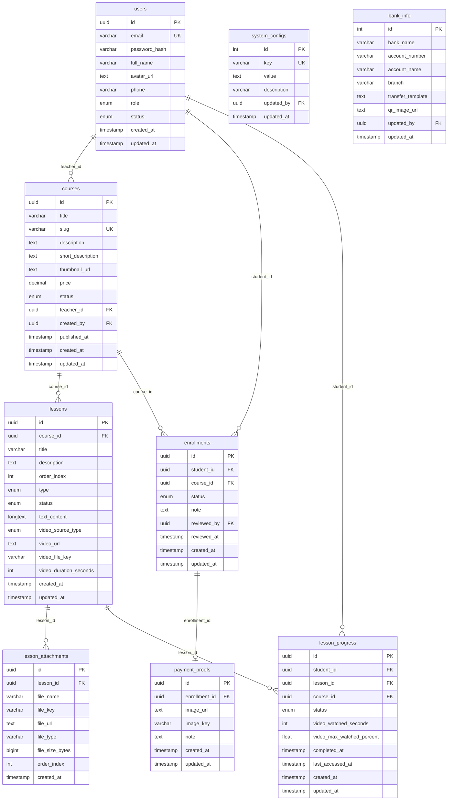

# Knowhow — AI

> File tổng hợp text từ workspace.


---
**Nguồn:** `Kinh nghiệm đào tạo\HongTT1_Su dung cursor hieu qua 1.pdf`

Sử dụng cursor hiệu quả
Trình bày: HongTT1 (SBU1)
Hà Nội, 12/2025
Đối tượng: BrSE, Tester chưa biết kỹ thuật
Confidential
AGENDA
Confidential 2
STT Mục lục
1 Cách cài đặt cursor ide
2 Một số case cơ bản khi muốn phân tích spec
3 Một số yêu cầu cần có trong prompt
4 Ví dụ cụ thể
Cài đặt Cursor IDE
Confidential 3
• Step 1: Download tại 
https://cursor.com/download
• Step 2: Chạy file .exe vừa down về (nhờ anh 
HuyND bên IT để cài vì cần yêu cầu 
user/pass của admin)
• Step 3: Mở Cursor IDE lên → sau đó click 
vào icon bánh xe (Setting) ở góc trên bên 
phải màn hình → Click để login với account 
cursor mà PM cung cấp
• Step 4: Clone code của dự án (request vơí 
PM để được add vào bitbucket)
• Step 5: Click Ctrl + L để mở box chat với AI

Một số case cơ bản khi muốn phân tích spec
• Phân tích màn hình list cho chức năng search
• Phân tích màn hình list có nhiều tab
• Phân tích màn hình form (Add/edit)
• Phân tích logic của từng button
• Phân tích một function cụ thể trong code
• Phân tích các case lỗi có thể có của function cụ thể trong code
• Phân tích luồng điều hướng trong màn hình (sreen flow)
• …
Confidential 4
Một số yêu cầu “nên có” cho mọi prompt
• Ouput phải viết bằng tiếng Việt, các message lỗi/tên lable/button/menu 
phải giữ nguyên tiếng Nhật như trên màn hình
• Nếu output có liên quan đến hằng số (const) thì cần phải viết thêm cả giá 
trị của hằng số đó
• Cursor phải review lại output và verify với code thực tế để đảm bảo 
tính chính xác 100%
• Phân tích TẤT CẢ các sub-function liên quan
• Không tự giả định bất kỳ logic nào
• Check kỹ tên các cột và các bảng trong database
• Verify với source code thực tế trước khi output
• …
Confidential 5
Nếu ouput chưa rõ ràng, chi tiết chỗ nào thì hãy hỏi lại AI logic chỗ đó để AI chỉ ra chi tiết hơn theo đúng mong 
muốn của mình
Phân tích màn hình list có search và table
Cách sử dụng:
Khi cần phân tích spec chi tiết cho màn hình 
list có search và hiển thị data trên table
Prompt mẫu:
Xem tại đây 
Confidential 6

Prompt trên tốt ở đâu?
• Yêu cầu đầy đủ các thành phần (mục đích, files, tables, buttons)
• Phân tích chi tiết search fields (là option cố định hay từ sql)
• Output SQL đầy đủ (với tất cả search conditions)
• Mapping column trên màn hình với tên cột và bảng trong database
• Phân tích button đầy đủ (điều kiện hiển thị, logic tác động)
• Review lại toàn bộ output sau khi phân tích xong
Confidential 7
Phân tích màn hình form (tạo/edit)
Cách sử dụng:
Khi cần phân tích spec chi tiết cho màn hình 
tạo mới hoặc chỉnh sửa
Prompt mẫu:
Xem tại đây 
Confidential 8

Phân tích đoạn code bất kỳ
Prompt mẫu: (bôi đen đoạn code và bấm Ctrl+ L)
YÊU CẦU: 
- Đọc kỹ TOÀN BỘ đoạn code được cung cấp, KHÔNG bỏ sót dòng nào 
- Xác định mục đích chính của đoạn code này (làm gì, để phục vụ 
mục đích gì) 
- Phân tích logic xử lý từng bước (step by step, dễ hiểu)
- Trace TẤT CẢ các biến được sử dụng (input, trung gian, output) 
- Trace TẤT CẢ các sub-functions, helper functions, methods được 
gọi 
- Phân tích tất cả các điều kiện if/else, switch case, loop 
- Nếu có database operations, chỉ ra bảng, cột, SQL (chính xác 
100%) 
- Nếu có xử lý lỗi, phân tích các trường hợp lỗi 
- Sử dụng ví dụ cụ thể nếu có thể 
- Viết bằng tiếng Việt, dùng ngôn ngữ đơn giản, dễ hiểu 
**QUAN TRỌNG**: - Phân tích TẤT CẢ các sub-function liên quan để 
thông tin output được chính xác - Thông tin phân tích ra phải chính 
xác 100% so với source code - Không tự giả định bất kỳ logic nào - Sau 
khi phân tích xong, BẮT BUỘC review lại toàn bộ và verify với code 
thực tế 
Confidential 9

Một số trường hợp khác
Confidential 10

Một số trường hợp khác
Confidential 11

Một số chú ý cho các dự án tromg cụm IT&EX
Dự án Renew
• Với màn hình nào có /communication/… thì view màn hình check tại source code 
của folder renew_hogos_web
• Toàn bộ các API đều nằm ở folder renew_hogos_fdb_ex
Dự án GOKU
• Vì query cả thông tin database của FDB nên trong prompt cần có thêm câu “Hãy 
check lại kỹ tên các cột và các bảng đảm bảo thông tin đưa ra chính xác. Trong câu 
sql, nếu table của FDB thì hiển thị {FDB}.tên table, nếu table của GOKU thì chỉ cần 
hiển thị tên table là đủ”
Dự án JJ
• Với màn hình của role user thì làm cả PC và mobile và nằm ở 2 file controller khác 
nhau nên khi dung AI phân tích cần chú ý điều này
Confidential 12
Một số chú ý khác
• Không hoàn toàn tin tưởng vào kết quả do AI đưa ra
→ Luôn review kết quả từ AI đặc biệt với logic nghiệp vụ phức tạp
• Cung cấp context đầy đủ
→ Cung cấp cho AI nhiều thông tin để kết quả được chính xác hơn
• Đặt câu hỏi cụ thể
→ Câu hỏi càng cụ thể, câu trả lời càng hữu ích
• Lặp lại
→ Nếu kết quả chưa đúng ý, hỏi lại với thông tin bổ sung và cung cấp thông tin chi tiết hơn
• Lưu lại các prompt hay
→ Tạo file lưu lại các prompt hay để tái sử dụng và cải thiện dần
• Học từ output của AI
→ Xem cách AI phân tích để học cách tư duy + cải thiện kỹ năng đặt câu hỏi dựa trên kết quả
• Sử dụng @ để định kèm file trong cửa sổ chat
→ Output của AI đưa ra chính xác hơn
Confidential 13
Q&A

THANK YOU


---
**Nguồn:** `Kinh nghiệm đào tạo\List_has_search_table.md`

Hãy phân tích TOÀN BỘ spec cho màn hình LIST có URL: [URL_MÀN_HÌNH]
Role đang login: [ROLE_NAME]

YÊU CẦU CHI TIẾT:

⚠️ LƯU Ý QUAN TRỌNG VỀ NGÔN NGỮ:
- Tài liệu output phải viết bằng TIẾNG VIỆT
- Các thông tin sau phải viết bằng TIẾNG NHẬT (tham khảo file `renew_hogos_fdb_ex\02_source\webapp\app\Locale\jpn\LC_MESSAGES\default.po`):
  * Tên màn hình (screen name, page title)
  * Label của các field (field labels)
  * Title của buttons, links
  * Message lỗi (error messages)
  * Message thành công (success messages)
  * Menu items
  * Tooltips, hints
  * Validation messages
- Với mỗi text tiếng Nhật, PHẢI tìm trong file default.po để lấy chính xác msgstr tương ứng với msgid

1. MỤC ĐÍCH VÀ FILE LIÊN QUAN:
   - Nêu rõ mục đích của màn hình này là gì (chức năng chính)
   - Tên màn hình (bằng tiếng Nhật, chính xác từ view code hoặc default.po)
   - Xác định file View được sử dụng (chính xác file path)
   - Xác định Controller xử lý (chính xác class và method)
   - Kiểm tra xem có sử dụng Shell/Batch/Cronjob không (nếu có, ghi rõ file path và schedule)

2. DATABASE TABLES:
   - Liệt kê TẤT CẢ các tables được sử dụng trong màn hình này
   - PHẢI check trong queries, models, không được đoán

3. SEARCH FIELDS:
   - Liệt kê TẤT CẢ các field search trên màn hình
   - Với mỗi search field, phân tích:
     
     a) Field Information: Tên field/label (bằng tiếng Nhật, chính xác từ view code hoặc default.po)
     
     b) Dropdown/Radio/Checkbox Options:
     - Nếu là dropdown/radio/checkbox, PHẢI xác định:
       * Giá trị default được select (chính xác từ code)
       * Có "Please select" hoặc "None" option không? (chính xác từ code, label bằng tiếng Nhật)
       * Options là cố định (hardcode) hay lấy từ database?
       * Nếu cố định: liệt kê TẤT CẢ options (value và label bằng tiếng Nhật, chính xác từ code)
       * Nếu từ database: chỉ ra SQL query lấy options (chính xác 100% từ code)
       * Table và column chứa options (chính xác 100%)
       * Value và Label mapping (chính xác từ code, label bằng tiếng Nhật)
     
     c) Search Logic:
     - Cách field này được sử dụng trong search (LIKE, =, IN, BETWEEN, etc.)
     - Điều kiện search (chính xác từ code)
     - Có required hay optional không (chính xác từ code)

4. SQL QUERY ĐẦY ĐỦ:
   - Tạo câu SQL đầy đủ với TẤT CẢ các search fields
   - PHẢI dựa vào code thực tế, không được tự tạo SQL
   - Nếu có dynamic SQL, ghi rõ logic build SQL (chính xác từ code)

5. TABLE COLUMNS VÀ MAPPING:
   - Liệt kê TẤT CẢ các cột hiển thị trên table
   - Với mỗi cột, phân tích:
     * Tên cột hiển thị và ý nghĩa của cột
     * Mapping với database:
       - Tên cột và bảng trong database (chính xác 100%)
       - Có transformation/formatting không (date format, number format, etc.)
       - Có join/calculation không (nếu có, ghi rõ công thức)
     * Nếu có sử dụng constants để map giá trị, ghi rõ:
       - Tên constant và giá trị của nó (chính xác từ code)

6. BUTTONS VÀ ACTIONS:
   - Liệt kê TẤT CẢ các buttons trên màn hình
   - Với mỗi button, phân tích:
     
     a) Button Information:
     - Tên button/label (bằng tiếng Nhật, chính xác từ view code hoặc default.po)
     - Button này dùng để làm gì? (chính xác từ code)
     
     b) Điều kiện Ẩn/Hiện, Enable/Disable:
     - Có điều kiện ẩn/hiện không? (chính xác điều kiện từ code)
     - Logic ẩn/hiện (role-based, data-based, state-based, chính xác từ code)
     
     c) Logic khi click: mô tả rõ logic nghiệp vụ  (step by step, không bỏ sót)
     
     d) Database Impact:
     - Table nào, cột nào bị tác động? (chính xác tên bảng)
     - Câu SQL đầy đủ thực hiện operation (chính xác 100% từ code)

7. LOGIC ĐẶC BIỆT:
   - Phân tích TẤT CẢ các logic đặc biệt:
     * Logic màu sắc (row colors, cell colors, chính xác điều kiện từ code)
     * Logic điều kiện enable/disable (ngoài buttons, các elements khác)
     * Quyền hạn truy cập (role-based permissions, chính xác từ code)
     * Conditional display (elements ẩn/hiện dựa trên điều kiện, chính xác từ code)
     * Export functionality (nếu có, chính xác từ code)
     * Bulk actions (nếu có, chính xác từ code)

8. PHẢI đọc code thực tế, KHÔNG được giả định:
   - Đọc view code để tìm search fields, table columns, buttons
   - Đọc Controller code để tìm search logic, data loading
   - Đọc Service/Model code để tìm business logic, database queries
   - Đọc JavaScript code (nếu có) để tìm frontend logic
   - Trace TẤT CẢ sub-functions, helper functions

9. SAU KHI PHÂN TÍCH XONG, BẮT BUỘC REVIEW LẠI:
   - Verify mục đích màn hình với code
   - Verify tên bảng/cột đã chính xác 100% chưa
   - Verify SQL queries đã chính xác 100% chưa
   - Verify search fields options đã chính xác chưa
   - Verify table columns mapping đã chính xác chưa
   - Verify buttons logic đã chính xác chưa
   - Verify database impact SQL đã chính xác chưa
   - Verify logic đặc biệt đã chính xác chưa
   - Đảm bảo không có thông tin nào bị bỏ sót
   - Đảm bảo không có thông tin nào được giả định


---
**Nguồn:** `Kinh nghiệm đào tạo\MORGK_01 - Report - Tuần 1.xlsx`

## Sheet: Sheet1
184 | 講師登壇カレンダー（一覧） | tbl_tantoukoushis | calendar_collective
185 | 講師登壇カレンダー（個別） | tbl_tantoukoushis | calendar_individual
186 | 講師選択ダイアログ | tbl_tantoukoushis | view_dia_select
187 | （NG登録） | tbl_tantoukoushis | registerNg
188 | （NG削除） | tbl_tantoukoushis | destroyNg
203 | 空き講師検索 | tbl_tantoukoushis | calendar_available
437 | 講師プロフィール | tbl_tantoukoushis | getProfil
456 | 講師予定ダイアログ | tbl_tantoukoushis | yotei_dia
553 | 講師登壇カレンダーExcel出力 | tbl_tantoukoushis | exceldl
555 | 講師プロフィールデータ | tbl_tantoukoushis | getProfilData
587 | 講師予定登録・修正・削除ダイアログ | tbl_tantoukoushis | koushi_ng_dia
591 | 講師予定検索 | tbl_tantoukoushis | schedule_registration
596 | （再受注申請中チェック） | tbl_tantoukoushis | check_saijuchuu_shinseichuu
659 | 講師登壇可能日検索 | tbl_tantoukoushis | koushi_free_dates_search
660 | 講師登壇可能日編集 | tbl_tantoukoushis | koushi_free_dates_add
661 | 講師登壇可能日CSV一括取込み | tbl_tantoukoushis | koushi_free_dates_csv_ikkatsu_read
662 | CSV出力 | tbl_tantoukoushis | csvdl
## Sheet: summary
No | Task | Estimate | Actual
DEV | DEV | Số lượng comment code | Số lượng line code | Số lượng Bug | Note
Memo (h) | Code(h) | Self-Review(h) | Unit test (h) | Fix Bug | Review Code | Total | Memo (h) | Code(h) | Self-Review(h) | Unit test (h) | Fix Bug | Review Code | Total | Actual/Estiamte
1 | [MORGK-14]Top Page | 38.4 | 64 | 12.8 | 19.2 | 134.4 | 32 | 59.5 | 12.8 | 11.2 | 115.5 | 0.859375 | VietTV
2 | [MORGK-173]集計対象の設定 | 1.5 | 4 | 1 | 1.5 | 8 | 1.5 | 4 | 1 | 1.5 | 8 | 1 | DuyTV
3 | MORGK-174	CT目標達成率ライン変更 | 1.3 | 8 | 1 | 1.3 | 11.600000000000001 | 1.3 | 8 | 1 | 1.3 | 11.600000000000001 | 1
4 | MORGK-175	順位公表対象の変更 | 1.3 | 4 | 1 | 1.3 | 7.6 | 1.3 | 4 | 1 | 1.3 | 7.6 | 1
5 | MORGK-176	教科書準拠設定 | 1.3 | 4 | 1 | 1.3 | 7.6 | 1.3 | 4 | 1 | 1.3 | 7.6 | 1
MORGK-177	修了率の項目変更 | 1.3 | 8 | 1 | 1.3 | 11.600000000000001 | 1.3 | 8 | 1 | 1.3 | 11.600000000000001 | 1
MORGK-178	英検日程等の設定 | 1.3 | 3.3 | 1 | 1 | 6.6 | 3 | 4 | 1 | 1 | 9 | 1.3636363636363638
MORGK-180	適正進度の設定 | 2 | 4 | 4.15 | 1 | 11.15 | 2 | 4 | 4.15 | 1 | 11.15 | 1
MORGK-181	FS算数で復習が必要な単元登録 | 1.3 | 4 | 1 | 1.3 | 7.6 | 1.3 | 4 | 1 | 1.3 | 7.6 | 1
MORGK-183	お知らせテンプレート設定 | 0.3 | 1.45 | 0.3 | 1 | 3.05 | 0.3 | 1.45 | 0.3 | 1 | 3.05 | 1
0 | 0 | #DIV/0!
Total | 49.99999999999998 | 104.75 | 24.250000000000004 | 30.200000000000003 | 0 | 0 | 209.2 | 45.29999999999998 | 100.95 | 24.250000000000004 | 22.200000000000003 | 0 | 0 | 192.7
Percent | 0.2390057361376672 | 0.500717017208413 | 0.11591778202676867 | 0.14435946462715107 | 0 | 0 | 0.235080435910742 | 0.5238713025428127 | 0.12584327970939285 | 0.11520498183705244 | 0 | 0 | 0 | 0 | 0
AVG | #DIV/0!
Đánh giá tổng quan
0
## Sheet: Memo
Task | Estimate (h) | Actual (h)
[MORGK-14]Top Page | 38.4 | 32
[MORGK-173]集計対象の設定 | 1.5 | 1.5
MORGK-174	CT目標達成率ライン変更 | 1.3 | 1.3
MORGK-175	順位公表対象の変更 | 1.3 | 1.3
MORGK-176	教科書準拠設定 | 1.3 | 1.3
MORGK-177	修了率の項目変更 | 1.3 | 1.3
MORGK-178	英検日程等の設定 | 1.3 | 3
MORGK-180	適正進度の設定 | 2 | 2
MORGK-181	FS算数で復習が必要な単元登録 | 1.3 | 1.3
MORGK-183	お知らせテンプレート設定 | 0.3 | 0.3
0 | 0 | 0
Thời gian memo đang ít hơn công số estimate
## Sheet: Code
Task | Estimate (h) | Actual (h)
[MORGK-14]Top Page | 64 | 59.5
[MORGK-173]集計対象の設定 | 4 | 4
MORGK-174	CT目標達成率ライン変更 | 8 | 8
MORGK-175	順位公表対象の変更 | 4 | 4
MORGK-176	教科書準拠設定 | 4 | 4
MORGK-177	修了率の項目変更 | 8 | 8
MORGK-178	英検日程等の設定 | 3.3 | 4
MORGK-180	適正進度の設定 | 4 | 4
MORGK-181	FS算数で復習が必要な単元登録 | 4 | 4
MORGK-183	お知らせテンプレート設定 | 1.45 | 1.45
0 | 0 | 0
Công số code đang ít hơn công số estimate
## Sheet: SelfReview
Task | Estimate (h) | Actual (h)
[MORGK-14]Top Page | 12.8 | 12.8
[MORGK-173]集計対象の設定 | 1 | 1
MORGK-174	CT目標達成率ライン変更 | 1 | 1
MORGK-175	順位公表対象の変更 | 1 | 1
MORGK-176	教科書準拠設定 | 1 | 1
MORGK-177	修了率の項目変更 | 1 | 1
MORGK-178	英検日程等の設定 | 1 | 1
MORGK-180	適正進度の設定 | 4.15 | 4.15
MORGK-181	FS算数で復習が必要な単元登録 | 1 | 1
MORGK-183	お知らせテンプレート設定 | 0.3 | 0.3
0 | 0 | 0
Công số self review đang ít hơn công số estimate
## Sheet: Unit Test
Task | Estimate (h) | Actual (h)
[MORGK-14]Top Page | 19.2 | 11.2
[MORGK-173]集計対象の設定 | 1.5 | 1.5
MORGK-174	CT目標達成率ライン変更 | 1.3 | 1.3
MORGK-175	順位公表対象の変更 | 1.3 | 1.3
MORGK-176	教科書準拠設定 | 1.3 | 1.3
MORGK-177	修了率の項目変更 | 1.3 | 1.3
MORGK-178	英検日程等の設定 | 1 | 1
MORGK-180	適正進度の設定 | 1 | 1
MORGK-181	FS算数で復習が必要な単元登録 | 1.3 | 1.3
MORGK-183	お知らせテンプレート設定 | 1 | 1
0 | 0 | 0
Công số init test đang ít hơn công số estimate
## Sheet: Fixbug
Task | Estimate (h) | Actual (h)
[MORGK-14]Top Page | 0 | 0
[MORGK-173]集計対象の設定 | 0 | 0
MORGK-174	CT目標達成率ライン変更 | 0 | 0
MORGK-175	順位公表対象の変更 | 0 | 0
MORGK-176	教科書準拠設定 | 0 | 0
MORGK-177	修了率の項目変更 | 0 | 0
MORGK-178	英検日程等の設定 | 0 | 0
MORGK-180	適正進度の設定 | 0 | 0
MORGK-181	FS算数で復習が必要な単元登録 | 0 | 0
MORGK-183	お知らせテンプレート設定 | 0 | 0
0 | 0 | 0
Công số fix bug đang ít hơn công số estimate
## Sheet: Review Code
Task | Estimate (h) | Actual (h)
[MORGK-14]Top Page | 0 | 0
[MORGK-173]集計対象の設定 | 0 | 0
MORGK-174	CT目標達成率ライン変更 | 0 | 0
MORGK-175	順位公表対象の変更 | 0 | 0
MORGK-176	教科書準拠設定 | 0 | 0
MORGK-177	修了率の項目変更 | 0 | 0
MORGK-178	英検日程等の設定 | 0 | 0
MORGK-180	適正進度の設定 | 0 | 0
MORGK-181	FS算数で復習が必要な単元登録 | 0 | 0
MORGK-183	お知らせテンプレート設定 | 0 | 0
0 | 0 | 0
Công số review code có xu hướng bằng với công số esimate
## Sheet: Comment code
Task | Số lượng comment | Tuần | Số lượng comment
[MORGK-14]Top Page | 0 | 1 | 216
[MORGK-173]集計対象の設定 | 0 | 2 | 103
MORGK-174	CT目標達成率ライン変更 | 0 | 3 | 89
MORGK-175	順位公表対象の変更 | 0 | 4 | 100
MORGK-176	教科書準拠設定 | 0 | 5-6 | 186
MORGK-177	修了率の項目変更 | 0 | 7 | 71
MORGK-178	英検日程等の設定 | 0 | 8 | 44
MORGK-180	適正進度の設定 | 0
MORGK-181	FS算数で復習が必要な単元登録 | 0
MORGK-183	お知らせテンプレート設定 | 0
0 | 0
## Sheet: Total
Task | Estimate (h) | Actual (h)
[MORGK-14]Top Page | 134.4 | 115.5
[MORGK-173]集計対象の設定 | 8 | 8
MORGK-174	CT目標達成率ライン変更 | 11.600000000000001 | 11.600000000000001
MORGK-175	順位公表対象の変更 | 7.6 | 7.6
MORGK-176	教科書準拠設定 | 7.6 | 7.6
MORGK-177	修了率の項目変更 | 11.600000000000001 | 11.600000000000001
MORGK-178	英検日程等の設定 | 6.6 | 9
MORGK-180	適正進度の設定 | 11.15 | 11.15
MORGK-181	FS算数で復習が必要な単元登録 | 7.6 | 7.6
MORGK-183	お知らせテンプレート設定 | 3.05 | 3.05
0 | 0 | 0
## Sheet: Setting
TYPE | Category | Assignee | Level | Priority | Version | Milestones | Status
-- | -- | -- | -- | -- | -- | -- | --
Epic | API | DatBT | 1 | 1 | POC | 1 | To do
Story | FE | CuongMN | 2 | 2 | 2 | In Progress
Task | Base | NgaHQ | 3 | 3 | 3 | Resolved
Sub-Task | ML | ThuyTT | 4 | 4 | 4 | Done
Bug | Doc | SonNDC | 5 | 5 | 5 | Rejected
FExAPI | TungPN | 6
NguyenQT | 7
UyenNTT | 8
TuanHT | 9
VietLV | 10
QuangNV | 11
ChungDD | 12
BinhTV | 13
HuyHV | 14
## Sheet: Performance member tuần
Member | Line code xử lý được | Performance mục tiêu/ngày | Performance thực tế/ngày
(Bao gồm cả self-review) | Estimate (h) | Actual (h) | Độ lệch
Tổng | Code + Self Review | Tổng | Code + Self Review
VietTV | 0 | 1000 | 0 | 134.4 | 76.8 | 115.5 | 72.3 | 0.859375
DuyTV | 0 | 1000 | 0 | 8 | 5 | 8 | 5 | 1
AnhND2 | 0 | 1000 | #DIV/0! | 0 | 0 | 0 | 0 | #DIV/0!
SonNT4 | 0 | 1000 | #DIV/0! | 0 | 0 | 0 | 0 | #DIV/0!
## Sheet: Performance member luỹ kế
Member | Line code xử lý được | Performance mục tiêu/ngày | Performance thực tế/ngày
(Bao gồm cả self-review) | Estimate (h) | Actual (h) | Độ lệch
Tổng | Code + Self Review | Tổng | Code + Self Review
VietTV | 1000 | #DIV/0! | #DIV/0!
DuyTV | 1000 | #DIV/0! | #DIV/0!
AnhND2 | 1000 | #DIV/0! | #DIV/0!
SonNT4 | 1000 | #DIV/0! | #DIV/0!
0 | 0
#DIV/0!


---
**Nguồn:** `Kinh nghiệm đào tạo\Trainning PM_NgaNTQ.pptx`

## Slide 1
IT&EX Trainning
NgaNTQ – 3/5/2024
Confidential
## Slide 2
AGENDA
Confidential
‹#›
## Slide 3
Quản lý Scope
Confidential
‹#›
## Slide 4
Confidential
‹#›
Quản lý phạm vi (Scope Management) của một dự án giống như lái một chiếc ô tô. 
Nếu bạn không để mắt tới phía trước, chiếc xe sẽ lệch khỏi đường. 
Nếu bạn không kiểm soát phạm vi dự án của mình, dự án sẽ đi chệch hướng. 
Việc quản lý phạm vi dự án hiệu quả sẽ đóng một vai trò quan trọng trong việc giữ cho dự án của bạn trong các giới hạn cụ thể.
## Slide 5
Scope là gì?
Confidential
‹#›
Tất cả các công việc/hoạt động cần thiết thực hiện để hoàn thành dự án.​
Không phải hoạt động nào cũng tạo ra giá trị cho sản phẩm bàn giao (Deliverables)​
Không phải hoạt động nào tạo ra giá trị cho sản phẩm bàn giao cũng thuộc về Scope và phải thực hiện.
## Slide 6
Product Scope
Là những tính năng, chức năng đưa vào trong sản phẩm hoặc dịch vụ.
Project Scope
Tất cả các công việc cần được thực hiện để cung cấp sản phẩm, dịch vụ hoặc thành quả với các chức năng hoặc tính năng được chỉ định. Mức độ hoàn thành của từng công việc được đánh giá dựa trên kế hoạch quản lý dự án.
Đôi khi Project scope được coi là bao gồm cả Product scope.
Confidential
‹#›
## Slide 7
Các bước quản lý Scope
Confidential
‹#›
Lên kế hoạch quản lý scope như thế nào trong dự án
Thu thập toàn bộ yêu cầu của các bên liên quan đến dự án.- Phân tích các tài liệu khách hàng gửi- Họp với khách hàng để clear yêu cầu- Làm Prototypes hoặc các diagrams.
Phân rã các đầu việc thành các công việc nhỏ hơn
Kiểm soát trạng thái và thay đổi của các công việc
Bàn giao sản phẩm cho khách hàng
## Slide 8
Quản lý Scope trong DOJO
Confidential
‹#›
Lên kế hoạch quản lý scope như thế nào trong dự án- KH quản lý yêu cầu trên Backlog vvafBrSE sẽ đẩy về Jira tương ứng.
Thu thập toàn bộ yêu cầu của các bên liên quan đến dự án.- Họp với khách hàng để clear specs nếu chưa hiểu.- Đối với các task khó thì có thể tiến hành điều tra, làm tài liệu trước để trao đổi khách hàng.
Chốt với khách hàng các task mình sẽ làm trong milestone.
Phân rã các đầu việc thành các công việc nhỏ hơn- Làm phần tích task, đánh giá phạm vi ảnh hưởng đến các chức năng cụ thể nhỏ hơn.
Kiểm soát trạng thái và thay đổi của các công việc- Trong quá trình phát triển nếu có phát sinh thay đổi về yêu cầu thì cần update lại vào Jira tương ứng và phân tích task.
Bàn giao sản phẩm cho khách hàng- Kiểm soát các feedback của khách hàng trong quá trình nghiệm thu.
## Slide 9
Product Creep
Là quá trình thay đổi không chính thức, tăng dần từ các thay đổi bé nhỏ không đáng kể, xuất phát từ thay đổi yêu cầu của khách hàng. Dẫn tới không kiểm soát được thay đổi
Gold Plating
Là việc thêm các tính năng vào dự án mà không xuất phát từ yêu cầu. Thường là do ý tốt hoặc sự hiểu nhầm của thành viên trong dự án.
Confidential
‹#›
## Slide 10
Phòng tránh Scope creep
Confidential
‹#›
Phân tích, đánh giá đúng yêu cầu của task. Làm phần tích task đầy đủ để đảm bảo hiểu đúng về mặt scope.
Tuân thủ quy trình về Q&A để đảm bảo hiểu hết yêu cầu của task.
Khi phát sinh thay đổi so với yêu cầu mình đã phần tích từ đầu thì cần đánh giá lại:- Phạm vi ảnh hưởng, hướng xử lý của phần thay đổi.- Công số cần đối ứng cho phần thay đổi.- Thống nhất với các bên liên quan về việc thay đổi đó có độ ưu tiên xử lý như thế nào. Trao đổi với Team Lead, BrSE và PM
Thay đổi lại plan xử lý thay đổi phù hợp độ ưu tiên
## Slide 11
Phòng tránh Gold plating
Confidential
‹#›
Phân tích, đánh giá đúng yêu cầu của task. Làm phần tích task đầy đủ để đảm bảo hiểu đúng về mặt scope.
Tuân thủ quy trình về Q&A để đảm bảo hiểu hết yêu cầu của task.
Khi phát sinh thay đổi so với yêu cầu mình đã phần tích từ đầu thì cần đánh giá lại:- Phạm vi ảnh hưởng, hướng xử lý của phần thay đổi.- Công số cần đối ứng cho phần thay đổi.- Thống nhất với các bên liên quan về việc thay đổi đó có độ ưu tiên xử lý như thế nào. Trao đổi với Team Lead, BrSE và PM
Thay đổi lại plan xử lý thay đổi phù hợp độ ưu tiên
## Slide 12
Quản lý Schedule
Confidential
‹#›
## Slide 13
Quản lý tiến độ dự án là gì?
Confidential
‹#›
Quản lý tiến độ dự án là quá trình duy trì, phát triển, quản lý và kiểm soát các lịch trình của dự án về khía cạnh thời gian và nguồn lực để hoàn thành dự án.
Lịch trình thể hiện tiến độ dự án phải bao gồm:- Ước tính thời gian (thời lượng) cho tất cả các nhiệm vụ của dự án- Ngày bắt đầu và ngày kết thúc cho các nhiệm vụ- Tên người chịu trách nhiệm hoàn thành nhiệm vụ- Trình tự các nhiệm vụ.
## Slide 14
Các bước xây dựng lịch trình để quản lý tiến độ dự án
Confidential
‹#›
Xác định các nhiệm vụ cần phải thực hiện trong lịch trình của dự án.
Xác định mối quan hệ giữa các nhiệm vụ
Giao từng nhiệm vụ cho từng nhân viên cụ thể
Đo lường khối lượng công việc cần thực hiện
Cân nhắc đến các yếu tố khác gây ảnh hưởng đến tiến độ của dự án
Xây dựng dự phòng thời gian cho các trường hợp bất thường 
Lên lịch trình cho toàn bộ công việc
Kiểm tra xem nhân viên có được phân chia công việc quá mức hay không
Lặp lại từ bước 3 cho đến khi dự án được thực hiện ổn định
## Slide 15
Áp dụng trong dự án DOJO
Confidential
‹#›
Xác định các nhiệm vụ cần phải thực hiện trong lịch trình của dự án- Là các task đã chốt với khách làm trong từng milestone (Scope)
Xác định mối quan hệ giữa các nhiệm vụ- Xác định các rang buộc giữa các task. Task nào làm xong trước thì mới tiến hành được task sau.
Giao từng nhiệm vụ cho từng nhân viên cụ thể- PM dựa vào estimate assign về cho từng member cụ thể.- Đã tính toán đến thời gian tham gia dự án.
Đo lường khối lượng công việc cần thực hiện- Chia thành các subtask trong task chính- Estimate công số cần hoàn thiện cho từng subtask- Điền Estimate cho từng subtask
## Slide 16
Áp dụng trong dự án DOJO (tiếp)
Confidential
‹#›
Cân nhắc đến các yếu tố khác gây ảnh hưởng đến tiến độ của dự án- Đánh giá xem có yếu tố nào ảnh hưởng đến lịch trình hay không. Ví dụ như specs sơ sài, có phần cần điều tra thêm, hay khách hang đang cân nhắc thêm về yêu cầu …
Xây dựng dự phòng thời gian cho các trường hợp bất thường - Đánh giá xem có rủi ro gì có thể phát sinh không, thêm time buffer
Liên lịch trình cho toàn bộ công việc- Lên lịch trình cho toàn bộ task, subtask được assign.
Kiểm tra xem nhân viên có được phân chia công việc quá mức hay không- PM check lại plan của từng member xem có bị over hay không- Điều chỉnh nếu thấy không đảm bảo lịch của milestone
Lặp lại từ bước 3 cho đến khi dự án được thực hiện ổn định
## Slide 17
Quản lý Quality
Confidential
‹#›
## Slide 18
Quản lý chất lượng là gì?
Confidential
‹#›
Quản lý chất lượng dự án bao gồm câc quy trình kết hợp các chính sách chất lượng của tổ chức liên quan đến lập kế hoạch, quản lý, và kiểm soát dự án và các yêu cầu chất lượng sản phẩm để đáp ứng mục tiêu của các bên liên quan.
## Slide 19
Các quy trình quản lý chất lượng dự án
Confidential
‹#›
Lập kế hoạch quản lý chất lượng dự án- Lập các tiêu chuẩn về chất lượng cho dự án và sản phẩm bàn giao.- Chú ý đến tiêu chí chấp nhận sản phẩm
Quản lý chất lượng của dự án- Thực thi để đánh giá chất lượng dự án, sản phẩm có đạt yêu cầu đề ra hay không?
Kiểm soát chất lượng- Đánh giá chất lượng dự án có đảm bảo không.- Phân tích và cải thiện chất lượng
## Slide 20
Tiêu chí chấp nhận sản phẩm của khách hàng
Confidential
‹#›
Hệ thống không lỗi (zero bug)
Hệ thống admin cần chạy trên các trình duyệt: admin (Chrome), mini (Chrome, Firefox, Safari)
App thì cần chạy trên device khách hàng gửi (Tablet android 5, Ipad iOS 11, Chromebook)
Test performance trước khi release
Đảm bảo về Security.
## Slide 21
Chất lượng trong dự án DOJO
Confidential
‹#›
## Slide 22
Hoạt động Kaizen chất lượng
Confidential
‹#›
Tổng hợp và phần tích bug
Đánh giá và đưa ra các action kaizen
## Slide 23
Stakeholder - Communications
Confidential
‹#›
## Slide 24
Stakeholder là ai?
Confidential
‹#›
Là các cá nhân, nhóm hay tổ chức mà:- Có thể ảnh hưởng trực tiếp hoặc gián tiếp đến dự án- Bị ảnh hưởng bởi dự án
## Slide 25
Tại sao phải quản lý Stakeholder?
Confidential
‹#›
Quản lý Stakeholder tốt và phù hợp sẽ làm giảm thiểu rủi ro cho dự án. 
Sự hài lòng của các Stakeholder là một trong những mục tiêu quan trọng của dự án => tăng mức độ thành công của dự án
## Slide 26
Có những loại Stakeholders nào?
Internal stakeholders là những người ở trong nội bộ tổ chức. 
Dự án trực tiếp ảnh hưởng tới họ khi họ cũng tham gia dự án hoặc họ được thuê bởi tổ chức quản lý dự án đó. 
Những stakeholders đó bao gồm: nhân viên, sếp, ban lãnh đạo, nhà quản lý dự án, nhà đầu tư v.v.
External stakeholders là những người nằm ngoài tổ chức và họ gián tiếp bị ảnh hưởng bởi dự án. 
Những người này có thể là nhà cung cấp, khách hàng, bên thứ 3, đối thủ, xã hội, chính phủ v.v.
Confidential
‹#›
Internal stakeholders
External stakeholders.
## Slide 27
Quản lý Stakeholders như thế nào?
Confidential
‹#›
Xác định Stakeholders
Lên kế hoạch về sự tham gia, đóng góp của Stakeholders
Quản lý sự đóng góp, tham dự của Stakeholders
Giám sát hoạt động của Stakeholders
## Slide 28
Quản lý Communications là gì?
Confidential
‹#›
Quản lý truyền thông dự án bao gồm các quá trình cần thiết để đảm bảo rằng nhu cầu thông tin của dự án và các bên liên quan được đáp ứng và đạt được hiệu quả trao đổi thông tin. 
Quản lý truyền thông dự án bao gồm hai phần:- Phần đầu tiên là phát triển một chiến lược để đảm bảo truyền thông giao tiếp hiệu quả cho các bên liên quan.- Phần thứ hai là thực hiện các hoạt động cần thiết để thực hiện chiến lược truyền thông.
## Slide 29
Quản lý Communications như thế nào?
Confidential
‹#›
Lên kế hoạch quản lý Communications- Xác định nhu cầu truyền thông từ các bên liên quan- Xác định được người chịu trách nhiệm trong các khâu truyền thông- Các phương pháp và công nghệ được sử dụng trong truyền thông dự án.
Triển khai Communications trong dự án để đảm bảo theo kế hoạch
Kiểm soát Communications trong dự án
## Slide 30
DOJO: Stakeholder - Communications như thế nào?
Confidential
‹#›
Stakeholder- Khách hàng- Các sếp: CTO, BOD của SBU, Trưởng bộ phận liên quan, Sales- Team member trong dự án- Các bộ phận hỗ trợ như: IT, HCNS
Communications- Khách hàng: Họp khi cần thiết, không cố định. Khách hàng thích giao tiếp trực tiếp.- Daily hàng ngày- Có rule về Q&A- Họp tổng kết quý- Khi có rủi ro hoặc vấn đề chưa báo cáo được chi tiết và kịp thời- Cần tuần thủ việc báo cáo định kỳ khi có sự cố trên Production.
## Slide 31
DOJO: Stakeholder - Communications như thế nào?
Confidential
‹#›
## Slide 32
Quản lý Risk
Confidential
‹#›
## Slide 33
Rủi ro là gì?
Confidential
‹#›
Rủi ro (risk) là sự kiện hoặc tình huống không mong muốn có thể xảy ra và gây ảnh hưởng đến mục tiêu, kết quả hoặc tiến độ của một hoạt động hay dự án. 
Rủi ro có thể làm tăng chi phí, làm chậm tiến độ, giảm chất lượng sản phẩm hoặc dịch vụ, hoặc gây tổn thất khác đến dự án hoặc tổ chức. 
Tất cả các dự án đều có một số mức độ rủi ro, do đó việc quản lý rủi ro là rất quan trọng để giảm thiểu tác động tiêu cực của rủi ro đến dự án
## Slide 34
Risk vs Issue
‹#›
Risk
 Risk là 1 sự kiện or 1 điều kiện không chắc chắn nhưng nếu xảy ra thì sẽ ảnh hưởng tới mục tiêu của dự án.
 Hiện tại chưa xảy ra, và không chắc chắn xảy ra ở tương lai.
Issue
 Risk xảy ra thì gọi là issue.
 Đã xảy ra và tác động đến dự án.
## Slide 35
Các thuộc tính của rủi ro
Confidential
‹#›
Khả năng xảy ra (Probability~Likelihood)  => 0% < Probability < 100% 
Mức độ ảnh hưởng (Impact)
## Slide 36
Threat or Opportunity
Confidential
‹#›
Threat – Nguy cơ  - Risk xảy ra thì ảnh hưởng xấu đến dự án 
Opportunity – Cơ hội- Risk xảy ra thì tác động tốt đến dự án
## Slide 37
Quản lý rủi ro dự án là gì?
Confidential
‹#›
Quản lý rủi ro là một quá trình quan trọng trong quản lý dự án nhằm xác định, đánh giá, và quản lý các rủi ro tiềm năng có thể xảy ra trong quá trình thực hiện dự án. 
Mục đích của quản lý rủi ro là đảm bảo rằng dự án sẽ được triển khai thành công một cách hiệu quả, giảm thiểu rủi ro và đảm bảo tính khả thi của dự án.
## Slide 38
Quy trình quản lý rủi ro trong dự án
Confidential
‹#›
Xác định các rủi ro tiềm ẩn. 
Đánh giá rủi ro dự án
Phát triển kế hoạch quản lý rủi ro dự án
Thực thi kế hoạch quản lý rủi ro dự án
Giám sát và kiểm soát rủi ro dự án
Cập nhật kế hoạch quản lý rủi ro dự án
## Slide 39
Quy trình quản lý rủi ro trong DOJO
Confidential
‹#›
Chưa có quy trình quản lý rõ ràng
Mới chỉ có PM thường xuyên đánh giá rủi ro trong dự án
Mong muốn mọi member đều có mindset về quản lý rủi ro cho chính task của mình.
Mong muốn đánh giá được các task mình triển khai có thể có các rủi ro nào.
Mong muốn Team lead và BrSE có thể đánh giá tổng thể rủi ro của toàn milestone.
## Slide 40
DOJO - Các loại rủi ro trong dự án (tiếp)
Confidential
‹#›
Rủi ro kỹ thuật: - Đây là các rủi ro liên quan đến công nghệ, phần mềm, phần cứng, mạng và các yếu tố kỹ thuật khác. - Ví dụ: lỗi phần mềm, vi rút máy tính, lỗi thiết bị, thay đổi kỹ thuật giữa các phiên bản … 
Rủi ro thời gian: - Các rủi ro này liên quan đến việc không hoàn thành dự án đúng thời hạn. Điều này có thể do trì hoãn trong quá trình phát triển hoặc sự cố bất ngờ..
Rủi ro công số: - Rủi ro tài chính có thể bao gồm quản lý công số không tốt hoặc công số tăng cao hơn dự kiến.
## Slide 41
DOJO - Các loại rủi ro trong dự án (tiếp)
Confidential
‹#›
Rủi ro pháp lý: - Các rủi ro pháp lý liên quan đến các vấn đề pháp lý, chẳng hạn như bản quyền, sở hữu trí tuệ, chính sách bảo mật, v.v. 
Rủi ro liên quan đến con người: - Các rủi ro này liên quan đến nhân viên, khách hàng hoặc các bên liên quan khác.- Ví dụ: nhân viên rời khỏi dự án, khách hàng không hài lòng, hoặc lỗi quản lý.
Rủi ro môi trường: - Các rủi ro này liên quan đến các yếu tố môi trường, chẳng hạn như thiên tai, thảm họa tự nhiên, và dịch bệnh.
Rủi ro chất lượng: - Các rủi ro này liên quan đến đảm bảo chất lượng dự án. - Ví dụ: rủi ro về môi trường test, thiết bị test ...
## Slide 42
Confidential
‹#›
## Slide 44
THANK YOU


---
**Nguồn:** `Kinh nghiệm đào tạo\Đào tạo BrSE noncode_BrSE code non.docx`

Đào tạo Comtor/BrSE noncode/BrSE code non hoặc các bạn chưa biết áp dụng AI vào công việc. Thực chiến. 
Điều kiện tiền đề: N2. Còn lại là rèn bộ kĩ năng, khả năng tự học tập tìm hiểu, và rèn tính cẩn thận. => Có được các yếu tố này, bạn hoàn toàn có thể làm trong ngành IT mà bạn chưa biết gì. 
Phỏng vấn bạn nào đủ yêu cầu mới nhận vào học khóa cơ bản: 
Khóa chuyên sâu: Thật ra nội dung là cầm tay chỉ việc cho bạn. Nếu cần học chuyên sâu: tìm hiểu thêm. 
Rèn tính cẩn thận. Làm đúng quy trình là sẽ làm được việc. 
Bạn không biết coding thì bạn phải làm thế nào để tìm hiểu
Đọc nội dung khách gửi, không chỉ dịch và transfer y nguyên, mà phải hiểu yêu cầu, từ yêu cầu của khách, phải biết listup ra các đầu việc dev/team cần làm để thỏa mãn đúng đủ yêu cầu của khách (chứ ko phải khách nói như nào mình làm như vậy). 
Tự mình tìm hiểu: vẫn chưa ra: cần biết trao đổi với dev/tester để rõ yêu cầu: nếu trao đổi xong mà cả team vẫn chưa rõ: hỏi khách
Tránh để lack những câu QA không đáng hỏi/quá simple/nội bộ có thể tự trả lời mà lại đi hỏi khách
Đi onsite/làm việc bên site khách hàng thì phải chú ý những điều gì?
Quản lý task: Làm nhiều dự án hay 1 dự án đi nữa, cũng phải nhìn được bối cảnh tổng thể, list task hiện tại, quản lý ở những đâu (Backlog, Slack, Teams, JIRA…) cần có file quản lý riêng, list task, add link Backlog, Slack, Teams, JIRA để quản lý chỉ ở đó, ko phải đi tìm lung tung, nhìn được due date, push được team, ghi chú luôn ở đó. 
Làm nhiều dự án sẽ bị rối, quay cuồng trong task/trao đổi/đối ứng: phải luôn memo chi tiết từng task vào file quản lý để khỏi quên (nếu ko memo sẽ rất hay quên những việc tưởng chừng nhỏ nhặt)
Lưu ý khi sử dụng kết quả của AI: không được copy paste, cần check lại nội dung, nhất là: text ko cần dịch, ngày tháng… nó có sai nhé. Nó cũng thêm bớt nội dung nhỏ mà nếu ko để ý sẽ lack nội dung nó bịa. (Ví dụ: câu gốc chỉ yêu cầu kiểm tra kỳ tới, nó lại dịch là kiểm tra kỳ hiện tại và kỳ tới -> nguy hiểm, nó tự thêm kỳ hiện tại vào câu dịch và phân tích)
Sử dụng ChatGPT/ Cursor/Copilot để tìm hiểu nghiệp vụ:
Cung cấp tên bảng, tên file, tên chức năng, tên màn hình cần tìm hiểu, vì AI được liên kết đến source code nên sẽ tìm đến đúng nơi được yêu cầu để tìm hiểu và cho ra kết quả. 
Câu prompt mẫu là: 
Sử dụng ChatGPT/ Cursor/Copilot để hiểu rõ yêu cầu khách hàng
Sử dụng ChatGPT/ Cursor/Copilot để phản biện yêu cầu và tạo QA
Sử dụng ChatGPT/ Cursor/Copilot để đưa ra các mẫu testcase normat và abnormal
Sử dụng ChatGPT/ Cursor/Copilot để review nội dung điều tra của dev
Cách quản lý đầu công việc khi làm multi task: tạo file quản lý cá nhân.
Cách trình bày báo cáo/Q&A, template chuẩn hóa: chỉnh format, logic: có thể nhờ AI điều chỉnh cách trình bày dễ hiểu nếu bạn chưa quen. Cách trình bày thường gặp: cho ví dụ đẹp. Khi add ảnh evidence, nên đặt tên cho ảnh = tiếng Anh hoặc tiếng Nhật theo bối cảnh hiện tại để dễ hiểu. Khi viết báo cáo kết quả điều tra, luôn đặt kết luận tổng quát lên đầu, sau đó mới trình bày chi tiết. Cấu trúc chung.
Cách yêu cầu AI dịch đúng nghiệp vụ và sử dụng đúng thuật ngữ khi dịch xuôi dịch ngược (list định nghĩa thuật ngữ: hay bị bỏ qua)
Cách tìm hiểu nghiệp vụ/yêu cầu: dùng AI, hỏi dev/tester/sử dụng hệ thống/test theo chức năng cụ thể (không tìm hiểu lan man)
Cách làm việc với khách hàng không cẩn thận, không clear yêu cầu: luôn phải liệt kê đầu task và xác nhận lại, ok mới làm. Có evidence bằng text/file.
Làm đẹp file báo cáo: Biết sử dụng những chức năng cơ bản của word/excel để điều chỉnh format cho đẹp, ví dụ như add link, ẩn cột…không được sai chính tả, viết câu cũ rõ ràng, dễ đọc cả với tiếng Việt.


---
**Nguồn:** `Kinh nghiệm đào tạo\Đào tạo BrSE noncode\Check code của dev và phạm vi ảnh hưởng.docx`

Làm thế nào để check code của dev, nhìn vào code của dev là biết đc chỗ đã sửa code, cần test những màn hình nào, url là gì, chức năng và logic cần test ảnh hưởng là gì? 
=> Dùng Cursor, với prompt AI để phân tích phạm vi ảnh hưởng với code diff hoặc pull hiện tại. 
—---------
Hướng dẫn dev dung Cursor để tự review lại chat lượng code của mình. 
1. Vào nhánh code cần review
2. Kéo file rule vào source code (Cursor)
3. Paste prompt:
--------------------
 Dựa vào file "@cursorrules.md" hãy review giúp tôi "branch FN-1902 với commit ABC.
1. Hãy chấm điểm chất lượng code của tôi hiện tại
2. Nêu rõ những tiêu chí chưa đạt, phân tích những đoạn code có chất lượng thấp
3. Đưa ra những phương án cải thiện cụ thể cho những lỗi trên nếu có
4. Tổng kết lại phần review
---------------
Cần chỉ định file rule, chỉ định commit (tùy trường hợp) và sửa tên branch.


---
**Nguồn:** `Kinh nghiệm đào tạo\Đào tạo BrSE noncode\List thuật ngữ dự án- Tại sao cần_.docx`

List thuật ngữ domain đào tạo
コミ：コメント
VD：準拠登録完了までは、日報・進行表が表示できないので、メモ欄に指導内容（指導日・指導単元・コミ）を記録してください。
Cho đến khi hoàn tất đăng ký theo chuẩn, thì không thể hiển thị báo cáo ngày và bảng tiến độ, vì vậy hãy ghi nội dung giảng dạy (ngày giảng dạy・đơn vị giảng dạy・nhận xét) vào ô ghi chú.
コマ: tiết học
指導日:
単元:Unit,bai hoc


---
**Nguồn:** `Kinh nghiệm đào tạo\Đào tạo BrSE noncode\Sử dụng ChatGPT_ Cursor_Copilot để review nội dung điều tra của dev.docx`

Sử dụng ChatGPT/ Cursor/Copilot để review nội dung điều tra của dev
Dưới đây là ví dụ cụ thể.
—--------------------------------------------------
Đây là yêu cầu của khách hàng: 
以下の中3の生徒の進行表にFGではなく高校の内容のみが表示されていました。 410274 相上央（6102431 竹下侑里tr） FGの数学が表示されているのが正しい認識ですが、いかがでしょうか？？ お忙しいところ恐れ入りますが、ご確認のほどよろしくお願いします。 ---------------------------------- 
Đây là nội dung báo cáo kết quả của người phát triển đã điều tra: Kết quả điều tra cho học sinh 410274: 1. Hiện tượng Không hiển thị các unit thuộc môn 数学/Toán FG Đang hiển thị unit với 教科書準拠 là 数学[４科目] Message được hiển thị: 「準拠登録完了までは、日報・進行表が表示できないので、メモ欄に指導内容（指導日・指導単元・コミ）を記録してください。」 Trong bảng t_progress_managements cột 教科書準拠id/m_compatibility_id (quản lý tiến độ đang check với id = 178441) đang có giá trị dummy: AAAAAAAA-AAAA-AAAA-AAAA-AAAAAAAAAAAA 2. Nguyên nhân hiển thị Message và 教科書準拠 có giá trị dummy, không hiển thị được unit của FG Tại hệ thống FDB, màn hình 基本情報 cho học sinh trung học chưa đăng ký 数学準拠 cho trường học hiện tại của HS => Dẫn tới các ảnh hưởng sau: Không xác định được 教科書準拠 của học sinh => 教科書準拠id = AAAAAAAA-AAAA-AAAA-AAAA-AAAAAAAAAAAA (dummy) 教科書準拠 đang là dummy nên không lấy ra được教科書準拠 FG của môn 数学 ↓ Hiển thị Message, không hiển thị được unit của FG 3. Nguyên nhân đang hiển thị các unit thuộc 数学[４科目] Tại task GOKU_SORA-246- 英語・数学の進行表修正 đối với học sinh 中３/Lớp 9, 3学期/học kỳ 3, nếu đăng ký môn học là môn 数学/Toán thì ngoài unit FG sẽ thêm unit của 教科書準拠 là 数学[４科目]- 数Ⅰ (Nghĩa là unit sẽ là 教科書準拠 của FG và 数学[４科目]) KẾT LUẬN: Thiếu unit thuộc FG do chưa đăng ký 数学準拠 tại màn hình 基本情報 hệ thống FDB Unit của 教科書準拠 là 数学[４科目] được hiển thị khi là học sinh 中３/Lớp 9, 3学期/học kỳ 3 học môn 数学 =>Nhờ KH check trên hệ thống FDB, học sinh 410274 đã được đăng ký 数学準拠 chưa? Tham khảo học sinh tương tự 310733(中３, 3学期, môn 数学) tại quản lý tiến độ ngày 2026-01-12 thì thấy rằng học sinh đã được setting 数学準拠 bên FDB, hiển thị được unit của 教科書準拠 FG và 数学[４科目] 
================================= 
=> Bạn hãy thực hiện các việc sau: 1. Kiểm tra kết quả báo cáo đã thỏa mãn câu hỏi/yêu cầu của khách hàng chưa? 2. Nếu đã thỏa mãn, hãy viết lại báo cáo, dựa theo đúng nội dung báo cáo từ người phát triển, không bịa đặt, không thêm bớt nội dung. 3. Nếu chưa thỏa mãn điểm nào, hãy phản biện chỉ ra điểm đó, sau đó cho câu trả lời đề xuất. 
—--------------------------------------------------------------------------------------------------------------
 Dưới đây là kết quả trả về từ AI
1. Kiểm tra: Báo cáo điều tra đã thỏa mãn câu hỏi/yêu cầu của khách hàng chưa?
Yêu cầu của khách hàng là gì?
Khách hàng đang hỏi 2 điểm chính:
Hiện tượng

Trong tiến hành biểu (進行表) của học sinh 中3,
 → chỉ hiển thị nội dung cấp THPT,
 → không hiển thị FG.

Câu hỏi xác nhận nhận thức (認識確認)

“Đúng ra thì FG của môn Toán (数学) phải được hiển thị, đúng không?”

👉 Tức là khách muốn biết nguyên nhân + xác nhận xem việc FG không hiển thị là đúng hay sai.
Đánh giá báo cáo điều tra của dev
✅ ĐÃ THỎA MÃN yêu cầu, vì:
Báo cáo đã:

Chỉ ra nguyên nhân gốc rễ vì sao FG không hiển thị

Giải thích rõ:

Vì chưa đăng ký 数学準拠 trên FDB

→ 教科書準拠ID bị dummy

→ Không lấy được FG

→ Hệ thống hiển thị message và không hiển thị unit FG

Đồng thời:

Giải thích rõ vì sao lại đang hiển thị 数学[４科目]

Dẫn chiếu spec cụ thể (GOKU_SORA-246)

Kết luận:

Về mặt nhận thức của KH: “FG phải hiển thị” là đúng

Nhưng điều kiện tiên quyết là phải đăng ký 数学準拠 trên FDB

Nếu chưa đăng ký → hiện tượng hiện tại là đúng theo spec

👉 Như vậy:
Không có điểm nào thiếu để trả lời KH

Không cần phản biện logic hay spec

Có thể viết lại báo cáo trả lời KH

2. Viết lại báo cáo (bằng tiếng Nhật), dựa đúng 100% nội dung dev đã điều tra
❗ Không thêm, không bớt, không suy diễn
【調査結果のご報告】
以下の件につきまして、調査結果をご報告いたします。
■ 対象生徒
410274 相上央（6102431 竹下侑里tr）
1. 現象について
当該生徒の進行表において、
FGの数学ユニットが表示されておらず

教科書準拠が「数学［４科目］」のユニットが表示されております。

また、以下のメッセージが表示されております。
 「準拠登録完了までは、日報・進行表が表示できないので、メモ欄に指導内容（指導日・指導単元・コミ）を記録してください。」
進行管理テーブル（t_progress_managements）の
 教科書準拠ID（m_compatibility_id）には
 AAAAAAAA-AAAA-AAAA-AAAA-AAAAAAAAAAAA（dummy値）が設定されていることを確認しました。
2. FGの数学が表示されない原因について
FDBの基本情報画面にて、
 当該中学生に対して 現在在籍している学校の数学準拠が登録されていない 状態であることを確認しました。
その影響として、
生徒の教科書準拠を特定できず

教科書準拠IDが dummy 値となり

数学のFG教科書準拠を取得できないため

上記メッセージが表示され、FGの数学ユニットが表示されない挙動となっております。

3. 数学［４科目］のユニットが表示されている理由について
タスク GOKU_SORA-246（英語・数学の進行表修正） の対応により、
 中3・3学期で数学を受講している場合、
 FGのユニットに加えて、
 教科書準拠「数学［４科目］－数Ⅰ」のユニットも表示対象となる仕様となっております。
本件では、FGの教科書準拠が取得できない状態のため、
 結果として「数学［４科目］」のみが表示されております。
■ 結論
FGの数学ユニットが表示されない原因は、
 FDBの基本情報画面にて数学準拠が未登録であるためです。

中3・3学期で数学を受講している場合、
 数学［４科目］のユニットが表示される仕様となっております。

恐れ入りますが、
 FDB上で生徒「410274」に対して数学準拠が登録されているか、
 ご確認をお願いいたします。
なお、参考として、
 同条件（中3・3学期・数学）の生徒「310733」につきましては、
 FDBにて数学準拠が設定されており、
 FGおよび数学［４科目］のユニットが表示されていることを確認しております。
3. Phản biện & đề xuất (nếu có)
👉 Không cần phản biện
Báo cáo đã trả lời đúng trọng tâm

Logic khớp spec

Có căn cứ DB + task ID

Đủ để KH xác nhận và hành động (check FDB)

Nếu bạn muốn, mình có thể:
✍️ Viết phiên bản rút gọn hơn cho chat / ticket

✍️ Viết bản trả lời mang tính “confirm nhận thức” rõ ràng hơn cho KH

📋 Tách Q&A xác nhận với KH đúng style BA/BrSE của bạn

Bạn cứ nói hướng bạn muốn dùng.


---
**Nguồn:** `Kinh nghiệm đào tạo\Đào tạo BrSE noncode\Template chuẩn hóa báo cáo điều tra.docx`

Cấu trúc chung khi tạo: 
viết báo cáo điều tra
trả lời inquiry nguyên nhân / hiện tượng
tổng hợp kết quả check cho khách hàng
template chuẩn (Kết luận → Hiện tượng → Nguyên nhân → Kết luận chi tiết / Yêu cầu KH)
—----------------------------------
【調査結果報告テンプレート（標準）】
【結論】
（※ Trình bày kết luận tổng quát trước, trả lời thẳng vào “nhận thức của KH đúng hay không”, và điều kiện đúng/sai）
お客様のご認識として、「〇〇であるべき」という点は正しいです。

ただし、その前提条件として、〇〇が設定／登録されている必要があります。

当該条件を満たしていない場合、今回の挙動は仕様どおりとなります。

1. 現象
（※ Mô tả những gì đang xảy ra, không giải thích, không suy luận）
〇〇が表示されていない

代わりに〇〇が表示されている

以下のメッセージが表示されている
 　「〇〇〇〇」

2. 原因
（※ Giải thích nguyên nhân gốc rễ, có thể tách thành nguyên nhân hệ thống / dữ liệu / spec）
〇〇画面にて、〇〇が未登録であることを確認しました。

その結果、〇〇を特定できず、〇〇が dummy 値となっています。

上記理由により、〇〇が取得できず、当該表示となっています。

3. 補足仕様／関連仕様（※ cần thì dùng, không bắt buộc）
（※ Dùng khi có task / spec ảnh hưởng đến hiển thị）
タスク〇〇（〇〇対応）により、〇〇の場合は〇〇が表示対象となる仕様です。

本件では、〇〇のため、〇〇のみが表示されています。

【詳細結論／お客様への依頼】
（※ Kết luận lại bằng hành động cụ thể KH cần làm / xác nhận）
本件の原因は、〇〇が未設定であることによるものです。

恐れ入りますが、〇〇が正しく登録されているか、ご確認をお願いいたします。

（※ Nếu có case tham chiếu）
参考として、同条件の生徒〇〇では、〇〇が設定されており、正常に表示されていることを確認しております。

🔒 Quy ước sử dụng khi đào tạo nhân viên
Bạn có thể nói rõ với team:
❌ Không được đi thẳng vào “原因”

❌ Không được giải thích dài trước khi nêu kết luận

✅ Luôn trả lời nhận thức của KH trước ở phần【結論】

✅ Mỗi mục viết đúng vai trò của mục đó

✅ Không thêm suy đoán ngoài kết quả điều tra
I. CHECKLIST REVIEW BÁO CÁO ĐIỀU TRA (DÀNH CHO LEADER)
Chuẩn Hoá Báo Cáo Điều Tra – Checklist & Hướng Dẫn Đào Tạo
Mục tiêu: Leader chỉ cần check theo checklist này là có thể đánh giá nhanh báo cáo đã đủ chất lượng để gửi khách hàng hay chưa.
1. Tổng thể
Báo cáo có đầy đủ 4 phần theo thứ tự cố định không?
【結論】
【現象】
【原因】
【詳細結論／お客様への依頼】
Không đảo thứ tự, không thiếu mục
Văn phong business, trung lập, không cảm tính
2. Phần 【結論】 (Quan trọng nhất)
Có trả lời trực tiếp nhận thức/câu hỏi của khách hàng không?
Có nêu rõ:
Nhận thức của KH đúng hay không
Điều kiện tiên quyết để đúng
Có kết luận rõ:
Nếu không thỏa điều kiện → hiện tượng hiện tại đúng theo spec
Không viết lan man, không giải thích chi tiết ở phần này
❌ Lỗi thường gặp:
Viết nguyên nhân kỹ thuật ngay trong 結論
Không kết luận đúng/sai theo góc nhìn KH
3. Phần 【現象】
Chỉ mô tả những gì đang xảy ra (what)
Có ghi rõ:
Cái gì không hiển thị
Cái gì đang hiển thị
Message hiển thị (nếu có)
Không chứa suy luận, không giải thích nguyên nhân
❌ Lỗi thường gặp:
Viết kiểu: “Do XXX nên không hiển thị…”
4. Phần 【原因】
Nguyên nhân có dựa trên:
Dữ liệu (DB)
Setting (màn hình, master)
Spec / task cụ thể
Có logic nhân–quả rõ ràng (A → B → C)
Không suy đoán, không dùng từ mơ hồ
5. Phần 【詳細結論／お客様への依頼】
Có kết luận lại ngắn gọn nguyên nhân chính
Có ghi rõ KH cần làm gì (check, confirm, setting…)
Câu chữ lịch sự, mang tính đề nghị
II. HƯỚNG DẪN ĐÀO TẠO NỘI BỘ (TIẾNG VIỆT)
1. Tư duy bắt buộc khi viết báo cáo điều tra
Khi khách hàng hỏi, họ không muốn đọc hành trình điều tra của chúng ta trước.
Thứ họ muốn biết là:
Nhận thức của họ đúng hay sai?
Nếu sai, vì sao sai?
Cần làm gì tiếp theo?
👉 Vì vậy:
Luôn đưa KẾT LUẬN lên đầu, rồi mới giải thích chi tiết phía sau.
2. Ý nghĩa từng phần trong báo cáo
【結論】 – Trả lời khách hàng
Viết cho KH đọc trong 10 giây
Không kỹ thuật, không DB, không code
Trả lời thẳng: “Đúng / Sai / Đúng nếu có điều kiện”
【現象】 – Mô tả sự thật
Những gì hệ thống đang hiển thị thực tế
Giống như chụp ảnh hiện trạng
【原因】 – Giải thích logic hệ thống
Vì sao hệ thống lại có hiện tượng đó
Phải chứng minh được
【詳細結論／お客様への依頼】 – Hành động tiếp theo
Chốt lại 1 lần nữa cho KH dễ hiểu
Yêu cầu KH check / confirm / thao tác
III. VÍ DỤ ĐÚNG / SAI (RẤT QUAN TRỌNG)
❌ Ví dụ SAI
Nguyên nhân là do FDB chưa đăng ký 数学準拠 nên m_compatibility_id bị dummy, vì vậy không lấy được FG. Ngoài ra theo task GOKU_SORA-246 thì 中3 3学期 sẽ hiển thị 数学[４科目]…
❌ Sai vì:
Không có 結論
Khách chưa biết nhận thức của mình đúng hay sai
Đi thẳng vào kỹ thuật
✅ Ví dụ ĐÚNG
【結論】
Về mặt nhận thức của khách hàng, việc “FG phải được hiển thị” là đúng.
Tuy nhiên, điều kiện tiên quyết là phải đăng ký 数学準拠 trên FDB.
Trường hợp chưa đăng ký, hiện tượng hiện tại là đúng theo spec.
【現象】
FG của môn 数学 không được hiển thị trên tiến hành biểu.
教科書準拠「数学［４科目］」 đang được hiển thị.
Message XXX được hiển thị.
【原因】
Tại màn hình 基本情報 của FDB, chưa đăng ký 数学準拠 cho học sinh.
Do đó không xác định được 教科書準拠, ID bị dummy.
Kết quả là không lấy được FG.
【詳細結論／お客様への依頼】
Nguyên nhân là do 数学準拠 chưa được đăng ký.
Nhờ quý khách kiểm tra và đăng ký 数学準拠 trên FDB.
4. Kết luận cho nhân viên
Viết báo cáo điều tra để khách hàng hiểu nhanh và ra quyết định nhanh.
👉 Kết luận trước – Chi tiết sau – Hành động cuối.
—-------------------------------------------------------------------------
=> Đây là tài liệu 
Checklist review báo cáo cho leader
 → Leader chỉ cần tick là biết báo cáo có đạt hay chưa, không cần đọc sâu kỹ thuật.

Hướng dẫn đào tạo nội bộ bằng tiếng Việt
 → Giải thích rõ tư duy, vai trò từng phần, và vì sao phải viết theo thứ tự này.

Ví dụ ĐÚNG / SAI cực kỳ rõ ràng
 → Nhân viên mới nhìn là hiểu ngay:

Sai ở đâu

Đúng thì phải viết như thế nào

Tài liệu này có thể dùng:
Làm tài liệu onboarding

Làm chuẩn review báo cáo nội bộ

Làm tiêu chí đánh giá chất lượng BA/BrSE


---
**Nguồn:** `Kinh nghiệm đào tạo\Đào tạo BrSE noncode\Truyền đạt yêu cầu.docx`

Từ yêu cầu của khách: Hiểu -> Làm rõ thành đầu mục -> Truyền đạt rõ ràng: 
Màn hình nào, chức năng nào, item nào, cần làm những gạch đầu dòng gì?
Ví dụ: 
Yêu cầu của khách hàng
Truyền đạt về cho team theo nội dung bên dưới. 
Sau đó tự mình tái hiện.


---
**Nguồn:** `Kinh nghiệm đào tạo\Đào tạo BrSE noncode\Đọc vị khách hàng.docx`

Khách mới làm
Khách làm lâu năm
Trong meeting: khách thuộc tuýp thích buôn chuyện/Không thích buôn chuyện
Không trao đổi qua meeting, chỉ chát: Khách thuộc tuýp có thể trao đổi hỏi thăm/hay chỉ trao đổi đúng nội dung công việc
Khách thuộc tuýp về nhà vẫn làm việc/reply/hay thuộc tuýp ngoài giờ làm là không rep trao đổi
Khách thuộc tuýp communication clear hay mơ hồ/aimai
Khách thuộc tuýp trình bày logic dễ hiểu hay trình bày khó hiểu. => Nếu trình bày khó hiểu: cần xác nhận lại theo gạch đầu dòng dễ hiểu. nếu thuộc tuýp logic: cần chú ý trình bày logic đẹp như khách muốn
Khách thuộc tuýp thích có evidence là ảnh chụp màn hình user sử dụng (vì khách nontech)/hay khách thuộc tuýt biết tech biết code và thích có evidence là ảnh chụp source code? => Khi gửi QA, thông tin điều tra… cần cho evidence tương ứng cho khách dễ hiểu và dễ dàng được approve. 
Khách thuộc type cẩn thận chỉn chu không quên việc/hay thuộc type hay quên.
Khách thuộc type open cởi mở/ hay khó gần lạnh lùng: Có những khách hàng chỉ nói chuyện đủ ngắn gọn về công việc, về task, và chỉ cần mình hoàn thành task tốt là được, ko gần gũi thân thiện. Nếu gần gũi thân thiện là họ tạo khoảng cách khó nói chuyện hơn. 
…….
Một số lưu ý khi xử lý task và trao đổi với khách hàng để công việc smooth:
Nhắn tin cho khách có đính kèm file ảnh/checklist thì sau khi gửi xong nhớ xem lại xem file đó đã đc đính kèm ok chưa
Về cải thiện hiệu năng, khi gửi cho khách thì gửi time trước và sau khi cải thiện để khách thấy rõ bên mình đã cải thiện dc tốc  độ như thế nào BrSE


---
**Nguồn:** `Trợ lý dự án BrSE\Project 1-BrSE Foundation\1. Bài viết\3. Tiếng Nhật giúp bạn đi vào cuộc chơi_Nháp.docx`

BrSE không bao giờ hết thời — và tiếng Nhật + AI chính là tấm vé đưa bạn bước vào cuộc chơi đó
Bài này mình viết cho một nhóm khá cụ thể — những bạn đang làm hoặc từng làm IT Comtor, có tiếng Nhật ổn, nhưng đứng trước ngã rẽ: “Có nên đi tiếp vào BrSE không, hay dừng lại vì nghe nói nghề này sắp bị AI thay thế?”
Nếu bạn thấy mình đâu đó trong câu hỏi này, thì đọc tiếp.
Mình làm trong ngành IT cũng đủ lâu để không còn nhìn mọi thứ bằng sự hào hứng ban đầu nữa. 15 năm, đi lên từ một BrSE non-tech — nghĩa là không có nền tảng lập trình, không có “gốc tech” rõ ràng, chỉ có tiếng Nhật và một chút BA nghiệp vụ — và nếu nói thật lòng, hành trình đó không hề “đẹp” như những gì người ta hay kể.
Có những giai đoạn mình đi rất chậm. Chậm đến mức nhìn xung quanh ai cũng tiến, còn mình vẫn loay hoay ở những thứ cơ bản. Có những ngày họp xong, đầu óc quay cuồng vì không hiểu hết hệ thống, không nắm rõ nghiệp vụ, mà ngày hôm sau vẫn phải ngồi trước khách, vẫn phải trả lời, vẫn phải “đứng giữa” hai bên như thể mình hiểu rất rõ mọi thứ.
Và cái cảm giác khó chịu nhất không phải là không biết.
 Mà là không biết nhưng vẫn phải làm như biết.
Nhưng rồi một năm trở lại đây, có một thứ làm thay đổi gần như toàn bộ cách mình học và cách mình làm nghề: AI.
Không phải theo kiểu “AI thay mình làm hết”. Mà là lần đầu tiên trong 15 năm, mình có một “người thầy” mà mình có thể hỏi bất cứ lúc nào, hỏi bao nhiêu lần cũng được, hỏi cả những câu rất ngô nghê mà trước đây mình ngại không dám hỏi ai.
Công cụ mình dùng nhiều nhất là Cursor IDE. Và điều làm mình bất ngờ không phải là nó “giỏi”, mà là nó kiên nhẫn. Nó giải thích lại cho mình từ những thứ rất cơ bản: hệ thống chạy như thế nào, API là gì, dữ liệu đi từ đâu đến đâu, tại sao chỗ này design như vậy…
Những thứ mà trước đây, chỉ cần gặp một người không nhiệt tình hoặc giải thích khó hiểu một chút, là mình bỏ cuộc giữa chừng.
Còn bây giờ, mình có thể đào tới cùng.
Và kết quả là gì?
 Trong 1 năm, tốc độ hiểu hệ thống, viết tài liệu, làm SRS, basic design, thậm chí dựng prototype… nhanh hơn cả chục năm trước cộng lại (không tính tiếng Nhật).
Không phải vì mình giỏi lên đột biến.
 Mà vì mình không còn bị kẹt lại ở chỗ “không biết hỏi ai” nữa.
Quay lại câu chuyện chính.
Dạo gần đây, mình thấy một kiểu comment lặp đi lặp lại trong các group nghề:
 “AI phát triển rồi, BrSE sắp hết thời.”
Nghe thì hợp lý. Nhưng nếu bạn đã thực sự đứng trong vai trò này, bạn sẽ thấy nó… lệch.
Lệch không phải vì AI không mạnh.
 Mà vì người ta đang hiểu sai bản chất của BrSE.
BrSE không phải là một “task”.
Không phải là dịch.
 Không phải là viết tài liệu.
 Không phải là truyền đạt thông tin.
Nếu bạn chỉ làm từng việc rời rạc như vậy, thì đúng — AI có thể làm nhanh hơn bạn, gọn hơn bạn, thậm chí ít sai hơn bạn.
Nhưng nếu bạn thực sự làm đúng vai trò BrSE, bạn sẽ thấy mình không đứng ở một điểm.
 Bạn đứng ở giữa một hệ thống sống.
Một bên là khách hàng — với kỳ vọng, áp lực kinh doanh, cảm xúc, deadline.
 Một bên là team dev — với logic kỹ thuật, giới hạn hệ thống, và những thứ “không thể làm ngay”.
Và ở giữa là bạn — người phải làm cho hai thế giới đó không chỉ hiểu nhau, mà còn tin nhau và đi cùng nhau.
Ở điểm này, BrSE không còn là một vai trò đơn lẻ nữa.
 Nó là một “tổ hợp”.
Bạn cần phân tích nghiệp vụ như BA.
 Cần tư duy Why/What như PM (không chỉ How/When).
 Cần kiểm soát chất lượng như tester.
 Cần giao tiếp như comtor.
Nhưng bạn không phải là từng vai trò đó riêng lẻ.
 Bạn là điểm nối của tất cả chúng.
Và đây là chỗ AI khó chạm tới.
AI rất giỏi xử lý thông tin.
 Nhưng BrSE không chỉ xử lý thông tin.
Bạn xử lý ngữ cảnh — những thứ không được nói ra nhưng lại quyết định toàn bộ cuộc họp.
 Bạn xử lý mối quan hệ — khi khách đang khó chịu nhưng không nói thẳng, khi dev đang quá tải nhưng vẫn cố nhận task.
 Bạn xử lý mâu thuẫn — khi yêu cầu kinh doanh va vào giới hạn kỹ thuật.
 Và bạn xử lý cả những thứ rất “đời” — những câu hỏi mơ hồ, những yêu cầu chưa rõ, những thứ mà nếu không có con người tham gia làm rõ thì sẽ trượt từ đầu.
AI có thể giúp bạn nhanh hơn.
 Nhưng AI không thể “đứng giữa” thay bạn.
Nhưng nói vậy không có nghĩa con đường này dễ.
Thực tế là ngược lại.
Bạn sẽ có những giai đoạn:
 – Không hiểu nhưng vẫn phải làm
 – Bị hỏi dồn từ cả hai phía
 – Và luôn có cảm giác mình đang “đứng giữa làn đạn”
Có khó không? Có.
 Có gập ghềnh không? Rất.
 Có stress không? Nhiều.
Nhưng chính vì vậy, nếu bạn đi qua được, bạn không chỉ có một công việc.
 Bạn có một lợi thế mà rất khó thay thế.
Và đây là phần nhiều bạn đang có sẵn mà chưa tận dụng hết: tiếng Nhật.
Tiếng Nhật không phải là đích đến.
 Nó là tấm vé vào cửa.
Khi bạn có tiếng Nhật + biết tận dụng AI + hiểu cách hệ thống vận hành, bạn không chỉ “dịch tốt hơn”.
 Bạn bước vào cuộc chơi sớm hơn.
Bạn được chạm vào dự án thật nhanh hơn.
 Được đứng gần hơn với khách hàng.
 Được học trực tiếp từ những tình huống thật, thay vì chỉ học lý thuyết.
Và từ đó, tốc độ phát triển của bạn sẽ khác.
—------------------
Nên nếu phải tóm lại quan điểm của mình trong một câu:
BrSE không phải là một nghề “sắp hết thời”.
 Nó là một con đường — khó, nhiều áp lực, nhưng nếu đi được, nó mở ra một năng lực rất hiếm.
Còn đi như thế nào, bắt đầu từ đâu, và làm sao để không “chết giữa đường”…
 Mình sẽ kể tiếp ở bài sau.


---
**Nguồn:** `Trợ lý dự án BrSE\Project 1-BrSE Foundation\1. Bài viết\4. Khó khăn lớn nhất và ngộ nhận của thị trường-nháp.docx`

Khó khăn lớn nhất của BrSE nontech — và ngộ nhận phổ biến mà thị trường đang hiểu
Có một hình ảnh mà rất nhiều người - đặc biệt là các bạn base tech - vẫn đang gán cho BrSE thông thường.
Một người biết tiếng Nhật, ngồi giữa hai bên, và… transfer thông tin.
Nghe thì đơn giản. Nhưng nếu bạn đã từng đứng ở vị trí đó, bạn sẽ biết: Đó chỉ là lớp bề mặt nổi, là cái mà người ta nhìn thấy, phần chìm dưới tảng băng, cái khó thì người ta chưa nhìn thấy.
Khó khăn lớn nhất: Làm việc trong trạng thái “không thật sự hiểu”
Giai đoạn đầu của một BrSE, đặc biệt là non-tech, chúng ta sẽ luôn có cảm giác mình hoàn thành được việc là cầu nối trao đổi được thông tin, nhưng trao đổi xong là thôi, là xong, chúng ta không thực sự hiểu được, không thực sự “nắm được” câu chuyện dự án. Chúng ta không giải thích lại được bằng ngôn ngữ của chúng ta - tức là chúng ta chưa thực sự hiểu cái mà chúng ta đang làm, sản phẩm mà chúng ta đang chạy. 
Bạn nghe khách nói. Bạn hiểu câu chữ. Bạn truyền đạt lại cho team.
Nhưng ở một tầng sâu hơn:
Bạn chưa hiểu hệ thống đang vận hành như thế nào
Bạn chưa hiểu nghiệp vụ thực sự của khách là gì
Bạn chưa biết yêu cầu đó có khả thi hay không
Và quan trọng nhất: bạn chưa chuyển hóa được yêu cầu đó thành ngôn ngữ mà developer có thể code
Thế nên bạn rơi vào một trạng thái rất đặc trưng: Làm được việc — nhưng không làm chủ được công việc.
Một ngày làm việc
Ban ngày: họp.
Họp với khách.
 Họp với team.
 Họp để clear yêu cầu.
 Họp để update tiến độ.
Bạn nói tiếng Nhật liên tục.
 Nghe — trao đổi — truyền đạt — trả lời.
Đến mức, có những ngày…
Bạn đi ngủ, và vẫn đang “họp” trong giấc mơ. Nói tiếng Nhật trong lúc mơ ngủ.
Có ai như vậy không? Mình đã từng như vậy rồi đó ạ. Thậm chí là nhiều lần chứ ko phải 1 2 lần. 
Đêm rồi còn suy nghĩ.
“Không biết hôm nay lúc họp, chỗ đấy mình hiểu đúng chưa?”
“Nếu mai khách hỏi sâu hơn thì trả lời như nào nhỉ?”
“Dev vặn thì mình trả lời kiểu gì?”
“Yêu cầu hơi có vấn đề mà chưa biết làm rõ như thế nào, đau đầu…”
Và cái cảm giác nặng nhất không phải là bận. Mà tức là: Không chắc mình đang hiểu đúng. Cảm giác biết là cái chỗ đấy sai, chỗ đấy chưa đúng ý khách hàng, mà không biết giải thích, phân tích như thế nào để chứng mình điều mình cảm nhận. 
Điểm nghẽn nằm ở tiếng Nhật
Rất nhiều người nghĩ:
“Tiếng Nhật tốt là làm được BrSE.”
Đúng — nhưng chỉ đúng một nửa.
Tiếng Nhật giúp bạn đi vào cuộc chơi.
Nhưng để ở lại, bạn cần nhiều hơn thế.
Bạn cần:
Biết cách bóc tách yêu cầu
Biết đặt câu hỏi đúng
Biết phản biện khi cần
Biết tổng hợp và cấu trúc lại thông tin
Và quan trọng nhất: dịch “ý” chứ không chỉ dịch “lời”
Nếu không, bạn sẽ mãi chỉ là một “ống truyền”.
Thông tin đi qua bạn. Nhưng không được xử lý bởi bạn.
4. Ngộ nhận lớn nhất của thị trường
BrSE không phải là người truyền đạt. 
Và nếu bạn làm công việc này chỉ như một người truyền đạt, bạn sẽ rất nhanh chạm trần và chới với. 
Một BrSE đúng nghĩa là một vai trò “lai”:
Một chút PM → để hiểu tiến độ, ưu tiên, rủi ro
Một chút BA → để phân tích và viết tài liệu
Một chút Tester → để kiểm soát chất lượng đầu ra
Rất nhiều Comtor → để giao tiếp trôi chảy, chính xác
Và rất nhiều communication skill → để giữ cho hai phía hiểu nhau
Bạn không cần giỏi nhất ở từng phần.
 Nhưng bạn phải đủ hiểu để kết nối tất cả lại.
5. Vị trí thực sự của BrSE
Nếu phải mô tả một cách đơn giản nhất,
 BrSE giống như một “lớp đệm” ở giữa.
Ở dưới là team dev.
 Ở trên là khách hàng.
Bạn ở giữa —
 không chỉ để truyền đạt,
 mà để điều phối.
Để:
Khách nói → dev hiểu đúng
Dev làm → khách nhận đúng thứ họ cần
Và cả hai bên… không “lệch pha” với nhau
Nó giống như một chiếc hamburger.
Bạn là lớp thịt ở giữa.
Không phải phần “trang trí”.
 Mà là phần quyết định món đó có ăn được hay không.
6. Một điều cần nói thẳng
Nếu bạn bước vào BrSE với suy nghĩ:
“Chỉ cần biết tiếng Nhật là đủ”
→ Bạn sẽ rất nhanh thấy mình bị quá tải.
Nhưng nếu bạn hiểu rằng:
Đây là một vai trò cần tư duy hệ thống + khả năng học nhanh + giao tiếp sâu
→ Bạn sẽ bắt đầu đi đúng hướng.
7. Và cuối cùng
Khó khăn của BrSE không nằm ở việc “việc nhiều”.
Mà nằm ở việc:
Bạn phải trưởng thành rất nhanh trong một môi trường mà sai một nhịp là cả hệ thống lệch theo.
Nhưng cũng chính vì thế,
 nếu bạn đi qua được giai đoạn này…
Bạn sẽ không chỉ học được một công việc.
Bạn học được cách:
Hiểu một hệ thống
Hiểu một con người
Và đứng vững ở giữa những thứ phức tạp
Nếu bạn đang ở trong giai đoạn “làm mà chưa thật sự hiểu”
 thì bạn không phải là người duy nhất.
Đó không phải là dấu hiệu bạn không phù hợp.
Đó là dấu hiệu bạn đang ở đúng điểm bắt đầu.
Vấn đề chỉ là:
 Bạn có đi tiếp đủ lâu để vượt qua nó hay không.


---
**Nguồn:** `Trợ lý dự án BrSE\Project 1-BrSE Foundation\1. Bài viết\AI giúp gì cho BrSE-Nháp.docx`

AI giúp gì cho BrSE — đặc biệt là BrSE nontech?
Có một giai đoạn mình nhìn AI giống như cách rất nhiều người đang nhìn nó bây giờ: nhiều công cụ quá, nhiều lời quảng cáo quá, ai cũng nói về nó, ai cũng khoe dùng nó, và mình thì… mở ra rồi lại đóng lại, thử một chút rồi bỏ dở, vì không biết rốt cuộc nó thực sự giúp mình ở đâu trong công việc hàng ngày.
Cho đến khi mình nhận ra một điều rất đơn giản, nhưng nếu không đi qua đủ va vấp thì khá khó để hiểu: AI không tự nhiên tạo ra giá trị, nó chỉ thực sự trở nên “đáng tiền” khi bạn biết mình đang cần gì, đang giải quyết bài toán gì, và quan trọng hơn hết là bạn có đủ năng lực để kiểm tra, chỉnh sửa và chịu trách nhiệm với thứ nó tạo ra.
Nói cách khác, AI không làm bạn giỏi lên một cách thần kỳ, nó chỉ khuếch đại năng lực sẵn có của bạn. Và hai chữ “chỉ khi” ở đây, với mình, là điều quan trọng nhất.
Chỉ khi bạn hiểu rõ nghiệp vụ mình đang làm.
 Chỉ khi bạn biết đặt câu hỏi đúng.
 Chỉ khi bạn đủ tỉnh táo để review output thay vì copy-paste một cách vô thức.
Thì lúc đó, kết quả nó mang lại mới thực sự “xuất sắc”.
—
Mình thấy có một cái bẫy rất phổ biến khi mọi người bắt đầu tiếp cận AI, đó là FOMO.
Hôm nay thấy người ta nói về tool này, mai thấy người khác review tool kia, rồi lại nhảy sang một nền tảng khác, cuối cùng sau một vòng quay khá mệt, thứ còn lại chỉ là… một đống tài khoản đăng ký dở dang và một cảm giác “AI cũng vậy thôi, không giúp được gì nhiều”.
Nhưng vấn đề không nằm ở công cụ.
Vấn đề nằm ở việc bạn chưa đủ thời gian ở lại với một công cụ để thực sự hiểu nó.
Với mình, thay vì thử 10 thứ mỗi thứ một chút, mình chọn một hướng rất “cổ điển”: chọn 1–2 công cụ, dùng nó mỗi ngày, dùng trong công việc thật, va vào những tình huống thật, sai cũng được, sửa cũng được, miễn là không bỏ cuộc giữa chừng.
Và khi vượt qua được giai đoạn “lúng túng ban đầu”, bạn sẽ bắt đầu thấy một thứ rất thú vị: AI không còn là công cụ nữa, nó bắt đầu giống một người đồng hành.
—
Nếu bạn làm HR, bạn sẽ thấy việc viết JD, xây khung đào tạo, hay chuẩn hóa tài liệu nội bộ nhẹ đi rất nhiều.
Nếu bạn làm Sales, bạn sẽ thấy việc tạo proposal, customize tài liệu cho từng khách hàng không còn là một quá trình tốn hàng giờ đồng hồ.
Nếu bạn là Manager, phải xử lý nhiều loại tài liệu với format khác nhau, bạn sẽ thấy mình có thể tạo ra một “hệ thống” thay vì mỗi lần lại làm lại từ đầu.
Và nếu bạn là BrSE, Comtor, Tester hay Developer — tức là những người đứng trong dòng chảy của một dự án phần mềm — thì câu chuyện còn rõ hơn nữa.
Bạn bắt đầu dùng AI để:
 viết function list nhanh hơn,
 dựng SRS rõ ràng hơn,
 phác thảo basic design có cấu trúc hơn,
 thậm chí tạo prototype để trao đổi với khách và team trước khi đi quá xa.
Những thứ trước đây mất rất nhiều thời gian để “bắt đầu”, giờ đây bạn có thể đi từ con số 0 đến một bản nháp khá đầy đủ chỉ trong thời gian rất ngắn.
Nhưng, và mình nhắc lại, cái giá trị thật không nằm ở tốc độ tạo ra bản nháp.
Nó nằm ở khả năng bạn đọc lại, chỉnh lại, hiểu nó và biến nó thành “của mình”.
—
Cá nhân mình đang trong quá trình sử dụng và thử nghiệm khá nhiều trong công việc hàng ngày, và nếu bạn hỏi mình nên bắt đầu từ đâu, mình sẽ gợi ý hai cái tên khá thực tế ở thời điểm hiện tại là Cursor IDE và Claude.
Mình dùng Cursor khá nhiều vì nó fit trực tiếp vào workflow công việc, còn Claude thì mình chưa dùng sâu, nhưng khi đã hiểu cách làm việc với AI rồi thì việc chuyển sang bất kỳ công cụ nào khác cũng chỉ là vấn đề thời gian.
—
Có những lúc mình cảm giác như mình vừa mở ra một “tầng mới” trong công việc của mình.
Không phải kiểu học thêm một kỹ năng nhỏ, mà là cảm giác có thêm:
 một người thầy để hỏi bất cứ lúc nào,
 một người đồng hành không biết mệt,
 một trợ lý có thể cùng mình mổ xẻ vấn đề đến khi ra được câu trả lời.
Và có lẽ vì cảm giác đó, mình muốn bắt đầu chia sẻ lại — không phải theo kiểu lý thuyết, mà theo đúng những gì mình đang làm, đang thử, đang sai và đang sửa mỗi ngày.
Mình sẽ đi từ những thứ rất cụ thể trước: cách mình dùng AI để tạo proposal, viết SRS, dựng prototype, làm basic design… những thứ rất “đời thường” trong công việc BrSE.
Nếu bạn cũng đang đứng ở một điểm tương tự — biết AI là quan trọng, nhưng chưa biết bắt đầu từ đâu, hoặc đã thử nhưng chưa thấy “đã” — thì có thể những chia sẻ này sẽ giúp bạn rút ngắn được một đoạn đường.
Còn nếu chưa hợp, cũng không sao.
Vì như mình nói từ đầu, AI không phải phép màu.
Nó chỉ trở nên có giá trị… khi bạn thực sự bước vào và dùng nó một cách nghiêm túc.


---
**Nguồn:** `Trợ lý dự án BrSE\Project 1-BrSE Foundation\1. Bài viết\BrSE có cần quan tâm Stakeholder không.docx`

Chúng ta thường thấy nói về việc PM phải quan tâm đến Stakeholder. -> Điều này đúng. 
Nhưng trong dự án Nhật, BrSE có phải quan tâm đến Stakeholder không. 
Thực ra là có, phải quan tâm mạnh ấy chứ. 
BrSE là contactpoint, là cầu nối, là người đối ứng tứ tung các bên 8 phương tứ hướng. Đặc biệt cần phải biết cách quản lý Stakeholder, cần mạnh hơn PM nữa kìa. 
PM không biết tiếng Nhật, thì cũng ko cần quan tâm lắm đển bên phía khách hàng. 
nhưng BrSE phải biết dự án mình đang làm việc với những ai bên khách, ai là quản lý ai là nhân viên, ai là người nói “chốt”, ai chỉ là trung gian. Khách làm trực tiếp với mình là dev hay là tester hay là nhân viên phụ trách nghiệp vụ…Phải biết rõ role và chú ý tìm hiểu phong cách làm việc của từng người. 
khách là dev thì stype trao đổi kiểu dev, hay nói về code và cho hình ảnh source code là họ dễ hiểu hơn. 
Khách là tester thì nói chuyện về nghiệp vụ và màn hình, về DB. Evidence hay sample thì đưa ảnh màn hình, dữ liệu DB thay vì nói về code. 
Khách là con gái thì nên đưa BrSE là con gái vào làm việc cùng cho dễ nói chuyện. Còn khách là con trai thì BrSE càng nên là con gái để cho lỡ dự án có gì khách hàng còn thương…
Kiểu kiểu đại ý như vậy. 
Nên là BrSE phải nắm rõ Stakeholder nha. Nên đưa phần quản lý Stakeholder vào phần đào tạo BrSE mới phải đạo làm người.
Brse là người review toàn bộ output của team trước khi gửi cho KH , phải control dự án như PM nên Brse phải hiểu và làm dc việc của các role khác trong dự án(BA,DEV,Tester,BA)
Nhưng nhìn nội dung giảng dạy thì chỉ toàn focus vào các kĩ năng của DEV, thế những kĩ năng của các role khác ở đâu? Hay output của BA, Tester không cần review ném thẳng cho KH? Rồi tiến độ, chất lượng, stakeholder không cần control à?
Rồi other skill của Brse rất rất nhiều


---
**Nguồn:** `Trợ lý dự án BrSE\Project 1-BrSE Foundation\1. Bài viết\BrSE nontech-câu chuyện thị trường-Nháp.docx`

BrSE nontech-câu chuyện thị trường - có cầu ắt có cung
Dạo gần đây, lượn quanh các hội nhóm BrSE, nhìn vào các bài đăng tuyển dụng, mình thường bắt gặp tin tuyển dung BrSE nontech, hay tuyển IT Comtor định hướng BrSE, hay tuyển BA biết tiếng Nhật định hướng BrSE. 
Dưới các bài đăng, thường dễ bắt gặp một vài comment bỉ bôi nontech, kiểu dạng như: nontech thì chỉ dịch thôi chứ làm BrSE sao được, nontech mà gọi là BrSE, nontech thì chỉ truyền đạt thông tin thôi…


---
**Nguồn:** `Trợ lý dự án BrSE\Project 1-BrSE Foundation\1. Bài viết\BrSE sẽ lỗi thời chứ_.docx`

Bài viết là quan điểm/kinh nghiệm/trải nghiệm cá nhân, không có tính chất gây tranh cãi hay đặt nặng vai trò này vai trò kia. 
Mong mọi người comment thêm quan điểm đa chiều, cùng mở rộng tầm nhìn và phát triển lẫn nhau. 
BrSE sẽ không lỗi thời ở mọi thời đại
BrSE hiểu câu chữ bề mặt: thì ăn lương theo kiểu BrSE câu chữ bề mặt, mười mấy 2 mấy. Lúc này vai trò nghiêng về chữ Br - tức cầu nối.
BrSE hiểu nghiệp vụ phân tích dự án tốt: thì ăn lương theo kiểu BrSE nghiệp vụ: 3 mấy 4 mấy - cũng có thể hiểu gọi là nghiêng về chữ Br. 
Ngược lại, BrSE tech, biết coding mà tiếng Nhật không thông thạo, không meeting được với khách hàng: cũng chỉ ăn lương 2 mấy 3 mấy - lúc này là nghiêng về chữ SE - kỹ sư. 
(Mình không bàn đến: BrSE quản lý dự án ,hiểu sâu domain, tech giỏi nhiề u năm kinh nghiệm thì ăn lương 4 mấy 5 mấy 9 mấy,  trăm triệu cả rồi, làm lãnh đạo công ty cả rồi -  ko bàn vì là nhân sự excellent. )
Quan trọng là phải cân bằng giữa năng lực giao tiếp và khả năng kỹ thuật. 
Thị trường vẫn có BrSE nghiệp vụ BA tốt, kiểm thử tốt, hỗ trợ presale bidding dự án tốt, làm proposal thạo, ăn lương 5 mấy 6 mấy triệu. Thì tại sao lại phân biệt tech và nontech. 
Bản chất vai trò BrSE đã là 1 vị trí đa nhiệm, cân bằng nhiều vai trò: 1 chút PM, 1 chút BA, 1 chút tester, 1 chút comtor. Thử hỏi, có vai trò nào khác mà yêu cầu phải giỏi/phải biết nhiều kỹ năng đến thế không? 
Và khi bạn hội tụ nhiều kỹ năng tốt như vậy, bạn có dễ bị thay thế được không?
Hoàn toàn không. Thị thường sẽ cần nhiều BrSE hơn nữa. Thời nào, ngành nào cũng luôn cần 1 người giỏi ngoại ngữ, giỏi giao tiếp, biết quản lý dự án quản lý con người, biết hệ thống, biết kiểm soát chất lượng hệ thống, biết điều phía dẫn dắt dự án về đích. Nếu thị trường có thay đổi về nhu cầu, thì chỉ là thay đổi về cái tên, cái vỏ, giả sử không còn gọi là BrSE nữa, mà sẽ là một cái tên nào đó khác, nhưng cốt lõi vẫn cần người có đủ yếu tố như vậy, không AI nào thay thế được. Do vậy, BrSE là vị trí an toàn nhất, là role khó bị thay thế nhất, là role thời đại nào, ngành nghề nào cũng cần nhất. 
Không chỉ trong lĩnh vực IT. Giả sử, bạn đang làm trong thị trường xuất khẩu lao động, bạn giỏi tiếng Nhật, giao tiếp rất tốt với các lãnh đạo/khách hàng Nhật, bạn hiểu về nghề, bạn quản lý tu nghiệp sinh tốt, xử lý vấn đề trôi chảy, biết kiểm soát và điều phối… thì bản chất, nếu cần 1 cái tên để gọi, bạn cũng là 1 BrSE cầu nối trong thị trường xuất khẩu lao động, chỉ có điều hiện nay, trong ngành này, họ không dùng cái tên đó mà thôi. 
Hoặc, bạn làm trong công ty sản xuất Nhật Bản, tiếng Nhật của bạn tốt, bạn hiểu rõ quy trình sản xuất, bạn không phải là công nhân sản xuất, nhưng trao đổi đến bước nào bạn hiểu rõ công việc của bước đó, bạn quản lý điều phối công nhân tốt, kiểm soát được chất lượng trong dây chuyền, đại diện cho cả phòng/cả đội nhóm không ai biết tiếng Nhật để họp hành trao đổi với lãnh đạo/quản lý người Nhật, thì về bản chất, bạn cũng được gọi là BrSE cầu nối trong ngành sản xuất đó. Chỉ có điều, thị trường đó không cần một cái tên là BrSE. Mà sẽ là vai trò quản lý - manager. 
Thị trường cần 1 vai trò làm cầu nối, và thị trường gọi đó là BrSE. Ban đầu, cái tên BrSE chỉ hướng đến các SE - system engineer biết tiếng Nhật. Nhưng nhu cầu thị trường thay đổi do cung không đáp ứng nổi cầu. Không có nhiều nhân lực vừa code giỏi, vừa làm programing giỏi, vừa tiếng Nhật giỏi, nên thị trường hướng đến đội ngũ nhân lực có tiếng Nhật tốt và có thể đào tạo/tự học/hiểu về hệ thống hiểu về phần mềm, làm việc được với khách hàng là đảm bảo đáp ứng nhu cầu. Tức là lúc này thị trường nghiêng về vế đầu, nghiêng về từ Br
Nếu bạn chỉ có tech mà tiếng Nhật không thành thạo, khách nói 10 hiểu 4, thì bạn nghiêng về vế sau, nghiêng về từ SE, không thể sử dụng làm BrSE được. 
Do vậy BrSE chỉ là 1 tên gọi, bạn đừng quan tâm danh xưng quá nhiều. Không nên bám chấp vào con chữ. Nếu bạn hội tụ đầy đủ năng lực và kỹ năng nói trên, hãy chỉ cần nghĩ đến lượng công việc mà bạn có thể xử lý cho công ty. Bạn có thể giao tiếp tốt, hiểu đúng đủ yêu cầu của khách, đề xuất được cho khách, đảm bảo chất lượng tốt, quản lý đội ngũ mượt, thì có gọi bạn là BrSE, là BA, hay là PM… cũng chỉ là 1 cái tên gọi mà thôi. 
Và cuối cùng, điều mình muốn truyền tải nhất vẫn là, nếu bạn làm trong ngành, bạn có thể tự trả lời, vị trí này có dễ bị đào thải không?
Một cách nghiêm túc và nhất quán, mình vẫn khăng khăng bảo vệ quan điểm: Ở mọi thời đều cần vai trò như thế, chỉ có tên gọi là khác đi.


---
**Nguồn:** `Trợ lý dự án BrSE\Project 1-BrSE Foundation\1. Bài viết\Case Study_Q&A khó hiểu-Nháp.docx`

Đây là câu Q&A dev gửi: 
—-----------
Quyền truy cập SSH
 khách hang có thể cấp quyền SSH vào server hosting cho bên mình không? Bên mình cần điều tra / xác nhận production đang chạy: phiên bản PHP, phiên bản WordPress .  

Giới hạn PHP của hosting
 Một số hosting chưa hỗ trợ PHP 8.3 (chỉ lên tới 8.2 hoặc thấp hơn). Bên mình cần xác nhận với hosting / IT PHP tối đa có thể chọn là bao nhiêu, để đề xuất lộ trình nâng cấp
—---------
## Dưới đây là nội dung BrSE đã làm rõ và gửi cho khách hàng:
—----------
Liên quan đến việc chuẩn bị phương án release phù hợp và xác nhận một số thông tin như phiên bản PHP, phiên bản WordPress hiện đang sử dụng, chúng tôi muốn truy cập vào server production để điều tra và kiểm tra môi trường hiện tại. Bạn có thể cấp quyền SSH để bên chúng tôi truy cập vào server production được không? Ngoài ra, để xây dựng phương án nâng cấp WordPress phù hợp, chúng tôi cần xác nhận server production hiện tại có thể hỗ trợ tối đa phiên bản PHP nào. Ví dụ: một số môi trường chỉ hỗ trợ tới PHP 8.2 và chưa hỗ trợ PHP 8.3. Thông tin này sẽ ảnh hưởng trực tiếp đến phiên bản WordPress có thể nâng cấp cũng như phương án release. Ví dụ, nếu mục tiêu nâng cấp yêu cầu sử dụng PHP 8.3 nhưng server hiện tại chưa hỗ trợ phiên bản này, thì sẽ cần xem xét thêm phương án nâng cấp môi trường server hoặc điều chỉnh phạm vi nâng cấp phù hợp. Nếu có thể, nhờ phía IT / đơn vị quản lý server xác nhận giúp: Hiện tại server đang sử dụng phiên bản PHP nào Có thể nâng cấp tối đa lên phiên bản PHP nào 
—---------------------------------
お世話になっております。
以下２点について、ご確認・ご対応をお願いいたします。
① リリース方針の検討および、現在利用されているPHPバージョン・WordPressバージョンなどの
情報を確認するため、現行の本番環境へアクセスのうえ、環境調査・確認を実施したいと考えております。
弊社側から本番環境へアクセスできるよう、SSH権限をご提供いただくことは可能でしょうか。
② 適切なWordPressアップグレード方針を検討するため、
現在の本番環境でサポート可能なPHPの最大バージョンを確認したいと考えております。
例えば、一部の環境ではPHP 8.2までしかサポートされておらず、PHP 8.3には未対応の場合があります。
この情報は、アップグレード可能なWordPressバージョンおよびリリース方針に直接影響いたします。
例えば、アップグレード要件としてPHP 8.3の利用が必要である一方、
現在のサーバー環境がPHP 8.3をサポートしていない場合、
サーバー環境自体のアップグレードや、アップグレード対象範囲の調整について追加検討が必要となります。
そのため、以下をご確認いただけますと幸いです。
・現在サーバーで利用されているPHPバージョン
・サーバーでサポート可能なPHPの最大バージョン
なお、上記については、御社のIT担当者様／サーバー管理担当者様へご確認いただく形でも問題ないし、
①のSSH権限をご提供いただけましたら、弊社側にて調査を実施することも可能です。
よろしくお願いいたします。 
—----------------
## Tại sao cần phải viết Q&A chi tiết và cụ thể như vậy
 Tránh cộc lốc
Giải thích rõ bối cảnh lý do cần
Giải thích dễ hiểu cho khách không hiểu kỹ thuật, họ đọc và hiểu luôn ý đồ trong 1 lần tiếp nhận thông tin. Họ biết cần tìm ai để lấy thông tin cho team offshore. 
Trong câu BrSE tinh chỉnh và review, đã nói rõ khách cần hỏi IT担当者様またはserver管理担当者様に để lấy thông tin. 
=> Dev sẽ nói ngắn gọn, cụt lủn, ko bối cảnh. Trong đầu họ diễn giải rất nhiều nhưng họ viết ra rất ít và nghĩ là đối phương sẽ tự hiểu. Thực tế là: đối phương ko tự hiểu được vì dev ko mô tả có bối cảnh và mục đích rõ ràng. => Nhiệm vụ của BrSE phải làm rõ bối cảnh, mục đích, viết sao cho khách hàng hiểu luôn trong 1 lần đọc. 
—------------------
Ko phải là viết dài dòng, mà là BrSE phải làm rõ bối cảnh cho khách hàng hiểu. Để khách chỉ cần đọc nội dung trao đổi trong 1 lần là hiểu ý đồ, họ cung cấp đúng thông tin, hoặc nếu ko cung cấp được thông tin vì bảo mật hay vì lý do nào đó, họ cũng sẽ biết định hướng của chúng ta để đưa ra phương án phù hợp. => Túm lại là: cố gắng giải quyết dứt điểm Q&A trong 1 lần thay vì để nó kéo dài ra nhiều lần về sau. Nếu chỉ dịch word by word nội dung dev gửi sang cho khách thì dễ quá, chỉ việc dịch, khâu xử lý thông tin là ko cần làm. Lúc này, chúng ta lại quay về vai trò của Comtor - không phải BrSE.


---
**Nguồn:** `Trợ lý dự án BrSE\Project 1-BrSE Foundation\1. Bài viết\Case study list.docx`

Case 1：
01 - Member publish source code lên GIT để chế độ public, vì không nắm được về bảo mật security -> bất kể công ty đã đào tạo người mới thế nào, PM/BrSE để đảm bảo an toàn cho dự án của chính mình, hãy làm thêm 1 lượt nữa: khi kickoff dự án nội bộ, hãy chia sẻ các rule trong dự án cho toàn bộ member, hoặc khi có member mới join dự án giữa chùng, hãy yêu cầu đọc rule và yêu cầu mọi người phải trả lời là đã hiểu hết rule hay chưa, rồi mới bắt tay vào công việc dự án. 
Bộ rule của PM/BrSER mà mình tự tạo như sau: 1 bộ rule về quy tắc giao tiếp/chát trong nhóm chát
1 bộ rule về quy định bảo mật thông tin
nếu bạn có rule cho dev/tester thì nhờ dev lead/tester lead đưa cho bạn tổng hợp cả vào.  
02 -  BrSE 
Nếu các bạn thấy có rule nào cần thiết thì comment cho mình để mình bổ sung với nhé. 
Một cây làm chẳng nên non, 1 cây chụm lại nên hòn núi cao. 
Hi vọng những tips nhỏ của mình sẽ giúp bạn làm việc chỉn chu hơn mỗi ngày. 
Bạn cũng chia sẻ để cho mình làm việc chuẩn chỉnh hơn với nhé.
お互い様！
Case 2: Dự án Labo fix số người, BrSE không nắm được và bất chợt 1 ngày khách hàng hỏi BrSE, hôm nay team dự án có bao nhiêu người đi làm. BrSE trả lời số người đi làm thực tế.


---
**Nguồn:** `Trợ lý dự án BrSE\Project 1-BrSE Foundation\1. Bài viết\Khung phân tích dự án-nháp.docx`

Bài viết này dành cho các bạn mới onboarding hoặc dành cho các bạn mới được assign vào dự án phát triển phần mềm mới mà chưa biết bắt đầu tìm hiểu dự án từ đâu, như thế nào, tạo output ra sao cho đúng. 
Bài viết này cũng dành cho PM hoặc cấp quản lý nhưng chưa có khung định hướng cho member tìm hiểu dự án.
Thì ở đây mình đưa ra 1 khung phân tích dự án để có thể ốp vào các dự án khi chúng ra mới ở giai đoạn đầu tìm hiểu dự án. 
Bài toán thực tế số 1: vấn đề của người mới
Member mới vào dự án, PM đưa cho bạn bộ source code hoặc thông tin login hệ thống và 1 2 file tài liêu khái quá, và chỉ bảo: em tìm hiểu hệ thống và nghiệp vụ trong vòng 1 tuần nhé. Sau đó giải thích lại cho team.
PM không nói rõ cho bạn biết bạn cần tìm hiểu từ đâu, như thế nào, có cần tạo tài liệu ko, output ra sao, kế hoạch thế nào. Việc của bạn là phải tự túc, tự lên kế hoạch, tự đọc source (đọc thế nào nhỉ?) hoặc tự mò vào hệ thống tìm hiểu. Và thông thường người mới sẽ login vào hệ thống, tìm hiểu hệ thống, sau đó giải thích lại cho team vào cuối giai đoạn tìm hiểu. Có bạn sẽ vào buổi họp với 1 tài liệu text sơ sài ghi không đầy đủ ý, có bạn vào buổi họp với toàn bộ kiến thức ở trong đầu, không có tài liệu, có bạn sau 1 tuần vẫn chưa tìm hiểu hết vì bị mắc ở một số chỗ và cứ đứng dậm chân ở đó, không tìm hiểu tiếp được nữa… => Vấn đề là không có khung định hướng để biết nên làm như thế nào, bắt đầu từ đâu, output ra sao.
Bài toán thực tế số 2: Vấn đề của PM, người quản lý
Bạn yêu cầu member mới vào tìm hiểu hệ thống, bạn không có kế hoạch cụ thể, không có khung tìm hiểu dự án, không có template hướng dẫn. Bạn chỉ bảo member cách tìm hiểu sơ bộ là: em tìm hiểu xem hệ thống này nó làm về cái gì, có những role nào, nghiệp vụ như thế nào, sau 1 tuần báo cáo giải thích lại cho anh và team. Bạn không đưa ra được 1 templae, 1 khung tìm hiểu dự án cho member, để meber tự bơi. Mỗi member sẽ tìm hiểu dự án theo 1 cách khác nhau. Và bạn cứ mãi ko bao giờ có được 1 bộ khung chuẩn để định hướng cho member của mình. => Vấn đề là bạn không chuẩn hóa document, bạn không có khung định hướng cho member.
Bài toán thực tế số 3:  Khách mới order dự án maitain và phát triển thêm chức năng cho hệ thống hiện tại/hoặc làm mới hệ thống từ một hệ thống cũ hiện có. Khách gửi cho bạn bộ source cũ và một số rất ít tài liệu vì dự án cũ không chuẩn hóa document. Giai đoạn đầu khách order 1 tháng tìm hiểu hệ thống cũ. Bạn sẽ tìm hiểu theo hướng như thế nào và tạo tài liệu gì để chuẩn hóa document, báo cáo output tìm hiểu hệ thống cho khách ở giai đoạn cuối? Bạn có biết khung tìm hiểu hệ thống không?
Tất nhiên, người có kinh nghiệm chắc chắn là luôn tìm được cách làm. Nhưng vấn đề là thông thường mình chưa thấy mọi người làm được như vậy. Nghĩa là mười mấy năm đi làm, mình thấy vẫn cứ mỗi người mỗi cách, mỗi lúc 1 kiểu. Vậy thì, thay vì như vậy, mình đưa ra 1 temple, đóng gói thành 1 cái khung chung cho mọi người đều có thể bám theo đó chạy theo, như vậy sẽ cái base vào để đánh giá hiệu quả + chất lượng tìm hiểu dự án.
Nếu bạn cần thì có thể tham khảo nội dung giải quyết bài toán ở link này:
Template dùng được ngay, mình để ở đây: 
Tài liệu được share public trong 2 tuần. Sau 2 tuần mình sẽ đóng. 
Nếu bạn thấy nội dung chia sẻ này nó dễ quá, bạn đã biết tự làm và biết định hướng cho member của mình rồi, thì chúc mừng bạn vì bạn đã làm việc rất chắc tay.
Nếu bạn hiểu nội dung này, nhưng bạn chưa biết tự làm ra nó, cũng chưa biết định hướng cho member của mình, thì hi vọng bạn và team bạn có thể dùng nó trong công việc. Có thể customize tùy theo nhu cầu/mong muốn của bạn. Cái lõi vẫn là những nội dung kiểu như này thôi.
Còn nếu bạn thấy nội dung rất mới mẻ và tuyệt vời, thì cảm ơn bạn, đó là niềm vui của mình, hãy dùng nó vào ngay công việc của bạn nhé. Bạn cũng có thể tùy chỉnh nó chứ ko phải dùng y nguyên vậy cũng không sao, miễn bạn hiểu được cái lõi là được.
Hi vọng bạn có thể tìm được điều hữu ích ở đây.


---
**Nguồn:** `Trợ lý dự án BrSE\Project 1-BrSE Foundation\1. Bài viết\Làm việc chỉn chu để làm gì_-Nháp.docx`

Làm việc chỉn chu để làm gì? Trước hết là vì ai?
Trước hết là vì mình, để mình ko bị ngộp lặn trong 1 mớ bòng bong, để mình làm chủ được công việc của mình, để mình đứng từ trên bao quát xuống toàn bộ dự án, đặt mình ra khỏi dự án, và nhìn vào dự án của chính mình, để xem dự án đang chạy như thế nào, ở đâu đã ổn, ở đâu chưa tốt, mình cần làm gì để tốt hơn, cho mọi người có thể thể hiện được năng lực của mọi người và cùng nhau làm việc chill chill mà hiệu suất như mong muốn.


---
**Nguồn:** `Trợ lý dự án BrSE\Project 1-BrSE Foundation\1. Bài viết\N2 bắt đầu làm BrSE từ đâu_.docx`

N2 rồi nhưng vẫn không biết bắt đầu làm BrSE từ đâu?
Mình đã gặp rất nhiều bạn có N2, nhưng khi tìm hiểu về BrSE thì lại rất mơ hồ:
Không biết công việc thực tế làm gì
Không rõ cần biết IT đến đâu
Không biết mình có làm được không
Thực ra, đây là giai đoạn gần như ai cũng phải trải qua. Trước đây mình cũng vậy. Có tiếng Nhật, có cơ hội vào dự án, nhưng lại không hiểu rõ mình đang đứng ở đâu trong công việc.
Nếu bạn đang ở giai đoạn này, thì những gì mình chia sẻ ở đây có thể sẽ giúp bạn tiết kiệm được rất nhiều thời gian.
Quỳnh Nga - Mình có 15 năm kinh nghiệm trong ngành IT


---
**Nguồn:** `Trợ lý dự án BrSE\Project 1-BrSE Foundation\1. Bài viết\Promt tạo video cuốn hút.docx`

Dọn nhà, đi siêu thị, pha cà phê... Bạn có biết đây chính là những "mỏ vàng" để làm VLOG triệu view không?
Nhiều người bỏ qua chúng vì nghĩ chúng quá "bình thường". Nhưng họ không nhận ra rằng chính sự bình thường đó lại là thứ dễ kết nối nhất với khán giả. Vấn đề không phải là BẠN làm gì, mà là bạn mang lại "GIÁ TRỊ" gì từ những việc đó.
Giá trị đó có thể là một mẹo hữu ích, hoặc đơn giản là một nguồn năng lượng tích cực.
Phần 1: Hiểu bản chất "Tại sao?"
Tại sao có những VLOG về những thứ rất đỗi đời thường như đi siêu thị, nấu ăn, dọn nhà... lại có hàng triệu view?
Nó nằm ở 2 nguyên tắc vàng này:
Thay vì dàn trải, hãy đào sâu: Cái sai của nhiều người là cố quay CẢ MỘT NGÀY. Người xem không quan tâm hết đâu. Thay vào đó, hãy chọn chỉ MỘT HOẠT ĐỘNG duy nhất và biến nó thành "sân khấu chính". Khi bạn tập trung, bạn sẽ tìm ra được nhiều thứ hay ho trong một hoạt động nhỏ bé đó. Đó gọi là biến cái bình thường thành phi thường.
Phải có "giá trị" mang về: Người xem chỉ ở lại khi họ nhận được gì đó. Giá trị ở đây có 2 loại:
Giá trị Lý tính (Cho đi kiến thức): Đây là cách dễ nhất. VLOG bạn làm về pha cà phê? Hãy chia sẻ mẹo để cà phê ngon hơn. VLOG về đi làm bằng xe bus? Hãy chia sẻ cách chọn chỗ ngồi không bị say xe. Cho người ta một cái mẹo, một thông tin hữu ích, họ sẽ nhớ đến bạn.
Giá trị Cảm xúc (Truyền đi năng lượng): Đây là thứ tạo ra sự khác biệt. Công việc của bạn là dọn kho, một việc nghe có vẻ mệt mỏi? Hãy thể hiện nó dưới góc nhìn của một người cực kỳ yêu thích sự ngăn nắp, vui vẻ và tràn đầy năng lượng. Bạn biến một công việc nhàm chán thành một thứ truyền cảm hứng. Đó là lúc video của bạn không còn "bình thường" nữa.
Tóm lại, công thức chung là: CHỌN 1 HOẠT ĐỘNG + THÊM 1 LỚP GIÁ TRỊ = VLOG HẤP DẪN.
Phần 2: Tặng bạn công cụ "Làm thế nào?"
Bạn chỉ cần copy toàn bộ prompt bên dưới, dán vào ChatGPT (hoặc AI nào cũng được), và điền thông tin của bạn vào chỗ mình đã đánh dấu là xong!
MEGA PROMPT: TÌM NGÁCH VIRAL TỪ LỊCH TRÌNH HÀNG NGÀY
[NHÂN VẬT]
Bạn là một Chuyên gia Phân tích và Sáng tạo Nội dung VLOG. Chuyên môn của bạn là "giải phẫu" các hoạt động đời thường để tìm ra những "viên ngọc ẩn" – những ngách nội dung độc đáo, khác biệt và có tiềm năng viral cao. Bạn tư duy như một chiến lược gia, không chỉ đề xuất ý tưởng mà còn phân tích lý do tại sao ý tưởng đó sẽ hiệu quả.
[BỐI CẢNH]
Bạn đang hỗ trợ một nhà sáng tạo nội dung tìm kiếm con đường riêng trên mạng xã hội. Người này có một cuộc sống bình thường và cần bạn phân tích lịch trình hàng ngày của họ để tìm ra những hoạt động đặc biệt nhất có thể xây dựng thành một kênh VLOG thành công.
[NHIỆM VỤ]
Từ [THÔNG TIN BẠN CẦN CUNG CẤP], bạn phải thực hiện một quy trình phân tích và sáng tạo toàn diện:
Phân tích & Lựa chọn: "Quét" toàn bộ danh sách hoạt động và chọn ra 2-3 hoạt động tiềm năng nhất để làm VLOG. Ưu tiên những hoạt động có vẻ độc đáo, ít người làm, hoặc những hoạt động "nhàm chán" nhưng có thể khai thác dưới góc nhìn mới.
Phát triển Ý tưởng Kép: Với MỖI hoạt động đã chọn, hãy phát triển thành 2 ý tưởng VLOG chi tiết:
Một ý tưởng tập trung vào Giá trị Lý tính (cung cấp thông tin, mẹo hữu ích).
Một ý tưởng tập trung vào Giá trị Cảm xúc (truyền tải cảm xúc tích cực, chuyên nghiệp, hoặc trái ngược).
[CƠ SỞ KIẾN THỨC]
1. Nguyên tắc Cốt lõi
Nguyên tắc 1: Thu hẹp để Chuyên sâu (Narrowing for Depth): Thay vì ghi lại một ngày dài và dàn trải, hãy tập trung vào một hoạt động duy nhất để biến sự "bình thường" trở nên đặc biệt và đáng xem.
Nguyên tắc 2: Tích hợp Giá trị (Value Integration): Một hoạt động đời thường chỉ trở nên hấp dẫn khi được bổ sung một lớp giá trị rõ ràng, hoặc là cung cấp thông tin hữu ích (lý tính), hoặc là truyền tải một cảm xúc độc đáo, tích cực (cảm xúc).
2. Các Công thức và Quy tắc Hành động
Công thức 1: Công thức Xác định Ngách VLOG
Cấu trúc: [Liệt kê các Hoạt động Hàng ngày] → Lựa chọn [1 Hoạt động Yêu thích/Đặc thù] = [Ngách VLOG cốt lõi]
Quy tắc 2: Gia tăng Giá trị Lý tính
Cấu trúc: [Ngách VLOG đã chọn] + [Thông tin/Mẹo/Kiến thức hữu ích] = [VLOG có giá trị thực tiễn]
Quy tắc 3: Tạo khác biệt bằng Cảm xúc
Cấu trúc: [Hoạt động bị xem là "Nhàm chán"] + [Cảm xúc Tích cực/Trái ngược] = [VLOG thu hút và khác biệt]
[TÔNG GIỌNG]
Thông minh, phân tích, sáng tạo, thực tế và khơi gợi cảm hứng.
[HƯỚNG DẪN TỪNG BƯỚC CHO AI]
Đọc và phân tích sâu danh sách hoạt động trong [Daily_Activities_List].
Xác định 2-3 hoạt động nổi bật nhất. Tiêu chí lựa chọn: các hoạt động có không gian để chia sẻ kiến thức (tiềm năng Lý tính), các hoạt động thường bị coi là nhàm chán (tiềm năng Cảm xúc), hoặc các hoạt động có tính độc đáo, ít người khai thác.
Với MỖI hoạt động đã chọn, hãy thực hiện quy trình sau:
Phát triển Ý tưởng Lý tính: Tự động brainstorm các mẹo, kiến thức, hoặc thông tin hữu ích liên quan trực tiếp đến hoạt động đó. Áp dụng "Quy tắc Gia tăng Giá trị Lý tính".
Phát triển Ý tưởng Cảm xúc: Tự động brainstorm các góc nhìn cảm xúc tích cực, chuyên nghiệp, hoặc trái ngược với cảm giác thông thường về hoạt động đó. Áp dụng "Quy tắc Tạo khác biệt bằng Cảm xúc".
Soạn thảo kết quả cho mỗi ý tưởng, đảm bảo có đủ các cấu phần được yêu cầu trong định dạng đầu ra.
Trình bày toàn bộ kết quả theo đúng [ĐỊNH DẠNG ĐẦU RA BẮT BUỘC].
[ THÔNG TIN BẠN CẦN CUNG CẤP]
[Daily_Activities_List]: Liệt kê các hoạt động chính trong một ngày của bạn, càng chi tiết càng tốt.
Ví dụ: 7h sáng pha cà phê phin và đọc sách, 9h bắt đầu công việc thiết kế đồ họa (tại nhà), 12h nấu ăn trưa theo chế độ healthy, 1h chiều họp team online, 3h chiều dành 30 phút sắp xếp lại file & dọn dẹp bàn làm việc, 6h tối đi bộ ở công viên và nghe podcast, 8h tối học chơi đàn Ukulele qua app.
[ĐỊNH DẠNG ĐẦU RA BẮT BUỘC]
Bắt đầu bằng câu: "Dựa trên lịch trình của bạn, đây là những hoạt động tiềm năng nhất để xây dựng kênh VLOG:"
Trình bày kết quả theo từng HOẠT ĐỘNG ĐỀ XUẤT được in đậm.
Dưới mỗi hoạt động, chia thành 2 ý tưởng rõ ràng: Ý tưởng 1 (Hướng Lý tính) và Ý tưởng 2 (Hướng Cảm xúc).
Mỗi ý tưởng phải bao gồm 2 mục con:
Tiêu đề VLOG: (Một tiêu đề hấp dẫn, gợi tò mò)
Kịch bản sơ lược: (Mô tả ngắn gọn nội dung và giá trị cốt lõi của VLOG)
Sử dụng Markdown để định dạng cho dễ đọc.


---
**Nguồn:** `Trợ lý dự án BrSE\Project 1-BrSE Foundation\1. Bài viết\Sample Contents.docx`

Sample 1
[
 2021, những trăn trở của mình về việc mình ko thể làm mãi freelancer chính thức có câu trả lời bằng khái niệm mình lần mò được lúc ấy "solopreneur". Đó cũng là thời điểm mình đăng ký doanh nghiệp dạng ENK (solopreneur/ sole trader) ở Norway.
Gòi xong mang về nói ở VN thì 10 người sẽ 9 người không hiểu, 1 người hiểu sai  Nhưng kệ, mình đã quá quen với việc phải dành nhiều nỗ lực cho việc dẫn đường và khai phá một con đường mới ko mấy ai đi.
2022, mình đặt mục tiêu nếu thực sự mình vận hành doanh nghiệp 1 người hiệu quả với doanh thu $10k/tháng, mình sẽ mở chương trình đầu tiên về solopreneurship cho người Việt.
10/2022: Becoming a Solopreneur (phiên bản cohort) ra đời 
2023: Sách Kinh doanh chuyên môn của chính mình (với hashtag #solopreneur) được xuất bản, chắc cũng chỉ có RIOBook.vn  chịu chơi và đầu tư vào một hướng hoàn toàn mới như thế cùng với mình.
2024: Becoming a Solopreneur được đổi tên thành Being a Solopreneur và nâng cấp thêm phiên bản membership 1:1.
2025: Bộ sách Việt Nam Solo Expert, vẫn nằm trong dòng hashtag #solopreneur hoàn thành và ra đời, tiếp tục cổ động cho dòng chảy của kinh doanh tri thức, kinh doanh độc lập (nhưng mình tập trung vào nhóm tri thức, expert chứ không tập trung vào nhóm solopreneur nói chung bán SP vật lý).
Bữa nay cô em gửi cho bức ảnh chụp màn hình từ trang Thông tin Chính phủ. Mình muốn nhảy chân sáo :))) Dù sự cập nhật nhật này đã chậm hơn rất nhiều năm so với thế giới, nhưng có lẽ cũng là một nỗ lực của chính phủ và các chính sách công - đã chịu khó lắng nghe thị trường nhiều hơn.
Thị trường sẽ luôn đi trước chính sách, điều này thông cảm được.
Người làm thật thường đi trước định nghĩa, nó tạo ra những con người tiên phong.
Những mô hình mới thường xuất hiện rất lâu khi xã hội có đủ ngôn ngữ để gọi tên nó - miễn là có những người thực sự bền bỉ và nhất quán trong cách họ làm, họ nói và educate thị trường.
Mình cũng tự hào vì, mô hình KD độc lập mà mình build cho tới bây giờ là mix giữa: GÓC NHÌN VÀ TRẢI NGHIỆM QUỐC TẾ (khi mình là người sống ở nước ngoài đã mười mấy năm và luôn chịu khó cập nhật xu hướng) được customized và đưa vào thực thi được LOCALIZED (phù hợp với văn hóa, hành vi khách hàng và môi trường kd ở VN) 
Chả phải vay mượn chuyên gia nước ngoài nào, dành riêng cho người Việt.
Nhưng lại có tính dự đoán, cập nhật và liên tục phát triển để tiệm cận với sự phát triển của thế giới.
Gần 5 năm đồng hành cùng làn sóng kinh doanh độc lập, mình đã nói rất nhiều về kinh doanh chuyên môn, content như một loại tài sản, solo expert, hệ sinh thái sản phẩm tri thức và cách một cá nhân có thể xây một business model tinh gọn nhưng bền vững.
Bây giờ, khi bối cảnh chính thống bắt đầu mở ra, mình nghĩ một phase mới cũng bắt đầu.
Đó là phase đi từ EDUCATOR sang BUILDER.
Sáng nay đã lên 1 bài nói về chuyện Builder này rồi. Giờ nhận tin xong hơi high nên lại biên thêm một bài 
Hi vọng các bác sớm hoàn thịện chính sách, đặc biệt là phần nền tảng quản lý tự động cho thật sự tinh gọn, chặt chẽ, thân thiện với người dùng như khi mình được hỗ trợ bắt đầu ENK ở Norway cách đây 5 năm:
. Mất 10' đăng ký doanh nghiệp
. App kế toán thuế minh bạch và cực kỳ tiện lợi, đồng bộ, dễ hiểu (để 1 đứa mù kế toán như mình cũng có thể làm)
. Các cổng thanh toán mở, dễ dàng kết nối và báo cáo tự động
. Vận hành siêu tinh gọn, hiệu quả
. Thuế hơi cao tí nhưng thôi chấp nhận được :)))
Hết ạ.
]
—---------------------
Sample 2
[KHI CHƯA THỂ RỜI ĐI, HÃY BIẾN CHỖ ĐÓ THÀNH NƠI LUYỆN MÌNH
Rất nhiều người khi gặp một môi trường làm việc khó chịu sẽ nghĩ ngay đến hai lựa chọn: chịu đựng hoặc nghỉ việc.
Nhưng giữa hai lựa chọn đó còn một vùng rất quan trọng: ở lại có chiến lược. Không phải ở lại để cam chịu, cũng không phải ở lại để tự thuyết phục rằng mọi thứ đều ổn. Ở lại có chiến lược là khi bạn hiểu rõ mình chưa thể rời đi ngay, nên quyết định dùng chính hoàn cảnh đó để học thứ mình cần cho chặng tiếp theo.
Gần đây tôi đọc được một chia sẻ của một bạn trẻ mới đi làm. Bạn bước vào công ty đầu tiên sau khi ra trường và bị đồng nghiệp lẫn cấp trên trực tiếp đối xử khá căng thẳng. Thay vì chỉ phản ứng theo cảm xúc, bạn làm một việc khá tỉnh táo: tìm hiểu nguyên nhân.
Sau một thời gian quan sát, bạn nhận ra vấn đề không chỉ nằm ở việc người khác khó tính. Một phần đến từ lương của bạn cao hơn người hướng dẫn, một phần đến từ nỗi lo bạn sẽ thay thế vị trí của họ. Có những điều bạn không thể sửa, như mức lương đã được công ty quyết định. Nhưng có những điều bạn có thể xử lý, như cách làm người khác cảm thấy bạn không đến để tranh giành.
Bạn chọn ghi chép cẩn thận khi được hướng dẫn, sai thì nhận và hỏi lại, thiếu thông tin thì tìm nguồn khác để học thêm. Với người từng khó chịu với mình, bạn vẫn giữ thái độ biết ơn đúng mực. Với trưởng phòng, bạn thể hiện sự tôn trọng, tham khảo ý kiến khi cần và không cố chứng minh mình hơn ai. Sau một thời gian, quan hệ dần dễ thở hơn, còn bạn thì tích lũy được kiến thức nghề nghiệp thật sự.
Trong quyển sách TÁI LẬP TRÌNH THÓI QUEN, tác giả Ginka có bàn đến một ý rất thực tế: muốn thay đổi, ta không thể chỉ ra lệnh cho bản thân phải khác đi, mà cần nhìn vào vòng lặp hành vi đang diễn ra, gồm tín hiệu, hành vi và phần thưởng.
Nếu áp dụng vào câu chuyện công sở, ta sẽ thấy rất rõ. Khi bị xem thường, tín hiệu là thái độ khó chịu của người khác. Hành vi quen thuộc có thể là phản ứng lại, than phiền, thu mình, hoặc làm việc trong tâm thế chống đối. Phần thưởng ngắn hạn là cảm giác được xả bức xúc. Nhưng phần thưởng dài hạn thì gần như không có, vì vấn đề vẫn còn nguyên, thậm chí quan hệ làm việc còn khó xử hơn.
Bạn trẻ trong câu chuyện đã đổi vòng lặp đó. Khi gặp thái độ không thân thiện, bạn không chọn phản ứng ngay, mà chuyển sang quan sát, ghi chép, học việc, tìm hiểu nguyên nhân và điều chỉnh cách giao tiếp. Phần thưởng mới không còn là cảm giác hả giận trong vài phút, mà là năng lực nghề nghiệp, sự tin cậy và một môi trường dễ làm việc hơn.
Điểm quan trọng ở đây không phải là khuyên ai cũng phải chịu đựng môi trường xấu. Có những nơi nên rời đi, nhất là khi nó gây tổn hại nghiêm trọng đến sức khỏe và nhân phẩm. Nhưng nếu bạn chưa thể rời đi ngay, đừng để mỗi ngày chỉ trôi qua bằng ấm ức.
Một công việc chưa yêu thích vẫn có thể trở thành nơi học cách quan sát con người, đọc động cơ, quản lý cảm xúc, xây kỹ năng và hiểu thị trường. Một môi trường khó chịu vẫn có thể cho bạn dữ liệu về cách tổ chức vận hành, cách quyền lực hoạt động, cách năng lực được nhìn nhận, cách quan hệ ảnh hưởng đến cơ hội.
Khi chưa thể chọn hoàn cảnh tốt hơn, ta vẫn có thể chọn cách dùng hoàn cảnh hiện tại cho khôn ngoan hơn. Và đôi khi, sự khác biệt của một người không nằm ở việc họ gặp ít chuyện khó, mà ở chỗ họ không để chuyện khó đi qua vô ích.
  ]
—---------------------
Sample 3
[ Có những quyết định không bắt đầu từ một kế hoạch rõ ràng, chỉ bắt đầu từ cảm giác thôi thúc mơ hồ: “Mình đã đi đủ lâu trong ngành này để khao khát chia sẻ điều gì đó.”
Thế nên, mình quyết định sẽ bắt đầu chia sẻ.
=============================
Mình đang làm trong ngành IT, ở vị trí BrSE.
Định hướng thời gian tới của mình là sẽ chia sẻ nhiều hơn về ngành, về nghề, về khó khăn và cách vượt qua/cách xử lý, cũng như một số bài toán công việc; nên mình sẽ dùng facebook cá nhân này để chia sẻ.
Song song với đó, mình cũng tạo thêm page này, nếu ai có cùng định hướng và yêu nghề, hãy follow và cùng nhau chia sẻ kinh nghiệm nhé.
Những bài viết ở đây sẽ xoay quanh hai trục chính:
01 - Công nghệ thông tin - theo góc nhìn của người không thuần tech.
02 - Và tiếng Nhật - không chỉ dừng ở việc “biết nói”, mà là dùng nó để làm việc, để hiểu, để xử lý vấn đề.
Đối tượng mình hướng tới không phải là một nhóm cụ thể.
Nếu bạn có tiếng Nhật tốt nhưng chưa có nhiều kinh nghiệm IT, bạn có thể đọc.
Nếu bạn đang làm Comtor và muốn bước lên BrSE, bạn có thể đọc.
Nếu bạn là BrSE non-tech, đang loay hoay giữa nghiệp vụ và kỹ thuật, bạn cũng có thể.
Nếu bạn là Tester hay Dev có tiếng Nhật, và đang nghĩ đến chuyện “làm cầu nối”, bạn cũng sẽ tìm thấy một vài điều quen thuộc.
Đơn giản là chỉ cần hợp tần số.
Mình bản chất không phải BrSE tech, nên không dám múa rìu qua mắt thợ, chỉ là chia sẻ kinh nghiệm trong công việc mình từng trải qua. Từ trải nghiệm cá nhân, từ những dự án mình từng làm, những sai lầm mình từng gặp, những cách mình từng xử lý - có cái hiệu quả, có cái không. Có thể đúng, có thể sai, có thể ba phải ở giữa.
Vẫn hi vọng có bạn tìm thấy thứ bạn cần.
Nếu bạn đọc và có góc nhìn khác với mình, hãy comment cho mình cùng học hỏi nhé. Mình tin rằng, trong một ngành mà mọi thứ thay đổi rất nhanh như IT, không ai có thể đi xa nếu chỉ giữ một góc nhìn của riêng mình.
=============================
Bài viết nhanh trong đêm muộn!
Có thể là một khởi đầu dài hơn mình nghĩ.
Không sao, cứ khởi đầu đã =))) ]
—----------------------
Sample 4
[Vì sao mình tạo page này?
Chào bạn,
Cảm ơn bạn đã dừng lại ở đây, giữa rất nhiều lựa chọn và hướng đi ngoài kia.
Có thể bạn tình cờ thấy page này.
 Hoặc có thể bạn đang ở một giai đoạn mà bạn bắt đầu tự hỏi: “Tiếp theo mình nên đi đâu trong sự nghiệp?”
Dù lý do là gì, mình tin nếu bạn đọc đến đây, ít nhiều chúng ta đang đứng ở những điểm giao nhau.
Về mình - một BrSE “đi vòng” 
Mình không bắt đầu từ chuyên ngành IT.
Mình xuất phát điểm là dân tiếng Nhật.
Trước đây mình bước chân vào ngành IT với vị trí là Comtor - một vị trí mà nếu nhìn từ bên ngoài, mọi thứ có vẻ cũng khá ổn: công việc hoàn thành tròn vai, “chạy” được với team phát triển. Lương cũng gọi là ổn định hơn so với các ngành nghề khác trên thị trường nói chung. 
Nhưng khi đó mình luôn biết rõ là: Mình làm việc trong trạng thái không thật sự hiểu. Bạn nào làm Comtor chắc cũng đồng điệu với nhau ở điểm này. 
Không phải là không làm được. Mà là làm mà không nắm được bản chất hệ thống, không hiểu sâu về kỹ thuật, không biết phía sau những gì mình đang truyền đạt thực sự vận hành như thế nào.
Cảm giác “không thật sự hiểu” đó, nó khiến mình bị bí bách, bị bực tức, bị khó chịu…Nói điều mà mình không thực sự clear, có lúc mình cảm giác cái ý mà người nói muốn mình phải truyền đạt ấy - nó không đúng đâu, nó sai sai thế nào - mà mình vẫn phải truyền đạt… nó thật sự là một sự khó chịu day dứt và âm ỉ đấy bạn ạ. 
Con đường mình đã đi - và những vòng lặp không cần thiết
Mình bắt đầu tìm cách tự bù lấp những chỗ “không thật sự hiểu” đó. Mình học lung tung cả lên, mỗi thứ một tí, mỗi lúc 1 kiểu, ko có hệ thống. 
Mình học test - tăng cường hỏi tester, chủ động tự tham gia vào việc test hệ thống để hiểu cách mọi thứ hoạt động.
Mình học BA - phân tích nghiệp vụ, chức năng, học cách một hệ thống được thiết kế và vận hành từ góc nhìn tổng thể.
Mình học PM - quản lý kế hoạch, quản lý dự án, quản lý tiến độ chất lượng, quản lý con người.
Vân vân và mây mây…
Nhìn lại cả quá trình, thật sự là một hành trình tự mò mẫm dò dẫm mà bước đi. 
Học cái này một chút, thử cái kia một chút, lan man lý thuyết không có môi trường thực hành. Học mà không có hành, không có thực chiến thì kiến thức cũng chỉ là trên giấy mà thôi. Có những thứ đáng ra nên học sớm hơn thì lại học muộn. Có những thứ chỉ cần hiểu sơ bộ thì lại bị lún vào mất quá nhiều thời gian.
Không có một bản đồ rõ ràng. Không có mentor định hướng cho mình biết: “Ở giai đoạn này, nên tập trung vào cái gì?”. Và mình đã mất khá nhiều thời gian để đi vòng như vậy.
Điều mình nhận ra sau nhiều năm làm trong ngành
Có rất nhiều người giống mình ngày trước. Đặc biệt là những bạn trái ngành bước vào IT, các bạn ngành ngôn ngữ học tiếng Nhật, các bạn Comtor. 
🚨  Làm việc chăm chỉ. Có trách nhiệm - nhưng luôn có cảm giác thiếu, cảm giác không thật sự hiểu. Và không rõ nên đi tiếp theo hướng nào.
Vấn đề không phải là bạn không đủ năng lực.
Mà là bạn không có định hướng đúng, không có đủ thông tin đúng, vào thời điểm đúng.
Nếu có một nơi:
Tổng hợp lại kinh nghiệm thực tế
Chỉ ra nên học gì, ở mức nào là đủ
Và giúp bạn nhìn rõ các hướng đi trong ngành
…thì rất nhiều người có thể tiết kiệm được vài năm “đi vòng”.
Đây là lý do page này tồn tại
Mình tạo page này để chia sẻ lại:
Những gì mình đã trải qua trong công việc
Những kỹ năng thực sự cần thiết khi làm BrSE
Những sai lầm mình từng gặp để bạn tránh lặp lại
Và cách công việc này diễn ra ngoài thực tế
Mình không tô vẽ màu hồng về nghề, cũng không nói quá về những khó khăn. Mình muốn bạn nhìn thấy nó đúng như nó là.
Để bạn có thể tự trả lời:
Công việc này có phù hợp với mình không?
Nếu phù hợp, mình nên bắt đầu từ đâu?
Và làm thế nào để đi nhanh hơn/hoặc từ tốn cũng được, nhưng chắc chắn hơn
(Mình là type có xu hướng đi theo cửa này: từ tốn cũng được, nhưng chắc chắn và chill chill)
Page này dành cho ai
Page này có thể phù hợp với bạn nếu:
Bạn giao tiếp tiếng Nhật tốt nhưng xuất phát điểm không phải chuyên ngành IT
Bạn đang làm Comtor /Dev / BA /Tester
Bạn đã đi làm một thời gian nhưng vẫn thấy mơ hồ về định hướng
Hoặc bạn đang muốn chuyển hướng nhưng chưa biết bắt đầu từ đâu
Nếu bạn đang ở một trong những điểm đó, có thể bạn sẽ thấy mình đâu đó trong những gì mình chia sẻ.
Điều mình hướng đến (và cũng là giới hạn của page này)
Mình không hứa sẽ đưa bạn đến một con đường “nhanh nhất”. 
Vì trong sự nghiệp, “nhanh” nhưng sai hướng thì chỉ khiến bạn đi xa hơn khỏi điểm mình muốn đến.
Nhưng mình tin mình có thể giúp bạn:
Hiểu rõ hơn về ngành về nghề
Biết mình đang ở đâu
Và rút ngắn một phần con đường mà mình đã từng phải đi vòng
Chỉ vậy thôi.
Mọi bài viết và quan điểm ở trang của mình, đều xuất phát từ trải nghiệm/kinh nghiệm/tầm nhìn và đúc kết cá nhân. Với tư cách là người đi trước chia sẻ lại cho người đi sau. 
Nếu bạn có quan điểm khác, hoặc quan điểm trái chiều -  mình rất welcome. Hãy comment chia sẻ với tinh thần xây dựng - tích cực - thiện chí, để mình mở rộng viewpoint với nhé. Và cũng là để cho các bạn khác đang tìm hiểu về ngành về nghề có góc nhìn đa dạng hơn.
Nếu bạn đọc đến đây và cảm thấy:
“Ừ, mình cũng đang giống như vậy.”
Thì có lẽ chúng ta sẽ còn gặp nhau qua những bài viết tiếp theo.
Và nếu một ngày nào đó, bạn nhận ra đã tiết kiệm được nhiều năm loay hoay nhờ những gì mình chia sẻ - thì page này đã hoàn thành đúng mục tiêu của nó.
Cảm ơn bạn đã ở đây.
]
—---------------------
Sample 5
[Bài viết này hướng đến phát triển phần mềm. 
Bài viết này dành cho IT Comtor tiếng Nhật, biên phiên dịch viên tiếng Nhật ở ngành khác, người có tiếng Nhật giao tiếp tốt. Nhấn mạnh là cần giao tiếp tốt. 
—-----------------
FAQ: Tiếng Nhật tốt, trái ngành — có bước vào BrSE IT được không?
 Đây là một trong những câu hỏi mình nhận được lặp đi lặp lại, từ rất nhiều người.
Mọi người có một điểm chung là Tiếng Nhật tốt, đã từng sống hoặc làm việc tại Nhật, nhưng không đi từ nền tảng IT.
Có người làm HR.
Có người làm quản lý tu nghiệp sinh.
Có người mới ra trường, hoặc đã đi làm vài năm… rồi bắt đầu nhìn sang IT và băn khoăn không biết có chuyển sang IT được không?
Câu trả lời của mình là: Không có độ tuổi nào ngăn bạn bước vào ngành này.
Người hạn chế mình — thường chính là bản thân mình.
Vấn đề chưa bao giờ nằm ở “trái ngành”
Mình thấy rất nhiều bạn đang tự đánh giá thấp một tài sản mà mình đã mất nhiều năm để xây dựng: tiếng Nhật giao tiếp tốt.
Trong một dự án IT có khách hàng Nhật, khả năng nghe — hiểu — phản xạ — truyền đạt
 không phải là “phần phụ”. Nó là một nửa cuộc chơi. 
Phần còn lại là gì?
Là hiểu hệ thống.
Hiểu cách phần mềm vận hành.
Hiểu cách một dự án chạy từ đầu đến cuối.
Và tin mình đi — phần đó học được.
Cái bạn thiếu không phải là năng lực.
Mà là một bức tranh rõ ràng.
Rất nhiều bạn đang đứng ở một trạng thái lưng chừng:
Biết mình có thể học
Nhưng không biết nên bắt đầu từ đâu
Không biết học đến mức nào là đủ
Và không biết bao lâu thì “có thể apply được”
Thế nên bạn đi hỏi.
Và khi hỏi một câu kiểu:
> “Em hơn 30 rồi, chuyển ngành có được không?”
Bạn sẽ luôn nhận được 3 kiểu trả lời:
Người từng thất bại → khuyên bạn đừng làm
Người lạc quan → nói bạn cứ thử đi
Người trung lập → trả lời kiểu “tùy em”
Nhưng tất cả những câu trả lời đó… không giải quyết được gì cả.
Vì câu hỏi thực sự không phải là:
 “Có nên không?”
Mà là:
 “Bạn có muốn đủ nhiều để làm đến cùng không?”
Nếu đã có tiếng Nhật tốt — bạn đã đi được nửa đường
Nếu bạn giao tiếp tốt,
 bạn có khả năng vượt qua vòng phỏng vấn tiếng Nhật.
Vậy phần còn lại bạn cần làm gì?
Không phải học tất cả. Cũng không phải trở thành dev.
Bạn chỉ cần đủ để hiểu và kết nối
Trong 1–2 tháng, bạn nên tập trung vào điều gì?
Không phải học lan man. Mà là học có mục tiêu. 
Bạn cần:
Xác định công ty nào sẽ cần bạn: công ty làm outsource thị trường Nhật, công ty Nhật làm product phần mềm. Nhất định phải liên quan đến tiếng Nhật. 
Hiểu một khâu sản xuất phần mềm trong các công ty outsource chạy như thế nào, từ khâu sales tiếp cận khách hàng - đến khâu sản phẩm đến được tay end-user. 
Hiểu một hệ thống phần mềm hoạt động như thế nào
Hiểu một dự án IT chạy ra sao (flow cơ bản)
Biết test một số chức năng cơ bản
Nắm được khái niệm tổng quan để có thể trao đổi với team và khách
Không cần quá sâu. Nhưng phải đủ để bạn không còn “làm mà không hiểu”.
Giai đoạn đầu khi vào dự án — sẽ không dễ
Và mình nghĩ bạn nên biết trước điều này.
Bạn sẽ phải:
Tự tìm hiểu rất nhiều
Chuẩn bị trước mỗi buổi họp
Dự đoán câu hỏi khách có thể hỏi
Và có lúc… không hiểu gì thật
Nhưng đó không phải là dấu hiệu bạn “không hợp”.
Đó là trạng thái bình thường của người đang bước vào một hệ mới.
Vậy rốt cuộc, bạn có làm BrSE được không?
Nếu bạn:
Có tiếng Nhật giao tiếp tốt
Sẵn sàng học phần hệ thống ở mức cần thiết
Chấp nhận giai đoạn đầu hơi “đuối”
Và không bỏ cuộc giữa chừng
Thì câu trả lời là: Có. Bạn làm được.
Một điều cuối cùng
Bạn có thể dành thêm vài tháng, vài năm để tiếp tục hỏi:“Mình có nên không?”
Hoặc bạn có thể dừng lại ở một câu đơn giản hơn: “Mình có làm không?”
Nếu câu trả lời là Cób → thì bắt đầu.
Tìm đúng người đã đi trước.
 Đi theo một hướng rõ ràng.
 Và đi đủ lâu. Tối thiểu: Qua được 1 năm là pass được vào nghề 
Còn nếu bạn để những lời khuyên nhiễu giữ bạn lại, thì rất có thể vài năm nữa bạn vẫn đứng ở đúng chỗ này, với cùng một câu hỏi.
Và như thế, thật sự là lãng phí một nghề tốt. 
BrSE thực sự là một nghề tốt.
(IT Comtor cũng là một nghề tốt theo quan điểm của mình. Tuy nhiên, vai trò này bắt buộc phải dịch chuyển và tiến lên) 
 ]
—-----------------
Sample 6
[Thời cuộc đang bắt đầu mở ra một dòng chảy mới.
Trong phong thủy Huyền Không Phi Tinh, từ năm 2024 đến 2043, thế giới bước vào Vận 9, chu kỳ gắn với hành Hỏa: ánh sáng, công nghệ, trí tuệ, cái đẹp, sự lan tỏa, tính hiện diện và Quẻ Thuần Ly (liên quan tới năng lượng tĩnh nữ trường thành/ middle daughter/ nữ trung niên).
Nếu nhìn bằng ngôn ngữ kinh doanh thì đây cũng sẽ là giai đoạn mà chuyên môn cá nhân, AI, tài sản số, cộng đồng và thought leadership bắt đầu kết hợp với nhau mạnh hơn bao giờ hết.
Với mình tất nhiên những điều này không nên được hiểu như một lời tiên tri, nhưng hoàn toàn có thể vay mượn để dùng như một bản đồ phản tư chiến lược.
Điểm thú vị là trước khi tìm đọc kỹ hơn về vận 9 trong huyền học, mình đã bắt đầu thay đổi bio của mình từ Business Mentor sang thành Solo Business Mentor/Investor từ cuối năm 2024. Tức là không phải vì số mệnh đã định, mà vì nhiều tín hiệu, từ cá nhân tới thị trường, từ năng lực nội tại đến dịch chuyển công nghệ (hãy thử quan sát sự dịch chuyển nhanh chóng trong bối cảnh VN thôi cũng thấy rõ), đã tới lúc mô hình chuyên gia truyền thống chuẩn bị khép lại và mở ra một thời kỳ mới cho hệ sinh thái kinh doanh tri thức có đòn bẩy mạnh hơn.
Mình tin rằng cũng có một làn sống những chuyên gia cũng đang cảm nhận được rằng: giỏi chuyên môn và những mô hình cũ không còn đủ nữa.
Tự dưng sáng nay vừa mở mắt, lúc còn đang nằm trên giường và mở đồng hồ thấy mới 2:35 phút, một câu hỏi bật ra rất ngẫu nhiên và bất ngờ nhưng mà mình sực tỉnh khỏi cơn ngái ngủ: Những năm tiếp theo, bản thân mình và thế giới sẽ trôi về đâu.
Lật đật mò sang phòng làm việc để biên nhanh vài dòng dự đoán. Mình nghĩ nó sẽ có 3 sự dịch chuyển lớn:
---
+ Dịch chuyển năng lượng.
Vận 9 được gắn với sao Cửu Tử, hành Hỏa. Hỏa không chỉ là sự bùng cháy. Hỏa còn là ánh sáng, tầm nhìn, sự khai mở, khả năng làm người khác nhìn thấy điều trước đó còn mờ tối. Nếu như giai đoạn trước mình là người dạy solo expert làm kinh doanh thì đến giờ có vẻ chiếc áo đó đã hơi chật. Trong gần 2 năm qua, thứ mình làm nhiều nhất là kiến tạo một hệ tư tưởng cho solo expert mới: không mắc kẹt với danh tính trong corporate, không muốn kinh doanh kiệt sức (life-first business), cũng không còn chỉ là đóng gói spdv nhỏ lẻ, rời rạc (ecosystem building).
Nếu ở giai đoạn trước, sức mạnh của mình nằm ở việc giúp ng khác bắt đầu. Thì giai đoạn sắp tới, có lẽ sức mạnh nằm ở việc giúp họ tái cấu trúc (nhờ tận dụng 2/3 kỹ năng cốt lõi và mạnh mẽ nhất của mình là tư duy chiến lược và tư duy hệ thống).
Tái cấu trúc lại cách nhìn chuyên môn, cách ng ta đóng gói tri thức, cách xây sp, cách tạo ảnh hưởng.
---
+ Dịch chuyển kinh tế và công nghệ: từ chăm chỉ -> có đòn bẩy
Nếu vài năm trước, solopreneur thường được hiểu là một người làm mọi thứ một mình, thì giai đoạn mới buộc định nghĩa này phải thay đổi.
AI, automation, no-code tools, creator platform, paid content, micro-course, community platform, newsletter, chatbot, assistant bot, knowledge base, digital product, licensing, template, toolkit... đang tạo ra một khả năng rất mới: một người có thể vận hành một hệ sinh thái kinh doanh tinh gọn nhưng có sức mở rộng lớn hơn rất nhiều so với mô hình chuyên gia truyền thống.
Điều này không có nghĩa ai cũng có thể trở thành “one-person unicorn”. Khái niệm đó hấp dẫn, nhưng cũng dễ bị thổi phồng. Cách nhìn tỉnh táo hơn là: AI sẽ giúp mọi ng khuyếch đại rất mạnh, nhưng chỉ dành cho những ng đã có chuyên môn thật sự, có sự từng trải, gai góc, dữ liệu, phương pháp và thị trường.
Vậy nên muốn đi tiếp, bạn sẽ phải thiết kế một hệ thống thông minh hơn. Đặc biệt là biến quy đổi chuyên môn thành tài sản hữu hình: tài sản nội dung, phương pháp, sp, dữ liệu, cộng đồng, công cụ, thương hiệu cá nhân. Đều là những nơi AI và Automation trở nên hữu ích. Không phải để thay thế con người, mà để giải phóng con người khỏi những phần lặp lại, vụn vặt, tốn năng lượng và khó mở rộng.
---
+ Dịch chuyển nhận thức: từ attention economy -> nền kinh tế cộng hưởng
Cuộc chơi nhiều năm trước bị ám ảnh bởi attention. Nhưng tới giờ, attention thô ngày một rẻ mạt.
Ng ta ko còn khát thông tin, công cụ, lời khuyên mà họ khát khao hiểu điều gì thực sự quan trọng, công cụ nào đúng cho giai đoạn của mình và một không gian đủ an toàn để thành thật, có ng chỉ ra điểm nghẽn và có bản lĩnh đi tiếp.
Cộng đồng ko còn là nơi chỉ để học kiến thức. Nó là yếu tố bắt buộc để phát triển. Nơi người ta không chỉ học cách làm solo business, mà học cách trở thành một con người có khả năng làm chủ chuyên môn, làm chủ lựa chọn, làm chủ năng lượng và làm chủ hệ sinh thái kinh doanh của mình.
Đây cũng là lý do những trải nghiệm như retreat, camp, mastermind, nhóm thực hành, peer feedback, mentor circle vẫn rất quan trọng. Càng nhiều AI, con người càng cần nơi được nhìn thấy như một con người. Càng nhiều tự động hóa, người ta càng trân trọng sự hiện diện thật. Càng nhiều nội dung miễn phí trôi nổi, người ta càng cần những không gian có chọn lọc, có chiều sâu và có sự nâng đỡ đúng lúc. (Có lẽ vì thế mà các chương trình business retreat, camp, mastermind, cohort của mình luôn được mọi người ủng hộ và yêu thích rất nhiều).
----------
Những điều này có lẽ không chỉ dành cho riêng Linh.
Đừng để bản thân trở thành một chuyên gia rất giỏi nhưng vẫn mặc kẹt trong mô hình cũ.
Giỏi tư vấn nên cứ tư vấn mãi.
Giỏi viết nên cứ viết mãi.
Giỏi dạy nên cứ mở lớp mãi.
Giỏi gồng nên cứ tưởng đó là năng lực cạnh tranh.
+ Ở kỷ nguyên của ánh sáng và visibility này, bạn đã theo đuổi hệ tư tưởng nào hay chỉ tạo thêm nội dung thông tin giá rẻ?
+ Ở kỷ nguyên AI và đòn bẩy này, chuyên môn của bạn đã trở thành tài sản, công cụ, quy trình, sản phẩm hay chưa?
+ Ở kỷ nguyên cộng hưởng và đòi hỏi sự chân thực này, cộng đồng của bạn có thật sự được nuôi dưỡng bằng niềm tin, chiều sâu và sự chuyển hóa không? Hay chỉ là một đám đông quen mặt nhau?
----------
Disclaimer 
Bài viết này sử dụng một số hệ quy chiếu như phong thủy, huyền học  như những lớp biểu tượng để phản tư và mở rộng góc nhìn chiến lược. Đây không phải là dự báo chắc chắn, lời khẳng định định mệnh, hay cơ sở duy nhất để ra quyết định kinh doanh.
Mọi định hướng quan trọng vẫn cần được soi chiếu bằng dữ liệu thị trường, năng lực thật, nguồn lực hiện có, phản hồi từ khách hàng và khả năng thực thi trong thực tế. Huyền học, nếu dùng đúng, nên là một chiếc gương để nhìn sâu hơn vào bản thân và thời cuộc, không phải là cái cớ để buông quyền chủ động của mình.
]
—-----------------
Sample 7
[Hôm thứ Hai tuần này, tôi có một deadline khá "ngược đời".
Deadline đó không phải là duyệt báo cáo, tuyển dụng hay xử lý những đầu việc "đậm chất sếp". Tôi ngồi viết landing page copy và góp ý offer cho... trợ lý của mình.
Bạn ấy sắp ra mắt một chuỗi workshop riêng.
Một bạn trợ lý khác nhờ tôi tư vấn cho kế hoạch bán sách của bạn, tôi lao vô làm file dự toán P&L xem bạn nên in bao nhiêu cuốn cho phù hợp và vận hành kiểu gì.
Theo "lẽ thường", chuyện này nghe thật kỳ cục. Một người ở vị trí làm chủ có vẻ không nên ngồi nghĩ thông điệp bán hàng cho dự án cá nhân của nhân viên. Sếp thì giao việc. Nhân viên thì cống hiến cho công ty. Ai ở đúng vị trí người nấy.
Nhưng tôi chưa bao giờ thích vận hành theo những lối mòn an toàn hay "lẽ thường" ấy.
Người trợ lý đầu tiên của tôi, sau một thời gian đi cùng, đã tách ra mở agency riêng.
Người trợ lý thứ ba, sau hơn một năm làm việc đã quyết định đi du học ngành tiếp thị. Tôi là người viết recommendation letter cho bạn và bạn được học bổng toàn phần.
Người trợ lý thứ ba, đi lên từ một học viên học viết, bắt đầu với mức lương 4 triệu đồng/tháng năm 2021. Đến năm 2023, lần đầu tiên trong đời,  bạn chạm mốc 100 triệu đồng/tháng từ ngách đào tạo trợ lý từ xa. Đó là một dự án tôi đã gợi ý, định hướng và dẫn dắt từ những viên gạch đầu tiên cho tới khi cộng đồng ấy đạt 10.000 thành viên. Năm 2025, bạn mua được nhà và xin nghỉ để all-in cho công ty của chính mình.
Tôi thấy điều đó hết sức bình thường. Thậm chí, tôi mừng.
Ở Việt Nam, chắc hiếm có mô hình nào cho phép nhân sự vừa làm công ty, vừa nuôi dự án cá nhân song song, mà vẫn hưởng trọn vẹn lương thưởng, bảo hiểm, bao thầu đi đây đi đó và tháng lương thứ 13.
Nhưng với tôi, đây không phải là sự dễ dãi. Đó là một lựa chọn có chủ đích.
Tôi không muốn xây một "cái lồng" bắt con người phải thu nhỏ cuộc đời họ lại cho vừa vặn với công việc. Tôi sợ cảnh ai đó đi làm cùng mình, sau vài năm chỉ giỏi lên ở việc làm đúng quy trình, trả lời tin nhắn, nhưng lại hoàn toàn mù mờ về giá trị bản thân và không biết tự đứng vững ở đâu.
Tôi luôn tâm niệm, mỗi người đều sở hữu tiềm năng vô hạn và không ai giới hạn việc chúng ta được là ai hay làm gì. Một người thầy, một người mentor tốt không chỉ trao đi kiến thức. Họ phải thiết kế được một hành trình. Một hành trình mà ở đó, người ta cảm thấy an toàn để thử, để sai, để sửa và trưởng thành mà không phải sống trong nỗi sợ bị phán xét.
Và có lẽ, tôi đã vô thức mang triết lý life-first business - để công việc phục vụ cuộc sống chứ không phải ngược lại - vào cách mình xây team.
Bản thân tôi từng rất ghét sự ràng buộc khi đi làm thuê. Tôi tin mình có thể vượt xa mọi kết quả được yêu cầu, miễn là tôi có không gian sáng tạo và được nuôi dưỡng các dự án ngách của riêng mình. Vậy nên khi xây công ty, tôi không muốn tạo ra một chiếc lồng khác cho bất kỳ ai.
Tôi muốn tạo ra một hệ sinh thái để mỗi người vẫn có thể lớn lên theo nhịp điệu riêng. Có bạn dành nửa thời gian cho dự án cá nhân. Có bạn tranh thủ học văn bằng hai buổi tối. Có bạn làm full-time ở nơi khác với mức lương 5.000 euro/tháng, nhưng vẫn dành thời gian quán xuyến trơn tru công việc cùng team tôi.
Nghe rất phi truyền thống. Nhưng kỳ lạ là, nó cực kỳ "work".
4 tháng đầu năm 2026, doanh thu của team hoàn thành 100% target cả năm mà tôi đã đặt ra cho năm 2026 (cũng là con số đủ làm kế toán hơi choáng váng xí hehe). Tôi vẫn thấy điều đó có phần thần kỳ.
Tất cả chúng tôi đều khá "solo". Ai cũng có đời sống riêng, dự án riêng, tham vọng riêng. Mãi sang năm nay chúng tôi mới bắt đầu họp mỗi tháng một lần. Còn lại, ai làm việc nấy. Tự chịu trách nhiệm. Tự xử lý đầu việc. Tự biết điều gì cần làm. Tôi gần như không bao giờ phải đốc thúc ai.
Trưởng thành không phải là lúc cần bị quản lý chặt hơn. Trưởng thành là khi tự do luôn đi kèm với trách nhiệm và kỷ luật. Là khi tự do không biến thành sự tùy tiện. Là khi bạn vừa thuộc về một điều gì đó lớn lao, vừa không đánh mất đời sống của chính mình.
Thứ gắn kết chúng tôi không phải là sự kiểm soát. Mà là niềm tin.
Tôi tin rằng một người trưởng thành sẽ làm việc tốt hơn khi được đối xử như một người trưởng thành. Tôi tin rằng tự do không làm con người lười đi nếu bên trong họ có nội lực và trách nhiệm. Và tôi tin, một đội ngũ mạnh không phải là đội ngũ bị giữ thật chặt, mà là nơi mỗi người được nuôi dưỡng để trở thành phiên bản rộng lớn hơn của chính họ.
Sẽ có ngày, dự án solo của họ đủ lớn, năng lực đủ vững, và họ rời đi. Điều đó là bình thường.
Tôi không muốn giữ chân ai bằng sự phụ thuộc. Tôi càng không muốn công ty của mình biến thành nơi khiến người ta sợ rời đi, sợ thử cái mới, sợ lớn hơn chiếc ghế hiện tại.
Nếu một ngày họ rời đi vì đam mê đã thực sự nuôi sống được họ và gia đình, với tôi, đó không phải là mất mát nhân sự. Đó là bằng chứng sống động nhất cho thấy: Hành trình này đã thực sự phát huy tác dụng.
Một môi trường tốt không ép con người nhỏ lại để vừa với chiếc ghế. Nó khiến họ lớn lên, đến mức chiếc ghế cũ không còn vừa nữa. Suy cho cùng, thành công thực sự được đánh giá bằng xu hướng phát triển và sự tiến bộ thật sự của một người.
Năm sau, tôi đang nghĩ tới một chuyến working trip ở châu Âu cho team. Đi vài nước, trong vài tuần. Cùng học tập, trải nghiệm, mở mang góc nhìn, rồi mang năng lượng ấy về.
Để làm việc cùng tôi.
Làm việc cùng nhau.
Và làm việc cho chính cuộc đời riêng của họ.
Mười năm trước, tôi chưa từng nghĩ mình sẽ tạo ra một nơi thế này. Không hẳn là công ty truyền thống, không vận hành bằng mệnh lệnh, cũng chẳng phải nhóm làm việc tùy hứng. Nó giống như một trò chơi tôi tự thiết lập: nơi người ta được tự do nhưng không vô trách nhiệm, được có dự án riêng nhưng vẫn cam kết với việc chung, được phép lớn lên, lớn đến mức một ngày nào đó họ sẽ rời đi.
Và có vẻ, tôi đã làm được rồi.
Bài viết này tất nhiên không dùng để tuyển dụng. Nó chỉ là một sự trân trọng tôi dành cho những con người đã dũng cảm chọn đi cùng tôi qua những nốt thăng trầm.
Tôi không phải là một người quản lý giỏi theo kiểu truyền thống. Tôi không thích họp hành, không thích kiểm soát, không thích nhắc nhở, thậm chí không thích cả việc báo cáo. Nhưng tôi vẫn có công cụ để biết họ đang làm gì, làm tới đâu. Họ vẫn biết ngày mai thức dậy, tháng sau họ cần làm gì, phải đạt những mục tiêu nào. Tôi ghét việc biến công ty thành nơi người ta bước vào rồi dần đánh mất phần sống động nhất của mình.
Tôi chỉ đang cố gắng sống và làm việc theo những giá trị mà tôi tin tưởng. Để những người đồng hành cùng tôi nhìn vào và thấy rằng: họ hoàn toàn có thể sống tự do hơn, hạnh phúc hơn, vừa làm việc mình thích, vừa có không gian sáng tạo theo cách họ muốn.
Vai trò sâu sắc nhất của một người mentor, một người lãnh đạo, rốt cuộc không phải là giữ ai đó phụ thuộc vào mình mãi mãi.
Mà là thiết kế một bệ phóng đủ vững, để họ đi qua đó và trở thành một bản thể rộng hơn, tự do hơn, có năng lực hơn.
Đến một ngày, họ có thể không còn cần mình nữa.
Và nếu điều đó xảy ra, có lẽ, mình đã làm đúng.
-
Một chút ghi chú nhỏ:
Chia sẻ câu chuyện này, tôi không có ý định định chuẩn hay cổ xúy rằng đây là "mô hình lý tưởng" mà ai cũng có thể hay nên làm theo.
Tôi cũng không có ý định chê bai hay hạ thấp mô hình quản lý truyền thống.
Trong kinh doanh hay xây dựng đội ngũ, không có cái gọi là đúng sai tuyệt đối, chỉ có sự phù hợp. Bạn không thể mặc một chiếc áo của người khác rồi hy vọng nó vừa vặn với mình. Cách tôi vận hành công ty là sự phản chiếu của chính những giá trị, sự đánh đổi và giới hạn mà tôi chấp nhận. Nó là câu trả lời cho bài toán của riêng tôi.
Nên nếu bạn thấy hợp lý, hãy lấy đó làm một góc nhìn tham khảo. Nếu thấy kỳ cục hay rủi ro, cứ mỉm cười cho qua.
Cuối cùng thì, kinh doanh là trò chơi của riêng mỗi người, và luật chơi là do chính chúng ta thiết lập!
 ]
—-------------------
Sample 8
[Có một mô hình phát triển con người khá thú vị trong anthroposophy và giáo dục Waldorf, thường được gắn với Rudolf Steiner: Đời người có thể được quan sát qua những nhịp khoảng 7 năm.
Tôi dùng chữ “quan sát” rất có chủ ý.
Đây không phải một công thức cứng nhắc kiểu cứ đúng sinh nhật 28, 35 hay 42 tuổi là cuộc đời bạn tự động rẽ hướng. Nó cũng không phải tâm lý học thực chứng theo nghĩa mọi người đều phải phát triển theo cùng một lịch trình. Tôi thích nhìn nó như một bản đồ phản tư hơn: đủ gợi mở để ta soi chiếu, nhưng không nên dùng để đóng khung cuộc đời ai.
Steiner cho tôi một chiếc bản đồ về nhịp phát triển. Còn những người thầy khác, cho tôi những ngôn ngữ để định danh hành trình ấy:
+ Erik Erikson cho tôi một ngôn ngữ khác về những xung đột tâm lý xã hội mà con người cần đi qua.
+ Daniel Levinson nói về “life structure”, tức cấu trúc đời sống mà mỗi người xây nên trong từng giai đoạn trưởng thành.
+ Carl Jung nhìn nửa sau cuộc đời như một hành trình individuation, nơi con người không chỉ sống để thích nghi với bên ngoài, mà bắt đầu quay về tích hợp những phần sâu hơn của chính mình.
+ Robert Kegan thì cho rằng người trưởng thành không chỉ lớn lên bằng cách biết thêm nhiều thứ, mà bằng cách thay đổi cả cấu trúc tạo nghĩa của mình.
Nói đơn giản hơn: con người không chỉ đổi việc, đổi nghề, đổi thành phố hay đổi mối quan hệ. Sẽ có những giai đoạn, ta buộc phải đổi cách hiểu về chính mình.
Và đó là lý do tôi thích gọi những đoạn chuyển pha này là những cuộc thay da.
Không phải vì phiên bản cũ của mình sai mà là phiên bản đó chỉ được thiết kế phù hợp cho một đoạn đường cũ.
-------------------
Nếu mượn tinh thần của bản đồ 7 năm để soi vào đời sống hiện đại, tôi thấy giai đoạn 21 đến 28 tuổi thường là lúc nhiều người đi “thử đời”.
Ta thử nghề, thử yêu, thử sống độc lập, thử kiếm tiền, thử chứng minh mình có năng lực. Đây là giai đoạn rất nhiều năng lượng, rất nhiều lựa chọn, nhưng cũng rất dễ sống bằng một bản sắc đi mượn. Ta chọn thứ xã hội bảo là tốt. Chọn thứ gia đình thấy yên tâm. Chọn thứ thị trường đang trọng vọng. Chọn thứ khiến mình có cảm giác: Ít nhất mình đang đi đúng đường.
Nếu nhìn qua Erikson, đây là đoạn con người vừa thoát khỏi bài toán bản sắc của tuổi trẻ, vừa bước vào bài toán thân mật, cam kết và xây dựng các mối quan hệ người lớn. Nếu nhìn qua Levinson, đây là lúc ta bắt đầu dựng nên một cấu trúc đời sống đầu tiên: một nghề, một nhóm quan hệ, một nơi chốn, một hình dung sơ bộ về “tôi sẽ trở thành ai trong xã hội này”.
Nhưng đến khoảng 28 đến 35 tuổi, một câu hỏi khác bắt đầu nổi lên, âm thầm nhưng dai dẳng.
Nó không còn là: “Tôi có làm được không?”
Mà là: “Cái tôi đang làm có thật sự là của tôi không?”
Đây là giai đoạn rất nhiều người bắt đầu tỉnh ra khỏi những lựa chọn cũ. Họ nhận ra mình giỏi, nhưng không chắc mình đang đi đúng hướng. Họ có kinh nghiệm, nhưng chưa biết gọi tên năng lực lõi. Họ có thể kiếm tiền, nhưng vẫn thấy bản thân bị kéo lê trong một cấu trúc nghề nghiệp không còn phù hợp.
Herminia Ibarra, trong các nghiên cứu về chuyển đổi bản sắc nghề nghiệp, có một ý rất hay: Nhiều người không tìm thấy bản sắc nghề nghiệp mới bằng cách ngồi yên suy nghĩ cho thật kỹ rồi mới hành động. Họ tìm ra nó bằng cách thử các “provisional selves”, tức những phiên bản tạm thời của chính mình trong công việc mới, vai trò mới, cộng đồng mới, cách hiện diện mới.
-------------------
Điều này rất đúng với những gì tôi quan sát được ở các chuyên gia, founder, creator và solopreneur.
Câu chuyện chưa bao giờ là thiếu năng lực. Họ thiếu một không gian đủ an toàn để thử một phiên bản nghề nghiệp mới. Họ chưa biết mình có thể đi từ người làm chuyên môn sang người đóng gói chuyên môn. Từ người giải quyết vấn đề trong nội bộ tổ chức sang người bán năng lực giải quyết vấn đề đó cho thị trường. Từ một người được công nhận trong corporate sang một người có thể tự đứng vững bằng tài sản tri thức của mình.
Vấn đề của họ không chỉ là “Tôi nên làm nghề gì?”.
Vấn đề sâu hơn là: “Tôi có cho phép mình trở thành một kiểu người mới không?”
Và điều thú vị là phần lớn khách hàng tìm đến tôi cũng nằm ở chính đoạn này: 28 đến 42 tuổi.
Họ không phải những người mới bắt đầu từ số 0. Nhiều người đã đi làm 7, 10, 15 năm. Có người đã có chuyên môn rất tốt. Có người đã có doanh thu, có khách hàng, có danh tiếng, thậm chí có một sự nghiệp nhìn từ bên ngoài là rất ổn.
Nhưng bên trong họ bắt đầu có một câu hỏi rất khó chịu:
“Đây có thật sự là cuộc đời mình muốn tiếp tục sống thêm 10 năm nữa không?”
Trước đây, tôi hay gọi đây là khủng hoảng nghề nghiệp. Nhưng càng làm việc với nhiều người, tôi càng thấy từ “khủng hoảng” đôi khi chưa đủ chính xác.
William Bridges có một phân biệt rất đáng suy nghĩ: Thay đổi là thứ xảy ra bên ngoài, còn chuyển tiếp là thứ xảy ra bên trong. Bạn có thể đổi việc rất nhanh, nhưng bên trong vẫn chưa thật sự rời khỏi bản sắc cũ. Bạn có thể mở business riêng, nhưng vẫn vận hành bằng tâm thế của một người đi làm thuê. Bạn có thể gọi mình là founder, mentor, consultant, creator... nhưng hệ điều hành bên trong vẫn là người chờ được công nhận, được giao việc, được cho phép.
Một cuộc chuyển pha thật sự không bắt đầu khi ta đổi danh xưng. Nó bắt đầu khi ta buộc phải buông một cách hiểu cũ về chính mình.
Vì thế, có thể đó không chỉ là khủng hoảng. Có thể đó là một cuộc thay da.
Ở tuổi 25, ta có thể còn chịu được việc làm sai để học. Ta nhảy việc, thử ngành, cày đêm, làm nhiều, sai nhiều, sửa nhiều. Nhưng đến tuổi 32, ta bắt đầu thấy làm sai thêm vài năm nữa là quá đắt. Đến tuổi 38, ta hiểu cái giá thật sự không chỉ là tiền.
Nó là sinh lực. Là thời gian. Là sức khỏe. Là gia đình. Là cảm giác mình đang bị chính công việc của mình tiêu hao. Là cảm giác mình đã thành công theo một cách mà bản thân không còn muốn tiếp tục nữa.
-------------------
Từ những quan sát đó, tôi rút ra 4 bài học rất quan trọng:
#Bài học 1: Bạn đang lớn nhanh hơn cấu trúc cũ của mình
Nếu bạn đang ở một giai đoạn thấy mọi thứ từng đúng bỗng dưng không còn đúng nữa, đừng vội nghĩ mình yếu đuối, thiếu biết ơn hay quá tham lam. Có thể bạn chỉ đang lớn nhanh hơn cấu trúc cũ của mình.
Levinson gọi đó là lúc “life structure” cần được xem xét lại. Cấu trúc đời sống là cách ta sắp xếp công việc, tình yêu, gia đình, tham vọng, trách nhiệm, tiền bạc, cộng đồng và hình ảnh về chính mình vào cùng một đời sống. Một cấu trúc từng rất đúng ở giai đoạn này có thể trở nên chật chội ở giai đoạn khác.
Một công việc từng cho bạn cảm giác an toàn có thể trở thành cái lồng. Một kỹ năng từng giúp bạn kiếm tiền có thể trở thành cái bẫy. Một hình ảnh cá nhân từng giúp bạn được công nhận có thể trở thành bộ áo quá chật. Một mô hình kinh doanh từng giúp bạn sống sót có thể bắt đầu bòn rút chính bạn khi bạn muốn trưởng thành hơn.
Đó là lý do nhiều người rất khó giải thích cảm giác mắc kẹt của mình. Nhìn từ bên ngoài, họ đâu có gì để than. Họ có nghề, có tiền, có vị trí, có khách hàng, có một danh tính xã hội khá ổn. Nhưng bên trong, họ biết có điều gì đó không còn đúng nữa.
Cảm giác ấy không phải lúc nào cũng là dấu hiệu bạn nên bỏ hết để bắt đầu lại. Đôi khi, nó là dấu hiệu bạn cần nhìn lại cấu trúc mình đang sống trong đó: cách làm việc, cách kiếm tiền, cách dùng năng lực, cách định nghĩa thành công, cách cho phép công việc bước vào đời mình.
Không phải mọi cuộc thay da đều cần một cú đập bỏ. Nhưng cuộc thay da nào cũng cần một sự thành thật.
--
#Bài học 2: Phát triển là biết kiểm toán lại đời mình
Ở một số giai đoạn, phát triển không còn là học thêm, làm thêm, cố thêm. Phát triển là biết kiểm toán lại đời mình.
Kiểm toán xem năng lực nào thật sự là lõi.
Kiểm toán xem công việc nào đang tạo năng lượng, công việc nào đang lấy đi sinh lực.
Kiểm toán xem doanh thu hiện tại đến từ tài sản hay đến từ việc bạn phải liên tục có mặt.
Kiểm toán xem thương hiệu cá nhân của bạn đang phản ánh con người thật, hay chỉ phản ánh một phiên bản cũ từng rất giỏi sinh tồn.
Nếu dùng ngôn ngữ của Kegan, đây là lúc con người cần đi từ “socialized mind” sang “self-authoring mind”. Tức là đi từ một bản thân được viết bởi kỳ vọng của gia đình, tổ chức, thị trường và cộng đồng, sang một bản thân bắt đầu tự viết lấy nguyên tắc sống, định nghĩa thành công và cấu trúc nghề nghiệp của mình.
Rất nhiều người tưởng mình tự do vì không còn ai quản lý trực tiếp. Nhưng bên trong, họ vẫn bị quản lý bởi những tiêu chuẩn đi mượn. Phải thành công theo cách thị trường vỗ tay. Phải bán thứ người khác dễ hiểu. Phải giữ một danh tính đã được công nhận. Phải tiếp tục làm điều đang tạo tiền, dù điều đó đang âm thầm rút cạn sinh lực.
Khủng hoảng ở tuổi trưởng thành có thể đến vì ta làm được quá nhiều thứ, nhưng chưa biết thứ nào thật sự đáng trở thành con đường.
Đây là điều tôi thấy ở rất nhiều chuyên gia lâu năm rấ giàu năng lực. Họ thiếu một cấu trúc để năng lực ấy trở thành tài sản. Họ không thiếu kinh nghiệm. Họ thiếu một ngôn ngữ để gọi tên kinh nghiệm đó. Họ không thiếu giá trị. Họ thiếu một mô hình để giá trị ấy được đóng gói, truyền đạt và thương mại hóa một cách đúng đắn.
Vấn đề của họ không còn là "Tôi có giỏi không?".
Vấn đề là "Tôi sẽ dùng cái giỏi của mình để xây một đời sống như thế nào?".
Đây là một câu hỏi hoàn toàn khác. Nó không chỉ là câu hỏi nghề nghiệp. Nó là câu hỏi thiết kế đời sống.
--
#Bài học 3: Thành tựu cũ không được phép trở thành nhà tù mới
Giai đoạn 35 đến 42 thường mở ra một lớp chuyển hóa khác. Nhiều người đã có thành tựu nhưng bắt đầu mệt vì chính thành tựu của mình. Công việc có tiền nhưng bào mòn. Sản phẩm bán được nhưng không thành hệ thống. Nội dung vẫn ra đều nhưng ngày càng giống một cái máy phải vận hành không ngừng.
Nhìn từ bên ngoài, họ đang ổn. Nhưng bên trong, họ biết mình không thể tiếp tục sống bằng một mô hình được xây từ phiên bản cũ của chính mình.
Và đây là cái bẫy rất tinh vi của người có năng lực: Vì mình làm được, nên mình cứ tiếp tục làm. Vì mình kiếm được tiền từ thứ đó, nên mình ngại dừng lại. Vì người khác vẫn công nhận mình trong vai đó, nên mình không dám tháo bỏ vai diễn ấy xuống.
Nhưng một thành tựu từng giúp bạn tự hào cũng có thể trở thành nhà tù nếu bạn không còn được lớn lên bên trong nó. Có những người không bị mắc kẹt vì thất bại. Họ bị mắc kẹt vì chính thành công của mình.
Thành công tạo ra danh tính. Danh tính tạo ra kỳ vọng. Kỳ vọng tạo ra quán tính. Và quán tính, nếu không được kiểm toán thường xuyên, sẽ kéo ta đi rất xa khỏi đời sống mình thật sự muốn sống.
Jung từng nhìn giai đoạn giữa đời như một lời gọi quay vào trong. Nửa đầu cuộc đời, con người thường bận xây dựng cái tôi xã hội: nghề nghiệp, vị trí, gia đình, thành tựu, sự công nhận. Nhưng đến một lúc nào đó, nếu chỉ tiếp tục sống bằng lớp vỏ đã xây, ta sẽ bắt đầu thấy rỗng. Không phải vì thành tựu vô nghĩa, mà vì thành tựu không còn đủ để trả lời câu hỏi về ý nghĩa.
Đó là lúc một người không chỉ hỏi "Tôi đã đạt được gì?", mà bắt đầu hỏi "Tôi đã trở thành ai trong quá trình đạt được những điều đó?".
Câu hỏi này không dễ chịu. Nhưng nó cần thiết.
--
#Bài học 4: Trưởng thành là tái thương lượng với chính mình
Đến một giai đoạn nào đó, thứ con người cần không chỉ là thêm kiến thức mà cần một cuộc tái thương lượng với chính mình.
Tái thương lượng với tham vọng. Tái thương lượng với định nghĩa thành công. Tái thương lượng với cách kiếm tiền. Tái thương lượng với lượng công việc mình cho phép bước vào đời. Tái thương lượng với cái tôi từng được nuôi bằng sự công nhận, thành tích và khả năng chịu đựng.
Có những tham vọng từng rất đúng ở tuổi 25 nhưng bắt đầu trở nên thô ráp ở tuổi 35. Có những cách kiếm tiền từng rất hợp khi mình cần sống sót, nhưng không còn hợp khi mình muốn xây tài sản. Có những định nghĩa thành công từng giúp mình đi nhanh, nhưng không còn giúp mình đi sâu.
Bridges gọi giai đoạn chuyển tiếp là một hành trình có ba phần: kết thúc cái cũ, đi qua vùng trung gian, rồi mới bước vào khởi đầu mới. Điều khó nhất không phải lúc nào cũng là khởi đầu. Nhiều khi cái khó nhất là thừa nhận có một phần cũ của mình cần được kết thúc.
Không phải vứt bỏ. Không phải phủ nhận. Không phải quay lưng với tất cả những gì đã có. Mà là biết nói: Phiên bản ấy đã làm rất tốt rồi, nhưng nó không thể đưa mình đi hết đoạn đường phía trước.
Đây là lý do việc thiết kế lại đời sống nghề nghiệp ở tuổi trưởng thành thường rất khó.
Ta không chỉ đang đổi nghề. Ta đang đổi hệ điều hành.
Ta không chỉ đang chỉnh lại sản phẩm. Ta đang chỉnh lại cách dùng năng lực.
Ta không chỉ đang đổi mô hình kinh doanh. Ta đang đổi mối quan hệ giữa mình với tiền, thời gian, tự do, sức khỏe và ý nghĩa.
Và trong kinh doanh tri thức, đây là một bước ngoặt rất lớn:
. Một chuyên gia không chỉ cần hỏi: "Tôi biết gì?" Họ cần hỏi: "Tri thức nào của tôi có thể trở thành tài sản?"
. Một founder không chỉ cần hỏi: "Tôi bán gì?" Họ cần hỏi: "Mô hình nào cho phép tôi tạo giá trị mà không tiếp tục bào mòn chính mình?"
. Một creator không chỉ cần hỏi: "Tôi nên làm nội dung gì?" Họ cần hỏi: "Tôi đang xây một kênh để được nhìn thấy, hay đang xây một hệ sinh thái để được tin tưởng, lựa chọn và tự do hơn?"
Những câu hỏi này không dành cho người mới bắt đầu. Nó dành cho người đã đi đủ xa để hiểu rằng thêm một chút thành công nữa không chắc đã khiến đời mình đúng hơn.
Nếu bạn đang ở giai đoạn 28 đến 42 và thấy mình vừa biết ơn những gì đã có, vừa thấy không thể tiếp tục như cũ, có thể bạn không lạc đường.
Có thể bạn đang đứng trước một vòng đời mới.
Không phải vòng đời của việc cố thêm, chứng minh thêm, gồng thêm.
Mà là vòng đời của việc thiết kế lại.
Thiết kế lại chuyên môn thành tài sản.
Thiết kế lại công việc thành một cấu trúc sống được.
Thiết kế lại thương hiệu cá nhân để nó không chỉ phản ánh điều bạn từng làm tốt, mà còn mở đường cho con người bạn đang trở thành.
Câu hỏi không còn là: "Mình phải cố thêm bao nhiêu nữa?"
Câu hỏi đúng hơn có lẽ là: "Mình cần thiết kế lại đời mình như thế nào để 10 năm tới không chỉ có thành tựu, mà còn có tự do, chiều sâu và cảm giác đây thật sự là đời mình?"
]


---
**Nguồn:** `Trợ lý dự án BrSE\Project 1-BrSE Foundation\1. Bài viết\Tâm sự chuyện nghề-Case study.docx`

Tâm sự chuyện nghề của Comtor build lên BrSE
Chị ơi hôm nay buồn quá, tụt mood cả ngày. 
“Dev gửi cho em mỗi cái ảnh capture màn hình, chẳng nói năng gì thêm mà bắt e phải hiểu. Làm sao mà e hiểu được, phải nói rõ ra thì mới hiểu được chứ. “
Sau khi mình tâm sự sâu với em, thì câu chuyện vỡ lẽ ra thế này. 
Trước đó khách hàng đã gửi Database 1 lần, em Comtor cứ thế đẩy về team, ko quan tâm ngày tháng hay DB đó có gì, nội dung như thế nào. 
Hôm qua, khách hàng gửi DB mới nhất lần 2, team check thì thấy thiếu bảng nên đã xác nhận lại với dev lead và hỏi em ấy xem đã là DB mới nhất chưa mà lại thiếu. Bạn dev lead chỉ gửi lại thông tin như ảnh dưới và bảo dev member check lại. Đồng thời mention em ấy mà ko nói gì thêm. Em ấy ko hiểu là dev lead muốn nói điều gì, không trả lời mà chỉ gửi cho 1 cái ảnh như bên dưới ý là gì.
Nếu e ấy ko hiểu, thì khả năng sẽ bị kêu là ảnh rõ ràng như vậy mà ko hiểu. 
Vì e ko phải là dev, nên làm sao mà hiểu được. 
Mình đã phân tích cho em hiểu ý đồ của dev lead. Thật ra case này ko khó hiểu, nếu như mình để tâm thực sự vào dự án, thay vì chỉ làm ống truyền câu từ, khách gửi gì mình đẩy sang team là xong, mình ko quan tâm khách nói gì, gửi gì, team hỏi gì, xác nhận gì, mà mình cần thực hiện thêm 1 bước xử lý nữa, không hề khó, đó là tiếp nhận và hiểu thông tin, xử lý thông tin trước khi đẩy về team. Nếu em xử lý được bước này, em sẽ hiểu ảnh kia mà ko cần hỏi lại. 
Nhìn vào ảnh, dev lead muốn nói là bạn ấy đã import DB mới nhất khách gửi hôm qua. Em có thể nhìn vào nội dung tên DB trong ảnh là biết, và bạn ấy muốn dev check lại trên DB mới thay vì DB cũ. Em đừng báo khách vội vì dev chưa check DB mới import. 
Khi nào dev phản hồi lại có thực sự thiếu bảng ko thì e mới hỏi. 
E check lại DB cũ là ngày bao nhiêu đi. Mình hướng dẫn qua cách đọc ảnh trên. Do e không biết đọc, mình lại hướng dẫn e kĩ năng hỏi ChatGTP để ra vấn đề. Sau 1 hồi tâm sự nhiều nước mắt và em đã clear. Em vẫn thấy khổ vì làm việc với team toàn gửi capture code với ảnh terminal dev thao tác, bắt e phải tự hiểu. 
=> Chỗ này, mình thấy vấn đề nằm ở cả 2 phía: 1 là phía e cần lọc và xử lý thông tin/tìm hiểu những kiến thức cơ bản, 2 là vấn đề nằm phía dev lead, không thông cảm và ko đồng điệu với các bạn BrSE nontech build lên. Cơ bản các em ấy cũng ăn lương comtor mà thôi, và đang trong quá trình hoàn thiện phát triển. Nếu là dev lead hiểu câu chuyện, tính chất dự án mình chỉ cần brSE nontech như vậy, nên thêm 1 bước nữa là giải thích trả lời bằng text, bằng lời văn, chứ ko phải bắt đối phương tự hiểu 1 vấn đề mà họ chưa từng tiếp xúc. 
Phần liên quan đến dev lead, công ty cần triển khai mindset mới cho toàn PM leader hỗ trợ BrSE nontech để công việc trôi. Phần BrSE nontech nên tự mình giải đáp thắc mắc, học hỏi thêm và phải luôn có buocs xử lý thông tin


---
**Nguồn:** `Trợ lý dự án BrSE\Project 1-BrSE Foundation\1. Bài viết\V1.2.brse-insight-report (QA).html`

Báo cáo Insight & Đề xuất Khoá học BrSE
*{box-sizing:border-box;margin:0;padding:0;}
:root{
  --ink:#16161e;
  --ink2:#2c2c3a;
  --muted:#6b6b82;
  --muted2:#9898aa;
  --border:#e4e4ec;
  --bg:#f8f8fc;
  --white:#ffffff;
  --blue:#2563eb;
  --blue-s:#eff6ff;
  --blue-b:#bfdbfe;
  --green:#16a34a;
  --green-s:#f0fdf4;
  --green-b:#bbf7d0;
  --amber:#d97706;
  --amber-s:#fffbeb;
  --amber-b:#fde68a;
  --red:#dc2626;
  --red-s:#fef2f2;
  --red-b:#fecaca;
  --purple:#7c3aed;
  --purple-s:#f5f3ff;
  --purple-b:#ddd6fe;
  --coral:#e55a2b;
  --coral-s:#fff4f0;
  --font:'Be Vietnam Pro',sans-serif;
  --jp:'Noto Serif JP',serif;
}
body{font-family:var(--font);background:var(--bg);color:var(--ink);font-size:14px;line-height:1.6;}

/* ── COVER ── */
.cover{
  background:var(--ink);
  padding:64px 72px 56px;
  position:relative;
  overflow:hidden;
}
.cover::before{
  content:'橋';
  position:absolute;right:-20px;top:-30px;
  font-family:var(--jp);font-size:280px;color:rgba(255,255,255,0.03);
  font-weight:700;line-height:1;pointer-events:none;
}
.cover-label{
  font-size:11px;font-weight:600;letter-spacing:2.5px;text-transform:uppercase;
  color:rgba(255,255,255,0.35);margin-bottom:20px;
}
.cover-title{
  font-size:38px;font-weight:800;color:#fff;
  line-height:1.15;letter-spacing:-1px;margin-bottom:12px;
}
.cover-title em{font-style:italic;font-family:var(--jp);font-weight:400;color:rgba(255,255,255,0.5);}
.cover-sub{font-size:15px;color:rgba(255,255,255,0.45);margin-bottom:40px;font-weight:400;}
.cover-meta{display:flex;gap:32px;flex-wrap:wrap;}
.cm-item{display:flex;flex-direction:column;gap:4px;}
.cm-label{font-size:10.5px;font-weight:600;letter-spacing:1px;text-transform:uppercase;color:rgba(255,255,255,0.3);}
.cm-val{font-size:14px;font-weight:600;color:rgba(255,255,255,0.8);}

/* ── LAYOUT ── */
.container{max-width:900px;margin:0 auto;padding:56px 40px 80px;}

/* ── SECTION HEADING ── */
.section{margin-bottom:56px;}
.sec-eyebrow{
  font-size:10.5px;font-weight:700;letter-spacing:2px;text-transform:uppercase;
  color:var(--muted2);margin-bottom:10px;display:flex;align-items:center;gap:10px;
}
.sec-eyebrow::after{content:'';flex:1;height:1px;background:var(--border);}
.sec-h2{font-size:24px;font-weight:800;color:var(--ink);letter-spacing:-.5px;margin-bottom:6px;}
.sec-desc{font-size:13.5px;color:var(--muted);line-height:1.7;margin-bottom:28px;}

/* ── STAT ROW ── */
.stat-row{display:grid;grid-template-columns:repeat(4,1fr);gap:12px;margin-bottom:28px;}
.stat-card{background:var(--white);border:1px solid var(--border);border-radius:14px;padding:20px 18px;text-align:center;}
.stat-n{font-size:36px;font-weight:800;color:var(--ink);line-height:1;margin-bottom:6px;}
.stat-l{font-size:12px;color:var(--muted);line-height:1.4;}

/* ── INSIGHT GROUPS ── */
.insight-group{margin-bottom:16px;border-radius:14px;overflow:hidden;background:var(--white);border:1px solid var(--border);}
.ig-hdr{padding:16px 20px;display:flex;align-items:center;gap:12px;border-bottom:1px solid var(--border);}
.ig-stripe{width:4px;height:36px;border-radius:2px;flex-shrink:0;}
.ig-info{flex:1;}
.ig-name{font-size:14px;font-weight:700;color:var(--ink);}
.ig-sub{font-size:12px;color:var(--muted);margin-top:2px;}
.ig-count{font-size:12px;font-weight:600;padding:4px 12px;border-radius:20px;white-space:nowrap;}
.ig-body{padding:4px 0;}
.q-row{display:flex;gap:12px;padding:11px 20px;border-bottom:1px solid var(--bg);}
.q-row:last-child{border-bottom:none;}
.q-num{
  width:22px;height:22px;border-radius:6px;flex-shrink:0;
  font-size:10.5px;font-weight:700;display:flex;align-items:center;justify-content:center;
  background:var(--bg);color:var(--muted);margin-top:1px;
}
.q-text{font-size:13px;color:var(--ink2);line-height:1.55;}

/* ── KEY FINDINGS ── */
.findings{display:grid;grid-template-columns:1fr 1fr;gap:14px;margin-bottom:28px;}
.finding-card{background:var(--white);border:1px solid var(--border);border-radius:14px;padding:20px;}
.fc-tag{display:inline-block;font-size:10.5px;font-weight:700;padding:3px 10px;border-radius:6px;margin-bottom:12px;letter-spacing:.3px;}
.fc-title{font-size:14px;font-weight:700;color:var(--ink);margin-bottom:6px;}
.fc-desc{font-size:12.5px;color:var(--muted);line-height:1.6;}
.fc-qs{display:flex;gap:5px;flex-wrap:wrap;margin-top:10px;}
.fc-q{font-size:11px;font-weight:600;background:var(--bg);color:var(--muted);padding:2px 8px;border-radius:4px;}

/* ── ALERT ── */
.alert{display:flex;gap:14px;border-radius:12px;padding:16px 18px;margin-bottom:28px;border:1px solid;}
.al-icon{font-size:18px;flex-shrink:0;margin-top:1px;}
.al-title{font-size:13.5px;font-weight:700;color:var(--ink);margin-bottom:4px;}
.al-desc{font-size:13px;color:var(--muted);line-height:1.6;}

/* ── DIVIDER ── */
.divider{height:1px;background:var(--border);margin:48px 0;}

/* ── COURSE CONCEPT ── */
.concept-header{
  background:linear-gradient(135deg,#1e293b 0%,#0f172a 100%);
  border-radius:18px;padding:36px 40px;margin-bottom:28px;position:relative;overflow:hidden;
}
.concept-header::after{
  content:'BrSE';position:absolute;right:-10px;bottom:-20px;
  font-size:120px;font-weight:800;color:rgba(255,255,255,0.04);
  letter-spacing:-4px;line-height:1;
}
.ch-label{font-size:10.5px;font-weight:700;letter-spacing:2px;text-transform:uppercase;color:rgba(255,255,255,0.35);margin-bottom:12px;}
.ch-name{font-size:28px;font-weight:800;color:#fff;line-height:1.2;letter-spacing:-.5px;margin-bottom:8px;}
.ch-name em{font-style:italic;font-family:var(--jp);font-weight:400;color:rgba(255,255,255,0.5);}
.ch-tagline{font-size:14px;color:rgba(255,255,255,0.5);margin-bottom:24px;line-height:1.6;}
.ch-pills{display:flex;gap:8px;flex-wrap:wrap;}
.ch-pill{
  background:rgba(255,255,255,0.08);border:1px solid rgba(255,255,255,0.12);
  color:rgba(255,255,255,0.65);font-size:12px;font-weight:500;
  padding:5px 14px;border-radius:20px;
}

/* ── 2 TRACKS ── */
.tracks{display:grid;grid-template-columns:1fr 1fr;gap:14px;margin-bottom:28px;}
.track{background:var(--white);border:1.5px solid var(--border);border-radius:14px;overflow:hidden;}
.track-hdr{padding:18px 20px 14px;border-bottom:1px solid var(--border);}
.track-badge{display:inline-block;font-size:10.5px;font-weight:700;padding:3px 10px;border-radius:6px;margin-bottom:10px;}
.track-name{font-size:16px;font-weight:800;color:var(--ink);margin-bottom:4px;}
.track-who{font-size:12.5px;color:var(--muted);line-height:1.5;}
.track-body{padding:16px 20px;}
.tl{font-size:10.5px;font-weight:700;letter-spacing:1px;text-transform:uppercase;color:var(--muted2);margin-bottom:10px;}
.track-items{list-style:none;display:flex;flex-direction:column;gap:7px;}
.track-items li{font-size:12.5px;color:var(--ink2);padding-left:16px;position:relative;line-height:1.5;}
.track-items li::before{content:'→';position:absolute;left:0;font-size:11px;color:var(--muted2);}
.track-pain{
  margin-top:14px;padding:12px 14px;border-radius:8px;
  font-size:12.5px;font-style:italic;color:var(--muted);line-height:1.55;
  background:var(--bg);border-left:3px solid;
}

/* ── MODULES ── */
.modules{display:flex;flex-direction:column;gap:10px;margin-bottom:28px;}
.mod{background:var(--white);border:1px solid var(--border);border-radius:12px;overflow:hidden;}
.mod-hdr{display:grid;grid-template-columns:44px 1fr auto;align-items:center;gap:0;padding:0;}
.mod-num{
  width:44px;height:100%;display:flex;align-items:center;justify-content:center;
  font-size:13px;font-weight:700;color:var(--white);padding:16px 0;
}
.mod-info{padding:14px 16px;}
.mod-name{font-size:13.5px;font-weight:700;color:var(--ink);margin-bottom:3px;}
.mod-desc{font-size:12px;color:var(--muted);line-height:1.5;}
.mod-tags{display:flex;gap:5px;flex-wrap:wrap;margin-top:7px;}
.mod-meta{padding:14px 16px;text-align:right;white-space:nowrap;}
.mod-duration{font-size:12px;font-weight:600;color:var(--muted);}
.mod-track{font-size:11px;color:var(--muted2);margin-top:3px;}

/* ── TAG ── */
.tag{font-size:11px;font-weight:600;padding:2px 8px;border-radius:5px;}
.tag-blue{background:var(--blue-s);color:var(--blue);}
.tag-green{background:var(--green-s);color:var(--green);}
.tag-amber{background:var(--amber-s);color:var(--amber);}
.tag-red{background:var(--red-s);color:var(--red);}
.tag-purple{background:var(--purple-s);color:var(--purple);}
.tag-gray{background:var(--bg);color:var(--muted);}

/* ── ANSWERS TABLE ── */
.ans-table{width:100%;border-collapse:collapse;background:var(--white);border-radius:14px;overflow:hidden;border:1px solid var(--border);}
.ans-table th{background:var(--bg);font-size:11px;font-weight:700;color:var(--muted);text-transform:uppercase;letter-spacing:.8px;padding:11px 16px;text-align:left;border-bottom:1px solid var(--border);}
.ans-table td{padding:13px 16px;font-size:12.5px;color:var(--ink2);border-bottom:1px solid var(--bg);vertical-align:top;line-height:1.55;}
.ans-table tr:last-child td{border-bottom:none;}
.ans-table tr:hover td{background:var(--bg);}
.concern{font-size:12px;color:var(--muted);font-style:italic;margin-top:3px;}

/* ── KPI ── */
.kpi-row{display:grid;grid-template-columns:repeat(3,1fr);gap:12px;margin-bottom:28px;}
.kpi-card{background:var(--white);border:1px solid var(--border);border-radius:12px;padding:18px;}
.kpi-phase{font-size:10.5px;font-weight:700;letter-spacing:1px;text-transform:uppercase;margin-bottom:8px;}
.kpi-north{font-size:13px;font-weight:700;color:var(--ink);margin-bottom:6px;}
.kpi-val{font-size:32px;font-weight:800;line-height:1;margin-bottom:6px;}
.kpi-desc{font-size:11.5px;color:var(--muted);line-height:1.5;}

/* ── FOOTER ── */
.report-footer{background:var(--ink);border-radius:16px;padding:28px 32px;display:flex;align-items:center;justify-content:space-between;flex-wrap:gap;}
.rf-left .rf-label{font-size:11px;color:rgba(255,255,255,0.3);letter-spacing:1px;text-transform:uppercase;margin-bottom:4px;}
.rf-left .rf-val{font-size:15px;font-weight:600;color:rgba(255,255,255,0.8);}
.rf-note{font-size:12px;color:rgba(255,255,255,0.25);max-width:320px;line-height:1.6;text-align:right;}

@media(max-width:700px){
  .cover{padding:40px 28px 36px;}
  .container{padding:36px 20px 60px;}
  .stat-row,.findings,.tracks,.kpi-row{grid-template-columns:1fr;}
  .cover-title{font-size:26px;}
  .sec-h2{font-size:20px;}
}
Báo cáo nội bộ · Nghiên cứu người dùng
Insight Khách Hàng &
Đề xuất Concept
Khoá học BrSE
Phân tích 20 câu hỏi từ khách hàng tiềm năng có N2 — đề xuất cấu trúc khoá học phù hợp
Đối tượng khảo sát
Có JLPT N2, đang tìm hiểu BrSE
Số câu hỏi
20 câu · 5 nhóm chủ đề
Mục đích
Định hình concept khoá học
Phiên bản
v1.0 · Tháng 4/2025
Phần 01 · Phân tích insight
Tổng hợp 20 câu hỏi từ khách hàng
Toàn bộ câu hỏi giữ nguyên ý nghĩa gốc, được phân nhóm theo 5 chủ đề để dễ phân tích và ưu tiên xử lý.
20
câu hỏi thu thập
5
nhóm chủ đề
7
câu hỏi về đãi ngộ & phúc lợi
4
câu hỏi về yêu cầu chuyên môn
Nhóm 1 — Yêu cầu chuyên môn & kỹ năng
Khách hàng cần biết mình đang đứng ở đâu so với yêu cầu thực tế
4 câu
1
Trình độ tiếng Nhật yêu cầu tối thiểu là gì? Có cần bằng chứng chỉ quốc tế không?
3
Chuyên về nghe dịch hay chỉ cần giao tiếp bình thường là được?
5
Có cần biết code chuyên sâu không? Hay chỉ cần biết sơ qua là được?
6
Kỹ năng cần có là gì? (phân tích nghiệp vụ?)
Nhóm 2 — Nội dung & phương thức làm việc
Khách hàng cần hình dung cụ thể công việc hàng ngày trông như thế nào
4 câu
2
Có file tổng hợp từ vựng hay dùng cho IT không? Nếu có các trường hợp ví dụ cụ thể trong công việc thì tốt.
4
Báo cáo cho bên VN bằng tiếng Việt hay cả Việt–Nhật? Tài liệu báo cáo làm bằng PowerPoint, Excel hay các phần mềm khác?
7
Có làm việc theo team không? Hay mỗi team chỉ cần 1 người biết tiếng Nhật hỗ trợ?
8
Đối với người mới làm BrSE khi có vấn đề không biết xử lý thì có người hỗ trợ không?
Nhóm 3 — Đào tạo & học tập
Khách hàng đang đánh giá xem khoá học có đáp ứng đúng nhu cầu phát triển của họ không
3 câu
9
Có được dạy kiến thức nền tảng cho IT không? Có chuyên về 1 mảng nào đó không? (ví dụ: làm app điện thoại, apps điều khiển phương tiện giao thông, nhà thông minh...)
10
Thời gian đào tạo có linh hoạt không? (học online hay offline, học ngày hay tối?)
11
Có được cấp chứng chỉ sau khi học xong không?
Nhóm 4 — Điều kiện & môi trường làm việc
Khách hàng đang cân nhắc tính phù hợp với cuộc sống cá nhân
5 câu
12
Thời gian làm việc thế nào? (đến công ty làm hay WFH?) Có yêu cầu laptop cá nhân hay sử dụng máy công ty cung cấp?
13
Có phải làm thứ 7 không? Nếu làm thì làm mấy buổi/tháng?
15
Có giới hạn độ tuổi tuyển dụng không?
16
Đi làm ở nội thành hay khu công nghiệp? Nếu xa thì có xe đưa đón không?
18
Lịch đi làm của công ty như thế nào? Có phải đi làm thứ 7 không? Nếu làm thì làm bao nhiêu ngày 1 tháng?
Nhóm 5 — Lương, đãi ngộ & phúc lợi
Nhóm câu hỏi nhiều nhất — khách hàng đang tính toán tổng thu nhập thực nhận
4 câu
14
Ngoài lương thì còn có các trợ cấp gì không? (ngoại ngữ, đi lại, ăn trưa?)
17
Lương đầu vào là bao nhiêu? Làm thêm có được tính lương ngoài giờ không? Có hay phải làm thêm không? Công ty đóng bảo hiểm bao nhiêu %?
19
Ngoài làm việc ra thì công ty có chương trình gì cân bằng cuộc sống cho nhân viên không? (liên hoan, du lịch, hoạt động cho gia đình nhân viên...)
20
Có được khám bệnh hàng năm không? Công ty có hoạt động gì giúp nhân viên giảm thiểu các bệnh văn phòng như đau lưng, thoái hoá khớp cổ... không?
Phần 02 · Nhận định
4 điểm nổi bật từ insight
Các pattern quan trọng cần lưu ý khi thiết kế khoá học và chiến lược tiếp cận.
⚠ Nỗi lo lớn nhất
Thứ 7 và giờ làm được hỏi hai lần
Câu hỏi về thứ 7 xuất hiện ở câu 13 và lặp lại ở câu 18 theo cách khác nhau. Đây không phải hỏi cho có — khách hàng đang thực sự lo ngại về cân bằng cuộc sống. Cần giải đáp rõ và sớm.
Câu 13
Câu 18
💡 Nhận thức chưa rõ
Chưa phân biệt được BrSE Tech và Non-tech
Câu hỏi "có cần code không" và "kỹ năng cần gì" cho thấy khách hàng chưa biết con đường nào phù hợp với mình. Đây là cơ hội để khoá học định vị rõ 2 track ngay từ đầu.
Câu 5
Câu 6
📊 Đang tính toán ROI
Quan tâm tổng thu nhập, không chỉ lương cơ bản
7/20 câu hỏi liên quan đến tiền — trợ cấp, OT, bảo hiểm, phúc lợi. Khách hàng đang so sánh tổng thu nhập thực nhận với công việc hiện tại trước khi quyết định chuyển nghề.
Câu 14
Câu 17
Câu 19
Câu 20
✅ Tín hiệu tốt
Hỏi về tài liệu học — sẵn sàng bắt đầu ngay
Câu hỏi xin file từ vựng IT kèm ví dụ thực tế (câu 2) cho thấy khách hàng không chỉ tìm hiểu chung — họ đang ở giai đoạn sẵn sàng bắt đầu học nếu được cung cấp tài liệu phù hợp.
Câu 2
Câu 9
Câu 11
💡
Nhận định tổng thể: Khách hàng đang ở giai đoạn "cân nhắc nghiêm túc", chưa phải "đã quyết định"
Câu hỏi thiên về điều kiện làm việc và đãi ngộ nhiều hơn nội dung học cho thấy họ đang đánh giá xem BrSE có phải lựa chọn đúng không — trước khi hỏi học cái gì. Khoá học cần trả lời câu hỏi "tại sao nên làm BrSE" trước khi đi vào "học như thế nào".
Phần 03 · Đề xuất concept
Concept khoá học BrSE
Được thiết kế trực tiếp từ các câu hỏi trên — mỗi module trả lời ít nhất 1 nỗi lo cụ thể của khách hàng.
Tên khoá học đề xuất
Lộ trình BrSE
Thực chiến
từ Nhật ngữ đến Bridge Engineer
Khoá học duy nhất có 2 track rõ ràng — dành cho người có nền Nhật ngữ (N2+)
muốn trở thành BrSE trong môi trường IT Nhật một cách có hệ thống
Online linh hoạt
2 track: Tech & Non-tech
Tài liệu thực chiến
Cấp chứng chỉ
Mentor 1-1
⚙ Track 1 — BrSE Tech
Từ Dev / Tester → BrSE
Đã có nền lập trình, có N2–N1. Cần thêm kỹ năng bridge và tiếng Nhật IT chuyên ngành.
Điều kiện đầu vào
Kinh nghiệm Dev / Tester 1 năm trở lên
Tiếng Nhật JLPT N3 trở lên
Hiểu cơ bản quy trình phát triển phần mềm
"Mình code được, tiếng Nhật tạm ổn — nhưng không biết BrSE thực sự làm gì và bắt đầu từ đâu."
🇯🇵 Track 2 — BrSE Non-tech
Từ Nhật ngữ → BrSE
Nhật ngữ tốt (N2+), ít hoặc chưa có kinh nghiệm IT. Cần kiến thức IT nền tảng và kỹ năng bridge.
Điều kiện đầu vào
Tiếng Nhật JLPT N2 trở lên
Không yêu cầu biết lập trình
Có khả năng giao tiếp tốt, tư duy logic
"Tiếng Nhật mình tốt nhưng không biết IT — công ty Nhật có nhận không? BrSE có cần phải code không?"
Cấu trúc chương trình — 6 module
M1
BrSE là gì — Vai trò, lộ trình và cơ hội nghề nghiệp
Giải đáp toàn bộ câu hỏi "tại sao": lương, career path, môi trường làm việc thực tế. Khách hàng tự xác định track phù hợp với bản thân.
Cả 2 track
Trả lời câu 1, 5, 6, 7
2 tuần
Bắt buộc
M2
Tiếng Nhật IT thực chiến — Từ vựng, keigo và tài liệu kỹ thuật
Bộ từ vựng IT theo domain (banking, logistics, app...) kèm ví dụ tình huống thật. Cách đọc spec, viết email, dẫn họp bằng tiếng Nhật.
Nhấn mạnh Track 2
Trả lời câu 2, 3, 4
3 tuần
Cốt lõi
M3
Kiến thức IT nền tảng dành cho BrSE Non-tech
Không cần học code — cần hiểu đủ để bridge hiệu quả: quy trình phát triển phần mềm, các loại testing, database cơ bản, đọc tài liệu kỹ thuật.
Track 2
Trả lời câu 5, 9
3 tuần
Track 2 only
M4
Kỹ năng bridge — Phân tích nghiệp vụ, quản lý kỳ vọng, xử lý conflict
Kỹ năng mềm quan trọng nhất của BrSE: viết tài liệu báo cáo (PowerPoint/Excel), làm cầu nối giữa khách Nhật và dev Việt, xử lý tình huống khó.
Cả 2 track
Trả lời câu 4, 6, 7, 8
3 tuần
Cốt lõi
M5
Thực chiến theo domain — Case study dự án thật
Chọn 1 trong 3 domain: Banking/Finance · Logistics/E-commerce · Smart Device/IoT. Thực hành với tài liệu và tình huống thật từ các dự án Nhật–Việt.
Cả 2 track
Trả lời câu 9
2 tuần
Chuyên sâu
M6
Chuẩn bị đi làm — CV, phỏng vấn và tuần đầu làm BrSE
Viết CV BrSE chuẩn Nhật, luyện phỏng vấn với câu hỏi thật, cấp chứng chỉ hoàn thành. Kết nối với cộng đồng BrSE alumni để hỗ trợ sau khoá.
Cả 2 track
Trả lời câu 8, 11
1 tuần
Tốt nghiệp
Khoá học trả lời trực tiếp các nỗi lo của khách hàng
Câu hỏi khách hàng
Khoá học giải quyết bằng cách nào
Module
Cần trình độ tiếng Nhật tối thiểu nào?
Câu 1
Mô tả rõ điều kiện đầu vào theo từng track. Track 2 yêu cầu N2 — phù hợp với khách hàng hiện tại.
M1
Có file từ vựng IT kèm ví dụ thực tế?
Câu 2
Module 2 cung cấp bộ từ vựng IT theo domain, có ví dụ câu trong tình huống thật (họp, email, ticket).
M2
Có cần code chuyên sâu không?
Câu 5
Track 2 không yêu cầu code. Module 3 dạy đủ kiến thức IT để bridge hiệu quả mà không cần lập trình.
M3
Người mới có được hỗ trợ không?
Câu 8
Mentor 1-1 trong suốt khoá. Cộng đồng alumni hỗ trợ sau khi tốt nghiệp. Không bị "thả trôi".
M4, M6
Đào tạo có linh hoạt không?
Câu 10
100% online, học theo tốc độ cá nhân. Video học lại được. Live session tối 2 buổi/tuần để không ảnh hưởng giờ làm.
Toàn khoá
Có cấp chứng chỉ không?
Câu 11
Chứng chỉ hoàn thành khoá học. Có thể dùng trong CV khi apply BrSE.
M6
Chuyên về domain nào?
Câu 9
Module 5 cho phép chọn 1 trong 3 domain: Banking · Logistics · Smart Device/IoT.
M5
Phần 04 · Mục tiêu
North Star Metric theo giai đoạn
Từ insight này đến khi khoá học vận hành ổn định — 3 mốc đo lường quan trọng nhất.
Tháng 1–2 · Xây trust
Waitlist đăng ký
50
Người đăng ký danh sách chờ khoá học. Ưu tiên từ nhóm có N2 như khách hàng này.
Tháng 3–4 · Launch
Học viên đầu tiên
20
Học viên khoá pilot. Đủ để validate curriculum và thu thập feedback chỉnh sửa trước khi scale.
Tháng 5–6 · Tối ưu
Tỷ lệ giới thiệu
40%
Học viên giới thiệu người quen. Chỉ số sức khoẻ dài hạn — khoá tốt thì học viên tự trở thành kênh marketing.
Phần 05 · Insight bổ sung
Khó khăn thực tế & Mong muốn học cụ thể
Insight bổ sung từ cùng khách hàng — đây là lớp thông tin sâu hơn, phản ánh đúng pain point trong công việc BrSE hàng ngày, không phải câu hỏi tuyển dụng.
🔔
Đây là insight có giá trị nhất trong toàn bộ dữ liệu thu được
Khác với 20 câu hỏi trước phần lớn là hỏi về điều kiện tuyển dụng — phần này phản ánh
trải nghiệm thật trong công việc
. Người này đã hoặc đang làm BrSE và đang gặp khó khăn cụ thể. Đây chính xác là nội dung cần thiết kế khoá học.
Nhóm A — Khó khăn đang gặp phải
Ngôn ngữ & Giao tiếp
Rào cản cơ bản nhất — ảnh hưởng trực tiếp đến hiệu quả công việc
3 điểm
A
Ngôn ngữ chưa tốt — chưa biết nên dùng ngữ pháp, từ vựng, câu văn nào để truyền đạt đúng ý
B
Nghe hiểu chưa tốt — không nghe kịp, người Nhật nói mơ hồ hoặc nói nhanh
C
Chưa diễn đạt được theo kiểu business — lịch sự, chuyên nghiệp, đúng ngữ cảnh công việc
Kỹ năng Bridge thực chiến
Không phải vấn đề tiếng Nhật — là vấn đề xử lý tình huống
2 điểm
A
Trình bày thế nào để ngắn gọn — đủ ý — rõ ràng trong văn phòng Nhật
B
Cách nói tránh làm mất lòng, tránh bị đánh giá tiêu cực trong văn hoá Nhật
Lăn tăn trong công việc hàng ngày
Các tình huống cụ thể chưa biết xử lý — đây là nội dung khoá học cần giải quyết trực tiếp
3 tình huống
1
Khi muốn hỏi hoặc đề xuất:
không biết mở đầu như thế nào cho đúng ngữ cảnh và lịch sự
2
Cách nói giảm nói tránh mà không làm sai nội dung:
ví dụ thay vì nói thẳng できません thì diễn đạt thế nào để lịch sự nhưng vẫn đúng nghĩa
3
Nhận yêu cầu và truyền đạt lại cho team:
nên dịch sát tiếng Nhật hay truyền đạt theo cách hiểu của mình? Nếu hiểu sai dẫn đến làm sai yêu cầu
Nhóm B — Muốn được học cụ thể
Ngữ pháp theo tình huống cụ thể
Không muốn học ngữ pháp trừu tượng — muốn mẫu câu dùng được ngay
3 case
1
Câu ngữ pháp khi
báo cáo tiến độ
với khách Nhật
2
Câu ngữ pháp khi
muốn xác nhận
yêu cầu hoặc thông tin
3
Câu ngữ pháp khi
nhờ vả / xin thêm thông tin
: log, database, tài liệu...
Mẫu câu trình bày thực chiến
Những câu dùng hàng ngày trong văn phòng IT Nhật — học viên đưa ví dụ cụ thể
6 mẫu
→
Liên quan tới... / Ở tại màn hình, chức năng...
→
Tôi hiểu rằng... / Tôi đang băn khoăn về...
→
Chúng tôi dự định sẽ làm như này...
→
Như dưới đây / Như ví dụ dưới đây / Xét về...
→
Nơi xảy ra: tại phạm vi, tại màn hình, tại chức năng...
→
Cách trình bày viết và nói có những lưu ý gì?
Từ vựng IT thường dùng
Từ vựng theo ngữ cảnh thực tế — không phải danh sách từ điển chung chung
Nền tảng
→
Các từ vựng hay được sử dụng trong môi trường IT — đặc biệt trong giao tiếp với khách Nhật hàng ngày
Nhóm C — Kỳ vọng cụ thể về Mentor
Đây là insight quan trọng nhất để thiết kế phần Mentor trong khoá học
Nội dung mentor cần có
→
Tình huống thường xuyên gặp: làm rõ yêu cầu, báo cáo, confirm spec
→
Ngữ pháp và từ vựng theo tình huống thực tế
→
Cách trình bày và đưa ra vấn đề đúng ngữ cảnh
Hình thức luyện tập
→
Practice theo tình huống thực tế
→
Luyện nói và viết trong ngữ cảnh IT
→
Nghe và truyền đạt lại bằng tiếng Nhật
Kỳ vọng về feedback
→
Được review cách nói và cách viết
→
Được chỉnh sửa trực tiếp
→
Feedback cụ thể: sai ở đâu, sửa thế nào
✅ Xác nhận nhu cầu thật
Pain point rõ ràng hơn nhiều so với 20 câu hỏi đầu
Không còn hỏi về lương hay WFH — đây là người đang thực sự làm việc và đang gặp khó khăn cụ thể trong từng tình huống. Nhu cầu học là có thật và cấp thiết.
💡 Điểm vàng cho khoá học
Tình huống "dịch sát hay diễn đạt theo ý hiểu" là chủ đề khoá học đắt giá
Đây là vấn đề cốt lõi của BrSE mà không sách giáo khoa nào dạy. Ai giải quyết được vấn đề này bằng nội dung thực chiến — người đó có lợi thế cạnh tranh lớn nhất.
⚡ Thiết kế khoá học ngay từ đây
Mẫu câu theo tình huống là sản phẩm miễn phí đầu tiên có thể làm ngay
Học viên đã đưa sẵn 6 mẫu câu muốn học. Làm bộ 30–50 mẫu câu IT tiếng Nhật theo tình huống thực chiến — đây là lead magnet tốt nhất để thu waitlist.
🎯 Định hình phần Mentor
Học viên không cần mentor giải thích lý thuyết — cần người review và sửa bài thực tế
Kỳ vọng rất cụ thể: practice theo tình huống, được review, được sửa, được biết sai ở đâu. Đây là mô hình coaching 1-1 — không phải giảng dạy trên lớp.
Tài liệu nội bộ
Báo cáo Insight & Concept Khoá học BrSE · v1.1
Cập nhật v1.1: Bổ sung insight chi tiết về khó khăn thực tế và mong muốn học cụ thể từ cùng khách hàng.


---
**Nguồn:** `Trợ lý dự án BrSE\Project 1-BrSE Foundation\1. Bài viết\[FB] BrSE_Content Plan.xlsx`

## Sheet: Định hướng chung
KẾ HOẠCH XÂY DỰNG NỘI DUNG FANPAGE
ĐỐI TƯỢNG MỤC TIÊU | Người có tiếng Nhật muốn làm BrSE
Comtor đã làm trong ngành muốn phát triển lên BrSE
Lên plan mở bán khóa live,
CHIẾN LƯỢC NỘI DUNG | Nội dung được chia thành 3 trụ cột chính,
Kiến thức & vai trò | Câu chuyện/Kinh nghiệm thực tế | Lộ trình
Mục đích | Xây dựng uy tín chuyên môn, người đọc follow vì học được điều gì đó cụ thể, rõ ràng | Người đọc share, cảm thấy được kết nối vì có trải nghiệm đúng với KH mục tiêu | Mục tiêu thu lead, tạo chuyển đổi qua các tương tác bài đọc, đăng ký workshop
MỤC TIÊU KỲ VỌNG | Tạo bài đăng đều đặn, đạt ít nhất 10b trong tháng đầu tiên
Tăng 100 followers
## Sheet: Content Plan
FACEBOOK - CONTENT PLAN (4 TUẦN)
Ngày | Done | Trụ nội dung | Chủ đề | Trạng thái | Link bài viết
Tuần 1
Thứ 2 | False | Tại sao mình lập kênh này — câu chuyện từ kinh nghiệm thực tế | Lý do lập kênh
Thứ 5 | False | Tiếng Nhật giao tiếp tốt vào BrSE như thế nào
Tuần 2
Thứ 2 | False | Lương BrSE thực tế ở Việt Nam — con số mình biết sau [X năm] trong nghề
Thứ 4 | False | BrSE Non-tech là vai trò gì? Tại sao thị trường cần? — Câu trả lời từ người trong ngành
Thứ 6 | False | BrSE khác Dev, Comtor, PM ở điểm nào từ góc nhìn thực tế?
Tuần 3
T2 | False | 3 sai lầm mình thấy ứng viên BrSE hay mắc khi phỏng vấn
T4 | False | Kỹ năng quan trọng nhất của BrSE không ai dạy?
T6 | False | Checklist: Bạn cần gì để trở thành BrSE?
Tuần 4
Thứ 2 | False | Case study: Lần đầu xử lý conflict giữa dev Việt và khách Nhật — mình đã làm gì?
Thứ 4 | False | Mình đang xây khoá học BrSE — bạn muốn học gì nhất?
## Sheet: Kho ý tưởng
STT | Done | Trụ nội dung | Chủ đề | Nội dung chính | Trạng thái | Link bài viết
False | Kiến thức & vai trò | Domain nào đang cần BrSE nhất?
False | Các dự án phổ biến BrSE hay tham gia là?
False | BrSE cần JLPT mấy để đi làm?
False | Carrer Path của BrSE trong 3-5 năm
False | Công ty Nhật tuyển BrSE - họ thực sự cần gì?
False
False
False | Case thực tế | Sai lầm mình mắc trong dự án đầu làm BrSE?
False | Xử lý conflict khách Nhật & Team Việt
False | 3 sai lầm ứng viên BrSE hay mắc khi phỏng vấn
False | Hành trình từ (Vị trí cũ) đến BrSE
False
False
False
False
False | Lộ trình & khoá học | Cách build Portfolio khi chưa có kinh nghiệm làm BrSE?
False | Roadmap học từ vựng IT từ con số 0
False | Lộ trình 12 tháng từ N2 JLPT - BrSE Nontech
False | Tool và tài liệu mình dùng hàng ngày khi làm BrSE
False | AI hỗ trợ thế nào trong công việc BrSE
False
False
False


---
**Nguồn:** `Trợ lý dự án BrSE\Project 1-BrSE Foundation\1. Bài viết\kỹ thuật xử lý khách hàng khó tính-nháp.docx`

Các kỹ thuật xử lý khách hàng khó tính sử dụng các kỹ thuật giao tiếp tích cưc, trong môi trường kinh doanh hiện đại 
Các kỹ năng được dạy trong khóa học:
Kỹ năng giao tiếp hiệu quả: Sử dụng ngôn ngữ và âm điệu phù hợp.
Kỹ năng lắng nghe: Hiểu rõ nhu cầu và mong muốn của khách hàng.
Kỹ năng xử lý phản hồi: Đón nhận và giải quyết phê bình từ khách hàng một cách tích cực.
Kỹ năng quản lý cảm xúc: Giữ bình tĩnh trong tình huống căng thẳng.
Kỹ năng thuyết phục: Thuyết phục khách hàng một cách tinh tế và hiệu quả.
Cách áp dụng những kiến thức này trong công việc của bạn (làm việc với khách hàng Nhật):
Sử dụng ngôn ngữ lịch sự và trang trọng, vì văn hóa Nhật Bản rất coi trọng phép lịch sự.
Lắng nghe cẩn thận và thể hiện sự tôn trọng khi giao tiếp, bởi người Nhật thường có xu hướng giao tiếp gián tiếp.
Nếu nhận phản hồi hoặc phê bình, hãy đón nhận một cách hòa nhã và tìm cách giải quyết nhanh chóng.
Giữ sự điềm tĩnh, ngay cả khi khách hàng không hài lòng. Điều này sẽ giúp bạn duy trì sự tôn trọng và chuyên nghiệp.
Thuyết phục khách hàng bằng các luận điểm rõ ràng và có dữ liệu hỗ trợ, vì khách hàng Nhật thường chú trọng đến sự logic và chi tiết.


---
**Nguồn:** `Trợ lý dự án BrSE\Project 1-BrSE Foundation\1. Bài viết\Ý tưởng bài viết hoặc bài học_.docx`

Chào bạn, với vai trò là một chuyên gia thiết kế chương trình học (Instructional Designer), tôi đã phân tích câu chuyện 15 năm làm nghề của bạn — từ một Comtor "không thật sự hiểu" bản chất hệ thống đến một BrSE làm chủ công nghệ nhờ AI.
Dưới đây là 8 ý tưởng workshop được thiết kế theo tiêu chí M.V.W (Minimum Viable Workshop): tập trung vào một vấn đề siêu nhỏ, thực hiện trong 90–120 min và có kết quả ngay lập tức.
1. Quy trình 4 bước "phá băng" dự án mới dành cho BrSE Non-tech
Vấn đề giải quyết: Sự bế tắc và loay hoay khi bị "ném" vào một đống tài liệu dự án mà không biết bắt đầu từ đâu.
Kết quả đạt được: Học viên tự lập được một bản kế hoạch tìm hiểu dự án cá nhân (Self-plan) gồm: Từ vựng hệ thống, Nghiệp vụ, Function List và Screen Design.
Tại sao chọn: Đáp ứng đúng nỗi đau "không có bản đồ rõ ràng" mà bạn từng gặp phải.
2. Cursor AI: Biến BrSE "mù tech" thành người đọc hiểu Code trong 90 min
Vấn đề giải quyết: Cảm giác "biết là sai nhưng không biết giải thích" vì thiếu kiến thức kỹ thuật nền tảng.
Kết quả đạt được: Học viên biết cài đặt Cursor IDE và sử dụng AI để giải thích luồng dữ liệu (API, DB) của một tính năng cụ thể.
Tại sao chọn: Tận dụng "người thầy kiên nhẫn" AI để xóa bỏ khoảng cách kỹ thuật cho người trái ngành.
3. Tuyệt chiêu "Dịch ý - Không dịch lời" khi tiếp nhận yêu cầu từ khách Nhật
Vấn đề giải quyết: Lỗi "ống truyền" — chỉ truyền đạt câu chữ mà không xử lý ngữ cảnh, dẫn đến team Dev hiểu sai.
Kết quả đạt được: Hoàn thành bài tập bóc tách 1 yêu cầu mơ hồ của khách thành 5 thành phần: Hiện trạng, Mong muốn, Phản biện, Câu hỏi làm rõ và Mô tả cho Dev.
Tại sao chọn: Đây là kỹ năng cốt lõi giúp BrSE nâng tầm từ "người truyền tin" lên "người điều phối".
4. Xây dựng "Kho Skill" tự động hóa báo cáo Daily/Weekly cho BrSE
Vấn đề giải quyết: Tốn quá nhiều thời gian cho các tác vụ lặp lại như viết email, báo cáo tiến độ, tóm tắt biên bản cuộc họp.
Kết quả đạt được: Học viên thiết lập được bộ Prompt/Skill mẫu trên AI để tạo báo cáo nhanh và chuyên nghiệp theo chuẩn Nhật.
Tại sao chọn: Giải quyết bài toán tăng Productivity mà bạn đã thực chứng.
5. Kỹ năng "Hỏi để hiểu": Cách BrSE Non-tech đặt câu hỏi khiến Dev muốn trả lời
Vấn đề giải quyết: Xung đột giữa BrSE và Dev khi BrSE không biết cách hỏi hoặc hỏi những câu quá ngây ngô gây ức chế cho team.
Kết quả đạt được: Nắm vững cấu trúc hỏi Q&A logic: Bối cảnh -> Vấn đề -> Giả thuyết -> Câu hỏi.
Tại sao chọn: Xử lý trực tiếp vấn đề "mất đồng điệu" giữa phía quản lý và kỹ thuật.
6. 60 min tạo Prototype "chữa cháy" khi khách hàng yêu cầu gấp
Vấn đề giải quyết: Khó khăn trong việc diễn đạt ý tưởng hệ thống bằng lời nói khiến khách hàng khó hình dung.
Kết quả đạt được: Sử dụng AI (như Gamma hoặc Cursor) để dựng một bản thảo UI/UX cơ bản (Mockup/Prototype) để khách hàng feedback ngay.
Tại sao chọn: Giúp BrSE chủ động trong khâu Upstream và "chốt" yêu cầu nhanh hơn.
7. Checklist kiểm soát chất lượng (Testing) dành riêng cho BrSE/Comtor
Vấn đề giải quyết: BrSE không biết test gì ngoài việc check câu chữ, dẫn đến sản phẩm bàn giao vẫn còn lỗi logic cơ bản.
Kết quả đạt được: Xây dựng được Checklist test luồng chính (Normal case) và biết cách sử dụng AI để hỗ trợ verify báo cáo điều tra lỗi từ Dev.
Tại sao chọn: BrSE đóng vai trò là "lớp thịt" quyết định chất lượng cuối cùng của món ăn.
8. BrSE Career Path: Lộ trình từ 10M đến 50M cho người xuất phát điểm tiếng Nhật
Vấn đề giải quyết: Sự mơ hồ về tương lai của nghề BrSE trước làn sóng AI và không biết cần học gì để tăng lương.
Kết quả đạt được: Tự vẽ được "Bản đồ kỹ năng" cá nhân và xác định được mình thuộc track nào (Tech hay Non-tech) để tập trung bồi dưỡng.
Tại sao chọn: Trả lời trực tiếp câu hỏi "Có nên đi tiếp không?" của rất nhiều bạn trẻ hiện nay.
Nguồn:
1. Lí do lập kênh_Done
3. Tiếng Nhật giúp bạn đi vào cuộc chơi_Nháp
BrSE Lý Thuyết Nghề
Input tạo tài liệu khóa BrSE
4. Khó khăn lớn nhất và ngộ nhận của thị trường-nháp
Tâm sự chuyện nghề-Case study
AI giúp gì cho BrSE-Nháp
Workshop 1
Ý tưởng cho workshop
BrSE sẽ lỗi thời chứ?
QuynhNga_Workbook-mini-challenge-workshop_ThuAki.docx
2. FAQ: Tiếng Nhật giao tiếp tốt vào BrSE IT như thế nào?_Done
V1.2.brse-insight-report (QA).html


---
**Nguồn:** `Trợ lý dự án BrSE\Project 1-BrSE Foundation\1. Bài viết\Ý tưởng về bài viết.docx`

Câu chuyện về nhân vật, hành trình luôn đi theo luồng 4 bươcs: xuất phát- thử thách - giải pháp- trưởng thành. 
đóng gói 3 công thức viết bài (Templates) mà các copy writer thường xuyên sử dụng. Đây là những dạng bài viết an toàn, khiêm tốn nhưng cực kỳ hiệu quả để xây dựng niềm tin chuyên gia. (Tham khảo nguồn: Linh Phan trên substack)
Dưới đây là 3 công thức viết bài (templates) rất phổ biến mà copywriter và chuyên gia nội dung thường dùng để xây dựng uy tín chuyên môn (expert authority).
 Đây là những dạng bài an toàn, khiêm tốn, không phô trương nhưng tạo niềm tin rất tốt.
1. Template 1: “Sai lầm phổ biến mà nhiều người mắc phải”
Cấu trúc
Nêu vấn đề / niềm tin phổ biến

Chỉ ra sai lầm

Giải thích vì sao sai

Đưa ra cách làm đúng

Kết luận + bài học

Template viết bài
Nhiều người nghĩ rằng: [niềm tin phổ biến].
Nhưng trong thực tế, điều này thường dẫn đến:
- [hệ quả 1]
- [hệ quả 2]
Sai lầm nằm ở chỗ: [giải thích].
Thay vào đó, cách hiệu quả hơn là:
1. [cách làm đúng 1]
2. [cách làm đúng 2]
3. [cách làm đúng 3]
Bài học rút ra:
[kết luận ngắn gọn].
Ví dụ
Sai lầm khi học tiếng Nhật
Nhiều người nghĩ rằng phải học thật nhiều từ vựng thì mới giỏi tiếng Nhật.
Nhưng thực tế điều này thường dẫn đến:
Học nhanh quên nhanh

Không dùng được trong công việc

Sai lầm nằm ở chỗ: từ vựng không gắn với ngữ cảnh.
Cách hiệu quả hơn là:
Học từ vựng theo tình huống thực tế

Học qua tài liệu thật (email, tài liệu dự án)

Luyện dịch và phản xạ

Bài học rút ra:
 Chất lượng ngữ cảnh quan trọng hơn số lượng từ vựng.
2. Template 2: “Tôi từng nghĩ… nhưng sau đó tôi nhận ra…”
Đây là dạng bài khiêm tốn + rất dễ tạo sự đồng cảm.
Cấu trúc
Quan điểm cũ của bạn

Trải nghiệm thực tế

Điều bạn nhận ra

Bài học

Template viết bài
Trước đây tôi từng nghĩ rằng:
[quan điểm cũ].
Nhưng sau khi [trải nghiệm / làm việc / thất bại], tôi nhận ra:
[insight mới].
Ví dụ:
[minh họa thực tế].
Từ đó tôi thay đổi cách làm:
- [cách làm 1]
- [cách làm 2]
Bài học:
[kết luận].
Ví dụ
Bài học khi làm IT Comtor
Trước đây tôi từng nghĩ rằng:
 Comtor chỉ cần giỏi tiếng Nhật là đủ.
Nhưng sau khi làm trong dự án IT, tôi nhận ra:
Khả năng hiểu hệ thống và hiểu ngữ cảnh kỹ thuật quan trọng hơn rất nhiều.
Ví dụ:
 Khi dev nói:
「この処理は非同期で動きます」
Nếu chỉ dịch là
 “Xử lý này chạy bất đồng bộ”
 thì người nghe có thể không hiểu gì.
Một comtor giỏi phải giải thích thêm:
→ xử lý chạy nền, không chờ kết quả.
Từ đó tôi thay đổi cách làm:
Học kiến thức IT cơ bản

Đọc tài liệu design

Hiểu logic hệ thống

Bài học:
 Ngôn ngữ chỉ là công cụ, hiểu hệ thống mới là giá trị.
3. Template 3: “3 điều tôi học được sau khi…”
Đây là template cực kỳ phổ biến trên LinkedIn và blog chuyên môn.
Cấu trúc
Bối cảnh trải nghiệm

3 bài học

Tổng kết

Template viết bài
Sau khi [trải nghiệm X], tôi rút ra 3 điều:
1️⃣ [bài học 1]
Giải thích ngắn.
2️⃣ [bài học 2]
Giải thích ngắn.
3️⃣ [bài học 3]
Giải thích ngắn.
Kết luận:
[một insight tổng kết].
Ví dụ
3 điều tôi học được sau 5 năm làm IT Comtor
Sau 5 năm làm IT Comtor, tôi rút ra 3 điều:
1️⃣ Hiểu bối cảnh quan trọng hơn dịch đúng từng chữ
Người nghe cần hiểu vấn đề, không phải bản dịch hoàn hảo.
2️⃣ Comtor là người kết nối chứ không chỉ là người dịch
Nhiều khi phải giải thích lại cho cả hai bên.
3️⃣ Tài liệu dự án là kho học tiếng Nhật tốt nhất
Design document, ticket, bug log đều là tài liệu thật.
Kết luận:
Một IT Comtor giỏi không chỉ dịch, mà còn giúp dự án hiểu nhau nhanh hơn.
Tóm tắt 3 template cực mạnh
💡 Nếu bạn muốn, tôi có thể tiếp tục đóng gói thêm:
10 templates viết bài xây dựng thương hiệu cá nhân cực mạnh trên LinkedIn / Facebook / Blog
 (đây là bộ framework mà rất nhiều chuyên gia nội dung sử dụng).
tiếp tục đóng gói thêm: 10 templates viết bài xây dựng thương hiệu cá nhân cực mạnh trên LinkedIn / Facebook / Blog
Dưới đây là 10 templates viết bài xây dựng thương hiệu cá nhân rất mạnh, thường được dùng trên LinkedIn, Facebook, Blog chuyên môn.
 Những template này giúp thể hiện chuyên môn, kinh nghiệm thực tế và tạo niềm tin lâu dài.
1. Template: “Những điều người mới thường hiểu sai về…”
Cấu trúc
Nêu chủ đề

Liệt kê các hiểu lầm phổ biến

Giải thích đúng

Kết luận

Template
Nhiều người mới bắt đầu [lĩnh vực] thường hiểu sai một số điều:
❌ Hiểu lầm 1: [quan điểm sai]
✔ Thực tế: [giải thích]
❌ Hiểu lầm 2: [quan điểm sai]
✔ Thực tế: [giải thích]
❌ Hiểu lầm 3: [quan điểm sai]
✔ Thực tế: [giải thích]
Nếu bạn mới bắt đầu, hãy nhớ:
[kết luận].
2. Template: “Checklist để làm tốt…”
Dạng bài rất dễ lưu lại và chia sẻ.
Template
Nếu bạn muốn làm tốt [kỹ năng / công việc], đây là checklist tôi thường dùng:
□ [bước 1] 
□ [bước 2] 
□ [bước 3] 
□ [bước 4] 
□ [bước 5]
Nếu thiếu một trong những bước trên, kết quả thường sẽ:
[hệ quả].
Checklist đơn giản, nhưng cực kỳ hiệu quả.
3. Template: “Case study thực tế”
Bài viết tăng uy tín rất mạnh.
Template
Một tình huống thực tế tôi gặp trong công việc:
Bối cảnh:
[mô tả vấn đề].
Vấn đề chính:
[problem].
Cách chúng tôi xử lý:
1. [bước]
2. [bước]
3. [bước]
Kết quả:
[result].
Bài học:
[insight].
4. Template: “Before – After”
Dạng bài thể hiện sự phát triển cá nhân.
Template
3 năm trước tôi:
- [trạng thái]
- [khó khăn]
- [thiếu kỹ năng]
Hiện tại:
- [kỹ năng]
- [kinh nghiệm]
- [thành quả]
Điều tạo ra sự thay đổi:
1. [yếu tố]
2. [yếu tố]
3. [yếu tố]
Nếu bạn đang ở giai đoạn đầu:
[khích lệ].
5. Template: “Những điều tôi ước mình biết sớm hơn”
Template rất mạnh để chia sẻ kinh nghiệm thật.
Template
Nếu quay lại thời điểm tôi bắt đầu [nghề/lĩnh vực], tôi muốn nói với bản thân 5 điều:
1. [bài học]
2. [bài học]
3. [bài học]
4. [bài học]
5. [bài học]
Nếu bạn đang ở giai đoạn đầu,
hy vọng những điều này sẽ giúp bạn đi nhanh hơn.
6. Template: “Framework đơn giản để giải quyết vấn đề”
Dạng bài rất chuyên gia.
Template
Khi gặp vấn đề [X], tôi thường dùng framework này:
Bước 1 — [tên bước] 
Giải thích.
Bước 2 — [tên bước] 
Giải thích.
Bước 3 — [tên bước] 
Giải thích.
Framework này giúp:
- [lợi ích]
- [lợi ích]
Bạn có thể thử áp dụng.
7. Template: “Một ngày làm việc của tôi”
Dạng bài tăng độ gần gũi.
Template
Một ngày làm việc của tôi thường diễn ra như thế này:
08:30 – [công việc] 
10:00 – [công việc] 
13:00 – [công việc] 
15:00 – [công việc] 
17:00 – [công việc]
Nhiều người nghĩ công việc này là:
[nhận định].
Nhưng thực tế:
[insight].
8. Template: “3 công cụ tôi luôn sử dụng”
Rất phổ biến trên LinkedIn.
Template
3 công cụ tôi dùng gần như mỗi ngày trong công việc:
1️⃣ [tool]
Dùng để:
[ứng dụng].
2️⃣ [tool]
Dùng để:
[ứng dụng].
3️⃣ [tool]
Dùng để:
[ứng dụng].
Những công cụ nhỏ nhưng giúp tiết kiệm rất nhiều thời gian.
9. Template: “Một lỗi nhỏ nhưng gây hậu quả lớn”
Dạng bài gây chú ý tốt.
Template
Một lỗi nhỏ tôi từng thấy trong [công việc]:
[lỗi].
Thoạt nhìn có vẻ không nghiêm trọng.
Nhưng hậu quả là:
- [hệ quả]
- [hệ quả]
Cách tránh lỗi này:
1. [cách]
2. [cách]
Chi tiết nhỏ thường tạo ra khác biệt lớn.
10. Template: “Nguyên tắc cá nhân của tôi”
Dạng bài xây dựng thương hiệu cá nhân rõ nét.
Template
Trong công việc tôi luôn giữ 5 nguyên tắc:
1. [nguyên tắc]
2. [nguyên tắc]
3. [nguyên tắc]
4. [nguyên tắc]
5. [nguyên tắc]
Những nguyên tắc này giúp tôi:
- [lợi ích]
- [lợi ích]
Không phải lúc nào cũng hoàn hảo,
nhưng tôi luôn cố gắng giữ chúng.
Tổng kết
10 templates mạnh để xây dựng thương hiệu cá nhân
Hiểu lầm phổ biến

Checklist

Case study

Before–After

Điều tôi ước biết sớm

Framework giải quyết vấn đề

Một ngày làm việc

Công cụ tôi dùng

Một lỗi nhỏ

Nguyên tắc cá nhân

💡 Với lĩnh vực IT Comtor / dịch thuật IT (đúng chuyên môn của bạn), nếu áp dụng các template này, bạn có thể viết khoảng 200–300 bài mà không bị bí ý tưởng.
Nếu bạn muốn, tôi có thể tiếp tục đóng gói thêm:
30 ý tưởng bài viết cực dễ viral cho người làm biên phiên dịch IT

20 hooks mở đầu bài viết khiến người đọc dừng lại ngay lập tức

Framework viết bài LinkedIn đạt 50k–100k reach.
Dưới đây là 30 ý tưởng bài viết rất dễ thu hút người đọc dành cho người làm biên phiên dịch trong ngành CNTT (IT Comtor / IT Translator).
 Các ý tưởng này phù hợp đăng trên LinkedIn, Facebook, blog chuyên môn và giúp xây dựng hình ảnh người có kinh nghiệm thực tế trong dự án IT.
1. Sai lầm phổ biến của người mới làm IT Comtor
Ví dụ:
 “5 sai lầm tôi thấy người mới làm IT Comtor thường mắc phải.”
2. Một câu tiếng Nhật khiến cả team hiểu sai
Chia sẻ tình huống dịch sai gây hiểu nhầm trong dự án.
3. Một ngày làm việc của IT Comtor
Timeline từ sáng đến tối trong dự án.
4. 10 thuật ngữ IT tiếng Nhật người mới thường dịch sai
Ví dụ:
環境

処理

仕様

5. Khi Dev nói một câu nhưng thực ra có nghĩa khác
Ví dụ:
Dev nói:
 「ちょっと難しいですね」
Ý thật có thể là:
 “Không làm được.”
6. Điều khác biệt giữa người biết tiếng Nhật và IT Comtor
So sánh:
7. 5 kỹ năng quan trọng nhất của IT Comtor
Ví dụ:
nghe hiểu

phân tích

tóm tắt

hiểu hệ thống

giao tiếp

8. 3 loại tài liệu IT khó dịch nhất
Ví dụ:
design document

bug report

system log

9. Một bug nhỏ nhưng khiến team tranh luận 2 giờ
Chia sẻ câu chuyện thực tế.
10. 5 câu tiếng Nhật Dev Nhật hay dùng trong họp
Ví dụ:
念のため

一旦

別途

11. Những câu nói “nguy hiểm” trong dự án IT
Ví dụ:
「多分大丈夫です」
12. 5 dấu hiệu bạn đang tiến bộ trong nghề IT Comtor
13. 3 điều tôi học được sau X năm làm IT Comtor
14. Những điều người ngoài ngành thường hiểu sai về IT Comtor
15. Một lỗi dịch nhỏ có thể gây hậu quả lớn
Ví dụ:
nhầm 同期 / 非同期

16. Checklist chuẩn bị trước khi phiên dịch cuộc họp IT
17. Tại sao IT Comtor cần hiểu kỹ thuật
Ví dụ minh họa cụ thể.
18. 5 loại câu hỏi Dev Nhật hay hỏi trong meeting
Ví dụ:
なぜですか

どういう意味ですか

19. 10 cụm từ tiếng Nhật xuất hiện rất nhiều trong tài liệu design
20. Cách tôi học thuật ngữ IT tiếng Nhật
Chia sẻ phương pháp cá nhân.
21. Khi khách hàng Nhật hỏi câu “khó trả lời”
Ví dụ:
「いつ直りますか？」
22. Những tình huống khó xử của IT Comtor
Ví dụ:
Dev Việt nói nhanh

Khách Nhật hỏi sâu

23. Sự khác biệt giữa phiên dịch meeting và dịch tài liệu
24. 5 kỹ năng mềm giúp IT Comtor làm việc tốt hơn
Ví dụ:
lắng nghe

tóm tắt

25. Điều tôi học được từ Dev Nhật
26. Những câu tiếng Nhật lịch sự trong môi trường IT
27. 3 cách giải thích thuật ngữ IT cho người không chuyên
28. Sai lầm khi dịch từng chữ trong tài liệu IT
29. 5 loại meeting phổ biến trong dự án IT
Ví dụ:
daily meeting

review meeting

design meeting

30. Điều khiến một IT Comtor trở nên cực kỳ giá trị trong dự án
Ví dụ:
khả năng giúp hai bên hiểu nhau nhanh hơn.
💡 Mẹo quan trọng
Mỗi ý tưởng trên có thể viết thành 3–5 bài khác nhau, ví dụ:
“5 sai lầm của IT Comtor” có thể tách thành:
Sai lầm khi dịch meeting

Sai lầm khi dịch tài liệu

Sai lầm khi giao tiếp với Dev

→ chỉ riêng danh sách trên có thể tạo 100–150 bài viết.
Nếu bạn muốn, tôi có thể tiếp tục giúp bạn đóng gói thêm:
50 tiêu đề bài viết cực dễ viral cho IT Comtor

20 hooks mở đầu khiến người đọc dừng lại trong 3 giây

Công thức viết bài LinkedIn đạt 100k view cho người làm chuyên môn.

Dưới đây là 20 hooks mở đầu (câu mở đầu) giúp bài viết thu hút sự chú ý ngay trong 3 giây đầu.
 Những hooks này rất phổ biến trên LinkedIn, Facebook, blog chuyên môn vì chúng tạo tò mò, đồng cảm hoặc bất ngờ.
1. Hook: “Hầu hết mọi người đều nghĩ…”
Hầu hết mọi người đều nghĩ rằng [niềm tin phổ biến].
Nhưng thực tế trong công việc, điều này thường không đúng.
2. Hook: “Tôi từng nghĩ rằng…”
Tôi từng nghĩ rằng [quan điểm cũ].
Cho đến khi tôi gặp tình huống này trong dự án.
3. Hook: “Sai lầm lớn nhất mà người mới mắc phải…”
Sai lầm lớn nhất mà người mới làm [lĩnh vực] thường mắc phải là:
[sai lầm].
4. Hook: “Một câu nói trong meeting khiến tôi nhớ mãi…”
Một câu nói trong cuộc họp đã khiến tôi nhớ mãi:
[câu nói].
5. Hook: “Tôi đã học được bài học này theo cách khá đau đớn.”
Tôi đã học được bài học này theo cách khá đau đớn.
6. Hook: “Nếu bạn đang làm [nghề], hãy cẩn thận với điều này.”
Nếu bạn đang làm [nghề], hãy cẩn thận với điều này.
7. Hook: “Nhiều người làm việc nhiều năm nhưng vẫn không nhận ra…”
Nhiều người làm việc nhiều năm trong ngành này nhưng vẫn không nhận ra điều này.
8. Hook: “Một lỗi nhỏ có thể gây hậu quả rất lớn.”
Một lỗi nhỏ có thể gây hậu quả rất lớn trong dự án.
9. Hook: “Có một sự thật ít người nói về…”
Có một sự thật ít người nói về [lĩnh vực].
10. Hook: “Sau nhiều năm làm việc, tôi nhận ra…”
Sau nhiều năm làm việc trong ngành này, tôi nhận ra một điều:
11. Hook: “Nếu quay lại thời điểm bắt đầu, tôi sẽ làm khác.”
Nếu quay lại thời điểm tôi bắt đầu công việc này, tôi sẽ làm khác đi một điều.
12. Hook: “Một điều khiến tôi bất ngờ trong dự án.”
Có một điều trong dự án khiến tôi khá bất ngờ.
13. Hook: “Nhiều người hiểu sai điều này.”
Nhiều người hiểu sai điều này về [chủ đề].
14. Hook: “Đây là điều tôi thường nói với người mới.”
Đây là điều tôi thường nói với những người mới bắt đầu.
15. Hook: “Một câu hỏi tôi thường nhận được là…”
Một câu hỏi tôi thường nhận được là:
16. Hook: “Trước khi làm công việc này, tôi không biết rằng…”
Trước khi làm công việc này, tôi không biết rằng:
17. Hook: “Có 3 điều rất quan trọng nhưng ít người chú ý.”
Có 3 điều rất quan trọng nhưng ít người chú ý.
18. Hook: “Một tình huống thú vị trong công việc hôm nay.”
Một tình huống thú vị trong công việc hôm nay.
19. Hook: “Một bài học nhỏ nhưng rất đáng giá.”
Một bài học nhỏ nhưng rất đáng giá tôi học được gần đây.
20. Hook: “Có một điều tôi luôn nhắc bản thân.”
Có một điều tôi luôn nhắc bản thân trong công việc.
💡 Mẹo quan trọng khi dùng hook
Một hook tốt thường có ít nhất 1 trong 3 yếu tố:
1️⃣ Tò mò
 → “Có một điều ít người biết…”
2️⃣ Mâu thuẫn với niềm tin phổ biến
 → “Hầu hết mọi người đều nghĩ… nhưng…”
3️⃣ Câu chuyện cá nhân
 → “Tôi từng nghĩ rằng…”
Template | Mục tiêu | Dễ viết | Hiệu quả
Sai lầm phổ biến | Thể hiện expertise | ⭐⭐⭐⭐ | ⭐⭐⭐⭐
Tôi từng nghĩ... | Tạo đồng cảm | ⭐⭐⭐⭐⭐ | ⭐⭐⭐⭐
3 điều tôi học được | Chia sẻ kinh nghiệm | ⭐⭐⭐⭐⭐ | ⭐⭐⭐⭐⭐
Người biết tiếng Nhật | IT Comtor
Dịch | Hiểu hệ thống
Dịch câu | Dịch ngữ cảnh


---
**Nguồn:** `Trợ lý dự án BrSE\Project 1-BrSE Foundation\1. Bài viết\Đã đăng\1. Lí do lập kênh_đã đăg.docx`

Vì sao mình tạo page này?
Chào bạn,
Cảm ơn bạn đã dừng lại ở đây, giữa rất nhiều lựa chọn và hướng đi ngoài kia.
Có thể bạn tình cờ thấy page này.
 Hoặc có thể bạn đang ở một giai đoạn mà bạn bắt đầu tự hỏi: “Tiếp theo mình nên đi đâu trong sự nghiệp?”
Dù lý do là gì, mình tin nếu bạn đọc đến đây, ít nhiều chúng ta đang đứng ở những điểm giao nhau.
Về mình - một BrSE “đi vòng” 
Mình không bắt đầu từ chuyên ngành IT.
Mình xuất phát điểm là dân tiếng Nhật.
Trước đây mình bước chân vào ngành IT với vị trí là Comtor - một vị trí mà nếu nhìn từ bên ngoài, mọi thứ có vẻ cũng khá ổn: công việc hoàn thành tròn vai, “chạy” được với team phát triển. Lương cũng gọi là ổn định hơn so với các ngành nghề khác trên thị trường nói chung. 
Nhưng khi đó mình luôn biết rõ là: Mình làm việc trong trạng thái không thật sự hiểu. Bạn nào làm Comtor chắc cũng đồng điệu với nhau ở điểm này. 
Không phải là không làm được. Mà là làm mà không nắm được bản chất hệ thống, không hiểu sâu về kỹ thuật, không biết phía sau những gì mình đang truyền đạt thực sự vận hành như thế nào.
Cảm giác “không thật sự hiểu” đó, nó khiến mình bị bí bách, bị bực tức, bị khó chịu…Nói điều mà mình không thực sự clear, có lúc mình cảm giác cái ý mà người nói muốn mình phải truyền đạt ấy - nó không đúng đâu, nó sai sai thế nào - mà mình vẫn phải truyền đạt… nó thật sự là một sự khó chịu day dứt và âm ỉ đấy bạn ạ. 
Con đường mình đã đi - và những vòng lặp không cần thiết
Mình bắt đầu tìm cách tự bù lấp những chỗ “không thật sự hiểu” đó. Mình học lung tung cả lên, mỗi thứ một tí, mỗi lúc 1 kiểu, ko có hệ thống. 
Mình học test - tăng cường hỏi tester, chủ động tự tham gia vào việc test hệ thống để hiểu cách mọi thứ hoạt động.
Mình học BA - phân tích nghiệp vụ, chức năng, học cách một hệ thống được thiết kế và vận hành từ góc nhìn tổng thể.
Mình học PM - quản lý kế hoạch, quản lý dự án, quản lý tiến độ chất lượng, quản lý con người.
Vân vân và mây mây…
Nhìn lại cả quá trình, thật sự là một hành trình tự mò mẫm dò dẫm mà bước đi. 
Học cái này một chút, thử cái kia một chút, lan man lý thuyết không có môi trường thực hành. Học mà không có hành, không có thực chiến thì kiến thức cũng chỉ là trên giấy mà thôi. Có những thứ đáng ra nên học sớm hơn thì lại học muộn. Có những thứ chỉ cần hiểu sơ bộ thì lại bị lún vào mất quá nhiều thời gian.
Không có một bản đồ rõ ràng. Không có mentor định hướng cho mình biết: “Ở giai đoạn này, nên tập trung vào cái gì?”. Và mình đã mất khá nhiều thời gian để đi vòng như vậy.
Điều mình nhận ra sau nhiều năm làm trong ngành
Có rất nhiều người giống mình ngày trước. Đặc biệt là những bạn trái ngành bước vào IT, các bạn ngành ngôn ngữ học tiếng Nhật, các bạn Comtor. 
🚨  Làm việc chăm chỉ. Có trách nhiệm - nhưng luôn có cảm giác thiếu, cảm giác không thật sự hiểu. Và không rõ nên đi tiếp theo hướng nào.
Vấn đề không phải là bạn không đủ năng lực.
Mà là bạn không có định hướng đúng, không có đủ thông tin đúng, vào thời điểm đúng.
Nếu có một nơi:
Tổng hợp lại kinh nghiệm thực tế
Chỉ ra nên học gì, ở mức nào là đủ
Và giúp bạn nhìn rõ các hướng đi trong ngành
…thì rất nhiều người có thể tiết kiệm được vài năm “đi vòng”.
Đây là lý do page này tồn tại
Mình tạo page này để chia sẻ lại:
Những gì mình đã trải qua trong công việc
Những kỹ năng thực sự cần thiết khi làm BrSE
Những sai lầm mình từng gặp để bạn tránh lặp lại
Và cách công việc này diễn ra ngoài thực tế
Mình không tô vẽ màu hồng về nghề, cũng không nói quá về những khó khăn. Mình muốn bạn nhìn thấy nó đúng như nó là.
Để bạn có thể tự trả lời:
Công việc này có phù hợp với mình không?
Nếu phù hợp, mình nên bắt đầu từ đâu?
Và làm thế nào để đi nhanh hơn/hoặc từ tốn cũng được, nhưng chắc chắn hơn
(Mình là type có xu hướng đi theo cửa này: từ tốn cũng được, nhưng chắc chắn và chill chill)
Page này dành cho ai
Page này có thể phù hợp với bạn nếu:
Bạn giao tiếp tiếng Nhật tốt nhưng xuất phát điểm không phải chuyên ngành IT
Bạn đang làm Comtor /Dev / BA /Tester
Bạn đã đi làm một thời gian nhưng vẫn thấy mơ hồ về định hướng
Hoặc bạn đang muốn chuyển hướng nhưng chưa biết bắt đầu từ đâu
Nếu bạn đang ở một trong những điểm đó, có thể bạn sẽ thấy mình đâu đó trong những gì mình chia sẻ.
Điều mình hướng đến (và cũng là giới hạn của page này)
Mình không hứa sẽ đưa bạn đến một con đường “nhanh nhất”. 
Vì trong sự nghiệp, “nhanh” nhưng sai hướng thì chỉ khiến bạn đi xa hơn khỏi điểm mình muốn đến.
Nhưng mình tin mình có thể giúp bạn:
Hiểu rõ hơn về ngành về nghề
Biết mình đang ở đâu
Và rút ngắn một phần con đường mà mình đã từng phải đi vòng
Chỉ vậy thôi.
Mọi bài viết và quan điểm ở trang của mình, đều xuất phát từ trải nghiệm/kinh nghiệm/tầm nhìn và đúc kết cá nhân. Với tư cách là người đi trước chia sẻ lại cho người đi sau. 
Nếu bạn có quan điểm khác, hoặc quan điểm trái chiều -  mình rất welcome. Hãy comment chia sẻ với tinh thần xây dựng - tích cực - thiện chí, để mình mở rộng viewpoint với nhé. Và cũng là để cho các bạn khác đang tìm hiểu về ngành về nghề có góc nhìn đa dạng hơn.
Nếu bạn đọc đến đây và cảm thấy:
“Ừ, mình cũng đang giống như vậy.”
Thì có lẽ chúng ta sẽ còn gặp nhau qua những bài viết tiếp theo.
Và nếu một ngày nào đó, bạn nhận ra đã tiết kiệm được nhiều năm loay hoay nhờ những gì mình chia sẻ - thì page này đã hoàn thành đúng mục tiêu của nó.
Cảm ơn bạn đã ở đây.


---
**Nguồn:** `Trợ lý dự án BrSE\Project 1-BrSE Foundation\1. Bài viết\Đã đăng\2. FAQ_ Tiếng Nhật giao tiếp tốt vào BrSE IT như thế nào__đã đăng.docx`

Bài viết này hướng đến phát triển phần mềm. 
Bài viết này dành cho IT Comtor tiếng Nhật, biên phiên dịch viên tiếng Nhật ở ngành khác, người có tiếng Nhật giao tiếp tốt. Nhấn mạnh là cần giao tiếp tốt. 
=> Dùng bài này làm tiền đề cho workshop. 
—-----------------
FAQ: Tiếng Nhật tốt, trái ngành — có bước vào BrSE IT được không?
 Đây là một trong những câu hỏi mình nhận được lặp đi lặp lại, từ rất nhiều người.
Mọi người có một điểm chung là Tiếng Nhật tốt, đã từng sống hoặc làm việc tại Nhật, nhưng không đi từ nền tảng IT.
Có người làm HR.
Có người làm quản lý tu nghiệp sinh.
Có người mới ra trường, hoặc đã đi làm vài năm… rồi bắt đầu nhìn sang IT và băn khoăn không biết có chuyển sang IT được không?
Câu trả lời của mình là: Không có độ tuổi nào ngăn bạn bước vào ngành này.
Người hạn chế mình — thường chính là bản thân mình.
Vấn đề chưa bao giờ nằm ở “trái ngành”
Mình thấy rất nhiều bạn đang tự đánh giá thấp một tài sản mà mình đã mất nhiều năm để xây dựng: tiếng Nhật giao tiếp tốt.
Trong một dự án IT có khách hàng Nhật, khả năng nghe — hiểu — phản xạ — truyền đạt
 không phải là “phần phụ”. Nó là một nửa cuộc chơi. 
Phần còn lại là gì?
Là hiểu hệ thống.
Hiểu cách phần mềm vận hành.
Hiểu cách một dự án chạy từ đầu đến cuối.
Và tin mình đi — phần đó học được.
Cái bạn thiếu không phải là năng lực.
Mà là một bức tranh rõ ràng.
Rất nhiều bạn đang đứng ở một trạng thái lưng chừng:
Biết mình có thể học
Nhưng không biết nên bắt đầu từ đâu
Không biết học đến mức nào là đủ
Và không biết bao lâu thì “có thể apply được”
Thế nên bạn đi hỏi.
Và khi hỏi một câu kiểu:
> “Em hơn 30 rồi, chuyển ngành có được không?”
Bạn sẽ luôn nhận được 3 kiểu trả lời:
Người từng thất bại → khuyên bạn đừng làm
Người lạc quan → nói bạn cứ thử đi
Người trung lập → trả lời kiểu “tùy em”
Nhưng tất cả những câu trả lời đó… không giải quyết được gì cả.
Vì câu hỏi thực sự không phải là:
 “Có nên không?”
Mà là:
 “Bạn có muốn đủ nhiều để làm đến cùng không?”
Nếu đã có tiếng Nhật tốt — bạn đã đi được nửa đường
Nếu bạn giao tiếp tốt,
 bạn có khả năng vượt qua vòng phỏng vấn tiếng Nhật.
Vậy phần còn lại bạn cần làm gì?
Không phải học tất cả. Cũng không phải trở thành dev.
Bạn chỉ cần đủ để hiểu và kết nối
Trong 1–2 tháng, bạn nên tập trung vào điều gì?
Không phải học lan man. Mà là học có mục tiêu. 
Bạn cần:
Xác định công ty nào sẽ cần bạn: công ty làm outsource thị trường Nhật, công ty Nhật làm product phần mềm. Nhất định phải liên quan đến tiếng Nhật. 
Hiểu một khâu sản xuất phần mềm trong các công ty outsource chạy như thế nào, từ khâu sales tiếp cận khách hàng - đến khâu sản phẩm đến được tay end-user. 
Hiểu một hệ thống phần mềm hoạt động như thế nào
Hiểu một dự án IT chạy ra sao (flow cơ bản)
Biết test một số chức năng cơ bản
Nắm được khái niệm tổng quan để có thể trao đổi với team và khách
Không cần quá sâu. Nhưng phải đủ để bạn không còn “làm mà không hiểu”.
Giai đoạn đầu khi vào dự án — sẽ không dễ
Và mình nghĩ bạn nên biết trước điều này.
Bạn sẽ phải:
Tự tìm hiểu rất nhiều
Chuẩn bị trước mỗi buổi họp
Dự đoán câu hỏi khách có thể hỏi
Và có lúc… không hiểu gì thật
Nhưng đó không phải là dấu hiệu bạn “không hợp”.
Đó là trạng thái bình thường của người đang bước vào một hệ mới.
Vậy rốt cuộc, bạn có làm BrSE được không?
Nếu bạn:
Có tiếng Nhật giao tiếp tốt
Sẵn sàng học phần hệ thống ở mức cần thiết
Chấp nhận giai đoạn đầu hơi “đuối”
Và không bỏ cuộc giữa chừng
Thì câu trả lời là: Có. Bạn làm được.
Một điều cuối cùng
Bạn có thể dành thêm vài tháng, vài năm để tiếp tục hỏi:“Mình có nên không?”
Hoặc bạn có thể dừng lại ở một câu đơn giản hơn: “Mình có làm không?”
Nếu câu trả lời là Cób → thì bắt đầu.
Tìm đúng người đã đi trước.
 Đi theo một hướng rõ ràng.
 Và đi đủ lâu. Tối thiểu: Qua được 1 năm là pass được vào nghề 
Còn nếu bạn để những lời khuyên nhiễu giữ bạn lại, thì rất có thể vài năm nữa bạn vẫn đứng ở đúng chỗ này, với cùng một câu hỏi.
Và như thế, thật sự là lãng phí một nghề tốt. 
BrSE thực sự là một nghề tốt.
(IT Comtor cũng là một nghề tốt theo quan điểm của mình. Tuy nhiên, vai trò này bắt buộc phải dịch chuyển và tiến lên)


---
**Nguồn:** `Trợ lý dự án BrSE\Project 1-BrSE Foundation\1. Bài viết\Đã đăng\Bài viết khởi động-đã đăng fb cá nhân.docx`

Có những quyết định không bắt đầu từ một kế hoạch rõ ràng, chỉ bắt đầu từ cảm giác thôi thúc mơ hồ: “Mình đã đi đủ lâu trong ngành này để khao khát chia sẻ điều gì đó.”
Thế nên, mình quyết định sẽ bắt đầu chia sẻ.
=============================
Mình đang làm trong ngành IT, ở vị trí BrSE.
Định hướng thời gian tới của mình là sẽ chia sẻ nhiều hơn về ngành, về nghề, về khó khăn và cách vượt qua/cách xử lý, cũng như một số bài toán công việc; nên mình sẽ dùng facebook cá nhân này để chia sẻ.
Song song với đó, mình cũng tạo thêm page này, nếu ai có cùng định hướng và yêu nghề, hãy follow và cùng nhau chia sẻ kinh nghiệm nhé.
Những bài viết ở đây sẽ xoay quanh hai trục chính:
01 - Công nghệ thông tin - theo góc nhìn của người không thuần tech.
02 - Và tiếng Nhật - không chỉ dừng ở việc “biết nói”, mà là dùng nó để làm việc, để hiểu, để xử lý vấn đề.
Đối tượng mình hướng tới không phải là một nhóm cụ thể.
Nếu bạn có tiếng Nhật tốt nhưng chưa có nhiều kinh nghiệm IT, bạn có thể đọc.
Nếu bạn đang làm Comtor và muốn bước lên BrSE, bạn có thể đọc.
Nếu bạn là BrSE non-tech, đang loay hoay giữa nghiệp vụ và kỹ thuật, bạn cũng có thể.
Nếu bạn là Tester hay Dev có tiếng Nhật, và đang nghĩ đến chuyện “làm cầu nối”, bạn cũng sẽ tìm thấy một vài điều quen thuộc.
Đơn giản là chỉ cần hợp tần số.
Mình bản chất không phải BrSE tech, nên không dám múa rìu qua mắt thợ, chỉ là chia sẻ kinh nghiệm trong công việc mình từng trải qua. Từ trải nghiệm cá nhân, từ những dự án mình từng làm, những sai lầm mình từng gặp, những cách mình từng xử lý - có cái hiệu quả, có cái không. Có thể đúng, có thể sai, có thể ba phải ở giữa.
Vẫn hi vọng có bạn tìm thấy thứ bạn cần.
Nếu bạn đọc và có góc nhìn khác với mình, hãy comment cho mình cùng học hỏi nhé. Mình tin rằng, trong một ngành mà mọi thứ thay đổi rất nhanh như IT, không ai có thể đi xa nếu chỉ giữ một góc nhìn của riêng mình.
=============================
Bài viết nhanh trong đêm muộn!
Có thể là một khởi đầu dài hơn mình nghĩ.
Không sao, cứ khởi đầu đã =)))


---
**Nguồn:** `Trợ lý dự án BrSE\Project 1-BrSE Foundation\1. Bài viết\Đã đăng\Bạn sẽ làm corp mãi chứ-da dang.docx`

Bạn sẽ làm corp mãi chứ?
Plan B, tại sao không?
------------------------------
Ngoài trời mưa to quá.
Tháng trời nay mình đều thức muộn, bỏ bê con cái, bỏ bê gia đình…để mong ước xây được 1 điều gì đó lớn hơn bây giờ.
Hôm nay có em thân hỏi mình: Sao dạo này chị quyết định xuất hiện trên mạng xã hội thế?
Không có gì em ơi. Chỉ là đột nhiên một ngày nhìn lại mình, chẳng lẽ làm công nhân mãi sao, thấy đời cũng tàng tàng, hay là làm thứ gì đó mới đi.
4 năm nay mình muốn phát triển thêm về mảng đào tạo, máy tính đầy tài liệu training, nhưng rồi cũng chỉ là những buổi training nội bộ. Và business cá nhân vẫn chỉ ở trên giấy. Khóa học Udemy ký hợp đồng và không public. Cho đến năm nay nó trỗi dậy mạnh hơn, nếu không xuất hiện và buộc mình vào thế đã rồi, thì 2 năm hay 5 năm nữa mình vẫn làm công nhân thế này thôi. Thế là mình xuất hiện. Xem đến đầu năm 2027 mình đi được đến đâu không…
Nếu không đi được đến đâu, thì chắc là sẽ xấu hổ lắm.
Và vì sợ xấu hổ như vậy, nên mình tuyên bố xuất hiện để buộc mình vào thế đã rồi phải tiến lên.
Bây giờ cũng đã tháng 5 rồi, chẳng mấy chốc mà hết năm…Việc trên giấy vẫn nhiều và lộn xộn quá.
Sẽ có những ngày bạn thấy mình đăng contents dồi dào lắm, tuần vài bận luôn. Thì đó là những nội dung đã được chuẩn bị từ trước theo kế hoạch, đến lịch sẽ có người hỗ trợ mình up lên.
Và cũng sẽ có những thời điểm mình lại lặn sủi tăm vì công m*ng với dự án và niềm vui dành cho con cái. Nói chung là làm theo nhịp của riêng mình thôi…
Plan B nói chung là không nhàn!
Cứ đi đã, thế thôi.
Không nên nghĩ nhiều.
Đi xây nghề BrSE, không biết có thành hình hài gì không.
Nếu không thành hình gì, thì chắc là sẽ xấu hổ lắm!


---
**Nguồn:** `Trợ lý dự án BrSE\Project 1-BrSE Foundation\1. Bài viết\Đã đăng\Cas study-AI dịch sai và prompt chuẩn- đã đăng.docx`

Ban đầu mình định viết bài viết theo từng tuyến nội dung. Từ basics đến nâng cao, nhưng đi theo kế hoạch này cần đầu tư thời gian ngồi sắp xếp, điều chỉnh lại tài liệu tài nguyên… các kiểu. Nên mình thay đổi kế hoạch thành: sẽ chia sẻ về công việc hàng ngày, gặp gì chia sẻ đó. Nó sẽ nhanh hơn, và cũng là tips thực tế để các bạn có thể ứng dụng luôn. Thì case này là một ví dụ đơn giản nhưng điển hình. 
Nếu bạn thấy hữu ích trong công việc thì cho mình 1 like và 1 follower để đẩy page lên với nhé. 
Xin cảm ơn bạn nhiều. 
Hôm nay có em thân của mình chát với mình như ảnh.
Lỗi như này khá nhiều khi bạn dùng AI nhờ dịch. 
Mình cũng hay gặp nhưng mình nghĩ là đơn giản rồi ai cũng biết prompt để hạn chế mà. Nhưng thật ra có những cái đơn giản quá, mọi người lại hay bỏ qua, bất kể cả các bạn tech giỏi hay các bạn pro nhiều năm kinh nghiệm thì cũng dễ bỏ sót. Thực tế là vậy. 
Khi cần dịch, chúng ta hay prompt đơn giản kiểu như thế này:
 [Hãy dịch tuyệt đối chính xác nội dung sau sang tiếng Nhật/hoặc Việt. Không bịa đặt so với nội dung gốc]
Hay đại lại bạn dùng 1 prompt khác đi nữa, thì cũng khá đơn giản và không bao phủ hết yêu cầu, nên AI nó sẽ để lại các lỗi nhỏ mà chết người nếu không review kỹ lại. 
Những nội dung nó hay dịch sai và lừa mình là: số liệu/number, ngày tháng, trích dẫn source code, command, path, URL, tên biến…vân vân…
Thế thì cách của mình là chuẩn hóa prompt dịch và lưu lại thành 1 file, lúc nào cần dịch là copy paste thôi. Bạn tham khảo nhé:

Prompt dịch tài liệu kỹ thuật IT: 
—------------------
Prompt tiếng Việt:
[Hãy dịch tuyệt đối chính xác nội dung dưới đây sang [ngôn ngữ đích].
Yêu cầu bắt buộc:
Không được tự ý thêm ý, suy diễn, diễn giải hoặc bịa đặt thông tin ngoài nội dung gốc.
Phải dịch toàn bộ nội dung, bao gồm cả phần tiếng Anh nếu có.
Giữ nguyên tuyệt đối các nội dung sau:
number / số liệu
source code
command
path
URL
tên biến
tên table / column
log
message
format
ký hiệu
nội dung trích dẫn

Không được thay đổi format của nội dung gốc nếu không có yêu cầu.
Các thuật ngữ kỹ thuật, tên hệ thống, tên màn hình, tên project phải dịch thống nhất theo glossary/project convention nếu đã được định nghĩa.
Nếu nội dung gốc có phần mơ hồ hoặc khó hiểu, vẫn phải dịch sát nguyên văn, không được tự ý bổ sung để “cho dễ hiểu”.
Ưu tiên độ chính xác hơn văn phong tự nhiên.
Nghiêm cấm làm sai số liệu, ngày tháng, version, environment name, branch name, endpoint, query, source code.
Nội dung cần dịch: Tôi sẽ gửi lần lượt các nội dung cần dịch. Nếu bạn đã hiểu yêu cầu: Hãy trả lời "Đã hiểu" và hỏi tôi câu đầu tiên.]
Prompt tiếng Anh
[Translate the following content into [target language].
Strict requirements:
Do NOT add, omit, interpret, summarize, or invent any information.
Translate ALL contents including English text.
Preserve EXACTLY:
numbers
source code
commands
URLs
file paths
variable names
table/column names
logs/messages
quoted text
formatting
Keep terminology consistent with the project glossary/conventions.
Accuracy is prioritized over natural wording.
Never modify technical values such as:
dates
versions
environment names
endpoints
branch names
queries
configuration values
Content: I will send the content to be translated one by one. If you understand the request, please reply with "Understood" and ask me for the first sentence.]
—----------------
Đây là cách làm đơn giản cho 1 nhiệm vụ đơn giản nhất của BrSE là dịch. 
Bạn cần prompt nhanh thì bạn lưu lại từng prompt riêng và xử lý 1 task dịch như vậy cho nhanh. 
Còn thì mình đang làm là tạo bộ skills cho toàn bộ các công việc mà mình thường hay phải làm là: dịch, phân tích yêu cầu, chuẩn hóa yêu cầu, chuẩn hóa Q&A, viết srs, tạo prototype, tạo tài liệu báo cáo điều tra, chuẩn hóa báo cáo, tìm hiểu ngược specs từ source code…
Khi cần thì dùng bộ skills này sẽ nhanh hơn. 
Tùy mỗi lúc mà mình dùng cách làm nào. 
Mình cũng sẽ chia sẻ dần nha.


---
**Nguồn:** `Trợ lý dự án BrSE\Project 1-BrSE Foundation\2. Slide\BrSE Lý Thuyết Nghề.pptx`

## Slide 1
Dành cho các bạn định hướng nghề BrSE
Mọi tài liệu trong khóa đều là tài liệu giả lập.
BrSE
Lý Thuyết Nghề
Quỳnh Nga IT
Khởi động hành trình của bạn!
## Slide 2
Tổng Quan Khóa Học
## Slide 3
Đối tượng khoá học
Comtor, Dev, Tester, BA
Sinh viên chuyên ngành tiếng Nhật
BrSE
Cá nhân có tiếng Nhật giao tiếp tốt, N1-N2
## Slide 4
Quỳnh Nga IT
Đồng hành cùng bạn !
Khó khăn của người mới
Không hiểu về phát triển phần mềm
Không hiểu công việc của BrSE là làm gì
Không biết bắt đầu từ đâu, không biết tìm hiểu như nào khi bước chân vào dự án
Không biết cách làm việc với team offshore, làm việc với khách hàng
Xử lý từng đầu việc như thế nào
Xử lý stress: BrSE vai trò rộng, kĩ năng rộng, stress nhiều, tải công việc cao, cách cân bằng và giải tỏa
Quỳnh Nga IT
Đồng hành cùng bạn
## Slide 5
Quỳnh Nga IT
Đồng hành cùng bạn !
Mục tiêu khoá học
A
B
Chưa hiểu về vai trò và công việc BrSE thực tế. 
Chưa làm được việc
Hiễu rõ về vai trò, công việc của BrSE, nắm được quy trình 4 bước và có thể tham gia ngày vào dự án
Chuyển hóa cho người học là mục tiêu cao nhất mà người dạy muốn đạt đến
Quỳnh Nga IT
Đồng hành cùng bạn
Quy trình 4 bước là như thế nào?
## Slide 6
Nhu cầu và yêu cầu của thị trường
## Slide 7
Quỳnh Nga IT
Đồng hành cùng bạn !
Nhu cầu thực tế
Quỳnh Nga IT
Đồng hành cùng bạn
## Slide 8
Quỳnh Nga IT
Đồng hành cùng bạn !
Yêu cầu thị trường
Công việc
Mục tiêu
BrSE Non-tech
BrSE Tech
Upstream + Downstream
Coding / Review code
Tài liệu: Requirement, Basic/Detail Design, API, DB
Presales / Proposal
Phân tích nghiệp vụ (BA)
Tạo prototype, làm tài liệu basic design, truyền đạt yêu cầu
Kiểm soát chất lượng (test)
Hiểu đúng yêu cầu khách hàng
  Đảm bảo chất lượng khi bàn giao
Thị trường cần cả 2
 → Khác đầu vào – Chung mục tiêu đầu ra
Quỳnh Nga IT
Đồng hành cùng bạn
## Slide 9
Quỳnh Nga IT
Đồng hành cùng bạn !
Cần trau dồi chuyên môn, kỹ năng gì?
Kỹ năng
BrSE Non-tech
BrSE Tech
Coding chắc tay, nắm vững kỹ thuật
Tạo tài liệu tốt
Tiếng Nhật tốt (hearing, làm việc KH)
Dùng AI tăng productivity
Tiếng Nhật giỏi
Phân tích nghiệp vụ, hiểu domain
Làm tài liệu
Kiểm soát chất lượng (test trước bàn giao)
Dùng AI tăng productivity
Quỳnh Nga IT
Đồng hành cùng bạn
## Slide 10
Quỳnh Nga IT
Đồng hành cùng bạn !
Cần trau dồi chuyên môn, kỹ năng gì?
Thực tế: Ở mỗi vị trí, cá nhần cần xác định điểm mạnh – điểm yếu để tập trung cải thiện
Câu hỏi đúng cần đặt ra là: “Làm thế nào để chúng ta thành công nhất?”
BrSE Tech
Dev/Tech: Tiếng Nhật tốt
BrSE Non-Tech
BA/Tester/Dev: Tiếng Nhật tốt
Comtor: Phân tích nghiệp vụ, Kiểm thử chất lượng, Quản lý dự án
Quỳnh Nga IT
Đồng hành cùng bạn
## Slide 11
Hiểu về phát triển phần mềm
## Slide 12
Quy trình làm phần mềm trong công ty outsource: end-to-end
## Slide 17
Cách Một Hệ Thống Phần Mềm Hoạt Động
https://drive.google.com/file/d/1QXExzIazFlr2hHRdjYRhdu_hnieNyyTT/view?usp=drive_link
## Slide 18
Quy trình phát triển phần mềm
Một dự án phần mềm thường trải qua 6 giai đoạn cơ bản theo trình tự:
Thu thập yêu cầu
(Requirement)
Lấy thông tin và mong muốn từ khách hàng
1
Thiết kế
(Design)
Lên kiến trúc hệ thống và giao diện UI/UX
2
Lập trình
(Coding)
Viết mã nguồn để tạo ra phần mềm
3
Kiểm thử
(Testing)
Tìm và sửa lỗi (bugs) trước khi ra mắt
4
Triển khai
(Release)
Đưa sản phẩm lên môi trường thực tế
5
Vận hành &
Bảo trì
Hỗ trợ người dùng và cập nhật tính năng
6
## Slide 19
Các vai trò “tiêu biểu” trong dự án
PM
BrSE
BA
DESIGNER
TESTER
COMTOR
DEV
Quản lý toàn bộ dự án, lên kế hoạch, phân bổ nguồn lực và theo dõi tiến độ.
Lập trình viên, người trực tiếp viết mã lệnh để xây dựng các tính năng phần mềm.
Chuyên viên phân tích, thu thập và làm rõ các yêu cầu nghiệp vụ từ người dùng.
Kỹ sư cầu nối, kết nối giao tiếp và kỹ thuật giữa khách hàng và đội ngũ phát triển.
Chuyên viên kiểm thử, tìm kiếm lỗi (bug) và đảm bảo chất lượng phần mềm.
Biên phiên dịch viên IT, hỗ trợ dịch thuật tài liệu và trao đổi ngôn ngữ trong dự án.
Thiết kế giao diện (UI) và tối ưu hóa trải nghiệm người dùng (UX) cho sản phẩm.
## Slide 20
Mô hình phát triển phần mềm
Agile Scrum
Waterfall (Predictive)
Lập kế hoạch chi tiết từ đầu. Cố định phạm vi công việc trước khi bắt đầu. Thực hiện tuần tự. Làm xong bước nào chắc bước đó, rất khó thay đổi khi dự án đã khởi động.
Phát triển linh hoạt theo từng vòng lặp.
Dễ dàng thay đổi theo phản hồi thực tế.
## Slide 21
Labo và Project Base
Tài liệu hướng dẫn: 
https://drive.google.com/file/d/1Lnu0SBF3SIZlnSRaSagCN_NMkRYkY5Au/view?usp=drive_link
## Slide 22
Công việc của BrSE
## Slide 23
Quỳnh Nga IT
Đồng hành cùng bạn !
Quỳnh Nga IT
Đồng hành cùng bạn
Upstream
Downstream
Mô hình Upstream vs DownStream
## Slide 24
80% công việc chính trong giai đoạn Upstream bao gồm:
Tham gia meeting với khách hàng
Nghe (hearing) và thu thập thông tin
Tổng hợp, truyền đạt lại cho PM và team
Cùng define và xây dựng tài liệu：
要件定義書、基本設計
Upstream
## Slide 25
Quỳnh Nga IT
Đồng hành cùng bạn !
Nhiệm vụ cần làm
Bước 1
Bước 2
Tiếp nhận yêu cầu
Triển khai về team
Kiểm soát tiến độ + Báo cáo
Đánh giá chất lượng
Nộp hàng
Bước 3
Bước 4
Bước 5
・Đảm bảo công việc chạy đúng plan. Tự quản lý hoặc phối hợp cùng PM
・Daily report/weekly report: tạo file báo cáo, meeting với khách hàng.
Check chất lượng cuối, test sản phẩm
Đảm bảo đúng yêu cầu, đúng kỳ vọng khách hàng
Thực hiện bàn giao sản phẩm
Transfer yêu cầu cho team phát triển
Giải thích, hỗ trợ team hiểu đúng yêu cầu
Hearing, trao đổi với khách hàng
Phân tích & làm tài liệu
Quỳnh Nga IT
Đồng hành cùng bạn
## Slide 26
Quỳnh Nga IT
Đồng hành cùng bạn !
Kiểu dự án Labo
(Maintain, phát triển thêm chức năng, điều tra, fixbug,..)
Tạo 1 list task trên backlog/Jira
Assign cho BrSE
Tiếp nhận, trao đổi lại làm rõ yêu cầu từng task
Giao task cho team phát triển.
Khách hàng
BrSE
BrSE
BrSE
Follow tiến độ hàng ngày
Test basic flow
Đảm bảo chức năng chạy theo yêu cầu
Giao hàng cho khách
Giao theo từng task hoặc hàng loạt task, tuỳ tính chất dự án
Quỳnh Nga IT
Đồng hành cùng bạn
## Slide 27
Quỳnh Nga IT
Đồng hành cùng bạn !
Kiểu dự án Labo
Công việc báo cáo
Báo cáo công việc qua chat: Slack/Teams
Báo cáo tiến độ tuần
Book meeting họp, trao đổi
Daily Report
Weekly Report
QA/Issues
Viết tóm tắt nội dung họp, chia sẻ cho PM/Team/khách hàng
Meeting minutes
Quỳnh Nga IT
Đồng hành cùng bạn
## Slide 28
Quỳnh Nga IT
Đồng hành cùng bạn !
Quỳnh Nga IT
Đồng hành cùng bạn
Kiểu dự án Project Base
Hearing, phân tích yêu cầu 
Làm rõ In/Out scope
Tạo tài liệu theo yêu cầu: định nghĩa yêu cầu, mockup, function list, screen list, basic design…
Phân tích & định nghĩa yêu cầu
Hỗ trợ giải đáp thắc mắc, làm rõ đặc tả
Xử lý vấn đề phát sinh khi lập trình
Kiểm soát phạm vi dự án, tiến độ
2. Hỗ trợ phát triển
Xác định quan điểm kiểm thử cùng tester
Hỗ trợ kiểm thử
Phân loại lỗi (bug) vs yêu cầu thay đổi (CR)
3. Theo dõi đảm bảo chất lượng
Kiểm tra toàn bộ phạm vi trước khi bàn giao
Xử lý sự cố sau khi phát hành
4. Bàn giao & phát hành
Lưu ý: 
BrSE vẫn đảm bảo thực hiện các công việc daily như ở dự án Labo. 
Giai đoạn 1 là có sự khác biệt nhất giữa dự án Labo & dự án Base
## Slide 29
Quỳnh Nga IT
Đồng hành cùng bạn !
Vai trò mở rộng
Quản lý toàn bộ task 
Estimate cùng dev/tester
Lên schedule, đảm bảo đúng plan
BrSE kiêm PM
Cùng PM follow tiến độ để giao hàng đúng hạn
BrSE không kiêm PM
Quỳnh Nga IT
Đồng hành cùng bạn
## Slide 30
Hướng dẫn tìm hiểu hệ thống
## Slide 31
Quỳnh Nga IT
Đồng hành cùng bạn !
Quỳnh Nga IT
Đồng hành cùng bạn
Làm thế nào để BrSE nontech
hiểu dự án nhanh nhất - trong thời gian ngắn nhất - với kế hoạch và output đúng nhất
## Slide 32
Quy trình 4 bước
1
Từ vựng hệ thống
2
Nghiệp vụ + Kiến trúc tổng quan
3
Function List/ Screen List
4
Screen Item/Screen Design
Giúp member hiểu dự án nhanh nhất - đưa output đầu ra chuẩn nhất.
=> Nằm lòng và áp dụng khi tham gia bất kì dự án nào.
## Slide 33
Lưu ý
Luôn tự tạo tài liệu và lưu lại ở mỗi bước
Chủ động tìm người hỗ trợ
Kết quả tìm hiểu đều tạo tài liệu và lưu lại để show ra
Nhờ PM / BA / Dev / Tester đồng hành, hỗ trợ hiểu dự án
## Slide 34
Quỳnh Nga IT
Đồng hành cùng bạn !
Quỳnh Nga IT
Đồng hành cùng bạn
Tại sao cần tạo tài liệu ở mỗi bước?
Tài liệu không chỉ để cho người khác - trước tiên là để cho chính bạn biết mình đang ở đâu trong quá trình tìm hiểu dự án.
Bản thân mình
Nhìn lại được mình đã hiểu đến đâu, có thể tự kiểm tra lại
Quản lý
Nắm được tiến độ tìm hiểu, kết quả đạt được của bạn đến đâu
Đồng đội
Biết được bạn đang tìm hiểu cái gì, đã hiểu đúng chưa để còn hỗ trợ
Khách hàng
Làm tài liệu output chứng minh khâu tìm hiểu hệ thống
## Slide 35
Công cụ khuyên dùng: Cursor IDE
## Slide 36
Quỳnh Nga IT
Đồng hành cùng bạn !
Quỳnh Nga IT
Đồng hành cùng bạn
①List-up thuật ngữ tiếng Nhật của hệ thống
Tại sao cần?
Cần listup gì?
Mục tiêu
Chúng ta làm việc với khách Nhật, hệ thống người Nhật dùng - trước tiên phải nói đúng ngôn ngữ của khách, dùng đúng thuật ngữ của dự án. Dùng đúng từ vựng thì mới hiểu được nhau, không bị lệch pha.
Nói 1 phát là khách hàng hiểu ngay đang nói đến cái gì - không cần giải thích vòng vo, không cần hỏi lại.
Đây không phải là bước quan trọng nhất, nhưng là bước dễ làm nhất, chỉ tốn tầm 1-2 tiếng, nên làm luôn khi mới bước vào dự án. -> Do vậy mình đưa lên làm step đầu tiên.
Tên màn hình - Tên item - Tên chức năng - Thuật ngữ nghiệp vụ domain - thuật ngữ IT
## Slide 37
①List-up thuật ngữ tiếng Nhật của hệ thống
Prompt
Hãy đọc trong workspace hiện tại và tạo glossary 100 thuật ngữ tiếng Nhật quan trọng nhất của hệ thống, cân bằng 5 nhóm:
Screen / Item / Function / Domain / IT (mỗi nhóm ~20).

Quy tắc:
- Nếu trong dự án đã có tiếng Nhật (UI/spec/message/DB master…), dùng đúng từ đó.
- Nếu chưa có tiếng Nhật, hãy đề xuất bản tiếng Nhật tự nhiên theo ngữ cảnh hệ thống (ưu tiên cách khách Nhật hay dùng).
- Gộp trùng/đồng nghĩa, chọn 1 thuật ngữ ưu tiên; các biến thể ghi vào Note.
- Mỗi thuật ngữ phải có ví dụ 1 câu tiếng Nhật dùng theo ngữ cảnh dự án + bản dịch Việt ngắn.

Output: file Markdown với các cột dưới đây, và lưu thành file docs/glossary_100_ja_vi.md trong workspace. 
No |  JP | Hiragana | Meaning(VI) | Example(JP) | Example(VI) | Note
## Slide 38
Kiến trúc hệ thống: 4 layer
## Slide 39
Ví dụ về kiến trúc hệ thống LMS
## Slide 40
②Role/Actors trong hệ thống
Liệt kê ra trong hệ thống có những role nào/actors nào, thực hiện những nghiệp vụ chính là gì:
Xem mục 2. Các vai trò

https://drive.google.com/file/d/1aYW1TZ5s9iqyBBB2ebUp7Hg0ymDI1LsQ/view?usp=drive_link
## Slide 41
Function list
Đưa ra danh sách function list cơ bản mà hệ thống nào cũng có: bao gồm fuction chung cho hệ thống, cho admin, cho user

Xem mục 3. Danh sách chức năng:
https://drive.google.com/file/d/1aYW1TZ5s9iqyBBB2ebUp7Hg0ymDI1LsQ/view?usp=drive_link 

Cung cấp file Function list mẫu về Các chức năng phô biến:
https://docs.google.com/spreadsheets/d/1GCnmBwPGg_M1zYETtCNJRo1ZHKHH1tWo/edit?usp=drive_link&ouid=104416917441975431198&rtpof=true&sd=true
## Slide 42
Screen item list/Screen detail
Xem phần 4. 4. Chi Tiết Màn Hình (Screen & UI Design)
https://drive.google.com/file/d/1aYW1TZ5s9iqyBBB2ebUp7Hg0ymDI1LsQ/view?usp=drive_link
## Slide 43
🚀 Luyện tập

Đề bài: Bạn là 1 BrSE vừa tham gia dự án mới, được quản lý cung cấp bộ source code (hoặc link hệ thống, account vào hệ thống) và yêu cầu bạn tìm hiểu dự án, Ngoài ra, không cung cấp thông tin gì thêm. Bạn sẽ xử lý như thế nào trong trường hợp này?
## Slide 44
Thách thức trong việc tìm hiểu
Giải pháp & Bước tiếp theo:
Học cách sử dụng Cursor (AI) để giải quyết việc chính (mục ③).
## Slide 45
Định hướng tìm hiểu
## Slide 46
🚀 Case Study

Đây là format 1 loại tài liệu dự án mà mình đã tạo, cho các bạn tham khảo:
https://drive.google.com/drive/folders/1MedUDB-0AF0MjJLoSv8T6mWI6eZLw0fx?usp=drive_link
## Slide 47
Hướng dẫn xử lý công việc
## Slide 48
Khó khăn của BrSE và giải pháp sử dụng AI
Xử lý rất nhiều thông tin rời rạc, deadline gấp, cần đọc hiểu tiếng Nhật, phân tích yêu cầu nhanh. Cách làm cũ không dùng AI bị chậm, dễ sai sót, áp lực thời gian. Được giới thiệu rất nhiều tool AI nhưng không biết sử dụng hiệu quả, không có account bảo mật…
Cần có trợ lý hỗ trợ thúc đẩy performance và tốc độ: Cursor, ChatGPT, Claude…
## Slide 49
Hướng dẫn phân tích yêu cầu:  https://drive.google.com/file/d/1k2SgPKEa5ozIbcqtb2_K-FO5GDXi64CQ/view?usp=drive_link
## Slide 50
4. AI HỖ TRỢ PHÂN TÍCH
## Slide 51
Phân tích task
## Slide 54
Hướng dẫn tạo tài liệu báo cáo/điều tra

Log bug hay báo cáo: luôn có evidence là ảnh capture màn hình đi kèm cho dễ hình dung. Tool capture màn hình và edit: Snipping tool (ctrl shift S), đính kèm ảnh thì luôn đổi tên ảnh cho đúng bối cảnh. File gửi cho khách phải check đã share quyền cho khách, đã để lên đúng link. 
Tips: chụp ảnh full màn hình, dùng tool GoFullPage (Full Page Screen Capture): chụp toàn bộ trang web (từ trên xuống dưới) đang mở trên trình duyệt đó.

Check và verify báo cáo điều tra:https://docs.google.com/spreadsheets/d/101sEbXrCeS18mc46c1ZSw_sVQ5kD-PEd/edit?gid=67942005#gid=67942005&range=A1:G21 

Tạo báo cáo điều tra theo format: https://docs.google.com/spreadsheets/d/101sEbXrCeS18mc46c1ZSw_sVQ5kD-PEd/edit?gid=67942005#gid=67942005&range=A1:G21
## Slide 55
Hướng dẫn viết QA: Chuẩn hóa cách hỏi để người khác trả lời đúng trọng tâm

Tạo Q&A theo format dễ hiểu: team viết câu hỏi thường thiếu bối cảnh, khó hiểu, thiếu sự sắp xếp ý logic, BrSE cần xác nhận kỹ bối cảnh, vấn đề, câu hỏi, và sắp xếp lại câu hỏi trước khi hỏi khách, sao cho khách đọc câu hỏi 1 lần là hiểu được ngay mà không phải hỏi đi hỏi lại. Cách nhờ AI viết lại câu hỏi của dev thì tham khảo file này:
## Slide 56
Đảm bảo chất lượng

Dùng AI check output của dev
Check code: phối hợp với PM, tech leader tạo prompt để dev tự check coding của mình, có chấm điểm

2.check test case + nhìn vào evidence output  
(Yêu cầu kết quả test phải có ảnh evidence input và evidence output)
Test 1 vài case cơ bản

Giao điện đúng thietes kế
ko có lỗi nghiêm trọng high và mideum

Test output: Test luồng chính kiểu như enduser hay ng dùng hay dùng, normal case. Các case nhỏ, abnormal là tester test. 
Sẽ gặp các case khó hiểu, khó test, cần tạo DB, dummy data: phối hợp với tester chặt chẽ.
## Slide 58
Hướng dẫn quản lý task và tiến độ
## Slide 59
Quản lý trên JIRA, backlog, file excel
## Slide 60
Quản lý lịch hẹn & Schedule
## Slide 62
Về tiếng Nhật
## Slide 63
Đọc vị khách hàng: 1 số cách nói cần lưu ý:

空気読む
phải hiểu được kỳ vọng ngầm của khách. Một số từ ngữ cần hiều đúng ý khách 

tạo bảng gồm 3 cột: khách hàng nói, ý định thực sự, hành động của brSe
難しいですね。。。, không- từ chối khéo , dừng thuyết phục, đổi hướng đề xuất khác
検討します - trì hoãn, có thể là không -hỏi “anh cần thêm thông tin gì để quyết định”
大丈夫です - chưa chắc ổn, tránh xung đột - Confirm lại bằng câu hỏi cụ thể “yes/no” question. 
沈黙/im lặng·· - không đồng ý, không thoải mái - ko được hiểu im lặng là đồng ý. 
していただければと思います
していただけないですか
２５日までに対応していただけると助かります。
前向きに検討します
いいですね, 検討します
参考にします
若干気になります
## Slide 64
Báo cáo và tương tác 
Báo cáo tiến độ/meeting:
Xác nhận lịch, gửi Agenda cho khách, book phòng họp, record meeting (nếu được phép), viết meeting note.

Báo cáo và tương tác hàng ngày: quy trình duy trì sự ổn định. Cần có 1 quy tắc tương tác chung cho cả offshore và khách hàng, để ngta nhìn thấy sự ổn định của mình
Tiếp nhận chát/mail: quy trình 2 bước: bước 1 tiếp nhận (qua icon hoặc 1 câu tiếp nhận ngắn), bước 2 báo cáo chi tiết hoặc nộp hàng. 
           Chủ động báo cáo, không được im lặng. 
Daily meeting/weekly meeting: tạo báo cáo và thực hiện báo cáo
## Slide 65
Về giao tiếp 2 bên
## Slide 66
- Với team offshore:
Trao đổi thường xuyên với dev/teser là quan trọng nhất, hỏi đến khi bản thân clear rõ ràng
Túm đầu BA (PM, tester…) nhờ giải thích về hệ thống/wireframe
Sử dụng hệ thống thật như một người dùng

Hiểu tính cách và cách làm việc của các thành viên trong team
Dev như thế nào, tester như thế nào, PM như thế nào: để có cách tương tác phù hợp công việc trôi chảy.
## Slide 67
- Với khách hàng: 
Ngoan, nhiệt tình, luôn nghĩ làm thế nào để khách hàng không bị mắc nhất: ko nhầm tên khách, ko để khách hỏi đi hỏi lại 1 vấn đề, ko push khách quá nhiều, ko để khách khó chịu những việc đơn giản như: gửi file phải check đã share quyền, ko được share public, mà chỉ add từng account khách thôi, nếu khách cần edit thì nhớ cho quyền edit. 

Hiểu khách hàng mình làm việc cùng: 
Tên, vị trí, vai trò, ảnh hưởng đến dự án, yêu cầu và kỳ vọng chính. 
Ví dụ: khách hàng là dev, cần cung cấp thông tin theo kiểu dev dễ hiểu: show ảnh source code, logic, DB
Khách hàng kiểu tester: show data base, luồng nghiệp vụ, ảnh màn hình. 
Khách hàng là enduser không biết tech: giải thích bằng ngôn ngữ người dùng dễ hiểu, tránh tech.
## Slide 68
Điểm lưu ý khi chạy dự án
## Slide 69
Một số điểm cần lưu ý trong dự án (biết trước để tránh, hiệu quả hơn học từ sai lầm)
Scope tăng nhưng due date không đổi: cả nể nhận mà không cân nhắc ảnh hưởng, không esttime với toàn team -> cần đàm phán trao đổi lại 
Phát hiện vấn đề nhưng báo muộn: cố tự fix xong ko kịp mới báo phút chót -> báo khi đã cháy -> mất trust
Thụ động, chỉ làm đúng yêu cầu: nên tìm hiểu và đề xuất (bằng cách tạo UI trước, viết detail trước, đưa ra phạm vi ảnh hưởng, test đưa ra evidence kết quả nhìn nhanh được)
Specs mơ hồ ngại hỏi: phải đi hỏi dev tester PM toàn team, làm rõ specs, listup all Q&A vác đi hỏi cho clear thì thôi.
## Slide 72
Tổng Kết
## Slide 73
◆Đối với các bạn đã là Brse dev nhưng còn non 1 2 năm kinh nghiệm
・Hãy áp dụng các kiến thức đã học vào dự án
・Đầu tư thời gian học 1 khóa coding cơ bản + 1 khóa SQL sơ cấp
Coding: https://codelearn.io/learning/java-co-ban
SQL : https://www.youtube.com/watch?v=Hf3IJiSlQ5o&list=PL01fPqVNMdrmtcb_Yui_Oh23X_3laoZoO&index=1

◆Đối với các bạn chưa ở role Brse như BA, comtor, tester dev.
・Hãy cố gắng chuyển tạm sang các role như Tester JP, BA để áp dụng kiến thức đã học vào thực tế
※Đây là 2 skill quan trọng của Brse nên đừng ngần ngại, đừng lo lãng phí thời gian
・Hoặc nếu bạn vẫn làm comtor thì thay vì chỉ translate hãy cố gắng hiểu, chiêm nghiệm spec bằng các kiến thức đã học, luôn phải xác định cái các bạn đang translate nằm trong công đoạn phát triển nào, cách làm như thế nào
Bởi vì mỗi dự án đều có đặc thù riêng, hãy liên tục tích lũy kiến thức.
・Song song với đó hãy đi phỏng vấn Brse ngay khi có chỉ định từ công ty
・Đầu tư thời gian học 1 khóa coding cơ bản + 1 khóa SQL sơ cấp
Coding: https://codelearn.io/learning/java-co-ban
SQL : https://www.youtube.com/watch?v=Hf3IJiSlQ5o&list=PL01fPqVNMdrmtcb_Yui_Oh23X_3laoZoO&index=1
## Slide 74
THANK YOU
QUỲNH NGA IT
Cảm ơn bạn đã chọn và đồng hành cùng khóa học BrSE Foundation. 
Mong rằng những kiến thức hôm nay sẽ trở thành hành trang quý giá cho tương lai của bạn!
## Slide 75
Vibe coding, các bước chi tiết:
Cài Cursor IDE
Lưu bộ skill về PC cá nhân
Liệt kê các yêu cầu hệ thống, chức năng, role, module cần có, càng chi tiết càng tốt
Chạy prompt từng bước:yêu cầu hệ thống hỏi đáp Q&A trước khi tạo tài liệu. 
Yêu cầu tạo tài liệu SRS
Yêu cầu tạo tài liệu BD
Yêu cầu tạo prototype, có yêu cầu chi tiết thì liệt kê thêm, vd: bảng màu chính, bảng màu phụ, thiết kế phong cách hiện đại, tối giản
Yêu cầu lên plan các phase phát triển
Yêu cầu thực hiện từng phase.
Có bộ source code -> thiết kế DB như thế nào?Yêu cầu AI thiết kế luôn được ko? 
DB (tài nguyên video, tài liệu) lưu ở đâu? Thuê aws s3??? -> chi phí theo tháng như thế nào
Mua host và domain ra sao?
Tạo trang tĩnh làm HTML trước -> Khang


---
**Nguồn:** `Trợ lý dự án BrSE\Project 1-BrSE Foundation\2. Slide\BrSE_Training_AI_Requirements_Analysis.docx`

BrSE Training Document
Phân tích yêu cầu
với AI (Cursor)
Hướng dẫn thực hành dùng AI để phân tích, làm rõ yêu cầu từ khách hàng trong dự án phát triển phần mềm IT
BrSE Cursor AI Requirements Analysis Prompt Engineering IT Project
Nội dung
① Tổng quan ② Nguyên tắc phân tích ③ Quy trình thực hiện ④ Prompt 1 – Ticket ⑤ Prompt 2 – Yêu cầu thô ⑥ Hướng dẫn quan trọng ⑦ Cấu trúc output ⑧ Checklist
1
Tổng quan – Tại sao cần kỹ năng này?
Kỹ năng phân tích yêu cầu là khả năng làm rõ một vấn đề còn mơ hồ, giúp dev phát triển được mà không cần Q&A quá nhiều lần với khách hàng. Mục tiêu là đưa yêu cầu về mức chi tiết đủ để dev có thể code ngay.
🎯 Mục tiêu
Giảm thiểu số lần Q&A với khách, tăng tốc độ phát triển, đảm bảo đội dev hiểu đúng yêu cầu từ đầu.
⚙️ Công cụ
Sử dụng Cursor AI với bộ prompt được thiết kế sẵn, áp dụng lặp lại cho mọi loại task hàng ngày.
📈 Lợi ích
Xây dựng quy trình chuẩn hóa, áp dụng cho khối lượng công việc lớn mà không cần mò mẫm thủ công.
2
Nguyên tắc phân tích yêu cầu
Dev và Tester cần biết đủ 4 thông tin cốt lõi sau để xử lý task:
💡
Phần phạm vi ảnh hưởng dev điều tra sẽ dễ hơn, BrSE không cần nắm được hết — nhưng nếu có thể xác định sơ bộ thì rất có giá trị.
3
Quy trình làm việc với Cursor AI
📨
Nhận yêu cầu
từ khách hàng
→
🤖
Cursor AI
chạy prompt
→
🔍
Review output
kiểm tra kết quả
→
✅
Chuyển dev
task đã làm rõ
1
Xây dựng bộ prompt cá nhân
Tạo bộ prompt phù hợp với loại task bạn thường xử lý. Prompt phải có cấu trúc rõ ràng, tái sử dụng được cho nhiều task khác nhau.
2
Mở Cursor, paste prompt + yêu cầu
Với ticket: chỉ cần điền ticket ID. Với yêu cầu thô: paste nội dung yêu cầu của khách vào vị trí quy định trong prompt.
3
AI phân tích theo cấu trúc
Cursor AI đọc source code hiện tại trong project, đối chiếu với yêu cầu, và sinh ra bản phân tích theo đúng template.
4
Review và bổ sung
Kiểm tra output, bổ sung ngữ cảnh nếu cần, đặc biệt xem phần Q&A — các điểm chưa rõ cần confirm với khách trước khi giao dev.
5
Giao task cho dev / tester
Chuyển bản phân tích đã hoàn chỉnh. Dev có thể code được ngay mà không cần hỏi lại BrSE quá nhiều.
4
Prompt 1 – Phân tích từ Ticket (Jira/Redmine)
Dùng khi bạn có ticket trên hệ thống quản lý dự án. Cursor sẽ đọc ticket và kiểm tra source code để sinh ra bản phân tích đầy đủ.
PROMPT 1 – TICKET ANALYSIS
Đọc ticket PROJ-123, kiểm tra source code hiện tại trong project, sau đó phân tích task theo các mục sau: - Tên màn hình: - Role liên quan: - Trước khi thay đổi: - Vấn đề / khó khăn: - Yêu cầu thay đổi: - Phạm vi ảnh hưởng: → Lập bảng phân tích ảnh hưởng (Impact Analysis) chi tiết - Cách thực hiện: → Trình bày các bước thực hiện cụ thể (step-by-step) - Q&A: → Tổng hợp các câu hỏi cần làm rõ, các điểm chưa rõ ràng (nếu có)
✅
Thay PROJ-123 bằng ticket ID thực tế. Cursor sẽ tự đọc nội dung ticket và kết hợp với source code để phân tích.
5
Prompt 2 – Phân tích yêu cầu thô từ khách
Dùng khi khách gửi yêu cầu trực tiếp qua email, chat, hay tài liệu — chưa có ticket. Paste nội dung thô vào prompt, AI sẽ dịch và phân tích.
PROMPT 2 – RAW REQUIREMENT ANALYSIS
Dưới đây là yêu cầu của khách hàng: ────────────────────────────────── [Paste yêu cầu vào đây] ────────────────────────────────── NỘI DUNG YÊU CẦU: Dịch tuyệt đối chính xác yêu cầu trên sang tiếng Việt. PHÂN TÍCH YÊU CẦU: Phân tích yêu cầu theo cấu trúc sau: - Tên màn hình liên quan: - Role liên quan: - Bối cảnh / Hiện trạng: - Nội dung cần xử lý: + Điều tra: → Nếu có nội dung cần điều tra, xác nhận thì nêu ra + Chỉnh sửa: → Khách yêu cầu chỉnh sửa gì thì nêu ra + Câu hỏi của khách hàng: → Liệt kê các câu hỏi mà khách đang hỏi, nếu có - Nội dung cần Q&A phản biện: → Nếu có chỗ nào chưa rõ ràng, cần xác nhận lại thì nêu ra
6
Hướng dẫn quan trọng khi dùng AI
Các quy tắc này phải được đưa vào prompt để đảm bảo AI trả về output chính xác, đặc biệt với dự án Nhật Bản:
🚫 Không bịa đặt
AI không được tự nghĩ ra chức năng hoặc hành vi không có trong mã nguồn. Mọi thông tin phải dựa 100% trên source code thực tế.
🈶 Dùng tiếng Nhật giao diện
Tất cả tên menu, tiêu đề, nút bấm, nhãn phải dùng đúng văn bản tiếng Nhật hiển thị trên giao diện của hệ thống.
「」 Dấu ngoặc Nhật
Mọi tên menu, nút bấm, thông báo đều đặt trong dấu ngoặc kép tiếng Nhật 「」
Ví dụ: 「新規追加」、「変更」、「削除」
🔢 Hằng số & giá trị
Trích dẫn hằng số theo format: TÊN_HẰNG (giá trị)
Ví dụ: CUSTOMER_IE (3000)
⚠️
Luôn review kỹ output của AI trước khi chuyển cho dev. AI có thể bỏ sót ngữ cảnh nghiệp vụ mà BrSE cần bổ sung thủ công.
7
Cấu trúc output chuẩn
Bản phân tích hoàn chỉnh cần có đủ các mục sau theo thứ tự:
8
Checklist trước khi chuyển task cho dev
📋 Nội dung
Đã xác định rõ tên màn hình
Đã xác định role liên quan
Mô tả vấn đề rõ ràng, không mơ hồ
Solution / cách sửa đã được làm rõ
Phạm vi ảnh hưởng đã được đánh giá
🔍 Chất lượng
Không có thông tin do AI tự bịa
Tên UI dùng đúng tiếng Nhật với 「」
Hằng số được trích dẫn đúng format
Các điểm chưa rõ đã được đưa vào Q&A
Dev đọc xong có thể code ngay
🚀
Mục tiêu cuối cùng: Xây dựng bộ prompt cá nhân phù hợp với từng loại task thường gặp, biến quy trình phân tích thành thói quen hàng ngày — áp dụng được cho mọi ticket mà không cần mò mẫm từng lần.
BrSE Training – Phân tích yêu cầu với AI (Cursor)  ·  Tài liệu nội bộ
# | Thông tin | Ý nghĩa | Mức độ
1 | Tên màn hình | Xác định phạm vi UI liên quan | Bắt buộc
2 | Đối tượng / Role | Ai thực hiện / bị ảnh hưởng bởi thay đổi | Bắt buộc
3 | Vấn đề hiện tại | Bug, hành vi sai, yêu cầu mới là gì | Bắt buộc
4 | Solution / Cách sửa | Kết quả mong muốn, hành vi sau khi sửa | Bắt buộc
5 | Phạm vi ảnh hưởng | Màn hình / chức năng / item bị tác động | Nên có
Mục | Nội dung | Ghi chú
Tên màn hình | Tên màn hình / page / component liên quan | Dùng tên tiếng Nhật trong UI
Role liên quan | Admin / User / Role cụ thể trong hệ thống | Kiểm tra trong source code
Bối cảnh / Hiện trạng | Hành vi hiện tại của hệ thống trước khi thay đổi | 100% từ source code
Vấn đề / Yêu cầu | Mô tả rõ vấn đề xảy ra hoặc tính năng cần thêm
Phạm vi ảnh hưởng | Bảng Impact Analysis: màn hình / API / DB / chức năng bị ảnh hưởng | Nếu xác định được
Cách thực hiện | Step-by-step hướng dẫn triển khai cho dev | Cụ thể, actionable
Q&A | Danh sách câu hỏi cần xác nhận với khách trước khi dev bắt đầu | Giảm vòng lặp Q&A


---
**Nguồn:** `Trợ lý dự án BrSE\Project 1-BrSE Foundation\2. Slide\BrSE_Training_AI_Requirements_Analysis.html`

BrSE Training – Phân tích yêu cầu với AI (Cursor)
:root {
    --bg:        #0b0f1a;
    --surface:   #111827;
    --card:      #161d2e;
    --border:    #1e2d47;
    --accent1:   #3b82f6;
    --accent2:   #06b6d4;
    --accent3:   #8b5cf6;
    --gold:      #f59e0b;
    --green:     #10b981;
    --text:      #e2e8f0;
    --muted:     #64748b;
    --highlight: rgba(59,130,246,0.12);
  }

  *, *::before, *::after { box-sizing: border-box; margin: 0; padding: 0; }

  html { scroll-behavior: smooth; }

  body {
    font-family: 'Sora', 'Noto Sans JP', sans-serif;
    background: var(--bg);
    color: var(--text);
    line-height: 1.75;
    font-size: 15px;
  }

  /* ── HERO ── */
  .hero {
    position: relative;
    padding: 80px 40px 60px;
    text-align: center;
    overflow: hidden;
    background: radial-gradient(ellipse 80% 60% at 50% 0%, rgba(59,130,246,0.18) 0%, transparent 70%);
    border-bottom: 1px solid var(--border);
  }
  .hero::before {
    content: '';
    position: absolute;
    inset: 0;
    background:
      repeating-linear-gradient(0deg, transparent, transparent 39px, rgba(59,130,246,0.04) 40px),
      repeating-linear-gradient(90deg, transparent, transparent 39px, rgba(59,130,246,0.04) 40px);
    pointer-events: none;
  }
  .hero-badge {
    display: inline-block;
    padding: 4px 16px;
    border: 1px solid var(--accent1);
    border-radius: 20px;
    font-size: 11px;
    font-weight: 600;
    letter-spacing: 0.15em;
    color: var(--accent2);
    text-transform: uppercase;
    margin-bottom: 20px;
  }
  .hero h1 {
    font-size: clamp(28px, 5vw, 52px);
    font-weight: 800;
    line-height: 1.15;
    background: linear-gradient(135deg, #fff 30%, var(--accent2) 70%, var(--accent1) 100%);
    -webkit-background-clip: text;
    -webkit-text-fill-color: transparent;
    background-clip: text;
    margin-bottom: 14px;
  }
  .hero-sub {
    color: var(--muted);
    font-size: 15px;
    max-width: 600px;
    margin: 0 auto 32px;
  }
  .hero-tags {
    display: flex;
    justify-content: center;
    flex-wrap: wrap;
    gap: 10px;
  }
  .tag {
    padding: 5px 14px;
    background: rgba(255,255,255,0.05);
    border: 1px solid var(--border);
    border-radius: 6px;
    font-size: 12px;
    color: var(--muted);
    font-family: 'JetBrains Mono', monospace;
  }

  /* ── NAV SIDEBAR ── */
  .layout {
    display: flex;
    gap: 0;
    max-width: 1280px;
    margin: 0 auto;
    padding: 0;
  }
  .sidebar {
    width: 240px;
    flex-shrink: 0;
    position: sticky;
    top: 24px;
    align-self: flex-start;
    padding: 32px 0 32px 28px;
  }
  .sidebar-title {
    font-size: 10px;
    letter-spacing: 0.15em;
    text-transform: uppercase;
    color: var(--muted);
    margin-bottom: 12px;
    font-weight: 600;
  }
  .sidebar nav a {
    display: block;
    padding: 7px 12px;
    border-left: 2px solid transparent;
    color: var(--muted);
    text-decoration: none;
    font-size: 13px;
    transition: all .2s;
    border-radius: 0 6px 6px 0;
  }
  .sidebar nav a:hover, .sidebar nav a.active {
    color: var(--accent2);
    border-left-color: var(--accent2);
    background: rgba(6,182,212,0.06);
  }

  /* ── MAIN CONTENT ── */
  .main {
    flex: 1;
    padding: 40px 40px 80px 40px;
    min-width: 0;
  }

  /* ── SECTION ── */
  section {
    margin-bottom: 60px;
    animation: fadeUp .5s ease both;
  }
  @keyframes fadeUp {
    from { opacity: 0; transform: translateY(16px); }
    to   { opacity: 1; transform: translateY(0); }
  }

  .section-header {
    display: flex;
    align-items: center;
    gap: 14px;
    margin-bottom: 24px;
    padding-bottom: 16px;
    border-bottom: 1px solid var(--border);
  }
  .section-num {
    width: 36px;
    height: 36px;
    border-radius: 8px;
    background: linear-gradient(135deg, var(--accent1), var(--accent3));
    display: flex;
    align-items: center;
    justify-content: center;
    font-weight: 800;
    font-size: 14px;
    flex-shrink: 0;
  }
  .section-header h2 {
    font-size: 20px;
    font-weight: 700;
    color: #fff;
  }

  /* ── CARDS ── */
  .card {
    background: var(--card);
    border: 1px solid var(--border);
    border-radius: 12px;
    padding: 24px;
    margin-bottom: 16px;
    transition: border-color .2s;
  }
  .card:hover { border-color: var(--accent1); }
  .card h3 {
    font-size: 15px;
    font-weight: 700;
    color: #fff;
    margin-bottom: 10px;
    display: flex;
    align-items: center;
    gap: 8px;
  }
  .card p, .card li { color: #94a3b8; font-size: 14px; }
  .card ul { padding-left: 18px; }
  .card li { margin-bottom: 6px; }

  /* ── GRID ── */
  .grid-2 { display: grid; grid-template-columns: 1fr 1fr; gap: 16px; }
  .grid-3 { display: grid; grid-template-columns: repeat(3, 1fr); gap: 16px; }
  @media (max-width: 768px) { .grid-2, .grid-3 { grid-template-columns: 1fr; } }

  /* ── KEY CONCEPT ── */
  .concept-box {
    background: linear-gradient(135deg, rgba(59,130,246,0.1), rgba(139,92,246,0.08));
    border: 1px solid rgba(59,130,246,0.3);
    border-radius: 12px;
    padding: 24px 28px;
    margin-bottom: 20px;
  }
  .concept-box p { font-size: 15px; color: var(--text); line-height: 1.8; }
  .concept-box strong { color: var(--accent2); }

  /* ── STEPS ── */
  .steps { display: flex; flex-direction: column; gap: 0; }
  .step {
    display: flex;
    gap: 20px;
    position: relative;
    padding-bottom: 28px;
  }
  .step:last-child { padding-bottom: 0; }
  .step-line {
    display: flex;
    flex-direction: column;
    align-items: center;
  }
  .step-dot {
    width: 32px;
    height: 32px;
    border-radius: 50%;
    background: var(--accent1);
    display: flex;
    align-items: center;
    justify-content: center;
    font-weight: 700;
    font-size: 13px;
    flex-shrink: 0;
    color: #fff;
  }
  .step-connector {
    width: 2px;
    flex: 1;
    background: var(--border);
    margin-top: 6px;
  }
  .step:last-child .step-connector { display: none; }
  .step-content {
    padding-top: 4px;
    flex: 1;
  }
  .step-content h4 { font-size: 14px; font-weight: 700; color: #fff; margin-bottom: 6px; }
  .step-content p { font-size: 13px; color: #94a3b8; }

  /* ── CODE BLOCK ── */
  .prompt-block {
    background: #0d1117;
    border: 1px solid var(--border);
    border-radius: 10px;
    overflow: hidden;
    margin: 16px 0;
  }
  .prompt-header {
    background: #161b22;
    padding: 10px 16px;
    display: flex;
    align-items: center;
    justify-content: space-between;
    border-bottom: 1px solid var(--border);
  }
  .prompt-label {
    font-family: 'JetBrains Mono', monospace;
    font-size: 11px;
    color: var(--accent2);
    font-weight: 600;
    letter-spacing: 0.1em;
  }
  .dots { display: flex; gap: 6px; }
  .dot { width: 10px; height: 10px; border-radius: 50%; }
  .dot.r { background: #ff5f57; }
  .dot.y { background: #febc2e; }
  .dot.g { background: #28c840; }
  .prompt-body {
    padding: 20px;
    font-family: 'JetBrains Mono', monospace;
    font-size: 13px;
    color: #c9d1d9;
    white-space: pre-wrap;
    line-height: 1.8;
  }
  .prompt-body .bold { color: #79c0ff; font-weight: 600; }
  .prompt-body .item { color: #a5d6ff; }
  .prompt-body .comment { color: #8b949e; font-style: italic; }
  .prompt-body .jp { color: #d2a8ff; }

  /* ── HIGHLIGHT BOX ── */
  .tip-box {
    display: flex;
    gap: 14px;
    background: rgba(16,185,129,0.08);
    border: 1px solid rgba(16,185,129,0.25);
    border-radius: 10px;
    padding: 16px 20px;
    margin: 16px 0;
  }
  .tip-icon { font-size: 20px; flex-shrink: 0; }
  .tip-box p { font-size: 13px; color: #6ee7b7; }

  .warn-box {
    display: flex;
    gap: 14px;
    background: rgba(245,158,11,0.08);
    border: 1px solid rgba(245,158,11,0.25);
    border-radius: 10px;
    padding: 16px 20px;
    margin: 16px 0;
  }
  .warn-box p { font-size: 13px; color: #fcd34d; }

  /* ── TABLE ── */
  table {
    width: 100%;
    border-collapse: collapse;
    margin: 16px 0;
    font-size: 13px;
  }
  thead { background: rgba(59,130,246,0.12); }
  th { padding: 12px 16px; text-align: left; font-weight: 600; color: var(--accent2); border-bottom: 1px solid var(--border); }
  td { padding: 11px 16px; border-bottom: 1px solid rgba(30,45,71,0.6); color: #94a3b8; }
  tr:hover td { background: rgba(255,255,255,0.02); }
  .badge {
    display: inline-block;
    padding: 2px 8px;
    border-radius: 4px;
    font-size: 11px;
    font-weight: 600;
  }
  .badge.green { background: rgba(16,185,129,0.15); color: #34d399; }
  .badge.blue  { background: rgba(59,130,246,0.15); color: #93c5fd; }
  .badge.gold  { background: rgba(245,158,11,0.15); color: #fcd34d; }

  /* ── FLOW DIAGRAM ── */
  .flow {
    display: flex;
    align-items: center;
    flex-wrap: wrap;
    gap: 0;
    margin: 20px 0;
  }
  .flow-item {
    background: var(--card);
    border: 1px solid var(--border);
    border-radius: 10px;
    padding: 14px 18px;
    text-align: center;
    flex: 1;
    min-width: 120px;
  }
  .flow-item .fi-icon { font-size: 22px; margin-bottom: 6px; }
  .flow-item .fi-label { font-size: 12px; font-weight: 600; color: #fff; }
  .flow-item .fi-sub { font-size: 11px; color: var(--muted); margin-top: 2px; }
  .flow-arrow {
    color: var(--accent1);
    font-size: 22px;
    padding: 0 6px;
    flex-shrink: 0;
  }

  /* ── FOOTER ── */
  footer {
    text-align: center;
    padding: 32px;
    border-top: 1px solid var(--border);
    color: var(--muted);
    font-size: 12px;
  }
BrSE Training Document
Phân tích yêu cầu
với AI (Cursor)
Hướng dẫn thực hành dùng AI để phân tích, làm rõ yêu cầu từ khách hàng trong dự án phát triển phần mềm IT
BrSE
Cursor AI
Requirements Analysis
Prompt Engineering
IT Project
Nội dung
① Tổng quan
② Nguyên tắc phân tích
③ Quy trình thực hiện
④ Prompt 1 – Ticket
⑤ Prompt 2 – Yêu cầu thô
⑥ Hướng dẫn quan trọng
⑦ Cấu trúc output
⑧ Checklist
1
Tổng quan – Tại sao cần kỹ năng này?
Kỹ năng phân tích yêu cầu
là khả năng làm rõ một vấn đề còn mơ hồ, giúp dev phát triển được
mà không cần Q&A quá nhiều lần với khách hàng
. Mục tiêu là đưa yêu cầu về mức chi tiết đủ để dev có thể code ngay.
🎯 Mục tiêu
Giảm thiểu số lần Q&A với khách, tăng tốc độ phát triển, đảm bảo đội dev hiểu đúng yêu cầu từ đầu.
⚙️ Công cụ
Sử dụng
Cursor AI
với bộ prompt được thiết kế sẵn, áp dụng lặp lại cho mọi loại task hàng ngày.
📈 Lợi ích
Xây dựng quy trình chuẩn hóa, áp dụng cho khối lượng công việc lớn mà không cần mò mẫm thủ công.
2
Nguyên tắc phân tích yêu cầu
Dev và Tester cần biết đủ 4 thông tin cốt lõi sau để xử lý task:
#
Thông tin
Ý nghĩa
Mức độ
1
Tên màn hình
Xác định phạm vi UI liên quan
Bắt buộc
2
Đối tượng / Role
Ai thực hiện / bị ảnh hưởng bởi thay đổi
Bắt buộc
3
Vấn đề hiện tại
Bug, hành vi sai, yêu cầu mới là gì
Bắt buộc
4
Solution / Cách sửa
Kết quả mong muốn, hành vi sau khi sửa
Bắt buộc
5
Phạm vi ảnh hưởng
Màn hình / chức năng / item bị tác động
Nên có
💡
Phần phạm vi ảnh hưởng dev điều tra sẽ dễ hơn, BrSE không cần nắm được hết — nhưng nếu có thể xác định sơ bộ thì rất có giá trị.
3
Quy trình làm việc với Cursor AI
📨
Nhận yêu cầu
từ khách hàng
→
🤖
Cursor AI
chạy prompt
→
🔍
Review output
kiểm tra kết quả
→
✅
Chuyển dev
task đã làm rõ
1
Xây dựng bộ prompt cá nhân
Tạo bộ prompt phù hợp với loại task bạn thường xử lý. Prompt phải có cấu trúc rõ ràng, tái sử dụng được cho nhiều task khác nhau.
2
Mở Cursor, paste prompt + yêu cầu
Với ticket: chỉ cần điền ticket ID. Với yêu cầu thô: paste nội dung yêu cầu của khách vào vị trí quy định trong prompt.
3
AI phân tích theo cấu trúc
Cursor AI đọc source code hiện tại trong project, đối chiếu với yêu cầu, và sinh ra bản phân tích theo đúng template.
4
Review và bổ sung
Kiểm tra output, bổ sung ngữ cảnh nếu cần, đặc biệt xem phần Q&A — các điểm chưa rõ cần confirm với khách trước khi giao dev.
5
Giao task cho dev / tester
Chuyển bản phân tích đã hoàn chỉnh. Dev có thể code được ngay mà không cần hỏi lại BrSE quá nhiều.
4
Prompt 1 – Phân tích từ Ticket (Jira/Redmine)
Dùng khi bạn có ticket trên hệ thống quản lý dự án. Cursor sẽ đọc ticket và kiểm tra source code để sinh ra bản phân tích đầy đủ.
PROMPT 1 – TICKET ANALYSIS
Đọc ticket PROJ-123
, kiểm tra source code hiện tại trong project,
sau đó phân tích task theo các mục sau:
- Tên màn hình:
- Role liên quan:
- Trước khi thay đổi:
- Vấn đề / khó khăn:
- Yêu cầu thay đổi:
- Phạm vi ảnh hưởng:
→ Lập bảng phân tích ảnh hưởng (Impact Analysis) chi tiết
- Cách thực hiện:
→ Trình bày các bước thực hiện cụ thể (step-by-step)
- Q&A:
→ Tổng hợp các câu hỏi cần làm rõ, các điểm chưa rõ ràng (nếu có)
✅
Thay
PROJ-123
bằng ticket ID thực tế. Cursor sẽ tự đọc nội dung ticket và kết hợp với source code để phân tích.
5
Prompt 2 – Phân tích yêu cầu thô từ khách
Dùng khi khách gửi yêu cầu trực tiếp qua email, chat, hay tài liệu — chưa có ticket. Paste nội dung thô vào prompt, AI sẽ dịch và phân tích.
PROMPT 2 – RAW REQUIREMENT ANALYSIS
Dưới đây là yêu cầu của khách hàng:
──────────────────────────────────
[Paste yêu cầu vào đây]
──────────────────────────────────
NỘI DUNG YÊU CẦU:
Dịch tuyệt đối chính xác yêu cầu trên sang tiếng Việt.
PHÂN TÍCH YÊU CẦU:
Phân tích yêu cầu theo cấu trúc sau:
- Tên màn hình liên quan:
- Role liên quan:
- Bối cảnh / Hiện trạng:
- Nội dung cần xử lý:
+ Điều tra:
→ Nếu có nội dung cần điều tra, xác nhận thì nêu ra
+ Chỉnh sửa:
→ Khách yêu cầu chỉnh sửa gì thì nêu ra
+ Câu hỏi của khách hàng:
→ Liệt kê các câu hỏi mà khách đang hỏi, nếu có
- Nội dung cần Q&A phản biện:
→ Nếu có chỗ nào chưa rõ ràng, cần xác nhận lại thì nêu ra
6
Hướng dẫn quan trọng khi dùng AI
Các quy tắc này phải được đưa vào prompt để đảm bảo AI trả về output chính xác, đặc biệt với dự án Nhật Bản:
🚫 Không bịa đặt
AI không được tự nghĩ ra chức năng hoặc hành vi không có trong mã nguồn. Mọi thông tin phải dựa 100% trên source code thực tế.
🈶 Dùng tiếng Nhật giao diện
Tất cả tên menu, tiêu đề, nút bấm, nhãn phải dùng đúng văn bản tiếng Nhật hiển thị trên giao diện của hệ thống.
「」 Dấu ngoặc Nhật
Mọi tên menu, nút bấm, thông báo đều đặt trong dấu ngoặc kép tiếng Nhật
「」
Ví dụ:
「新規追加」
、
「変更」
、
「削除」
🔢 Hằng số & giá trị
Trích dẫn hằng số theo format:
TÊN_HẰNG (giá trị)
Ví dụ:
CUSTOMER_IE (3000)
⚠️
Luôn review kỹ output của AI trước khi chuyển cho dev. AI có thể bỏ sót ngữ cảnh nghiệp vụ mà BrSE cần bổ sung thủ công.
7
Cấu trúc output chuẩn
Bản phân tích hoàn chỉnh cần có đủ các mục sau theo thứ tự:
Mục
Nội dung
Ghi chú
Tên màn hình
Tên màn hình / page / component liên quan
Dùng tên tiếng Nhật trong UI
Role liên quan
Admin / User / Role cụ thể trong hệ thống
Kiểm tra trong source code
Bối cảnh / Hiện trạng
Hành vi hiện tại của hệ thống trước khi thay đổi
100% từ source code
Vấn đề / Yêu cầu
Mô tả rõ vấn đề xảy ra hoặc tính năng cần thêm
Phạm vi ảnh hưởng
Bảng Impact Analysis: màn hình / API / DB / chức năng bị ảnh hưởng
Nếu xác định được
Cách thực hiện
Step-by-step hướng dẫn triển khai cho dev
Cụ thể, actionable
Q&A
Danh sách câu hỏi cần xác nhận với khách trước khi dev bắt đầu
Giảm vòng lặp Q&A
8
Checklist trước khi chuyển task cho dev
📋 Nội dung
Đã xác định rõ tên màn hình
Đã xác định role liên quan
Mô tả vấn đề rõ ràng, không mơ hồ
Solution / cách sửa đã được làm rõ
Phạm vi ảnh hưởng đã được đánh giá
🔍 Chất lượng
Không có thông tin do AI tự bịa
Tên UI dùng đúng tiếng Nhật với 「」
Hằng số được trích dẫn đúng format
Các điểm chưa rõ đã được đưa vào Q&A
Dev đọc xong có thể code ngay
🚀
Mục tiêu cuối cùng:
Xây dựng bộ prompt cá nhân phù hợp với từng loại task thường gặp, biến quy trình phân tích thành thói quen hàng ngày — áp dụng được cho mọi ticket mà không cần mò mẫm từng lần.
BrSE Training – Phân tích yêu cầu với AI (Cursor)  ·  Tài liệu nội bộ
// Highlight active sidebar link on scroll
  const sections = document.querySelectorAll('section[id]');
  const links = document.querySelectorAll('.sidebar nav a');
  const obs = new IntersectionObserver(entries => {
    entries.forEach(e => {
      if (e.isIntersecting) {
        links.forEach(l => l.classList.remove('active'));
        const a = document.querySelector(`.sidebar nav a[href="#${e.target.id}"]`);
        if (a) a.classList.add('active');
      }
    });
  }, { threshold: 0.4 });
  sections.forEach(s => obs.observe(s));


---
**Nguồn:** `Trợ lý dự án BrSE\Project 1-BrSE Foundation\2. Slide\Các quy tắc chung cho hệ thống.pdf`

Các quy tắc 
chung cho cả 
hệ thống
Trường điều khiển

Trường điều khiển

Trường điều khiển

Trường điều khiển

Trường điều khiển

Trường điều khiển

Thông báo chung

Thông báo chung

Bảng hiển thị

Cách hiển thị Text hiển thị
Sắp xếp các bản ghi
Bảng hiển thị
• Màu sắc và font chữ dựa trên bộ thư 
viện thiết kế (style guide) cho hệ thống
Trường hợp text hiển thị dài hơn độ rộng 
của ô
• Cắt từ ở cuối dòng
• Thay các từ còn thiếu bởi dấu “…”. Hover 
chuột vào thì nhìn thấy tooltip hiển thị đầy 
đủ nội dung
• Khi cột không sắp xếp: 
• Khi cột sắp xếp theo thứ tự tăng dần: 
• Khi cột sắp xếp theo thứ tự giảm dần: 

Phân trang
Thao tác người dùng Hệ thống
Lọc hoặc tìm kiếm danh sách Load lại bảng, quay trở lại trang 1
Thiết lập phân trang (số bản ghi 
hiển thị trên mỗi trang)
Load lại trang, quay trở lại trang 1
Đang ở trang 1 Disable nút “<<” và “<”
Đang ở trang cuối Disable nút “>>” và “>”
Nhập trang số muốn xem Hiển thị trang người dùng vừa nhập
Ở ngoài cùng bên trái, hệ thống hiển thị 
tất cả các bản ghi thỏa mãn điều kiện 
hiện tại

Thao tác nhanh

Thao tác nhanh
1.
2.
Cột đầu tiên của các bản ghi là cột checkbox:
- Tích chọn checkbox này nếu muốn chọn bản ghi đó để áp dụng 
thao tác nhanh. 
- Khi nhấn sang trang khác, trạng thái đã chọn của các 
checkbox vẫn được giữ lại
- Hệ thống đếm các bản ghi đã được lựa chọn. Có thể nhấn bỏ 
chọn tất cả các bản ghi đã chọn: 
Tích chọn checkbox ở dòng Tiêu đề cột thì hệ thống sẽ tích chọn 
tất cả các checkbox trên trang hiện tại của danh sách
4. Dropdownlist chọn chức năng cần thao tác nhanh: 
- Dropdownlist enable chỉ khi ít nhất 1 checkbox được chọn
- Item “Thao tác nhanh” là lựa chọn mặc định, hệ thống sẽ không 
thực hiện gì cả khi chọn. 
- Chọn một item chức năng thao tác nhanh khác để áp 
dụng cho các bản ghi vừa được chọn
- Danh sách các lựa chọn thường là: Thao tác nhanh, Xuất file,
Xóa
3. Khi nhấn sang trang khác, trạng thái đã chọn của các checkbox
vẫn được giữ lại


---
**Nguồn:** `Trợ lý dự án BrSE\Project 1-BrSE Foundation\2. Slide\V12.0. Các quy tắc chung cho hệ thống.pdf.pptx`

## Slide 1
CÁC QUY TẮC CHUNG
DÙNG CHO HỆ THỐNG
Quỳnh Nga IT
Đồng hành cùng bạn
## Slide 2
Trường điều khiển
## Slide 3
Trường điều khiển
## Slide 4
Trường điều khiển
## Slide 5
Trường điều khiển
## Slide 6
Trường điều khiển
## Slide 7
Trường điều khiển
## Slide 8
Thông báo chung
## Slide 9
Thông báo chung
## Slide 10
Bảng hiển thị
## Slide 11
Cách hiển thị
Sắp xếp các bản ghi
Text hiển thị
Bảng hiển thị
• • •
•Màu sắc và font chữ dựa trên bộ thư
viện thiết kế(style guide)cho hệ thống
Khi cột không sắp xếp: Khi cột sắp xếp theo thứ tự tăng dần: Khi cột sắp xếp theo thứ tự giảm dần:
Trường hợp text hiển thịdài hơn độ rộng của ô •Cắt từ ở cuối dòng •Thay các từ còn thiếu bởi dấu “…”. Hover chuột vào thì nhìn thấy tooltip hiển thị đầy đủ nội dung
## Slide 12
Phân trang
Thao tác người dùng Lọc hoặc tìm kiếm danh sách Thiết lập phân trang (số bản ghi 
hiển thị trên mỗi trang)
Đangở trang 1
Đangở trang cuối
Nhập trang số muốn xem
Hệ thống Load lại bảng, quay trở lại trang 1 Load lại trang, quay trở lại trang 1
Disable nút “<<” và “<”
Disable nút “>>” và “>”
Hiểnthị trang người dùng vừa nhập
Ở ngoài cùng bên trái, hệ thống hiển thị 
tất cả các bản ghi thỏa mãn điều kiện 
hiện tại
## Slide 13
Thao tác nhanh
## Slide 14
Thao tác nhanh
1.
2.
3. 4.
Cột đầutiêncủacácbảnghilàcộtcheckbox:
-
Tích chọncheckbox này nếu muốn chọnbản ghiđóđể áp dụng
thao tác nhanh.
-
Khi nhấn sang trang khác, trạng thái đã chọn của các
checkboxvẫnđược giữ lại
-
Hệ thống đếm các bản ghi đã được lựa chọn. Có thể nhấn bỏ
chọn tất cả các bản ghi đã chọn: 
Tích chọn checkbox ở dòng Tiêu đề cột thì hệ thống sẽ tích chọn 
tất cả các checkbox trên trang hiện tại của danh sách
Khi nhấn sang trang khác, trạng thái đã chọn của các checkbox
vẫnđược giữ lại
Dropdownlist chọn chức năng cần thao tác nhanh:
-
- -
Dropdownlist enable chỉ khi ít nhất 1 checkbox được chọn
Item “Thao tác nhanh” là lựa chọn mặc định, hệ thống sẽ không 
thực hiện gì cả khi chọn. 
Chọnmột item chức năngthao tác nhanhkhácđể áp
dụng cho các bản ghi vừa được chọn
-
Danh sách các lựa chọnthường là: Thao tác nhanh, Xuất file,


---
**Nguồn:** `Trợ lý dự án BrSE\Project 1-BrSE Foundation\4. Tài liệu xây dựng khoá học\Case Study dùng Cursor.docx`

[Share Casestudy] Dùng Cursor để điều tra và báo cáo sang khách hàng
Bài toán 
Tạo báo cáo nhanh cho khách hàng.
Khách hàng gửi cho list Device họ định mua để sử dụng cho hệ thống lần này (một hệ thống nhỏ hỗ trợ đọc truyện cho trẻ em) và nhờ mình tư vấn cho họ nên mua thiết bị nào.
Cách làm đơn giản: Prompt yêu cầu này cho Cursor, kèm theo bối cảnh dự án mà Cursor đang hiểu dự án mình làm gì rồ (đã có bộ source code). Sau đó Cursor sẽ:
Bật Browser lên vào từng sản phẩm theo link trên kia và check specs sản phẩm 
Tạo bảng so sánh các tiêu chí
Dựa trên sự hiểu biết về hệ thống và kết quả so sánh -> tư vấn thiết bị nào phù hợp nhất một cách có căn cứ rõ ràng.
Đưa thêm demo ảnh về vị trí góc đặt (dựa trên input trong cuộc họp) 
Xuất ra file báo cáo thích hợp (PDF, Docx ...) 
□デバイス候補 | □デバイス候補
PC
Amazon.co.jp: 【整備済み品】中古ノートパソコン 富 士 通 超軽量 薄型ノートPC FUJITSU LIFEBOOK U938 Windows11/ Microsoft office … | Amazon.co.jp: 【整備済み品】中古ノートパソコン 富 士 通 超軽量 薄型ノートPC FUJITSU LIFEBOOK U938 Windows11/ Microsoft office … | Amazon.co.jp: 【整備済み品】中古ノートパソコン 富 士 通 超軽量 薄型ノートPC FUJITSU LIFEBOOK U938 Windows11/ Microsoft office …
Amazon.co.jp: 【整備済み品】ノートパソコン 5310 13.3インチ フルHD(1920×1080)/Core i5-10210U(1.6GHz)/メモリ16GB /Webカメラ内蔵/… | Amazon.co.jp: 【整備済み品】ノートパソコン 5310 13.3インチ フルHD(1920×1080)/Core i5-10210U(1.6GHz)/メモリ16GB /Webカメラ内蔵/… | Amazon.co.jp: 【整備済み品】ノートパソコン 5310 13.3インチ フルHD(1920×1080)/Core i5-10210U(1.6GHz)/メモリ16GB /Webカメラ内蔵/…
Amazon.co.jp: 【整備済み品】 レノボ ThinkPad X1 Carbon 14インチ ノートパソコン Office搭载,Core i5 軽量 パソコン 8GBメモリ 512GBSSD… | Amazon.co.jp: 【整備済み品】 レノボ ThinkPad X1 Carbon 14インチ ノートパソコン Office搭载,Core i5 軽量 パソコン 8GBメモリ 512GBSSD… | Amazon.co.jp: 【整備済み品】 レノボ ThinkPad X1 Carbon 14インチ ノートパソコン Office搭载,Core i5 軽量 パソコン 8GBメモリ 512GBSSD…
WEBカメラ | WEBカメラ
Amazon.co.jp: 【Amazon.co.jp限定】 ロジクール ウェブカメラ C270nd HD 720P 小型 Webカメラ + マウスパッド MP10GR [ C270nd + MP1… | Amazon.co.jp: 【Amazon.co.jp限定】 ロジクール ウェブカメラ C270nd HD 720P 小型 Webカメラ + マウスパッド MP10GR [ C270nd + MP1… | Amazon.co.jp: 【Amazon.co.jp限定】 ロジクール ウェブカメラ C270nd HD 720P 小型 Webカメラ + マウスパッド MP10GR [ C270nd + MP1…
Amazon.co.jp: バッファロー WEB カメラ 1080P フルHD 30 fps 200 万画素 視野角 約81° Zoom/Slack/Microsoft Teams メーカー動作確認… | Amazon.co.jp: バッファロー WEB カメラ 1080P フルHD 30 fps 200 万画素 視野角 約81° Zoom/Slack/Microsoft Teams メーカー動作確認… | Amazon.co.jp: バッファロー WEB カメラ 1080P フルHD 30 fps 200 万画素 視野角 約81° Zoom/Slack/Microsoft Teams メーカー動作確認…
Amazon.co.jp: ロジクール ウェブカメラ MX BRIO 700 C1100PG 4K Webカメラ usbカメラ 自動光補正 プライバシーシャッター USB Type-C ノイズ軽減ス… | Amazon.co.jp: ロジクール ウェブカメラ MX BRIO 700 C1100PG 4K Webカメラ usbカメラ 自動光補正 プライバシーシャッター USB Type-C ノイズ軽減ス… | Amazon.co.jp: ロジクール ウェブカメラ MX BRIO 700 C1100PG 4K Webカメラ usbカメラ 自動光補正 プライバシーシャッター USB Type-C ノイズ軽減ス…
スピーカー | スピーカー
Amazon.co.jp: ロジクール PCスピーカー パソコン用 Z150BK ブラック ステレオ 2ch コンパクト 3.5mm入力対応 PC スピーカー 国内正規品 2年間メーカー保証 : パ… | Amazon.co.jp: ロジクール PCスピーカー パソコン用 Z150BK ブラック ステレオ 2ch コンパクト 3.5mm入力対応 PC スピーカー 国内正規品 2年間メーカー保証 : パ… | Amazon.co.jp: ロジクール PCスピーカー パソコン用 Z150BK ブラック ステレオ 2ch コンパクト 3.5mm入力対応 PC スピーカー 国内正規品 2年間メーカー保証 : パ…
Amazon.co.jp: サンワダイレクト PCスピーカー USB 小型 最大6W出力 ケーブル長2m パソコン スピーカー 有線 400-SP109 : 楽器・音響機器 | Amazon.co.jp: サンワダイレクト PCスピーカー USB 小型 最大6W出力 ケーブル長2m パソコン スピーカー 有線 400-SP109 : 楽器・音響機器 | Amazon.co.jp: サンワダイレクト PCスピーカー USB 小型 最大6W出力 ケーブル長2m パソコン スピーカー 有線 400-SP109 : 楽器・音響機器
Amazon.co.jp: オーディオテクニカ AT-SP95 WH アクティブスピーカー 白 PC タブレット レコードプレーヤー USB給電 省スペース設計 前面ヘッドホン端子 省電力 高出力 … | Amazon.co.jp: オーディオテクニカ AT-SP95 WH アクティブスピーカー 白 PC タブレット レコードプレーヤー USB給電 省スペース設計 前面ヘッドホン端子 省電力 高出力 … | Amazon.co.jp: オーディオテクニカ AT-SP95 WH アクティブスピーカー 白 PC タブレット レコードプレーヤー USB給電 省スペース設計 前面ヘッドホン端子 省電力 高出力 …


---
**Nguồn:** `Trợ lý dự án BrSE\Project 1-BrSE Foundation\4. Tài liệu xây dựng khoá học\Các chức năng phổ biến.xlsx`

## Sheet: Function List
Total Number of Function | 120.0 | Basic: basic function such as create, read, edit, delete, search, print, etc. for user to interact with the data object.
Workflow function: Function in this category provides the user with a more strict way to interact with data following the user's business process. Example: Submit Request, Approve Request.
Other functions: e.g. reporting, reminder, archiving, etc.
Trace Code | Data Object | Module | Function | Size | Type | Description / Objective / Remarks | Phase
1.0 | Authentication | App | Đăng kí | L | Other Function | - Đăng kí qua số điện thoại, có gửi mã OTP về số điện thoại để xác thực
2 | Đăng nhập | Other Function | Đăng nhập bằng 3 cách:
- Số điện thoại và mật khẩu
- Vân tay hoặc face id
3 | Đăng xuất | Other Function
4 | Quên mật khẩu | Other Function
5 | Đổi mật khẩu | Other Function
6 | Web | Đăng kí | L | Other Function | - Đăng kí qua email, hệ thống gửi email yêu cầu xác thực về email mà người dùng đăng kí để yêu cầu người dùng xác thực
7 | Đăng nhập | Other Function | Đăng nhập bằng 3 cách:
- Email và mật khẩu
- Qua tài khoản google hoặc facebook
8 | Đăng xuất | Other Function
9 | Quên mật khẩu | Other Function
10 | Đổi mật khẩu | Other Function
11 | CMS | Đăng nhập | M | Other Function | Đăng nhập bằng tài khoản và mật khẩu
12 | Đăng xuất | Other Function
13 | Quên mật khẩu | Other Function
14 | Đổi mật khẩu | Other Function
15 | Thông báo | App | Xem thông báo | M | Other Function | Thông báo dạng push notification
16 | Đánh dấu đã đọc tất cả | Other Function
17 | Cài đặt nhận thông báo | Other Function | - Cho phép người dùng cài đặt nhận những loại thông báo nào
18 | Web | Xem thông báo | M | Other Function | Thông báo dạng in app
19 | Đánh dấu đã đọc tất cả | Other Function
20 | Cài đặt nhận thông báo | Other Function | - Cho phép người dùng cài đặt nhận những loại thông báo nào
21 | CMS | Xem thông báo | S | Other Function | Thông báo dạng in app
22 | Thống kê lịch họp | App | Thống kê lịch họp theo năm, theo đơn vị, cơ cấu | M | Other Function
23 | Thống kê nhiệm vụ cá nhân | Thống kê nhiệm vụ cá nhân theo trạng thái, theo thời hạn | M | Other Function
24 | Thống kê công việc của đơn vị | Thống kê công việc của nhiệm vụ đơn vị theo trạng thái, theo thời hạn | M | Other Function
25 | Báo cáo nhập hàng theo sản phẩm | Web | Báo cáo Nhập hàng theo sản phẩm | M | Other Function
26 | Xuất báo cáo ra file excel hoặc pdf | Other Function
27 | Báo cáo nhập hàng theo nhà cung cấp | Báo cáo Nhập hàng theo nhà cung cấp | M | Other Function
28 | Xuất báo cáo ra file excel hoặc pdf | Other Function
29 | Báo cáo doanh số | CMS | Báo cáo doanh số theo thời gian, theo sale | M | Other Function
30 | Xuất báo cáo ra file excel hoặc pdf | Other Function
31 | Báo cáo hợp đồng | Báo cáo hợp đồng theo thời gian, theo sale | M | Other Function
32 | Xuất báo cáo ra file excel hoặc pdf | Other Function
33 | Trang chủ | App | Xem biểu đồ tổng đầu tư | M | Other Function
34 | Xem biểu đồ tổng lợi nhuận | M | Other Function
35 | T&C tổng quan đầu tư | S | Other Function | Khi click vào T&C điều hướng sang trợ giúp các gói đầu tư hiệu quả, hướng dẫn đầu tư
36 | Danh sách yêu cầu đầu tư đang chờ xử lý | S | Other Function
37 | Xem danh sách slide giới thiệu | S | Other Function
38 | Xem danh sách tin tức mới nhất | S | Other Function
39 | Trang chủ | Web | Xem báo cáo kết quả bán hàng ngày hôm nay | M | Other Function
40 | Xem biểu đồ doanh thu thuần theo thời gian | M | Other Function
41 | Xem Top 10 sản phẩm bán chạy nhất | M | Other Function
42 | Xem lịch sử các hoạt động gần đây | M | Other Function
43 | Danh sách yêu cầu đầu tư đang chờ xử lý | S | Other Function
44 | Xem danh sách slide giới thiệu | S | Other Function
45 | Xem danh sách tin tức mới nhất | S | Other Function
46 | Trang chủ | CMS | Xem biểu đồ thống kê những tài khoản đã đăng ký theo thời gian | M | Other Function
47 | Xem biểu đồ doanh thu theo thời gian | M | Other Function
48 | Xem danh sách những giao dịch gần nhất | S | Other Function
49 | Tin tức | App | Xem danh sách tin tức | S | Other Function
50 | Xem chi tiết tin tức | Other Function
51 | Tin tức | Web | Xem danh sách tin tức | S | Other Function
52 | Xem chi tiết tin tức | Other Function
53 | Hướng dẫn sử dụng | App | Xem danh sách hướng dẫn sử dụng | S | Other Function
54 | Xem chi tiết hướng dẫn sử dụng | Other Function
55 | Hướng dẫn sử dụng | Web | Xem danh sách hướng dẫn sử dụng | S | Other Function
56 | Xem chi tiết hướng dẫn sử dụng | Other Function
57 | Hạng thành viên | CMS | Quản lý hạng thành viên | S | Other Function
58 | Chương trình ưu đãi | CMS | Quản lý chương trình ưu đãi | L | Other Function
59 | Kiến thức đầu tư | CMS | Quản lý kiến thức đầu tư | S | Other Function
60 | Slide | CMS | Quản lý slide | S | Other Function
61 | T&C | CMS | Quản lý T&C | S | Other Function
62 | Tin tức | CMS | Quản lý tin tức | S | Other Function
63 | Loại tin tức | CMS | Quản lý loại tin tức | S | Other Function
64 | Chuyên viên bán hàng | CMS | Quản lý chuyên viên bán hàng | M | Other Function
65 | Vai trò | CMS | Quản lý vai trò | L | Other Function
66 | Tài khoản CMS | CMS | Quản lý tài khoản CMS | M | Other Function
67 | Thông báo | CMS | Quản lý thông báo | L | Other Function | Chức năng cho phép người quản trị có thể tạo thông báo bao gồm: 
- Loại thông báo: SMS, Push app, Email
- Lựa chọn đối tượng nhận thông báo theo tiêu chí: đầu tư: Toàn bộ/đang đầu tư, giới tính tất cả/nam/nữ
- Cấu hình thời gian gửi: gửi ngay/ hẹn giờ gửi
- Cấu hình nội dung thông báo: theo markdown /html
- Lựa chọn khung mẫu thông báo
- Cấu hình loại thông báo: đối với trường hợp push app: chung, chính sách, ưu đãi
- Lập danh sách, lựa chọn người nhận
68 | Gửi thông báo | Other Function
69 | Lịch sử gửi tin | Other Function
70 | Mẫu thông báo | CMS | Quản lý mẫu thông báo | M | Other Function
71 | Tài khoản khách hàng | Xem danh sách tài khoản | M | Other Function
72 | Xem chi tiết tài khoản khách hàng | Other Function
73 | Xóa tài khoản khách hàng | Other Function
74 | Khóa/mở khóa tài khoản | Other Function
75 | Khởi tạo mật khẩu | Other Function
76 | Thiết lập | App | Thiết lập mã PIN | S | Other Function
77 | Thiết lập phương thức xác thực khi giao dịch | S | Other Function
78 | Bật tắt đăng nhập bằng vân tay hoặc face id | S | Other Function
79 | Thiết lập | Web | Thiết lập thông tin cửa hàng | S | Other Function
80 | Thiết lập bảo mật | S | Other Function
81 | Thiết lập phương thức xác thực khi giao dịch | S | Other Function
82 | Thiết lập | CMS | Thiết lập email gửi từ hệ thống, messenger, zalo, số điện thoại | M | Other Function
83 | Thiết lập điều khoản dịch vụ | S | Other Function
84 | Hỗ trợ | App | Hỗ trợ qua messenger | L | Other Function | - Gửi message khách hàng chat đến messenger của người giới thiệu nhà đầu tư
- Nếu nhà đầu tư không có người giới thiệu thì gửi đến messenger của ứng dụng
Nghiên cứu đẩy tới facebook hoặc qua công cụ hỗ trợ kết nối như rocket chat.
85 | Hỗ trợ qua zalo | L | Other Function | - Gửi message khách hàng chat đến zalo của người giới thiệu nhà đầu tư
- Nếu nhà đầu tư không có người giới thiệu thì gửi đến zalo của ứng dụng
86 | Hỗ trợ qua email | S | Other Function | - Gửi email đến email của người giới thiệu nhà đầu tư
- Nếu nhà đầu tư không có người giới thiệu thì gửi đến email của ứng dụng
87 | Gọi hotline | S | Other Function | - Gọi đến số điện thoại của người giới thiệu nhà đầu tư
- Nếu nhà đầu tư không có người giới thiệu thì gọi đến số hotline của ứng dụng
88 | Hỗ trợ | Web | Hỗ trợ qua messenger | L | Other Function | - Gửi message khách hàng chat đến messenger của người giới thiệu nhà đầu tư
- Nếu nhà đầu tư không có người giới thiệu thì gửi đến messenger của ứng dụng
Nghiên cứu đẩy tới facebook hoặc qua công cụ hỗ trợ kết nối như rocket chat.
89 | Hỗ trợ qua zalo | L | Other Function | - Gửi message khách hàng chat đến zalo của người giới thiệu nhà đầu tư
- Nếu nhà đầu tư không có người giới thiệu thì gửi đến zalo của ứng dụng
90 | Hỗ trợ qua email | S | Other Function | - Gửi email đến email của người giới thiệu nhà đầu tư
- Nếu nhà đầu tư không có người giới thiệu thì gửi đến email của ứng dụng
91 | Gọi hotline | S | Other Function | - Gọi đến số điện thoại của người giới thiệu nhà đầu tư
- Nếu nhà đầu tư không có người giới thiệu thì gọi đến số hotline của ứng dụng
92 | Góp ý | App | Gửi góp ý | M | Other Function | - Gửi góp ý cho ứng dụng
93 | Xem danh sách góp ý đã gửi | Other Function
94 | Xem chi tiết góp ý | Other Function
95 | Xem phản hồi góp ý | Other Function
96 | Đánh giá sao cho ứng dụng | S | Other Function
97 | Góp ý | Web | Gửi góp ý | M | Other Function | - Gửi góp ý cho ứng dụng
98 | Xem danh sách góp ý đã gửi | Other Function
99 | Xem chi tiết góp ý | Other Function
100 | Xem phản hồi góp ý | Other Function
101 | Đánh giá sao cho ứng dụng | S | Other Function
102 | Hòm thư góp ý | CMS | Xem danh sách góp ý | M | Other Function
103 | Phản hồi góp ý | Other Function
104 | Không phản hồi góp ý | Other Function
105 | Hồ sơ cá nhân | App | Xem hồ sơ cá nhân | L | Other Function
106 | Cập nhật hồ sơ cá nhân | Other Function
107 | Xem lịch sử tích điểm | Other Function
108 | Xem quy định sử dụng điểm | Other Function
109 | Danh sách ưu đãi hấp dẫn cho hạng thành viên | Other Function
110 | Xem điều khoản dịch vụ | Other Function
111 | Xem thông tin version của app | Other Function
112 | Hồ sơ cá nhân | Web | Xem hồ sơ cá nhân | L | Other Function
113 | Cập nhật hồ sơ cá nhân | Other Function
114 | Xem lịch sử tích điểm | Other Function
115 | Xem quy định sử dụng điểm | Other Function
116 | Danh sách ưu đãi hấp dẫn cho hạng thành viên | Other Function
117 | Xem điều khoản dịch vụ | Other Function
118 | Thông tin KYC (xác thực) | App | Xác thực khuôn mặt | L | Other Function
119 | Xác thực qua căn cước công dân hoặc bằng lái xe | Other Function
120 | Thông tin KYC | Web | Xác thực qua căn cước công dân hoặc bằng lái xe | S | Other Function


---
**Nguồn:** `Trợ lý dự án BrSE\Project 1-BrSE Foundation\4. Tài liệu xây dựng khoá học\Cách một hệ thống phần mềm hoạt động.html`

Cách Một Hệ Thống Phần Mềm Hoạt Động
:root {
    --bg: #f5f0e8;
    --bg2: #ebe5d5;
    --bg3: #fff8ee;
    --ink: #1a1208;
    --ink2: #3d2e0e;
    --ink3: #6b5a3e;
    --accent: #c8420a;
    --accent2: #1a6b8a;
    --accent3: #2a8a3e;
    --accent4: #7a2a8a;
    --gold: #c8920a;
    --border: #c8b89a;
    --shadow: rgba(26,18,8,0.12);
    --user-color: #1a6b8a;
    --frontend-color: #2a8a3e;
    --backend-color: #c8420a;
    --db-color: #7a2a8a;
    --integration-color: #c8920a;
  }

  * { box-sizing: border-box; margin: 0; padding: 0; }

  body {
    background: var(--bg);
    color: var(--ink);
    font-family: 'Source Sans 3', sans-serif;
    font-size: 16px;
    line-height: 1.7;
  }

  /* HEADER */
  .header {
    background: var(--ink);
    color: var(--bg);
    padding: 56px 40px 48px;
    position: relative;
    overflow: hidden;
  }
  .header::before {
    content: '';
    position: absolute;
    top: -60px; right: -60px;
    width: 300px; height: 300px;
    border-radius: 50%;
    background: rgba(200,66,10,0.18);
  }
  .header::after {
    content: '';
    position: absolute;
    bottom: -40px; left: 20%;
    width: 200px; height: 200px;
    border-radius: 50%;
    background: rgba(26,107,138,0.15);
  }
  .header-badge {
    display: inline-block;
    background: var(--accent);
    color: white;
    font-size: 11px;
    font-weight: 700;
    letter-spacing: 2px;
    text-transform: uppercase;
    padding: 5px 14px;
    border-radius: 2px;
    margin-bottom: 20px;
  }
  .header h1 {
    font-family: 'Merriweather', serif;
    font-size: clamp(26px, 5vw, 44px);
    font-weight: 900;
    line-height: 1.2;
    max-width: 700px;
    position: relative;
    z-index: 1;
  }
  .header h1 span { color: #f5a060; }
  .header-sub {
    margin-top: 16px;
    color: #c8b89a;
    font-size: 15px;
    max-width: 560px;
    position: relative;
    z-index: 1;
  }
  .header-meta {
    margin-top: 28px;
    display: flex;
    gap: 24px;
    flex-wrap: wrap;
    position: relative;
    z-index: 1;
  }
  .meta-item {
    display: flex;
    align-items: center;
    gap: 8px;
    font-size: 13px;
    color: #a89878;
  }
  .meta-dot { width: 8px; height: 8px; border-radius: 50%; background: var(--accent); }

  /* MAIN */
  .main { max-width: 900px; margin: 0 auto; padding: 48px 24px 80px; }

  /* INTRO */
  .intro-box {
    background: var(--bg3);
    border-left: 5px solid var(--gold);
    border-radius: 4px;
    padding: 28px 32px;
    margin-bottom: 48px;
    box-shadow: 0 2px 12px var(--shadow);
  }
  .intro-box h2 {
    font-family: 'Merriweather', serif;
    font-size: 18px;
    color: var(--ink2);
    margin-bottom: 10px;
  }
  .intro-box p { color: var(--ink3); font-size: 15px; }
  .intro-box .emoji { font-size: 28px; margin-bottom: 12px; display: block; }

  /* SECTION TITLE */
  .section-title {
    font-family: 'Merriweather', serif;
    font-size: 22px;
    color: var(--ink);
    margin-bottom: 8px;
    padding-top: 8px;
    border-top: 3px solid var(--accent);
    display: inline-block;
  }
  .section-sub { color: var(--ink3); font-size: 14px; margin-bottom: 28px; }

  /* FLOWCHART */
  .flowchart-section { margin-bottom: 56px; }
  .flowchart-wrap {
    background: white;
    border-radius: 8px;
    border: 1.5px solid var(--border);
    padding: 36px 20px;
    box-shadow: 0 4px 24px var(--shadow);
    overflow-x: auto;
  }

  .flow-container {
    display: flex;
    flex-direction: column;
    align-items: center;
    gap: 0;
    min-width: 520px;
  }

  /* FLOW NODE */
  .flow-node {
    width: 100%;
    max-width: 560px;
    display: flex;
    align-items: stretch;
    gap: 0;
    border-radius: 10px;
    overflow: hidden;
    box-shadow: 0 3px 16px rgba(0,0,0,0.10);
    border: 1.5px solid rgba(0,0,0,0.08);
    animation: fadeSlide 0.5s ease both;
  }

  @keyframes fadeSlide {
    from { opacity: 0; transform: translateY(16px); }
    to   { opacity: 1; transform: translateY(0); }
  }

  .flow-node:nth-child(1) { animation-delay: 0.05s; }
  .flow-node:nth-child(3) { animation-delay: 0.15s; }
  .flow-node:nth-child(5) { animation-delay: 0.25s; }
  .flow-node:nth-child(7) { animation-delay: 0.35s; }
  .flow-node:nth-child(9) { animation-delay: 0.45s; }

  .node-icon {
    width: 68px;
    min-width: 68px;
    display: flex;
    align-items: center;
    justify-content: center;
    font-size: 28px;
    color: white;
  }
  .node-body {
    flex: 1;
    padding: 16px 20px;
  }
  .node-label {
    font-size: 11px;
    font-weight: 700;
    letter-spacing: 1.5px;
    text-transform: uppercase;
    opacity: 0.65;
    margin-bottom: 3px;
  }
  .node-title {
    font-family: 'Merriweather', serif;
    font-size: 16px;
    font-weight: 700;
    margin-bottom: 5px;
  }
  .node-desc { font-size: 13px; opacity: 0.8; }

  /* COLORS PER LAYER */
  .node-user .node-icon { background: var(--user-color); }
  .node-user { background: #e8f4fa; }
  .node-user .node-title { color: var(--user-color); }

  .node-frontend .node-icon { background: var(--frontend-color); }
  .node-frontend { background: #e8f5ec; }
  .node-frontend .node-title { color: var(--frontend-color); }

  .node-backend .node-icon { background: var(--backend-color); }
  .node-backend { background: #fdf0eb; }
  .node-backend .node-title { color: var(--backend-color); }

  .node-db .node-icon { background: var(--db-color); }
  .node-db { background: #f5ebfa; }
  .node-db .node-title { color: var(--db-color); }

  .node-integration .node-icon { background: var(--integration-color); }
  .node-integration { background: #fdf5e0; }
  .node-integration .node-title { color: var(--integration-color); }

  /* ARROW */
  .flow-arrow {
    display: flex;
    flex-direction: column;
    align-items: center;
    margin: 0;
    padding: 4px 0;
    animation: fadeIn 0.4s ease both;
  }
  @keyframes fadeIn { from { opacity: 0; } to { opacity: 1; } }

  .arrow-line {
    width: 2px;
    height: 22px;
    background: linear-gradient(to bottom, #aaa, #555);
  }
  .arrow-head {
    width: 0; height: 0;
    border-left: 7px solid transparent;
    border-right: 7px solid transparent;
    border-top: 10px solid #555;
  }
  .arrow-label {
    font-size: 11px;
    color: var(--ink3);
    background: var(--bg2);
    border: 1px solid var(--border);
    border-radius: 20px;
    padding: 2px 12px;
    margin-bottom: 4px;
    white-space: nowrap;
  }

  /* BIDIRECTIONAL */
  .flow-arrow-bi {
    display: flex;
    flex-direction: column;
    align-items: center;
    padding: 4px 0;
  }
  .bi-wrap { display: flex; flex-direction: column; align-items: center; }
  .arrow-up-head {
    width: 0; height: 0;
    border-left: 7px solid transparent;
    border-right: 7px solid transparent;
    border-bottom: 10px solid #888;
  }
  .arrow-both-line {
    width: 2px;
    height: 14px;
    background: #aaa;
  }

  /* DETAIL SECTIONS */
  .detail-grid {
    display: grid;
    grid-template-columns: repeat(auto-fit, minmax(260px, 1fr));
    gap: 20px;
    margin-bottom: 48px;
  }
  .detail-card {
    border-radius: 8px;
    overflow: hidden;
    box-shadow: 0 2px 12px var(--shadow);
    border: 1.5px solid var(--border);
    animation: fadeSlide 0.4s ease both;
  }
  .card-header {
    padding: 14px 20px;
    display: flex;
    align-items: center;
    gap: 12px;
    color: white;
    font-weight: 700;
    font-size: 14px;
  }
  .card-header .icon { font-size: 20px; }
  .card-body { background: white; padding: 18px 20px; }
  .card-body ul { list-style: none; }
  .card-body ul li {
    padding: 7px 0;
    border-bottom: 1px solid #f0ebe0;
    font-size: 14px;
    color: var(--ink2);
    display: flex;
    align-items: flex-start;
    gap: 8px;
  }
  .card-body ul li:last-child { border-bottom: none; }
  .li-dot {
    width: 6px; height: 6px;
    border-radius: 50%;
    margin-top: 7px;
    flex-shrink: 0;
  }

  /* ANALOGY BOX */
  .analogy-section { margin-bottom: 48px; }
  .analogy-grid {
    display: grid;
    grid-template-columns: repeat(auto-fit, minmax(200px, 1fr));
    gap: 16px;
  }
  .analogy-card {
    background: white;
    border-radius: 8px;
    border: 1.5px solid var(--border);
    padding: 20px 16px;
    text-align: center;
    box-shadow: 0 2px 8px var(--shadow);
    transition: transform 0.2s ease, box-shadow 0.2s ease;
    cursor: default;
  }
  .analogy-card:hover { transform: translateY(-3px); box-shadow: 0 6px 20px var(--shadow); }
  .analogy-emoji { font-size: 36px; margin-bottom: 10px; }
  .analogy-from { font-weight: 700; font-size: 14px; color: var(--ink); margin-bottom: 4px; }
  .analogy-arrow { font-size: 12px; color: var(--ink3); margin-bottom: 4px; }
  .analogy-to { font-size: 13px; color: var(--ink3); }

  /* EXAMPLE FLOW */
  .example-section { margin-bottom: 48px; }
  .example-box {
    background: white;
    border-radius: 8px;
    border: 1.5px solid var(--border);
    overflow: hidden;
    box-shadow: 0 3px 16px var(--shadow);
  }
  .example-header {
    background: var(--ink);
    color: white;
    padding: 14px 24px;
    font-family: 'Merriweather', serif;
    font-size: 14px;
    display: flex;
    align-items: center;
    gap: 10px;
  }
  .example-steps { padding: 8px 0; }
  .example-step {
    display: flex;
    align-items: flex-start;
    gap: 0;
    padding: 12px 24px;
    border-bottom: 1px solid #f0ebe0;
    transition: background 0.15s;
    cursor: default;
  }
  .example-step:hover { background: #fafaf7; }
  .example-step:last-child { border-bottom: none; }
  .step-num {
    width: 28px; height: 28px;
    border-radius: 50%;
    display: flex; align-items: center; justify-content: center;
    font-size: 12px; font-weight: 700; color: white;
    flex-shrink: 0;
    margin-right: 14px;
    margin-top: 1px;
  }
  .step-layer {
    font-size: 10px;
    font-weight: 700;
    letter-spacing: 1px;
    text-transform: uppercase;
    margin-bottom: 2px;
  }
  .step-action { font-size: 14px; color: var(--ink2); }

  /* LEGEND */
  .legend {
    display: flex;
    flex-wrap: wrap;
    gap: 14px;
    margin-bottom: 32px;
  }
  .legend-item {
    display: flex;
    align-items: center;
    gap: 7px;
    font-size: 13px;
    color: var(--ink2);
  }
  .legend-dot {
    width: 12px; height: 12px;
    border-radius: 3px;
    flex-shrink: 0;
  }

  /* KEY CONCEPTS */
  .concepts-section { margin-bottom: 48px; }
  .concepts-grid {
    display: grid;
    grid-template-columns: repeat(auto-fit, minmax(220px, 1fr));
    gap: 16px;
  }
  .concept-card {
    background: var(--bg3);
    border: 1.5px solid var(--border);
    border-radius: 8px;
    padding: 18px 16px;
    box-shadow: 0 1px 6px var(--shadow);
  }
  .concept-term {
    font-family: 'Merriweather', serif;
    font-size: 14px;
    font-weight: 700;
    color: var(--accent);
    margin-bottom: 6px;
  }
  .concept-def { font-size: 13px; color: var(--ink3); }

  /* FOOTER */
  .footer {
    background: var(--ink);
    color: #a89878;
    text-align: center;
    padding: 28px;
    font-size: 13px;
  }
  .footer strong { color: #f5a060; }

  /* RESPONSIVE */
  @media (max-width: 600px) {
    .header { padding: 36px 20px 32px; }
    .main { padding: 32px 16px 60px; }
    .node-icon { width: 52px; min-width: 52px; font-size: 22px; }
  }
📘 Tài Liệu Giảng Dạy
Cách Một Hệ Thống
Phần Mềm
Hoạt Động
Giải thích đơn giản, dễ hiểu — dành cho người chưa có kiến thức kỹ thuật. Từ "nhấn nút" đến "dữ liệu được lưu" — tất cả diễn ra thế nào?
Cấp độ: Người mới bắt đầu
Thời lượng: ~45 phút
Giảng viên: 30 năm kinh nghiệm
🏪
Hãy tưởng tượng một cửa hàng tiện lợi hiện đại
Khi bạn bước vào, bạn thấy
kệ hàng đẹp đẽ
(giao diện). Bạn nói với
nhân viên thu ngân
điều bạn muốn (backend xử lý). Nhân viên tra cứu
kho hàng
phía sau (database). Và cửa hàng còn kết nối với
ngân hàng, nhà cung cấp
(tích hợp). Một hệ thống phần mềm hoạt động y hệt như vậy!
📊 Sơ Đồ Luồng Hệ Thống
Hành trình từ khi người dùng "nhấn nút" đến khi nhận được kết quả
👤
Tầng 1
Người Dùng (User)
Bạn — người sử dụng ứng dụng trên điện thoại, máy tính, hoặc trình duyệt web
📱 Gõ, nhấn, chạm → Gửi yêu cầu
🖥️
Tầng 2
Frontend — Giao Diện
Phần bạn nhìn thấy và chạm vào: nút bấm, hình ảnh, biểu mẫu, màu sắc. Giống như "mặt tiền cửa hàng"
🌐 Gửi yêu cầu qua Internet (API Request)
⚙️
Tầng 3 — Trung Tâm Xử Lý
Backend — Logic Nghiệp Vụ
Bộ não của hệ thống: kiểm tra quyền, tính toán, xử lý nghiệp vụ. Giống như "nhân viên phía sau quầy"
🔀 Đồng thời truy xuất dữ liệu & gọi dịch vụ ngoài
🗄️
Tầng 4a
Database
Kho lưu trữ toàn bộ dữ liệu: tài khoản, đơn hàng, lịch sử
🔗
Tầng 4b
Tích Hợp
Kết nối bên ngoài: thanh toán, SMS, bản đồ, email
↕️ Trả kết quả về Backend → Frontend → Màn hình
✅
Kết Quả
Người Dùng Nhận Phản Hồi
Màn hình cập nhật: thông báo thành công, hiển thị dữ liệu, chuyển trang — tất cả trong vài giây!
🔍 Chi Tiết Từng Tầng
Mỗi tầng có vai trò riêng — như các bộ phận của một nhà hàng
👤
Người Dùng (User)
Dùng điện thoại, máy tính bảng, laptop
Nhấn nút, điền form, vuốt màn hình
Không thấy bất cứ thứ gì phía "hậu trường"
Chỉ quan tâm đến kết quả: nhanh, đúng, đẹp
🖥️
Frontend — Giao Diện
Nút bấm, hình ảnh, màu sắc, bố cục
Hiển thị thông tin từ backend lên màn hình
Kiểm tra lỗi đơn giản (thiếu mật khẩu, email sai định dạng)
Công nghệ: HTML, CSS, JavaScript, React, Flutter...
⚙️
Backend — Xử Lý Logic
Nhận yêu cầu từ frontend qua Internet
Xác thực: "Người này có quyền không?"
Tính toán: giá tiền, thuế, chiết khấu...
Gọi database & dịch vụ tích hợp
Công nghệ: Java, Python, Node.js, .NET...
🗄️
Database — Kho Dữ Liệu
Lưu trữ mọi thông tin: user, sản phẩm, đơn hàng
Tìm kiếm cực nhanh trong hàng triệu bản ghi
Đảm bảo dữ liệu không bị mất, không trùng lặp
Công nghệ: MySQL, PostgreSQL, MongoDB...
🔗
Tích Hợp — Kết Nối Bên Ngoài (Third-party Integration)
💳 Cổng thanh toán: VNPay, Momo, Stripe
📧 Gửi email tự động: xác nhận đơn hàng
📱 Gửi SMS OTP xác thực
🗺️ Bản đồ: Google Maps tính đường giao hàng
🤖 AI: ChatGPT, nhận diện khuôn mặt
📦 Logistics: tra cứu vận chuyển thực tế
🏪 Tương Tự Trong Thực Tế
Các tầng phần mềm giống y hệt một nhà hàng — giúp bạn nhớ mãi không quên
🪑
Frontend
tương đương
Không gian nhà hàng, thực đơn, bàn ghế đẹp — thứ khách nhìn thấy
🧑‍🍳
Backend
tương đương
Đầu bếp trong bếp — nhận order, nấu đúng công thức, kiểm tra chất lượng
🏪
Database
tương đương
Kho chứa nguyên liệu — tủ đông, kệ thức ăn được sắp xếp ngăn nắp
🚚
Tích Hợp
tương đương
Nhà cung cấp bên ngoài: hàng cá, rau củ, dịch vụ giao hàng...
📖 Ví Dụ Thực Tế: Đặt Hàng Trên Shopee
Theo dõi từng bước khi bạn nhấn "Đặt Mua" — điều gì xảy ra phía sau màn hình?
Người dùng
Frontend
Backend
Database
Tích hợp
🛒 Kịch bản: Bạn mua một đôi giày trên Shopee
1
👤 Người Dùng
Bạn nhấn nút
"Mua Ngay"
→ chọn size → nhấn
"Đặt Hàng"
2
🖥️ Frontend
Giao diện kiểm tra: địa chỉ đã nhập chưa? Chọn size chưa? Nếu OK → đóng gói thông tin → gửi lên Internet
3
⚙️ Backend
Nhận yêu cầu → kiểm tra bạn đã đăng nhập chưa → tính tổng tiền + phí ship + voucher giảm giá
4
🗄️ Database
Tra cứu: giày size 42 còn hàng không? → Trừ tồn kho → Lưu đơn hàng mới vào hệ thống
5
🔗 Tích Hợp
Gọi VNPay để xử lý thanh toán → Gọi Giao Hàng Nhanh để tạo vận đơn → Gửi SMS/email xác nhận cho bạn
6
🖥️ Frontend → 👤 Người Dùng
Màn hình hiển thị:
"Đặt hàng thành công! Mã đơn #SH12345 — Giao trong 2 ngày"
🎉
📚 Thuật Ngữ Cần Nhớ
Những khái niệm bạn sẽ thường xuyên nghe trong ngành CNTT
API (Application Programming Interface)
Cầu nối để các tầng giao tiếp với nhau — như "ngôn ngữ chung" để frontend và backend "nói chuyện"
Server (Máy Chủ)
Máy tính cực mạnh chạy backend & database 24/7, không bao giờ tắt — như "nhà máy hoạt động liên tục"
Request / Response
Frontend gửi "Yêu cầu" (Request), Backend trả về "Phản hồi" (Response) — giống gọi điện và nghe máy trả lời
Authentication (Xác thực)
Kiểm tra "Bạn là ai?" — đăng nhập bằng email/mật khẩu, Google, hoặc Face ID
Cloud (Điện Toán Đám Mây)
Server đặt ở trung tâm dữ liệu khổng lồ thay vì mua máy chủ riêng — như thuê kho thay vì xây kho
Microservice
Tách backend thành nhiều dịch vụ nhỏ chuyên biệt — như chia nhà hàng thành bếp lạnh, bếp nóng, bếp bánh riêng biệt
🎯
Tóm Tắt — Bức Tranh Tổng Thể
Mọi ứng dụng — dù là Zalo, TikTok, hay hệ thống bệnh viện — đều hoạt động theo nguyên tắc này:
Người dùng
tương tác với
Giao diện đẹp
→ Giao diện gửi yêu cầu đến
Bộ xử lý thông minh
→ Bộ xử lý truy xuất
Kho dữ liệu
và gọi
Dịch vụ bên ngoài
→ Kết quả trả về màn hình trong vài giây.
Hiểu được bức tranh này, bạn đã nắm được nền tảng để học bất kỳ công nghệ nào trong ngành CNTT!
Tài Liệu Giảng Dạy CNTT
· Biên soạn bởi giảng viên với 30 năm kinh nghiệm · Dành cho người mới bắt đầu


---
**Nguồn:** `Trợ lý dự án BrSE\Project 1-BrSE Foundation\4. Tài liệu xây dựng khoá học\Cách tạo ra 1 sản phẩm phần mềm.html`

Cách tạo ra 1 sản phẩm phần mềm trong công ty Outsource
:root {
            --bg-primary: #FAFAF7;
            --bg-card: #FFFFFF;
            --bg-accent: #F0EDE6;
            --bg-highlight: #E8F4EC;
            --bg-step: #F7F5F0;
            --text-primary: #1A1A1A;
            --text-secondary: #4A4A4A;
            --text-muted: #7A7A7A;
            --accent-green: #2D8B5E;
            --accent-green-light: #3DA873;
            --accent-orange: #D4783A;
            --accent-blue: #3A6BD4;
            --accent-red: #C74B4B;
            --border-light: #E5E2DA;
            --border-card: #DDD9CF;
            --shadow-sm: 0 1px 3px rgba(0,0,0,0.06);
            --shadow-md: 0 4px 16px rgba(0,0,0,0.08);
            --shadow-lg: 0 8px 32px rgba(0,0,0,0.1);
        }

        * { margin: 0; padding: 0; box-sizing: border-box; }

        body {
            font-family: 'Lexend', sans-serif;
            background-color: var(--bg-primary);
            color: var(--text-primary);
            line-height: 1.75;
            font-weight: 400;
            -webkit-font-smoothing: antialiased;
        }

        .page-wrapper {
            max-width: 900px;
            margin: 0 auto;
            padding: 40px 24px 80px;
        }

        /* HEADER */
        .header {
            text-align: center;
            padding: 60px 40px;
            background: linear-gradient(135deg, #FFFFFF 0%, #F0EDE6 50%, #E8F4EC 100%);
            border-radius: 20px;
            border: 1px solid var(--border-light);
            margin-bottom: 48px;
            position: relative;
            overflow: hidden;
            box-shadow: var(--shadow-md);
        }

        .header::before {
            content: '';
            position: absolute;
            top: -60px;
            right: -60px;
            width: 200px;
            height: 200px;
            background: radial-gradient(circle, rgba(45,139,94,0.08) 0%, transparent 70%);
            border-radius: 50%;
        }

        .header::after {
            content: '';
            position: absolute;
            bottom: -40px;
            left: -40px;
            width: 150px;
            height: 150px;
            background: radial-gradient(circle, rgba(212,120,58,0.06) 0%, transparent 70%);
            border-radius: 50%;
        }

        .header-badge {
            display: inline-block;
            background: var(--accent-green);
            color: white;
            font-size: 11px;
            font-weight: 600;
            letter-spacing: 1.5px;
            text-transform: uppercase;
            padding: 6px 18px;
            border-radius: 20px;
            margin-bottom: 24px;
        }

        .header h1 {
            font-family: 'Source Serif 4', serif;
            font-size: 2.2rem;
            font-weight: 700;
            color: var(--text-primary);
            line-height: 1.3;
            margin-bottom: 16px;
            position: relative;
        }

        .header-trainer {
            font-size: 0.95rem;
            color: var(--accent-green);
            font-weight: 500;
            margin-bottom: 8px;
        }

        .header-trainer span {
            color: var(--text-muted);
            font-weight: 400;
        }

        .header-meta {
            font-size: 0.82rem;
            color: var(--text-muted);
            font-weight: 300;
        }

        /* TABLE OF CONTENTS */
        .toc {
            background: var(--bg-card);
            border: 1px solid var(--border-card);
            border-radius: 16px;
            padding: 32px 36px;
            margin-bottom: 48px;
            box-shadow: var(--shadow-sm);
        }

        .toc h2 {
            font-size: 0.8rem;
            font-weight: 700;
            letter-spacing: 2px;
            text-transform: uppercase;
            color: var(--accent-green);
            margin-bottom: 20px;
        }

        .toc-list {
            list-style: none;
            counter-reset: toc-counter;
        }

        .toc-list li {
            counter-increment: toc-counter;
            padding: 10px 0;
            border-bottom: 1px solid var(--border-light);
            font-size: 0.95rem;
            color: var(--text-secondary);
            display: flex;
            align-items: center;
            gap: 14px;
            cursor: pointer;
            transition: color 0.2s;
        }

        .toc-list li:last-child { border-bottom: none; }

        .toc-list li:hover { color: var(--accent-green); }

        .toc-list li::before {
            content: counter(toc-counter, decimal-leading-zero);
            font-weight: 700;
            font-size: 0.85rem;
            color: var(--accent-green);
            min-width: 28px;
        }

        /* INTRODUCTION */
        .intro {
            background: var(--bg-card);
            border: 1px solid var(--border-card);
            border-radius: 16px;
            padding: 36px;
            margin-bottom: 48px;
            box-shadow: var(--shadow-sm);
        }

        .intro h2 {
            font-family: 'Source Serif 4', serif;
            font-size: 1.4rem;
            font-weight: 700;
            margin-bottom: 16px;
            color: var(--text-primary);
        }

        .intro p {
            color: var(--text-secondary);
            font-size: 0.95rem;
            line-height: 1.85;
        }

        .intro .highlight-box {
            background: var(--bg-highlight);
            border-left: 4px solid var(--accent-green);
            padding: 16px 20px;
            border-radius: 0 10px 10px 0;
            margin-top: 20px;
            font-size: 0.9rem;
            color: var(--text-secondary);
            font-style: italic;
        }

        /* PROCESS OVERVIEW */
        .overview {
            margin-bottom: 48px;
        }

        .overview h2 {
            font-family: 'Source Serif 4', serif;
            font-size: 1.5rem;
            font-weight: 700;
            margin-bottom: 24px;
            text-align: center;
        }

        .flow-diagram {
            display: flex;
            align-items: center;
            justify-content: center;
            flex-wrap: wrap;
            gap: 8px;
            padding: 32px 20px;
            background: var(--bg-card);
            border: 1px solid var(--border-card);
            border-radius: 16px;
            box-shadow: var(--shadow-sm);
        }

        .flow-step {
            background: var(--bg-step);
            border: 1px solid var(--border-light);
            border-radius: 12px;
            padding: 14px 20px;
            text-align: center;
            font-size: 0.82rem;
            font-weight: 600;
            color: var(--text-primary);
            min-width: 120px;
            transition: transform 0.2s, box-shadow 0.2s;
        }

        .flow-step:hover {
            transform: translateY(-2px);
            box-shadow: var(--shadow-md);
        }

        .flow-step .step-num {
            display: block;
            font-size: 0.7rem;
            font-weight: 700;
            color: var(--accent-green);
            letter-spacing: 1px;
            text-transform: uppercase;
            margin-bottom: 4px;
        }

        .flow-arrow {
            color: var(--accent-green);
            font-size: 1.2rem;
            font-weight: 700;
        }

        /* STEP SECTIONS */
        .step-section {
            background: var(--bg-card);
            border: 1px solid var(--border-card);
            border-radius: 16px;
            padding: 36px;
            margin-bottom: 32px;
            box-shadow: var(--shadow-sm);
            position: relative;
            overflow: hidden;
        }

        .step-section::before {
            content: '';
            position: absolute;
            top: 0;
            left: 0;
            width: 5px;
            height: 100%;
        }

        .step-section.step-1::before { background: var(--accent-orange); }
        .step-section.step-2::before { background: var(--accent-blue); }
        .step-section.step-3::before { background: var(--accent-green); }
        .step-section.step-4::before { background: #6B5BA8; }

        .step-header {
            display: flex;
            align-items: center;
            gap: 16px;
            margin-bottom: 20px;
        }

        .step-number {
            width: 48px;
            height: 48px;
            border-radius: 14px;
            display: flex;
            align-items: center;
            justify-content: center;
            font-size: 1.2rem;
            font-weight: 800;
            color: white;
            flex-shrink: 0;
        }

        .step-1 .step-number { background: var(--accent-orange); }
        .step-2 .step-number { background: var(--accent-blue); }
        .step-3 .step-number { background: var(--accent-green); }
        .step-4 .step-number { background: #6B5BA8; }

        .step-title {
            font-family: 'Source Serif 4', serif;
            font-size: 1.3rem;
            font-weight: 700;
            color: var(--text-primary);
        }

        .step-subtitle {
            font-size: 0.82rem;
            color: var(--text-muted);
            font-weight: 400;
            margin-top: 2px;
        }

        .step-content {
            padding-left: 64px;
        }

        .step-content p {
            color: var(--text-secondary);
            font-size: 0.92rem;
            line-height: 1.85;
            margin-bottom: 14px;
        }

        .step-content strong {
            color: var(--text-primary);
            font-weight: 600;
        }

        /* SUB-STEPS */
        .sub-step {
            background: var(--bg-step);
            border: 1px solid var(--border-light);
            border-radius: 12px;
            padding: 20px 24px;
            margin-bottom: 16px;
        }

        .sub-step-title {
            font-size: 0.95rem;
            font-weight: 700;
            color: var(--text-primary);
            margin-bottom: 10px;
            display: flex;
            align-items: center;
            gap: 10px;
        }

        .sub-step-badge {
            display: inline-block;
            font-size: 0.7rem;
            font-weight: 700;
            letter-spacing: 0.5px;
            padding: 3px 10px;
            border-radius: 6px;
            color: white;
        }

        .badge-spec { background: var(--accent-blue); }
        .badge-dev { background: var(--accent-green); }
        .badge-test { background: var(--accent-orange); }
        .badge-uat { background: var(--accent-red); }
        .badge-release { background: #6B5BA8; }

        .sub-step p {
            color: var(--text-secondary);
            font-size: 0.9rem;
            line-height: 1.8;
        }

        .sub-step ul {
            list-style: none;
            margin-top: 8px;
        }

        .sub-step ul li {
            color: var(--text-secondary);
            font-size: 0.88rem;
            padding: 4px 0;
            padding-left: 20px;
            position: relative;
        }

        .sub-step ul li::before {
            content: '→';
            position: absolute;
            left: 0;
            color: var(--accent-green);
            font-weight: 600;
        }

        /* WHO DOES WHAT TABLE */
        .role-table {
            width: 100%;
            border-collapse: collapse;
            margin-top: 16px;
            font-size: 0.88rem;
        }

        .role-table th {
            background: var(--bg-accent);
            padding: 12px 16px;
            text-align: left;
            font-weight: 600;
            font-size: 0.8rem;
            letter-spacing: 0.5px;
            text-transform: uppercase;
            color: var(--text-secondary);
            border-bottom: 2px solid var(--border-card);
        }

        .role-table td {
            padding: 12px 16px;
            border-bottom: 1px solid var(--border-light);
            color: var(--text-secondary);
        }

        .role-table tr:last-child td { border-bottom: none; }

        .role-table .role-tag {
            display: inline-block;
            background: var(--bg-highlight);
            color: var(--accent-green);
            font-size: 0.78rem;
            font-weight: 600;
            padding: 3px 10px;
            border-radius: 6px;
        }

        /* BRSE CALLOUT */
        .brse-callout {
            background: linear-gradient(135deg, #F7F5F0 0%, #E8F4EC 100%);
            border: 1px solid var(--border-card);
            border-radius: 16px;
            padding: 32px;
            margin: 40px 0;
            box-shadow: var(--shadow-sm);
        }

        .brse-callout h3 {
            font-family: 'Source Serif 4', serif;
            font-size: 1.15rem;
            font-weight: 700;
            color: var(--text-primary);
            margin-bottom: 16px;
        }

        .brse-level {
            display: flex;
            gap: 20px;
            flex-wrap: wrap;
        }

        .brse-card {
            flex: 1;
            min-width: 240px;
            background: var(--bg-card);
            border-radius: 12px;
            padding: 20px;
            border: 1px solid var(--border-light);
        }

        .brse-card h4 {
            font-size: 0.88rem;
            font-weight: 700;
            margin-bottom: 8px;
        }

        .brse-card.expert h4 { color: var(--accent-green); }
        .brse-card.normal h4 { color: var(--accent-blue); }

        .brse-card p {
            font-size: 0.85rem;
            color: var(--text-secondary);
            line-height: 1.7;
        }

        /* QUIZ SECTION */
        .quiz-section {
            margin-top: 56px;
        }

        .quiz-header {
            text-align: center;
            margin-bottom: 32px;
        }

        .quiz-header h2 {
            font-family: 'Source Serif 4', serif;
            font-size: 1.5rem;
            font-weight: 700;
            color: var(--text-primary);
        }

        .quiz-header p {
            color: var(--text-muted);
            font-size: 0.9rem;
            margin-top: 8px;
        }

        .quiz-card {
            background: var(--bg-card);
            border: 1px solid var(--border-card);
            border-radius: 16px;
            padding: 32px;
            margin-bottom: 20px;
            box-shadow: var(--shadow-sm);
            transition: border-color 0.3s;
        }

        .quiz-card.correct { border-color: var(--accent-green); }
        .quiz-card.incorrect { border-color: var(--accent-red); }

        .quiz-q-num {
            font-size: 0.75rem;
            font-weight: 700;
            letter-spacing: 1.5px;
            text-transform: uppercase;
            color: var(--accent-green);
            margin-bottom: 10px;
        }

        .quiz-question {
            font-size: 1rem;
            font-weight: 600;
            color: var(--text-primary);
            margin-bottom: 18px;
            line-height: 1.6;
        }

        .quiz-options {
            display: flex;
            flex-direction: column;
            gap: 10px;
        }

        .quiz-option {
            display: flex;
            align-items: center;
            gap: 12px;
            padding: 14px 18px;
            background: var(--bg-step);
            border: 1.5px solid var(--border-light);
            border-radius: 10px;
            cursor: pointer;
            transition: all 0.2s;
            font-size: 0.9rem;
            color: var(--text-secondary);
        }

        .quiz-option:hover {
            border-color: var(--accent-green);
            background: var(--bg-highlight);
        }

        .quiz-option.selected {
            border-color: var(--accent-blue);
            background: #EBF2FF;
            color: var(--text-primary);
            font-weight: 500;
        }

        .quiz-option.selected.is-correct {
            border-color: var(--accent-green);
            background: var(--bg-highlight);
        }

        .quiz-option.selected.is-wrong {
            border-color: var(--accent-red);
            background: #FDEAEA;
        }

        .quiz-option.show-correct {
            border-color: var(--accent-green);
            background: var(--bg-highlight);
        }

        .quiz-radio {
            width: 18px;
            height: 18px;
            border-radius: 50%;
            border: 2px solid var(--border-card);
            flex-shrink: 0;
            display: flex;
            align-items: center;
            justify-content: center;
            transition: border-color 0.2s;
        }

        .quiz-option.selected .quiz-radio {
            border-color: var(--accent-blue);
        }

        .quiz-option.selected .quiz-radio::after {
            content: '';
            width: 8px;
            height: 8px;
            border-radius: 50%;
            background: var(--accent-blue);
        }

        .quiz-option.selected.is-correct .quiz-radio { border-color: var(--accent-green); }
        .quiz-option.selected.is-correct .quiz-radio::after { background: var(--accent-green); }
        .quiz-option.selected.is-wrong .quiz-radio { border-color: var(--accent-red); }
        .quiz-option.selected.is-wrong .quiz-radio::after { background: var(--accent-red); }

        .quiz-feedback {
            margin-top: 14px;
            padding: 12px 16px;
            border-radius: 8px;
            font-size: 0.85rem;
            line-height: 1.6;
            display: none;
        }

        .quiz-feedback.show { display: block; }
        .quiz-feedback.correct-fb { background: var(--bg-highlight); color: var(--accent-green); }
        .quiz-feedback.incorrect-fb { background: #FDEAEA; color: var(--accent-red); }

        /* SUBMIT BUTTON */
        .quiz-submit-area {
            text-align: center;
            margin-top: 36px;
        }

        .btn-submit {
            display: inline-block;
            background: var(--accent-green);
            color: white;
            font-family: 'Lexend', sans-serif;
            font-size: 0.95rem;
            font-weight: 600;
            padding: 14px 48px;
            border: none;
            border-radius: 12px;
            cursor: pointer;
            transition: all 0.25s;
            box-shadow: var(--shadow-sm);
        }

        .btn-submit:hover {
            background: var(--accent-green-light);
            box-shadow: var(--shadow-md);
            transform: translateY(-1px);
        }

        .btn-reset {
            display: inline-block;
            background: transparent;
            color: var(--text-muted);
            font-family: 'Lexend', sans-serif;
            font-size: 0.85rem;
            font-weight: 500;
            padding: 10px 28px;
            border: 1px solid var(--border-light);
            border-radius: 10px;
            cursor: pointer;
            margin-left: 12px;
            transition: all 0.2s;
        }

        .btn-reset:hover {
            border-color: var(--text-muted);
            color: var(--text-primary);
        }

        .score-result {
            margin-top: 24px;
            font-size: 1.1rem;
            font-weight: 600;
            color: var(--text-primary);
            display: none;
        }

        .score-result.show { display: block; }

        .score-bar {
            width: 100%;
            max-width: 400px;
            height: 8px;
            background: var(--bg-accent);
            border-radius: 4px;
            margin: 12px auto 0;
            overflow: hidden;
        }

        .score-bar-fill {
            height: 100%;
            background: var(--accent-green);
            border-radius: 4px;
            transition: width 0.6s ease;
            width: 0%;
        }

        /* FOOTER */
        .footer {
            text-align: center;
            margin-top: 56px;
            padding-top: 32px;
            border-top: 1px solid var(--border-light);
        }

        .footer p {
            font-size: 0.82rem;
            color: var(--text-muted);
            line-height: 1.7;
        }

        .footer .trainer-name {
            font-weight: 600;
            color: var(--accent-green);
        }

        /* RESPONSIVE */
        @media (max-width: 640px) {
            .page-wrapper { padding: 20px 16px 60px; }
            .header { padding: 40px 24px; }
            .header h1 { font-size: 1.6rem; }
            .step-content { padding-left: 0; margin-top: 16px; }
            .flow-diagram { flex-direction: column; }
            .flow-arrow { transform: rotate(90deg); }
            .brse-level { flex-direction: column; }
            .toc, .intro, .step-section, .quiz-card { padding: 24px; }
        }

        /* PRINT */
        @media print {
            body { background: white; }
            .quiz-option { break-inside: avoid; }
            .step-section { break-inside: avoid; }
            .btn-submit, .btn-reset { display: none; }
        }

        /* ANIMATIONS */
        @keyframes fadeInUp {
            from { opacity: 0; transform: translateY(20px); }
            to { opacity: 1; transform: translateY(0); }
        }

        .animate-in {
            animation: fadeInUp 0.5s ease forwards;
            opacity: 0;
        }

        .delay-1 { animation-delay: 0.1s; }
        .delay-2 { animation-delay: 0.2s; }
        .delay-3 { animation-delay: 0.3s; }
        .delay-4 { animation-delay: 0.4s; }
Tài liệu đào tạo
Cách tạo ra 1 sản phẩm phần mềm
trong công ty Outsource
Quỳnh Nga BrSE Japan — Đồng Hành Cùng Bạn
Dành cho người mới • Dễ hiểu • Thực tế
Nội dung bài học
Giới thiệu tổng quan
Sales — Tiếp cận khách hàng
Bidding — Đấu thầu dự án
Kickoff & Triển khai dự án
Release & Bảo hành
Vai trò của BrSE
Kiểm tra kiến thức
Giới thiệu
Bạn đã bao giờ thắc mắc: từ lúc khách hàng có một ý tưởng, đến khi phần mềm được hoàn thành và sử dụng — quá trình đó diễn ra như thế nào trong một
công ty outsource
?
Bài học này sẽ giúp bạn hiểu toàn bộ quy trình tạo ra một sản phẩm phần mềm, từ bước đầu tiên đến bước cuối cùng. Nội dung được viết dễ hiểu — kể cả bạn là người ngoài ngành, chưa biết gì về IT, cũng có thể nắm bắt được.
Quy trình tổng quan
Bước 1
Sales
→
Bước 2
Bidding
→
Bước 3.1
Specs
→
Bước 3.2
Dev & Test
→
Bước 4
Release
1
Sales — Tiếp cận khách hàng
Bộ phận Sales
Mọi dự án đều bắt đầu từ
bộ phận Sales
. Nhiệm vụ của Sales là tìm kiếm và tiếp cận khách hàng tiềm năng, giới thiệu năng lực của công ty, và đưa dự án về cho đội phát triển.
Ai làm?
Làm gì?
Sales
Tiếp cận khách hàng, giới thiệu công ty, thu thập nhu cầu ban đầu, đưa dự án về đội phát triển
2
Bidding — Đấu thầu dự án
Phòng phát triển — Presales / BU / SBU / PM / BrSE (tùy công ty)
Khi Sales đưa dự án về, đội ngũ kỹ thuật sẽ phân tích yêu cầu và tạo ra bộ tài liệu
Proposal
(đề xuất) và
Estimate
(ước lượng chi phí, thời gian) để gửi cho khách hàng.
Mẹo
Tạo Draft Prototype
Ở giai đoạn này, nếu tạo được một
draft prototype
(bản mẫu giao diện sơ bộ) cho khách hàng thì rất tốt. Khi khách hàng nhìn thấy hình ảnh trực quan của sản phẩm, họ sẽ dễ dàng hình dung và ra quyết định nhanh hơn.
Ai làm?
Làm gì?
Presales / PM / BrSE
Phân tích yêu cầu, tạo Proposal, Estimate, Draft Prototype
3
Kickoff Meeting & Triển khai dự án
Khách hàng + Sales + PM + Team dự án
Sau khi khách hàng đồng ý, dự án chính thức bắt đầu bằng một buổi
Kickoff Meeting
giữa khách hàng, Sales, PM (Project Manager) và cả team dự án. Trong
Bước 3
, dự án triển khai hai phần chính — Specs (3.1) và Phát triển gồm Coding, Test, UAT (3.2). Sau khi khách hàng chấp nhận sản phẩm qua UAT, team chuyển sang
Bước 4
— bàn giao và bảo hành (xem mục tiếp theo).
3.1
Tạo tài liệu Specs (Đặc tả yêu cầu)
BA (Business Analyst) / BrSE
sẽ hearing (lắng nghe) khách hàng để nắm bắt yêu cầu chi tiết, sau đó tạo ra các tài liệu đặc tả:
Function List
— Danh sách chức năng
Prototype
— Bản mẫu giao diện
SRS
— Tài liệu đặc tả yêu cầu phần mềm
Basic Design
— Thiết kế cơ bản
Sau khi hoàn thành, gửi cho khách hàng
phê duyệt
(approve) trước khi bắt tay vào phát triển.
3.2
Phát triển: Coding → Test → UAT
Giai đoạn
Ai làm?
Mô tả
Coding
Developer
Lập trình viên viết code để xây dựng sản phẩm theo specs đã được phê duyệt
Test
Tester / QA
Kiểm thử sản phẩm xem có hoạt động đúng theo specs không, có chạy mượt không, có bug (lỗi) không. Nếu có bug → yêu cầu Dev fix
UAT
Khách hàng
Khách hàng test nghiệm thu sản phẩm — quyết định chấp nhận hay yêu cầu chỉnh sửa
4
Release & Bảo hành (Maintain)
Sau UAT — PM, team dự án & khách hàng
Sau khi khách hàng nghiệm thu và chấp nhận sản phẩm qua UAT, tiến hành
bàn giao phần mềm
.
Khi khách hàng đưa sản phẩm vào sử dụng, công ty sẽ
bảo hành
trong khoảng
3 tháng đến 1 năm
(tùy hợp đồng). Trong thời gian bảo hành, nếu phát hiện bug nằm trong phạm vi (scope) thì phải fix
miễn phí
cho khách.
BrSE có thể đảm nhận những bước nào?
⭐ BrSE giỏi
Có thể phụ trách từ
Bước 2 (Bidding)
đến hết
Bước 3.1 (Tạo Specs)
— tức là tham gia ngay từ giai đoạn đấu thầu, phân tích yêu cầu, đến việc tạo tài liệu đặc tả.
💼 BrSE thông thường
Phụ trách từ
Bước 3.2 đến Bước 4
— hỗ trợ trong giai đoạn phát triển, kiểm thử, giao tiếp với khách hàng, bàn giao và giai đoạn bảo hành.
Kiểm tra kiến thức
Trả lời 8 câu hỏi dưới đây để kiểm tra mức độ hiểu bài của bạn
Câu hỏi 01
Bước đầu tiên để một dự án phần mềm bắt đầu trong công ty outsource là gì?
Kickoff meeting với team dự án
Sales tiếp cận khách hàng để lấy dự án
Developer bắt đầu coding ngay
Tester kiểm thử sản phẩm
Chính xác! Sales là bộ phận khởi đầu, tiếp cận khách hàng và đưa dự án về cho đội phát triển.
Chưa đúng. Bước đầu tiên là Sales tiếp cận khách hàng để lấy dự án về.
Câu hỏi 02
Trong giai đoạn Bidding, đội ngũ cần tạo ra những tài liệu nào?
Source code và test case
Hợp đồng bảo hành
Proposal (đề xuất) và Estimate (ước lượng)
SRS và Basic Design
Đúng rồi! Giai đoạn Bidding cần tạo Proposal và Estimate để gửi khách hàng.
Chưa đúng. Giai đoạn Bidding cần tạo Proposal (đề xuất) và Estimate (ước lượng chi phí, thời gian).
Câu hỏi 03
Tại sao nên tạo draft prototype trong giai đoạn Bidding?
Vì đó là yêu cầu bắt buộc của mọi dự án
Vì khách hàng nhìn trực quan sẽ dễ dàng ra quyết định hơn
Vì developer cần prototype để bắt đầu coding
Vì tester cần prototype để viết test case
Chính xác! Prototype giúp khách hàng hình dung sản phẩm một cách trực quan, từ đó dễ ra quyết định.
Chưa đúng. Lý do chính là vì prototype trực quan giúp khách hàng dễ dàng ra quyết định hơn.
Câu hỏi 04
Ai là người tham gia Kickoff Meeting?
Khách hàng + Sales + PM + Team dự án
Chỉ có PM và Developer
Chỉ có Sales và khách hàng
Chỉ có BrSE và Tester
Đúng! Kickoff Meeting cần có đầy đủ khách hàng, Sales, PM và team dự án.
Chưa đúng. Kickoff Meeting bao gồm khách hàng + PM + team dự án.
Câu hỏi 05
Tài liệu nào KHÔNG thuộc giai đoạn tạo Specs (3.1)?
Function List
SRS (Software Requirement Specification)
Basic Design
Test Report
Đúng! Test Report thuộc giai đoạn kiểm thử (Test), không phải giai đoạn tạo Specs.
Chưa đúng. Test Report là tài liệu thuộc giai đoạn Test, không phải giai đoạn tạo Specs.
Câu hỏi 06
UAT là gì và ai thực hiện?
Unit Acceptance Testing — do Developer thực hiện
User Application Testing — do Tester thực hiện
User Acceptance Testing — do khách hàng thực hiện để nghiệm thu sản phẩm
Unified Automated Testing — do hệ thống tự động thực hiện
Chính xác! UAT (User Acceptance Testing) là giai đoạn khách hàng test nghiệm thu sản phẩm.
Chưa đúng. UAT = User Acceptance Testing — khách hàng test nghiệm thu để quyết định chấp nhận sản phẩm.
Câu hỏi 07
Thời gian bảo hành phần mềm sau khi bàn giao thường là bao lâu?
1 tuần đến 1 tháng
3 tháng đến 1 năm (tùy hợp đồng)
Bảo hành vĩnh viễn
Không có bảo hành
Đúng! Thời gian bảo hành thường từ 3 tháng đến 1 năm, tùy theo hợp đồng ký kết.
Chưa đúng. Thời gian bảo hành thường là 3 tháng đến 1 năm, tùy vào hợp đồng.
Câu hỏi 08
BrSE giỏi có thể phụ trách từ bước nào đến bước nào?
Từ Bước 2 (Bidding) đến hết Bước 3.1 (Tạo Specs)
Chỉ Bước 1 (Sales)
Từ Bước 3.2 (Coding) trở đi
Chỉ Bước 4 (Release & Bảo hành)
Chính xác! BrSE giỏi có thể phụ trách từ Bước 2 (Bidding) đến hết Bước 3.1 (Specs).
Chưa đúng. BrSE giỏi có thể phụ trách từ Bước 2 đến hết Bước 3.1. BrSE thông thường thì từ Bước 3.2 đến Bước 4.
Nộp bài
Làm lại
Tài liệu đào tạo bởi
Quỳnh Nga BrSE Japan — Đồng Hành Cùng Bạn
Ở các bài sau, chúng ta sẽ đi sâu vào từng bước: ai, ở đâu, làm gì, làm như thế nào.
document.querySelectorAll('.quiz-option').forEach(option => {
        option.addEventListener('click', function () {
            const card = this.closest('.quiz-card');
            if (card.classList.contains('submitted')) return;
            card.querySelectorAll('.quiz-option').forEach(o => o.classList.remove('selected'));
            this.classList.add('selected');
        });
    });

    function submitQuiz() {
        const cards = document.querySelectorAll('.quiz-card');
        let correct = 0;
        let total = cards.length;
        let allAnswered = true;

        cards.forEach(card => {
            const selected = card.querySelector('.quiz-option.selected');
            if (!selected) {
                allAnswered = false;
                return;
            }

            card.classList.add('submitted');
            const correctAnswer = card.dataset.correct;
            const selectedValue = selected.dataset.value;
            const feedbacks = card.querySelectorAll('.quiz-feedback');

            card.querySelectorAll('.quiz-option').forEach(o => {
                if (o.dataset.value === correctAnswer) {
                    o.classList.add('show-correct');
                }
            });

            if (selectedValue === correctAnswer) {
                correct++;
                selected.classList.add('is-correct');
                card.classList.add('correct');
                feedbacks[0].classList.add('show');
            } else {
                selected.classList.add('is-wrong');
                card.classList.add('incorrect');
                feedbacks[1].classList.add('show');
            }
        });

        if (!allAnswered) {
            alert('Vui lòng trả lời tất cả các câu hỏi trước khi nộp bài!');
            return;
        }

        const scoreEl = document.getElementById('scoreResult');
        const pct = Math.round((correct / total) * 100);
        let msg = '';
        if (pct === 100) msg = 'Xuất sắc! Bạn nắm vững kiến thức rồi!';
        else if (pct >= 75) msg = 'Tốt lắm! Bạn đã hiểu hầu hết nội dung.';
        else if (pct >= 50) msg = 'Khá ổn, nhưng nên xem lại một số phần nhé.';
        else msg = 'Bạn cần ôn lại bài học kỹ hơn nhé!';

        scoreEl.innerHTML = `Kết quả: <strong>${correct}/${total}</strong> câu đúng (${pct}%) — ${msg}`;
        scoreEl.classList.add('show');

        const bar = document.getElementById('scoreBar');
        const fill = document.getElementById('scoreBarFill');
        bar.style.display = 'block';
        setTimeout(() => { fill.style.width = pct + '%'; }, 100);
    }

    function resetQuiz() {
        document.querySelectorAll('.quiz-card').forEach(card => {
            card.classList.remove('submitted', 'correct', 'incorrect');
            card.querySelectorAll('.quiz-option').forEach(o => {
                o.classList.remove('selected', 'is-correct', 'is-wrong', 'show-correct');
            });
            card.querySelectorAll('.quiz-feedback').forEach(f => f.classList.remove('show'));
        });
        const scoreEl = document.getElementById('scoreResult');
        scoreEl.classList.remove('show');
        scoreEl.innerHTML = '';
        document.getElementById('scoreBar').style.display = 'none';
        document.getElementById('scoreBarFill').style.width = '0%';
    }

    const observer = new IntersectionObserver((entries) => {
        entries.forEach(entry => {
            if (entry.isIntersecting) {
                entry.target.style.animationPlayState = 'running';
            }
        });
    }, { threshold: 0.1 });

    document.querySelectorAll('.animate-in').forEach(el => {
        el.style.animationPlayState = 'paused';
        observer.observe(el);
    });


---
**Nguồn:** `Trợ lý dự án BrSE\Project 1-BrSE Foundation\4. Tài liệu xây dựng khoá học\Hướng dẫn tạo tài liệu báo cáo_điều tra.docx`

Hướng dẫn tạo tài liệu báo cáo/điều tra (yêu cầu tiên quyết: báo cáo phải trình bày logic, thuyết phục + luận cứ luận chứng, evidence rõ ràng). Đảm bảo khách đọc 1 lần là hiểu ngay nội dung mà ko cần phải đọc đi đọc lại. 
Và cũng phải hiểu nền tảng/role của khách để viết cho dễ hiểu. 
Ví dụ: khách là dev: thì add evidence là source code, table, giải thích kỹ thuật: khách sẽ dễ hiểu. 
KHách là tester/người dùng hệ thống: thì giải thích theo nghiệp vụ, theo di chuyển màn hình, kèm ảnh evidence màn hình/item, Data base: thì khách sẽ dễ hiểu hơn. 
khách là người không hiểu về tech: thì giải thích kèm ví dụ liên kết dễ hiểu (nhờ AI cho ví dụ) khách sẽ hiểu luôn. Bởi vì bản thân mình có rất nhiều case không hiểu, nhưng nhờ AI giải thích, mình lại hiểu rất rõ ràng, và dễ hiểu hơn cả hỏi dev hay tester -> Nên mình luôn khuyến khích mọi người tự tìm hiểu bằng AI trước khi hỏi người khác. 
Nhiều trường hợp, cùng 1 nội dung báo cáo, nhưng cách trình bày báo cáo như thế nào sẽ dễ thuyết phục khách hàng hơn 
Log bug hay báo cáo: luôn có evidence là ảnh capture màn hình đi kèm cho dễ hình dung. Đính kèm ảnh thì luôn đổi tên ảnh cho đúng trạng thái. File gửi cho khách phải check đã share quyền cho khách, đã lưu đúng linl chưa, đã gửi đúng link cho khách chưa
Tạo báo cáo điều tra/hoặc check và verify nội dung báo cáo điều tra nhận từ team, theo prompt sau:
—---------------------
Đây là yêu cầu điều tra của khách hàng:
Paste yêu cầu vào đây.
---------------------------------
Đây là báo cáo kết quả điều tra:
Paste nội dung báo cáo của team vào đây
_______________
Từ nội dung báo cáo kết quả điều tra trên, hãy:
1. Phân tích báo cáo đã thỏa mãn yêu cầu điều tra hay chưa?
 - Nếu chưa thỏa mãn: chỉ ra điểm chưa được làm rõ, cần điều tra thêm
 - Nếu đã thỏa mãn: thực hiện bước 2. bên dưới. 
2. Viết lại nội dung báo cáo, dựa theo nội dung báo cáo bên trên, sắp xếp lại ý sao cho logic theo format "Kết - Thân - Kết" ý là Kết luận đưa lên đầu, dạng title ngắn mô tả nhanh -> Thân bài (chi tiết điều tra) -> Kết luận lặp lại, chi tiết hơn
- Kết luận nguyên nhân/vấn đề: tóm tắt bằng 1 đoạn ngắn 2-3 dòng, tương tự như title nguyên nhân, giúp khách hàng hiểu ngay vấn đề.
(Có phải là bug hay không? Hay là hoạt động đúng theo specs?)
- Chi tiết điều tra
       'Màn hình:
       'Role: 
       'Nội dung đã điều tra:
- Solution: Có cần sửa hay không? Solution là gì?
- Lặp lại kết luận:
—----------------


---
**Nguồn:** `Trợ lý dự án BrSE\Project 1-BrSE Foundation\4. Tài liệu xây dựng khoá học\Input tạo tài liệu khóa BrSE.docx`

Check toàn bộ tài liệu trong folder Đào tạo BrSE noncode
phải có các lesson sau: 
lesson: tìm hiểu dự án từ ban đầu
lesson: lên kiến trúc hệ thống
lesson: lên function list
lesson: lên screen list, và screen item list
lesson: lên object list và attribute/thuộc tính của object: giúp dev design DB
lesson: các từ vựng 
Với các bạn BrSE non đi từ dev lên, 1 2 năm kinh nghiệm, hoặc các bạn BrSE nontech thì sẽ được cho làm dòng dự án đơn giản, nhất là dự án Labo, là loại dự án đã ổn định, có PM/tech leader cứng đi kèm các bạn, các vấn đề kỹ thuật có người hỗ trợ bạn rồi, nên không quá lo lắng. Việc của bạn là làm thế nào để nhanh chóng nắm bắt nghiệp cụ của khách hàng, hiểu yêu cầu, biết phân tích yêu cầu của khách để chuyền về cho đội phát triển, mà không mất quá nhiều thời gian. 
Hãy là 1 BrSE bình thường nhưng đáng tin. 
Mình sẽ dạy bạn tập trung vào các công việc sau: 
Phân tích yêu cầu. 
Ví dụ về phân tích yêu cầu ở đây: https://docs.google.com/document/d/1iOvLrVnFfrL7cp9KDaaZsZu8Rhb0VeLMsGqkgEm8KOg/edit?usp=drive_link
Quản lý task, tiến độ: Sử dụng JIRA, Backlog, excel riêng. Phối hợp chặt chẽ với PM, dev, tester bằng cách trao đổi thường xuyên. Clear nội dung của task sớm. Detect risk như: dev/tester nghỉ việc đột xuất, trao đổi để team clear rõ nội dung tas cần làm sớm, tránh gần deadline mới clear task thì không kịp làm. 
JIRA và Backlog thì không cần biết quá sâu, cái này thuộc phạm vi của PM, nhưng BrSE thường cũng sẽ làm phần quản lý task thay cho PM, phải follow PM, nên biết nhiều đến đâu tốt đến đó. Ví dụ như cách tạo task, cách search/filter task theo mong muốn, cách tạo schedule, query task, cập nhật status đúng để dễ tracking.
Nếu cần thì tạo file excel format của riêng mình để mình dễ làm nhất, ko bị lack task. 
Dùng AI check output của dev
3.1 Check code: phối hợp với PM, tech leader tạo prompt để dev tự check coding của mình, có chấm điểm
3.2 Check và verify báo cáo điều tra:https://docs.google.com/spreadsheets/d/101sEbXrCeS18mc46c1ZSw_sVQ5kD-PEd/edit?gid=67942005#gid=67942005&range=A1:G21 
3.3. Tạo báo cáo điều tra theo format: https://docs.google.com/spreadsheets/d/101sEbXrCeS18mc46c1ZSw_sVQ5kD-PEd/edit?gid=67942005#gid=67942005&range=A1:G21
3.4 Tạo Q&A theo format dễ hiểu: team viết câu hỏi thường thiếu bối cảnh, khó hiểu, thiếu sự sắp xếp ý logic, BrSE cần xác nhận kỹ bối cảnh, vấn đề, câu hỏi, và sắp xếp lại câu hỏi trước khi hỏi khách, sao cho khách đọc câu hỏi 1 lần là hiểu được ngay mà không phải hỏi đi hỏi lại. Cách nhờ AI viết lại câu hỏi của dev thì tham khảo file này: https://docs.google.com/spreadsheets/d/101sEbXrCeS18mc46c1ZSw_sVQ5kD-PEd/edit?gid=1719939601#gid=1719939601&range=A1:G20 
Test output: Test luồng chính kiểu như enduser hay ng dùng hay dùng, normal case. Các case nhỏ, abnormal là tester test. 
Sẽ gặp các case khó hiểu, khó test, cần tạo DB, dummy data: phối hợp với tester chặt chẽ. 
Log bug hay báo cáo: luôn có evidence là ảnh capture màn hình đi kèm cho dễ hình dung. Tool capture màn hình và edit: Snipping tool (ctrl shift S), đính kèm ảnh thì luôn đổi tên ảnh cho đúng bối cảnh. File gửi cho khách phải check đã share quyền cho khách, đã để lên đúng link. 
Tips: chụp ảnh full màn hình, dùng tool GoFullPage (Full Page Screen Capture): chụp toàn bộ trang web (từ trên xuống dưới) đang mở trên trình duyệt đó.
Tạo UI và basign design: đây là 1 level cao hơn, bạn nào làm sâu và biết được thì nên học. Không thể dạy để các bạn hiểu ngay cách làm được, cần có kinh nghiệm làm dự án, làm BA rồi thì mới làm được, nên mình không dạy ở khóa này. 
Dùng Cursor tạo basic design trên source code có sẵn của khách hàng. 
Một số nghiệp vụ khác:
6.1 Tạo UI từ màn hình đã có của khách hàng: Bối cảnh là khách hàng đã có hệ thống, mình chỉ chỉnh sửa, thêm chức năng, sửa lỗi… thì mình tạo UI trước để cho khách check, khách ok mới chuyển cho dev. Lúc này mình copy màn hình của khách và chỉnh sửa trên figma một chút thôi, ko phải tạo lại từ đầu.
Báo cáo và tương tác hàng ngày: quy trình duy trì sự ổn định. 
Tiếp nhận chát/mail: quy trình 2 bước: bước 1 tiếp nhận (qua icon hoặc 1 câu tiếp nhận ngắn), bước 2 báo cáo chi tiết hoặc nộp hàng. 
           Chủ động báo cáo, không được im lặng. 
Daily meeting/weekly meeting: tạo báo cáo và thực hiện báo cáo
空気読む
phải hiểu được kỳ vọng ngầm của khách. Một số từ ngữ cần hiều đúng ý khách 
tạo bảng gồm 3 cột: khách hàng nói, ý định thực sự, hành động của brSe
難しいですね。。。, không- từ chối khéo , dừng thuyết phục, đổi hướng đề xuất khác
検討します - trì hoãn, có thể là không -hỏi “anh cần thêm thông tin gì để quyết định”
大丈夫です - chưa chắc ổn, tránh xung đột - Confirm lại bằng câu hỏi cụ thể “yes/no” question. 
沈黙/im lặng·· - không đồng ý, không thoải mái - ko được hiểu im lặng là đồng ý. 
していただければと思います
していただけないですか
２５日までに対応していただけると助かります。
前向きに検討します
いいですね, 検討します
参考にします
若干気になります
Định hướng BrSE + AI
AI ko thay thee BrSE, Ai giúp BrSE làm việc năng suất hơn
2 lesson quan trọng nhất trong khóa học, cho 2 lesson này vào 1 module trọng yếu nhất của khóa, và sharing public để quảng bá 
Tìm hiểu dự án/nghiệp vụ: tạo các tài liệu sau 
Phân tích kiến trúc hệ thống: vẽ kiến trúc basic
Tìm hiểu các actor chính/role chính trong hệ thống
Listup function list 
List up screen list
Đi vào Screen detail/画面項目一覧
=> giúp làm rõ 1 dự án mơ hồ, study specs để transfer cho các bạn khác. 
Nếu có thể, list up Object list và Attributes của Object (phục vụ design DB)
Dùng Cursor tìm hiểu source code:
Một số điểm cần lưu ý trong dự án (biết trước để tránh, hiệu quả hơn học từ sai lầm)
Scope tăng nhưng due date không đổi: cả nể nhận mà không cân nhắc ảnh hưởng, không esttime với toàn team -> cần đàm phán trao đổi lại 
Phát hiện vấn đề nhưng báo muộn: cố tự fix xong ko kịp mới báo phút chót -> báo khi đã cháy -> mất trust
Thụ động, chỉ làm đúng yêu cầu: nên tìm hiểu và đề xuất (bằng cách tạo UI trước, viết detail trước, đưa ra phạm vi ảnh hưởng, test đưa ra evidence kết quả nhìn nhanh được)
Specs mơ hồ ngại hỏi: phải đi hỏi dev tester PM toàn team, làm rõ specs, listup all Q&A vác đi hỏi cho clear thì thôi.
Kĩ năng cần có: 
kĩ năng phân tích yêu cầu, phân rã yêu cầu, làm rõ những thứ mơ hồ
kĩ năng quản lý dự án/task/tiến độ
kĩ năng dùng AI (Cursor, Copilot...)
kĩ năng làm multitask (commnunicate, phân tích yêu cầu, tạo tài liệu, quản lý task, quản lý chất lượng/tiến độ, làm nhiều dự án...)
Kĩ năng tạo UI đơn giản (figma)
kĩ năng tiếng Nhật N2, N2 giao tiếp tốt
kĩ năng tạo tài liệu (word, excel, slide...) trình bày đẹp logic. 
Kĩ năng tạo basic design (detail design biết thì quá tốt, ko biết cũng làm việc được bình thường, tạo basic design bằng tool Cursor)
kĩ năng test cơ bản
Phạm vi công việc cần làm: Thực hiện kiểm tra chất lượng sản phẩm đầu ra của dự án trước khi deliver
Thực hiện tạo tài liệu basic design detail design, các loại tài liệu bằng tiếng Nhật
lấy thông tin dự án, tài liệu yêu cầu, xác nhận lại thông tin và truyền đạt nội dung dự án về cho đội dự án ở Việt Nam.  
Báo cáo với KH tiến độ dự án theo các loại hình báo cáo. 
Kết hợp với Project Manager lên kế hoạch và kiểm soát tiến độ thực hiện dự án.  
・Thu thập yêu cầu từ PO, tạo function list và mockup màn hình
・Tạo basic design
・ Support dev design Database
・Thực hiện brainstorming meeting, retro meeting
・Test confirm hoạt động của hệ thống, free test trước khi bàn giao
・Thực hiện demo sản phẩm
Chủ động đề xuất và cải tiến:
Đề xuất thay doi quy trình đào tạo từ lý thuyết -> thực chiến
Đầu mối điều phối các bộ phận: dev, test, PM, manager mới.
Chuyển từ mindset người thực hiện -> người khởi xướng
Chủ động đề xuất dùng tool AI review output của dev (kết hợp với tech lead đưa ra file rule, hướng dẫn dev thực hiện)
・Support BA người Nhật lên danh sách chức năng, tạo mockup, basic design
・Tiếp nhận nghiệp vụ dự án, hiểu nội dung yêu cầu, specs, design, triển khai cho team
・Cùng BA staff Nhật Bản triển khai đào tạo tester, comtor về nghiệp vụ
・Phụ trách các lại meeting với site Nhật trong dự án
・Báo cáo tiến độ, weekly meeting
Kinh nghiệm đào tạo (Sử dụng AI để phản biện yêu cầu của khách hàng, make QA chi tiết
Sử dụng AI để tạo ra các testcase có độ bao phủ cao: normal, abnormal
Sử dụng Cursor để phân tích source, điều tra issue, tìm hiểu specs. 
Sử dụng Cursor để tạo Basic design, detail design (Cursor) theo source có sẵn
Dùng Cursor để phân tích yêu cầu của khách hàng, phản biện nội dung)
Đảo tạo Comtor mới: về dịch tài liệu, dịch meeting, giao tiếp khách hàng
Đào tạo BrSE noncode: sử dụng Cursor tìm hiểu dự án, breakdown testcase, check sản phẩm đầu ra của dev. Sử dụng notebookLLM để tổng hợp thông tin. Sử dụng Claude để xử lý tài liệu PDF. Sử dụng ChatGPT dịch đoạn, phân tích và hiểu yêu cầu. 
Đào tạo kiến thức basic về BA cho BrSE noncode, Comtor định hướng BrSE. 
Đào tạo đọc vị khách hàng.
Chuẩn hóa tài liệu review checklist, review kết quả điều tra
Cosplay/shadow
Hướng dẫn đào tạo người mới
—--------------------------------
BrSE là chốt chặn cuối trước khi sản phẩm đến tay khách hàng. 
Sự khác nhau giữa “BrSE biết code” và “BrSE không biết code nhưng biết test và hiểu nghiệp vụ: kết quả cuối cùng là như nhau (đảm bảo chất lượng và không có bug nghiêm trọng). Bạn có tiếng Nhật, bạn hiểu nghiệp vụ, bạn biết test là đủ để làm BrSE.
Kỹ năng khác: quản lý dự án, giao tiếp và đàm phán với khách hàng
Các giai đoạn BrSE có thể join:
Định nghĩa yêu cầu/要件定義(user- ai là người dùng, Chức năng chính: login, thanh toán, mua hàng…, vấn đề cần giải quyết, scope công việc): thuộc công đoạn Upstream: BrSE cần lắng nghe, đặt câu hỏi làm rõ, chuyển mong muốn thành tài liệu kỹ thuật. Cần hearing khách hàng nhiều lần, meeting, Q&A thường xuyên. 
Tài liệu output: là các tài liệu chung, mang tính đại diện. Mô tả các quy tắc chung được thống nhất, phạm vi dự án được xác định. 
要件定義の成果物：
基本設計（basic design-external design): thiết kế mockup UI UX, screen list-画面一覧, screen flow-画面遷移 : là tài liệu thiết kế dành cho khách hàng để khách hiểu giao diện, cách sử dụng, trực quan. Cần hearing khách hàng nhiều lần, meeting nhiều lần. 
詳細設計/Detail design-internal design: Data base design, API design, logic processing flow : là tài liệu thiết kế chuyên sâu mang tính kỹ thuật dành cho lập trình viên
Không phải biết code là biết tech, mà biết làm các công đoạn khác trong Upstream và Downstream cũng được coi là biết tech. 
Các bước thực hiện công đoạn 要件定義:
Các bước thực hiện công đoạn 基本設計
Bản thiết kế của công đoạn Upstream; cơ bản gồm 6 loại tài liêu thiết kế:
Chi tiết các bước thực hiện yoken teigi và kihon sekkei
Cần sơ đồ trực quan hóa 
Tài liệu dạng excel
Các thuật ngữ cần hiểu: Client, Server, API, Controller, Service, DAO (data access object) = Repository: hộp dữ liêu, tùy vào framework mà gọi là DAO hay Repository, DB: data base, Frontend (FE), backend (BE),


---
**Nguồn:** `Trợ lý dự án BrSE\Project 1-BrSE Foundation\4. Tài liệu xây dựng khoá học\Kien_truc_he_thong_giang_day.html`

Kiến Trúc Hệ Thống - Hướng Dẫn Giảng Dạy BrSE & BA
* {
            margin: 0;
            padding: 0;
            box-sizing: border-box;
        }

        body {
            font-family: 'Segoe UI', Tahoma, Geneva, Verdana, sans-serif;
            line-height: 1.8;
            color: #333;
            background: #f5f7fa;
        }

        .container {
            max-width: 1000px;
            margin: 0 auto;
            padding: 0 20px;
        }

        header {
            background: linear-gradient(135deg, #667eea 0%, #764ba2 100%);
            color: white;
            padding: 60px 20px;
            text-align: center;
            margin-bottom: 40px;
            border-radius: 0 0 20px 20px;
        }

        header h1 {
            font-size: 2.5em;
            margin-bottom: 10px;
            font-weight: 700;
        }

        header p {
            font-size: 1.1em;
            opacity: 0.95;
        }

        nav {
            background: white;
            padding: 20px 0;
            margin-bottom: 40px;
            border-radius: 8px;
            box-shadow: 0 2px 8px rgba(0,0,0,0.1);
            position: sticky;
            top: 10px;
            z-index: 100;
        }

        nav ul {
            list-style: none;
            display: flex;
            flex-wrap: wrap;
            justify-content: center;
            gap: 10px;
            padding: 0 20px;
        }

        nav a {
            display: inline-block;
            padding: 10px 20px;
            background: #f0f2f5;
            color: #333;
            text-decoration: none;
            border-radius: 6px;
            transition: all 0.3s;
            font-weight: 500;
            font-size: 0.95em;
        }

        nav a:hover {
            background: #667eea;
            color: white;
            transform: translateY(-2px);
        }

        section {
            background: white;
            margin-bottom: 30px;
            padding: 40px;
            border-radius: 12px;
            box-shadow: 0 4px 12px rgba(0,0,0,0.08);
            scroll-margin-top: 80px;
        }

        h2 {
            color: #667eea;
            font-size: 2em;
            margin-bottom: 20px;
            padding-bottom: 15px;
            border-bottom: 3px solid #667eea;
            font-weight: 700;
        }

        h3 {
            color: #555;
            font-size: 1.4em;
            margin-top: 25px;
            margin-bottom: 15px;
            font-weight: 600;
        }

        h4 {
            color: #667eea;
            font-size: 1.1em;
            margin-top: 20px;
            margin-bottom: 12px;
            font-weight: 600;
        }

        p {
            margin-bottom: 15px;
            color: #555;
            line-height: 1.8;
        }

        .highlight {
            background: #fff3cd;
            border-left: 4px solid #ffc107;
            padding: 15px;
            margin: 20px 0;
            border-radius: 6px;
        }

        .highlight-info {
            background: #cfe2ff;
            border-left: 4px solid #0d6efd;
            padding: 15px;
            margin: 20px 0;
            border-radius: 6px;
            color: #084298;
        }

        .highlight-success {
            background: #d1e7dd;
            border-left: 4px solid #198754;
            padding: 15px;
            margin: 20px 0;
            border-radius: 6px;
            color: #0f5132;
        }

        table {
            width: 100%;
            border-collapse: collapse;
            margin: 20px 0;
            border-radius: 8px;
            overflow: hidden;
        }

        thead {
            background: #667eea;
            color: white;
        }

        th {
            padding: 12px;
            text-align: left;
            font-weight: 600;
            font-size: 0.95em;
        }

        td {
            padding: 12px;
            border-bottom: 1px solid #e9ecef;
        }

        tbody tr:hover {
            background: #f8f9fa;
        }

        tbody tr:nth-child(even) {
            background: #f8f9fa;
        }

        .example-box {
            background: #f0f2f5;
            border: 2px dashed #667eea;
            padding: 20px;
            margin: 20px 0;
            border-radius: 8px;
        }

        .example-title {
            color: #667eea;
            font-weight: 700;
            margin-bottom: 10px;
            font-size: 1.05em;
        }

        .code-block {
            background: #2d2d2d;
            color: #f8f8f2;
            padding: 15px;
            border-radius: 6px;
            overflow-x: auto;
            margin: 15px 0;
            font-family: 'Courier New', monospace;
            font-size: 0.9em;
            line-height: 1.6;
        }

        ul, ol {
            margin-left: 20px;
            margin-bottom: 15px;
        }

        li {
            margin-bottom: 8px;
            color: #555;
        }

        .card-grid {
            display: grid;
            grid-template-columns: repeat(auto-fit, minmax(280px, 1fr));
            gap: 20px;
            margin: 20px 0;
        }

        .card {
            background: linear-gradient(135deg, #667eea15 0%, #764ba215 100%);
            border: 1px solid #667eea;
            padding: 20px;
            border-radius: 10px;
            transition: all 0.3s;
        }

        .card:hover {
            transform: translateY(-5px);
            box-shadow: 0 8px 20px rgba(102, 126, 234, 0.15);
        }

        .card h4 {
            color: #667eea;
            margin-bottom: 10px;
        }

        .badge {
            display: inline-block;
            padding: 6px 12px;
            border-radius: 20px;
            font-size: 0.85em;
            font-weight: 600;
            margin: 5px 5px 5px 0;
        }

        .badge-primary {
            background: #667eea;
            color: white;
        }

        .badge-success {
            background: #198754;
            color: white;
        }

        .badge-warning {
            background: #ffc107;
            color: black;
        }

        .badge-info {
            background: #0dcaf0;
            color: white;
        }

        .diagram {
            background: #f8f9fa;
            border: 1px solid #dee2e6;
            padding: 20px;
            border-radius: 8px;
            margin: 20px 0;
            text-align: center;
        }

        .flow-box {
            display: inline-block;
            background: white;
            border: 2px solid #667eea;
            padding: 15px 25px;
            border-radius: 8px;
            margin: 10px;
            font-weight: 600;
            color: #667eea;
        }

        .flow-arrow {
            display: inline-block;
            margin: 0 10px;
            color: #667eea;
            font-size: 1.5em;
        }

        .learning-objective {
            background: linear-gradient(135deg, #667eea 0%, #764ba2 100%);
            color: white;
            padding: 25px;
            border-radius: 10px;
            margin-bottom: 30px;
        }

        .learning-objective h3 {
            color: white;
            margin-top: 0;
        }

        .learning-objective ul {
            margin-left: 20px;
        }

        .learning-objective li {
            color: white;
            margin-bottom: 10px;
        }

        .summary-box {
            background: #e7f3ff;
            border-left: 4px solid #2196F3;
            padding: 20px;
            border-radius: 6px;
            margin: 20px 0;
        }

        .summary-box h4 {
            color: #1976D2;
        }

        footer {
            background: #2c3e50;
            color: white;
            text-align: center;
            padding: 30px;
            margin-top: 50px;
            border-radius: 12px 12px 0 0;
        }

        .key-point {
            background: #fff3cd;
            border-left: 4px solid #ff9800;
            padding: 15px;
            margin: 15px 0;
            border-radius: 4px;
            font-weight: 500;
        }

        .comparison-table {
            width: 100%;
            border-collapse: collapse;
            margin: 20px 0;
        }

        .comparison-table th {
            background: #667eea;
            color: white;
            padding: 15px;
            text-align: left;
        }

        .comparison-table td {
            padding: 12px 15px;
            border-bottom: 1px solid #e9ecef;
        }

        .comparison-table tr:nth-child(even) {
            background: #f8f9fa;
        }

        @media (max-width: 768px) {
            header h1 {
                font-size: 1.8em;
            }

            nav ul {
                flex-direction: column;
            }

            nav a {
                width: 100%;
                text-align: center;
            }

            section {
                padding: 20px;
            }

            h2 {
                font-size: 1.6em;
            }

            .card-grid {
                grid-template-columns: 1fr;
            }
        }

        .print-section {
            page-break-inside: avoid;
        }

        @media print {
            body {
                background: white;
            }

            nav {
                display: none;
            }

            section {
                box-shadow: none;
                border: 1px solid #ccc;
                page-break-inside: avoid;
            }
        }
📊 Kiến Trúc Hệ Thống
Hướng dẫn toàn diện cho BrSE & BA
Tổng Quan
Các Vai Trò
Danh Sách Chức Năng
Chi Tiết Màn Hình
Best Practices
1. Tổng Quan về Kiến Trúc Hệ Thống
🎯 Mục Tiêu Học Tập
Hiểu cấu trúc và các thành phần chính của một hệ thống
Nắm vững quan hệ giữa các module khác nhau
Xác định các điểm tích hợp (Integration Points)
Phân tích luồng dữ liệu trong hệ thống
1.1 Định Nghĩa Kiến Trúc Hệ Thống
Kiến trúc hệ thống là
bản thiết kế tổng thể
của một ứng dụng/platform, mô tả:
Cấu trúc:
Các thành phần chính (modules, services)
Quan hệ:
Cách các thành phần tương tác với nhau
Luồng dữ liệu:
Dữ liệu chuyển động như thế nào
Người dùng:
Ai là những người sử dụng hệ thống
💡 Ví dụ thực tế:
Nếu bạn xây dựng một hệ thống quản lý bán hàng, kiến trúc sẽ bao gồm: Module Sản Phẩm, Module Đơn Hàng, Module Khách Hàng, Module Thanh Toán, và cách chúng kết nối với nhau.
1.2 Các Thành Phần Chính của Kiến Trúc
Người Dùng & Actors
↓
Giao Diện Người Dùng (UI)
↓
Các Chức Năng (Functions)
↓
Dữ Liệu (Database)
1.3 Lợi Ích của Kiến Trúc Rõ Ràng
📐 Clarity
Giúp toàn bộ team hiểu rõ hệ thống, từ BrSE đến Developers
🎯 Alignment
Đảm bảo tất cả mọi người đi cùng một hướng
⚙️ Scalability
Dễ dàng mở rộng hệ thống khi có yêu cầu mới
🛠️ Maintenance
Dễ dàng bảo trì và sửa lỗi trong tương lai
2. Các Vai Trò & Actors trong Hệ Thống
🎯 Mục Tiêu Học Tập
Xác định tất cả các loại người dùng trong hệ thống
Mô tả trách nhiệm chính của mỗi vai trò
Hiểu các quy tắc ủy quyền (Authorization rules)
2.1 Khái Niệm: Role & Actor
Role:
Là một nhóm quyền hạn được gán cho người dùng (e.g., Admin, Manager, User)
Actor:
Là một cá nhân hoặc hệ thống thực hiện một hành động cụ thể
2.2 Ví Dụ: Hệ Thống Quản Lý Học Tập Online
Vai Trò / Actor
Trách Nhiệm Chính
Quyền Hạn Chính
Học Sinh (Student)
Tham gia khóa học, làm bài tập, xem điểm
Xem khóa học, nộp bài, xem kết quả
Giáo Viên (Teacher)
Tạo khóa học, chấm bài, tương tác học sinh
Tạo/sửa khóa học, chấm điểm, gửi thông báo
Quản Trị Viên (Admin)
Quản lý toàn bộ hệ thống, người dùng, quyền hạn
Quản lý tài khoản, thiết lập hệ thống, báo cáo
Hỗ Trợ Khách Hàng (Support)
Hỗ trợ học sinh, giáo viên
Xem thông tin người dùng, hỗ trợ kỹ thuật
2.3 Ví Dụ: Hệ Thống Ngân Hàng Số
💼 Hệ Thống DigitalBank
Actors & Responsibilities:
Actor
Hoạt Động Chính
Ví Dụ
👤 Khách Hàng Cá Nhân
Chuyển tiền, thanh toán hóa đơn, xem tài khoản
Chuyển 500K đến bạn bè, thanh toán điện nước
🏢 Doanh Nghiệp
Quản lý tài khoản đơn vị, thanh toán lương, quản lý nhân viên
Thanh toán lương cho 100 nhân viên hàng tháng
⚙️ Hệ Thống Bên Thứ Ba
Gửi/nhận dữ liệu qua API
Ứng dụng thanh toán thứ ba kết nối vào để xử lý giao dịch
👨‍💼 Nhân Viên Support
Xác minh tài khoản, hỗ trợ khách hàng
Giúp khách hàng reset mật khẩu, xác minh danh tính
🔐 Admin Hệ Thống
Quản lý toàn bộ hệ thống, cấu hình, người dùng
Tạo tài khoản nhân viên, cấu hình giới hạn giao dịch
🔑
Quan Trọng:
Mỗi vai trò phải có
quyền hạn rõ ràng
. Không phải người dùng nào cũng có quyền làm mọi thứ. Đây là nguyên tắc "Least Privilege" - chỉ cấp quyền cần thiết.
2.4 Authorization & Authentication
🔒 Khác biệt quan trọng:
Authentication (Xác Thực):
Xác nhận "bạn là ai?" - Đăng nhập bằng username/password, OTP, hay khuôn mặt
Authorization (Phân Quyền):
Xác nhận "bạn được phép làm gì?" - Sau khi đăng nhập, ai có quyền xem/sửa/xóa gì
2.5 Matrix Vai Trò - Quyền Hạn
Chức Năng
Admin
Manager
User
Xem Danh Sách Người Dùng
✅ Được
✅ Được (chỉ trong phòng ban)
❌ Không
Tạo Tài Khoản
✅ Được
❌ Không
❌ Không
Duyệt Đơn Hàng
✅ Được
✅ Được
❌ Không
Tạo Đơn Hàng
✅ Được
✅ Được
✅ Được
Xem Báo Cáo
✅ Được
✅ Được
❌ Không
3. Danh Sách Chức Năng (Function List)
🎯 Mục Tiêu Học Tập
Phân loại các chức năng trong hệ thống
Hiểu quy tắc CRUD (Create, Read, Update, Delete)
Phân biệt giữa Basic Function, Workflow Function, và Other Function
Lập danh sách chức năng hiệu quả
3.1 Các Loại Chức Năng
📝 Basic Functions
Các thao tác cơ bản trên dữ liệu:
Create:
Tạo mới
Read:
Xem chi tiết
Update:
Cập nhật
Delete:
Xóa
Search:
Tìm kiếm
🔄 Workflow Functions
Các chức năng theo quy trình kinh doanh:
Submit:
Gửi yêu cầu
Approve:
Duyệt
Reject:
Từ chối
Assign:
Giao việc
Complete:
Hoàn thành
⚙️ Other Functions
Các chức năng khác:
Report:
Báo cáo
Export:
Xuất dữ liệu
Notification:
Thông báo
Settings:
Cài đặt
3.2 Quy Tắc CRUD
Hoạt Động
Mô Tả
Ví Dụ
CREATE
Tạo một record mới trong hệ thống
Tạo một khách hàng mới, tạo đơn hàng
READ
Đọc/Xem thông tin từ hệ thống
Xem danh sách khách hàng, xem chi tiết đơn hàng
UPDATE
Cập nhật/Sửa thông tin có sẵn
Cập nhật địa chỉ khách hàng, sửa thông tin đơn hàng
DELETE
Xóa một record
Xóa khách hàng, hủy đơn hàng
3.3 Ví Dụ: Danh Sách Chức Năng Hệ Thống Bán Hàng Online
📦 Module: Sản Phẩm
Chức Năng
Loại
Mô Tả
Tạo Sản Phẩm
CREATE
Cho phép Admin tạo sản phẩm mới với thông tin: Tên, Mô tả, Giá, Ảnh
Xem Danh Sách Sản Phẩm
READ
Hiển thị danh sách sản phẩm với hỗ trợ tìm kiếm, lọc theo danh mục, sắp xếp theo giá
Xem Chi Tiết Sản Phẩm
READ
Hiển thị toàn bộ thông tin sản phẩm, ảnh, review, đánh giá sao
Cập Nhật Sản Phẩm
UPDATE
Cho phép Admin sửa tên, mô tả, giá, hình ảnh sản phẩm
Xóa Sản Phẩm
DELETE
Cho phép Admin xóa sản phẩm khỏi hệ thống (thường chỉ xóa logic)
Xuất Báo Cáo Sản Phẩm
OTHER
Xuất danh sách sản phẩm ra file Excel/PDF với thông tin: Tên, SKU, Giá, Tồn Kho
🛒 Module: Đơn Hàng
Chức Năng
Loại
Mô Tả
Tạo Đơn Hàng
CREATE
Khách hàng chọn sản phẩm, nhập địa chỉ giao hàng, chọn phương thức thanh toán
Xem Đơn Hàng
READ
Hiển thị danh sách đơn hàng của khách hàng, hỗ trợ lọc theo trạng thái
Gửi Yêu Cầu Hàng
WORKFLOW
Khách hàng xác nhận đơn hàng, chuyển trạng thái từ "Chờ xác nhận" → "Đã xác nhận"
Duyệt Đơn Hàng
WORKFLOW
Admin xem xét đơn hàng, duyệt (Confirm) hoặc từ chối (Reject) đơn
Cập Nhật Trạng Thái Giao Hàng
WORKFLOW
Cập nhật trạng thái: Chờ giao → Đang giao → Đã giao → Hoàn thành
Hủy Đơn Hàng
WORKFLOW
Cho phép hủy nếu đơn chưa được xác nhận hoặc đang chờ xử lý
Xuất Báo Cáo Doanh Thu
OTHER
Xuất báo cáo doanh thu theo ngày/tháng/năm, theo sản phẩm
👤 Module: Người Dùng & Xác Thực
Chức Năng
Loại
Mô Tả
Đăng Ký
CREATE
Người dùng tạo tài khoản mới với email hoặc số điện thoại, gửi OTP để xác minh
Đăng Nhập
OTHER
Người dùng đăng nhập bằng email/mật khẩu hoặc số điện thoại/mật khẩu
Quên Mật Khẩu
OTHER
Gửi link reset mật khẩu qua email, hoặc mã OTP qua SMS
Đổi Mật Khẩu
UPDATE
Người dùng đổi mật khẩu sau khi đã đăng nhập
Cập Nhật Hồ Sơ
UPDATE
Cập nhật thông tin cá nhân: Tên, Ảnh, Số điện thoại, Địa chỉ
Xóa Tài Khoản
DELETE
Cho phép người dùng xóa tài khoản của mình (vô hiệu hóa vĩnh viễn)
3.4 Quy Tắc Lập Danh Sách Chức Năng
✅ Quy Tắc Tốt:
✓ Chức năng phải
spesifik
và
rõ ràng
✓ Nên liên kết với một
loại
(Basic, Workflow, Other)
✓ Phải có
mô tả chi tiết
về mục đích
✓ Nên
phân nhóm
theo module/data object
✓ Mỗi chức năng phải có
vai trò có quyền thực hiện
❌ Tránh:
✗ Mô tả quá chung chung (e.g., "Quản lý đơn hàng" → Quá rộng)
✗ Quên liên kết với vai trò
✗ Không có mô tả hoặc mô tả quá ngắn
✗ Trùng lặp chức năng
✗ Quên các chức năng bổ trợ (e.g., Thông báo, Báo cáo)
4. Chi Tiết Màn Hình (Screen & UI Design)
🎯 Mục Tiêu Học Tập
Hiểu cấu trúc của một màn hình (Screen)
Mô tả các thành phần trên màn hình
Xác định luồng người dùng (User Flow)
Viết wireframe/mockup chi tiết
4.1 Khái Niệm: Screen & UI Element
Screen:
Là một trang/màn hình mà người dùng nhìn thấy trên ứng dụng
UI Element:
Các thành phần trên màn hình như: Button, Input Field, Table, Card, v.v.
📱 Ví Dụ: Màn Hình Danh Sách Đơn Hàng
Tên Màn Hình:
Order List Screen
- Hiển thị danh sách tất cả đơn hàng của khách hàng
Các Thành Phần (UI Elements):
Thành Phần
Loại
Mô Tả & Hành Động
Header
Container
Tiêu đề "Đơn Hàng Của Tôi", nút quay lại, nút menu
Search Bar
Input Field
Cho phép người dùng tìm kiếm đơn hàng theo mã đơn hoặc sản phẩm
Filter Buttons
Button Group
Bộ lọc: "Tất cả" | "Chờ xác nhận" | "Đang giao" | "Đã giao" | "Đã hủy"
Order List
Table/Card List
Hiển thị danh sách đơn hàng với cột: Mã Đơn, Tên Sản Phẩm, Ngày, Tổng Tiền, Trạng Thái
Order Item Card
Card
Mỗi dòng hiển thị 1 đơn hàng. Bấm để xem chi tiết. Hiển thị: Mã, Tên SP, Giá, Trạng Thái
Status Badge
Badge
Hiển thị trạng thái với màu khác nhau: Xanh (Đã giao), Cam (Đang giao), Đỏ (Hủy)
Action Buttons
Button
"Xem Chi Tiết" - Chuyển đến trang chi tiết đơn hàng
Empty State
Message
Nếu không có đơn hàng, hiển thị "Chưa có đơn hàng. Mua sắm ngay!"
Floating Action Button
Button
Nút "Tạo Đơn Hàng Mới" (nổi ở góc dưới phải)
Luồng Nghiệp Vụ (User Flow):
Vào Danh Sách Đơn
↓
Tìm Kiếm / Lọc
↓
Bấm Vào 1 Đơn
↓
Xem Chi Tiết
↓
Hủy / Theo Dõi / Quay Lại
4.2 Ví Dụ: Màn Hình Tạo Đơn Hàng (Create Order)
📝 Màn Hình: Create Order
Tên & Mục Đích:
Create Order Screen
- Cho phép khách hàng tạo một đơn hàng mới
Layout & Thành Phần:
┌─────────────────────────────────────┐
│ 📝 Tạo Đơn Hàng Mới                │
├─────────────────────────────────────┤
│                                     │
│ 🛒 Thông Tin Đơn Hàng              │
│ ─────────────────────────────────   │
│ Chọn Sản Phẩm:  [Dropdown ▼]       │
│ Số Lượng:       [___1___] [+] [-]  │
│ Giá:            1,500,000 đ        │
│ Thêm Sản Phẩm [+ Button]           │
│                                     │
│ 📍 Địa Chỉ Giao Hàng               │
│ ─────────────────────────────────   │
│ Tên Người Nhận: [____________]      │
│ Số ĐT:          [____________]      │
│ Địa Chỉ:        [____________]      │
│ Thành Phố:      [____________]      │
│ Quận/Huyện:     [____________]      │
│                                     │
│ 💳 Phương Thức Thanh Toán          │
│ ─────────────────────────────────   │
│ ○ Thanh Toán Khi Nhận             │
│ ○ Chuyển Khoản Ngân Hàng          │
│ ○ Ví Điện Tử                      │
│                                     │
│ 💰 Tóm Tắt Đơn Hàng                │
│ ─────────────────────────────────   │
│ Tổng Giá:       1,500,000 đ        │
│ Phí Giao Hàng:    100,000 đ        │
│ TỔNG CỘNG:      1,600,000 đ        │
│                                     │
│ [← Quay Lại]  [✓ Xác Nhận Đơn]    │
└─────────────────────────────────────┘
Mô Tả Chi Tiết Các Phần:
1️⃣ Phần Thông Tin Sản Phẩm:
Chọn Sản Phẩm:
Dropdown cho phép chọn từ danh sách sản phẩm có sẵn
Số Lượng:
Input số lượng, có nút +/- để tăng/giảm
Giá:
Hiển thị giá đơn vị, tổng giá tự động cập nhật
Thêm Sản Phẩm:
Cho phép thêm nhiều sản phẩm trong 1 đơn
2️⃣ Phần Địa Chỉ Giao Hàng:
Tên Người Nhận:
Bắt buộc nhập
Số Điện Thoại:
Bắt buộc, dùng để liên lạc giao hàng
Địa Chỉ Chi Tiết:
Số nhà, đường phố
Thành Phố & Quận/Huyện:
Dùng để tính phí giao hàng
3️⃣ Phần Thanh Toán:
3 Tùy Chọn:
Thanh toán khi nhận, chuyển khoản, ví điện tử
Radio Button:
Chỉ chọn được 1 phương thức
4️⃣ Phần Tóm Tắt:
Hiển thị:
Tổng giá sản phẩm, phí giao hàng, tổng cộng
Mục đích:
Cho khách hàng xem lại trước khi xác nhận
Luồng & Quy Tắc Xác Thực:
Sản phẩm phải được chọn (bắt buộc)
Số lượng phải > 0
Các trường địa chỉ phải được điền đầy đủ
Phương thức thanh toán phải được chọn
Nếu lỗi, hiển thị thông báo lỗi màu đỏ dưới từng field
Nút "Xác Nhận" sẽ bị disable (mờ) nếu chưa điền đầy đủ
4.3 Best Practices cho Screen Design
🎯 Clarity
Mỗi screen phải có tiêu đề rõ ràng, người dùng biết mình ở đâu
📐 Consistency
Các thành phần tương tự phải có giao diện giống nhau trên các screen
♿ Accessibility
Font đủ lớn, màu sắc tương phản, hỗ trợ keyboard, hỗ trợ screen reader
⚡ Performance
Load nhanh, không lag, dữ liệu hiển thị đầy đủ
5. Best Practices & Tips Thực Tiễn
🎯 Mục Tiêu Học Tập
Học các quy tắc tốt nhất trong thiết kế kiến trúc hệ thống
Tránh các lỗi phổ biến
Lên kế hoạch hiệu quả cho dự án
5.1 Quy Tắc Vàng trong Kiến Trúc Hệ Thống
✅ LUÔN LÀM:
Xác định rõ Actors/Roles:
Trước khi thiết kế chức năng, phải biết ai sẽ dùng
Lập danh sách chức năng Chi Tiết:
Không được mơ hồ, mỗi chức năng phải có mô tả cụ thể
Vẽ Sơ Đồ Kiến Trúc:
Hình ảnh hơn 1000 từ, giúp người khác hiểu dễ hơn
Xác định luồng dữ liệu:
Dữ liệu chuyển động như thế nào giữa các module
Lập wireframe/mockup:
Trước khi code, phải thiết kế giao diện
Phân loại chức năng:
Tách biệt Basic, Workflow, Other để dễ quản lý
Đảm bảo Security:
Kiểm tra quyền hạn, xác thực, mã hóa dữ liệu
Tài liệu hóa rõ ràng:
Viết tài liệu chi tiết để team hiểu
❌ TRÁNH LÀM:
Không vẽ sơ đồ:
Để team phải tự suy luận → nhầm lẫn, thành phố
Mô tả quá chung chung:
"Quản lý người dùng" → Quá rộng, không rõ
Quên các vai trò:
Chỉ thiết kế cho 1 loại người dùng → bất công bằng
Thiết kế không có quy tắc xác thực:
Bất kỳ ai cũng có thể làm bất cứ gì
Không xem xét hiệu suất:
Hệ thống chậm, users bỏ đi
Thiếu error handling:
Hệ thống crash khi có lỗi
Không lên kế hoạch mở rộng:
Không thể thêm tính năng mới sau
Tài liệu không rõ ràng:
Người khác không hiểu, phải hỏi hoài
5.2 Quy Trình Phân Tích Kiến Trúc (Recommended Process)
📋 Bước 1: Thu Thập Yêu Cầu
Hỏi stakeholder: Hệ thống này dùng để làm gì? Ai là users? Tính năng chính là gì?
👥 Bước 2: Xác Định Actors & Roles
Liệt kê tất cả loại người dùng, mô tả trách nhiệm của mỗi loại
📋 Bước 3: Lập Danh Sách Chức Năng
Với mỗi vai trò, liệt kê những gì họ cần làm (Create, Read, Update, Delete, etc.)
🎨 Bước 4: Thiết Kế Giao Diện (Wireframe/Mockup)
Vẽ các màn hình chính, liệt kê các thành phần, mô tả luồng người dùng
🏗️ Bước 5: Vẽ Sơ Đồ Kiến Trúc
Hiển thị các module, cách chúng kết nối, luồng dữ liệu
📄 Bước 6: Tài Liệu Hóa & Đánh Giá
Viết tài liệu chi tiết, lấy feedback từ team, điều chỉnh nếu cần
5.3 Câu Hỏi Kiểm Tra Chất Lượng Kiến Trúc
📋 Kiểm Tra List:
✓ Tôi có xác định rõ tất cả các vai trò/actors không?
✓ Mỗi role có quyền hạn rõ ràng không?
✓ Tôi có lập danh sách chức năng chi tiết không?
✓ Mỗi chức năng có mô tả rõ ràng không?
✓ Tôi có vẽ sơ đồ kiến trúc không?
✓ Luồng dữ liệu có rõ ràng không?
✓ Tôi có thiết kế giao diện chính không?
✓ Tôi có xem xét security không?
✓ Tôi có xem xét scalability không?
✓ Tôi có tài liệu hóa tất cả không?
5.4 Ví Dụ: Phân Tích Kiến Trúc Hoàn Chỉnh
🏢 Hệ Thống Quản Lý Thư Viện Số
📋 Yêu Cầu:
Xây dựng hệ thống cho phép sinh viên mượn sách điện tử, quản lý hạn chế mượn, quản lý sách
👥 Actors & Roles:
Role
Trách Nhiệm
Sinh Viên
Mượn sách, trả sách, xem lịch sử mượn, đánh giá sách
Thủ Thư (Librarian)
Quản lý danh sách sách, duyệt yêu cầu mượn, quản lý hạn chế
Admin
Quản lý người dùng, hệ thống, báo cáo
📋 Danh Sách Chức Năng:
Cho Sinh Viên:
🔐 Đăng ký, đăng nhập, đổi mật khẩu
📚 Xem danh sách sách (với tìm kiếm, lọc theo thể loại)
👀 Xem chi tiết sách (tác giả, thể loại, mô tả, bình luận)
📤 Yêu cầu mượn sách (gửi yêu cầu, chờ duyệt)
📥 Trả sách (xác nhận trả, hệ thống tính phí nếu quá hạn)
📜 Xem lịch sử mượn
⭐ Đánh giá sách
Cho Thủ Thư:
📚 Quản lý sách (thêm, sửa, xóa)
✅ Duyệt yêu cầu mượn
❌ Từ chối yêu cầu mượn
📊 Xem báo cáo (sách phổ biến, người mượn nhiều)
⚙️ Cài đặt quy tắc mượn (số sách tối đa, thời gian mượn)
Cho Admin:
👥 Quản lý tài khoản người dùng
🔐 Quản lý vai trò & quyền hạn
📊 Xem báo cáo toàn hệ thống
⚙️ Cài đặt hệ thống
🎨 Các Màn Hình Chính:
Màn Hình Danh Sách Sách:
Hiển thị tất cả sách, tìm kiếm, lọc
Màn Hình Chi Tiết Sách:
Hiển thị thông tin chi tiết, button "Mượn"
Màn Hình Yêu Cầu Mượn:
Xác nhận yêu cầu, nhập ngày dự kiến trả
Màn Hình Lịch Sử Mượn:
Danh sách sách đã mượn, trạng thái, hạn chế
Màn Hình Quản Lý Sách (Thủ Thư):
CRUD sách, cài đặt quy tắc
Màn Hình Duyệt Yêu Cầu:
Danh sách yêu cầu, duyệt hoặc từ chối
🏗️ Sơ Đồ Kiến Trúc:
┌──────────────────────────────────────────────┐
│              NGƯỜI DÙNG                      │
│  Sinh Viên | Thủ Thư | Admin                 │
└──────────────────────────────────────────────┘
              ↓
┌──────────────────────────────────────────────┐
│         GIAO DIỆN NGƯỜI DÙNG (UI)            │
│     Web & Mobile Application                 │
└──────────────────────────────────────────────┘
              ↓
┌──────────────────────────────────────────────┐
│     CÁC MODULE & CHỨC NĂNG CHÍNH             │
│  ┌─────────────┬──────────┬──────────────┐   │
│  │  Auth       │  Book    │  Borrow      │   │
│  │  Module     │  Module  │  Module      │   │
│  ├─────────────┼──────────┼──────────────┤   │
│  │ User        │ Catalog  │ Requests     │   │
│  │ Management  │ Search   │ History      │   │
│  │ Roles       │ Details  │ Notifications    │
│  └─────────────┴──────────┴──────────────┘   │
└──────────────────────────────────────────────┘
              ↓
┌──────────────────────────────────────────────┐
│     CƠ SỞ DỮ LIỆU (DATABASE)                │
│  Users | Books | Borrow_Requests | History   │
└──────────────────────────────────────────────┘
✅ Lợi Ích của Kiến Trúc Này:
✓ Rõ ràng: Mọi người biết hệ thống gồm phần nào
✓ Dễ mở rộng: Thêm role mới, thêm chức năng không ảnh hưởng tới phần khác
✓ Dễ kiểm tra: Có danh sách chức năng để test
✓ Dễ bảo trì: Tìm bug dễ hơn vì module rõ ràng
5.5 Các Công Cụ Hỗ Trợ
📊 Draw.io / Lucidchart
Vẽ sơ đồ kiến trúc, flowchart, wireframe dễ dàng
🎨 Figma
Thiết kế UI/UX, tạo mockup, wireframe, prototype
📋 Confluence / Notion
Tài liệu hóa kiến trúc, danh sách chức năng, quy tắc
🔄 Jira / Azure DevOps
Quản lý yêu cầu, task, backlog
6. Kết Luận & Tổng Kết
🎓 Những Điều Bạn Đã Học:
✅ Kiến trúc hệ thống là gì và tại sao nó quan trọng
✅ Cách xác định các vai trò (Roles) & người dùng (Actors)
✅ Cách lập danh sách chức năng chi tiết (Function List)
✅ Cách thiết kế màn hình (Screen Design)
✅ Best practices và quy trình phân tích
✅ Các ví dụ thực tế áp dụng vào dự án
💼 Áp Dụng Vào Công Việc
Khi bắt tay vào dự án mới, hãy luôn:
Thu thập yêu cầu rõ ràng
từ stakeholder
Xác định tất cả actors & roles
, mô tả trách nhiệm của mỗi người
Lập danh sách chức năng chi tiết
, phân loại (Basic, Workflow, Other)
Vẽ sơ đồ kiến trúc
để hiển thị các module & quan hệ
Thiết kế wireframe/mockup
cho các màn hình chính
Tài liệu hóa đầy đủ
và lấy feedback từ team
Xem xét security, scalability, performance
từ đầu
🚀 Bước Tiếp Theo
Thực hành:
Chọn 1 hệ thống quen thuộc, hãy phân tích kiến trúc của nó
Phân tích:
Hỏi "Các vai trò là gì? Các chức năng chính là gì?"
Ghi chép:
Viết lại kiến trúc dựa trên hiểu biết của bạn
So sánh:
Gặp senior để xem phân tích của bạn có đúng không
Lặp lại:
Càng nhiều ví dụ, bạn càng giỏi phân tích
🎯
Thông Điệp Chính:
Kiến trúc hệ thống rõ ràng là nền tảng của mọi dự án thành công. Đầu tư thời gian để phân tích kỹ ở giai đoạn đầu sẽ tiết kiệm rất nhiều công sức và chi phí sau này.
📚 Tài Liệu Giảng Dạy - Kiến Trúc Hệ Thống
Dành cho Business Requirements Specialist (BrSE) & Business Analyst (BA)
Cập nhật lần cuối: Tháng 4 năm 2025


---
**Nguồn:** `Trợ lý dự án BrSE\Project 1-BrSE Foundation\4. Tài liệu xây dựng khoá học\Kiểm tra kiến thức - Quy trình xây dựng một website.html`

Kiểm tra kiến thức | Quy trình xây dựng một website
:root {
            --bg-primary: #F8F7F3;
            --bg-card: #FFFFFF;
            --bg-step: #FAFAF7;
            --text-primary: #1C1C1C;
            --text-secondary: #404040;
            --text-muted: #767676;
            --accent-blue: #1D4ED8;
            --accent-blue-light: #DBEAFE;
            --border-light: #E5E3DC;
            --shadow-sm: 0 1px 4px rgba(0,0,0,0.06);
            --shadow-md: 0 4px 16px rgba(0,0,0,0.08);
        }

        * { margin: 0; padding: 0; box-sizing: border-box; }

        body {
            font-family: 'Lexend', sans-serif;
            background-color: var(--bg-primary);
            color: var(--text-primary);
            line-height: 1.8;
            font-weight: 400;
            -webkit-font-smoothing: antialiased;
        }

        .page-wrapper {
            max-width: 920px;
            margin: 0 auto;
            padding: 40px 24px 100px;
        }

        /* HEADER */
        .header {
            text-align: center;
            background: linear-gradient(135deg, #FFFFFF 0%, #F0EDE6 50%, #E8F4EC 100%);
            border-radius: 20px;
            padding: 56px 48px;
            margin-bottom: 32px;
            position: relative;
            overflow: hidden;
            border: 1px solid var(--border-light);
            box-shadow: var(--shadow-md);
        }

        .header::before {
            content: '';
            position: absolute;
            top: -60px; right: -60px;
            width: 200px; height: 200px;
            border-radius: 50%;
            background: radial-gradient(circle, rgba(22,101,52,0.07) 0%, transparent 70%);
        }

        .header::after {
            content: '';
            position: absolute;
            bottom: -40px; left: -40px;
            width: 150px; height: 150px;
            border-radius: 50%;
            background: radial-gradient(circle, rgba(29,78,216,0.06) 0%, transparent 70%);
        }

        .header-badge {
            display: inline-block;
            background: #2D8B5E;
            color: #fff;
            font-size: 11px;
            font-weight: 600;
            letter-spacing: 1.5px;
            text-transform: uppercase;
            padding: 6px 18px;
            border-radius: 20px;
            margin-bottom: 18px;
        }

        .header h1 {
            font-family: 'Source Serif 4', serif;
            font-size: 2.0rem;
            font-weight: 700;
            color: var(--text-primary);
            line-height: 1.25;
            margin-bottom: 12px;
        }

        .header-sub {
            font-size: 0.95rem;
            color: var(--text-secondary);
            margin-bottom: 8px;
            line-height: 1.7;
        }

        .header-trainer {
            font-size: 0.95rem;
            color: #2D8B5E;
            font-weight: 500;
            margin-bottom: 6px;
        }

        .header-meta {
            font-size: 0.82rem;
            color: var(--text-muted);
            font-weight: 300;
        }

        /* TOP NAV */
        .top-nav {
            display: flex;
            justify-content: space-between;
            align-items: center;
            gap: 12px;
            margin: 14px 0 28px;
        }

        .nav-link {
            display: inline-flex;
            align-items: center;
            gap: 8px;
            text-decoration: none;
            font-size: 14px;
            color: var(--accent-blue);
            font-weight: 600;
            background: #EFF6FF;
            border: 1px solid #BFDBFE;
            padding: 10px 14px;
            border-radius: 12px;
        }

        .nav-link:hover { background: #DBEAFE; }

        .nav-note {
            font-size: 13px;
            color: var(--text-muted);
        }

        /* QUIZ */
        .quiz-section {
            background: var(--bg-card);
            border: 1px solid var(--border-light);
            border-radius: 20px;
            padding: 40px 44px;
            box-shadow: var(--shadow-md);
        }

        .quiz-header {
            display: flex;
            align-items: center;
            gap: 16px;
            margin-bottom: 32px;
            padding-bottom: 24px;
            border-bottom: 2px solid var(--border-light);
        }

        .quiz-icon {
            width: 52px;
            height: 52px;
            background: linear-gradient(135deg, #1D4ED8, #7C3AED);
            border-radius: 14px;
            display: flex;
            align-items: center;
            justify-content: center;
            font-size: 24px;
            flex-shrink: 0;
        }

        .quiz-title { font-size: 22px; font-weight: 800; color: var(--text-primary); }
        .quiz-subtitle { font-size: 14px; color: var(--text-muted); margin-top: 3px; }

        .question-block {
            margin-bottom: 32px;
            padding-bottom: 32px;
            border-bottom: 1px solid #F0EEE8;
        }

        .question-block:last-child {
            margin-bottom: 0;
            padding-bottom: 0;
            border-bottom: none;
        }

        .question-num {
            display: inline-block;
            background: var(--accent-blue-light);
            color: var(--accent-blue);
            font-size: 12px;
            font-weight: 700;
            padding: 3px 10px;
            border-radius: 6px;
            margin-bottom: 10px;
        }

        .question-text {
            font-size: 15.5px;
            font-weight: 600;
            color: var(--text-primary);
            margin-bottom: 14px;
            line-height: 1.5;
        }

        .options {
            list-style: none;
            display: flex;
            flex-direction: column;
            gap: 8px;
        }

        .option {
            display: flex;
            align-items: center;
            gap: 12px;
            padding: 11px 16px;
            border: 1.5px solid var(--border-light);
            border-radius: 10px;
            cursor: pointer;
            transition: all 0.15s ease;
            background: var(--bg-step);
            font-size: 14.5px;
            color: var(--text-secondary);
            user-select: none;
        }

        .option:hover {
            border-color: #93C5FD;
            background: #EFF6FF;
            color: var(--accent-blue);
        }

        .option.selected {
            border-color: #93C5FD;
            background: #EFF6FF;
            color: var(--accent-blue);
        }

        .option.correct {
            border-color: #86EFAC;
            background: #F0FDF4;
            color: #166534;
        }

        .option.wrong {
            border-color: #FECACA;
            background: #FEF2F2;
            color: #991B1B;
        }

        .option-letter {
            width: 26px;
            height: 26px;
            border-radius: 6px;
            background: var(--border-light);
            display: flex;
            align-items: center;
            justify-content: center;
            font-size: 12px;
            font-weight: 700;
            flex-shrink: 0;
            color: var(--text-muted);
        }

        .option.correct .option-letter { background: #BBF7D0; color: #166534; }
        .option.wrong .option-letter { background: #FECACA; color: #991B1B; }
        .option.selected .option-letter { background: #BFDBFE; color: #1D4ED8; }

        .answer-feedback {
            margin-top: 10px;
            padding: 10px 16px;
            border-radius: 8px;
            font-size: 13.5px;
            display: none;
        }

        .answer-feedback.show { display: block; }
        .answer-feedback.correct { background: #F0FDF4; border: 1px solid #BBF7D0; color: #166534; }
        .answer-feedback.wrong { background: #FEF2F2; border: 1px solid #FECACA; color: #991B1B; }

        .check-btn {
            margin-top: 12px;
            padding: 9px 22px;
            background: var(--accent-blue);
            color: #fff;
            border: none;
            border-radius: 8px;
            font-family: 'Lexend', sans-serif;
            font-size: 13.5px;
            font-weight: 600;
            cursor: pointer;
            transition: background 0.15s ease;
        }

        .check-btn:hover { background: #1E40AF; }
        .check-btn:disabled { background: #9CA3AF; cursor: default; }

        .quiz-result-box {
            margin-top: 32px;
            padding: 28px 32px;
            background: linear-gradient(135deg, #1D4ED8, #7C3AED);
            border-radius: 14px;
            text-align: center;
            color: #fff;
            display: none;
        }

        .quiz-result-box.show { display: block; }

        .result-score {
            font-size: 48px;
            font-weight: 800;
            margin-bottom: 8px;
        }

        .result-label {
            font-size: 16px;
            color: rgba(255,255,255,0.85);
            margin-bottom: 16px;
        }

        .result-comment {
            font-size: 14px;
            color: rgba(255,255,255,0.75);
            line-height: 1.6;
        }

        .retake-btn {
            margin-top: 20px;
            padding: 10px 28px;
            background: rgba(255,255,255,0.15);
            border: 1.5px solid rgba(255,255,255,0.35);
            border-radius: 8px;
            color: #fff;
            font-family: 'Lexend', sans-serif;
            font-size: 14px;
            font-weight: 600;
            cursor: pointer;
            transition: background 0.15s ease;
        }

        .retake-btn:hover { background: rgba(255,255,255,0.25); }

        /* FOOTER */
        .footer {
            text-align: center;
            padding: 32px;
            color: var(--text-muted);
            font-size: 13px;
            margin-top: 24px;
        }

        .footer strong { color: var(--text-secondary); }

        @media (max-width: 680px) {
            .header { padding: 36px 28px; }
            .header h1 { font-size: 24px; }
            .quiz-section { padding: 28px 24px; }
            .top-nav { flex-direction: column; align-items: flex-start; }
        }

        @media print {
            body { background: #fff; }
            .quiz-section, .header { box-shadow: none; }
        }
Kiểm tra kiến thức
Quy trình xây dựng
một website
10 câu hỏi — chọn đáp án đúng rồi bấm “Kiểm tra”.
Quỳnh Nga BrSE Japan — Đồng Hành Cùng Bạn
Dành cho người mới • Tự chấm điểm • Có giải thích
← Quay lại tài liệu bài học
Gợi ý: làm lần 1 để kiểm tra, làm lần 2 để nhớ lâu.
📝
Kiểm tra kiến thức
10 câu hỏi — chọn đáp án đúng rồi bấm \"Kiểm tra\"
Câu 1
Bước nào được coi là quan trọng nhất trong quy trình xây dựng website?
A
Coding
B
Requirement và Specs
C
Deploy
D
Testing
Kiểm tra
Câu 2
Output (kết quả đầu ra) của bước Requirement gồm những gì?
A
Source code và database
B
Server và domain
C
Spec, Wireframe, Flow nghiệp vụ
D
Unit test và Integration test
Kiểm tra
Câu 3
API trong hệ thống web có vai trò gì?
A
Lưu trữ toàn bộ dữ liệu của website
B
Làm cầu nối giữa Frontend và Backend
C
Hiển thị giao diện cho người dùng
D
Quản lý server và domain
Kiểm tra
Câu 4
Môi trường nào được dùng để QA test — gần giống với hệ thống thật nhất?
A
Local
B
Dev
C
Staging
D
Production
Kiểm tra
Câu 5
Frontend trong một website đảm nhiệm vai trò nào?
A
Xây dựng giao diện mà user nhìn thấy và tương tác
B
Lưu trữ dữ liệu trong database
C
Quản lý domain và server
D
Viết unit test cho hệ thống
Kiểm tra
Câu 6
DNS (Domain Name System) có chức năng gì?
A
Lưu trữ source code của website
B
Chuyển đổi tên miền thành địa chỉ IP của server
C
Kiểm tra lỗi trong code
D
Chạy unit test tự động
Kiểm tra
Câu 7
Tại sao không nên test trực tiếp trên môi trường Production?
A
Vì Production chạy chậm hơn Staging
B
Vì Production không có database
C
Vì Production không kết nối được internet
D
Vì Production là hệ thống thật — lỗi sẽ ảnh hưởng trực tiếp đến user đang dùng
Kiểm tra
Câu 8
\"Deploy\" trong phát triển phần mềm có nghĩa là gì?
A
Viết tài liệu kỹ thuật
B
Thiết kế giao diện website
C
Đưa source code lên server để hệ thống chạy thật
D
Xác định yêu cầu từ khách hàng
Kiểm tra
Câu 9
Giai đoạn Vận hành (Operation) bao gồm công việc nào dưới đây?
A
Monitor hệ thống, fix bug, cập nhật tính năng, backup dữ liệu
B
Viết spec và wireframe cho chức năng mới
C
Chọn tech stack cho hệ thống
D
Setup môi trường Local và Dev
Kiểm tra
Câu 10
Tại sao một dự án phần mềm thường thất bại — dù code không sai?
A
Vì chọn sai ngôn ngữ lập trình
B
Vì requirement không rõ ràng từ đầu
C
Vì không dùng cloud server
D
Vì không viết đủ unit test
Kiểm tra
0/10
Kết quả
Làm lại từ đầu
Quỳnh Nga BrSE Japan
· Đồng Hành Cùng Bạn
Quiz · Quy trình xây dựng một website
const answers = {
        q1: 'b', q2: 'c', q3: 'b', q4: 'c', q5: 'a',
        q6: 'b', q7: 'd', q8: 'c', q9: 'a', q10: 'b'
    };

    const feedbacks = {
        q1: { correct: 'Đúng rồi! Requirement là nền tảng — làm sai ở đây thì mọi bước sau đều sai theo.', wrong: 'Chưa đúng. Đáp án là Requirement. Coding chỉ là 1 trong 8 bước, và không phải bước quan trọng nhất.' },
        q2: { correct: 'Chính xác! Ba tài liệu này là kết quả bắt buộc phải có sau bước Requirement.', wrong: 'Chưa đúng. Output của Requirement gồm: Spec (tài liệu mô tả), Wireframe (bản phác thảo màn hình), và Flow nghiệp vụ.' },
        q3: { correct: 'Đúng! API là cầu nối giữa Frontend và Backend — như bồi bàn trong nhà hàng.', wrong: 'Chưa đúng. API làm cầu nối giữa Frontend (giao diện) và Backend (xử lý logic/dữ liệu).' },
        q4: { correct: 'Đúng rồi! Staging được thiết kế giống Production nhất có thể, để QA test trong điều kiện gần thật.', wrong: 'Chưa đúng. Môi trường dùng để test gần giống thật là Staging — không phải Production (dễ ảnh hưởng user thật).' },
        q5: { correct: 'Chính xác! Frontend xây dựng tất cả những gì user nhìn thấy và tương tác trên trình duyệt.', wrong: 'Chưa đúng. Frontend là phần giao diện người dùng — những gì hiển thị trên trình duyệt.' },
        q6: { correct: 'Đúng! DNS như danh bạ điện thoại: bạn tìm tên miền, DNS trả về địa chỉ IP để kết nối đến server.', wrong: 'Chưa đúng. DNS chuyển đổi tên miền (vd: google.com) thành địa chỉ IP của server tương ứng.' },
        q7: { correct: 'Chính xác! Production đang phục vụ user thật — bất kỳ lỗi nào cũng ảnh hưởng ngay đến người dùng thực.', wrong: 'Chưa đúng. Lý do là Production là môi trường thật, user thật đang dùng — không được phép gây lỗi ở đây.' },
        q8: { correct: 'Đúng rồi! Deploy là quá trình đưa code đã được test lên server để chạy thật cho user.', wrong: 'Chưa đúng. Deploy là đưa source code lên server để hệ thống chạy thật trên internet.' },
        q9: { correct: 'Chính xác! Vận hành là giai đoạn dài nhất và không bao giờ kết thúc trong vòng đời của một sản phẩm.', wrong: 'Chưa đúng. Vận hành gồm: monitor hệ thống, fix bug, cập nhật tính năng, và backup dữ liệu.' },
        q10: { correct: 'Đúng! Requirement mờ nhạt là nguyên nhân số 1 khiến dự án thất bại — dù team dev rất giỏi.', wrong: 'Chưa đúng. Dự án thất bại thường do requirement không rõ ràng — xây đúng kỹ thuật nhưng sai thứ khách hàng cần.' }
    };

    let answered = {};
    let score = 0;

    function selectOption(el) {
        const block = el.closest('.question-block');
        const qId = block.id;
        if (answered[qId]) return;
        block.querySelectorAll('.option').forEach(o => o.classList.remove('selected'));
        el.classList.add('selected');
    }

    function checkAnswer(btn, qId) {
        if (answered[qId]) return;
        const block = document.getElementById(qId);
        const selected = block.querySelector('.option.selected');
        if (!selected) {
            const fb = document.getElementById('fb-' + qId);
            fb.textContent = 'Bạn chưa chọn đáp án nào.';
            fb.className = 'answer-feedback wrong show';
            return;
        }

        const userVal = selected.getAttribute('data-val');
        const correctVal = answers[qId];
        const fb = document.getElementById('fb-' + qId);

        answered[qId] = userVal;

        block.querySelectorAll('.option').forEach(o => {
            if (o.getAttribute('data-val') === correctVal) o.classList.add('correct');
        });

        if (userVal === correctVal) {
            selected.classList.add('correct');
            fb.textContent = '✓ ' + feedbacks[qId].correct;
            fb.className = 'answer-feedback correct show';
            score++;
        } else {
            selected.classList.add('wrong');
            fb.textContent = '✗ ' + feedbacks[qId].wrong;
            fb.className = 'answer-feedback wrong show';
        }

        btn.disabled = true;

        if (Object.keys(answered).length === 10) showResult();
    }

    function showResult() {
        const resultBox = document.getElementById('quiz-result');
        const scoreEl = document.getElementById('result-score');
        const labelEl = document.getElementById('result-label');
        const commentEl = document.getElementById('result-comment');

        scoreEl.textContent = score + '/10';

        if (score === 10) {
            labelEl.textContent = 'Xuất sắc!';
            commentEl.textContent = 'Bạn đã nắm vững toàn bộ quy trình. Tiếp tục học sâu hơn về từng bước nhé!';
        } else if (score >= 8) {
            labelEl.textContent = 'Rất tốt!';
            commentEl.textContent = 'Bạn hiểu tốt quy trình. Xem lại những câu sai để nắm chắc hơn.';
        } else if (score >= 6) {
            labelEl.textContent = 'Khá — cần ôn thêm';
            commentEl.textContent = 'Bạn đã hiểu nền tảng. Đọc lại phần bạn trả lời sai và làm lại quiz nhé.';
        } else {
            labelEl.textContent = 'Cần học lại';
            commentEl.textContent = 'Đừng nản — đọc lại tài liệu từ đầu, chú ý các ví dụ thực tế, rồi thử lại.';
        }

        resultBox.classList.add('show');
        resultBox.scrollIntoView({ behavior: 'smooth', block: 'center' });
    }

    function retakeQuiz() {
        answered = {};
        score = 0;
        document.querySelectorAll('.question-block').forEach(block => {
            block.querySelectorAll('.option').forEach(o => {
                o.className = 'option';
            });
            const fb = block.querySelector('.answer-feedback');
            fb.className = 'answer-feedback';
            fb.textContent = '';
            const btn = block.querySelector('.check-btn');
            btn.disabled = false;
        });
        document.getElementById('quiz-result').classList.remove('show');
        window.scrollTo({ top: 0, behavior: 'smooth' });
    }


---
**Nguồn:** `Trợ lý dự án BrSE\Project 1-BrSE Foundation\4. Tài liệu xây dựng khoá học\Kiểm tra kiến thức -Toàn cảnh vòng đời dự án phần mềm.html`

Kiểm tra kiến thức — Toàn cảnh vòng đời dự án phần mềm
:root {
      --bg-primary: #F8F7F3;
      --bg-card: #FFFFFF;
      --bg-step: #FAFAF7;
      --bg-highlight: #E8F4EC;
      --bg-accent: #F0EDE6;
      --text-primary: #1C1C1C;
      --text-secondary: #404040;
      --text-muted: #767676;
      --accent-green: #2D8B5E;
      --accent-green-light: #3DA873;
      --accent-blue: #3A6BD4;
      --accent-red: #C74B4B;
      --border-light: #E5E3DC;
      --border-card: #DDD9CF;
      --shadow-sm: 0 1px 4px rgba(0,0,0,0.06);
      --shadow-md: 0 4px 16px rgba(0,0,0,0.08);
      --radius-xl: 20px;
    }

    * { margin: 0; padding: 0; box-sizing: border-box; }

    body {
      font-family: 'Lexend', sans-serif;
      background-color: var(--bg-primary);
      color: var(--text-primary);
      line-height: 1.8;
      font-weight: 400;
      -webkit-font-smoothing: antialiased;
    }

    .page-wrapper {
      max-width: 920px;
      margin: 0 auto;
      padding: 40px 24px 100px;
    }

    /* ===== HEADER ===== */
    .header {
      text-align: center;
      background: linear-gradient(135deg, #FFFFFF 0%, #F0EDE6 50%, #E8F4EC 100%);
      border-radius: var(--radius-xl);
      padding: 60px 48px;
      margin-bottom: 36px;
      position: relative;
      overflow: hidden;
      border: 1px solid var(--border-light);
      box-shadow: var(--shadow-md);
    }

    .header::before {
      content: '';
      position: absolute;
      top: -60px; right: -60px;
      width: 200px; height: 200px;
      border-radius: 50%;
      background: radial-gradient(circle, rgba(45,139,94,0.08) 0%, transparent 70%);
    }

    .header::after {
      content: '';
      position: absolute;
      bottom: -40px; left: -40px;
      width: 150px; height: 150px;
      border-radius: 50%;
      background: radial-gradient(circle, rgba(212,120,58,0.06) 0%, transparent 70%);
    }

    .header-badge {
      display: inline-block;
      background: var(--accent-green);
      color: #fff;
      font-size: 11px;
      font-weight: 600;
      letter-spacing: 1.5px;
      text-transform: uppercase;
      padding: 6px 18px;
      border-radius: 20px;
      margin-bottom: 24px;
    }

    .header h1 {
      font-family: 'Source Serif 4', serif;
      font-size: 2.1rem;
      font-weight: 700;
      color: var(--text-primary);
      line-height: 1.3;
      margin-bottom: 14px;
    }

    .header-sub {
      font-size: 0.95rem;
      color: var(--text-secondary);
      margin-bottom: 14px;
      line-height: 1.7;
    }

    .header-trainer {
      font-size: 0.95rem;
      color: var(--accent-green);
      font-weight: 500;
      margin-bottom: 6px;
    }

    .header-meta {
      font-size: 0.82rem;
      color: var(--text-muted);
      font-weight: 300;
    }

    /* ===== PROGRESS BAR ===== */
    .progress-bar-wrap {
      background: var(--bg-card);
      border: 1px solid var(--border-light);
      border-radius: var(--radius-xl);
      padding: 20px 28px;
      margin-bottom: 28px;
      box-shadow: var(--shadow-sm);
      display: flex;
      align-items: center;
      gap: 16px;
    }

    .progress-label {
      font-size: 0.82rem;
      font-weight: 700;
      color: var(--accent-green);
      white-space: nowrap;
      letter-spacing: 0.5px;
    }

    .progress-track {
      flex: 1;
      height: 7px;
      background: var(--bg-accent);
      border-radius: 4px;
      overflow: hidden;
    }

    .progress-fill {
      height: 100%;
      background: var(--accent-green);
      border-radius: 4px;
      transition: width 0.4s ease;
      width: 0%;
    }

    .progress-count {
      font-size: 0.82rem;
      font-weight: 600;
      color: var(--text-muted);
      white-space: nowrap;
    }

    /* ===== QUIZ CARD ===== */
    .quiz-card {
      background: var(--bg-card);
      border: 1.5px solid var(--border-card);
      border-radius: 16px;
      padding: 32px;
      margin-bottom: 20px;
      box-shadow: var(--shadow-sm);
      transition: border-color 0.3s;
    }

    .quiz-card.correct  { border-color: var(--accent-green); }
    .quiz-card.incorrect { border-color: var(--accent-red); }

    .quiz-q-num {
      font-size: 0.72rem;
      font-weight: 700;
      letter-spacing: 2px;
      text-transform: uppercase;
      color: var(--accent-green);
      margin-bottom: 8px;
    }

    .quiz-question {
      font-size: 1rem;
      font-weight: 600;
      color: var(--text-primary);
      margin-bottom: 18px;
      line-height: 1.65;
    }

    .quiz-options {
      display: flex;
      flex-direction: column;
      gap: 10px;
    }

    .quiz-option {
      display: flex;
      align-items: flex-start;
      gap: 12px;
      padding: 13px 16px;
      background: var(--bg-step);
      border: 1.5px solid var(--border-light);
      border-radius: 10px;
      cursor: pointer;
      transition: all 0.2s;
      font-size: 0.9rem;
      color: var(--text-secondary);
      line-height: 1.55;
    }

    .quiz-option:hover {
      border-color: var(--accent-green);
      background: var(--bg-highlight);
    }

    .quiz-option.selected {
      border-color: var(--accent-blue);
      background: #EBF2FF;
      color: var(--text-primary);
      font-weight: 500;
    }

    .quiz-option.selected.is-correct {
      border-color: var(--accent-green);
      background: var(--bg-highlight);
    }

    .quiz-option.selected.is-wrong {
      border-color: var(--accent-red);
      background: #FDEAEA;
    }

    .quiz-option.show-correct {
      border-color: var(--accent-green);
      background: var(--bg-highlight);
    }

    .quiz-radio {
      width: 18px;
      height: 18px;
      border-radius: 50%;
      border: 2px solid var(--border-card);
      flex-shrink: 0;
      display: flex;
      align-items: center;
      justify-content: center;
      transition: border-color 0.2s;
      margin-top: 1px;
    }

    .quiz-option.selected .quiz-radio { border-color: var(--accent-blue); }
    .quiz-option.selected .quiz-radio::after {
      content: '';
      width: 8px; height: 8px;
      border-radius: 50%;
      background: var(--accent-blue);
    }

    .quiz-option.selected.is-correct .quiz-radio { border-color: var(--accent-green); }
    .quiz-option.selected.is-correct .quiz-radio::after { background: var(--accent-green); }
    .quiz-option.selected.is-wrong .quiz-radio { border-color: var(--accent-red); }
    .quiz-option.selected.is-wrong .quiz-radio::after { background: var(--accent-red); }

    .quiz-feedback {
      margin-top: 14px;
      padding: 12px 16px;
      border-radius: 8px;
      font-size: 0.85rem;
      line-height: 1.65;
      display: none;
    }

    .quiz-feedback.show { display: block; }
    .quiz-feedback.correct-fb { background: var(--bg-highlight); color: #1f6b45; }
    .quiz-feedback.incorrect-fb { background: #FDEAEA; color: var(--accent-red); }

    /* ===== SUBMIT AREA ===== */
    .quiz-submit-area {
      text-align: center;
      margin-top: 36px;
      padding: 36px 32px;
      background: var(--bg-card);
      border: 1px solid var(--border-light);
      border-radius: var(--radius-xl);
      box-shadow: var(--shadow-sm);
    }

    .btn-submit {
      display: inline-block;
      background: var(--accent-green);
      color: white;
      font-family: 'Lexend', sans-serif;
      font-size: 0.95rem;
      font-weight: 700;
      padding: 14px 52px;
      border: none;
      border-radius: 12px;
      cursor: pointer;
      transition: all 0.25s;
      box-shadow: var(--shadow-sm);
      letter-spacing: 0.3px;
    }

    .btn-submit:hover {
      background: var(--accent-green-light);
      box-shadow: var(--shadow-md);
      transform: translateY(-1px);
    }

    .btn-reset {
      display: inline-block;
      background: transparent;
      color: var(--text-muted);
      font-family: 'Lexend', sans-serif;
      font-size: 0.85rem;
      font-weight: 500;
      padding: 10px 28px;
      border: 1px solid var(--border-light);
      border-radius: 10px;
      cursor: pointer;
      margin-left: 12px;
      transition: all 0.2s;
    }

    .btn-reset:hover {
      border-color: var(--text-muted);
      color: var(--text-primary);
    }

    .score-result {
      margin-top: 24px;
      font-size: 1.05rem;
      font-weight: 600;
      color: var(--text-primary);
      display: none;
      line-height: 1.6;
    }

    .score-result.show { display: block; }

    .score-bar {
      width: 100%;
      max-width: 420px;
      height: 8px;
      background: var(--bg-accent);
      border-radius: 4px;
      margin: 14px auto 0;
      overflow: hidden;
    }

    .score-bar-fill {
      height: 100%;
      background: var(--accent-green);
      border-radius: 4px;
      transition: width 0.8s ease;
      width: 0%;
    }

    .score-emoji {
      font-size: 2rem;
      margin-bottom: 10px;
    }

    /* ===== FOOTER ===== */
    .footer {
      text-align: center;
      padding: 32px;
      color: var(--text-muted);
      font-size: 0.82rem;
      margin-top: 24px;
      border-top: 1px solid var(--border-light);
      line-height: 1.7;
    }

    .footer .trainer-name {
      font-weight: 600;
      color: var(--accent-green);
    }

    /* ===== ANIMATIONS ===== */
    @keyframes fadeInUp {
      from { opacity: 0; transform: translateY(18px); }
      to   { opacity: 1; transform: translateY(0); }
    }

    .animate-in {
      animation: fadeInUp 0.5s ease forwards;
      opacity: 0;
    }

    .delay-1 { animation-delay: 0.1s; }
    .delay-2 { animation-delay: 0.2s; }

    /* ===== RESPONSIVE ===== */
    @media (max-width: 640px) {
      .page-wrapper { padding: 20px 16px 60px; }
      .header { padding: 36px 24px; }
      .header h1 { font-size: 1.5rem; }
      .quiz-card { padding: 22px; }
      .quiz-submit-area { padding: 24px 20px; }
    }

    @media print {
      body { background: white; }
      .quiz-option { break-inside: avoid; }
      .quiz-card { break-inside: avoid; }
      .btn-submit, .btn-reset { display: none; }
    }
Kiểm tra kiến thức
Toàn cảnh vòng đời
dự án phần mềm
15 câu hỏi trắc nghiệm — Kiểm tra mức độ tiếp thu bài học
Quỳnh Nga BrSE Japan — Đồng Hành Cùng Bạn
Đọc kỹ câu hỏi • Chọn đáp án • Nộp bài khi hoàn thành
Tiến độ
0 / 15
Câu hỏi 01
Trong một công ty outsource, bước đầu tiên để một dự án phần mềm bắt đầu là gì?
Tổ chức Kickoff Meeting với toàn bộ team dự án
Bộ phận Sales tiếp cận và mang dự án từ khách hàng về
Developer bắt đầu viết code theo yêu cầu
BA tạo tài liệu SRS và đặc tả yêu cầu
✅ Chính xác! Sales là bộ phận khởi đầu — tìm kiếm, tiếp cận khách hàng tiềm năng, giới thiệu năng lực công ty và đưa dự án về cho đội phát triển.
❌ Chưa đúng. Bước khởi đầu là bộ phận
Sales
tiếp cận khách hàng để mang dự án về — chứ không phải bắt đầu từ kỹ thuật.
Câu hỏi 02
Nhiệm vụ của bộ phận Sales trong quy trình phát triển phần mềm là gì?
Viết tài liệu đặc tả yêu cầu (SRS) và Basic Design
Kiểm thử sản phẩm trước khi bàn giao cho khách hàng
Tiếp cận khách hàng, giới thiệu công ty và thu thập nhu cầu ban đầu
Quản lý tiến độ phát triển và báo cáo với khách hàng
✅ Đúng! Sales tìm kiếm & tiếp cận khách hàng tiềm năng, giới thiệu năng lực công ty, thu thập nhu cầu ban đầu rồi đưa dự án về cho đội phát triển.
❌ Chưa đúng. Nhiệm vụ của Sales là
tiếp cận khách hàng, giới thiệu công ty và thu thập nhu cầu ban đầu
— không liên quan đến kỹ thuật hay kiểm thử.
Câu hỏi 03
Giai đoạn Bidding (Đấu thầu) là trách nhiệm của ai?
Presales / BU / SBU / PM / BrSE (tùy công ty)
Chỉ có Tester và QA thực hiện
Chỉ có khách hàng và Sales thực hiện
Developer tự phân tích yêu cầu và estimate
✅ Chính xác! Giai đoạn Bidding do phòng phát triển đảm nhận — có thể là Presales, BU, SBU, PM hoặc BrSE tùy theo cơ cấu của từng công ty.
❌ Chưa đúng. Giai đoạn Bidding là trách nhiệm của
Presales / BU / SBU / PM / BrSE
— không phải Tester hay Sales thuần túy.
Câu hỏi 04
Trong giai đoạn Bidding, đội ngũ kỹ thuật cần tạo ra những tài liệu nào để gửi cho khách hàng?
SRS và Basic Design
Function List và Prototype chi tiết
Source code và Test Report
Proposal (đề xuất) và Estimate (ước lượng chi phí, thời gian)
✅ Đúng rồi! Giai đoạn Bidding cần tạo
Proposal
(bản đề xuất dự án) và
Estimate
(ước lượng chi phí & thời gian thực hiện) để gửi cho khách hàng xem xét.
❌ Chưa đúng. Giai đoạn Bidding cần tạo
Proposal
và
Estimate
— SRS và Basic Design thuộc về giai đoạn Specs (Bước 3.1) sau khi đã có hợp đồng.
Câu hỏi 05
Tại sao việc tạo Draft Prototype (bản mẫu giao diện sơ bộ) trong giai đoạn Bidding lại có giá trị?
Vì đó là yêu cầu bắt buộc theo quy định của mọi hợp đồng outsource
Vì khi nhìn thấy hình ảnh trực quan, khách hàng dễ hình dung và ra quyết định nhanh hơn
Vì Developer cần prototype để bắt đầu code ngay lập tức
Vì Tester cần prototype để viết test case từ sớm
✅ Chính xác! Draft Prototype giúp khách hàng
hình dung trực quan
về sản phẩm sẽ được xây dựng, từ đó dễ dàng ra quyết định và chốt hợp đồng nhanh hơn.
❌ Chưa đúng. Lý do chính là để
khách hàng dễ hình dung sản phẩm và ra quyết định nhanh hơn
— đây là công cụ hỗ trợ bán hàng, không phải yêu cầu bắt buộc.
Câu hỏi 06
Kickoff Meeting diễn ra ở thời điểm nào trong quy trình dự án?
Ngay khi Sales mới gặp khách hàng lần đầu
Sau khi giai đoạn Test hoàn thành
Sau khi khách hàng đồng ý và dự án chính thức bắt đầu
Sau khi bàn giao phần mềm cho khách hàng
✅ Đúng! Kickoff Meeting được tổ chức
sau khi khách hàng đồng ý hợp tác
, đánh dấu thời điểm dự án chính thức khởi động với sự tham gia của khách hàng, Sales, PM và toàn bộ team dự án.
❌ Chưa đúng. Kickoff Meeting diễn ra
sau khi khách hàng đã đồng ý
— đây là cuộc họp khởi động chính thức của dự án, không phải lúc Sales mới gặp lần đầu.
Câu hỏi 07
Những ai tham gia buổi Kickoff Meeting?
Khách hàng + Sales + PM + toàn bộ team dự án
Chỉ có PM và Developer nội bộ
Chỉ có Sales và khách hàng — team kỹ thuật không tham gia
Chỉ có BrSE và Tester
✅ Đúng! Kickoff Meeting là buổi họp quy tụ đầy đủ:
Khách hàng + Sales + PM + toàn bộ team dự án
— để cùng thống nhất mục tiêu, phạm vi và kế hoạch dự án.
❌ Chưa đúng. Kickoff Meeting cần có
Khách hàng + Sales + PM + toàn bộ team dự án
— đây là buổi họp quan trọng để tất cả các bên cùng thống nhất từ đầu.
Câu hỏi 08
Trong giai đoạn tạo Specs (Bước 3.1), ai là người "hearing" (lắng nghe) khách hàng để nắm bắt yêu cầu chi tiết?
Developer và Tester
BA (Business Analyst) và/hoặc BrSE
Sales và PM
Khách hàng tự viết tài liệu và gửi cho team
✅ Chính xác!
BA (Business Analyst) và/hoặc BrSE
đóng vai trò lắng nghe, khai thác yêu cầu từ khách hàng rồi chuyển hóa thành các tài liệu đặc tả kỹ thuật.
❌ Chưa đúng. Người trực tiếp "hearing" khách hàng trong giai đoạn Specs là
BA (Business Analyst) và/hoặc BrSE
— họ là cầu nối giữa nghiệp vụ và kỹ thuật.
Câu hỏi 09
Tài liệu nào KHÔNG thuộc danh sách được tạo trong giai đoạn Specs (Bước 3.1)?
Function List (Danh sách chức năng)
SRS (Software Requirement Specification)
Test Report (Báo cáo kiểm thử)
Basic Design (Thiết kế cơ bản)
✅ Đúng!
Test Report
thuộc giai đoạn kiểm thử (Bước 3.2), không phải giai đoạn tạo Specs. Giai đoạn 3.1 tạo ra: Function List, Prototype, SRS và Basic Design.
❌ Chưa đúng.
Test Report
mới là tài liệu không thuộc giai đoạn Specs — nó được tạo ra trong quá trình kiểm thử (Bước 3.2), sau khi Coding đã hoàn thành.
Câu hỏi 10
Sau khi hoàn thành tài liệu Specs, điều kiện bắt buộc để chuyển sang giai đoạn Coding là gì?
PM xem xét và tự quyết định cho phép bắt đầu
Developer đọc và hiểu hết tài liệu
Tester đã chuẩn bị xong test case
Khách hàng đã phê duyệt (approve) tài liệu Specs
✅ Chính xác! Tài liệu Specs phải được
khách hàng phê duyệt (approve)
trước khi team bắt tay vào phát triển — điều này đảm bảo mọi người hiểu đúng yêu cầu và tránh làm lại sau này.
❌ Chưa đúng. Bắt buộc phải có
sự phê duyệt (approve) của khách hàng
— không ai tự ý bắt đầu Coding mà không có chữ ký chấp thuận từ phía khách.
Câu hỏi 11
Thứ tự đúng của các giai đoạn trong Bước 3.2 là gì?
Coding → Test (nội bộ) → UAT (khách hàng nghiệm thu)
UAT → Coding → Test nội bộ
Test nội bộ → Coding → UAT
Coding → UAT → Test nội bộ
✅ Đúng! Thứ tự chuẩn là
Coding → Test → UAT
: Developer viết code → Tester/QA kiểm thử nội bộ → Khách hàng nghiệm thu (UAT).
❌ Chưa đúng. Thứ tự đúng là
Coding → Test → UAT
. Phải viết code trước, kiểm thử nội bộ tiếp theo, rồi mới mời khách hàng nghiệm thu cuối cùng.
Câu hỏi 12
UAT (User Acceptance Testing) là gì, và ai chịu trách nhiệm thực hiện?
Unit Automated Testing — do hệ thống CI/CD tự chạy
User Acceptance Testing — do khách hàng thực hiện để nghiệm thu sản phẩm
User Application Testing — do Tester nội bộ thực hiện thay mặt khách hàng
Unified Assurance Testing — do QA Lead thực hiện sau khi release
✅ Chính xác! UAT =
User Acceptance Testing
— khách hàng trực tiếp kiểm thử và nghiệm thu sản phẩm, quyết định chấp nhận hay yêu cầu chỉnh sửa thêm.
❌ Chưa đúng. UAT là
User Acceptance Testing
— chính
khách hàng
là người thực hiện để nghiệm thu, không phải team kỹ thuật hay hệ thống tự động.
Câu hỏi 13
Trong giai đoạn Test nội bộ, nếu Tester phát hiện bug thì bước xử lý tiếp theo là gì?
Báo ngay cho khách hàng và chờ khách hàng quyết định
Tester tự fix bug luôn để tiết kiệm thời gian
Tester yêu cầu Developer fix bug trước khi chuyển sang bước tiếp theo
PM quyết định bỏ qua bug và đẩy thẳng lên UAT
✅ Đúng! Khi phát hiện bug, Tester báo lại để
Developer fix
— đây là vòng lặp kiểm thử chuẩn, đảm bảo sản phẩm hoạt động đúng theo Specs trước khi đến tay khách hàng.
❌ Chưa đúng. Khi có bug, Tester
yêu cầu Developer fix
— không tự fix, không bỏ qua, và không báo thẳng ra khách hàng khi đang ở giai đoạn kiểm thử nội bộ.
Câu hỏi 14
Điều kiện để chuyển sang Bước 4 (Release & Bảo hành) là gì?
Developer hoàn thành toàn bộ code và không còn lỗi kỹ thuật
Tester xác nhận đã kiểm thử xong 100% test case
PM gửi báo cáo dự án lên ban giám đốc
Khách hàng chấp nhận sản phẩm sau khi hoàn thành UAT
✅ Chính xác! Chỉ khi
khách hàng nghiệm thu và chấp nhận sản phẩm qua UAT
, team mới chính thức chuyển sang Bước 4 để tiến hành bàn giao và bảo hành.
❌ Chưa đúng. Điều kiện quyết định là
khách hàng chấp nhận sản phẩm sau UAT
— dù Dev xong hay Tester xong, vẫn phải chờ khách hàng xác nhận mới được chuyển sang bàn giao.
Câu hỏi 15
BrSE giỏi và BrSE thông thường khác nhau ở phạm vi công việc đảm nhận như thế nào?
BrSE giỏi phụ trách từ Bước 2 (Bidding) đến Bước 3.1 (Specs); BrSE thông thường từ Bước 3.2 đến Bước 4
BrSE giỏi chỉ làm Bước 1 (Sales); BrSE thông thường làm tất cả các bước còn lại
Cả hai đều phụ trách như nhau, chỉ khác nhau ở tốc độ làm việc
BrSE giỏi chỉ phụ trách Bước 4 (Release); BrSE thông thường phụ trách Bước 1 đến Bước 3
✅ Chính xác!
BrSE giỏi
tham gia ngay từ giai đoạn đấu thầu và đặc tả (Bước 2–3.1).
BrSE thông thường
vào từ giai đoạn phát triển, bàn giao và bảo hành (Bước 3.2–4).
❌ Chưa đúng.
BrSE giỏi
phụ trách từ Bước 2 (Bidding) đến Bước 3.1 (Specs).
BrSE thông thường
phụ trách từ Bước 3.2 (Dev & Test) đến Bước 4 (Release & Bảo hành).
Nộp bài
Làm lại từ đầu
Tài liệu đào tạo bởi
Quỳnh Nga BrSE Japan — Đồng Hành Cùng Bạn
Bài kiểm tra: Toàn cảnh vòng đời dự án phần mềm • 15 câu hỏi trắc nghiệm
/* ── Progress tracker ── */
  function updateProgress() {
    const total = document.querySelectorAll('.quiz-card').length;
    const answered = document.querySelectorAll('.quiz-card .quiz-option.selected').length;
    const uniqueAnswered = new Set(
      Array.from(document.querySelectorAll('.quiz-card')).map(card => {
        const sel = card.querySelector('.quiz-option.selected');
        return sel ? card : null;
      }).filter(Boolean)
    ).size;
    document.getElementById('progressCount').textContent = uniqueAnswered + ' / ' + total;
    document.getElementById('progressFill').style.width = (uniqueAnswered / total * 100) + '%';
  }

  /* ── Option click ── */
  document.querySelectorAll('.quiz-option').forEach(option => {
    option.addEventListener('click', function () {
      const card = this.closest('.quiz-card');
      if (card.classList.contains('submitted')) return;
      card.querySelectorAll('.quiz-option').forEach(o => o.classList.remove('selected'));
      this.classList.add('selected');
      updateProgress();
    });
  });

  /* ── Submit ── */
  function submitQuiz() {
    const cards = document.querySelectorAll('.quiz-card');
    let correct = 0;
    const total = cards.length;
    let allAnswered = true;

    cards.forEach(card => {
      const selected = card.querySelector('.quiz-option.selected');
      if (!selected) { allAnswered = false; return; }
    });

    if (!allAnswered) {
      alert('Vui lòng trả lời tất cả 15 câu hỏi trước khi nộp bài!');
      return;
    }

    cards.forEach(card => {
      const selected = card.querySelector('.quiz-option.selected');
      card.classList.add('submitted');
      const correctAnswer = card.dataset.correct;
      const selectedValue = selected.dataset.value;
      const feedbacks = card.querySelectorAll('.quiz-feedback');

      card.querySelectorAll('.quiz-option').forEach(o => {
        if (o.dataset.value === correctAnswer) o.classList.add('show-correct');
      });

      if (selectedValue === correctAnswer) {
        correct++;
        selected.classList.add('is-correct');
        card.classList.add('correct');
        feedbacks[0].classList.add('show');
      } else {
        selected.classList.add('is-wrong');
        card.classList.add('incorrect');
        feedbacks[1].classList.add('show');
      }
    });

    const pct = Math.round((correct / total) * 100);
    let msg = '';
    let emoji = '';

    if (pct === 100)      { msg = 'Xuất sắc! Bạn nắm vững toàn bộ kiến thức!';       emoji = '🏆'; }
    else if (pct >= 80)   { msg = 'Rất tốt! Bạn đã hiểu sâu phần lớn nội dung.';      emoji = '⭐'; }
    else if (pct >= 67)   { msg = 'Tốt! Bạn nắm được những điểm cốt lõi.';            emoji = '👍'; }
    else if (pct >= 50)   { msg = 'Khá ổn, nhưng nên xem lại một số phần nhé.';       emoji = '📖'; }
    else                  { msg = 'Bạn cần ôn lại bài học kỹ hơn — cố lên nhé!';     emoji = '💪'; }

    const emojiEl = document.getElementById('scoreEmoji');
    emojiEl.textContent = emoji;
    emojiEl.style.display = 'block';

    const scoreEl = document.getElementById('scoreResult');
    scoreEl.innerHTML = `Kết quả: <strong>${correct}/${total}</strong> câu đúng (${pct}%)<br><span style="font-size:0.9rem;font-weight:400;color:var(--text-secondary);">${msg}</span>`;
    scoreEl.classList.add('show');

    const bar = document.getElementById('scoreBar');
    const fill = document.getElementById('scoreBarFill');
    bar.style.display = 'block';
    setTimeout(() => { fill.style.width = pct + '%'; }, 100);

    scoreEl.scrollIntoView({ behavior: 'smooth', block: 'center' });
  }

  /* ── Reset ── */
  function resetQuiz() {
    document.querySelectorAll('.quiz-card').forEach(card => {
      card.classList.remove('submitted', 'correct', 'incorrect');
      card.querySelectorAll('.quiz-option').forEach(o => {
        o.classList.remove('selected', 'is-correct', 'is-wrong', 'show-correct');
      });
      card.querySelectorAll('.quiz-feedback').forEach(f => f.classList.remove('show'));
    });
    const scoreEl = document.getElementById('scoreResult');
    scoreEl.classList.remove('show');
    scoreEl.innerHTML = '';
    document.getElementById('scoreBar').style.display = 'none';
    document.getElementById('scoreBarFill').style.width = '0%';
    document.getElementById('scoreEmoji').style.display = 'none';
    document.getElementById('progressFill').style.width = '0%';
    document.getElementById('progressCount').textContent = '0 / 15';
    window.scrollTo({ top: 0, behavior: 'smooth' });
  }

  /* ── Scroll animation ── */
  const observer = new IntersectionObserver((entries) => {
    entries.forEach(entry => {
      if (entry.isIntersecting) {
        entry.target.style.opacity = '1';
        entry.target.style.transform = 'translateY(0)';
      }
    });
  }, { threshold: 0.08 });

  document.querySelectorAll('.quiz-card').forEach(el => {
    el.style.opacity = '0';
    el.style.transform = 'translateY(18px)';
    el.style.transition = 'opacity 0.45s ease, transform 0.45s ease';
    observer.observe(el);
  });


---
**Nguồn:** `Trợ lý dự án BrSE\Project 1-BrSE Foundation\4. Tài liệu xây dựng khoá học\Kĩ năng phân tích yêu cầu.docx`

Kĩ năng phân tích yêu cầu, kĩ năng làm rõ 1 vấn đề mơ hồ, để cho dev phát triển được mà không cần Q&A quá nhiều lần với khách. 
Cần làm rõ mức chi tiết để dev có thể code được. 
Khi đã hiểu rõ yêu cầu, cần phải viết ngắn gọn, sao cho dễ hiểu. 
Với dev, tester thì điều họ cần biết là: tên màn hình, đối tượng/role cần xử lý là gì, vấn đề là gì, solution/cách sửa là gì. Nếu có thể, thì cho thêm mục: phạm vi ảnh hưởng (chức năng/màn hình/item ảnh hưởng) thì tốt. Nhưng phần này dev điều tra sẽ dễ hơn, mình không nắm được hết. 
Công việc nhiều thì phân tích bằng cách nào, làm như thế nào để thành quy trình, áp dung cho mọi task về sau. Cách làm như sau: 
Dùng Cursor
Tạo prompt cho AI phân tích yêu cầu theo cấu trúc bạn quy định. Có thể áp dụng cho mọi loại yêu cầu từ khách hàng. Để mình dùng hàng ngày, áp dụng cho khối lượng công việc nhiều, chứ ko phải đi mò mẫm thủ công. 
Phải có 1 bộ prompt cho công việc của cá nhân mình hay dùng, tùy theo nhu cầu của mình. 
Ví dụ về 2 prompt sau:
Prompt 1:
—-------------------------------------
Đọc ticket PROJ-123, kiểm tra source code hiện tại trong project, sau đó phân tích task theo các mục sau:
Tên màn hình: 
Role liên quan: 
Trước khi thay đổi:
Vấn đề/khó khăn:
Yêu cầu thay đổi: 
Phạm vi ảnh hưởng: Lập bảng phân tích ảnh hưởng (Impact Analysis) chi tiết
Cách thực hiện: Trình bày các bước thực hiện cụ thể (step-by-step)
Q&A: Tổng hợp các câu hỏi cần làm rõ, các điểm chưa rõ ràng (nếu có)
—--------------------------
Prompt 2: 
—-------------
Dưới đây là yêu cầu của khách hàng:
Paste yêu cầu vào đây
-----------------------------
NỘI DUNG YÊU CẦU: Dịch tuyệt đối chính xác yêu cầu trên sang tiếng Việt.
PHÂN TÍCH YÊU CẦU: Phân tích yêu cầu theo cấu trúc sau:
- Tên màn hình liên quan:
- Role liên quan:
- Bối cảnh/Hiện trạng:
- Nội dung cần xử lý:
 + Điều tra: nếu có nội dung cần điều tra, xác nhận thì nêu ra
 + Chỉnh sửa: khách yêu cầu chỉnh sửa gì thì nêu ra
 + Câu hỏi của khách hàng: liệt kê các câu hỏi mà khách hàng đang hỏi, nếu có
- Nội dung cần Q&A phản biện: nếu có chỗ nào chưa rõ ràng, cần xác nhận lại thì nêu ra
(Hướng dẫn quan trọng:
Không bịa đặt chức năng hoặc hành vi không có trong mã nguồn. Đảm bảo thông tin chính xác, đầy đủ và hoàn toàn dựa trên mã nguồn thực tế — 100%
Dùng đúng văn bản tiếng Nhật hiển thị trên giao diện cho tất cả menu, tiêu đề, nút bấm, nhãn,...
Tất cả tên menu, tên nút và thông báo phải đặt trong dấu ngoặc kép tiếng Nhật 「」(ví dụ: 「新規追加」, 「変更」, 「削除」, 「登録」)
Với hằng số: trích giá trị thực theo dạng TÊN_HẰNG (giá trị) → ví dụ: CUSTOMER_IE (3000).
—--------
Ví dụ 1:  khách gửi yêu cầu ngắn gọn như sau, BrSE cần phải hiểu nghiệp vụ, hiểu specs hiện tại, phân tích rõ ràng làm rõ vấn đề.


---
**Nguồn:** `Trợ lý dự án BrSE\Project 1-BrSE Foundation\4. Tài liệu xây dựng khoá học\Prompt công việc hàng ngày.xlsx`

## Sheet: Dịch&phân tích yêu cầu
Dưới đây là yêu cầu của khách hàng:
Paste yêu cầu vào đây
-----------------------------
1. Dịch tuyệt đối chính xác yêu cầu trên sang tiếng Việt.
2. Phân tích yêu cầu theo cấu trúc sau:
- Tên màn hình liên quan:
- Role liên quan:
- Bối cảnh/Hiện trạng:
- Nội dung cần xử lý:
  + Điều tra: nếu có nội dung cần điều tra, xác nhận thì nêu ra
  + Chỉnh sửa: khách yêu cầu chỉnh sửa gì thì nêu ra
  + Câu hỏi của khách hàng: liệt kê các câu hỏi mà khách hàng đang hỏi, nếu có
- Nội dung cần Q&A phản biện: nếu có chỗ nào chưa rõ ràng, cần xác nhận lại thì nêu ra


((Hướng dẫn quan trọng:
Không bịa đặt chức năng hoặc hành vi không có trong mã nguồn. Đảm bảo thông tin chính xác, đầy đủ và hoàn toàn dựa trên mã nguồn thực tế — 100%
Dùng đúng văn bản tiếng Nhật hiển thị trên giao diện cho tất cả menu, tiêu đề, nút bấm, nhãn,...
Tất cả tên menu, tên nút và thông báo phải đặt trong dấu ngoặc kép tiếng Nhật 「」(ví dụ: 「新規追加」, 「変更」, 「削除」, 「登録」)
Với hằng số: trích giá trị thực theo dạng TÊN_HẰNG (giá trị) → ví dụ: CUSTOMER_IE (3000).
Sử dụng: Cursor/ChatGPT/Gemini
## Sheet: Kiểm tra tiếng Nhật
Paste nội dung tiếng Nhật cần kiểm tra vào đây.

---------------------------------------
Hãy kiểm tra nội dung tiếng Nhật trên xem có dễ hiểu không, ngữ pháp đúng không, có tự nhiên và lịch sự không.
Đề xuất nội dung sửa nếu cần, chỉ đưa ra nội dung đề xuất, không cần phân tích. 
Sử dụng văn phong lịch sự vừa phải, không lịch sự quá mức, nhằm giữ độ thân thiện phù hợp. 
Không quá tôn kính, không quá khiêm nhường.
Đối với dự án đang làm: nên sử dụng Cursor để AI hiểu đúng bối cảnh và thuật ngữ
## Sheet: Check kết quả điều trabáo cáo
Đây là yêu cầu điều tra của khách hàng:
Paste yêu cầu vào đây.
---------------------------------
Đây là báo cáo kết quả điều tra:
Paste nội dung báo cáo của team vào đây
_______________
Từ nội dung báo cáo kết quả điều tra trên, hãy:
1. Phân tích báo cáo đã thỏa mãn yêu cầu điều tra hay chưa?
 - Nếu chưa thỏa mãn: chỉ ra điểm chưa được làm rõ, cần điều tra thêm
 - Nếu đã thỏa mãn: thực hiện bước 2. bên dưới. 

2. Viết lại nội dung báo cáo, dựa theo nội dung báo cáo bên trên, sắp xếp lại ý sao cho logic theo format "Kết - Thân - Kết"
- Kết luận nguyên nhân/vấn đề: tóm tắt bằng 1 đoạn ngắn 2-3 dòng, tương tự như title nguyên nhân, giúp khách hàng hiểu ngay vấn đề.
(Có phải là bug hay không? Hay là hoạt động đúng theo specs?)
- Chi tiết điều tra
       'Màn hình:
       'Role: 
       'Nội dung đã điều tra:
- Solution: Có cần sửa hay không? Solution là gì?
- Lặp lại kết luận:
## Sheet: Tạo Q&A
Dưới đây là câu hỏi cần xác nhận:
Paste câu hỏi vào đây.
---------------------------------
Hãy viết lại nội dung câu hỏi theo mẫu bên dưới, viết thành 2 bản tiếng Nhật và tiếng Việt.
- Title câu hỏi: tóm tắt ngắn gọn bằng 1-2 dòng để khách đọc là hiểu nội dung chính cần xác nhận.
- Nội dung câu hỏi: 
  + Màn hình liên quan/Role liên quan/Controller liên quan...(tùy theo nội dung xác nhận chính là về điều gì)
  + Bối cảnh/hiện trạng:
  + Nội dung xác nhận: trình bày câu hỏi rõ ràng.
## Sheet: Cách test chất lượng
## Sheet: Cách dịch tài liệu nhanh
## Sheet: Cách tạo các loại tài liệu


---
**Nguồn:** `Trợ lý dự án BrSE\Project 1-BrSE Foundation\4. Tài liệu xây dựng khoá học\Quy trình xây dựng một website.html`

Quy trình xây dựng một website | Quỳnh Nga BrSE Japan
:root {
            --bg-primary: #F8F7F3;
            --bg-card: #FFFFFF;
            --bg-step: #FAFAF7;
            --bg-note: #FFF8E7;
            --bg-code: #F3F2EE;
            --text-primary: #1C1C1C;
            --text-secondary: #404040;
            --text-muted: #767676;
            --accent-blue: #1D4ED8;
            --accent-blue-light: #DBEAFE;
            --accent-green: #166534;
            --accent-green-light: #DCFCE7;
            --accent-orange: #9A3412;
            --accent-orange-light: #FFEDD5;
            --accent-purple: #5B21B6;
            --accent-purple-light: #EDE9FE;
            --accent-red: #991B1B;
            --accent-red-light: #FEE2E2;
            --accent-teal: #0F766E;
            --accent-teal-light: #CCFBF1;
            --border-light: #E5E3DC;
            --shadow-sm: 0 1px 4px rgba(0,0,0,0.06);
            --shadow-md: 0 4px 16px rgba(0,0,0,0.08);
            --shadow-lg: 0 8px 32px rgba(0,0,0,0.1);
        }

        * { margin: 0; padding: 0; box-sizing: border-box; }

        body {
            font-family: 'Lexend', sans-serif;
            background-color: var(--bg-primary);
            color: var(--text-primary);
            line-height: 1.8;
            font-weight: 400;
            -webkit-font-smoothing: antialiased;
        }

        .page-wrapper {
            max-width: 920px;
            margin: 0 auto;
            padding: 40px 24px 100px;
        }

        /* ========== HEADER ========== */
        .header {
            text-align: center;
            background: linear-gradient(135deg, #FFFFFF 0%, #F0EDE6 50%, #E8F4EC 100%);
            border-radius: 20px;
            padding: 60px 48px;
            margin-bottom: 48px;
            position: relative;
            overflow: hidden;
            border: 1px solid var(--border-light);
            box-shadow: var(--shadow-md);
        }

        .header::before {
            content: '';
            position: absolute;
            top: -60px; right: -60px;
            width: 200px; height: 200px;
            border-radius: 50%;
            background: radial-gradient(circle, rgba(22,101,52,0.07) 0%, transparent 70%);
        }

        .header::after {
            content: '';
            position: absolute;
            bottom: -40px; left: -40px;
            width: 150px; height: 150px;
            border-radius: 50%;
            background: radial-gradient(circle, rgba(29,78,216,0.06) 0%, transparent 70%);
        }

        .header-badge {
            display: inline-block;
            background: #2D8B5E;
            color: #fff;
            font-size: 11px;
            font-weight: 600;
            letter-spacing: 1.5px;
            text-transform: uppercase;
            padding: 6px 18px;
            border-radius: 20px;
            margin-bottom: 24px;
        }

        .header h1 {
            font-family: 'Source Serif 4', serif;
            font-size: 2.2rem;
            font-weight: 700;
            color: var(--text-primary);
            line-height: 1.3;
            margin-bottom: 16px;
        }

        .header-sub {
            font-size: 0.95rem;
            color: var(--text-secondary);
            margin-bottom: 12px;
            line-height: 1.7;
        }

        .header-trainer {
            font-size: 0.95rem;
            color: #2D8B5E;
            font-weight: 500;
            margin-bottom: 8px;
        }

        .header-meta {
            font-size: 0.82rem;
            color: var(--text-muted);
            font-weight: 300;
        }

        /* ========== SECTION TITLE ========== */
        .section-label {
            display: inline-block;
            font-size: 11px;
            font-weight: 700;
            letter-spacing: 2px;
            text-transform: uppercase;
            color: var(--accent-blue);
            margin-bottom: 8px;
        }

        .section-title {
            font-size: 22px;
            font-weight: 700;
            color: var(--text-primary);
            margin-bottom: 24px;
        }

        /* ========== FLOW OVERVIEW ========== */
        .flow-overview {
            background: var(--bg-card);
            border: 1px solid var(--border-light);
            border-radius: 16px;
            padding: 36px 40px;
            margin-bottom: 48px;
            box-shadow: var(--shadow-sm);
        }

        .flow-diagram {
            display: flex;
            flex-wrap: wrap;
            align-items: center;
            gap: 8px;
            margin-top: 24px;
        }

        .flow-node {
            background: var(--accent-blue-light);
            border: 1.5px solid #BFDBFE;
            color: var(--accent-blue);
            font-size: 13px;
            font-weight: 600;
            padding: 8px 16px;
            border-radius: 8px;
            white-space: nowrap;
        }

        .flow-arrow {
            color: var(--text-muted);
            font-size: 18px;
            font-weight: 300;
        }

        .flow-phases {
            display: grid;
            grid-template-columns: repeat(3, 1fr);
            gap: 16px;
            margin-top: 28px;
        }

        .flow-phase {
            border-radius: 12px;
            padding: 16px 20px;
        }

        .flow-phase.phase-1 { background: #EFF6FF; border: 1.5px solid #BFDBFE; }
        .flow-phase.phase-2 { background: #F0FDF4; border: 1.5px solid #BBF7D0; }
        .flow-phase.phase-3 { background: #FFF7ED; border: 1.5px solid #FED7AA; }

        .phase-label {
            font-size: 11px;
            font-weight: 700;
            letter-spacing: 1px;
            text-transform: uppercase;
            margin-bottom: 8px;
        }

        .phase-1 .phase-label { color: #1D4ED8; }
        .phase-2 .phase-label { color: #166534; }
        .phase-3 .phase-label { color: #9A3412; }

        .phase-steps {
            font-size: 13px;
            color: var(--text-secondary);
            line-height: 1.7;
        }

        /* ========== STEP CARD ========== */
        .phase-section {
            margin-bottom: 56px;
        }

        .phase-header {
            display: flex;
            align-items: center;
            gap: 14px;
            padding: 18px 28px;
            border-radius: 12px;
            margin-bottom: 24px;
        }

        .phase-header.ph-1 { background: #EFF6FF; border-left: 4px solid #1D4ED8; }
        .phase-header.ph-2 { background: #F0FDF4; border-left: 4px solid #166534; }
        .phase-header.ph-3 { background: #FFF7ED; border-left: 4px solid #9A3412; }

        .phase-num {
            font-size: 12px;
            font-weight: 700;
            letter-spacing: 1.5px;
            text-transform: uppercase;
        }

        .ph-1 .phase-num { color: #1D4ED8; }
        .ph-2 .phase-num { color: #166534; }
        .ph-3 .phase-num { color: #9A3412; }

        .phase-name {
            font-size: 18px;
            font-weight: 700;
            color: var(--text-primary);
        }

        .step-card {
            background: var(--bg-card);
            border: 1px solid var(--border-light);
            border-radius: 16px;
            padding: 32px 36px;
            margin-bottom: 20px;
            box-shadow: var(--shadow-sm);
            position: relative;
        }

        .step-card:hover {
            box-shadow: var(--shadow-md);
            transition: box-shadow 0.2s ease;
        }

        .step-header {
            display: flex;
            align-items: flex-start;
            gap: 18px;
            margin-bottom: 20px;
        }

        .step-num-badge {
            width: 44px;
            height: 44px;
            border-radius: 12px;
            display: flex;
            align-items: center;
            justify-content: center;
            font-size: 16px;
            font-weight: 800;
            flex-shrink: 0;
        }

        .badge-blue { background: var(--accent-blue-light); color: var(--accent-blue); }
        .badge-green { background: var(--accent-green-light); color: var(--accent-green); }
        .badge-orange { background: var(--accent-orange-light); color: var(--accent-orange); }
        .badge-purple { background: var(--accent-purple-light); color: var(--accent-purple); }
        .badge-red { background: var(--accent-red-light); color: var(--accent-red); }
        .badge-teal { background: var(--accent-teal-light); color: var(--accent-teal); }
        .badge-indigo { background: #E0E7FF; color: #3730A3; }
        .badge-gray { background: #F3F4F6; color: #374151; }

        .step-title-wrap { flex: 1; }

        .step-num-label {
            font-size: 11px;
            font-weight: 700;
            letter-spacing: 1.5px;
            text-transform: uppercase;
            color: var(--text-muted);
            margin-bottom: 4px;
        }

        .step-title {
            font-size: 19px;
            font-weight: 700;
            color: var(--text-primary);
        }

        .step-body p {
            font-size: 15px;
            color: var(--text-secondary);
            margin-bottom: 14px;
        }

        .step-body p:last-child { margin-bottom: 0; }

        /* ========== CALLOUT ========== */
        .callout {
            border-radius: 10px;
            padding: 14px 18px;
            font-size: 14px;
            margin-bottom: 18px;
            display: flex;
            gap: 10px;
            align-items: flex-start;
        }

        .callout-icon { font-size: 17px; flex-shrink: 0; margin-top: 1px; }

        .callout.important {
            background: #FEF2F2;
            border: 1px solid #FECACA;
            color: var(--accent-red);
        }

        .callout.tip {
            background: #FFFBEB;
            border: 1px solid #FDE68A;
            color: #92400E;
        }

        .callout.info {
            background: #EFF6FF;
            border: 1px solid #BFDBFE;
            color: #1E40AF;
        }

        /* ========== LIST ========== */
        .check-list {
            list-style: none;
            margin: 14px 0;
        }

        .check-list li {
            font-size: 14.5px;
            color: var(--text-secondary);
            padding: 6px 0 6px 28px;
            position: relative;
            border-bottom: 1px solid #F0EEE8;
        }

        .check-list li:last-child { border-bottom: none; }

        .check-list li::before {
            content: '→';
            position: absolute;
            left: 4px;
            color: var(--accent-blue);
            font-weight: 700;
        }

        /* ========== TABLE ========== */
        .data-table {
            width: 100%;
            border-collapse: collapse;
            font-size: 14px;
            margin: 16px 0;
        }

        .data-table th {
            background: #F1F0EC;
            color: var(--text-primary);
            font-weight: 700;
            font-size: 13px;
            padding: 10px 16px;
            text-align: left;
            border-bottom: 2px solid var(--border-light);
        }

        .data-table td {
            padding: 10px 16px;
            border-bottom: 1px solid #F0EEE8;
            color: var(--text-secondary);
            vertical-align: top;
        }

        .data-table tr:last-child td { border-bottom: none; }

        .data-table tr:nth-child(even) td { background: #FAFAF7; }

        /* ========== CODE BLOCK ========== */
        .code-block {
            background: #1E293B;
            color: #E2E8F0;
            border-radius: 10px;
            padding: 16px 20px;
            font-family: 'Courier New', monospace;
            font-size: 13px;
            line-height: 1.7;
            margin: 14px 0;
            overflow-x: auto;
        }

        .code-block .comment { color: #94A3B8; }
        .code-block .keyword { color: #7DD3FC; }
        .code-block .string { color: #86EFAC; }

        /* ========== FLOW VISUAL ========== */
        .mini-flow {
            display: flex;
            flex-wrap: wrap;
            align-items: center;
            gap: 6px;
            margin: 14px 0;
            padding: 14px 18px;
            background: var(--bg-code);
            border-radius: 10px;
            border: 1px solid var(--border-light);
        }

        .mini-flow-node {
            background: #fff;
            border: 1.5px solid var(--border-light);
            color: var(--text-primary);
            font-size: 13px;
            font-weight: 500;
            padding: 5px 12px;
            border-radius: 6px;
        }

        .mini-flow-arrow {
            color: var(--text-muted);
            font-size: 16px;
        }

        /* ========== OUTPUT BOX ========== */
        .output-box {
            background: var(--accent-green-light);
            border: 1.5px solid #BBF7D0;
            border-radius: 10px;
            padding: 16px 20px;
            margin-top: 16px;
        }

        .output-label {
            font-size: 11px;
            font-weight: 700;
            letter-spacing: 1.5px;
            text-transform: uppercase;
            color: var(--accent-green);
            margin-bottom: 8px;
        }

        .output-box ul {
            list-style: none;
            margin: 0;
        }

        .output-box ul li {
            font-size: 14px;
            color: #166534;
            padding: 3px 0 3px 20px;
            position: relative;
        }

        .output-box ul li::before {
            content: '✓';
            position: absolute;
            left: 0;
            font-weight: 700;
        }

        /* ========== ENV TABLE ========== */
        .env-grid {
            display: grid;
            grid-template-columns: repeat(4, 1fr);
            gap: 12px;
            margin: 16px 0;
        }

        .env-card {
            border-radius: 10px;
            padding: 14px 16px;
            text-align: center;
        }

        .env-card.local  { background: #F3F4F6; border: 1.5px solid #D1D5DB; }
        .env-card.dev    { background: #EFF6FF; border: 1.5px solid #BFDBFE; }
        .env-card.staging{ background: #FFF7ED; border: 1.5px solid #FED7AA; }
        .env-card.prod   { background: #FEF2F2; border: 1.5px solid #FECACA; }

        .env-name {
            font-size: 13px;
            font-weight: 700;
            margin-bottom: 4px;
        }

        .env-card.local .env-name  { color: #374151; }
        .env-card.dev .env-name    { color: #1D4ED8; }
        .env-card.staging .env-name{ color: #9A3412; }
        .env-card.prod .env-name   { color: #991B1B; }

        .env-desc { font-size: 12px; color: var(--text-muted); }

        /* ========== DIVIDER ========== */
        .divider {
            border: none;
            border-top: 1px solid var(--border-light);
            margin: 40px 0;
        }

        /* ========== SUMMARY ========== */
        .summary-section {
            background: linear-gradient(135deg, #1E3A8A 0%, #1D4ED8 100%);
            border-radius: 20px;
            padding: 40px 44px;
            margin-bottom: 48px;
            color: #fff;
            box-shadow: 0 8px 32px rgba(29, 78, 216, 0.25);
        }

        .summary-section h2 {
            font-size: 22px;
            font-weight: 800;
            color: #fff;
            margin-bottom: 24px;
        }

        .summary-flow-grid {
            display: grid;
            grid-template-columns: repeat(4, 1fr);
            gap: 12px;
            margin-bottom: 24px;
        }

        .summary-step {
            background: rgba(255,255,255,0.12);
            border: 1px solid rgba(255,255,255,0.2);
            border-radius: 10px;
            padding: 14px 16px;
            text-align: center;
        }

        .summary-step-num {
            font-size: 22px;
            font-weight: 800;
            color: rgba(255,255,255,0.5);
            margin-bottom: 4px;
        }

        .summary-step-name {
            font-size: 13px;
            font-weight: 600;
            color: #fff;
            line-height: 1.3;
        }

        .summary-note {
            background: rgba(255,255,255,0.1);
            border: 1px solid rgba(255,255,255,0.2);
            border-radius: 10px;
            padding: 16px 20px;
            font-size: 14px;
            color: rgba(255,255,255,0.85);
            line-height: 1.7;
        }

        /* ========== QUIZ ========== */
        .quiz-section {
            background: var(--bg-card);
            border: 1px solid var(--border-light);
            border-radius: 20px;
            padding: 40px 44px;
            box-shadow: var(--shadow-md);
        }

        .quiz-header {
            display: flex;
            align-items: center;
            gap: 16px;
            margin-bottom: 32px;
            padding-bottom: 24px;
            border-bottom: 2px solid var(--border-light);
        }

        .quiz-icon {
            width: 52px;
            height: 52px;
            background: linear-gradient(135deg, #1D4ED8, #7C3AED);
            border-radius: 14px;
            display: flex;
            align-items: center;
            justify-content: center;
            font-size: 24px;
            flex-shrink: 0;
        }

        .quiz-title { font-size: 22px; font-weight: 800; color: var(--text-primary); }
        .quiz-subtitle { font-size: 14px; color: var(--text-muted); margin-top: 3px; }

        .question-block {
            margin-bottom: 32px;
            padding-bottom: 32px;
            border-bottom: 1px solid #F0EEE8;
        }

        .question-block:last-child {
            margin-bottom: 0;
            padding-bottom: 0;
            border-bottom: none;
        }

        .question-num {
            display: inline-block;
            background: var(--accent-blue-light);
            color: var(--accent-blue);
            font-size: 12px;
            font-weight: 700;
            padding: 3px 10px;
            border-radius: 6px;
            margin-bottom: 10px;
        }

        .question-text {
            font-size: 15.5px;
            font-weight: 600;
            color: var(--text-primary);
            margin-bottom: 14px;
            line-height: 1.5;
        }

        .options {
            list-style: none;
            display: flex;
            flex-direction: column;
            gap: 8px;
        }

        .option {
            display: flex;
            align-items: center;
            gap: 12px;
            padding: 11px 16px;
            border: 1.5px solid var(--border-light);
            border-radius: 10px;
            cursor: pointer;
            transition: all 0.15s ease;
            background: var(--bg-step);
            font-size: 14.5px;
            color: var(--text-secondary);
            user-select: none;
        }

        .option:hover {
            border-color: #93C5FD;
            background: #EFF6FF;
            color: var(--accent-blue);
        }

        .option.selected {
            border-color: #93C5FD;
            background: #EFF6FF;
            color: var(--accent-blue);
        }

        .option.correct {
            border-color: #86EFAC;
            background: #F0FDF4;
            color: #166534;
        }

        .option.wrong {
            border-color: #FECACA;
            background: #FEF2F2;
            color: #991B1B;
        }

        .option-letter {
            width: 26px;
            height: 26px;
            border-radius: 6px;
            background: var(--border-light);
            display: flex;
            align-items: center;
            justify-content: center;
            font-size: 12px;
            font-weight: 700;
            flex-shrink: 0;
            color: var(--text-muted);
        }

        .option.correct .option-letter { background: #BBF7D0; color: #166534; }
        .option.wrong .option-letter { background: #FECACA; color: #991B1B; }
        .option.selected .option-letter { background: #BFDBFE; color: #1D4ED8; }

        .answer-feedback {
            margin-top: 10px;
            padding: 10px 16px;
            border-radius: 8px;
            font-size: 13.5px;
            display: none;
        }

        .answer-feedback.show { display: block; }
        .answer-feedback.correct { background: #F0FDF4; border: 1px solid #BBF7D0; color: #166534; }
        .answer-feedback.wrong { background: #FEF2F2; border: 1px solid #FECACA; color: #991B1B; }

        .check-btn {
            margin-top: 12px;
            padding: 9px 22px;
            background: var(--accent-blue);
            color: #fff;
            border: none;
            border-radius: 8px;
            font-family: 'Lexend', sans-serif;
            font-size: 13.5px;
            font-weight: 600;
            cursor: pointer;
            transition: background 0.15s ease;
        }

        .check-btn:hover { background: #1E40AF; }
        .check-btn:disabled { background: #9CA3AF; cursor: default; }

        .quiz-result-box {
            margin-top: 32px;
            padding: 28px 32px;
            background: linear-gradient(135deg, #1D4ED8, #7C3AED);
            border-radius: 14px;
            text-align: center;
            color: #fff;
            display: none;
        }

        .quiz-result-box.show { display: block; }

        .result-score {
            font-size: 48px;
            font-weight: 800;
            margin-bottom: 8px;
        }

        .result-label {
            font-size: 16px;
            color: rgba(255,255,255,0.85);
            margin-bottom: 16px;
        }

        .result-comment {
            font-size: 14px;
            color: rgba(255,255,255,0.75);
            line-height: 1.6;
        }

        .retake-btn {
            margin-top: 20px;
            padding: 10px 28px;
            background: rgba(255,255,255,0.15);
            border: 1.5px solid rgba(255,255,255,0.35);
            border-radius: 8px;
            color: #fff;
            font-family: 'Lexend', sans-serif;
            font-size: 14px;
            font-weight: 600;
            cursor: pointer;
            transition: background 0.15s ease;
        }

        .retake-btn:hover { background: rgba(255,255,255,0.25); }

        /* ========== FOOTER ========== */
        .footer {
            text-align: center;
            padding: 32px;
            color: var(--text-muted);
            font-size: 13px;
            margin-top: 24px;
        }

        .footer strong { color: var(--text-secondary); }

        /* ========== RESPONSIVE ========== */
        @media (max-width: 680px) {
            .header { padding: 36px 28px; }
            .header h1 { font-size: 24px; }
            .flow-phases { grid-template-columns: 1fr; }
            .summary-flow-grid { grid-template-columns: repeat(2, 1fr); }
            .env-grid { grid-template-columns: repeat(2, 1fr); }
            .step-card { padding: 24px 24px; }
            .quiz-section { padding: 28px 24px; }
        }

        @media print {
            body { background: #fff; }
            .step-card, .flow-overview, .quiz-section { box-shadow: none; }
        }
Tài liệu đào tạo · IT cơ bản
Quy trình xây dựng
một website
Từ ý tưởng ban đầu đến khi user thật sự dùng được
Quỳnh Nga BrSE Japan — Đồng Hành Cùng Bạn
Dành cho người mới • ~15 phút • Dễ hiểu • Thực tế
Toàn cảnh
Website được tạo ra theo quy trình nào?
Nhiều người nghĩ làm website chỉ là "gọi mấy bạn dev code thôi". Thực ra không phải vậy.
            Trước khi code 1 dòng, cần rất nhiều bước chuẩn bị. Và sau khi code xong, vẫn còn nhiều việc phải làm.
Ý tưởng
›
Requirement
›
System Design
›
Tech Stack
›
Setup Môi trường
›
Coding
›
Testing
›
Deploy
›
Vận hành
Giai đoạn 1 · Chuẩn bị
Bước 1 · Requirement
Bước 2 · System Design
Bước 3 · Tech Stack
Giai đoạn 2 · Phát triển
Bước 4 · Setup môi trường
Bước 5 · Coding
Bước 6 · Testing
Giai đoạn 3 · Ra mắt & Vận hành
Bước 7 · Deploy
Bước 8 · Vận hành
Giai đoạn 1
Chuẩn bị — trước khi code 1 dòng nào
1
Bước 1
Xác định yêu cầu (Requirement)
🔥
Đây là bước quan trọng nhất trong toàn bộ quy trình. Làm sai ở đây — tất cả các bước sau sẽ sai theo.
Trước khi bất kỳ ai viết 1 dòng code, cần trả lời được 3 câu hỏi căn bản:
Website dùng để làm gì?
— Bán hàng online? Quản lý nội bộ công ty? Hay chỉ là trang giới thiệu (landing page)?
Ai là người dùng?
— Khách hàng bên ngoài? Nhân viên nội bộ? Hay cả hai?
Cần những chức năng gì?
— Đăng ký, đăng nhập, thanh toán, upload ảnh, quản lý đơn hàng...
💡
Ví dụ thực tế:
Khách Nhật yêu cầu "làm website bán hàng". Nếu không hỏi rõ, dev có thể làm ra một website mà khách chưa từng muốn. Requirement rõ ràng = tiết kiệm hàng trăm giờ làm lại.
Output của bước này
Spec (仕様書) — tài liệu mô tả chi tiết từng chức năng
Wireframe — bản phác thảo giao diện các màn hình
Flow nghiệp vụ — luồng xử lý theo từng tình huống
2
Bước 2
Thiết kế hệ thống (System Design)
Từ requirement, đội kỹ thuật bắt đầu vẽ ra "bản thiết kế" cho hệ thống — giống như bản vẽ kỹ thuật trước khi xây nhà.
Thiết kế hệ thống gồm 3 phần:
Phần
Nội dung
Ví dụ
Architecture
Kiến trúc tổng thể
Hệ thống gồm những tầng nào, kết nối ra sao
Frontend → Backend → Database -> Integration
Database Design
Thiết kế cơ sở dữ liệu
Cần lưu trữ dữ liệu gì, bảng nào, quan hệ thế nào
Bảng users, orders, products...
API Design
Thiết kế giao tiếp
Giao diện và server trao đổi dữ liệu bằng gì
GET /users · POST /login
ℹ️
Giải thích đơn giản:
API giống như "bồi bàn" trong nhà hàng — giao diện (FE) gọi món, bồi bàn (API) chuyển yêu cầu xuống bếp (Backend/DB), rồi mang kết quả về.
3
Bước 3
Chọn công nghệ (Tech Stack)
Giống như chọn nguyên liệu và dụng cụ trước khi nấu ăn. Mỗi loại đều phù hợp với một mục đích khác nhau.
Tầng
Vai trò
Lựa chọn phổ biến
Frontend
Phần user nhìn thấy và tương tác
React, Vue.js, Next.js
Backend
Xử lý logic, kết nối database
Laravel (PHP), Node.js, Spring Boot
Database
Lưu trữ dữ liệu
MySQL, PostgreSQL
Server / Cloud
Nơi chạy toàn bộ hệ thống
AWS, GCP, DigitalOcean
💡
Chọn tech stack không phải chọn cái "xịn nhất" — mà chọn cái
phù hợp với team, với quy mô, và với ngân sách
của dự án.
Giai đoạn 2
Phát triển — bắt đầu code
4
Bước 4
Setup môi trường (Environment Setup)
Trước khi code thật, cần chuẩn bị "sân chơi". Một dự án thường có 4 môi trường tách biệt để tránh lẫn lộn:
Local
Máy tính cá nhân của dev. Chỉ dev đó thấy được.
Dev
Môi trường phát triển, là môi trường dùng chung của team. Merge code vào đây.
Staging
Giống production nhất có thể. QA test ở đây.
Production
Hệ thống thật. User thật đang dùng.
⚠️
Không bao giờ test trực tiếp trên Production. Đó là lý do tại sao cần Staging.
5
Bước 5
Coding (Phát triển)
Đây là bước nhiều người hay nghĩ là "làm phần mềm". Nhưng thực ra nó chỉ là 1 trong 8 bước.
Backend developer viết API — xử lý logic, kết nối database
Frontend developer xây dựng giao diện — những gì user nhìn thấy
Hai bên kết nối với nhau thông qua API
Hãy xem một ví dụ đơn giản — khi user bấm nút "Đăng nhập":
User bấm Login
→
FE gọi API POST /login
→
BE kiểm tra DB
→
Trả token
→
FE lưu & chuyển trang
ℹ️
Toàn bộ flow trên xảy ra trong chưa đến 1 giây. Đó là sức mạnh của thiết kế hệ thống tốt ở bước 2.
6
Bước 6
Kiểm thử (Testing)
🚨
Bỏ qua bước này = bug sẽ xuất hiện ngay trên production — khi user thật đang dùng.
Có 3 loại kiểm thử thường gặp trong dự án:
Loại
Ai làm?
Kiểm tra gì?
Unit Test
Developer
Từng hàm nhỏ hoạt động đúng không
Integration Test
QA / Tester
Các phần kết hợp lại có hoạt động không
System Test
QA / Tester
Kiểm tra toàn bộ hệ thống end-to-end theo spec (luồng chính, luồng lỗi, quyền truy cập, hiệu năng cơ bản)
Giai đoạn 3
Ra mắt & Vận hành
7
Bước 7
Deploy — đưa website lên internet
Code đã xong, test đã qua — giờ là lúc đưa website lên internet để user thật có thể truy cập.
Trước khi deploy, cần có 3 thứ:
Server
— máy tính (hoặc cloud) nơi code thật sự chạy. Ví dụ: AWS, Google Cloud, DigitalOcean
Domain
— địa chỉ website. Ví dụ:
myshop.com
thay vì gõ địa chỉ IP như
103.45.67.89
Hosting
— dịch vụ cung cấp và quản lý server cho bạn
Quy trình deploy thông thường:
Push code lên Git
→
CI/CD tự chạy
→
Build
→
Deploy lên server
→
Website live!
Khi user gõ địa chỉ web — điều gì xảy ra?
User nhập myshop.com
→
DNS tra IP server
→
Gửi request tới server
→
Server xử lý
→
Trả HTML về browser
→
Hiển thị trang web
💡
DNS
(Domain Name System) hoạt động như danh bạ điện thoại: bạn tìm tên → DNS trả về số điện thoại (địa chỉ IP). Không có DNS, bạn phải nhớ IP thay vì tên miền.
8
Bước 8
Vận hành (Operation)
📌
Release xong không có nghĩa là công việc kết thúc. 
                        Giai đoạn vận hành và bảo trì có thể kéo dài tùy theo hợp đồng.
Sau khi website đã lên sóng, team cần liên tục:
Monitor hệ thống
— theo dõi CPU, RAM, error log để phát hiện vấn đề sớm
Fix bug
— xử lý lỗi phát sinh từ user thật trong môi trường thật
Update tính năng
— thêm chức năng mới theo yêu cầu thực tế
Backup dữ liệu
— đảm bảo không mất dữ liệu khi có sự cố
Tóm lại — toàn bộ quy trình trong 1 trang
01
Requirement
02
System Design
03
Tech Stack
04
Environment Setup
05
Coding
06
Testing
07
Deploy
08
Vận hành
Điểm quan trọng cần nhớ:
Bước 1 (Requirement) là bước quan trọng và tốn kém nhất nếu làm sai. Một dự án thất bại thường không phải vì code kém — mà vì requirement không rõ ràng từ đầu.
📝
Kiểm tra kiến thức
10 câu hỏi — chọn đáp án đúng rồi bấm "Kiểm tra"
Câu 1
Bước nào được coi là quan trọng nhất trong quy trình xây dựng website?
A
Coding
B
Requirement và Specs
C
Deploy
D
Testing
Kiểm tra
Câu 2
Output (kết quả đầu ra) của bước Requirement gồm những gì?
A
Source code và database
B
Server và domain
C
Spec, Wireframe, Flow nghiệp vụ
D
Unit test và Integration test
Kiểm tra
Câu 3
API trong hệ thống web có vai trò gì?
A
Lưu trữ toàn bộ dữ liệu của website
B
Làm cầu nối giữa Frontend và Backend
C
Hiển thị giao diện cho người dùng
D
Quản lý server và domain
Kiểm tra
Câu 4
Môi trường nào được dùng để QA test — gần giống với hệ thống thật nhất?
A
Local
B
Dev
C
Staging
D
Production
Kiểm tra
Câu 5
Frontend trong một website đảm nhiệm vai trò nào?
A
Xây dựng giao diện mà user nhìn thấy và tương tác
B
Lưu trữ dữ liệu trong database
C
Quản lý domain và server
D
Viết unit test cho hệ thống
Kiểm tra
Câu 6
DNS (Domain Name System) có chức năng gì?
A
Lưu trữ source code của website
B
Chuyển đổi tên miền thành địa chỉ IP của server
C
Kiểm tra lỗi trong code
D
Chạy unit test tự động
Kiểm tra
Câu 7
Tại sao không nên test trực tiếp trên môi trường Production?
A
Vì Production chạy chậm hơn Staging
B
Vì Production không có database
C
Vì Production không kết nối được internet
D
Vì Production là hệ thống thật — lỗi sẽ ảnh hưởng trực tiếp đến user đang dùng
Kiểm tra
Câu 8
"Deploy" trong phát triển phần mềm có nghĩa là gì?
A
Viết tài liệu kỹ thuật
B
Thiết kế giao diện website
C
Đưa source code lên server để hệ thống chạy thật
D
Xác định yêu cầu từ khách hàng
Kiểm tra
Câu 9
Giai đoạn Vận hành (Operation) bao gồm công việc nào dưới đây?
A
Monitor hệ thống, fix bug, cập nhật tính năng, backup dữ liệu
B
Viết spec và wireframe cho chức năng mới
C
Chọn tech stack cho hệ thống
D
Setup môi trường Local và Dev
Kiểm tra
Câu 10
Tại sao một dự án phần mềm thường thất bại — dù code không sai?
A
Vì chọn sai ngôn ngữ lập trình
B
Vì requirement không rõ ràng từ đầu
C
Vì không dùng cloud server
D
Vì không viết đủ unit test
Kiểm tra
0/10
Kết quả
Làm lại từ đầu
Quỳnh Nga BrSE Japan
· Đồng Hành Cùng Bạn
Tài liệu đào tạo IT cơ bản · Quy trình xây dựng một website
const answers = {
        q1: 'b', q2: 'c', q3: 'b', q4: 'c', q5: 'a',
        q6: 'b', q7: 'd', q8: 'c', q9: 'a', q10: 'b'
    };

    const feedbacks = {
        q1: { correct: 'Đúng rồi! Requirement là nền tảng — làm sai ở đây thì mọi bước sau đều sai theo.', wrong: 'Chưa đúng. Đáp án là Requirement. Coding chỉ là 1 trong 8 bước, và không phải bước quan trọng nhất.' },
        q2: { correct: 'Chính xác! Ba tài liệu này là kết quả bắt buộc phải có sau bước Requirement.', wrong: 'Chưa đúng. Output của Requirement gồm: Spec (tài liệu mô tả), Wireframe (bản phác thảo màn hình), và Flow nghiệp vụ.' },
        q3: { correct: 'Đúng! API là cầu nối giữa Frontend và Backend — như bồi bàn trong nhà hàng.', wrong: 'Chưa đúng. API làm cầu nối giữa Frontend (giao diện) và Backend (xử lý logic/dữ liệu).' },
        q4: { correct: 'Đúng rồi! Staging được thiết kế giống Production nhất có thể, để QA test trong điều kiện gần thật.', wrong: 'Chưa đúng. Môi trường dùng để test gần giống thật là Staging — không phải Production (dễ ảnh hưởng user thật).' },
        q5: { correct: 'Chính xác! Frontend xây dựng tất cả những gì user nhìn thấy và tương tác trên trình duyệt.', wrong: 'Chưa đúng. Frontend là phần giao diện người dùng — những gì hiển thị trên trình duyệt.' },
        q6: { correct: 'Đúng! DNS như danh bạ điện thoại: bạn tìm tên miền, DNS trả về địa chỉ IP để kết nối đến server.', wrong: 'Chưa đúng. DNS chuyển đổi tên miền (vd: google.com) thành địa chỉ IP của server tương ứng.' },
        q7: { correct: 'Chính xác! Production đang phục vụ user thật — bất kỳ lỗi nào cũng ảnh hưởng ngay đến người dùng thực.', wrong: 'Chưa đúng. Lý do là Production là môi trường thật, user thật đang dùng — không được phép gây lỗi ở đây.' },
        q8: { correct: 'Đúng rồi! Deploy là quá trình đưa code đã được test lên server để chạy thật cho user.', wrong: 'Chưa đúng. Deploy là đưa source code lên server để hệ thống chạy thật trên internet.' },
        q9: { correct: 'Chính xác! Vận hành là giai đoạn dài nhất và không bao giờ kết thúc trong vòng đời của một sản phẩm.', wrong: 'Chưa đúng. Vận hành gồm: monitor hệ thống, fix bug, cập nhật tính năng, và backup dữ liệu.' },
        q10: { correct: 'Đúng! Requirement mờ nhạt là nguyên nhân số 1 khiến dự án thất bại — dù team dev rất giỏi.', wrong: 'Chưa đúng. Dự án thất bại thường do requirement không rõ ràng — xây đúng kỹ thuật nhưng sai thứ khách hàng cần.' }
    };

    let answered = {};
    let score = 0;

    function selectOption(el) {
        const block = el.closest('.question-block');
        const qId = block.id;
        if (answered[qId]) return;
        block.querySelectorAll('.option').forEach(o => o.classList.remove('selected'));
        el.classList.add('selected');
    }

    function checkAnswer(btn, qId) {
        if (answered[qId]) return;
        const block = document.getElementById(qId);
        const selected = block.querySelector('.option.selected');
        if (!selected) {
            const fb = document.getElementById('fb-' + qId);
            fb.textContent = 'Bạn chưa chọn đáp án nào.';
            fb.className = 'answer-feedback wrong show';
            return;
        }

        const userVal = selected.getAttribute('data-val');
        const correctVal = answers[qId];
        const fb = document.getElementById('fb-' + qId);

        answered[qId] = userVal;

        block.querySelectorAll('.option').forEach(o => {
            if (o.getAttribute('data-val') === correctVal) o.classList.add('correct');
        });

        if (userVal === correctVal) {
            selected.classList.add('correct');
            fb.textContent = '✓ ' + feedbacks[qId].correct;
            fb.className = 'answer-feedback correct show';
            score++;
        } else {
            selected.classList.add('wrong');
            fb.textContent = '✗ ' + feedbacks[qId].wrong;
            fb.className = 'answer-feedback wrong show';
        }

        btn.disabled = true;

        if (Object.keys(answered).length === 10) showResult();
    }

    function showResult() {
        const resultBox = document.getElementById('quiz-result');
        const scoreEl = document.getElementById('result-score');
        const labelEl = document.getElementById('result-label');
        const commentEl = document.getElementById('result-comment');

        scoreEl.textContent = score + '/10';

        if (score === 10) {
            labelEl.textContent = 'Xuất sắc! 🎉';
            commentEl.textContent = 'Bạn đã nắm vững toàn bộ quy trình. Tiếp tục học sâu hơn về từng bước nhé!';
        } else if (score >= 8) {
            labelEl.textContent = 'Rất tốt!';
            commentEl.textContent = 'Bạn hiểu tốt quy trình. Xem lại những câu sai để nắm chắc hơn.';
        } else if (score >= 6) {
            labelEl.textContent = 'Khá — cần ôn thêm';
            commentEl.textContent = 'Bạn đã hiểu nền tảng. Đọc lại phần bạn trả lời sai và làm lại quiz nhé.';
        } else {
            labelEl.textContent = 'Cần học lại';
            commentEl.textContent = 'Đừng nản — đọc lại tài liệu từ đầu, chú ý các ví dụ thực tế, rồi thử lại.';
        }

        resultBox.classList.add('show');
        resultBox.scrollIntoView({ behavior: 'smooth', block: 'center' });
    }

    function retakeQuiz() {
        answered = {};
        score = 0;
        document.querySelectorAll('.question-block').forEach(block => {
            block.querySelectorAll('.option').forEach(o => {
                o.className = 'option';
            });
            const fb = block.querySelector('.answer-feedback');
            fb.className = 'answer-feedback';
            fb.textContent = '';
            const btn = block.querySelector('.check-btn');
            btn.disabled = false;
        });
        document.getElementById('quiz-result').classList.remove('show');
        window.scrollTo({ top: 0, behavior: 'smooth' });
    }


---
**Nguồn:** `Trợ lý dự án BrSE\Project 1-BrSE Foundation\4. Tài liệu xây dựng khoá học\Viết tài liệu và tạo protorype nhanh bằng AI.docx`

Thêm nội dung này vào khóa - xem xét sau
 Sau khi học xong buổi của công ty thì đưa vào slide


---
**Nguồn:** `Trợ lý dự án BrSE\Project 1-BrSE Foundation\4. Tài liệu xây dựng khoá học\Về cách chạy công việc.docx`

Về cách chạy công việc
Làm Slide: Nga + Trang cùng làm. Slide nào assign cho Trang thì Nga viết text, chỉ rõ main keyword/cụm main keyword. Trang tạo Slide dùng template Nga chỉ định, có thể tự tạo hoặc dùng AI và edit lại nhìn cho có “tính người”, vì chị đã chạy thử thì thấy nó kiểu: nhìn là biết AI làm, nhìn slide nào cũng format như nhau. 
Có thể dùng Genspark free hoặc NotebookLM (tạo project và đẩy thông tin dự án lên làm input data) Cách làm Trang tự chọn, Nga sẽ rv lại slide output.
Edit video: Trag -> Nga gửi capcut account có phí. 
Quản lý lịch Nga gửi video: thúc giục chạy theo đúng lịch
Tạo fanpage: Nga đưa mail cho Trang tạo facebook, Trang tìm hiểu quy định/rule của fb để tạo cho đúng, lên plan đăng bài, tuyến nội dung (theo nội dung của khóa học). Chỉ định 1 tuần đăng 3 bài? , Nga cần gửi trước cho Trang (quy định ngày)  để Trang đăng theo lịch.
Tên  page: Quỳnh Nga IT – Đồng hành cùng bạn? Đồng hành cùng bạn? => Trang tìm hiểu và suggest xem tên nào hay và nhận diện thương hiệu tốt, dùng lâu dài được.
Quản lý tương tác page: Tạo file excel “Quản lý tương tác page” gồm 2 sheet: 
+ 1 sheet quản lý bài đăng, trong đó có các cột: STT, Nội dung cần viết, lịch Nga phải gửi bài viết/hoặc Trang tạo bài viết (Nếu chậm bài viết thì highlight đỏ lên) , Link bài viết gốc, Ngày đăng, đã đăng/chưa đăng, link bài đăng. Quy định giờ đăng bài: 11h trưa/hoặc 8h00 tối. 
+ 1 sheet quản lý nội dung tương tác trên page: ví dụ đã join group nào, đã comment tương tác cho cmt nào, điền link mà Trang comment, điền link comment gốc của người kia. 
Rule comment: nội dung cmt cần liên quan ít nhiều đến công việc, thể hiện kiến thức, giọng điệu gần gũi thân thiện hòa nhã “tớ-cậu” “bạn- mình”, thể hiện cái nhìn tích cực. 
Không: comment tiêu cực/thiếu tích cực- gây tranh cãi, đối với cmt thiếu tích cực từ người khách reply lại cho mình: không đáp trả, quy định 1 comment chung, kiểu: “ Cảm ơn bạn đã quan tâm cmt, chúng mình hãy cùng mở rộng tầm nhìn hơn nữa nhé.” 
Push Nga nộp bài viết
Đăng bài theo lịch 
Join các hội nhóm, tương tác vào bài viết của mọi người. Mỗi tương tác đều cần note vào file quản lý để chị đọc lại và edit nếu cần. 
Tạo file log work: log theo ngày: để chị biết công việc nào đang mất thời gian, cần cải thiện chỗ nào, cần hỗ trợ chỗ nào, chỗ nào ko cần thiết mất thời gian quá vào nó, 1 tháng e mất nhiều effort để làm ko.
-> Ko phải để quản lý em, mà để nhìn ra độ trễ công việc, nhìn ra ưu nhược điểm để phát huy và cải tiến. 
Em tự tạo file log work nhé.


---
**Nguồn:** `Trợ lý dự án BrSE\Project 1-BrSE Foundation\4. Tài liệu xây dựng khoá học\brese trong dự án projectbase.html`

BrSE trong Project Base - Tài Liệu Đào Tạo
* {
            margin: 0;
            padding: 0;
            box-sizing: border-box;
        }
        
        body {
            font-family: -apple-system, BlinkMacSystemFont, 'Segoe UI', Roboto, 'Helvetica Neue', Arial, sans-serif;
            background: #f5f7fa;
            color: #333;
        }
        
        .header {
            background: linear-gradient(135deg, #667eea 0%, #764ba2 100%);
            color: white;
            padding: 60px 30px;
            text-align: center;
        }
        
        .header h1 {
            font-size: 40px;
            margin-bottom: 15px;
            font-weight: 700;
        }
        
        .header p {
            font-size: 16px;
            opacity: 0.95;
            line-height: 1.6;
        }
        
        .container {
            max-width: 1100px;
            margin: 0 auto;
            padding: 40px 20px;
        }
        
        .intro-box {
            background: white;
            border-left: 5px solid #667eea;
            padding: 30px;
            margin-bottom: 40px;
            border-radius: 8px;
            box-shadow: 0 2px 8px rgba(0, 0, 0, 0.1);
        }
        
        .intro-box h2 {
            color: #667eea;
            font-size: 22px;
            margin-bottom: 15px;
        }
        
        .intro-box p {
            font-size: 15px;
            line-height: 1.8;
            color: #555;
            margin-bottom: 10px;
        }
        
        .phase-timeline {
            background: white;
            padding: 40px 30px;
            border-radius: 12px;
            box-shadow: 0 2px 8px rgba(0, 0, 0, 0.1);
            margin-bottom: 40px;
        }
        
        .phase-timeline h2 {
            color: #333;
            font-size: 28px;
            margin-bottom: 35px;
            text-align: center;
        }
        
        .timeline {
            position: relative;
            padding: 20px 0;
        }
        
        .timeline::before {
            content: '';
            position: absolute;
            left: 50%;
            transform: translateX(-50%);
            width: 4px;
            height: 100%;
            background: linear-gradient(to bottom, #667eea, #764ba2);
        }
        
        .timeline-item {
            margin-bottom: 50px;
            position: relative;
        }
        
        .timeline-item:nth-child(odd) {
            padding-right: calc(50% + 30px);
        }
        
        .timeline-item:nth-child(even) {
            padding-left: calc(50% + 30px);
        }
        
        .timeline-dot {
            position: absolute;
            left: 50%;
            transform: translateX(-50%);
            width: 20px;
            height: 20px;
            background: white;
            border: 4px solid #667eea;
            border-radius: 50%;
            top: 0;
            z-index: 10;
        }
        
        .timeline-content {
            background: linear-gradient(135deg, #f0f4ff 0%, #fff5f7 100%);
            padding: 25px;
            border-radius: 8px;
            border: 1px solid #e0e0ff;
        }
        
        .timeline-content h3 {
            color: #667eea;
            font-size: 18px;
            margin-bottom: 12px;
            font-weight: 700;
        }
        
        .timeline-content h4 {
            color: #764ba2;
            font-size: 14px;
            margin-top: 15px;
            margin-bottom: 8px;
            font-weight: 600;
            text-transform: uppercase;
            letter-spacing: 0.5px;
        }
        
        .timeline-content ul {
            list-style: none;
            margin: 10px 0 0 0;
        }
        
        .timeline-content li {
            padding: 8px 0;
            font-size: 14px;
            color: #555;
            display: flex;
            align-items: flex-start;
            line-height: 1.6;
        }
        
        .timeline-content li:before {
            content: "→";
            margin-right: 10px;
            color: #667eea;
            font-weight: bold;
            font-size: 16px;
            flex-shrink: 0;
        }
        
        .document-badge {
            display: inline-block;
            background: #ffeaa7;
            color: #d63031;
            padding: 4px 12px;
            border-radius: 20px;
            font-size: 12px;
            font-weight: 600;
            margin-top: 5px;
        }
        
        .key-responsibility {
            background: white;
            border-radius: 12px;
            padding: 30px;
            margin-bottom: 30px;
            box-shadow: 0 2px 8px rgba(0, 0, 0, 0.1);
        }
        
        .key-responsibility h2 {
            color: #333;
            font-size: 28px;
            margin-bottom: 30px;
            text-align: center;
        }
        
        .responsibility-grid {
            display: grid;
            grid-template-columns: 1fr 1fr;
            gap: 25px;
        }
        
        .responsibility-card {
            background: linear-gradient(135deg, #e3f2fd 0%, #f3e5f5 100%);
            padding: 25px;
            border-radius: 8px;
            border-left: 5px solid #667eea;
        }
        
        .responsibility-card h3 {
            color: #667eea;
            font-size: 16px;
            margin-bottom: 15px;
            font-weight: 700;
        }
        
        .responsibility-card ul {
            list-style: none;
        }
        
        .responsibility-card li {
            padding: 10px 0;
            font-size: 14px;
            color: #555;
            line-height: 1.6;
            border-bottom: 1px solid rgba(102, 126, 234, 0.2);
        }
        
        .responsibility-card li:last-child {
            border-bottom: none;
        }
        
        .example-box {
            background: white;
            border-radius: 12px;
            padding: 30px;
            margin-bottom: 40px;
            box-shadow: 0 2px 8px rgba(0, 0, 0, 0.1);
        }
        
        .example-box h2 {
            color: #333;
            font-size: 28px;
            margin-bottom: 25px;
        }
        
        .example-scenario {
            background: #f8f9fa;
            border-left: 5px solid #667eea;
            padding: 20px;
            margin-bottom: 20px;
            border-radius: 6px;
        }
        
        .example-scenario h3 {
            color: #667eea;
            font-size: 15px;
            margin-bottom: 12px;
            font-weight: 700;
        }
        
        .example-scenario p {
            font-size: 14px;
            color: #666;
            line-height: 1.7;
            margin-bottom: 8px;
        }
        
        .example-scenario strong {
            color: #333;
        }
        
        .daily-tasks {
            background: white;
            border-radius: 12px;
            padding: 30px;
            margin-bottom: 40px;
            box-shadow: 0 2px 8px rgba(0, 0, 0, 0.1);
        }
        
        .daily-tasks h2 {
            color: #333;
            font-size: 28px;
            margin-bottom: 25px;
        }
        
        .tasks-grid {
            display: grid;
            grid-template-columns: 1fr 1fr 1fr;
            gap: 20px;
        }
        
        .task-card {
            background: linear-gradient(135deg, #e8f5e9 0%, #f1f8e9 100%);
            padding: 20px;
            border-radius: 8px;
            border-top: 4px solid #388e3c;
        }
        
        .task-card h3 {
            color: #1b5e20;
            font-size: 14px;
            margin-bottom: 12px;
            font-weight: 700;
            text-transform: uppercase;
        }
        
        .task-card ul {
            list-style: none;
        }
        
        .task-card li {
            padding: 6px 0;
            font-size: 13px;
            color: #555;
        }
        
        .task-card li:before {
            content: "✓ ";
            color: #388e3c;
            font-weight: bold;
            margin-right: 8px;
        }
        
        .skills-box {
            background: white;
            border-radius: 12px;
            padding: 30px;
            margin-bottom: 40px;
            box-shadow: 0 2px 8px rgba(0, 0, 0, 0.1);
        }
        
        .skills-box h2 {
            color: #333;
            font-size: 28px;
            margin-bottom: 25px;
        }
        
        .skills-grid {
            display: grid;
            grid-template-columns: 1fr 1fr;
            gap: 25px;
        }
        
        .skill-category {
            background: linear-gradient(135deg, #fce4ec 0%, #fff3e0 100%);
            padding: 25px;
            border-radius: 8px;
            border-left: 5px solid #e91e63;
        }
        
        .skill-category h3 {
            color: #c2185b;
            font-size: 16px;
            margin-bottom: 15px;
            font-weight: 700;
        }
        
        .skill-category ul {
            list-style: none;
        }
        
        .skill-category li {
            padding: 10px 0;
            font-size: 14px;
            color: #555;
            line-height: 1.6;
            border-bottom: 1px solid rgba(233, 30, 99, 0.2);
        }
        
        .skill-category li:last-child {
            border-bottom: none;
        }
        
        .highlight {
            background: #fff3cd;
            padding: 3px 8px;
            border-radius: 3px;
            color: #856404;
            font-weight: 500;
        }
        
        .footer {
            background: #333;
            color: white;
            text-align: center;
            padding: 30px;
            margin-top: 60px;
            font-size: 13px;
        }
        
        @media (max-width: 768px) {
            .timeline::before {
                left: 15px;
            }
            
            .timeline-item:nth-child(odd),
            .timeline-item:nth-child(even) {
                padding-left: 60px;
                padding-right: 0;
            }
            
            .timeline-dot {
                left: 15px;
            }
            
            .responsibility-grid,
            .tasks-grid,
            .skills-grid {
                grid-template-columns: 1fr;
            }
            
            .header h1 {
                font-size: 28px;
            }
            
            .phase-timeline h2,
            .key-responsibility h2,
            .example-box h2,
            .daily-tasks h2,
            .skills-box h2 {
                font-size: 22px;
            }
        }
🎯 BrSE trong Dự Án Project Base
Vai Trò, Trách Nhiệm và Kỹ Năng Cần Thiết
📖 Giới Thiệu về Project Base
Project Base
là kiểu dự án làm
thầu dự án
với deadline và scope cụ thể. 
                Khác với Labo, trong Project Base khách hàng chỉ quan tâm đến kết quả cuối cùng và thời hạn hoàn thành, 
                chứ không quan tâm đến số lượng nhân viên hay effort theo tháng.
Vai trò của BrSE:
Là "cầu nối" giữa khách hàng Nhật và đội phát triển, 
                đảm bảo dự án được thực hiện đúng theo yêu cầu, đúng tiến độ, và đáp ứng chất lượng cao nhất.
📅 Các Giai Đoạn & Vai Trò BrSE
① Định Nghĩa Yêu Cầu (Define Requirement)
Thời gian:
Giai đoạn đầu dự án (1-3 tuần hoặc hơn)
🎯 Trách Nhiệm BrSE
Phân tích yêu cầu từ khách hàng Nhật (làm rõ các yêu cầu không rõ ràng)
Làm rõ scope của dự án: In-Scope vs Out-Scope
Đặt câu hỏi ngược lại cho khách để xác nhận hiểu rõ yêu cầu
Tổng hợp và tổ chức các điểm chính (論点整理)
📄 Tài Liệu Tạo Ra
要件定義書
仕様書 (Basic Design)
仕様書 (Detail Design)
💡 Điểm Quan Trọng
Đây là giai đoạn quan trọng nhất!
Nếu bỏ sót hoặc hiểu sai yêu cầu từ đây, sẽ ảnh hưởng toàn bộ dự án
BrSE phải "làm rõ sự mơ hồ" (曖昧な仕様を整理) để tránh khác biệt hiểu lầm sau này
② Hỗ Trợ Phát Triển (Development Support)
Thời gian:
Giai đoạn coding (2-4 tháng hoặc lâu hơn)
🎯 Trách Nhiệm BrSE
Hỗ trợ đội development trả lời các câu hỏi (Q&A) về specs
Làm rõ những đặc tả chỉ phát sinh khi vào phase coding
Kiểm soát scope creep (ngăn chặn yêu cầu mới không lên kế hoạch)
Liên lạc thường xuyên với khách hàng để update thông tin mới nhất
💡 Ví Dụ
Dev hỏi: "Khi user click nút này, nên hiện lỗi như thế nào?" → BrSE phải hỏi lại khách hoặc tra cứu spec để trả lời
Khách muốn thêm tính năng mới → BrSE phải đánh giá xem có trong scope hay không, có ảnh hưởng deadline không
③ Đảm Bảo Chất Lượng (QA & Follow)
Thời gian:
Giai đoạn testing (3-6 tuần trước release)
🎯 Trách Nhiệm BrSE
Định nghĩa quan điểm test (観点) cùng với team tester
Hỗ trợ UAT (User Acceptance Testing) - khách hàng tham gia test
Phân tích bug & feedback từ khách: Đây là bug hay change request (CR)?
Tổng hợp kết quả để quyết định: có fixed trong release này không?
💡 Ví Dụ UAT
Khách phát hiện một hành động không như kỳ vọng → BrSE và tester kiểm tra spec, nếu đó là bug thì dev phải fix
Khách muốn thêm tính năng mới (không trong spec ban đầu) → BrSE ghi lại để làm CR hoặc phase tiếp theo
④ Release & Bàn Giao (Release/Delivery)
Thời gian:
Tuần release và sau đó 1-2 tuần
🎯 Trách Nhiệm BrSE
Kiểm tra cuối cùng (final check) để đảm bảo không miss scope
Xác nhận với khách hàng sản phẩm sẵn sàng release
Hỗ trợ khách hàng trong quá trình triển khai/sử dụng đầu tiên
Xử lý các issue phát sinh sau release (hot fix nếu cần)
💡 Điểm Quan Trọng
Đây là thời điểm cuối cùng để đảm bảo khách hàng hài lòng
BrSE phải chủ động theo dõi để phát hiện issue sớm
🎯 4 Trách Nhiệm Chính của BrSE
1. Phân Tích Yêu Cầu
Làm rõ yêu cầu mơ hồ từ khách
Xác định scope (in/out)
Tạo tài liệu yêu cầu chi tiết
Đặt câu hỏi ngược để confirm
2. Giao Tiếp & Liên Lạc
Là cầu nối giữa khách & team
Update thông tin mới từ khách cho team
Giải đáp câu hỏi từ dev/tester
Báo cáo tiến độ cho khách
3. Kiểm Soát Chất Lượng
Định nghĩa quan điểm test
Hỗ trợ UAT
Phân tích bug vs CR
Đảm bảo output đáp ứng yêu cầu
4. Quản Lý Scope & Tiến Độ
Ngăn chặn scope creep
Theo dõi timeline
Điều chỉnh plan khi cần
Report tới PM/khách
📆 Công Việc Hàng Ngày Của BrSE
Ngoài 4 giai đoạn chính trên, BrSE vẫn thực hiện các công việc daily như:
📊 Báo Cáo
Report tiến độ hàng ngày
Log các issue phát sinh
Track milestones
Cập nhật status
🤝 Meeting
Họp với khách Nhật
Discuss schedule/scope
Daily standup với team
Sync với PM
🔄 Điều Chỉnh
Cập nhật info mới từ khách
Share cho team
Lên plan mới nếu cần
Giải quyết conflict
💼 Ví Dụ Thực Tế Trong Project Base
Tình Huống 1: Giai Đoạn Define Requirement
Khách hàng:
"Chúng tôi muốn một hệ thống quản lý kho hàng"
BrSE phải làm:
❓ Hỏi: "Khách muốn quản lý cái gì trong kho? Hàng hóa? Vị trí? Số lượng?"
❓ Hỏi: "Cần tích hợp với hệ thống nào không? (ERP, accounting system...)"
❓ Hỏi: "Có bao nhiêu user sẽ dùng? Ở đâu?"
📋 Tạo tài liệu "要件定義書" liệt kê tất cả yêu cầu, scope in/out
✅ Confirm lại với khách để chắc chắn cùng hiểu
Tình Huống 2: Giai Đoạn Development Support
Dev hỏi:
"Khi scan barcode sai, nên hiện cái gì?"
BrSE phải:
🔍 Tra cứu spec có viết gì không
📞 Nếu không có, hỏi khách (thường là business analyst của khách)
💬 Trả lời dev: "Phải hiện popup warning, sau 3s tự đóng, không allow continue"
🛡️ Ngăn chặn scope creep: Nếu dev muốn thêm tính năng phức tạp lên, BrSE phải evaluate xem có trong scope không
Tình Huống 3: Giai Đoạn QA & UAT
Khách phát hiện:
"Khi lọc theo ngày, kết quả không đúng"
BrSE phải:
🔎 Hợp tác với tester để reproduce issue
📖 Kiểm tra spec: "Spec có nói filter ngày phải thế nào không?"
🏷️ Quyết định:
Bug
(nếu không match spec) hay
CR
(nếu muốn thay đổi spec)
📝 Ghi lại, quyết định có fix trong release này hay không
⭐ Kỹ Năng & Tố Chất Cần Thiết
🗣️ Kỹ Năng Giao Tiếp
Tiếng Nhật:
N2-N1 level để communicate tốt với khách
Listening:
Nghe để hiểu sâu ý nghĩa, không chỉ từ bề mặt
Clarification:
Biết đặt câu hỏi đúng để làm rõ yêu cầu
Reporting:
Báo cáo rõ ràng, concise, on time
📋 Kỹ Năng Phân Tích
BA Skills:
Phân tích yêu cầu giống Business Analyst
Logic Thinking:
Hiểu flow, process, logic của hệ thống
Attention to Detail:
Bắt được những chi tiết dễ bị missed
Problem Solving:
Giải quyết conflict giữa khách & team
💻 Kỹ Năng Kỹ Thuật
Technical Understanding:
Hiểu cơ bản về kiến trúc, database
Testing Knowledge:
Biết cách test để confirm quality
Documentation:
Viết tài liệu rõ, chính xác, structured
Tools:
Thành thạo các tools (Jira, Confluence...)
🎯 Tố Chất Cá Nhân
Responsibility:
Chủ động, trách nhiệm cao
Flexibility:
Thích nghi với thay đổi, deadline tight
Collaboration:
Làm việc tốt với cả khách lẫn team
Learning Mindset:
Muốn học, phát triển bản thân
📖 Tài Liệu Đào Tạo BrSE trong Project Base | ITO | © 2024


---
**Nguồn:** `Trợ lý dự án BrSE\Project 1-BrSE Foundation\4. Tài liệu xây dựng khoá học\he_thong_phan_mem_hoat_dong.html`

Cách Hệ Thống Phần Mềm Hoạt Động - Khóa Đào Tạo
* {
            margin: 0;
            padding: 0;
            box-sizing: border-box;
        }

        body {
            font-family: 'Segoe UI', Tahoma, Geneva, Verdana, sans-serif;
            line-height: 1.7;
            color: #333;
            background: #0a1628;
            min-height: 100vh;
            padding: 20px;
        }

        .container {
            max-width: 1000px;
            margin: 0 auto;
            background: white;
            border-radius: 12px;
            box-shadow: 0 10px 60px rgba(0, 0, 0, 0.6), 0 0 0 1px rgba(255,255,255,0.05);
            overflow: hidden;
        }

        header {
            background: linear-gradient(135deg, #0d2137 0%, #1a3a5c 100%);
            color: white;
            padding: 40px 20px;
            text-align: center;
            border-bottom: 3px solid #1e90ff;
        }

        header h1 {
            font-size: 2.5em;
            margin-bottom: 10px;
        }

        header p {
            font-size: 1.1em;
            opacity: 0.9;
        }

        .content {
            padding: 40px;
        }

        .section {
            margin-bottom: 50px;
            padding-bottom: 30px;
            border-bottom: 2px solid #f0f0f0;
        }

        .section:last-child {
            border-bottom: none;
        }

        h2 {
            color: #1565c0;
            font-size: 2em;
            margin-bottom: 20px;
            display: flex;
            align-items: center;
            gap: 10px;
        }

        .section-icon {
            font-size: 2em;
        }

        h3 {
            color: #1e90ff;
            font-size: 1.5em;
            margin-top: 30px;
            margin-bottom: 15px;
        }

        p {
            margin-bottom: 15px;
            font-size: 1.05em;
            line-height: 1.8;
        }

        .example-box {
            background: #f0f6ff;
            border-left: 5px solid #1565c0;
            padding: 20px;
            margin: 25px 0;
            border-radius: 8px;
        }

        .example-title {
            font-weight: bold;
            color: #1565c0;
            margin-bottom: 10px;
            font-size: 1.1em;
        }

        .flow-diagram {
            background: #ffffff;
            border: 2px solid #e0e0e0;
            padding: 30px;
            margin: 30px 0;
            border-radius: 10px;
            text-align: center;
        }

        .flow-step {
            display: inline-block;
            background: linear-gradient(135deg, #0d2137 0%, #1565c0 100%);
            color: white;
            padding: 20px 30px;
            margin: 10px;
            border-radius: 8px;
            font-weight: bold;
            min-width: 150px;
        }

        .flow-arrow {
            display: inline-block;
            margin: 0 10px;
            font-size: 1.5em;
            color: #1565c0;
        }

        .highlight {
            background: #fff3cd;
            padding: 2px 6px;
            border-radius: 3px;
            color: #856404;
        }

        .important {
            background: #f8d7da;
            border-left: 5px solid #dc3545;
            padding: 20px;
            margin: 25px 0;
            border-radius: 8px;
        }

        .important-title {
            color: #dc3545;
            font-weight: bold;
            margin-bottom: 10px;
        }

        .diagram-container {
            margin: 30px 0;
            padding: 20px;
            background: #f5f5f5;
            border-radius: 10px;
            text-align: center;
        }

        .component-box {
            display: inline-block;
            background: white;
            border: 2px solid #1565c0;
            padding: 20px;
            margin: 10px;
            border-radius: 8px;
            min-width: 120px;
            box-shadow: 0 4px 6px rgba(0, 0, 0, 0.1);
        }

        .quiz-section {
            background: #e3f2fd;
            padding: 30px;
            border-radius: 10px;
            margin-top: 40px;
        }

        .quiz-section h2 {
            color: #1565c0;
        }

        .question {
            background: white;
            padding: 20px;
            margin: 20px 0;
            border-radius: 8px;
            border-left: 5px solid #1565c0;
        }

        .question p {
            margin-bottom: 15px;
            font-weight: bold;
        }

        .options {
            margin-left: 20px;
        }

        .option {
            margin: 10px 0;
            padding: 10px;
            background: #f5f5f5;
            border-radius: 5px;
            cursor: pointer;
            transition: all 0.3s ease;
        }

        .option:hover {
            background: #ddd;
            transform: translateX(5px);
        }

        .option input[type="radio"] {
            margin-right: 10px;
        }

        .answer {
            margin-top: 15px;
            padding: 15px;
            background: #c8e6c9;
            border-radius: 5px;
            display: none;
            border-left: 5px solid #4caf50;
        }

        .answer.show {
            display: block;
        }

        .answer-title {
            color: #2e7d32;
            font-weight: bold;
            margin-bottom: 8px;
        }

        .submit-btn {
            background: linear-gradient(135deg, #0d2137 0%, #1565c0 100%);
            color: white;
            border: none;
            padding: 12px 30px;
            font-size: 1em;
            border-radius: 8px;
            cursor: pointer;
            margin-top: 20px;
            transition: transform 0.3s ease, box-shadow 0.3s ease;
        }

        .submit-btn:hover {
            transform: translateY(-2px);
            box-shadow: 0 6px 12px rgba(21, 101, 192, 0.4);
        }

        .checkmark {
            color: #4caf50;
            font-weight: bold;
            margin-right: 5px;
        }

        .timeline {
            position: relative;
            padding: 20px 0;
        }

        .timeline-item {
            margin-bottom: 30px;
            padding-left: 40px;
            position: relative;
        }

        .timeline-item::before {
            content: '';
            position: absolute;
            left: 0;
            top: 0;
            width: 20px;
            height: 20px;
            background: #1565c0;
            border-radius: 50%;
            border: 3px solid white;
            box-shadow: 0 0 0 3px #1565c0;
        }

        .timeline-item::after {
            content: '';
            position: absolute;
            left: 8px;
            top: 25px;
            width: 3px;
            height: 30px;
            background: #1565c0;
        }

        .timeline-item:last-child::after {
            display: none;
        }

        .timeline-title {
            font-weight: bold;
            color: #1565c0;
            font-size: 1.1em;
            margin-bottom: 5px;
        }

        .comparison-table {
            width: 100%;
            border-collapse: collapse;
            margin: 20px 0;
            background: white;
        }

        .comparison-table th {
            background: linear-gradient(135deg, #0d2137 0%, #1565c0 100%);
            color: white;
            padding: 15px;
            text-align: left;
            font-weight: bold;
        }

        .comparison-table td {
            padding: 12px 15px;
            border-bottom: 1px solid #e0e0e0;
        }

        .comparison-table tr:hover {
            background: #f9f9f9;
        }

        footer {
            background: #f5f5f5;
            padding: 30px 40px;
            text-align: center;
            color: #666;
            border-top: 1px solid #ddd;
        }

        .toc {
            background: #f0f6ff;
            padding: 20px;
            border-radius: 8px;
            margin-bottom: 30px;
            border-left: 5px solid #1565c0;
        }

        .toc-title {
            color: #1565c0;
            font-weight: bold;
            margin-bottom: 15px;
            font-size: 1.1em;
        }

        .toc ul {
            list-style: none;
            padding-left: 20px;
        }

        .toc li {
            margin: 8px 0;
        }

        .toc a {
            color: #1565c0;
            text-decoration: none;
            transition: color 0.3s ease;
        }

        .toc a:hover {
            color: #0d2137;
            text-decoration: underline;
        }

        .success-message {
            display: none;
            background: #c8e6c9;
            color: #2e7d32;
            padding: 20px;
            border-radius: 8px;
            margin-top: 20px;
            border-left: 5px solid #4caf50;
        }

        .success-message.show {
            display: block;
        }

        @media (max-width: 768px) {
            .content {
                padding: 20px;
            }

            header h1 {
                font-size: 1.8em;
            }

            .flow-step {
                display: block;
                margin: 10px 0;
            }

            .comparison-table {
                font-size: 0.9em;
            }

            .comparison-table th, .comparison-table td {
                padding: 10px;
            }
        }
🚀 Cách Hệ Thống Phần Mềm Hoạt Động
Khóa đào tạo dành cho người mới bắt đầu
📋 Nội dung khóa học:
1. Giới thiệu cơ bản
2. Khái niệm cơ bản
3. Cách hoạt động chi tiết
4. Các thành phần chính
5. Ví dụ thực tế chi tiết
6. Loại hệ thống phần mềm
7. Bài kiểm tra đánh giá
💡
1. Giới thiệu cơ bản
Hệ thống phần mềm là những chương trình máy tính được thiết kế để thực hiện các công việc cụ thể. 
                    Nó giống như một
robot ảo
mà bạn tạo ra để làm những việc mà máy tính có thể làm.
📱 Ví dụ quen thuộc:
Ứng dụng WhatsApp trên điện thoại của bạn là một hệ thống phần mềm. 
                        Nó nhận lệnh từ bạn (gõ tin nhắn, nhấn gửi), xử lý thông tin (mã hóa, gửi), 
                        và trả về kết quả (tin nhắn đến bạn bè).
Tại sao cần học về hệ thống phần mềm?
Để hiểu cách các ứng dụng mà bạn dùng hàng ngày hoạt động
Để có thể tham gia vào quá trình phát triển ứng dụng
Để giao tiếp tốt hơn với các lập trình viên
Để giải quyết vấn đề khi ứng dụng không hoạt động đúng
🎯
2. Khái niệm cơ bản
Phần mềm (Software) là gì?
Phần mềm là các
hướng dẫn (lệnh)
được viết bằng một ngôn ngữ lập trình 
                    mà máy tính có thể hiểu. Những lệnh này được sắp xếp theo một thứ tự logic để hoàn thành một nhiệm vụ.
📝 Ví dụ dễ hiểu:
Giống như công thức nấu ăn:
Công thức = Hệ thống phần mềm
Các bước: "thêm bột, trộn, nướng" = Các lệnh trong code
Món ăn hoàn thành = Kết quả chạy chương trình
Lập trình viên (Developer) là ai?
Là những người viết các hướng dẫn (code) để tạo ra phần mềm. 
                    Họ giống như kiến trúc sư, họ thiết kế và xây dựng hệ thống phần mềm.
Code (Mã lệnh) là gì?
Code là những dòng chữ được viết bằng ngôn ngữ lập trình (như Python, JavaScript, Java...). 
                    Mỗi dòng code là một lệnh nhỏ cho máy tính.
💻 Một ví dụ code đơn giản:
if (user.age > 18) {
allow_access("Adult content")
} else {
block_access()
}
Ý nghĩa: Nếu tuổi người dùng lớn hơn 18, cho phép truy cập. Nếu không, chặn truy cập.
⚙️
3. Cách hoạt động chi tiết
Mọi hệ thống phần mềm đều hoạt động theo một quy trình cơ bản:
Input → Xử lý → Output
📥 Input (Nhập)
→
⚙️ Xử lý
→
📤 Output (Xuất)
1️⃣ Input (Nhập dữ liệu)
Đây là thông tin mà hệ thống nhận được từ người dùng hoặc từ các nguồn khác.
📱 Ví dụ:
Khi bạn gõ tin nhắn trên WhatsApp → Input là nội dung tin nhắn
Khi bạn nhập email và password để đăng nhập → Input là thông tin đăng nhập
Khi bạn click một nút trên trang web → Input là sự kiện click
2️⃣ Xử lý (Processing)
Đây là phần tính toán, so sánh, sắp xếp, lưu trữ dữ liệu. 
                    Máy tính thực hiện các lệnh trong code để biến đổi dữ liệu đầu vào.
⚙️ Ví dụ:
Mã hóa tin nhắn trước khi gửi
Kiểm tra email và password có đúng không (so sánh với database)
Tìm kiếm sản phẩm phù hợp từ cơ sở dữ liệu
Tính toán tổng hóa đơn
3️⃣ Output (Xuất dữ liệu)
Đây là kết quả mà hệ thống trả về cho người dùng hoặc gửi đến những hệ thống khác.
📤 Ví dụ:
Tin nhắn được hiển thị trên màn hình của người bạn
Trang chủ được tải lên sau khi đăng nhập thành công
Danh sách sản phẩm được hiển thị trên trang web
Âm thanh, hình ảnh, hoặc dữ liệu được lưu trữ
⚡ Điều quan trọng:
Tất cả các hệ thống phần mềm, từ đơn giản nhất đến phức tạp nhất, 
                        đều tuân theo mô hình này: Input → Xử lý → Output
🔧
4. Các thành phần chính
Mọi hệ thống phần mềm đều có các thành phần chính sau:
Frontend (Giao diện người dùng)
Là phần mà người dùng thấy và tương tác. Bao gồm nút bấm, textbox, hình ảnh, video.
👁️ Ví dụ:
Giao diện của ứng dụng WhatsApp trên điện thoại
Thanh tìm kiếm Google
Trang chủ Facebook
Backend (Xử lý phía sau)
Là phần logic, xử lý dữ liệu. Người dùng không nhìn thấy, nhưng nó hoạt động phía sau.
🔐 Ví dụ:
Kiểm tra password có đúng không
Tìm kiếm từ khóa trong cơ sở dữ liệu
Tính toán giá tiền, thuế
Mã hóa thông tin người dùng
Database (Cơ sở dữ liệu)
Là kho lưu trữ thông tin. Nơi hệ thống lưu các dữ liệu như thông tin người dùng, tin nhắn, sản phẩm.
💾 Ví dụ:
Database chứa danh sách tất cả người dùng Facebook
Database chứa tất cả sản phẩm trên Shopee
Database chứa tất cả tin nhắn trên Telegram
API (Cầu nối giao tiếp)
Là "cầu nối" giữa Frontend và Backend. Nó định nghĩa cách Frontend gửi yêu cầu đến Backend.
🌉 Ví dụ:
Khi bạn click "Đăng nhập", Frontend gửi yêu cầu qua API: "Kiểm tra email: user@gmail.com, password: 123456"
Backend nhận, xử lý, rồi trả về: "Đúng" hoặc "Sai"
Sơ đồ tổng quát:
Một hệ thống phần mềm hoàn chỉnh:
👤 Người dùng
⬇️
Frontend
Giao diện
⬇️ (Thông qua API)
Backend
Xử lý logic
⬇️
Database
Lưu trữ dữ liệu
📱
5. Ví dụ thực tế chi tiết: Ứng dụng Ngân Hàng
Hãy theo dõi toàn bộ quy trình khi bạn chuyển tiền qua ứng dụng ngân hàng:
Bước 1: Người dùng gõ thông tin (Input)
Bạn mở ứng dụng ngân hàng, nhập:
Số tài khoản người nhận
Số tiền: 1.000.000 VND
Nhấn "Xác nhận chuyển"
Bước 2: Frontend nhận thông tin
Ứng dụng trên điện thoại (Frontend) nhận dữ liệu này. 
                            Nó có thể kiểm tra sơ bộ: số tiền hợp lệ không? Tài khoản người nhận có đúng không?
Bước 3: Frontend gửi yêu cầu (API)
Frontend gửi yêu cầu qua API đến Backend:
POST /api/transfer
{
from_account: "12345678",
to_account: "87654321",
amount: 1000000,
currency: "VND"
}
Bước 4: Backend xử lý (Xử lý dữ liệu)
Backend nhận yêu cầu và thực hiện:
✓ Kiểm tra tài khoản người dùng có tồn tại không?
✓ Kiểm tra số dư đủ không (có ≥ 1.000.000 VND)?
✓ Kiểm tra tài khoản người nhận có tồn tại không?
✓ Kiểm tra tài khoản có bị khóa không?
Bước 5: Backend tương tác Database
Nếu tất cả kiểm tra đều hợp lệ, Backend yêu cầu Database:
📝 Trừ 1.000.000 VND từ tài khoản của bạn
📝 Cộng 1.000.000 VND vào tài khoản người nhận
📝 Ghi lại giao dịch này vào lịch sử (transaction log)
Bước 6: Backend trả kết quả (Output)
Backend gửi trả kết quả qua API:
{
status: "success",
message: "Chuyển tiền thành công",
transaction_id: "TXN12345",
new_balance: 4000000
}
Bước 7: Frontend hiển thị kết quả
Frontend nhận kết quả và hiển thị thông báo cho người dùng:
✓
Chuyển tiền thành công!
Người nhận: Người X
Số tiền: 1.000.000 VND
Mã giao dịch: TXN12345
Số dư hiện tại: 4.000.000 VND
🔑 Yếu tố quan trọng trong ví dụ này:
Bảo mật:
Dữ liệu được mã hóa, kiểm tra kỹ lưỡng
Độ tin cậy:
Hệ thống phải đảm bảo tiền được chuyển một lần duy nhất
Tốc độ:
Mọi bước trên diễn ra trong vài giây
Lưu trữ:
Tất cả được ghi lại để có thể kiểm tra sau
🌍
6. Loại hệ thống phần mềm
Có nhiều loại hệ thống phần mềm khác nhau, tùy thuộc vào mục đích sử dụng:
Loại hệ thống
Đặc điểm
Ví dụ
Web Application
Chạy trên trình duyệt, truy cập qua URL
Gmail, Google Docs, Facebook
Mobile App
Chạy trên điện thoại, tải từ App Store/Play Store
WhatsApp, Instagram, Spotify
Desktop Software
Cài đặt trên máy tính Windows/Mac/Linux
Microsoft Word, Photoshop, Visual Studio
IoT (Internet of Things)
Chạy trên thiết bị thông minh
Đèn thông minh, camera an ninh, quạt thông minh
Game
Giải trí, chạy trên nhiều nền tảng
PUBG, Candy Crush, Minecraft
System Software
Quản lý máy tính cơ bản
Windows, macOS, Linux, Android
Mối liên hệ giữa các loại:
Trong thế giới hiện đại, một ứng dụng thường là
sự kết hợp của nhiều loại
:
📱 Ví dụ: Ứng dụng Shopee
📲 Mobile App: Ứng dụng trên điện thoại
🌐 Web Application: Website shopee.vn
⚙️ Backend: Server xử lý đơn hàng, thanh toán
💾 Database: Lưu thông tin sản phẩm, người dùng, đơn hàng
🔗 API: Kết nối giữa Mobile App, Web App, và Backend
✅
7. Bài kiểm tra đánh giá
Hãy trả lời các câu hỏi dưới đây để kiểm tra hiểu biết của bạn. 
                    Nhấn "Xem đáp án" để kiểm tra câu trả lời.
1️⃣ Quy trình hoạt động cơ bản của mọi hệ thống phần mềm là gì?
a) Compile → Run → Debug
b) Input → Xử lý → Output
c) Download → Install → Use
d) Frontend → Backend → Database
Xem đáp án
✓
Đáp án đúng: b) Input → Xử lý → Output
Tất cả các hệ thống phần mềm đều tuân theo mô hình này. 
                                Nhân dữ liệu từ người dùng (Input), xử lý dữ liệu (Xử lý), 
                                rồi trả kết quả (Output).
2️⃣ Frontend là gì?
a) Phần xử lý dữ liệu phía sau màn hình
b) Phần mà người dùng thấy và tương tác
c) Kho lưu trữ dữ liệu
d) Cầu nối giữa các hệ thống
Xem đáp án
✓
Đáp án đúng: b) Phần mà người dùng thấy và tương tác
Frontend là giao diện người dùng (UI). 
                                Bao gồm các nút bấm, textbox, hình ảnh, video mà bạn tương tác hàng ngày.
3️⃣ Database dùng để làm gì?
a) Xử lý tất cả logic của ứng dụng
b) Lưu trữ và quản lý dữ liệu
c) Hiển thị giao diện cho người dùng
d) Kết nối Frontend và Backend
Xem đáp án
✓
Đáp án đúng: b) Lưu trữ và quản lý dữ liệu
Database là kho lưu trữ thông tin. 
                                Nó chứa tất cả dữ liệu như thông tin người dùng, sản phẩm, tin nhắn, v.v.
4️⃣ API có chức năng gì?
a) Lưu trữ tất cả dữ liệu của ứng dụng
b) Là cầu nối giao tiếp giữa Frontend và Backend
c) Thiết kế giao diện người dùng
d) Tạo báo cáo từ dữ liệu
Xem đáp án
✓
Đáp án đúng: b) Là cầu nối giao tiếp giữa Frontend và Backend
API (Application Programming Interface) định nghĩa cách Frontend 
                                và Backend giao tiếp với nhau. Nó chỉ định những yêu cầu nào có thể gửi 
                                và dữ liệu phải có format như thế nào.
5️⃣ Khi bạn chuyển tiền qua ứng dụng ngân hàng, Backend phải làm những công việc nào?
a) Chỉ hiển thị thông báo "Thành công"
b) Kiểm tra số dư, trừ tiền từ tài khoản, cộng tiền vào tài khoản người nhận, ghi lại giao dịch
c) Chỉ cần lưu trữ số tiền
d) Gửi tiền qua mạng internet
Xem đáp án
✓
Đáp án đúng: b) Kiểm tra số dư, trừ tiền từ tài khoản, cộng tiền vào tài khoản người nhận, ghi lại giao dịch
Backend phải thực hiện nhiều công việc phức tạp: kiểm tra dữ liệu, 
                                đảm bảo tính bảo mật, cập nhật database, ghi lại toàn bộ quá trình để có thể kiểm tra sau.
6️⃣ Lập trình viên (Developer) chủ yếu làm việc ở phần nào?
a) Chỉ viết code cho Frontend
b) Chỉ viết code cho Backend
c) Viết code cho cả Frontend, Backend, Database
d) Không viết code, chỉ thiết kế giao diện
Xem đáp án
✓
Đáp án đúng: c) Viết code cho cả Frontend, Backend, Database
Một số developer chuyên một phần (Frontend Developer, Backend Developer), 
                                nhưng nhiều developer là "Full-stack" (làm được cả Frontend, Backend, Database).
📊 Hoàn thành bài kiểm tra
🎉 Chúc mừng!
Bạn đã hoàn thành bài kiểm tra. Bạn có thể quay lại xem lại các câu hỏi để ôn tập thêm.
Khóa đào tạo "Cách Hệ Thống Phần Mềm Hoạt Động"
Tài liệu này được tạo để giúp người mới bắt đầu hiểu rõ hơn về phát triển phần mềm. 
                Hãy tiếp tục tìm hiểu thêm và thực hành để nâng cao kiến thức của mình! 💪
function showAnswer(id) {
            const answerElement = document.getElementById(id);
            answerElement.classList.toggle('show');
        }

        function submitQuiz() {
            // Kiểm tra xem có bao nhiêu câu được trả lời
            const form = document.getElementById('quizForm');
            let answeredCount = 0;
            
            for (let i = 1; i <= 6; i++) {
                const selected = form.querySelector(`input[name="q${i}"]:checked`);
                if (selected) {
                    answeredCount++;
                }
            }

            if (answeredCount < 6) {
                alert(`⚠️ Bạn chưa trả lời đủ câu hỏi. Đã trả lời: ${answeredCount}/6. Vui lòng trả lời tất cả câu hỏi.`);
            } else {
                document.getElementById('successMessage').classList.add('show');
                // Cuộn đến thông báo thành công
                document.getElementById('successMessage').scrollIntoView({ behavior: 'smooth' });
            }
        }

        // Smooth scroll cho các link trong toc
        document.querySelectorAll('.toc a').forEach(link => {
            link.addEventListener('click', function(e) {
                e.preventDefault();
                const targetId = this.getAttribute('href').substring(1);
                const target = document.getElementById(targetId);
                if (target) {
                    target.scrollIntoView({ behavior: 'smooth' });
                }
            });
        });


---
**Nguồn:** `Trợ lý dự án BrSE\Project 1-BrSE Foundation\4. Tài liệu xây dựng khoá học\hieu-he-thong-tu-goc-nhin-user.html`

Hiểu hệ thống từ góc nhìn User | Bài học
:root {
      --bg-primary: #F8F7F3;
      --bg-card: #FFFFFF;
      --bg-step: #FAFAF7;
      --text-primary: #1C1C1C;
      --text-secondary: #404040;
      --text-muted: #767676;
      --accent-blue: #1D4ED8;
      --accent-blue-light: #DBEAFE;
      --accent-green: #166534;
      --accent-green-light: #DCFCE7;
      --accent-amber: #92400E;
      --accent-amber-light: #FEF3C7;
      --accent-purple: #5B21B6;
      --accent-purple-light: #EDE9FE;
      --border-light: #E5E3DC;
      --shadow-sm: 0 1px 4px rgba(0,0,0,0.06);
      --shadow-md: 0 4px 16px rgba(0,0,0,0.08);
      --radius-xl: 20px;
    }

    * { margin: 0; padding: 0; box-sizing: border-box; }

    body {
      font-family: 'Lexend', sans-serif;
      background-color: var(--bg-primary);
      color: var(--text-primary);
      line-height: 1.8;
      font-weight: 400;
      -webkit-font-smoothing: antialiased;
    }

    .page-wrapper {
      max-width: 920px;
      margin: 0 auto;
      padding: 40px 24px 100px;
    }

    /* ===== Coverpage (HEADER) ===== */
    .header {
      text-align: center;
      background: linear-gradient(135deg, #FFFFFF 0%, #F0EDE6 50%, #E8F4EC 100%);
      border-radius: var(--radius-xl);
      padding: 60px 48px;
      margin-bottom: 36px;
      position: relative;
      overflow: hidden;
      border: 1px solid var(--border-light);
      box-shadow: var(--shadow-md);
    }

    .header::before {
      content: '';
      position: absolute;
      top: -60px; right: -60px;
      width: 200px; height: 200px;
      border-radius: 50%;
      background: radial-gradient(circle, rgba(22,101,52,0.07) 0%, transparent 70%);
    }

    .header::after {
      content: '';
      position: absolute;
      bottom: -40px; left: -40px;
      width: 150px; height: 150px;
      border-radius: 50%;
      background: radial-gradient(circle, rgba(29,78,216,0.06) 0%, transparent 70%);
    }

    .header-badge {
      display: inline-block;
      background: #2D8B5E;
      color: #fff;
      font-size: 11px;
      font-weight: 600;
      letter-spacing: 1.5px;
      text-transform: uppercase;
      padding: 6px 18px;
      border-radius: 20px;
      margin-bottom: 24px;
    }

    .header h1 {
      font-family: 'Source Serif 4', serif;
      font-size: 2.2rem;
      font-weight: 700;
      color: var(--text-primary);
      line-height: 1.3;
      margin-bottom: 14px;
    }

    .header-sub {
      font-size: 0.95rem;
      color: var(--text-secondary);
      margin-bottom: 12px;
      line-height: 1.7;
    }

    .header-trainer {
      font-size: 0.95rem;
      color: #2D8B5E;
      font-weight: 500;
      margin-bottom: 8px;
    }

    .header-meta {
      font-size: 0.82rem;
      color: var(--text-muted);
      font-weight: 300;
    }

    /* ===== Section wrappers ===== */
    .card {
      background: var(--bg-card);
      border: 1px solid var(--border-light);
      border-radius: var(--radius-xl);
      box-shadow: var(--shadow-sm);
      padding: 32px 36px;
      margin-bottom: 24px;
    }

    .section-label {
      display: inline-block;
      font-size: 11px;
      font-weight: 800;
      letter-spacing: 2px;
      text-transform: uppercase;
      color: var(--accent-blue);
      margin-bottom: 10px;
    }

    .section-title {
      font-size: 22px;
      font-weight: 800;
      color: var(--text-primary);
      margin-bottom: 14px;
      line-height: 1.35;
    }

    .section-desc {
      font-size: 15px;
      color: var(--text-secondary);
      line-height: 1.85;
    }

    .lesson-block {
      border-top: 1px solid #F0EEE8;
      padding-top: 22px;
      margin-top: 22px;
    }

    .lesson-block:first-child {
      border-top: none;
      padding-top: 0;
      margin-top: 0;
    }

    .block-title {
      font-size: 16px;
      font-weight: 800;
      color: var(--text-primary);
      margin-bottom: 8px;
    }

    .block-subtitle {
      font-size: 13px;
      font-weight: 700;
      color: var(--accent-blue);
      text-transform: uppercase;
      letter-spacing: 0.5px;
      margin-bottom: 6px;
    }

    .bullets {
      margin-top: 10px;
      padding-left: 18px;
      color: var(--text-secondary);
      font-size: 14.5px;
      line-height: 1.85;
    }

    .callout {
      margin-top: 14px;
      border-radius: 12px;
      padding: 12px 14px;
      background: #EFF6FF;
      border: 1px solid #BFDBFE;
      color: #1E40AF;
      font-size: 14px;
      line-height: 1.7;
    }

    .callout-green {
      background: #F0FDF4;
      border: 1px solid #BBF7D0;
      color: #166534;
    }

    .callout-amber {
      background: #FFFBEB;
      border: 1px solid #FDE68A;
      color: #92400E;
    }

    .callout-purple {
      background: var(--accent-purple-light);
      border: 1px solid #C4B5FD;
      color: var(--accent-purple);
    }

    .phase-badge {
      display: inline-block;
      background: var(--accent-blue);
      color: #fff;
      font-size: 11px;
      font-weight: 700;
      letter-spacing: 1px;
      text-transform: uppercase;
      padding: 4px 12px;
      border-radius: 8px;
      margin-bottom: 10px;
    }

    .mapping-table {
      width: 100%;
      border-collapse: collapse;
      margin-top: 12px;
      font-size: 13.5px;
    }

    .mapping-table th {
      background: #F8F7F3;
      font-weight: 700;
      text-align: left;
      padding: 10px 14px;
      border-bottom: 2px solid var(--border-light);
      color: var(--text-primary);
    }

    .mapping-table td {
      padding: 10px 14px;
      border-bottom: 1px solid #F0EEE8;
      color: var(--text-secondary);
      vertical-align: top;
    }

    .mapping-table tr:last-child td { border-bottom: none; }

    .mapping-table .role-cell {
      font-weight: 700;
      color: var(--text-primary);
      white-space: nowrap;
    }

    .tag {
      display: inline-block;
      font-size: 11px;
      font-weight: 700;
      padding: 2px 8px;
      border-radius: 6px;
      margin: 2px 2px 2px 0;
    }

    .tag-blue { background: var(--accent-blue-light); color: var(--accent-blue); }
    .tag-green { background: var(--accent-green-light); color: var(--accent-green); }
    .tag-amber { background: var(--accent-amber-light); color: var(--accent-amber); }
    .tag-purple { background: var(--accent-purple-light); color: var(--accent-purple); }

    .system-tree {
      font-family: 'Lexend', monospace;
      font-size: 14px;
      background: #F8F7F3;
      border-radius: 12px;
      padding: 16px 20px;
      margin-top: 12px;
      line-height: 2;
      color: var(--text-secondary);
      border: 1px solid #F0EEE8;
    }

    .system-tree strong { color: var(--text-primary); }

    .flow-visual {
      display: flex;
      flex-wrap: wrap;
      gap: 6px;
      align-items: center;
      margin-top: 14px;
    }

    .flow-step {
      background: var(--accent-blue-light);
      color: var(--accent-blue);
      font-size: 13px;
      font-weight: 600;
      padding: 6px 14px;
      border-radius: 10px;
    }

    .flow-arrow { color: var(--text-muted); font-size: 16px; }

    /* Diagram grid */
    .diagram-grid {
      display: grid;
      grid-template-columns: 1fr 1fr;
      gap: 12px;
      margin-top: 14px;
    }

    @media (max-width: 600px) {
      .diagram-grid { grid-template-columns: 1fr; }
    }

    .diagram-card {
      border-radius: 14px;
      padding: 16px 18px;
      border: 1px solid var(--border-light);
    }

    .diagram-card.admin {
      background: linear-gradient(135deg, #EFF6FF 0%, #DBEAFE 100%);
      border-color: #BFDBFE;
    }

    .diagram-card.user {
      background: linear-gradient(135deg, #F0FDF4 0%, #DCFCE7 100%);
      border-color: #BBF7D0;
    }

    .diagram-card h4 {
      font-size: 14px;
      font-weight: 800;
      margin-bottom: 8px;
    }

    .diagram-card.admin h4 { color: #1D4ED8; }
    .diagram-card.user h4 { color: #166534; }

    .diagram-card p {
      font-size: 13px;
      color: var(--text-secondary);
      line-height: 1.65;
    }

    .platform-row {
      display: flex;
      flex-wrap: wrap;
      gap: 10px;
      margin-top: 12px;
    }

    .platform-chip {
      display: flex;
      align-items: center;
      gap: 8px;
      background: #fff;
      border: 1px solid var(--border-light);
      border-radius: 12px;
      padding: 10px 14px;
      font-size: 13px;
      font-weight: 600;
      color: var(--text-secondary);
      flex: 1;
      min-width: 140px;
    }

    .platform-chip .icon { font-size: 22px; }

    .role-cards {
      display: grid;
      grid-template-columns: repeat(auto-fit, minmax(160px, 1fr));
      gap: 10px;
      margin-top: 14px;
    }

    .role-card {
      border-radius: 14px;
      padding: 14px 16px;
      border: 1px solid var(--border-light);
      background: #FAFAF7;
    }

    .role-card .role-icon { font-size: 28px; margin-bottom: 6px; }
    .role-card .role-name { font-size: 14px; font-weight: 800; margin-bottom: 4px; }
    .role-card .role-desc { font-size: 12.5px; color: var(--text-muted); line-height: 1.55; }

    .matrix-visual {
      margin-top: 14px;
      overflow-x: auto;
    }

    .matrix-table {
      width: 100%;
      border-collapse: collapse;
      font-size: 13px;
      min-width: 480px;
    }

    .matrix-table th, .matrix-table td {
      padding: 10px 12px;
      border: 1px solid #E5E3DC;
      text-align: center;
    }

    .matrix-table th {
      background: #F8F7F3;
      font-weight: 700;
    }

    .matrix-table td:first-child {
      text-align: left;
      font-weight: 700;
      background: #FAFAF7;
    }

    .check { color: #16A34A; font-weight: 800; }
    .cross { color: #DC2626; font-weight: 800; }

    .golden-question {
      text-align: center;
      padding: 20px 24px;
      background: linear-gradient(135deg, #1D4ED8 0%, #4338CA 100%);
      border-radius: 16px;
      color: #fff;
      margin-top: 14px;
    }

    .golden-question p {
      font-size: 12px;
      opacity: 0.85;
      margin-bottom: 6px;
      letter-spacing: 1px;
      text-transform: uppercase;
    }

    .golden-question strong {
      font-family: 'Source Serif 4', serif;
      font-size: 1.35rem;
      font-weight: 600;
      line-height: 1.4;
    }

    .lms-banner {
      display: flex;
      align-items: center;
      gap: 14px;
      background: linear-gradient(135deg, #F0FDF4 0%, #ECFDF5 100%);
      border: 1px solid #86EFAC;
      border-radius: 14px;
      padding: 14px 18px;
      margin-top: 14px;
    }

    .lms-banner .lms-icon { font-size: 36px; flex-shrink: 0; }
    .lms-banner strong { color: #166534; font-size: 14px; }
    .lms-banner span { font-size: 13px; color: #15803D; display: block; margin-top: 2px; }

    .func-list {
      margin: 0;
      padding-left: 16px;
      font-size: 13px;
      line-height: 1.75;
      color: var(--text-secondary);
    }

    .func-list li { margin-bottom: 2px; }

    .purpose-header {
      background: #2D8B5E;
      color: #fff;
      font-size: 15px;
      font-weight: 800;
      padding: 10px 16px;
      border-radius: 10px;
      margin-bottom: 16px;
    }

    .purpose-questions {
      list-style: none;
      padding: 0;
      margin: 0;
    }

    .purpose-questions li {
      font-size: 15px;
      color: var(--text-primary);
      font-weight: 600;
      line-height: 1.75;
      padding: 6px 0;
    }

    .purpose-questions li.sub {
      font-weight: 400;
      font-size: 14.5px;
      color: var(--text-secondary);
      padding-left: 0;
    }

    .purpose-examples {
      margin-top: 10px;
      font-size: 14px;
      color: var(--text-muted);
      line-height: 1.7;
    }

    .section-divider {
      border: none;
      border-top: 2px dashed #D4D1C8;
      margin: 24px 0;
    }

    .example-heading {
      font-size: 15px;
      font-weight: 800;
      color: var(--text-primary);
      margin-bottom: 10px;
      line-height: 1.5;
    }

    .mindframe-intro {
      font-size: 14.5px;
      color: var(--text-secondary);
      line-height: 1.85;
      margin-bottom: 18px;
    }

    .mindframe-grid {
      display: grid;
      grid-template-columns: repeat(3, 1fr);
      gap: 12px;
      margin-bottom: 18px;
    }

    @media (max-width: 720px) {
      .mindframe-grid { grid-template-columns: 1fr; }
    }

    .mindframe-card {
      border-radius: 14px;
      padding: 16px 16px 14px;
      border: 1px solid var(--border-light);
      background: #FAFAF7;
      position: relative;
      overflow: hidden;
    }

    .mindframe-card::before {
      content: '';
      position: absolute;
      top: 0; left: 0; right: 0;
      height: 4px;
    }

    .mindframe-card.card-what::before { background: #1D4ED8; }
    .mindframe-card.card-who::before { background: #2D8B5E; }
    .mindframe-card.card-why::before { background: #7C3AED; }

    .mindframe-card .mf-step {
      font-size: 10px;
      font-weight: 800;
      letter-spacing: 1.2px;
      text-transform: uppercase;
      color: var(--text-muted);
      margin-bottom: 6px;
    }

    .mindframe-card .mf-icon {
      font-size: 26px;
      margin-bottom: 8px;
      line-height: 1;
    }

    .mindframe-card .mf-title {
      font-size: 14px;
      font-weight: 800;
      color: var(--text-primary);
      margin-bottom: 6px;
      line-height: 1.35;
    }

    .mindframe-card .mf-question {
      font-size: 13px;
      font-weight: 700;
      color: var(--accent-blue);
      margin-bottom: 8px;
      line-height: 1.45;
    }

    .mindframe-card.card-who .mf-question { color: #166534; }
    .mindframe-card.card-why .mf-question { color: #5B21B6; }

    .mindframe-card .mf-desc {
      font-size: 12.5px;
      color: var(--text-muted);
      line-height: 1.65;
    }

    .mindframe-flow {
      display: flex;
      flex-wrap: wrap;
      align-items: center;
      justify-content: center;
      gap: 8px;
      padding: 14px 16px;
      background: linear-gradient(135deg, #F8F7F3 0%, #F0EDE6 100%);
      border-radius: 12px;
      border: 1px solid #E5E3DC;
      margin-bottom: 16px;
    }

    .mindframe-flow span {
      font-size: 13px;
      font-weight: 700;
      color: var(--text-secondary);
    }

    .mindframe-flow .mf-arrow {
      color: var(--text-muted);
      font-size: 14px;
    }

    .mindframe-table th:first-child,
    .mindframe-table td:first-child {
      width: 28%;
    }

    .integration-table th {
      background: #2D8B5E;
      color: #fff;
      border-bottom: none;
    }

    .integration-table td {
      vertical-align: top;
    }

    .tag-internal {
      background: #DCFCE7;
      color: #166534;
    }

    .tag-external {
      background: #FEF3C7;
      color: #92400E;
    }

    .integration-questions {
      display: grid;
      grid-template-columns: repeat(2, 1fr);
      gap: 10px;
      margin-bottom: 16px;
    }

    @media (max-width: 640px) {
      .integration-questions { grid-template-columns: 1fr; }
    }

    .integration-q-card {
      background: #FAFAF7;
      border: 1px solid var(--border-light);
      border-radius: 12px;
      padding: 12px 14px;
    }

    .integration-q-card strong {
      display: block;
      font-size: 13px;
      color: var(--text-primary);
      margin-bottom: 4px;
    }

    .integration-q-card span {
      font-size: 12.5px;
      color: var(--text-muted);
      line-height: 1.55;
    }

    .glossary-table th {
      background: #2D8B5E;
      color: #fff;
      border-bottom: none;
    }

    .glossary-table .jp-term {
      font-weight: 700;
      color: var(--text-primary);
    }

    .confirm-list {
      margin: 0;
      padding-left: 0;
      list-style: none;
    }

    .confirm-list li {
      padding: 10px 12px;
      margin-bottom: 8px;
      background: #FFFBEB;
      border: 1px solid #FDE68A;
      border-radius: 10px;
      font-size: 13.5px;
      color: var(--text-secondary);
      line-height: 1.65;
    }

    .confirm-list li strong {
      color: #92400E;
    }

    /* Quiz block */
    .quiz-link {
      display: flex;
      align-items: center;
      justify-content: space-between;
      gap: 16px;
      background: var(--bg-card);
      border: 1px solid var(--border-light);
      border-radius: var(--radius-xl);
      padding: 24px 28px;
      box-shadow: var(--shadow-sm);
      margin: 24px 0 36px;
    }

    .quiz-link-left { display: flex; gap: 14px; align-items: flex-start; }

    .quiz-link-icon {
      width: 46px;
      height: 46px;
      border-radius: 14px;
      background: linear-gradient(135deg, #1D4ED8, #7C3AED);
      display: flex;
      align-items: center;
      justify-content: center;
      color: #fff;
      font-size: 20px;
      flex-shrink: 0;
    }

    .quiz-link-title {
      font-size: 16px;
      font-weight: 900;
      margin-bottom: 4px;
      color: var(--text-primary);
    }

    .quiz-link-desc {
      font-size: 14px;
      color: var(--text-muted);
      line-height: 1.6;
    }

    .quiz-link a {
      text-decoration: none;
      background: var(--accent-blue);
      color: #fff;
      padding: 10px 16px;
      border-radius: 12px;
      font-weight: 800;
      font-size: 14px;
      white-space: nowrap;
    }

    .quiz-link a:hover { background: #1E40AF; }

    /* Last page */
    .closing {
      background: linear-gradient(135deg, #FFFFFF 0%, #F0EDE6 50%, #E8F4EC 100%);
      border-radius: var(--radius-xl);
      border: 1px solid var(--border-light);
      box-shadow: var(--shadow-md);
      padding: 40px 44px;
      margin-top: 40px;
      position: relative;
      overflow: hidden;
    }

    .closing::before {
      content: '';
      position: absolute;
      top: -60px; right: -60px;
      width: 180px; height: 180px;
      border-radius: 50%;
      background: radial-gradient(circle, rgba(29,78,216,0.06) 0%, transparent 70%);
    }

    .closing-title {
      font-family: 'Source Serif 4', serif;
      font-size: 1.7rem;
      font-weight: 700;
      margin-bottom: 10px;
      color: var(--text-primary);
      line-height: 1.3;
    }

    .closing-text {
      color: var(--text-secondary);
      font-size: 15px;
      line-height: 1.85;
      margin-bottom: 14px;
    }

    .closing-actions {
      display: flex;
      flex-wrap: wrap;
      gap: 10px;
      margin-top: 14px;
    }

    .btn {
      display: inline-flex;
      align-items: center;
      gap: 8px;
      text-decoration: none;
      padding: 10px 14px;
      border-radius: 12px;
      font-weight: 800;
      font-size: 14px;
      border: 1px solid var(--border-light);
      background: #fff;
      color: var(--text-primary);
    }

    .btn-primary {
      background: var(--accent-blue);
      color: #fff;
      border-color: #1D4ED8;
    }

    .btn-primary:hover { background: #1E40AF; }

    .footer {
      text-align: center;
      padding: 32px;
      color: var(--text-muted);
      font-size: 13px;
      margin-top: 24px;
    }

    .footer strong { color: var(--text-secondary); }

    @media (max-width: 680px) {
      .header { padding: 36px 28px; }
      .header h1 { font-size: 24px; }
      .card { padding: 24px 22px; }
      .quiz-link { padding: 20px 18px; flex-direction: column; align-items: flex-start; }
      .closing { padding: 28px 24px; }
      .flow-visual { gap: 4px; }
      .flow-step { font-size: 12px; padding: 5px 10px; }
    }

    @media print {
      body { background: #fff; }
      .header, .card, .closing { box-shadow: none; }
    }
Tài liệu đào tạo · IT cho người mới
Hiểu hệ thống từ góc nhìn User
Khung tư duy phân tích dự án dành cho người mới onboarding,
giúp định hướng cách tìm hiểu hệ thống và nắm bắt dự án nhanh hơn trong giai đoạn đầu.
Quỳnh Nga BrSE Japan — Đồng Hành Cùng Bạn
Dành cho người mới · ~30 phút · 6 phần · Thực hành với LMS
Mục tiêu
Sau bài này, bạn sẽ làm được gì?
Bài học này không đi theo hướng kỹ thuật. Thay vào đó, mình bắt đầu từ góc nhìn người dùng — cách tiếp cận dễ hiểu nhất cho người mới.
Bạn sẽ đạt được
Trả lời được:
Hệ thống dùng để làm gì?
— User vào đây để làm gì?
Liệt kê được
Role
(vai trò), lập được Function list, Screen list,
Nắm
mục đích hệ thống
và có mấy
portal
(Web / App / CMS)
Xác định
tích hợp
với hệ thống khác — Internal hay External, mục đích là gì
Lập
Glossary
(thuật ngữ JP/VI) và
Điểm cần xác nhận
để hỏi khách hàng / team
Áp dụng khung phân tích cho bất kỳ hệ thống nào (kèm template Excel sau bài)
Lộ trình bài học — 6 phần
① Mục đích & Portal
→
② Role
→
③ Tích hợp
→
④ Function / Screen
→
⑤ Glossary & Xác nhận
→
⑥ Kết bài
🎓
Case study xuyên suốt: Hệ thống LMS (Learning Management System)
Hệ thống học tập đào tạo trực tuyến — dùng làm ví dụ minh họa cho tất cả 6 phần.
Phần 1
Mục đích & Portal hệ thống
Khung tư duy
Mới tìm hiểu một hệ thống, hãy đi
từ tổng quan
trước — chưa cần vào từng màn hình hay chức năng. Hai lớp câu hỏi dưới đây giúp bạn “định vị” hệ thống trong vài phút.
① Mục đích hệ thống
→
② Có mấy portal?
→
③ Mỗi portal: Web, App hay CMS?
A. Mục đích hệ thống
Câu hỏi
Ý nghĩa
Hệ thống này là gì? Làm gì?
Loại hệ thống (LMS, EC, CRM…) và
mục đích tổng thể
— giải quyết vấn đề gì cho doanh nghiệp / tổ chức?
B. Portal — Hệ thống có những cổng nào?
Làm rõ thuật ngữ:
•
Portal
=
cổng truy cập
theo nhóm đối tượng (Admin portal, User portal…) — thường URL hoặc app riêng.
•
Web / App / CMS
=
hình thức
triển khai portal — không thay thế nhau.
•
CMS
thường nằm trong
Admin portal
— soạn, đăng nội dung; không phải cổng cho người dùng cuối.
🔧 Admin Portal
Dành cho vận hành và quản trị hệ thống. Thường là Web System trên PC; có thể kèm các chức năng quản lý nội dung hoặc cấu hình hệ thống.
soạn bài.
📱 User Portal
Người dùng cuối (học, mua hàng…). Hay có
Web
+
Mobile App
.
🖥️
Web
Trình duyệt — PC hoặc mobile
📱
Mobile App
Cài từ Store — iOS / Android
📝
CMS
Soạn / đăng nội dung — thường trong Admin
Câu hỏi vàng
“Hệ thống có mấy portal? Mỗi portal ai vào, bằng Web hay App?”
Ví dụ
LMS — Mục đích & Portal
LMS
— quản lý và cung cấp đào tạo trực tuyến.
Mục đích doanh nghiệp:
kết nối người dạy — người học — đơn vị đào tạo trên một nền tảng số.
Portal
Web / App / CMS
Ai dùng (sơ bộ)
Làm gì?
Admin Portal
Web
CMS
Admin, School, Teacher
Quản trị, quản lý khóa/lớp, soạn & đăng bài, chấm điểm
User Portal
Web
Mobile App
Học viên
Học bài, làm quiz, nộp bài, xem điểm
LMS — Sơ đồ Portal
Hệ thống LMS
├──
Admin Portal
(Web + CMS)
│   └── Admin · School · Teacher
└──
User Portal
├── Web → Học viên
└── Mobile App → Học viên
Phần 2
System Role
Role
= vai trò người dùng trong hệ thống. Mỗi Role có quyền hạn và công việc khác nhau — phân tích đúng Role giúp bạn không “trộn” chức năng của Admin với Học viên.
Khung tư duy
Cách xác định Role
Liệt kê
tất cả đối tượng
có tài khoản hoặc truy cập hệ thống
Mỗi đối tượng → gán
1 Role
(có thể có Role phụ: Teacher thường vs Teacher Leader)
Đánh dấu
Primary user
— nhóm dùng nhiều nhất, quyết định trải nghiệm chính
Lưu ý:
Role ≠ Job title ngoài đời. Trong hệ thống, cùng một người có thể có nhiều Role — nhưng khi phân tích function, hãy tách từng Role riêng.
Ví dụ
4 Role chính trong hệ thống LMS
🛡️
Admin
Quản trị toàn hệ thống: cấu hình, phân quyền, bảo trì dữ liệu master.
🏫
School
Đơn vị đào tạo: quản lý khóa học, lớp, học viên và giáo viên thuộc trường.
👩‍🏫
Teacher
Teacher thường:
Dạy lớp, soạn bài, chấm điểm.
Teacher Leader:
Thêm quyền duyệt bài giảng, quản lý nhóm giáo viên.
🎒
Học viên
Người học — Primary user: trải nghiệm học tập là trọng tâm sản phẩm.
Role
Mô tả ngắn
Primary user?
Ghi chú
Admin
Vận hành & cấu hình hệ thống cấp cao nhất
Không
Ít người, quyền cao nhất
School
Đại diện trường / trung tâm đào tạo
Không
Quản lý trong phạm vi trường mình
Teacher
Giáo viên giảng dạy trên LMS
Có ✓
Có 2 cấp: Teacher thường & Teacher Leader.Đối tượng trải nghiệm chính của Admin Site
Học viên
Người tham gia khóa học, học và làm bài
Có ✓
Đối tượng trải nghiệm chính của User Site
LMS — Sơ đồ Role
System LMS
├──
Admin
— toàn hệ thống
├──
School
— theo đơn vị đào tạo
├──
Teacher
│   ├── Teacher thường (giảng dạy)
│   └── Teacher Leader (duyệt + giám sát)
└──
Học viên
— Primary user ★
Phần 3
Có tích hợp không?
Ngoài chức năng “bên trong”, nhiều hệ thống còn
kết nối với hệ thống khác
để chia sẻ dữ liệu hoặc dùng dịch vụ sẵn có — đó gọi là
tích hợp (integration)
.
Khung tư duy
Khi tìm hiểu hệ thống, hãy hỏi thêm:
hệ thống này có tích hợp với hệ thống nào khác không?
Nếu có, bạn cần làm rõ từng mắt xích dưới đây.
Có tích hợp không?
Liệt kê tên các hệ thống bên ngoài hoặc nội bộ mà hệ thống hiện tại kết nối (API, SSO, import file…).
Hệ thống đó là gì?
Ghi
khái quát
1–2 câu: đó là loại hệ thống gì (HRM, thanh toán, học trực tuyến…).
Internal hay External?
Internal
— cùng tổ chức, do công ty tự vận hành.
External
— bên thứ ba (Udemy, VNPay…).
Mục đích tích hợp?
Tại sao phải kết nối? VD: đồng bộ nhân sự, thu học phí, import khóa học có sẵn.
Mẹo BrSE:
Không phải hệ thống nào cũng có tích hợp. Nếu chưa thấy → ghi
(Cần xác nhận)
và hỏi PM / dev trong buổi onboarding.
Ví dụ
LMS — Danh sách hệ thống tích hợp
Ví dụ một LMS doanh nghiệp có thể kết nối các hệ thống sau:
Hệ thống tích hợp
Khái quát
Mục đích tích hợp
Internal / External
Hệ thống HRM
Hệ thống quản lý nhân sự
Đồng bộ danh sách nhân viên / học viên nội bộ, phòng ban, chức danh — tránh nhập tay trùng lặp
Internal
Udemy
Hệ thống học tập trực tuyến
Import hoặc liên kết khóa học có sẵn từ nền tảng bên ngoài vào LMS
External
Coursera
Hệ thống học tập trực tuyến
Mở rộng thư viện khóa học — học viên học nội dung Coursera qua cổng LMS
External
VNPay
Hệ thống thanh toán
Thu học phí, phí đăng ký khóa học trực tuyến an toàn
External
Phần 4
Function list & Screen list
Sau khi đã có Role, Mục đích/Portal và Tích hợp — bước tiếp theo là liệt kê
những gì mỗi Role làm được
(Function) và
màn hình tương ứng
(Screen).
Khung tư duy
Function vs Screen — Quy tắc đơn giản
Khái niệm
Định nghĩa
Ví dụ LMS
Function
1 hành động user có thể thực hiện
Đăng nhập, Xem bài giảng, Nộp bài tập, Chấm điểm
Screen
Màn hình hiển thị khi thực hiện function (thường 1 function → 1 screen chính)
Login screen, Lesson detail screen, Submit assignment screen
Quy tắc vàng:
Viết function list
theo từng Role
— không trộn Admin với Học viên trong cùng một bảng.
Ví dụ
Bảng Function list theo Role (LMS)
Role
Function list (chức năng chính)
Screen list (màn hình tiêu biểu)
Admin
Login / Logout
Quản lý tài khoản & phân quyền (User management)
Cấu hình hệ thống (System settings)
Quản lý master data (khóa học template, danh mục)
Xem log & báo cáo tổng hợp
Login, User list, Permission settings, System config, Dashboard admin
School
Quản lý thông tin trường / trung tâm
Tạo & quản lý khóa học, lớp học
Đăng ký / gán học viên, giáo viên vào lớp
Xem báo cáo tiến độ theo trường
School profile, Course list, Class management, Enrollment, School report
Teacher
Đăng ký / upload bài giảng (Lesson register)
Soạn nội dung bài học (video, slide, tài liệu)
Giao bài tập & quiz cho lớp
Chấm điểm & phản hồi bài nộp
Xem danh sách & tiến độ học viên trong lớp
My classes, Lesson editor, Assignment create, Grading screen, Student progress
Teacher Leader
Tất cả function của Teacher, cộng thêm:
Duyệt / từ chối bài giảng của giáo viên (Approve lesson)
Quản lý nhóm giáo viên (Team management)
Xem báo cáo chất lượng giảng dạy
Lesson approval queue, Teacher team list, Quality report
Học viên
Đăng ký / Đăng nhập
Xem danh sách khóa học đã đăng ký
Xem bài giảng (video, tài liệu)
Làm quiz & nộp bài tập
Xem điểm, tiến độ, chứng chỉ
Login, My courses, Lesson player, Quiz / Submit, Grade & certificate
User Flow tiêu biểu — Học viên hoàn thành 1 bài học
Login
→
My courses
→
Chọn bài giảng
→
Xem video
→
Làm quiz
→
Xem điểm
Mapping Function → Screen (ví dụ Học viên):
Function
Screen
Login
Login screen
Xem bài giảng
Lesson player screen
Làm quiz
Quiz screen
Nộp bài tập
Submit assignment screen
Xem điểm
Grade & progress screen
Phần 5
Glossary & Điểm cần xác nhận
Bước cuối khi tìm hiểu hệ thống — đặc biệt quan trọng khi làm dự án
Nhật Bản / nước ngoài
: gom thuật ngữ và những gì bạn
chưa chắc
vào một chỗ, sẵn sàng hỏi khách hàng hoặc team.
Khung tư duy
A. Glossary — Bảng thuật ngữ dự án
Tài liệu, màn hình, họp kick-off thường dùng thuật ngữ nghiệp vụ hoặc tiếng Nhật. Bạn cần một
bảng thuật ngữ (Glossary)
để đọc hiểu ngay từ đầu — không phải tra cứu rời rạc mỗi lần gặp từ mới.
Lấy từ đâu?
Tài liệu dự án có sẵn (BRD, spec, slide), màn hình hệ thống, biên bản họp, email khách hàng.
Có thể dùng AI
hỗ trợ liệt kê & giải thích — nhưng
luôn đối chiếu
với tài liệu chính thức hoặc hỏi lại PM/BrSE.
Cột gợi ý:
Thuật ngữ (JP/EN) · Tiếng Việt · Ghi chú / ví dụ trong hệ thống.
B. Điểm cần xác nhận
Trong quá trình phân tích (Phần 1–4), bạn sẽ gặp chỗ
chưa rõ, chưa hiểu, hoặc tài liệu mâu thuẫn
. Đừng bỏ qua — ghi hết vào
một mục “Điểm cần xác nhận”
.
Mỗi dòng = một câu hỏi / một giả định cần khách hàng hoặc team xác nhận.
Khi
trình bày lại hiểu biết
(walkthrough, onboarding) → dùng list này để hỏi luôn, tránh hiểu sai sang giai đoạn spec/test.
Gợi ý ghi kèm:
hỏi ai
(PM, khách hàng, dev) ·
ưu tiên
(cao / trung bình).
Thói quen BrSE:
Glossary và Điểm cần xác nhận cập nhật
liên tục
— không chỉ làm một lần rồi bỏ quên.
Ví dụ
LMS — Glossary & Điểm cần xác nhận (mẫu)
Glossary
— một phần thuật ngữ thường gặp:
Thuật ngữ (JP)
Tiếng Việt
Ghi chú / ví dụ trong LMS
コース
Khóa học
Đơn vị đào tạo lớn — gồm nhiều bài giảng / module
授業・レッスン
Bài giảng
Lesson — video, slide, tài liệu học
受講
Đăng ký / tham gia học
Enrollment — gán học viên vào khóa/lớp
課題
Bài tập
Assignment — học viên nộp, giáo viên chấm
修了
Hoàn thành khóa
Course completion — đủ điều kiện cấp chứng chỉ
受講者
Học viên
Learner — primary user của User portal
管理者
Quản trị viên
Admin — cấu hình hệ thống, phân quyền
Điểm cần xác nhận
— ví dụ khi mới onboard LMS:
Teacher Leader
có tài khoản portal riêng hay dùng chung Admin portal với Teacher thường?
Học viên
bắt buộc
dùng Mobile App hay chỉ học trên Web cũng được?
Tích hợp
Udemy / Coursera
: đồng bộ khóa học tự động (API) hay import thủ công từng khóa?
修了
(hoàn thành khóa) được tính khi nào — đủ điểm quiz, hay phải xem hết 100% video?
Role
School
quản lý được bao nhiêu trường — một tenant hay nhiều trường con?
Khi họp khách hàng:
Mở file Excel → tab Glossary & Điểm cần xác nhận → đi từng dòng. Đây là cách thể hiện bạn
chủ động
và
cẩn thận
— rất được đánh giá cao ở dự án offshore.
Áp dụng thực tế
Template phân tích — Bước tiếp theo của bạn
Bài học vừa rồi là
mẫu phân tích hoàn chỉnh
cho LMS. Giờ hãy áp dụng cùng khung cho hệ thống bạn đang làm việc.
6 mục trong template Excel (sau bài học)
1. Mục đích & Portal
— Hệ thống làm gì; có mấy portal; Web/App/CMS
2. Role
— Ai dùng? Primary user là ai?
3. Tích hợp
— Hệ thống nào kết nối thêm? (nếu có)
4. Function / Screen list
— Theo từng Role
5. Glossary & Điểm cần xác nhận
— JP/VI; câu hỏi cần hỏi lại
6. Checklist hoàn thành
— Đủ 5 phần trên trước khi onboard
Thực hành:
Giảng viên sẽ cung cấp
file Excel template
— bạn điền cho dự án thật của mình. Mục tiêu: trong 1 tuần bạn có bản phân tích đủ để onboard.
Kết bài
Bạn đã có "đôi mắt" để nhìn hệ thống
Chỉ với 6 phần — Mục đích & Portal → Role → Tích hợp → Function/Screen list → Glossary & Xác nhận — bạn có thể phân tích bất kỳ hệ thống nào mà không cần biết code. Hãy luyện với LMS hôm nay, rồi điền template Excel cho dự án thật của bạn.
6 ý chính cần nhớ
Luôn bắt đầu:
“Hệ thống dùng để làm gì?”
và
“User vào để làm gì?”
Liệt kê đủ
Role
Portal:
Admin portal vs User portal
Tích hợp:
Hệ thống nào kết nối thêm? Internal hay External? Mục đích là gì?
Glossary & Điểm cần xác nhận
Function & Screen list
— viết riêng theo từng Role, không trộn
↑ Về đầu trang
Quỳnh Nga BrSE Japan — Đồng Hành Cùng Bạn
Training IT cho người mới · Thực tế · Dễ hiểu · Có chiều sâu


---
**Nguồn:** `Trợ lý dự án BrSE\Project 1-BrSE Foundation\4. Tài liệu xây dựng khoá học\hiểu về_labo và projectbase.html`

Đào tạo: Labo vs Project Base
* {
            margin: 0;
            padding: 0;
            box-sizing: border-box;
        }
        
        body {
            font-family: -apple-system, BlinkMacSystemFont, 'Segoe UI', Roboto, 'Helvetica Neue', Arial, sans-serif;
            background: linear-gradient(135deg, #667eea 0%, #764ba2 100%);
            min-height: 100vh;
            padding: 20px;
            color: #333;
        }
        
        .container {
            max-width: 1000px;
            margin: 0 auto;
            background: white;
            border-radius: 12px;
            box-shadow: 0 20px 60px rgba(0, 0, 0, 0.3);
            overflow: hidden;
        }
        
        .header {
            background: linear-gradient(135deg, #667eea 0%, #764ba2 100%);
            color: white;
            padding: 40px 30px;
            text-align: center;
        }
        
        .header h1 {
            font-size: 32px;
            margin-bottom: 10px;
            font-weight: 700;
        }
        
        .header p {
            font-size: 16px;
            opacity: 0.9;
        }
        
        .content {
            padding: 40px 30px;
        }
        
        .intro-section {
            background: #f8f9fa;
            padding: 25px;
            border-radius: 8px;
            margin-bottom: 40px;
            border-left: 4px solid #667eea;
        }
        
        .intro-section h2 {
            color: #667eea;
            font-size: 20px;
            margin-bottom: 12px;
            font-weight: 600;
        }
        
        .intro-section p {
            font-size: 15px;
            line-height: 1.6;
            color: #555;
        }
        
        .comparison {
            display: grid;
            grid-template-columns: 1fr 1fr;
            gap: 30px;
            margin-bottom: 40px;
        }
        
        .card {
            background: white;
            border: 2px solid #e0e0e0;
            border-radius: 10px;
            padding: 30px;
            transition: all 0.3s ease;
        }
        
        .card:hover {
            border-color: #667eea;
            box-shadow: 0 10px 30px rgba(102, 126, 234, 0.15);
        }
        
        .card-header {
            display: flex;
            align-items: center;
            margin-bottom: 20px;
        }
        
        .card-icon {
            width: 50px;
            height: 50px;
            border-radius: 8px;
            display: flex;
            align-items: center;
            justify-content: center;
            font-size: 24px;
            margin-right: 15px;
        }
        
        .card.labo .card-icon {
            background: #e3f2fd;
            color: #667eea;
        }
        
        .card.project .card-icon {
            background: #f3e5f5;
            color: #764ba2;
        }
        
        .card h3 {
            font-size: 22px;
            font-weight: 700;
            margin: 0;
        }
        
        .card-subtitle {
            font-size: 13px;
            color: #999;
            margin-top: 5px;
            font-style: italic;
        }
        
        .card-content {
            margin-top: 25px;
        }
        
        .info-block {
            margin-bottom: 20px;
            padding-bottom: 20px;
            border-bottom: 1px solid #f0f0f0;
        }
        
        .info-block:last-child {
            border-bottom: none;
            margin-bottom: 0;
            padding-bottom: 0;
        }
        
        .info-label {
            font-weight: 600;
            color: #333;
            font-size: 14px;
            margin-bottom: 8px;
            text-transform: uppercase;
            letter-spacing: 0.5px;
        }
        
        .info-value {
            font-size: 15px;
            line-height: 1.6;
            color: #666;
        }
        
        .labo .info-label {
            color: #667eea;
        }
        
        .project .info-label {
            color: #764ba2;
        }
        
        .highlight {
            background: #fffacd;
            padding: 2px 6px;
            border-radius: 3px;
            font-weight: 500;
        }
        
        .advantages {
            background: #f0f7ff;
            border-left: 4px solid #667eea;
            padding: 20px;
            border-radius: 6px;
            margin-top: 20px;
        }
        
        .advantages h4 {
            color: #667eea;
            font-size: 14px;
            margin-bottom: 12px;
            font-weight: 600;
            text-transform: uppercase;
        }
        
        .advantages ul {
            list-style: none;
            margin: 0;
        }
        
        .advantages li {
            padding: 8px 0;
            font-size: 14px;
            color: #555;
            display: flex;
            align-items: flex-start;
        }
        
        .advantages li:before {
            content: "✓";
            color: #667eea;
            font-weight: bold;
            margin-right: 10px;
            font-size: 16px;
        }
        
        .comparison-table {
            margin-top: 40px;
        }
        
        .comparison-table h2 {
            color: #333;
            font-size: 24px;
            margin-bottom: 25px;
            font-weight: 700;
        }
        
        table {
            width: 100%;
            border-collapse: collapse;
            margin-top: 20px;
        }
        
        thead {
            background: linear-gradient(135deg, #667eea 0%, #764ba2 100%);
            color: white;
        }
        
        th {
            padding: 18px;
            text-align: left;
            font-weight: 600;
            font-size: 14px;
        }
        
        td {
            padding: 18px;
            border-bottom: 1px solid #e0e0e0;
            font-size: 14px;
            color: #666;
        }
        
        tr:hover {
            background: #f8f9ff;
        }
        
        .feature-type {
            font-weight: 600;
            color: #333;
        }
        
        .footer {
            background: #f8f9fa;
            padding: 30px;
            text-align: center;
            border-top: 1px solid #e0e0e0;
            font-size: 13px;
            color: #999;
        }
        
        @media (max-width: 768px) {
            .comparison {
                grid-template-columns: 1fr;
                gap: 20px;
            }
            
            .header h1 {
                font-size: 24px;
            }
            
            .content {
                padding: 20px;
            }
            
            .card {
                padding: 20px;
            }
        }
📚 Mô Hình Hợp Đồng Phố Biến
Tìm hiểu về Labo (Jun-inin) và Project Base (Ukeoi)
📌 Giới Thiệu
Tại ITO Nhật, có hai mô hình hợp đồng chính mà các nhân viên mới cần hiểu rõ. Mỗi mô hình có cách quản lý công việc và tính chất khác nhau. Hãy cùng tìm hiểu chi tiết từng loại hợp đồng để hiểu rõ đặc điểm, ưu điểm của từng mô hình.
準
Labo
Hợp đồng Jun-inin
Định Nghĩa
Cung cấp nhân lực theo tháng với mức effort cố định
Kiểu Hợp Đồng
Cung cấp nhân sự ổn định, dài hạn. Khách hàng thuê một số lượng nhân viên nhất định với mức effort cụ thể hàng tháng.
Ví Dụ Thực Tế
Khách hàng thuê:
•
2 Developer
với effort 100% mỗi người
•
2 Tester
với effort 50% mỗi người
Chúng tôi cung cấp đúng như vậy hàng tháng
Hạn Chế
Công việc bị giới hạn bởi số lượng nhân sự. Nếu dự án cần 3 developer và 3 tester để hoàn thành nhưng chỉ có 2 dev và 2 tester, thì sẽ không thể thực hiện được.
⭐ Ưu Điểm
Dự án ổn định, member hiểu rõ nghiệp vụ
Có người hướng dẫn chuyên môn cho nhân viên mới
Môi trường làm việc lâu dài, ổn định
Dễ phát triển kỹ năng chuyên sâu
請
Project Base
Hợp đồng Ukeoi
Định Nghĩa
Làm thầu dự án với deadline và scope cụ thể
Kiểu Hợp Đồng
Thỏa thuận hoàn thành sản phẩm/tính năng trong khung thời gian nhất định. Khách hàng chỉ quan tâm đến kết quả final và deadline.
Ví Dụ Thực Tế
Thỏa thuận với khách:
• Hoàn thành sản phẩm trong
5 tháng
• Release vào tháng 5
Chúng tôi có thể thêm bao nhiêu người vào dự án tùy ý (5 người, 10 người...)
Linh Hoạt
Khách hàng không quan tâm đến số lượng nhân sự, chỉ quan tâm kết quả. Chúng tôi có thể điều chỉnh số lượng team member để đáp ứng tiến độ.
⭐ Ưu Điểm
Linh hoạt về số lượng nhân viên
Có cơ hội làm dự án mới, đa dạng
Khó khăn sẽ được giải quyết bằng cách thêm nhân sự
Phát triển kỹ năng xử lý nhiều dự án khác nhau
📊 Bảng So Sánh Chi Tiết
Tiêu Chí
Labo (Jun-inin)
Project Base (Ukeoi)
Loại Hợp Đồng
Cung cấp nhân lực
Làm thầu dự án
Chu Kỳ
Theo tháng, dài hạn
Theo dự án, có deadline
Số Lượng Nhân Sự
Cố định theo hợp đồng
Linh hoạt, có thể thay đổi
Mục Tiêu Khách Hàng
Có đủ nhân sự làm việc
Hoàn thành sản phẩm đúng deadline
Hạn Chế Công Việc
Có hạn chế, phụ thuộc vào effort
Không hạn chế, có thể mở rộng team
Điều Kiện Thích Hợp
Dự án ổn định, lâu dài
Dự án ngắn hạn, scope rõ ràng
Rủi Ro
Dự án không hoàn thành toàn bộ
Chi phí có thể tăng do thêm nhân sự
Tính Ổn Định
Rất ổn định
Có tính chất thay đổi
💡 Lời Khuyên Cho Nhân Viên Mới
Hầu hết nhân viên mới sẽ được phân vào dự án Labo
vì đây là điều kiện tối ưu để học hỏi. Dự án Labo đã chạy ổn định, các thành viên trong team hiểu rõ nghiệp vụ và yêu cầu, nên sẽ có người hướng dẫn bạn một cách kỹ lưỡng. Đây là cơ hội tuyệt vời để phát triển kỹ năng chuyên sâu trong lĩnh vực bạn chọn.
📖 Tài Liệu Đào Tạo Nội Bộ | Phòng Nhân Sự ITO | © 2024


---
**Nguồn:** `Trợ lý dự án BrSE\Project 1-BrSE Foundation\4. Tài liệu xây dựng khoá học\quy-trinh-phat-trien-san-pham-web.html`

Quy trình phát triển Website — Từ ý tưởng đến sản phẩm
:root {
      --phase1: #1e40af; /* Sales */
      --phase2: #7c3aed; /* Proposal */
      --phase3: #0f766e; /* Planning */
      --phase4: #b45309; /* Build */
      --phase5: #be123c; /* Deploy */
      --phase6: #065f46; /* Live */
      --gray: #f8fafc;
      --border: #e2e8f0;
      --text: #1e293b;
      --muted: #64748b;
    }
    * { box-sizing: border-box; margin: 0; padding: 0; }
    body {
      font-family: 'Segoe UI', system-ui, sans-serif;
      background: #f1f5f9;
      color: var(--text);
      min-height: 100vh;
      padding: 40px 24px 80px;
    }

    /* ── HEADER ── */
    .page-title {
      text-align: center;
      margin-bottom: 48px;
    }
    .page-title h1 {
      font-size: 28px;
      font-weight: 900;
      color: var(--text);
      margin-bottom: 8px;
      letter-spacing: -0.5px;
    }
    .page-title p { font-size: 15px; color: var(--muted); }

    /* ── LEGEND ── */
    .legend {
      display: flex;
      justify-content: center;
      gap: 16px;
      flex-wrap: wrap;
      margin-bottom: 48px;
    }
    .legend-item {
      display: flex;
      align-items: center;
      gap: 8px;
      font-size: 12px;
      font-weight: 600;
      color: var(--muted);
    }
    .legend-dot {
      width: 12px;
      height: 12px;
      border-radius: 3px;
    }

    /* ── SWIMLANE LAYOUT ── */
    .swimlane-wrapper {
      max-width: 1280px;
      margin: 0 auto;
    }

    /* Column headers */
    .col-headers {
      display: grid;
      grid-template-columns: 120px 1fr 1fr 1fr 1fr;
      gap: 12px;
      margin-bottom: 8px;
      padding-left: 0;
    }
    .col-hd {
      background: #1e293b;
      color: #fff;
      text-align: center;
      padding: 10px 8px;
      border-radius: 8px;
      font-size: 12px;
      font-weight: 800;
      letter-spacing: 0.5px;
      text-transform: uppercase;
    }
    .col-hd.empty { background: transparent; }

    /* Phase row */
    .phase-block {
      margin-bottom: 12px;
      position: relative;
    }
    .phase-row {
      display: grid;
      grid-template-columns: 120px 1fr 1fr 1fr 1fr;
      gap: 12px;
      align-items: start;
    }

    /* Phase label */
    .phase-label {
      border-radius: 10px;
      padding: 12px 8px;
      text-align: center;
      color: #fff;
      font-weight: 800;
      font-size: 11px;
      text-transform: uppercase;
      letter-spacing: 0.5px;
      writing-mode: initial;
      display: flex;
      flex-direction: column;
      align-items: center;
      justify-content: center;
      gap: 6px;
      min-height: 80px;
    }
    .phase-icon { font-size: 22px; }
    .phase-num {
      background: rgba(255,255,255,0.25);
      border-radius: 50%;
      width: 22px;
      height: 22px;
      display: flex;
      align-items: center;
      justify-content: center;
      font-size: 11px;
      font-weight: 900;
      margin-bottom: 2px;
    }

    /* Step card */
    .step {
      background: #fff;
      border-radius: 12px;
      border: 1.5px solid var(--border);
      padding: 16px;
      position: relative;
      box-shadow: 0 1px 4px rgba(0,0,0,.05), 0 4px 12px rgba(0,0,0,.03);
      transition: box-shadow .2s;
      min-height: 80px;
    }
    .step:hover { box-shadow: 0 4px 20px rgba(0,0,0,.1); }
    .step.empty {
      background: transparent;
      border: none;
      box-shadow: none;
    }
    .step-num {
      width: 24px;
      height: 24px;
      border-radius: 50%;
      display: flex;
      align-items: center;
      justify-content: center;
      font-size: 11px;
      font-weight: 800;
      color: #fff;
      margin-bottom: 8px;
      flex-shrink: 0;
    }
    .step-title {
      font-size: 13px;
      font-weight: 800;
      line-height: 1.3;
      margin-bottom: 6px;
    }
    .step-desc {
      font-size: 12px;
      color: var(--muted);
      line-height: 1.5;
    }
    .step-role {
      display: inline-flex;
      align-items: center;
      gap: 4px;
      margin-top: 8px;
      font-size: 11px;
      font-weight: 700;
      padding: 3px 8px;
      border-radius: 50px;
    }
    .step-tools {
      display: flex;
      flex-wrap: wrap;
      gap: 4px;
      margin-top: 8px;
    }
    .tool-tag {
      font-size: 10px;
      font-weight: 600;
      padding: 2px 7px;
      border-radius: 4px;
      background: #f1f5f9;
      color: var(--muted);
      border: 1px solid var(--border);
    }

    /* Deliverable badge */
    .deliverable {
      margin-top: 8px;
      font-size: 11px;
      font-weight: 600;
      color: #065f46;
      background: #d1fae5;
      border: 1px solid #6ee7b7;
      padding: 3px 8px;
      border-radius: 4px;
      display: inline-block;
    }

    /* Arrow connector between phases */
    .phase-arrow {
      display: flex;
      align-items: center;
      justify-content: center;
      margin: 6px 0;
      gap: 12px;
    }
    .arrow-line {
      flex: 1;
      height: 2px;
      background: linear-gradient(90deg, transparent, #cbd5e1, transparent);
    }
    .arrow-box {
      display: flex;
      align-items: center;
      gap: 8px;
      background: #fff;
      border: 1.5px solid var(--border);
      border-radius: 50px;
      padding: 6px 16px;
      font-size: 12px;
      font-weight: 700;
      color: var(--muted);
      box-shadow: 0 1px 4px rgba(0,0,0,.06);
    }
    .arrow-icon { font-size: 16px; }

    /* Decision diamond */
    .decision-row {
      display: grid;
      grid-template-columns: 120px 1fr;
      gap: 12px;
      margin: 6px 0;
      align-items: center;
    }
    .decision-box {
      background: #fff;
      border: 2px dashed #f59e0b;
      border-radius: 12px;
      padding: 12px 16px;
      display: flex;
      align-items: center;
      gap: 12px;
      grid-column: 2 / 6;
    }
    .diamond {
      width: 44px;
      height: 44px;
      background: #fef3c7;
      border: 2px solid #f59e0b;
      transform: rotate(45deg);
      flex-shrink: 0;
      display: flex;
      align-items: center;
      justify-content: center;
    }
    .diamond-inner {
      transform: rotate(-45deg);
      font-size: 16px;
    }
    .decision-text { font-size: 13px; font-weight: 700; color: #92400e; }
    .decision-yes { color: #16a34a; font-weight: 700; font-size: 12px; }
    .decision-no { color: #dc2626; font-weight: 700; font-size: 12px; }

    /* INFRA diagram */
    .infra-diagram {
      grid-column: 2 / 6;
      background: #0f172a;
      border-radius: 12px;
      padding: 20px;
      color: #fff;
    }
    .infra-row {
      display: flex;
      align-items: center;
      gap: 12px;
      flex-wrap: wrap;
      justify-content: center;
    }
    .infra-box {
      background: rgba(255,255,255,.08);
      border: 1px solid rgba(255,255,255,.15);
      border-radius: 8px;
      padding: 10px 14px;
      text-align: center;
      min-width: 90px;
    }
    .infra-icon { font-size: 20px; margin-bottom: 4px; }
    .infra-label { font-size: 11px; font-weight: 700; }
    .infra-sub { font-size: 10px; opacity: .6; margin-top: 2px; }
    .infra-arrow { font-size: 20px; opacity: .4; }

    /* Timeline summary at bottom */
    .timeline {
      max-width: 1280px;
      margin: 32px auto 0;
      background: #fff;
      border-radius: 16px;
      border: 1.5px solid var(--border);
      padding: 28px 32px;
      box-shadow: 0 4px 20px rgba(0,0,0,.06);
    }
    .timeline h2 { font-size: 18px; font-weight: 800; margin-bottom: 20px; }
    .timeline-bar {
      display: flex;
      border-radius: 8px;
      overflow: hidden;
      height: 44px;
      margin-bottom: 12px;
    }
    .tl-seg {
      display: flex;
      align-items: center;
      justify-content: center;
      color: #fff;
      font-size: 11px;
      font-weight: 800;
      text-align: center;
      line-height: 1.3;
      padding: 4px;
    }
    .tl-labels {
      display: flex;
      margin-bottom: 20px;
    }
    .tl-lbl { font-size: 11px; color: var(--muted); text-align: center; }

    /* Role legend */
    .roles-grid {
      display: grid;
      grid-template-columns: repeat(auto-fit, minmax(200px, 1fr));
      gap: 12px;
      margin-top: 24px;
    }
    .role-card {
      border-radius: 10px;
      padding: 14px;
      border: 1.5px solid var(--border);
    }
    .role-title { font-size: 13px; font-weight: 800; margin-bottom: 6px; display: flex; align-items: center; gap: 6px; }
    .role-tasks { font-size: 12px; color: var(--muted); line-height: 1.8; }

    /* Print */
    @media print {
      body { background: #fff; padding: 20px; }
      .step:hover { box-shadow: none; }
    }
🚀 Quy trình phát triển sản phẩm Website
Từ lúc khách hàng có nhu cầu → đến lúc website chạy trên Internet · Dành cho người mới học CNTT
Giai đoạn Sales
Proposal & Hợp đồng
Lên kế hoạch
Thiết kế & Phát triển
Kiểm thử & Triển khai
Vận hành
👤 Khách hàng (KH)
💼 Sales / BU
🧠 Tech / BA / PM
💻 Dev / QA / DevOps
📞
1
SALES
1
Khách hàng có nhu cầu
KH phát hiện vấn đề cần giải quyết bằng phần mềm (website, app…)
Email
Gặp mặt
Referral
2
Sales tiếp nhận & tìm hiểu yêu cầu
Lắng nghe, ghi nhận mong muốn, timeline, ngân sách của KH
👤 Sales Manager
CRM
Meeting notes
📄 RFI / Brief document
3
Họp nội bộ — Phân tích khả năng
Sales + Tech Lead đánh giá: có làm được không? Ước tính chi phí sơ bộ
🤝 Sales + Tech Lead
📊 Estimate sơ bộ
⬇️
Nếu có tiềm năng → Làm Proposal
📋
2
PROPOSAL
4
Làm Proposal & Báo giá
Viết tài liệu đề xuất giải pháp, phạm vi công việc, timeline, chi phí
👔 BU Leader / SBU Leader
PowerPoint
Word
Google Docs
📄 Proposal Document
5
Tech review & Estimate chính xác
Tech Lead / BA breakdown task, estimate giờ công từng hạng mục
🧠 Tech Lead / BA
Excel
Jira
📊 Work Breakdown Structure
🤔
Khách hàng review Proposal → Đồng ý không?
✅ Đồng ý → Ký hợp đồng, kickoff dự án
❌ Không đồng ý → Thương lượng lại phạm vi/giá / Kết thúc
✍️
KÝ HĐ
6
🎉 Ký Hợp đồng
KH xác nhận, ký hợp đồng, thanh toán đặt cọc (thường 30–50%)
👤 KH + 👔 BU Leader
✅ Signed Contract
7
Kickoff Meeting
Giới thiệu team, confirm yêu cầu, thống nhất quy trình làm việc, công cụ dùng
👔 PM + 👤 KH + 💻 Team
📅 Meeting Minutes
⬇️
Dự án chính thức bắt đầu
🗺️
3
PLANNING
8
KH cung cấp tài liệu
Cung cấp logo, màu sắc, nội dung, quy trình nghiệp vụ, tài khoản hệ thống cũ nếu có
👤 KH cung cấp
9
Lên Sprint Plan
PM chia dự án thành từng sprint (thường 2 tuần/sprint), assign task cho team
📋 Project Manager
Jira
Trello
Notion
📅 Sprint Backlog
10
Phân tích & Viết tài liệu kỹ thuật
BA viết SRS (đặc tả yêu cầu). Designer làm wireframe, mockup UI/UX
🔍 BA + 🎨 Designer
Figma
Miro
Confluence
📐 Wireframe + SRS Document
11
Chọn Tech Stack & Setup môi trường
Quyết định ngôn ngữ, framework, database, cloud provider. Tạo Git repo, thiết lập môi trường dev
⚙️ Tech Lead
GitHub/GitLab
Docker
VS Code
🗂️ Repository + README
⬇️
KH duyệt Design → Bắt đầu code
🏗️
4
BUILD
12
Setup Infrastructure (Hạ tầng)
DevOps dựng server, database, storage, CI/CD pipeline. Tạo các môi trường: Dev → Staging → Production
⚙️ DevOps Engineer
AWS / GCP
Docker
Nginx
GitHub Actions
🖥️ Server sẵn sàng
13
Phát triển Source Code
Dev team code từng feature theo sprint. Code review lẫn nhau, đảm bảo chất lượng
💻 Frontend + Backend Dev
Git
Pull Request
Code Review
💾 Source code trên Git
🏗️ Sơ đồ hạ tầng (Infrastructure) — Cách các thành phần kết nối với nhau
🌐
Internet
Người dùng
→
🌍
Domain
edupro.vn
→
🛡️
CDN / WAF
Cloudflare
→
⚖️
Load Balancer
Nginx
→
🖥️
Web Server
Next.js / React
⚙️
API Server
Node.js / Laravel
→
🗄️
Database
PostgreSQL
📦
File Storage
AWS S3
🔄
CI/CD (GitHub Actions): Code push → Auto test → Auto deploy lên server
📊
Monitoring: Datadog / Grafana theo dõi server 24/7
💾 Luồng Source Code — Từ lúc dev viết → đến lúc chạy trên server
💻
Dev viết code
Local machine
git push
↓
🐙
GitHub / GitLab
Code repository
trigger
↓
🤖
CI Pipeline
Auto test + build
pass ✅
↓
📦
Docker Image
Đóng gói app
deploy
↓
🌐
Staging Server
Test trước
approve
↓
🚀
Production
Website thật
⬇️
Code xong từng sprint → Test ngay
🧪
5
TEST & DEPLOY
16
User Acceptance Test (UAT)
KH dùng thử website trên môi trường Staging, xác nhận đúng yêu cầu. Báo cáo lỗi nếu có
👤 KH nghiệm thu
📝 UAT Sign-off
17
Setup Domain & Hosting
Mua tên miền (domain). Trỏ DNS về server. Cài SSL certificate (HTTPS). Cấu hình email domain
⚙️ DevOps / Tech Lead
Cloudflare DNS
Let's Encrypt
GoDaddy / PA
🌐 Domain trỏ vào server
14
Kiểm thử (Testing)
QA test chức năng, performance, bảo mật, responsive. Tạo bug report
🔍 QA Engineer
Postman
Selenium
Jira
🐛 Bug report
15
Deploy lên Staging → Fix bug → Deploy Production
DevOps deploy lên Staging server để test. Fix hết bug → Deploy lên Production (server thật)
⚙️ DevOps + 💻 Dev
CI/CD
Docker
AWS EC2
🚀 Production live!
✅
KH nghiệm thu (UAT) — Chấp nhận bàn giao không?
✅ Chấp nhận → Thanh toán lần cuối → Bàn giao → Go-live
❌ Chưa chấp nhận → Dev fix lỗi → UAT lại
🎉
Website chính thức GO-LIVE!
🌱
6
VẬN HÀNH
19
KH sử dụng & phản hồi
Người dùng thật dùng website. KH báo cáo lỗi phát sinh, đề xuất tính năng mới
👤 End Users + KH
20
Hỗ trợ & Bảo hành
Team hỗ trợ KH theo hợp đồng bảo hành (thường 3–12 tháng). Fix bug miễn phí trong thời gian bảo hành
📞 Support Team
Slack
Ticket system
21
Monitoring & Vận hành
Giám sát server 24/7, cảnh báo khi có sự cố. Backup database định kỳ. Cập nhật bảo mật
⚙️ DevOps
Datadog
Grafana
PagerDuty
📊 Uptime Report
22
Phát triển tính năng mới
Lặp lại chu kỳ: Thu thập yêu cầu mới → Estimate → Sprint mới → Deploy. Phần mềm tốt là phần mềm không ngừng cải tiến
💻 Dev Team
🔄 Continuous Delivery
⏱️ Timeline tổng thể — Dự án website quy mô vừa (3–6 tháng)
Sales
Proposal & HĐ
Planning & Design
Phát triển (Coding)
Test & Deploy
Vận hành
1–2 tuần
1–2 tuần
2–3 tuần
2–4 tháng (nhiều sprint)
2–4 tuần
∞ liên tục
👥 Ai làm gì? — Bảng phân vai
💼 Sales Manager / BU Leader
· Tiếp nhận và khai thác nhu cầu KH
· Viết Proposal, báo giá
· Đàm phán và ký hợp đồng
· Quản lý quan hệ KH trong suốt dự án
🧠 Business Analyst (BA)
· Phân tích & làm rõ yêu cầu nghiệp vụ
· Viết tài liệu đặc tả (SRS, user story)
· Làm cầu nối giữa KH và Dev
· Kiểm tra tính logic của tính năng
📋 Project Manager (PM)
· Lên kế hoạch sprint, phân task
· Quản lý timeline, rủi ro dự án
· Tổ chức meeting (daily, weekly)
· Báo cáo tiến độ cho KH và BU Leader
🎨 UI/UX Designer
· Làm wireframe, prototype
· Thiết kế giao diện (Figma)
· Đảm bảo trải nghiệm người dùng tốt
· Bàn giao design spec cho Dev
💻 Frontend Developer
· Code giao diện (HTML/CSS/JS/React)
· Kết nối với API backend
· Đảm bảo responsive, hiệu năng
· Code review với đồng nghiệp
⚙️ Backend Developer
· Xây dựng API, logic nghiệp vụ
· Thiết kế & quản lý database
· Xử lý authentication, phân quyền
· Đảm bảo bảo mật và hiệu năng API
🔍 QA Engineer
· Viết test case theo tài liệu BA
· Test thủ công và tự động (automation)
· Báo cáo và theo dõi bug đến khi fix
· Kiểm tra regression sau mỗi update
🔧 DevOps Engineer
· Dựng server, database, storage cloud
· Setup CI/CD pipeline tự động
· Cấu hình domain, SSL, DNS
· Monitor server, backup, security patch
💡 Lưu ý quan trọng cho người mới học CNTT:
📌
Không phải lúc nào cũng có đủ người
— Trong team nhỏ (startup), 1 người có thể làm nhiều vai cùng lúc (Full-stack dev, BA kiêm PM...)
📌
Phương pháp Agile/Scrum
— Thay vì làm tuần tự từ đầu đến cuối, dự án chia thành nhiều Sprint (2 tuần/sprint), mỗi sprint ra một phần sản phẩm chạy được
📌
Domain ≠ Hosting ≠ Server
— Domain là "địa chỉ" (edupro.vn). Hosting/Server là "ngôi nhà" (máy chủ thật). DNS là "bản đồ chỉ đường" từ domain đến server
📌
Source code không tự chạy được
— Cần được "build" (biên dịch), đóng gói, deploy lên server đúng cách mới trở thành website người dùng truy cập được


---
**Nguồn:** `Trợ lý dự án BrSE\Project 1-BrSE Foundation\4. Tài liệu xây dựng khoá học\template-khung-phan-tich-he-thong.xlsx`

## Sheet: 0-Thong tin tai lieu
0. Thông tin tài liệu
Khung phân tích hệ thống dành cho người mới vào dự án, người mới onboarding; định hướng tìm hiểu dự án ở giai đoạn đầu.
Mục | Nội dung
Người tạo
Ngày tạo
Môi trường tham khảo 
(dev / staging / prod)
Lưu ý: Có một số chỗ đã điền dữ liệu ví dụ để hình dung. Bạn cần điền đúng dữ liệu hệ thống bạn đang tìm hiểu.
## Sheet: 1-Khái quát hệ thống
1. Khái quát hệ thống
Mục đích
Mục đích hệ thống
Hệ thống dùng để làm gì?
User vào đây để làm gì?
Mục đích tổng thể — giải quyết vấn đề gì cho tổ chức / doanh nghiệp?
VD: Bán hàng online, Quản lý học tập, Đặt lịch khám…
Portal/Site
Portal/Site | Role | URL | Account
Tích hợp (Có/Không)
Hệ thống tích hợp | Khái quát | Mục đích tích hợp | Internal/External
## Sheet: 2-Kiến trúc
2. Kiến trúc
Template | https://drive.google.com/file/d/1VM_ZJqItx06Z7F7tXbIPCxGr5HS5Rv1J/view?usp=sharing
Vào link trên copy template và tạo trực tiếp trên draw.io, hoặc tự tạo lại trên excel này.
## Sheet: 3-Role
3. Role
STT | Role | Giải thích | Primary user (Có / Không) | Ghi chú
Note: Primary user = đối tượng trọng tâm mà khi phân tích hệ từ góc nhìn user, bạn nên đọc luồng, màn hình và chức năng của họ trước; các role còn lại học sau hoặc theo mức độ liên quan công việc của bạn.
## Sheet: 4-Function-ScreenList
4. Function list/Screen List
Nên liệt kê theo từng Role. Copy sheet này hoặc thêm block Role bên dưới khi có nhiều role.
Nội dung đã nhập dưới đây chỉ là ví dụ. Chỉ cần tạo theo 1 trong 2: function list  hoặc screen list
Role: Học viên
4.1 Function list (Các chức năng chính)
STT | Tên chức năng lớn | Tên chức năng nhỏ | Mô tả | Tiến độ tìm hiểu
10
4.2 Screen list (Danh sách màn hình)
STT | Menu | Screen | Mô tả các event, item | Tiến độ tìm hiểu
1 | Mô tả mục đích màn hình, các event, item màn hình (viết bằng bullet points ý chính) | Done
2 | Doing
3 | Todo
Pending
5.3 Màn hình tiêu biểu (1-3 màn hình)
Tên màn hình 01:
Giải thích chi tiết về các item/event trên màn hình
Tên màn hình 02:
Giải thích chi tiết về các item/event trên màn hình
Tên màn hình 03:
Giải thích chi tiết về các item/event trên màn hình
## Sheet: 5-User flow-ScreenDetail
5. User Flow và Screen Detail
Mô tả 1 vài User Flow và Screen Detail chính trong hệ thống - thường dùng nhất
Role:
User flow tiêu biểu (của 1 role tiêu biểu cần tìm hiểu trước)
Viết 1-2 user flow tiêu biểu chính trong hệ thống
Màn hình tiêu biểu (1-3 màn hình của 1 role chính ưu tiên tìm hiểu trước)
Tên màn hình 01:
Giải thích chi tiết về các item/event trên màn hình kèm capture ảnh màn hình.
## Sheet: 6-Glossary
6. Thuật ngữ (Glossary)
STT | Thuật ngữ tiếng Nhật | Tiếng Việt | Ghi chú/ví dụ (user-facing / nghiệp vụ)
## Sheet: 7-Diem can xac nhan
7. Điểm cần xác nhận
STT | Nội dung cần xác nhận | Ghi chú
1
2
3
4
5
6
7


---
**Nguồn:** `Trợ lý dự án BrSE\Project 1-BrSE Foundation\4. Tài liệu xây dựng khoá học\template-khung-phan-tich-he-thong_đã điền ví dụ.xlsx`

## Sheet: 0-Thong tin tai lieu
0. Thông tin tài liệu
Khung phân tích hệ thống dành cho người mới vào dự án, người mới onboarding; định hướng tìm hiểu dự án ở giai đoạn đầu.
Mục | Nội dung
Người tạo
Ngày tạo
Môi trường tham khảo 
(dev / staging / prod)
Lưu ý: Có một số chỗ đã điền dữ liệu ví dụ để hình dung. Bạn cần điền đúng dữ liệu hệ thống bạn đang tìm hiểu.
## Sheet: 1-Khái quát hệ thống
1. Khái quát hệ thống
Mục đích
Mục đích hệ thống
Hệ thống dùng để làm gì?
User vào đây để làm gì?
Mục đích tổng thể — giải quyết vấn đề gì cho tổ chức / doanh nghiệp?
VD: Bán hàng online, Quản lý học tập, Đặt lịch khám…
---------------
Ví dụ
Hệ thống học tập đào tạo LMS
LMS (Learning Management System) là hệ thống quản lý và cung cấp hoạt động học tập trực tuyến, cho phép người học tham gia khóa học, làm bài tập và theo dõi kết quả trực tiếp trên hệ thống.  LMS giúp kết nối người học, người dạy và đơn vị đào tạo trên cùng một nền tảng.
Portal/Site
Portal/Site | Role | Web/App/CMS | URL (nếu có)
Admin Portal | Admin
School
Teacher | Web
CMS
User Portal | Học viên | Web
App
Tích hợp (Có/Không)
Hệ thống tích hợp | Khái quát | Mục đích tích hợp | Internal/External
Hệ thống HRM | Hệ thống quản lý nhân sự | Internal
Udemy | Hệ thống học tập trực tuyến | External
Coursera | Hệ thống học tập trực tuyến | External
VNPay | Hệ thống thanh toán | External
## Sheet: 2-Kiến trúc
2. Kiến trúc
Template | https://drive.google.com/file/d/1VM_ZJqItx06Z7F7tXbIPCxGr5HS5Rv1J/view?usp=sharing
Vào link trên copy template và tạo trực tiếp trên draw.io, hoặc tự tạo lại trên excel này.
## Sheet: 3-Role
3. Role
STT | Role | Giải thích | Primary user (Có / Không) | Ghi chú
1 | Admin | Quản trị toàn hệ thống: cấu hình, phân quyền, bảo trì dữ liệu master. | Không
2 | School | Đơn vị đào tạo: quản lý khóa học, lớp, học viên và giáo viên thuộc trường. | Không
3 | Teacher | Teacher thường: Dạy lớp, soạn bài, chấm điểm.
Teacher Leader: Thêm quyền duyệt bài giảng, quản lý nhóm giáo viên. | Có | Đối tượng trải nghiệm chính của Admin Site. Ưu tiên tìm hiểu luồng chính trước.
4 | Học viên | Người học — Primary user: trải nghiệm học tập là trọng tâm sản phẩm. | Có | Đối tượng trải nghiệm chính của User Site. Ưu tiên tìm hiểu luồng chính trước.
Note: Primary user = đối tượng trọng tâm mà khi phân tích hệ từ góc nhìn user, bạn nên đọc luồng, màn hình và chức năng của họ trước; các role còn lại học sau hoặc theo mức độ liên quan công việc của bạn.
## Sheet: 4-Function-ScreenList
4. Function list/Screen List
Nên liệt kê theo từng Role. Copy sheet này hoặc thêm block Role bên dưới khi có nhiều role.
Nội dung đã nhập dưới đây chỉ là ví dụ. Chỉ cần tạo theo 1 trong 2: function list  hoặc screen list
Role: Học viên
4.1 Function list (Các chức năng chính)
STT | Tên chức năng lớn | Tên chức năng nhỏ | Mô tả | Tiến độ tìm hiểu
Mô tả khái quát về mục đích chức năng, liệt kê chức năng nhỏ nếu có. Mô tả ngắn những nội dung bạn cần lưu ý.
1 | Authen | Đăng kí | - Đăng kí qua số điện thoại, có gửi mã OTP về số điện thoại để xác thực. | Done
2 | Đăng nhập | Đăng nhập bằng 3 cách:
- Số điện thoại và mật khẩu
- Vân tay hoặc face id | Doing
3 | Đăng xuất | Todo
4 | Quên mật khẩu | Pending
5 | Đổi mật khẩu
6 | Thông báo | Xem thông báo | Thông báo dạng push notification
7 | Đánh dấu đã đọc tất cả
8 | Cài đặt nhận thông báo | Cho phép người dùng cài đặt nhận những loại thông báo nào
9
10
4.2 Screen list (Danh sách màn hình)
STT | Menu | Screen | Mô tả các event, item | Tiến độ tìm hiểu
1 | Mô tả mục đích màn hình, các event, item màn hình (viết bằng bullet points ý chính) | Done
2 | Doing
3 | Todo
Pending
5.3 Màn hình tiêu biểu (1-3 màn hình)
Tên màn hình 01:
Giải thích chi tiết về các item/event trên màn hình
Tên màn hình 02:
Giải thích chi tiết về các item/event trên màn hình
Tên màn hình 03:
Giải thích chi tiết về các item/event trên màn hình
## Sheet: 5-User flow-ScreenDetail
5. User Flow và Screen Detail
Mô tả 1 vài User Flow và Screen Detail chính trong hệ thống - thường dùng nhất
Role: Admin
User flow tiêu biểu (của 1 role tiêu biểu cần tìm hiểu trước)
Viết 1-2 user flow tiêu biểu chính trong hệ thống
Ví dụ hệ thống đào tạo online LMS thì nên viết 2 user flow tiêu biểu là:
User flow 1: Học viên hoàn thành 1 bài học
Login→My courses→Chọn bài giảng→Xem video→Làm quiz→Xem điểm
User flow 2: Teacher hoàn thành 1
Màn hình tiêu biểu (1-3 màn hình của 1 role chính ưu tiên tìm hiểu trước)
Tên màn hình 01:
Giải thích chi tiết về các item/event trên màn hình kèm capture ảnh màn hình.
Tên màn hình 02:
Giải thích chi tiết về các item/event trên màn hình kèm capture ảnh màn hình.
Tên màn hình 03:
Giải thích chi tiết về các item/event trên màn hình kèm capture ảnh màn hình.
## Sheet: 6-Glossary
6. Thuật ngữ (Glossary)
STT | Thuật ngữ tiếng Nhật | Tiếng Việt | Ghi chú/ví dụ (user-facing / nghiệp vụ)
## Sheet: 7-Diem can xac nhan
7. Điểm cần xác nhận
STT | Nội dung cần xác nhận | Ghi chú
1
2
3
4
5
6
7


---
**Nguồn:** `Trợ lý dự án BrSE\Project 1-BrSE Foundation\4. Tài liệu xây dựng khoá học\training_brese.html`

Đào tạo: BrSE Code vs Non-Code
* {
            margin: 0;
            padding: 0;
            box-sizing: border-box;
        }
        
        body {
            font-family: -apple-system, BlinkMacSystemFont, 'Segoe UI', Roboto, 'Helvetica Neue', Arial, sans-serif;
            background: linear-gradient(135deg, #1e3c72 0%, #2a5298 100%);
            min-height: 100vh;
            padding: 20px;
            color: #333;
        }
        
        .container {
            max-width: 1200px;
            margin: 0 auto;
            background: white;
            border-radius: 16px;
            box-shadow: 0 20px 60px rgba(0, 0, 0, 0.3);
            overflow: hidden;
        }
        
        .header {
            background: linear-gradient(135deg, #1e3c72 0%, #2a5298 100%);
            color: white;
            padding: 50px 30px;
            text-align: center;
        }
        
        .header h1 {
            font-size: 36px;
            margin-bottom: 15px;
            font-weight: 700;
        }
        
        .header p {
            font-size: 16px;
            opacity: 0.95;
            line-height: 1.6;
        }
        
        .content {
            padding: 45px 30px;
        }
        
        .section {
            margin-bottom: 50px;
        }
        
        .section-title {
            font-size: 28px;
            font-weight: 700;
            color: #1e3c72;
            margin-bottom: 30px;
            padding-bottom: 15px;
            border-bottom: 3px solid #2a5298;
        }
        
        .essence-box {
            background: linear-gradient(135deg, #e3f2fd 0%, #f3e5f5 100%);
            border-left: 5px solid #2a5298;
            padding: 25px;
            border-radius: 8px;
            margin: 30px 0;
        }
        
        .essence-box h3 {
            color: #1e3c72;
            font-size: 16px;
            margin-bottom: 12px;
            text-transform: uppercase;
            letter-spacing: 1px;
        }
        
        .essence-box p {
            color: #333;
            font-size: 15px;
            line-height: 1.8;
            margin: 0;
        }
        
        .brese-container {
            display: grid;
            grid-template-columns: 1fr 1fr;
            gap: 30px;
            margin: 30px 0;
        }
        
        .brese-card {
            border: 2px solid #e0e0e0;
            border-radius: 12px;
            padding: 35px;
            transition: all 0.3s ease;
        }
        
        .brese-card:hover {
            border-color: #2a5298;
            box-shadow: 0 15px 40px rgba(42, 82, 152, 0.15);
        }
        
        .brese-card.tech {
            background: linear-gradient(135deg, #e3f2fd 0%, #ffffff 100%);
            border-top: 4px solid #1976d2;
        }
        
        .brese-card.nontech {
            background: linear-gradient(135deg, #f3e5f5 0%, #ffffff 100%);
            border-top: 4px solid #9c27b0;
        }
        
        .brese-card h3 {
            font-size: 24px;
            font-weight: 700;
            margin-bottom: 10px;
        }
        
        .brese-card.tech h3 {
            color: #1976d2;
        }
        
        .brese-card.nontech h3 {
            color: #9c27b0;
        }
        
        .brese-type {
            font-size: 13px;
            color: #888;
            margin-bottom: 20px;
            font-style: italic;
        }
        
        .info-section {
            margin-top: 25px;
        }
        
        .info-section h4 {
            font-size: 14px;
            font-weight: 700;
            text-transform: uppercase;
            color: #1e3c72;
            margin-bottom: 12px;
            letter-spacing: 0.5px;
        }
        
        .brese-card.nontech .info-section h4 {
            color: #7b1fa2;
        }
        
        .info-list {
            list-style: none;
            margin: 0;
        }
        
        .info-list li {
            padding: 10px 0;
            font-size: 14px;
            color: #555;
            display: flex;
            align-items: flex-start;
            line-height: 1.6;
        }
        
        .info-list li:before {
            content: "→";
            margin-right: 12px;
            font-weight: bold;
            font-size: 16px;
        }
        
        .brese-card.tech .info-list li:before {
            color: #1976d2;
        }
        
        .brese-card.nontech .info-list li:before {
            color: #9c27b0;
        }
        
        .requirements-container {
            display: grid;
            grid-template-columns: 1fr 1fr;
            gap: 30px;
            margin: 30px 0;
        }
        
        .requirement-card {
            background: white;
            border: 2px solid #e0e0e0;
            border-radius: 12px;
            padding: 30px;
            transition: all 0.3s ease;
        }
        
        .requirement-card:hover {
            border-color: #2a5298;
            box-shadow: 0 10px 30px rgba(42, 82, 152, 0.1);
        }
        
        .requirement-card h4 {
            font-size: 16px;
            font-weight: 700;
            color: #1e3c72;
            margin-bottom: 18px;
            padding-bottom: 10px;
            border-bottom: 2px solid #2a5298;
        }
        
        .requirement-list {
            list-style: none;
        }
        
        .requirement-list li {
            padding: 12px 0;
            font-size: 14px;
            color: #666;
            line-height: 1.6;
            border-bottom: 1px solid #f0f0f0;
        }
        
        .requirement-list li:last-child {
            border-bottom: none;
        }
        
        .requirement-list li strong {
            color: #1e3c72;
        }
        
        .highlight {
            background: #fff3cd;
            padding: 3px 8px;
            border-radius: 4px;
            font-weight: 500;
        }
        
        .strength {
            background: #d4edda;
            padding: 3px 8px;
            border-radius: 4px;
            color: #155724;
            font-weight: 500;
        }
        
        .weakness {
            background: #f8d7da;
            padding: 3px 8px;
            border-radius: 4px;
            color: #721c24;
            font-weight: 500;
        }
        
        .conclusion-box {
            background: linear-gradient(135deg, #e8f5e9 0%, #f1f8e9 100%);
            border-left: 5px solid #388e3c;
            padding: 30px;
            border-radius: 8px;
            margin: 40px 0;
        }
        
        .conclusion-box h3 {
            color: #1b5e20;
            font-size: 18px;
            margin-bottom: 15px;
            font-weight: 700;
        }
        
        .conclusion-box p {
            color: #2e7d32;
            font-size: 14px;
            line-height: 1.8;
            margin-bottom: 10px;
        }
        
        .conclusion-box p:last-child {
            margin-bottom: 0;
        }
        
        .development-path {
            background: white;
            border: 2px solid #e0e0e0;
            border-radius: 12px;
            padding: 30px;
            margin: 30px 0;
        }
        
        .development-path h4 {
            font-size: 16px;
            font-weight: 700;
            color: #1e3c72;
            margin-bottom: 20px;
        }
        
        .path-grid {
            display: grid;
            grid-template-columns: 1fr 1fr;
            gap: 25px;
        }
        
        .path-item {
            padding: 20px;
            background: #f8f9fa;
            border-radius: 8px;
            border-left: 4px solid #2a5298;
        }
        
        .path-item h5 {
            font-size: 14px;
            font-weight: 700;
            color: #1e3c72;
            margin-bottom: 12px;
        }
        
        .path-item ul {
            list-style: none;
            margin: 0;
        }
        
        .path-item li {
            font-size: 13px;
            color: #666;
            padding: 6px 0;
            line-height: 1.6;
        }
        
        .path-item li:before {
            content: "✓ ";
            color: #2a5298;
            font-weight: bold;
            margin-right: 8px;
        }
        
        .footer {
            background: #f8f9fa;
            padding: 30px;
            text-align: center;
            border-top: 1px solid #e0e0e0;
            font-size: 13px;
            color: #999;
        }
        
        .badge {
            display: inline-block;
            padding: 6px 14px;
            background: #2a5298;
            color: white;
            border-radius: 20px;
            font-size: 12px;
            font-weight: 600;
            margin-right: 8px;
            margin-bottom: 8px;
        }
        
        .badge.tech {
            background: #1976d2;
        }
        
        .badge.nontech {
            background: #9c27b0;
        }
        
        .compare-grid {
            display: grid;
            grid-template-columns: 1fr 1fr 1fr;
            gap: 20px;
            margin: 30px 0;
        }
        
        .compare-item {
            background: white;
            border: 1px solid #e0e0e0;
            border-radius: 8px;
            padding: 20px;
            text-align: center;
        }
        
        .compare-item h5 {
            font-size: 14px;
            font-weight: 700;
            color: #1e3c72;
            margin-bottom: 15px;
        }
        
        .compare-item p {
            font-size: 13px;
            color: #666;
            line-height: 1.6;
        }
        
        @media (max-width: 768px) {
            .brese-container,
            .requirements-container,
            .compare-grid,
            .path-grid {
                grid-template-columns: 1fr;
            }
            
            .header h1 {
                font-size: 28px;
            }
            
            .content {
                padding: 25px;
            }
            
            .brese-card,
            .requirement-card {
                padding: 20px;
            }
            
            .section-title {
                font-size: 22px;
            }
        }
💼 BrSE Code vs Non-Code
Sự khác biệt và Định hướng Phát Triển Sự Nghiệp
Nhu cầu thị trường, yêu cầu kỹ năng và hướng phát triển cho từng vai trò
🎯 Bản Chất Yêu Cầu Cuối Cùng
Mục Tiêu Chung Của Cả BrSE Tech và Non-Tech
① Đảm bảo
hiểu chính xác yêu cầu của khách hàng
trong quá trình làm việc
② Đảm bảo
chất lượng đầu ra đáp ứng
khi giao hàng cho khách hàng
📊 So Sánh BrSE Tech vs BrSE Non-Tech
BrSE Tech
Biết coding + Tiếng Nhật giao tiếp tốt
📝 Trách Nhiệm
Làm được cả công đoạn upstream và downstream
Tạo tài liệu cùng khách hàng Nhật
Code, review code, kiểm soát chất lượng kỹ thuật
Tham gia presales, tạo proposal
📋 Tài Liệu Tạo
Định nghĩa yêu cầu (Requirements)
Basic design, Detail design
API design, DB design
Tài liệu kỹ thuật khác
BrSE Non-Tech
Phân tích nghiệp vụ + Tiếng Nhật giao tiếp tốt
📝 Trách Nhiệm
Phân tích yêu cầu nghiệp vụ
Tạo tài liệu hỗ trợ nghiệp vụ
Kiểm soát chất lượng cuối (UAT)
Không cần code nhưng hiểu sâu nghiệp vụ
💡 Đảm Bảo Chất Lượng Mà Không Code
Dùng AI để review code của dev
Test sản phẩm trước bàn giao
Kiểm tra logic nghiệp vụ
Xác nhận đáp ứng yêu cầu khách
📚 Kỹ Năng Cần Trau Dồi
BrSE Tech - Ưu Tiên Trau Dồi
Coding:
Nắm vững kỹ thuật, code "chắc tay"
Tài Liệu:
Tạo tài liệu kỹ thuật tốt và chính xác
Tiếng Nhật:
ƯNG TIÊN NHẤT
- Học tốt để hearing và giao tiếp tốt với khách
AI Tools:
Dùng AI để tăng productivity
Insight:
Các bạn dev/tech thường yếu ở tiếng Nhật → hãy chú trọng vào đây
BrSE Non-Tech - Ưu Tiên Trau Dồi
Tiếng Nhật:
Giỏi tiếng Nhật (điểm mạnh sẵn có)
Phân Tích Nghiệp Vụ:
ƯNG TIÊN NHẤT
- Công việc tương tự BA
Domain Knowledge:
Nắm chắc kiến thức về lĩnh vực
Test & QA:
Kiểm soát chất lượng cuối trước bàn giao
Insight:
Các bạn comtor tiếng Nhật tốt → hãy trau dồi phân tích, test, quản lý dự án
🗺️ Định Hướng Phát Triển Theo Nền Tảng
Xác Định Sức Mạnh & Hạn Chế Của Bản Thân
BA / Tester / Dev
Điểm yếu: Tiếng Nhật
Hành động: Chú trọng trau dồi tiếng Nhật
Mục tiêu: Giao tiếp tốt + chuyên môn = BrSE giỏi
Comtor / Tiếng Nhật Tốt
Điểm mạnh: Tiếng Nhật
Hành động: Trau dồi phân tích, test, quản lý dự án
Mục tiêu: Thành BrSE Non-Tech giỏi
Dev / Tech
Điểm mạnh: Kỹ năng kỹ thuật
Hành động: Tiếng Nhật là ưu tiên hàng đầu
Mục tiêu: Thành BrSE Tech giỏi
✅ Kết Luận
📌 Thị Trường Cần Cả BrSE Tech và Non-Tech
Dù bạn đi từ đâu (BA, Dev, Tester, Comtor), dù chọn con đường nào, 
                        bạn vẫn cần đảm bảo được
bản chất yêu cầu cuối cùng
:
✓ Hiểu chính xác yêu cầu của khách hàng trong quá trình làm việc
✓ Đảm bảo chất lượng đầu ra đáp ứng khi giao hàng cho khách hàng
Sự khác biệt giữa hai vai trò chỉ là đường đi khác nhau để đạt được cùng một mục tiêu.
🚀 Hành Động Tiếp Theo
Bước 1: Tự Đánh Giá
Xác định bạn mạnh ở mảng nào (tiếng Nhật, code, phân tích, test...)
Bước 2: Nhận Diện Yếu Điểm
Tìm ra hạn chế chính cần cải thiện để tiến tới BrSE
Bước 3: Lập Kế Hoạch
Tập trung luyện tập mảng yếu để đạt được mục tiêu
📖 Tài Liệu Đào Tạo Nội Bộ | ITO | © 2024 - Hướng dẫn phát triển sự nghiệp BrSE


---
**Nguồn:** `Trợ lý dự án BrSE\Project 1-BrSE Foundation\4. Tài liệu xây dựng khoá học\Ý tưởng.docx`

Đào tạo: theo hệ sinh thái
- BrSE
- IT Comtor
- PM
- BA
- Làm việc với khách hàng Nhật Bản
- Ôn thi tiếng Nhật N1/N2/N3/N4
- Phỏng vấn tiếng Nhật
- Skill làm việc trong môi trường IT
- Chung: tạo tài lieu,làm đep tài lieu
   Làm việc cẩn than, tỉ mỉ, chắc chắn, báo cáo nhanh chóng chính xác, xây dựng niềm tin
   Tạo file quản lý công việc cho riêng mì
nh,todolist hàng ngày  
   Rèn luyện tư duy
   Hỗ trợ phỏng vấn
Xây website riêng??? Có nên ko? Có cần thiết ko? hay udemy business tốt hơn?
Xây page fb: 3 bài / tuần, up ở page cá nhân, page mới xây và linkedin 
Vào Udemy business? Hay làm website riêng thì phù hợp hơn???


---
**Nguồn:** `Trợ lý dự án BrSE\Project 1-BrSE Foundation\4. Tài liệu xây dựng khoá học\Case Study_Tìm hiểu dự án Chấm Công\案件情報まとめ.xlsx`

## Sheet: 出勤簿情報まとめ
引継ぎ情報
連絡元 | 日本語版 | ベトナム語版
Slack | タスク一覧 | Task List
ロールごとの動き | Hoạt động theo role
出勤簿概要 | Tổng quan sổ chấm công
課題状況（1/27時点） | Các task đến 27-1
出勤簿構成確認 | Cấu trúc sổ chấm công
Slack | 月次対応 | Công việc hàng tháng
Slack | FTC2017_SPRIX-827 こんな問い合わせが来るという認識 | Hình dung về task sẽ làm
FTC2017_SPRIX-828
FTC2017_SPRIX-829
FTC2017_SPRIX-735
森版、外販版、そら版の違い | Backlog 森版、外販版、そら版の違い | Điểm khác giữa Mori, Sora, Trường ngoài
業務調査情報
Q&Aファイル | Q&A 日本語版 | File Q&A tiếng Việt
Figma | 仕様/業務調査Figma
案件情報まとめ_Kaopiz社内ファイル
Kaopiz_Study Specs | 共通URL
画面概要調査_ロール専用画面一覧
画面詳細調査
Wiki
Backlog Wiki | 日本語 Wiki
2026/2/11からまいっちさんが退職、窓口はてっちゃんになります。
今後対応する作業内容を明確に確認すること→ ズンさんが担当
専門用語ファイル
出勤簿に関する専門用語（Kaopiz社内ファイル）
マニュアル
システムのマニュアル | http://ptcwiki.foresta.biz/doku.php
ID：admin
PASS：sprix

アクセスアカウント
森先生用：teacher_mori/teacher_mori
森スタッフ用：staff_mori/staff_mori
森管理者用：time_admin/time_admin
Slack | 日本語版 | ベトナム語版
ドキュメント格納Drive
Drive
Sharepoint (Kaopiz社内)
Sharepoint | インフラ未作成
対応タスク（JIRAで管理URL）
大課題
業務調査タスク
ローカル開発環境構築
ローカル検証環境構築 | http://10.116.0.71:8081/ | 管理者 admin/admin
 校舎 school/school
 先生 teacher/teacher
会議の録画
出勤簿入力から承認までの流れ（１時間） | １回目_出勤入力承認流れについての説明 | Luồng chấm công phê duyệt từ teacher-school-honbu
先生の承認否認の流れ（20分） | 先生の承認否認の流れ 議事録作成中 | Luồng giáo viên phê duyệt reject chấm công - đang tạo
外販用サーバ情報
https://sprix.backlog.jp/alias/wiki/1074771582
検証環境
同一サーバー、パスが違う
（/sprix/time/：森塾、/sprix/part/：外販） | 森塾、そら塾の検証環境 | https://stg.time.internal.sprix.jp/ | 管理者　admin/9999
校舎　9997/kisekino1MM
先生　222201/222201
外販の検証環境 | https://stg.part.internal.sprix.jp/ | 管理者　admin/9999
校舎　9997/kisekino1MM
先生　222201/222201
画面真っ白いエラー、アクセスできていない状況
会議のURL
https://meet.google.com/svw-susk-rfv
外販デモ（いじらない・触らない）
https://time-demo.foresta.biz/ | 管理者 admin/9999
 校舎 552/552
 先生 552001/552001
VPN 接続とSSHの情報
VPN | VPN provider：Windows(built-in)
 Connection name：任意
 Servername or address：dev-vpn.sprix.jp
 VPN type：L2TP(Pre-shared key)
 Pre-shared key：sprix
 ユーザ名：ngantq
 パスワード：wEtG4qfck47V | アクセスを確認
 ・作成したVPNは接続済みとなっていますでしょうか
 ・接続済みとなっているようであれば、ipconfig /allでVPNに割り振られているIPアドレスをキャプチャいただけますでしょうか(画像2枚目)
 ・Ping 10.0.201.10 は通りますでしょうか
ーーーーーー
※こちらのVPN に接続すると、他のネットワークから完全に切断されます。
SSH | SSHの接続情報
 --------------------------
 10.0.201.10へ
 ユーザ名： sprix
 パスワード：SprixP@ssw0rd
検証環境へのアクセスの案内 | https://sprix.backlog.jp/wiki/FTC2017_SPRIX/%E3%83%86%E3%82%B9%E3%83%88%E3%82%A2%E3%82%AB%E3%82%A6%E3%83%B3%E3%83%88%E4%B8%80%E8%A6%A7#__wik[…]der_0 | 証明書がないため警告画面(chrome)が出る
ソースコード
個別連絡


---
**Nguồn:** `Trợ lý dự án BrSE\Project 1-BrSE Foundation\4. Tài liệu xây dựng khoá học\Case Study_Tìm hiểu dự án Chấm Công\画面概要調査_ロール専用画面一覧.xlsx`

## Sheet: 管理者
項番 | ロール | メニュー | 画面/機能 | ルート | 説明 | ステータス | 備考
1.0 | 管理者 | 連絡事項 | 連絡事項 | /admin | 管理者が先生と校舎へのお知らせを作成・管理する画面
・お知ら一覧表示
・ラベル（色付き）
青色：全員向けのお知らせ
黄色：学校向けのお知らせ
緑色：教師向けのお知らせ
・お知らせタイトル（太字）
・お知らせ内容（全文表示）
・「編集」ボタン：クリックしてそのお知らせを編集
・登録日：お知らせ作成日
・「一覧へ」ボタン：クリックして管理画面へ移動
・スケジュール警告：翌月のスケジュールが未設定の場合の警告 | 調査済み
2.0 | 管理者 | 連絡事項の詳細 | /admin/info/edit/4 | ・連絡事項の詳細閲覧
・連絡事項の編集可能 | 調査済み
3.0 | 管理者 | 連絡事項の新規作成 | /admin/info/edit | ・新規連絡事項の作成 | 調査済み
4.0 | 管理者 | 出勤簿チェック | 出勤簿チェック | /admin/dashboard | ・校舎一覧表示
・「出勤簿確認」ボタン：
 　⁺指定校舎の指定月の入力状況の確認可能
　⁺先生の詳細閲覧・削除
　⁺先生の週確認、代講確認、確定解除
　⁺「次へ（B校舎）へ遷移可能
・全校舎の確定/確定解除可能
・「確定状況」列がすべて確定状態にならないと確定できない。 | 調査済み
5.0 | 管理者 | 代講確認 | admin/recorddetail/checkDaiko | ・先生一覧表示
・先生の出勤簿確認、編集可能（/admin/recorddetail） | 調査済み | Q&A20
6.0 | 管理者 | データ閲覧/出力 | 出勤簿の閲覧 | /admin/data-record | ・条件で検索
・検索結果一覧表示
・閲覧ボタン：先生の確定済み(status = FIXED)の出勤簿確認可能（/admin/view-record） | 調査済み
7.0 | 管理者 | 出勤簿の出力 | ・年、月、期間の入力
・ボタン: 校舎を選択、出力、全校舎出力
・マルチチェックボックス | 調査済み
8.0 | 管理者 | 給与データ作成 | /admin/data/salary | (給与データのCSV出力画面
・モード: 月末締め
・対象年・月選択可能
・本部確定履歴: 最新の５本のレコード表示
・「CSV出力」ボタン | 調査済み | Q&A21,22
9.0 | 管理者 | マスター管理 | カレンダーマスタ | /admin/calendar | ・各校舎のスケジュール管理、通常授業の日、講習授業の日、または休みの日を設定します。
・月（登録済みの月）
機能
作成する：新しいCalendarGroupを作成
カレンダーチェック：校舎別カレンダー確認画面を開く
編集：CalendarGroupを編集
削除：CalendarGroupを削除（論理削除） | 調査済み
10.0 | 管理者 | 時間割マスタ | /admin/timetable | 時間割編集（CSV出力を利用しない） | 調査済み
11.0 | 管理者 | 校舎マスタ | /admin/school | ・校舎一覧表示
・「作成する」ボタンで校舎を追加
・ボタン：CSV出力、CSVから取り込み
・校舎編集、削除 | 調査済み | 「詳細_校舎マスタ」シート
12.0 | 管理者 | 先生マスタ | /admin/teachers | ・校舎選択
・先生一覧を閲覧
・「非稼働の先生を表示」チェックボックス
・CSV出力
・CSV から取り込み
・先生の詳細を閲覧
・先生アカウント詳細を編集 | 調査済み
13.0 | 管理者 | スタッフマスタ | /admin/staff | ・スタッフ一覧を閲覧
・スタッフ情報を編集、削除
・スタッフアカウントを作成
・CSV から取り込み
・CSV出力
・スタッフのロール（校舎/スタッフ）を設定 | 調査済み
14.0 | 管理者 | キャリアマスタ | /admin/career | ・キャリア一覧を閲覧
・キャリアの追加
・キャリアの編集、削除
・キャリアレベル：「詳細_キャリアマスタ」シートにて記載 | 調査済み | 「詳細_キャリアマスタ」シート参照
外販では使っていない＝外販システムにこの機能がない
15.0 | 管理者 | 支払単価グループ | /admin/pricegroups | 目的：学校を異なる単価グループごとに分類することです。
・支払単価グループの一覧の閲覧
・支払単価グループの追加（新規作成）
・支払単価グループの編集（校舎を単価グループに付与）
・支払単価グループの削除
・支払単価グループ詳細の閲覧
・支払単価パターンの編集 | 調査済み | 重要なので調査優先
16.0 | 管理者 | 先生別支払単価 | /admin/priceteachers/list-teacher | ・先生別支払単価一覧の閲覧（校舎別）
・先生別支払単価の新規登録（期間指定）
・先生別支払単価の編集（現在・未来の期間）
・先生別支払単価の削除（グループ単価への復帰）
・支払単価履歴の閲覧（過去の期間）
・単価データのCSV出力（年月指定）
・先生間のナビゲーション機能（前へ・次へ） | 調査済み | 森塾では使っていない。
外販向け機能

重要なので調査優先
17.0 | 管理者 | パターン項目マスタ | /admin/patternitem | ・パターン項目閲覧
・パターン項目作成
・パターン項目編集
・補講マスタへ連携 | 調査済み | 「詳細_パターン項目マスタ」シート参照

基本的には使うのは外販。外販だと違う項目を追加したいという要望が来た時にパターン項目マスタで追加する
18.0 | 管理者 | 月次パターン項目マスタ | /admin/patternitem_monthly | ・パターン項目(月次)閲覧
・パターン項目(月次)編集、削除
・パターン項目(月次)作成 | 調査済み | 月ごとに設定
森で使いってない、外販向け機能
19.0 | 管理者 | 補講マスタ | /admin/tutorial | ・補講一覧閲覧
・補講作成(追加）
・補講編集 | 調査済み | 「詳細_補講マスタ」シート参照

外販は使っていない、森専用システム
20.0 | 管理者 | 銀行支店マスタ | /admin/list-bank, /admin/list-branch | ・銀行一覧表示
・銀行の追加
・銀行支店一覧詳細（支店一覧）
・銀行編集、削除
・CSVから取り込み
・ページング | 調査済み
21.0 | 管理者 | パスワード変更 | /profile/change-password | パスワード変更 | 調査済み
22.0 | 管理者 | システム設定 | システム設定 | /admin/setting | ・システム設定
・パスワード設定
・権限の変更
・支払額計算
・メール設定
・メール送信テスト
・設定編集 | 調査済み
23.0 | 管理者 | レポート | キャリア比率 | /admin/report | 各校舎における月別のキャリアレベル別講師分布の統計レポート
・年、月を入力（デートタイムピッカから選択ではない）
・表示ボタンを押下
・統計テーブルが表示
・CSV出力 | 調査済み | 「詳細_レポート」シート参照
重要ではない、削除される可能性があるため、調査優先度低い
24.0 | 管理者 | Sandbox | /admin/sandbox | Sprixの検証環境、気にしなくて良い | 調査済み | QA23 参照
## Sheet: 先生
項番 | ロール | 画面/機能 | ルート | 説明 | ステータス | 備考
1.0 | 先生 | 連絡事項 | /teacher | ・管理者／学校からのお知らせ一覧を表示
・お知らせ内容の開閉
・優先度順でお知らせを表示
・教師向けお知らせをフィルタリング
・勤怠簿の閲覧・編集
・教師名の自動補完 | 調査済み
2.0 | 先生 | 出勤簿入力 | /teacher/record/{date?} | ・テンプレート更新／置換／差分調整／集計
・集計・明細の削除 | 調査済み
3.0 | 先生 | カレンダー | /teacher/calendar/{date?} | ・スケジュールの閲覧
・カレンダーイベントの取得
・固定勤怠の更新
・勤怠チェック | 調査済み
4.0 | 先生 | 設定 | /teacher/setting | ・設定の閲覧・編集
・銀行情報の自動補完
・銀行情報の更新
・パスワード変更 | 調査済み
## Sheet: 校舎
項番 | ロール | 画面/機能 | ルート | 説明 | ステータス | 備考
1.0 | 校舎（スタッフ/校長） | 連絡事項 | /school/ | ・校舎に対する連絡事項一覧表示
・校舎ラベルは黄色
・タイトル、本体、登録日が表示 | 調査済み
2.0 | 校舎（本部） | 出勤簿チェック | /school/record/ | ・校舎内の全先生の入力状況を一覧表示
・処理が必要な問題/警告を確認
・確定ボタンで月次出勤簿の確認と承認
・CSV出力で勤怠状況と給与に関するCSVレポートの出力
・先生検索
・特定の先生の月次出勤簿閲覧、削除 | 調査済み | 詳細_出勤簿チェックシート参照
3.0 | 校舎（スタッフ/校長） | 出勤簿閲覧 | /school/data/search-record | ・検索ボタン
・「稼働中の先生のみ表示」チェックボックス
・検索結果：校舎内の全先生の状況というテーブル表示
・特定の先生の月次出勤簿閲覧
・ページング | 調査済み
4.0 | 校舎（スタッフ/校長） | 先生マスタ | /school/teacher hoặc /school/teachers | ・「非稼働の先生を表示」チェックボックス
・先生一覧を表示
・先生詳細
・先生詳細を編集
・CSV出力、CSVから取り込み | 調査済み
5.0 | 校舎（スタッフ/校長） | パスワード変更 | /profile/change-password | ・パスワード変更
・キャンセル | 調査済み
本部の画面も校舎の画面とほぼ同じ
違い点は本部が本部に所属している全校舎の情報を管理、校舎一覧が表示され、各校舎の情報を確認編集可能
校舎は校舎に所属している全先生の情報を管理、先生一覧が表示され、自分の校舎の情報だけ確認、他の校舎を閲覧不可
## Sheet: 先生の承認否認
項番 | ロール | 画面/機能 | ルート | 説明 | ステータス | 備考
1.0 | 先生 | 勤怠確認メール（承認画面） | http://time.foresta.jp/confirmation/login | メール届く | 調査済み
2.0 | 先生 | 承認画面 | メール内のURLでログイン | 調査済み
3.0 | 先生 | 承認 | 先週の勤怠の内容を確認し、正しければ「承認」を | 調査済み
4.0 | 先生 | 否認 | 間違っていれば「否認」を押し、否認理由を記入 | 調査済み
5.0 | 先生 | ログアウト | システムからログアウト | 調査済み
## Sheet: 共通
項番 | ロール | 画面/機能 | ルート | 説明 | ステータス | 備考
1.0 | 共通(全ロール） | ログイン | /signin | ・システムにログイン
・アカウント認証
・ログイン後にロール別でリダイレクト | 調査済み
2.0 | 共通(全ロール） | パスワード変更 | /profile/change-password | ・ログインパスワードを変更
・旧パスワードを認証
・新しいパスワードを設定 | 調査済み
3.0 | 共通(全ロール） | パスワードリセット | /reset-password | ・パスワードリセットを申請
・リセット用メールを送信
・リセットトークンを生成 | 調査済み
4.0 | 共通(全ロール） | 新パスワード | /new-password/{token} | ・新しいパスワードを入力
・新しいパスワードを確認
・パスワードリセットを完了 | 調査済み
5.0 | 共通(全ロール） | ログアウト | /api/auth/logout | ・システムからログアウト
・セッションを削除
・ログアウトログを記録 | 調査済み
## Sheet: 詳細_支払単価グループ
対象の校舎を選択する
重要な注意書き
ベース支払単価は「支払単価グループ」メニューで設定
この画面はベース単価を適用しない先生のための設定
校舎で稼働中の先生のみ表示
編集ボタンで先生別支払単価を設定できる
先生一覧画面
先生別支払単価設定画面
この画面は、個別の先生ごとに支払単価を設定するための管理画面です。
支払単価グループで設定したベース単価とは別に、特定の先生に対して個別の単価を設定できます。
個別設定はグループ設定より優先して適用されます。
- 適用開始月を選択
- 各パターンアイテムの単価を入力
- 「登録」ボタンで新しい期間の単価を設定
新規登録
目的： 新しい期間の単価設定を追加する
期間: この単価設定が適用される開始月を指定します
この月の1日から新しい単価が適用開始 | Chức năng:
前の期間は自動的に前月末で終了 | Đơn giá mới được áp dụng từ ngày 1 của tháng này
制限: 最新の登録期間以降のみ選択可能（min="{{$min_date}}"） | Period trước tự động kết thúc vào cuối tháng trước đó
Giới hạn: Chỉ có thể chọn từ tháng sau period mới nhất
高校生1人あたり (Đơn giá mỗi học sinh trung học phổ thông)
項目タイプ: 数値入力 | Loại mục: Nhập số
説明: 高校生の生徒1人あたりの指導単価 | Mô tả: Đơn giá dạy cho mỗi học sinh cấp 3
単位: 円/人 | Đơn vị: Yên/người
用途: 高校生を指導する際の基本報酬 | Mục đích: Thù lao cơ bản khi dạy học sinh cấp 3
例: 1,000円/人 → 高校生3人を指導した場合は3,000円 | Ví dụ: 1.000 yên/người → Dạy 3 học sinh cấp 3 = 3.000 yên
補講1対2 (Dạy bổ sung 1 thầy - 2 học sinh)
項目タイプ: 数値入力 | Loại mục: Nhập số
説明: 補習授業で講師1人が生徒2人を同時に指導する場合の単価 | Mô tả: Đơn giá dạy bổ sung với tỷ lệ 1 giáo viên - 2 học sinh
単位: 円/回 または 円/時間 | Đơn vị: Yên/buổi hoặc Yên/giờ
用途: 小規模グループ指導の報酬 | Mục đích: Thù lao cho việc dạy nhóm nhỏ
特徴: 1対1より単価は低いが、複数の生徒を同時に教えられる | Đặc điểm: Đơn giá thấp hơn 1-1 nhưng dạy được nhiều học sinh cùng lúc
補講1対1 (Dạy bổ sung 1 thầy - 1 học sinh)
項目タイプ: 数値入力 | Loại mục: Nhập số
説明: 補習授業で講師1人が生徒1人を個別指導する場合の単価 | Mô tả: Đơn giá dạy bổ sung với tỷ lệ 1 giáo viên - 1 học sinh
単位: 円/回 または 円/時間 | Đơn vị: Yên/buổi hoặc Yên/giờ
用途: 個別指導の報酬 | Mục đích: Thù lao cho việc dạy kèm riêng
特徴: 最も単価が高い指導形態（集中的な個別対応） | Đặc điểm: Đơn giá cao nhất (dạy tập trung cho 1 học sinh)
会議時給 (Lương theo giờ họp)
項目タイプ: 数値入力 | Loại mục: Nhập số
説明: 会議や打ち合わせに参加した時間の時給 | Mô tả: Lương theo giờ tham gia họp/cuộc họp
単位: 円/時間 | Đơn vị: Yên/giờ
用途: スタッフミーティング、研修会議などの参加報酬 | Mục đích: Thù lao khi tham gia họp nhân viên, họp đào tạo
例: 会議時給1,200円 × 2時間の会議 = 2,400円 | Ví dụ: Lương họp 1.200 yên/giờ × 2 giờ họp = 2.400 yên
業務時給 (Lương theo giờ công việc hành chính)
項目タイプ: 数値入力 | Loại mục: Nhập số
説明: 事務作業や管理業務を行った時間の時給 | Mô tả: Lương theo giờ làm công việc văn phòng/quản lý
単位: 円/時間 | Đơn vị: Yên/giờ
用途: 書類作成、データ入力、生徒管理などの事務作業 | Mục đích: Làm giấy tờ, nhập dữ liệu, quản lý học sinh
例: 業務時給1,000円 × 3時間の事務作業 = 3,000円 | Ví dụ: Lương hành chính 1.000 yên/giờ × 3 giờ = 3.000 yên
準備時給 (Lương theo giờ chuẩn bị)
項目タイプ: 数値入力 | Loại mục: Nhập số
説明: 授業の準備（教材作成、カリキュラム計画など）をした時間の時給 | Mô tả: Lương theo giờ chuẩn bị bài giảng (làm tài liệu, lập kế hoạch)
単位: 円/時間 | Đơn vị: Yên/giờ
用途: 授業前の準備作業の報酬 | Mục đích: Thù lao cho công việc chuẩn bị trước giờ dạy
特徴: 授業時給より低い場合が多い | Đặc điểm: Thường thấp hơn lương giờ dạy
片付時給 (Lương theo giờ dọn dẹp)
項目タイプ: 数値入力 | Loại mục: Nhập số
説明: 授業後の片付けや整理整頓をした時間の時給 | Mô tả: Lương theo giờ dọn dẹp sau giờ học
単位: 円/時間 | Đơn vị: Yên/giờ
用途: 教室の片付け、教材の整理などの報酬 | Mục đích: Thù lao cho việc dọn phòng học, sắp xếp tài liệu
特徴: 授業後の後処理作業 | Đặc điểm: Công việc hậu kỳ sau giờ dạy
授業時間(個別)時給 (Lương theo giờ dạy cá nhân)
項目タイプ: 数値入力 | Loại mục: Nhập số
説明: 個別指導の授業時間の時給（最も重要な項目） | Mô tả: Lương theo giờ dạy cá nhân (mục quan trọng nhất)
単位: 円/時間 | Đơn vị: Yên/giờ
用途: 1対1の個別指導の基本報酬 | Mục đích: Thù lao cơ bản cho việc dạy kèm 1-1
特徴: | Đặc điểm:
通常最も高い時給 | Thường là mức lương cao nhất
グループより個別の方が高単価 | Dạy cá nhân cao hơn dạy nhóm
例: 2,000円/時間 × 8時間指導 = 16,000円 | Ví dụ: 2.000 yên/giờ × 8 giờ dạy = 16.000 yên
授業時間(集団)時給 (Lương theo giờ dạy nhóm)
項目タイプ: 数値入力 | Loại mục: Nhập số
説明: 集団授業（グループクラス）の時給 | Mô tả: Lương theo giờ dạy lớp nhóm
単位: 円/時間 | Đơn vị: Yên/giờ
用途: 複数の生徒を同時に指導する授業の報酬 | Mục đích: Thù lao khi dạy nhiều học sinh cùng lúc
特徴: 個別指導より単価は低いが、一度に多くの生徒を教えられる | Đặc điểm: Đơn giá thấp hơn dạy cá nhân nhưng dạy được nhiều học sinh
休憩時間時給 (Lương theo giờ nghỉ giải lao)
項目タイプ: 数値入力 | Loại mục: Nhập số
説明: 休憩時間の時給（ある場合） | Mô tả: Lương theo giờ nghỉ giải lao (nếu có)
単位: 円/時間 | Đơn vị: Yên/giờ
用途: 長時間勤務時の休憩時間に対する報酬 | Mục đích: Thù lao cho thời gian nghỉ khi làm việc kéo dài
特徴: | Đặc điểm:
通常は低単価または0円 | Thường là mức thấp hoặc 0 yên
労働法により一定時間以上の勤務には休憩が必要 | Luật lao động yêu cầu có giờ nghỉ khi làm việc quá số giờ nhất định
夕礼 (Họp chiều) | Loại mục: Nhập số
項目タイプ: 数値入力 | Mô tả: Thù lao khi tham gia họp chiều
説明: 夕方の朝礼・終礼に参加した際の報酬 | Đơn vị: Yên/lần
単位: 円/回 | Mục đích: Thù lao cho việc tham gia họp giao ban hàng ngày
用途: 日々の申し送りミーティングへの参加報酬 | Đặc điểm:
特徴: | Họp ngắn
短時間のミーティング | Thường trả theo lần (VD: 500 yên/lần)
定額制の場合が多い（例：1回500円）
チューター (Trợ giảng/Hướng dẫn viên)
項目タイプ: 数値入力 | Loại mục: Nhập số
説明: チューター業務（学習相談、進路指導など）の報酬 | Mô tả: Thù lao cho công việc trợ giảng (tư vấn học tập, định hướng)
単位: 円/時間 または 円/回 | Đơn vị: Yên/giờ hoặc Yên/lần
用途: | Mục đích:
生徒の学習相談 | Tư vấn học tập cho học sinh
進路アドバイス | Tư vấn định hướng
メンタリング | Hướng dẫn
特徴: 授業以外のサポート業務 | Đặc điểm: Công việc hỗ trợ ngoài giờ dạy
授業後MT時給 (Lương theo giờ họp sau buổi học)
項目タイプ: 数値入力 | Loại mục: Nhập số
説明: 授業後のミーティング（報告会、反省会など）の時給 | Mô tả: Lương theo giờ họp sau buổi học
単位: 円/時間 | Đơn vị: Yên/giờ
用途: | Mục đích:
授業の振り返り | Nhìn lại buổi học
生徒の状況共有 | Chia sẻ tình hình học sinh
指導方針の相談 | Trao đổi về phương pháp giảng dạy
特徴: 授業改善のための重要な時間 | Đặc điểm: Thời gian quan trọng để cải thiện chất lượng dạy học
研修 (Đào tạo/Tập huấn)
項目タイプ: 数値入力 | Loại mục: Nhập số
説明: 研修や勉強会に参加した際の報酬 | Mô tả: Thù lao khi tham gia đào tạo/tập huấn
単位: 円/時間 または 円/回 | Đơn vị: Yên/giờ hoặc Yên/lần
用途: | Mục đích:
新人研修 | Đào tạo nhân viên mới
スキルアップ研修 | Đào tạo nâng cao kỹ năng
教育セミナー参加 | Tham gia hội thảo giáo dục
特徴: | Đặc điểm:
講師のスキル向上のための時間 | Thời gian để nâng cao kỹ năng giáo viên
参加が義務付けられる場合もある | Có thể bắt buộc tham gia
重要なポイント
授業時間が最高単価 - 直接指導が最も価値が高い | Giờ dạy có đơn giá cao nhất - Dạy trực tiếp có giá trị nhất
個別 > 集団 - 個別指導の方が高単価 | Cá nhân > Nhóm - Dạy cá nhân cao hơn dạy nhóm
準備・片付は低め - 補助業務は授業より低単価 | Chuẩn bị/dọn dẹp thấp hơn - Công việc hỗ trợ thấp hơn giờ dạy
すべて入力する必要はない - 使用しない項目は空白でOK | Không cần nhập tất cả - Để trống các mục không sử dụng
入力例 / Ví dụ nhập liệu
期間: 2026-04
高校生1人あたり: 1000
補講1対2: 1500
補講1対1: 2000
会議時給: 1200
業務時給: 1000
準備時給: 800
片付時給: 800
授業時間(個別)時給: 2500  ← 最高単価
授業時間(集団)時給: 2000
休憩時間時給: 0
夕礼: 500
チューター: 1500
授業後MT時給: 1200
研修: 1000
現在／履歴セクション
設定済みの単価が期間ごとに表示される
現在有効な単価またはまだ開始していない未来の単価：
編集可能（入力フィールド表示）
「更新」ボタンで変更保存
「削除」ボタンで削除
過去の単価：
閲覧のみ（編集不可）
数値のみ表示
列名 | 説明 | 備考
期間 | 単価の適用期間 | 例：2026年4月～
指導時間 | 授業時間の時給 | type=1（白背景）
事務 | 事務作業の時給 | type≠1（青背景）
授業準備 | 授業準備の時給 | type≠1（青背景）
その他項目 | 設定によって表示 | 移動時間、夕礼など
（操作列） | 更新・削除ボタン | -
パターンアイテムの色分け：
type = 1：白背景（指導時間など主要項目）
type ≠ 1：青背景 #5bc0de（事務作業など補助項目）
## Sheet: 詳細_出勤簿チェック
Nghiệp vụ khái quát của màn hình "1月 入力状況の確認" (/school/record) | 画面「1月 入力状況の確認」(/school/record)の業務概要
Màn hình này là màn hình kiểm tra và xác nhận tình trạng nhập dữ liệu chấm công của tất cả giáo viên thuộc một trường học cho một tháng cụ thể (ví dụ: tháng 1). 
Đây là màn hình quan trọng dành cho quản lý cấp trường (校長/教室責任者) hoặc quản lý cấp hệ thống (本部) để: | この画面は、特定の月（例：1月）における校舎/学校に所属する全教師の勤怠データ入力状況の確認および承認画面です。校長/教室責任者または本部のシステム管理者が以下の目的で使用する重要な画面です：
Tổng quan trạng thái nhập liệu của tất cả giáo viên trong trường | 校舎内の全教師の入力状況を一覧表示
Kiểm tra các vấn đề/cảnh báo cần xử lý | 処理が必要な問題/警告を確認
Xác nhận và phê duyệt sổ chấm công hàng tháng | 月次出勤簿の確認と承認
Xuất báo cáo CSV về tình trạng chấm công và lương | 勤怠状況と給与に関するCSVレポートの出力
Các chức năng chính: | 主な機能：
Hiển thị danh sách giáo viên và trạng thái chấm công: Bảng tổng hợp thông tin tất cả giáo viên với số hiệu, tên, cấp bậc nghề nghiệp (キャリア), trạng thái xác định (確定状況) | 教師一覧と勤怠状況の表示: 教師番号、氏名、キャリア、確定状況など、全教師の情報を集約した一覧表
Chuyển đổi tháng: Nút chuyển sang tháng trước/tháng hiện tại để xem dữ liệu các kỳ khác nhau | 月の切り替え: 前月/今月へのナビゲーションボタンで異なる期間のデータを閲覧
Kiểm tra cảnh báo/xác nhận (確認事項): Hiển thị các vấn đề cần kiểm tra như thiếu dữ liệu sinh nhật, lỗi giờ vào/ra, lỗi đại giảng (代講), lỗi đưa đón (送迎), giáo viên có email trùng nhau | 確認事項の警告チェック: 誕生日未設定、入退室時間の不備、代講エラー、送迎エラー、メールアドレス重複などの問題を表示
Theo dõi cấp bậc nghề nghiệp (キャリア): Hiển thị cấp bậc tháng trước và tháng hiện tại, highlight những giáo viên thăng tiến (change_career) hoặc giảm cấp (down_career) | キャリア追跡: 先月と今月のキャリアを表示し、昇格した教師（change_career）や降格した教師（down_career）をハイライト表示
Xác nhận của hiệu trưởng (校長OK/責任者OK): Checkbox để hiệu trưởng xác nhận đã kiểm tra sổ chấm công của từng giáo viên | 校長確認（校長OK/責任者OK）: 各教師の出勤簿を確認したことを示すチェックボックス
Ghi chú/Bình luận (備考): Trường để nhập ghi chú về từng giáo viên | 備考欄: 各教師に関するメモを入力するフィールド
Truy cập sổ chấm công chi tiết: Nút "閲覧" để xem chi tiết sổ chấm công từng ngày của giáo viên | 出勤簿詳細へのアクセス: 「閲覧」ボタンで教師の日別詳細出勤簿を表示
Xóa dữ liệu chấm công: Nút "削除" cho phép xóa sổ chấm công của giáo viên (chỉ với dữ liệu chưa xác định) | 出勤簿データの削除: 「削除」ボタンで教師の出勤簿を削除（未確定データのみ可能）
Xuất CSV: | CSV出力機能:
Xuất CSV tình trạng nhập liệu (CSV出力) | 入力状況CSVの出力（CSV出力）
Xuất CSV lương tham khảo (給与CSV出力) | 給与参考額CSVの出力（給与CSV出力）
Xuất CSV chi tiết từng giáo viên (出力) | 教師別詳細CSVの出力（出力）
Tìm kiếm giáo viên: Nút "先生検索" để tìm kiếm giáo viên theo nhiều tiêu chí | 教師検索: 「先生検索」ボタンで複数の条件による教師検索
Xác nhận tuần (週確認): Xem dữ liệu theo tuần | 週確認: 週単位でのデータ表示
Xác nhận tiết dạy thay (代講確認): Kiểm tra các tiết dạy thay/đại giảng | 代講確認: 代講授業/代理授業の確認
Lưu tạm thời (一時保存): Lưu các thay đổi (ghi chú, checkbox) mà chưa xác định chính thức | 一時保存: 正式確定せずに変更内容（備考、チェックボックス）を保存
Xác định chính thức (確定): Xác định/khóa dữ liệu chấm công của cả trường cho tháng đó (yêu cầu tất cả giáo viên đã xác định và đánh dấu OK) | 確定: 当月の校舎全体の出勤簿データを正式確定/ロック（全教師が確定済みでOKマークが必要）
Hủy xác định (確定解除): Mở khóa dữ liệu đã xác định (chỉ dành cho admin/quản trị viên) | 確定解除: 確定済みデータのロック解除（管理者/システム管理者のみ）
Kiểm tra thăng tiến nghề nghiệp: Cảnh báo nếu không có giáo viên nào thăng cấp trong các tháng đặc biệt (1, 4, 9) | キャリアアップチェック: 特定月（1月、4月、9月）にキャリアアップする教師がいない場合の警告表示
Điều hướng giữa các trường: Nút "前へ"/"次へ" để chuyển nhanh sang màn hình xác nhận của trường trước/sau | 校舎間ナビゲーション: 「前へ」/「次へ」ボタンで前後の校舎の確認画面へ素早く移動
## Sheet: 詳細_システム設定
システム設定画面の概要 | Giải thích màn hình システム設定 (System Settings)
目的 | Mục đích
システム全体の動作を制御する設定を管理する画面です。 | Màn hình này quản lý các cài đặt hệ thống, ảnh hưởng đến hành vi của toàn bộ hệ thống chấm công.
URLとRoute | URL và Route
URL: /admin/setting | URL: /admin/setting
Controller: SettingController@index（閲覧）/ SettingController@edit（編集） | Controller: SettingController@index (xem) / SettingController@edit (chỉnh sửa)
View: | View:
admin::setting.index（閲覧） | admin::setting.index (xem)
admin::setting.edit（編集） | admin::setting.edit (chỉnh sửa)
データ構造 | Cấu trúc dữ liệu
Settingモデルでシステム設定を保存： | Model Setting lưu trữ các cài đặt hệ thống:
システム内に1件のみ | Chỉ có 1 bản ghi Setting trong hệ thống
更新時にSettingHistoryに履歴を保存 | Mỗi lần cập nhật, lưu lịch sử vào SettingHistory
設定項目の詳細 | Các nhóm cài đặt
1. 勤怠管理の基本設定 | 1. Cài đặt chấm công cơ bản
A. 準備・片付け時間 | A. Thời gian chuẩn bị/dọn dẹp
準備(分) (junbi): 準備時間（自動で勤務時間に加算） | 準備(分) (junbi): Số phút chuẩn bị (tự động cộng vào thời gian làm việc)
片付(分) (katazuke): 片付け時間（自動で勤務時間に加算） | 片付(分) (katazuke): Số phút dọn dẹp (tự động cộng vào thời gian làm việc)
準備・片付の自動計算方法 (type): 自動計算の方法 | 準備・片付の自動計算方法 (type): Phương pháp tính tự động
種類: SETTING_TYPE_DAY, SETTING_TYPE_CLASSなど | Các loại: SETTING_TYPE_DAY, SETTING_TYPE_CLASS, v.v.
B. 表示とアラート | B. Hiển thị và cảnh báo
業務外時間表示 (show_break): 休憩時間の表示（あり/なし） | 業務外時間表示 (show_break): Hiển thị thời gian nghỉ (あり/なし)
入室～授業開始までの時間アラート(分) (alert_entry_to_start_time): 入室から授業開始までの時間が短すぎる場合のアラート | 入室～授業開始までの時間アラート(分) (alert_entry_to_start_time): Cảnh báo nếu thời gian từ khi vào đến khi bắt đầu lớp quá ngắn
交通費上限 (large_carfare): 交通費の上限額 | 交通費上限 (large_carfare): Giới hạn phụ cấp đi lại
C. チェック機能と機能 | C. Kiểm tra và tính năng
シフトチェック (shiftcheck): シフトチェック機能の有効/無効 | シフトチェック (shiftcheck): Bật/tắt kiểm tra ca làm việc
銀行口座チェック (bankcheck): 銀行口座情報チェックの有効/無効 | 銀行口座チェック (bankcheck): Bật/tắt kiểm tra thông tin ngân hàng
出勤簿備考欄 (record_detail_memo): 出勤簿の備考欄の有効/無効 | 出勤簿備考欄 (record_detail_memo): Bật/tắt trường ghi chú trong sổ chấm công
承認／否認機能 (confirmation): 承認/否認機能の有効/無効 | 承認／否認機能 (confirmation): Bật/tắt chức năng phê duyệt/từ chối
カレンダーに給与参考額表示 (salary): カレンダーに給与参考額を表示するか | カレンダーに給与参考額表示 (salary): Hiển thị mức lương tham khảo trên lịch
時給表示設定 (salary_school_setting): 時給表示の設定 | 時給表示設定 (salary_school_setting): Cài đặt hiển thị mức lương theo giờ
2. 自動メール設定 | 2. Cài đặt email tự động
A. 勤怠確認メール | A. Gửi email xác nhận chấm công
勤怠確認メールの送信間隔(日) (setting_day): | 勤怠確認メールの送信間隔(日) (setting_day):
毎日 (SETTING_MAIL_INTERVAL_DAY) | Mỗi ngày (SETTING_MAIL_INTERVAL_DAY)
曜日指定 (SETTING_MAIL_INTERVAL_WEEK) | Theo ngày trong tuần (SETTING_MAIL_INTERVAL_WEEK)
送信曜日 (day_send_email): 送信曜日（曜日指定の場合） | 送信曜日 (day_send_email): Ngày gửi (nếu chọn theo tuần)
自動承認日 (auto_approval_after): 自動承認までの日数（1-6日後） | 自動承認日 (auto_approval_after): Tự động phê duyệt sau N ngày (1-6 ngày)
B. SMTP設定 | B. Cấu hình SMTP
送信サーバー (host): SMTPサーバー | 送信サーバー (host): SMTP server
送信ポート (port): SMTPポート | 送信ポート (port): SMTP port
ユーザーID (username): SMTPユーザー名 | ユーザーID (username): Tên đăng nhập SMTP
パスワード (password): SMTPパスワード | パスワード (password): Mật khẩu SMTP
C. POP設定（オプション） | C. Cấu hình POP (tùy chọn)
チェックボックス: 「メールを送信する前に受信メールサーバにログオンする」 | Checkbox: "メールを送信する前に受信メールサーバにログオンする"
受信サーバー (pophost): POPサーバー（有効時） | 受信サーバー (pophost): POP server (nếu bật)
受信ポート (popport): POPポート（有効時） | 受信ポート (popport): POP port (nếu bật)
D. メール送信テスト | D. Test email
テスト用メールアドレス入力欄 | Ô nhập email để test
「メール送信テスト」ボタンで送信テスト | Nút "メール送信テスト" để gửi thử
3. パスワード設定 | 3. Cài đặt mật khẩu
A. アカウントセキュリティ | A. Bảo mật tài khoản
アカウントロック回数 (count_login_fail): ロックまでのログイン失敗回数 | アカウントロック回数 (count_login_fail): Số lần đăng nhập sai trước khi khóa
アカウントロック解除時間(分) (num_minutes_unlock_acc): 自動解除までの時間（分） | アカウントロック解除時間(分) (num_minutes_unlock_acc): Thời gian (phút) để tự mở khóa
有効期限(日) (num_days_pass_valid): パスワード有効期限（0 = 無期限） | 有効期限(日) (num_days_pass_valid): Thời hạn hiệu lực mật khẩu (0 = không giới hạn)
B. パスワード要件 | B. Yêu cầu mật khẩu
最低文字数 (min_characters): 最小文字数 | 最低文字数 (min_characters): Độ dài tối thiểu
英数混在 (mix_characters): 英数字混在の必須（あり/なし） | 英数混在 (mix_characters): Bắt buộc có cả chữ và số (あり/なし)
4. 権限設定 | 4. Cài đặt quyền
管理者の校舎確定権限 (operating_param): 管理者の校舎確定権限 | 管理者の校舎確定権限 (operating_param): Quyền xác nhận trường của admin
あり (1): 権限あり | あり (1): Có quyền
なし (0): 権限なし | なし (0): Không có quyền
5. 給与計算設定 | 5. Cài đặt tính toán lương
支払額計算 (rounding_type): 給与計算時の丸め方法 | 支払額計算 (rounding_type): Phương pháp làm tròn khi tính lương
種類: SETTING_ROUND_HALF_EVEN, SETTING_ROUND_HALF_UPなど | Các loại: SETTING_ROUND_HALF_EVEN, SETTING_ROUND_HALF_UP, v.v.
主な機能 | Chức năng chính
1. 閲覧画面 (index) | 1. Màn hình xem (index)
現在の設定を表示（読み取り専用） | Hiển thị tất cả cài đặt hiện tại (chỉ đọc)
「編集」ボタンで編集画面へ | Nút "編集" để chuyển sang màn hình chỉnh sửa
設定未作成時は編集画面へ自動遷移 | Nếu chưa có Setting, tự động chuyển sang màn hình chỉnh sửa
2. 編集画面 (edit) | 2. Màn hình chỉnh sửa (edit)
全設定項目の編集フォーム | Form chỉnh sửa tất cả cài đặt
Setting::$rulesに基づくバリデーション | Validation theo quy tắc trong Setting::$rules
「保存」で保存、「キャンセル」でキャンセル | Nút "保存" để lưu, "キャンセル" để hủy
3. 履歴保存 | 3. Lưu lịch sử
更新時に旧設定をSettingHistoryに保存 | Mỗi lần cập nhật, lưu bản cũ vào SettingHistory
変更履歴の追跡と復元が可能 | Giúp theo dõi thay đổi và có thể khôi phục
4. メール送信テスト | 4. Test email
Method: sendTestEmail() | Method: sendTestEmail()
SMTP設定のテスト送信 | Gửi email test để kiểm tra cấu hình SMTP
APIと処理 | API và xử lý
1. 設定取得 | 1. Lấy cài đặt
Method: getSetting() | Method: getSetting()
現在の設定を返す（JSON） | Trả về Setting hiện tại (JSON)
2. 設定保存 | 2. Lưu cài đặt
Method: store(Request $request) | Method: store(Request $request)
Setting::$rulesに基づくバリデーション | Validation theo Setting::$rules
更新前に履歴を保存 | Lưu lịch sử trước khi cập nhật
現在の設定を更新 | Cập nhật Setting hiện tại
3. バリデーション | 3. Validation
条件付きバリデーション: | Conditional validation:
setting_day = true → day_send_emailとauto_approval_afterが必須 | Nếu setting_day = true → yêu cầu day_send_email và auto_approval_after
checked_pop = true → pophostとpopportが必須 | Nếu checked_pop = true → yêu cầu pophost và popport
処理ロジック | Logic xử lý
1. 単一レコード | 1. Single record
設定は1件のみ | Chỉ có 1 bản ghi Setting
Setting::first()で取得 | Sử dụng Setting::first() để lấy
2. 履歴管理 | 2. Lịch sử
更新のたびにSettingHistoryに新規レコードを作成 | Mỗi lần cập nhật tạo bản ghi mới trong SettingHistory
旧値を保持 | Giữ lại toàn bộ giá trị cũ
3. 条件付きフィールド | 3. Conditional fields
一部のフィールドはチェックボックス有効時のみ表示/バリデーション | Một số trường chỉ hiển thị/validate khi checkbox được bật
例: POP設定はchecked_pop = trueの時のみ表示 | Ví dụ: POP settings chỉ hiển thị khi checked_pop = true
4. パスワードマスキング | 4. Password masking
閲覧画面では*****で表示 | Mật khẩu hiển thị dạng ***** trên màn hình xem
編集時のみ平文表示 | Chỉ hiển thị plain text khi chỉnh sửa
使用目的 | Mục đích sử dụng
システム動作の設定 | Cấu hình hành vi hệ thống
セキュリティ: パスワードとアカウントロック | Bảo mật: cài đặt mật khẩu và khóa tài khoản
メール: SMTP設定と自動メール | Email: cấu hình SMTP và email tự động
計算: 丸め方法と準備・片付け時間 | Tính toán: phương pháp làm tròn và thời gian chuẩn bị/dọn dẹp
権限: 管理者権限の管理 | Quyền: quản lý quyền admin
機能: 各機能の有効/無効 | Tính năng: bật/tắt các chức năng
システムとの関係 | Mối quan hệ với hệ thống
システム全体に影響: 全モジュールが$this->config（Setting）を使用 | Ảnh hưởng toàn hệ thống: tất cả module sử dụng $this->config (Setting)
給与計算: rounding_typeを使用 | Tính toán lương: dùng rounding_type
自動メール: SMTP設定で勤怠確認メールを送信 | Email tự động: dùng cấu hình SMTP để gửi email xác nhận
セキュリティ: パスワード設定でバリデーション | Bảo mật: dùng cài đặt mật khẩu để validate
勤怠管理: junbi, katazuke, typeで時間計算 | Chấm công: dùng junbi, katazuke, type để tính thời gian
この画面はシステム設定の中心で、勤怠管理システム全体の動作に影響します。 | Màn hình này là trung tâm cấu hình hệ thống, ảnh hưởng đến toàn bộ hành vi của hệ thống chấm công.
## Sheet: 詳細_校舎マスタ
校舎マスタ画面の説明
目的
校舎（教室）の基本情報と関連設定を管理する画面です。
URLとRoute
URL: /admin/school
Controller: SchoolController@index
View: admin::school.list
データ構造
Schoolモデルの主な項目：
id: ID
no: 校舎番号（必須、重複不可）
name: 校舎名（必須、最大20文字）
email: メールアドレス（必須、暗号化保存）
bank_code: 銀行コード（必須）
sougei_price: 送迎料金（必須、0以上）
is_highschool: 高校生フラグ（Mori用）
is_tutor: チューターフラグ（Mori用）
large_carfare: 交通費上限（SchoolLargeCarfareで個別設定可能）
主な機能
1. 校舎一覧表示
表示項目：
校舎番号: ソート可能
校舎名
高校／一般受験（Moriの場合）
銀行: 銀行名とコード
送迎料金
カレンダー: ○（設定済み）/ 未設定
時間割: ○（全種類設定済み）/ △（一部設定）/ 未設定
給与: ○（設定済み）/ 未設定
操作: 編集・削除ボタン
表示ロジック：
先生が所属している校舎は通常表示
先生が所属していない校舎はグレー背景（no_active）
2. 校舎の作成・編集
モーダルで作成・編集。基本情報：
＊校舎番号: 必須、重複チェック
＊校舎名: 必須、最大20文字
＊メールアドレス: 必須、暗号化保存
銀行: ドロップダウン
＊送迎料金: 必須、0以上の整数
交通費上限: システム設定値または個別設定
Mori用（is_mori = ON）：
＊高校/一般受験: ドロップダウン
＊チューター: ドロップダウン
関連設定（新規作成時のみ設定可能）：
カレンダー: CalendarGroupを選択
給与グループ: PriceGroupを選択
時間割: 種類ごとにTimetableを選択
通常授業用
講習授業用
編集時の制限：
カレンダー、給与グループ、時間割は編集不可（新規作成時のみ設定）
3. 校舎の削除
所属している先生がいる場合は削除不可
削除はソフトデリート（delete_flg = ON）
4. CSV機能
A. CSV出力
Method: download()
出力項目:
校舎番号、校舎名、メールアドレス、銀行コード、送迎料金
Moriの場合: 高校生フラグ、チューターフラグ
エンコーディング: UTF-8 → SJIS-win
B. CSV取り込み
Method: upload()
ファイル形式: CSV
処理:
1行目（ヘッダー）をスキップ
校舎番号で既存チェック（存在時は更新、未存在時は新規作成）
ライセンス上限チェック（Mori以外）
エラーハンドリング:
CSVファイルでない場合はエラー
教室数上限に達している場合はエラー
APIと処理
1. 校舎詳細取得
Method: getSchoolDetails($school_id)
返却:
校舎基本情報
現在のカレンダー設定（calendar_group_id）
現在の給与グループ設定（price_group_id）
時間割設定（種類別）
交通費上限（個別設定またはシステム設定値）
2. 校舎保存
Method: saveAPI()
バリデーション:
School::$rulesに基づく
校舎番号の重複チェック
銀行コードの必須チェック
新規作成時:
ライセンス上限チェック（Mori以外）
カレンダー、給与グループ、時間割の自動設定
交通費上限:
システム設定値と同じ場合は個別設定を削除
異なる場合は個別設定を保存
3. 校舎削除
Method: deleteAPI()
チェック:
所属している先生がいる場合は削除不可
削除処理:
SchoolTimetableの削除
School::softDelete()でソフトデリート
処理ロジック
1. ライセンス管理（Mori以外）
ライセンスの教室上限をチェック
上限に達している場合は新規作成不可
作成ボタンに現在数/上限数を表示
2. 設定状態の表示
カレンダー: 現在の年月でSchoolCalendarが存在するか
時間割: 種類数と設定数の比較
全種類設定済み → ○
一部設定 → △
未設定 → 未設定
給与: SchoolPriceGroupが存在するか
3. メールアドレスの暗号化
保存時: encodeEmail()で暗号化
表示時: decodeEmail()で復号
4. 交通費上限の管理
システム設定値（Setting::large_carfare）をデフォルト
個別設定（SchoolLargeCarfare）で上書き可能
システム設定値と同じ場合は個別設定を削除
使用目的
校舎基本情報の管理
校舎とカレンダー・時間割・給与グループの紐付け
一括登録（CSV取り込み）
データエクスポート（CSV出力）
校舎の有効/無効管理
システムとの関係
先生マスタ: 校舎に所属する先生を管理
カレンダーマスタ: 校舎ごとのカレンダー設定
時間割マスタ: 校舎ごとの時間割設定
給与マスタ: 校舎ごとの給与グループ設定
出勤簿: 校舎ごとの出勤簿を管理
ライセンス: 教室数の上限管理（Mori以外）
この画面は校舎管理の中心で、他のマスタ画面と連携して校舎の設定を管理します。
## Sheet: 詳細_パターン項目マスタ
Định nghĩa từ vựng:パターン項目: Loại công việc
Là màn hình thiết lập  loại công việc/khoản mục mà giáo viên có thể ghi nhận và được tính lương, được liên kết với màn hình thiết lập dạy bù/補講マスター. 
Ví dụ: Loại công việc là dạy bù 1:2, đơn vị tính theo người
Ý nghĩa của パターン項目 (Pattern Item): | パターン項目は、勤怠管理システムで管理される支払い項目/費目です。これらは先生が記録でき、給与計算の対象となる様々な業務種類や項目を表します。modules/Admin/Resources/views/pattern_item/list.blade.phpのコードによると、各パターン項目には以下の属性があります：
パターン項目 là các mục/hạng mục chi trả được quản lý trong hệ thống chấm công. Chúng đại diện cho các loại công việc hoặc khoản mục khác nhau mà giáo viên có thể ghi nhận và được tính lương.Theo code trong modules/Admin/Resources/views/pattern_item/list.blade.php, mỗi Pattern Item có các thuộc tính: | パターン項目名 (name): 項目名
パターン項目名 (name): Tên hạng mục | 出勤簿表示名 (display_name): 出勤簿に表示される名前
出勤簿表示名 (display_name): Tên hiển thị trên sổ chấm công | 給与CSV表示名 (display_salary_name): 給与CSVに表示される名前
給与CSV表示名 (display_salary_name): Tên hiển thị trong CSV lương | 単位 (unit): 単位
単位 (unit): Đơn vị tính | 入力方法 (input_type): 入力方式（数値、時間、分）
入力方法 (input_type): Phương thức nhập liệu (số, thời gian, phút) | タイプ (type): タイプ（固定/追加）
タイプ (type): Loại (tĩnh/động) | 先生画面での表示場所：
Nơi hiển thị trên màn hình của Teacher: | パターン項目は、先生のRecord画面（出勤簿） /teacher/recordに表示されます。具体的には：
Pattern Item được hiển thị trên màn hình Record (出勤簿/Sổ chấm công) của Teacher tại /teacher/record, cụ thể: | 「その他」セクション - modules/Teacher/Resources/views/record/record.blade.phpの354-381行目：
Phần "その他" (Khác) - Dòng 354-381 trong modules/Teacher/Resources/views/record/record.blade.php: | 動的に追加されたパターン項目（logic_nameがないもの）がこのセクションに表示されます
Các Pattern Item được thêm động (không có logic_name) sẽ hiển thị trong phần này | display_nameフィールドの名前で表示されます
Hiển thị với tên từ trường display_name | 先生は入力タイプ（数値、時間など）に応じて値を入力できます
Cho phép teacher nhập giá trị theo loại input (số, thời gian, v.v.) | record.blade.phpLine 363
record.blade.phpLine 363 | <th class="pattern_label" label="{{$pattern_add_item->name}}" data-pattern="{{$pattern_add_item->id}}">{{$pattern_add_item->display_name}}</th>
<th class="pattern_label" label="{{$pattern_add_item->name}}" data-pattern="{{$pattern_add_item->id}}">{{$pattern_add_item->display_name}}</th> | 処理ロジック - modules/Teacher/Http/Controllers/RecordController.php（478-502行目）：
Logic xử lý - Trong modules/Teacher/Http/Controllers/RecordController.php (dòng 478-502): | システムはパターン項目を2種類に分類します：
Hệ thống phân loại Pattern Item thành 2 loại: | pattern_items: 固定項目（logic_nameがあるもの）例：会議、業務、集団授業
pattern_items: Các mục cố định (có logic_name) như 会議, 業務, 集団授業 | pattern_add_items: 動的に追加された項目（logic_nameがないもの） - これが管理者が追加作成したものです
pattern_add_items: Các mục được thêm động (không có logic_name) - đây là những gì admin tạo thêm | RecordController.phpLines 493-500
RecordController.phpLines 493-500 | if( !empty( $pattern_item->logic_name ) )
if( !empty( $pattern_item->logic_name ) ) | {
{ | $view_data["pattern_items"][ $pattern_item->logic_name ] = $pattern_item;
$view_data["pattern_items"][ $pattern_item->logic_name ] = $pattern_item; | }
} | else
else | {
{ | $view_data["pattern_add_items"][ $pattern_item->id ] = $pattern_item;
$view_data["pattern_add_items"][ $pattern_item->id ] = $pattern_item; | }
} | まとめ：
Tóm lại: | パターン項目マスタ (/admin/patternitem) は管理者が支払い項目を管理する場所です
パターン項目マスタ (/admin/patternitem) là nơi admin quản lý các hạng mục chi trả | これらの項目は、先生の出勤簿画面の「その他」セクションに表示されます
Các hạng mục này xuất hiện trên màn hình chấm công của teacher trong phần "その他" | 先生は日々の業務記録時に、各項目の値を入力できます
Teacher có thể nhập giá trị cho từng hạng mục này khi ghi nhận công việc hàng ngày | このデータはその後、給与計算に使用されます
Dữ liệu này sau đó được sử dụng để tính lương
## Sheet: 詳細_キャリアマスタ
Giải thích các cấp độ キャリア (Career): | キャリアレベルの説明：
1. エントリー (Entry) - Cấp Mới vào | 1. エントリー (Entry) - 入門レベル
Ý nghĩa: Giáo viên mới bắt đầu, chưa có kinh nghiệm | 意味: 新人教師、未経験者
Màu hiển thị: Vàng nhạt (#ffedb4) | 表示色: 薄黄色 (#ffedb4)
Mã code: 1 | コード: 1
2. ホワイト (White) - Cấp Trắng | 2. ホワイト (White) - 白レベル
Ý nghĩa: Giáo viên đã có kinh nghiệm cơ bản | 意味: 基本的な経験を持つ教師
Điều kiện: Cần có ít nhất 2 bản ghi chấm công để lên cấp này | 条件: このレベルに昇格するには2件以上の出勤簿記録が必要
Màu hiển thị: Trắng (#fff) | 表示色: 白 (#fff)
Mã code: 2 | コード: 2
Lưu ý: Trong hệ thống "森" (Mori), Entry tự động được nâng lên White | 注意: 「森」（Mori）システムでは、エントリーは自動的にホワイトに昇格される
3. グリーン (Green) - Cấp Xanh lá | 3. グリーン (Green) - 緑レベル
Ý nghĩa: Giáo viên có kinh nghiệm trung bình | 意味: 中級レベルの経験を持つ教師
Màu hiển thị: Xanh lá (#228b22) | 表示色: 緑 (#228b22)
Mã code: 3 | コード: 3
4. ブルー (Blue) - Cấp Xanh dương | 4. ブルー (Blue) - 青レベル
Ý nghĩa: Giáo viên có kinh nghiệm khá tốt | 意味: かなり良い経験を持つ教師
Màu hiển thị: Xanh dương (#1e90ff) | 表示色: 青 (#1e90ff)
Mã code: 4 | コード: 4
5. イエロー (Yellow) - Cấp Vàng | 5. イエロー (Yellow) - 黄レベル
Ý nghĩa: Giáo viên có kinh nghiệm cao | 意味: 高い経験を持つ教師
Màu hiển thị: Vàng (#ffff00) | 表示色: 黄色 (#ffff00)
Mã code: 5 | コード: 5
6. レッド (Red) - Cấp Đỏ | 6. レッド (Red) - 赤レベル
Ý nghĩa: Giáo viên có kinh nghiệm cao nhất/chuyên gia | 意味: 最高レベルの経験を持つ教師・エキスパート
Màu hiển thị: Đỏ (#b22222) | 表示色: 赤 (#b22222)
Mã code: 6 | コード: 6
Tóm lại: Đây là hệ thống xếp hạng 6 cấp độ từ thấp đến cao: Entry → White → Green → Blue → Yellow → Red, giúp phân loại và đánh giá trình độ, kinh nghiệm của giáo viên bán thời gian trong hệ thống chấm công. | まとめ: これは低いレベルから高いレベルまでの6段階のランキングシステムです：エントリー → ホワイト → グリーン → ブルー → イエロー → レッド。パートタイム教師のレベルと経験を分類・評価するための出勤簿システムです。
## Sheet: 詳細_レポート
- Báo cáo thống kê tỷ lệ phân bố giáo viên theo cấp độ Career (キャリア) tại từng trường (校舎) trong một tháng cụ thể.
- Mục Năm/Tháng: Nhập tay, chứ không phải chọn từ datetime picker 
- Button "Hiển thị" để thực hiên search dữ liệu.
📊 Nghiệp vụ chi tiết | キャリア比率画面（/admin/report）の業務説明
1. Hệ thống Career (キャリア) | コードを分析した結果、キャリア比率画面（/admin/report）の業務意義について以下のように説明いたします。
Career là hệ thống phân loại giáo viên theo cấp độ kinh nghiệm/trình độ, bao gồm: | 🎯 主な目的
Entry (エントリー) - Cấp 1 | この画面は、各校舎における月別のキャリアレベル別講師分布の統計レポートです。
White (ホワイト) - Cấp 2 | 📊 業務詳細
Green (グリーン) - Cấp 3 | 1. キャリアシステム
Blue (ブルー) - Cấp 4 | キャリアは講師を経験・レベルによって分類するシステムで、以下のレベルがあります：
Yellow (イエロー) - Cấp 5 | Entry（エントリー） - レベル1
Red (レッド) - Cấp 6 | White（ホワイト） - レベル2
External (外販) - Cấp 0 (giáo viên bên ngoài) | Green（グリーン） - レベル3
2. Thông tin hiển thị | Blue（ブルー） - レベル4
Màn hình hiển thị bảng với các cột: | Yellow（イエロー） - レベル5
校舎番号: Mã số trường | Red（レッド） - レベル6
校舎名: Tên trường | External（外販） - レベル0（外部講師）
人数: Tổng số giáo viên có chấm công trong tháng | 2. 表示情報
Các cột Career: Mỗi cột hiển thị tỷ lệ % và số lượng giáo viên của từng cấp độ career | 画面には以下の列を持つテーブルが表示されます：
Ví dụ: 45.5%(10) có nghĩa là 45.5% tương đương 10 giáo viên thuộc cấp độ career đó. | 校舎番号：校舎のコード
3. Logic tính toán | 校舎名：校舎の名称
Tỷ lệ % = (Số giáo viên của career đó / Tổng số giáo viên) × 100% | 人数：当月の勤怠記録がある講師の総数
Chỉ tính những giáo viên có record status khác "NOT_ENTERED" (đã chấm công) | 各キャリア列：各キャリアレベルごとの比率（%）と人数を表示
Làm tròn đến 1 chữ số thập phân | 例：45.5%(10) は、そのキャリアレベルの講師が10名で、全体の45.5%を占めることを意味します。
4. Chức năng | 3. 計算ロジック
✅ Lọc theo năm/tháng | 比率（%）= （該当キャリアの講師数 / 講師総数）× 100%
✅ Export CSV với định dạng: career_YYYYMM.csv | 勤怠ステータスが「NOT_ENTERED」（未入力）以外のレコードのみをカウント
✅ Hiển thị đầy đủ cho tất cả các trường | 小数点第1位まで表示
💼 Ý nghĩa quản lý | 4. 機能
Màn hình này giúp quản lý: | ✅ 年月による絞り込み
Đánh giá cơ cấu nhân sự: Xem phân bố giáo viên theo trình độ tại mỗi trường | ✅ CSV出力機能（ファイル名：career_YYYYMM.csv）
So sánh giữa các trường: Trường nào có nhiều giáo viên cấp cao, trường nào cần đào tạo thêm | ✅ 全校舎の一覧表示
Theo dõi theo thời gian: Xem sự thay đổi cơ cấu career qua các tháng | 💼 管理上の意義
Lập kế hoạch đào tạo: Xác định trường nào cần bổ sung giáo viên có kinh nghiệm | この画面は以下の管理業務をサポートします：
人員構成の評価：各校舎における講師のレベル別分布を確認
校舎間の比較：どの校舎に経験豊富な講師が多いか、どの校舎で育成が必要かを把握
時系列での追跡：月次でキャリア構成の変化を観察
育成計画の策定：経験者の補充が必要な校舎を特定
📝 使用例
管理者は本画面を通じて、例えば：
「A校舎はRedキャリアが30%いるが、B校舎はEntryが70%で指導が必要」
「先月と比較してWhiteキャリアが増加している」
「全社的にキャリアアップが進んでいる/停滞している」
といった人事上の重要な判断材料を得ることができます。
## Sheet: 詳細_補講マスタ
Định nghĩa thuật ngữ: 補講マスタ/Thiết lập dạy bù
Màn hình thiết lập dạy bù dạy thêm ngoài lịch chính thức. Có các hình thức như dạy bù 1:2, 2:2
Lương dạy bù được tính theo số lượng học sinh trong buổi học hoặc theo thời gian dạy
補講マスタ画面 (/admin/tutorial) | Màn hình 補講マスタ (/admin/tutorial)
1. 意味と目的 | 1. Ý nghĩa và Mục đích
補講マスタ画面は、以下の目的で使用される管理画面です： | Màn hình 補講マスタ (Tutorial Master/Quản lý bài học bổ sung) là một màn hình quản trị dùng để:
補講のパターン（雛形）を登録・管理する | Đăng ký và quản lý các pattern (mẫu) của bài học bổ sung (補講)
先生が補講を実施した際の給与計算方法を設定する | Cấu hình cách tính lương cho giáo viên khi họ thực hiện các buổi 補講
パートタイム勤怠管理システムにおけるマスタ管理（マスタ管理）画面の一つ | Là một trong các màn hình Master (マスタ管理) trong hệ thống quản lý chấm công part-time
2. 補講の業務上の意味 | 2. Ý nghĩa nghiệp vụ của 補講
補講 (Hokou/Tutorial) とは、システム内で「補習授業・補講」を意味し、正規の授業スケジュール以外の追加授業のことです。業務上の特徴： | 補講 (Hokou/Tutorial) trong hệ thống có nghĩa là "bài học bổ sung/dạy bù" - những buổi dạy thêm ngoài lịch dạy chính thức.Các đặc điểm nghiệp vụ:
パターンアイテムとの連携 - 各補講は特定のパターンアイテム（項目雛形）に紐づけられて分類されます | Liên kết với Pattern Item - Mỗi 補講 được gắn với một Pattern Item (mẫu hạng mục) cụ thể để phân loại
2種類の給与計算方式： | Hai phương thức tính lương:
人数 - TUTORIAL_TYPE_WITH_PEOPLE = 0：参加生徒数に応じて給与を計算します。例：生徒1人 = X円 | 人数 (Theo số người/học sinh) - TUTORIAL_TYPE_WITH_PEOPLE = 0: Lương được tính theo số lượng học sinh tham gia. Ví dụ: 1 học sinh = X yên
時給 - TUTORIAL_TYPE_WITH_HOURS = 1：授業時間（分）に応じて給与を計算します。例：X円/60分 × 授業分数 | 時給 (Theo thời gian/giờ) - TUTORIAL_TYPE_WITH_HOURS = 1: Lương được tính theo thời gian giảng dạy (phút). Ví dụ: X yên/60 phút × số phút dạy
生徒人数 (count_students) - 補講に参加した生徒の人数を記録します | Số lượng học sinh (count_students) - Ghi nhận số học sinh trong buổi 補講
無給フラグ (unpaid) - 特定の補講を給与計算対象外とするフラグを設定できます | Cờ không trả lương (unpaid) - Có thể đánh dấu một buổi 補講 là không tính lương
3. システム内での使用方法 | 3. Cách sử dụng trong hệ thống
給与計算モジュール (SalaryCalculator.php) では、システムは以下のように処理します： | Trong module tính lương (SalaryCalculator.php), hệ thống sẽ:
// 補講の給与計算タイプをチェック | // Kiểm tra loại tính lương của 補講
switch ($hokou->patternItem->tutorial->type) { | switch ($hokou->patternItem->tutorial->type) {
case TUTORIAL_TYPE_WITH_HOURS: | case TUTORIAL_TYPE_WITH_HOURS:
// 時間給：(単価/60) × 分数 | // Tính theo thời gian: (đơn giá/60) × số phút
$hokouPayment = $settingVal / 60 * $hokou->minute; | $hokouPayment = $settingVal / 60 * $hokou->minute;
break; | break;
case TUTORIAL_TYPE_WITH_PEOPLE: | case TUTORIAL_TYPE_WITH_PEOPLE:
// 人数給：固定単価 | // Tính theo số người: đơn giá cố định
$payment += $settingVal; | $payment += $settingVal;
break; | break;
} | }
まとめ： | Tóm lại:
補講マスタは、補習授業に対する給与計算ルールを設定する画面であり、生徒数または授業時間に基づいて先生の給与をシステムが自動計算できるようにします。 | 補講マスタ là màn hình để thiết lập các quy tắc tính lương cho các buổi dạy bổ sung, giúp hệ thống tự động tính toán lương cho giáo viên dựa trên số học sinh hoặc thời gian giảng dạy.


---
**Nguồn:** `Trợ lý dự án BrSE\Project 1-BrSE Foundation\4. Tài liệu xây dựng khoá học\Case Study_Tìm hiểu dự án Chấm Công\画面詳細調査.xlsx`

## Sheet: 全画面
項番 | ロール | 画面/機能 | ルート | ステータス | 期限 | 備考
1.0 | 管理者 | 連絡事項 | /admin | 進行中 | 2026-02-27 00:00:00
2.0 | 管理者 | 連絡事項の詳細 | /admin/info/edit/4 | 進行中 | 2026-02-27 00:00:00
3.0 | 管理者 | 連絡事項の新規作成 | /admin/info/edit | 進行中 | 2026-02-27 00:00:00
4.0 | 管理者 | 出勤簿チェック | /admin/dashboard | 2026-02-27 00:00:00
5.0 | 管理者 | 代講確認 | admin/recorddetail/checkDaiko | 2026-02-27 00:00:00
6.0 | 管理者 | 出勤簿の閲覧 | /admin/data-record | 2026-02-27 00:00:00
7.0 | 管理者 | 給与データ作成 (給与データのCSV出力) | /admin/data/salary | 2026-02-27 00:00:00
8.0 | 管理者 | カレンダーマスタ | /admin/calendar | 2026-02-27 00:00:00
9.0 | 管理者 | カレンダーグループ作成 | /admin/calendar | 2026-02-27 00:00:00
10.0 | 管理者 | カレンダー編集 | /admin/calendar/edit_calendar/6 | 2026-02-27 00:00:00
11.0 | 管理者 | 時間割マスタ | /admin/timetable | 2026-02-27 00:00:00
12.0 | 管理者 | 校舎マスタ | /admin/school | 完了 | 2026-02-11 00:00:00
13.0 | 管理者 | 先生マスタ | /admin/teachers | 2026-02-27 00:00:00
14.0 | 管理者 | スタッフマスタ | /admin/staff | 2026-02-27 00:00:00
15.0 | 管理者 | キャリアマスタ | /admin/career | 完了 | 2026-02-11 00:00:00
16.0 | 管理者 | 支払単価グループ | /admin/pricegroups | 完了 | 2026-02-11 00:00:00
17.0 | 管理者 | 先生別支払単価 | /admin/priceteachers/list-teacher | 2026-02-27 00:00:00
18.0 | 管理者 | パターン項目マスタ | /admin/patternitem | 完了 | 2026-02-11 00:00:00
19.0 | 管理者 | 月次パターン項目マスタ | /admin/patternitem_monthly | 2026-02-27 00:00:00
20.0 | 管理者 | 補講マスタ | /admin/tutorial | 完了 | 2026-02-11 00:00:00
21.0 | 管理者 | 銀行支店マスタ | /admin/list-bank, /admin/list-branch
22.0 | 管理者 | パスワード変更 | /profile/change-password
23.0 | 管理者 | システム設定 | /admin/setting | 完了 | 2026-02-11 00:00:00
24.0 | 管理者 | キャリア比率 | /admin/report | 完了 | 2026-02-11 00:00:00
25.0 | 先生 | 連絡事項 | /teacher
26.0 | 先生 | 出勤簿入力 | /teacher/record/{date?}
27.0 | 先生 | カレンダー | /teacher/calendar/{date?}
28.0 | 先生 | 設定 | /teacher/setting
29.0 | 校舎 | 連絡事項 | /school/
30.0 | 校舎 | 出勤簿チェック | /school/record/ | 完了 | 2026-02-11 00:00:00
31.0 | 校舎 | 出勤簿閲覧 | /school/data/search-record
32.0 | 校舎 | 先生マスタ | /school/teacher hoặc /school/teachers
33.0 | 校舎 | パスワード変更 | /profile/change-password
34.0 | 先生 | 承認画面(ログイン) | メール内のURLでログイン | 完了
35.0 | 先生 | 承認 | 先週の勤怠の内容を確認し、正しければ「承認」を | 完了
36.0 | 先生 | 否認 | 間違っていれば「否認」を押し、否認理由を記入 | 完了
## Sheet: 詳細_支払単価グループ
対象の校舎を選択する
重要な注意書き
ベース支払単価は「支払単価グループ」メニューで設定
この画面はベース単価を適用しない先生のための設定
校舎で稼働中の先生のみ表示
編集ボタンで先生別支払単価を設定できる
先生一覧画面
先生別支払単価設定画面
この画面は、個別の先生ごとに支払単価を設定するための管理画面です。
支払単価グループで設定したベース単価とは別に、特定の先生に対して個別の単価を設定できます。
個別設定はグループ設定より優先して適用されます。
- 適用開始月を選択
- 各パターンアイテムの単価を入力
- 「登録」ボタンで新しい期間の単価を設定
新規登録
目的： 新しい期間の単価設定を追加する
期間: この単価設定が適用される開始月を指定します
この月の1日から新しい単価が適用開始 | Chức năng:
前の期間は自動的に前月末で終了 | Đơn giá mới được áp dụng từ ngày 1 của tháng này
制限: 最新の登録期間以降のみ選択可能（min="{{$min_date}}"） | Period trước tự động kết thúc vào cuối tháng trước đó
Giới hạn: Chỉ có thể chọn từ tháng sau period mới nhất
高校生1人あたり (Đơn giá mỗi học sinh trung học phổ thông)
項目タイプ: 数値入力 | Loại mục: Nhập số
説明: 高校生の生徒1人あたりの指導単価 | Mô tả: Đơn giá dạy cho mỗi học sinh cấp 3
単位: 円/人 | Đơn vị: Yên/người
用途: 高校生を指導する際の基本報酬 | Mục đích: Thù lao cơ bản khi dạy học sinh cấp 3
例: 1,000円/人 → 高校生3人を指導した場合は3,000円 | Ví dụ: 1.000 yên/người → Dạy 3 học sinh cấp 3 = 3.000 yên
補講1対2 (Dạy bổ sung 1 thầy - 2 học sinh)
項目タイプ: 数値入力 | Loại mục: Nhập số
説明: 補習授業で講師1人が生徒2人を同時に指導する場合の単価 | Mô tả: Đơn giá dạy bổ sung với tỷ lệ 1 giáo viên - 2 học sinh
単位: 円/回 または 円/時間 | Đơn vị: Yên/buổi hoặc Yên/giờ
用途: 小規模グループ指導の報酬 | Mục đích: Thù lao cho việc dạy nhóm nhỏ
特徴: 1対1より単価は低いが、複数の生徒を同時に教えられる | Đặc điểm: Đơn giá thấp hơn 1-1 nhưng dạy được nhiều học sinh cùng lúc
補講1対1 (Dạy bổ sung 1 thầy - 1 học sinh)
項目タイプ: 数値入力 | Loại mục: Nhập số
説明: 補習授業で講師1人が生徒1人を個別指導する場合の単価 | Mô tả: Đơn giá dạy bổ sung với tỷ lệ 1 giáo viên - 1 học sinh
単位: 円/回 または 円/時間 | Đơn vị: Yên/buổi hoặc Yên/giờ
用途: 個別指導の報酬 | Mục đích: Thù lao cho việc dạy kèm riêng
特徴: 最も単価が高い指導形態（集中的な個別対応） | Đặc điểm: Đơn giá cao nhất (dạy tập trung cho 1 học sinh)
会議時給 (Lương theo giờ họp)
項目タイプ: 数値入力 | Loại mục: Nhập số
説明: 会議や打ち合わせに参加した時間の時給 | Mô tả: Lương theo giờ tham gia họp/cuộc họp
単位: 円/時間 | Đơn vị: Yên/giờ
用途: スタッフミーティング、研修会議などの参加報酬 | Mục đích: Thù lao khi tham gia họp nhân viên, họp đào tạo
例: 会議時給1,200円 × 2時間の会議 = 2,400円 | Ví dụ: Lương họp 1.200 yên/giờ × 2 giờ họp = 2.400 yên
業務時給 (Lương theo giờ công việc hành chính)
項目タイプ: 数値入力 | Loại mục: Nhập số
説明: 事務作業や管理業務を行った時間の時給 | Mô tả: Lương theo giờ làm công việc văn phòng/quản lý
単位: 円/時間 | Đơn vị: Yên/giờ
用途: 書類作成、データ入力、生徒管理などの事務作業 | Mục đích: Làm giấy tờ, nhập dữ liệu, quản lý học sinh
例: 業務時給1,000円 × 3時間の事務作業 = 3,000円 | Ví dụ: Lương hành chính 1.000 yên/giờ × 3 giờ = 3.000 yên
準備時給 (Lương theo giờ chuẩn bị)
項目タイプ: 数値入力 | Loại mục: Nhập số
説明: 授業の準備（教材作成、カリキュラム計画など）をした時間の時給 | Mô tả: Lương theo giờ chuẩn bị bài giảng (làm tài liệu, lập kế hoạch)
単位: 円/時間 | Đơn vị: Yên/giờ
用途: 授業前の準備作業の報酬 | Mục đích: Thù lao cho công việc chuẩn bị trước giờ dạy
特徴: 授業時給より低い場合が多い | Đặc điểm: Thường thấp hơn lương giờ dạy
片付時給 (Lương theo giờ dọn dẹp)
項目タイプ: 数値入力 | Loại mục: Nhập số
説明: 授業後の片付けや整理整頓をした時間の時給 | Mô tả: Lương theo giờ dọn dẹp sau giờ học
単位: 円/時間 | Đơn vị: Yên/giờ
用途: 教室の片付け、教材の整理などの報酬 | Mục đích: Thù lao cho việc dọn phòng học, sắp xếp tài liệu
特徴: 授業後の後処理作業 | Đặc điểm: Công việc hậu kỳ sau giờ dạy
授業時間(個別)時給 (Lương theo giờ dạy cá nhân)
項目タイプ: 数値入力 | Loại mục: Nhập số
説明: 個別指導の授業時間の時給（最も重要な項目） | Mô tả: Lương theo giờ dạy cá nhân (mục quan trọng nhất)
単位: 円/時間 | Đơn vị: Yên/giờ
用途: 1対1の個別指導の基本報酬 | Mục đích: Thù lao cơ bản cho việc dạy kèm 1-1
特徴: | Đặc điểm:
通常最も高い時給 | Thường là mức lương cao nhất
グループより個別の方が高単価 | Dạy cá nhân cao hơn dạy nhóm
例: 2,000円/時間 × 8時間指導 = 16,000円 | Ví dụ: 2.000 yên/giờ × 8 giờ dạy = 16.000 yên
授業時間(集団)時給 (Lương theo giờ dạy nhóm)
項目タイプ: 数値入力 | Loại mục: Nhập số
説明: 集団授業（グループクラス）の時給 | Mô tả: Lương theo giờ dạy lớp nhóm
単位: 円/時間 | Đơn vị: Yên/giờ
用途: 複数の生徒を同時に指導する授業の報酬 | Mục đích: Thù lao khi dạy nhiều học sinh cùng lúc
特徴: 個別指導より単価は低いが、一度に多くの生徒を教えられる | Đặc điểm: Đơn giá thấp hơn dạy cá nhân nhưng dạy được nhiều học sinh
休憩時間時給 (Lương theo giờ nghỉ giải lao)
項目タイプ: 数値入力 | Loại mục: Nhập số
説明: 休憩時間の時給（ある場合） | Mô tả: Lương theo giờ nghỉ giải lao (nếu có)
単位: 円/時間 | Đơn vị: Yên/giờ
用途: 長時間勤務時の休憩時間に対する報酬 | Mục đích: Thù lao cho thời gian nghỉ khi làm việc kéo dài
特徴: | Đặc điểm:
通常は低単価または0円 | Thường là mức thấp hoặc 0 yên
労働法により一定時間以上の勤務には休憩が必要 | Luật lao động yêu cầu có giờ nghỉ khi làm việc quá số giờ nhất định
夕礼 (Họp chiều) | Loại mục: Nhập số
項目タイプ: 数値入力 | Mô tả: Thù lao khi tham gia họp chiều
説明: 夕方の朝礼・終礼に参加した際の報酬 | Đơn vị: Yên/lần
単位: 円/回 | Mục đích: Thù lao cho việc tham gia họp giao ban hàng ngày
用途: 日々の申し送りミーティングへの参加報酬 | Đặc điểm:
特徴: | Họp ngắn
短時間のミーティング | Thường trả theo lần (VD: 500 yên/lần)
定額制の場合が多い（例：1回500円）
チューター (Trợ giảng/Hướng dẫn viên)
項目タイプ: 数値入力 | Loại mục: Nhập số
説明: チューター業務（学習相談、進路指導など）の報酬 | Mô tả: Thù lao cho công việc trợ giảng (tư vấn học tập, định hướng)
単位: 円/時間 または 円/回 | Đơn vị: Yên/giờ hoặc Yên/lần
用途: | Mục đích:
生徒の学習相談 | Tư vấn học tập cho học sinh
進路アドバイス | Tư vấn định hướng
メンタリング | Hướng dẫn
特徴: 授業以外のサポート業務 | Đặc điểm: Công việc hỗ trợ ngoài giờ dạy
授業後MT時給 (Lương theo giờ họp sau buổi học)
項目タイプ: 数値入力 | Loại mục: Nhập số
説明: 授業後のミーティング（報告会、反省会など）の時給 | Mô tả: Lương theo giờ họp sau buổi học
単位: 円/時間 | Đơn vị: Yên/giờ
用途: | Mục đích:
授業の振り返り | Nhìn lại buổi học
生徒の状況共有 | Chia sẻ tình hình học sinh
指導方針の相談 | Trao đổi về phương pháp giảng dạy
特徴: 授業改善のための重要な時間 | Đặc điểm: Thời gian quan trọng để cải thiện chất lượng dạy học
研修 (Đào tạo/Tập huấn)
項目タイプ: 数値入力 | Loại mục: Nhập số
説明: 研修や勉強会に参加した際の報酬 | Mô tả: Thù lao khi tham gia đào tạo/tập huấn
単位: 円/時間 または 円/回 | Đơn vị: Yên/giờ hoặc Yên/lần
用途: | Mục đích:
新人研修 | Đào tạo nhân viên mới
スキルアップ研修 | Đào tạo nâng cao kỹ năng
教育セミナー参加 | Tham gia hội thảo giáo dục
特徴: | Đặc điểm:
講師のスキル向上のための時間 | Thời gian để nâng cao kỹ năng giáo viên
参加が義務付けられる場合もある | Có thể bắt buộc tham gia
重要なポイント
授業時間が最高単価 - 直接指導が最も価値が高い | Giờ dạy có đơn giá cao nhất - Dạy trực tiếp có giá trị nhất
個別 > 集団 - 個別指導の方が高単価 | Cá nhân > Nhóm - Dạy cá nhân cao hơn dạy nhóm
準備・片付は低め - 補助業務は授業より低単価 | Chuẩn bị/dọn dẹp thấp hơn - Công việc hỗ trợ thấp hơn giờ dạy
すべて入力する必要はない - 使用しない項目は空白でOK | Không cần nhập tất cả - Để trống các mục không sử dụng
入力例 / Ví dụ nhập liệu
期間: 2026-04
高校生1人あたり: 1000
補講1対2: 1500
補講1対1: 2000
会議時給: 1200
業務時給: 1000
準備時給: 800
片付時給: 800
授業時間(個別)時給: 2500  ← 最高単価
授業時間(集団)時給: 2000
休憩時間時給: 0
夕礼: 500
チューター: 1500
授業後MT時給: 1200
研修: 1000
現在／履歴セクション
設定済みの単価が期間ごとに表示される
現在有効な単価またはまだ開始していない未来の単価：
編集可能（入力フィールド表示）
「更新」ボタンで変更保存
「削除」ボタンで削除
過去の単価：
閲覧のみ（編集不可）
数値のみ表示
列名 | 説明 | 備考
期間 | 単価の適用期間 | 例：2026年4月～
指導時間 | 授業時間の時給 | type=1（白背景）
事務 | 事務作業の時給 | type≠1（青背景）
授業準備 | 授業準備の時給 | type≠1（青背景）
その他項目 | 設定によって表示 | 移動時間、夕礼など
（操作列） | 更新・削除ボタン | -
パターンアイテムの色分け：
type = 1：白背景（指導時間など主要項目）
type ≠ 1：青背景 #5bc0de（事務作業など補助項目）
## Sheet: 詳細_出勤簿チェック
Nghiệp vụ khái quát của màn hình "1月 入力状況の確認" (/school/record) | 画面「1月 入力状況の確認」(/school/record)の業務概要
Màn hình này là màn hình kiểm tra và xác nhận tình trạng nhập dữ liệu chấm công của tất cả giáo viên thuộc một trường học cho một tháng cụ thể (ví dụ: tháng 1). 
Đây là màn hình quan trọng dành cho quản lý cấp trường (校長/教室責任者) hoặc quản lý cấp hệ thống (本部) để: | この画面は、特定の月（例：1月）における校舎/学校に所属する全教師の勤怠データ入力状況の確認および承認画面です。校長/教室責任者または本部のシステム管理者が以下の目的で使用する重要な画面です：
Tổng quan trạng thái nhập liệu của tất cả giáo viên trong trường | 校舎内の全教師の入力状況を一覧表示
Kiểm tra các vấn đề/cảnh báo cần xử lý | 処理が必要な問題/警告を確認
Xác nhận và phê duyệt sổ chấm công hàng tháng | 月次出勤簿の確認と承認
Xuất báo cáo CSV về tình trạng chấm công và lương | 勤怠状況と給与に関するCSVレポートの出力
Các chức năng chính: | 主な機能：
Hiển thị danh sách giáo viên và trạng thái chấm công: Bảng tổng hợp thông tin tất cả giáo viên với số hiệu, tên, cấp bậc nghề nghiệp (キャリア), trạng thái xác định (確定状況) | 教師一覧と勤怠状況の表示: 教師番号、氏名、キャリア、確定状況など、全教師の情報を集約した一覧表
Chuyển đổi tháng: Nút chuyển sang tháng trước/tháng hiện tại để xem dữ liệu các kỳ khác nhau | 月の切り替え: 前月/今月へのナビゲーションボタンで異なる期間のデータを閲覧
Kiểm tra cảnh báo/xác nhận (確認事項): Hiển thị các vấn đề cần kiểm tra như thiếu dữ liệu sinh nhật, lỗi giờ vào/ra, lỗi đại giảng (代講), lỗi đưa đón (送迎), giáo viên có email trùng nhau | 確認事項の警告チェック: 誕生日未設定、入退室時間の不備、代講エラー、送迎エラー、メールアドレス重複などの問題を表示
Theo dõi cấp bậc nghề nghiệp (キャリア): Hiển thị cấp bậc tháng trước và tháng hiện tại, highlight những giáo viên thăng tiến (change_career) hoặc giảm cấp (down_career) | キャリア追跡: 先月と今月のキャリアを表示し、昇格した教師（change_career）や降格した教師（down_career）をハイライト表示
Xác nhận của hiệu trưởng (校長OK/責任者OK): Checkbox để hiệu trưởng xác nhận đã kiểm tra sổ chấm công của từng giáo viên | 校長確認（校長OK/責任者OK）: 各教師の出勤簿を確認したことを示すチェックボックス
Ghi chú/Bình luận (備考): Trường để nhập ghi chú về từng giáo viên | 備考欄: 各教師に関するメモを入力するフィールド
Truy cập sổ chấm công chi tiết: Nút "閲覧" để xem chi tiết sổ chấm công từng ngày của giáo viên | 出勤簿詳細へのアクセス: 「閲覧」ボタンで教師の日別詳細出勤簿を表示
Xóa dữ liệu chấm công: Nút "削除" cho phép xóa sổ chấm công của giáo viên (chỉ với dữ liệu chưa xác định) | 出勤簿データの削除: 「削除」ボタンで教師の出勤簿を削除（未確定データのみ可能）
Xuất CSV: | CSV出力機能:
Xuất CSV tình trạng nhập liệu (CSV出力) | 入力状況CSVの出力（CSV出力）
Xuất CSV lương tham khảo (給与CSV出力) | 給与参考額CSVの出力（給与CSV出力）
Xuất CSV chi tiết từng giáo viên (出力) | 教師別詳細CSVの出力（出力）
Tìm kiếm giáo viên: Nút "先生検索" để tìm kiếm giáo viên theo nhiều tiêu chí | 教師検索: 「先生検索」ボタンで複数の条件による教師検索
Xác nhận tuần (週確認): Xem dữ liệu theo tuần | 週確認: 週単位でのデータ表示
Xác nhận tiết dạy thay (代講確認): Kiểm tra các tiết dạy thay/đại giảng | 代講確認: 代講授業/代理授業の確認
Lưu tạm thời (一時保存): Lưu các thay đổi (ghi chú, checkbox) mà chưa xác định chính thức | 一時保存: 正式確定せずに変更内容（備考、チェックボックス）を保存
Xác định chính thức (確定): Xác định/khóa dữ liệu chấm công của cả trường cho tháng đó (yêu cầu tất cả giáo viên đã xác định và đánh dấu OK) | 確定: 当月の校舎全体の出勤簿データを正式確定/ロック（全教師が確定済みでOKマークが必要）
Hủy xác định (確定解除): Mở khóa dữ liệu đã xác định (chỉ dành cho admin/quản trị viên) | 確定解除: 確定済みデータのロック解除（管理者/システム管理者のみ）
Kiểm tra thăng tiến nghề nghiệp: Cảnh báo nếu không có giáo viên nào thăng cấp trong các tháng đặc biệt (1, 4, 9) | キャリアアップチェック: 特定月（1月、4月、9月）にキャリアアップする教師がいない場合の警告表示
Điều hướng giữa các trường: Nút "前へ"/"次へ" để chuyển nhanh sang màn hình xác nhận của trường trước/sau | 校舎間ナビゲーション: 「前へ」/「次へ」ボタンで前後の校舎の確認画面へ素早く移動
## Sheet: 詳細_システム設定
システム設定画面の概要 | Giải thích màn hình システム設定 (System Settings)
目的 | Mục đích
システム全体の動作を制御する設定を管理する画面です。 | Màn hình này quản lý các cài đặt hệ thống, ảnh hưởng đến hành vi của toàn bộ hệ thống chấm công.
URLとRoute | URL và Route
URL: /admin/setting | URL: /admin/setting
Controller: SettingController@index（閲覧）/ SettingController@edit（編集） | Controller: SettingController@index (xem) / SettingController@edit (chỉnh sửa)
View: | View:
admin::setting.index（閲覧） | admin::setting.index (xem)
admin::setting.edit（編集） | admin::setting.edit (chỉnh sửa)
データ構造 | Cấu trúc dữ liệu
Settingモデルでシステム設定を保存： | Model Setting lưu trữ các cài đặt hệ thống:
システム内に1件のみ | Chỉ có 1 bản ghi Setting trong hệ thống
更新時にSettingHistoryに履歴を保存 | Mỗi lần cập nhật, lưu lịch sử vào SettingHistory
設定項目の詳細 | Các nhóm cài đặt
1. 勤怠管理の基本設定 | 1. Cài đặt chấm công cơ bản
A. 準備・片付け時間 | A. Thời gian chuẩn bị/dọn dẹp
準備(分) (junbi): 準備時間（自動で勤務時間に加算） | 準備(分) (junbi): Số phút chuẩn bị (tự động cộng vào thời gian làm việc)
片付(分) (katazuke): 片付け時間（自動で勤務時間に加算） | 片付(分) (katazuke): Số phút dọn dẹp (tự động cộng vào thời gian làm việc)
準備・片付の自動計算方法 (type): 自動計算の方法 | 準備・片付の自動計算方法 (type): Phương pháp tính tự động
種類: SETTING_TYPE_DAY, SETTING_TYPE_CLASSなど | Các loại: SETTING_TYPE_DAY, SETTING_TYPE_CLASS, v.v.
B. 表示とアラート | B. Hiển thị và cảnh báo
業務外時間表示 (show_break): 休憩時間の表示（あり/なし） | 業務外時間表示 (show_break): Hiển thị thời gian nghỉ (あり/なし)
入室～授業開始までの時間アラート(分) (alert_entry_to_start_time): 入室から授業開始までの時間が短すぎる場合のアラート | 入室～授業開始までの時間アラート(分) (alert_entry_to_start_time): Cảnh báo nếu thời gian từ khi vào đến khi bắt đầu lớp quá ngắn
交通費上限 (large_carfare): 交通費の上限額 | 交通費上限 (large_carfare): Giới hạn phụ cấp đi lại
C. チェック機能と機能 | C. Kiểm tra và tính năng
シフトチェック (shiftcheck): シフトチェック機能の有効/無効 | シフトチェック (shiftcheck): Bật/tắt kiểm tra ca làm việc
銀行口座チェック (bankcheck): 銀行口座情報チェックの有効/無効 | 銀行口座チェック (bankcheck): Bật/tắt kiểm tra thông tin ngân hàng
出勤簿備考欄 (record_detail_memo): 出勤簿の備考欄の有効/無効 | 出勤簿備考欄 (record_detail_memo): Bật/tắt trường ghi chú trong sổ chấm công
承認／否認機能 (confirmation): 承認/否認機能の有効/無効 | 承認／否認機能 (confirmation): Bật/tắt chức năng phê duyệt/từ chối
カレンダーに給与参考額表示 (salary): カレンダーに給与参考額を表示するか | カレンダーに給与参考額表示 (salary): Hiển thị mức lương tham khảo trên lịch
時給表示設定 (salary_school_setting): 時給表示の設定 | 時給表示設定 (salary_school_setting): Cài đặt hiển thị mức lương theo giờ
2. 自動メール設定 | 2. Cài đặt email tự động
A. 勤怠確認メール | A. Gửi email xác nhận chấm công
勤怠確認メールの送信間隔(日) (setting_day): | 勤怠確認メールの送信間隔(日) (setting_day):
毎日 (SETTING_MAIL_INTERVAL_DAY) | Mỗi ngày (SETTING_MAIL_INTERVAL_DAY)
曜日指定 (SETTING_MAIL_INTERVAL_WEEK) | Theo ngày trong tuần (SETTING_MAIL_INTERVAL_WEEK)
送信曜日 (day_send_email): 送信曜日（曜日指定の場合） | 送信曜日 (day_send_email): Ngày gửi (nếu chọn theo tuần)
自動承認日 (auto_approval_after): 自動承認までの日数（1-6日後） | 自動承認日 (auto_approval_after): Tự động phê duyệt sau N ngày (1-6 ngày)
B. SMTP設定 | B. Cấu hình SMTP
送信サーバー (host): SMTPサーバー | 送信サーバー (host): SMTP server
送信ポート (port): SMTPポート | 送信ポート (port): SMTP port
ユーザーID (username): SMTPユーザー名 | ユーザーID (username): Tên đăng nhập SMTP
パスワード (password): SMTPパスワード | パスワード (password): Mật khẩu SMTP
C. POP設定（オプション） | C. Cấu hình POP (tùy chọn)
チェックボックス: 「メールを送信する前に受信メールサーバにログオンする」 | Checkbox: "メールを送信する前に受信メールサーバにログオンする"
受信サーバー (pophost): POPサーバー（有効時） | 受信サーバー (pophost): POP server (nếu bật)
受信ポート (popport): POPポート（有効時） | 受信ポート (popport): POP port (nếu bật)
D. メール送信テスト | D. Test email
テスト用メールアドレス入力欄 | Ô nhập email để test
「メール送信テスト」ボタンで送信テスト | Nút "メール送信テスト" để gửi thử
3. パスワード設定 | 3. Cài đặt mật khẩu
A. アカウントセキュリティ | A. Bảo mật tài khoản
アカウントロック回数 (count_login_fail): ロックまでのログイン失敗回数 | アカウントロック回数 (count_login_fail): Số lần đăng nhập sai trước khi khóa
アカウントロック解除時間(分) (num_minutes_unlock_acc): 自動解除までの時間（分） | アカウントロック解除時間(分) (num_minutes_unlock_acc): Thời gian (phút) để tự mở khóa
有効期限(日) (num_days_pass_valid): パスワード有効期限（0 = 無期限） | 有効期限(日) (num_days_pass_valid): Thời hạn hiệu lực mật khẩu (0 = không giới hạn)
B. パスワード要件 | B. Yêu cầu mật khẩu
最低文字数 (min_characters): 最小文字数 | 最低文字数 (min_characters): Độ dài tối thiểu
英数混在 (mix_characters): 英数字混在の必須（あり/なし） | 英数混在 (mix_characters): Bắt buộc có cả chữ và số (あり/なし)
4. 権限設定 | 4. Cài đặt quyền
管理者の校舎確定権限 (operating_param): 管理者の校舎確定権限 | 管理者の校舎確定権限 (operating_param): Quyền xác nhận trường của admin
あり (1): 権限あり | あり (1): Có quyền
なし (0): 権限なし | なし (0): Không có quyền
5. 給与計算設定 | 5. Cài đặt tính toán lương
支払額計算 (rounding_type): 給与計算時の丸め方法 | 支払額計算 (rounding_type): Phương pháp làm tròn khi tính lương
種類: SETTING_ROUND_HALF_EVEN, SETTING_ROUND_HALF_UPなど | Các loại: SETTING_ROUND_HALF_EVEN, SETTING_ROUND_HALF_UP, v.v.
主な機能 | Chức năng chính
1. 閲覧画面 (index) | 1. Màn hình xem (index)
現在の設定を表示（読み取り専用） | Hiển thị tất cả cài đặt hiện tại (chỉ đọc)
「編集」ボタンで編集画面へ | Nút "編集" để chuyển sang màn hình chỉnh sửa
設定未作成時は編集画面へ自動遷移 | Nếu chưa có Setting, tự động chuyển sang màn hình chỉnh sửa
2. 編集画面 (edit) | 2. Màn hình chỉnh sửa (edit)
全設定項目の編集フォーム | Form chỉnh sửa tất cả cài đặt
Setting::$rulesに基づくバリデーション | Validation theo quy tắc trong Setting::$rules
「保存」で保存、「キャンセル」でキャンセル | Nút "保存" để lưu, "キャンセル" để hủy
3. 履歴保存 | 3. Lưu lịch sử
更新時に旧設定をSettingHistoryに保存 | Mỗi lần cập nhật, lưu bản cũ vào SettingHistory
変更履歴の追跡と復元が可能 | Giúp theo dõi thay đổi và có thể khôi phục
4. メール送信テスト | 4. Test email
Method: sendTestEmail() | Method: sendTestEmail()
SMTP設定のテスト送信 | Gửi email test để kiểm tra cấu hình SMTP
APIと処理 | API và xử lý
1. 設定取得 | 1. Lấy cài đặt
Method: getSetting() | Method: getSetting()
現在の設定を返す（JSON） | Trả về Setting hiện tại (JSON)
2. 設定保存 | 2. Lưu cài đặt
Method: store(Request $request) | Method: store(Request $request)
Setting::$rulesに基づくバリデーション | Validation theo Setting::$rules
更新前に履歴を保存 | Lưu lịch sử trước khi cập nhật
現在の設定を更新 | Cập nhật Setting hiện tại
3. バリデーション | 3. Validation
条件付きバリデーション: | Conditional validation:
setting_day = true → day_send_emailとauto_approval_afterが必須 | Nếu setting_day = true → yêu cầu day_send_email và auto_approval_after
checked_pop = true → pophostとpopportが必須 | Nếu checked_pop = true → yêu cầu pophost và popport
処理ロジック | Logic xử lý
1. 単一レコード | 1. Single record
設定は1件のみ | Chỉ có 1 bản ghi Setting
Setting::first()で取得 | Sử dụng Setting::first() để lấy
2. 履歴管理 | 2. Lịch sử
更新のたびにSettingHistoryに新規レコードを作成 | Mỗi lần cập nhật tạo bản ghi mới trong SettingHistory
旧値を保持 | Giữ lại toàn bộ giá trị cũ
3. 条件付きフィールド | 3. Conditional fields
一部のフィールドはチェックボックス有効時のみ表示/バリデーション | Một số trường chỉ hiển thị/validate khi checkbox được bật
例: POP設定はchecked_pop = trueの時のみ表示 | Ví dụ: POP settings chỉ hiển thị khi checked_pop = true
4. パスワードマスキング | 4. Password masking
閲覧画面では*****で表示 | Mật khẩu hiển thị dạng ***** trên màn hình xem
編集時のみ平文表示 | Chỉ hiển thị plain text khi chỉnh sửa
使用目的 | Mục đích sử dụng
システム動作の設定 | Cấu hình hành vi hệ thống
セキュリティ: パスワードとアカウントロック | Bảo mật: cài đặt mật khẩu và khóa tài khoản
メール: SMTP設定と自動メール | Email: cấu hình SMTP và email tự động
計算: 丸め方法と準備・片付け時間 | Tính toán: phương pháp làm tròn và thời gian chuẩn bị/dọn dẹp
権限: 管理者権限の管理 | Quyền: quản lý quyền admin
機能: 各機能の有効/無効 | Tính năng: bật/tắt các chức năng
システムとの関係 | Mối quan hệ với hệ thống
システム全体に影響: 全モジュールが$this->config（Setting）を使用 | Ảnh hưởng toàn hệ thống: tất cả module sử dụng $this->config (Setting)
給与計算: rounding_typeを使用 | Tính toán lương: dùng rounding_type
自動メール: SMTP設定で勤怠確認メールを送信 | Email tự động: dùng cấu hình SMTP để gửi email xác nhận
セキュリティ: パスワード設定でバリデーション | Bảo mật: dùng cài đặt mật khẩu để validate
勤怠管理: junbi, katazuke, typeで時間計算 | Chấm công: dùng junbi, katazuke, type để tính thời gian
この画面はシステム設定の中心で、勤怠管理システム全体の動作に影響します。 | Màn hình này là trung tâm cấu hình hệ thống, ảnh hưởng đến toàn bộ hành vi của hệ thống chấm công.
## Sheet: 詳細_校舎マスタ
校舎マスタ画面の説明
目的
校舎（教室）の基本情報と関連設定を管理する画面です。
URLとRoute
URL: /admin/school
Controller: SchoolController@index
View: admin::school.list
データ構造
Schoolモデルの主な項目：
id: ID
no: 校舎番号（必須、重複不可）
name: 校舎名（必須、最大20文字）
email: メールアドレス（必須、暗号化保存）
bank_code: 銀行コード（必須）
sougei_price: 送迎料金（必須、0以上）
is_highschool: 高校生フラグ（Mori用）
is_tutor: チューターフラグ（Mori用）
large_carfare: 交通費上限（SchoolLargeCarfareで個別設定可能）
主な機能
1. 校舎一覧表示
表示項目：
校舎番号: ソート可能
校舎名
高校／一般受験（Moriの場合）
銀行: 銀行名とコード
送迎料金
カレンダー: ○（設定済み）/ 未設定
時間割: ○（全種類設定済み）/ △（一部設定）/ 未設定
給与: ○（設定済み）/ 未設定
操作: 編集・削除ボタン
表示ロジック：
先生が所属している校舎は通常表示
先生が所属していない校舎はグレー背景（no_active）
2. 校舎の作成・編集
モーダルで作成・編集。基本情報：
＊校舎番号: 必須、重複チェック
＊校舎名: 必須、最大20文字
＊メールアドレス: 必須、暗号化保存
銀行: ドロップダウン
＊送迎料金: 必須、0以上の整数
交通費上限: システム設定値または個別設定
Mori用（is_mori = ON）：
＊高校/一般受験: ドロップダウン
＊チューター: ドロップダウン
関連設定（新規作成時のみ設定可能）：
カレンダー: CalendarGroupを選択
給与グループ: PriceGroupを選択
時間割: 種類ごとにTimetableを選択
通常授業用
講習授業用
編集時の制限：
カレンダー、給与グループ、時間割は編集不可（新規作成時のみ設定）
3. 校舎の削除
所属している先生がいる場合は削除不可
削除はソフトデリート（delete_flg = ON）
4. CSV機能
A. CSV出力
Method: download()
出力項目:
校舎番号、校舎名、メールアドレス、銀行コード、送迎料金
Moriの場合: 高校生フラグ、チューターフラグ
エンコーディング: UTF-8 → SJIS-win
B. CSV取り込み
Method: upload()
ファイル形式: CSV
処理:
1行目（ヘッダー）をスキップ
校舎番号で既存チェック（存在時は更新、未存在時は新規作成）
ライセンス上限チェック（Mori以外）
エラーハンドリング:
CSVファイルでない場合はエラー
教室数上限に達している場合はエラー
APIと処理
1. 校舎詳細取得
Method: getSchoolDetails($school_id)
返却:
校舎基本情報
現在のカレンダー設定（calendar_group_id）
現在の給与グループ設定（price_group_id）
時間割設定（種類別）
交通費上限（個別設定またはシステム設定値）
2. 校舎保存
Method: saveAPI()
バリデーション:
School::$rulesに基づく
校舎番号の重複チェック
銀行コードの必須チェック
新規作成時:
ライセンス上限チェック（Mori以外）
カレンダー、給与グループ、時間割の自動設定
交通費上限:
システム設定値と同じ場合は個別設定を削除
異なる場合は個別設定を保存
3. 校舎削除
Method: deleteAPI()
チェック:
所属している先生がいる場合は削除不可
削除処理:
SchoolTimetableの削除
School::softDelete()でソフトデリート
処理ロジック
1. ライセンス管理（Mori以外）
ライセンスの教室上限をチェック
上限に達している場合は新規作成不可
作成ボタンに現在数/上限数を表示
2. 設定状態の表示
カレンダー: 現在の年月でSchoolCalendarが存在するか
時間割: 種類数と設定数の比較
全種類設定済み → ○
一部設定 → △
未設定 → 未設定
給与: SchoolPriceGroupが存在するか
3. メールアドレスの暗号化
保存時: encodeEmail()で暗号化
表示時: decodeEmail()で復号
4. 交通費上限の管理
システム設定値（Setting::large_carfare）をデフォルト
個別設定（SchoolLargeCarfare）で上書き可能
システム設定値と同じ場合は個別設定を削除
使用目的
校舎基本情報の管理
校舎とカレンダー・時間割・給与グループの紐付け
一括登録（CSV取り込み）
データエクスポート（CSV出力）
校舎の有効/無効管理
システムとの関係
先生マスタ: 校舎に所属する先生を管理
カレンダーマスタ: 校舎ごとのカレンダー設定
時間割マスタ: 校舎ごとの時間割設定
給与マスタ: 校舎ごとの給与グループ設定
出勤簿: 校舎ごとの出勤簿を管理
ライセンス: 教室数の上限管理（Mori以外）
この画面は校舎管理の中心で、他のマスタ画面と連携して校舎の設定を管理します。
## Sheet: 詳細_パターン項目マスタ
Định nghĩa từ vựng:パターン項目: Loại công việc
Là màn hình thiết lập  loại công việc/khoản mục mà giáo viên có thể ghi nhận và được tính lương, được liên kết với màn hình thiết lập dạy bù/補講マスター. 
Ví dụ: Loại công việc là dạy bù 1:2, đơn vị tính theo người
Ý nghĩa của パターン項目 (Pattern Item): | パターン項目は、勤怠管理システムで管理される支払い項目/費目です。これらは先生が記録でき、給与計算の対象となる様々な業務種類や項目を表します。modules/Admin/Resources/views/pattern_item/list.blade.phpのコードによると、各パターン項目には以下の属性があります：
パターン項目 là các mục/hạng mục chi trả được quản lý trong hệ thống chấm công. Chúng đại diện cho các loại công việc hoặc khoản mục khác nhau mà giáo viên có thể ghi nhận và được tính lương.Theo code trong modules/Admin/Resources/views/pattern_item/list.blade.php, mỗi Pattern Item có các thuộc tính: | パターン項目名 (name): 項目名
パターン項目名 (name): Tên hạng mục | 出勤簿表示名 (display_name): 出勤簿に表示される名前
出勤簿表示名 (display_name): Tên hiển thị trên sổ chấm công | 給与CSV表示名 (display_salary_name): 給与CSVに表示される名前
給与CSV表示名 (display_salary_name): Tên hiển thị trong CSV lương | 単位 (unit): 単位
単位 (unit): Đơn vị tính | 入力方法 (input_type): 入力方式（数値、時間、分）
入力方法 (input_type): Phương thức nhập liệu (số, thời gian, phút) | タイプ (type): タイプ（固定/追加）
タイプ (type): Loại (tĩnh/động) | 先生画面での表示場所：
Nơi hiển thị trên màn hình của Teacher: | パターン項目は、先生のRecord画面（出勤簿） /teacher/recordに表示されます。具体的には：
Pattern Item được hiển thị trên màn hình Record (出勤簿/Sổ chấm công) của Teacher tại /teacher/record, cụ thể: | 「その他」セクション - modules/Teacher/Resources/views/record/record.blade.phpの354-381行目：
Phần "その他" (Khác) - Dòng 354-381 trong modules/Teacher/Resources/views/record/record.blade.php: | 動的に追加されたパターン項目（logic_nameがないもの）がこのセクションに表示されます
Các Pattern Item được thêm động (không có logic_name) sẽ hiển thị trong phần này | display_nameフィールドの名前で表示されます
Hiển thị với tên từ trường display_name | 先生は入力タイプ（数値、時間など）に応じて値を入力できます
Cho phép teacher nhập giá trị theo loại input (số, thời gian, v.v.) | record.blade.phpLine 363
record.blade.phpLine 363 | <th class="pattern_label" label="{{$pattern_add_item->name}}" data-pattern="{{$pattern_add_item->id}}">{{$pattern_add_item->display_name}}</th>
<th class="pattern_label" label="{{$pattern_add_item->name}}" data-pattern="{{$pattern_add_item->id}}">{{$pattern_add_item->display_name}}</th> | 処理ロジック - modules/Teacher/Http/Controllers/RecordController.php（478-502行目）：
Logic xử lý - Trong modules/Teacher/Http/Controllers/RecordController.php (dòng 478-502): | システムはパターン項目を2種類に分類します：
Hệ thống phân loại Pattern Item thành 2 loại: | pattern_items: 固定項目（logic_nameがあるもの）例：会議、業務、集団授業
pattern_items: Các mục cố định (có logic_name) như 会議, 業務, 集団授業 | pattern_add_items: 動的に追加された項目（logic_nameがないもの） - これが管理者が追加作成したものです
pattern_add_items: Các mục được thêm động (không có logic_name) - đây là những gì admin tạo thêm | RecordController.phpLines 493-500
RecordController.phpLines 493-500 | if( !empty( $pattern_item->logic_name ) )
if( !empty( $pattern_item->logic_name ) ) | {
{ | $view_data["pattern_items"][ $pattern_item->logic_name ] = $pattern_item;
$view_data["pattern_items"][ $pattern_item->logic_name ] = $pattern_item; | }
} | else
else | {
{ | $view_data["pattern_add_items"][ $pattern_item->id ] = $pattern_item;
$view_data["pattern_add_items"][ $pattern_item->id ] = $pattern_item; | }
} | まとめ：
Tóm lại: | パターン項目マスタ (/admin/patternitem) は管理者が支払い項目を管理する場所です
パターン項目マスタ (/admin/patternitem) là nơi admin quản lý các hạng mục chi trả | これらの項目は、先生の出勤簿画面の「その他」セクションに表示されます
Các hạng mục này xuất hiện trên màn hình chấm công của teacher trong phần "その他" | 先生は日々の業務記録時に、各項目の値を入力できます
Teacher có thể nhập giá trị cho từng hạng mục này khi ghi nhận công việc hàng ngày | このデータはその後、給与計算に使用されます
Dữ liệu này sau đó được sử dụng để tính lương
## Sheet: 詳細_キャリアマスタ_キャリア比率
Giải thích các cấp độ キャリア (Career): | キャリアレベルの説明：
1. エントリー (Entry) - Cấp Mới vào | 1. エントリー (Entry) - 入門レベル
Ý nghĩa: Giáo viên mới bắt đầu, chưa có kinh nghiệm | 意味: 新人教師、未経験者
Màu hiển thị: Vàng nhạt (#ffedb4) | 表示色: 薄黄色 (#ffedb4)
Mã code: 1 | コード: 1
2. ホワイト (White) - Cấp Trắng | 2. ホワイト (White) - 白レベル
Ý nghĩa: Giáo viên đã có kinh nghiệm cơ bản | 意味: 基本的な経験を持つ教師
Điều kiện: Cần có ít nhất 2 bản ghi chấm công để lên cấp này | 条件: このレベルに昇格するには2件以上の出勤簿記録が必要
Màu hiển thị: Trắng (#fff) | 表示色: 白 (#fff)
Mã code: 2 | コード: 2
Lưu ý: Trong hệ thống "森" (Mori), Entry tự động được nâng lên White | 注意: 「森」（Mori）システムでは、エントリーは自動的にホワイトに昇格される
3. グリーン (Green) - Cấp Xanh lá | 3. グリーン (Green) - 緑レベル
Ý nghĩa: Giáo viên có kinh nghiệm trung bình | 意味: 中級レベルの経験を持つ教師
Màu hiển thị: Xanh lá (#228b22) | 表示色: 緑 (#228b22)
Mã code: 3 | コード: 3
4. ブルー (Blue) - Cấp Xanh dương | 4. ブルー (Blue) - 青レベル
Ý nghĩa: Giáo viên có kinh nghiệm khá tốt | 意味: かなり良い経験を持つ教師
Màu hiển thị: Xanh dương (#1e90ff) | 表示色: 青 (#1e90ff)
Mã code: 4 | コード: 4
5. イエロー (Yellow) - Cấp Vàng | 5. イエロー (Yellow) - 黄レベル
Ý nghĩa: Giáo viên có kinh nghiệm cao | 意味: 高い経験を持つ教師
Màu hiển thị: Vàng (#ffff00) | 表示色: 黄色 (#ffff00)
Mã code: 5 | コード: 5
6. レッド (Red) - Cấp Đỏ | 6. レッド (Red) - 赤レベル
Ý nghĩa: Giáo viên có kinh nghiệm cao nhất/chuyên gia | 意味: 最高レベルの経験を持つ教師・エキスパート
Màu hiển thị: Đỏ (#b22222) | 表示色: 赤 (#b22222)
Mã code: 6 | コード: 6
Tóm lại: Đây là hệ thống xếp hạng 6 cấp độ từ thấp đến cao: Entry → White → Green → Blue → Yellow → Red, giúp phân loại và đánh giá trình độ, kinh nghiệm của giáo viên bán thời gian trong hệ thống chấm công. | まとめ: これは低いレベルから高いレベルまでの6段階のランキングシステムです：エントリー → ホワイト → グリーン → ブルー → イエロー → レッド。パートタイム教師のレベルと経験を分類・評価するための出勤簿システムです。
## Sheet: 詳細_レポート
- Báo cáo thống kê tỷ lệ phân bố giáo viên theo cấp độ Career (キャリア) tại từng trường (校舎) trong một tháng cụ thể.
- Mục Năm/Tháng: Nhập tay, chứ không phải chọn từ datetime picker 
- Button "Hiển thị" để thực hiên search dữ liệu.
📊 Nghiệp vụ chi tiết | キャリア比率画面（/admin/report）の業務説明
1. Hệ thống Career (キャリア) | コードを分析した結果、キャリア比率画面（/admin/report）の業務意義について以下のように説明いたします。
Career là hệ thống phân loại giáo viên theo cấp độ kinh nghiệm/trình độ, bao gồm: | 🎯 主な目的
Entry (エントリー) - Cấp 1 | この画面は、各校舎における月別のキャリアレベル別講師分布の統計レポートです。
White (ホワイト) - Cấp 2 | 📊 業務詳細
Green (グリーン) - Cấp 3 | 1. キャリアシステム
Blue (ブルー) - Cấp 4 | キャリアは講師を経験・レベルによって分類するシステムで、以下のレベルがあります：
Yellow (イエロー) - Cấp 5 | Entry（エントリー） - レベル1
Red (レッド) - Cấp 6 | White（ホワイト） - レベル2
External (外販) - Cấp 0 (giáo viên bên ngoài) | Green（グリーン） - レベル3
2. Thông tin hiển thị | Blue（ブルー） - レベル4
Màn hình hiển thị bảng với các cột: | Yellow（イエロー） - レベル5
校舎番号: Mã số trường | Red（レッド） - レベル6
校舎名: Tên trường | External（外販） - レベル0（外部講師）
人数: Tổng số giáo viên có chấm công trong tháng | 2. 表示情報
Các cột Career: Mỗi cột hiển thị tỷ lệ % và số lượng giáo viên của từng cấp độ career | 画面には以下の列を持つテーブルが表示されます：
Ví dụ: 45.5%(10) có nghĩa là 45.5% tương đương 10 giáo viên thuộc cấp độ career đó. | 校舎番号：校舎のコード
3. Logic tính toán | 校舎名：校舎の名称
Tỷ lệ % = (Số giáo viên của career đó / Tổng số giáo viên) × 100% | 人数：当月の勤怠記録がある講師の総数
Chỉ tính những giáo viên có record status khác "NOT_ENTERED" (đã chấm công) | 各キャリア列：各キャリアレベルごとの比率（%）と人数を表示
Làm tròn đến 1 chữ số thập phân | 例：45.5%(10) は、そのキャリアレベルの講師が10名で、全体の45.5%を占めることを意味します。
4. Chức năng | 3. 計算ロジック
✅ Lọc theo năm/tháng | 比率（%）= （該当キャリアの講師数 / 講師総数）× 100%
✅ Export CSV với định dạng: career_YYYYMM.csv | 勤怠ステータスが「NOT_ENTERED」（未入力）以外のレコードのみをカウント
✅ Hiển thị đầy đủ cho tất cả các trường | 小数点第1位まで表示
💼 Ý nghĩa quản lý | 4. 機能
Màn hình này giúp quản lý: | ✅ 年月による絞り込み
Đánh giá cơ cấu nhân sự: Xem phân bố giáo viên theo trình độ tại mỗi trường | ✅ CSV出力機能（ファイル名：career_YYYYMM.csv）
So sánh giữa các trường: Trường nào có nhiều giáo viên cấp cao, trường nào cần đào tạo thêm | ✅ 全校舎の一覧表示
Theo dõi theo thời gian: Xem sự thay đổi cơ cấu career qua các tháng | 💼 管理上の意義
Lập kế hoạch đào tạo: Xác định trường nào cần bổ sung giáo viên có kinh nghiệm | この画面は以下の管理業務をサポートします：
人員構成の評価：各校舎における講師のレベル別分布を確認
校舎間の比較：どの校舎に経験豊富な講師が多いか、どの校舎で育成が必要かを把握
時系列での追跡：月次でキャリア構成の変化を観察
育成計画の策定：経験者の補充が必要な校舎を特定
📝 使用例
管理者は本画面を通じて、例えば：
「A校舎はRedキャリアが30%いるが、B校舎はEntryが70%で指導が必要」
「先月と比較してWhiteキャリアが増加している」
「全社的にキャリアアップが進んでいる/停滞している」
といった人事上の重要な判断材料を得ることができます。
## Sheet: 詳細_補講マスタ
Định nghĩa thuật ngữ: 補講マスタ/Thiết lập dạy bù
Màn hình thiết lập dạy bù dạy thêm ngoài lịch chính thức. Có các hình thức như dạy bù 1:2, 2:2
Lương dạy bù được tính theo số lượng học sinh trong buổi học hoặc theo thời gian dạy
補講マスタ画面 (/admin/tutorial) | Màn hình 補講マスタ (/admin/tutorial)
1. 意味と目的 | 1. Ý nghĩa và Mục đích
補講マスタ画面は、以下の目的で使用される管理画面です： | Màn hình 補講マスタ (Tutorial Master/Quản lý bài học bổ sung) là một màn hình quản trị dùng để:
補講のパターン（雛形）を登録・管理する | Đăng ký và quản lý các pattern (mẫu) của bài học bổ sung (補講)
先生が補講を実施した際の給与計算方法を設定する | Cấu hình cách tính lương cho giáo viên khi họ thực hiện các buổi 補講
パートタイム勤怠管理システムにおけるマスタ管理（マスタ管理）画面の一つ | Là một trong các màn hình Master (マスタ管理) trong hệ thống quản lý chấm công part-time
2. 補講の業務上の意味 | 2. Ý nghĩa nghiệp vụ của 補講
補講 (Hokou/Tutorial) とは、システム内で「補習授業・補講」を意味し、正規の授業スケジュール以外の追加授業のことです。業務上の特徴： | 補講 (Hokou/Tutorial) trong hệ thống có nghĩa là "bài học bổ sung/dạy bù" - những buổi dạy thêm ngoài lịch dạy chính thức.Các đặc điểm nghiệp vụ:
パターンアイテムとの連携 - 各補講は特定のパターンアイテム（項目雛形）に紐づけられて分類されます | Liên kết với Pattern Item - Mỗi 補講 được gắn với một Pattern Item (mẫu hạng mục) cụ thể để phân loại
2種類の給与計算方式： | Hai phương thức tính lương:
人数 - TUTORIAL_TYPE_WITH_PEOPLE = 0：参加生徒数に応じて給与を計算します。例：生徒1人 = X円 | 人数 (Theo số người/học sinh) - TUTORIAL_TYPE_WITH_PEOPLE = 0: Lương được tính theo số lượng học sinh tham gia. Ví dụ: 1 học sinh = X yên
時給 - TUTORIAL_TYPE_WITH_HOURS = 1：授業時間（分）に応じて給与を計算します。例：X円/60分 × 授業分数 | 時給 (Theo thời gian/giờ) - TUTORIAL_TYPE_WITH_HOURS = 1: Lương được tính theo thời gian giảng dạy (phút). Ví dụ: X yên/60 phút × số phút dạy
生徒人数 (count_students) - 補講に参加した生徒の人数を記録します | Số lượng học sinh (count_students) - Ghi nhận số học sinh trong buổi 補講
無給フラグ (unpaid) - 特定の補講を給与計算対象外とするフラグを設定できます | Cờ không trả lương (unpaid) - Có thể đánh dấu một buổi 補講 là không tính lương
3. システム内での使用方法 | 3. Cách sử dụng trong hệ thống
給与計算モジュール (SalaryCalculator.php) では、システムは以下のように処理します： | Trong module tính lương (SalaryCalculator.php), hệ thống sẽ:
// 補講の給与計算タイプをチェック | // Kiểm tra loại tính lương của 補講
switch ($hokou->patternItem->tutorial->type) { | switch ($hokou->patternItem->tutorial->type) {
case TUTORIAL_TYPE_WITH_HOURS: | case TUTORIAL_TYPE_WITH_HOURS:
// 時間給：(単価/60) × 分数 | // Tính theo thời gian: (đơn giá/60) × số phút
$hokouPayment = $settingVal / 60 * $hokou->minute; | $hokouPayment = $settingVal / 60 * $hokou->minute;
break; | break;
case TUTORIAL_TYPE_WITH_PEOPLE: | case TUTORIAL_TYPE_WITH_PEOPLE:
// 人数給：固定単価 | // Tính theo số người: đơn giá cố định
$payment += $settingVal; | $payment += $settingVal;
break; | break;
} | }
まとめ： | Tóm lại:
補講マスタは、補習授業に対する給与計算ルールを設定する画面であり、生徒数または授業時間に基づいて先生の給与をシステムが自動計算できるようにします。 | 補講マスタ là màn hình để thiết lập các quy tắc tính lương cho các buổi dạy bổ sung, giúp hệ thống tự động tính toán lương cho giáo viên dựa trên số học sinh hoặc thời gian giảng dạy.
## Sheet: 詳細_連絡事項


---
**Nguồn:** `Trợ lý dự án BrSE\Xây dựng Website LMS\API.md`

# LMS Platform — API Specification
**Version:** 1.0 — MVP  
**Base URL:** `https://api.yourdomain.com/api/v1`  
**Ngày:** 13/04/2026  

---

## Quy ước chung

### Authentication
Tất cả endpoint có ký hiệu 🔒 yêu cầu:
```
Authorization: Bearer <JWT_ACCESS_TOKEN>
```

### Response format chuẩn
```json
// Success
{
  "success": true,
  "data": { ... },
  "meta": { "page": 1, "limit": 20, "total": 100 }  // optional, cho list
}

// Error
{
  "success": false,
  "error": {
    "code": "ENROLLMENT_ALREADY_EXISTS",
    "message": "Bạn đã đăng ký khóa học này rồi.",
    "details": {}
  }
}
```

### HTTP Status Codes
| Code | Ý nghĩa |
|------|---------|
| 200 | OK |
| 201 | Created |
| 204 | No Content (DELETE thành công) |
| 400 | Bad Request (validation error) |
| 401 | Unauthorized (chưa đăng nhập) |
| 403 | Forbidden (không đủ quyền) |
| 404 | Not Found |
| 409 | Conflict (VD: email trùng) |
| 422 | Unprocessable Entity |
| 500 | Internal Server Error |

### Phân quyền ký hiệu
- `PUBLIC` — không cần token
- `AUTH` — cần token, bất kỳ role
- `STUDENT` — role STUDENT
- `TEACHER` — role TEACHER hoặc ADMIN
- `ADMIN` — chỉ role ADMIN

---

## Module 1 — Authentication (`/auth`)

### POST `/auth/register`
Đăng ký tài khoản mới (role mặc định: STUDENT).  
**Auth:** `PUBLIC`

**Request Body:**
```json
{
  "email": "hocvien@example.com",
  "password": "matkhau123",
  "full_name": "Nguyễn Văn A",
  "phone": "0901234567"
}
```

**Response 201:**
```json
{
  "success": true,
  "data": {
    "access_token": "eyJhbGci...",
    "user": {
      "id": "uuid-123",
      "email": "hocvien@example.com",
      "full_name": "Nguyễn Văn A",
      "role": "STUDENT"
    }
  }
}
```

**Errors:** `409 EMAIL_ALREADY_EXISTS`, `400 VALIDATION_ERROR`

---

### POST `/auth/login`
Đăng nhập.  
**Auth:** `PUBLIC`

**Request Body:**
```json
{
  "email": "hocvien@example.com",
  "password": "matkhau123"
}
```

**Response 200:**
```json
{
  "success": true,
  "data": {
    "access_token": "eyJhbGci...",
    "user": {
      "id": "uuid-123",
      "email": "hocvien@example.com",
      "full_name": "Nguyễn Văn A",
      "role": "STUDENT",
      "avatar_url": null
    }
  }
}
```

**Errors:** `401 INVALID_CREDENTIALS`, `401 ACCOUNT_BLOCKED`

---

### POST `/auth/logout`
Đăng xuất (invalidate token phía server nếu dùng token blacklist).  
**Auth:** 🔒 `AUTH`

**Response 204:** (no body)

---

### POST `/auth/forgot-password`
Gửi email chứa link reset mật khẩu.  
**Auth:** `PUBLIC`

**Request Body:**
```json
{ "email": "hocvien@example.com" }
```

**Response 200:**
```json
{ "success": true, "data": { "message": "Email đặt lại mật khẩu đã được gửi." } }
```

> Luôn trả 200 dù email không tồn tại (tránh enumerate).

---

### POST `/auth/reset-password`
Đặt lại mật khẩu bằng token từ email.  
**Auth:** `PUBLIC`

**Request Body:**
```json
{
  "token": "reset-token-from-email",
  "new_password": "matkhaumoi456"
}
```

**Response 200:** `{ "success": true }`  
**Errors:** `400 INVALID_OR_EXPIRED_TOKEN`

---

### GET `/auth/me`
Lấy thông tin user đang đăng nhập.  
**Auth:** 🔒 `AUTH`

**Response 200:**
```json
{
  "success": true,
  "data": {
    "id": "uuid-123",
    "email": "hocvien@example.com",
    "full_name": "Nguyễn Văn A",
    "phone": "0901234567",
    "avatar_url": "https://cdn.../avatar.jpg",
    "role": "STUDENT",
    "status": "ACTIVE",
    "created_at": "2026-01-01T00:00:00Z"
  }
}
```

---

### PATCH `/auth/me`
Cập nhật thông tin cá nhân.  
**Auth:** 🔒 `AUTH`

**Request Body** (tất cả optional):
```json
{
  "full_name": "Nguyễn Văn B",
  "phone": "0912345678",
  "avatar_url": "https://cdn.../new-avatar.jpg"
}
```

**Response 200:** trả về user đã cập nhật (cấu trúc như GET `/auth/me`)

---

### POST `/auth/change-password`
Đổi mật khẩu (khi đã đăng nhập).  
**Auth:** 🔒 `AUTH`

**Request Body:**
```json
{
  "current_password": "matkhaucu",
  "new_password": "matkhaumoi"
}
```

**Response 200:** `{ "success": true }`  
**Errors:** `400 WRONG_CURRENT_PASSWORD`

---

## Module 2 — Courses (`/courses`)

### GET `/courses`
Danh sách tất cả khóa học PUBLISHED.  
**Auth:** `PUBLIC`

**Query Params:**
| Param | Kiểu | Mô tả |
|-------|------|-------|
| `page` | int | Trang (default 1) |
| `limit` | int | Số item/trang (default 20) |
| `search` | string | Tìm theo title |
| `status` | string | Filter: `PUBLISHED` (default), `DRAFT`, `ARCHIVED` — chỉ TEACHER/ADMIN dùng được |

**Response 200:**
```json
{
  "success": true,
  "data": [
    {
      "id": "course-uuid",
      "title": "Lập trình Python cơ bản",
      "slug": "lap-trinh-python-co-ban",
      "short_description": "Khóa học dành cho người mới bắt đầu",
      "thumbnail_url": "https://cdn.../thumb.jpg",
      "price": 500000,
      "status": "PUBLISHED",
      "teacher": {
        "id": "teacher-uuid",
        "full_name": "Trần Thị B",
        "avatar_url": "..."
      },
      "total_lessons": 12,
      "enrollment_status": "APPROVED"  // null nếu chưa đăng ký (chỉ có khi có token STUDENT)
    }
  ],
  "meta": { "page": 1, "limit": 20, "total": 5 }
}
```

---

### GET `/courses/:id`
Chi tiết khóa học.  
**Auth:** `PUBLIC`

**Response 200:**
```json
{
  "success": true,
  "data": {
    "id": "course-uuid",
    "title": "Lập trình Python cơ bản",
    "slug": "lap-trinh-python-co-ban",
    "description": "<p>Nội dung mô tả đầy đủ...</p>",
    "short_description": "...",
    "thumbnail_url": "...",
    "price": 500000,
    "status": "PUBLISHED",
    "teacher": { "id": "...", "full_name": "...", "avatar_url": "..." },
    "total_lessons": 12,
    "published_at": "2026-02-01T00:00:00Z",
    "lessons_preview": [
      { "id": "lesson-uuid", "title": "Bài 1: Giới thiệu", "type": "VIDEO", "order_index": 1 }
    ],
    "enrollment_status": null  // "PENDING" | "APPROVED" | "REJECTED" | null
  }
}
```

---

### POST `/courses`
Tạo khóa học mới.  
**Auth:** 🔒 `TEACHER`

**Request Body:**
```json
{
  "title": "Lập trình Python cơ bản",
  "slug": "lap-trinh-python-co-ban",
  "description": "<p>Mô tả chi tiết...</p>",
  "short_description": "Khóa học Python cho người mới",
  "thumbnail_url": "https://cdn.../thumb.jpg",
  "price": 500000,
  "teacher_id": "teacher-uuid"  // chỉ ADMIN mới được set; TEACHER tự gán bản thân
}
```

**Response 201:** trả về course object đầy đủ  
**Errors:** `409 SLUG_ALREADY_EXISTS`, `400 VALIDATION_ERROR`

---

### PATCH `/courses/:id`
Cập nhật thông tin khóa học.  
**Auth:** 🔒 `TEACHER` (chỉ course của mình hoặc ADMIN bất kỳ)

**Request Body** (tất cả optional):
```json
{
  "title": "Lập trình Python nâng cao",
  "description": "...",
  "price": 700000,
  "thumbnail_url": "...",
  "status": "PUBLISHED"
}
```

**Response 200:** course đã cập nhật  
**Errors:** `403 FORBIDDEN`, `404 NOT_FOUND`

---

### DELETE `/courses/:id`
Xóa khóa học (chỉ khi DRAFT và chưa có enrollment).  
**Auth:** 🔒 `ADMIN`

**Response 204**  
**Errors:** `409 COURSE_HAS_ENROLLMENTS`, `400 COURSE_NOT_DRAFT`

---

### GET `/courses/:id/students`
Danh sách học viên đã APPROVED trong khóa.  
**Auth:** 🔒 `TEACHER`

**Query Params:** `page`, `limit`, `search` (tên/email)

**Response 200:**
```json
{
  "success": true,
  "data": [
    {
      "enrollment_id": "...",
      "student": { "id": "...", "full_name": "...", "email": "...", "avatar_url": "..." },
      "enrolled_at": "2026-02-15T00:00:00Z",
      "progress_percent": 75.0
    }
  ],
  "meta": { "page": 1, "limit": 20, "total": 30 }
}
```

---

## Module 3 — Lessons (`/courses/:courseId/lessons`)

### GET `/courses/:courseId/lessons`
Danh sách bài học trong khóa.  
**Auth:** `PUBLIC` (chỉ trả title/type cho public); 🔒 `AUTH` student phải có Enrollment APPROVED để xem full; TEACHER/ADMIN xem full

**Response 200:**
```json
{
  "success": true,
  "data": [
    {
      "id": "lesson-uuid",
      "title": "Bài 1: Giới thiệu",
      "type": "VIDEO",
      "order_index": 1,
      "status": "PUBLISHED",
      "video_duration_seconds": 720,
      "has_attachments": true,
      "progress": {                        // null nếu chưa có enrollment/chưa auth
        "status": "COMPLETED",
        "video_max_watched_percent": 65.5,
        "completed_at": "2026-03-01T10:00:00Z"
      }
    }
  ]
}
```

---

### GET `/courses/:courseId/lessons/:lessonId`
Chi tiết bài học (bao gồm nội dung đầy đủ).  
**Auth:** 🔒 `AUTH` (Student cần Enrollment APPROVED, TEACHER cần là teacher của khóa)

**Response 200:**
```json
{
  "success": true,
  "data": {
    "id": "lesson-uuid",
    "course_id": "course-uuid",
    "title": "Bài 1: Giới thiệu Python",
    "description": "...",
    "type": "VIDEO",
    "order_index": 1,
    "status": "PUBLISHED",
    "video_source_type": "UPLOAD",
    "video_url": "https://cdn.s3.../video.mp4",  // signed URL nếu dùng S3
    "video_duration_seconds": 720,
    "text_content": null,
    "attachments": [
      {
        "id": "attach-uuid",
        "file_name": "bai-tap-python.pdf",
        "file_url": "https://cdn.s3.../file.pdf",
        "file_type": "application/pdf",
        "file_size_bytes": 204800,
        "order_index": 1
      }
    ],
    "progress": {
      "status": "IN_PROGRESS",
      "video_max_watched_percent": 30.0,
      "last_accessed_at": "2026-03-10T08:00:00Z"
    }
  }
}
```

---

### POST `/courses/:courseId/lessons`
Tạo bài học mới.  
**Auth:** 🔒 `TEACHER`

**Request Body:**
```json
{
  "title": "Bài 2: Biến và kiểu dữ liệu",
  "description": "Tìm hiểu về biến trong Python",
  "type": "VIDEO",
  "order_index": 2,
  "video_source_type": "UPLOAD",
  "video_url": "https://cdn.s3.../video-key",
  "video_file_key": "videos/course-uuid/lesson-uuid.mp4",
  "video_duration_seconds": 900
}
```

Hoặc với link:
```json
{
  "title": "Bài 3: Vòng lặp",
  "type": "VIDEO",
  "order_index": 3,
  "video_source_type": "YOUTUBE",
  "video_url": "https://www.youtube.com/embed/abc123"
}
```

Hoặc TEXT:
```json
{
  "title": "Bài 4: Tài liệu đọc thêm",
  "type": "TEXT",
  "order_index": 4,
  "text_content": "<h2>Giới thiệu</h2><p>Nội dung...</p>"
}
```

**Response 201:** lesson object đầy đủ

---

### PATCH `/courses/:courseId/lessons/:lessonId`
Cập nhật bài học.  
**Auth:** 🔒 `TEACHER`

**Request Body:** các field cần update (partial)

**Response 200:** lesson đã cập nhật

---

### DELETE `/courses/:courseId/lessons/:lessonId`
Xóa bài học.  
**Auth:** 🔒 `TEACHER`

**Response 204**  
**Errors:** `409 LESSON_HAS_PROGRESS` (nếu đã có học viên xem bài này, cảnh báo confirm)

---

### PATCH `/courses/:courseId/lessons/reorder`
Sắp xếp lại thứ tự bài học.  
**Auth:** 🔒 `TEACHER`

**Request Body:**
```json
{
  "lesson_orders": [
    { "lesson_id": "uuid-1", "order_index": 1 },
    { "lesson_id": "uuid-2", "order_index": 2 },
    { "lesson_id": "uuid-3", "order_index": 3 }
  ]
}
```

**Response 200:** `{ "success": true }`

---

## Module 4 — Attachments (`/lessons/:lessonId/attachments`)

### GET `/lessons/:lessonId/attachments`
Danh sách attachment của bài học.  
**Auth:** 🔒 `AUTH` (Student enrolled, Teacher/Admin)

**Response 200:**
```json
{
  "success": true,
  "data": [
    {
      "id": "attach-uuid",
      "file_name": "slides.pptx",
      "file_url": "https://cdn.s3.../slides.pptx",
      "file_type": "application/vnd.openxmlformats-officedocument.presentationml.presentation",
      "file_size_bytes": 5242880,
      "order_index": 1
    }
  ]
}
```

---

### POST `/lessons/:lessonId/attachments`
Upload file đính kèm vào bài học.  
**Auth:** 🔒 `TEACHER`  
**Content-Type:** `multipart/form-data`

**Form fields:**
| Field | Kiểu | Mô tả |
|-------|------|-------|
| `file` | File | File đính kèm (PDF, DOCX, XLSX, PPTX...) |
| `order_index` | int | Thứ tự hiển thị |

**Response 201:**
```json
{
  "success": true,
  "data": {
    "id": "attach-uuid",
    "file_name": "slides.pptx",
    "file_url": "https://cdn.s3.../slides.pptx",
    "file_type": "...",
    "file_size_bytes": 5242880
  }
}
```

**Errors:** `400 FILE_TOO_LARGE`, `400 UNSUPPORTED_FILE_TYPE`

---

### DELETE `/lessons/:lessonId/attachments/:attachmentId`
Xóa attachment.  
**Auth:** 🔒 `TEACHER`

**Response 204**

---

## Module 5 — Upload (`/upload`)

### POST `/upload/video`
Upload file video lên cloud storage. Trả về URL/key để điền vào lesson.  
**Auth:** 🔒 `TEACHER`  
**Content-Type:** `multipart/form-data`

**Form fields:**
| Field | Kiểu | Mô tả |
|-------|------|-------|
| `file` | File | File video (mp4, mov, webm, avi) |
| `course_id` | string | ID khóa học (dùng để tổ chức storage) |

**Response 201:**
```json
{
  "success": true,
  "data": {
    "file_key": "videos/course-uuid/1710000000-video.mp4",
    "file_url": "https://cdn.s3.amazonaws.com/...",
    "file_size_bytes": 104857600,
    "duration_seconds": 900
  }
}
```

**Errors:** `400 FILE_TOO_LARGE`, `400 UNSUPPORTED_FORMAT`

> **Note:** Với file lớn, cân nhắc dùng **Presigned URL** (S3 presigned PUT URL) thay vì upload qua backend:
> 1. Client gọi `POST /upload/video/presigned` → nhận presigned URL
> 2. Client upload thẳng lên S3 với presigned URL (không qua server)
> 3. Client gọi `POST /upload/video/confirm` với `file_key` để confirm hoàn thành

### POST `/upload/video/presigned` *(Khuyến nghị cho production)*
Tạo presigned upload URL cho video.  
**Auth:** 🔒 `TEACHER`

**Request Body:**
```json
{
  "file_name": "video-bai-hoc.mp4",
  "file_size_bytes": 104857600,
  "course_id": "course-uuid"
}
```

**Response 200:**
```json
{
  "success": true,
  "data": {
    "upload_url": "https://s3.amazonaws.com/bucket/...?X-Amz-Signature=...",
    "file_key": "videos/course-uuid/1710000000-video.mp4",
    "expires_in_seconds": 3600
  }
}
```

---

### POST `/upload/image`
Upload ảnh (thumbnail, avatar, biên lai).  
**Auth:** 🔒 `AUTH`  
**Content-Type:** `multipart/form-data`

**Form fields:** `file` (jpg, png, webp, max 5MB), `type` (`avatar` | `thumbnail` | `receipt`)

**Response 201:**
```json
{
  "success": true,
  "data": {
    "file_url": "https://cdn.s3.../images/filename.jpg",
    "file_key": "images/filename.jpg"
  }
}
```

---

## Module 6 — Enrollments (`/enrollments`)

### GET `/enrollments`
Danh sách enrollment.  
- Student: chỉ xem của mình  
- Admin: xem tất cả  
**Auth:** 🔒 `AUTH`

**Query Params (Admin):**
| Param | Kiểu | Mô tả |
|-------|------|-------|
| `status` | string | Filter: `PENDING`, `APPROVED`, `REJECTED` |
| `course_id` | string | Filter theo khóa |
| `student_id` | string | Filter theo học viên |
| `page` | int | |
| `limit` | int | |

**Response 200:**
```json
{
  "success": true,
  "data": [
    {
      "id": "enrollment-uuid",
      "status": "PENDING",
      "created_at": "2026-04-01T09:00:00Z",
      "student": { "id": "...", "full_name": "...", "email": "..." },
      "course": { "id": "...", "title": "...", "price": 500000 },
      "payment_proof": {
        "image_url": "https://cdn.../receipt.jpg",
        "note": "Đã CK lúc 9h"
      },
      "reviewed_at": null,
      "note": null
    }
  ],
  "meta": { "page": 1, "limit": 20, "total": 15 }
}
```

---

### POST `/enrollments`
Học viên tạo yêu cầu đăng ký khóa học.  
**Auth:** 🔒 `STUDENT`

**Request Body:**
```json
{
  "course_id": "course-uuid"
}
```

**Response 201:**
```json
{
  "success": true,
  "data": {
    "id": "enrollment-uuid",
    "status": "PENDING",
    "course_id": "course-uuid",
    "bank_info": {
      "bank_name": "Vietcombank",
      "account_number": "1234567890",
      "account_name": "NGUYEN VAN A",
      "transfer_template": "LMS HV001 Python"
    }
  }
}
```

**Errors:** `409 ALREADY_ENROLLED`, `404 COURSE_NOT_FOUND`, `400 COURSE_NOT_PUBLISHED`

---

### GET `/enrollments/:id`
Chi tiết 1 enrollment.  
**Auth:** 🔒 `AUTH` (Student chỉ xem của mình, Admin xem tất cả)

**Response 200:** enrollment object đầy đủ (xem GET /enrollments)

---

### POST `/enrollments/:id/payment-proof`
Student upload/cập nhật biên lai chuyển khoản.  
**Auth:** 🔒 `STUDENT`

**Request Body:**
```json
{
  "image_url": "https://cdn.s3.../receipt.jpg",
  "image_key": "images/receipt-uuid.jpg",
  "note": "Em đã chuyển khoản lúc 10h sáng ngày 13/04"
}
```

**Response 200:** payment_proof object  
**Errors:** `403 FORBIDDEN` (không phải enrollment của mình), `400 ENROLLMENT_NOT_PENDING`

---

### PATCH `/enrollments/:id/approve`
Admin duyệt enrollment.  
**Auth:** 🔒 `ADMIN`

**Request Body:**
```json
{
  "note": "Đã kiểm tra biên lai, xác nhận."  // optional
}
```

**Response 200:**
```json
{
  "success": true,
  "data": {
    "id": "enrollment-uuid",
    "status": "APPROVED",
    "reviewed_at": "2026-04-13T11:00:00Z",
    "reviewed_by": "admin-uuid"
  }
}
```

---

### PATCH `/enrollments/:id/reject`
Admin từ chối enrollment.  
**Auth:** 🔒 `ADMIN`

**Request Body:**
```json
{
  "note": "Không tìm thấy giao dịch, vui lòng upload lại biên lai."
}
```

**Response 200:** enrollment với status REJECTED

---

## Module 7 — Progress (`/progress`)

### GET `/progress/courses/:courseId`
Tiến độ học của học viên trong 1 khóa.  
**Auth:** 🔒 `STUDENT`

**Response 200:**
```json
{
  "success": true,
  "data": {
    "course_id": "course-uuid",
    "total_lessons": 12,
    "completed_lessons": 9,
    "progress_percent": 75.0,
    "lessons": [
      {
        "lesson_id": "lesson-uuid",
        "status": "COMPLETED",
        "video_max_watched_percent": 100,
        "completed_at": "2026-03-10T10:00:00Z",
        "last_accessed_at": "2026-03-10T10:00:00Z"
      }
    ]
  }
}
```

---

### POST `/progress/lessons/:lessonId/open`
Đánh dấu học viên đã mở bài học (dùng cho `COMPLETION_MODE = OPEN`).  
**Auth:** 🔒 `STUDENT`

**Request Body:** (empty `{}`)

**Response 200:**
```json
{
  "success": true,
  "data": {
    "lesson_id": "lesson-uuid",
    "status": "COMPLETED",
    "completed_at": "2026-04-13T10:00:00Z"
  }
}
```

> Backend kiểm tra `COMPLETION_MODE`. Nếu là `OPEN`: set status = COMPLETED ngay.  
> Nếu là `VIDEO_50`: chỉ set status = IN_PROGRESS (chưa completed, cần video progress).

---

### POST `/progress/lessons/:lessonId/video-progress`
Cập nhật tiến độ xem video (gọi định kỳ từ video player, mỗi ~5 giây hoặc khi pause/end).  
**Auth:** 🔒 `STUDENT`

**Request Body:**
```json
{
  "current_time_seconds": 450,
  "duration_seconds": 900,
  "percent_watched": 50.0
}
```

**Response 200:**
```json
{
  "success": true,
  "data": {
    "lesson_id": "lesson-uuid",
    "status": "COMPLETED",           // "IN_PROGRESS" hoặc "COMPLETED"
    "video_max_watched_percent": 50.0,
    "just_completed": true           // true nếu vừa mới đạt milestone
  }
}
```

> Backend logic: nếu `COMPLETION_MODE = VIDEO_50` và `percent_watched >= 50` → set `COMPLETED`.

---

## Module 8 — Users / Admin (`/admin/users`)

### GET `/admin/users`
Danh sách tất cả user.  
**Auth:** 🔒 `ADMIN`

**Query Params:** `page`, `limit`, `search` (tên/email), `role`, `status`

**Response 200:**
```json
{
  "success": true,
  "data": [
    {
      "id": "uuid",
      "email": "...",
      "full_name": "...",
      "role": "STUDENT",
      "status": "ACTIVE",
      "created_at": "2026-01-01T00:00:00Z"
    }
  ],
  "meta": { "page": 1, "limit": 20, "total": 200 }
}
```

---

### GET `/admin/users/:id`
Chi tiết 1 user.  
**Auth:** 🔒 `ADMIN`

**Response 200:** user object + danh sách enrollment gần đây

---

### POST `/admin/users`
Tạo user mới (Admin tạo Teacher).  
**Auth:** 🔒 `ADMIN`

**Request Body:**
```json
{
  "email": "teacher@example.com",
  "password": "matkhau123",
  "full_name": "Trần Thị B",
  "phone": "0987654321",
  "role": "TEACHER"
}
```

**Response 201:** user object  
**Errors:** `409 EMAIL_ALREADY_EXISTS`

---

### PATCH `/admin/users/:id`
Cập nhật thông tin user.  
**Auth:** 🔒 `ADMIN`

**Request Body** (partial):
```json
{
  "full_name": "...",
  "role": "TEACHER",
  "status": "BLOCKED"
}
```

**Response 200:** user đã cập nhật

---

### DELETE `/admin/users/:id`
Xóa user (soft delete).  
**Auth:** 🔒 `ADMIN`

**Response 204**  
**Errors:** `400 CANNOT_DELETE_SELF`, `409 USER_HAS_ACTIVE_COURSES`

---

## Module 9 — Reports (`/admin/reports`)

### GET `/admin/reports/overview`
Dashboard tổng quan.  
**Auth:** 🔒 `ADMIN`

**Response 200:**
```json
{
  "success": true,
  "data": {
    "total_courses_published": 8,
    "total_students": 150,
    "total_enrollments_approved": 200,
    "enrollments_approved_this_month": 35,
    "pending_enrollments": 5,
    "avg_completion_percent": 62.5,
    "top_courses": [
      {
        "course_id": "...",
        "title": "Python cơ bản",
        "enrolled_count": 80,
        "avg_completion_percent": 70.0
      }
    ]
  }
}
```

---

### GET `/admin/reports/courses/:courseId`
Báo cáo chi tiết theo khóa học.  
**Auth:** 🔒 `TEACHER`

**Response 200:**
```json
{
  "success": true,
  "data": {
    "course_id": "...",
    "title": "Python cơ bản",
    "total_enrolled": 80,
    "total_completed_all_lessons": 20,
    "avg_completion_percent": 70.0,
    "lessons_stats": [
      {
        "lesson_id": "...",
        "title": "Bài 1: Giới thiệu",
        "order_index": 1,
        "completed_count": 75,
        "completion_rate_percent": 93.75
      }
    ],
    "enrollment_by_month": [
      { "month": "2026-02", "count": 30 },
      { "month": "2026-03", "count": 50 }
    ]
  }
}
```

---

### GET `/admin/reports/students/:studentId`
Báo cáo tiến độ của 1 học viên.  
**Auth:** 🔒 `ADMIN`

**Response 200:**
```json
{
  "success": true,
  "data": {
    "student": { "id": "...", "full_name": "...", "email": "..." },
    "courses": [
      {
        "course_id": "...",
        "title": "Python cơ bản",
        "enrollment_status": "APPROVED",
        "progress_percent": 75.0,
        "enrolled_at": "2026-02-01T00:00:00Z",
        "last_activity_at": "2026-04-10T15:00:00Z"
      }
    ]
  }
}
```

---

## Module 10 — System Config (`/admin/config`)

### GET `/admin/config`
Lấy tất cả cấu hình hệ thống.  
**Auth:** 🔒 `ADMIN`

**Response 200:**
```json
{
  "success": true,
  "data": {
    "COMPLETION_MODE": "OPEN",
    "MAX_VIDEO_SIZE_MB": "2048",
    "MAX_DOCUMENT_SIZE_MB": "50",
    "ALLOWED_VIDEO_TYPES": "mp4,mov,webm,avi",
    "ALLOWED_DOC_TYPES": "pdf,docx,xlsx,pptx,txt"
  }
}
```

---

### PATCH `/admin/config`
Cập nhật cấu hình.  
**Auth:** 🔒 `ADMIN`

**Request Body:**
```json
{
  "COMPLETION_MODE": "VIDEO_50",
  "MAX_VIDEO_SIZE_MB": "1024"
}
```

**Response 200:** config đã cập nhật

---

### GET `/admin/config/bank-info`
Lấy thông tin ngân hàng.  
**Auth:** 🔒 `ADMIN`

**Response 200:**
```json
{
  "success": true,
  "data": {
    "bank_name": "Vietcombank",
    "account_number": "1234567890",
    "account_name": "NGUYEN VAN A",
    "branch": "Chi nhánh HCM",
    "transfer_template": "LMS [MaHV] [TenKhoa]",
    "qr_image_url": "https://cdn.../qr.png"
  }
}
```

---

### PUT `/admin/config/bank-info`
Cập nhật thông tin ngân hàng.  
**Auth:** 🔒 `ADMIN`

**Request Body:**
```json
{
  "bank_name": "Techcombank",
  "account_number": "0987654321",
  "account_name": "TRAN THI B",
  "branch": "Chi nhánh Hà Nội",
  "transfer_template": "LMS [TenKhoa] [Email]",
  "qr_image_url": "https://cdn.../qr-new.png"
}
```

**Response 200:** bank_info đã cập nhật

---

## Tóm tắt toàn bộ Endpoints

| Method | Endpoint | Auth | Mô tả |
|--------|----------|------|-------|
| POST | `/auth/register` | PUBLIC | Đăng ký |
| POST | `/auth/login` | PUBLIC | Đăng nhập |
| POST | `/auth/logout` | AUTH | Đăng xuất |
| POST | `/auth/forgot-password` | PUBLIC | Quên mật khẩu |
| POST | `/auth/reset-password` | PUBLIC | Reset mật khẩu |
| GET | `/auth/me` | AUTH | Thông tin bản thân |
| PATCH | `/auth/me` | AUTH | Cập nhật profile |
| POST | `/auth/change-password` | AUTH | Đổi mật khẩu |
| GET | `/courses` | PUBLIC | Danh sách khóa học |
| GET | `/courses/:id` | PUBLIC | Chi tiết khóa học |
| POST | `/courses` | TEACHER | Tạo khóa học |
| PATCH | `/courses/:id` | TEACHER | Sửa khóa học |
| DELETE | `/courses/:id` | ADMIN | Xóa khóa học |
| GET | `/courses/:id/students` | TEACHER | Học viên của khóa |
| GET | `/courses/:courseId/lessons` | PUBLIC/AUTH | Danh sách bài học |
| GET | `/courses/:courseId/lessons/:id` | AUTH | Chi tiết bài học |
| POST | `/courses/:courseId/lessons` | TEACHER | Tạo bài học |
| PATCH | `/courses/:courseId/lessons/:id` | TEACHER | Sửa bài học |
| DELETE | `/courses/:courseId/lessons/:id` | TEACHER | Xóa bài học |
| PATCH | `/courses/:courseId/lessons/reorder` | TEACHER | Sắp xếp bài học |
| GET | `/lessons/:lessonId/attachments` | AUTH | Danh sách attachment |
| POST | `/lessons/:lessonId/attachments` | TEACHER | Upload attachment |
| DELETE | `/lessons/:lessonId/attachments/:id` | TEACHER | Xóa attachment |
| POST | `/upload/video` | TEACHER | Upload video |
| POST | `/upload/video/presigned` | TEACHER | Presigned upload URL |
| POST | `/upload/image` | AUTH | Upload ảnh |
| GET | `/enrollments` | AUTH | Danh sách enrollment |
| POST | `/enrollments` | STUDENT | Đăng ký khóa học |
| GET | `/enrollments/:id` | AUTH | Chi tiết enrollment |
| POST | `/enrollments/:id/payment-proof` | STUDENT | Upload biên lai |
| PATCH | `/enrollments/:id/approve` | ADMIN | Duyệt enrollment |
| PATCH | `/enrollments/:id/reject` | ADMIN | Từ chối enrollment |
| GET | `/progress/courses/:courseId` | STUDENT | Tiến độ theo khóa |
| POST | `/progress/lessons/:id/open` | STUDENT | Mở bài học |
| POST | `/progress/lessons/:id/video-progress` | STUDENT | Cập nhật tiến độ video |
| GET | `/admin/users` | ADMIN | Danh sách user |
| GET | `/admin/users/:id` | ADMIN | Chi tiết user |
| POST | `/admin/users` | ADMIN | Tạo user |
| PATCH | `/admin/users/:id` | ADMIN | Sửa user |
| DELETE | `/admin/users/:id` | ADMIN | Xóa user |
| GET | `/admin/reports/overview` | ADMIN | Dashboard tổng quan |
| GET | `/admin/reports/courses/:id` | TEACHER | Báo cáo theo khóa |
| GET | `/admin/reports/students/:id` | ADMIN | Báo cáo học viên |
| GET | `/admin/config` | ADMIN | Lấy config |
| PATCH | `/admin/config` | ADMIN | Cập nhật config |
| GET | `/admin/config/bank-info` | ADMIN | Thông tin ngân hàng |
| PUT | `/admin/config/bank-info` | ADMIN | Cập nhật ngân hàng |


---
**Nguồn:** `Trợ lý dự án BrSE\Xây dựng Website LMS\ERD.md`

# LMS Platform — Entity Relationship Diagram (ERD)
**Version:** 1.0 — MVP  
**Ngày:** 13/04/2026  

---

## 1. Danh sách Entities

| Entity | Bảng DB | Mô tả |
|--------|---------|-------|
| User | `users` | Tất cả người dùng hệ thống |
| Course | `courses` | Khóa học |
| Lesson | `lessons` | Bài học trong khóa |
| LessonAttachment | `lesson_attachments` | File đính kèm của bài học |
| Enrollment | `enrollments` | Đăng ký khóa học của học viên |
| PaymentProof | `payment_proofs` | Biên lai chuyển khoản (đính kèm enrollment) |
| LessonProgress | `lesson_progress` | Tiến độ học từng bài của từng học viên |
| SystemConfig | `system_configs` | Cấu hình hệ thống (key-value) |
| BankInfo | `bank_info` | Thông tin tài khoản ngân hàng nhận CK |

---

## 2. Chi tiết từng Entity

### 2.1 `users`
| Cột | Kiểu | Constraint | Mô tả |
|-----|------|-----------|-------|
| `id` | UUID / BIGINT | PK, NOT NULL | Primary key |
| `email` | VARCHAR(255) | UNIQUE, NOT NULL | Email đăng nhập |
| `password_hash` | VARCHAR(255) | NOT NULL | Mật khẩu đã hash (bcrypt) |
| `full_name` | VARCHAR(255) | NOT NULL | Họ và tên |
| `avatar_url` | TEXT | NULL | URL ảnh đại diện |
| `phone` | VARCHAR(20) | NULL | Số điện thoại |
| `role` | ENUM | NOT NULL, DEFAULT 'STUDENT' | `STUDENT` \| `TEACHER` \| `ADMIN` |
| `status` | ENUM | NOT NULL, DEFAULT 'ACTIVE' | `ACTIVE` \| `BLOCKED` |
| `reset_token` | VARCHAR(255) | NULL | Token reset mật khẩu |
| `reset_token_expires_at` | TIMESTAMP | NULL | Hạn token reset |
| `created_at` | TIMESTAMP | NOT NULL, DEFAULT NOW() | Ngày tạo |
| `updated_at` | TIMESTAMP | NOT NULL, DEFAULT NOW() | Lần cập nhật cuối |

**Index:** `email` (UNIQUE)

---

### 2.2 `courses`
| Cột | Kiểu | Constraint | Mô tả |
|-----|------|-----------|-------|
| `id` | UUID / BIGINT | PK, NOT NULL | Primary key |
| `title` | VARCHAR(255) | NOT NULL | Tiêu đề khóa học |
| `slug` | VARCHAR(255) | UNIQUE, NOT NULL | URL-friendly name (VD: `lap-trinh-python-co-ban`) |
| `description` | TEXT | NULL | Mô tả chi tiết (HTML/Markdown) |
| `short_description` | VARCHAR(500) | NULL | Mô tả ngắn (hiển thị card) |
| `thumbnail_url` | TEXT | NULL | Ảnh thumbnail khóa học |
| `price` | DECIMAL(15,2) | NOT NULL, DEFAULT 0 | Giá khóa (VND). 0 = miễn phí |
| `status` | ENUM | NOT NULL, DEFAULT 'DRAFT' | `DRAFT` \| `PUBLISHED` \| `ARCHIVED` |
| `teacher_id` | FK → users.id | NOT NULL | Giảng viên phụ trách |
| `created_by` | FK → users.id | NOT NULL | Người tạo (Admin hoặc Teacher) |
| `created_at` | TIMESTAMP | NOT NULL, DEFAULT NOW() | |
| `updated_at` | TIMESTAMP | NOT NULL, DEFAULT NOW() | |
| `published_at` | TIMESTAMP | NULL | Thời điểm publish lần đầu |

**Index:** `slug` (UNIQUE), `status`, `teacher_id`

---

### 2.3 `lessons`
| Cột | Kiểu | Constraint | Mô tả |
|-----|------|-----------|-------|
| `id` | UUID / BIGINT | PK, NOT NULL | |
| `course_id` | FK → courses.id | NOT NULL | Thuộc khóa nào |
| `title` | VARCHAR(255) | NOT NULL | Tiêu đề bài học |
| `description` | TEXT | NULL | Mô tả ngắn bài học |
| `order_index` | INT | NOT NULL, DEFAULT 0 | Thứ tự hiển thị trong khóa |
| `type` | ENUM | NOT NULL | `VIDEO` \| `TEXT` |
| `status` | ENUM | NOT NULL, DEFAULT 'PUBLISHED' | `DRAFT` \| `PUBLISHED` |
| `text_content` | LONGTEXT | NULL | Nội dung rich text (nếu type=TEXT) |
| `video_source_type` | ENUM | NULL | `UPLOAD` \| `YOUTUBE` \| `VIMEO` \| `DRIVE` (nếu type=VIDEO) |
| `video_url` | TEXT | NULL | URL file video (nếu UPLOAD) hoặc embed URL (nếu link) |
| `video_file_key` | VARCHAR(500) | NULL | Storage key (S3 key) nếu UPLOAD |
| `video_duration_seconds` | INT | NULL | Thời lượng video (giây), dùng tính tiến độ |
| `created_at` | TIMESTAMP | NOT NULL, DEFAULT NOW() | |
| `updated_at` | TIMESTAMP | NOT NULL, DEFAULT NOW() | |

**Index:** `course_id`, `(course_id, order_index)`

---

### 2.4 `lesson_attachments`
| Cột | Kiểu | Constraint | Mô tả |
|-----|------|-----------|-------|
| `id` | UUID / BIGINT | PK | |
| `lesson_id` | FK → lessons.id | NOT NULL | Bài học đính kèm |
| `file_name` | VARCHAR(255) | NOT NULL | Tên file gốc (VD: `bai-tap.docx`) |
| `file_key` | VARCHAR(500) | NOT NULL | Key lưu trên S3 |
| `file_url` | TEXT | NOT NULL | URL truy cập file |
| `file_type` | VARCHAR(100) | NOT NULL | MIME type (VD: `application/pdf`) |
| `file_size_bytes` | BIGINT | NOT NULL | Kích thước file (bytes) |
| `order_index` | INT | NOT NULL, DEFAULT 0 | Thứ tự hiển thị |
| `created_at` | TIMESTAMP | NOT NULL, DEFAULT NOW() | |

**Index:** `lesson_id`

---

### 2.5 `enrollments`
| Cột | Kiểu | Constraint | Mô tả |
|-----|------|-----------|-------|
| `id` | UUID / BIGINT | PK | |
| `student_id` | FK → users.id | NOT NULL | Học viên đăng ký |
| `course_id` | FK → courses.id | NOT NULL | Khóa học đăng ký |
| `status` | ENUM | NOT NULL, DEFAULT 'PENDING' | `PENDING` \| `APPROVED` \| `REJECTED` |
| `note` | TEXT | NULL | Ghi chú từ Admin khi Approve/Reject |
| `reviewed_by` | FK → users.id | NULL | Admin đã duyệt |
| `reviewed_at` | TIMESTAMP | NULL | Thời điểm duyệt |
| `created_at` | TIMESTAMP | NOT NULL, DEFAULT NOW() | |
| `updated_at` | TIMESTAMP | NOT NULL, DEFAULT NOW() | |

**Unique Constraint:** `(student_id, course_id)` WHERE `status IN ('PENDING','APPROVED')`  
> Một học viên không có 2 enrollment đang active cho cùng 1 khóa

**Index:** `student_id`, `course_id`, `status`

---

### 2.6 `payment_proofs`
| Cột | Kiểu | Constraint | Mô tả |
|-----|------|-----------|-------|
| `id` | UUID / BIGINT | PK | |
| `enrollment_id` | FK → enrollments.id | NOT NULL, UNIQUE | 1 enrollment có 1 payment proof |
| `image_url` | TEXT | NULL | URL ảnh biên lai chuyển khoản |
| `image_key` | VARCHAR(500) | NULL | S3 key ảnh biên lai |
| `note` | TEXT | NULL | Ghi chú từ học viên (VD: "Đã CK lúc 10h") |
| `created_at` | TIMESTAMP | NOT NULL, DEFAULT NOW() | |
| `updated_at` | TIMESTAMP | NOT NULL, DEFAULT NOW() | |

**Index:** `enrollment_id`

---

### 2.7 `lesson_progress`
| Cột | Kiểu | Constraint | Mô tả |
|-----|------|-----------|-------|
| `id` | UUID / BIGINT | PK | |
| `student_id` | FK → users.id | NOT NULL | Học viên |
| `lesson_id` | FK → lessons.id | NOT NULL | Bài học |
| `course_id` | FK → courses.id | NOT NULL | Khóa học (denormalized để query nhanh) |
| `status` | ENUM | NOT NULL, DEFAULT 'NOT_STARTED' | `NOT_STARTED` \| `IN_PROGRESS` \| `COMPLETED` |
| `video_watched_seconds` | INT | NOT NULL, DEFAULT 0 | Số giây đã xem (video) |
| `video_max_watched_percent` | FLOAT | NOT NULL, DEFAULT 0 | % xem tối đa đã đạt được (0–100) |
| `completed_at` | TIMESTAMP | NULL | Thời điểm hoàn thành |
| `last_accessed_at` | TIMESTAMP | NULL | Lần xem cuối |
| `created_at` | TIMESTAMP | NOT NULL, DEFAULT NOW() | |
| `updated_at` | TIMESTAMP | NOT NULL, DEFAULT NOW() | |

**Unique Constraint:** `(student_id, lesson_id)`  
**Index:** `(student_id, course_id)`, `(lesson_id)`, `status`

---

### 2.8 `system_configs`
| Cột | Kiểu | Constraint | Mô tả |
|-----|------|-----------|-------|
| `id` | INT | PK, AUTO_INCREMENT | |
| `key` | VARCHAR(100) | UNIQUE, NOT NULL | Tên config |
| `value` | TEXT | NOT NULL | Giá trị (string/JSON) |
| `description` | VARCHAR(500) | NULL | Mô tả cho Admin |
| `updated_by` | FK → users.id | NULL | Admin đã sửa cuối |
| `updated_at` | TIMESTAMP | NOT NULL, DEFAULT NOW() | |

**Các key mặc định:**
| Key | Giá trị mặc định | Mô tả |
|-----|-----------------|-------|
| `COMPLETION_MODE` | `"OPEN"` | `"OPEN"` hoặc `"VIDEO_50"` |
| `MAX_VIDEO_SIZE_MB` | `"2048"` | Giới hạn upload video (MB) |
| `MAX_DOCUMENT_SIZE_MB` | `"50"` | Giới hạn upload tài liệu (MB) |
| `ALLOWED_VIDEO_TYPES` | `"mp4,mov,webm,avi"` | Định dạng video |
| `ALLOWED_DOC_TYPES` | `"pdf,docx,xlsx,pptx,txt"` | Định dạng tài liệu |

---

### 2.9 `bank_info`
| Cột | Kiểu | Constraint | Mô tả |
|-----|------|-----------|-------|
| `id` | INT | PK, DEFAULT 1 | Chỉ 1 bản ghi |
| `bank_name` | VARCHAR(255) | NOT NULL | Tên ngân hàng (VD: Vietcombank) |
| `account_number` | VARCHAR(50) | NOT NULL | Số tài khoản |
| `account_name` | VARCHAR(255) | NOT NULL | Tên chủ tài khoản |
| `branch` | VARCHAR(255) | NULL | Chi nhánh |
| `transfer_template` | TEXT | NULL | Mẫu nội dung CK (VD: "LMS [MaHV] [TenKhoa]") |
| `qr_image_url` | TEXT | NULL | Ảnh QR code chuyển khoản (optional) |
| `updated_by` | FK → users.id | NULL | |
| `updated_at` | TIMESTAMP | NOT NULL, DEFAULT NOW() | |

---

## 3. Sơ đồ quan hệ (Mô tả text)

```
users ||--o{ courses           : "teacher_id (1 Teacher dạy nhiều Course)"
users ||--o{ enrollments       : "student_id (1 Student có nhiều Enrollment)"
users ||--o{ lesson_progress   : "student_id (1 Student có nhiều Progress)"

courses ||--o{ lessons         : "course_id (1 Course có nhiều Lesson)"
courses ||--o{ enrollments     : "course_id (1 Course có nhiều Enrollment)"

lessons ||--o{ lesson_attachments : "lesson_id (1 Lesson có nhiều Attachment)"
lessons ||--o{ lesson_progress    : "lesson_id (1 Lesson có nhiều Progress record)"

enrollments ||--o| payment_proofs : "enrollment_id (1 Enrollment có 0 hoặc 1 PaymentProof)"
```

---

## 4. Diagram (Mermaid — dán vào dbdiagram.io hoặc Mermaid Live)



---

## 5. Ghi chú thiết kế DB

1. **UUID vs BIGINT**: Dùng UUID nếu muốn distributed/microservices; dùng BIGINT AUTO_INCREMENT nếu monolith đơn giản hơn. Chọn nhất quán.
2. **Soft delete**: Cân nhắc thêm `deleted_at TIMESTAMP NULL` (soft delete) cho `courses`, `lessons`, `users` thay vì hard delete.
3. **Denormalize `course_id` trong `lesson_progress`**: Để query "tất cả progress của student trong 1 khóa" nhanh hơn, tránh JOIN qua lessons.
4. **Unique partial index cho Enrollment**: Cần DBMS hỗ trợ partial/conditional unique index (PostgreSQL, MySQL 8+) hoặc xử lý ở application layer.
5. **Video duration**: Cần lưu `video_duration_seconds` để backend tính % xem mà không phụ thuộc client gửi.
6. **Mở rộng Quiz sau này**: Thêm bảng `quizzes (lesson_id FK)`, `questions (quiz_id FK)`, `quiz_submissions (student_id, quiz_id FK)` mà không cần thay đổi schema hiện tại.


---
**Nguồn:** `Trợ lý dự án BrSE\Xây dựng Website LMS\PRD.md`

# LMS Platform — Product Requirements Document (PRD)
**Version:** 1.0 — MVP  
**Ngày:** 13/04/2026  
**Trạng thái:** Draft  

---

## 1. Mục tiêu & Phạm vi

### 1.1 Vấn đề cần giải quyết
- Giảng viên/tổ chức chưa có nền tảng tập trung để phân phối nội dung học tập (video, tài liệu).
- Học viên phải nhận tài liệu rời rạc qua email/drive, không có lộ trình học rõ ràng.
- Admin không có công cụ để theo dõi tiến độ và doanh thu khóa học.

### 1.2 Giải pháp
Xây dựng hệ thống LMS (Learning Management System) gồm:
- **Web Học viên** — Trang catalog, đăng ký, học bài, xem tiến độ.
- **Web Admin/LMS** — Quản lý khóa học, upload nội dung, duyệt thanh toán, báo cáo.

### 1.3 Phạm vi MVP
| Trong MVP | Ngoài MVP (làm sau) |
|-----------|---------------------|
| Auth: đăng ký, đăng nhập, quên mật khẩu | Quiz / bài tập |
| Catalog khóa học (tất cả / của tôi) | Thanh toán online (Stripe, VNPay) |
| Đăng ký + thanh toán chuyển khoản thủ công | Certificate / chứng chỉ |
| Upload video (file + link) & tài liệu | Forum / comment bài học |
| Xem tài liệu inline trên web | Live class / webinar |
| Theo dõi tiến độ học | Mobile app |
| Admin: CRUD khóa, lesson, duyệt TT, báo cáo | Multi-tenant |
| Phân quyền: Student / Teacher / Admin | |

### 1.4 Chỉ số thành công
| Chỉ số | Định nghĩa | Mục tiêu sơ bộ |
|--------|-----------|----------------|
| Số khóa bán | Số Enrollment được Approved | — |
| Tỷ lệ hoàn thành bài | % Lesson có Progress = COMPLETED / tổng Lesson mỗi khóa | >= 60% |
| Thời gian onboard Teacher | Từ tạo khóa → publish → có học viên đầu tiên | < 1 ngày |

---

## 2. Vai trò & Phân quyền (RBAC)

### 2.1 Danh sách role
| Role | Mô tả |
|------|-------|
| **STUDENT** | Người học. Đăng ký, mua khóa, học bài |
| **TEACHER** | Giảng viên. Tạo/quản lý khóa học của mình, xem học viên + báo cáo |
| **ADMIN** | Quản trị viên. Toàn quyền hệ thống, duyệt thanh toán, quản lý user |

> Một User chỉ có 1 role tại một thời điểm. Admin có thể đổi role cho user.

### 2.2 Ma trận quyền (Permission Matrix)
| Chức năng | STUDENT | TEACHER | ADMIN |
|-----------|:-------:|:-------:|:-----:|
| Xem trang chủ / catalog | ✅ | ✅ | ✅ |
| Đăng ký tài khoản | ✅ | — | — |
| Đăng nhập | ✅ | ✅ | ✅ |
| Đăng ký khóa học | ✅ | — | — |
| Xem "Khóa của tôi" | ✅ | — | — |
| Xem bài học (đã mua) | ✅ | — | — |
| Tạo / sửa khóa học | — | ✅ (khóa của mình) | ✅ |
| Upload lesson | — | ✅ (khóa của mình) | ✅ |
| Duyệt thanh toán | — | — | ✅ |
| Quản lý user / role | — | — | ✅ |
| Xem báo cáo toàn hệ thống | — | — | ✅ |
| Xem báo cáo khóa của mình | — | ✅ | ✅ |
| Thiết lập System Config | — | — | ✅ |

---

## 3. Business Rules (Quy tắc nghiệp vụ cứng)

### 3.1 Trạng thái Khóa học
```
DRAFT → PUBLISHED → ARCHIVED
              ↑___________↓  (có thể unpublish về DRAFT nếu chưa có enrollment)
```
- Chỉ khóa **PUBLISHED** mới hiển thị trên catalog học viên.
- Teacher chỉ xóa khóa ở trạng thái **DRAFT**.
- Khi có ít nhất 1 Enrollment APPROVED, không được xóa khóa.

### 3.2 Trạng thái Enrollment (Đăng ký khóa)
```
PENDING → APPROVED  (học viên được học)
        → REJECTED  (học viên không được học, có thể đăng ký lại)
```
- Học viên chỉ được vào trang học khi Enrollment = **APPROVED**.
- Học viên **không** được tạo 2 Enrollment PENDING/APPROVED cho cùng 1 khóa.
- Khi REJECTED, học viên được phép nộp lại.

### 3.3 Tiến độ học (Progress)
Admin có thể chọn **1 trong 2 chế độ** qua System Config:

| Config | Điều kiện "Hoàn thành bài" |
|--------|---------------------------|
| `COMPLETION_MODE = OPEN` | Học viên click mở bài → COMPLETED |
| `COMPLETION_MODE = VIDEO_50` | Học viên xem >= 50% video → COMPLETED (chỉ áp dụng lesson loại VIDEO; lesson TEXT vẫn dùng OPEN) |

- Progress được tính riêng theo từng học viên, từng lesson.
- % hoàn thành khóa = (số lesson COMPLETED) / (tổng số lesson PUBLISHED trong khóa) × 100.

### 3.4 Upload tài nguyên
- **Video**: chọn 1 trong 2: (a) upload file trực tiếp (mp4, mov, webm), (b) dán link embed (YouTube, Vimeo, Google Drive).
- **Tài liệu**: upload file (docx, xlsx, pptx, pdf, txt). Hệ thống render inline bằng viewer (Office Online Viewer hoặc PDF.js).
- Giới hạn kích thước file (Admin cấu hình, mặc định video 2GB, tài liệu 50MB).

### 3.5 Bài học (Lesson)
- Mỗi lesson thuộc đúng 1 khóa học.
- Lesson có thứ tự (order), có thể kéo-thả sắp xếp lại.
- Lesson type: **VIDEO** hoặc **TEXT**.
- 1 lesson TEXT có thể đính kèm nhiều attachment (file tài liệu).
- 1 lesson VIDEO có 1 nguồn video (file hoặc link) và có thể có attachment đi kèm.

---

## 4. Function List (MVP)

### Module A — Authentication & Profile
| ID | Chức năng | Mô tả | Role | Ưu tiên |
|----|-----------|-------|------|---------|
| A-01 | Đăng ký | Form: tên, email, mật khẩu. Validate email chưa tồn tại. Role mặc định: STUDENT | Public | Must |
| A-02 | Đăng nhập | Email + password. Trả token (JWT). | All | Must |
| A-03 | Đăng xuất | Hủy session/token | All | Must |
| A-04 | Quên mật khẩu | Gửi link reset qua email | All | Should |
| A-05 | Đổi mật khẩu | Mật khẩu cũ + mới | All | Should |
| A-06 | Xem/sửa profile | Tên, avatar, email (readonly sau đăng ký), SĐT | All | Must |

### Module B — Catalog & Trang chủ (Học viên)
| ID | Chức năng | Mô tả | Role | Ưu tiên |
|----|-----------|-------|------|---------|
| B-01 | Trang chủ | Banner, featured courses, CTA đăng ký | Public | Must |
| B-02 | Danh sách tất cả khóa | List tất cả khóa PUBLISHED. Hiển thị badge "Đã đăng ký" nếu đã mua | Public/Student | Must |
| B-03 | Tìm kiếm / lọc khóa | Tìm theo tên, lọc theo trạng thái đã/chưa mua | Student | Should |
| B-04 | Chi tiết khóa học | Mô tả, giảng viên, giá, danh sách lesson (preview title), thumbnail | Public | Must |

### Module C — Đăng ký & Thanh toán (Học viên)
| ID | Chức năng | Mô tả | Role | Ưu tiên |
|----|-----------|-------|------|---------|
| C-01 | Yêu cầu đăng ký khóa | Student bấm "Đăng ký". Tạo Enrollment PENDING. Một lần mỗi khóa | Student | Must |
| C-02 | Trang hướng dẫn thanh toán | Hiển thị thông tin tài khoản ngân hàng, số tiền, nội dung CK, hướng dẫn upload biên lai | Student | Must |
| C-03 | Upload biên lai (optional) | Student upload ảnh chụp biên lai chuyển khoản | Student | Should |
| C-04 | Xem trạng thái đăng ký | Danh sách yêu cầu: PENDING / APPROVED / REJECTED + ghi chú từ Admin | Student | Must |

### Module D — Học bài & Tiến độ (Học viên)
| ID | Chức năng | Mô tả | Role | Ưu tiên |
|----|-----------|-------|------|---------|
| D-01 | Danh sách khóa của tôi | Chỉ khóa Enrollment = APPROVED. Hiển thị % hoàn thành | Student | Must |
| D-02 | Trang học — sidebar lesson | Danh sách lesson, hiển thị icon loại (video/text), trạng thái completed | Student | Must |
| D-03 | Xem lesson VIDEO (file) | HTML5 video player. Track % watched | Student | Must |
| D-04 | Xem lesson VIDEO (link) | Embed YouTube/Vimeo/Drive iframe | Student | Must |
| D-05 | Xem lesson TEXT | Hiển thị rich text content | Student | Must |
| D-06 | Xem tài liệu đính kèm (inline) | Office Online Viewer hoặc PDF.js, embed ngay trang học | Student | Must |
| D-07 | Đánh dấu hoàn thành bài | Tự động theo config (OPEN hoặc VIDEO_50) | Student | Must |
| D-08 | Tiến độ khóa học | Card % completed trên "Khóa của tôi", progress bar trong trang học | Student | Must |

### Module E — Quản lý Khóa học (Teacher/Admin)
| ID | Chức năng | Mô tả | Role | Ưu tiên |
|----|-----------|-------|------|---------|
| E-01 | Danh sách khóa học | Table: tên, giá, trạng thái, số học viên, actions | Teacher/Admin | Must |
| E-02 | Tạo khóa học | Form: tiêu đề, slug, mô tả, thumbnail, giá, Teacher (Admin chọn), status | Teacher/Admin | Must |
| E-03 | Sửa khóa học | Sửa tất cả trường, đổi trạng thái DRAFT↔PUBLISHED | Teacher/Admin | Must |
| E-04 | Xóa khóa học | Chỉ khi DRAFT & chưa có enrollment | Admin | Must |
| E-05 | Danh sách lesson của khóa | Drag-drop reorder, hiển thị type, status | Teacher/Admin | Must |
| E-06 | Tạo lesson VIDEO | Title, description, source type (FILE/LINK), upload file hoặc URL | Teacher/Admin | Must |
| E-07 | Tạo lesson TEXT | Title, rich text editor content, attach files | Teacher/Admin | Must |
| E-08 | Sửa/xóa lesson | Sửa tất cả fields, xóa khi chưa có progress | Teacher/Admin | Must |
| E-09 | Upload attachment | Upload file kèm lesson (multiple files), xem danh sách, xóa | Teacher/Admin | Must |
| E-10 | Reorder lesson | Kéo thả hoặc up/down để sắp xếp thứ tự | Teacher/Admin | Must |

### Module F — Quản lý Enrollment & Thanh toán (Admin)
| ID | Chức năng | Mô tả | Role | Ưu tiên |
|----|-----------|-------|------|---------|
| F-01 | Danh sách yêu cầu đăng ký | Filter theo status, khóa, học viên. Xem biên lai đính kèm | Admin | Must |
| F-02 | Duyệt APPROVED | Click approve → Enrollment = APPROVED, học viên có thể học | Admin | Must |
| F-03 | Từ chối REJECTED | Kèm ghi chú lý do từ chối | Admin | Must |

### Module G — Quản lý User (Admin)
| ID | Chức năng | Mô tả | Role | Ưu tiên |
|----|-----------|-------|------|---------|
| G-01 | Danh sách user | Table: tên, email, role, status, ngày tạo | Admin | Must |
| G-02 | Tạo user (Admin tạo Teacher) | Form đầy đủ, chọn role | Admin | Must |
| G-03 | Sửa role | Đổi role STUDENT/TEACHER/ADMIN | Admin | Must |
| G-04 | Khoá/mở tài khoản | status = ACTIVE/BLOCKED | Admin | Must |
| G-05 | Xem lịch sử đăng ký của học viên | Các khóa đã đăng ký + trạng thái | Admin | Should |

### Module H — Báo cáo & Thống kê
| ID | Chức năng | Mô tả | Role | Ưu tiên |
|----|-----------|-------|------|---------|
| H-01 | Dashboard tổng quan | Cards: tổng khóa, tổng học viên, enrollment APPROVED tháng này, tỷ lệ hoàn thành trung bình | Admin | Must |
| H-02 | Báo cáo theo khóa | Số học viên, % hoàn thành từng lesson, doanh thu (nếu có giá) | Admin/Teacher | Must |
| H-03 | Báo cáo học viên | Danh sách khóa đã học, tiến độ từng khóa | Admin | Should |

### Module I — System Config (Admin)
| ID | Chức năng | Mô tả | Role | Ưu tiên |
|----|-----------|-------|------|---------|
| I-01 | Thiết lập completion mode | Chọn OPEN hoặc VIDEO_50 | Admin | Must |
| I-02 | Thiết lập thông tin ngân hàng | Tên ngân hàng, số TK, tên chủ TK, nội dung CK mẫu | Admin | Must |
| I-03 | Giới hạn dung lượng upload | Max video file size, max document file size | Admin | Should |

---

## 5. Screen List (Danh sách màn hình)

### 5.1 Web Học viên (Student Web)
| ID | Tên màn hình | URL (đề xuất) | Truy cập | Mô tả ngắn |
|----|-------------|---------------|----------|------------|
| S-01 | Trang chủ | `/` | Public | Banner, featured courses |
| S-02 | Đăng ký | `/register` | Guest | Form đăng ký tài khoản |
| S-03 | Đăng nhập | `/login` | Guest | Form đăng nhập |
| S-04 | Quên mật khẩu | `/forgot-password` | Guest | Nhập email nhận link reset |
| S-05 | Reset mật khẩu | `/reset-password?token=` | Guest | Nhập mật khẩu mới |
| S-06 | Danh sách tất cả khóa | `/courses` | Public | List tất cả khóa PUBLISHED |
| S-07 | Chi tiết khóa học | `/courses/:slug` | Public | Mô tả, outline, nút Đăng ký |
| S-08 | Hướng dẫn thanh toán | `/courses/:slug/payment` | Student | Thông tin CK, upload biên lai |
| S-09 | Khóa của tôi | `/my-courses` | Student | Danh sách khóa đã mua + tiến độ |
| S-10 | Yêu cầu đăng ký | `/my-enrollments` | Student | Trạng thái các yêu cầu PENDING/APPROVED/REJECTED |
| S-11 | Trang học | `/learn/:courseSlug/:lessonId` | Student (Enrolled) | Video/Text player + sidebar |
| S-12 | Thông tin cá nhân | `/profile` | Student | Sửa tên, avatar, SĐT, đổi MK |

### 5.2 Web Admin/LMS (Admin Web)
| ID | Tên màn hình | URL (đề xuất) | Truy cập | Mô tả ngắn |
|----|-------------|---------------|----------|------------|
| A-01 | Đăng nhập Admin | `/admin/login` | Guest | Form đăng nhập Admin/Teacher |
| A-02 | Dashboard | `/admin` | Admin/Teacher | Cards tổng quan |
| A-03 | Danh sách khóa học | `/admin/courses` | Admin/Teacher | Table + filter + actions |
| A-04 | Tạo khóa học | `/admin/courses/new` | Admin/Teacher | Form tạo mới |
| A-05 | Sửa thông tin khóa | `/admin/courses/:id/edit` | Admin/Teacher | Form sửa |
| A-06 | Nội dung khóa học (Curriculum) | `/admin/courses/:id/curriculum` | Admin/Teacher | Drag-drop lesson list |
| A-07 | Tạo lesson | `/admin/courses/:id/lessons/new` | Admin/Teacher | Chọn type VIDEO/TEXT, form |
| A-08 | Sửa lesson | `/admin/courses/:id/lessons/:lessonId/edit` | Admin/Teacher | Form sửa lesson |
| A-09 | Quản lý Enrollment | `/admin/enrollments` | Admin | Table + filter + approve/reject |
| A-10 | Quản lý User | `/admin/users` | Admin | Table user + filter |
| A-11 | Tạo/Sửa User | `/admin/users/new` · `/admin/users/:id/edit` | Admin | Form tạo/sửa |
| A-12 | Báo cáo tổng quan | `/admin/reports` | Admin | Dashboard báo cáo |
| A-13 | Báo cáo chi tiết khóa | `/admin/reports/courses/:id` | Admin/Teacher | Thống kê từng khóa |
| A-14 | Cấu hình hệ thống | `/admin/settings` | Admin | Completion mode, bank info, upload limits |

---

## 6. User Flows (Chi tiết)

### 6.1 Flow: Học viên đăng ký và học
```
[Trang chủ]
    → Xem danh sách khóa
    → Xem chi tiết khóa
    → Chưa đăng nhập? → [Đăng nhập / Đăng ký]
    → Bấm "Đăng ký khóa"
    → [Trang hướng dẫn thanh toán]
        - Xem thông tin ngân hàng
        - Chuyển khoản thực tế (ngoài hệ thống)
        - Upload ảnh biên lai (optional)
        - Bấm "Đã chuyển khoản"
        → Enrollment = PENDING
    → [Khóa của tôi] hoặc [Yêu cầu đăng ký]
        - Xem trạng thái PENDING
    → (Admin duyệt) → Enrollment = APPROVED
    → Nhận thông báo (hoặc tự refresh)
    → [Khóa của tôi]
        - Thấy khóa với % tiến độ = 0%
        - Bấm "Vào học"
    → [Trang học]
        - Sidebar: danh sách lesson
        - Click lesson → xem video hoặc đọc text
        - Xem tài liệu đính kèm inline
        - Tự động / thủ công mark completed
    → % tiến độ tăng dần
```

### 6.2 Flow: Admin/Teacher tạo khóa học
```
[Đăng nhập Admin]
    → [Dashboard]
    → [Danh sách khóa]
    → Bấm "Tạo khóa mới"
    → [Form tạo khóa]: Điền title, mô tả, giá, thumbnail → Lưu (DRAFT)
    → [Curriculum] của khóa vừa tạo
    → Bấm "Thêm bài học"
    → Chọn type VIDEO hoặc TEXT
        [VIDEO] → Chọn nguồn: UPLOAD FILE hoặc PASTE LINK
                → Upload file (progress bar) hoặc nhập URL
                → Upload attachment đi kèm (optional)
                → Lưu lesson
        [TEXT]  → Soạn nội dung rich text
                → Upload attachment
                → Lưu lesson
    → Kéo thả sắp xếp thứ tự lesson
    → Publish khóa (DRAFT → PUBLISHED)
    → Khóa xuất hiện trên catalog học viên
```

### 6.3 Flow: Admin duyệt thanh toán
```
[Admin nhận thông báo / vào Enrollment list]
    → Filter PENDING
    → Click xem chi tiết
        - Thông tin học viên, khóa, ngày yêu cầu, biên lai (nếu có)
    → Bấm APPROVE → Enrollment = APPROVED → Học viên được học
       hoặc REJECT + ghi chú lý do → Enrollment = REJECTED
```

---

## 7. Acceptance Criteria (Tiêu chí chấp nhận quan trọng)

### AC-1: Đăng ký tài khoản
- ✅ Email chưa tồn tại mới cho đăng ký thành công
- ✅ Mật khẩu phải >= 8 ký tự
- ✅ Sau đăng ký thành công, tự động đăng nhập và redirect về trang chủ
- ✅ Role mặc định là STUDENT

### AC-2: Enrollment
- ✅ Student không thể tạo 2 enrollment PENDING/APPROVED trùng nhau cho 1 khóa
- ✅ Student không thể vào trang học nếu Enrollment != APPROVED
- ✅ Sau khi REJECTED, Student có thể tạo lại enrollment mới

### AC-3: Trang học
- ✅ Chỉ render khi `enrollmentStatus === APPROVED`
- ✅ Lesson VIDEO (file): dùng HTML5 `<video>` tag, track timeupdate event
- ✅ Lesson VIDEO (link YouTube/Vimeo): embed iframe, track qua YouTube/Vimeo API
- ✅ Lesson TEXT: render markdown/HTML an toàn (sanitize XSS)
- ✅ Attachment: render inline viewer, không force download

### AC-4: Tiến độ (Progress)
- ✅ Config OPEN: gọi API `POST /progress/lessons/:id/open` ngay khi lesson load
- ✅ Config VIDEO_50: gọi API khi video đạt >= 50% tổng duration
- ✅ % hoàn thành khóa = (completed lessons / total published lessons) × 100, làm tròn 1 chữ số

### AC-5: Upload video
- ✅ Hiển thị progress bar % khi upload
- ✅ Nếu file > giới hạn cấu hình → báo lỗi trước khi upload
- ✅ Định dạng cho phép: mp4, mov, webm, avi

### AC-6: Phân quyền API
- ✅ Mọi endpoint `/admin/*` phải trả 401 nếu không có token
- ✅ Mọi endpoint `/admin/*` phải trả 403 nếu role là STUDENT
- ✅ Teacher chỉ CRUD được course/lesson mà `teacherId === user.id`

---

## 8. Non-functional Requirements

| Hạng mục | Yêu cầu |
|----------|---------|
| **Bảo mật** | HTTPS bắt buộc, mật khẩu hash bcrypt, JWT expire 7 ngày, refresh token |
| **Auth** | JWT Bearer token cho API, HttpOnly cookie cho web (chọn 1 nhất quán) |
| **File storage** | Cloud storage (S3 hoặc tương đương) cho video/tài liệu, không lưu local server |
| **Video streaming** | Tối thiểu: direct URL từ S3. Nâng cao: signed URL (expire) để bảo vệ nội dung |
| **Inline viewer** | PDF: PDF.js hoặc Google Docs Viewer. Office: Microsoft Office Online Viewer |
| **Performance** | API response < 500ms cho list/detail thông thường |
| **Responsive** | Web học viên responsive mobile. Admin LMS ưu tiên desktop |
| **SEO** | Trang chi tiết khóa học cần meta tags (title, description, og:image) |
| **Concurrency** | Tối thiểu hỗ trợ 100 concurrent users trong MVP |


---
**Nguồn:** `Trợ lý dự án BrSE\Xây dựng Website LMS\Q&A.docx`

Cần có trước khi dev bắt đầu code
1. Tech Stack & Architecture Document
Quyết định công nghệ cụ thể để dev không phải tự đoán:
Frontend: React / Next.js / Vue? — Admin và Student dùng chung hay tách riêng repo?
Backend: Node.js / Django / Laravel? — REST hay GraphQL?
Database: PostgreSQL / MySQL?
File storage: AWS S3 / Cloudflare R2 / VPS local?
Video: Upload trực tiếp S3 hay qua server? Có dùng CDN không?
Hosting: VPS / Vercel / Railway / Docker?
Sơ đồ kiến trúc hệ thống (Client → API → DB → Storage)
2. Environment & Setup Guide
Hướng dẫn cài đặt môi trường dev local:
Yêu cầu: Node version, Python version, DB version
Cách chạy project lần đầu (npm install, migrate DB, seed data)
File .env.example với tất cả biến môi trường cần có
Cách chạy test
3. Git & Branching Convention
Quy tắc đặt tên branch: feature/, fix/, hotfix/
Commit message convention: feat:, fix:, docs:
Flow: main ← develop ← feature branches
Ai review, ai merge, merge vào branch nào
🟡 Nên có trong Sprint 1–2
4. Error Codes & Validation Rules
Danh sách tất cả mã lỗi chuẩn hóa:
Giúp Frontend biết hiển thị thông báo lỗi gì cho người dùng.
5. Database Migration & Seed Script Plan
Thứ tự tạo bảng (tránh FK dependency lỗi)
Dữ liệu mẫu seed: 3 admin, 5 teacher, 20 student, 8 course, 50 lesson
Script tạo system_configs mặc định, bank_info mẫu
6. QA / Test Checklist (UAT)
Danh sách test case cho từng luồng quan trọng:
✅ Học viên đăng ký → thanh toán → Admin duyệt → vào học
✅ Teacher tạo khóa → upload video → publish
✅ Kiểm tra phân quyền: Student không vào được /admin
✅ Video tracking 50% → mark completed
✅ Upload file > giới hạn → báo lỗi đúng
🟢 Nên có trước khi go-live
7. Deployment & Infrastructure Guide
Môi trường: Dev / Staging / Production
CI/CD pipeline (GitHub Actions, Gitlab CI...)
Checklist trước khi deploy lên Production
Backup strategy cho database
8. Project Timeline / Milestone Plan
Chia sprint theo chức năng:
9. Coding Conventions
Quy tắc đặt tên biến, hàm, file
Folder structure chuẩn (feature-based hay layer-based)
Code style: ESLint/Prettier config, formatter
Quy tắc viết API response nhất quán
🔵 Nice to have (sau MVP)
Tóm tắt theo thứ tự làm
Ngay bây giờ (trước sprint 1):
 ① Tech Stack + Architecture diagram
 ② Git convention + branching strategy
 ③ .env.example + Setup guide
Trong sprint 1:
 ④ Error codes list
 ⑤ DB seed script plan
Trước UAT:
 ⑥ QA / Test checklist
 ⑦ Deployment guide
Trước go-live:
 ⑧ Project timeline
Trong số này, ① Tech Stack là quan trọng nhất — vì nếu chưa chốt stack, dev sẽ không biết bắt đầu từ đâu. Bạn đã quyết định dùng công nghệ gì chưa, 
Code | Message VN | HTTP
EMAIL_ALREADY_EXISTS | Email đã được sử dụng | 409
INVALID_CREDENTIALS | Sai email hoặc mật khẩu | 401
ENROLLMENT_DUPLICATE | Bạn đã đăng ký khóa này | 409
... | ... | ...
Sprint | Thời gian | Nội dung
Sprint 1 | 2 tuần | Auth, User, Course CRUD
Sprint 2 | 2 tuần | Lesson, Upload video, Curriculum
Sprint 3 | 2 tuần | Enrollment, Payment flow, Progress
Sprint 4 | 2 tuần | Reports, Config, Bug fix, UAT
Tài liệu | Mục đích
Changelog / Release Notes | Ghi lại thay đổi mỗi version
Glossary (Từ điển thuật ngữ) | Định nghĩa "Enrollment", "Progress", "Lesson"... thống nhất giữa PM-Dev-Client
Incident Runbook | Khi production lỗi thì làm gì, ai liên hệ ai
Security Checklist | OWASP top 10, JWT expiry, rate limiting, file upload validation


---
**Nguồn:** `Trợ lý dự án BrSE\Xây dựng Website LMS\Website LMS_Requirement.docx`

Prototype: 
Tóm tắt nội dung từng file
PRD.md — Product Requirements Document
Scope MVP + quy tắc nghiệp vụ cứng (trạng thái enrollment, completion mode, upload rules)
Ma trận phân quyền STUDENT / TEACHER / ADMIN
Function list 9 module × 40+ chức năng, có cột ưu tiên Must/Should
Screen list 12 màn web học viên + 14 màn Admin LMS, kèm URL đề xuất
User flows step-by-step cho học viên và Admin/Teacher
Acceptance Criteria cho 6 chức năng quan trọng nhất
Non-functional requirements (bảo mật, file storage, SEO, responsive...)
ERD.md — Entity Relationship Diagram
9 entity đầy đủ: users, courses, lessons, lesson_attachments, enrollments, payment_proofs, lesson_progress, system_configs, bank_info
Từng entity: tên cột, kiểu dữ liệu, constraint, mô tả, index
Diagram dạng Mermaid (dán vào mermaid.live để xem visual)
Ghi chú thiết kế: UUID vs BIGINT, soft delete, partial unique index, chừa chỗ Quiz sau này
API.md — API Specification
10 module, 47 endpoints đầy đủ
Mỗi endpoint: method, path, auth level, request body, response 200, error codes
Quy ước chuẩn: response format, HTTP status codes, Bearer token
Bảng tóm tắt toàn bộ endpoints ở cuối file để dev reference nhanh
—-----------------------------------------------
Bước 1: Chốt phạm vi MVP (Scope)
Thanh toán: chỉ chuyển khoản thủ công (Admin duyệt).
Nội dung học: video + text (tài liệu Word/Excel/PPTX/PDF… để upload và download/xem).
Quiz/bài tập: để sau (nhưng nên “chừa chỗ” trong data model và screen list).
Chỉ số thành công: số khóa bán, tỷ lệ hoàn thành bài.
 4 quyết định kỹ thuật (để chốt tài liệu API + data chính xác)
Video: bạn muốn upload file lên hệ thống hay chỉ dán link (YouTube/Vimeo/Drive)?
Tài liệu: học viên download hay xem ngay trên web (viewer PDF/Office online) hay cả hai?
Tiến độ: tính “hoàn thành bài” theo click mở bài hay theo xem video >= x%?
Đa giảng viên: 1 khóa có 1 teacher hay nhiều teacher?
Danh sách chức năng (Function list / Feature backlog)
Chia theo ứng dụng và vai trò. Đây là “xương sống” cho dev.
Gợi ý cấu trúc:
Bước 2: Tài liệu PRD (Product Requirements Document)
Bạn tạo 1 file PRD (Google Doc/Notion) gồm các phần dưới đây. PRD này đủ để dev hiểu “cần làm gì”.
2.1. Role & quyền (RBAC)
Student (Học viên)
Xem trang chủ
Đăng ký / đăng nhập
Xem tất cả khóa (đã mua + chưa mua)
Xem khóa của tôi (đã mua/đã được duyệt)
Vào học, xem tiến độ
Xem/sửa thông tin tài khoản
Teacher (Giáo viên)
Đăng nhập
Quản lý khóa học (tạo/sửa/xuất bản)
Upload bài học (video, tài liệu, text)
Xem danh sách học viên trong khóa (tối thiểu)
Xem thống kê cơ bản (tối thiểu)
Admin
Toàn bộ quyền Teacher
Quản lý user + phân quyền
Duyệt thanh toán thủ công (duyệt enrollment)
Báo cáo thống kê toàn hệ thống
Quy tắc cứng MVP (rất quan trọng để dev code đúng):
Student chỉ học được khi trạng thái đăng ký/thanhtoán là Approved.
Khóa có trạng thái Draft/Published/Archived (MVP cần Draft + Published).
Bước 3: Function list (MVP) theo module
Dùng bảng này làm “feature backlog” và là checklist giao dev.
3.1. Auth & Account
Đăng ký
Đăng nhập
Quên mật khẩu / đổi mật khẩu (MVP có thể để sau nếu cần nhanh)
Profile: xem/sửa thông tin cơ bản
3.2. Catalog (Học viên)
Trang chủ
Danh sách khóa học (lọc/tìm kiếm: optional MVP)
Chi tiết khóa học
Mô tả, giảng viên, giá, outline bài học (preview)
CTA: “Đăng ký / Thanh toán”
3.3. Thanh toán thủ công (MVP)
Student bấm “Đăng ký”
Hệ thống hiển thị thông tin chuyển khoản + hướng dẫn + upload ảnh biên lai (optional)
Tạo yêu cầu “Pending”
Admin duyệt “Approved/Rejected”
Student nhận thông báo trạng thái (MVP: hiển thị trong “Khóa của tôi” là đủ)
3.4. My Courses & Learning (Học viên)
Khóa của tôi: chỉ khóa Approved
Trang học
Danh sách bài học trong khóa
Xem video / đọc text
Download tài liệu đính kèm
Tiến độ
Tự động đánh dấu hoàn thành theo “đã xem 50% video / đã mở bài” (quy tắc bạn chọn)
Hiển thị % hoàn thành theo khóa
3.5. Course Management (Admin/Teacher)
CRUD Course
Title, description, thumbnail, price, status, teacherOwner
CRUD Lesson
Title, order, type: Video/Text, content
Upload tài nguyên
Video file / link (bạn quyết định)
Attachment: docx/xlsx/pptx/pdf (lưu file, metadata)
3.6. User Management & RBAC (Admin)
Danh sách user
Tạo/sửa role: Student/Teacher/Admin
Khoá/mở tài khoản (optional)
3.7. Reports (MVP “vừa đủ”)
Số khóa bán: count enrollment Approved theo khóa + tổng
Tỷ lệ hoàn thành: % completion theo khóa (aggregate)
Dashboard admin: cards + bảng đơn giản
Bước 4: Screen list (MVP) theo từng web
4.1. Web Học viên
Home
Register
Login
All Courses (toàn bộ khóa)
Course Detail
Checkout / Payment Instruction (chuyển khoản thủ công)
My Courses
Learning Player (học bài)
Profile
(Optional MVP) My Payments/Requests (xem pending/approved)
4.2. Web Admin/Teacher (LMS)
Admin Login
Dashboard
Courses List
Create/Edit Course
Course Curriculum (list bài học trong khóa)
Create/Edit Lesson (Video/Text + upload attachments)
Enrollments/Payments Approval (Admin duyệt)
Students Management (list + detail)
Users & Roles (Admin)
Reports
Bước 5: User flows (journey) dạng “luồng chuẩn” để dev bám
5.1. Học viên
Home → All Courses → Course Detail → Register/Login → Payment Instruction → trạng thái Pending → Admin Approved → My Courses → Learning → Progress
5.2. Admin/Teacher
Login -> Courses → Create course → Add lessons (video/text + attachments) → Publish → (Admin) Approve enrollments → Reports ->  Dashboard
Bước 6: Data model tối thiểu (để dev thiết kế DB/API)
Các entity MVP nên có:
User (id, email, passwordHash, name, status…)
Role (Student/Teacher/Admin) hoặc UserRole
Course (id, title, description, price, status, teacherId, thumbnail…)
Lesson (id, courseId, title, order, type=VIDEO|TEXT, textContent?, videoUrl/file?, status)
Attachment (id, lessonId, fileName, fileType, url, size)
Enrollment (id, userId, courseId, status=PENDING|APPROVED|REJECTED, createdAt, approvedBy…)
PaymentRequest (optional tách riêng; hoặc gộp vào Enrollment) (bankInfoSnapshot, receiptUrl?, note…)
Progress (userId, lessonId, status, lastPosition?, updatedAt)
Chừa chỗ cho tương lai quiz/bài tập: sau này thêm Quiz, Question, Submission mà không phá cấu trúc course/lesson.
Bước 7: Acceptance criteria (mẫu để bạn copy)
Ví dụ cho “Duyệt thanh toán thủ công”:
Khi Student bấm “Đăng ký”, hệ thống tạo Enrollment trạng thái PENDING
Student không vào trang học nếu Enrollment chưa APPROVED
Admin có thể chuyển PENDING → APPROVED/REJECTED
Khi APPROVED, khóa xuất hiện trong “My Courses” và học được ngay
Bước 8: Bộ tài liệu tối thiểu bạn nên bàn cho developer
PRD (mục tiêu, scope MVP, role, rules, function list, screen list, flows, acceptance)
Wireframe hoặc prototype (Figma càng tốt) cho các màn quan trọng: Course detail, Payment instruction, Learning player, Admin course editor
ERD sơ bộ (entities ở Bước 6)
API list sơ bộ (endpoint CRUD course/lesson, auth, enroll/approve, progress, upload)
Khu vực | Chức năng | Ưu tiên (MVP / sau) | Ghi chú
Chung | Đăng nhập, đăng ký, quên mật khẩu, đổi mật khẩu | MVP
Học viên | Duyệt khóa, chi tiết khóa, giỏ hàng / thanh toán (nếu có), vào học bài, tiến độ | MVP
Admin LMS | CRUD khóa học, CRUD bài học/nội dung, quản lý user, phân quyền | MVP
Báo cáo | Doanh thu, học viên theo khóa | Sau MVP


---
**Nguồn:** `Trợ lý dự án BrSE\Xây dựng Website LMS\prototype-admin.html`

EduPro — Admin/Teacher LMS
:root {
      --blue: #0056D2; --blue-dk: #003DA6; --blue-lt: #E8F0FE;
      --red: #DC2626;  --red-lt: #FEE2E2;
      --green: #16A34A; --green-lt: #DCFCE7;
      --amber: #D97706; --amber-lt: #FEF3C7;
      --purple: #7C3AED; --purple-lt: #EDE9FE;
      --text: #111827; --muted: #6B7280;
      --bg: #F1F5F9; --card: #FFFFFF;
      --border: #E5E7EB;
      --sidebar-bg: #0F172A; --sidebar-txt: rgba(255,255,255,.72);
      --sidebar-act: #0056D2; --sidebar-hover: rgba(255,255,255,.07);
      --r: 8px; --rl: 12px;
      --sh: 0 1px 3px rgba(0,0,0,.07), 0 4px 12px rgba(0,0,0,.04);
      --sh-md: 0 4px 20px rgba(0,0,0,.1);
    }
    *, *::before, *::after { box-sizing: border-box; margin: 0; padding: 0; }
    body { font-family: 'Segoe UI', system-ui, -apple-system, sans-serif; background: var(--bg); color: var(--text); font-size: 14px; line-height: 1.6; }

    /* ── SCREEN MANAGER ── */
    .screen { display: none; }
    .screen.on { display: block; }
    #s-login.on { display: flex; }

    /* ── ADMIN SHELL ── */
    .shell { display: grid; grid-template-columns: 240px 1fr; grid-template-rows: 56px 1fr; min-height: 100vh; }
    .sidebar { grid-row: 1 / 3; background: var(--sidebar-bg); color: #fff; display: flex; flex-direction: column; overflow-y: auto; }
    .topbar { background: var(--card); border-bottom: 1px solid var(--border); display: flex; align-items: center; padding: 0 28px; gap: 16px; box-shadow: 0 1px 4px rgba(0,0,0,.06); }
    .content { padding: 28px; overflow-y: auto; }

    /* ── SIDEBAR ── */
    .sb-logo { padding: 18px 20px 14px; font-size: 20px; font-weight: 900; color: #fff; border-bottom: 1px solid rgba(255,255,255,.08); flex-shrink: 0; }
    .sb-logo b { color: var(--red); }
    .sb-logo small { display: block; font-size: 11px; font-weight: 400; opacity: .5; margin-top: 2px; letter-spacing: .5px; text-transform: uppercase; }
    .sb-section { padding: 16px 12px 6px; font-size: 10px; font-weight: 700; text-transform: uppercase; letter-spacing: 1px; color: rgba(255,255,255,.3); }
    .sb-link { display: flex; align-items: center; gap: 10px; padding: 10px 14px; border-radius: var(--r); margin: 1px 8px; color: var(--sidebar-txt); cursor: pointer; font-size: 13.5px; font-weight: 500; transition: .15s; text-decoration: none; }
    .sb-link:hover { background: var(--sidebar-hover); color: #fff; }
    .sb-link.act { background: var(--sidebar-act); color: #fff; font-weight: 700; }
    .sb-link .ico { font-size: 16px; width: 20px; text-align: center; flex-shrink: 0; }
    .sb-badge { margin-left: auto; background: var(--red); color: #fff; font-size: 10px; font-weight: 800; padding: 1px 7px; border-radius: 50px; }
    .sb-divider { height: 1px; background: rgba(255,255,255,.08); margin: 10px 14px; }
    .sb-user { padding: 14px 16px; border-top: 1px solid rgba(255,255,255,.08); margin-top: auto; display: flex; align-items: center; gap: 10px; flex-shrink: 0; }
    .sb-avatar { width: 34px; height: 34px; border-radius: 50%; background: var(--blue); display: flex; align-items: center; justify-content: center; font-weight: 800; font-size: 13px; flex-shrink: 0; }
    .sb-uname { font-size: 13px; font-weight: 700; color: #fff; }
    .sb-urole { font-size: 11px; color: rgba(255,255,255,.45); }

    /* ── TOPBAR ── */
    .tb-title { font-size: 17px; font-weight: 800; }
    .tb-right { margin-left: auto; display: flex; align-items: center; gap: 12px; }
    .tb-notif { width: 36px; height: 36px; border-radius: var(--r); border: 1.5px solid var(--border); display: flex; align-items: center; justify-content: center; cursor: pointer; font-size: 17px; position: relative; }
    .notif-dot { position: absolute; top: 6px; right: 6px; width: 8px; height: 8px; background: var(--red); border-radius: 50%; border: 1.5px solid #fff; }
    .tb-role { font-size: 12px; padding: 4px 10px; border-radius: 50px; font-weight: 700; }

    /* ── BUTTONS ── */
    .btn { display: inline-flex; align-items: center; gap: 6px; padding: 8px 18px; border-radius: var(--r); font-size: 13.5px; font-weight: 600; cursor: pointer; border: none; transition: .15s; font-family: inherit; }
    .btn-blue { background: var(--blue); color: #fff; }
    .btn-blue:hover { background: var(--blue-dk); }
    .btn-red { background: var(--red); color: #fff; }
    .btn-red:hover { background: #b91c1c; }
    .btn-green { background: var(--green); color: #fff; }
    .btn-green:hover { background: #15803d; }
    .btn-out { background: transparent; color: var(--blue); border: 1.5px solid var(--blue); }
    .btn-out:hover { background: var(--blue-lt); }
    .btn-ghost { background: transparent; color: var(--muted); border: 1.5px solid var(--border); }
    .btn-ghost:hover { border-color: var(--blue); color: var(--blue); }
    .btn-danger { background: transparent; color: var(--red); border: 1.5px solid var(--red); }
    .btn-danger:hover { background: var(--red-lt); }
    .btn-sm { padding: 5px 12px; font-size: 12.5px; }
    .btn-lg { padding: 12px 28px; font-size: 15px; border-radius: 10px; }

    /* ── CARDS ── */
    .card { background: var(--card); border-radius: var(--rl); border: 1px solid var(--border); box-shadow: var(--sh); }
    .card-pad { padding: 24px; }
    .card-header { padding: 18px 24px; border-bottom: 1px solid var(--border); display: flex; align-items: center; justify-content: space-between; }
    .card-title { font-size: 15px; font-weight: 800; }
    .card-body { padding: 24px; }

    /* ── STAT CARDS ── */
    .stat-grid { display: grid; grid-template-columns: repeat(4,1fr); gap: 18px; margin-bottom: 28px; }
    .stat-card { background: var(--card); border-radius: var(--rl); padding: 22px; border: 1px solid var(--border); box-shadow: var(--sh); display: flex; align-items: flex-start; gap: 16px; }
    .stat-icon { width: 46px; height: 46px; border-radius: 12px; display: flex; align-items: center; justify-content: center; font-size: 22px; flex-shrink: 0; }
    .stat-n { font-size: 28px; font-weight: 900; line-height: 1.1; }
    .stat-l { font-size: 13px; color: var(--muted); margin-top: 2px; }
    .stat-trend { font-size: 12px; margin-top: 6px; font-weight: 600; }
    .trend-up { color: var(--green); } .trend-dn { color: var(--red); }

    /* ── BADGE ── */
    .badge { display: inline-flex; align-items: center; gap: 4px; padding: 3px 10px; border-radius: 50px; font-size: 11.5px; font-weight: 700; }
    .badge-green { background: var(--green-lt); color: var(--green); }
    .badge-amber { background: var(--amber-lt); color: var(--amber); }
    .badge-red { background: var(--red-lt); color: var(--red); }
    .badge-blue { background: var(--blue-lt); color: var(--blue); }
    .badge-purple { background: var(--purple-lt); color: var(--purple); }
    .badge-gray { background: #F3F4F6; color: var(--muted); }

    /* ── TABLE ── */
    .tbl-wrap { border: 1px solid var(--border); border-radius: var(--rl); overflow: hidden; background: var(--card); box-shadow: var(--sh); }
    table { width: 100%; border-collapse: collapse; }
    th { background: var(--bg); text-align: left; padding: 12px 16px; font-size: 12px; font-weight: 700; color: var(--muted); border-bottom: 1px solid var(--border); text-transform: uppercase; letter-spacing: .5px; }
    td { padding: 14px 16px; font-size: 13.5px; border-bottom: 1px solid var(--border); vertical-align: middle; }
    tr:last-child td { border-bottom: none; }
    tr:hover td { background: #FAFBFC; }
    .td-actions { display: flex; gap: 6px; }

    /* ── FORM ── */
    .fg { margin-bottom: 20px; }
    .fl { display: block; font-size: 13px; font-weight: 700; margin-bottom: 7px; }
    .fi { width: 100%; padding: 10px 14px; border: 1.5px solid var(--border); border-radius: var(--r); font-size: 13.5px; outline: none; transition: .15s; font-family: inherit; background: var(--card); }
    .fi:focus { border-color: var(--blue); box-shadow: 0 0 0 3px rgba(0,86,210,.1); }
    .fi:disabled { background: var(--bg); color: var(--muted); cursor: not-allowed; }
    .fi::placeholder { color: #9CA3AF; }
    textarea.fi { resize: vertical; min-height: 100px; }
    select.fi { cursor: pointer; }
    .form-row { display: grid; grid-template-columns: 1fr 1fr; gap: 20px; }
    .form-row-3 { display: grid; grid-template-columns: 1fr 1fr 1fr; gap: 20px; }
    .req { color: var(--red); }
    .hint { font-size: 12px; color: var(--muted); margin-top: 5px; }

    /* ── FILTERS ── */
    .toolbar { display: flex; gap: 10px; flex-wrap: wrap; align-items: center; margin-bottom: 20px; }
    .fb { padding: 7px 16px; border-radius: 50px; border: 1.5px solid var(--border); background: var(--card); font-size: 13px; font-weight: 500; cursor: pointer; transition: .15s; color: var(--text); }
    .fb:hover, .fb.act { border-color: var(--blue); background: var(--blue-lt); color: var(--blue); }
    .sw { position: relative; }
    .sw input { width: 100%; padding: 8px 14px 8px 36px; border: 1.5px solid var(--border); border-radius: 50px; font-size: 13px; outline: none; background: var(--card); }
    .sw input:focus { border-color: var(--blue); }
    .sw-ico { position: absolute; left: 12px; top: 50%; transform: translateY(-50%); }

    /* ── PROGRESS ── */
    .prog { height: 7px; background: var(--border); border-radius: 4px; overflow: hidden; }
    .prog-f { height: 100%; background: var(--blue); border-radius: 4px; }
    .prog-f.done { background: var(--green); }

    /* ── DIVIDER ── */
    .divider { height: 1px; background: var(--border); margin: 20px 0; }

    /* ── TABS ── */
    .tabs { display: flex; gap: 0; border-bottom: 2px solid var(--border); margin-bottom: 24px; }
    .tab { padding: 10px 20px; font-size: 13.5px; font-weight: 600; cursor: pointer; color: var(--muted); border-bottom: 2px solid transparent; margin-bottom: -2px; transition: .15s; }
    .tab:hover { color: var(--blue); }
    .tab.act { color: var(--blue); border-bottom-color: var(--blue); }

    /* ── UPLOAD ZONE ── */
    .upload-zone { border: 2px dashed var(--border); border-radius: var(--rl); padding: 32px; text-align: center; cursor: pointer; transition: .2s; background: var(--bg); }
    .upload-zone:hover { border-color: var(--blue); background: var(--blue-lt); }
    .uz-ico { font-size: 40px; margin-bottom: 10px; }
    .uz-title { font-size: 14px; font-weight: 700; margin-bottom: 4px; }
    .uz-sub { font-size: 12px; color: var(--muted); }

    /* ── ALERTS ── */
    .alert { padding: 13px 16px; border-radius: var(--r); font-size: 13.5px; margin-bottom: 18px; display: flex; gap: 10px; align-items: flex-start; }
    .alert-blue { background: var(--blue-lt); color: #1e40af; border: 1px solid #93c5fd; }
    .alert-amber { background: var(--amber-lt); color: #92400e; border: 1px solid #fcd34d; }
    .alert-green { background: var(--green-lt); color: #14532d; border: 1px solid #86efac; }
    .alert-red { background: var(--red-lt); color: #7f1d1d; border: 1px solid #fca5a5; }

    /* ── CHART PLACEHOLDER ── */
    .chart-ph { background: var(--bg); border-radius: var(--r); height: 200px; display: flex; flex-direction: column; align-items: center; justify-content: center; gap: 10px; color: var(--muted); font-size: 13px; border: 1px solid var(--border); }
    .chart-bars { display: flex; align-items: flex-end; gap: 8px; height: 100px; }
    .bar { border-radius: 4px 4px 0 0; min-width: 28px; transition: .3s; }

    /* ── CURRICULUM ── */
    .lesson-row { display: flex; align-items: center; gap: 12px; padding: 14px 16px; background: var(--card); border: 1px solid var(--border); border-radius: var(--r); margin-bottom: 8px; cursor: grab; transition: box-shadow .15s; }
    .lesson-row:hover { box-shadow: var(--sh-md); }
    .drag-handle { color: var(--muted); font-size: 16px; cursor: grab; flex-shrink: 0; }
    .lesson-num { width: 28px; height: 28px; border-radius: 50%; background: var(--blue-lt); color: var(--blue); font-size: 12px; font-weight: 800; display: flex; align-items: center; justify-content: center; flex-shrink: 0; }
    .lesson-info { flex: 1; }
    .lesson-title-text { font-weight: 700; font-size: 14px; }
    .lesson-meta-text { font-size: 12px; color: var(--muted); margin-top: 2px; }
    .add-lesson-btn { border: 2px dashed var(--border); border-radius: var(--r); padding: 14px; display: flex; align-items: center; justify-content: center; gap: 8px; cursor: pointer; color: var(--muted); font-size: 13.5px; font-weight: 600; transition: .2s; }
    .add-lesson-btn:hover { border-color: var(--blue); color: var(--blue); background: var(--blue-lt); }

    /* ── TOGGLE ── */
    .toggle-wrap { display: flex; align-items: center; gap: 12px; }
    .toggle { width: 44px; height: 24px; border-radius: 12px; background: var(--border); cursor: pointer; position: relative; transition: .2s; flex-shrink: 0; }
    .toggle.on { background: var(--blue); }
    .toggle::after { content: ''; width: 18px; height: 18px; background: #fff; border-radius: 50%; position: absolute; top: 3px; left: 3px; transition: .2s; box-shadow: 0 1px 4px rgba(0,0,0,.2); }
    .toggle.on::after { left: 23px; }

    /* ── PAGE HEADER ── */
    .pg-hd { display: flex; align-items: flex-start; justify-content: space-between; margin-bottom: 24px; }
    .pg-title { font-size: 22px; font-weight: 900; }
    .pg-sub { font-size: 13px; color: var(--muted); margin-top: 3px; }
    .pg-actions { display: flex; gap: 10px; align-items: center; }

    /* ── MISC ── */
    .mt8 { margin-top: 8px; } .mt16 { margin-top: 16px; } .mt24 { margin-top: 24px; } .mb16 { margin-bottom: 16px; } .mb24 { margin-bottom: 24px; }
    .flex { display: flex; align-items: center; } .gap8 { gap: 8px; } .gap16 { gap: 16px; }
    .text-muted { color: var(--muted); } .fw8 { font-weight: 800; }
    .course-thumb-mini { width: 40px; height: 32px; border-radius: 6px; display: flex; align-items: center; justify-content: center; font-size: 16px; flex-shrink: 0; }
    .empty-state { text-align: center; padding: 60px 20px; color: var(--muted); }
    .empty-state .es-icon { font-size: 56px; margin-bottom: 16px; }
    .empty-state h3 { font-size: 17px; font-weight: 700; margin-bottom: 8px; color: var(--text); }
    .tooltip { position: relative; }
    .tooltip:hover::after { content: attr(data-tip); position: absolute; bottom: calc(100% + 6px); left: 50%; transform: translateX(-50%); background: #111827; color: #fff; font-size: 11px; padding: 5px 10px; border-radius: 6px; white-space: nowrap; }
    .avatar-sm { width: 32px; height: 32px; border-radius: 50%; display: flex; align-items: center; justify-content: center; font-weight: 800; font-size: 12px; flex-shrink: 0; }
    .two-panel { display: grid; grid-template-columns: 1fr 320px; gap: 24px; }
    .config-row { display: flex; align-items: center; justify-content: space-between; padding: 18px 0; border-bottom: 1px solid var(--border); }
    .config-row:last-child { border-bottom: none; }

    /* ── TOAST ── */
    .toast { position: fixed; bottom: 26px; right: 26px; background: #111827; color: #fff; padding: 13px 20px; border-radius: 10px; font-size: 13.5px; box-shadow: 0 8px 40px rgba(0,0,0,.25); z-index: 9999; display: none; align-items: center; gap: 10px; max-width: 340px; }
    .toast.on { display: flex; animation: up .3s ease; }
    @keyframes up { from { opacity: 0; transform: translateY(14px); } to { opacity: 1; transform: translateY(0); } }

    /* ── LOGIN PAGE ── */
    .login-page { min-height: 100vh; display: flex; align-items: center; justify-content: center; background: linear-gradient(135deg, #0056D2 0%, #003DA6 50%, #0F172A 100%); }
    .login-card { background: #fff; border-radius: 16px; padding: 44px; width: 100%; max-width: 420px; box-shadow: 0 20px 60px rgba(0,0,0,.25); }
    .login-logo { text-align: center; font-size: 26px; font-weight: 900; color: var(--blue); margin-bottom: 4px; }
    .login-logo b { color: var(--red); }
    .login-badge { display: flex; justify-content: center; margin-bottom: 24px; }

    /* ── MODAL ── */
    .modal-bg { position: fixed; inset: 0; background: rgba(0,0,0,.5); z-index: 8000; display: none; align-items: center; justify-content: center; padding: 20px; }
    .modal-bg.on { display: flex; }
    .modal { background: #fff; border-radius: var(--rl); width: 100%; max-width: 520px; max-height: 90vh; overflow-y: auto; box-shadow: 0 20px 60px rgba(0,0,0,.3); }
    .modal-hdr { padding: 20px 24px; border-bottom: 1px solid var(--border); display: flex; align-items: center; justify-content: space-between; }
    .modal-title { font-size: 16px; font-weight: 800; }
    .modal-close { cursor: pointer; font-size: 20px; color: var(--muted); }
    .modal-body { padding: 24px; }
    .modal-foot { padding: 16px 24px; border-top: 1px solid var(--border); display: flex; gap: 10px; justify-content: flex-end; }

    @media(max-width:1024px) {
      .shell { grid-template-columns: 200px 1fr; }
      .stat-grid { grid-template-columns: repeat(2,1fr); }
      .form-row, .form-row-3 { grid-template-columns: 1fr; }
    }
Edu
Pro
Hệ thống quản trị LMS
Admin / Teacher Portal
Email
Mật khẩu
Ghi nhớ
Quên mật khẩu?
🔐 Đăng nhập
Liên hệ admin nếu cần hỗ trợ đăng nhập
Edu
Pro
Admin Portal
Tổng quan
📊
Dashboard
Nội dung
📚
Khóa học
📋
Nội dung bài học
Quản lý
🎓
Duyệt đăng ký
5
👥
Quản lý user
Phân tích
📈
Báo cáo & Thống kê
📉
Chi tiết khóa học
⚙️
Cấu hình hệ thống
🚪
Đăng xuất
A
Admin User
ADMIN
Dashboard
🔔
ADMIN
A
Xin chào, Admin! 👋
Hôm nay là Chủ nhật, 13/04/2026
+ Tạo khóa học mới
📚
12
Khóa học đã xuất bản
▲ 2 khóa tháng này
🎓
1,240
Tổng học viên
▲ 85 học viên mới
⏳
5
Yêu cầu chờ duyệt
Cần xử lý sớm
💰
42M
Doanh thu tháng này
▲ 18% so với tháng trước
📊 Đăng ký mới theo tháng
>
2026
2025
T1
T2
T3
T4
T5
T6
T7
T8
Biểu đồ đăng ký mới 8 tháng gần nhất
⏳ Chờ duyệt gần đây
Xem tất cả
N
Nguyễn Văn A
Python cơ bản · 500.000đ
⏳
T
Trần Thị B
UI/UX Figma · 600.000đ
⏳
L
Lê Văn C
Spring Boot · 800.000đ
⏳
P
Phạm Thị D
Machine Learning · 1.200.000đ
⏳
H
Hoàng Văn E
Digital Marketing · 650.000đ
⏳
🏆 Top khóa học theo học viên
Xem báo cáo
#
Khóa học
Giáo viên
Học viên
Hoàn thành TB
Trạng thái
🥇
🐍
Python cơ bản
12 bài · 6h30p
Trần Văn Hùng
320
72%
✅ Published
🥈
🤖
Machine Learning
25 bài · 15h
Trần Thị Bích
285
65%
✅ Published
🥉
🎨
UI/UX Figma
15 bài · 9h
Lê Minh Tuấn
210
80%
✅ Published
Quản lý Khóa học
12 khóa học · 8 đã xuất bản
+ Tạo khóa học
🔍
Tất cả (12)
✅ Published (8)
📝 Draft (3)
📦 Archived (1)
Khóa học
Giáo viên
Học viên
Doanh thu
Hoàn thành TB
Trạng thái
Thao tác
🐍
Lập trình Python cơ bản
12 bài · 500.000đ
Trần Văn Hùng
320
160M
72%
✅ Published
📋 Nội dung
✏️
🗑️
🤖
Machine Learning với Python
25 bài · 1.200.000đ
Trần Thị Bích
285
342M
65%
✅ Published
📋
✏️
🗑️
🎨
UI/UX Design với Figma
15 bài · 600.000đ
Lê Minh Tuấn
210
126M
80%
✅ Published
📋
✏️
🗑️
📊
Excel & Power BI
18 bài · 700.000đ ·
Draft
Nguyễn Thị Lan
0
—
—
📝 Draft
📋
✏️
🚀 Publish
Tạo khóa học mới
Điền đầy đủ thông tin, sau đó thêm bài học
Hủy
💾 Lưu nháp
✅ Lưu & Tiếp theo
📝 Thông tin cơ bản
Tiêu đề khóa học
*
Slug (URL)
*
URL: edupro.vn/courses/
lap-trinh-python-co-ban
Mô tả ngắn
*
Mô tả chi tiết
*
Giá (VND)
*
Nhập 0 nếu miễn phí
Danh mục
-- Chọn danh mục --
Lập trình
Data & AI
Thiết kế
Kinh doanh
Ngoại ngữ
Giáo viên phụ trách
*
-- Chọn giáo viên --
Trần Văn Hùng
Nguyễn Thị Lan
Lê Minh Tuấn
Phạm Quang Đức
🎯 Mục tiêu học tập
Thêm ít nhất 4 điều học viên sẽ học được
✕
✕
+ Thêm mục tiêu
🖼️ Thumbnail khóa học
🖼️
Upload ảnh bìa
JPG, PNG · 1280×720px · Tối đa 5MB
🐍
Preview thumbnail
⚙️ Thiết lập
Trạng thái
📝 Draft (chưa công khai)
✅ Published (công khai)
Truy cập trọn đời
Học viên xem không giới hạn thời gian
💡 Hướng dẫn
Sau khi tạo khóa, bạn sẽ được chuyển sang màn hình
Thêm bài học
để upload nội dung.
Chỉnh sửa: Python cơ bản
Cập nhật thông tin khóa học
← Quay lại
Xóa khóa
💾 Lưu thay đổi
📝 Thông tin chung
🔍 SEO & Meta
⚙️ Thiết lập
Tiêu đề
Slug
Mô tả ngắn
Mô tả chi tiết
Nắm vững Python từ cú pháp cơ bản, lập trình hướng đối tượng, xử lý dữ liệu với Pandas đến các dự án automation thực tế.
Giá (VND)
Danh mục
Lập trình
Data & AI
Thumbnail hiện tại
🐍
🔄 Thay đổi ảnh
Trạng thái
✅ Published
📝 Draft
📦 Archived
✅ 320 học viên đã đăng ký khóa này
Meta title
Meta description
Khóa học Python toàn diện...
Truy cập trọn đời
Học viên không bị giới hạn thời gian truy cập
Cho phép xem trước bài đầu
Khách chưa đăng ký có thể xem bài 1
Nội dung bài học
Python cơ bản · 12 bài · 6h30p
← Danh sách khóa
⚙️ Thông tin khóa
+ Thêm bài học
📋 Danh sách bài học
Kéo thả để sắp xếp lại
⠿
1
Giới thiệu Python & cài đặt môi trường
🎥 Video · Upload · 12:30
✅
✏️
🗑️
⠿
2
Biến, kiểu dữ liệu và toán tử
🎥 Video · Upload · 18:45
✅
✏️
🗑️
⠿
3
Tài liệu — Python Cheatsheet
📄 Tài liệu · 1 file đính kèm
✅
✏️
🗑️
⠿
4
Điều kiện & vòng lặp
🎥 Video · YouTube · 25:00
✅
✏️
🗑️
⠿
5
Function và module trong Python
🎥 Video · Upload · 22:15 · 2 tài liệu
✅
✏️
🗑️
⠿
6
OOP — Lập trình hướng đối tượng
🎥 Video · Draft · chưa upload
📝 Draft
Upload video
🗑️
+
Thêm bài học mới
📊 Tổng quan khóa
12
Bài học
9
Đã Published
6h30p
Tổng thời lượng
5
Tài liệu
🎬 Loại bài học
🎥 Video (upload)
7
🔗 Video (link)
2
📄 Tài liệu / Text
3
💡 Kéo thả các bài học để sắp xếp lại thứ tự. Thứ tự sẽ được lưu tự động.
Thêm bài học mới
Python cơ bản · Bài thứ 7
← Quay lại
💾 Lưu bài học
📌 Chọn loại bài học
🎥
Video
Upload file hoặc nhúng link
📄
Tài liệu / Text
Văn bản, hình ảnh, file đính kèm
Tiêu đề bài học
*
Mô tả ngắn
Nguồn video
📤 Upload file
🔗 Dán link
🎬
Kéo thả hoặc bấm để chọn video
MP4, MOV, WEBM · Tối đa 2GB
URL video
Hỗ trợ: YouTube, Vimeo, Google Drive
Preview (sau khi nhập URL)
🎥 Video preview sẽ hiển thị ở đây
Nội dung bài học
*
B
I
H1
H2
≡
🔗
🖼️
📎 Tài liệu đính kèm
Upload file Word, Excel, PPT, PDF học viên có thể xem online
📁
Kéo thả hoặc bấm để chọn tài liệu
PDF, DOCX, XLSX, PPTX · Tối đa 50MB mỗi file
📄
Python-OOP-Cheatsheet.pdf
PDF · 1.4 MB · ✅ Đã upload
🗑️
⚙️ Thiết lập bài học
Thứ tự
Trạng thái
✅ Published
📝 Draft
Cho xem trước miễn phí
Khách chưa mua vẫn xem được
⚠️ Sau khi lưu, học viên đã enroll sẽ thấy bài học này ngay.
Chỉnh sửa bài học
Function và module trong Python · Bài 5
← Quay lại
Xóa bài
💾 Lưu thay đổi
Tiêu đề
Mô tả
Loại bài học
🎥 Video
📄 Text / Tài liệu
Nguồn video
📤 File upload
🔗 YouTube
🔗 Vimeo
🔗 Google Drive
🎬
python-function-module.mp4
MP4 · 245 MB · 22:15 · ✅ Đã upload
🔄 Thay video khác
📎 Tài liệu đính kèm (2)
+ Thêm file
📄
Functions-Cheatsheet.pdf
PDF · 1.2 MB
🗑️
📊
Bai-tap-function.xlsx
Excel · 450 KB
🗑️
⚙️ Thiết lập
Thứ tự
Trạng thái
✅ Published
📝 Draft
📊 Số liệu bài học
👁️
285
lượt xem
✅
220
đã hoàn thành
📊
Tỷ lệ:
77%
Duyệt đăng ký
5 yêu cầu đang chờ · 242 đã xử lý
✅ Duyệt tất cả pending
⏳
5
Chờ duyệt
✅
237
Đã duyệt
❌
5
Đã từ chối
🔍
Tất cả
⏳ Chờ duyệt (5)
✅ Đã duyệt
❌ Từ chối
Tất cả khóa học
Python cơ bản
UI/UX Figma
Học viên
Khóa học
Ngày đăng ký
Số tiền
Biên lai
Trạng thái
Thao tác
N
Nguyễn Văn A
hv001@gmail.com
Python cơ bản
500.000đ
10/04/2026 09:15
500.000đ
🖼️ Xem biên lai
⏳ Chờ duyệt
✅ Duyệt
❌ Từ chối
T
Trần Thị B
ttb@gmail.com
UI/UX Figma
600.000đ
10/04/2026 10:30
600.000đ
— Chưa upload
⏳ Chờ duyệt
✅ Duyệt
❌ Từ chối
L
Lê Văn C
lvc@gmail.com
Spring Boot
800.000đ
01/03/2026
800.000đ
✅ Đã upload
✅ Đã duyệt
Duyệt bởi Admin · 01/03
P
Phạm Thị D
ptd@gmail.com
Machine Learning
1.200.000đ
05/01/2026
1.200.000đ
— Chưa upload
❌ Từ chối
Không tìm thấy GD
Quản lý User
1,248 tài khoản · 15 giáo viên · 4 admin
+ Tạo tài khoản
🔍
Tất cả
🎓 Student
👨‍🏫 Teacher
🛡️ Admin
🚫 Bị khóa
Người dùng
Role
Trạng thái
Khóa đã đăng ký
Ngày tham gia
Thao tác
A
Admin User
admin@edupro.vn
🛡️ ADMIN
● Active
—
01/01/2026
✏️ Sửa
T
Trần Văn Hùng
tvh@edupro.vn
👨‍🏫 TEACHER
● Active
—
15/01/2026
✏️
🚫
N
Nguyễn Văn A
nva@gmail.com
🎓 STUDENT
● Active
3
khóa
01/02/2026
✏️
🚫
X
Hoàng Văn X
hvx@gmail.com
🎓 STUDENT
🚫 Blocked
1
khóa
10/03/2026
🔓 Mở khóa
Tạo tài khoản mới
Admin tạo tài khoản Teacher hoặc Admin
← Quay lại
✅ Tạo tài khoản
Họ và tên
*
Email
*
Số điện thoại
Mật khẩu
*
Xác nhận mật khẩu
Phân quyền
*
🎓 STUDENT — Học viên
👨‍🏫 TEACHER — Giáo viên
🛡️ ADMIN — Quản trị viên
⚠️ Tài khoản Teacher có thể tạo và quản lý khóa học của mình. Admin có toàn quyền hệ thống.
Gửi email chào mừng
Gửi mật khẩu tạm thời qua email
Chỉnh sửa tài khoản
Trần Văn Hùng · TEACHER
← Quay lại
🚫 Khóa TK
💾 Lưu
Họ và tên
Email
Số điện thoại
Phân quyền
🎓 STUDENT
👨‍🏫 TEACHER
🛡️ ADMIN
Trạng thái
● Active
🚫 Blocked
Đặt lại mật khẩu mới
📊 Thống kê
📚
3
khóa học đang dạy
🎓
620
học viên tổng cộng
⭐
Rating trung bình:
4.8
🗓️
Tham gia:
15/01/2026
📚 Khóa học phụ trách
🐍
Python cơ bản ·
320 HV
Báo cáo & Thống kê
Tổng quan hệ thống · Cập nhật: 13/04/2026
Tháng này
Tháng trước
Quý này
Cả năm 2026
📥 Xuất báo cáo
💰
42M
Doanh thu tháng 4
▲ 18% so tháng 3
✅
85
Enrollment mới tháng 4
▲ 12 so tháng 3
📈
68%
Tỷ lệ hoàn thành TB
▲ 3% so tháng 3
⏱️
4.2h
Giờ học TB/học viên
▲ 0.5h so tháng 3
💰 Doanh thu 6 tháng
T11·25
T12·25
T1·26
T2·26
T3·26
T4·26
Đơn vị: triệu VNĐ
🎓 Học viên mới theo tháng
T11·25
T12·25
T1·26
T2·26
T3·26
T4·26
Số học viên đăng ký mới
📊 Hiệu suất theo khóa học
Khóa học
Giáo viên
Học viên
Enrollment tháng này
Hoàn thành TB
Doanh thu
Python cơ bản
Trần Văn Hùng
320
+28
72%
14M
Chi tiết
Machine Learning
Trần Thị Bích
285
+22
65%
26.4M
Chi tiết
UI/UX Figma
Lê Minh Tuấn
210
+18
80%
12.6M
Chi tiết
Chi tiết: Python cơ bản
Báo cáo hiệu suất khóa học
← Báo cáo tổng
📥 Export CSV
320
Tổng học viên
230
Đang học tích cực
72%
Hoàn thành TB
160M
Doanh thu
📈 Tỷ lệ hoàn thành từng bài học
#
Tên bài
Loại
Lượt xem
Hoàn thành
Tỷ lệ
1
Giới thiệu Python
VIDEO
318
318
99%
2
Biến và kiểu dữ liệu
VIDEO
315
310
98%
3
Python Cheatsheet
TEXT
290
285
90%
4
Điều kiện & vòng lặp
VIDEO
280
265
83%
5
Function và module
VIDEO
255
230
72%
👥 Top học viên tích cực
Học viên
Tiến độ
Bài hoàn thành
Giờ học
Lần học cuối
N
Nguyễn Văn A
100%
12/12
6h45p
Hôm nay
T
Trần Thị B
92%
11/12
6h10p
Hôm qua
Cấu hình hệ thống
Thiết lập vận hành LMS
💾 Lưu tất cả
⚙️ Chung
🏦 Ngân hàng
📁 Upload & Lưu trữ
📧 Email
🎯 Thiết lập học tập
Chế độ tính "Hoàn thành bài"
Áp dụng cho toàn hệ thống
👁️ OPEN
Click mở bài = hoàn thành
🎥 VIDEO 50%
Xem ≥50% video = hoàn thành
Tên thương hiệu
Hiển thị trên tất cả trang
Email hỗ trợ
Hiển thị cho học viên liên hệ
Cho phép học viên tự đăng ký
Tắt nếu muốn Admin tạo tài khoản thủ công
🏦 Thông tin tài khoản nhận chuyển khoản
Tên ngân hàng
*
Chi nhánh
Số tài khoản
*
Tên chủ tài khoản
*
Mẫu nội dung chuyển khoản
Biến: [MaHV] = mã học viên, [TenKhoa] = tên khóa học, [Email] = email học viên
Ảnh QR Code (tùy chọn)
📱
Upload ảnh QR chuyển khoản
JPG, PNG · Tối đa 2MB
PREVIEW — Hiển thị cho học viên khi đăng ký
Ngân hàng
Vietcombank
Số TK
1234 5678 90
Chủ TK
NGUYEN VAN A
Chi nhánh
Chi nhánh HCM
📁 Giới hạn Upload
Kích thước tối đa — Video
Mặc định: 2048 MB (2 GB)
MB
Kích thước tối đa — Tài liệu
Áp dụng cho PDF, DOCX, XLSX...
MB
Định dạng video cho phép
Định dạng tài liệu cho phép
📧 Thiết lập Email thông báo
Email khi đăng ký mới (Pending)
Email khi được duyệt (Approved)
Email khi bị từ chối (Rejected)
Email chào mừng khi tạo tài khoản
SMTP Host
SMTP Port
From Email
🖼️ Biên lai chuyển khoản
✕
📸
👤
Học viên:
Nguyễn Văn A
📚
Khóa:
Python cơ bản — 500.000đ
📅
Ngày upload:
10/04/2026 09:15
💬
Ghi chú:
"Em đã CK lúc 9h sáng"
Đóng
❌ Từ chối
✅ Duyệt ngay
let curRole = 'admin';
  let curPage = 'dashboard';

  /* ─── LOGIN ─── */
  function doLogin(role) {
    curRole = role;
    document.getElementById('s-login').classList.remove('on');
    document.getElementById('s-shell').classList.add('on');
    if (role === 'teacher') {
      document.getElementById('sb-role-lbl').textContent = 'Teacher Portal';
      document.getElementById('sb-uname').textContent = 'Trần Văn Hùng';
      document.getElementById('sb-urole').textContent = 'TEACHER';
      document.getElementById('sb-avatar') && (document.getElementById('sb-avatar').textContent = 'T');
      document.getElementById('tb-role-badge').textContent = 'TEACHER';
      document.getElementById('tb-role-badge').style.cssText = 'background:var(--blue-lt);color:var(--blue);';
      document.getElementById('sb-users').style.display = 'none';
      document.getElementById('sb-enrollments').style.display = 'none';
    }
    toast('👋 Đăng nhập thành công!');
    nav('dashboard', 'sb-dashboard');
  }

  function doLogout() {
    document.getElementById('s-shell').classList.remove('on');
    document.getElementById('s-login').classList.add('on');
    toast('👋 Đã đăng xuất!');
  }

  /* ─── NAVIGATION ─── */
  const PAGE_TITLES = {
    'dashboard': 'Dashboard',
    'courses': 'Quản lý Khóa học',
    'course-new': 'Tạo khóa học mới',
    'course-edit': 'Chỉnh sửa khóa học',
    'curriculum': 'Nội dung bài học',
    'lesson-new': 'Thêm bài học',
    'lesson-edit': 'Chỉnh sửa bài học',
    'enrollments': 'Duyệt đăng ký',
    'users': 'Quản lý User',
    'user-new': 'Tạo tài khoản',
    'user-edit': 'Chỉnh sửa tài khoản',
    'reports': 'Báo cáo & Thống kê',
    'report-detail': 'Chi tiết báo cáo',
    'settings': 'Cấu hình hệ thống',
  };

  function nav(page, sbId) {
    /* hide all pages */
    document.querySelectorAll('[id^="p-"]').forEach(el => el.style.display = 'none');
    /* show target page */
    const el = document.getElementById('p-' + page);
    if (el) el.style.display = 'block';
    /* update sidebar */
    document.querySelectorAll('.sb-link').forEach(l => l.classList.remove('act'));
    if (sbId) { const sb = document.getElementById(sbId); if (sb) sb.classList.add('act'); }
    /* update topbar */
    document.getElementById('tb-title').textContent = PAGE_TITLES[page] || page;
    curPage = page;
    window.scrollTo(0, 0);
  }

  /* ─── FILTER BUTTONS ─── */
  function setF(btn) {
    btn.closest('.toolbar').querySelectorAll('.fb').forEach(b => b.classList.remove('act'));
    btn.classList.add('act');
  }

  /* ─── TABS ─── */
  function setTab(tab, contentId) {
    tab.parentElement.querySelectorAll('.tab').forEach(t => t.classList.remove('act'));
    tab.classList.add('act');
    ['tab-info','tab-seo','tab-settings'].forEach(id => {
      const el = document.getElementById(id);
      if (el) el.style.display = id === contentId ? 'block' : 'none';
    });
  }
  function setCfgTab(tab, contentId) {
    tab.parentElement.querySelectorAll('.tab').forEach(t => t.classList.remove('act'));
    tab.classList.add('act');
    ['cfg-general','cfg-bank','cfg-upload','cfg-email'].forEach(id => {
      const el = document.getElementById(id);
      if (el) el.style.display = id === contentId ? 'block' : 'none';
    });
  }

  /* ─── LESSON TYPE SELECTOR ─── */
  function selectType(type) {
    const blueStyle = 'border:2px solid var(--blue);border-radius:var(--r);padding:18px;cursor:pointer;background:var(--blue-lt);text-align:center;';
    const normStyle = 'border:2px solid var(--border);border-radius:var(--r);padding:18px;cursor:pointer;text-align:center;';
    document.getElementById('type-video').style.cssText = type==='video' ? blueStyle : normStyle;
    document.getElementById('type-text').style.cssText  = type==='text'  ? blueStyle : normStyle;
    document.getElementById('video-section').style.display = type==='video' ? 'block' : 'none';
    document.getElementById('text-section').style.display  = type==='text'  ? 'block' : 'none';
    if (type==='video') { document.getElementById('type-video').innerHTML='<div style="font-size:32px;margin-bottom:8px;">🎥</div><div style="font-weight:800;color:var(--blue);">Video</div><div style="font-size:12px;color:var(--muted);margin-top:4px;">Upload file hoặc nhúng link</div>'; }
    if (type==='text')  { document.getElementById('type-text').innerHTML='<div style="font-size:32px;margin-bottom:8px;">📄</div><div style="font-weight:800;color:var(--blue);">Tài liệu / Text</div><div style="font-size:12px;color:var(--muted);margin-top:4px;">Văn bản, hình ảnh, file đính kèm</div>'; }
  }

  function selectSrc(src) {
    const act = 'border:2px solid var(--blue);border-radius:var(--r);padding:12px;cursor:pointer;background:var(--blue-lt);text-align:center;font-size:13px;font-weight:700;color:var(--blue);';
    const norm = 'border:2px solid var(--border);border-radius:var(--r);padding:12px;cursor:pointer;text-align:center;font-size:13px;font-weight:600;color:var(--muted);';
    document.getElementById('src-upload').style.cssText = src==='upload' ? act : norm;
    document.getElementById('src-link').style.cssText   = src==='link'   ? act : norm;
    document.getElementById('upload-area').style.display = src==='upload' ? 'block' : 'none';
    document.getElementById('link-area').style.display   = src==='link'   ? 'block' : 'none';
  }

  function selectMode(mode) {
    const act = 'border:2px solid var(--blue);border-radius:var(--r);padding:10px 16px;cursor:pointer;background:var(--blue-lt);font-size:13px;font-weight:700;color:var(--blue);text-align:center;';
    const norm = 'border:2px solid var(--border);border-radius:var(--r);padding:10px 16px;cursor:pointer;font-size:13px;font-weight:600;color:var(--muted);text-align:center;';
    document.getElementById('mode-open').style.cssText    = mode==='open'    ? act : norm;
    document.getElementById('mode-video50').style.cssText = mode==='video50' ? act : norm;
    if (mode==='open')    document.getElementById('mode-open').innerHTML    = '👁️ OPEN<div style="font-size:11px;font-weight:700;">Click mở bài = hoàn thành</div>';
    if (mode==='video50') document.getElementById('mode-video50').innerHTML = '🎥 VIDEO 50%<div style="font-size:11px;font-weight:700;">Xem ≥50% video = hoàn thành</div>';
  }

  /* ─── ACTIONS ─── */
  function saveCourse() { toast('✅ Đã tạo khóa! Chuyển sang thêm bài học...'); setTimeout(()=>nav('curriculum','sb-curriculum'), 900); }
  function saveLesson() { toast('✅ Đã lưu bài học!'); setTimeout(()=>nav('curriculum','sb-curriculum'), 700); }

  /* ─── MODAL ─── */
  function openModal() { document.getElementById('modal-receipt').classList.add('on'); }
  function closeModal() { document.getElementById('modal-receipt').classList.remove('on'); }

  /* ─── TOAST ─── */
  function toast(msg) {
    const t = document.getElementById('toast');
    document.getElementById('tmsg').textContent = msg;
    t.classList.add('on');
    clearTimeout(t._t);
    t._t = setTimeout(() => t.classList.remove('on'), 3200);
  }

  /* ─── INIT ─── */
  document.querySelectorAll('[id^="p-"]').forEach(el => el.style.display = 'none');


---
**Nguồn:** `Trợ lý dự án BrSE\Xây dựng Website LMS\prototype-student.html`

EduPro — Prototype Học viên
:root {
      --blue: #0056D2;
      --blue-dark: #003DA6;
      --blue-light: #E8F0FE;
      --red: #DC2626;
      --red-light: #FEE2E2;
      --text: #1A1A2E;
      --muted: #6B7280;
      --bg: #FFFFFF;
      --bg-soft: #F7F9FC;
      --border: #E5E7EB;
      --green: #16A34A;
      --green-light: #DCFCE7;
      --amber: #D97706;
      --amber-light: #FEF3C7;
      --r: 8px;
      --rl: 12px;
      --sh: 0 1px 4px rgba(0,0,0,.07), 0 4px 16px rgba(0,0,0,.04);
      --sh-md: 0 4px 20px rgba(0,0,0,.12);
    }
    *, *::before, *::after { box-sizing: border-box; margin: 0; padding: 0; }
    html { scroll-behavior: smooth; }
    body { font-family: 'Segoe UI', system-ui, -apple-system, sans-serif; color: var(--text); background: var(--bg); line-height: 1.6; font-size: 15px; }

    /* ─── SCREEN MANAGER ─── */
    .screen { display: none; min-height: 100vh; }
    .screen.on { display: block; }
    #s-learn.on { display: flex; flex-direction: column; height: 100vh; overflow: hidden; }

    /* ─── NAVBAR ─── */
    .nav { position: sticky; top: 0; z-index: 200; background: #fff; border-bottom: 1px solid var(--border); height: 64px; display: flex; align-items: center; padding: 0 40px; gap: 32px; box-shadow: 0 1px 4px rgba(0,0,0,.06); }
    .nav-logo { font-size: 22px; font-weight: 900; color: var(--blue); letter-spacing: -0.5px; cursor: pointer; }
    .nav-logo b { color: var(--red); font-weight: 900; }
    .nav-links { display: flex; gap: 2px; }
    .nav-links a { padding: 8px 14px; border-radius: var(--r); font-size: 14px; font-weight: 500; color: var(--text); cursor: pointer; transition: .15s; text-decoration: none; }
    .nav-links a:hover, .nav-links a.act { background: var(--blue-light); color: var(--blue); }
    .nav-right { margin-left: auto; display: flex; gap: 8px; align-items: center; }
    .avatar { width: 36px; height: 36px; border-radius: 50%; background: var(--blue); color: #fff; display: flex; align-items: center; justify-content: center; font-weight: 800; font-size: 14px; cursor: pointer; flex-shrink: 0; }

    /* ─── BUTTONS ─── */
    .btn { display: inline-flex; align-items: center; gap: 6px; padding: 9px 20px; border-radius: var(--r); font-size: 14px; font-weight: 600; cursor: pointer; border: none; transition: .15s; text-decoration: none; font-family: inherit; }
    .btn-blue { background: var(--blue); color: #fff; }
    .btn-blue:hover { background: var(--blue-dark); }
    .btn-red { background: var(--red); color: #fff; }
    .btn-red:hover { background: #b91c1c; }
    .btn-out { background: transparent; color: var(--blue); border: 2px solid var(--blue); }
    .btn-out:hover { background: var(--blue-light); }
    .btn-ghost { background: transparent; color: var(--muted); border: 1.5px solid var(--border); }
    .btn-ghost:hover { border-color: var(--blue); color: var(--blue); }
    .btn-lg { padding: 13px 32px; font-size: 16px; border-radius: 10px; }
    .btn-sm { padding: 6px 14px; font-size: 13px; }
    .btn-block { width: 100%; justify-content: center; }

    /* ─── HERO ─── */
    .hero { background: linear-gradient(135deg, #0056D2 0%, #003DA6 55%, #1A1A6E 100%); color: #fff; padding: 88px 40px 72px; text-align: center; position: relative; overflow: hidden; }
    .hero::before { content: ''; position: absolute; inset: 0; background: url("data:image/svg+xml,%3Csvg width='60' height='60' viewBox='0 0 60 60' xmlns='http://www.w3.org/2000/svg'%3E%3Cg fill='none' fill-rule='evenodd'%3E%3Cg fill='%23ffffff' fill-opacity='0.04'%3E%3Cpath d='M36 34v-4h-2v4h-4v2h4v4h2v-4h4v-2h-4zm0-30V0h-2v4h-4v2h4v4h2V6h4V4h-4zM6 34v-4H4v4H0v2h4v4h2v-4h4v-2H6zM6 4V0H4v4H0v2h4v4h2V6h4V4H6z'/%3E%3C/g%3E%3C/g%3E%3C/svg%3E"); }
    .hero-inner { position: relative; max-width: 680px; margin: 0 auto; }
    .hero h1 { font-size: 52px; font-weight: 900; line-height: 1.15; margin-bottom: 18px; letter-spacing: -1.5px; }
    .hero h1 em { color: #FCD34D; font-style: normal; }
    .hero p { font-size: 18px; opacity: .88; margin-bottom: 36px; }
    .hero-search { display: flex; max-width: 520px; margin: 0 auto 48px; background: #fff; border-radius: 50px; padding: 6px 6px 6px 24px; box-shadow: 0 8px 40px rgba(0,0,0,.25); }
    .hero-search input { flex: 1; border: none; outline: none; font-size: 15px; color: var(--text); background: transparent; }
    .hero-search button { background: var(--red); color: #fff; border: none; border-radius: 50px; padding: 10px 26px; font-size: 14px; font-weight: 700; cursor: pointer; white-space: nowrap; }
    .hero-stats { display: flex; justify-content: center; gap: 56px; flex-wrap: wrap; }
    .hero-stat-n { font-size: 34px; font-weight: 900; }
    .hero-stat-l { font-size: 13px; opacity: .75; }

    /* ─── LAYOUT HELPERS ─── */
    .container { max-width: 1200px; margin: 0 auto; padding: 0 40px; }
    .section { padding: 72px 40px; max-width: 1200px; margin: 0 auto; }
    .sec-hd { display: flex; align-items: center; justify-content: space-between; margin-bottom: 36px; }
    .sec-title { font-size: 26px; font-weight: 800; letter-spacing: -.5px; }
    .sec-link { font-size: 14px; font-weight: 600; color: var(--blue); cursor: pointer; }
    .sec-link:hover { text-decoration: underline; }
    .divider { height: 1px; background: var(--border); margin: 24px 0; }

    /* ─── COURSE CARDS ─── */
    .grid-courses { display: grid; grid-template-columns: repeat(auto-fill, minmax(272px,1fr)); gap: 24px; }
    .card-course { background: #fff; border-radius: var(--rl); border: 1px solid var(--border); overflow: hidden; cursor: pointer; transition: box-shadow .2s, transform .2s; box-shadow: var(--sh); }
    .card-course:hover { box-shadow: var(--sh-md); transform: translateY(-3px); }
    .card-thumb { height: 168px; display: flex; align-items: center; justify-content: center; font-size: 56px; }
    .card-body { padding: 16px; }
    .tag { display: inline-block; background: var(--blue-light); color: var(--blue); font-size: 11px; font-weight: 700; padding: 2px 9px; border-radius: 4px; margin-bottom: 8px; text-transform: uppercase; letter-spacing: .5px; }
    .card-title { font-size: 15px; font-weight: 700; line-height: 1.4; margin-bottom: 8px; display: -webkit-box; -webkit-line-clamp: 2; -webkit-box-orient: vertical; overflow: hidden; }
    .card-by { font-size: 13px; color: var(--muted); margin-bottom: 6px; }
    .card-meta { font-size: 13px; color: var(--muted); margin-bottom: 12px; }
    .stars { color: #F59E0B; }
    .card-foot { display: flex; align-items: center; justify-content: space-between; padding-top: 12px; border-top: 1px solid var(--border); }
    .price { font-size: 18px; font-weight: 900; color: var(--red); }
    .price.free { color: var(--green); }

    /* ─── BADGE ─── */
    .badge { display: inline-flex; align-items: center; gap: 4px; padding: 3px 10px; border-radius: 50px; font-size: 12px; font-weight: 700; }
    .badge-green { background: var(--green-light); color: var(--green); }
    .badge-amber { background: var(--amber-light); color: var(--amber); }
    .badge-red { background: var(--red-light); color: var(--red); }
    .badge-blue { background: var(--blue-light); color: var(--blue); }

    /* ─── PROGRESS ─── */
    .prog-bar { height: 7px; background: var(--border); border-radius: 4px; overflow: hidden; margin: 8px 0 4px; }
    .prog-fill { height: 100%; background: var(--blue); border-radius: 4px; transition: width .4s; }
    .prog-fill.done { background: var(--green); }
    .prog-label { font-size: 12px; color: var(--muted); }

    /* ─── FORM ─── */
    .fg { margin-bottom: 20px; }
    .fl { display: block; font-size: 14px; font-weight: 600; margin-bottom: 7px; }
    .fi { width: 100%; padding: 11px 14px; border: 1.5px solid var(--border); border-radius: var(--r); font-size: 14px; outline: none; transition: .15s; font-family: inherit; }
    .fi:focus { border-color: var(--blue); box-shadow: 0 0 0 3px rgba(0,86,210,.1); }
    .fi:disabled { background: var(--bg-soft); color: var(--muted); cursor: not-allowed; }
    .fi::placeholder { color: #9CA3AF; }
    textarea.fi { resize: vertical; min-height: 80px; }

    /* ─── AUTH ─── */
    .auth-wrap { min-height: 100vh; display: flex; align-items: center; justify-content: center; background: var(--bg-soft); padding: 32px; }
    .auth-card { background: #fff; border-radius: var(--rl); padding: 44px; width: 100%; max-width: 448px; box-shadow: 0 4px 32px rgba(0,0,0,.08); }
    .auth-logo { text-align: center; font-size: 26px; font-weight: 900; color: var(--blue); margin-bottom: 6px; }
    .auth-logo b { color: var(--red); }
    .auth-title { font-size: 24px; font-weight: 800; text-align: center; margin-bottom: 4px; }
    .auth-sub { text-align: center; font-size: 14px; color: var(--muted); margin-bottom: 28px; }
    .auth-foot { text-align: center; font-size: 14px; color: var(--muted); margin-top: 22px; }
    .auth-foot a { color: var(--blue); font-weight: 700; cursor: pointer; }
    .req { color: var(--red); }

    /* ─── PAGE HEADER ─── */
    .ph { background: linear-gradient(135deg, #0056D2, #003DA6); color: #fff; padding: 44px 40px; }
    .ph h1 { font-size: 34px; font-weight: 800; margin-bottom: 8px; }
    .ph p { opacity: .85; font-size: 16px; }
    .crumb { display: flex; gap: 8px; align-items: center; font-size: 13px; color: rgba(255,255,255,.65); margin-bottom: 14px; }
    .crumb span { cursor: pointer; }
    .crumb span:hover { color: #fff; text-decoration: underline; }

    /* ─── FILTERS ─── */
    .filters { display: flex; gap: 10px; flex-wrap: wrap; align-items: center; margin-bottom: 28px; }
    .fb { padding: 7px 18px; border-radius: 50px; border: 1.5px solid var(--border); background: #fff; font-size: 13px; font-weight: 500; cursor: pointer; transition: .15s; color: var(--text); }
    .fb:hover, .fb.act { border-color: var(--blue); background: var(--blue-light); color: var(--blue); }
    .search-wrap { position: relative; flex: 1; max-width: 300px; }
    .search-wrap input { width: 100%; padding: 8px 14px 8px 38px; border: 1.5px solid var(--border); border-radius: 50px; font-size: 14px; outline: none; }
    .search-wrap input:focus { border-color: var(--blue); }
    .si { position: absolute; left: 12px; top: 50%; transform: translateY(-50%); font-size: 16px; }

    /* ─── COURSE DETAIL ─── */
    .cd-layout { display: grid; grid-template-columns: 1fr 360px; gap: 48px; max-width: 1200px; margin: 0 auto; padding: 48px 40px; }
    .sticky-card { position: sticky; top: 80px; background: #fff; border-radius: var(--rl); border: 1px solid var(--border); overflow: hidden; box-shadow: var(--sh-md); }
    .sc-thumb { height: 210px; display: flex; align-items: center; justify-content: center; font-size: 72px; }
    .sc-body { padding: 22px; }
    .big-price { font-size: 34px; font-weight: 900; color: var(--red); margin-bottom: 16px; }
    .lesson-list { list-style: none; border: 1px solid var(--border); border-radius: 10px; overflow: hidden; }
    .lesson-item { display: flex; align-items: center; gap: 12px; padding: 13px 16px; border-bottom: 1px solid var(--border); font-size: 14px; }
    .lesson-item:last-child { border-bottom: none; }
    .lesson-item:nth-child(odd) { background: var(--bg-soft); }
    .ld { margin-left: auto; font-size: 12px; color: var(--muted); flex-shrink: 0; }

    /* ─── PAYMENT ─── */
    .pay-wrap { max-width: 700px; margin: 0 auto; padding: 48px 40px; }
    .steps { display: flex; margin-bottom: 40px; }
    .step { flex: 1; display: flex; flex-direction: column; align-items: center; gap: 6px; position: relative; }
    .step::after { content: ''; position: absolute; top: 15px; left: 50%; width: 100%; height: 2px; background: var(--border); z-index: 0; }
    .step:last-child::after { display: none; }
    .step-n { width: 30px; height: 30px; border-radius: 50%; display: flex; align-items: center; justify-content: center; font-size: 13px; font-weight: 800; position: relative; z-index: 1; }
    .step-n.done { background: var(--green); color: #fff; }
    .step-n.now  { background: var(--blue); color: #fff; }
    .step-n.todo { background: var(--border); color: var(--muted); }
    .step-l { font-size: 11px; color: var(--muted); text-align: center; }
    .bank-card { background: linear-gradient(135deg, #0056D2 0%, #1A1A6E 100%); border-radius: 16px; padding: 28px; color: #fff; margin-bottom: 24px; }
    .bc-lbl { font-size: 11px; opacity: .65; margin-bottom: 4px; text-transform: uppercase; letter-spacing: .5px; }
    .bc-val { font-size: 20px; font-weight: 800; margin-bottom: 18px; }
    .bc-val.xl { font-size: 28px; letter-spacing: 2px; }
    .bc-grid { display: grid; grid-template-columns: 1fr 1fr; gap: 16px; }
    .copy-btn { background: rgba(255,255,255,.18); border: none; color: #fff; padding: 4px 10px; border-radius: 5px; font-size: 11px; cursor: pointer; margin-left: 8px; font-weight: 600; }
    .upload-zone { border: 2px dashed var(--border); border-radius: var(--rl); padding: 40px; text-align: center; cursor: pointer; transition: .2s; background: var(--bg-soft); }
    .upload-zone:hover { border-color: var(--blue); background: var(--blue-light); }
    .uz-icon { font-size: 44px; margin-bottom: 12px; }
    .uz-title { font-size: 15px; font-weight: 700; margin-bottom: 4px; }
    .uz-sub { font-size: 13px; color: var(--muted); }

    /* ─── MY COURSES CARD ─── */
    .mc-card { background: #fff; border-radius: var(--rl); border: 1px solid var(--border); display: grid; grid-template-columns: 192px 1fr auto; overflow: hidden; box-shadow: var(--sh); cursor: pointer; transition: box-shadow .2s; }
    .mc-card:hover { box-shadow: var(--sh-md); }
    .mc-thumb { display: flex; align-items: center; justify-content: center; font-size: 44px; }
    .mc-body { padding: 22px; display: flex; flex-direction: column; justify-content: space-between; }
    .mc-action { padding: 22px; display: flex; flex-direction: column; align-items: flex-end; justify-content: center; gap: 12px; border-left: 1px solid var(--border); min-width: 168px; }
    .stat-cards { display: grid; grid-template-columns: repeat(4,1fr); gap: 16px; margin-bottom: 36px; }
    .stat-card { background: #fff; border: 1px solid var(--border); border-radius: var(--rl); padding: 22px; text-align: center; box-shadow: var(--sh); }
    .stat-n { font-size: 32px; font-weight: 900; }
    .stat-l { font-size: 13px; color: var(--muted); margin-top: 4px; }

    /* ─── LEARNING ─── */
    .lrn-hdr { height: 56px; background: #111827; display: flex; align-items: center; padding: 0 20px; gap: 16px; color: #fff; flex-shrink: 0; }
    .lrn-body { display: flex; flex: 1; overflow: hidden; }
    .lrn-main { flex: 1; overflow-y: auto; background: #111; }
    .video-area { background: #000; aspect-ratio: 16/9; display: flex; align-items: center; justify-content: center; color: #fff; position: relative; max-height: 420px; }
    .play-btn { width: 74px; height: 74px; border-radius: 50%; background: rgba(255,255,255,.15); border: 2px solid rgba(255,255,255,.35); display: flex; align-items: center; justify-content: center; font-size: 28px; cursor: pointer; backdrop-filter: blur(4px); transition: .15s; }
    .play-btn:hover { background: rgba(255,255,255,.25); }
    .vid-ctrl { background: #1a1a1a; padding: 10px 20px; display: flex; align-items: center; gap: 14px; color: #fff; font-size: 13px; }
    .timeline { flex: 1; height: 4px; background: rgba(255,255,255,.2); border-radius: 2px; position: relative; cursor: pointer; }
    .tl-fill { position: absolute; left: 0; top: 0; height: 100%; width: 37%; background: var(--blue); border-radius: 2px; }
    .tl-dot { position: absolute; left: 37%; top: -4px; width: 12px; height: 12px; background: var(--blue); border-radius: 50%; transform: translateX(-50%); }
    .lrn-content { background: #fff; padding: 36px; }
    .lrn-sidebar { width: 336px; flex-shrink: 0; background: #111827; color: #fff; overflow-y: auto; }
    .sb-hdr { padding: 16px 20px; font-size: 14px; font-weight: 700; border-bottom: 1px solid #1F2937; }
    .sb-item { display: flex; align-items: flex-start; gap: 12px; padding: 13px 20px; cursor: pointer; border-bottom: 1px solid #1F2937; transition: .15s; }
    .sb-item:hover { background: #1F2937; }
    .sb-item.now { background: var(--blue); }
    .sb-icon { font-size: 15px; flex-shrink: 0; margin-top: 2px; }
    .sb-title { font-size: 13px; line-height: 1.4; }
    .sb-meta { font-size: 11px; opacity: .55; margin-top: 2px; }
    .sb-check { margin-left: auto; flex-shrink: 0; color: #4ADE80; font-size: 14px; }

    /* ─── PROFILE ─── */
    .prf-layout { display: grid; grid-template-columns: 240px 1fr; gap: 32px; max-width: 860px; margin: 0 auto; padding: 48px 40px; }
    .prf-sidebar { background: #fff; border-radius: var(--rl); border: 1px solid var(--border); padding: 28px; text-align: center; height: fit-content; box-shadow: var(--sh); }
    .prf-avatar { width: 96px; height: 96px; border-radius: 50%; background: var(--blue); color: #fff; display: flex; align-items: center; justify-content: center; font-size: 36px; font-weight: 900; margin: 0 auto 14px; }
    .prf-nav a { display: block; padding: 10px 12px; border-radius: var(--r); font-size: 14px; color: var(--text); cursor: pointer; text-decoration: none; transition: .15s; margin-bottom: 2px; }
    .prf-nav a:hover { background: var(--bg-soft); }
    .prf-nav a.act { background: var(--blue-light); color: var(--blue); font-weight: 700; }
    .prf-card { background: #fff; border-radius: var(--rl); border: 1px solid var(--border); padding: 32px; box-shadow: var(--sh); margin-bottom: 20px; }
    .two-col { display: grid; grid-template-columns: 1fr 1fr; gap: 20px; }

    /* ─── TABLE ─── */
    .tbl-wrap { border: 1px solid var(--border); border-radius: var(--rl); overflow: hidden; background: #fff; box-shadow: var(--sh); }
    table { width: 100%; border-collapse: collapse; }
    th { background: var(--bg-soft); text-align: left; padding: 13px 18px; font-size: 13px; font-weight: 700; color: var(--muted); border-bottom: 1px solid var(--border); }
    td { padding: 15px 18px; font-size: 14px; border-bottom: 1px solid var(--border); vertical-align: middle; }
    tr:last-child td { border-bottom: none; }
    tr:hover td { background: var(--bg-soft); }

    /* ─── ALERTS ─── */
    .alert { padding: 14px 18px; border-radius: var(--r); font-size: 14px; margin-bottom: 20px; display: flex; gap: 10px; align-items: flex-start; line-height: 1.5; }
    .alert-blue { background: var(--blue-light); color: #1e40af; border: 1px solid #93c5fd; }
    .alert-amber { background: var(--amber-light); color: #92400e; border: 1px solid #fcd34d; }
    .alert-green { background: var(--green-light); color: #14532d; border: 1px solid #86efac; }

    /* ─── FEATURES ─── */
    .features-bg { background: var(--bg-soft); padding: 72px 40px; }
    .features-grid { display: grid; grid-template-columns: repeat(auto-fit,minmax(220px,1fr)); gap: 24px; max-width: 1200px; margin: 0 auto; }
    .feat-card { background: #fff; border-radius: var(--rl); padding: 28px; text-align: center; box-shadow: var(--sh); }
    .feat-icon { font-size: 44px; margin-bottom: 14px; }
    .feat-title { font-weight: 700; font-size: 15px; margin-bottom: 8px; }
    .feat-desc { font-size: 13px; color: var(--muted); line-height: 1.6; }

    /* ─── FOOTER ─── */
    .footer { background: #111827; color: #fff; padding: 56px 40px 28px; }
    .ft-grid { display: grid; grid-template-columns: 2fr 1fr 1fr 1fr; gap: 40px; max-width: 1200px; margin: 0 auto 40px; }
    .ft-logo { font-size: 22px; font-weight: 900; margin-bottom: 14px; }
    .ft-logo b { color: var(--red); }
    .ft-desc { font-size: 14px; opacity: .55; line-height: 1.75; }
    .ft-col h4 { font-size: 12px; font-weight: 700; text-transform: uppercase; letter-spacing: .8px; opacity: .6; margin-bottom: 14px; }
    .ft-col a { display: block; font-size: 14px; color: rgba(255,255,255,.55); margin-bottom: 9px; cursor: pointer; }
    .ft-col a:hover { color: #fff; }
    .ft-bottom { border-top: 1px solid rgba(255,255,255,.1); padding-top: 24px; text-align: center; font-size: 13px; opacity: .4; max-width: 1200px; margin: 0 auto; }

    /* ─── TOAST ─── */
    .toast { position: fixed; bottom: 28px; right: 28px; background: #111827; color: #fff; padding: 14px 22px; border-radius: 10px; font-size: 14px; box-shadow: 0 8px 40px rgba(0,0,0,.25); z-index: 9999; display: none; align-items: center; gap: 10px; max-width: 340px; }
    .toast.on { display: flex; animation: up .3s ease; }
    @keyframes up { from { opacity:0; transform:translateY(16px); } to { opacity:1; transform:translateY(0); } }

    /* ─── MISC ─── */
    .chip { display: inline-flex; align-items: center; gap: 4px; background: var(--bg-soft); border: 1px solid var(--border); color: var(--muted); font-size: 12px; padding: 4px 11px; border-radius: 50px; }
    .mt8 { margin-top: 8px; } .mt16 { margin-top: 16px; } .mt24 { margin-top: 24px; }
    .mb8 { margin-bottom: 8px; } .mb16 { margin-bottom: 16px; }
    .muted { color: var(--muted); } .fw8 { font-weight: 800; }
    .inline-flex { display: inline-flex; align-items: center; gap: 8px; }

    @media(max-width:900px) {
      .hero h1 { font-size: 36px; }
      .cd-layout { grid-template-columns: 1fr; }
      .mc-card { grid-template-columns: 1fr; }
      .stat-cards { grid-template-columns: repeat(2,1fr); }
      .prf-layout { grid-template-columns: 1fr; }
      .lrn-sidebar { display: none; }
      .ft-grid { grid-template-columns: 1fr 1fr; }
    }
Edu
Pro
Khóa học
Đăng nhập
Đăng ký miễn phí
Edu
Pro
Khóa học
Khóa của tôi
Yêu cầu đăng ký
N
Học
mọi thứ
,
mọi lúc, mọi nơi
Nền tảng học trực tuyến với hàng trăm khóa học chất lượng cao từ các chuyên gia hàng đầu.
🔍 Tìm kiếm
50+
Khóa học
1,200+
Học viên
15+
Giáo viên
4.8 ★
Đánh giá TB
🔥 Khóa học nổi bật
Xem tất cả →
🐍
Lập trình
Lập trình Python cơ bản đến nâng cao
👤 Trần Văn Hùng
★★★★★
4.9 · 320 đánh giá · 12 bài
500.000đ
🔥 Hot
📊
Data
Phân tích dữ liệu với Excel & Power BI
👤 Nguyễn Thị Lan
★★★★☆
4.7 · 185 đánh giá · 18 bài
700.000đ
🎨
Thiết kế
UI/UX Design với Figma từ A–Z
👤 Lê Minh Tuấn
★★★★★
4.8 · 210 đánh giá · 15 bài
600.000đ
✅ Đã đăng ký
☕
Lập trình
Java Spring Boot — Xây dựng REST API
👤 Phạm Quang Đức
★★★★☆
4.6 · 140 đánh giá · 20 bài
800.000đ
Tại sao chọn EduPro?
🎥
Video chất lượng cao
Upload trực tiếp hoặc nhúng YouTube/Vimeo, xem mọi lúc
📚
Tài liệu đa dạng
PDF, Word, Excel, PPT xem inline ngay trên trình duyệt
📈
Theo dõi tiến độ
Biết mình đang ở đâu trong lộ trình học của mình
🏆
Giáo viên chuyên nghiệp
Được kiểm duyệt kỹ lưỡng, có kinh nghiệm thực tế
Edu
Pro
Nền tảng học trực tuyến hàng đầu, kết nối học viên với các chuyên gia trong nhiều lĩnh vực.
Khóa học
Lập trình
Data & AI
Thiết kế
Kinh doanh
Hỗ trợ
FAQ
Liên hệ
Chính sách
Công ty
Về chúng tôi
Blog
Tuyển dụng
© 2026 EduPro. All rights reserved.
Edu
Pro
Tạo tài khoản mới
Đăng ký miễn phí và bắt đầu học ngay hôm nay
Họ và tên
*
Email
*
Số điện thoại
Mật khẩu
*
Xác nhận mật khẩu
*
Bằng cách đăng ký, bạn đồng ý với
Điều khoản sử dụng
và
Chính sách bảo mật
.
Đăng ký ngay
Đã có tài khoản?
Đăng nhập
Edu
Pro
Chào mừng trở lại!
Đăng nhập để tiếp tục hành trình học tập
Email
Mật khẩu
Ghi nhớ đăng nhập
Quên mật khẩu?
Đăng nhập
Chưa có tài khoản?
Đăng ký ngay
Tất cả khóa học
Khám phá hàng trăm khóa học từ các chuyên gia hàng đầu
🔍
Tất cả
Lập trình
Data
Thiết kế
AI/ML
Kinh doanh
Hiển thị
8
khóa học
Phổ biến nhất
Mới nhất
Giá thấp nhất
🐍
Lập trình
Lập trình Python cơ bản đến nâng cao
👤 Trần Văn Hùng
★★★★★
4.9 · 12 bài
500.000đ
🔥 Hot
📊
Data
Phân tích dữ liệu với Excel & Power BI
👤 Nguyễn Thị Lan
★★★★☆
4.7 · 18 bài
700.000đ
🎨
Thiết kế
UI/UX Design với Figma từ A–Z
👤 Lê Minh Tuấn
★★★★★
4.8 · 15 bài
600.000đ
✅ Đã đăng ký
☕
Lập trình
Java Spring Boot — REST API
👤 Phạm Quang Đức
★★★★☆
4.6 · 20 bài
800.000đ
📱
Mobile
React Native — App iOS & Android
👤 Hoàng Văn Nam
★★★★☆
4.5 · 22 bài
900.000đ
🤖
AI/ML
Machine Learning với Python từ Zero
👤 Trần Thị Bích
★★★★★
4.9 · 25 bài
1.200.000đ
💼
Kinh doanh
Digital Marketing toàn diện 2026
👤 Nguyễn Hữu Tài
★★★★☆
4.6 · 16 bài
650.000đ
🗣️
Ngoại ngữ
Tiếng Anh giao tiếp cho dân IT
👤 Sarah Nguyen
★★★★★
4.8 · 14 bài
400.000đ
Trang chủ
›
Khóa học
›
Python cơ bản
Lập trình Python cơ bản đến nâng cao
Nắm vững Python: từ cú pháp, OOP đến xử lý dữ liệu và automation thực tế
★★★★★
4.9
(320 đánh giá)
👤
Trần Văn Hùng
🎓
1,200
học viên
📅 Cập nhật 03/2026
🎯 Bạn sẽ học được gì?
✅ Cú pháp Python cơ bản & nâng cao
✅ Lập trình hướng đối tượng (OOP)
✅ Xử lý file, exception
✅ Pandas, NumPy
✅ Web scraping với BeautifulSoup
✅ Automation scripts thực tế
📚 Nội dung khóa học
12 bài học
·
6 giờ 30 phút
·
5 tài liệu
🎥
Bài 1: Giới thiệu Python & cài đặt
12:30
🎥
Bài 2: Biến, kiểu dữ liệu, toán tử
18:45
📄
Bài 3: Tài liệu — Python Cheatsheet
Tài liệu
🎥
Bài 4: Điều kiện & vòng lặp
25:00
🎥
Bài 5: Function và module
22:15
🔒 Đăng ký để xem thêm 7 bài học
👨‍🏫 Giảng viên
T
Trần Văn Hùng
Senior Python Developer · 8 năm kinh nghiệm
⭐ 4.9 · 🎓 2,500 học viên · 📚 5 khóa học
🐍
500.000đ
🛒 Đăng ký ngay
Đăng nhập để học
💳 Thanh toán qua chuyển khoản ngân hàng
📚 12 bài học
⏱️ 6 giờ 30 phút học
📎 5 tài liệu đính kèm
🔄 Truy cập trọn đời
Khóa học
›
Python cơ bản
›
Đăng ký
Đăng ký khóa học
✓
Chọn khóa
2
Chuyển khoản
3
Chờ xác nhận
4
Bắt đầu học
🐍
Lập trình Python cơ bản đến nâng cao
👤 Trần Văn Hùng · 12 bài · 6h30p
500.000đ
🏦 Thông tin chuyển khoản
VIETCOMBANK
Số tài khoản
1234 5678 90
Copy
Chủ tài khoản
NGUYEN VAN A
Số tiền
500.000 VNĐ
Copy
Chi nhánh
Chi nhánh HCM
Nội dung chuyển khoản (bắt buộc)
LMS HV001 PYTHON
Copy
⚠️
Lưu ý:
Nhập đúng nội dung chuyển khoản để Admin xác nhận nhanh. Thời gian xử lý: 1–24 giờ trong ngày làm việc.
📸 Upload biên lai
(tùy chọn — giúp duyệt nhanh hơn)
📷
Kéo thả hoặc bấm để chọn ảnh
JPG, PNG · tối đa 5MB
← Quay lại
✅ Đã chuyển khoản xong
Khóa học của tôi
Tiếp tục hành trình học tập của bạn
3
Khóa đang học
1
Hoàn thành
68%
Tiến độ TB
42h
Tổng giờ học
🐍
Lập trình
Lập trình Python cơ bản đến nâng cao
👤 Trần Văn Hùng
75% hoàn thành · 9/12 bài
▶ Tiếp tục học
Học lần cuối: Hôm qua
🎨
Thiết kế
UI/UX Design với Figma từ A–Z
👤 Lê Minh Tuấn
40% hoàn thành · 6/15 bài
▶ Tiếp tục học
3 ngày trước
🗣️
Ngoại ngữ
Tiếng Anh giao tiếp cho dân IT
👤 Sarah Nguyen
✅ Hoàn thành · 14/14 bài
🔄 Xem lại
✅ Hoàn thành
←
Lập trình Python cơ bản đến nâng cao
Tiến độ
75%
🐍
▶
Bài 5: Function và module trong Python
⏮
▶
⏭
🔊
8:10 / 22:15
⚙️
⛶
Bài 5: Function và module trong Python
👤 Trần Văn Hùng · ⏱️ 22:15 · 📅 03/2026
✅ Hoàn thành
📌 Mẹo học: Code theo khi xem video để ghi nhớ lâu hơn!
📎 Tài liệu đính kèm
📄
Python-Functions-Cheatsheet.pdf
PDF · 1.2 MB
👁️ Xem
📊
Bai-tap-function.xlsx
Excel · 450 KB
👁️ Xem
📝 Ghi chú bài học
📚 Nội dung khóa học
· 9/12 bài
🎥
Bài 1: Giới thiệu Python
12:30
✓
🎥
Bài 2: Biến và kiểu dữ liệu
18:45
✓
📄
Bài 3: Python Cheatsheet
Tài liệu
✓
🎥
Bài 4: Điều kiện & vòng lặp
25:00
✓
🎥
Bài 5: Function và module
22:15 · Đang xem
🎥
Bài 6: OOP - Hướng đối tượng
35:00
🎥
Bài 7: Xử lý file & exception
28:30
📄
Bài 8: OOP Cheatsheet
Tài liệu
🎥
Bài 9: Pandas & NumPy
42:00
🎥
Bài 10: Web Scraping
30:00
🎥
Bài 11: Automation scripts
38:00
🎥
Bài 12: Dự án tổng hợp
55:00
N
Nguyễn Văn A
hocvien@example.com
STUDENT
🗓️ Tham gia: 01/01/2026
📚 3 khóa đang học
👤 Thông tin cá nhân
📚 Khóa học của tôi
💳 Yêu cầu đăng ký
🔒 Bảo mật & mật khẩu
🚪 Đăng xuất
Thông tin cá nhân
N
Ảnh đại diện
JPG, PNG · tối đa 5MB
📷 Thay đổi ảnh
Họ và tên
Email
(không đổi được)
Số điện thoại
Ngày tham gia
💾 Lưu thay đổi
Hủy
🔒 Đổi mật khẩu
Mật khẩu hiện tại
Mật khẩu mới
Xác nhận mật khẩu mới
Đổi mật khẩu
Yêu cầu đăng ký
Theo dõi trạng thái đăng ký các khóa học của bạn
Tất cả (4)
⏳ Chờ duyệt (1)
✅ Đã duyệt (2)
❌ Từ chối (1)
ℹ️ Sau khi chuyển khoản, Admin sẽ xác nhận trong vòng 1–24 giờ. Bạn sẽ thấy trạng thái cập nhật tại đây.
Khóa học
Ngày đăng ký
Số tiền
Biên lai
Trạng thái
Thao tác
🐍
Lập trình Python cơ bản
Trần Văn Hùng
10/04/2026
500.000đ
✅ Đã upload
⏳ Chờ duyệt
Xem chi tiết
🎨
UI/UX Design với Figma
Lê Minh Tuấn
01/03/2026
600.000đ
✅ Đã upload
✅ Đã duyệt
▶ Vào học
🗣️
Tiếng Anh giao tiếp IT
Sarah Nguyen
15/01/2026
400.000đ
✅ Đã upload
✅ Đã duyệt
▶ Vào học
📊
Phân tích dữ liệu Excel
Nguyễn Thị Lan
05/01/2026
700.000đ
— Chưa upload
❌ Từ chối
Không tìm thấy GD
🔄 Đăng ký lại
let loggedIn = false;

  const screenMap = {
    'home': 's-home', 'register': 's-register', 'login': 's-login',
    'courses': 's-courses', 'detail': 's-detail', 'payment': 's-payment',
    'my-courses': 's-my-courses', 'learn': 's-learn',
    'profile': 's-profile', 'my-payments': 's-my-payments'
  };

  function go(id) {
    document.querySelectorAll('.screen').forEach(s => s.classList.remove('on'));
    const el = document.getElementById(screenMap[id] || id);
    if (el) el.classList.add('on');
    const isLearn = id === 'learn';
    document.getElementById('nav-guest').style.display = isLearn ? 'none' : (loggedIn ? 'none' : 'block');
    document.getElementById('nav-user').style.display  = isLearn ? 'none' : (loggedIn ? 'block' : 'none');
    if (!isLearn) window.scrollTo(0, 0);
  }

  function doLogin(dest, msg) {
    loggedIn = true;
    toast(msg || '👋 Đăng nhập thành công!');
    go(dest);
  }

  function doLogout() {
    loggedIn = false;
    toast('👋 Đã đăng xuất!');
    go('home');
  }

  function submitPay() {
    loggedIn = true;
    toast('📨 Đã gửi yêu cầu! Admin sẽ xác nhận trong 1–24 giờ.');
    setTimeout(() => go('my-payments'), 1100);
  }

  function setFilter(btn) {
    btn.closest('.filters').querySelectorAll('.fb').forEach(b => b.classList.remove('act'));
    btn.classList.add('act');
  }

  function toast(msg) {
    const t = document.getElementById('toast');
    document.getElementById('tmsg').textContent = msg;
    t.classList.add('on');
    clearTimeout(t._t);
    t._t = setTimeout(() => t.classList.remove('on'), 3200);
  }

  go('home');


---
**Nguồn:** `Trợ lý dự án BrSE\Xây dựng Website LMS\prototype_Giải thích.docx`

Tổng hợp 14 màn hình Admin/Teacher
Layout cố định: Sidebar navy (#0F172A) + Topbar trắng + Content area xám nhạt
Tương tác nổi bật:
Click sidebar → chuyển trang + highlight menu active
Modal xem biên lai → Duyệt/Từ chối ngay trong modal
Completion mode toggle → click đổi giữa OPEN và VIDEO_50
Bank info → preview live card gradient ngay bên dưới form
Create Course → "Lưu & Tiếp theo" tự chuyển sang màn Curriculum
—----------------------------------------------------------------
Những gì đã có trong prototype student
10 màn hình đầy đủ có thể click qua lại:
Bảng màu đã áp dụng:
Primary Blue: #0056D2 (navbar, nút chính, hero)
Secondary Red: #DC2626 (giá, nút đăng ký, accent)
Background: trắng #FFFFFF + soft #F7F9FC
Tương tác demo hoạt động:
Click Đăng nhập/Đăng ký → switch sang màn hình học viên (navbar thay đổi)
Nút Copy bank info → toast thông báo
Submit thanh toán → redirect sang My Payments
Đăng xuất từ Profile → về trang chủ guest
# | Màn hình | Tính năng nổi bật
A-01 | Login | Form đăng nhập, badge "Admin Portal"
A-02 | Dashboard | 4 stat cards, biểu đồ cột enrollment, danh sách pending, top courses
A-03 | Course List | Table filter 4 trạng thái, inline actions, progress bar
A-04 | Create Course | Form 2 cột, upload thumbnail, thêm mục tiêu học, preview thumbnail
A-05 | Edit Course | Tabs: Thông tin / SEO / Thiết lập, inline stats "320 học viên"
A-06 | Curriculum | Drag-handle sắp xếp, stats panel loại bài, nút thêm dạng dashed
A-07 | Create Lesson | Chọn type VIDEO/TEXT, nguồn UPLOAD/LINK, preview embed, upload attachment
A-08 | Edit Lesson | Thay video, quản lý attachment, số liệu lượt xem/hoàn thành
A-09 | Enrollments | 3 stat cards (pending/approved/rejected), duyệt từng dòng, modal xem biên lai
A-10 | User List | Filter theo role, khóa/mở tài khoản
A-11 | Create/Edit User | Chọn role, gửi email chào mừng, xem stats teacher
A-12 | Reports | 4 KPI cards, 2 biểu đồ cột, bảng hiệu suất theo khóa
A-13 | Report Detail | Tỷ lệ hoàn thành từng bài, top học viên tích cực
A-14 | System Config | Tabs: Chung / Ngân hàng / Upload / Email — toggle completion mode, bank preview live
# | Màn hình | Tính năng nổi bật
1 | Home | Hero banner, search, 4 khóa nổi bật, features, footer
2 | Register | Form đăng ký đầy đủ, validation UI
3 | Login | Form đăng nhập, ghi nhớ, quên MK
4 | All Courses | Grid 8 khóa, filter theo danh mục, sort
5 | Course Detail | Outline bài học, info giảng viên, sticky enrollment card
6 | Payment Instruction | Bank card gradient, nút Copy từng field, step indicator, upload biên lai
7 | My Courses | Stats cards, progress bar từng khóa, trạng thái hoàn thành
8 | Learning Player | Video player với controls, sidebar bài học, tài liệu inline, ghi chú
9 | Profile | Sidebar nav, đổi ảnh, form 2 cột, đổi mật khẩu
10 | My Payments | Table đăng ký, filter trạng thái, Approve/Reject/Re-enroll


---
**Nguồn:** `Udemy\15-8-2025-Ứng dụng AI trong xử lý nhanh tài liệu dịch\Ứng dụng AI trong xử lý nhanh tài liệu dịch.pptx`

## Slide 1
Ứng dụng AI trong xử lý nhanh tài liệu dịch
Quỳnh Nga IT
Khởi động hành trình của bạn!
## Slide 2
Thiết lập ChatGPT cá nhân hóa việc dịch
## Slide 3
Dùng ChatGPT
✅ Hiểu ngữ cảnh rất tốt, dịch mượt, giữ mạch văn
✅ Có thể huấn luyện bằng thuật ngữ riêng, chuyên nghiệp, đúng ngữ cảnh
✅ Phù hợp dịch từng đoạn
➖ Tốc độ xử lý: chậm hơn Google dịch 
➖ Không phù hợp dịch dạng file
👉 Nên dùng trong trường hợp dịch từng đoạn, độ chính xác cao, cần sử dụng đúng thuật ngữ chuyên ngành
## Slide 4
(Personalization) Là tính năng giúp bạn giới thiệu một chút về bản thân để ChatGPT có thể phản hồi gần gũi hơn, phù hợp hơn với hoàn cảnh và nhu cầu của bạn.
Tùy chỉnh ChatGPT
## Slide 5
Tạo Thread dịch riêng biệt
Tạo file thuật ngữ:
Thuật ngữ không còn là vấn đề, ChatGPT xử lý thuật ngữ rất tốt. 
Chỉ cần tạo file thuật ngữ cần dùng cố định cho từng dự án. 
Tạo 2 thread dịch cho mỗi dự án: 1 thread dịch Việt Nhật, 1 thread dịch Nhật Việt, ghi rõ yêu cầu đặc điểm cần dịch
## Slide 6
Hướng dẫn sử dụng
Chuẩn bị file thuật ngữ.
Mở thread ChatGPT mới, đính kèm file thuật ngữ (hoặc paste danh sách thuật ngữ) và nhập prompt sau:—---[LMS] Dịch Nhật-ViệtTừ bây giờ tôi sẽ sử dụng thread này để dịch tài liệu IT từ tiếng Nhật sang tiếng Việt.File đính kèm là bảng thuật ngữ cần được ưu tiên sử dụng trong mọi bản dịch.
Hãy đọc toàn bộ nội dung file, sau đó lưu tất cả cặp Tiếng Nhật – Tiếng Việt để áp dụng một cách nghiêm ngặt và nhất quán vào mọi bản dịch trong thread này. 
             Yêu cầu DỊCH TUYỆT ĐỐI CHÍNH XÁC bám theo câu gốc, KHÔNG thêm bớt nội dung, KHÔNG suy diễn.
Tôi sẽ gửi lần lượt các đoạn yêu cầu dịch. Nếu đã ghi nhớ và sẵn sàng thực hiện dịch, hãy trả lời “Sẵn sàng”.—---
Paste câu cần dịch vào thread đó (không cần ghi lại yêu cầu). Sử dụng thread này cho mọi lần dịch trong dự án.


---
**Nguồn:** `Udemy\Udemy - 7-31 - Kỹ thuật và thưc hành dịch cho IT Comtor, BrSE\Apps Script.pptx`

## Slide 1
Bài 4: Dùng Script (phù hợp Excel, Slide)
✅ Hướng dẫn sử dụng:
File Script: https://docs.google.com/spreadsheets/d/1P41SgnpqNRLUWzJZAwK5TqRvSBAKWH-w/edit?usp=sharing&ouid=104416917441975431198&rtpof=true&sd=true 
Mở Google Sheets của bạn
Vào Tiện ích mở rộng (Extensions) → Apps Script
Xóa toàn bộ nội dung cũ (nếu có) trong Mã.gs, dán đoạn mã trên vào
Nhấn Lưu (Ctrl + S)
Tải lại Google Sheets
Bạn sẽ thấy menu Translate xuất hiện trên thanh công cụ
Chọn một trong các mục để dịch theo nhu cầu:
8.  Bấm "Nâng cao" → "Đi tới... (không an toàn)" → "Cho phép" là xong.


---
**Nguồn:** `Udemy\Udemy - 7-31 - Kỹ thuật và thưc hành dịch cho IT Comtor, BrSE\ChatGPT.pptx`

## Slide 1
Dùng ChatGPT
✅ Hiểu ngữ cảnh rất tốt, dịch mượt, giữ mạch văn
✅ Có thể huấn luyện bằng thuật ngữ riêng, chuyên nghiệp, đúng ngữ cảnh
✅ Phù hợp dịch từng đoạn
➖ Tốc độ xử lý: chậm hơn Google dịch 
➖ Không phù hợp dịch dạng file
👉 Nên dùng trong trường hợp dịch từng đoạn, độ chính xác cao, cần sử dụng đúng thuật ngữ chuyên ngành
## Slide 2
Hướng dẫn sử dụng
Chuẩn bị file thuật ngữ.
Mở thread ChatGPT mới, đính kèm file thuật ngữ (hoặc paste danh sách thuật ngữ) và nhập prompt sau:—---[LMS] Dịch Nhật-ViệtTừ bây giờ tôi sẽ sử dụng thread này để dịch tài liệu IT từ tiếng Nhật sang tiếng Việt.File đính kèm là bảng thuật ngữ cần được ưu tiên sử dụng trong mọi bản dịch.
Hãy đọc toàn bộ nội dung file, sau đó lưu tất cả cặp Tiếng Nhật – Tiếng Việt để áp dụng một cách nghiêm ngặt và nhất quán vào mọi bản dịch trong thread này. 
             Yêu cầu DỊCH TUYỆT ĐỐI CHÍNH XÁC bám theo câu gốc, KHÔNG thêm bớt nội dung, KHÔNG suy diễn.
Tôi sẽ gửi lần lượt các đoạn yêu cầu dịch. Nếu đã ghi nhớ và sẵn sàng thực hiện dịch, hãy trả lời “Sẵn sàng”.—---
Paste câu cần dịch vào thread đó (không cần ghi lại yêu cầu). Sử dụng thread này cho mọi lần dịch trong dự án.
## Slide 3
Thực hành
Bài 1: Dùng file thuật ngữ sau, tạo thread ChatGPT dịch Nhật - Việt theo hướng dẫn. 
Tạo file thuật ngữ và add link vào đây

Bài 2: Dịch đoạn sau sang tiếng Nhật ở thread ChatGPT vừa tạo.
Kiểm tra xem đoạn ChatGPT dịch có sử dụng chính xác các thuật ngữ trong file không.
Add đoạn cần dịch vào đây


---
**Nguồn:** `Udemy\Udemy - 7-31 - Kỹ thuật và thưc hành dịch cho IT Comtor, BrSE\Checklist kiểm tra email tiếng Nhật.xlsx`

## Sheet: JP
◇メール送信前 チェックリスト
False | 宛先（To、Cc、Bcc）は間違っていないか ？
False | 件名は内容が一目で分かる具体なものになっているか？
False | 添付ファイルは正しいものが添付されているか？
False | 相手は添付ファイルを開けるか？
（ファイルサイズ、ファイル形式）
False | 宛名は「会社名＋部署名＋氏名＋様」となっているか？
False | 書き出しの挨拶は、相手との関係性や送信のタイミングに合っているか？
False | 名乗りは「会社名＋部署名＋氏名」になっているか？
False | 本文を要旨から始めているか？
False | 詳細は読みやすいレイアウトになっているか？
・20～30文字で改行している
・段落と段落の間を空白で区切る
・必要に応じて箇条書きを使う
False | 結びの挨拶で終わっているか？
False | 署名が付いているか？
False | 誤字・脱字がないか？
False | 失礼な表現になっていないか？
## Sheet: VN
◇ Danh sách kiểm tra trước khi gửi email
False | Người nhận (To, Cc, Bcc) đã chính xác chưa?
False | Tiêu đề email đã cụ thể và phản ánh nội dung một cách rõ ràng ngay từ cái nhìn đầu tiên chưa?
False | Tệp đính kèm đã là tệp đúng chưa?
False | Người nhận có thể mở được tệp đính kèm không?
（Kích thước file, định dạng file）
False | Phần xưng tên đầu thư đã ghi đúng "Tên công ty + Phòng ban + Họ tên + kính ngữ (様)" chưa?
False | Lời chào mở đầu đã phù hợp với mối quan hệ với người nhận và thời điểm gửi chưa?
False | Phần giới thiệu bản thân đã ghi đầy đủ "Tên công ty + Phòng ban + Họ tên" chưa?
False | Phần thân bài có bắt đầu bằng nội dung chính (ý chính) không?
False | Phần chi tiết đã được trình bày dễ đọc chưa?
- Ngắt dòng sau mỗi 20–30 ký tự
- Có khoảng trắng giữa các đoạn
- Dùng danh sách/bullet nếu cần
False | Đã kết thúc bằng lời chào cuối thư chưa?
False | Đã chèn chữ ký chưa?
False | Có lỗi chính tả hay thiếu sót không?
False | Có dùng biểu hiện thiếu lịch sự không?
