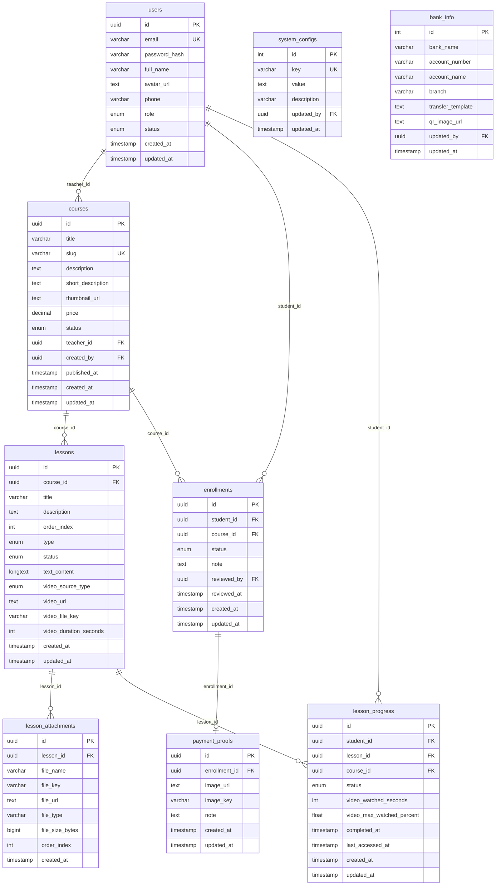

# Knowhow-phan-tich-nghiep-vu (part 02)


---
**Nguồn:** `Trợ lý dự án BrSE\Project 1-BrSE Foundation\6. Workshop\Workbook mini challenge workshop _ Thu Aki.docx`

🎉 PHẦN 1: LỜI MỞ ĐẦU
Chào bạn,
Nếu bạn đang cầm workbook này trên tay, có lẽ bạn cũng đang ở một điểm rất quen thuộc:
Bạn đã có kiến thức.
Bạn đã từng chia sẻ.
Nhưng… bạn vẫn chưa bắt đầu workshop thu phí đầu tiên của mình.
Không phải vì bạn không làm được.
Mà là vì:
Chưa biết bắt đầu từ đâu
Sợ chưa đủ tốt
Sợ không ai đăng ký
Và… cứ để đó thêm một chút nữa
Workbook này được tạo ra để giúp bạn dừng việc “để đó” lại.
Trong 5 ngày tới, bạn sẽ không chỉ học.
Bạn sẽ tạo ra workshop của chính mình
👉 Vết nội dung
👉 Thiết kế hình ảnh & slide
👉 Làm form đăng ký
👉 Chuẩn bị vận hành
👉 Và sẵn sàng để chạy thật
Và bạn không đi một mình.
Thu Aki – người đồng hành cùng bạn trong mini challenge này – không chỉ hướng dẫn,
mà sẽ làm thật song song cùng bạn.
Workshop Aki thực hiện trong challenge này là:
“90 phút biến Từ Ý Tưởng Trong Đầu thành Landing Page Trong Tay”
Bạn sẽ được nhìn thấy từng bước: → từ ý tưởng → thành một workshop thật
🎉 PHẦN 2: HƯỚNG DẪN
HƯỚNG DẪN SỬ DỤNG WORKBOOK | MINI CHALLENGE

Bước 1: Tạo bản làm việc cá nhân
Đây là file gốc (chỉ có quyền xem).
Bạn cần chọn File (Tệp)  → Make a copy (Tạo bản sao) để tạo bản riêng của mình.
Đổi tên workbook thành: Tên bạn_Workbook mini challenge workshop | Thu Aki
Lưu vào Google Drive cá nhân và sử dụng bản copy đó xuyên suốt thời gian học tập.
Chia sẻ quyền chỉnh sửa với email: troly.thudinh@gmail.com
Bước 2: Thực hành sau mỗi nhiệm vụ
Chúng ta sẽ sử dụng một link workbook duy nhất cho toàn bộ challenge.


Sau mỗi nhiệm vụ:
Truy cập lại link này để xem hướng dẫn các ngày mới được cập nhật.
Tìm ngày mới được mở.
Sao chép nội dung ngày đó về bản copy - cá nhân đã tạo của bạn.
Tiếp tục hoàn thành nội dung trên bản copy của mình.
Sau đó bạn sẽ đăng bài thu hoạch trên nhóm facebook của mini challenge.
Kết nối và trao đổi

Trong quá trình làm bài, nếu có điều gì chưa rõ hoặc cần thảo luận thêm, bạn có thể chia sẻ và đặt câu hỏi tại nhóm Zalo của lớp.
Hãy dành thời gian làm bài một cách đầy hứng khởi cho workshop đầu tiên.Mục tiêu không phải hoàn thành cho đủ, mà là làm kiên trì, cam kết và tạo ra workshop thực sự của bạn sau 02 tuần thực chiến. Thu Aki sẽ đồng hành cùng bạn!
🌟 PHẦN 3: NỘI DUNG
LỘ TRÌNH 5 NGÀY THỰC HÀNH
Trong 5 ngày này, bạn sẽ đi từng bước để tạo ra workshop của mình.
Bạn có thể:
Làm song song với Aki
Hoặc dùng workshop của Aki làm ví dụ để hiểu cách làm
👉 Quan trọng nhất: không cần hoàn hảo – chỉ cần làm xong từng bước
1️⃣ NGÀY 1. CHUẨN BỊ NỘI DUNG VỚI CHATGPT
Ngày 1 - 05/05 - Chuẩn bị nội dung bằng AI
🎯 Checklist ngày 1
Thu thập dữ liệu cá nhân
Đặt tên workshop
Nội dung Google Form
01 Bài viết truyền thông chính
04 Bài viết truyền thông vệ tinh
Email gửi học viên tham gia workshop
Tin nhắn welcome học viên Zalo
Email gửi học viên sau khi tổ chức workshop
D1_Hướng dẫn
1. Thu thập kho dữ liệu cá nhân
Thu thập dữ liệu cá nhân là một việc rất quan trọng, giúp cho các sản phẩm, dự án…bạn làm cùng AI có tính cá nhân hóa sâu, thống nhất và liền mạch.
VIỆC CẦN LÀM
Bạn hãy thu thập những dữ liệu cá nhân sau nhé:
10-15 bài viết của bạn mà bạn đã post trước đó (nếu collect nhiều hơn càng tốt). Đặc biệt là bài ghim trang cá nhân của bạn - bài viết nói về bạn là ai, bạn làm gì…Mục đích của tài liệu này là để AI nhận ra giọng văn của bạn. Hãy lưu dưới dạng file word hoặc pdf để có thể tích hợp được với các AI khác nhau như ChatGPT, Gemini, NotebookLM…
Dữ liệu về ngách/ sản phẩm/ dự án…mà bạn đang làm hoặc đang muốn tổ chức workshop/khóa học. Đó có thể là landing page, là google docs, là form khảo sát insight, là outline khóa học nháp…Hãy lưu dưới dạng word hoặc pdf và để sẵn ở kho tài nguyên của bạn.
Một tips nhỏ của Aki nhưng RẤT QUAN TRỌNG: mình rất hay voice - trò chuyện trực tiếp với AI để bạn ấy tự chuyển sang dạng text và lưu dạng text đó lại. Đó là cách làm rất hay và năng suất vì nói sẽ nhanh hơn, nhiều hơn và chi tiết hơn. Bạn đừng ngại nói ý lộn xộn, AI có thể giúp mình sắp xếp lại 1 chút cho rõ ràng, mạch lạc hơn.
Hãy luôn tạo dự án - project trong AI để phân luồng thông tin, không bị lẫn lộn. Ví dụ bạn đang muốn thực hành khóa tổ chức workshop lần này, hãy tạo new project: Tổ chức workshop - tháng 5.2026
Sau khi xong nhiệm vụ thu thập kho dữ liệu cá nhân, mời bạn chuyển sang bước số 2 nhé.
2. Tên workshop
PROMPT 1 – TẠO Ý TƯỞNG WORKSHOP
PROMPT MẪU
Thu Aki: bạn hãy đính kèm tất cả dữ liệu cá nhân thu thập ở trên có liên quan đến dự án, bao gồm cả file thu thập các bài viết và gửi câu lệnh đầu tiên:
Dựa vào tài liệu/câu chuyện mà mình gửi, Bạn hãy đóng vai là một chuyên gia thiết kế chương trình học (Instructional Designer) và cố vấn kinh doanh chuyên môn.
Tôi muốn tổ chức workshop đầu tiên (90–120 phút), nhưng chưa biết chọn chủ đề nào.
Đây là thông tin của tôi:
Thu Aki Note: nếu đã có thông tin nào đã điền ở trên, hãy bỏ qua, chỉ điền thông tin còn thiếu
Lĩnh vực: [điền]
Điều tôi làm tốt nhất: [điền]
Đối tượng của tôi: [điền]
Vấn đề tôi giúp họ giải quyết: [điền]
Công cụ/tài liệu tôi có thể cho họ: [điền]
Tên workshop mà tôi dự định làm là: [điền]
Câu chuyện, lý do mà tôi muốn tổ chức workshop đó: [điền]
Nhiệm vụ của bạn:
Hãy gợi ý cho tôi 5–10 ý tưởng workshop khác nhau dựa trên những tài liệu đã cung cấp.
Yêu cầu cụ thể cho tên workshop::
Mỗi workshop chỉ giải quyết 1 vấn đề nhỏ
Có thể thực hiện trong 90–120 phút
Có kết quả cụ thể học viên đạt được sau khi tham gia workshop đó
Khi đưa ra tên workshop, hãy giải thích cho tôi hiểu tại sao bạn chọn tên workshop đó, nó đáp ứng đúng tiêu chí gì?
PROMPT 2 – KIỂM CHỨNG & CHỐT
Thu Aki: dựa vào kết quả trả về của AI, bạn hãy chọn ra 03 tên workshop mà bạn thấy phù hợp và có cảm hứng nhất. Sau đó tiếp tục sử dụng câu lệnh thứ 2:
Tôi chọn 3 ý tưởng workshop:
[ý tưởng 1]
[ý tưởng 2]
[ý tưởng 3]
Vì đây là workshop đầu tiên, tôi cần chọn theo tiêu chí M.V.W (Minimum Viable Workshop):
Đối tượng cực kỳ cụ thể
Giải quyết 1 vấn đề nhỏ
Học viên có kết quả cụ thể sau trong 90–120 phút
Nhiệm vụ của bạn:
Phân tích từng ý tưởng – cái nào quá rộng, quá tham
Chấm điểm từng ý tưởng trên thang 10
Chọn ra 1 ý tưởng đơn giản nhất, phù hợp nhất, khả thi nhất và có nhu cầu cao nhất
Đóng gói lại theo công thức:
“Tôi giúp [ai] đang [bế tắc] giải quyết [vấn đề nhỏ] để đạt [kết quả cụ thể], bằng [công cụ/phương pháp], trong [90–120 phút]”
Đề xuất tên workshop hấp dẫn, phù hợp nhất với tôi ở thời điểm hiện tại.
Thu Aki: Lúc này bạn đã có tên workshop chuẩn chỉnh để triển khai các bước tiếp theo. Tuy nhiên, nếu bạn muốn đặt tên workshop kiểu có vần, nhẹ nhàng, vui vẻ, hài hước…thì hoàn toàn có thể tiếp tục làm việc với AI để có tên workshop ưng ý nhất nhé.
3. Nội dung google form
PROMPT MẪU
Bạn hãy đóng vai là một chuyên gia thiết kế trải nghiệm khách hàng và tối ưu chuyển đổi (Conversion Copywriter).
Tôi muốn tạo một Google Form đăng ký workshop theo cấu trúc 4 phần:
Giới thiệu (storytelling + insight + lý do tổ chức)
Lọc đối tượng (ai phù hợp / không phù hợp / lợi ích)
Form đăng ký
Thanh toán + xác nhận
Dưới đây là thông tin workshop của tôi:
Thu Aki Note: nếu đã có thông tin nào đã điền ở trên, hãy bỏ qua, chỉ điền thông tin còn thiếu
Tên workshop: [điền] (tên workshop đã chốt)
Lý do, câu chuyện, mục đích tôi tổ chức workshop là: [điền] 
Đối tượng tham gia workshop là: [điền] 
Vấn đề họ gặp: [điền] 
Kết quả họ nhận được sau workshop: [điền] 
Thời gian tổ chức (giờ, ngày/tháng/năm): [điền]
Hình thức tham gia: [điền] (qua zoom hay google meet, lark…)
Chi phí tham gia: [điền] (Mọi người hãy tham khảo hướng dẫn về chi phí em đã nói ở buổi kickoff, chia ra lựa chọn phí thấp hơn - nếu share bài và tag tên, không nhận được record. Phí cao hơn nếu muốn nhận record và không phải share bài hay tag tên)
Một số câu hỏi mà tôi cần người tham gia điền form: [điền]
Nhiệm vụ của bạn:
Hãy viết hoàn chỉnh nội dung Google Form bao gồm:
Tiêu đề: Form đăng ký workshop: [điền]
PHẦN 1 – GIỚI THIỆU
Viết 1 đoạn mở đầu kể câu chuyện cá nhân của tôi theo đúng những gì tôi đã chia sẻ, phong cách viết [gần gũi/chân thật/chuyên nghiệp/truyền cảm hứng] theo đúng tài liệu bài viết mà tôi đã chia sẻ ở trên.
Dẫn dắt lý do workshop ra đời
Có thông tin tổng quát về workshop: tên, thời gian & ngày tháng tổ chức, hình thức tổ chức
PHẦN 2 – AI NÊN THAM GIA
Bullet: Workshop này dành cho ai (3-5 ý)
Bullet: Bạn nhận được gì sau workshop (3-5 ý)
Bullet: Chi phí và hình thức tham gia
PHẦN 3 – CÂU HỎI DÀNH CHO NGƯỜI ĐĂNG KÝ
Viết đầy đủ câu hỏi:
Họ tên
Zalo
Email
Công việc + chuyên môn
Trạng thái hiện tại (multiple choice)
Rào cản (multiple choice)
Bạn mong muốn nhận được điều gì trong workshop
Câu hỏi thêm cho speaker…
PHẦN 4 – THANH TOÁN
Viết nội dung chuyển khoản
Hướng dẫn gửi ảnh đính kèm vào form, ghi chú Nếu bạn không đính kèm được, vui lòng gửi qua Zalo số điện thoại: [điền]
Lời cảm ơn
Yêu cầu:
Văn phong thân thiện, chân thật (không sales quá)
Rõ ràng, dễ hiểu
Có cảm giác “đây là dành cho mình”
Thu Aki: Tùy theo mục đích tổ chức của mỗi workshop bạn hãy làm việc với AI để có danh sách câu hỏi cho người tham gia phù hợp nhé. Ví dụ trường hợp thu thập insight khách hàng, mức độ quan tâm của họ tới sản phẩm khóa học chuyên sâu của bạn => bạn hãy khéo léo cho thêm các câu hỏi để xác định nhu cầu của họ sâu hơn là gì, họ sẵn sàng dành bao nhiêu thời gian, chi phí phù hợp, hình thức học tập phù hợp là gì…
4. Bài viết truyền thông chính
PROMPT MẪU
Bạn hãy đóng vai là một content writer chuyên viết bài bán workshop theo phong cách storytelling chân thật, gần gũi (không sales mạnh).
Tôi muốn viết một bài truyền thông chính để mời người tham gia workshop.
Dưới đây là thông tin của tôi: 
Thu Aki Note: nếu đã có thông tin nào đã điền ở trên, hãy bỏ qua, chỉ điền thông tin còn thiếu
Chủ đề workshop: [điền]
Đối tượng: [điền]
Vấn đề họ gặp: [điền]
Kết quả họ nhận: [điền]
Câu chuyện cá nhân của tôi (liên quan): [điền]
Điều tôi nhận ra (insight): [điền]
Nhiệm vụ của bạn:
Hãy đọc các thông tin trên, tham khảo thêm giọng văn (tài liệu bài viết mà tôi đã gửi lúc đầu) và câu chuyện cá nhân của tôi để viết một bài truyền thông theo cấu trúc:
1. MỞ ĐẦU – STORY
Kể một câu chuyện thật (càng đời càng tốt)
Không dạy, không bán
2. KẾT NỐI – RELATE
Cho thấy bạn từng giống họ
Thành thật, không hoàn hảo
3. CHUYỂN ĐỔI – INSIGHT
Đưa ra một góc nhìn mới
Đơn giản, dễ hiểu
4. GỌI TÊN NỖI SỢ
Liệt kê 3–5 nỗi sợ thật của họ
5. GIỚI THIỆU BẠN
Bạn là ai
Bạn giúp gì
6. CTA MỀM
Mời tham gia workshop
Không ép mua
Giữ tone nhẹ nhàng
Yêu cầu:
Văn phong như giọng văn của tôi
Không dùng từ ngữ marketing sáo rỗng
Giống như đang viết cho một người bạn
Không quá dài, nhưng đủ cảm xúc
Có hook ấn tượng
Gửi cho tôi bài viết hoàn chỉnh, như dạng storyteller không xuống dòng quá nhiều nhưng cũng không viết 4-5 câu quá dài, không lạm dụng icon, hoàn toàn theo giọng văn của tôi 
Thu Aki: bạn cần input câu chuyện cá nhân của bạn càng chi tiết, càng rõ ràng, càng chân thực càng tốt nhé. Điều đó sẽ làm bài viết mang đúng vị bạn hơn rất nhiều. Có 1 cách khác là, bạn tự viết bài truyền thông theo cấu trúc trên và gửi cho AI chấm điểm, rà soát, góp ý. Hãy coi AI như một người bạn đồng hành thay vì phụ thuộc nhé.
5. Bài viết truyền thông vệ tinh
PROMPT MẪU
Bạn hãy đóng vai là một content strategist chuyên xây dựng chuỗi nội dung để bán workshop bằng storytelling và insight.
Tôi muốn tạo 4 bài viết vệ tinh để nuôi cảm xúc xung quanh bài truyền thông chính phía trên (gửi lại bài truyền thông chính đã chốt cuối cùng)..
Nhiệm vụ của bạn:
Hãy GỢI Ý ý tưởng cho tôi 4 bài theo cấu trúc:
BÀI 1 – STORY
Kể một câu chuyện thật
Có cảm xúc
Không dạy
BÀI 2 – INSIGHT
Chỉ ra một suy nghĩ sai phổ biến
Đưa góc nhìn mới
BÀI 3 – PAIN
Liệt kê nỗi sợ / khó khăn
Khiến người đọc thấy mình trong đó
BÀI 4 – MICRO VALUE
3–4 tips nhỏ
Có thể áp dụng ngay
Yêu cầu:
Văn phong chân thật, gần gũi
Không bán hàng trực tiếp
Không viết như sách giáo khoa
Thu Aki: trong phần này, mình chỉ khuyến khích các bạn brainstorm cùng AI - AI đưa ra gợi ý về 4 bài viết vệ tinh cùng bạn. Tuy nhiên bạn vẫn cần tự mình viết - kể ra câu chuyện của mình thì đó mới là bạn, mới chạm tới khán giả. Bạn hoàn toàn có thể làm việc song song - kết hợp với AI bằng cách bạn thử viết trước và AI chấm chữa, chỉnh sửa, phân tích cùng bạn nhé! 
Hôm nay bạn sẽ  không đủ thời gian để viết đủ 4 bài truyền thông vệ tinh, nên bạn chỉ cần làm cùng AI để ra 4 ý tưởng bài viết vệ tinh là đủ rồi nhé.
6. Email mời tham gia workshop
PROMPT MẪU
Bạn hãy đóng vai là một người tổ chức workshop với phong cách viết ấm áp, chân thật, không bán hàng.
Tôi muốn viết một email gửi cho người đã đăng ký workshop, để:
Xác nhận đăng ký
Gửi thông tin tổ chức của workshop như Tên workshop, ngày tháng tổ chức, Link zoom, link nhóm zalo
Tạo cảm giác gần gũi và mong chờ
Thông tin của tôi:
Thu Aki Note: nếu đã có thông tin nào đã điền ở trên, hãy bỏ qua, chỉ điền thông tin còn thiếu
Tên workshop: [điền]
Đối tượng: [điền]
Trải nghiệm tôi muốn mang lại: [điền]
Ngày + giờ: [điền]
Link Zoom: [điền]
Link nhóm Zalo: [điền]
Nhiệm vụ của bạn:
Đưa ra tiêu đề email theo cấu trúc: [Thông tin Workshop]: Tên workshop
Hãy viết email theo cấu trúc:
1. MỞ ĐẦU
Chào thân thiện
Cảm ơn họ đã đăng ký
2. ĐỊNH HƯỚNG TRẢI NGHIỆM
Workshop này không chỉ là học kiến thức
Mà là một…(trải nghiệm, buổi trò chuyện…mô tả nhẹ nhàng)
3. THÔNG TIN
Tên workshop
Ngày
Giờ
Link Zoom
ID
4. HÀNH ĐỘNG
Mời vào nhóm Zalo, link Zalo
Nhắc vào sớm 5 phút
5. KẾT
Một câu nhẹ nhàng
Thể hiện sự mong chờ
Yêu cầu:
Văn phong ấm áp, gần gũi
Có một vài icon sinh động
Không dùng từ marketing
Ngắn gọn, dễ đọc
Không quá 300–400 từ
7. Tin nhắn zalo welcome
PROMPT MẪU
Bạn hãy đóng vai là một người tổ chức workshop với phong cách viết ấm áp, chân thật, không bán hàng.Hãy viết tin nhắn gửi vào nhóm Zalo để chào đón học viên.
Mục tiêu:
Tạo cảm giác thân thiện, gần gũi
Nhắc lại thông tin workshop
Khuyến khích mọi người tương tác, giới thiệu trong nhóm
Thông tin:
Tên workshop: [điền]
Ngày: [điền]
Thời gian: [điền]
Link Zoom & ID: [điền]
Lưu ý: [điền] (có thể là tải phần mềm, app, chuẩn bị khảo sát, chuẩn bị giấy, bút vẽ…)
Nhiệm vụ:
Viết tin nhắn theo cấu trúc:
1. CHÀO
Chào tất cả mọi người
Gọi @All
2. THÔNG TIN
Nhắc lại workshop
Ngày giờ
Link
3. TONE CẢM XÚC
Mong được gặp
Tạo sự háo hức
4. KẾT NỐI
Mời mọi người giới thiệu bản thân
Khuyến khích tương tác
Yêu cầu:
Ngắn gọn (5–10 dòng)
Thân thiện
Có thể dùng emoji nhẹ (không lạm dụng)
Không bán hàng
8. Email sau workshop 
Bạn hãy đóng vai là một người tổ chức workshop, viết email gửi sau khi workshop kết thúc gửi cho người đã tham gia.
Mục tiêu:
Kết nối lại với học viên
Gợi lại trải nghiệm
Cung cấp giá trị thêm
Giới thiệu sản phẩm (upsell) tiếp theo một cách tự nhiên, nhẹ nhàng
Thông tin:
Chủ đề workshop: [điền]
Insight rút ra sau workshop: [điền]
Quà tặng (nếu có): [điền]
Sản phẩm tiếp theo: [điền]
Đối tượng: [điền]
Ưu đãi: [điền]
Nhiệm vụ:
Tiêu đề email: [Record và quà tặng workshop]: Tên workshop
Viết email theo cấu trúc:
1. KẾT NỐI LẠI
Nhắc lại buổi workshop
Thể hiện sự trân trọng
2. GỢI CẢM XÚC
Nhắc lại trải nghiệm
Không cần nói kiến thức
3. INSIGHT
Một điều bạn nhận ra
Liên quan đến học viên
4. GIÁ TRỊ
Link record buổi workshop
Link quà tặng
5. LỰA CHỌN
Đưa 1–2 hướng đi tiếp
Không ép mua
6. KẾT
Nhẹ nhàng
Thể hiện đồng hành
Yêu cầu:
Văn phong ấm áp, chân thật
Không dùng ngôn ngữ bán hàng
Có dùng một số icon sinh động
Không tạo áp lực
Độ dài vừa phải
9. Tin nhắn ngắn gọn về workshop
Thu Aki Note: mục đích là để bạn có thể gửi nhanh thông tin của workshop sau mỗi  bài post facebook, khách hàng không cần phải quay lại các bài post trước để tìm thông tin. Bạn cũng có thể gửi tin nhắn này vào nhóm cộng đồng zalo để thu hút tập khách hàng cũ.
PROMPT MẪU
Bạn hãy đóng vai là một content writer chuyên viết nội dung ngắn để đăng trong comment Facebook hoặc nhóm Zalo cộng đồng.
Mục tiêu:
Ngắn gọn
Dễ đọc
Thu hút
Khiến người đọc bấm link đăng ký workshop
Thông tin:
Thu Aki Note: nếu đã có thông tin nào đã điền ở trên, hãy bỏ qua, chỉ điền thông tin còn thiếu
Tên workshop: [điền]
Đối tượng: [điền]
Vấn đề họ gặp: [điền]
Kết quả họ nhận: [điền]
Thời gian: [điền]
Link đăng ký: [điền]
Nhiệm vụ:
Viết nội dung theo cấu trúc:
1. HOOK (1 dòng)
Gây chú ý
Có thể là pain hoặc kết quả
2. ĐỐI TƯỢNG
Ai nên tham gia
3. KẾT QUẢ
Sau workshop họ làm được gì
4. THÔNG TIN
Thời gian
Hình thức
5. CTA
Link đăng ký
Yêu cầu:
Viết riêng 2 post, post facebook chỉ dưới 7 dòng. Post nhóm cộng đồng zalo thì đầy đủ hơn, khoảng 100-120 chữ
Gửi cho mình cả 2 post
Không dài dòng
Không viết như quảng cáo
Dễ đọc trên điện thoại
Có thể dùng emoji nhẹ
10. Tin nhắn last call đăng ký workshop
Thu Aki Note: mục đích là để bạn có thể  nhắc deadline đăng ký workshop trên facebook cá nhân / nhóm cộng đồng zalo trước 1-2 ngày đóng form đăng ký workshop
PROMPT MẪU
Bạn hãy đóng vai là một content writer chuyên viết nội dung ngắn để đăng trong bài post Facebook với mục đích last call đăng ký workshop
Mục tiêu:
Ngắn gọn
Dễ đọc
Thu hút
Khiến người đọc bấm link đăng ký workshop
Thông tin:
Thu Aki Note: nếu đã có thông tin nào đã điền ở trên, hãy bỏ qua, chỉ điền thông tin còn thiếu
Tên workshop: [điền]
Đối tượng: [điền]
Vấn đề họ gặp: [điền]
Kết quả họ nhận: [điền]
Thời gian: [điền]
Link đăng ký: [điền]
Nhiệm vụ:
Viết nội dung theo cấu trúc:
Chỉ còn (x) ngày/giờ nữa From workshop [điền] sẽ đóng đăng ký để đảm bảo chất lượng workshop. 
Một câu CTA nhẹ nhàng
Yêu cầu:
Không dài dòng
Dễ đọc trên điện thoại
Có thể dùng emoji nhẹ
Cho 2 phiên bản, 1 phiên bản viết trước 2 ngày, 1 phiên bản viết trước khi tổ chức workshop 4-5 tiếng. Nội dung 2 phiên bản không trùng khớp với nhau.
11. Chuẩn bị nội dung slide trình chiếu
Thu Aki Note: trong phần này, chúng ta sẽ dùng prompt để cùng làm việc với AI chuẩn bị nội dung slide cho buổi workshop. Phần này mọi người cần tư duy và input kiến thức chuyên môn của mình vào nhiều, phản tư, hiệu chỉnh lại cùng với AI cho tới bản cuối ưng ý nhất.
PROMPT MẪU
Bạn hãy đóng vai là một Instructional Designer (chuyên gia thiết kế trải nghiệm học tập) và facilitator workshop.
Tôi muốn thiết kế nội dung cho một workshop 90–120 phút, tập trung vào việc giúp học viên làm được một kết quả cụ thể ngay trong buổi.
Thông tin của tôi:
Thu Aki Note: nếu đã có thông tin nào đã điền ở trên, hãy bỏ qua, chỉ điền thông tin còn thiếu
Tên workshop: [điền]
Đối tượng: [điền]
Vấn đề họ gặp: [điền]
Kết quả họ đạt được: [điền]
Câu chuyện cá nhân của tôi: [điền]
Phương pháp / kinh nghiệm của tôi: [điền]
Công cụ tôi cung cấp: [điền]
Nhiệm vụ:
Hãy phác thảo Outline chi tiết cho workshop theo cấu trúc:
1. WARM-UP & CHECK-IN (15 phút)
Thiết kế 1 hoạt động mở đầu:
Gọi tên nỗi đau
Khiến học viên tương tác ngay
Gợi ý câu hỏi / mini activity trên Zoom
2. MINDSET SHIFT (15 phút)
Nêu 2–3 sai lầm phổ biến
Lồng ghép câu chuyện cá nhân của tôi
Giúp học viên “nhận ra vấn đề thật sự”
3. CORE FRAMEWORK & PRACTICE (45 phút – trọng tâm)
Chia nội dung thành 3 bước rõ ràng
Với mỗi bước:
Giải thích ngắn gọn
Hướng dẫn thao tác cụ thể
Học viên thực hành gì ngay trên Zoom
Gợi ý cách:
chia breakout room
hoặc làm trực tiếp
4. Q&A & NEXT STEP (15 phút)
Gợi ý cách:
xử lý câu hỏi
chọn câu hỏi để trả lời
Đề xuất cách dẫn dắt:
giới thiệu bước tiếp theo (khóa học / mentoring)
không bán gắt
giữ tone hỗ trợ
Yêu cầu:
Nội dung thực tế, dễ triển khai
Không lý thuyết dài dòng
Tập trung vào hành động
Phù hợp workshop online
Kết quả trả về phân chia thành các slide cụ thể, 15 slide
D1_Ví dụ WS Aki
1. Thu thập kho dữ liệu cá nhân
Cung cấp tài liệu các bài viết của Thu Aki (file word hoặc pdf)
Cung cấp câu chuyện lý do muốn tổ chức workshop cho AI:
Chào bạn,
Đợt vừa rồi mình có tham gia một mini challenge của chị Linh Phan. Trong challenge đó, có một nhiệm vụ là cần tạo một landing page nhanh để bán hàng.
Lúc đó, mình đã áp dụng những kiến thức mình có và tự xây dựng một quy trình riêng — từ việc chuẩn bị nội dung cho đến việc sử dụng AI để visual landing page. Và mình hoàn thành toàn bộ chỉ trong hơn một tiếng.
Khi thấy sản phẩm mình làm ra khá đẹp, một chị bạn là chị Hà Giang đã hỏi mình: “Làm thế nào mà em có thể làm nhanh và đẹp như vậy?”
Mình đã chia sẻ lại cách làm của mình cho chị Giang. Sau đó, chị cũng áp dụng tương tự và kết quả là chỉ trong khoảng một tiếng, chị đã có một landing page hoàn chỉnh để giới thiệu sản phẩm sắp ra mắt của mình.
Lúc đó, chị Giang đã rất “wow” và nói với mình rằng:
 “Aki ơi, em nhất định phải chia sẻ cách làm landing page này cho mọi người. Vì trong những trường hợp không có nhiều thời gian, mọi người hoàn toàn có thể tự làm được một landing page đầy đủ thông tin, có nút call to action, có form đăng ký — và nhìn vẫn rất ổn.”
Mình đã hứa với chị là trong tháng 5 sẽ tổ chức một workshop để chia sẻ về cách làm landing page nhanh này.
Và đó cũng chính là lý do mình bắt đầu lên ý tưởng cho workshop hướng dẫn mọi người tạo landing page nhanh trong thời gian ngắn.
2. Tên workshop
PROMPT 1 – TẠO Ý TƯỞNG WORKSHOP
KẾT QUẢ TRẢ VỀ (tóm tắt)
1. Workshop: Landing Page 1 Giờ – Có Trang Bán Hàng Ngay
2. Workshop: Viết Nội Dung Landing Page Trong 60 Phút (Không Bí Ý Tưởng)
3. Workshop: Dùng AI Tạo Landing Page Từ A–Z Cho Người Mới
4. Workshop: 5 Khối Nội Dung Cốt Lõi Của Landing Page Chuyển Đổi
5. Workshop: Từ Ý Tưởng → Landing Page Trong 90 Phút
6. Workshop: Landing Page Cho Người Không Biết Code
7. Workshop: Làm Landing Page Đầu Tiên Trong Đời (Và Dùng Được Ngay)
8. Workshop: Landing Page Tối Giản – Nhanh, Đủ, Bán Được
🎯 Gợi ý chọn workshop đầu tiên (rất quan trọng)
Nếu là workshop đầu tiên, mình KHÔNG khuyên chọn cái quá niche.
👉 Nên chọn 1 trong 3 cái này:
Landing Page 1 Giờ – Có Trang Bán Hàng Ngay
Từ Ý Tưởng → Landing Page Trong 90 Phút
Dùng AI Tạo Landing Page Từ A–Z Cho Người Mới
Vì:
Rõ outcome
Dễ bán
Dễ làm content
Có thể upsell sau (template / khóa học)
💡 Gợi ý refine tên bạn đang có
Tên bạn:
 “Có ý tưởng trong đầu, có landing page trong tay” Rất hay về cảm xúc, nhưng hơi “mơ hồ” về outcome
Mình gợi ý tweak nhẹ:
👉 Có Ý Tưởng Trong Đầu – Có Landing Page Trong Tay (Trong 90 Phút)
hoặc Từ Ý Tưởng Trong Đầu → Landing Page Trong Tay (90 Phút)
PROMPT 2 – KIỂM CHỨNG & CHỐT
KẾT QUẢ TRẢ VỀ (tóm tắt)
🔍 1. Phân tích từng ý tưởng
1️⃣ Từ Ý Tưởng → Landing Page Trong 90 Phút
Đánh giá:
❗ Vấn đề: hơi rộng
“Ý tưởng” là một phạm trù rất lớn (ý tưởng sản phẩm? workshop? khóa học?)
Dễ bị trôi sang brainstorming → mất thời gian
Điểm mạnh:
Rất đúng câu chuyện thật của bạn
Emotional + dễ thu hút
Điểm yếu:
Dễ bị overload trong 90 phút
Nếu học viên chưa rõ idea → fail outcome
👉 Kết luận:
 → Hơi rộng, cần bó hẹp thêm
Chấm điểm: 7.5/10
2️⃣ Dùng AI Tạo Landing Page Từ A–Z Cho Người Mới
Đánh giá:
❗ Red flag lớn: “A–Z”
90–120 phút KHÔNG thể làm A–Z tử tế
Điểm mạnh:
Có “AI” → rất hút
Định vị expertise tốt
Điểm yếu:
Quá tham → dễ:
overload học viên
không có kết quả rõ
Dễ biến thành workshop “xem demo” chứ không “làm được”
👉 Kết luận:
 → Quá rộng cho MVW
Chấm điểm: 6/10
3️⃣ 90 phút biến Từ Ý Tưởng Trong Đầu thành Landing Page Trong Tay
Đánh giá:
Thực chất là version tốt hơn của #1
Có thêm yếu tố:
“90 phút” → cụ thể
“trong tay” → outcome rõ hơn
Điểm mạnh:
Có transformation rõ
Gần với trải nghiệm thật của bạn
Có thể design flow “follow along” (rất hợp MVW)
Điểm yếu:
Vẫn còn hơi rộng ở chữ “ý tưởng”
 👉 nhưng có thể fix bằng cách:
 → yêu cầu học viên đã có idea sẵn
👉 Kết luận:
 → Đây là cái có tiềm năng MVW nhất
Chấm điểm: 8.5/10
🏆 2. Chọn ý tưởng phù hợp nhất
👉 Mình chọn:
✅ “90 phút biến Từ Ý Tưởng Trong Đầu thành Landing Page Trong Tay”
Vì:
Không quá tham như “A–Z”
Có outcome rõ
Có thể design thành workshop:
“làm cùng – ra sản phẩm ngay”
Phù hợp nhất với phong cách Aki: thực tế – đơn giản – làm được
CHỐT TÊN WORKSHOP: 90 phút biến Từ Ý Tưởng Trong Đầu thành Landing Page Trong Tay
3. Nội dung google form
Form đăng ký workshop: 90 phút biến Từ Ý Tưởng Trong Đầu thành Landing Page Trong Tay
🌱 PHẦN 1 – GIỚI THIỆU
Chào bạn,
 mình là Aki 🌿
Đợt vừa rồi, mình có tham gia một mini challenge của chị Linh Phan. Trong challenge đó, có một nhiệm vụ là tạo landing page nhanh để bán hàng.
Lúc đó, mình áp dụng những gì mình đã học và tự xây dựng một quy trình riêng — từ việc chuẩn bị nội dung cho đến việc sử dụng AI để visual landing page. Và mình hoàn thành tất cả chỉ trong hơn một tiếng.
Điều thú vị là…
 khi mình chia sẻ lại cách làm này cho một chị bạn, chị cũng làm được tương tự — chỉ trong khoảng 1 tiếng, đã có một landing page hoàn chỉnh để giới thiệu sản phẩm của mình.
Lúc đó, chị nói với mình một câu mà mình nhớ mãi:
 “Cái này em nên chia sẻ cho nhiều người hơn. Vì không phải ai cũng có thời gian, nhưng ai cũng cần một landing page để bắt đầu.”
Và đó là lý do workshop này ra đời.
✨ Workshop: 90 phút biến Từ Ý Tưởng Trong Đầu thành Landing Page Trong Tay
⏰ Thời gian:
12h00 – 13h30 | Ngày 20/05/2026
12h00 – 13h30 | Ngày 21/05/2026
💻 Hình thức: Online qua Zoom (2 buổi)
Workshop này không phải để học cho biết.
 Mà là để bạn ngồi xuống – làm – và có sản phẩm ngay trong buổi học.
🎯 PHẦN 2 – AI NÊN THAM GIA
Workshop này dành cho bạn nếu:
Bạn đã có ý tưởng sản phẩm / workshop / khóa học, nhưng chưa biết bắt đầu landing page từ đâu
Bạn đang là trợ lý / người làm cùng / người kinh doanh chuyên môn, cần làm landing page nhanh để hỗ trợ công việc
Bạn không rành kỹ thuật, không biết code, và cũng không muốn làm mọi thứ quá phức tạp
Bạn từng thử làm landing page… nhưng bị “đứng hình” ở bước nội dung hoặc bắt đầu
Bạn muốn có một cách làm đơn giản – nhanh – có thể lặp lại
Sau workshop, bạn sẽ có:
Một landing page hoàn chỉnh (bản dùng được ngay)
Một quy trình rõ ràng để bạn có thể tự làm lại lần sau
Cách sử dụng AI để hỗ trợ viết nội dung & triển khai landing page
Một bộ framework đơn giản (không cần quá nhiều công cụ phức tạp)
Và quan trọng nhất: cảm giác
 👉 “À, hóa ra mình làm được thật”
Chi phí & hình thức tham gia
💰 Chi phí: 399.000 VNĐ / 2 buổi Zoom
📌 Hình thức:
2 buổi học live qua Zoom
Có record xem lại
Có hỗ trợ trong quá trình thực hành
📝 PHẦN 3 – CÂU HỎI DÀNH CHO NGƯỜI ĐĂNG KÝ
👉 Bạn dành vài phút chia sẻ để Aki hiểu bạn hơn nhé:
1. Họ và tên
 (Short answer)
2. Số Zalo (để Aki add vào nhóm workshop)
 (Short answer)
3. Email
 (Short answer)
4. Công việc hiện tại + chuyên môn của bạn là gì?
 (Short answer)
5. Trạng thái hiện tại của bạn (chọn 1)
 (Multiple choice)
Đã có sản phẩm / workshop / khóa học
Đang chuẩn bị ra sản phẩm
Đang làm trợ lý / hỗ trợ cho người khác
Đang tìm hướng kinh doanh chuyên môn
Khác (ghi rõ…)
6. Bạn đã từng thử làm landing page chưa?
 (Multiple choice)
Chưa từng
Đã thử nhưng chưa hoàn thành
Đã có landing page nhưng chưa ưng ý
Đã làm khá ổn
7. Bạn muốn làm landing page cho sản phẩm gì?
 (Short answer)
8. Bạn đã từng sử dụng AI nào chưa?
 (Multiple choice – có thể chọn nhiều)
ChatGPT
Gemini
Claude
Chưa từng sử dụng
Khác (ghi rõ…)
9. Mức độ sử dụng AI của bạn hiện tại:
 (Multiple choice)
Chưa biết dùng
Biết cơ bản (hỏi – trả lời đơn giản)
Dùng được trong công việc
Khá thành thạo
10. Bạn đã từng sử dụng Gamma để làm landing page chưa?
 (Multiple choice)
Chưa từng
Đã thử
Đang sử dụng
11. Rào cản lớn nhất của bạn khi làm landing page là gì?
 (Multiple choice – chọn tối đa 2)
Không biết bắt đầu từ đâu
Không biết viết nội dung
Không rành công cụ
Sợ làm không đẹp / không chuyên nghiệp
Không có thời gian
Khác (ghi rõ…)
12. Bạn mong muốn nhận được điều gì sau workshop này?
 (Paragraph)
13. Bạn có câu hỏi nào muốn gửi tới Aki trước workshop không?
 (Paragraph)
💳 PHẦN 4 – THANH TOÁN & XÁC NHẬN
👉 Sau khi điền form, bạn vui lòng chuyển khoản để giữ chỗ nhé:
Thông tin chuyển khoản:
Ngân hàng: [Điền ngân hàng của bạn]
Số tài khoản: [Điền STK]
Chủ tài khoản: [Tên bạn]
Nội dung chuyển khoản:
 👉 [Tên] – Landing Page 90P
📌 Sau khi chuyển khoản:
Bạn vui lòng chụp màn hình giao dịch và đính kèm vào dưới đây
Nếu bạn không đính kèm được, vui lòng gửi qua Zalo: [Số Zalo của bạn]
💌 Aki sẽ:
Xác nhận trong vòng 24h
Gửi link Zoom + thông tin tham gia workshop
Add bạn vào nhóm hỗ trợ
Cảm ơn bạn đã dành thời gian điền form 🌿
 Hy vọng workshop này sẽ là một bước nhỏ — nhưng đủ để bạn bắt đầu.
From Aki with love 💛
4. Bài viết truyền thông chính
Có một điều mình nhận ra gần đây là… không phải ai không làm được landing page, mà là nhiều người chưa từng bắt đầu được.
Mình nhớ có một hôm, mở máy ra với một list ý tưởng rất rõ ràng trong đầu. Workshop dạy gì, dành cho ai, nói như thế nào… mình đều hình dung được hết. Nhưng khi chuyển sang bước “làm landing page”, mọi thứ dừng lại. Không phải vì không biết gì, mà vì không biết bắt đầu từ đâu cho đúng.
Mình mở thử vài tool, xem vài hướng dẫn, đọc vài bài chia sẻ. Càng xem thì càng thấy có quá nhiều thứ phải làm. Nào là cấu trúc, nào là design, nào là công cụ. Cuối cùng, mình đóng máy lại. Nghĩ bụng thôi để hôm khác làm tiếp, lúc rảnh hơn, lúc “giỏi hơn” một chút.
Mà cái “hôm khác” đó, chắc bạn cũng đoán được rồi.
Mình từng nghĩ chắc là do mình không hợp. Không phải dân kỹ thuật, không biết code, cũng không phải kiểu người mê mày mò công cụ. Trong khi đó, mình vẫn viết được, vẫn nghĩ ra ý tưởng, vẫn chia sẻ được. Chỉ riêng việc “làm landing page” là thấy hơi mệt.
Sau này nhìn lại, mình thấy vấn đề không nằm ở việc mình không làm được. Mà là mình đang cố làm theo một cách quá phức tạp. Mình nghĩ phải làm cho thật đẹp, thật chỉnh chu, phải biết nhiều thứ rồi mới bắt đầu. Nhưng thực ra, cái mình cần lúc đó chỉ là một cách làm đủ đơn giản để mình đi từng bước.
Khi mình bắt đầu lại, theo hướng đơn giản hơn, bỏ bớt những thứ không cần thiết, và dùng AI để hỗ trợ những phần mình bị bí, mọi thứ nhẹ đi rất nhiều. Không còn cảm giác “ngợp”, mà chỉ là làm từng chút một, xong từng phần một.
Mình nhận ra, rất nhiều người cũng đang kẹt đúng chỗ này. Không phải họ không có ý tưởng. Ngược lại, họ có khá nhiều. Nhưng lại vướng ở đoạn chuyển từ “trong đầu” ra “thành một cái gì đó nhìn thấy được”.
Và kèm theo đó là rất nhiều suy nghĩ quen thuộc: sợ công nghệ, sợ làm ra không đẹp, không biết bắt đầu từ đâu, sợ mất thời gian, sợ làm rồi vẫn không dùng được. Những cái đó, mình đã từng có hết.
Mình là Aki. Mình đang làm việc cùng những bạn trợ lý và những người đang bắt đầu kinh doanh chuyên môn, theo kiểu rất đời thường thôi: làm sao để mọi thứ rõ hơn, đơn giản hơn, và làm được thật. Mình không phải người giỏi công nghệ. Mình chỉ là người đã từng loay hoay, rồi tìm ra một cách làm phù hợp hơn với mình.
Vậy nên mình làm workshop này: “90 phút biến Từ Ý Tưởng Trong Đầu thành Landing Page Trong Tay”. Không phải để học thêm cho biết. Mà là để ngồi xuống và làm. Trong 90 phút, mình đi cùng bạn từng bước, đủ để bạn có một landing page đầu tiên. Không cần biết code, không cần dùng quá nhiều công cụ, cũng không cần làm cho hoàn hảo. Chỉ cần bắt đầu.
Nếu bạn đang có một ý tưởng mà vẫn chưa biết làm sao để đưa nó ra ngoài, thì có thể workshop này sẽ hợp với bạn. Mình để link đăng ký ở dưới, bạn đọc thử, thấy phù hợp thì mình gặp nhau.
5. Bài viết truyền thông vệ tinh
🌿 NHẮC LẠI BÀI TRUYỀN THÔNG CHÍNH (để bạn giữ mạch)
 Core message của bài chính:
Có ý tưởng nhưng không bắt đầu được
Không phải do không biết → mà do cách làm quá phức tạp
Cần một cách đơn giản để bắt đầu
Workshop = nơi “ngồi xuống và làm”
 Vậy 4 bài vệ tinh sẽ xoay quanh:
cảm xúc trước khi bắt đầu
nhận thức sai
nỗi sợ
và một chút “làm thử”
🧩 BÀI 1 – STORY (cảm xúc – kéo người vào)
🎯 Ý tưởng:
“Cái landing page mình đã định làm… 3 tháng rồi”
💡 Nội dung gợi ý:
Kể một câu chuyện rất đời:
bạn (hoặc một người quen) đã:
có ý tưởng từ lâu
đã từng mở máy vài lần
đã từng nói “để cuối tuần làm”
Nhưng:
luôn có lý do:
bận
chưa sẵn sàng
chưa biết bắt đầu
 Twist nhẹ:
không phải vì lười
mà vì… mỗi lần bắt đầu là thấy quá nhiều thứ
🎯 Mục tiêu:
Người đọc nhận ra:
 “Ơ, mình cũng y chang vậy”
🧠 BÀI 2 – INSIGHT (đổi góc nhìn)
🎯 Ý tưởng:
“Không phải bạn không biết làm landing page. Bạn chỉ đang bắt đầu sai chỗ.”
💡 Nội dung gợi ý:
Mở đầu bằng 1 niềm tin phổ biến:
phải học tool trước
phải biết design
phải chuẩn chỉnh mới làm
Sau đó lật lại:
Thực tế:
landing page đầu tiên KHÔNG cần đẹp
KHÔNG cần đủ hết
chỉ cần:
có nội dung
có cấu trúc
có thể gửi cho người khác xem
So sánh vui kiểu Aki:
giống như nấu ăn lần đầu → không ai đòi 5 sao Michelin
🎯 Mục tiêu:
Gỡ “áp lực hoàn hảo”
😖 BÀI 3 – PAIN (gọi tên nỗi đau)
🎯 Ý tưởng:
“Bạn có đang bị kẹt ở đoạn này không?”
💡 Nội dung gợi ý:
Viết dạng liệt kê rất thật, rất đời:
Mở máy lên → không biết viết gì
Viết được vài dòng → thấy dở → xóa
Mở tool → không hiểu gì → tắt
Xem video hướng dẫn → thấy người ta làm nhanh → mình càng stress
Lưu lại link tool → nhưng không dùng lại lần nào
👉 Chèn thêm 1–2 câu rất “Aki”:
“Cảm giác như mình đang thiếu cái gì đó… nhưng không biết là cái gì”
🎯 Mục tiêu:
Người đọc thấy:
 “Trời ơi, viết hộ mình luôn”
🌱 BÀI 4 – MICRO VALUE (cho cảm giác “mình làm được”)
🎯 Ý tưởng:
“Nếu hôm nay bạn muốn bắt đầu landing page, thử 3 bước này trước”
💡 Nội dung gợi ý:
Không dạy sâu, chỉ “mở cửa”:
Tip 1:
 Đừng mở tool vội
 → viết ra 3 câu:
mình đang bán gì
dành cho ai
giúp họ điều gì
Tip 2:
Viết 1 đoạn giới thiệu cực đơn giản:
bạn là ai
bạn giúp gì
tại sao bạn làm cái này
Tip 3:
Dùng AI nhưng chỉ để “gợi ý”, không phải “làm hộ”
đưa input thật đơn giản
sửa lại theo giọng của mình
Tip 4 (optional – rất Aki):
Chấp nhận bản đầu tiên sẽ… chưa đẹp
 → nhưng có còn hơn không
🎯 Mục tiêu:
Người đọc có cảm giác: “Mình làm thử được rồi đó”
🎯 TỔNG THỂ CHIẾN LƯỢC 4 BÀI
Bài 1: “Mình cũng vậy”
Bài 2: “À hóa ra mình hiểu sai”
Bài 3: “Đúng nỗi đau của mình luôn”
Bài 4: “Ừ, chắc mình thử được”
👉 Sau đó quay lại bài chính → đăng ký
6. Email mời tham gia workshop
Tiêu đề email: [Thông tin Workshop]: 90 phút biến Từ Ý Tưởng Trong Đầu thành Landing Page Trong Tay 
Chào bạn 🌿
Cảm ơn bạn đã đăng ký tham gia workshop cùng mình. Thật sự rất vui khi thấy bạn ở đây — trong một bước nhỏ nhưng rất ý nghĩa để bắt đầu.
Workshop này không phải là một buổi học kiểu ngồi nghe rồi để đó. Với mình, đây giống như một buổi mình cùng nhau ngồi lại, vừa làm vừa gỡ từng chỗ vướng, để bạn có thể tự tay tạo ra một landing page đầu tiên của riêng mình. Không cần hoàn hảo, chỉ cần bắt đầu là đủ rồi ✨
Mình gửi bạn thông tin để mình gặp nhau nhé:
Tên workshop:
90 phút biến Từ Ý Tưởng Trong Đầu thành Landing Page Trong Tay
Thời gian:
🕛 12h00 – 13h30
📅 Ngày 20/05/2026 & 21/05/2026
Link Zoom:
🔗 https://us06web.zoom.us/j/89216702017
ID cuộc họp:
🔑 892 1670 2017
Để tiện trao đổi và hỗ trợ trong suốt workshop, bạn vào nhóm Zalo giúp mình nhé:
👉 https://zalo.me/g/bippjutcklarbzonmzok
Hôm học, bạn vào Zoom sớm khoảng 5 phút để mình bắt đầu cùng nhau cho trọn vẹn nha ⏰
Mình rất mong được gặp bạn, và đi cùng bạn một đoạn nhỏ — đủ để bạn thấy mọi thứ không khó như mình từng nghĩ.
Hẹn gặp bạn sớm nhé 🌿
Aki
7. Tin nhắn zalo welcome
Hi mọi người @All 🌿
Rất vui được chào đón mọi người vào nhóm workshop “90 phút biến Từ Ý Tưởng Trong Đầu thành Landing Page Trong Tay”.
 Mình sẽ gặp nhau vào 12h00 – 13h30, ngày 20/05 & 21/05, qua Zoom: https://us06web.zoom.us/j/89216702017
 (ID: 892 1670 2017)
Trước buổi học, mọi người giúp mình chuẩn bị sẵn tài khoản ChatGPT / NotebookLM (miễn phí) và Gamma để mình làm cùng nhau cho mượt nha ✨
Mình rất mong được gặp mọi người và cùng nhau tạo ra những landing page đầu tiên thật “đủ dùng và làm được” 😊
Mọi người có thể giới thiệu một chút về mình (tên, đang làm gì, muốn làm landing page cho cái gì) để cả nhóm làm quen với nhau nhé 💛
8. Email sau workshop 
Tiêu đề email: [Record và quà tặng]: 90 phút biến Từ Ý Tưởng Trong Đầu thành Landing Page Trong Tay 
Chào bạn 🌿
Vậy là mình đã đi cùng nhau qua 2 buổi workshop rồi. Cảm ơn bạn đã dành thời gian, sự tập trung và cả sự kiên nhẫn để ngồi lại và làm từng bước một. Với mình, mỗi lần nhìn thấy mọi người bắt đầu, thử, chỉnh sửa và hoàn thành được một landing page của riêng mình là một cảm giác rất đặc biệt 💛
Mình vẫn nhớ những khoảnh khắc rất “đời” trong buổi học. Có người đang loay hoay thì “à ra rồi”, có người ban đầu còn hơi ngại nhưng sau đó lại làm rất nhanh, có người chỉ cần một chút gợi ý là mọi thứ tự chạy tiếp. Những điều nhỏ như vậy thôi nhưng đủ để thấy là bạn đang tiến lên rồi.
Sau workshop này, có một điều mình càng tin hơn. Làm landing page thật ra không khó và cũng không tốn kém như mình từng nghĩ. Khi mình có một cách làm đủ đơn giản, và biết tận dụng AI đúng chỗ, mọi thứ trở nên nhẹ nhàng hơn rất nhiều.
📹 Record workshop (xem lại)
Buổi 1: [Link record buổi 1]
Buổi 2: [Link record buổi 2]
📘 Quà tặng dành cho bạn
Mini ebook quản lý tài chính (tổng hợp từ chuỗi podcast của Chi Nguyễn)
✨Link tải: [Link ebook]
Nếu sau workshop, bạn thấy mình muốn đi tiếp một bước nữa, đặc biệt là theo hướng trở thành trợ lý cho người kinh doanh chuyên môn, thì mình có một chương trình tên là “Trợ lý hạnh phúc”. Đây là nơi mình chia sẻ rõ hơn về cách làm, cách đồng hành và cách xây dựng công việc theo hướng bền vững.
Mình có một ưu đãi nhỏ dành riêng cho bạn tham gia workshop. 
Giảm 20% nếu bạn đăng ký trước ngày 25/05. Bạn không cần quyết định ngay đâu, cứ đọc, tìm hiểu, và chỉ chọn khi bạn thấy thật sự phù hợp với mình nhé 🌱
✨Link landing page: [Link]
✨Link form đăng ký: [Link]
Dù bạn có chọn đi tiếp hay không, mình vẫn rất vui vì đã được gặp bạn ở workshop lần này. Và nếu bạn vẫn đang tiếp tục làm, tiếp tục thử, thì mình tin là bạn đang đi đúng hướng rồi.
Nếu cần mình ở đâu đó trên hành trình này, cứ nhắn mình nhé.
From Aki with love 🌿
9. Tin nhắn ngắn gọn về workshop
📌 Post Facebook (ngắn – dưới 7 dòng)
Bạn có ý tưởng… nhưng chưa từng làm được landing page nào?
Dành cho bạn đã có sản phẩm/workshop nhưng không biết bắt đầu từ đâu, không rành tech.
 Sau 90 phút, bạn sẽ tự tay làm được 1 landing page đầu tiên, dùng được ngay.
🕛 12h00 – 13h30 | 20 & 21/05
 💻 Online qua Zoom
Link đăng ký: [Link đăng ký]
💬 Post nhóm Zalo cộng đồng (100 ~120 chữ)
Mình nhận ra nhiều bạn không phải không làm được landing page, mà là chưa biết bắt đầu từ đâu.
Có ý tưởng rồi, có sản phẩm rồi, nhưng đến bước làm landing page thì lại dừng lại vì không rành công nghệ hoặc thấy mọi thứ quá phức tạp.
Vì vậy mình làm workshop nhỏ: “90 phút biến Từ Ý Tưởng Trong Đầu thành Landing Page Trong Tay”.
Trong 90 phút, bạn sẽ tự tay làm được một landing page đầu tiên, đơn giản nhưng dùng được ngay.
🕛 12h00 – 13h30 | 20 & 21/05
 💻 Online qua Zoom
👉 Xem chi tiết: [Link đăng ký]
10. Tin nhắn last call đăng ký workshop
Bài 1 - trước workshop 1-2 ngày
⏳ Chỉ còn 2 ngày nữa workshop “90 phút biến Từ Ý Tưởng Trong Đầu thành Landing Page Trong Tay” sẽ đóng đăng ký để mình giữ số lượng vừa đủ hỗ trợ mọi người trong lúc thực hành.
Nếu bạn đang có ý tưởng nhưng vẫn chưa biết bắt đầu từ đâu để làm landing page, thì có thể đây sẽ là dịp phù hợp để ngồi xuống và làm thử một lần 😊 mình để link đăng ký ở comment.
🔗 Link đăng ký: [Link đăng ký]
 Bài 2 - trước workshop 4-5 tiếng
🌿 Còn vài tiếng nữa là mình sẽ bắt đầu workshop rồi.
Mình vẫn mở thêm một vài chỗ cuối cho những bạn:
có ý tưởng nhưng chưa từng làm landing page
sợ tech
hoặc cứ “để cuối tuần làm” mãi 😅
Nếu bạn muốn có một landing page đầu tiên trước khi kết thúc hôm nay, mình để link đăng ký ở comment.
👉 [Link đăng ký]
11. Chuẩn bị nội dung slide trình chiếu
🎬 Slide 1 – Title
90 phút biến Từ Ý Tưởng Trong Đầu thành Landing Page Trong Tay
 Thu Aki
🎬 Slide 2 – Mở đầu + check-in
“Mình tò mò một chút…”
👉 Bạn đang ở đâu?
Có ý tưởng nhưng chưa bắt đầu
Đã thử nhưng bị kẹt
Đã có landing page nhưng chưa ưng
🎬 Slide 3 – Gọi tên nỗi đau
👉 Điều khiến bạn chưa làm được landing page là gì?
Không biết bắt đầu
Không rành tech
Sợ làm xấu
Không có thời gian
👉 “Mình đã từng giống vậy”
🎬 Slide 4 – Chuyển mindset
“Có thể vấn đề không phải là bạn không làm được…”
🎬 Slide 5 – 3 sai lầm phổ biến
Học tool trước
Phải làm đẹp
Phải biết nhiều
👉 Thực tế: bạn chỉ cần 1 cách đơn giản để bắt đầu
🎬 Slide 6 – Mục tiêu buổi học
👉 Không cần hoàn hảo
 👉 Chỉ cần: làm xong 1 landing page đầu tiên
🚀 CORE
🎬 Slide 7 – Framework tổng
3 bước đơn giản:
Rõ nội dung
Dùng AI viết
Biến thành landing page
🎬 Slide 8 – Step 1: Rõ nội dung
👉 Viết 3 câu:
Tôi bán gì
Dành cho ai
Giúp họ điều gì
(Hiển thị 1 ví dụ nhỏ)
🎬 Slide 9 – Thực hành Step 1
👉 Viết 3 câu của bạn (5–7 phút)
🎬 Slide 10 – Step 2: Dùng AI
👉 Prompt đơn giản:
“Viết landing page gồm:
 headline – giới thiệu – nội dung – CTA”
👉 Chỉ cần chỉnh lại 10–20%
🎬 Slide 11 – Thực hành Step 2
👉 Copy prompt → chạy → chỉnh nhẹ
🎬 Slide 12 – Step 3: Dựng landing page
👉 Dùng Gamma:
Paste nội dung
Chọn layout
Chỉnh nhẹ
🎬 Slide 13 – Thực hành Step 3
👉 Tạo landing page của bạn (10 phút)
👉 “Không cần đẹp – chỉ cần xong”
🎬 Slide 14 – Kết quả
👉 Bạn đã có landing page đầu tiên
👉 Quan trọng hơn:
 “Bạn đã bắt đầu được rồi”
🎬 Slide 15 – Q&A + Next step
👉 Bạn đang kẹt ở đâu?
Nếu bạn muốn đi tiếp:
Làm nhiều landing page hơn
Hoặc dùng kỹ năng này để làm việc
→ Có thể tìm hiểu thêm về Trợ lý hạnh phúc
D1_Thực hành_Mentee
1. Thu thập kho dữ liệu cá nhân
2. Tên workshop
3. Nội dung google form
4. Bài viết truyền thông chính
5. Bài viết truyền thông vệ tinh
6. Email mời tham gia workshop
7. Tin nhắn zalo welcome
8. Email sau workshop 
9. Tin nhắn ngắn gọn về workshop
10. Tin nhắn last call đăng ký workshop
11. Chuẩn bị nội dung slide trình chiếu
2️⃣ NGÀY 2. THIẾT KẾ HÌNH ẢNH
Ngày 2 - 06/05 - Thiết kế hình ảnh & slide
🎯 Checklist ngày 2
Hình ảnh bài viết truyền thông chính
Header Google Form
Hình ảnh đại diện nhóm zalo workshop
Hình ảnh bài viết truyền thông vệ tinh
Slide thuyết trình
Thu Aki Note: Trước khi đi vào nhiệm vụ của ngày số 2, bạn hãy ghi nhớ 3 nguyên tắc sau đây nhé. Phần hướng dẫn của Thu Aki là tạo hình ảnh từ AI trên ChatGPT và NotebookLM, bạn có thể tham khảo để làm theo. Tuy nhiên phần hình ảnh cho 4 bài viết vệ tinh bạn hoàn toàn có thể dùng đơn giản là hình chụp cá nhân nhé.
NGUYÊN TẮC THIẾT KẾ
NGUYÊN TẮC 1: KHÔNG CẦN ĐẸP – CHỈ CẦN RÕ
Không cần design chuyên nghiệp
Chỉ cần:
đọc được
hiểu ngay
NGUYÊN TẮC 2: 1 ẢNH = 1 MESSAGE
Không nhồi nhiều chữ
Không nhiều ý
NGUYÊN TẮC 3: ƯU TIÊN TỐC ĐỘ
Làm nhanh > làm đẹp
Có để dùng > chưa hoàn hảo
NGUYÊN TẮC 4: ĐỒNG NHẤT
Chỉ chọn 1 phong cách duy nhất
Dùng xuyên suốt:
ảnh bài chính
ảnh vệ tinh
header form
slide
BẢNG TỔNG HỢP 7 PHONG CÁCH THIẾT KẾ WORKSHOP
MẸO HAY TRONG THIẾT KẾ - ĐỨNG TRÊN VAI NGƯỜI KHỔNG LỒ
Kinh nghiệm tìm ra style thiết kế của Aki
Bước 1: Tìm thiết kế mẫu trên pinterest, xem thiết kế của những người khác mà mình thích…
Bước 2: Sưu tầm ảnh mẫu của thiết kế đó, cho vào AI nhờ AI phân tích phong cách của ảnh, nói rõ phong cách, màu sắc, bố cục, font chữ…
Bước 3. Yêu cầu AI biến thành prompt chuẩn chỉnh theo phong cách thiết kế đó và dùng cho các thiết kế tiếp theo của mình (bắt chước) 
Bước 4: Sau khi bắt chước thành công, bạn hãy tiếp tục cải tiến, sáng tạo, thêm bản sắc cá nhân để có phong cách của riêng mình.
Kinh nghiệm đồng bộ thiết kế giữa ChatGPT và NotebookLM
Một mẹo để đồng bộ thiết kế giữa ChatGPT và NotebookLM vì hai nền tảng này không “hiểu” style của nhau sẵn đâu.
Bước 1: Lấy hình mẫu từ ChatGPT
Bạn tải xuống hình ảnh thiết kế mà bạn đã ưng từ ChatGPT. Sau đó đưa vào NotebookLM và yêu cầu:
“Hãy phân tích hình ảnh này giúp tôi: phong cách, bố cục, màu sắc, typography, cảm giác tổng thể. Đồng thời tạo cho tôi một prompt chi tiết để có thể tái tạo lại phong cách này.”
Mục tiêu của bước này là giúp NotebookLM “đọc vị” được style bạn muốn.
Bước 2: Áp style vào nội dung mới
Sau khi NotebookLM đã hiểu phong cách, bạn tiếp tục tải nội dung (ví dụ: nội dung slide, bài truyền thông…) và yêu cầu:
“Hãy thiết kế lại nội dung này theo đúng phong cách của hình ảnh trước đó.”
Bạn có thể thêm yêu cầu cụ thể như:
* Có header, subheader rõ ràng
* Giữ tone màu giống hình mẫu
* Thêm chữ ký viết tay của người trình bày
* Ưu tiên layout tối giản, dễ đọc
Kết quả là NotebookLM sẽ dựa trên “style guide” vừa phân tích để tạo ra thiết kế mới nhưng vẫn đồng nhất với bản bạn đã làm trên ChatGPT.
Cách này bản chất là bạn biến một hình ảnh thành “style reference + prompt chuẩn”, rồi reuse lại. Làm vài lần là bạn sẽ có luôn một bộ “design system mini” cho riêng mình, dùng rất tiện cho media, slide, landing page. 
D2_Hướng dẫn
1. Hình ảnh bài viết truyền thông chính
Thu Aki Note: Làm trên ChatGPT, đúng project mà bạn đang làm về dự án để không phải cung cấp thông tin lại từ đầu. Phần tone màu và phong cách, hãy tham khảo 7 phong cách phổ biến mà Aki đã cung cấp ở phần giới thiệu ngày 2 .
PROMPT MẪU
Bạn hãy đóng vai là designer chuyên tạo nội dung hình ảnh cho bài đăng Facebook.
Hãy dùng [hình ảnh cá nhân mà mình gửi đính kèm] và nội dung dưới đây để tạo 1 ảnh quảng bá workshop. Tone màu [điền], phong cách [điền].
Có khung mã QR đăng ký để trống để mình chèn vào hình.
Thông tin:
Thu Aki Note: nếu đã có thông tin nào đã điền ở trên, hãy bỏ qua, chỉ điền thông tin còn thiếu
Tên workshop: [điền]
Kết quả: [điền]
Đối tượng: [điền]
Thời gian: [điền]
Speaker: [điền]
Nhiệm vụ:
Viết nội dung ngắn gọn để đặt lên ảnh
Tối đa 3 dòng
Dễ đọc, rõ ràng, gây chú ý
Trả về kết quả là hình ảnh đã được thiết kế đúng yêu cầu trên
Thu Aki Note: Sau khi AI trả kết quả thiết kế về, bạn hãy tiếp tục trò chuyện để điều chỉnh nếu có điểm nào chưa ưng ý.
2. Hình ảnh header google form
Thu Aki Note: Làm trên ChatGPT, đúng project mà bạn đang làm về dự án để không phải cung cấp thông tin lại từ đầu.
PROMPT MẪU
Bạn hãy đóng vai là một designer chuyên chỉnh sửa layout hình ảnh để phù hợp với các nền tảng khác nhau.
Tôi đã có một thiết kế hình ảnh cho bài viết truyền thông chính (dạng vuông), và muốn chuyển nó thành hình ảnh header Google Form. Hãy thiết kế ảnh cho tôi. 
Yêu cầu:
Hãy chuyển thiết kế này sang dạng hình ảnh dùng cho header Google Form với các tiêu chí:
1. KÍCH THƯỚC
Kích thước chuẩn: 1920 x 240 px 
Tỷ lệ ngang (banner)
2. NỘI DUNG
Giữ nguyên toàn bộ nội dung chữ chính
Giữ thông điệp chính
3. BỐ CỤC (QUAN TRỌNG)
Sắp xếp lại nội dung theo layout ngang
Chia bố cục hợp lý (trái – giữa – phải) lề trên - dưới - trái - phải có khoảng trống để tránh bị mất chữ, mất hình 
Đảm bảo:
chữ dễ đọc
không bị dồn vào 1 phía
4. THIẾT KẾ
Giữ nguyên phong cách và tone màu
Không thêm quá nhiều chi tiết mới
Giữ sự đơn giản, rõ ràng
5. OUTPUT
Mô tả bố cục cụ thể:
phần nào đặt bên trái
phần nào ở giữa
phần nào bên phải
Gợi ý cách căn chữ (center / left align)
Yêu cầu thêm:
Nội dung phải đọc rõ trên màn hình điện thoại
Không dùng chữ quá nhỏ
Ưu tiên sự rõ ràng hơn thẩm mỹ
Trả về kết quả là hình ảnh đã được thiết kế đúng yêu cầu trên
3. Hình ảnh đại diện nhóm zalo workshop
Thu Aki Note: Làm trên ChatGPT, đúng project mà bạn đang làm về dự án để không phải cung cấp thông tin lại từ đầu.
PROMPT MẪU
Bạn hãy đóng vai là một designer chuyên chỉnh sửa layout hình ảnh để phù hợp với các nền tảng khác nhau.
Tôi đã có một thiết kế hình ảnh cho bài viết truyền thông chính (dạng vuông), và muốn chuyển nó thành hình ảnh đại diện cho nhóm Zalo workshop.
Hãy thiết kế ảnh cho tôi.
Yêu cầu:
Hãy chuyển thiết kế này sang dạng hình ảnh dùng cho ảnh đại diện nhóm Zalo với các tiêu chí:
1. KÍCH THƯỚC
Kích thước chuẩn: 1:1 (hình vuông)
Gợi ý: 1080 x 1080 px
Đảm bảo hiển thị tốt ở dạng hình tròn (avatar Zalo)
2. NỘI DUNG
Giữ lại nội dung chữ quan trọng nhất
Rút gọn nếu cần (vì diện tích nhỏ)
Giữ đúng thông điệp chính của workshop
3. BỐ CỤC (QUAN TRỌNG)
Nội dung chính đặt ở trung tâm
Tránh đặt chữ sát viền (vì sẽ bị crop khi hiển thị hình tròn)
Ưu tiên:
1 headline lớn
1 dòng phụ (nếu cần)
4. THIẾT KẾ
Giữ nguyên phong cách và tone màu từ ảnh bài chính
Thiết kế đơn giản, không nhiều chi tiết
Chữ phải:
to
rõ
dễ đọc khi thu nhỏ
5. OUTPUT
Mô tả bố cục cụ thể:
nội dung chính đặt ở đâu (center)
dòng phụ (nếu có) đặt ở đâu
Gợi ý:
font size tương đối
cách nhấn mạnh (in đậm / viết hoa / highlight
Yêu cầu thêm:
Đảm bảo nhìn rõ khi thu nhỏ (avatar)
Không sử dụng quá nhiều chữ
Không dùng chi tiết nhỏ khó nhìn
Ưu tiên nhận diện nhanh hơn thẩm mỹ
Trả về kết quả là hình ảnh đã được thiết kế đúng yêu cầu trên
4. Hình ảnh bài viết truyền thông vệ tinh
Thu Aki Note: Làm trên ChatGPT, đúng project mà bạn đang làm về dự án để không phải cung cấp thông tin lại từ đầu.
Bạn hãy đóng vai là designer chuyên tạo hình ảnh cho nội dung mạng xã hội (Facebook/Zalo), với mục tiêu giữ sự nhất quán thương hiệu.
Tôi đã có một phong cách thiết kế cho workshop chính, và muốn tạo thêm hình ảnh cho các bài viết vệ tinh.
Thông tin đầu vào:
1. Phong cách thiết kế chính:
Cùng phong cách, màu sắc với thiết kế của bài truyền thông chính
2. Nội dung bài viết vệ tinh:
Loại bài: [story / insight / pain / value]
Nội dung chính của bài: [dán nội dung hoặc ý tưởng bài viết]
Nhiệm vụ:
Hãy tạo nội dung chữ để đặt lên hình ảnh, đảm bảo:
1. GIỮ NGUYÊN PHONG CÁCH
Phù hợp với style và tone màu đã chọn
Không thay đổi vibe tổng thể
2. NỘI DUNG HÌNH ẢNH
Chỉ 1 thông điệp chính
Tối đa 1–2 câu
Ngắn gọn, dễ đọc
3. PHÙ HỢP VỚI LOẠI BÀI
Nếu là STORY → câu cảm xúc, mang tính kể chuyện
Nếu là INSIGHT → câu “lật” suy nghĩ
Nếu là PAIN → câu chạm nỗi đau
Nếu là VALUE → câu tip ngắn gọn
4. GỢI Ý BỐ CỤC
Đề xuất cách chia dòng chữ
Gợi ý nhấn mạnh (in đậm / viết hoa / highlight)
Yêu cầu:
Không viết dài dòng
Không viết như tiêu đề quảng cáo
Đọc trong 3–5 giây là hiểu
Phù hợp để đặt lên ảnh vuông (social post)
Trả về kết quả là hình ảnh đã được thiết kế đúng yêu cầu trên
5. Slide thuyết trình
Thu Aki Note: Làm trên NotebookLM
Tạo nguồn trên NotebookLM bằng cách input nội dung của slide mà bạn đã làm cùng chatgpt trước đó vào.
PROMPT MẪU
Bạn hãy đóng vai là Instructional Designer & Presentation Designer cho workshop beginner. Thiết kế bản trình bày (slide) dựa trên nội dung tôi cung cấp.
Input:
Style: [minimal / sketch / clay / watercolor / bold / tech…]
Tone màu: [điền]
Tên người trình bày: [Điền thông tin] chữ ký viết tay nhỏ ở góc dưới bên [trái/phải]
Thu Aki Note: Sau khi tạo được slide trên NotebookLM, bạn tải về dạng file powerpoint và chuyển lên Canva để điều chỉnh tiếp (nếu cần nhé)
D2_Ví dụ WS Aki
1. Hình ảnh bài viết truyền thông chính
Phong cách Aki chọn
Tone màu Đen, trắng, cam, phong cách Clay (Đất sét 3D) – Dễ thương, trực quan, Hình khối 3D, nhân vật đất sét, bo tròn Sinh động, thân thiện, “dễ bắt đầu” 
Kết quả thiết kế
2. Hình ảnh header google form
3. Hình ảnh đại diện nhóm zalo workshop
4. Hình ảnh bài viết truyền thông vệ tinh
5. Slide thuyết trình
Bạn hãy đóng vai là Instructional Designer & Presentation Designer cho workshop beginner. Thiết kế bản trình bày (slide) dựa trên nội dung tôi cung cấp.
Tone màu Đen, trắng, cam, phong cách Clay (Đất sét 3D) – Dễ thương, trực quan, Hình khối 3D, nhân vật đất sét, bo tròn Sinh động, thân thiện, “dễ bắt đầu” 
Tên người trình bày: [Thu Aki | Trợ Lý Hạnh Phúc] chữ ký viết tay nhỏ ở góc dưới bên phải
Kết quả thiết kế:
Link Canva: https://canva.link/jaobr49f8r4p49s
D2_Thực hành_Mentee
1. Hình ảnh bài viết truyền thông chính
Phong cách bạn chọn
Tone màu - Phong cách bạn chọn:
Kết quả thiết kế
2. Hình ảnh header google form
Kết quả thiết kế
3. Hình ảnh đại diện nhóm zalo workshop
Kết quả thiết kế
4. Hình ảnh bài viết truyền thông vệ tinh
Kết quả thiết kế
5. Slide thuyết trình
Kết quả thiết kế
3️⃣ NGÀY 3. TẠO GOOGLE FORM ĐĂNG KÝ
Ngày 3 - 07/05 - Tạo Google Form đăng ký
🎯 Checklist ngày 3
Kiểm tra lại tài liệu đã chuẩn bị cho google form
Bổ sung thêm hình ảnh Thank You cho form
Tìm hiểu giao diện và các nút chức năng trên google form
Thực hành: Thao tác tạo form cho workshop
Note from Aki: 
Sự khác nhau giữa google form đăng ký thông thường và google form thu thập insight
Video hướng dẫn tạo QR code và chèn vào hình ảnh (làm trên Canva)
D3_Hướng dẫn
1. Video hướng dẫn
Link video HƯỚNG DẪN tạo google form: https://us06web.zoom.us/rec/share/xKOu45azGKonrAfe1v-ENlGkGIp7bjDs_qdRGSVuuhHFVIt3T2kWP3Y8IKGROUY.zwNHrhhb96igdHz4
 Mật mã: ThuAki_2026
Link video HƯỚNG DẪN tạo QR code trên Canva: https://us06web.zoom.us/rec/share/QKMnK7tYvE8gAFqGtEpWqkXbZsB9QC-gIdRjx7PxEiz01dbAo8r60GFo7cqjCo7C.tCs0FnoHDUWoBy7I
Mật mã: ThuAki_2026
2. Check list làm google form
2.1 Giai đoạn chuẩn bị:
Nội dung cơ bản google form
Hình ảnh header google form
Hình ảnh Thank You google form
Hình ảnh minh họa thêm về các lựa chọn đăng ký (nếu cần)
2.2 Giới thiệu giao diện các nút chức năng
Thanh công cụ bên trái: 
Đặt tên form
Tích dấu sao
Thanh công cụ chính giữa
Phần: Câu hỏi
Tiêu đề form
Mô tả form
Chèn hình ảnh
Các dạng câu hỏi
Thao tác copy - xóa - cài đặt bắt buộc trả lời - mô tả - chuyển tới phần
            Phần: Khung bên phải
Thêm câu hỏi
Nhập câu hỏi
Thêm phần
Chèn hình ảnh
Chèn video
Thêm phần
Phần: Câu trả lời
Xem câu trả lời người điền form
Liên kết với trang tính google sheet
Phần: Cài đặt
Câu trả lời
Bản trình bày
Thanh công cụ bên phải
Chức năng AI giúp tôi tạo biểu mẫu
Tùy chỉnh giao diện
Xem trước khi xuất bản
Link liên kết
Chia sẻ
Xuất bản
Tạo bản sao
2.3 Thực hành: Thao tác tạo form cho workshop
Tạo form trống mặc định
Sử dụng tính năng AI: Giúp tôi tạo biểu mẫu
Chỉnh sửa lại tên form (nếu cần)
Chỉnh sửa lại tiêu đề form (nếu cần)
Copy phần Mô tả biểu mẫu (form)
Thao tác thêm phần
Thao tác thêm câu hỏi
Thao tác chèn hình ảnh
Thao tác tùy chỉnh giao diện
Thay hình ảnh header google form
Thao tác xem trước
Thao tác xuất bản
Thao tác chia sẻ
3. Một vài thông tin lưu ý khi tạo google form
THÔNG THƯỜNG CHÚNG TA CÓ 2 LOẠI FORM LÀ:
 “Form đăng ký” vs
 “Form thu thập insight & qualify khách hàng tiềm năng”
Hai loại form này nhìn bên ngoài khá giống nhau, nhưng mục tiêu chiến lược phía sau hoàn toàn khác. Một cái để đăng ký thông tin - một cái để đọc vị khách hàng tiềm năng.
1. ĐIỂM CHUNG GIỮA HAI LOẠI FORM
🔍 2. ĐIỂM KHÁC NHAU QUAN TRỌNG NHẤT
3. ĐIỂM KHÁC BIỆT QUAN TRỌNG NHẤT
Form insight không phải là form khảo sát thông thường.
Nó không nên tạo cảm giác:
“đi khảo sát thị trường”
“điền cho có”
“form nghiên cứu”
Mà nên tạo cảm giác:
Có người thật sự muốn hiểu mình
Những khó khăn của mình được gọi tên
Mình đang được hỗ trợ
4. NHỮNG PHẦN CẦN CÓ TRONG FORM INSIGHT CỦA BẠN
A. Đo trạng thái hiện tại
Ví dụ:
Bạn đang ở giai đoạn nào với workshop?
Đã thử nhưng chưa có người tham gia?
Đã có workshop nhưng chưa như kỳ vọng?
Đây là nhóm câu hỏi giúp phân tầng khách hàng rất tốt.
B. Đào sâu pain point
Ví dụ:
Điều gì khiến bạn chững lại nhiều nhất?
Nỗi lo lớn nhất là gì?
Đây là nơi tạo ra:
content
hook
sales page
CTA
offer
cho các sản phẩm phía sau.
C. Đo mức độ sẵn sàng mua
Ví dụ:
Bao nhiêu thời gian/ngày?
Sẵn sàng đầu tư bao nhiêu?
Nếu có lộ trình rõ bạn có tham gia không?
Phần này giúp:
xác định khách hàng nóng/lạnh
đánh giá mức độ nghiêm túc
phân loại lead phù hợp cho sản phẩm cao hơn
5. NHỮNG LỖI PHỔ BIẾN KHI LÀM FORM INSIGHT
Hỏi quá nhiều nhưng không có mục tiêu
Nhiều form rất dài nhưng câu hỏi lan man, không phục vụ mục tiêu kinh doanh hay thiết kế sản phẩm.
Kết quả:
người điền mệt
bỏ giữa chừng
dữ liệu thu được không dùng được
Hỏi những thông tin không cần thiết
Ví dụ:
sở thích cá nhân
thông tin không liên quan đến sản phẩm
dữ liệu không dùng cho hỗ trợ hoặc phân loại
Nếu không phục vụ:
bán hàng
chăm sóc
nghiên cứu insight
thiết kế offer
thì không nên hỏi.
Đào cảm xúc quá mạnh
Ví dụ:
“Bạn thất bại bao nhiêu lần?”
“Bạn tự ti vì điều gì?”
Nếu hỏi không khéo sẽ tạo cảm giác:
bị khai thác
bị phân tích tâm lý
Form insight nên giữ cảm giác:
nhẹ nhàng
được lắng nghe
có người đồng hành
6. BAO NHIÊU CÂU HỎI LÀ HỢP LÝ?
Form đăng ký thông thường
Khoảng 5–8 câu là hợp lý.
Mục tiêu:
điền nhanh
ít cản trở
đăng ký dễ dàng
Chỉ nên tập trung vào:
thông tin liên hệ
trạng thái cơ bản
nhu cầu chính
Form thu thập insight
Khoảng 12–20 câu là hợp lý.
Quan trọng không phải là số lượng câu hỏi, mà là:
flow tâm lý
mức độ tự nhiên
cảm giác được dẫn dắt
7. FLOW FORM INSIGHT NÊN ĐI THEO THỨ TỰ
Tầng 1 — Câu hỏi dễ trả lời
tên
email
công việc
Mục tiêu:
 giúp người điền “warm up”
Tầng 2 — Trạng thái hiện tại
đang ở đâu?
đã thử gì?
đang gặp vấn đề gì?
Mục tiêu:
 giúp họ bắt đầu phản chiếu bản thân
Tầng 3 — Pain point
điều gì khiến bạn chững lại?
nỗi lo lớn nhất?
Mục tiêu:
 đào insight thật
Tầng 4 — Mong muốn
muốn đạt điều gì?
kết quả mong muốn là gì?
Mục tiêu:
 hiểu aspiration của khách hàng
Tầng 5 — Readiness
thời gian
ngân sách
mức sẵn sàng tham gia
Mục tiêu:
 qualify lead
8. GỢI Ý CHIẾN LƯỢC CHO BẠN
KẾT LUẬN
Form đăng ký thông thường dùng để:
giúp người dùng đăng ký nhanh
giảm friction
chốt tham gia
Form insight dùng để:
hiểu khách hàng đang kẹt ở đâu
hiểu mong muốn thật
đo mức độ sẵn sàng
xây offer phù hợp hơn cho sản phẩm phía sau
Một form insight tốt sẽ không khiến người điền cảm thấy “đang bị khảo sát”.
Mà sẽ khiến họ cảm thấy:
 “Có người thật sự hiểu hành trình của mình.”
D3_Ví dụ WS Aki
Link form thành phẩm WORKSHOP:
https://forms.gle/ZJykLrg5m9vktskK9
Link form INSIGHT tham khảo:
https://forms.gle/xz8VznJFLiFXvGN86
D3_Thực hành_Mentee
Link form thành phẩm WORKSHOP:
4️⃣ NGÀY 4. VẬN HÀNH ZOOM
Ngày 4 - 08/05 - Vận hành Zoom
🎯 CHECKLIST NGÀY 4
Sau buổi này, học viên cần nắm được:
Tư duy đúng khi học Zoom
Làm quen giao diện Zoom
Tạo buổi Zoom workshop
Setup cơ bản trước workshop
Trao quyền Co-host
Mở Zoom & chuẩn bị trước giờ học
Admit học viên & tương tác đầu giờ
Chia sẻ màn hình đúng cách
Quản lý mic & người tham gia
Record workshop
Chụp ảnh & lựa chọn chế độ hiển thị
Xử lý các tình huống thường gặp trong Zoom workshop
D4_Hướng dẫn
1. Video hướng dẫn
Link video HƯỚNG DẪN: https://us06web.zoom.us/rec/share/gLH7Pb3A6LWwXFPilp4rd1YWCnCbRBJYY1dhrIRyC8ppZ9ik6SHzpYTgrZdOmuw.kI1GBT1GvPh00pGr
 Mật mã: ThuAki_2026
2. Vận hành zoom cho workshop
PHẦN 1 – TƯ DUY KHI HỌC VÀ VẬN HÀNH ZOOM
Đây không phải buổi học “tất cả về Zoom”
Điều đầu tiên Aki muốn mọi người nhớ:
Hôm nay không phải buổi học để biết hết mọi tính năng của Zoom.
Mà đây là buổi:
học những thứ cần thiết nhất
đủ để mọi người có thể tự vận hành workshop đầu tiên của mình.
Không cần giỏi Zoom ngay từ đầu. Rất nhiều người khi mới bắt đầu thường có tâm lý:
sợ bấm nhầm
sợ lỗi kỹ thuật
sợ mình không biết xử lý
Nhưng thực tế:
không ai giỏi Zoom ngay lần đầu tiên
mọi người sẽ quen dần sau mỗi lần tổ chức workshop.
Mục tiêu sau phần này:
mọi người có thể tự tạo Zoom
tự mở workshop
tự vận hành những thao tác cơ bản nhất
→ như vậy là đủ để bắt đầu rồi.
PHẦN 2 – GIỚI THIỆU GIAO DIỆN ZOOM
Làm quen với giao diện Zoom
Trước khi học thao tác, chúng ta cần làm quen với giao diện Zoom để giảm cảm giác “sợ kỹ thuật”.
Aki sẽ giới thiệu giao diện:
từ trái sang phải
từ trên xuống dưới
Mọi người không cần cố nhớ hết ngay. Dùng nhiều sẽ tự quen.
Các thanh công cụ cơ bản trên Zoom
1. Mic
bật / tắt micro
kiểm soát âm thanh
2. Camera
bật / tắt video
hiển thị hình ảnh người nói
3. Participants
xem danh sách người tham gia
admit học viên
tắt mic participant
4. Chat
nhắn tin tương tác
gửi link
trò chuyện trong workshop
5. Share Screen
chia sẻ slide
chia sẻ màn hình thao tác
6. Record
trên cloude
trên máy tính
7. Reactions
thả icon tương tác nhanh
PHẦN 3 – CÁC THAO TÁC CƠ BẢN ĐỂ VẬN HÀNH WORKSHOP
1. TẠO BUỔI ZOOM WORKSHOP
Các thông tin cơ bản cần setup
Khi tạo Zoom, mọi người cần setup:
tên workshop
ngày giờ tổ chức
thời lượng dự kiến
Setup participant ngay từ đầu. Đây là phần rất quan trọng.
Aki khuyến khích:
không cho participant tự bật mic nếu lớp đông
có thể setup bật/tắt camera participant tùy workshop
Việc setup trước sẽ giúp:
workshop đỡ loạn
dễ kiểm soát hơn rất nhiều
Copy thông tin Zoom sau khi tạo xong:
copy link Zoom
Meeting ID
Passcode
Để gửi:
email
nhóm Zalo
2. TRAO QUYỀN CO-HOST
Co-host là gì?
Co-host là người hỗ trợ host vận hành Zoom. Co-host có thể hỗ trợ:
admit học viên
tắt mic
quản lý lớp
hỗ trợ chat
giữ workshop nếu host gặp sự cố
Vì sao nên có Co-host?
Trong workshop thật:
host có thể mất mạng
out khỏi Zoom
lag máy
Nếu không có co-host → workshop rất dễ bị đứng hình.
Gợi ý từ Aki
Nếu có thể, hãy luôn có ít nhất 1 co-host hoặc trợ lý đi cùng workshop.
3. MỞ ZOOM & CHUẨN BỊ TRƯỚC GIỜ HỌC
Vào Zoom trước khoảng 15 phút. Đây là thói quen rất quan trọng.
Khoảng thời gian này để:
kiểm tra âm thanh
kiểm tra slide
mở nhạc
chuẩn bị tinh thần
Setup video để tự tin hơn. Một mẹo nhỏ nhưng rất quan trọng:
chỉnh ánh sáng
bật filter nhẹ, tô son tự động
setup camera gọn gàng
Điều này giúp:
người nói tự tin hơn
hình ảnh chuyên nghiệp hơn
Mở nhạc chờ trong lúc học viên vào lớp:
có thể mở nhạc nhẹ
tạo cảm giác dễ chịu
Workshop không chỉ là nội dung. Workshop còn là trải nghiệm.
4. ADMIT HỌC VIÊN & TƯƠNG TÁC ĐẦU GIỜ
Admit học viên
Khi học viên bắt đầu vào Zoom:
host/co-host sẽ admit vào phòng
Không vào bài ngay lập tức
Trong thời gian đầu:
chào hỏi
trò chuyện nhẹ
tương tác chat
Ví dụ:
“Ai đã biết Aki rồi gõ số 1”
“Ai mới gặp lần đầu gõ số 0”
Một nguyên tắc rất quan trọng: Đúng giờ là workshop bắt đầu.
Không nên chờ quá lâu vì:
ảnh hưởng trải nghiệm người đúng giờ
làm workshop bị mất năng lượng
5. CHIA SẺ MÀN HÌNH
Đây là thao tác cực kỳ quan trọng
Khi dạy workshop:
mọi người sẽ cần share slide
thao tác live
hướng dẫn trực tiếp
Chỉ share đúng màn hình cần thiết. Không nên share toàn bộ desktop.
Nên:
chỉ share cửa sổ slide
hoặc màn hình cần thao tác
Để tránh:
lộ tin nhắn
lộ thông tin cá nhân
Share âm thanh khi cần nếu:
mở video
mở nhạc
có âm thanh
→ cần bật chế độ share sound.
6. QUẢN LÝ MIC & NGƯỜI THAM GIA
Tắt mic participant khi cần
Nếu:
có tiếng ồn
âm thanh bị loạn
Host/co-host cần:
xác định người gây ồn
mute participant
Setup từ đầu để đỡ xử lý
Nếu lớp đông:
nên mặc định participant không tự bật mic
Điều này giúp:
workshop gọn hơn
ít bị gián đoạn
7. RECORD WORKSHOP
Có 2 cách record
1. Record Cloud (phải là zoom có trả phí pro, business…)
lưu online
Cần chờ 1-2h sau khi end zoom mới sẵn sàng để chia sẻ
2. Record trên máy tính
lưu về máy
cần thời gian export sau workshop
3. Chia sẻ Record cho học viên
Sau workshop:
nếu bạn record về máy tính: tải record lên drive gmail hoặc kênh youtube -> chia sẻ đường link với học viên
nếu bạn record trên cloud zoom: copy link record &  passcode nếu có -> chia sẻ đường link với học viên
Note quan trọng:
Bản Record trên Cloud của Zoom Pro có thể lưu khá lâu nếu tài khoản còn hoạt động và chưa bật auto-delete. Nhưng Aki vẫn khuyến khích mọi người tải về máy hoặc lưu sang Google Drive để tránh mất file về sau nhé. 
8. CHỤP ẢNH & CHẾ ĐỘ HIỂN THỊ
Các chế độ hiển thị
Ví dụ:
Grid view
Speaker view
Sidebar
Mục tiêu giúp chúng ta:
chụp ảnh đẹp hơn
làm truyền thông sau workshop
Mẹo nhỏ
Chụp ảnh lúc mọi người tương tác
Chụp cả:
host
participant
Workshop sẽ có cảm giác “thật” hơn rất nhiều.
PHẦN 4 – NHỮNG TÌNH HUỐNG THƯỜNG GẶP & CÁCH XỬ LÝ
TÌNH HUỐNG 1 – NGƯỜI THAM GIA MỞ MIC GÂY ỒN
Vấn đề
tiếng xe
tiếng trẻ con
tiếng nói chuyện
→ làm workshop rất loãng.
Cách xử lý: 
Ngay từ đầu setup participant không tự bật mic
Nếu cần phát biểu:
participant raise hand
host mở mic
Nếu có tiếng ồn:
host/co-host mute ngay
TÌNH HUỐNG 2 – HOST BỊ MẤT MẠNG / OUT KHỎI ZOOM
Vấn đề
Workshop có thể:
đứng hình
mất nhịp
mọi người hoang mang
Cách xử lý
1. Có Co-host từ đầu
2. Có trợ lý đi cùng càng tốt
3. Co-host giữ lớp:
trò chuyện
hỗ trợ
thông báo
Trong lúc chờ host quay lại.
TÌNH HUỐNG 3 – ÂM THANH HOST KHÔNG TỐT
Dấu hiệu
rè
nhỏ
không nghe rõ
Cách xử lý, kiểm tra:
Zoom đang chọn đúng microphone chưa
thiết bị âm thanh đã đúng chưa
Luôn test trước workshop, không nên đợi workshop bắt đầu mới kiểm tra âm thanh.
KẾT LUẬN NGÀY 4
Workshop đầu tiên không cần hoàn hảo.
Điều quan trọng nhất là:
bạn mở Zoom lên
bạn bắt đầu
bạn dám dẫn dắt workshop của mình
Mọi kỹ năng còn lại sẽ tốt dần sau mỗi lần tổ chức.
D4_Thực hành_Mentee
5️⃣ NGÀY 5. CHECK LIST VÀ CHUẨN BỊ
Ngày 5 - 09/05 - Checklist & chuẩn bị
🎯 Checklist ngày 5
Soát toàn bộ nội dung
Kiểm tra form, Zoom, tài liệu
Sẵn sàng triển khai
🎯 Checklist thực tế của Aki trước workshop
1. Nội dung
☑ Slide đã hoàn thiện
☑ Có mở đầu – nội dung – kết thúc rõ ràng
☑ Có ví dụ thực tế để chia sẻ
2. Công cụ
☑ Form đăng ký hoạt động tốt
☑ Zoom đã tạo và test
☑ Link Zoom sẵn sàng gửi
3. Truyền thông
☑ Đã đăng bài chính, bài viết vệ tinh
☑ Đã có bài post nhắc thời gian đóng form lần 1
☑ Đã có bài post nhắc thời gian đóng form lần 2
☑ Đã gửi email có link zoom, link nhóm Zalo/ Zalo
4. Học viên
☑ Có danh sách người tham gia
☑ Đã gửi link Zoom
☑ Đã nhắc trước giờ học
5. 20 phút trước giờ G
☑ Mở Zoom
☑ Test mic / cam
☑ Mở sẵn slide
☑ Mở sẵn nhạc youtube
☑ Chuẩn bị nước
6. Tâm lý
 “Không cần hoàn hảo”
 “Chỉ cần làm thật”
✨ Một điều Aki luôn nhắc:
Workshop đầu tiên không cần hoàn hảo
Nhưng cần bắt đầu
D5_Hướng dẫn
NGÀY 5 – CHECKLIST TỔNG DUYỆT & QUY TRÌNH VẬN HÀNH WORKSHOP
(Trước – Trong – Sau Workshop)
🎯 MỤC TIÊU NGÀY 5
Sau ngày này, học viên sẽ:
Tổng duyệt toàn bộ workshop
Kiểm tra đầy đủ tài nguyên
Có timeline truyền thông rõ ràng
Biết cần làm gì trước – trong – sau workshop
Giảm tối đa tình trạng:
quên bước
thiếu link
thiếu email
workshop bị rối khi vận hành
Bây giờ, bạn hãy lần lượt điền thông tin hoặc tích vào các đầu mục công việc đã xong nhé!
KẾ HOẠCH TRUYỀN THÔNG
CONTENT TRUYỀN THÔNG (FINAL)
Copy lại 1 lần nữa content truyền thông cuối cùng của bạn.
Bài viết truyền thông chính
(ngày đăng….)
[Điền nội dung vào đây]
Bài viết truyền thông vệ tinh
BÀI 1 – STORY (ngày đăng….) 
[Điền nội dung vào đây]
BÀI 2 – INSIGHT (ngày đăng….)
[Điền nội dung vào đây]
BÀI 3 – PAIN (ngày đăng….)
[Điền nội dung vào đây]
BÀI 4 – MICRO VALUE (ngày đăng….)
[Điền nội dung vào đây]
Bài viết last call 1 
(ngày đăng….)
[Điền nội dung vào đây]
Bài viết last call 2
(ngày đăng….)
[Điền nội dung vào đây]
CHECKLIST EMAIL – ZALO – LINK
4. CHECKLIST TÀI NGUYÊN WORKSHOP
(Tổng hợp từ ngày 1 → ngày 4), bạn chỉ cần tích lại 1 lần nữa những nhiệm vụ đã hoàn thành
4.1. CHECKLIST NỘI DUNG & TRUYỀN THÔNG
4.2. CHECKLIST EMAIL – ZALO – LINK
4.3. CHECKLIST ZOOM & VẬN HÀNH
4.4 KẾ HOẠCH TRUYỀN THÔNG WORKSHOP
(Đếm ngược 7 ngày trước workshop)
4.5 TRONG NGÀY WORKSHOP
(Trước – Trong – Sau Workshop)
LƯU Ý QUAN TRỌNG VỀ RECORD
Nếu trong lúc share màn hình:
mở nhạc Youtube
hoặc video có bản quyền
👉 Không nên record đoạn đó.
Vì khi upload lên Youtube → rất dễ bị đánh bản quyền âm thanh.
TƯ DUY QUAN TRỌNG NHẤT CỦA NGÀY 5
Workshop không chỉ là:
dạy nội dung
Mà là:
một trải nghiệm hoàn chỉnh
trước – trong – sau workshop
KẾT LUẬN
Nếu hoàn thành toàn bộ checklist ngày 5, bạn đã có thể:
launch workshop
vận hành workshop
follow-up workshop
một cách đầy đủ và chuyên nghiệp rồi.
From Aki with love
D5_Thực hành_Mentee
NGÀY 5 – CHECKLIST TỔNG DUYỆT & QUY TRÌNH VẬN HÀNH WORKSHOP
(Trước – Trong – Sau Workshop)
🎯 MỤC TIÊU NGÀY 5
Sau ngày này, học viên sẽ:
Tổng duyệt toàn bộ workshop
Kiểm tra đầy đủ tài nguyên
Có timeline truyền thông rõ ràng
Biết cần làm gì trước – trong – sau workshop
Giảm tối đa tình trạng:
quên bước
thiếu link
thiếu email
workshop bị rối khi vận hành
Bây giờ, bạn hãy lần lượt điền thông tin hoặc tích vào các đầu mục công việc đã xong nhé!
KẾ HOẠCH TRUYỀN THÔNG
CONTENT TRUYỀN THÔNG (FINAL)
Copy lại 1 lần nữa content truyền thông cuối cùng của bạn.
Bài viết truyền thông chính
(ngày đăng….)
[Điền nội dung vào đây]
Bài viết truyền thông vệ tinh
BÀI 1 – STORY (ngày đăng….) 
[Điền nội dung vào đây]
BÀI 2 – INSIGHT (ngày đăng….)
[Điền nội dung vào đây]
BÀI 3 – PAIN (ngày đăng….)
[Điền nội dung vào đây]
BÀI 4 – MICRO VALUE (ngày đăng….)
[Điền nội dung vào đây]
Bài viết last call 1 
(ngày đăng….)
[Điền nội dung vào đây]
Bài viết last call 2
(ngày đăng….)
[Điền nội dung vào đây]
CHECKLIST EMAIL – ZALO – LINK
4. CHECKLIST TÀI NGUYÊN WORKSHOP
(Tổng hợp từ ngày 1 → ngày 4), bạn chỉ cần tích lại 1 lần nữa những nhiệm vụ đã hoàn thành
4.1. CHECKLIST NỘI DUNG & TRUYỀN THÔNG
4.2. CHECKLIST EMAIL – ZALO – LINK
4.3. CHECKLIST ZOOM & VẬN HÀNH
4.4 KẾ HOẠCH TRUYỀN THÔNG WORKSHOP
(Đếm ngược 7 ngày trước workshop)
4.5 TRONG NGÀY WORKSHOP
(Trước – Trong – Sau Workshop)
LƯU Ý QUAN TRỌNG VỀ RECORD
Nếu trong lúc share màn hình:
mở nhạc Youtube
hoặc video có bản quyền
👉 Không nên record đoạn đó.
Vì khi upload lên Youtube → rất dễ bị đánh bản quyền âm thanh.
TƯ DUY QUAN TRỌNG NHẤT CỦA NGÀY 5
Workshop không chỉ là:
dạy nội dung
Mà là:
một trải nghiệm hoàn chỉnh
trước – trong – sau workshop
KẾT LUẬN
Nếu hoàn thành toàn bộ checklist ngày 5, bạn đã có thể:
launch workshop
vận hành workshop
follow-up workshop
một cách đầy đủ và chuyên nghiệp rồi.
From Aki with love
# | Phong cách | Tone màu | Đặc điểm thiết kế | Cảm giác mang lại | Phù hợp với ai | Mức độ dễ làm
1 | Minimal sáng – Chuyên gia dễ tiếp cận | Trắng, be, xám, điểm xanh nhạt / cam pastel | Nền sáng, nhiều khoảng trắng, chữ rõ, ít chi tiết | Rõ ràng, chuyên nghiệp, đáng tin | Người mới, giáo dục, kỹ năng | Rất dễ
2 | Sketch / Note tay – Gần gũi (style Aki) | Trắng, đen, cam, xanh mint | Ghi chú, vẽ tay, highlight, khoanh tròn | Thân thiện, chân thật | Workshop beginner, storytelling | Dễ
3 | Bold statement – Gây dừng lướt | Đen – trắng, điểm vàng / đỏ / cam đậm | Chữ to, tương phản mạnh, ít chữ | Mạnh, rõ, gây chú ý | Chủ đề pain rõ, hook mạnh | Rất dễ
4 | Creator / Social – Cá nhân hóa | Nền sáng, pastel (xanh, tím, cam đào) | Giống post mạng xã hội, có ảnh người | Gần gũi, relatable | Personal brand | Trung bình
5 | Tech / AI – Hiện đại | Nền tối (đen, xanh đậm), neon (xanh, tím) | Clean, digital, gradient, icon đơn giản | Hiện đại, logic | AI, tech, hệ thống | Trung bình
6 | Clay (Đất sét 3D) – Dễ thương, trực quan | Cam đất, be, trắng, pastel ấm | Hình khối 3D, nhân vật đất sét, bo tròn | Sinh động, thân thiện, “dễ bắt đầu” | Beginner, giáo dục, workshop sáng tạo | Trung bình
7 | Watercolor (Màu nước) – Mềm mại, cảm xúc | Hồng nhạt, xanh nước, tím nhạt, loang nhẹ | Nền loang màu, texture mềm, không sắc nét | Nhẹ nhàng, cảm xúc, tinh tế | Nội dung chữa lành, chia sẻ, giáo dục mềm | Trung bình
Điểm chung | Mục đích
Có phần giới thiệu mở đầu | Tạo kết nối & định vị chương trình
Thu thập thông tin cơ bản | Tên, email, Zalo
Có phần xác định đối tượng phù hợp | Giúp lọc người tham gia
Có câu hỏi về trạng thái hiện tại | Hiểu level của người học
Có CTA rõ ràng | Đăng ký / thanh toán / tham gia
Có hình ảnh & trình bày dễ đọc | Tăng cảm giác chuyên nghiệp & tin tưởng
Tiêu chí | Form thông thường | Form thu thập insight
Mục tiêu chính | Đăng ký nhanh | Hiểu sâu khách hàng
Dùng ở đâu | Workshop bán trực tiếp / khóa học | Workshop phễu / webinar / quà tặng
Độ dài | Ngắn | Dài hơn
Mức độ đào sâu | Cơ bản | Insight – cảm xúc – hành vi
Vai trò kinh doanh | Chốt đơn | Research + qualify lead
Tâm lý người điền | “Đăng ký tham gia” | “Được lắng nghe & phản chiếu”
Dữ liệu thu được | Contact + nhu cầu cơ bản | Pain point + readiness + willingness to pay
Mục tiêu phía sau | Có học viên | Hiểu để bán offer cao hơn
Giai đoạn | Loại form phù hợp
Workshop phễu miễn phí | Form insight
Webinar định hướng | Form insight
Workshop thu phí nhỏ | Form ngắn
Khóa học trả phí | Form đăng ký chuẩn
Coaching / mentorship | Form insight sâu
KẾ HOẠCH TRUYỀN THÔNG WORKSHOP | KẾ HOẠCH TRUYỀN THÔNG WORKSHOP
Chủ đề/Offer | [Điền nội dung vào đây]
Mục tiêu | [Điền số người mong muốn tham gia vào đây]
Kênh chính | [Điền nội dung vào đây]
Kênh phụ | [Điền nội dung vào đây]
Ngày đăng bài truyền thông chính | [Điền ngày dự kiến vào đây]
Ngày đăng bài truyền thông vệ tinh | [Điền ngày dự kiến vào đây]
Story | [Điền ngày dự kiến vào đây]
Insight | [Điền ngày dự kiến vào đây]
Pain | [Điền ngày dự kiến vào đây]
MICRO VALUE | [Điền ngày dự kiến vào đây]
Gửi email lần 1 + tạo nhóm Zalo | [Điền ngày dự kiến vào đây]
Bài deadline (bài post nhắc thời gian đóng form lần 1) | [Điền ngày dự kiến vào đây]
Bài đăng last call  (bài post nhắc thời gian đóng form lần 2) | [Điền ngày dự kiến vào đây]
Gửi mail nhắc lịch workshop | [Điền ngày dự kiến vào đây]
Ngày chạy thử | [Điền ngày dự kiến vào đây]
NGÀY WORKSHOP CHÍNH THỨC | [Điền ngày dự kiến vào đây]
Link Slide | [Điền link vào đây]
Link Ebook tặng kèm | [Điền link vào đây]
Hạng mục | Nội dung
Link Zoom workshop | 📍 Workshop:
📍 Thời gian: 
📍 Hình thức: Online qua Zoom 
📍 Link Zoom:
Meeting ID & Passcode | 📍 Workshop:
📍 Thời gian: 
📍 Hình thức: Online qua Zoom 
📍 Link Zoom:
Nhóm Zalo workshop | Link nhóm zalo:
Hình đại diện nhóm Zalo | [Có/ Chưa]
Bài welcome trong nhóm Zalo | [Điền nội dung vào đây]
Email mời workshop | [Điền nội dung vào đây]
Tin nhắn nhắc lịch workshop nhóm zalo | [Điền nội dung vào đây]
Email nhắc lịch workshop | [Điền nội dung vào đây]
Tin nhắn nhắc lịch workshop nhóm zalo lần 1/ lần 2 | [Điền nội dung vào đây]
Tin nhắn ngắn cho comment Facebook | [Điền nội dung vào đây]
Tin nhắn dài cho group cộng đồng Zalo | [Điền nội dung vào đây]
Hạng mục | Đã hoàn thành | Ghi chú
Tên workshop | ☐
Google Form đăng ký | ☐
Header Google Form | ☐
Hình ảnh bài truyền thông chính | ☐
Bài viết truyền thông chính | ☐
Hình ảnh bài truyền thông vệ tinh 1 | ☐
Bài viết truyền thông vệ tinh 1 | ☐
Hình ảnh bài truyền thông vệ tinh 2 | ☐
Bài viết truyền thông vệ tinh 2 | ☐
Hình ảnh bài truyền thông vệ tinh 3 | ☐
Bài viết truyền thông vệ tinh 3 | ☐
Hình ảnh bài truyền thông vệ tinh 4 | ☐
Bài viết truyền thông vệ tinh 4 | ☐
Nội dung comment tóm tắt workshop | ☐
Slide workshop | ☐
Speaker note / ghi chú nói | ☐
Hạng mục | Đã hoàn thành | Ghi chú
Link Zoom workshop | ☐
Meeting ID & Passcode | ☐
Nhóm Zalo workshop | ☐
Hình đại diện nhóm Zalo | ☐
Bài welcome trong nhóm Zalo | ☐
Email mời workshop | ☐
Email nhắc lịch workshop | ☐
Email gửi Record sau workshop | ☐
Tin nhắn ngắn cho comment Facebook | ☐
Tin nhắn dài cho group cộng đồng Zalo | ☐
Hạng mục | Đã hoàn thành | Ghi chú
Đã tạo Zoom | ☐
Đã setup participant | ☐
Đã setup tắt annotate | ☐
Đã setup mic participant | ☐
Đã test share screen | ☐
Đã test âm thanh | ☐
Đã setup record | ☐
Đã có co-host | ☐
Đã chuẩn bị nhạc chờ | ☐
Đã chuẩn bị câu hỏi tương tác | ☐
Thời điểm | Việc cần làm | Nội dung chi tiết | Check
NGÀY -7 | Đăng bài truyền thông chính | - Đăng bài post chính về workshop
- Có hình ảnh truyền thông chính
- Có CTA rõ ràng
- Comment tóm tắt workshop + link Google Form đăng ký | ☐
NGÀY -6 | Đăng bài vệ tinh 1 | - Đăng bài vệ tinh đầu tiên
- Bắt đầu chia sẻ workshop vào các group/community phù hợp
- Luôn kèm link form đăng ký | ☐
NGÀY -5 | Đăng bài vệ tinh 2 | - Tiếp tục truyền thông workshop
- Nhắc lại vấn đề/nỗi đau/kết quả workshop
- Kèm thông tin đăng ký trong comment | ☐
NGÀY -4 | Đăng bài vệ tinh 3 | - Tăng độ xuất hiện workshop
- Tiếp tục nhắc CTA
- Có thể bắt đầu nhấn nhẹ về deadline đăng ký | ☐
NGÀY -3 | Đăng bài vệ tinh 4 + post phụ | - Đăng bài vệ tinh tiếp theo
- Đăng thêm post phụ kiểu: “Sắp đóng form”, “Workshop sắp diễn ra”
- Tạo urgency nhẹ | ☐
NGÀY -2 | Gửi email lần 1 + tạo nhóm Zalo | - Gửi email cho người đăng ký
- Trong email có: link Zoom + link nhóm Zalo
- Tạo nhóm Zalo workshop
- Add thành viên hoặc gửi link join nhóm
- Đăng bài welcome trong nhóm Zalo | ☐
NGÀY -1 | Nhắc lịch workshop | - Nhắc lịch trong nhóm Zalo
- Nhắc trên Facebook
- Thông báo thời gian đóng form
- Tăng tương tác trong nhóm Zalo | ☐
Giai đoạn | Việc cần làm | Nội dung chi tiết | Check
TRƯỚC WORKSHOP | Tổng duyệt & chuẩn bị | - Đóng form trước 3 tiếng tổ chức workshop
- Gửi email lần 2 cho người đăng ký mới
- Add thêm học viên vào nhóm Zalo
- Nhắc lịch trước 1 tiếng
- Nhắc lại trước 15 phút
- Kiểm tra microphone
- Kiểm tra camera & ánh sáng
- Test share screen
- Mở đúng slide workshop
- Kiểm tra Zoom record
- Participant đã mute mặc định
- Đã tắt annotate
- Đã chuẩn bị câu hỏi tương tác
- Đã chuẩn bị nhạc chờ
- Co-host đã vào Zoom | ☐
TRONG WORKSHOP | Vận hành workshop | - Chào hỏi & tương tác đầu giờ
- Đúng giờ bắt đầu workshop
- Đặt câu hỏi tương tác
- Đọc chat & phản hồi học viên
- Share slide đúng màn hình cần thiết
- Record workshop
- Chụp ảnh check-in/check-out workshop
- Khuyến khích học viên bật camera khi chụp ảnh | ☐
SAU WORKSHOP | Follow-up workshop | - Viết bài reflection ngay sau workshop
- Đăng bài reflection trong nhóm Zalo
- Khuyến khích học viên comment/chia sẻ cảm nhận
- Có thể tạo mini game/quà tặng tương tác
- Gửi record sau khoảng 1 ngày
- Lọc đúng đối tượng nhận record từ Google Sheet export
- Gửi email sau workshop gồm: record + tài liệu + ưu đãi khóa học/chương trình chuyên sâu | ☐
KẾ HOẠCH TRUYỀN THÔNG WORKSHOP | KẾ HOẠCH TRUYỀN THÔNG WORKSHOP
Chủ đề/Offer | [Điền nội dung vào đây]
Mục tiêu | [Điền số người mong muốn tham gia vào đây]
Kênh chính | [Điền nội dung vào đây]
Kênh phụ | [Điền nội dung vào đây]
Ngày đăng bài truyền thông chính | [Điền ngày dự kiến vào đây]
Ngày đăng bài truyền thông vệ tinh | [Điền ngày dự kiến vào đây]
Story | [Điền ngày dự kiến vào đây]
Insight | [Điền ngày dự kiến vào đây]
Pain | [Điền ngày dự kiến vào đây]
MICRO VALUE | [Điền ngày dự kiến vào đây]
Gửi email lần 1 + tạo nhóm Zalo | [Điền ngày dự kiến vào đây]
Bài deadline (bài post nhắc thời gian đóng form lần 1) | [Điền ngày dự kiến vào đây]
Bài đăng last call  (bài post nhắc thời gian đóng form lần 2) | [Điền ngày dự kiến vào đây]
Gửi mail nhắc lịch workshop | [Điền ngày dự kiến vào đây]
Ngày chạy thử | [Điền ngày dự kiến vào đây]
NGÀY WORKSHOP CHÍNH THỨC | [Điền ngày dự kiến vào đây]
Link Slide | [Điền link vào đây]
Link Ebook tặng kèm | [Điền link vào đây]
Hạng mục | Nội dung
Link Zoom workshop | 📍 Workshop:
📍 Thời gian: 
📍 Hình thức: Online qua Zoom 
📍 Link Zoom:
Meeting ID & Passcode | 📍 Workshop:
📍 Thời gian: 
📍 Hình thức: Online qua Zoom 
📍 Link Zoom:
Nhóm Zalo workshop | Link nhóm zalo:
Hình đại diện nhóm Zalo | [Có/ Chưa]
Bài welcome trong nhóm Zalo | [Điền nội dung vào đây]
Email mời workshop | [Điền nội dung vào đây]
Tin nhắn nhắc lịch workshop nhóm zalo | [Điền nội dung vào đây]
Email nhắc lịch workshop | [Điền nội dung vào đây]
Tin nhắn nhắc lịch workshop nhóm zalo lần 1/ lần 2 | [Điền nội dung vào đây]
Tin nhắn ngắn cho comment Facebook | [Điền nội dung vào đây]
Tin nhắn dài cho group cộng đồng Zalo | [Điền nội dung vào đây]
Hạng mục | Đã hoàn thành | Ghi chú
Tên workshop | ☐
Google Form đăng ký | ☐
Header Google Form | ☐
Hình ảnh bài truyền thông chính | ☐
Bài viết truyền thông chính | ☐
Hình ảnh bài truyền thông vệ tinh 1 | ☐
Bài viết truyền thông vệ tinh 1 | ☐
Hình ảnh bài truyền thông vệ tinh 2 | ☐
Bài viết truyền thông vệ tinh 2 | ☐
Hình ảnh bài truyền thông vệ tinh 3 | ☐
Bài viết truyền thông vệ tinh 3 | ☐
Hình ảnh bài truyền thông vệ tinh 4 | ☐
Bài viết truyền thông vệ tinh 4 | ☐
Nội dung comment tóm tắt workshop | ☐
Slide workshop | ☐
Speaker note / ghi chú nói | ☐
Hạng mục | Đã hoàn thành | Ghi chú
Link Zoom workshop | ☐
Meeting ID & Passcode | ☐
Nhóm Zalo workshop | ☐
Hình đại diện nhóm Zalo | ☐
Bài welcome trong nhóm Zalo | ☐
Email mời workshop | ☐
Email nhắc lịch workshop | ☐
Email gửi Record sau workshop | ☐
Tin nhắn ngắn cho comment Facebook | ☐
Tin nhắn dài cho group cộng đồng Zalo | ☐
Hạng mục | Đã hoàn thành | Ghi chú
Đã tạo Zoom | ☐
Đã setup participant | ☐
Đã setup tắt annotate | ☐
Đã setup mic participant | ☐
Đã test share screen | ☐
Đã test âm thanh | ☐
Đã setup record | ☐
Đã có co-host | ☐
Đã chuẩn bị nhạc chờ | ☐
Đã chuẩn bị câu hỏi tương tác | ☐
Thời điểm | Việc cần làm | Nội dung chi tiết | Check
NGÀY -7 | Đăng bài truyền thông chính | - Đăng bài post chính về workshop
- Có hình ảnh truyền thông chính
- Có CTA rõ ràng
- Comment tóm tắt workshop + link Google Form đăng ký | ☐
NGÀY -6 | Đăng bài vệ tinh 1 | - Đăng bài vệ tinh đầu tiên
- Bắt đầu chia sẻ workshop vào các group/community phù hợp
- Luôn kèm link form đăng ký | ☐
NGÀY -5 | Đăng bài vệ tinh 2 | - Tiếp tục truyền thông workshop
- Nhắc lại vấn đề/nỗi đau/kết quả workshop
- Kèm thông tin đăng ký trong comment | ☐
NGÀY -4 | Đăng bài vệ tinh 3 | - Tăng độ xuất hiện workshop
- Tiếp tục nhắc CTA
- Có thể bắt đầu nhấn nhẹ về deadline đăng ký | ☐
NGÀY -3 | Đăng bài vệ tinh 4 + post phụ | - Đăng bài vệ tinh tiếp theo
- Đăng thêm post phụ kiểu: “Sắp đóng form”, “Workshop sắp diễn ra”
- Tạo urgency nhẹ | ☐
NGÀY -2 | Gửi email lần 1 + tạo nhóm Zalo | - Gửi email cho người đăng ký
- Trong email có: link Zoom + link nhóm Zalo
- Tạo nhóm Zalo workshop
- Add thành viên hoặc gửi link join nhóm
- Đăng bài welcome trong nhóm Zalo | ☐
NGÀY -1 | Nhắc lịch workshop | - Nhắc lịch trong nhóm Zalo
- Nhắc trên Facebook
- Thông báo thời gian đóng form
- Tăng tương tác trong nhóm Zalo | ☐
Giai đoạn | Việc cần làm | Nội dung chi tiết | Check
TRƯỚC WORKSHOP | Tổng duyệt & chuẩn bị | - Đóng form trước 3 tiếng tổ chức workshop
- Gửi email lần 2 cho người đăng ký mới
- Add thêm học viên vào nhóm Zalo
- Nhắc lịch trước 1 tiếng
- Nhắc lại trước 15 phút
- Kiểm tra microphone
- Kiểm tra camera & ánh sáng
- Test share screen
- Mở đúng slide workshop
- Kiểm tra Zoom record
- Participant đã mute mặc định
- Đã tắt annotate
- Đã chuẩn bị câu hỏi tương tác
- Đã chuẩn bị nhạc chờ
- Co-host đã vào Zoom | ☐
TRONG WORKSHOP | Vận hành workshop | - Chào hỏi & tương tác đầu giờ
- Đúng giờ bắt đầu workshop
- Đặt câu hỏi tương tác
- Đọc chat & phản hồi học viên
- Share slide đúng màn hình cần thiết
- Record workshop
- Chụp ảnh check-in/check-out workshop
- Khuyến khích học viên bật camera khi chụp ảnh | ☐
SAU WORKSHOP | Follow-up workshop | - Viết bài reflection ngay sau workshop
- Đăng bài reflection trong nhóm Zalo
- Khuyến khích học viên comment/chia sẻ cảm nhận
- Có thể tạo mini game/quà tặng tương tác
- Gửi record sau khoảng 1 ngày
- Lọc đúng đối tượng nhận record từ Google Sheet export
- Gửi email sau workshop gồm: record + tài liệu + ưu đãi khóa học/chương trình chuyên sâu | ☐


---
**Nguồn:** `Trợ lý dự án BrSE\Project 1-BrSE Foundation\6. Workshop\Workbook-mini-challenge-workshop_Nhap.docx`

1. Thu thập kho dữ liệu cá nhân
Done
2. Tên workshop
Phương án 1 (Hấp dẫn): 90 Phút "Phá Băng" Dự Án IT: Quy trình 4 bước dành riêng cho BrSE Non-tech & Comtor.
Phương án 2 (Thực chiến): Hết loay hoay khi nhận dự án mới: Bản đồ 4 bước làm chủ Specs và nghiệp vụ cho người trái ngành.
Phương án 3: Từ 0 → Hiểu Hệ Thống Trong 2 Tuần: Cách BrSE Non-tech Giải Mã Source Code Khi Không Ai Hướng Dẫn 
→ Nhấn mạnh hành trình + không có mentor + là người đi đầu
=> Chốt tên workshop: Từ 0 → Hiểu Hệ Thống Trong 2 Tuần: Cách BrSE Non-tech Giải Mã Source Code Khi Không Ai Hướng Dẫn 
3. Nội dung google form
Trong file này:
https://docs.google.com/document/d/16T1ocqLCcCm1QrcumugPaWLP9JmajEXUEgraofD22n0/edit?usp=sharing 
—----------------------
Prompt
Tôi muốn tạo một Google Form đăng ký workshop theo cấu trúc 4 phần:
Giới thiệu (storytelling + insight + lý do tổ chức)
Lọc đối tượng (ai phù hợp / không phù hợp / lợi ích)
Form đăng ký
Thanh toán + xác nhận
Dưới đây là thông tin workshop của tôi:
—-------------------
Tên workshop: [Từ 0 → Hiểu Hệ Thống Trong 2 Tuần: Cách BrSE Non-tech Giải Mã Source Code Khi Không Ai Hướng Dẫn ]
Lý do, câu chuyện, mục đích tôi tổ chức workshop là: [giúp cho các bạn nontech biết cách chủ động tìm hiểu dự án từ source code khi không có ai chỉ dạy, ko hiểu về code, không có định hướng, BrSE phải là người đi đầu, đi tiên phong trong việc làm rõ giai đoạn mơ hồ đầu dự án, và giúp bạn biết cách sử dung AI Cursor tốt] 
Đối tượng tham gia workshop là: [BrSE nontech và IT Comtor là chủ đạo, ngoài ra workshop cũng phù hợp với IT sales, dev, tester, BA non, chưa biết cách tự đứng và tự định hướng trong dự án. Cần có người hướng dẫn các bước để làm theo] 
Vấn đề họ gặp: [Họ không đọc được source code, không có tài liệu chi tiết sử dụng ngay. Họ không biết cách lên plan phân chia tìm hiểu như thế nào hợp lý, không biết tạo ra output nào để show kết quả] 
Kết quả họ nhận được sau workshop: [Bộ template output báo cáo kết quả tìm hiểu hệ thống. Biết cách sử dụng Cursor tìm hiểu từ source code. Biết cách chủ động lên plan, chủ động xử lý vấn đề] 
Thời gian tổ chức (giờ, ngày/tháng/năm): [20:00 ngày 26/5/2026]
Hình thức tham gia: [qua zoom] 
Chi phí tham gia: [250 có record. 199k không có record và kèm điều kiện share bài và tag tên 3 thành viên khác cùng ngành IT]
Một số câu hỏi mà tôi cần người tham gia điền form: [1. Hiện tại bạn đang làm việc trong ngành nào (IT, ngoài IT)? Vị trí gì (Tester/dev/ba/BrSE/BrSEnontech/comtor/pm)?. Bao nhiêu năm kinh nghiệm. 
2. Khi bạn được assign vào một dự án mới (chỉ có source code + tài liệu rời rạc) bạn là người đầu tiên phải tìm hiểu dự án cho team, bạn có biết phải làm gì và bắt đầu từ đâu chỉ với bộ source code không?
3. Trong 2 tuần đầu tìm hiểu specs, điều khiến bạn mất thời gian hoặc bế tắc nhất là gì? 
4. Khi không hiểu hệ thống, bạn thường làm gì? 
5. Bạn đã từng dùng AI (ChatGPT, Cursor, v.v.) để đọc hiểu code hoặc specs chưa? Nếu có, bạn gặp khó khăn gì?
 6. Bạn đã có tài khoản Cursor hay Claude trả phí hay chưa? Đã từng dùng chưa? 
7. Nếu có một phương pháp giúp bạn hiểu hệ thống nhanh trong 1–2 tuần và có thể giải thích lại cho team, điều đó quan trọng với bạn ở mức nào? 
8. Kết quả lý tưởng nhất bạn muốn đạt được sau khi “tìm hiểu specs” là gì?
Có thể giải thích lại cho Dev/team
Viết được tài liệu rõ ràng
Tự tin trao đổi với khách hàng
9.  Bạn sẵn sàng dành bao nhiêu thời gian để học giải quyết vấn đề này?
90–120 phút
1 buổi (3–4h)
1–2 ngày
Khóa dài hơn
10. Nếu giúp bạn giải quyết đúng vấn đề này, mức chi phí bạn cảm thấy hợp lý là:
< 200k
200k – 500k
500k – 1 triệu
1 triệu
11. Bạn thích hình thức học nào nhất để hiểu nhanh và áp dụng được ngay?
Workshop live (có hướng dẫn từng bước)
Có case study thực tế + thực hành
Video record xem lại
Có template / checklist dùng ngay
Có mentor hỗ trợ sau buổi học
—---------------------
Nhiệm vụ của bạn:
Hãy viết hoàn chỉnh nội dung Google Form bao gồm:
Tiêu đề: Form đăng ký workshop: [điền]
PHẦN 1 – GIỚI THIỆU
Viết 1 đoạn mở đầu kể câu chuyện cá nhân của tôi theo đúng những gì tôi đã chia sẻ, phong cách viết [gần gũi/chân thật/chuyên nghiệp/truyền cảm hứng] theo đúng tài liệu bài viết mà tôi đã chia sẻ ở trên.
Dẫn dắt lý do workshop ra đời
Có thông tin tổng quát về workshop: tên, thời gian & ngày tháng tổ chức, hình thức tổ chức
PHẦN 2 – AI NÊN THAM GIA
Bullet: Workshop này dành cho ai (3-5 ý)
Bullet: Bạn nhận được gì sau workshop (3-5 ý)
Bullet: Chi phí và hình thức tham gia
PHẦN 3 – CÂU HỎI DÀNH CHO NGƯỜI ĐĂNG KÝ
Viết đầy đủ câu hỏi:
Họ tên
Zalo
Email
Công việc + chuyên môn
Trạng thái hiện tại (multiple choice)
Rào cản (multiple choice)
Bạn mong muốn nhận được điều gì trong workshop
Câu hỏi thêm cho speaker…
PHẦN 4 – THANH TOÁN
Viết nội dung chuyển khoản
Hướng dẫn gửi ảnh đính kèm vào form, ghi chú Nếu bạn không đính kèm được, vui lòng gửi qua Zalo số điện thoại: [điền]
Lời cảm ơn
Yêu cầu:
Văn phong thân thiện, chân thật (không sales quá)
Rõ ràng, dễ hiểu
Có cảm giác “đây là dành cho mình”
4. Bài viết truyền thông chính
Bài nháp ở đây: https://docs.google.com/document/d/1Z_lJFVpgtEK8LDEgr8areCOU5pOI3g77qMvmifxO-Aw/edit?usp=sharing 
PROMPT MẪU
Bạn hãy đóng vai là một content writer chuyên viết bài bán workshop theo phong cách storytelling chân thật, gần gũi (không sales mạnh).
Tôi muốn viết một bài truyền thông chính để mời người tham gia workshop.
Dưới đây là thông tin của tôi: 
Chủ đề workshop: [điền]
Đối tượng: [điền]
Vấn đề họ gặp: [điền]
Kết quả họ nhận: [điền]
Câu chuyện cá nhân của tôi (liên quan): [Tôi có 1 bạn em mới làm BrSE được 6 tháng, em vốn dĩ có nền tảng kỹ thuật vì học ngành công nghệ bên Nhật Bản nhưng sau đó ko làm việc liên quan đến IT mà đi làm ngành khác. Tiếng Nhật của em tốt. Sau khi về Việt Nam em có đi làm dev nửa năm thì pass vị trí BrSE nhờ em có tiếng Nhật tốt và cũng đã có nền tảng dev. Đầu năm nay em được assign vào 1 dự án mới làm maintain và phát triển thêm tính năng theo yêu cầu của khách hàng. Giai đoạn đầu dự án chỉ có mình em và 1 bạn PM không biết tiếng Nhật, PM có kinh nghiệm nhưng không định hướng cho em vì có vẻ như là PM ko có kĩ năng hướng dẫn. Khách gửi cho 1 bộ source code và 1 link môi trường test, 1 vài tài liệu nhỏ ko đáng kể, cơ bản là ko có document. Sau này họ cũng sẽ order bên em tạo document hệ thống, trước mắt là giai đoạn study hệ thống. Em phải tìm hiểu trong 1 tháng theo hợp đồng, và e ko biết bắt đầu từ đâu. PM nói e cứ vào môi trường test tìm hiểu, e cũng chỉ biết thế. Ko biết tuần đầu làm gì, tìm hiểu từ đâu, phải tạo tài liệu output giai đoạn stydy để show cho khách hàng hay không? Em tự xoay sở, 1 tuần đầu e chỉ vào hệ thống test và xem mấy màn hình chức năng đầu tiên. Em bị lún vào tìm hiểu chi tiết màn hình, chỗ nào ko hiểu e cứ tự suy luận phán đoán và bị lún ở màn hình đó. Hệ thống có 4 role, trong đó role admin là role chính full quyền có thể bao quát hết màn hình của các role khác, thì e lại ko chọn ưu tiên tìm hiểu trước, mà e chọn đại 1 role khác ít quyền hơn để tìm hiểu, role này tuy quyền ít nhưng nghiệp vụ lại nặng nên e cứ bị dính ở chỗ ko hiểu nghiệp vụ nên loay hoay mãi ko tiến đưcọ sang tìm hiểu các màn hình và chức năng khác. E cũng ko biết tạo tài liệu gì, chỉ capture màn hình test ra word và fill đầy text vào đó khá khó xem. Cuối tuần đó e ngồi kể khổ với mình, thật ra em đã học IT và có nửa năm dev, nhưng e vẫn loay hoay ko biết mình xử lý tìm hiểu hệ thống và làm tài liệu như nào. Nhờ tôi hướng dẫn. 
Kết quả là em kể cho tôi hết ngọn ngành như trên. Tôi hỏi công ty em có Cursor ko, e bảo ko. Vậy e mua tài khoản cá nhân đi, rồi chị chỉ cho cách làm. Thế là tôi bảo em các bước cần làm theo. Chỉ 1 tuần sau đó, em tìm hệ thống hóa được hệ thống và tạo được tài liệu cơ bản để show cho khách hàng. Từ tuần thứ 3 em đi gen tài liệu chi tiết từng màn hình. 
=> Từ case này tôi mới ngộ ra, kể cả bạn học kỹ thuật và biết dev, nhưng bạn ko biết định hướng đúng việc cần làm và output đúng đầu ra, thì bạn cũng khổ sở. Tức là cái bạn cân là một người chỉ cho định hướng đúng, khi đã định hướng đúng là bạn có thể làm theo được. Ngoài ra, tôi còn hướng dẫn em sử dụng Cursor. Bây giờ e nói, em như tìm ra 1 chân trời mới. Cursor quá tuyệt. Tôi hiểu ko chỉ với em, mà với chính tôi Cursor cũng tuyệt vời như vậy. Kết luận ta cần định hướng đúng, biết cách sử dụng công cụ AI là sức mạnh X5 lần. Do vậy tôi quyết định hướng dẫn các bạn mới ở workshop này. ]
Điều tôi nhận ra (insight): [ Bất kỳ công việc hay nhiệm vụ nào cũng cần định hướng đúng, biết cách sử dụng công cụ AI là sức mạnh X5 lần. Do vậy tôi quyết định hướng dẫn các bạn mới ở workshop này.]
Nhiệm vụ của bạn:
Hãy đọc các thông tin trên, tham khảo thêm giọng văn (tài liệu bài viết mà tôi đã gửi lúc đầu) và câu chuyện cá nhân của tôi để viết một bài truyền thông theo cấu trúc:
1. MỞ ĐẦU – STORY
Kể một câu chuyện thật (càng đời càng tốt)
Không dạy, không bán
2. KẾT NỐI – RELATE
Cho thấy bạn từng giống họ
Thành thật, không hoàn hảo
3. CHUYỂN ĐỔI – INSIGHT
Đưa ra một góc nhìn mới
Đơn giản, dễ hiểu
4. GỌI TÊN NỖI SỢ
Liệt kê 3–5 nỗi sợ thật của họ
5. GIỚI THIỆU BẠN
Bạn là ai
Bạn giúp gì
6. CTA MỀM
Mời tham gia workshop
Không ép mua
Giữ tone nhẹ nhàng
Yêu cầu:
Văn phong như giọng văn của tôi
Không dùng từ ngữ marketing sáo rỗng
Giống như đang viết cho một người bạn
Không quá dài, nhưng đủ cảm xúc
Có hook ấn tượng
Gửi cho tôi bài viết hoàn chỉnh, như dạng storyteller không xuống dòng quá nhiều nhưng cũng không viết 4-5 câu quá dài, không lạm dụng icon, hoàn toàn theo giọng văn của tôi 
5. Bài viết truyền thông vệ tinh
Bản nháp
https://docs.google.com/document/d/1evxOGbg9m5_dlmnvi1SIEGeRckXrKHy2Ko6jIVNkjhw/edit?usp=sharing
6. Email mời tham gia workshop
https://docs.google.com/document/d/11dMO_ET9gSbuU2v3ydOLYNfPdQYAPYh2Sh-V4p6RyVI/edit?usp=sharing 
Bản nháp
7. Tin nhắn zalo welcome
@All
 Chào mọi người, mình là 😊 Rất vui vì chúng ta đã có mặt ở đây.
Nhắc lại một chút về workshop:
 [T]
 📅 Ngày: [điền]
 ⏰ Thời gian: [điền]
 🔗 Zoom: [điền]
Mình khá mong chờ buổi này, vì đây không chỉ là một buổi học, mà là lúc chúng ta cùng nhau gỡ những chỗ “mơ hồ” mà ai làm dự án cũng từng gặp.
Trước khi bắt đầu, mọi người có thể giới thiệu nhẹ một chút: đang làm vị trí gì, bao nhiêu năm kinh nghiệm, và kỳ vọng gì ở workshop nhé 👀
Hẹn gặp mọi người trong buổi học ✨
8. Email sau workshop 
[Record và quà tặng workshop]: Từ 0 → Hiểu Hệ Thống Trong 2 Tuần
Chào bạn,
Cảm ơn bạn đã dành thời gian tham gia workshop vừa rồi.
Mình thật sự trân trọng việc bạn đã có mặt và cùng ngồi lại trong một buổi tối để nói về một chủ đề… không hề dễ.
Mình vẫn nhớ những chia sẻ trong buổi học — có người nói đang bị “ngợp” khi vào dự án mới, có người nói đọc code mà không biết mình đang đọc cái gì.
Những điều đó rất thật. Và mình nghĩ, ai đi qua giai đoạn này rồi cũng sẽ nhớ cảm giác đó khá lâu.
Sau buổi workshop, có một điều mình nhận ra rõ hơn:
Không phải chúng ta không đủ khả năng để hiểu hệ thống.
Chỉ là trước đó, chúng ta chưa có một cách tiếp cận phù hợp với mình.
Khi có một quy trình rõ ràng, mọi thứ bắt đầu dễ thở hơn một chút.
Mình gửi lại bạn một số tài liệu để bạn có thể xem lại khi cần:
🎥 Record workshop: [điền]
🎁 Quà tặng (template / tài liệu): [điền]
Bạn có thể xem lại bất cứ lúc nào, không cần vội.
Nếu bạn muốn đi tiếp, có thể cân nhắc một trong hai hướng:
Tự áp dụng lại quy trình này vào dự án hiện tại của bạn, theo tốc độ của riêng bạn
Hoặc tham gia một chương trình sâu hơn mà mình đang chuẩn bị, nơi mình sẽ đi cùng bạn từng bước, chi tiết hơn, có thực hành nhiều hơn
Không có lựa chọn nào đúng hay sai, chỉ là cái nào phù hợp với bạn ở thời điểm này thôi.
Dù bạn chọn hướng nào, mình vẫn hy vọng workshop này đã giúp bạn bớt mơ hồ đi một chút.
Và nếu sau này bạn quay lại với một câu hỏi nào đó, mình vẫn ở đây
9. Tin nhắn ngắn gọn về workshop
Post Facebook (ngắn – dưới 7 dòng)
Bạn được giao dự án mới, chỉ có source code + vài file tài liệu… và không biết bắt đầu từ đâu?
Dành cho BrSE non-tech / Comtor đang loay hoay khi phải tự hiểu hệ thống
Sau workshop, bạn sẽ biết cách:
 – Lên plan 2 tuần tìm hiểu specs
 – Dùng AI đọc hiểu source code
 – Tạo output rõ ràng để giải thích cho team
🕗 [điền] – Online Zoom
 👉 Đăng ký: [điền]
Post nhóm Zalo (100–120 chữ)
Có một giai đoạn mà hầu như ai làm BrSE/Comtor cũng từng gặp:
 được giao dự án mới, có source code, có tài liệu… nhưng không biết phải bắt đầu từ đâu, và sau 2 tuần cũng không chắc mình đã hiểu đúng hay chưa.
Workshop này dành cho BrSE non-tech, Comtor (và cả BA/tester/dev) đang ở trạng thái đó.
 Mục tiêu không phải dạy code, mà giúp bạn có cách tiếp cận rõ ràng để tự tìm hiểu hệ thống.
Sau buổi học, bạn có thể:
 – Biết cách đọc và phân tích hệ thống từ source code
 – Có plan cụ thể để tìm hiểu specs
 – Tạo output rõ ràng để giải thích lại cho team
🕗 Thời gian: [điền] (Zoom)
 👉 Link đăng ký: [điền]
10. Chuẩn bị nội dung slide trình chiếu


---
**Nguồn:** `Trợ lý dự án BrSE\Project 1-BrSE Foundation\6. Workshop\Workshop 1.docx`

Workshop 1: Từ IT Comtor lên BrSE: Quy trình 4 bước sống còn khi tiếp nhận dự án IT đầu tiên với vai trò BrSE
Quan trọng là thay đổi tư duy: bạn coi bạn là PM, là lead lãnh đạo dự án. Dự án sống còn là ở bạn. Phải làm sao cho mọi thứ mơ hồ trở nên rõ ràng. Bạn phải là người nắm giữ specs, hiểu và xử lý yêu cầu, chứ ko phải chỉ dịch xong là thôi. 
Cần giải thích rõ được điểm: BrSE luôn luôn có giá ở mọi thời. Đừng nghe ngoài kia họ nói nhiễu. Nếu hội tụ đầy đủ skill: khả năng giao tiếp tiếng Nhật. 
Nội dung cho workshop 1: nhỏ, rõ, học viên cầm nắm được. 
Thứ học viên mang về được: Prompt listup thuật ngữ tiếng Nhật, Prompt gen kiến trúc hệ thống, Template file excel về role và function list cơ bản 
Dùng AI cho phân tích yêu cầu. 

Tips: nhờ chia sẻ bài viết/ tự tips trà sữa. 
Nội dung: 
Giải thích BrSE ko bao giờ hết thời, luôn hót.
GIải thích về BrSE nontech mới chuyển từ Comtor lên: thường vào dự án Labo đã ổn định + dự án project base nhỏ=BrSE kiêm PM quản lý tiến độ
=> Ở workshop này thời lượng có hạn, nên mình sẽ tập trung vào việc xử lý công việc ở dòng dự án Labo. 
Giải thích về cách xử lý yêu cầu của khách hàng/làm rõ yêu cầu cùa khách hàng về một task cụ thể, và truyền đạt cho team (dev/tester) như thế nào để đúng đủ. 
Bước 1: Dùng AI phân tích yêu cầu. 
Bước 2: Truyền đạt y nguyên nội dung của khách hàng về team
Bước 3: Truyền đạt cho team nội dung đã phân tích và review
Cho ví dụ về 1 yêu cầu cụ thể dễ hiểu.
(Dùng AI để hiểu, cung cấp format theo yêu cầu: Dịch -> Phân tích chi tiết yêu cầu theo nghiệp vụ và bối cảnh -> Hiện trạng/Vấn đề: màn hình nào/role nào/đang có vấn đề nào  -> Mong muốn/yêu cầu của khách hàng là gì -> Câu hỏi của khách hàng nếu có -> Phản biện yêu cầu: Điều gì chưa rõ ràng/còn mơ hồ/cần làm rõ lại với khách -> Việc team cần làm -> Với yêu cầu này, cần mô tả chi tiết như thế nào để cho dev có thể code được ngay/Với vai trò là dev/họ cần biết gì để implement được yêu cầu này)  => Sau khi AI cho kết quả, mình tự đọc hiểu, review và sắp xếp lại các ý chính cần truyền đạt, nội dung râu ria không quan trọng thì bỏ qua. -> Transer y nguyên nội dung của khách cho team/hoặc giải thích lại ý hiểu theo cách mình đã hiểu (phải đảm bảo là đúng). Nếu không chắc mình đã hiểu đúng thì tốt nhất là transfer 2 bước: bước 1 là gửi y nguyên nội dung yêu cầu của khách; bước 2: gửi lại phần mình phân tích yêu cầu, và yêu cầu team có chỗ nào chưa rõ thì Q&A làm rõ.
Bài đăng chạy chiến dịch: tham khảo bài này:
https://docs.google.com/document/d/1JrFahdiFuT71t8s42qJGis0vqwwqLLDVzd6Foxo-IcY/edit?usp=sharing 
—--------
Sau workshop: tặng file prompt xử lý công việc. 
Quy trình 4 bước trong bất kỳ dự án nào
Quy trình 3 bước trong dự án Labo
Tôi giúp: Biên phiên dịch tiếng Nhật (IT Comtor).
Đang bế tắc: Muốn lên làm Kỹ sư cầu nối (BrSE) nhưng không hiểu nghiệp vụ phần mềm.
Giải quyết: Sự bỡ ngỡ và thiếu định hướng khi tiếp nhận dự án IT.
Để đạt được: Nắm vững và áp dụng được Quy trình 4 bước cơ bản nhất khi bắt đầu một dự án mới. 
Bằng: Kinh nghiệm làm BrSE Nontech của tôi trong 90 phút.


---
**Nguồn:** `Trợ lý dự án BrSE\Project 1-BrSE Foundation\6. Workshop\Ý tưởng cho workshop.docx`

Workshop 1: Đối tượng hướng tới: IT Comtor, người có tiếng Nhật giao tiếp tốt, ở Nhật muốn về Việt Nam, người muốn chuyển ngành, từ công ty sản xuất sang IT
Tên workshop: Từ IT Comtor lên BrSE: Quy trình 4 bước sống còn khi tiếp nhận dự án IT đầu tiên. 
Quan trọng là thay đổi tư duy: bạn coi bạn là PM, là lead lãnh đạo dự án. Dự án sống còn là ở bạn. Phải làm sao cho 
Workshop 2: Đối tượng hướng tới: Dev/BA/tester có tiếng Nhật N3/N2 hoặc : hiểu về phần mềm
Xử lý case tham gia gây nhiễu: ý kiến trái chiều ->làm rõ khóa này dành cho ai?đối tượng nào (người mới), ko phù hợp với bạn. Sau workshop, bạn hoàn toàn có thể học hoặc ko học tiếp nếu ko thấy phù hợp
Chuẩn bị team cùng tung hứng: chuẩn bị trước 2-3 vấn đề hót và trả lời thật đúng 
Cần giải thích rõ được điểm: BrSE luôn luôn có giá ở mọi thời. Đừng nghe ngoài kia họ nói nhiễu. Nếu hội tụ đầy đủ skill: tiếng Nhật
Nội dung cho workshop 1: 
Giải thích về: Một khâu sản xuất phần mềm trong các công ty outsource
Giải thích về cách xử lý yêu cầu của khách hàng/làm rõ yêu cầu cùa khách hàng về một task cụ thể, và truyền đạt cho team (dev/tester) như thế nào.
Cho ví dụ về 1 yêu cầu cụ thể dễ hiểu.
(Dùng AI để hiểu, cung cấp format theo yêu cầu: Dịch -> Phân tích chi tiết yêu cầu theo nghiệp vụ và bối cảnh -> Hiện trạng/Vấn đề: màn hình nào/role nào/đang có vấn đề nào  -> Mong muốn/yêu cầu của khách hàng là gì -> Câu hỏi của khách hàng -> Phản biện yêu cầu: Điều gì chưa rõ ràng/còn mơ hồ/cần làm rõ lại với khách -> Việc team cần làm -> Với yêu cầu này, cần mô tả chi tiết như thế nào để cho dev có thể phát triển được ngay/Với vai trò là dev/họ cần biết gì để implement được yêu cầu này)  => Tự đọc hết và hiểu -> Transer y nguyên nội dung của khách cho team/hoặc giải thích lại ý hiểu theo cách mình đã hiểu (phải đảm bảo là đúng). Nếu không chắc mình đã hiểu đúng thì tốt nhất là transfer 2 bước: bước 1 là gửi y nguyên nội dung yêu cầu của khách; bước 2: gửi lại phần mình phân tích yêu cầu, và yêu cầu team có chỗ nào chưa rõ thì Q&A làm rõ.
Bài đăng chạy chiến dịch: tham khảo bài này:
https://docs.google.com/document/d/1JrFahdiFuT71t8s42qJGis0vqwwqLLDVzd6Foxo-IcY/edit?usp=sharing


---
**Nguồn:** `Trợ lý dự án BrSE\Xây dựng Website LMS\API.md`

# LMS Platform — API Specification
**Version:** 1.0 — MVP  
**Base URL:** `https://api.yourdomain.com/api/v1`  
**Ngày:** 13/04/2026  

---

## Quy ước chung

### Authentication
Tất cả endpoint có ký hiệu 🔒 yêu cầu:
```
Authorization: Bearer <JWT_ACCESS_TOKEN>
```

### Response format chuẩn
```json
// Success
{
  "success": true,
  "data": { ... },
  "meta": { "page": 1, "limit": 20, "total": 100 }  // optional, cho list
}

// Error
{
  "success": false,
  "error": {
    "code": "ENROLLMENT_ALREADY_EXISTS",
    "message": "Bạn đã đăng ký khóa học này rồi.",
    "details": {}
  }
}
```

### HTTP Status Codes
| Code | Ý nghĩa |
|------|---------|
| 200 | OK |
| 201 | Created |
| 204 | No Content (DELETE thành công) |
| 400 | Bad Request (validation error) |
| 401 | Unauthorized (chưa đăng nhập) |
| 403 | Forbidden (không đủ quyền) |
| 404 | Not Found |
| 409 | Conflict (VD: email trùng) |
| 422 | Unprocessable Entity |
| 500 | Internal Server Error |

### Phân quyền ký hiệu
- `PUBLIC` — không cần token
- `AUTH` — cần token, bất kỳ role
- `STUDENT` — role STUDENT
- `TEACHER` — role TEACHER hoặc ADMIN
- `ADMIN` — chỉ role ADMIN

---

## Module 1 — Authentication (`/auth`)

### POST `/auth/register`
Đăng ký tài khoản mới (role mặc định: STUDENT).  
**Auth:** `PUBLIC`

**Request Body:**
```json
{
  "email": "hocvien@example.com",
  "password": "matkhau123",
  "full_name": "Nguyễn Văn A",
  "phone": "0901234567"
}
```

**Response 201:**
```json
{
  "success": true,
  "data": {
    "access_token": "eyJhbGci...",
    "user": {
      "id": "uuid-123",
      "email": "hocvien@example.com",
      "full_name": "Nguyễn Văn A",
      "role": "STUDENT"
    }
  }
}
```

**Errors:** `409 EMAIL_ALREADY_EXISTS`, `400 VALIDATION_ERROR`

---

### POST `/auth/login`
Đăng nhập.  
**Auth:** `PUBLIC`

**Request Body:**
```json
{
  "email": "hocvien@example.com",
  "password": "matkhau123"
}
```

**Response 200:**
```json
{
  "success": true,
  "data": {
    "access_token": "eyJhbGci...",
    "user": {
      "id": "uuid-123",
      "email": "hocvien@example.com",
      "full_name": "Nguyễn Văn A",
      "role": "STUDENT",
      "avatar_url": null
    }
  }
}
```

**Errors:** `401 INVALID_CREDENTIALS`, `401 ACCOUNT_BLOCKED`

---

### POST `/auth/logout`
Đăng xuất (invalidate token phía server nếu dùng token blacklist).  
**Auth:** 🔒 `AUTH`

**Response 204:** (no body)

---

### POST `/auth/forgot-password`
Gửi email chứa link reset mật khẩu.  
**Auth:** `PUBLIC`

**Request Body:**
```json
{ "email": "hocvien@example.com" }
```

**Response 200:**
```json
{ "success": true, "data": { "message": "Email đặt lại mật khẩu đã được gửi." } }
```

> Luôn trả 200 dù email không tồn tại (tránh enumerate).

---

### POST `/auth/reset-password`
Đặt lại mật khẩu bằng token từ email.  
**Auth:** `PUBLIC`

**Request Body:**
```json
{
  "token": "reset-token-from-email",
  "new_password": "matkhaumoi456"
}
```

**Response 200:** `{ "success": true }`  
**Errors:** `400 INVALID_OR_EXPIRED_TOKEN`

---

### GET `/auth/me`
Lấy thông tin user đang đăng nhập.  
**Auth:** 🔒 `AUTH`

**Response 200:**
```json
{
  "success": true,
  "data": {
    "id": "uuid-123",
    "email": "hocvien@example.com",
    "full_name": "Nguyễn Văn A",
    "phone": "0901234567",
    "avatar_url": "https://cdn.../avatar.jpg",
    "role": "STUDENT",
    "status": "ACTIVE",
    "created_at": "2026-01-01T00:00:00Z"
  }
}
```

---

### PATCH `/auth/me`
Cập nhật thông tin cá nhân.  
**Auth:** 🔒 `AUTH`

**Request Body** (tất cả optional):
```json
{
  "full_name": "Nguyễn Văn B",
  "phone": "0912345678",
  "avatar_url": "https://cdn.../new-avatar.jpg"
}
```

**Response 200:** trả về user đã cập nhật (cấu trúc như GET `/auth/me`)

---

### POST `/auth/change-password`
Đổi mật khẩu (khi đã đăng nhập).  
**Auth:** 🔒 `AUTH`

**Request Body:**
```json
{
  "current_password": "matkhaucu",
  "new_password": "matkhaumoi"
}
```

**Response 200:** `{ "success": true }`  
**Errors:** `400 WRONG_CURRENT_PASSWORD`

---

## Module 2 — Courses (`/courses`)

### GET `/courses`
Danh sách tất cả khóa học PUBLISHED.  
**Auth:** `PUBLIC`

**Query Params:**
| Param | Kiểu | Mô tả |
|-------|------|-------|
| `page` | int | Trang (default 1) |
| `limit` | int | Số item/trang (default 20) |
| `search` | string | Tìm theo title |
| `status` | string | Filter: `PUBLISHED` (default), `DRAFT`, `ARCHIVED` — chỉ TEACHER/ADMIN dùng được |

**Response 200:**
```json
{
  "success": true,
  "data": [
    {
      "id": "course-uuid",
      "title": "Lập trình Python cơ bản",
      "slug": "lap-trinh-python-co-ban",
      "short_description": "Khóa học dành cho người mới bắt đầu",
      "thumbnail_url": "https://cdn.../thumb.jpg",
      "price": 500000,
      "status": "PUBLISHED",
      "teacher": {
        "id": "teacher-uuid",
        "full_name": "Trần Thị B",
        "avatar_url": "..."
      },
      "total_lessons": 12,
      "enrollment_status": "APPROVED"  // null nếu chưa đăng ký (chỉ có khi có token STUDENT)
    }
  ],
  "meta": { "page": 1, "limit": 20, "total": 5 }
}
```

---

### GET `/courses/:id`
Chi tiết khóa học.  
**Auth:** `PUBLIC`

**Response 200:**
```json
{
  "success": true,
  "data": {
    "id": "course-uuid",
    "title": "Lập trình Python cơ bản",
    "slug": "lap-trinh-python-co-ban",
    "description": "<p>Nội dung mô tả đầy đủ...</p>",
    "short_description": "...",
    "thumbnail_url": "...",
    "price": 500000,
    "status": "PUBLISHED",
    "teacher": { "id": "...", "full_name": "...", "avatar_url": "..." },
    "total_lessons": 12,
    "published_at": "2026-02-01T00:00:00Z",
    "lessons_preview": [
      { "id": "lesson-uuid", "title": "Bài 1: Giới thiệu", "type": "VIDEO", "order_index": 1 }
    ],
    "enrollment_status": null  // "PENDING" | "APPROVED" | "REJECTED" | null
  }
}
```

---

### POST `/courses`
Tạo khóa học mới.  
**Auth:** 🔒 `TEACHER`

**Request Body:**
```json
{
  "title": "Lập trình Python cơ bản",
  "slug": "lap-trinh-python-co-ban",
  "description": "<p>Mô tả chi tiết...</p>",
  "short_description": "Khóa học Python cho người mới",
  "thumbnail_url": "https://cdn.../thumb.jpg",
  "price": 500000,
  "teacher_id": "teacher-uuid"  // chỉ ADMIN mới được set; TEACHER tự gán bản thân
}
```

**Response 201:** trả về course object đầy đủ  
**Errors:** `409 SLUG_ALREADY_EXISTS`, `400 VALIDATION_ERROR`

---

### PATCH `/courses/:id`
Cập nhật thông tin khóa học.  
**Auth:** 🔒 `TEACHER` (chỉ course của mình hoặc ADMIN bất kỳ)

**Request Body** (tất cả optional):
```json
{
  "title": "Lập trình Python nâng cao",
  "description": "...",
  "price": 700000,
  "thumbnail_url": "...",
  "status": "PUBLISHED"
}
```

**Response 200:** course đã cập nhật  
**Errors:** `403 FORBIDDEN`, `404 NOT_FOUND`

---

### DELETE `/courses/:id`
Xóa khóa học (chỉ khi DRAFT và chưa có enrollment).  
**Auth:** 🔒 `ADMIN`

**Response 204**  
**Errors:** `409 COURSE_HAS_ENROLLMENTS`, `400 COURSE_NOT_DRAFT`

---

### GET `/courses/:id/students`
Danh sách học viên đã APPROVED trong khóa.  
**Auth:** 🔒 `TEACHER`

**Query Params:** `page`, `limit`, `search` (tên/email)

**Response 200:**
```json
{
  "success": true,
  "data": [
    {
      "enrollment_id": "...",
      "student": { "id": "...", "full_name": "...", "email": "...", "avatar_url": "..." },
      "enrolled_at": "2026-02-15T00:00:00Z",
      "progress_percent": 75.0
    }
  ],
  "meta": { "page": 1, "limit": 20, "total": 30 }
}
```

---

## Module 3 — Lessons (`/courses/:courseId/lessons`)

### GET `/courses/:courseId/lessons`
Danh sách bài học trong khóa.  
**Auth:** `PUBLIC` (chỉ trả title/type cho public); 🔒 `AUTH` student phải có Enrollment APPROVED để xem full; TEACHER/ADMIN xem full

**Response 200:**
```json
{
  "success": true,
  "data": [
    {
      "id": "lesson-uuid",
      "title": "Bài 1: Giới thiệu",
      "type": "VIDEO",
      "order_index": 1,
      "status": "PUBLISHED",
      "video_duration_seconds": 720,
      "has_attachments": true,
      "progress": {                        // null nếu chưa có enrollment/chưa auth
        "status": "COMPLETED",
        "video_max_watched_percent": 65.5,
        "completed_at": "2026-03-01T10:00:00Z"
      }
    }
  ]
}
```

---

### GET `/courses/:courseId/lessons/:lessonId`
Chi tiết bài học (bao gồm nội dung đầy đủ).  
**Auth:** 🔒 `AUTH` (Student cần Enrollment APPROVED, TEACHER cần là teacher của khóa)

**Response 200:**
```json
{
  "success": true,
  "data": {
    "id": "lesson-uuid",
    "course_id": "course-uuid",
    "title": "Bài 1: Giới thiệu Python",
    "description": "...",
    "type": "VIDEO",
    "order_index": 1,
    "status": "PUBLISHED",
    "video_source_type": "UPLOAD",
    "video_url": "https://cdn.s3.../video.mp4",  // signed URL nếu dùng S3
    "video_duration_seconds": 720,
    "text_content": null,
    "attachments": [
      {
        "id": "attach-uuid",
        "file_name": "bai-tap-python.pdf",
        "file_url": "https://cdn.s3.../file.pdf",
        "file_type": "application/pdf",
        "file_size_bytes": 204800,
        "order_index": 1
      }
    ],
    "progress": {
      "status": "IN_PROGRESS",
      "video_max_watched_percent": 30.0,
      "last_accessed_at": "2026-03-10T08:00:00Z"
    }
  }
}
```

---

### POST `/courses/:courseId/lessons`
Tạo bài học mới.  
**Auth:** 🔒 `TEACHER`

**Request Body:**
```json
{
  "title": "Bài 2: Biến và kiểu dữ liệu",
  "description": "Tìm hiểu về biến trong Python",
  "type": "VIDEO",
  "order_index": 2,
  "video_source_type": "UPLOAD",
  "video_url": "https://cdn.s3.../video-key",
  "video_file_key": "videos/course-uuid/lesson-uuid.mp4",
  "video_duration_seconds": 900
}
```

Hoặc với link:
```json
{
  "title": "Bài 3: Vòng lặp",
  "type": "VIDEO",
  "order_index": 3,
  "video_source_type": "YOUTUBE",
  "video_url": "https://www.youtube.com/embed/abc123"
}
```

Hoặc TEXT:
```json
{
  "title": "Bài 4: Tài liệu đọc thêm",
  "type": "TEXT",
  "order_index": 4,
  "text_content": "<h2>Giới thiệu</h2><p>Nội dung...</p>"
}
```

**Response 201:** lesson object đầy đủ

---

### PATCH `/courses/:courseId/lessons/:lessonId`
Cập nhật bài học.  
**Auth:** 🔒 `TEACHER`

**Request Body:** các field cần update (partial)

**Response 200:** lesson đã cập nhật

---

### DELETE `/courses/:courseId/lessons/:lessonId`
Xóa bài học.  
**Auth:** 🔒 `TEACHER`

**Response 204**  
**Errors:** `409 LESSON_HAS_PROGRESS` (nếu đã có học viên xem bài này, cảnh báo confirm)

---

### PATCH `/courses/:courseId/lessons/reorder`
Sắp xếp lại thứ tự bài học.  
**Auth:** 🔒 `TEACHER`

**Request Body:**
```json
{
  "lesson_orders": [
    { "lesson_id": "uuid-1", "order_index": 1 },
    { "lesson_id": "uuid-2", "order_index": 2 },
    { "lesson_id": "uuid-3", "order_index": 3 }
  ]
}
```

**Response 200:** `{ "success": true }`

---

## Module 4 — Attachments (`/lessons/:lessonId/attachments`)

### GET `/lessons/:lessonId/attachments`
Danh sách attachment của bài học.  
**Auth:** 🔒 `AUTH` (Student enrolled, Teacher/Admin)

**Response 200:**
```json
{
  "success": true,
  "data": [
    {
      "id": "attach-uuid",
      "file_name": "slides.pptx",
      "file_url": "https://cdn.s3.../slides.pptx",
      "file_type": "application/vnd.openxmlformats-officedocument.presentationml.presentation",
      "file_size_bytes": 5242880,
      "order_index": 1
    }
  ]
}
```

---

### POST `/lessons/:lessonId/attachments`
Upload file đính kèm vào bài học.  
**Auth:** 🔒 `TEACHER`  
**Content-Type:** `multipart/form-data`

**Form fields:**
| Field | Kiểu | Mô tả |
|-------|------|-------|
| `file` | File | File đính kèm (PDF, DOCX, XLSX, PPTX...) |
| `order_index` | int | Thứ tự hiển thị |

**Response 201:**
```json
{
  "success": true,
  "data": {
    "id": "attach-uuid",
    "file_name": "slides.pptx",
    "file_url": "https://cdn.s3.../slides.pptx",
    "file_type": "...",
    "file_size_bytes": 5242880
  }
}
```

**Errors:** `400 FILE_TOO_LARGE`, `400 UNSUPPORTED_FILE_TYPE`

---

### DELETE `/lessons/:lessonId/attachments/:attachmentId`
Xóa attachment.  
**Auth:** 🔒 `TEACHER`

**Response 204**

---

## Module 5 — Upload (`/upload`)

### POST `/upload/video`
Upload file video lên cloud storage. Trả về URL/key để điền vào lesson.  
**Auth:** 🔒 `TEACHER`  
**Content-Type:** `multipart/form-data`

**Form fields:**
| Field | Kiểu | Mô tả |
|-------|------|-------|
| `file` | File | File video (mp4, mov, webm, avi) |
| `course_id` | string | ID khóa học (dùng để tổ chức storage) |

**Response 201:**
```json
{
  "success": true,
  "data": {
    "file_key": "videos/course-uuid/1710000000-video.mp4",
    "file_url": "https://cdn.s3.amazonaws.com/...",
    "file_size_bytes": 104857600,
    "duration_seconds": 900
  }
}
```

**Errors:** `400 FILE_TOO_LARGE`, `400 UNSUPPORTED_FORMAT`

> **Note:** Với file lớn, cân nhắc dùng **Presigned URL** (S3 presigned PUT URL) thay vì upload qua backend:
> 1. Client gọi `POST /upload/video/presigned` → nhận presigned URL
> 2. Client upload thẳng lên S3 với presigned URL (không qua server)
> 3. Client gọi `POST /upload/video/confirm` với `file_key` để confirm hoàn thành

### POST `/upload/video/presigned` *(Khuyến nghị cho production)*
Tạo presigned upload URL cho video.  
**Auth:** 🔒 `TEACHER`

**Request Body:**
```json
{
  "file_name": "video-bai-hoc.mp4",
  "file_size_bytes": 104857600,
  "course_id": "course-uuid"
}
```

**Response 200:**
```json
{
  "success": true,
  "data": {
    "upload_url": "https://s3.amazonaws.com/bucket/...?X-Amz-Signature=...",
    "file_key": "videos/course-uuid/1710000000-video.mp4",
    "expires_in_seconds": 3600
  }
}
```

---

### POST `/upload/image`
Upload ảnh (thumbnail, avatar, biên lai).  
**Auth:** 🔒 `AUTH`  
**Content-Type:** `multipart/form-data`

**Form fields:** `file` (jpg, png, webp, max 5MB), `type` (`avatar` | `thumbnail` | `receipt`)

**Response 201:**
```json
{
  "success": true,
  "data": {
    "file_url": "https://cdn.s3.../images/filename.jpg",
    "file_key": "images/filename.jpg"
  }
}
```

---

## Module 6 — Enrollments (`/enrollments`)

### GET `/enrollments`
Danh sách enrollment.  
- Student: chỉ xem của mình  
- Admin: xem tất cả  
**Auth:** 🔒 `AUTH`

**Query Params (Admin):**
| Param | Kiểu | Mô tả |
|-------|------|-------|
| `status` | string | Filter: `PENDING`, `APPROVED`, `REJECTED` |
| `course_id` | string | Filter theo khóa |
| `student_id` | string | Filter theo học viên |
| `page` | int | |
| `limit` | int | |

**Response 200:**
```json
{
  "success": true,
  "data": [
    {
      "id": "enrollment-uuid",
      "status": "PENDING",
      "created_at": "2026-04-01T09:00:00Z",
      "student": { "id": "...", "full_name": "...", "email": "..." },
      "course": { "id": "...", "title": "...", "price": 500000 },
      "payment_proof": {
        "image_url": "https://cdn.../receipt.jpg",
        "note": "Đã CK lúc 9h"
      },
      "reviewed_at": null,
      "note": null
    }
  ],
  "meta": { "page": 1, "limit": 20, "total": 15 }
}
```

---

### POST `/enrollments`
Học viên tạo yêu cầu đăng ký khóa học.  
**Auth:** 🔒 `STUDENT`

**Request Body:**
```json
{
  "course_id": "course-uuid"
}
```

**Response 201:**
```json
{
  "success": true,
  "data": {
    "id": "enrollment-uuid",
    "status": "PENDING",
    "course_id": "course-uuid",
    "bank_info": {
      "bank_name": "Vietcombank",
      "account_number": "1234567890",
      "account_name": "NGUYEN VAN A",
      "transfer_template": "LMS HV001 Python"
    }
  }
}
```

**Errors:** `409 ALREADY_ENROLLED`, `404 COURSE_NOT_FOUND`, `400 COURSE_NOT_PUBLISHED`

---

### GET `/enrollments/:id`
Chi tiết 1 enrollment.  
**Auth:** 🔒 `AUTH` (Student chỉ xem của mình, Admin xem tất cả)

**Response 200:** enrollment object đầy đủ (xem GET /enrollments)

---

### POST `/enrollments/:id/payment-proof`
Student upload/cập nhật biên lai chuyển khoản.  
**Auth:** 🔒 `STUDENT`

**Request Body:**
```json
{
  "image_url": "https://cdn.s3.../receipt.jpg",
  "image_key": "images/receipt-uuid.jpg",
  "note": "Em đã chuyển khoản lúc 10h sáng ngày 13/04"
}
```

**Response 200:** payment_proof object  
**Errors:** `403 FORBIDDEN` (không phải enrollment của mình), `400 ENROLLMENT_NOT_PENDING`

---

### PATCH `/enrollments/:id/approve`
Admin duyệt enrollment.  
**Auth:** 🔒 `ADMIN`

**Request Body:**
```json
{
  "note": "Đã kiểm tra biên lai, xác nhận."  // optional
}
```

**Response 200:**
```json
{
  "success": true,
  "data": {
    "id": "enrollment-uuid",
    "status": "APPROVED",
    "reviewed_at": "2026-04-13T11:00:00Z",
    "reviewed_by": "admin-uuid"
  }
}
```

---

### PATCH `/enrollments/:id/reject`
Admin từ chối enrollment.  
**Auth:** 🔒 `ADMIN`

**Request Body:**
```json
{
  "note": "Không tìm thấy giao dịch, vui lòng upload lại biên lai."
}
```

**Response 200:** enrollment với status REJECTED

---

## Module 7 — Progress (`/progress`)

### GET `/progress/courses/:courseId`
Tiến độ học của học viên trong 1 khóa.  
**Auth:** 🔒 `STUDENT`

**Response 200:**
```json
{
  "success": true,
  "data": {
    "course_id": "course-uuid",
    "total_lessons": 12,
    "completed_lessons": 9,
    "progress_percent": 75.0,
    "lessons": [
      {
        "lesson_id": "lesson-uuid",
        "status": "COMPLETED",
        "video_max_watched_percent": 100,
        "completed_at": "2026-03-10T10:00:00Z",
        "last_accessed_at": "2026-03-10T10:00:00Z"
      }
    ]
  }
}
```

---

### POST `/progress/lessons/:lessonId/open`
Đánh dấu học viên đã mở bài học (dùng cho `COMPLETION_MODE = OPEN`).  
**Auth:** 🔒 `STUDENT`

**Request Body:** (empty `{}`)

**Response 200:**
```json
{
  "success": true,
  "data": {
    "lesson_id": "lesson-uuid",
    "status": "COMPLETED",
    "completed_at": "2026-04-13T10:00:00Z"
  }
}
```

> Backend kiểm tra `COMPLETION_MODE`. Nếu là `OPEN`: set status = COMPLETED ngay.  
> Nếu là `VIDEO_50`: chỉ set status = IN_PROGRESS (chưa completed, cần video progress).

---

### POST `/progress/lessons/:lessonId/video-progress`
Cập nhật tiến độ xem video (gọi định kỳ từ video player, mỗi ~5 giây hoặc khi pause/end).  
**Auth:** 🔒 `STUDENT`

**Request Body:**
```json
{
  "current_time_seconds": 450,
  "duration_seconds": 900,
  "percent_watched": 50.0
}
```

**Response 200:**
```json
{
  "success": true,
  "data": {
    "lesson_id": "lesson-uuid",
    "status": "COMPLETED",           // "IN_PROGRESS" hoặc "COMPLETED"
    "video_max_watched_percent": 50.0,
    "just_completed": true           // true nếu vừa mới đạt milestone
  }
}
```

> Backend logic: nếu `COMPLETION_MODE = VIDEO_50` và `percent_watched >= 50` → set `COMPLETED`.

---

## Module 8 — Users / Admin (`/admin/users`)

### GET `/admin/users`
Danh sách tất cả user.  
**Auth:** 🔒 `ADMIN`

**Query Params:** `page`, `limit`, `search` (tên/email), `role`, `status`

**Response 200:**
```json
{
  "success": true,
  "data": [
    {
      "id": "uuid",
      "email": "...",
      "full_name": "...",
      "role": "STUDENT",
      "status": "ACTIVE",
      "created_at": "2026-01-01T00:00:00Z"
    }
  ],
  "meta": { "page": 1, "limit": 20, "total": 200 }
}
```

---

### GET `/admin/users/:id`
Chi tiết 1 user.  
**Auth:** 🔒 `ADMIN`

**Response 200:** user object + danh sách enrollment gần đây

---

### POST `/admin/users`
Tạo user mới (Admin tạo Teacher).  
**Auth:** 🔒 `ADMIN`

**Request Body:**
```json
{
  "email": "teacher@example.com",
  "password": "matkhau123",
  "full_name": "Trần Thị B",
  "phone": "0987654321",
  "role": "TEACHER"
}
```

**Response 201:** user object  
**Errors:** `409 EMAIL_ALREADY_EXISTS`

---

### PATCH `/admin/users/:id`
Cập nhật thông tin user.  
**Auth:** 🔒 `ADMIN`

**Request Body** (partial):
```json
{
  "full_name": "...",
  "role": "TEACHER",
  "status": "BLOCKED"
}
```

**Response 200:** user đã cập nhật

---

### DELETE `/admin/users/:id`
Xóa user (soft delete).  
**Auth:** 🔒 `ADMIN`

**Response 204**  
**Errors:** `400 CANNOT_DELETE_SELF`, `409 USER_HAS_ACTIVE_COURSES`

---

## Module 9 — Reports (`/admin/reports`)

### GET `/admin/reports/overview`
Dashboard tổng quan.  
**Auth:** 🔒 `ADMIN`

**Response 200:**
```json
{
  "success": true,
  "data": {
    "total_courses_published": 8,
    "total_students": 150,
    "total_enrollments_approved": 200,
    "enrollments_approved_this_month": 35,
    "pending_enrollments": 5,
    "avg_completion_percent": 62.5,
    "top_courses": [
      {
        "course_id": "...",
        "title": "Python cơ bản",
        "enrolled_count": 80,
        "avg_completion_percent": 70.0
      }
    ]
  }
}
```

---

### GET `/admin/reports/courses/:courseId`
Báo cáo chi tiết theo khóa học.  
**Auth:** 🔒 `TEACHER`

**Response 200:**
```json
{
  "success": true,
  "data": {
    "course_id": "...",
    "title": "Python cơ bản",
    "total_enrolled": 80,
    "total_completed_all_lessons": 20,
    "avg_completion_percent": 70.0,
    "lessons_stats": [
      {
        "lesson_id": "...",
        "title": "Bài 1: Giới thiệu",
        "order_index": 1,
        "completed_count": 75,
        "completion_rate_percent": 93.75
      }
    ],
    "enrollment_by_month": [
      { "month": "2026-02", "count": 30 },
      { "month": "2026-03", "count": 50 }
    ]
  }
}
```

---

### GET `/admin/reports/students/:studentId`
Báo cáo tiến độ của 1 học viên.  
**Auth:** 🔒 `ADMIN`

**Response 200:**
```json
{
  "success": true,
  "data": {
    "student": { "id": "...", "full_name": "...", "email": "..." },
    "courses": [
      {
        "course_id": "...",
        "title": "Python cơ bản",
        "enrollment_status": "APPROVED",
        "progress_percent": 75.0,
        "enrolled_at": "2026-02-01T00:00:00Z",
        "last_activity_at": "2026-04-10T15:00:00Z"
      }
    ]
  }
}
```

---

## Module 10 — System Config (`/admin/config`)

### GET `/admin/config`
Lấy tất cả cấu hình hệ thống.  
**Auth:** 🔒 `ADMIN`

**Response 200:**
```json
{
  "success": true,
  "data": {
    "COMPLETION_MODE": "OPEN",
    "MAX_VIDEO_SIZE_MB": "2048",
    "MAX_DOCUMENT_SIZE_MB": "50",
    "ALLOWED_VIDEO_TYPES": "mp4,mov,webm,avi",
    "ALLOWED_DOC_TYPES": "pdf,docx,xlsx,pptx,txt"
  }
}
```

---

### PATCH `/admin/config`
Cập nhật cấu hình.  
**Auth:** 🔒 `ADMIN`

**Request Body:**
```json
{
  "COMPLETION_MODE": "VIDEO_50",
  "MAX_VIDEO_SIZE_MB": "1024"
}
```

**Response 200:** config đã cập nhật

---

### GET `/admin/config/bank-info`
Lấy thông tin ngân hàng.  
**Auth:** 🔒 `ADMIN`

**Response 200:**
```json
{
  "success": true,
  "data": {
    "bank_name": "Vietcombank",
    "account_number": "1234567890",
    "account_name": "NGUYEN VAN A",
    "branch": "Chi nhánh HCM",
    "transfer_template": "LMS [MaHV] [TenKhoa]",
    "qr_image_url": "https://cdn.../qr.png"
  }
}
```

---

### PUT `/admin/config/bank-info`
Cập nhật thông tin ngân hàng.  
**Auth:** 🔒 `ADMIN`

**Request Body:**
```json
{
  "bank_name": "Techcombank",
  "account_number": "0987654321",
  "account_name": "TRAN THI B",
  "branch": "Chi nhánh Hà Nội",
  "transfer_template": "LMS [TenKhoa] [Email]",
  "qr_image_url": "https://cdn.../qr-new.png"
}
```

**Response 200:** bank_info đã cập nhật

---

## Tóm tắt toàn bộ Endpoints

| Method | Endpoint | Auth | Mô tả |
|--------|----------|------|-------|
| POST | `/auth/register` | PUBLIC | Đăng ký |
| POST | `/auth/login` | PUBLIC | Đăng nhập |
| POST | `/auth/logout` | AUTH | Đăng xuất |
| POST | `/auth/forgot-password` | PUBLIC | Quên mật khẩu |
| POST | `/auth/reset-password` | PUBLIC | Reset mật khẩu |
| GET | `/auth/me` | AUTH | Thông tin bản thân |
| PATCH | `/auth/me` | AUTH | Cập nhật profile |
| POST | `/auth/change-password` | AUTH | Đổi mật khẩu |
| GET | `/courses` | PUBLIC | Danh sách khóa học |
| GET | `/courses/:id` | PUBLIC | Chi tiết khóa học |
| POST | `/courses` | TEACHER | Tạo khóa học |
| PATCH | `/courses/:id` | TEACHER | Sửa khóa học |
| DELETE | `/courses/:id` | ADMIN | Xóa khóa học |
| GET | `/courses/:id/students` | TEACHER | Học viên của khóa |
| GET | `/courses/:courseId/lessons` | PUBLIC/AUTH | Danh sách bài học |
| GET | `/courses/:courseId/lessons/:id` | AUTH | Chi tiết bài học |
| POST | `/courses/:courseId/lessons` | TEACHER | Tạo bài học |
| PATCH | `/courses/:courseId/lessons/:id` | TEACHER | Sửa bài học |
| DELETE | `/courses/:courseId/lessons/:id` | TEACHER | Xóa bài học |
| PATCH | `/courses/:courseId/lessons/reorder` | TEACHER | Sắp xếp bài học |
| GET | `/lessons/:lessonId/attachments` | AUTH | Danh sách attachment |
| POST | `/lessons/:lessonId/attachments` | TEACHER | Upload attachment |
| DELETE | `/lessons/:lessonId/attachments/:id` | TEACHER | Xóa attachment |
| POST | `/upload/video` | TEACHER | Upload video |
| POST | `/upload/video/presigned` | TEACHER | Presigned upload URL |
| POST | `/upload/image` | AUTH | Upload ảnh |
| GET | `/enrollments` | AUTH | Danh sách enrollment |
| POST | `/enrollments` | STUDENT | Đăng ký khóa học |
| GET | `/enrollments/:id` | AUTH | Chi tiết enrollment |
| POST | `/enrollments/:id/payment-proof` | STUDENT | Upload biên lai |
| PATCH | `/enrollments/:id/approve` | ADMIN | Duyệt enrollment |
| PATCH | `/enrollments/:id/reject` | ADMIN | Từ chối enrollment |
| GET | `/progress/courses/:courseId` | STUDENT | Tiến độ theo khóa |
| POST | `/progress/lessons/:id/open` | STUDENT | Mở bài học |
| POST | `/progress/lessons/:id/video-progress` | STUDENT | Cập nhật tiến độ video |
| GET | `/admin/users` | ADMIN | Danh sách user |
| GET | `/admin/users/:id` | ADMIN | Chi tiết user |
| POST | `/admin/users` | ADMIN | Tạo user |
| PATCH | `/admin/users/:id` | ADMIN | Sửa user |
| DELETE | `/admin/users/:id` | ADMIN | Xóa user |
| GET | `/admin/reports/overview` | ADMIN | Dashboard tổng quan |
| GET | `/admin/reports/courses/:id` | TEACHER | Báo cáo theo khóa |
| GET | `/admin/reports/students/:id` | ADMIN | Báo cáo học viên |
| GET | `/admin/config` | ADMIN | Lấy config |
| PATCH | `/admin/config` | ADMIN | Cập nhật config |
| GET | `/admin/config/bank-info` | ADMIN | Thông tin ngân hàng |
| PUT | `/admin/config/bank-info` | ADMIN | Cập nhật ngân hàng |


---
**Nguồn:** `Trợ lý dự án BrSE\Xây dựng Website LMS\ERD.md`

# LMS Platform — Entity Relationship Diagram (ERD)
**Version:** 1.0 — MVP  
**Ngày:** 13/04/2026  

---

## 1. Danh sách Entities

| Entity | Bảng DB | Mô tả |
|--------|---------|-------|
| User | `users` | Tất cả người dùng hệ thống |
| Course | `courses` | Khóa học |
| Lesson | `lessons` | Bài học trong khóa |
| LessonAttachment | `lesson_attachments` | File đính kèm của bài học |
| Enrollment | `enrollments` | Đăng ký khóa học của học viên |
| PaymentProof | `payment_proofs` | Biên lai chuyển khoản (đính kèm enrollment) |
| LessonProgress | `lesson_progress` | Tiến độ học từng bài của từng học viên |
| SystemConfig | `system_configs` | Cấu hình hệ thống (key-value) |
| BankInfo | `bank_info` | Thông tin tài khoản ngân hàng nhận CK |

---

## 2. Chi tiết từng Entity

### 2.1 `users`
| Cột | Kiểu | Constraint | Mô tả |
|-----|------|-----------|-------|
| `id` | UUID / BIGINT | PK, NOT NULL | Primary key |
| `email` | VARCHAR(255) | UNIQUE, NOT NULL | Email đăng nhập |
| `password_hash` | VARCHAR(255) | NOT NULL | Mật khẩu đã hash (bcrypt) |
| `full_name` | VARCHAR(255) | NOT NULL | Họ và tên |
| `avatar_url` | TEXT | NULL | URL ảnh đại diện |
| `phone` | VARCHAR(20) | NULL | Số điện thoại |
| `role` | ENUM | NOT NULL, DEFAULT 'STUDENT' | `STUDENT` \| `TEACHER` \| `ADMIN` |
| `status` | ENUM | NOT NULL, DEFAULT 'ACTIVE' | `ACTIVE` \| `BLOCKED` |
| `reset_token` | VARCHAR(255) | NULL | Token reset mật khẩu |
| `reset_token_expires_at` | TIMESTAMP | NULL | Hạn token reset |
| `created_at` | TIMESTAMP | NOT NULL, DEFAULT NOW() | Ngày tạo |
| `updated_at` | TIMESTAMP | NOT NULL, DEFAULT NOW() | Lần cập nhật cuối |

**Index:** `email` (UNIQUE)

---

### 2.2 `courses`
| Cột | Kiểu | Constraint | Mô tả |
|-----|------|-----------|-------|
| `id` | UUID / BIGINT | PK, NOT NULL | Primary key |
| `title` | VARCHAR(255) | NOT NULL | Tiêu đề khóa học |
| `slug` | VARCHAR(255) | UNIQUE, NOT NULL | URL-friendly name (VD: `lap-trinh-python-co-ban`) |
| `description` | TEXT | NULL | Mô tả chi tiết (HTML/Markdown) |
| `short_description` | VARCHAR(500) | NULL | Mô tả ngắn (hiển thị card) |
| `thumbnail_url` | TEXT | NULL | Ảnh thumbnail khóa học |
| `price` | DECIMAL(15,2) | NOT NULL, DEFAULT 0 | Giá khóa (VND). 0 = miễn phí |
| `status` | ENUM | NOT NULL, DEFAULT 'DRAFT' | `DRAFT` \| `PUBLISHED` \| `ARCHIVED` |
| `teacher_id` | FK → users.id | NOT NULL | Giảng viên phụ trách |
| `created_by` | FK → users.id | NOT NULL | Người tạo (Admin hoặc Teacher) |
| `created_at` | TIMESTAMP | NOT NULL, DEFAULT NOW() | |
| `updated_at` | TIMESTAMP | NOT NULL, DEFAULT NOW() | |
| `published_at` | TIMESTAMP | NULL | Thời điểm publish lần đầu |

**Index:** `slug` (UNIQUE), `status`, `teacher_id`

---

### 2.3 `lessons`
| Cột | Kiểu | Constraint | Mô tả |
|-----|------|-----------|-------|
| `id` | UUID / BIGINT | PK, NOT NULL | |
| `course_id` | FK → courses.id | NOT NULL | Thuộc khóa nào |
| `title` | VARCHAR(255) | NOT NULL | Tiêu đề bài học |
| `description` | TEXT | NULL | Mô tả ngắn bài học |
| `order_index` | INT | NOT NULL, DEFAULT 0 | Thứ tự hiển thị trong khóa |
| `type` | ENUM | NOT NULL | `VIDEO` \| `TEXT` |
| `status` | ENUM | NOT NULL, DEFAULT 'PUBLISHED' | `DRAFT` \| `PUBLISHED` |
| `text_content` | LONGTEXT | NULL | Nội dung rich text (nếu type=TEXT) |
| `video_source_type` | ENUM | NULL | `UPLOAD` \| `YOUTUBE` \| `VIMEO` \| `DRIVE` (nếu type=VIDEO) |
| `video_url` | TEXT | NULL | URL file video (nếu UPLOAD) hoặc embed URL (nếu link) |
| `video_file_key` | VARCHAR(500) | NULL | Storage key (S3 key) nếu UPLOAD |
| `video_duration_seconds` | INT | NULL | Thời lượng video (giây), dùng tính tiến độ |
| `created_at` | TIMESTAMP | NOT NULL, DEFAULT NOW() | |
| `updated_at` | TIMESTAMP | NOT NULL, DEFAULT NOW() | |

**Index:** `course_id`, `(course_id, order_index)`

---

### 2.4 `lesson_attachments`
| Cột | Kiểu | Constraint | Mô tả |
|-----|------|-----------|-------|
| `id` | UUID / BIGINT | PK | |
| `lesson_id` | FK → lessons.id | NOT NULL | Bài học đính kèm |
| `file_name` | VARCHAR(255) | NOT NULL | Tên file gốc (VD: `bai-tap.docx`) |
| `file_key` | VARCHAR(500) | NOT NULL | Key lưu trên S3 |
| `file_url` | TEXT | NOT NULL | URL truy cập file |
| `file_type` | VARCHAR(100) | NOT NULL | MIME type (VD: `application/pdf`) |
| `file_size_bytes` | BIGINT | NOT NULL | Kích thước file (bytes) |
| `order_index` | INT | NOT NULL, DEFAULT 0 | Thứ tự hiển thị |
| `created_at` | TIMESTAMP | NOT NULL, DEFAULT NOW() | |

**Index:** `lesson_id`

---

### 2.5 `enrollments`
| Cột | Kiểu | Constraint | Mô tả |
|-----|------|-----------|-------|
| `id` | UUID / BIGINT | PK | |
| `student_id` | FK → users.id | NOT NULL | Học viên đăng ký |
| `course_id` | FK → courses.id | NOT NULL | Khóa học đăng ký |
| `status` | ENUM | NOT NULL, DEFAULT 'PENDING' | `PENDING` \| `APPROVED` \| `REJECTED` |
| `note` | TEXT | NULL | Ghi chú từ Admin khi Approve/Reject |
| `reviewed_by` | FK → users.id | NULL | Admin đã duyệt |
| `reviewed_at` | TIMESTAMP | NULL | Thời điểm duyệt |
| `created_at` | TIMESTAMP | NOT NULL, DEFAULT NOW() | |
| `updated_at` | TIMESTAMP | NOT NULL, DEFAULT NOW() | |

**Unique Constraint:** `(student_id, course_id)` WHERE `status IN ('PENDING','APPROVED')`  
> Một học viên không có 2 enrollment đang active cho cùng 1 khóa

**Index:** `student_id`, `course_id`, `status`

---

### 2.6 `payment_proofs`
| Cột | Kiểu | Constraint | Mô tả |
|-----|------|-----------|-------|
| `id` | UUID / BIGINT | PK | |
| `enrollment_id` | FK → enrollments.id | NOT NULL, UNIQUE | 1 enrollment có 1 payment proof |
| `image_url` | TEXT | NULL | URL ảnh biên lai chuyển khoản |
| `image_key` | VARCHAR(500) | NULL | S3 key ảnh biên lai |
| `note` | TEXT | NULL | Ghi chú từ học viên (VD: "Đã CK lúc 10h") |
| `created_at` | TIMESTAMP | NOT NULL, DEFAULT NOW() | |
| `updated_at` | TIMESTAMP | NOT NULL, DEFAULT NOW() | |

**Index:** `enrollment_id`

---

### 2.7 `lesson_progress`
| Cột | Kiểu | Constraint | Mô tả |
|-----|------|-----------|-------|
| `id` | UUID / BIGINT | PK | |
| `student_id` | FK → users.id | NOT NULL | Học viên |
| `lesson_id` | FK → lessons.id | NOT NULL | Bài học |
| `course_id` | FK → courses.id | NOT NULL | Khóa học (denormalized để query nhanh) |
| `status` | ENUM | NOT NULL, DEFAULT 'NOT_STARTED' | `NOT_STARTED` \| `IN_PROGRESS` \| `COMPLETED` |
| `video_watched_seconds` | INT | NOT NULL, DEFAULT 0 | Số giây đã xem (video) |
| `video_max_watched_percent` | FLOAT | NOT NULL, DEFAULT 0 | % xem tối đa đã đạt được (0–100) |
| `completed_at` | TIMESTAMP | NULL | Thời điểm hoàn thành |
| `last_accessed_at` | TIMESTAMP | NULL | Lần xem cuối |
| `created_at` | TIMESTAMP | NOT NULL, DEFAULT NOW() | |
| `updated_at` | TIMESTAMP | NOT NULL, DEFAULT NOW() | |

**Unique Constraint:** `(student_id, lesson_id)`  
**Index:** `(student_id, course_id)`, `(lesson_id)`, `status`

---

### 2.8 `system_configs`
| Cột | Kiểu | Constraint | Mô tả |
|-----|------|-----------|-------|
| `id` | INT | PK, AUTO_INCREMENT | |
| `key` | VARCHAR(100) | UNIQUE, NOT NULL | Tên config |
| `value` | TEXT | NOT NULL | Giá trị (string/JSON) |
| `description` | VARCHAR(500) | NULL | Mô tả cho Admin |
| `updated_by` | FK → users.id | NULL | Admin đã sửa cuối |
| `updated_at` | TIMESTAMP | NOT NULL, DEFAULT NOW() | |

**Các key mặc định:**
| Key | Giá trị mặc định | Mô tả |
|-----|-----------------|-------|
| `COMPLETION_MODE` | `"OPEN"` | `"OPEN"` hoặc `"VIDEO_50"` |
| `MAX_VIDEO_SIZE_MB` | `"2048"` | Giới hạn upload video (MB) |
| `MAX_DOCUMENT_SIZE_MB` | `"50"` | Giới hạn upload tài liệu (MB) |
| `ALLOWED_VIDEO_TYPES` | `"mp4,mov,webm,avi"` | Định dạng video |
| `ALLOWED_DOC_TYPES` | `"pdf,docx,xlsx,pptx,txt"` | Định dạng tài liệu |

---

### 2.9 `bank_info`
| Cột | Kiểu | Constraint | Mô tả |
|-----|------|-----------|-------|
| `id` | INT | PK, DEFAULT 1 | Chỉ 1 bản ghi |
| `bank_name` | VARCHAR(255) | NOT NULL | Tên ngân hàng (VD: Vietcombank) |
| `account_number` | VARCHAR(50) | NOT NULL | Số tài khoản |
| `account_name` | VARCHAR(255) | NOT NULL | Tên chủ tài khoản |
| `branch` | VARCHAR(255) | NULL | Chi nhánh |
| `transfer_template` | TEXT | NULL | Mẫu nội dung CK (VD: "LMS [MaHV] [TenKhoa]") |
| `qr_image_url` | TEXT | NULL | Ảnh QR code chuyển khoản (optional) |
| `updated_by` | FK → users.id | NULL | |
| `updated_at` | TIMESTAMP | NOT NULL, DEFAULT NOW() | |

---

## 3. Sơ đồ quan hệ (Mô tả text)

```
users ||--o{ courses           : "teacher_id (1 Teacher dạy nhiều Course)"
users ||--o{ enrollments       : "student_id (1 Student có nhiều Enrollment)"
users ||--o{ lesson_progress   : "student_id (1 Student có nhiều Progress)"

courses ||--o{ lessons         : "course_id (1 Course có nhiều Lesson)"
courses ||--o{ enrollments     : "course_id (1 Course có nhiều Enrollment)"

lessons ||--o{ lesson_attachments : "lesson_id (1 Lesson có nhiều Attachment)"
lessons ||--o{ lesson_progress    : "lesson_id (1 Lesson có nhiều Progress record)"

enrollments ||--o| payment_proofs : "enrollment_id (1 Enrollment có 0 hoặc 1 PaymentProof)"
```

---

## 4. Diagram (Mermaid — dán vào dbdiagram.io hoặc Mermaid Live)



---

## 5. Ghi chú thiết kế DB

1. **UUID vs BIGINT**: Dùng UUID nếu muốn distributed/microservices; dùng BIGINT AUTO_INCREMENT nếu monolith đơn giản hơn. Chọn nhất quán.
2. **Soft delete**: Cân nhắc thêm `deleted_at TIMESTAMP NULL` (soft delete) cho `courses`, `lessons`, `users` thay vì hard delete.
3. **Denormalize `course_id` trong `lesson_progress`**: Để query "tất cả progress của student trong 1 khóa" nhanh hơn, tránh JOIN qua lessons.
4. **Unique partial index cho Enrollment**: Cần DBMS hỗ trợ partial/conditional unique index (PostgreSQL, MySQL 8+) hoặc xử lý ở application layer.
5. **Video duration**: Cần lưu `video_duration_seconds` để backend tính % xem mà không phụ thuộc client gửi.
6. **Mở rộng Quiz sau này**: Thêm bảng `quizzes (lesson_id FK)`, `questions (quiz_id FK)`, `quiz_submissions (student_id, quiz_id FK)` mà không cần thay đổi schema hiện tại.


---
**Nguồn:** `Trợ lý dự án BrSE\Xây dựng Website LMS\PRD.md`

# LMS Platform — Product Requirements Document (PRD)
**Version:** 1.0 — MVP  
**Ngày:** 13/04/2026  
**Trạng thái:** Draft  

---

## 1. Mục tiêu & Phạm vi

### 1.1 Vấn đề cần giải quyết
- Giảng viên/tổ chức chưa có nền tảng tập trung để phân phối nội dung học tập (video, tài liệu).
- Học viên phải nhận tài liệu rời rạc qua email/drive, không có lộ trình học rõ ràng.
- Admin không có công cụ để theo dõi tiến độ và doanh thu khóa học.

### 1.2 Giải pháp
Xây dựng hệ thống LMS (Learning Management System) gồm:
- **Web Học viên** — Trang catalog, đăng ký, học bài, xem tiến độ.
- **Web Admin/LMS** — Quản lý khóa học, upload nội dung, duyệt thanh toán, báo cáo.

### 1.3 Phạm vi MVP
| Trong MVP | Ngoài MVP (làm sau) |
|-----------|---------------------|
| Auth: đăng ký, đăng nhập, quên mật khẩu | Quiz / bài tập |
| Catalog khóa học (tất cả / của tôi) | Thanh toán online (Stripe, VNPay) |
| Đăng ký + thanh toán chuyển khoản thủ công | Certificate / chứng chỉ |
| Upload video (file + link) & tài liệu | Forum / comment bài học |
| Xem tài liệu inline trên web | Live class / webinar |
| Theo dõi tiến độ học | Mobile app |
| Admin: CRUD khóa, lesson, duyệt TT, báo cáo | Multi-tenant |
| Phân quyền: Student / Teacher / Admin | |

### 1.4 Chỉ số thành công
| Chỉ số | Định nghĩa | Mục tiêu sơ bộ |
|--------|-----------|----------------|
| Số khóa bán | Số Enrollment được Approved | — |
| Tỷ lệ hoàn thành bài | % Lesson có Progress = COMPLETED / tổng Lesson mỗi khóa | >= 60% |
| Thời gian onboard Teacher | Từ tạo khóa → publish → có học viên đầu tiên | < 1 ngày |

---

## 2. Vai trò & Phân quyền (RBAC)

### 2.1 Danh sách role
| Role | Mô tả |
|------|-------|
| **STUDENT** | Người học. Đăng ký, mua khóa, học bài |
| **TEACHER** | Giảng viên. Tạo/quản lý khóa học của mình, xem học viên + báo cáo |
| **ADMIN** | Quản trị viên. Toàn quyền hệ thống, duyệt thanh toán, quản lý user |

> Một User chỉ có 1 role tại một thời điểm. Admin có thể đổi role cho user.

### 2.2 Ma trận quyền (Permission Matrix)
| Chức năng | STUDENT | TEACHER | ADMIN |
|-----------|:-------:|:-------:|:-----:|
| Xem trang chủ / catalog | ✅ | ✅ | ✅ |
| Đăng ký tài khoản | ✅ | — | — |
| Đăng nhập | ✅ | ✅ | ✅ |
| Đăng ký khóa học | ✅ | — | — |
| Xem "Khóa của tôi" | ✅ | — | — |
| Xem bài học (đã mua) | ✅ | — | — |
| Tạo / sửa khóa học | — | ✅ (khóa của mình) | ✅ |
| Upload lesson | — | ✅ (khóa của mình) | ✅ |
| Duyệt thanh toán | — | — | ✅ |
| Quản lý user / role | — | — | ✅ |
| Xem báo cáo toàn hệ thống | — | — | ✅ |
| Xem báo cáo khóa của mình | — | ✅ | ✅ |
| Thiết lập System Config | — | — | ✅ |

---

## 3. Business Rules (Quy tắc nghiệp vụ cứng)

### 3.1 Trạng thái Khóa học
```
DRAFT → PUBLISHED → ARCHIVED
              ↑___________↓  (có thể unpublish về DRAFT nếu chưa có enrollment)
```
- Chỉ khóa **PUBLISHED** mới hiển thị trên catalog học viên.
- Teacher chỉ xóa khóa ở trạng thái **DRAFT**.
- Khi có ít nhất 1 Enrollment APPROVED, không được xóa khóa.

### 3.2 Trạng thái Enrollment (Đăng ký khóa)
```
PENDING → APPROVED  (học viên được học)
        → REJECTED  (học viên không được học, có thể đăng ký lại)
```
- Học viên chỉ được vào trang học khi Enrollment = **APPROVED**.
- Học viên **không** được tạo 2 Enrollment PENDING/APPROVED cho cùng 1 khóa.
- Khi REJECTED, học viên được phép nộp lại.

### 3.3 Tiến độ học (Progress)
Admin có thể chọn **1 trong 2 chế độ** qua System Config:

| Config | Điều kiện "Hoàn thành bài" |
|--------|---------------------------|
| `COMPLETION_MODE = OPEN` | Học viên click mở bài → COMPLETED |
| `COMPLETION_MODE = VIDEO_50` | Học viên xem >= 50% video → COMPLETED (chỉ áp dụng lesson loại VIDEO; lesson TEXT vẫn dùng OPEN) |

- Progress được tính riêng theo từng học viên, từng lesson.
- % hoàn thành khóa = (số lesson COMPLETED) / (tổng số lesson PUBLISHED trong khóa) × 100.

### 3.4 Upload tài nguyên
- **Video**: chọn 1 trong 2: (a) upload file trực tiếp (mp4, mov, webm), (b) dán link embed (YouTube, Vimeo, Google Drive).
- **Tài liệu**: upload file (docx, xlsx, pptx, pdf, txt). Hệ thống render inline bằng viewer (Office Online Viewer hoặc PDF.js).
- Giới hạn kích thước file (Admin cấu hình, mặc định video 2GB, tài liệu 50MB).

### 3.5 Bài học (Lesson)
- Mỗi lesson thuộc đúng 1 khóa học.
- Lesson có thứ tự (order), có thể kéo-thả sắp xếp lại.
- Lesson type: **VIDEO** hoặc **TEXT**.
- 1 lesson TEXT có thể đính kèm nhiều attachment (file tài liệu).
- 1 lesson VIDEO có 1 nguồn video (file hoặc link) và có thể có attachment đi kèm.

---

## 4. Function List (MVP)

### Module A — Authentication & Profile
| ID | Chức năng | Mô tả | Role | Ưu tiên |
|----|-----------|-------|------|---------|
| A-01 | Đăng ký | Form: tên, email, mật khẩu. Validate email chưa tồn tại. Role mặc định: STUDENT | Public | Must |
| A-02 | Đăng nhập | Email + password. Trả token (JWT). | All | Must |
| A-03 | Đăng xuất | Hủy session/token | All | Must |
| A-04 | Quên mật khẩu | Gửi link reset qua email | All | Should |
| A-05 | Đổi mật khẩu | Mật khẩu cũ + mới | All | Should |
| A-06 | Xem/sửa profile | Tên, avatar, email (readonly sau đăng ký), SĐT | All | Must |

### Module B — Catalog & Trang chủ (Học viên)
| ID | Chức năng | Mô tả | Role | Ưu tiên |
|----|-----------|-------|------|---------|
| B-01 | Trang chủ | Banner, featured courses, CTA đăng ký | Public | Must |
| B-02 | Danh sách tất cả khóa | List tất cả khóa PUBLISHED. Hiển thị badge "Đã đăng ký" nếu đã mua | Public/Student | Must |
| B-03 | Tìm kiếm / lọc khóa | Tìm theo tên, lọc theo trạng thái đã/chưa mua | Student | Should |
| B-04 | Chi tiết khóa học | Mô tả, giảng viên, giá, danh sách lesson (preview title), thumbnail | Public | Must |

### Module C — Đăng ký & Thanh toán (Học viên)
| ID | Chức năng | Mô tả | Role | Ưu tiên |
|----|-----------|-------|------|---------|
| C-01 | Yêu cầu đăng ký khóa | Student bấm "Đăng ký". Tạo Enrollment PENDING. Một lần mỗi khóa | Student | Must |
| C-02 | Trang hướng dẫn thanh toán | Hiển thị thông tin tài khoản ngân hàng, số tiền, nội dung CK, hướng dẫn upload biên lai | Student | Must |
| C-03 | Upload biên lai (optional) | Student upload ảnh chụp biên lai chuyển khoản | Student | Should |
| C-04 | Xem trạng thái đăng ký | Danh sách yêu cầu: PENDING / APPROVED / REJECTED + ghi chú từ Admin | Student | Must |

### Module D — Học bài & Tiến độ (Học viên)
| ID | Chức năng | Mô tả | Role | Ưu tiên |
|----|-----------|-------|------|---------|
| D-01 | Danh sách khóa của tôi | Chỉ khóa Enrollment = APPROVED. Hiển thị % hoàn thành | Student | Must |
| D-02 | Trang học — sidebar lesson | Danh sách lesson, hiển thị icon loại (video/text), trạng thái completed | Student | Must |
| D-03 | Xem lesson VIDEO (file) | HTML5 video player. Track % watched | Student | Must |
| D-04 | Xem lesson VIDEO (link) | Embed YouTube/Vimeo/Drive iframe | Student | Must |
| D-05 | Xem lesson TEXT | Hiển thị rich text content | Student | Must |
| D-06 | Xem tài liệu đính kèm (inline) | Office Online Viewer hoặc PDF.js, embed ngay trang học | Student | Must |
| D-07 | Đánh dấu hoàn thành bài | Tự động theo config (OPEN hoặc VIDEO_50) | Student | Must |
| D-08 | Tiến độ khóa học | Card % completed trên "Khóa của tôi", progress bar trong trang học | Student | Must |

### Module E — Quản lý Khóa học (Teacher/Admin)
| ID | Chức năng | Mô tả | Role | Ưu tiên |
|----|-----------|-------|------|---------|
| E-01 | Danh sách khóa học | Table: tên, giá, trạng thái, số học viên, actions | Teacher/Admin | Must |
| E-02 | Tạo khóa học | Form: tiêu đề, slug, mô tả, thumbnail, giá, Teacher (Admin chọn), status | Teacher/Admin | Must |
| E-03 | Sửa khóa học | Sửa tất cả trường, đổi trạng thái DRAFT↔PUBLISHED | Teacher/Admin | Must |
| E-04 | Xóa khóa học | Chỉ khi DRAFT & chưa có enrollment | Admin | Must |
| E-05 | Danh sách lesson của khóa | Drag-drop reorder, hiển thị type, status | Teacher/Admin | Must |
| E-06 | Tạo lesson VIDEO | Title, description, source type (FILE/LINK), upload file hoặc URL | Teacher/Admin | Must |
| E-07 | Tạo lesson TEXT | Title, rich text editor content, attach files | Teacher/Admin | Must |
| E-08 | Sửa/xóa lesson | Sửa tất cả fields, xóa khi chưa có progress | Teacher/Admin | Must |
| E-09 | Upload attachment | Upload file kèm lesson (multiple files), xem danh sách, xóa | Teacher/Admin | Must |
| E-10 | Reorder lesson | Kéo thả hoặc up/down để sắp xếp thứ tự | Teacher/Admin | Must |

### Module F — Quản lý Enrollment & Thanh toán (Admin)
| ID | Chức năng | Mô tả | Role | Ưu tiên |
|----|-----------|-------|------|---------|
| F-01 | Danh sách yêu cầu đăng ký | Filter theo status, khóa, học viên. Xem biên lai đính kèm | Admin | Must |
| F-02 | Duyệt APPROVED | Click approve → Enrollment = APPROVED, học viên có thể học | Admin | Must |
| F-03 | Từ chối REJECTED | Kèm ghi chú lý do từ chối | Admin | Must |

### Module G — Quản lý User (Admin)
| ID | Chức năng | Mô tả | Role | Ưu tiên |
|----|-----------|-------|------|---------|
| G-01 | Danh sách user | Table: tên, email, role, status, ngày tạo | Admin | Must |
| G-02 | Tạo user (Admin tạo Teacher) | Form đầy đủ, chọn role | Admin | Must |
| G-03 | Sửa role | Đổi role STUDENT/TEACHER/ADMIN | Admin | Must |
| G-04 | Khoá/mở tài khoản | status = ACTIVE/BLOCKED | Admin | Must |
| G-05 | Xem lịch sử đăng ký của học viên | Các khóa đã đăng ký + trạng thái | Admin | Should |

### Module H — Báo cáo & Thống kê
| ID | Chức năng | Mô tả | Role | Ưu tiên |
|----|-----------|-------|------|---------|
| H-01 | Dashboard tổng quan | Cards: tổng khóa, tổng học viên, enrollment APPROVED tháng này, tỷ lệ hoàn thành trung bình | Admin | Must |
| H-02 | Báo cáo theo khóa | Số học viên, % hoàn thành từng lesson, doanh thu (nếu có giá) | Admin/Teacher | Must |
| H-03 | Báo cáo học viên | Danh sách khóa đã học, tiến độ từng khóa | Admin | Should |

### Module I — System Config (Admin)
| ID | Chức năng | Mô tả | Role | Ưu tiên |
|----|-----------|-------|------|---------|
| I-01 | Thiết lập completion mode | Chọn OPEN hoặc VIDEO_50 | Admin | Must |
| I-02 | Thiết lập thông tin ngân hàng | Tên ngân hàng, số TK, tên chủ TK, nội dung CK mẫu | Admin | Must |
| I-03 | Giới hạn dung lượng upload | Max video file size, max document file size | Admin | Should |

---

## 5. Screen List (Danh sách màn hình)

### 5.1 Web Học viên (Student Web)
| ID | Tên màn hình | URL (đề xuất) | Truy cập | Mô tả ngắn |
|----|-------------|---------------|----------|------------|
| S-01 | Trang chủ | `/` | Public | Banner, featured courses |
| S-02 | Đăng ký | `/register` | Guest | Form đăng ký tài khoản |
| S-03 | Đăng nhập | `/login` | Guest | Form đăng nhập |
| S-04 | Quên mật khẩu | `/forgot-password` | Guest | Nhập email nhận link reset |
| S-05 | Reset mật khẩu | `/reset-password?token=` | Guest | Nhập mật khẩu mới |
| S-06 | Danh sách tất cả khóa | `/courses` | Public | List tất cả khóa PUBLISHED |
| S-07 | Chi tiết khóa học | `/courses/:slug` | Public | Mô tả, outline, nút Đăng ký |
| S-08 | Hướng dẫn thanh toán | `/courses/:slug/payment` | Student | Thông tin CK, upload biên lai |
| S-09 | Khóa của tôi | `/my-courses` | Student | Danh sách khóa đã mua + tiến độ |
| S-10 | Yêu cầu đăng ký | `/my-enrollments` | Student | Trạng thái các yêu cầu PENDING/APPROVED/REJECTED |
| S-11 | Trang học | `/learn/:courseSlug/:lessonId` | Student (Enrolled) | Video/Text player + sidebar |
| S-12 | Thông tin cá nhân | `/profile` | Student | Sửa tên, avatar, SĐT, đổi MK |

### 5.2 Web Admin/LMS (Admin Web)
| ID | Tên màn hình | URL (đề xuất) | Truy cập | Mô tả ngắn |
|----|-------------|---------------|----------|------------|
| A-01 | Đăng nhập Admin | `/admin/login` | Guest | Form đăng nhập Admin/Teacher |
| A-02 | Dashboard | `/admin` | Admin/Teacher | Cards tổng quan |
| A-03 | Danh sách khóa học | `/admin/courses` | Admin/Teacher | Table + filter + actions |
| A-04 | Tạo khóa học | `/admin/courses/new` | Admin/Teacher | Form tạo mới |
| A-05 | Sửa thông tin khóa | `/admin/courses/:id/edit` | Admin/Teacher | Form sửa |
| A-06 | Nội dung khóa học (Curriculum) | `/admin/courses/:id/curriculum` | Admin/Teacher | Drag-drop lesson list |
| A-07 | Tạo lesson | `/admin/courses/:id/lessons/new` | Admin/Teacher | Chọn type VIDEO/TEXT, form |
| A-08 | Sửa lesson | `/admin/courses/:id/lessons/:lessonId/edit` | Admin/Teacher | Form sửa lesson |
| A-09 | Quản lý Enrollment | `/admin/enrollments` | Admin | Table + filter + approve/reject |
| A-10 | Quản lý User | `/admin/users` | Admin | Table user + filter |
| A-11 | Tạo/Sửa User | `/admin/users/new` · `/admin/users/:id/edit` | Admin | Form tạo/sửa |
| A-12 | Báo cáo tổng quan | `/admin/reports` | Admin | Dashboard báo cáo |
| A-13 | Báo cáo chi tiết khóa | `/admin/reports/courses/:id` | Admin/Teacher | Thống kê từng khóa |
| A-14 | Cấu hình hệ thống | `/admin/settings` | Admin | Completion mode, bank info, upload limits |

---

## 6. User Flows (Chi tiết)

### 6.1 Flow: Học viên đăng ký và học
```
[Trang chủ]
    → Xem danh sách khóa
    → Xem chi tiết khóa
    → Chưa đăng nhập? → [Đăng nhập / Đăng ký]
    → Bấm "Đăng ký khóa"
    → [Trang hướng dẫn thanh toán]
        - Xem thông tin ngân hàng
        - Chuyển khoản thực tế (ngoài hệ thống)
        - Upload ảnh biên lai (optional)
        - Bấm "Đã chuyển khoản"
        → Enrollment = PENDING
    → [Khóa của tôi] hoặc [Yêu cầu đăng ký]
        - Xem trạng thái PENDING
    → (Admin duyệt) → Enrollment = APPROVED
    → Nhận thông báo (hoặc tự refresh)
    → [Khóa của tôi]
        - Thấy khóa với % tiến độ = 0%
        - Bấm "Vào học"
    → [Trang học]
        - Sidebar: danh sách lesson
        - Click lesson → xem video hoặc đọc text
        - Xem tài liệu đính kèm inline
        - Tự động / thủ công mark completed
    → % tiến độ tăng dần
```

### 6.2 Flow: Admin/Teacher tạo khóa học
```
[Đăng nhập Admin]
    → [Dashboard]
    → [Danh sách khóa]
    → Bấm "Tạo khóa mới"
    → [Form tạo khóa]: Điền title, mô tả, giá, thumbnail → Lưu (DRAFT)
    → [Curriculum] của khóa vừa tạo
    → Bấm "Thêm bài học"
    → Chọn type VIDEO hoặc TEXT
        [VIDEO] → Chọn nguồn: UPLOAD FILE hoặc PASTE LINK
                → Upload file (progress bar) hoặc nhập URL
                → Upload attachment đi kèm (optional)
                → Lưu lesson
        [TEXT]  → Soạn nội dung rich text
                → Upload attachment
                → Lưu lesson
    → Kéo thả sắp xếp thứ tự lesson
    → Publish khóa (DRAFT → PUBLISHED)
    → Khóa xuất hiện trên catalog học viên
```

### 6.3 Flow: Admin duyệt thanh toán
```
[Admin nhận thông báo / vào Enrollment list]
    → Filter PENDING
    → Click xem chi tiết
        - Thông tin học viên, khóa, ngày yêu cầu, biên lai (nếu có)
    → Bấm APPROVE → Enrollment = APPROVED → Học viên được học
       hoặc REJECT + ghi chú lý do → Enrollment = REJECTED
```

---

## 7. Acceptance Criteria (Tiêu chí chấp nhận quan trọng)

### AC-1: Đăng ký tài khoản
- ✅ Email chưa tồn tại mới cho đăng ký thành công
- ✅ Mật khẩu phải >= 8 ký tự
- ✅ Sau đăng ký thành công, tự động đăng nhập và redirect về trang chủ
- ✅ Role mặc định là STUDENT

### AC-2: Enrollment
- ✅ Student không thể tạo 2 enrollment PENDING/APPROVED trùng nhau cho 1 khóa
- ✅ Student không thể vào trang học nếu Enrollment != APPROVED
- ✅ Sau khi REJECTED, Student có thể tạo lại enrollment mới

### AC-3: Trang học
- ✅ Chỉ render khi `enrollmentStatus === APPROVED`
- ✅ Lesson VIDEO (file): dùng HTML5 `<video>` tag, track timeupdate event
- ✅ Lesson VIDEO (link YouTube/Vimeo): embed iframe, track qua YouTube/Vimeo API
- ✅ Lesson TEXT: render markdown/HTML an toàn (sanitize XSS)
- ✅ Attachment: render inline viewer, không force download

### AC-4: Tiến độ (Progress)
- ✅ Config OPEN: gọi API `POST /progress/lessons/:id/open` ngay khi lesson load
- ✅ Config VIDEO_50: gọi API khi video đạt >= 50% tổng duration
- ✅ % hoàn thành khóa = (completed lessons / total published lessons) × 100, làm tròn 1 chữ số

### AC-5: Upload video
- ✅ Hiển thị progress bar % khi upload
- ✅ Nếu file > giới hạn cấu hình → báo lỗi trước khi upload
- ✅ Định dạng cho phép: mp4, mov, webm, avi

### AC-6: Phân quyền API
- ✅ Mọi endpoint `/admin/*` phải trả 401 nếu không có token
- ✅ Mọi endpoint `/admin/*` phải trả 403 nếu role là STUDENT
- ✅ Teacher chỉ CRUD được course/lesson mà `teacherId === user.id`

---

## 8. Non-functional Requirements

| Hạng mục | Yêu cầu |
|----------|---------|
| **Bảo mật** | HTTPS bắt buộc, mật khẩu hash bcrypt, JWT expire 7 ngày, refresh token |
| **Auth** | JWT Bearer token cho API, HttpOnly cookie cho web (chọn 1 nhất quán) |
| **File storage** | Cloud storage (S3 hoặc tương đương) cho video/tài liệu, không lưu local server |
| **Video streaming** | Tối thiểu: direct URL từ S3. Nâng cao: signed URL (expire) để bảo vệ nội dung |
| **Inline viewer** | PDF: PDF.js hoặc Google Docs Viewer. Office: Microsoft Office Online Viewer |
| **Performance** | API response < 500ms cho list/detail thông thường |
| **Responsive** | Web học viên responsive mobile. Admin LMS ưu tiên desktop |
| **SEO** | Trang chi tiết khóa học cần meta tags (title, description, og:image) |
| **Concurrency** | Tối thiểu hỗ trợ 100 concurrent users trong MVP |


---
**Nguồn:** `Trợ lý dự án BrSE\Xây dựng Website LMS\Q&A.docx`

Cần có trước khi dev bắt đầu code
1. Tech Stack & Architecture Document
Quyết định công nghệ cụ thể để dev không phải tự đoán:
Frontend: React / Next.js / Vue? — Admin và Student dùng chung hay tách riêng repo?
Backend: Node.js / Django / Laravel? — REST hay GraphQL?
Database: PostgreSQL / MySQL?
File storage: AWS S3 / Cloudflare R2 / VPS local?
Video: Upload trực tiếp S3 hay qua server? Có dùng CDN không?
Hosting: VPS / Vercel / Railway / Docker?
Sơ đồ kiến trúc hệ thống (Client → API → DB → Storage)
2. Environment & Setup Guide
Hướng dẫn cài đặt môi trường dev local:
Yêu cầu: Node version, Python version, DB version
Cách chạy project lần đầu (npm install, migrate DB, seed data)
File .env.example với tất cả biến môi trường cần có
Cách chạy test
3. Git & Branching Convention
Quy tắc đặt tên branch: feature/, fix/, hotfix/
Commit message convention: feat:, fix:, docs:
Flow: main ← develop ← feature branches
Ai review, ai merge, merge vào branch nào
🟡 Nên có trong Sprint 1–2
4. Error Codes & Validation Rules
Danh sách tất cả mã lỗi chuẩn hóa:
Giúp Frontend biết hiển thị thông báo lỗi gì cho người dùng.
5. Database Migration & Seed Script Plan
Thứ tự tạo bảng (tránh FK dependency lỗi)
Dữ liệu mẫu seed: 3 admin, 5 teacher, 20 student, 8 course, 50 lesson
Script tạo system_configs mặc định, bank_info mẫu
6. QA / Test Checklist (UAT)
Danh sách test case cho từng luồng quan trọng:
✅ Học viên đăng ký → thanh toán → Admin duyệt → vào học
✅ Teacher tạo khóa → upload video → publish
✅ Kiểm tra phân quyền: Student không vào được /admin
✅ Video tracking 50% → mark completed
✅ Upload file > giới hạn → báo lỗi đúng
🟢 Nên có trước khi go-live
7. Deployment & Infrastructure Guide
Môi trường: Dev / Staging / Production
CI/CD pipeline (GitHub Actions, Gitlab CI...)
Checklist trước khi deploy lên Production
Backup strategy cho database
8. Project Timeline / Milestone Plan
Chia sprint theo chức năng:
9. Coding Conventions
Quy tắc đặt tên biến, hàm, file
Folder structure chuẩn (feature-based hay layer-based)
Code style: ESLint/Prettier config, formatter
Quy tắc viết API response nhất quán
🔵 Nice to have (sau MVP)
Tóm tắt theo thứ tự làm
Ngay bây giờ (trước sprint 1):
 ① Tech Stack + Architecture diagram
 ② Git convention + branching strategy
 ③ .env.example + Setup guide
Trong sprint 1:
 ④ Error codes list
 ⑤ DB seed script plan
Trước UAT:
 ⑥ QA / Test checklist
 ⑦ Deployment guide
Trước go-live:
 ⑧ Project timeline
Trong số này, ① Tech Stack là quan trọng nhất — vì nếu chưa chốt stack, dev sẽ không biết bắt đầu từ đâu. Bạn đã quyết định dùng công nghệ gì chưa, 
Code | Message VN | HTTP
EMAIL_ALREADY_EXISTS | Email đã được sử dụng | 409
INVALID_CREDENTIALS | Sai email hoặc mật khẩu | 401
ENROLLMENT_DUPLICATE | Bạn đã đăng ký khóa này | 409
... | ... | ...
Sprint | Thời gian | Nội dung
Sprint 1 | 2 tuần | Auth, User, Course CRUD
Sprint 2 | 2 tuần | Lesson, Upload video, Curriculum
Sprint 3 | 2 tuần | Enrollment, Payment flow, Progress
Sprint 4 | 2 tuần | Reports, Config, Bug fix, UAT
Tài liệu | Mục đích
Changelog / Release Notes | Ghi lại thay đổi mỗi version
Glossary (Từ điển thuật ngữ) | Định nghĩa "Enrollment", "Progress", "Lesson"... thống nhất giữa PM-Dev-Client
Incident Runbook | Khi production lỗi thì làm gì, ai liên hệ ai
Security Checklist | OWASP top 10, JWT expiry, rate limiting, file upload validation


---
**Nguồn:** `Trợ lý dự án BrSE\Xây dựng Website LMS\Website LMS_Requirement.docx`

Prototype: 
Tóm tắt nội dung từng file
PRD.md — Product Requirements Document
Scope MVP + quy tắc nghiệp vụ cứng (trạng thái enrollment, completion mode, upload rules)
Ma trận phân quyền STUDENT / TEACHER / ADMIN
Function list 9 module × 40+ chức năng, có cột ưu tiên Must/Should
Screen list 12 màn web học viên + 14 màn Admin LMS, kèm URL đề xuất
User flows step-by-step cho học viên và Admin/Teacher
Acceptance Criteria cho 6 chức năng quan trọng nhất
Non-functional requirements (bảo mật, file storage, SEO, responsive...)
ERD.md — Entity Relationship Diagram
9 entity đầy đủ: users, courses, lessons, lesson_attachments, enrollments, payment_proofs, lesson_progress, system_configs, bank_info
Từng entity: tên cột, kiểu dữ liệu, constraint, mô tả, index
Diagram dạng Mermaid (dán vào mermaid.live để xem visual)
Ghi chú thiết kế: UUID vs BIGINT, soft delete, partial unique index, chừa chỗ Quiz sau này
API.md — API Specification
10 module, 47 endpoints đầy đủ
Mỗi endpoint: method, path, auth level, request body, response 200, error codes
Quy ước chuẩn: response format, HTTP status codes, Bearer token
Bảng tóm tắt toàn bộ endpoints ở cuối file để dev reference nhanh
—-----------------------------------------------
Bước 1: Chốt phạm vi MVP (Scope)
Thanh toán: chỉ chuyển khoản thủ công (Admin duyệt).
Nội dung học: video + text (tài liệu Word/Excel/PPTX/PDF… để upload và download/xem).
Quiz/bài tập: để sau (nhưng nên “chừa chỗ” trong data model và screen list).
Chỉ số thành công: số khóa bán, tỷ lệ hoàn thành bài.
 4 quyết định kỹ thuật (để chốt tài liệu API + data chính xác)
Video: bạn muốn upload file lên hệ thống hay chỉ dán link (YouTube/Vimeo/Drive)?
Tài liệu: học viên download hay xem ngay trên web (viewer PDF/Office online) hay cả hai?
Tiến độ: tính “hoàn thành bài” theo click mở bài hay theo xem video >= x%?
Đa giảng viên: 1 khóa có 1 teacher hay nhiều teacher?
Danh sách chức năng (Function list / Feature backlog)
Chia theo ứng dụng và vai trò. Đây là “xương sống” cho dev.
Gợi ý cấu trúc:
Bước 2: Tài liệu PRD (Product Requirements Document)
Bạn tạo 1 file PRD (Google Doc/Notion) gồm các phần dưới đây. PRD này đủ để dev hiểu “cần làm gì”.
2.1. Role & quyền (RBAC)
Student (Học viên)
Xem trang chủ
Đăng ký / đăng nhập
Xem tất cả khóa (đã mua + chưa mua)
Xem khóa của tôi (đã mua/đã được duyệt)
Vào học, xem tiến độ
Xem/sửa thông tin tài khoản
Teacher (Giáo viên)
Đăng nhập
Quản lý khóa học (tạo/sửa/xuất bản)
Upload bài học (video, tài liệu, text)
Xem danh sách học viên trong khóa (tối thiểu)
Xem thống kê cơ bản (tối thiểu)
Admin
Toàn bộ quyền Teacher
Quản lý user + phân quyền
Duyệt thanh toán thủ công (duyệt enrollment)
Báo cáo thống kê toàn hệ thống
Quy tắc cứng MVP (rất quan trọng để dev code đúng):
Student chỉ học được khi trạng thái đăng ký/thanhtoán là Approved.
Khóa có trạng thái Draft/Published/Archived (MVP cần Draft + Published).
Bước 3: Function list (MVP) theo module
Dùng bảng này làm “feature backlog” và là checklist giao dev.
3.1. Auth & Account
Đăng ký
Đăng nhập
Quên mật khẩu / đổi mật khẩu (MVP có thể để sau nếu cần nhanh)
Profile: xem/sửa thông tin cơ bản
3.2. Catalog (Học viên)
Trang chủ
Danh sách khóa học (lọc/tìm kiếm: optional MVP)
Chi tiết khóa học
Mô tả, giảng viên, giá, outline bài học (preview)
CTA: “Đăng ký / Thanh toán”
3.3. Thanh toán thủ công (MVP)
Student bấm “Đăng ký”
Hệ thống hiển thị thông tin chuyển khoản + hướng dẫn + upload ảnh biên lai (optional)
Tạo yêu cầu “Pending”
Admin duyệt “Approved/Rejected”
Student nhận thông báo trạng thái (MVP: hiển thị trong “Khóa của tôi” là đủ)
3.4. My Courses & Learning (Học viên)
Khóa của tôi: chỉ khóa Approved
Trang học
Danh sách bài học trong khóa
Xem video / đọc text
Download tài liệu đính kèm
Tiến độ
Tự động đánh dấu hoàn thành theo “đã xem 50% video / đã mở bài” (quy tắc bạn chọn)
Hiển thị % hoàn thành theo khóa
3.5. Course Management (Admin/Teacher)
CRUD Course
Title, description, thumbnail, price, status, teacherOwner
CRUD Lesson
Title, order, type: Video/Text, content
Upload tài nguyên
Video file / link (bạn quyết định)
Attachment: docx/xlsx/pptx/pdf (lưu file, metadata)
3.6. User Management & RBAC (Admin)
Danh sách user
Tạo/sửa role: Student/Teacher/Admin
Khoá/mở tài khoản (optional)
3.7. Reports (MVP “vừa đủ”)
Số khóa bán: count enrollment Approved theo khóa + tổng
Tỷ lệ hoàn thành: % completion theo khóa (aggregate)
Dashboard admin: cards + bảng đơn giản
Bước 4: Screen list (MVP) theo từng web
4.1. Web Học viên
Home
Register
Login
All Courses (toàn bộ khóa)
Course Detail
Checkout / Payment Instruction (chuyển khoản thủ công)
My Courses
Learning Player (học bài)
Profile
(Optional MVP) My Payments/Requests (xem pending/approved)
4.2. Web Admin/Teacher (LMS)
Admin Login
Dashboard
Courses List
Create/Edit Course
Course Curriculum (list bài học trong khóa)
Create/Edit Lesson (Video/Text + upload attachments)
Enrollments/Payments Approval (Admin duyệt)
Students Management (list + detail)
Users & Roles (Admin)
Reports
Bước 5: User flows (journey) dạng “luồng chuẩn” để dev bám
5.1. Học viên
Home → All Courses → Course Detail → Register/Login → Payment Instruction → trạng thái Pending → Admin Approved → My Courses → Learning → Progress
5.2. Admin/Teacher
Login -> Courses → Create course → Add lessons (video/text + attachments) → Publish → (Admin) Approve enrollments → Reports ->  Dashboard
Bước 6: Data model tối thiểu (để dev thiết kế DB/API)
Các entity MVP nên có:
User (id, email, passwordHash, name, status…)
Role (Student/Teacher/Admin) hoặc UserRole
Course (id, title, description, price, status, teacherId, thumbnail…)
Lesson (id, courseId, title, order, type=VIDEO|TEXT, textContent?, videoUrl/file?, status)
Attachment (id, lessonId, fileName, fileType, url, size)
Enrollment (id, userId, courseId, status=PENDING|APPROVED|REJECTED, createdAt, approvedBy…)
PaymentRequest (optional tách riêng; hoặc gộp vào Enrollment) (bankInfoSnapshot, receiptUrl?, note…)
Progress (userId, lessonId, status, lastPosition?, updatedAt)
Chừa chỗ cho tương lai quiz/bài tập: sau này thêm Quiz, Question, Submission mà không phá cấu trúc course/lesson.
Bước 7: Acceptance criteria (mẫu để bạn copy)
Ví dụ cho “Duyệt thanh toán thủ công”:
Khi Student bấm “Đăng ký”, hệ thống tạo Enrollment trạng thái PENDING
Student không vào trang học nếu Enrollment chưa APPROVED
Admin có thể chuyển PENDING → APPROVED/REJECTED
Khi APPROVED, khóa xuất hiện trong “My Courses” và học được ngay
Bước 8: Bộ tài liệu tối thiểu bạn nên bàn cho developer
PRD (mục tiêu, scope MVP, role, rules, function list, screen list, flows, acceptance)
Wireframe hoặc prototype (Figma càng tốt) cho các màn quan trọng: Course detail, Payment instruction, Learning player, Admin course editor
ERD sơ bộ (entities ở Bước 6)
API list sơ bộ (endpoint CRUD course/lesson, auth, enroll/approve, progress, upload)
Khu vực | Chức năng | Ưu tiên (MVP / sau) | Ghi chú
Chung | Đăng nhập, đăng ký, quên mật khẩu, đổi mật khẩu | MVP
Học viên | Duyệt khóa, chi tiết khóa, giỏ hàng / thanh toán (nếu có), vào học bài, tiến độ | MVP
Admin LMS | CRUD khóa học, CRUD bài học/nội dung, quản lý user, phân quyền | MVP
Báo cáo | Doanh thu, học viên theo khóa | Sau MVP


---
**Nguồn:** `Trợ lý dự án BrSE\Xây dựng Website LMS\prototype-admin.html`

EduPro — Admin/Teacher LMS
:root {
      --blue: #0056D2; --blue-dk: #003DA6; --blue-lt: #E8F0FE;
      --red: #DC2626;  --red-lt: #FEE2E2;
      --green: #16A34A; --green-lt: #DCFCE7;
      --amber: #D97706; --amber-lt: #FEF3C7;
      --purple: #7C3AED; --purple-lt: #EDE9FE;
      --text: #111827; --muted: #6B7280;
      --bg: #F1F5F9; --card: #FFFFFF;
      --border: #E5E7EB;
      --sidebar-bg: #0F172A; --sidebar-txt: rgba(255,255,255,.72);
      --sidebar-act: #0056D2; --sidebar-hover: rgba(255,255,255,.07);
      --r: 8px; --rl: 12px;
      --sh: 0 1px 3px rgba(0,0,0,.07), 0 4px 12px rgba(0,0,0,.04);
      --sh-md: 0 4px 20px rgba(0,0,0,.1);
    }
    *, *::before, *::after { box-sizing: border-box; margin: 0; padding: 0; }
    body { font-family: 'Segoe UI', system-ui, -apple-system, sans-serif; background: var(--bg); color: var(--text); font-size: 14px; line-height: 1.6; }

    /* ── SCREEN MANAGER ── */
    .screen { display: none; }
    .screen.on { display: block; }
    #s-login.on { display: flex; }

    /* ── ADMIN SHELL ── */
    .shell { display: grid; grid-template-columns: 240px 1fr; grid-template-rows: 56px 1fr; min-height: 100vh; }
    .sidebar { grid-row: 1 / 3; background: var(--sidebar-bg); color: #fff; display: flex; flex-direction: column; overflow-y: auto; }
    .topbar { background: var(--card); border-bottom: 1px solid var(--border); display: flex; align-items: center; padding: 0 28px; gap: 16px; box-shadow: 0 1px 4px rgba(0,0,0,.06); }
    .content { padding: 28px; overflow-y: auto; }

    /* ── SIDEBAR ── */
    .sb-logo { padding: 18px 20px 14px; font-size: 20px; font-weight: 900; color: #fff; border-bottom: 1px solid rgba(255,255,255,.08); flex-shrink: 0; }
    .sb-logo b { color: var(--red); }
    .sb-logo small { display: block; font-size: 11px; font-weight: 400; opacity: .5; margin-top: 2px; letter-spacing: .5px; text-transform: uppercase; }
    .sb-section { padding: 16px 12px 6px; font-size: 10px; font-weight: 700; text-transform: uppercase; letter-spacing: 1px; color: rgba(255,255,255,.3); }
    .sb-link { display: flex; align-items: center; gap: 10px; padding: 10px 14px; border-radius: var(--r); margin: 1px 8px; color: var(--sidebar-txt); cursor: pointer; font-size: 13.5px; font-weight: 500; transition: .15s; text-decoration: none; }
    .sb-link:hover { background: var(--sidebar-hover); color: #fff; }
    .sb-link.act { background: var(--sidebar-act); color: #fff; font-weight: 700; }
    .sb-link .ico { font-size: 16px; width: 20px; text-align: center; flex-shrink: 0; }
    .sb-badge { margin-left: auto; background: var(--red); color: #fff; font-size: 10px; font-weight: 800; padding: 1px 7px; border-radius: 50px; }
    .sb-divider { height: 1px; background: rgba(255,255,255,.08); margin: 10px 14px; }
    .sb-user { padding: 14px 16px; border-top: 1px solid rgba(255,255,255,.08); margin-top: auto; display: flex; align-items: center; gap: 10px; flex-shrink: 0; }
    .sb-avatar { width: 34px; height: 34px; border-radius: 50%; background: var(--blue); display: flex; align-items: center; justify-content: center; font-weight: 800; font-size: 13px; flex-shrink: 0; }
    .sb-uname { font-size: 13px; font-weight: 700; color: #fff; }
    .sb-urole { font-size: 11px; color: rgba(255,255,255,.45); }

    /* ── TOPBAR ── */
    .tb-title { font-size: 17px; font-weight: 800; }
    .tb-right { margin-left: auto; display: flex; align-items: center; gap: 12px; }
    .tb-notif { width: 36px; height: 36px; border-radius: var(--r); border: 1.5px solid var(--border); display: flex; align-items: center; justify-content: center; cursor: pointer; font-size: 17px; position: relative; }
    .notif-dot { position: absolute; top: 6px; right: 6px; width: 8px; height: 8px; background: var(--red); border-radius: 50%; border: 1.5px solid #fff; }
    .tb-role { font-size: 12px; padding: 4px 10px; border-radius: 50px; font-weight: 700; }

    /* ── BUTTONS ── */
    .btn { display: inline-flex; align-items: center; gap: 6px; padding: 8px 18px; border-radius: var(--r); font-size: 13.5px; font-weight: 600; cursor: pointer; border: none; transition: .15s; font-family: inherit; }
    .btn-blue { background: var(--blue); color: #fff; }
    .btn-blue:hover { background: var(--blue-dk); }
    .btn-red { background: var(--red); color: #fff; }
    .btn-red:hover { background: #b91c1c; }
    .btn-green { background: var(--green); color: #fff; }
    .btn-green:hover { background: #15803d; }
    .btn-out { background: transparent; color: var(--blue); border: 1.5px solid var(--blue); }
    .btn-out:hover { background: var(--blue-lt); }
    .btn-ghost { background: transparent; color: var(--muted); border: 1.5px solid var(--border); }
    .btn-ghost:hover { border-color: var(--blue); color: var(--blue); }
    .btn-danger { background: transparent; color: var(--red); border: 1.5px solid var(--red); }
    .btn-danger:hover { background: var(--red-lt); }
    .btn-sm { padding: 5px 12px; font-size: 12.5px; }
    .btn-lg { padding: 12px 28px; font-size: 15px; border-radius: 10px; }

    /* ── CARDS ── */
    .card { background: var(--card); border-radius: var(--rl); border: 1px solid var(--border); box-shadow: var(--sh); }
    .card-pad { padding: 24px; }
    .card-header { padding: 18px 24px; border-bottom: 1px solid var(--border); display: flex; align-items: center; justify-content: space-between; }
    .card-title { font-size: 15px; font-weight: 800; }
    .card-body { padding: 24px; }

    /* ── STAT CARDS ── */
    .stat-grid { display: grid; grid-template-columns: repeat(4,1fr); gap: 18px; margin-bottom: 28px; }
    .stat-card { background: var(--card); border-radius: var(--rl); padding: 22px; border: 1px solid var(--border); box-shadow: var(--sh); display: flex; align-items: flex-start; gap: 16px; }
    .stat-icon { width: 46px; height: 46px; border-radius: 12px; display: flex; align-items: center; justify-content: center; font-size: 22px; flex-shrink: 0; }
    .stat-n { font-size: 28px; font-weight: 900; line-height: 1.1; }
    .stat-l { font-size: 13px; color: var(--muted); margin-top: 2px; }
    .stat-trend { font-size: 12px; margin-top: 6px; font-weight: 600; }
    .trend-up { color: var(--green); } .trend-dn { color: var(--red); }

    /* ── BADGE ── */
    .badge { display: inline-flex; align-items: center; gap: 4px; padding: 3px 10px; border-radius: 50px; font-size: 11.5px; font-weight: 700; }
    .badge-green { background: var(--green-lt); color: var(--green); }
    .badge-amber { background: var(--amber-lt); color: var(--amber); }
    .badge-red { background: var(--red-lt); color: var(--red); }
    .badge-blue { background: var(--blue-lt); color: var(--blue); }
    .badge-purple { background: var(--purple-lt); color: var(--purple); }
    .badge-gray { background: #F3F4F6; color: var(--muted); }

    /* ── TABLE ── */
    .tbl-wrap { border: 1px solid var(--border); border-radius: var(--rl); overflow: hidden; background: var(--card); box-shadow: var(--sh); }
    table { width: 100%; border-collapse: collapse; }
    th { background: var(--bg); text-align: left; padding: 12px 16px; font-size: 12px; font-weight: 700; color: var(--muted); border-bottom: 1px solid var(--border); text-transform: uppercase; letter-spacing: .5px; }
    td { padding: 14px 16px; font-size: 13.5px; border-bottom: 1px solid var(--border); vertical-align: middle; }
    tr:last-child td { border-bottom: none; }
    tr:hover td { background: #FAFBFC; }
    .td-actions { display: flex; gap: 6px; }

    /* ── FORM ── */
    .fg { margin-bottom: 20px; }
    .fl { display: block; font-size: 13px; font-weight: 700; margin-bottom: 7px; }
    .fi { width: 100%; padding: 10px 14px; border: 1.5px solid var(--border); border-radius: var(--r); font-size: 13.5px; outline: none; transition: .15s; font-family: inherit; background: var(--card); }
    .fi:focus { border-color: var(--blue); box-shadow: 0 0 0 3px rgba(0,86,210,.1); }
    .fi:disabled { background: var(--bg); color: var(--muted); cursor: not-allowed; }
    .fi::placeholder { color: #9CA3AF; }
    textarea.fi { resize: vertical; min-height: 100px; }
    select.fi { cursor: pointer; }
    .form-row { display: grid; grid-template-columns: 1fr 1fr; gap: 20px; }
    .form-row-3 { display: grid; grid-template-columns: 1fr 1fr 1fr; gap: 20px; }
    .req { color: var(--red); }
    .hint { font-size: 12px; color: var(--muted); margin-top: 5px; }

    /* ── FILTERS ── */
    .toolbar { display: flex; gap: 10px; flex-wrap: wrap; align-items: center; margin-bottom: 20px; }
    .fb { padding: 7px 16px; border-radius: 50px; border: 1.5px solid var(--border); background: var(--card); font-size: 13px; font-weight: 500; cursor: pointer; transition: .15s; color: var(--text); }
    .fb:hover, .fb.act { border-color: var(--blue); background: var(--blue-lt); color: var(--blue); }
    .sw { position: relative; }
    .sw input { width: 100%; padding: 8px 14px 8px 36px; border: 1.5px solid var(--border); border-radius: 50px; font-size: 13px; outline: none; background: var(--card); }
    .sw input:focus { border-color: var(--blue); }
    .sw-ico { position: absolute; left: 12px; top: 50%; transform: translateY(-50%); }

    /* ── PROGRESS ── */
    .prog { height: 7px; background: var(--border); border-radius: 4px; overflow: hidden; }
    .prog-f { height: 100%; background: var(--blue); border-radius: 4px; }
    .prog-f.done { background: var(--green); }

    /* ── DIVIDER ── */
    .divider { height: 1px; background: var(--border); margin: 20px 0; }

    /* ── TABS ── */
    .tabs { display: flex; gap: 0; border-bottom: 2px solid var(--border); margin-bottom: 24px; }
    .tab { padding: 10px 20px; font-size: 13.5px; font-weight: 600; cursor: pointer; color: var(--muted); border-bottom: 2px solid transparent; margin-bottom: -2px; transition: .15s; }
    .tab:hover { color: var(--blue); }
    .tab.act { color: var(--blue); border-bottom-color: var(--blue); }

    /* ── UPLOAD ZONE ── */
    .upload-zone { border: 2px dashed var(--border); border-radius: var(--rl); padding: 32px; text-align: center; cursor: pointer; transition: .2s; background: var(--bg); }
    .upload-zone:hover { border-color: var(--blue); background: var(--blue-lt); }
    .uz-ico { font-size: 40px; margin-bottom: 10px; }
    .uz-title { font-size: 14px; font-weight: 700; margin-bottom: 4px; }
    .uz-sub { font-size: 12px; color: var(--muted); }

    /* ── ALERTS ── */
    .alert { padding: 13px 16px; border-radius: var(--r); font-size: 13.5px; margin-bottom: 18px; display: flex; gap: 10px; align-items: flex-start; }
    .alert-blue { background: var(--blue-lt); color: #1e40af; border: 1px solid #93c5fd; }
    .alert-amber { background: var(--amber-lt); color: #92400e; border: 1px solid #fcd34d; }
    .alert-green { background: var(--green-lt); color: #14532d; border: 1px solid #86efac; }
    .alert-red { background: var(--red-lt); color: #7f1d1d; border: 1px solid #fca5a5; }

    /* ── CHART PLACEHOLDER ── */
    .chart-ph { background: var(--bg); border-radius: var(--r); height: 200px; display: flex; flex-direction: column; align-items: center; justify-content: center; gap: 10px; color: var(--muted); font-size: 13px; border: 1px solid var(--border); }
    .chart-bars { display: flex; align-items: flex-end; gap: 8px; height: 100px; }
    .bar { border-radius: 4px 4px 0 0; min-width: 28px; transition: .3s; }

    /* ── CURRICULUM ── */
    .lesson-row { display: flex; align-items: center; gap: 12px; padding: 14px 16px; background: var(--card); border: 1px solid var(--border); border-radius: var(--r); margin-bottom: 8px; cursor: grab; transition: box-shadow .15s; }
    .lesson-row:hover { box-shadow: var(--sh-md); }
    .drag-handle { color: var(--muted); font-size: 16px; cursor: grab; flex-shrink: 0; }
    .lesson-num { width: 28px; height: 28px; border-radius: 50%; background: var(--blue-lt); color: var(--blue); font-size: 12px; font-weight: 800; display: flex; align-items: center; justify-content: center; flex-shrink: 0; }
    .lesson-info { flex: 1; }
    .lesson-title-text { font-weight: 700; font-size: 14px; }
    .lesson-meta-text { font-size: 12px; color: var(--muted); margin-top: 2px; }
    .add-lesson-btn { border: 2px dashed var(--border); border-radius: var(--r); padding: 14px; display: flex; align-items: center; justify-content: center; gap: 8px; cursor: pointer; color: var(--muted); font-size: 13.5px; font-weight: 600; transition: .2s; }
    .add-lesson-btn:hover { border-color: var(--blue); color: var(--blue); background: var(--blue-lt); }

    /* ── TOGGLE ── */
    .toggle-wrap { display: flex; align-items: center; gap: 12px; }
    .toggle { width: 44px; height: 24px; border-radius: 12px; background: var(--border); cursor: pointer; position: relative; transition: .2s; flex-shrink: 0; }
    .toggle.on { background: var(--blue); }
    .toggle::after { content: ''; width: 18px; height: 18px; background: #fff; border-radius: 50%; position: absolute; top: 3px; left: 3px; transition: .2s; box-shadow: 0 1px 4px rgba(0,0,0,.2); }
    .toggle.on::after { left: 23px; }

    /* ── PAGE HEADER ── */
    .pg-hd { display: flex; align-items: flex-start; justify-content: space-between; margin-bottom: 24px; }
    .pg-title { font-size: 22px; font-weight: 900; }
    .pg-sub { font-size: 13px; color: var(--muted); margin-top: 3px; }
    .pg-actions { display: flex; gap: 10px; align-items: center; }

    /* ── MISC ── */
    .mt8 { margin-top: 8px; } .mt16 { margin-top: 16px; } .mt24 { margin-top: 24px; } .mb16 { margin-bottom: 16px; } .mb24 { margin-bottom: 24px; }
    .flex { display: flex; align-items: center; } .gap8 { gap: 8px; } .gap16 { gap: 16px; }
    .text-muted { color: var(--muted); } .fw8 { font-weight: 800; }
    .course-thumb-mini { width: 40px; height: 32px; border-radius: 6px; display: flex; align-items: center; justify-content: center; font-size: 16px; flex-shrink: 0; }
    .empty-state { text-align: center; padding: 60px 20px; color: var(--muted); }
    .empty-state .es-icon { font-size: 56px; margin-bottom: 16px; }
    .empty-state h3 { font-size: 17px; font-weight: 700; margin-bottom: 8px; color: var(--text); }
    .tooltip { position: relative; }
    .tooltip:hover::after { content: attr(data-tip); position: absolute; bottom: calc(100% + 6px); left: 50%; transform: translateX(-50%); background: #111827; color: #fff; font-size: 11px; padding: 5px 10px; border-radius: 6px; white-space: nowrap; }
    .avatar-sm { width: 32px; height: 32px; border-radius: 50%; display: flex; align-items: center; justify-content: center; font-weight: 800; font-size: 12px; flex-shrink: 0; }
    .two-panel { display: grid; grid-template-columns: 1fr 320px; gap: 24px; }
    .config-row { display: flex; align-items: center; justify-content: space-between; padding: 18px 0; border-bottom: 1px solid var(--border); }
    .config-row:last-child { border-bottom: none; }

    /* ── TOAST ── */
    .toast { position: fixed; bottom: 26px; right: 26px; background: #111827; color: #fff; padding: 13px 20px; border-radius: 10px; font-size: 13.5px; box-shadow: 0 8px 40px rgba(0,0,0,.25); z-index: 9999; display: none; align-items: center; gap: 10px; max-width: 340px; }
    .toast.on { display: flex; animation: up .3s ease; }
    @keyframes up { from { opacity: 0; transform: translateY(14px); } to { opacity: 1; transform: translateY(0); } }

    /* ── LOGIN PAGE ── */
    .login-page { min-height: 100vh; display: flex; align-items: center; justify-content: center; background: linear-gradient(135deg, #0056D2 0%, #003DA6 50%, #0F172A 100%); }
    .login-card { background: #fff; border-radius: 16px; padding: 44px; width: 100%; max-width: 420px; box-shadow: 0 20px 60px rgba(0,0,0,.25); }
    .login-logo { text-align: center; font-size: 26px; font-weight: 900; color: var(--blue); margin-bottom: 4px; }
    .login-logo b { color: var(--red); }
    .login-badge { display: flex; justify-content: center; margin-bottom: 24px; }

    /* ── MODAL ── */
    .modal-bg { position: fixed; inset: 0; background: rgba(0,0,0,.5); z-index: 8000; display: none; align-items: center; justify-content: center; padding: 20px; }
    .modal-bg.on { display: flex; }
    .modal { background: #fff; border-radius: var(--rl); width: 100%; max-width: 520px; max-height: 90vh; overflow-y: auto; box-shadow: 0 20px 60px rgba(0,0,0,.3); }
    .modal-hdr { padding: 20px 24px; border-bottom: 1px solid var(--border); display: flex; align-items: center; justify-content: space-between; }
    .modal-title { font-size: 16px; font-weight: 800; }
    .modal-close { cursor: pointer; font-size: 20px; color: var(--muted); }
    .modal-body { padding: 24px; }
    .modal-foot { padding: 16px 24px; border-top: 1px solid var(--border); display: flex; gap: 10px; justify-content: flex-end; }

    @media(max-width:1024px) {
      .shell { grid-template-columns: 200px 1fr; }
      .stat-grid { grid-template-columns: repeat(2,1fr); }
      .form-row, .form-row-3 { grid-template-columns: 1fr; }
    }
Edu
Pro
Hệ thống quản trị LMS
Admin / Teacher Portal
Email
Mật khẩu
Ghi nhớ
Quên mật khẩu?
🔐 Đăng nhập
Liên hệ admin nếu cần hỗ trợ đăng nhập
Edu
Pro
Admin Portal
Tổng quan
📊
Dashboard
Nội dung
📚
Khóa học
📋
Nội dung bài học
Quản lý
🎓
Duyệt đăng ký
5
👥
Quản lý user
Phân tích
📈
Báo cáo & Thống kê
📉
Chi tiết khóa học
⚙️
Cấu hình hệ thống
🚪
Đăng xuất
A
Admin User
ADMIN
Dashboard
🔔
ADMIN
A
Xin chào, Admin! 👋
Hôm nay là Chủ nhật, 13/04/2026
+ Tạo khóa học mới
📚
12
Khóa học đã xuất bản
▲ 2 khóa tháng này
🎓
1,240
Tổng học viên
▲ 85 học viên mới
⏳
5
Yêu cầu chờ duyệt
Cần xử lý sớm
💰
42M
Doanh thu tháng này
▲ 18% so với tháng trước
📊 Đăng ký mới theo tháng
>
2026
2025
T1
T2
T3
T4
T5
T6
T7
T8
Biểu đồ đăng ký mới 8 tháng gần nhất
⏳ Chờ duyệt gần đây
Xem tất cả
N
Nguyễn Văn A
Python cơ bản · 500.000đ
⏳
T
Trần Thị B
UI/UX Figma · 600.000đ
⏳
L
Lê Văn C
Spring Boot · 800.000đ
⏳
P
Phạm Thị D
Machine Learning · 1.200.000đ
⏳
H
Hoàng Văn E
Digital Marketing · 650.000đ
⏳
🏆 Top khóa học theo học viên
Xem báo cáo
#
Khóa học
Giáo viên
Học viên
Hoàn thành TB
Trạng thái
🥇
🐍
Python cơ bản
12 bài · 6h30p
Trần Văn Hùng
320
72%
✅ Published
🥈
🤖
Machine Learning
25 bài · 15h
Trần Thị Bích
285
65%
✅ Published
🥉
🎨
UI/UX Figma
15 bài · 9h
Lê Minh Tuấn
210
80%
✅ Published
Quản lý Khóa học
12 khóa học · 8 đã xuất bản
+ Tạo khóa học
🔍
Tất cả (12)
✅ Published (8)
📝 Draft (3)
📦 Archived (1)
Khóa học
Giáo viên
Học viên
Doanh thu
Hoàn thành TB
Trạng thái
Thao tác
🐍
Lập trình Python cơ bản
12 bài · 500.000đ
Trần Văn Hùng
320
160M
72%
✅ Published
📋 Nội dung
✏️
🗑️
🤖
Machine Learning với Python
25 bài · 1.200.000đ
Trần Thị Bích
285
342M
65%
✅ Published
📋
✏️
🗑️
🎨
UI/UX Design với Figma
15 bài · 600.000đ
Lê Minh Tuấn
210
126M
80%
✅ Published
📋
✏️
🗑️
📊
Excel & Power BI
18 bài · 700.000đ ·
Draft
Nguyễn Thị Lan
0
—
—
📝 Draft
📋
✏️
🚀 Publish
Tạo khóa học mới
Điền đầy đủ thông tin, sau đó thêm bài học
Hủy
💾 Lưu nháp
✅ Lưu & Tiếp theo
📝 Thông tin cơ bản
Tiêu đề khóa học
*
Slug (URL)
*
URL: edupro.vn/courses/
lap-trinh-python-co-ban
Mô tả ngắn
*
Mô tả chi tiết
*
Giá (VND)
*
Nhập 0 nếu miễn phí
Danh mục
-- Chọn danh mục --
Lập trình
Data & AI
Thiết kế
Kinh doanh
Ngoại ngữ
Giáo viên phụ trách
*
-- Chọn giáo viên --
Trần Văn Hùng
Nguyễn Thị Lan
Lê Minh Tuấn
Phạm Quang Đức
🎯 Mục tiêu học tập
Thêm ít nhất 4 điều học viên sẽ học được
✕
✕
+ Thêm mục tiêu
🖼️ Thumbnail khóa học
🖼️
Upload ảnh bìa
JPG, PNG · 1280×720px · Tối đa 5MB
🐍
Preview thumbnail
⚙️ Thiết lập
Trạng thái
📝 Draft (chưa công khai)
✅ Published (công khai)
Truy cập trọn đời
Học viên xem không giới hạn thời gian
💡 Hướng dẫn
Sau khi tạo khóa, bạn sẽ được chuyển sang màn hình
Thêm bài học
để upload nội dung.
Chỉnh sửa: Python cơ bản
Cập nhật thông tin khóa học
← Quay lại
Xóa khóa
💾 Lưu thay đổi
📝 Thông tin chung
🔍 SEO & Meta
⚙️ Thiết lập
Tiêu đề
Slug
Mô tả ngắn
Mô tả chi tiết
Nắm vững Python từ cú pháp cơ bản, lập trình hướng đối tượng, xử lý dữ liệu với Pandas đến các dự án automation thực tế.
Giá (VND)
Danh mục
Lập trình
Data & AI
Thumbnail hiện tại
🐍
🔄 Thay đổi ảnh
Trạng thái
✅ Published
📝 Draft
📦 Archived
✅ 320 học viên đã đăng ký khóa này
Meta title
Meta description
Khóa học Python toàn diện...
Truy cập trọn đời
Học viên không bị giới hạn thời gian truy cập
Cho phép xem trước bài đầu
Khách chưa đăng ký có thể xem bài 1
Nội dung bài học
Python cơ bản · 12 bài · 6h30p
← Danh sách khóa
⚙️ Thông tin khóa
+ Thêm bài học
📋 Danh sách bài học
Kéo thả để sắp xếp lại
⠿
1
Giới thiệu Python & cài đặt môi trường
🎥 Video · Upload · 12:30
✅
✏️
🗑️
⠿
2
Biến, kiểu dữ liệu và toán tử
🎥 Video · Upload · 18:45
✅
✏️
🗑️
⠿
3
Tài liệu — Python Cheatsheet
📄 Tài liệu · 1 file đính kèm
✅
✏️
🗑️
⠿
4
Điều kiện & vòng lặp
🎥 Video · YouTube · 25:00
✅
✏️
🗑️
⠿
5
Function và module trong Python
🎥 Video · Upload · 22:15 · 2 tài liệu
✅
✏️
🗑️
⠿
6
OOP — Lập trình hướng đối tượng
🎥 Video · Draft · chưa upload
📝 Draft
Upload video
🗑️
+
Thêm bài học mới
📊 Tổng quan khóa
12
Bài học
9
Đã Published
6h30p
Tổng thời lượng
5
Tài liệu
🎬 Loại bài học
🎥 Video (upload)
7
🔗 Video (link)
2
📄 Tài liệu / Text
3
💡 Kéo thả các bài học để sắp xếp lại thứ tự. Thứ tự sẽ được lưu tự động.
Thêm bài học mới
Python cơ bản · Bài thứ 7
← Quay lại
💾 Lưu bài học
📌 Chọn loại bài học
🎥
Video
Upload file hoặc nhúng link
📄
Tài liệu / Text
Văn bản, hình ảnh, file đính kèm
Tiêu đề bài học
*
Mô tả ngắn
Nguồn video
📤 Upload file
🔗 Dán link
🎬
Kéo thả hoặc bấm để chọn video
MP4, MOV, WEBM · Tối đa 2GB
URL video
Hỗ trợ: YouTube, Vimeo, Google Drive
Preview (sau khi nhập URL)
🎥 Video preview sẽ hiển thị ở đây
Nội dung bài học
*
B
I
H1
H2
≡
🔗
🖼️
📎 Tài liệu đính kèm
Upload file Word, Excel, PPT, PDF học viên có thể xem online
📁
Kéo thả hoặc bấm để chọn tài liệu
PDF, DOCX, XLSX, PPTX · Tối đa 50MB mỗi file
📄
Python-OOP-Cheatsheet.pdf
PDF · 1.4 MB · ✅ Đã upload
🗑️
⚙️ Thiết lập bài học
Thứ tự
Trạng thái
✅ Published
📝 Draft
Cho xem trước miễn phí
Khách chưa mua vẫn xem được
⚠️ Sau khi lưu, học viên đã enroll sẽ thấy bài học này ngay.
Chỉnh sửa bài học
Function và module trong Python · Bài 5
← Quay lại
Xóa bài
💾 Lưu thay đổi
Tiêu đề
Mô tả
Loại bài học
🎥 Video
📄 Text / Tài liệu
Nguồn video
📤 File upload
🔗 YouTube
🔗 Vimeo
🔗 Google Drive
🎬
python-function-module.mp4
MP4 · 245 MB · 22:15 · ✅ Đã upload
🔄 Thay video khác
📎 Tài liệu đính kèm (2)
+ Thêm file
📄
Functions-Cheatsheet.pdf
PDF · 1.2 MB
🗑️
📊
Bai-tap-function.xlsx
Excel · 450 KB
🗑️
⚙️ Thiết lập
Thứ tự
Trạng thái
✅ Published
📝 Draft
📊 Số liệu bài học
👁️
285
lượt xem
✅
220
đã hoàn thành
📊
Tỷ lệ:
77%
Duyệt đăng ký
5 yêu cầu đang chờ · 242 đã xử lý
✅ Duyệt tất cả pending
⏳
5
Chờ duyệt
✅
237
Đã duyệt
❌
5
Đã từ chối
🔍
Tất cả
⏳ Chờ duyệt (5)
✅ Đã duyệt
❌ Từ chối
Tất cả khóa học
Python cơ bản
UI/UX Figma
Học viên
Khóa học
Ngày đăng ký
Số tiền
Biên lai
Trạng thái
Thao tác
N
Nguyễn Văn A
hv001@gmail.com
Python cơ bản
500.000đ
10/04/2026 09:15
500.000đ
🖼️ Xem biên lai
⏳ Chờ duyệt
✅ Duyệt
❌ Từ chối
T
Trần Thị B
ttb@gmail.com
UI/UX Figma
600.000đ
10/04/2026 10:30
600.000đ
— Chưa upload
⏳ Chờ duyệt
✅ Duyệt
❌ Từ chối
L
Lê Văn C
lvc@gmail.com
Spring Boot
800.000đ
01/03/2026
800.000đ
✅ Đã upload
✅ Đã duyệt
Duyệt bởi Admin · 01/03
P
Phạm Thị D
ptd@gmail.com
Machine Learning
1.200.000đ
05/01/2026
1.200.000đ
— Chưa upload
❌ Từ chối
Không tìm thấy GD
Quản lý User
1,248 tài khoản · 15 giáo viên · 4 admin
+ Tạo tài khoản
🔍
Tất cả
🎓 Student
👨‍🏫 Teacher
🛡️ Admin
🚫 Bị khóa
Người dùng
Role
Trạng thái
Khóa đã đăng ký
Ngày tham gia
Thao tác
A
Admin User
admin@edupro.vn
🛡️ ADMIN
● Active
—
01/01/2026
✏️ Sửa
T
Trần Văn Hùng
tvh@edupro.vn
👨‍🏫 TEACHER
● Active
—
15/01/2026
✏️
🚫
N
Nguyễn Văn A
nva@gmail.com
🎓 STUDENT
● Active
3
khóa
01/02/2026
✏️
🚫
X
Hoàng Văn X
hvx@gmail.com
🎓 STUDENT
🚫 Blocked
1
khóa
10/03/2026
🔓 Mở khóa
Tạo tài khoản mới
Admin tạo tài khoản Teacher hoặc Admin
← Quay lại
✅ Tạo tài khoản
Họ và tên
*
Email
*
Số điện thoại
Mật khẩu
*
Xác nhận mật khẩu
Phân quyền
*
🎓 STUDENT — Học viên
👨‍🏫 TEACHER — Giáo viên
🛡️ ADMIN — Quản trị viên
⚠️ Tài khoản Teacher có thể tạo và quản lý khóa học của mình. Admin có toàn quyền hệ thống.
Gửi email chào mừng
Gửi mật khẩu tạm thời qua email
Chỉnh sửa tài khoản
Trần Văn Hùng · TEACHER
← Quay lại
🚫 Khóa TK
💾 Lưu
Họ và tên
Email
Số điện thoại
Phân quyền
🎓 STUDENT
👨‍🏫 TEACHER
🛡️ ADMIN
Trạng thái
● Active
🚫 Blocked
Đặt lại mật khẩu mới
📊 Thống kê
📚
3
khóa học đang dạy
🎓
620
học viên tổng cộng
⭐
Rating trung bình:
4.8
🗓️
Tham gia:
15/01/2026
📚 Khóa học phụ trách
🐍
Python cơ bản ·
320 HV
Báo cáo & Thống kê
Tổng quan hệ thống · Cập nhật: 13/04/2026
Tháng này
Tháng trước
Quý này
Cả năm 2026
📥 Xuất báo cáo
💰
42M
Doanh thu tháng 4
▲ 18% so tháng 3
✅
85
Enrollment mới tháng 4
▲ 12 so tháng 3
📈
68%
Tỷ lệ hoàn thành TB
▲ 3% so tháng 3
⏱️
4.2h
Giờ học TB/học viên
▲ 0.5h so tháng 3
💰 Doanh thu 6 tháng
T11·25
T12·25
T1·26
T2·26
T3·26
T4·26
Đơn vị: triệu VNĐ
🎓 Học viên mới theo tháng
T11·25
T12·25
T1·26
T2·26
T3·26
T4·26
Số học viên đăng ký mới
📊 Hiệu suất theo khóa học
Khóa học
Giáo viên
Học viên
Enrollment tháng này
Hoàn thành TB
Doanh thu
Python cơ bản
Trần Văn Hùng
320
+28
72%
14M
Chi tiết
Machine Learning
Trần Thị Bích
285
+22
65%
26.4M
Chi tiết
UI/UX Figma
Lê Minh Tuấn
210
+18
80%
12.6M
Chi tiết
Chi tiết: Python cơ bản
Báo cáo hiệu suất khóa học
← Báo cáo tổng
📥 Export CSV
320
Tổng học viên
230
Đang học tích cực
72%
Hoàn thành TB
160M
Doanh thu
📈 Tỷ lệ hoàn thành từng bài học
#
Tên bài
Loại
Lượt xem
Hoàn thành
Tỷ lệ
1
Giới thiệu Python
VIDEO
318
318
99%
2
Biến và kiểu dữ liệu
VIDEO
315
310
98%
3
Python Cheatsheet
TEXT
290
285
90%
4
Điều kiện & vòng lặp
VIDEO
280
265
83%
5
Function và module
VIDEO
255
230
72%
👥 Top học viên tích cực
Học viên
Tiến độ
Bài hoàn thành
Giờ học
Lần học cuối
N
Nguyễn Văn A
100%
12/12
6h45p
Hôm nay
T
Trần Thị B
92%
11/12
6h10p
Hôm qua
Cấu hình hệ thống
Thiết lập vận hành LMS
💾 Lưu tất cả
⚙️ Chung
🏦 Ngân hàng
📁 Upload & Lưu trữ
📧 Email
🎯 Thiết lập học tập
Chế độ tính "Hoàn thành bài"
Áp dụng cho toàn hệ thống
👁️ OPEN
Click mở bài = hoàn thành
🎥 VIDEO 50%
Xem ≥50% video = hoàn thành
Tên thương hiệu
Hiển thị trên tất cả trang
Email hỗ trợ
Hiển thị cho học viên liên hệ
Cho phép học viên tự đăng ký
Tắt nếu muốn Admin tạo tài khoản thủ công
🏦 Thông tin tài khoản nhận chuyển khoản
Tên ngân hàng
*
Chi nhánh
Số tài khoản
*
Tên chủ tài khoản
*
Mẫu nội dung chuyển khoản
Biến: [MaHV] = mã học viên, [TenKhoa] = tên khóa học, [Email] = email học viên
Ảnh QR Code (tùy chọn)
📱
Upload ảnh QR chuyển khoản
JPG, PNG · Tối đa 2MB
PREVIEW — Hiển thị cho học viên khi đăng ký
Ngân hàng
Vietcombank
Số TK
1234 5678 90
Chủ TK
NGUYEN VAN A
Chi nhánh
Chi nhánh HCM
📁 Giới hạn Upload
Kích thước tối đa — Video
Mặc định: 2048 MB (2 GB)
MB
Kích thước tối đa — Tài liệu
Áp dụng cho PDF, DOCX, XLSX...
MB
Định dạng video cho phép
Định dạng tài liệu cho phép
📧 Thiết lập Email thông báo
Email khi đăng ký mới (Pending)
Email khi được duyệt (Approved)
Email khi bị từ chối (Rejected)
Email chào mừng khi tạo tài khoản
SMTP Host
SMTP Port
From Email
🖼️ Biên lai chuyển khoản
✕
📸
👤
Học viên:
Nguyễn Văn A
📚
Khóa:
Python cơ bản — 500.000đ
📅
Ngày upload:
10/04/2026 09:15
💬
Ghi chú:
"Em đã CK lúc 9h sáng"
Đóng
❌ Từ chối
✅ Duyệt ngay
let curRole = 'admin';
  let curPage = 'dashboard';

  /* ─── LOGIN ─── */
  function doLogin(role) {
    curRole = role;
    document.getElementById('s-login').classList.remove('on');
    document.getElementById('s-shell').classList.add('on');
    if (role === 'teacher') {
      document.getElementById('sb-role-lbl').textContent = 'Teacher Portal';
      document.getElementById('sb-uname').textContent = 'Trần Văn Hùng';
      document.getElementById('sb-urole').textContent = 'TEACHER';
      document.getElementById('sb-avatar') && (document.getElementById('sb-avatar').textContent = 'T');
      document.getElementById('tb-role-badge').textContent = 'TEACHER';
      document.getElementById('tb-role-badge').style.cssText = 'background:var(--blue-lt);color:var(--blue);';
      document.getElementById('sb-users').style.display = 'none';
      document.getElementById('sb-enrollments').style.display = 'none';
    }
    toast('👋 Đăng nhập thành công!');
    nav('dashboard', 'sb-dashboard');
  }

  function doLogout() {
    document.getElementById('s-shell').classList.remove('on');
    document.getElementById('s-login').classList.add('on');
    toast('👋 Đã đăng xuất!');
  }

  /* ─── NAVIGATION ─── */
  const PAGE_TITLES = {
    'dashboard': 'Dashboard',
    'courses': 'Quản lý Khóa học',
    'course-new': 'Tạo khóa học mới',
    'course-edit': 'Chỉnh sửa khóa học',
    'curriculum': 'Nội dung bài học',
    'lesson-new': 'Thêm bài học',
    'lesson-edit': 'Chỉnh sửa bài học',
    'enrollments': 'Duyệt đăng ký',
    'users': 'Quản lý User',
    'user-new': 'Tạo tài khoản',
    'user-edit': 'Chỉnh sửa tài khoản',
    'reports': 'Báo cáo & Thống kê',
    'report-detail': 'Chi tiết báo cáo',
    'settings': 'Cấu hình hệ thống',
  };

  function nav(page, sbId) {
    /* hide all pages */
    document.querySelectorAll('[id^="p-"]').forEach(el => el.style.display = 'none');
    /* show target page */
    const el = document.getElementById('p-' + page);
    if (el) el.style.display = 'block';
    /* update sidebar */
    document.querySelectorAll('.sb-link').forEach(l => l.classList.remove('act'));
    if (sbId) { const sb = document.getElementById(sbId); if (sb) sb.classList.add('act'); }
    /* update topbar */
    document.getElementById('tb-title').textContent = PAGE_TITLES[page] || page;
    curPage = page;
    window.scrollTo(0, 0);
  }

  /* ─── FILTER BUTTONS ─── */
  function setF(btn) {
    btn.closest('.toolbar').querySelectorAll('.fb').forEach(b => b.classList.remove('act'));
    btn.classList.add('act');
  }

  /* ─── TABS ─── */
  function setTab(tab, contentId) {
    tab.parentElement.querySelectorAll('.tab').forEach(t => t.classList.remove('act'));
    tab.classList.add('act');
    ['tab-info','tab-seo','tab-settings'].forEach(id => {
      const el = document.getElementById(id);
      if (el) el.style.display = id === contentId ? 'block' : 'none';
    });
  }
  function setCfgTab(tab, contentId) {
    tab.parentElement.querySelectorAll('.tab').forEach(t => t.classList.remove('act'));
    tab.classList.add('act');
    ['cfg-general','cfg-bank','cfg-upload','cfg-email'].forEach(id => {
      const el = document.getElementById(id);
      if (el) el.style.display = id === contentId ? 'block' : 'none';
    });
  }

  /* ─── LESSON TYPE SELECTOR ─── */
  function selectType(type) {
    const blueStyle = 'border:2px solid var(--blue);border-radius:var(--r);padding:18px;cursor:pointer;background:var(--blue-lt);text-align:center;';
    const normStyle = 'border:2px solid var(--border);border-radius:var(--r);padding:18px;cursor:pointer;text-align:center;';
    document.getElementById('type-video').style.cssText = type==='video' ? blueStyle : normStyle;
    document.getElementById('type-text').style.cssText  = type==='text'  ? blueStyle : normStyle;
    document.getElementById('video-section').style.display = type==='video' ? 'block' : 'none';
    document.getElementById('text-section').style.display  = type==='text'  ? 'block' : 'none';
    if (type==='video') { document.getElementById('type-video').innerHTML='<div style="font-size:32px;margin-bottom:8px;">🎥</div><div style="font-weight:800;color:var(--blue);">Video</div><div style="font-size:12px;color:var(--muted);margin-top:4px;">Upload file hoặc nhúng link</div>'; }
    if (type==='text')  { document.getElementById('type-text').innerHTML='<div style="font-size:32px;margin-bottom:8px;">📄</div><div style="font-weight:800;color:var(--blue);">Tài liệu / Text</div><div style="font-size:12px;color:var(--muted);margin-top:4px;">Văn bản, hình ảnh, file đính kèm</div>'; }
  }

  function selectSrc(src) {
    const act = 'border:2px solid var(--blue);border-radius:var(--r);padding:12px;cursor:pointer;background:var(--blue-lt);text-align:center;font-size:13px;font-weight:700;color:var(--blue);';
    const norm = 'border:2px solid var(--border);border-radius:var(--r);padding:12px;cursor:pointer;text-align:center;font-size:13px;font-weight:600;color:var(--muted);';
    document.getElementById('src-upload').style.cssText = src==='upload' ? act : norm;
    document.getElementById('src-link').style.cssText   = src==='link'   ? act : norm;
    document.getElementById('upload-area').style.display = src==='upload' ? 'block' : 'none';
    document.getElementById('link-area').style.display   = src==='link'   ? 'block' : 'none';
  }

  function selectMode(mode) {
    const act = 'border:2px solid var(--blue);border-radius:var(--r);padding:10px 16px;cursor:pointer;background:var(--blue-lt);font-size:13px;font-weight:700;color:var(--blue);text-align:center;';
    const norm = 'border:2px solid var(--border);border-radius:var(--r);padding:10px 16px;cursor:pointer;font-size:13px;font-weight:600;color:var(--muted);text-align:center;';
    document.getElementById('mode-open').style.cssText    = mode==='open'    ? act : norm;
    document.getElementById('mode-video50').style.cssText = mode==='video50' ? act : norm;
    if (mode==='open')    document.getElementById('mode-open').innerHTML    = '👁️ OPEN<div style="font-size:11px;font-weight:700;">Click mở bài = hoàn thành</div>';
    if (mode==='video50') document.getElementById('mode-video50').innerHTML = '🎥 VIDEO 50%<div style="font-size:11px;font-weight:700;">Xem ≥50% video = hoàn thành</div>';
  }

  /* ─── ACTIONS ─── */
  function saveCourse() { toast('✅ Đã tạo khóa! Chuyển sang thêm bài học...'); setTimeout(()=>nav('curriculum','sb-curriculum'), 900); }
  function saveLesson() { toast('✅ Đã lưu bài học!'); setTimeout(()=>nav('curriculum','sb-curriculum'), 700); }

  /* ─── MODAL ─── */
  function openModal() { document.getElementById('modal-receipt').classList.add('on'); }
  function closeModal() { document.getElementById('modal-receipt').classList.remove('on'); }

  /* ─── TOAST ─── */
  function toast(msg) {
    const t = document.getElementById('toast');
    document.getElementById('tmsg').textContent = msg;
    t.classList.add('on');
    clearTimeout(t._t);
    t._t = setTimeout(() => t.classList.remove('on'), 3200);
  }

  /* ─── INIT ─── */
  document.querySelectorAll('[id^="p-"]').forEach(el => el.style.display = 'none');


---
**Nguồn:** `Trợ lý dự án BrSE\Xây dựng Website LMS\prototype-student.html`

EduPro — Prototype Học viên
:root {
      --blue: #0056D2;
      --blue-dark: #003DA6;
      --blue-light: #E8F0FE;
      --red: #DC2626;
      --red-light: #FEE2E2;
      --text: #1A1A2E;
      --muted: #6B7280;
      --bg: #FFFFFF;
      --bg-soft: #F7F9FC;
      --border: #E5E7EB;
      --green: #16A34A;
      --green-light: #DCFCE7;
      --amber: #D97706;
      --amber-light: #FEF3C7;
      --r: 8px;
      --rl: 12px;
      --sh: 0 1px 4px rgba(0,0,0,.07), 0 4px 16px rgba(0,0,0,.04);
      --sh-md: 0 4px 20px rgba(0,0,0,.12);
    }
    *, *::before, *::after { box-sizing: border-box; margin: 0; padding: 0; }
    html { scroll-behavior: smooth; }
    body { font-family: 'Segoe UI', system-ui, -apple-system, sans-serif; color: var(--text); background: var(--bg); line-height: 1.6; font-size: 15px; }

    /* ─── SCREEN MANAGER ─── */
    .screen { display: none; min-height: 100vh; }
    .screen.on { display: block; }
    #s-learn.on { display: flex; flex-direction: column; height: 100vh; overflow: hidden; }

    /* ─── NAVBAR ─── */
    .nav { position: sticky; top: 0; z-index: 200; background: #fff; border-bottom: 1px solid var(--border); height: 64px; display: flex; align-items: center; padding: 0 40px; gap: 32px; box-shadow: 0 1px 4px rgba(0,0,0,.06); }
    .nav-logo { font-size: 22px; font-weight: 900; color: var(--blue); letter-spacing: -0.5px; cursor: pointer; }
    .nav-logo b { color: var(--red); font-weight: 900; }
    .nav-links { display: flex; gap: 2px; }
    .nav-links a { padding: 8px 14px; border-radius: var(--r); font-size: 14px; font-weight: 500; color: var(--text); cursor: pointer; transition: .15s; text-decoration: none; }
    .nav-links a:hover, .nav-links a.act { background: var(--blue-light); color: var(--blue); }
    .nav-right { margin-left: auto; display: flex; gap: 8px; align-items: center; }
    .avatar { width: 36px; height: 36px; border-radius: 50%; background: var(--blue); color: #fff; display: flex; align-items: center; justify-content: center; font-weight: 800; font-size: 14px; cursor: pointer; flex-shrink: 0; }

    /* ─── BUTTONS ─── */
    .btn { display: inline-flex; align-items: center; gap: 6px; padding: 9px 20px; border-radius: var(--r); font-size: 14px; font-weight: 600; cursor: pointer; border: none; transition: .15s; text-decoration: none; font-family: inherit; }
    .btn-blue { background: var(--blue); color: #fff; }
    .btn-blue:hover { background: var(--blue-dark); }
    .btn-red { background: var(--red); color: #fff; }
    .btn-red:hover { background: #b91c1c; }
    .btn-out { background: transparent; color: var(--blue); border: 2px solid var(--blue); }
    .btn-out:hover { background: var(--blue-light); }
    .btn-ghost { background: transparent; color: var(--muted); border: 1.5px solid var(--border); }
    .btn-ghost:hover { border-color: var(--blue); color: var(--blue); }
    .btn-lg { padding: 13px 32px; font-size: 16px; border-radius: 10px; }
    .btn-sm { padding: 6px 14px; font-size: 13px; }
    .btn-block { width: 100%; justify-content: center; }

    /* ─── HERO ─── */
    .hero { background: linear-gradient(135deg, #0056D2 0%, #003DA6 55%, #1A1A6E 100%); color: #fff; padding: 88px 40px 72px; text-align: center; position: relative; overflow: hidden; }
    .hero::before { content: ''; position: absolute; inset: 0; background: url("data:image/svg+xml,%3Csvg width='60' height='60' viewBox='0 0 60 60' xmlns='http://www.w3.org/2000/svg'%3E%3Cg fill='none' fill-rule='evenodd'%3E%3Cg fill='%23ffffff' fill-opacity='0.04'%3E%3Cpath d='M36 34v-4h-2v4h-4v2h4v4h2v-4h4v-2h-4zm0-30V0h-2v4h-4v2h4v4h2V6h4V4h-4zM6 34v-4H4v4H0v2h4v4h2v-4h4v-2H6zM6 4V0H4v4H0v2h4v4h2V6h4V4H6z'/%3E%3C/g%3E%3C/g%3E%3C/svg%3E"); }
    .hero-inner { position: relative; max-width: 680px; margin: 0 auto; }
    .hero h1 { font-size: 52px; font-weight: 900; line-height: 1.15; margin-bottom: 18px; letter-spacing: -1.5px; }
    .hero h1 em { color: #FCD34D; font-style: normal; }
    .hero p { font-size: 18px; opacity: .88; margin-bottom: 36px; }
    .hero-search { display: flex; max-width: 520px; margin: 0 auto 48px; background: #fff; border-radius: 50px; padding: 6px 6px 6px 24px; box-shadow: 0 8px 40px rgba(0,0,0,.25); }
    .hero-search input { flex: 1; border: none; outline: none; font-size: 15px; color: var(--text); background: transparent; }
    .hero-search button { background: var(--red); color: #fff; border: none; border-radius: 50px; padding: 10px 26px; font-size: 14px; font-weight: 700; cursor: pointer; white-space: nowrap; }
    .hero-stats { display: flex; justify-content: center; gap: 56px; flex-wrap: wrap; }
    .hero-stat-n { font-size: 34px; font-weight: 900; }
    .hero-stat-l { font-size: 13px; opacity: .75; }

    /* ─── LAYOUT HELPERS ─── */
    .container { max-width: 1200px; margin: 0 auto; padding: 0 40px; }
    .section { padding: 72px 40px; max-width: 1200px; margin: 0 auto; }
    .sec-hd { display: flex; align-items: center; justify-content: space-between; margin-bottom: 36px; }
    .sec-title { font-size: 26px; font-weight: 800; letter-spacing: -.5px; }
    .sec-link { font-size: 14px; font-weight: 600; color: var(--blue); cursor: pointer; }
    .sec-link:hover { text-decoration: underline; }
    .divider { height: 1px; background: var(--border); margin: 24px 0; }

    /* ─── COURSE CARDS ─── */
    .grid-courses { display: grid; grid-template-columns: repeat(auto-fill, minmax(272px,1fr)); gap: 24px; }
    .card-course { background: #fff; border-radius: var(--rl); border: 1px solid var(--border); overflow: hidden; cursor: pointer; transition: box-shadow .2s, transform .2s; box-shadow: var(--sh); }
    .card-course:hover { box-shadow: var(--sh-md); transform: translateY(-3px); }
    .card-thumb { height: 168px; display: flex; align-items: center; justify-content: center; font-size: 56px; }
    .card-body { padding: 16px; }
    .tag { display: inline-block; background: var(--blue-light); color: var(--blue); font-size: 11px; font-weight: 700; padding: 2px 9px; border-radius: 4px; margin-bottom: 8px; text-transform: uppercase; letter-spacing: .5px; }
    .card-title { font-size: 15px; font-weight: 700; line-height: 1.4; margin-bottom: 8px; display: -webkit-box; -webkit-line-clamp: 2; -webkit-box-orient: vertical; overflow: hidden; }
    .card-by { font-size: 13px; color: var(--muted); margin-bottom: 6px; }
    .card-meta { font-size: 13px; color: var(--muted); margin-bottom: 12px; }
    .stars { color: #F59E0B; }
    .card-foot { display: flex; align-items: center; justify-content: space-between; padding-top: 12px; border-top: 1px solid var(--border); }
    .price { font-size: 18px; font-weight: 900; color: var(--red); }
    .price.free { color: var(--green); }

    /* ─── BADGE ─── */
    .badge { display: inline-flex; align-items: center; gap: 4px; padding: 3px 10px; border-radius: 50px; font-size: 12px; font-weight: 700; }
    .badge-green { background: var(--green-light); color: var(--green); }
    .badge-amber { background: var(--amber-light); color: var(--amber); }
    .badge-red { background: var(--red-light); color: var(--red); }
    .badge-blue { background: var(--blue-light); color: var(--blue); }

    /* ─── PROGRESS ─── */
    .prog-bar { height: 7px; background: var(--border); border-radius: 4px; overflow: hidden; margin: 8px 0 4px; }
    .prog-fill { height: 100%; background: var(--blue); border-radius: 4px; transition: width .4s; }
    .prog-fill.done { background: var(--green); }
    .prog-label { font-size: 12px; color: var(--muted); }

    /* ─── FORM ─── */
    .fg { margin-bottom: 20px; }
    .fl { display: block; font-size: 14px; font-weight: 600; margin-bottom: 7px; }
    .fi { width: 100%; padding: 11px 14px; border: 1.5px solid var(--border); border-radius: var(--r); font-size: 14px; outline: none; transition: .15s; font-family: inherit; }
    .fi:focus { border-color: var(--blue); box-shadow: 0 0 0 3px rgba(0,86,210,.1); }
    .fi:disabled { background: var(--bg-soft); color: var(--muted); cursor: not-allowed; }
    .fi::placeholder { color: #9CA3AF; }
    textarea.fi { resize: vertical; min-height: 80px; }

    /* ─── AUTH ─── */
    .auth-wrap { min-height: 100vh; display: flex; align-items: center; justify-content: center; background: var(--bg-soft); padding: 32px; }
    .auth-card { background: #fff; border-radius: var(--rl); padding: 44px; width: 100%; max-width: 448px; box-shadow: 0 4px 32px rgba(0,0,0,.08); }
    .auth-logo { text-align: center; font-size: 26px; font-weight: 900; color: var(--blue); margin-bottom: 6px; }
    .auth-logo b { color: var(--red); }
    .auth-title { font-size: 24px; font-weight: 800; text-align: center; margin-bottom: 4px; }
    .auth-sub { text-align: center; font-size: 14px; color: var(--muted); margin-bottom: 28px; }
    .auth-foot { text-align: center; font-size: 14px; color: var(--muted); margin-top: 22px; }
    .auth-foot a { color: var(--blue); font-weight: 700; cursor: pointer; }
    .req { color: var(--red); }

    /* ─── PAGE HEADER ─── */
    .ph { background: linear-gradient(135deg, #0056D2, #003DA6); color: #fff; padding: 44px 40px; }
    .ph h1 { font-size: 34px; font-weight: 800; margin-bottom: 8px; }
    .ph p { opacity: .85; font-size: 16px; }
    .crumb { display: flex; gap: 8px; align-items: center; font-size: 13px; color: rgba(255,255,255,.65); margin-bottom: 14px; }
    .crumb span { cursor: pointer; }
    .crumb span:hover { color: #fff; text-decoration: underline; }

    /* ─── FILTERS ─── */
    .filters { display: flex; gap: 10px; flex-wrap: wrap; align-items: center; margin-bottom: 28px; }
    .fb { padding: 7px 18px; border-radius: 50px; border: 1.5px solid var(--border); background: #fff; font-size: 13px; font-weight: 500; cursor: pointer; transition: .15s; color: var(--text); }
    .fb:hover, .fb.act { border-color: var(--blue); background: var(--blue-light); color: var(--blue); }
    .search-wrap { position: relative; flex: 1; max-width: 300px; }
    .search-wrap input { width: 100%; padding: 8px 14px 8px 38px; border: 1.5px solid var(--border); border-radius: 50px; font-size: 14px; outline: none; }
    .search-wrap input:focus { border-color: var(--blue); }
    .si { position: absolute; left: 12px; top: 50%; transform: translateY(-50%); font-size: 16px; }

    /* ─── COURSE DETAIL ─── */
    .cd-layout { display: grid; grid-template-columns: 1fr 360px; gap: 48px; max-width: 1200px; margin: 0 auto; padding: 48px 40px; }
    .sticky-card { position: sticky; top: 80px; background: #fff; border-radius: var(--rl); border: 1px solid var(--border); overflow: hidden; box-shadow: var(--sh-md); }
    .sc-thumb { height: 210px; display: flex; align-items: center; justify-content: center; font-size: 72px; }
    .sc-body { padding: 22px; }
    .big-price { font-size: 34px; font-weight: 900; color: var(--red); margin-bottom: 16px; }
    .lesson-list { list-style: none; border: 1px solid var(--border); border-radius: 10px; overflow: hidden; }
    .lesson-item { display: flex; align-items: center; gap: 12px; padding: 13px 16px; border-bottom: 1px solid var(--border); font-size: 14px; }
    .lesson-item:last-child { border-bottom: none; }
    .lesson-item:nth-child(odd) { background: var(--bg-soft); }
    .ld { margin-left: auto; font-size: 12px; color: var(--muted); flex-shrink: 0; }

    /* ─── PAYMENT ─── */
    .pay-wrap { max-width: 700px; margin: 0 auto; padding: 48px 40px; }
    .steps { display: flex; margin-bottom: 40px; }
    .step { flex: 1; display: flex; flex-direction: column; align-items: center; gap: 6px; position: relative; }
    .step::after { content: ''; position: absolute; top: 15px; left: 50%; width: 100%; height: 2px; background: var(--border); z-index: 0; }
    .step:last-child::after { display: none; }
    .step-n { width: 30px; height: 30px; border-radius: 50%; display: flex; align-items: center; justify-content: center; font-size: 13px; font-weight: 800; position: relative; z-index: 1; }
    .step-n.done { background: var(--green); color: #fff; }
    .step-n.now  { background: var(--blue); color: #fff; }
    .step-n.todo { background: var(--border); color: var(--muted); }
    .step-l { font-size: 11px; color: var(--muted); text-align: center; }
    .bank-card { background: linear-gradient(135deg, #0056D2 0%, #1A1A6E 100%); border-radius: 16px; padding: 28px; color: #fff; margin-bottom: 24px; }
    .bc-lbl { font-size: 11px; opacity: .65; margin-bottom: 4px; text-transform: uppercase; letter-spacing: .5px; }
    .bc-val { font-size: 20px; font-weight: 800; margin-bottom: 18px; }
    .bc-val.xl { font-size: 28px; letter-spacing: 2px; }
    .bc-grid { display: grid; grid-template-columns: 1fr 1fr; gap: 16px; }
    .copy-btn { background: rgba(255,255,255,.18); border: none; color: #fff; padding: 4px 10px; border-radius: 5px; font-size: 11px; cursor: pointer; margin-left: 8px; font-weight: 600; }
    .upload-zone { border: 2px dashed var(--border); border-radius: var(--rl); padding: 40px; text-align: center; cursor: pointer; transition: .2s; background: var(--bg-soft); }
    .upload-zone:hover { border-color: var(--blue); background: var(--blue-light); }
    .uz-icon { font-size: 44px; margin-bottom: 12px; }
    .uz-title { font-size: 15px; font-weight: 700; margin-bottom: 4px; }
    .uz-sub { font-size: 13px; color: var(--muted); }

    /* ─── MY COURSES CARD ─── */
    .mc-card { background: #fff; border-radius: var(--rl); border: 1px solid var(--border); display: grid; grid-template-columns: 192px 1fr auto; overflow: hidden; box-shadow: var(--sh); cursor: pointer; transition: box-shadow .2s; }
    .mc-card:hover { box-shadow: var(--sh-md); }
    .mc-thumb { display: flex; align-items: center; justify-content: center; font-size: 44px; }
    .mc-body { padding: 22px; display: flex; flex-direction: column; justify-content: space-between; }
    .mc-action { padding: 22px; display: flex; flex-direction: column; align-items: flex-end; justify-content: center; gap: 12px; border-left: 1px solid var(--border); min-width: 168px; }
    .stat-cards { display: grid; grid-template-columns: repeat(4,1fr); gap: 16px; margin-bottom: 36px; }
    .stat-card { background: #fff; border: 1px solid var(--border); border-radius: var(--rl); padding: 22px; text-align: center; box-shadow: var(--sh); }
    .stat-n { font-size: 32px; font-weight: 900; }
    .stat-l { font-size: 13px; color: var(--muted); margin-top: 4px; }

    /* ─── LEARNING ─── */
    .lrn-hdr { height: 56px; background: #111827; display: flex; align-items: center; padding: 0 20px; gap: 16px; color: #fff; flex-shrink: 0; }
    .lrn-body { display: flex; flex: 1; overflow: hidden; }
    .lrn-main { flex: 1; overflow-y: auto; background: #111; }
    .video-area { background: #000; aspect-ratio: 16/9; display: flex; align-items: center; justify-content: center; color: #fff; position: relative; max-height: 420px; }
    .play-btn { width: 74px; height: 74px; border-radius: 50%; background: rgba(255,255,255,.15); border: 2px solid rgba(255,255,255,.35); display: flex; align-items: center; justify-content: center; font-size: 28px; cursor: pointer; backdrop-filter: blur(4px); transition: .15s; }
    .play-btn:hover { background: rgba(255,255,255,.25); }
    .vid-ctrl { background: #1a1a1a; padding: 10px 20px; display: flex; align-items: center; gap: 14px; color: #fff; font-size: 13px; }
    .timeline { flex: 1; height: 4px; background: rgba(255,255,255,.2); border-radius: 2px; position: relative; cursor: pointer; }
    .tl-fill { position: absolute; left: 0; top: 0; height: 100%; width: 37%; background: var(--blue); border-radius: 2px; }
    .tl-dot { position: absolute; left: 37%; top: -4px; width: 12px; height: 12px; background: var(--blue); border-radius: 50%; transform: translateX(-50%); }
    .lrn-content { background: #fff; padding: 36px; }
    .lrn-sidebar { width: 336px; flex-shrink: 0; background: #111827; color: #fff; overflow-y: auto; }
    .sb-hdr { padding: 16px 20px; font-size: 14px; font-weight: 700; border-bottom: 1px solid #1F2937; }
    .sb-item { display: flex; align-items: flex-start; gap: 12px; padding: 13px 20px; cursor: pointer; border-bottom: 1px solid #1F2937; transition: .15s; }
    .sb-item:hover { background: #1F2937; }
    .sb-item.now { background: var(--blue); }
    .sb-icon { font-size: 15px; flex-shrink: 0; margin-top: 2px; }
    .sb-title { font-size: 13px; line-height: 1.4; }
    .sb-meta { font-size: 11px; opacity: .55; margin-top: 2px; }
    .sb-check { margin-left: auto; flex-shrink: 0; color: #4ADE80; font-size: 14px; }

    /* ─── PROFILE ─── */
    .prf-layout { display: grid; grid-template-columns: 240px 1fr; gap: 32px; max-width: 860px; margin: 0 auto; padding: 48px 40px; }
    .prf-sidebar { background: #fff; border-radius: var(--rl); border: 1px solid var(--border); padding: 28px; text-align: center; height: fit-content; box-shadow: var(--sh); }
    .prf-avatar { width: 96px; height: 96px; border-radius: 50%; background: var(--blue); color: #fff; display: flex; align-items: center; justify-content: center; font-size: 36px; font-weight: 900; margin: 0 auto 14px; }
    .prf-nav a { display: block; padding: 10px 12px; border-radius: var(--r); font-size: 14px; color: var(--text); cursor: pointer; text-decoration: none; transition: .15s; margin-bottom: 2px; }
    .prf-nav a:hover { background: var(--bg-soft); }
    .prf-nav a.act { background: var(--blue-light); color: var(--blue); font-weight: 700; }
    .prf-card { background: #fff; border-radius: var(--rl); border: 1px solid var(--border); padding: 32px; box-shadow: var(--sh); margin-bottom: 20px; }
    .two-col { display: grid; grid-template-columns: 1fr 1fr; gap: 20px; }

    /* ─── TABLE ─── */
    .tbl-wrap { border: 1px solid var(--border); border-radius: var(--rl); overflow: hidden; background: #fff; box-shadow: var(--sh); }
    table { width: 100%; border-collapse: collapse; }
    th { background: var(--bg-soft); text-align: left; padding: 13px 18px; font-size: 13px; font-weight: 700; color: var(--muted); border-bottom: 1px solid var(--border); }
    td { padding: 15px 18px; font-size: 14px; border-bottom: 1px solid var(--border); vertical-align: middle; }
    tr:last-child td { border-bottom: none; }
    tr:hover td { background: var(--bg-soft); }

    /* ─── ALERTS ─── */
    .alert { padding: 14px 18px; border-radius: var(--r); font-size: 14px; margin-bottom: 20px; display: flex; gap: 10px; align-items: flex-start; line-height: 1.5; }
    .alert-blue { background: var(--blue-light); color: #1e40af; border: 1px solid #93c5fd; }
    .alert-amber { background: var(--amber-light); color: #92400e; border: 1px solid #fcd34d; }
    .alert-green { background: var(--green-light); color: #14532d; border: 1px solid #86efac; }

    /* ─── FEATURES ─── */
    .features-bg { background: var(--bg-soft); padding: 72px 40px; }
    .features-grid { display: grid; grid-template-columns: repeat(auto-fit,minmax(220px,1fr)); gap: 24px; max-width: 1200px; margin: 0 auto; }
    .feat-card { background: #fff; border-radius: var(--rl); padding: 28px; text-align: center; box-shadow: var(--sh); }
    .feat-icon { font-size: 44px; margin-bottom: 14px; }
    .feat-title { font-weight: 700; font-size: 15px; margin-bottom: 8px; }
    .feat-desc { font-size: 13px; color: var(--muted); line-height: 1.6; }

    /* ─── FOOTER ─── */
    .footer { background: #111827; color: #fff; padding: 56px 40px 28px; }
    .ft-grid { display: grid; grid-template-columns: 2fr 1fr 1fr 1fr; gap: 40px; max-width: 1200px; margin: 0 auto 40px; }
    .ft-logo { font-size: 22px; font-weight: 900; margin-bottom: 14px; }
    .ft-logo b { color: var(--red); }
    .ft-desc { font-size: 14px; opacity: .55; line-height: 1.75; }
    .ft-col h4 { font-size: 12px; font-weight: 700; text-transform: uppercase; letter-spacing: .8px; opacity: .6; margin-bottom: 14px; }
    .ft-col a { display: block; font-size: 14px; color: rgba(255,255,255,.55); margin-bottom: 9px; cursor: pointer; }
    .ft-col a:hover { color: #fff; }
    .ft-bottom { border-top: 1px solid rgba(255,255,255,.1); padding-top: 24px; text-align: center; font-size: 13px; opacity: .4; max-width: 1200px; margin: 0 auto; }

    /* ─── TOAST ─── */
    .toast { position: fixed; bottom: 28px; right: 28px; background: #111827; color: #fff; padding: 14px 22px; border-radius: 10px; font-size: 14px; box-shadow: 0 8px 40px rgba(0,0,0,.25); z-index: 9999; display: none; align-items: center; gap: 10px; max-width: 340px; }
    .toast.on { display: flex; animation: up .3s ease; }
    @keyframes up { from { opacity:0; transform:translateY(16px); } to { opacity:1; transform:translateY(0); } }

    /* ─── MISC ─── */
    .chip { display: inline-flex; align-items: center; gap: 4px; background: var(--bg-soft); border: 1px solid var(--border); color: var(--muted); font-size: 12px; padding: 4px 11px; border-radius: 50px; }
    .mt8 { margin-top: 8px; } .mt16 { margin-top: 16px; } .mt24 { margin-top: 24px; }
    .mb8 { margin-bottom: 8px; } .mb16 { margin-bottom: 16px; }
    .muted { color: var(--muted); } .fw8 { font-weight: 800; }
    .inline-flex { display: inline-flex; align-items: center; gap: 8px; }

    @media(max-width:900px) {
      .hero h1 { font-size: 36px; }
      .cd-layout { grid-template-columns: 1fr; }
      .mc-card { grid-template-columns: 1fr; }
      .stat-cards { grid-template-columns: repeat(2,1fr); }
      .prf-layout { grid-template-columns: 1fr; }
      .lrn-sidebar { display: none; }
      .ft-grid { grid-template-columns: 1fr 1fr; }
    }
Edu
Pro
Khóa học
Đăng nhập
Đăng ký miễn phí
Edu
Pro
Khóa học
Khóa của tôi
Yêu cầu đăng ký
N
Học
mọi thứ
,
mọi lúc, mọi nơi
Nền tảng học trực tuyến với hàng trăm khóa học chất lượng cao từ các chuyên gia hàng đầu.
🔍 Tìm kiếm
50+
Khóa học
1,200+
Học viên
15+
Giáo viên
4.8 ★
Đánh giá TB
🔥 Khóa học nổi bật
Xem tất cả →
🐍
Lập trình
Lập trình Python cơ bản đến nâng cao
👤 Trần Văn Hùng
★★★★★
4.9 · 320 đánh giá · 12 bài
500.000đ
🔥 Hot
📊
Data
Phân tích dữ liệu với Excel & Power BI
👤 Nguyễn Thị Lan
★★★★☆
4.7 · 185 đánh giá · 18 bài
700.000đ
🎨
Thiết kế
UI/UX Design với Figma từ A–Z
👤 Lê Minh Tuấn
★★★★★
4.8 · 210 đánh giá · 15 bài
600.000đ
✅ Đã đăng ký
☕
Lập trình
Java Spring Boot — Xây dựng REST API
👤 Phạm Quang Đức
★★★★☆
4.6 · 140 đánh giá · 20 bài
800.000đ
Tại sao chọn EduPro?
🎥
Video chất lượng cao
Upload trực tiếp hoặc nhúng YouTube/Vimeo, xem mọi lúc
📚
Tài liệu đa dạng
PDF, Word, Excel, PPT xem inline ngay trên trình duyệt
📈
Theo dõi tiến độ
Biết mình đang ở đâu trong lộ trình học của mình
🏆
Giáo viên chuyên nghiệp
Được kiểm duyệt kỹ lưỡng, có kinh nghiệm thực tế
Edu
Pro
Nền tảng học trực tuyến hàng đầu, kết nối học viên với các chuyên gia trong nhiều lĩnh vực.
Khóa học
Lập trình
Data & AI
Thiết kế
Kinh doanh
Hỗ trợ
FAQ
Liên hệ
Chính sách
Công ty
Về chúng tôi
Blog
Tuyển dụng
© 2026 EduPro. All rights reserved.
Edu
Pro
Tạo tài khoản mới
Đăng ký miễn phí và bắt đầu học ngay hôm nay
Họ và tên
*
Email
*
Số điện thoại
Mật khẩu
*
Xác nhận mật khẩu
*
Bằng cách đăng ký, bạn đồng ý với
Điều khoản sử dụng
và
Chính sách bảo mật
.
Đăng ký ngay
Đã có tài khoản?
Đăng nhập
Edu
Pro
Chào mừng trở lại!
Đăng nhập để tiếp tục hành trình học tập
Email
Mật khẩu
Ghi nhớ đăng nhập
Quên mật khẩu?
Đăng nhập
Chưa có tài khoản?
Đăng ký ngay
Tất cả khóa học
Khám phá hàng trăm khóa học từ các chuyên gia hàng đầu
🔍
Tất cả
Lập trình
Data
Thiết kế
AI/ML
Kinh doanh
Hiển thị
8
khóa học
Phổ biến nhất
Mới nhất
Giá thấp nhất
🐍
Lập trình
Lập trình Python cơ bản đến nâng cao
👤 Trần Văn Hùng
★★★★★
4.9 · 12 bài
500.000đ
🔥 Hot
📊
Data
Phân tích dữ liệu với Excel & Power BI
👤 Nguyễn Thị Lan
★★★★☆
4.7 · 18 bài
700.000đ
🎨
Thiết kế
UI/UX Design với Figma từ A–Z
👤 Lê Minh Tuấn
★★★★★
4.8 · 15 bài
600.000đ
✅ Đã đăng ký
☕
Lập trình
Java Spring Boot — REST API
👤 Phạm Quang Đức
★★★★☆
4.6 · 20 bài
800.000đ
📱
Mobile
React Native — App iOS & Android
👤 Hoàng Văn Nam
★★★★☆
4.5 · 22 bài
900.000đ
🤖
AI/ML
Machine Learning với Python từ Zero
👤 Trần Thị Bích
★★★★★
4.9 · 25 bài
1.200.000đ
💼
Kinh doanh
Digital Marketing toàn diện 2026
👤 Nguyễn Hữu Tài
★★★★☆
4.6 · 16 bài
650.000đ
🗣️
Ngoại ngữ
Tiếng Anh giao tiếp cho dân IT
👤 Sarah Nguyen
★★★★★
4.8 · 14 bài
400.000đ
Trang chủ
›
Khóa học
›
Python cơ bản
Lập trình Python cơ bản đến nâng cao
Nắm vững Python: từ cú pháp, OOP đến xử lý dữ liệu và automation thực tế
★★★★★
4.9
(320 đánh giá)
👤
Trần Văn Hùng
🎓
1,200
học viên
📅 Cập nhật 03/2026
🎯 Bạn sẽ học được gì?
✅ Cú pháp Python cơ bản & nâng cao
✅ Lập trình hướng đối tượng (OOP)
✅ Xử lý file, exception
✅ Pandas, NumPy
✅ Web scraping với BeautifulSoup
✅ Automation scripts thực tế
📚 Nội dung khóa học
12 bài học
·
6 giờ 30 phút
·
5 tài liệu
🎥
Bài 1: Giới thiệu Python & cài đặt
12:30
🎥
Bài 2: Biến, kiểu dữ liệu, toán tử
18:45
📄
Bài 3: Tài liệu — Python Cheatsheet
Tài liệu
🎥
Bài 4: Điều kiện & vòng lặp
25:00
🎥
Bài 5: Function và module
22:15
🔒 Đăng ký để xem thêm 7 bài học
👨‍🏫 Giảng viên
T
Trần Văn Hùng
Senior Python Developer · 8 năm kinh nghiệm
⭐ 4.9 · 🎓 2,500 học viên · 📚 5 khóa học
🐍
500.000đ
🛒 Đăng ký ngay
Đăng nhập để học
💳 Thanh toán qua chuyển khoản ngân hàng
📚 12 bài học
⏱️ 6 giờ 30 phút học
📎 5 tài liệu đính kèm
🔄 Truy cập trọn đời
Khóa học
›
Python cơ bản
›
Đăng ký
Đăng ký khóa học
✓
Chọn khóa
2
Chuyển khoản
3
Chờ xác nhận
4
Bắt đầu học
🐍
Lập trình Python cơ bản đến nâng cao
👤 Trần Văn Hùng · 12 bài · 6h30p
500.000đ
🏦 Thông tin chuyển khoản
VIETCOMBANK
Số tài khoản
1234 5678 90
Copy
Chủ tài khoản
NGUYEN VAN A
Số tiền
500.000 VNĐ
Copy
Chi nhánh
Chi nhánh HCM
Nội dung chuyển khoản (bắt buộc)
LMS HV001 PYTHON
Copy
⚠️
Lưu ý:
Nhập đúng nội dung chuyển khoản để Admin xác nhận nhanh. Thời gian xử lý: 1–24 giờ trong ngày làm việc.
📸 Upload biên lai
(tùy chọn — giúp duyệt nhanh hơn)
📷
Kéo thả hoặc bấm để chọn ảnh
JPG, PNG · tối đa 5MB
← Quay lại
✅ Đã chuyển khoản xong
Khóa học của tôi
Tiếp tục hành trình học tập của bạn
3
Khóa đang học
1
Hoàn thành
68%
Tiến độ TB
42h
Tổng giờ học
🐍
Lập trình
Lập trình Python cơ bản đến nâng cao
👤 Trần Văn Hùng
75% hoàn thành · 9/12 bài
▶ Tiếp tục học
Học lần cuối: Hôm qua
🎨
Thiết kế
UI/UX Design với Figma từ A–Z
👤 Lê Minh Tuấn
40% hoàn thành · 6/15 bài
▶ Tiếp tục học
3 ngày trước
🗣️
Ngoại ngữ
Tiếng Anh giao tiếp cho dân IT
👤 Sarah Nguyen
✅ Hoàn thành · 14/14 bài
🔄 Xem lại
✅ Hoàn thành
←
Lập trình Python cơ bản đến nâng cao
Tiến độ
75%
🐍
▶
Bài 5: Function và module trong Python
⏮
▶
⏭
🔊
8:10 / 22:15
⚙️
⛶
Bài 5: Function và module trong Python
👤 Trần Văn Hùng · ⏱️ 22:15 · 📅 03/2026
✅ Hoàn thành
📌 Mẹo học: Code theo khi xem video để ghi nhớ lâu hơn!
📎 Tài liệu đính kèm
📄
Python-Functions-Cheatsheet.pdf
PDF · 1.2 MB
👁️ Xem
📊
Bai-tap-function.xlsx
Excel · 450 KB
👁️ Xem
📝 Ghi chú bài học
📚 Nội dung khóa học
· 9/12 bài
🎥
Bài 1: Giới thiệu Python
12:30
✓
🎥
Bài 2: Biến và kiểu dữ liệu
18:45
✓
📄
Bài 3: Python Cheatsheet
Tài liệu
✓
🎥
Bài 4: Điều kiện & vòng lặp
25:00
✓
🎥
Bài 5: Function và module
22:15 · Đang xem
🎥
Bài 6: OOP - Hướng đối tượng
35:00
🎥
Bài 7: Xử lý file & exception
28:30
📄
Bài 8: OOP Cheatsheet
Tài liệu
🎥
Bài 9: Pandas & NumPy
42:00
🎥
Bài 10: Web Scraping
30:00
🎥
Bài 11: Automation scripts
38:00
🎥
Bài 12: Dự án tổng hợp
55:00
N
Nguyễn Văn A
hocvien@example.com
STUDENT
🗓️ Tham gia: 01/01/2026
📚 3 khóa đang học
👤 Thông tin cá nhân
📚 Khóa học của tôi
💳 Yêu cầu đăng ký
🔒 Bảo mật & mật khẩu
🚪 Đăng xuất
Thông tin cá nhân
N
Ảnh đại diện
JPG, PNG · tối đa 5MB
📷 Thay đổi ảnh
Họ và tên
Email
(không đổi được)
Số điện thoại
Ngày tham gia
💾 Lưu thay đổi
Hủy
🔒 Đổi mật khẩu
Mật khẩu hiện tại
Mật khẩu mới
Xác nhận mật khẩu mới
Đổi mật khẩu
Yêu cầu đăng ký
Theo dõi trạng thái đăng ký các khóa học của bạn
Tất cả (4)
⏳ Chờ duyệt (1)
✅ Đã duyệt (2)
❌ Từ chối (1)
ℹ️ Sau khi chuyển khoản, Admin sẽ xác nhận trong vòng 1–24 giờ. Bạn sẽ thấy trạng thái cập nhật tại đây.
Khóa học
Ngày đăng ký
Số tiền
Biên lai
Trạng thái
Thao tác
🐍
Lập trình Python cơ bản
Trần Văn Hùng
10/04/2026
500.000đ
✅ Đã upload
⏳ Chờ duyệt
Xem chi tiết
🎨
UI/UX Design với Figma
Lê Minh Tuấn
01/03/2026
600.000đ
✅ Đã upload
✅ Đã duyệt
▶ Vào học
🗣️
Tiếng Anh giao tiếp IT
Sarah Nguyen
15/01/2026
400.000đ
✅ Đã upload
✅ Đã duyệt
▶ Vào học
📊
Phân tích dữ liệu Excel
Nguyễn Thị Lan
05/01/2026
700.000đ
— Chưa upload
❌ Từ chối
Không tìm thấy GD
🔄 Đăng ký lại
let loggedIn = false;

  const screenMap = {
    'home': 's-home', 'register': 's-register', 'login': 's-login',
    'courses': 's-courses', 'detail': 's-detail', 'payment': 's-payment',
    'my-courses': 's-my-courses', 'learn': 's-learn',
    'profile': 's-profile', 'my-payments': 's-my-payments'
  };

  function go(id) {
    document.querySelectorAll('.screen').forEach(s => s.classList.remove('on'));
    const el = document.getElementById(screenMap[id] || id);
    if (el) el.classList.add('on');
    const isLearn = id === 'learn';
    document.getElementById('nav-guest').style.display = isLearn ? 'none' : (loggedIn ? 'none' : 'block');
    document.getElementById('nav-user').style.display  = isLearn ? 'none' : (loggedIn ? 'block' : 'none');
    if (!isLearn) window.scrollTo(0, 0);
  }

  function doLogin(dest, msg) {
    loggedIn = true;
    toast(msg || '👋 Đăng nhập thành công!');
    go(dest);
  }

  function doLogout() {
    loggedIn = false;
    toast('👋 Đã đăng xuất!');
    go('home');
  }

  function submitPay() {
    loggedIn = true;
    toast('📨 Đã gửi yêu cầu! Admin sẽ xác nhận trong 1–24 giờ.');
    setTimeout(() => go('my-payments'), 1100);
  }

  function setFilter(btn) {
    btn.closest('.filters').querySelectorAll('.fb').forEach(b => b.classList.remove('act'));
    btn.classList.add('act');
  }

  function toast(msg) {
    const t = document.getElementById('toast');
    document.getElementById('tmsg').textContent = msg;
    t.classList.add('on');
    clearTimeout(t._t);
    t._t = setTimeout(() => t.classList.remove('on'), 3200);
  }

  go('home');


---
**Nguồn:** `Trợ lý dự án BrSE\Xây dựng Website LMS\prototype_Giải thích.docx`

Tổng hợp 14 màn hình Admin/Teacher
Layout cố định: Sidebar navy (#0F172A) + Topbar trắng + Content area xám nhạt
Tương tác nổi bật:
Click sidebar → chuyển trang + highlight menu active
Modal xem biên lai → Duyệt/Từ chối ngay trong modal
Completion mode toggle → click đổi giữa OPEN và VIDEO_50
Bank info → preview live card gradient ngay bên dưới form
Create Course → "Lưu & Tiếp theo" tự chuyển sang màn Curriculum
—----------------------------------------------------------------
Những gì đã có trong prototype student
10 màn hình đầy đủ có thể click qua lại:
Bảng màu đã áp dụng:
Primary Blue: #0056D2 (navbar, nút chính, hero)
Secondary Red: #DC2626 (giá, nút đăng ký, accent)
Background: trắng #FFFFFF + soft #F7F9FC
Tương tác demo hoạt động:
Click Đăng nhập/Đăng ký → switch sang màn hình học viên (navbar thay đổi)
Nút Copy bank info → toast thông báo
Submit thanh toán → redirect sang My Payments
Đăng xuất từ Profile → về trang chủ guest
# | Màn hình | Tính năng nổi bật
A-01 | Login | Form đăng nhập, badge "Admin Portal"
A-02 | Dashboard | 4 stat cards, biểu đồ cột enrollment, danh sách pending, top courses
A-03 | Course List | Table filter 4 trạng thái, inline actions, progress bar
A-04 | Create Course | Form 2 cột, upload thumbnail, thêm mục tiêu học, preview thumbnail
A-05 | Edit Course | Tabs: Thông tin / SEO / Thiết lập, inline stats "320 học viên"
A-06 | Curriculum | Drag-handle sắp xếp, stats panel loại bài, nút thêm dạng dashed
A-07 | Create Lesson | Chọn type VIDEO/TEXT, nguồn UPLOAD/LINK, preview embed, upload attachment
A-08 | Edit Lesson | Thay video, quản lý attachment, số liệu lượt xem/hoàn thành
A-09 | Enrollments | 3 stat cards (pending/approved/rejected), duyệt từng dòng, modal xem biên lai
A-10 | User List | Filter theo role, khóa/mở tài khoản
A-11 | Create/Edit User | Chọn role, gửi email chào mừng, xem stats teacher
A-12 | Reports | 4 KPI cards, 2 biểu đồ cột, bảng hiệu suất theo khóa
A-13 | Report Detail | Tỷ lệ hoàn thành từng bài, top học viên tích cực
A-14 | System Config | Tabs: Chung / Ngân hàng / Upload / Email — toggle completion mode, bank preview live
# | Màn hình | Tính năng nổi bật
1 | Home | Hero banner, search, 4 khóa nổi bật, features, footer
2 | Register | Form đăng ký đầy đủ, validation UI
3 | Login | Form đăng nhập, ghi nhớ, quên MK
4 | All Courses | Grid 8 khóa, filter theo danh mục, sort
5 | Course Detail | Outline bài học, info giảng viên, sticky enrollment card
6 | Payment Instruction | Bank card gradient, nút Copy từng field, step indicator, upload biên lai
7 | My Courses | Stats cards, progress bar từng khóa, trạng thái hoàn thành
8 | Learning Player | Video player với controls, sidebar bài học, tài liệu inline, ghi chú
9 | Profile | Sidebar nav, đổi ảnh, form 2 cột, đổi mật khẩu
10 | My Payments | Table đăng ký, filter trạng thái, Approve/Reject/Re-enroll


---
**Nguồn:** `Udemy\Udemy - 7-31 - Kỹ thuật và thưc hành dịch cho IT Comtor, BrSE\Apps Script.pptx`

## Slide 1
Bài 4: Dùng Script (phù hợp Excel, Slide)
✅ Hướng dẫn sử dụng:
File Script: https://docs.google.com/spreadsheets/d/1P41SgnpqNRLUWzJZAwK5TqRvSBAKWH-w/edit?usp=sharing&ouid=104416917441975431198&rtpof=true&sd=true 
Mở Google Sheets của bạn
Vào Tiện ích mở rộng (Extensions) → Apps Script
Xóa toàn bộ nội dung cũ (nếu có) trong Mã.gs, dán đoạn mã trên vào
Nhấn Lưu (Ctrl + S)
Tải lại Google Sheets
Bạn sẽ thấy menu Translate xuất hiện trên thanh công cụ
Chọn một trong các mục để dịch theo nhu cầu:
8.  Bấm "Nâng cao" → "Đi tới... (không an toàn)" → "Cho phép" là xong.


---
**Nguồn:** `Udemy\Udemy - 7-31 - Kỹ thuật và thưc hành dịch cho IT Comtor, BrSE\ChatGPT.pptx`

## Slide 1
Dùng ChatGPT
✅ Hiểu ngữ cảnh rất tốt, dịch mượt, giữ mạch văn
✅ Có thể huấn luyện bằng thuật ngữ riêng, chuyên nghiệp, đúng ngữ cảnh
✅ Phù hợp dịch từng đoạn
➖ Tốc độ xử lý: chậm hơn Google dịch 
➖ Không phù hợp dịch dạng file
👉 Nên dùng trong trường hợp dịch từng đoạn, độ chính xác cao, cần sử dụng đúng thuật ngữ chuyên ngành
## Slide 2
Hướng dẫn sử dụng
Chuẩn bị file thuật ngữ.
Mở thread ChatGPT mới, đính kèm file thuật ngữ (hoặc paste danh sách thuật ngữ) và nhập prompt sau:—---[LMS] Dịch Nhật-ViệtTừ bây giờ tôi sẽ sử dụng thread này để dịch tài liệu IT từ tiếng Nhật sang tiếng Việt.File đính kèm là bảng thuật ngữ cần được ưu tiên sử dụng trong mọi bản dịch.
Hãy đọc toàn bộ nội dung file, sau đó lưu tất cả cặp Tiếng Nhật – Tiếng Việt để áp dụng một cách nghiêm ngặt và nhất quán vào mọi bản dịch trong thread này. 
             Yêu cầu DỊCH TUYỆT ĐỐI CHÍNH XÁC bám theo câu gốc, KHÔNG thêm bớt nội dung, KHÔNG suy diễn.
Tôi sẽ gửi lần lượt các đoạn yêu cầu dịch. Nếu đã ghi nhớ và sẵn sàng thực hiện dịch, hãy trả lời “Sẵn sàng”.—---
Paste câu cần dịch vào thread đó (không cần ghi lại yêu cầu). Sử dụng thread này cho mọi lần dịch trong dự án.
## Slide 3
Thực hành
Bài 1: Dùng file thuật ngữ sau, tạo thread ChatGPT dịch Nhật - Việt theo hướng dẫn. 
Tạo file thuật ngữ và add link vào đây

Bài 2: Dịch đoạn sau sang tiếng Nhật ở thread ChatGPT vừa tạo.
Kiểm tra xem đoạn ChatGPT dịch có sử dụng chính xác các thuật ngữ trong file không.
Add đoạn cần dịch vào đây


---
**Nguồn:** `Udemy\Udemy - 7-31 - Kỹ thuật và thưc hành dịch cho IT Comtor, BrSE\Checklist kiểm tra email tiếng Nhật.xlsx`

## Sheet: JP
◇メール送信前 チェックリスト
False | 宛先（To、Cc、Bcc）は間違っていないか ？
False | 件名は内容が一目で分かる具体なものになっているか？
False | 添付ファイルは正しいものが添付されているか？
False | 相手は添付ファイルを開けるか？
（ファイルサイズ、ファイル形式）
False | 宛名は「会社名＋部署名＋氏名＋様」となっているか？
False | 書き出しの挨拶は、相手との関係性や送信のタイミングに合っているか？
False | 名乗りは「会社名＋部署名＋氏名」になっているか？
False | 本文を要旨から始めているか？
False | 詳細は読みやすいレイアウトになっているか？
・20～30文字で改行している
・段落と段落の間を空白で区切る
・必要に応じて箇条書きを使う
False | 結びの挨拶で終わっているか？
False | 署名が付いているか？
False | 誤字・脱字がないか？
False | 失礼な表現になっていないか？
## Sheet: VN
◇ Danh sách kiểm tra trước khi gửi email
False | Người nhận (To, Cc, Bcc) đã chính xác chưa?
False | Tiêu đề email đã cụ thể và phản ánh nội dung một cách rõ ràng ngay từ cái nhìn đầu tiên chưa?
False | Tệp đính kèm đã là tệp đúng chưa?
False | Người nhận có thể mở được tệp đính kèm không?
（Kích thước file, định dạng file）
False | Phần xưng tên đầu thư đã ghi đúng "Tên công ty + Phòng ban + Họ tên + kính ngữ (様)" chưa?
False | Lời chào mở đầu đã phù hợp với mối quan hệ với người nhận và thời điểm gửi chưa?
False | Phần giới thiệu bản thân đã ghi đầy đủ "Tên công ty + Phòng ban + Họ tên" chưa?
False | Phần thân bài có bắt đầu bằng nội dung chính (ý chính) không?
False | Phần chi tiết đã được trình bày dễ đọc chưa?
- Ngắt dòng sau mỗi 20–30 ký tự
- Có khoảng trắng giữa các đoạn
- Dùng danh sách/bullet nếu cần
False | Đã kết thúc bằng lời chào cuối thư chưa?
False | Đã chèn chữ ký chưa?
False | Có lỗi chính tả hay thiếu sót không?
False | Có dùng biểu hiện thiếu lịch sự không?


---
**Nguồn:** `Udemy\Udemy - 7-31 - Kỹ thuật và thưc hành dịch cho IT Comtor, BrSE\Danh sách từ vựng.xlsx`

## Sheet: Danh sách từ vựng 
Tiếng Nhật | Tiếng Việt
暗号化 | Mã hóa
通信 | Communicate
通信経路 | Communication route
実装 | Coding
ログ取得 | Get log
ログ | Log
取得 | Get
サーバ | Server
サーバ冗長化 | hệ thống dự phòng Server
AWSのサーバ冗長化 | hệ thống dự phòng Server của AWS
バックアップ | backup
マルウェア | malware (phần mềm độc hại)
マルウェア対策 | phương án phòng chống phần mềm độc hại
ダウンロード | Download
ドミノ倒し | hiệu ứng domino
サーバーの取付け | Lắp đặt Server
サーバーの冗長化 | Dự phòng Server
サーバーの配線 | Hệ thống dây Server
予備電源 | nguồn điện dự phòng
サービス乗っ取りがあった | dịch vụ bị chiếm quyền kiểm soát
不審なふるまい | hành vi đáng ngờ
作品の証券化 | chứng khoán hoá, chuyển thành chứng khoán
証券 | chứng khoán
劇 | Kich,vo kich
劇場 | Nha hat kich
演奏者 | Nguoi bieu dien
作り手
NFT | Tien ao
トークン | Token
ウォレット | Wallet (ví)
出品登録 | đăng ký trưng bày sản phẩm
衣裳 | quần áo, phục trang
間隙の際 | Khi ranh、Khi co thoi gian
隙間の際 | Khi ranh、Khi co thoi gian
転売 | Bán lại
著作権 | Quyền tác giả
観劇 | Xem kich
観劇者 | Nguoi xem (kich), khan gia
熱量 | Khong khi soi noi
作品の熱量 | Khong khi soi noi cua tac pham？
大道具 | đạo cụ lớn
小道具 | đạo cụ nhỏ
応援メッセージ | tin nhắn ủng hộ
バックステージ | Back stage
仕掛けのある絵本 | SÁCH DỰNG HÌNH 3D
セキュリティーホール | lỗ hổng bảo mật
なりすましの抑止 | ngăn chặn việc giả mạo danh tính
デジタル教具 | thiết bị dạy học kỹ thuật số
戻る | trở về
戻り値 | giá trị trả về(của 1 function)
印刷 | In ấn, dấu
参照 | Tham chiếu, tham khảo
更新 | Gia hạn, đối mới, cập nhật
編集 | Biên tập
画面 | màn hình
検索 | Thảo luận, bàn bạc
新規 | Mới lạ, mới mẻ
登録 | Đăng ký, sự đăng ký
新規登録 | Đăng ký mới
修正 | Tu sửa, đính chính
一覧 | Danh sách
追加 | Sự thêm vào
開く | Mở
確認 | Xác nhận
画像 | Hình tượng, hình ảnh
解除 | hủy bỏ
障害 | Trở ngại, chướng ngại
変更 | Biến đổi, thay đổi
仕様書 | bảng thiết kế (document)
削除 | Xóa bỏ, gạch bỏ
項目 | Hạng mục, điều khoản
接続 | Tiếp tục
貼り付け | Dán vào, gắn vào( file vi tính)
降順 | sắp xếp giảm dần
昇順 | sắp xếp tăng dần
木をパースする | duyệt cây
小なり | nhỏ hơn (<)
小なりイコール | nhỏ hơn hoặc bằng (<=)
イコール | bằng (=)
大なり | lớn hơn (>)
大なりイコール | lớn hơn hoặc bằng (>=)
余り | chia lấy dư
暗黙 | mặc định ngầm
演算子 | toán tử
通信 | truyền thông dữ liệu
接続 | kết nối
上り | up
下り | down
トラフィック | thông tin (số lượng) chạy trên mạng
上限 | giới hạn
枯渇 | hết,cạn kiệt
制限 | hạn chế
監視 | giám sát
受信 | nhận(dữ liệu)
送信 | gửi(dữ liệu)
分岐 | phân,chia nhánh
速度 | tốc dộ
経路 | kênh,tuyến đường(traceroute)
帯域 | băng thông
範囲 | phạm vi
変換 | chuyển đổi(NAT)
応答 | trả lời(response)
自動割り当て | tự động cấp phát(DHCP)
保守 | bảo trì
代替 | thay thế(secondary)
優先 | ưu tiên(primary)
無線 | mạng không dây
認証 | xác thực(certificate)
重複 | chồng chéo,trùng lặp
影響 | ảnh hưởng
回線 | đường truyền(line)
干渉 | nhiễu sóng
設置 | lắp đặt
結線 | kết nối dây(LAN)
証明書 | chứng chỉ(SSL)
分離 | ngăn cách
構成図 | sơ đồ cấu hình(diagram)
スパニングツリー | giao thức spanning-tree
設定変更 | thay đổi cài đặt(change)
設定追加 | thêm cài đặt(add)
設定削除 | xóa cài đặt(delete)
詰まる | tắc ngẽn
宛先 | địa chỉ(to)
時刻 | thời gian(NTP)
ホスト名 | hostname
指定 | chỉ định (port)
コミット | lưu lại thay đổi(commit )
特権 | đặc quyền(admin,root)
使用率 | tỷ lệ sử dụng(ram,memory)
疎通 | kết nối
経由 | thông qua
動的IP | IP động(dynamic)
静的IP | IP tĩnh(static)
隣接 | gián tiếp
除外 | loại trừ
構成 | cấu tạo
設計 | thiết kế
スコープ | phạm vi(scope)
仮想 | ảo (virtual)
対象 | đối tượng
障害 | sự cố
対応 | xử lý, đối phó
原因 | nguyên nhân
切り分ける | phân chia
更新 | làm mới
作成 | tạo ra
分散配置 | bố trí phân tán dữ liệu
クラウド | đám mây
構築 | xây dựng
電子メール | email
ファイル共有 | share file
特徴 | đặc trưng
設定 | cài đặt
管理者 | người quản lý(admin)
確認 | kiểm tra, xác nhận
再起動 | khởi động lại(restart)
移動 | di chuyển
削除 | xoá
変更 | thay đổi
アクセス権限 | quyền truy cập
属性 | thuộc tính
読み込み権 | quyền đọc dữ liệu(Read)
書き込み権 | quyền đọc và chỉnh sửa dữ liệu(write)
実行権 | quyền thực hành(run)
容量 | dung lượng
負荷 | chịu tải(stress)
穴あけ | cho phép truy cập
許可 | cho phép truy cập
検索 | tìm kiếm
条件 | điều kiện
ドライブマップ | mapping ổ đĩa (win server)
調査 | điều tra, tìm hiểu
停止 | dừng
制御端末 | máy tính điều khiển
検証 | test, chạy thử
本番 | môi trường thật(production)
環境 | môi trường
公開 | công khai(public,release)
切替 | chuyển đổi từ main⇆backup(fail over)
フェイルオーバー
冗長化 | nhân bản dự phòng(duplication)
名前解決 | giải pháp tên miền dns(name resolution)
可用性 | tính khả dụng
取得 | lấy(get) vd: lấy log
切り戻し | quay về trạng thái cũ
情報収集 | thu thập thông tin
攻撃 | tấn công
なりすまし | ăn cắp danh tính(Identity theft)
フィッシング | hình thức lừa đánh cắp thông tin
sau đó lừa đảo tài chính qua internet
詐欺 | lừa đảo
第三者 | người thứ ba
集約 | tổng hợp
受容 | chấp nhận,tiếp nhận
リスク | rủi ro
内部不正 | ăn cắp, lấy ra, xóa hoặc phá hủy
thông tin bí mật hoặc tài sản
thông tin của những người trong công ty
アクセス不正 | truy cập trái phép
異常 | bất thường,lạ thường
機密保持 | thỏa thuận bảo mật( Non Disclosure Agreement)
是正処理 | quá trình khắc phục
不適合 | không thích hợp,không đúng yêu cầu
発生 | phát sinh,xảy ra
初期パスワード | mật khẩu ban đầu(initial pass)
感染 | lây nhiễm(virus)
侵入 | xâm nhập
低減 | giảm bớt
盗み出す | ăn cắp,đánh cắp thông tin ra bên ngoài
盗み見み | nhìn trộm
ハッシュ値 | giá trị hàm băm(hash value)
脆弱性診断 | chẩn đoán lỗ hổng hệ hống
暗号化 | mã hóa
デジタル署名 | chữ ký điện tử
個人情報 | thông tin cá nhân
情報漏えい | rò rĩ,lộ thông tin
公開鍵 | khóa công khai
秘密鍵 | khóa bí mật
認証コード | mã xác thực
復号 | giải mã,mở khóa
改ざん | làm giả thông tin(data)
誘導 | dẫn dắt,chỉ đạo
詐称 | làm giả thông tin(vd:tên tuổi,địa chỉ)
偽造 | làm giả,chế tạo giả(đồ vật,vd: thẻ gai, pasport)
信頼 | tin cậy
可用性 | tính khả dụng(Availability)
信頼性 | tính tin cậy (Reliability)
完全性 | tính toàn vẹn(Integrity)
保守性 | khả năng bào trì(Serviceability)
規則 | quy tắc,luật lệ
分析 | phân tích
検知 | phát hiện (IDS)
防止 | ngăn chặn(IPS)
損害賠償 | bồi thường thiệt hại
保護 | bảo hộ
接触 | tiếp xúc
遮断 | cắt, chặn lại
標的型 | hình thức tấn công bằng cách gửi mail có chứa virus(Targeted attack)
ネットワーク帯域を圧迫する | bóp băng thông mạng
発注 | Đặt hàng
受注 | Tiếp nhận yêu cầu đặt hàng
架け橋 | Cầu nối
委託開発請負開発 | Phát triển theo hợp đồng uỷ thác
ラボ開発 | Phát triển theo hình thức lab (thuê người trọn gói trong một khoảng thời gian nhất định)
自社開発 | Phát triển sản phẩm nội bộ của công ty
ノートパソコン | máy tính xách tay
デスクトップパソコン | máy tính bàn
タブレット型コンピューター | máy tính bảng
パソコン | máy tính cá nhân
画面 | màn hình
キーボード | bàn phím
マウス | chuột
モニター | phần màn hình
プリンター | máy in
無線ルーター | router
ケーブル | dây
ハードドライブ | ổ cứng
スピーカー | loa
パワーケーブル | cáp nguồn
電子メール | email/thư điện tử
メールする | gửi email
電子メールを送る | gửi
(パソコンの)メールアドレス | địa chỉ email
ユーザー名 | tên người sử dụng
パスワード | mật khẩu
返信する | trả lời
転送する | chuyển tiếp
新着メッセージ | thư mới
添付ファイル | tài liệu đính kèm
(…を)コンセントにつなぐ | cắm điện
(…を)コンセントから外す | rút điện
電源を入れる | bật
電源を切る | tắt
起動する | khởi động máy
電源を切る | tắt máy
再起動する | khởi động lại
インターネット | internet
ウェブサイト、ホームページ | trang web
ブロードバンド | mạng băng thông rộng
インターネット接続サービス業者 | ISP (nhà cung cấp dịch vụ internet)
ファイアウォール | tưởng lửa
ホスティングサーバー | dịch vụ thuê máy chủ
無線インターネット | không dây
ダウンロードする | tải xuống
インターネットを見て回る | truy cập internet
ファイル | tệp tin
フォルダ | thư mục
書類 | văn bản
ハードウェア | phần cứng
ソフトウェア | phần mềm
ネットワーク | mạng lưới
スクロールアップする、画面上方移動する | cuộn lên
スクロールダウンする、画面下方移動する | cuộn xuống
ログインする | đăng nhập
ログオフする | đăng xuất
スペースバー | phím cách
ウイルス | vi rut
ウイルス対策ソフト | phần mềm chống vi rut
プロセッサ速度 | tốc độ xử lý
メモリー | bộ nhớ
ワープロ | chương trình xử lý văn bản
データベース | cơ sở dữ liệu
表計算ソフト、スプレッドシート | bảng tính
印刷する | in
(…を)打ち込む | đánh máy
小文字 | chữ thường
大文字 | chữ in hoa
閾値 (いきち) | Threshold | Ngưỡng
 マジックナンバー | magic number | magic number
栞（しおり） | Bookmarker, marker | Đánh dấu sách (chỗ đã đọc)
論理 | Logic
論理エンティティ名 | Logic entity name
論理演算ユニット（ALU） | Arithmetic-logic unit | Bộ số học logic
論理演算子 | Logical Operators
論理型プログラミング
論理出力数 | Fan-out | Số mô đun ra
論理積 | Logical Conjunction (AND)
論理入力数 | Fan- in | Số mô đung vào
論理和 | Logical sum
論理和 | Logical Disjunction (OR)
労働コスト | labor cost
労働力 | Workforce | Nhân lực
漏れ | Leakage
漏れ（もれ）、リーケージ | leakage | thiếu sót
録画（ろくが） | picture recording, video recording
路線 | Line | Dây, tuyến
連想データオブジェクト | Associative data object | Đối tượng dữ liệu kết hợp
列挙型 | Enumeration type | Kiểu liệt kê | Adaにおけるデータ型の一つ.
例外処理
臨時 | temporary | tạm thời
略語、頭文語 | Abbreviation | Viết tắt
略ブロック図 | Schematic block diagram | Biểu đồ khối, sơ đồ
立ち上げる | start-up | bật lên
利害関係者 | Stakeholder | Người tham gia
乱数（らんすう） | random number | số ngẫu nhiên
頼れる | Dependable | Tính tin cây
要素 | Element | Yếu tố
要件定義書 | SRS | Tài liệu định nghĩa yêu cầu
溶暗（ようあん） | Fade out
溶明（ようめい） | Fade in
予約語 | Reserved word | Trong ngôn ngữ lập trình hoặc trong hệ điều hành, đây là 1 từ-còn gọi là từ khóa-có chức năng không đổi và không thể sử dụng cho bất kì mục đích nào khác. Ví dụ trong các tệp bó của DOS, từ REM được dành riêng để chỉ chỗ bắt đầu của một lời lưu ý (1 dòng văn bản mà DOS sẽ bỏ qua khi thực hiện tệp đó). Chỉ có thể dùng từ dành riêng cho mục đích ở rộng của nó, không dùng từ này để đặt tên tệp, tên biến, hoặc dùng cho các đối tượng khác do người sử dụng đặt tên
問合せ文 | Câu Inquiry
戻り値 | Return value
目的コード | Object code
目印 | Sign, mark, landmark | Ký hiệu,  vị trí nhận diện
網羅 | cover | che phủ | 網羅率 = coverage rate, độ che phủ
Bao trùm được hết (cover), không bỏ sót
命令 | Instruction | Lệnh, hướng dẫn
命令行 | LOC (Line Of Code) | Số dòng mã lệnh
命名規則 | naming rule | Quy tắc đặt tên
名前を付けて保存 | Save as
矛盾 | Inconsistency | Mâu thuẫn, không khớp
無難 | acceptable, safe | an toàn, chấp nhận được | ...の方が無難でしょう。
無線 | wireless | ko dây | 無線インターネット接続：wireless internet access
無効な値 | Invalid data | Giá trị không hợp lệ
無限ループ | infinite loop | Vòng lặp vô tận
末尾（まつび） | ending, tail, postfix, suffix | cuối, đuôi
凡例 | Chú giải, giải thích (bằng tranh ảnh... minh họa)
補助記憶装置 | Secondary storage | Bộ nhớ phụ
補間 | Interpolation | Phép nội suy
保管庫 | Warehouse | Nhà kho
保持 | keep | giữ
変数を宣言する | khai báo biến
グロバル変数= global variable, biến toàn cục
ローカル変数= local variable, biến cục bộ
半角英数 | haftsize alphabet numberic
半角英数字 | hankaku alphanumeric character
半角数字 | haftsize numberic
半角 | Half size
納入する | Delivery
納入する／リリースする | release | giao nộp sản phẩm (cho khách hàng)
認証 | Authentication
二点鎖線 | Nét gạch  2 chấm
二項演算子 | Toán tử 2 ngôi
二次 | Second | Thứ hai
二次元配列 | Mảng 2 chiều
二進数/二進法 | binary | hệ nhị phân
内部監査 | internal audit
読み取り | Read
単体テスト | Unit test
大文字 | Chữ viết hoa
## Sheet: Từ vựng theo giai đoạn phát tri
Từ vựng | Ý nghĩa | Cách đọc KanjiTừ tiếng Anh tương ứng
AI (エーアイ) | Trí tuệ nhân tạo | Artificial Intelligenceじんこうちのう
IoT (アイオーティー) | Internet vạn vật | Internet of Things
DX (ディーエック ス) | Chuyển đổi số | Digital Transforma- tion
機械学習 | Học máy | きかいがくしゅう
ディープラーニング | Học sâu | Deep Learning
ドローン | Phương tiện bay không người lái | Drone
ビッグデータ | Dữ liệu lớn | Big Data
ブロックチェーン | Chuỗi khối | Block Chain
仮想通貨 | Tiền ảo | かそうつうか
VR (ブイアール) 仮想現実 | Thực tế ảo | Virtual Realityかそうげんじつ
AR (エーアール) | Thực tế tăng cường | Augmented Realityかくちょうげんじつ
メタバース | Vũ trụ ảo | Metaverse
キャッシュレス決済 | Thanh toán khôngdùng tiền mặt | キャッシュレスけっ さい
QRコード | Mã QR | QRCode
フィンテック | Công nghệ tài chính | FinTech
ローコード | Lập trình không cần nhiều việc viết mã thủ công | Low-Code
ノーコード | Lập trình không cần việc viết mã thủ công | No-Code
Từ vựng | Ý nghĩa | Cách đọc KanjiTừ tiếng Anh tương ứng
エンジニア | Kỹ sư | Engineer
ジュニアエンジ ニア | Kỹ sư ít kinh nghiệm | Junior Engineer
シニアエンジニ ア | Kỹ sư nhiều kinh nghiệm | Senior Engineer
プログラマ | Lập trình viên | Programer
開発者 | Lập trình viên, nhà phát triển | かいはつしゃ
テスター | Nhân viên kiểm thử | Tester
ブリッジシステムエンジニア | Kỹ sư cầu nối | Bridge System
コミュニケーター | Phiên dịch viên IT | Communicator
プロジェクトマネージ | Quản lý dự án | Project Manager
コンサルティング | Tư vấn | Consulting
ビジネスアナリティ クス | Chuyên viên phân tích kinh doanh | Business Analyst
QA (キューエー) | Người đảm bảo chất lượng | Quality Assurance
Từ vựng | Ý nghĩa | Cách đọc KanjiTừ tiếng Anh tương ứng
システムエンジニア | Kỹ sư hệ thống | System Engineer
インフラエンジニア | Kỹ sư cơ sở hạ tầng | Infrastructure Engineer
データエンジニア | Kỹ sư dữ liệu | Data Engineer
ネットワークエンジ ニア | Kỹ sư mạng | Network Engineer
フロントエンドエンジニア | Kỹ sư đảm nhận chính các công việc liên quan đến giao diện của ứng dụng | Front-end Engineer
バックエンドエンジニア | Kỹ sư đảm nhiệm công việc viết những đoạn code và chương trình để vận hành ứng dụng | Back-end Engineer
案件 | Dự án | あんけん
アウトソーシング | Thuê ngoài (gia công) | Outsourcing
オフショア | Phát triển IT sử dụng nguồn lực ở nước khác | Off-shore
オンショア | Phát triển IT sử dụng nguồn lực trong nước | On-shore
ニアショア | Phát triển IT sử dụng nguồn lực ở quốc gia lân cận | Near-shore
オフショア拠点 | Địa điểm thực hiện phát triển offshore | オフショアき てん
発注 | Đặt hàng | はっちゅう
受注 | Tiếp nhận yêu cầu đặt hàng | じゅちゅう
架け橋 | Cầu nối | かけはし
委託開発請負開発 | Phát triển theo hợp đồng uỷ thác | いたくかいはうけいかい はつ
ラボ開発 | Phát triển theo hình thức lab (thuê người trọn gói trong một khoảng thời gian nhất định) | ラボかいはつ
自社開発 | Phát triển sản phẩm nội bộ của công ty | じしゃかいはつ
オンサイト | Hình thức làm việc tại trụ sở của khách hàng | Onsite
Từ vựng liên quan đến báo giá dự án
Từ vựng | Ý nghĩa | Cách đọc KanjiTừ tiếng Anh tương ứng
見積り | Báo giá | みつもり
作業範囲スコープ | Phạm vi công việc | さぎょうはんいScope
前提条件 | Điều kiện tiên đề | ぜんていじょうけん
単価 | Đơn giá | たんか
人月 | Khối lượng công việc một người hoàn thành trong một tháng | にんげつ
人日 | Khối lượng công việc một người hoàn thành trong một ngày | にんにち
工数 | Thời gian bỏ ra để hoàn thành công việc | こうすう
リス | Rủi ro | Risk
バッファ | Phần được tính nhiều hơn để dự phòng | Buffer
フェーズ | Giai đoạn | Phase
納品 | Bàn giao sản phẩm | のうひん
検収 | Nghiệm thu | けんしゅう
Từ vựng về các giai đoạn phát triển phần mềm
Từ vựng | Ý nghĩa | Cách đọc KanjiTừ tiếng Anh tương ứng
ウォーターフォールモデル | Mô hình thác nước | Waterfall Model
アジャイルモデル | Mô hình Agile | Agile Model
スパイラルモデル | Mô hình xoắn ốc | Spiral Model
プロトタイピングモ デル | Mô hình thử nghiệm bản mẫu | Prototyping Model
要件定義 | Định nghĩa yêu cầu | ようけんていぎ
基本設計 | Thiết kế cơ bản | きほんせっけい
詳細設計 | Thiết kế chi tiết | しょうさいせっ けい
コーディング | Viết mã (lập trình) | Coding
単体テスト | Kiểm thử đơn vị | たんたいテスト
結合テスト | Kiểm thử tích hợp | けつごうテスト
総合テスト | Kiểm thử toàn hệ thống | そうごうテスト
受け入れテスト | Kiểm thử chấp nhận của người dùng | うけいれテスト
運用 | Vận hành | うんよう
保守メンテナンス | Bảo trì | ほしゅMaintenance
スプリント | Khoảng thời gian trong mô hình Agile | Sprint
Từ vựng về các công việc trong dự án phát triển phần mềm
Từ vựng | Ý nghĩa | Cách đọc KanjiTừ tiếng Anh tương ứng
要件定義書 | Tài liệu định nghĩa yêu cầu (thường hướng tới mục đích để lập trình viên hiểu được cơ chế hệ thống) | ようけんていぎ しょ
要求仕様書 | Tài liệu đặc tả yêu cầu (thường hướng tới người không phải là lập trình viên cũng hiểu được yêu cầu) | ようきゅうしようしょ
見積もり書 | Bản ước tính chi phí | みつもりしょ
システム構成図 | Sơ đồ hệ thống | System こうせ いず
業務フロー図 | Sơ đồ luồng nghiệp vụ | ぎょうむFlowず
ユースケース | Chuỗi tương tác giữa người dùng bên ngoài và hệ thống | Use case
機能一覧 | Danh sách chức năng | きのういちらん
画面レイアウト | Bố cục màn hình | がめんLayout
画面遷移図 | Sơ đồ di chuyển màn hình | がめんせんいず
コーディング規約 | Nguyên tắc chung khi lập trình | Coding きやく
バッチ | Chương trình chứa danh sách các lệnh được lên lịch để thực hiện | Batch
データベース | Cơ sở dữ liệu | Database
テーブル | Bảng dữ liệu | Table
開発環境 | Môi trường phát triển | かいはつかんき
ローカル環境 | Môi trường nằm trên máy của lập trình viên | Local かんき よう
クラウド環境 | Môi trường nằm trên hệ thống điện toán đám mây | Cloud かんき ょう
テスト環境 | Môi trường kiểm thử | Test かんきょう
ステージング環境 | Môi trường kiểm thử cuối cùng trước khi sản phẩm đưa vào thực tế sử dụng, là bản sao gần chính xác của môi trường sản phẩm thật | Staging かんきよう
本番環境プロダクション環境 | Môi trường thật | ほんばんかんきようProduction かんきょう
開発ツール | Công cụ phát triển | かいはつTool
負荷 | Phụ tải | ふか
キックオフミーティング | Cuộc họp khởi động dự án | Kick-off Meeting
定例会 | Buổi họp định kỳ | ていれいかい
議事録 | Biên bản cuộc họp | ぎじろく
振り返り会議 | Buổi họp tổng kết dự án | ふりかえりかいぎ
お客様満足度アンケート | Kháo sát mức độ hàilòng khách hàng | おきゃくさままんぞくどアンケ ート
ステークホルダー | Các bên liên quan có
trách nhiệm | Stackholder
マスタスケジュール | Kế hoạch tổng thể | Master Schedule
マイルストーン | Mốc dự án | Milestone
コミュニケーションプラン | Cơ chế giao tiếp, trao đổi | Comunication Plan
マニュアル | Tài liệu hướng dẫn thực tế cách sử dụng | Manual
プロトタイプ | Mẫu thử nghiệm ban đầu | Prototype
ソースコード | Mã nguồn | Source Code
テストケース | Trường hợp, kịch bản kiểm thử | Test Case
バグ不具合 | Lỗi | ふぐあいBug
デバッグ | Tìm lỗi | Debug
デプロイ | Triển khai, cài đặt để hoàn thiện việc sử dụng sản phẩm trong thực tế | Deploy
オープンソース | Mã nguồn mở | Open Source
ライセンス | Bản quyền sử dụng phần mềm | License
セキュリティ | Bảo mật | Security
プラットフォーム | Nền tảng | Platform
フレームワーク | Các đoạn mã đã được viết sẵn, tạo thành bộ khung và các thư viện lập trình được đóng gói | Framework
Từ vựng liên quan đến lập trình
Từ vựng | Ý nghĩa | Cách đọc KanjiTừ tiếng Anh tương ứng
アルゴリズム | Thuật toán | Algorithm
値 | Giá trị | あたい
戻り値 | Giá trị trả về | もどりち
コンパイラ | Trình biên dịch | Compiler
キュー | Hàng đợi | Queue
スタック | Ngăn xếp | Stack
配列 | Mảng | はいれつ
整列 | Sắp xếp | せいれつ
検索 | Tìm kiếm | けんさく
順次処理 | Xử lý tuần tự | じゅんじょり
分岐処理 | Xử lý phân nhánh điều kiện | ぶんきしょり
反復处理 | Xử lý theo vòng lặp | はんぷくしょり
オブジェクト指向 言語 | Ngôn ngữ hướng đối tượng | Object しこうげんご
サーバ | Máy chủ | Server
クライエント | Máy khách | Client
ブラウザ | Trình duyệt | Browser
レスポンシブ | Thiết kế trang web thích ứng với nhiều trình duyệt, thiết bị | Responsive
入力 | Đầu vào | にゅうりょく
出力 | Đầu ra | しゅつりょく
引数 | Biến số | ひきすう
関数 | Hàm số | かんすう
文字コード | Mã ký tự | もじCode
空白 | Khoảng trống | くうはく
改行 | Xuống dòng | かいぎょう
フォント | Phông chữ | Font
ドメイン | Tên miền | Domain
ハードコーディング | Nhập dữ liệu trực tiếp vào trong mã nguồn, dữ liệu này không thay đổi và cấu hình được | Hard Coding
Từ vựng về một số lỗi thường gặp liên quan đến công nghệ thông tin
Từ vựng | Ý nghĩa | Cách đọc KanjiTừ tiếng Anh tương ứng
フリーズする | Treo máy/ màn hình | Freeze
クラッシュする | Ngừng hoạt động đột ngột và thoát ra | Crash
正常に動かない | Không hoạt động bình thường | せいじょうにうごかない
表示されない | Không hiển thị được | ひょうじされ ない
動作が重い | Chương trình nặng/ chạy chậm | どうさがおもい
異常終了する | Kết thúc bất bình thường | りょうする
画面が真っ黒になる | Màn hình bị đen hoàn toàn | がめんがまっく ろになる
文字化けする | Chữ bị hiển thị lỗi
do sai mã code | もじばけする
メモリ不足になる | Thiếu bộ nhớ | 容量オーバーする
メモリ (ぶ) そくになる | Dung lượng bị vượt quá | ようりょう Over する
読み込みエラー | Lỗi đọc | よみこみ Error
サーバーダウン | Máy chủ bị tạm ngừng hoạt động | Server Down
音が出ない | Không phát ra âm thanh | おとがでない
触れても反応しない | Không có phán ứng khi chạm vào | ふれてもはんのうしない
リンクが機能しない | Đường dẫn không hoạt động | リンクがきのう
ファイルが開けない | Không mở được tệp | ファイルがあけない
無限ループに入る | Bị lặp vô hạn | むげんLoopにはいる
バッテリー消耗が早い | Hao pin nhanh | Battery しょうもうがはやい
タイムアウトエラー | Không thực hiện được trong thời gian yêu cầu | Timeout Error
Từ vựng liên quan đến thiết bị máy tính
Từ vựng | Máy tính | Cách đọc KanjiTừ tiếng Anh tương ứng
コンピューター | Máy tính | Computer
パソコン | Máy tính cá nhân | Personal Computer
スマートフォン | Điện thoại thông minh | Smart Phone
タブレット | Máy tính bảng | Tablet
フィーチャーフォン | Điện thoại với chức năng nghe gọi cơ bản (ở Việt Nam nhiều người gọi là điện thoại cục gạch) | Feature Phone
モバイル | Di động, điện thoại di động | Mobile
ハードウェア | Phần cứng | Hardware
ソフトウェア | Phần mềm | Software
キーボード | Bàn phím | Key Board
メモリ | Bộ nhớ | Memory
マウス | Chuột | Mouse
モニター | Màn hình | Monitor
プリンター | Máy in | Printer
スピーカー | Loa | Speaker
ケーブル | Dây cáp | Cable
ディスプレイ | Hiển thị | Display
ネットワーク | Mạng máy tính | Network
デバイス | Thiết bị (thường sử dụng với thiết bị hoạt động khi kết nối với máy tính như bàn phím, chuột, màn hình,…) | Device
端末 | Thiết bị (thường sự dụng với thiết bị có thể hoạt động độc lập như điện thoại thông minh,máy tính, máy tính bảng,…) | たんまつ
ストレージ | Thiết bị lưu trữ dữ liệu | Storage
アプリケーション | Ứng dụng | Application
Từ vựng về các ngôn ngữ lập trình
Từ vựng | Ý nghĩa | Cách đọc KanjiTừ tiếng Anh tương ứng
パスカル | Pascal
ヴィジュアルベーシック | Visual Basic
ドットネット | .net
シー | C
シープラスプラス | C plus
シーシャープ | C# (CSharp)
パール | Perl
ルビー | Ruby
パイソン | Python
ピー・エイチ・ピー | Php
スウィフト | Swift
ジャバ | Java
ジャバスクリプト | Javascript
Từ vựng tiếng Nhật về các thuật ngữ và ký hiệu ngành công nghệ thông tin
Từ vựng | Từ vựng | Cách đọc KanjiTừ tiếng Anh tương ứng
OS (オーエス) | Hệ điều hành | Operating System
IP (アイピー) | Giao thức Internet | Internet Protocol
UI (ユーアイ) | Giao diện người dùng | User Interface
UX (ユーエクス) | Trải nghiệm người
dùng | User Experience
SNS (エスエヌエス) | Mạng xã hội | social networking service
SEO (エスイー才) | Tối ưu hoá công
cụ tìm kiếm | Search Engine Optimization
CMS (シーアルエス) | Hệ thống quản trịnội dung | Content Manage- ment System
CRM (シーアルエム) | Quản lý quan hệ khách hàng | Customer Relationship Management
EC(イーシー) | Thương mại điện tử | Electronic Commerce
API (エーピーアイ) | Giao diện lập trình ứng dụng (Phương thức trung gian kết nối các ứng dụng và thư viện) | Application Programming Interface
SDK (エスディケ-) | Bộ công cụ phát triển phần mềm | Software Development Kit
MVC(エムビーシ) | Mô hình kiến trúc
sử dụng trong kỹ
thuật phần mềm, phân tách ứng
dụng thành 3
phần: Model (liên
quan đến lưu trữ,
thao tác dữ liệu),
View (trình bày dữ
liệu), Controller
(điều hướng dữ
liệu) | A Model – View – Controller
SQL(エスキューエル) | Ngôn ngữ truy vấn cơ sở dữ liệu có cấu trúc | Structured Query Language
PDCA (ピーディーシーア) | Chu trình PDCA | Plan – Do – Check – Act
URL (ユーアールエル) | Đường dẫn, địa chỉ dùng để thamchiếu đến các tài nguyên trên mạng | Uniform Resource Locator
VPN (ヴィピーエ ヌ) | Mạng riêng ảo | Virtual Private Network
## Sheet: Thuật ngữ viết tắt
NFT | Tien ao
SSH | Secure Shell

セキュアシェル | Hide
SSH (Secure Shell) là một giao thức mạng được sử dụng để thiết lập một kết nối mạng bảo mật giữa máy tính local và remote. Nó cho phép người dùng truy cập và điều khiển từ xa các thiết bị bằng cách mã hóa dữ liệu được gửi qua mạng.

Ví dụ:
1. サーバにSSH接続すると、遠隔地からサーバを操作できます。
(Qua kết nối SSH, bạn có thể điều khiển máy chủ từ xa.)

2. SSHキーを使用して安全にリモートサーバに接続します。
(Kết nối một cách an toàn đến máy chủ từ xa bằng cách sử dụng khóa SSH.)
CICD | Continuous Integration / Continuous Delivery | Hide
継続的インテグレーション / 継続的デリバリー

Continuous Integration / Continuous Delivery (CICD) là một phương pháp phát triển phần mềm trong lĩnh vực IT. CICD kết hợp hai khái niệm liên quan nhau: Continuous Integration (CI) và Continuous Delivery (CD).

- Continuous Integration (CI) đề cập đến việc kết hợp và kiểm tra các thay đổi trong mã nguồn của phần mềm một cách liên tục và tự động. Quá trình này giúp đảm bảo rằng những thay đổi mới không gây ra xung đột hoặc lỗi trong mã nguồn.

- Continuous Delivery (CD) là quá trình tự động triển khai phần mềm vào môi trường sản xuất sau khi hoàn thành quá trình CI. Điều này đảm bảo rằng phần mềm được triển khai nhanh chóng và một cách đảm bảo chất lượng.

Ví dụ:
1. CICDでは、毎日の変更が自動的に統合され、ビルドおよびテストされます。
(Trong CICD, các thay đổi hàng ngày được tự động tích hợp và xây dựng cùng với công việc kiểm tra.)

2. CICDを導入することで、ソフトウェアのリリースサイクルを短縮し、品質を向上させることができます。
(Việc áp dụng CICD cho phép rút ngắn chu kỳ phát hành phần mềm và cải thiện chất lượng.)
PII | Personally Identifiable Information

Thông tin cá nhân

個人情報こじんじょうほう | Hide
Thông tin cá nhân (Personally Identifiable Information) là thông tin có thể được sử dụng để nhận dạng một cá nhân cụ thể. Nó bao gồm những thông tin như tên đầy đủ, địa chỉ, số điện thoại, số CMND, thông tin tài khoản ngân hàng và bất kỳ thông tin nào khác có thể xác định được danh tính của một cá nhân.

Ví dụ:
1. 社内でPIIを収集する場合には、個人の同意が必要です。
(Khi thu thập thông tin cá nhân trong công ty, cần có sự đồng ý của cá nhân đó.)

2. ユーザーから提供されたPIIは、保護するために暗号化することが重要です。
(Việc mã hóa thông tin cá nhân được cung cấp từ người dùng là rất quan trọng để bảo vệ.)
DDoS | Distributed Denial of Service | Hide
DoS (Denial of Service) là một loại tấn công mạng nhằm ngăn cản người dùng truy cập vào dịch vụ trực tuyến bằng cách làm cho một dịch vụ trở nên không khả dụng hoặc chậm chạp. DDoS (Distributed Denial of Service) là "Tấn công từ chối dịch vụ phân tán", trong đó nhiều máy tính đồng thời tham gia vào tấn công để làm cạn kiệt tài nguyên của một hệ thống, làm cho dịch vụ trở nên không khả dụng.

Ví dụ:
1. 最近、取引所のウェブサイトがDDoS攻撃を受けました。
(Gần đây, trang web của sàn giao dịch đã bị tấn công DDoS.)

2. 会社のウェブサーバーがDDoS攻撃によって一時的にダウンしました。
(Máy chủ web của công ty tạm thời bị ngừng hoạt động do tấn công DDoS.)
SNS | Social Networking Service

Dịch vụ mạng xã hội

エスエヌエス | Hide
SNS (Social Networking Service) là dịch vụ mạng xã hội, đây là những nền tảng trực tuyến cho phép người dùng tạo hồ sơ cá nhân, chia sẻ thông tin, kết bạn và tương tác với người khác.

Ví dụ:
1. SNSの中で一番人気なのはFacebookです。
(Facebook là mạng xã hội phổ biến nhất trong số các dịch vụ SNS.)

2. ツイッターは瞬時に情報を共有できるSNSです。
(Twitter là một SNS cho phép chia sẻ thông tin ngay lập tức.)
OS | Operating System

Hệ điều hành

オペレーティングシステム | Hide
Hệ điều hành là phần mềm chính quản lý tất cả phần cứng và phần mềm khác trên máy tính. Nó tương tác với phần cứng máy tính và cung cấp các dịch vụ mà ứng dụng có thể sử dụng.

Ví dụ:
1. このコンピューターはWindows OSを利用しています。
(Máy tính này sử dụng hệ điều hành Windows.)

2. スマートフォンのOSにはAndroidとiOSの2つがあります。
(Hai hệ điều hành cho điện thoại thông minh là Android và iOS.)
ECMP | Equal Cost Multipath Routing | Hide
ECMP (Equal Cost Multipath Routing) là một phương pháp điều hướng gói tin trong mạng máy tính. Nó cho phép các gói tin được chia thành nhiều đường dẫn khác nhau để truyền đi cùng một lúc, đảm bảo tối ưu hóa đường truyền và tăng hiệu suất của mạng.

Đây là một tính năng cho phép thiết bị mạng như router, switch hay firewall sử dụng nhiều đường dẫn tốt nhất có chi phí bằng nhau đến cùng 1 đích. Các tuyến đường này sẽ được ECMP đưa vào bảng định tuyến và cân bằng tải lưu lượng để tăng băng thông của hệ thống.

Ví dụ:
1. ECMP を設定することで、ネットワーク上のトラフィックを複数の経路に均等に分散させることができます。
(Tạo một ECMP cho phép phân phối lưu lượng mạng vào nhiều đường đi khác nhau một cách đồng đều trên mạng.)

2. ECMP を実装することで、冗長性を高めつつ、ネットワークの負荷分散を実現できます。
(Với ECMP, bạn có thể tăng tính dự phòng và đồng thời cân bằng tải trên mạng.)
CIDR | Classless Inter Domain Routing | Hide
CIDR (Classless Inter Domain Routing) là một phương pháp đánh địa chỉ IP mà không phụ thuộc vào các lớp mạng như trước đây. CIDR cho phép phân chia mạng một cách linh hoạt hơn và sử dụng hiệu quả hơn các địa chỉ IP.

Đây là một phương pháp phân bổ các địa chỉ IP và định tuyến IP. lực lượng đặc nhiệm kỹ thuật Internet đã giới thiệu CIDR vào năm 1993 để thay thế kiến trúc địa chỉ trước đây của thiết kế mạng đầy đủ trong Internet. Mục tiêu của nó là làm chậm sự tăng trưởng của bảng định tuyến trên bộ định tuyến trên Internet và để giúp làm chậm sự nhanh chóng sự cạn kiệt địa chỉ IPv4 nhanh chóng.

Ví dụ:
1. このネットワークはCIDR記法で /24 となります。
(Địa chỉ mạng này được biểu diễn theo ký hiệu CIDR là /24.)

2. CIDRを使用することで、IPアドレスの無駄遣いを減少させることができます。
(Khi sử dụng CIDR, có thể giảm thiểu việc lãng phí địa chỉ IP.)
IP | Internet Protocol | Hide
Địa chỉ IP (IP là viết tắt của từ tiếng Anh: Internet Protocol - giao thức Internet) là một địa chỉ đơn nhất mà những thiết bị điện tử hiện nay đang sử dụng để nhận diện và liên lạc với nhau trên mạng máy tính bằng cách sử dụng giao thức Internet.

Ví dụ:
1. インターネットに接続するためには、デバイスのIPアドレスが必要です。
(Để kết nối vào Internet, bạn cần có địa chỉ IP của thiết bị.)

2. IPパケットは情報を分割し、複数のネットワークを経由して送信されます。
(Các gói tin IP được phân mảnh và được gửi đi qua nhiều mạng khác nhau.)
DNS | Domain Name System

Hệ thống phân giải tên miền

ドメインネームシステム | Hide
DNS (Domain Name System) là hệ thống phân giải tên miền, tức là hệ thống giúp định danh địa chỉ IP của một trang web thành một tên miền dễ nhớ. DNS giúp người dùng truy cập internet bằng cách nhập tên miền vào trình duyệt mà không cần phải ghi nhớ địa chỉ IP của trang web đó.

DNS cơ bản là một hệ thống chuyển đổi các tên miền website mà chúng ta đang sử dụng, ở dạng www.example.com sang một địa chỉ IP dạng số tương ứng với tên miền đó và ngược lại.

Ví dụ:
1. インターネットにアクセスするとき、DNSがコンピューターのIPアドレスをドメイン名に変換してくれる。
(Khi truy cập internet, DNS sẽ chuyển đổi địa chỉ IP của máy tính thành tên miền.)

2. ブラウザに「www.google.com」と入力すると、DNSがそのドメイン名をIPアドレスに変換してくれる。
(Khi nhập "www.google.com" vào trình duyệt, DNS sẽ chuyển đổi tên miền đó thành địa chỉ IP.)
NS | Name Server

ネームサーバー | Hide
NS (Name Server) là một máy chủ định danh trong mạng máy tính, có nhiệm vụ chuyển đổi tên miền thành địa chỉ IP và ngược lại. NS là thành phần quan trọng trong hệ thống tên miền để đảm bảo rằng khi người dùng truy cập vào một tên miền, họ sẽ được chuyển hướng đến đúng địa chỉ IP của máy chủ chứa nội dung tương ứng.

Name Server còn gọi được gọi là Domain Name Server, đóng vai trò quan trọng trong việc kết nối URL với địa chỉ IP máy chủ theo cách thân thiện hơn với người dùng. Name Server sẽ chuyển đổi tên miền sang địa chỉ IP, điều phối quá trình hoạt động của Domain

Ví dụ:
1. ドメイン名を変更したので、新しいNSを設定する必要があります。
(Tôi đã thay đổi tên miền, vì vậy cần thiết lập NS mới.)

2. ウェブサイトのドメインを登録した後、NSを設定する必要があります。
(Sau khi đăng ký tên miền cho trang web, cần thiết lập NS.)
FQDN | Fully Qualified Domain Name

Tên miền đầy đủ

フリー・クオリファイド・ドメイン・ネーム | Hide
Địa chỉ tên miền đầy đủ (Fully Qualified Domain Name - FQDN) là một địa chỉ tên miền đầy đủ được sử dụng để xác định một tài nguyên mạng cụ thể trên internet. FQDN bao gồm tên miền cấp cao nhất (top-level domain), tên miền cấp hai (second-level domain), và tên miền cấp ba (third-level domain), cùng với tên của một máy chủ cụ thể.

Một FQDN cũng có thể được gọi là một tên miền tuyệt đối, vì nó cung cấp đường dẫn tuyệt đối của host.
Ví dụ: http://api.www.example.com

Ví dụ:
1. ウェブサイトのFQDNは「www.example.com」です。
(Dịa chỉ tên miền đầy đủ của trang web là "www.example.com".)

2. 電子メールサーバーのFQDNは「mail.example.com」です。
(Dịa chỉ tên miền đầy đủ của máy chủ email là "mail.example.com".)
TLD | Top Level Domain

Tên miền cấp cao nhất

トップレベルドメイン | Hide
TLD (Top Level Domain) là các đuôi tên miền có cấp độ cao nhất trong hệ thống tên miền quốc tế. Có thể hiểu đơn giản là phần sau cùng trong một địa chỉ website, ví dụ ".com", ".org", ".net". TLD xác định đất nước (ví dụ: .jp cho Nhật Bản), loại tổ chức (ví dụ: .edu cho giáo dục), hoặc mục đích sử dụng (ví dụ: .gov cho cơ quan chính phủ).

TLD là phần mở rộng sau cuối của tên miền, nằm sau dấu chấm ở cuối cùng. Ví dụ, trong tên miền www.example.com, phần com chính là TLD

Ví dụ:
1. 日本の企業は多くの場合、.jpのTLDを使用します。
(Các công ty Nhật Bản thường sử dụng TLD ".jp".)

2. グローバルなビジネスを目指す場合は、.comのTLDを選ぶと良いでしょう。
(Nếu bạn muốn kinh doanh toàn cầu, bạn nên chọn TLD ".com".)
SLD | Second Level Domain

Tên miền cấp hai

セカンドレベルドメイン | Hide
SLD (Second Level Domain) là một thuật ngữ trong lĩnh vực IT để chỉ định một phần của tên miền đằng sau phần mở rộng cấp cao nhất.

Nếu tên miền là www.example.com thì phần example.com chính là SLD.

Ví dụ:
1. このウェブサイトのドメインは「example.com」です。ここで、「example」がSLDです。
(Bên dưới tên miền này là "example.com". Trong đó, "example" là SLD.)

2. メールアドレスは「info@example.com」となっています。ここで、「example」がSLDです。
(Địa chỉ email là "info@example.com". Trong đó, "example" là SLD.)
TTL | Time To Live

Thời gian tồn tại | Hide
Time To Live (TTL) là một giá trị được sử dụng trong giao thức Internet Protocol (IP) để xác định thời gian tồn tại của một gói tin trong mạng. Giá trị TTL ban đầu của gói tin được gửi đi là số lượng bước nhảy (hop count) mà gói tin được phép di chuyển qua trước khi bị hủy bỏ hoặc bị xoá bởi một router.

TTL là thời gian bản ghi cấu hình tên miễn (record) có thể tồn tại trên internet được máy chủ DNS trung gian hoặc router ghi nhớ

Trong giao thức IP, mỗi khi gói tin đi qua một router, giá trị TTL sẽ được giảm đi 1. Khi giá trị TTL giảm xuống 0, gói tin sẽ bị hủy bỏ và không được truyền tiếp. Điều này giúp đảm bảo rằng gói tin không lặp lại vô tận trong mạng và giúp kiểm soát lưu lượng mạng.

Ví dụ:
1. ラウターを経由する際、TTL値が1ずつ減少します。
(Khi đi qua router, giá trị TTL giảm đi 1.)

2. TTLを大きく設定すると、データパケットがより長い距離を移動できます。
(Nếu đặt giá trị TTL lớn, gói tin dữ liệu có thể di chuyển trên khoảng cách dài hơn.)
EMS | Express Mail Service | Hide
EMS (Express Mail Service) là dịch vụ gửi thư, bưu phẩm nhanh chóng quốc tế. Đây là một hình thức chuyển phát nhanh, được sử dụng rộng rãi trong ngành công nghiệp vận chuyển và giao nhận hàng hóa. EMS được coi là một dịch vụ đáng tin cậy và nhanh chóng, giúp người gửi và người nhận có thể trao đổi thông tin và hàng hóa một cách an toàn và hiệu quả.

Ví dụ:
1. この書類はEMSで日本に送られます。
(Giấy tờ này sẽ được gửi đi Nhật Bản bằng dịch vụ EMS.)

2. The package will be delivered to the recipient via EMS.
(Bưu kiện này sẽ được giao đến người nhận qua dịch vụ EMS.)
FIFO | First In First Out | Hide
FIFO (First In First Out), vào trước ra trước. Đây là một thuật ngữ IT viết tắt trong lĩnh vực quản lý dữ liệu. Nó dùng để chỉ phương pháp xử lý dữ liệu theo nguyên tắc "nhập trước, xuất trước". Khi một tập dữ liệu được lưu trữ hoặc xử lý theo FIFO, các mục dữ liệu được xử lý hoặc xóa theo thứ tự chúng được thêm vào. Nguyên tắc FIFO được áp dụng rộng rãi trong các ngành công nghiệp cần quản lý hàng hóa, liệu trình hay các tác vụ xử lý dữ liệu.

Ví dụ:
1. 生徒のリストをFIFOで処理する。先に登録された生徒が先に処理される。
(Dữ liệu danh sách học sinh được xử lý theo phương pháp FIFO. Học sinh đăng ký trước sẽ được xử lý trước.)

2. ネットワークパケットのキューはFIFO方式で処理される。
(Hàng đợi gói tin mạng được xử lý theo phương pháp FIFO.)
DEK | Data Encryption Key | Hide
DEK (Data Encryption Key) là một khái niệm trong lĩnh vực bảo mật thông tin. DEK là một khóa được sử dụng để mã hóa và giải mã dữ liệu. Nó được sử dụng trong các thuật toán mã hóa đối xứng để bảo vệ dữ liệu khỏi việc truy cập trái phép.

Ví dụ:
1. ファイルを暗号化するために、DEKを生成しました。
(Tôi đã tạo ra một DEK để mã hóa tập tin.)

2. アプリケーションのデータベースを保護するために、DEKを定期的に変更しています。
(Chúng tôi thay đổi DEK định kỳ để bảo vệ cơ sở dữ liệu của ứng dụng.)
URL | Uniform Resource Locator | Hide
URL (Uniform Resource Locator) là định dạng chuỗi ký tự để định vị một tài nguyên trên mạng. Nó được sử dụng để xác định địa chỉ trang web hoặc file cụ thể trên internet.

URL thường được định nghĩa là một chuỗi ký tự dẫn đến một địa chỉ. Đây là một cách được sử dụng rất phổ biến để định vị tài nguyên trên web. Nó cung cấp một cách để truy xuất vị trí thực, bằng cách mô tả vị trí mạng hoặc cơ chế truy cập chính.

Ví dụ:
1. ホームページのURLは「www.example.com」です。
(URL của trang chủ là "www.example.com".)

2. 画像のURLをクリックしてください。
(Vui lòng nhấp vào URL của hình ảnh.)
URI | Uniform Resource Identifier | Hide
URI (Uniform Resource Identifier) - định danh tài nguyên thống nhất

Tương tự như URL, URI cũng là một chuỗi ký tự xác định một tài nguyên trên web bằng cách sử dụng vị trí, tên hoặc cả hai yếu tố này. Nó cho phép việc xác định đồng nhất các tài nguyên. URI cũng được nhóm lại dưới dạng một locator, tên hoặc cả hai.

URI là một chuỗi ký tự định danh đồng nhất một tài nguyên trên mạng, bao gồm URL và URN. URL (Uniform Resource Locator) là một dạng đặc biệt của URI được sử dụng để chỉ định vị trí của tài nguyên trên internet, trong khi URN (Uniform Resource Name) là một dạng khác của URI được sử dụng để định danh tài nguyên mà không liên quan đến vị trí.

Ví dụ:
1. このウェブサイトのURIは「https://www.example.com」です。
(URI của trang web này là "https://www.example.com".)

2. 私たちは、URIを使用してインターネット上のリソースにアクセスします。
(Chúng tôi sử dụng URI để truy cập vào các nguồn tài nguyên trên internet.)
URN | Hide
URN (Uniform Resource Name) là một chuỗi ký tự duy nhất và không thay đổi, được sử dụng để định danh tài nguyên trên Internet. Ứng với một URN cụ thể, không có thông tin về vị trí của tài nguyên được chỉ định, chỉ đơn giản là một tên định danh.

URN là “định danh tài nguyên” hay nói dễ hiểu là nó chỉ ra tên của tài nguyên.

Ví dụ:
1. このドキュメントのURNは "urn:isbn:0-486-27557-4" です。
(URN của tài liệu này là "urn:isbn:0-486-27557-4".)

2. URNはリソースを一意に識別するために使われます。
(URN được sử dụng để định danh độc nhất các tài nguyên.)
CORS | Cross Origin Resource Sharing

オリジン間リソース共有 | Hide
CORS (Cross Origin Resource Sharing) là một cơ chế cho phép truy cập tài nguyên từ một nguồn gốc khác trong web browser. CORS được sử dụng để giải quyết vấn đề an ninh của Same-Origin Policy trong trình duyệt web. Nó cho phép một trang web ở một nguồn gốc (origin) gọi các tài nguyên từ một nguồn gốc khác mà không bị chặn bởi trình duyệt.

Ví dụ:
1. ウェブアプリケーションでAPIを呼び出すために、CORSを設定する必要があります。
(Để gọi API trong ứng dụng web, cần thiết lập CORS.)

2. サーバーからのデータを異なるドメインからフェッチするために、CORSが必要です。
(Để fetch dữ liệu từ server từ một domain khác, cần CORS.)
DRY | Don't Repeat Yourself | Hide
DRY (Dont't Repeat Yourself) là một nguyên tắc trong lập trình, khuyến nghị rằng mỗi phần tử logic (block of code, class...) không nên được lặp lại nhiều lần. Điều này giúp giảm sự trùng lặp và tăng tính nhất quán, dễ bảo trì và tiết kiệm công sức trong quá trình phát triển phần mềm.

DRY nghĩa là hạn chế tối thiểu việc viết các đoạn code lặp đi lặp lại nhiều lần chỉ để thực hiện các công việc giống nhau trong ứng dụng

Ví dụ:
1. コードに冗長性があると、DRYの原則に違反しています。
(Nếu mã có sự trùng lặp, nó vi phạm nguyên tắc DRY.)

2. DRYを守ることで、コードのメンテナンスが容易になります。
(Tuân thủ DRY giúp việc bảo trì mã trở nên dễ dàng hơn.)
FTP | File Transfer Protocol | Hide
FTP (File Transfer Protocol) là một giao thức truyền tải file dùng để chuyển file giữa máy tính và máy chủ trên mạng Internet. FTP cho phép người dùng tải lên và tải xuống file thông qua các phiên đăng nhập được xác thực.

Ví dụ:

1. FTPサーバーに接続するためのユーザー名とパスワードを教えてください。
(Xin vui lòng cho tôi biết tên người dùng và mật khẩu để kết nối với máy chủ FTP.)

2. FTPクライアントを使用して、ファイルをサーバーにアップロードします。
(Sử dụng ứng dụng khách FTP để tải file lên máy chủ.)
FTPS | File Transfer Protocol over SSL | Hide
FTPS (File Transfer Protocol over SSL) là một giao thức truyền tải file được mã hóa bằng SSL (Secure Sockets Layer). Nó được sử dụng để an toàn hóa quá trình truyền tải file giữa máy tính của người dùng và máy chủ. FTPS sử dụng chứng chỉ SSL để thiết lập kênh truyền tải an toàn và mã hóa dữ liệu trên đường truyền.

FTPS sử dụng cùng một giao thức trao đổi dữ liệu như FTP nhưng bổ sung hỗ trợ cho Bảo mật lớp vận chuyển/ Transport Layer Security (TLS) và tiền thân của nó, Secure Sockets Layer để tăng tính bảo mật.

Ví dụ:
1. FTPSは、ファイルを安全に転送するためにSSLで暗号化されたプロトコルです。
(FTPS là một giao thức được mã hóa bằng SSL để truyền tải file một cách an toàn.)

2. FTPSを使用すると、ファイルをサーバーにアップロードする際に暗号化された接続を確立できます。
(Khi sử dụng FTPS, bạn có thể thiết lập một kết nối được mã hóa khi tải lên file lên máy chủ.)
SFTP | Secure File Transfer Protocol | Hide
SFTP (Secure File Transfer Protocol) là một giao thức truyền tải file an toàn. Nó cung cấp các phương thức mã hóa dữ liệu và xác thực đảm bảo rằng các file được chuyển đến và từ máy chủ một cách an toàn. SFTP thường được sử dụng để truyền tải file giữa máy tính cá nhân và máy chủ từ xa hoặc giữa các hệ thống trong một mạng nội bộ. Bạn cũng có thể sử dụng giao thức này để sửa, tạo hoặc xóa các tập tin và thư mục trên máy chủ Linux.

Ví dụ:
1. SFTPを使用して、リモートサーバーに安全にファイルを転送できます。
(Bạn có thể truyền tải file an toàn đến máy chủ từ xa bằng SFTP.)

2. クライアントはSFTPを使用してサーバーからファイルをダウンロードできます。
(Khách hàng có thể tải xuống file từ máy chủ bằng SFTP.)
OLTP | Online Transactional Processing | Hide
OLTP (Online Transactional Processing), xử lý giao dịch trực tuyến. Đâylà một hệ thống xử lý giao dịch trực tuyến trong công nghệ thông tin. Nó là một công nghệ giúp xử lý giao dịch trực tuyến một cách nhanh chóng và hiệu quả. Hệ thống OLTP thường được sử dụng trong các hệ thống ngân hàng, bán lẻ, thương mại điện tử và các ứng dụng tương tự.

Ví dụ:
1. オンラインでの取引処理にはOLTPが必要です。
(Để xử lý giao dịch trực tuyến, cần sử dụng OLTP.)

2. OLTPシステムは大量のトランザクションを高速に処理することができます。
(Hệ thống OLTP có thể xử lý một lượng lớn giao dịch một cách nhanh chóng.)
OLAP | Online Analytical Processing | Hide
OLAP (Online Analytical Processing), xử lý phân tích trực tuyến. Đây là một thuật ngữ trong lĩnh vực IT, được sử dụng để chỉ phương pháp và công cụ cho việc phân tích dữ liệu trong thời gian thực. OLAP cho phép người dùng truy xuất, xem xét và phân tích dữ liệu từ các góc độ khác nhau, giúp tạo ra các báo cáo và thông tin hữu ích để hỗ trợ quyết định kinh doanh.

Ví dụ:
1. OLAPシステムは、大量のデータを複数の視点から分析し、ビジネスの意思決定に活用するための重要なツールです。
(OLAP systems là một công cụ quan trọng để phân tích một lượng lớn dữ liệu từ nhiều góc độ khác nhau và ứng dụng trong quyết định kinh doanh.)

2. OLAPを使用すると、販売データや顧客情報などの重要なデータをダッシュボードやグラフなどの可視化ツールを通じて効果的に分析できます。
(Với việc sử dụng OLAP, dữ liệu quan trọng như dữ liệu bán hàng và thông tin khách hàng có thể được phân tích một cách hiệu quả thông qua các công cụ hình ảnh hoặc biểu đồ.)
TCP | Transmission Control Protocol | Hide
Giao thức TCP (Transmission Control Protocol) là một trong hai giao thức cốt lõi của bộ giao thức TCP/IP được sử dụng trong mạng máy tính. Nó được sử dụng để thiết lập, duy trì và chấm dứt các kết nối giữa các thiết bị trên mạng. TCP đảm bảo việc truyền dữ liệu tin cậy, xác nhận mỗi gói tin đã gửi và đảm bảo các gói tin đến đúng thứ tự.

Giao thức điều khiển truyền vận, là một trong các giao thức cốt lõi của bộ giao thức TCP/IP. Sử dụng TCP, các ứng dụng trên các máy chủ được nối mạng có thể tạo các "kết nối" với nhau, mà qua đó chúng có thể trao đổi dữ liệu hoặc các gói tin. Giao thức này đảm bảo chuyển giao dữ liệu tới nơi nhận một cách đáng tin cậy và đúng thứ tự. TCP còn phân biệt giữa dữ liệu của nhiều ứng dụng (chẳng hạn, dịch vụ Web và dịch vụ thư điện tử) đồng thời chạy trên cùng một máy chủ.

Ví dụ:
1. ファイルをサーバーに送信するために、TCPプロトコルを使用しました。
(Tôi đã sử dụng giao thức TCP để gửi tệp tin lên máy chủ.)

2. ウェブブラウザはTCPを使用して、Webサーバーからデータを受け取ります。
(Trình duyệt web sử dụng giao thức TCP để nhận dữ liệu từ máy chủ web.)
SFTP | Secure File Transfer Protocol | Hide
SFTP (Secure File Transfer Protocol) là một giao thức an toàn để chuyển tệp tin giữa máy tính và máy chủ. Nó sử dụng mã hóa để bảo vệ dữ liệu trên đường truyền và đảm bảo tính toàn vẹn của tệp tin. SFTP thường được sử dụng để truyền tệp tin qua mạng công cộng hoặc qua Internet.

Secure File Transfer Protocol hoặc SSH File Transfer Protocol, là một giao thức mạng giúp bạn có thể upload hoặc download dữ liệu trên máy chủ.

Ví dụ:
1. データを安全に転送するために、SFTPを使用してください。
(Vui lòng sử dụng SFTP để chuyển tệp tin một cách an toàn.)

2. ファイルをサーバーにアップロードする時、SFTPを利用してください。
(Hãy sử dụng SFTP khi tải lên tệp tin lên máy chủ.)
BASH | Bourne Again Shell | Hide
BASH (Bourne Again SHell) là một trình thông dịch lệnh dòng lệnh phổ biến trên hệ điều hành Linux và UNIX. Nó không chỉ cung cấp một giao diện người dùng với hệ điều hành, mà còn cho phép viết các script tự động hóa.

Ví dụ:
1. BASHスクリプトを使用して、タスクを自動化できます。
(Bạn có thể tự động hóa các nhiệm vụ bằng cách sử dụng script BASH.)

2. .bashrcファイルを編集して、BASHの環境をカスタマイズします。
(Chỉnh sửa tệp .bashrc để tùy chỉnh môi trường BASH.)
CDN | Content Delivery Network

コンテンツデリバリネットワーク | Hide
CDN (Content Delivery Network) là một hệ thống phân phối nội dung trên internet, giúp tăng tốc độ tải dữ liệu cho người dùng. CDN sử dụng các máy chủ đặt rải rác trên toàn cầu để lưu trữ dữ liệu, giúp địa phương hóa việc phục vụ và giảm độ trễ trong quá trình truyền tải.

Ví dụ:
1. ウェブサイトのイメージや動画を高速で配信するために、CDNを導入しました。
(Tôi đã triển khai CDN để phân phối hình ảnh và video trên trang web một cách nhanh chóng.)

2. CDNを利用することで、ユーザーはコンテンツのダウンロードが速くなります。
(Với việc sử dụng CDN, người dùng có thể tải nội dung nhanh hơn.)
CRUD | Create, Read, Update, Delete | Hide
CRUD (Create, Read, Update, Delete) là một thuật ngữ IT viết tắt mô tả bốn hoạt động cơ bản trong quản lý dữ liệu.

- Create: Tạo mới dữ liệu trong hệ thống.
- Read: Đọc dữ liệu từ hệ thống.
- Update: Cập nhật dữ liệu đã tồn tại trong hệ thống.
- Delete: Xóa dữ liệu trong hệ thống.

Việc thực hiện CRUD là cơ bản và quan trọng trong phát triển phần mềm và quản lý dữ liệu.

Ví dụ:
1. このアプリケーションは、データベースのCRUD操作をサポートしています。
(Ứng dụng này hỗ trợ các thao tác CRUD trên cơ sở dữ liệu.)

2. CRUDの原則を守ることで、データの整合性を保つことができます。
(Bằng cách tuân thủ nguyên tắc CRUD, bạn có thể duy trì sự nhất quán của dữ liệu.)
CLI | Command Line Interface | Hide
CLI (Command Line Interface) là giao diện dòng lệnh, được sử dụng để tương tác với hệ điều hành hoặc các ứng dụng bằng cách gõ các lệnh vào dòng lệnh. CLI thường chỉ cho phép người dùng tương tác với hệ thống thông qua việc nhập lệnh và nhận kết quả trả về trên cùng một giao diện text-based.

Ví dụ:
1. このソフトウェアはCLIを通じて操作されます。
(Phần mềm này được điều khiển thông qua CLI.)

2. CLIを使用すると、タスクを迅速に実行できます。
(Khi sử dụng CLI, bạn có thể thực hiện các tác vụ một cách nhanh chóng.)
CTA | Call To Action | Hide
CTA (Call To Action) là một thuật ngữ trong lĩnh vực IT dùng để chỉ hành động một lời kêu gọi hoặc hành động được yêu cầu từ người dùng trên một trang web hoặc ứng dụng để đạt được mục tiêu cụ thể, chẳng hạn như mua sản phẩm, đăng ký thông tin, tải xuống tệp, hoặc tham gia thảo luận.

Ví dụ:
1. このボタンは、ユーザーに製品を購入するようにとのCTAです。
(Nút này là một CTA yêu cầu người dùng mua sản phẩm.)

2. 効果的なCTAは、コンバージョン率を向上させるのに役立ちます。
(Một CTA hiệu quả có thể giúp tăng tỷ lệ chuyển đổi.)
OAUTH | Open Authentication | Hide
OAUTH (Open Authentication) là một giao thức xác thực mở đường để người dùng cho phép ứng dụng truy cập vào tài khoản của họ mà không cần cung cấp thông tin đăng nhập. Thay vì yêu cầu người dùng chia sẻ mật khẩu của họ, OAUTH cho phép người dùng chia sẻ quyền truy cập vào tài khoản của mình thông qua "token truy cập". Hệ thống OAUTH được sử dụng rộng rãi trong việc đăng nhập bằng tài khoản mạng xã hội như Facebook, Twitter hoặc Google vào các ứng dụng hoặc các trang web bên thứ ba.

Ví dụ:
1. ユーザーのTwitterアカウントにログインするために、このアプリはOAUTHを使用します。
(Dùng OAUTH để đăng nhập vào tài khoản Twitter của người dùng, ứng dụng này sử dụng OAUTH.)

2. 使用されるすべてのアプリケーションがOAUTHをサポートするわけではありません。
(Không phải tất cả các ứng dụng đều hỗ trợ OAUTH.)

3. OAuthの目的は、世界中のシステムでのサービスやデータまたはそのコンテンツへのアクセスを標準化することです。
(Mục đích của OAuth là tiêu chuẩn hóa việc truy cập vào dịch vụ, dữ liệu hoặc nội dung trên các hệ thống trên toàn thế giới.)
REST | Representational State Transfer | Hide
REST (Representational State Transfer) là một kiến trúc phần mềm phổ biến được sử dụng trong việc phát triển các ứng dụng web. Nó giúp xác định các nguyên tắc và quy tắc để chia sẻ dữ liệu giữa các hệ thống và ứng dụng khác nhau trên internet.

Đặc điểm nổi bật của REST là sự trao đổi dữ liệu thông qua các phương thức HTTP như GET, POST, PUT, DELETE, với mục tiêu là truyền tải và thực hiện các thao tác trên dữ liệu. REST cung cấp một cách tiếp cận linh hoạt và đơn giản để quản lý và truy cập các tài nguyên trên web.

Ví dụ:
1. このRESTful APIは、GETリクエストでデータを取得します。
(API RESTful này lấy dữ liệu thông qua yêu cầu GET.)

2. RESTは、状態のない通信とクライアント-サーバーのアーキテクチャを採用しています。
(REST sử dụng giao tiếp không trạng thái và kiến trúc máy khách - máy chủ.)
WYSIWYG | What You See Is What You Get | Hide
WYSIWYG (What You See Is What You Get) là một thuật ngữ trong lĩnh vực công nghệ thông tin để chỉ một phương pháp đồ họa hoá giao diện người dùng cho phép người dùng xem trực tiếp kết quả cuối cùng trên màn hình mà không cần đến quá trình lập trình hay chỉnh sửa mã nguồn.

Ví dụ:
1. わかりやすいWYSIWYGエディタを使ってwebサイトを作成することができます。
(Bạn có thể tạo ra trang web bằng trình chỉnh sửa WYSIWYG dễ hiểu.)

2. WYSIWYGツールを使えば、ブログの記事作成がとても簡単になります。
(Với công cụ WYSIWYG, việc viết bài trên blog trở nên rất dễ dàng.)
XML | Extensible Markup Language | Hide
XML (Extensible Markup Language) là một ngôn ngữ đánh dấu mở rộng, được sử dụng để lưu trữ và truyền dữ liệu giữa các hệ thống khác nhau. Nó được thiết kế để dễ dàng đọc, viết và xử lý bằng máy tính lẫn con người. XML sử dụng các thẻ để đánh dấu các phần tử và các thuộc tính để mô tả dữ liệu.

Ví dụ:
1. XMLファイルはデータの構造化と交換のために使用されます。
(Tệp XML được sử dụng để cấu trúc và trao đổi dữ liệu.)

2. このXMLドキュメントは、ユーザーの情報を表しています。
(Tài liệu XML này biểu diễn thông tin của người dùng.)
GUI | Graphical User Interface | Hide
GUI (Graphical User Interface) là một giao diện người dùng dựa trên đồ họa, cho phép người dùng tương tác với hệ thống thông qua các đối tượng đồ họa như hộp thoại, nút bấm, biểu đồ, v.v. Thông qua GUI, người dùng có thể dễ dàng thực hiện các tác vụ một cách trực quan hơn.

Ví dụ:
1. このソフトウェアは、使いやすいGUIを持っています。
(Phần mềm này có một GUI dễ sử dụng.)

2. GUIの設計は、ユーザーエクスペリエンスに大きな影響を与えます。
(Thiết kế GUI có ảnh hưởng lớn đến trải nghiệm của người dùng.)
UI | User Interface | Hide
UI (User Interface) là giao diện người dùng, là phần của một ứng dụng, trang web hoặc hệ thống thông tin mà người dùng tương tác và sử dụng để thao tác với ứng dụng. UI có thể bao gồm các thành phần như các nút bấm, hộp thoại, thanh công cụ, menu, cửa sổ, v.v. Mục đích của UI là cung cấp một giao diện dễ sử dụng, thuận tiện và hấp dẫn cho người dùng.

Ví dụ:
1. ユーザーが使いやすいUIを作成することが重要です。
(Nhất định phải tạo ra một UI dễ sử dụng cho người dùng.)

2. このアプリのUIは直感的でわかりやすいです。
(UI của ứng dụng này rất trực quan và dễ hiểu.)
UX | User Experience | Hide
Trong lĩnh vực IT, từ UX (User Experience) là viết tắt của thuật ngữ "Trải nghiệm người dùng". Nó đề cập đến trải nghiệm toàn diện của người dùng khi sử dụng một sản phẩm hoặc dịch vụ công nghệ, bao gồm cả cảm nhận, sự tương tác và cảm xúc trước và sau khi sử dụng.

Ví dụ:
1. このアプリのUXは使いやすくて、ユーザーがスムーズに操作できます。
(Trải nghiệm người dùng của ứng dụng này rất dễ sử dụng và người dùng có thể thao tác một cách trơn tru.)

2. UX設計はユーザーが製品に満足感を抱くことができるようにするために重要です。
(Việc thiết kế UX là quan trọng để người dùng có thể cảm thấy hài lòng với sản phẩm.)
TDD | Test Driven Development

テスト駆動開発テストくどうかいはつ | Hide
TDD (Test Driven Development) là một phương pháp phát triển phần mềm mà theo đó, việc viết các bài kiểm tra (test cases) sẽ được thực hiện trước khi viết mã nguồn thực tế.

Ví dụ:
1. テスト駆動開発には、「テストを書く - コードを書く - テストを実行して確認する」というサイクルがあります。
(Test Driven Development có một chu kỳ gồm các bước "viết bài kiểm tra - viết mã nguồn - chạy bài kiểm tra để kiểm tra")

2. TDDを使うことで、非常に堅牢なコードを開発することができます。
(Sử dụng TDD, bạn có thể phát triển mã nguồn rất mạnh mẽ)
MFA | Multi Factor Authentication

多要素認証たようそにんしょう | Hide
MFA (Multi Factor Authentication) là một phương pháp xác thực đa yếu tố. Thay vì chỉ sử dụng một yếu tố như mật khẩu, MFA yêu cầu người dùng phải cung cấp ít nhất hai yếu tố khác nhau để xác nhận danh tính của họ. Các yếu tố này có thể bao gồm mật khẩu, thông tin nhận dạng sinh học (ví dụ: dấu vân tay, nhận diện khuôn mặt) hoặc một thiết bị xác thực bổ sung (ví dụ: mã OTP gửi qua điện thoại di động).

Ví dụ:
1. ユーザーはログインするためにMFAを使用する必要があります。
(Người dùng cần sử dụng MFA để đăng nhập.)

2. MFAが有効な場合、不正アクセスのリスクが低くなります。
(Nếu MFA được kích hoạt, rủi ro truy cập trái phép sẽ giảm xuống.)
JSON | Javascript Object Notation | Hide
JSON (Javascript Object Notation) là một định dạng dữ liệu gọn nhẹ và độc lập ngôn ngữ được sử dụng để trao đổi dữ liệu giữa các ứng dụng. Nó được sử dụng rộng rãi trong lĩnh vực IT để lưu trữ và truyền dữ liệu.

JSON là một kiểu dữ liệu mở trong JavaScript. Kiểu dữ liệu này bao gồm chủ yếu là text, có thể đọc được theo dạng cặp "thuộc tính - giá trị". Về cấu trúc, nó mô tả một vật thể bằng cách bọc những vật thể con trong vật thể lớn hơn trong dấu ngoặc nhọn ({ }). JSON là một kiểu dữ liệu trung gian, chủ yếu được dùng để vận chuyển thông tin giữa các thành phần của một chương trình.

Ví dụ:
1. このAPIはデータをJSON形式で返します。
(API này trả về dữ liệu dưới dạng JSON.)

2. このウェブアプリケーションでは、JSONを使用してデータを交換します。
(Ứng dụng web này sử dụng JSON để trao đổi dữ liệu.)
CV | Curriculum Vitae | Hide
CV (Curriculum Vitae), bản lý lịch làm việc. Đây là một thuật ngữ viết tắt trong ngành IT để chỉ một tài liệu tóm tắt về quá trình học vấn, kinh nghiệm làm việc và thành tựu cá nhân của một người khi xin việc. Nó được sử dụng để giới thiệu bản thân và nêu rõ những kỹ năng, kiến thức và kinh nghiệm có liên quan đến công việc mà người đó muốn ứng tuyển.

Ví dụ:
1. 私のCVには、プログラミング言語のスキルやプロジェクトの経験が詳しく記載されています。
(Trong CV của tôi, có chi tiết những kỹ năng lập trình và kinh nghiệm làm việc trên dự án.)

2. 彼はIT企業に応募するため、自分のCVを書いています。
(Anh ấy đang viết CV của mình để nộp đơn xin việc vào một công ty IT.)
RDB | Relational Database

リレーショナルデータベース | Hide
RDB (Relational Database), cơ sở dữ liệu quan hệ. Đây là một loại cơ sở dữ liệu mà dữ liệu được tổ chức và quản lý dựa trên mô hình quan hệ, trong đó dữ liệu được lưu trữ và truy xuất thông qua các bảng có mối quan hệ với nhau. Trong RDB, các dữ liệu được lưu trữ trong các bảng có hàng và cột. Mỗi hàng trong bảng đại diện cho một bộ dữ liệu, còn cột đại diện cho một thuộc tính của bộ dữ liệu đó. Mối quan hệ giữa các bảng được xác định thông qua khóa ngoại.

Ví dụ:
1. このアプリケーションはRDBを使用しています。
(App này sử dụng RDB.)

2. RDBは非常に効率的なデータベースの形式です。
(RDB là một định dạng cơ sở dữ liệu rất hiệu quả.)
ORM | Object Relational Mapping

オブジェクトリレーショナルマッピング | Hide
ORM (Object Relational Mapping) là một kỹ thuật lập trình thực hiện ánh xạ database sang các đối tượng trong các ngôn ngữ lập trình hướng đối tượng. Các table tương ứng các class, mối ràng buộc giữa các table tương ứng quan hệ giữa các class

Việc sử dụng ORM cho phép lập trình viên thao tác với database một cách hoàn toàn tự nhiên, dễ hiểu thông qua các đối tượng

ORM có thể giúp giảm bớt công việc lập trình và tăng tính bảo mật của ứng dụng. Nó cũng cung cấp tính nhất quán và linh hoạt khi thay đổi cơ sở dữ liệu.

Ví dụ:
1. ORMを使用することで、データベースのクエリを簡単に管理できます。
(Khi sử dụng ORM, bạn có thể quản lý truy vấn cơ sở dữ liệu một cách dễ dàng.)

2. このフレームワークは、効率的なORMツールを提供しています。
(Khung này cung cấp một công cụ ORM hiệu quả.)
AJAX | Asynchronous JavaScript and XML | Hide
AJAX (tiếng Anh: "Asynchronous JavaScript and XML" - nghĩa là "JavaScript và XML không đồng bộ") là một nhóm các công nghệ phát triển web được sử dụng để tạo các ứng dụng web động hay các ứng dụng giàu tính Internet (rich Internet application). Từ Ajax được ông Jesse James Garrett đưa ra và dùng lần đầu tiên vào tháng 2 năm 2005 để chỉ kỹ thuật này, mặc dù các hỗ trợ cho Ajax đã có trên các chương trình duyệt từ 10 năm trước.

Ví dụ:
1. 今回のページでは、AJAXを使用して動的にデータを読み込みます。
(Trang web này sử dụng AJAX để đọc dữ liệu một cách động.)

2. このアプリケーションでは、AJAXを使ってリアルタイムでデータを更新しています。
(Ứng dụng này sử dụng AJAX để cập nhật dữ liệu theo thời gian thực.)
HTML | Hypertext Markup Language | Hide
HTML (Hypertext Markup Language) là một ngôn ngữ đánh dấu được sử dụng để tạo nên các trang web. Nó sử dụng các thẻ để định dạng và tổ chức nội dung trên trang web. HTML là một ngôn ngữ đơn giản và dễ hiểu, và nó được sử dụng rộng rãi trong lĩnh vực phát triển web.

Ngôn ngữ Đánh dấu Siêu văn bản, là một ngôn ngữ đánh dấu được thiết kế ra để tạo nên các trang web trên World Wide Web. Cùng với CSS và JavaScript, HTML là một trong những ngôn ngữ quan trọng trong lĩnh vực thiết kế website. HTML được định nghĩa như là một ứng dụng đơn giản của SGML và được sử dụng trong các tổ chức cần đến các yêu cầu xuất bản phức tạp. HTML đã trở thành một chuẩn mực của Internet do tổ chức World Wide Web Consortium (W3C) duy trì. Phiên bản chính thức mới nhất của HTML là HTML 4.01 (1999). Sau đó, các nhà phát triển đã thay thế nó bằng XHTML. Hiện nay, phiên bản mới nhất của ngôn ngữ này là HTML5.

Ví dụ:
1. このウェブサイトはHTMLで作られています。
(Trang web này được tạo bằng HTML.)

2. HTMLタグを使って、テキストや画像などをウェブページに表示することができます。
(Bạn có thể sử dụng các thẻ HTML để hiển thị văn bản, hình ảnh và nhiều hơn nữa trên trang web.)
SPA | Single Page Application | Hide
SPA (Single Page Application)
Ứng dụng trang đơn (Single Page Application) là một ứng dụng web mà chỉ có một trang duy nhất được tải xuống từ máy chủ ban đầu của nó. Thay vì tải lại toàn bộ trang khi người dùng thao tác, SPA tải những phần cần thiết của trang dưới dạng AJAX (Asynchronous JavaScript and XML) để cung cấp trải nghiệm người dùng mượt mà và tương tác nhanh.

Ví dụ:
1. SPAのメリットは、ユーザーが他のページに移動するときに完全なページリロードが不要であり、操作がスムーズになることです。
(Ưu điểm của SPA là khi người dùng chuyển sang các trang khác, không cần tải lại toàn bộ trang, giúp tương tác trở nên mượt mà.)

2. ソーシャルメディアアプリは通常、SPAのアーキテクチャを使用して作成されています。
(Các ứng dụng mạng xã hội thông thường được tạo ra bằng kiến trúc SPA.)
API | Application Programming Interface | Hide
API (Application Programming Interface) là một tập hợp các giao diện và quy tắc được sử dụng để phát triển phần mềm và cho phép các ứng dụng khác tương tác với nhau. API định nghĩa các phương thức, cấu trúc dữ liệu, lớp và kiểu dữ liệu cần thiết để giao tiếp giữa các phần mềm khác nhau.

API là một giao diện mà một hệ thống máy tính hay ứng dụng cung cấp để cho phép các yêu cầu dịch vụ có thể được tạo ra từ các chương trình máy tính khác, và/hoặc cho phép dữ liệu có thể được trao đổi qua lại giữa chúng. Chẳng hạn, một chương trình máy tính có thể (và thường là phải) dùng các hàm API của hệ điều hành để xin cấp phát bộ nhớ và truy xuất tập tin. Nhiều loại hệ thống và ứng dụng thực hiện API, như các hệ thống đồ họa, cơ sở dữ liệu, mạng, dịch vụ web, và ngay cả một số trò chơi máy tính. Đây là phần mềm hệ thống cung cấp đầy đủ các chức năng và các tài nguyên mà các lập trình viên có thể rút ra từ đó để tạo nên các tính năng giao tiếp người- máy như: các trình đơn kéo xuống, tên lệnh, hộp hội thoại, lệnh bàn phím và các cửa sổ. Một trình ứng dụng có thể sử dụng nó để yêu cầu và thi hành các dịch vụ cấp thấp do hệ điều hành của máy tính thực hiện. Hệ giao tiếp lập trình ứng dụng giúp ích rất nhiều cho người sử dụng vì nó cho phép tiết kiệm được nhiều thời gian tìm hiểu các chương trình mới, do đó khích lệ mọi người dùng nhiều ứng dụng hơn.

Ví dụ:
1. このAPIを使用して、ウェブサイトのユーザー情報を取得できます。
(Có thể sử dụng API này để lấy thông tin người dùng trên trang web.)

2. モバイルアプリとの連携には、特定のAPIを使用します。
(Để kết nối với ứng dụng di động, chúng ta sử dụng một API cụ thể.)
DOM | Document Object Model | Hide
DOM (Document Object Model) là một tiêu chuẩn của W3C (World Wide Web Consortium) để mô tả cách các phần tử trong một trang web được tổ chức và tương tác với nhau. DOM đại diện cho cấu trúc cây của một tài liệu HTML hoặc XML, trong đó mỗi phần tử trong tài liệu được trình bày dưới dạng các đối tượng trong các cây con và cây cha.

Ví dụ:
1. ボタンのテキストを変更するために、DOMの操作を使用します。
(Để thay đổi văn bản của nút, sử dụng DOM để thao tác.)

2. DOMを使用して、Webページの特定の要素を動的に変更することができます。
(Bạn có thể thay đổi động một phần tử cụ thể trên trang web bằng cách sử dụng DOM.)
ASCII | American Standard Code for Information Interchange | Hide
Mã ASCII (American Standard Code for Information Interchange) là một bảng mã ký tự tiêu chuẩn được sử dụng trong hầu hết các máy tính và hệ thống thông tin trên toàn thế giới. Mã này sử dụng 7 bit để mã hóa các ký tự tiếng Anh, các ký tự số, và một số ký tự đặc biệt. Mã ASCII đặt một giá trị số cho mỗi ký tự, từ 0 đến 127.

Chuẩn mã trao đổi thông tin Hoa Kỳ, thường được phát âm là át-xơ-ki, là bộ ký tự và bộ mã ký tự dựa trên bảng chữ cái La Tinh được dùng trong tiếng Anh hiện đại và các ngôn ngữ Tây Âu khác. Nó thường được dùng để hiển thị văn bản trong máy tính và các thiết bị thông tin khác. Nó cũng được dùng bởi các thiết bị điều khiển làm việc với văn bản.

Ví dụ:
1. 文字列をASCIIコードに変換します。 ("Converts a string to ASCII code.")
(Chuyển đổi một chuỗi thành mã ASCII.)

2. パソコンのテキストファイルは通常ASCII形式で保存されます。("Text files on computers are usually saved in ASCII format.")
(Các file văn bản trên máy tính thường được lưu dưới định dạng ASCII.)
SQL | Structured Query Language | Hide
SQL (Structured Query Language) là một ngôn ngữ lập trình dùng để quản lý và truy vấn dữ liệu trong hệ quản trị cơ sở dữ liệu (DBMS). SQL được sử dụng để tạo, sửa đổi và truy vấn dữ liệu lưu trữ trong các cơ sở dữ liệu quan hệ.

Ngôn ngữ truy vấn mang tính cấu trúc, là một loại ngôn ngữ máy tính phổ biến để tạo, sửa, và lấy dữ liệu từ một hệ quản trị cơ sở dữ liệu quan hệ. Ngôn ngữ này phát triển vượt xa so với mục đích ban đầu là để phục vụ các hệ quản trị cơ sở dữ liệu đối tượng-quan hệ. Nó là một tiêu chuẩn ANSI/ISO

Ví dụ:
1. データベースに新しいテーブルを作成するためには、SQL文を使用します。
(Tạo một bảng mới trong cơ sở dữ liệu, chúng ta sẽ sử dụng câu SQL.)

2. ショッピングサイトのデータベースから、商品の値段が1000円以上のものを取得するためには、SQLのクエリを使用します。
(Để lấy các sản phẩm có giá trị lớn hơn 1000 yên từ cơ sở dữ liệu của trang web mua sắm, chúng ta sẽ sử dụng truy vấn SQL.)
HTTP | Hypertext Transfer Protocol | Hide
HTTP (Tiếng Anh: HyperText Transfer Protocol - Giao thức truyền tải siêu văn bản) là một giao thức lớp ứng dụng cho các hệ thống thông tin siêu phương tiện phân tán, cộng tác. [1] HTTP là nền tảng của truyền thông dữ liệu cho World Wide Web, nơi siêu văn bản tài liệu bao gồm các siêu liên kết đến các tài nguyên khác mà người dùng có thể dễ dàng truy cập, ví dụ bằng một con chuột nhấp chuột hoặc bằng cách chạm vào màn hình trong một trình duyệt web.

Ví dụ:
1. ウェブサイトにアクセスする際、ウェブブラウザはHTTPを使用してサーバーにリクエストを送信します。
(Khi truy cập vào trang web, trình duyệt web sử dụng HTTP để gửi yêu cầu đến máy chủ.)

2. 当社のウェブアプリケーションは、HTTPプロトコルを使用してクライアントとサーバー間でデータをやり取りします。
(Ứng dụng web của chúng tôi sử dụng giao thức HTTP để trao đổi dữ liệu giữa client và server.)
HTTPS | Hypertext Transfer Protocol Secure | Hide
HTTPS, viết tắt của Hypertext Transfer Protocol Secure, là một giao thức kết hợp giữa giao thức HTTP và giao thức bảo mật SSL hay TLS cho phép trao đổi thông tin một cách bảo mật trên Internet. Giao thức HTTPS thường được dùng trong các giao dịch nhạy cảm cần tính bảo mật cao.

HTTPS là một giao thức truyền tải siêu văn bản mà là phiên bản an toàn hơn của giao thức HTTP. Nó sử dụng một lớp bảo mật SSL/TLS để mã hóa dữ liệu trước khi gửi qua mạng, đảm bảo tính bảo mật và riêng tư của thông tin người dùng. Giao thức HTTPS thường được sử dụng trong việc truyền tải thông tin nhạy cảm như thông tin ngân hàng, thông tin đăng nhập, và thông tin cá nhân trên các trang web.

Ví dụ:
1. ウェブサイトのURLが「https://www.example.com」で始まっている場合、それはセキュアな接続を意味します。
(Trang web có URL bắt đầu bằng "https://www.example.com" là một kết nối an toàn.)

2. インターネットバンキングの場合、常にHTTPSを使用してください。
(Trong trường hợp của ngân hàng trực tuyến, luôn luôn sử dụng HTTPS.)
SSL | Secure Sockets Layer | Hide
SSL (Secure Sockets Layer) là một giao thức mạng được sử dụng để bảo vệ độ tin cậy và bảo mật thông tin trên internet. SSL sử dụng mã hóa để mã hóa dữ liệu và đảm bảo rằng thông tin được truyền đi không bị đánh cắp hoặc chỉnh sửa. Nó thường được sử dụng trong việc bảo vệ thông tin cá nhân, thanh toán trực tuyến và truyền tải dữ liệu quan trọng.

SSL là một loại bảo mật giúp mã hóa liên lạc giữa website và trình duyệt. Công nghệ này đang lỗi thời và được thay thế hoàn toàn bởi TLS

Ví dụ:
1. ウェブサイト上の個人情報を保護するために、SSLが使用されます。
(SSL được sử dụng để bảo vệ thông tin cá nhân trên trang web.)

2. ユーザーのパスワードはSSLを使用して暗号化されます。
(Mật khẩu của người dùng được mã hóa bằng SSL.)
TLS | Transport Layer Security | Hide
TLS (Transport Layer Security) là một giao thức bảo mật dùng trong lĩnh vực mạng và truyền thông. Nó được sử dụng để tạo kết nối an toàn giữa hai thiết bị trên internet, đảm bảo rằng dữ liệu được truyền đi một cách bảo mật và không bị can thiệp hoặc đánh cắp.

Đây là một dạng giao thức bảo mật (Security Protocol) cung cấp mức độ riêng tư cao, cũng như tính toàn vẹn của dữ liệu khi giao tiếp bằng mạng và internet

Ví dụ:
1. ウェブブラウザとウェブサーバーの間でTLS接続が確立されました。
(Kết nối TLS đã được thiết lập giữa trình duyệt web và máy chủ web.)

2. このアプリケーションでは、データの送信にTLSを使用しています。
(Ứng dụng này sử dụng TLS để truyền dữ liệu.)
CA | Certificate Authority | Hide
CA (Certificate Authority) là một tổ chức hoặc công ty được tin cậy có vai trò xác nhận và phát hành các chứng chỉ số trong hệ thống quản lý khóa công khai (PKI). CA chứng nhận rằng một thực thể (như một cá nhân, một tổ chức hoặc một trang web) là đáng tin cậy và có quyền sở hữu khóa công khai được đặt trong chứng chỉ số.

Certificate Authority là nhà cung cấp chứng thực số, đảm bảo các hoạt động, giao dịch được diễn ra an toàn trên nền tảng Internet

Ví dụ:
1. ウェブサイトへのアクセスは、信頼できるCAによって署名されたSSL証明書を持っている必要があります。
(Để truy cập vào trang web, bạn cần có chứng chỉ SSL được ký bởi CA đáng tin cậy.)

2. インターネットバンキングを利用する際、CAによって署名されたデジタル証明書を使って認証されることが重要です。
(Khi sử dụng dịch vụ ngân hàng trực tuyến, việc xác thực bằng chứng chỉ số kỹ thuật số được ký bởi CA là quan trọng.)
## Sheet: Katakana
インデント | thụt đầu dòng
プロトコル | Biên bản, thủ tục | 通信規約
ソースコード | Mã nguồn
ロールバック | Lui lại, lùi về | 元に戻す
コンポーネント | Thành phần cấu thành, cấu tạo, hợp thành | 構成、成分
コンソールアプリケーション | Áp dụng bàn phím
プロパティ | Tính chất, thuộc tính , quyền sở hữu
ドメイン | Miền, miền xác định
マップ | Bản đồ
トランザクション | Giao tác, chuyển tác | 取引
ブラウザ | Trình duyệt, chế độ browser
メールパーザ | duyệt mail
スパン | vùng
テーブル | Bảng
コラム | Cột
ロー | hàng
レコード | Sự ghi lại
主レコードキー | khóa chính
フィルード | Trường, miền, phạm vi
外部キー | khóa bên ngoài
リレーショナル | Có quan hệ
コネ | Sự nối, liên hệ
アスタリスク | dấu hoa thị
モーダル | Đối thoại theo kiểu
イベント | Sự kiện
ガイド | Hướng dẫn
レジストリ | Cơ quan đăng ký
フォーマット | Dạng mẫu
文のネスト | vòng lặp if lồng nhau
アクセス権 | quyền truy cập
アクセス件 | điều kiện truy cập
ノットイコール | khác
アーキテクチャー | Cấu trúc
アウトライン | Ngoại tuyến,
アクセス | Truy cập
アクター | Người làm
アサイン | Phép gán
アドレス | Địa chỉ
アプリケーション | Ứng dụng
アプローチ | Xấp xỉ
アンケート | Thuật hỏi, bảng hỏi
イメージ | Sự phản ảnh, tạo ảnh
インストール | Tiết lập, lắp ráp
インターネット | Liên mạng
インターネット・エクスプローラー | Trình duyệt IE
インターフェース | Mạch ghép nối, sự phân nối, thiết bị ghép nối
イントラネット | Mạng cục bộ, mạng nội bộ
インフラ | Cấu trúc hạ tầng
インプリメンテーション | Thực hiện, cài đặt
ウェブ | Lưới
エクセル | Bảng tính excel
エラー | Độ sai, sai số
エンドユーザ | Người dung cuối
オブジェクト | Biến đối tượng
オプション | Sự lựa chọn, luật lựa chọn
オペレータ(ー) | Toán tử
AI (エーアイ) | Artificial Intelligenceじんこうちのう | Trí tuệ nhân tạo
IoT (アイオーティー) | Internet of Things | Internet vạn vật
DX (ディーエック ス) | Digital Transforma- tion | Chuyển đổi số
機械学習 | きかいがくしゅう | Học máy
ディープラーニング | Deep Learning | Học sâu
ドローン | Drone | Phương tiện bay không người lái
ビッグデータ | Big Data | Dữ liệu lớn
ブロックチェーン | Block Chain | Chuỗi khối
仮想通貨 | かそうつうか | Tiền ảo
VR (ブイアール) 仮想現実 | Virtual Realityかそうげんじつ | Thực tế ảo
AR (エーアール) | Augmented Realityかくちょうげんじつ | Thực tế tăng cường
メタバース | Metaverse | Vũ trụ ảo
キャッシュレス決済 | キャッシュレスけっ さい | Thanh toán khôngdùng tiền mặt
QRコード | QRCode | Mã QR
フィンテック | FinTech | Công nghệ tài chính
ローコード | Low-Code | Lập trình không cần nhiều việc viết mã thủ công
ノーコード | No-Code | Lập trình không cần việc viết mã thủ công
エンジニア | Engineer | Kỹ sư
ジュニアエンジ ニア | Junior Engineer | Kỹ sư ít kinh nghiệm
シニアエンジニ ア | Senior Engineer | Kỹ sư nhiều kinh nghiệm
プログラマ | Programer | Lập trình viên
開発者 | かいはつしゃ | Lập trình viên, nhà phát triển
テスター | Tester | Nhân viên kiểm thử
ブリッジシステムエンジニア | Bridge System | Kỹ sư cầu nối
コミュニケーター | Communicator | Phiên dịch viên IT
プロジェクトマネージ | Project Manager | Quản lý dự án
コンサルティング | Consulting | Tư vấn
ビジネスアナリティ クス | Business Analyst | Chuyên viên phân tích kinh doanh
QA (キューエー) | Quality Assurance | Người đảm bảo chất lượng
システムエンジニア | System Engineer | Kỹ sư hệ thống
インフラエンジニア | Infrastructure Engineer | Kỹ sư cơ sở hạ tầng
データエンジニア | Data Engineer | Kỹ sư dữ liệu
ネットワークエンジ ニア | Network Engineer | Kỹ sư mạng
フロントエンドエンジニア | Front-end Engineer | Kỹ sư đảm nhận chính các công việc liên quan đến giao diện của ứng dụng
バックエンドエンジニア | Back-end Engineer | Kỹ sư đảm nhiệm công việc viết những đoạn code và chương trình để vận hành ứng dụng
案件 | あんけん | Dự án
アウトソーシング | Outsourcing | Thuê ngoài (gia công)
オフショア | Off-shore | Phát triển IT sử dụng nguồn lực ở nước khác
オンショア | On-shore | Phát triển IT sử dụng nguồn lực trong nước
ニアショア | Near-shore | Phát triển IT sử dụng nguồn lực ở quốc gia lân cận
オフショア拠点 | Địa điểm thực hiện phát triển offshore
オンサイト | Onsite | Hình thức làm việc tại trụ sở của khách hàng
モニター：Màn hình
マウス: Chuột vi tính
キーボード：Bàn phím
インストール: Cài đặt (phần mềm, ứng dụng)
インターネット: Mạng internet
インターフェース: interface
インフラ: Cơ sở hạ tầng, cấu trúc hạ tầng
ウェブ: Web
エクセル: Bảng tính excel
ワード：Trình soạn thảo word
エンドユーザ: Người dùng cuối
オブジェクト: Đối tượng
オプション: Lựa chọn
37. オペレータ: Người điều hành
42.ドメイン: Tên miền, miền (domain)
トラフィック | thông tin (số lượng) chạy trên mạng
32 物理削除・論理 | xóa vật lý, xóa logic
33 昇順・降順の並べ替え | sort theo thứ tự tăng dần/giảm dần
34 読み取り専用・書き込み専用 | read only/write only
35 横展開 よこてんかい triển khai ngang
36 潜在バグ せんざいばぐ bug tiềm ẩn
37 原因究明 | điều tra rõ nguyên nhân
30 小数点以下第一位 | số thập phân thứ 1 sau dấu phẩy
29 後方一致検索 | tìm kiếm match phần sau
28 前方一致検査 ぜんぽういっち | tìm kiếm match phầ trước
27 部分一致検査 ぶぶんいっちけ | tìm kiếm match 1 phần
26 切り上げ・切捨て | làm tròn lên/làm tròn xuống
小数第三位を四捨五入 | Làm tròn lên kể từ số thập phân thứ 3 (Giữ lại 2 số sau phần thập phân)
25 四捨五入 ししゃごにゅう làm tròn ( dưới 4, trên 5)
12 内部 ないぶ Internal 内部仕様書 Internal spec
13 外部 がいぶ External 外部仕様書 External spec
14 何故 なぜ Tại sao
15 等 など v.v.
16 抑える おさえる Hạn chế 最小限に抑える Hạn chế đến mức thấp
nhất
17 進数 しんすう Cơ số 10 進数 Hệ cơ số 10
18 奇数 きすう Số lẻ
19 偶数 ぐうすう Số chẵn
20 定数 ていすう Hằng số, constant
21 整数 せいすう số nguyên
22 省略 しょうりゃく Viết tắt 省略名 tên viết tắt
23 都度 つど Bất kỳ lúc nào, mỗi
並び替え　ならびがえ　　Sap xep
数式　すうしき　Cong thuc,bieu thuc
書式　しょしき　Bieu mau, dinh dang
1 制御 せいぎょ Control
2 後続 こうぞく Following
3 劣る おとる Kém パフォーマンスが劣る performance kém
4 動的 どうてき Dynamic 動的IP
5 静的 せいてき Static 静的IP
6 頻度 ひんど Tần suất
7 宣言 せんげん Khai báo biến 変数を宣言する
8 一致 いっち Thống nhất、match 検索条件と一致する Match với điều kiện
tìm kiếm
9 同一 どういつ Giống nhau 同一命令 Các câu lệnh giống
nhau, na ná nhau
10 揃える そろえる Sắp xếp đồng đều,
thống nhất 前後の行と揃える Hàng trước hàng sau
giống nhau
11 左揃え・右揃え
・中央揃え
căn trái/căn phải/căn
giữa
## Sheet: Message
ユーザー名を入力してください。 | Usename là trường bắt buộc
パスワードを入力してください。 | Mật khẩu là trường bắt buộc
ユーザー名またはパスワードが正しくありません。 | Xác thực không thành công
{filed} を削除しますか？ | bạn có muốn xóa {filed} này ko?
ユーザー名が既に存在します。 | Username đã tồn tại
ユーザー種別を選択してください。 | Loại user là trường bắt buộc
パスワードとパスワード再入力が一致していません。 | password và re-password không khớp
名称 | name
メールアドレス | email
パスワード | password
パスワード確認 | re-password (Nhập lại mật khẩu)
システム管理ユーザー | phân quyền/ user quản lý system
一般ユーザー | phân quyền/ user bình thường.
編集 | Edit
削除 | Delete
ユーザー作成 | Tạo user
ユーザー編集 | Edit user
ユーザー⼀覧 | List user
{filed}は英数字で入力してください。 | Vui lòng chỉ nhập chữ hoa, thường và số cho {field}
テンプレート登録 | Đăng ký templete
テンプレート名 | Template name
テンプレートファイル | File template
テンプレート編集 | Edit template
テンプレート⼀覧 | List template
タイトルを入力してください。 | Tiêu đề của Report không để trống
物件名を選択してください。 | Vui lòng chọn Công trình
検査日の開始日を入力してください。 | Ngày bắt đầu không để trống
検査日の終了日を入力してください。 | Ngày kết thúc không để trống
報告書テンプレートを選択してください。 | Vui lòng chọn mẫu Report
終了日には開始日以降の日付を指定してください。 | Ngày kết thúc phải lớn hơn hoặc bằng ngày bắt đầu
このユーザーを削除してもよろしいですか？ | bạn có muốn xóa user này ko?
{filed} は6文字以上50文字以下で入力してください。 | Vui lòng nhập {filed} có độ dài từ 6 đến 50 ký tự
開始日には終了日以前の日付を指定してください。 | Ngày bắt đầu phải nhỏ hơn hoặc bằng ngày kết thúc
{filed} を入力してください。 | Vui lòng nhập {filed}
情報が無い | Không có thông tin
{filed}を選択してください。 | Vui lòng chọn {filed}
{filed}は英数字と記号（@,#,&,*,!,_）で入力してください。 | Vui lòng chỉ nhập chữ hoa, thường ,số và các ký tự @,#,&,*,!,_ cho {field}
アカウントを登録しました。 | Đã đăng ký account
アカウント登録に失敗しました | Đăng ký account thất bại
アカウント情報を更新しました | Đã update thông tin account
アカウント情報の更新に失敗しました | Update thông tin account thất bại
エラーが発生しました
ページが見つかりませんでした | Đã phát sinh lỗi
Không tìm thấy page
ログインに失敗しました。 | Login thất bại
利用実績 | Usage record
Shift + Enterを押して送信します。 | Press shift + enter to send
ユーザー名を入力してください。 | Không được để trống tên đăng nhập.
パスワードを入力してください。 | Không được để trống mật khẩu.
ユーザー名が正しくありません。 | Tên đăng nhập không đúng.
パスワードが正しくありません。 | Mật khẩu đăng nhập không đúng.
アクセス権限がありません。 | Tài khoản không đủ quyền truy cập
日付が無効です。 | Ngày tháng năm không hợp lệ
PDFファイルのみを選択できます。 | File chỉ có thể là pdf
ユーザー名またはパスワードが正しくありません。 | Đăng nhập người dùng không hợp lệ
ユーザー名を入力してください。 | Usename là trường bắt buộc
パスワードを入力してください。 | Mật khẩu là trường bắt buộc
ユーザー名またはパスワードが正しくありません。 | Xác thực không thành công
{filed} を削除しますか？ | bạn có muốn xóa {filed} này ko?
ユーザー名が既に存在します。 | Username đã tồn tại
ユーザー種別を選択してください。 | Loại user là trường bắt buộc
パスワードとパスワード再入力が一致していません。 | password và re-password không khớp
名称 | name
メールアドレス | email
パスワード | password
パスワード確認 | re-password (Nhập lại mật khẩu)
システム管理ユーザー | phân quyền/ user quản lý system
一般ユーザー | phân quyền/ user bình thường.
編集 | Edit
削除 | Delete
ユーザー作成 | Tạo user
ユーザー編集 | Edit user
ユーザー⼀覧 | List user
{filed}は英数字で入力してください。 | Vui lòng chỉ nhập chữ hoa, thường và số cho {field}
テンプレート登録 | Đăng ký templete
テンプレート名 | Template name
テンプレートファイル | File template
テンプレート編集 | Edit template
テンプレート⼀覧 | List template
タイトルを入力してください。 | Tiêu đề của Report không để trống
物件名を選択してください。 | Vui lòng chọn Công trình
検査日の開始日を入力してください。 | Ngày bắt đầu không để trống
検査日の終了日を入力してください。 | Ngày kết thúc không để trống
報告書テンプレートを選択してください。 | Vui lòng chọn mẫu Report
終了日には開始日以降の日付を指定してください。 | Ngày kết thúc phải lớn hơn hoặc bằng ngày bắt đầu
このユーザーを削除してもよろしいですか？ | bạn có muốn xóa user này ko?
{filed} は6文字以上50文字以下で入力してください。 | Vui lòng nhập {filed} có độ dài từ 6 đến 50 ký tự
開始日には終了日以前の日付を指定してください。 | Ngày bắt đầu phải nhỏ hơn hoặc bằng ngày kết thúc
{filed} を入力してください。 | Vui lòng nhập {filed}
情報が無い | Không có thông tin
{filed}を選択してください。 | Vui lòng chọn {filed}
{filed}は英数字と記号（@,#,&,*,!,_）で入力してください。 | Vui lòng chỉ nhập chữ hoa, thường ,số và các ký tự @,#,&,*,!,_ cho {field}
テンプレートの登録に成功しました。 | Đăng ký template thành công
テンプレートの更新に成功しました。 | Cập nhật template thành công
テンプレートの登録に失敗しました。 | Đăng ký template không thành thành công
テンプレートの更新に失敗しました。 | Cập nhật template không thành công
.xlsmファイル形式を選択してください。 | Vui lòng chọn định dạng file .xlsm
ファイルサイズの上限 {X}MBを超えています。 | Dung lượng file không vượt quá {X ) MB
{filed}は{X}文字以下で入力してください。 | Vui lòng nhập {filed} có độ dài nhỏ hơn hoặc bằng {X} ký tự
{filed}は{X}文字以上で入力してください。 | Vui lòng nhập {filed} có độ dài lớn hơn hoặc bằng {X} ký tự
{filed}の登録に成功しました。 | Đăng ký {filed} thành công
{filed}の登録に失敗しました。 | Đăng ký {filed} không thành công
{filed}の更新に成功しました。 | Cập nhật {filed} thành công
{filed}の更新に失敗しました。 | Cập nhật {filed} không thành công
図面を保存できません。 | Không lưu được bản vẽ
テンプレート名はすでに存在します。 | Name template đã tồn tại
テンプレートファイルはすでに存在します。 | File template đã tồn tại
報告書を保存できません。 | Không lưu được Report
タイトルを入力してください。 | Bắt buộc nhập tên Report
タイトルは100文字以下で入力してください。 | Tên Report nhỏ hơn hoặc bằng 100 ký tự
事業主は100文字以下で入力してください。 | Tên Chủ sở hữunhỏ hơn hoặc bằng 100 ký tự
引渡⽇は100文字以下で入力してください。 | Ngày nhận nhỏ hơn hoặc bằng 100 ký tự
検査者は100文字以下で入力してください。 | Người kiểm tra nhỏ hơn hoặc bằng 100 ký tự
報告書を保存しています。 | Đang lưu Report
新規報告書を作成しています。 | Đang tạo Report
日付が無効です。 | Ngày của tháng không tồn tại
ユーザー名は50文字以下で入力してください。 | Tối đa là 50 ký tự
半角英数字で入力してください。 | Chỉ có thể nhập ký tự chữ + số half-width
パスワードは50文字以下で入力してください。 | Tối đa là 50 ký tự
半角英数字と記号（@#&*!_）で入力してください。 | Chỉ có thể nhập ký tự chữ + số half-width + các ký tự @,#,&,*!,_
パスワードを更新しています。しばらくお待ちください。。。 | Đang cập nhật mật khẩu, vui lòng chờ….
図面の保存に成功しました。 | Lưu bản vẽ thành công
しばらくお待ちください。。。 | Vui lòng chờ…
ユーザ名かパスワードが違います。 | User name hoặc passwork không đúng
不正な認証トークンです。 | Mã xác thực (token) không hợp lệ
前 | Trang trước
次 | Trang sau
パスワードは◯◯文字以上、確認パスワードにはパスワードと同じ入力が必要です。 | Mật khẩu phải có ít nhất x kí tự và khớp với mật khẩu xác nhận
パスワードを再設定しました。 | Đã đặt lại mật khẩu
入力されたメールアドレスにパスワード再設定用のURLを送信しました。 | Chúng tôi đã gửi URL đặt lại mật khẩu tới email của bạn
時間を置いて再度お試しください。 | Vui lòng thử lại sau
このトークンは無効です。
このメールアドレスに一致するユーザーを見つけることが出来ませんでした。 | Không tìm thấy tài khoản phù hợp với email này
[Input name / Label]はファイルでなければいけません。 | [Input name / Label] phải là 1 tập tin
[Input name / Label]は、有効なメールアドレス形式で指定してください。 | [Input name / Label] vui lòng nhập định dạng email hợp lệ
[Input name / Label]は、〇文字以下にしてください。 | [Input name / Label] phải có số kí tự ít hơn x kí tự
[Input name / Label]は、必ず入力してください。 | [Input name / Label] là bắt buộc nhập
[Input name / Label]に〇 KB以下のファイルを指定してください。 | [Input name / Label] phải là một tập tin có kích thước tối đa là x KB
[Input name / Label]のアップロードに失敗しました。 | [Input name / Label] tải lên không thành công
パスワードが正しくありません。 | Mật khẩu không đúng
チャットを送信できません。 | Bạn đã bị cấm chat
Facebookでのログインに失敗しました。もう一度ログインしてください。 | Đăng nhập bằng Facebook|Google|… không thành công. Vui lòng thử lại
〇小判を購入しました。 | Đã mua thành công x coins
小判の購入に失敗しました。 | Mua coin không thành công, Vui lòng thử lại.
購入したい小判のパッケージが見つかりません。 | Không tìm thấy gói coin cần mua
登録に成功しました。ログイン中です。 | Đăng ký thành công, đang đăng nhập …
登録に失敗しました。もう一度登録してください。 | Đăng ký không thành công. Vui lòng thử lại
ログインに失敗しました。もう一度ログインしてください。 | Đăng nhập thất bại. Vui lòng thử lại.
男性 | Nam
女性 | Nữ
配信者はオンラインではありません。 | Streamer không online
チャットの利用にはログインが必要です。 | Vui lòng đăng nhập để sử dụng chat
NGワード | NG Words
追加 | Add
GSSから同期 | Syn from GSS
表示 | Show
エントリー | entries
5つのエントリーのうち1〜5を表示 | Show 1 to 5 of 5 entries
NGワード一覧 | List NG Words
検索 | Search
ID | Id
内容 | Content
操作 | Action
名称 | Name
オフィス | Office
年齢 | Age
性別 | Gender
ランク | Rank
小判 | Coin
未入力 | Chưa cập nhật
処理中 | Processing
配信者一覧 | List streamers
合計〇エントリからフィルタリングしました。 | (được tìm thấy trong tổng số x records)
チャンネル名 | Chanel name
配信者情報 | Streamer info
システムにログイン中です。 少々お待ちください | Đang trong quá trình đăng nhập vào hệ thống. Vui lòng chờ đợi
生年月日 | Birthday
性別：その他 | Giới tính: Other
[Input name / Label]に対応しているファイル形式は、〇,〇です。 | [Input name / Label] phải là một tập tin có định dạng là xxx
NGワードの同期に失敗しました。 | Quá trình đồng bộ NG Words đã bị lỗi.
NGワードの同期に成功しました。 | Quá trình đồng bộ NG Words đã thành công.
NGワード最終更新日2021/01/08 09:30 | NG Words đã đồng bộ lần cuối vào lúc 09:30 28-01-2021
削除を実行します。よろしければ「OK」を押してください。 | Are you Sure you want to delete ?
キャンセル | Hủy bỏ
配信者情報を削除しました。 | Xóa streamer thành công
視聴者 | Viewers
視聴者一覧 | List viewers
視聴者情報 | Viewer info
SNSサービス | SNS Service
視聴者情報を削除しました。 | Xóa viewer thành công
お問い合わせ管理 | Quản lý contact
お問い合わせ情報 | contact info
氏名 | from name
メールアドレス | from email
タイトル | title
データがありません | No data available in table
0件のうち0〜0件を表示 | Showing 0 to 0 of 0 entries
配信が開始されると自動的に再生します。 | Stream will start playing automatically when it is live
該当する情報は見つかりません。 | No matching records found
問い合わせを削除しました。 | Xóa contact thành công
ストリーム中 | on stream
フォローする | Follow now
Shift + Enterを押して送信します。 | Press shift + enter to send
ヘルプ | help
お問い合わせ | contact
配信者の新規登録 | thêm mới streamer
このギフトを送ります。よろしければ「OK」を押してください。 | Bạn có muốn gửi món quà này?
ギフトが見つかりません。 | Không tìm thấy gói quà
小判が不足しております。 | Không đủ coin để tặng quà
ギフト送信に成功しました。 | Đã tặng quà thành công
配信者が見つかりません。 | Không tìm thấy streamer
詳しく見る | xem chi tiết
ご入力項目名は既に登録されています。ご確認ください。 | Tên mục nhập vào đã được đăng ký. vui lòng xác nhận.( trường hợp nhập trùng dữ liệu đã đăng kí trước đó)
予算には０以上の数値を指定してください。 | Vui lòng chỉ định giá trị từ 0 trở lên cho budget
入力が完了していない必須項目があります。ご確認ください。 | Một số hạng mục yêu cầu vẫn chưa được được nhập. vui lòng xác nhận.
無効にしてもよろしいですか？
無効を取り消してもよろしいですか？ | Vô hiệu hóa được không?
Hủy vô hiệu hóa được không
削除してもよろしいですか？ | Xóa được không?
## Sheet: SoTheater
Tên 日本人の漢字名前
赤井 大志 Akai Taishi
荏隈大樹 Hiroki Enokuma
掛谷知秀: Kakeya Tomohide | Có khả năng estimate, và lập kế hoạch dự án
作品の証券化 | しょうけんか | chứng khoán hoá, chuyển thành chứng khoán
証券 | しょうけん　securities | chứng khoán
劇 | げき | Kich,vo kich
劇場 | げきじょう | Nha hat kich
演奏者 | えんそうしゃ | Nguoi bieu dien
作り手 | ＝公演製作者
NFT | ＝仮想通貨
Non-Fungible Token＝非代替性トークン
世界に一つだけのデジタル資産

唯一無二：ゆいつむに | Tien ao
Token không thể thay thế 
だいがえORだいたいせい
NFT（Non-Fungible Token）は、デジタルアイテムの所有権を証明する特別な証明書のようなもの。NFTは「非代替性」という特徴があります。これは、NFTがユニークであり、1つとして同じものが存在しないということを意味します。
トークン | Token | トークンは、ブロックチェーン技術を使用して発行した「暗号資産」の総称のこと。
ウォレット | 財布（さいふ） | wallet、ví
出品登録 | システムにものを入力すること | đăng ký trưng bày sản phẩm
展覧会に出品されている作品はいずれも負けず劣らず素晴らしい。 | まけず・おとらず・すばらしい | tuyệt tác ngang nhau, không thua cũng không kém.
衣裳 | いしょう | quần áo, phục trang
間隙の際 | かんげき | Khi ranh、Khi co thoi gian
隙間の際 | すきま | Khi ranh、Khi co thoi gian
転売 | てんばい | Bán lại
著作権 | ちょさくけん | Quyền tác giả
観劇 | かんげき | Xem kich
観劇者 | かんげきしゃ | Nguoi xem (kich), khan gia
熱量 | 雰囲気盛り上り | Khong khi soi noi
作品の熱量 | 作品の雰囲気盛り上り？ | Khong khi soi noi cua tac pham？
大道具 | おお・どうぐ | đạo cụ lớn
小道具 | こ・どうぐ | đạo cụ nhỏ
応援メッセージ | おうえん | tin nhắn ủng hộ
バックステージ | Back stage | Hau truong
Mint／ミント | 鋳造（ちゅうぞう：Đúc) | NFTのミントとは、NFTを新たに発行することを指す。
オリジナルコンテンツをNFTマーケットプレイスにアップロードし、
オンチェーンになっている状態のことを「Mint（ミント）」と言います。
マーケットプレイス | market place
オンチェーンになっている状態 | On-chain state | Trạng thái trên chuỗi
感想 | かんそう | Cam tuong
批判 | ひはん
応援 | おうえん | Ung ho
レファレンス | Reference | Tai lieu tham khao, doi chieu
総称 | そうしょう | Ten goi chung
NFTを投資対象として見ている人だけでなく、希少性の高いものに目がないコレクター気質の人も必見です！
衣裳パレード | いしょう | trình diễn thời trang
希少
希少性の高いもの | きしょう | hiếm có, khan hiếm, hy hữu.
Đồ quý hiếm
コレクター | Collector
必見 | ひっけん | đáng xem, cần xem, không thể bỏ qua, không thể bỏ lỡ, nhất định phải xem.
気質
アメリカ人気質は | きしつ | tính khí, tính cách, tâm hồn
Tính cách của người Mỹ…
目が離せない | めがはなせない | Khong the roi mat
目がない | Vo cung thich、Dam me
エンゲージメント | engagement
「婚約、誓約、約束、契約」を意味する言葉 | đính hôn/hôn ước, lời thề, lời hứa, hợp đồng.
Trong dự án nghĩa là "tương tác"??
主催者 | しゅさいしゃ | Nha to chuc
売却 | ばいきゃく | Ban, thanh ly
演目 | えんもく | Tiet muc
演目登録 | Dang ky tiet muc
アイテム移転 | アイテム売り | Chuyển giao item, bán đồ vật cho người khác
～Nに一貫性をもたせる | Mang lai su thong nhat
トンマナ | トーン（tone）＆マナー（manner）の略称 | giọng điệu và cách cư xử
庭園/日本庭園 | Vườn/vườn Nhật
スプラッシュ画面/スプラッシュスクリーン | Màn hình khởi động
スチール写真 | ?
棲み分ける | 仕事やプライベートなど、異なる領域を明確に区別して使い分けること | Phan chia tách biệt , サイトとして別物とする
棲み分けない | Khong phan chia tách biệt
マーケットプレイス | Marketplace
時系列に | じけいれつに | Theo thu tu thoi gian
批評家 | ひひょうか | Nha phe binh
キャスティング | casting
エキストラ | extra、thêm
脚本家 | きゃくほんか | nhà biên kịch
観覧者 | かんらんしゃ QUAN LÃM GIẢ | Người xem
作曲家 | さっきょくか | nhà soạn nhạc
撮影 | さつえい | Chup anh
撮影隊 | さつえいたい | Doan quay phim, Doan phim
劇団 | げきだん | Doan kich
トークンエコノミー | token economy
お持てなし | おもてなし | Hieu khach
文言変更 | もんごんへんこう
ぶんげんへんこう | Thay doi cach dien dat
５人で共同所有 | ５Nguoi dong so huu
公開 | public
## Sheet: Common
仕掛けのある絵本 | SÁCH DỰNG HÌNH 3D
Xoá logic và xoá vật lý là như thế nào? | - Xoá logic: chỉ xoá khỏi màn hình, trong DB vẫn còn.
- Xoá vật lý: xoá hoàn toàn khỏi DB.
セキュリティーホール | lỗ hổng bảo mật
脆弱性 | ぜいじゃくせい | Lỗ hổng
なりすましの抑止 | よくし「ỨC CHỈ」
なりすましとは、ある人が別の人を詐称してシステムを利用したり、あるいは第三者とコミュニケーションしたりする行為などを指します | Giả mạo danh tính
詐称
年齢詐称
経歴を詐称
金品を詐取 | さしょう「TRÁ XƯNG」 | Khai man

Làm giả lý lịch
Lừa gạt tiền bạc
なりすましの抑止 | よくし | ngăn chặn việc giả mạo danh tính
デジタル教具 | きょうぐ | thiết bị dạy học kỹ thuật số
自伝 | hồi ký、Tu truyen
誇りに思う | tự hào về..., | 父のことを誇りに思う。
気楽にやろう | Hãy làm vui vẻ nào !
明日という日があるさ！
ユーモアのセンスを持っている | có khiếu hài hước
抜群 | ばつぐん | xuất chúng, nổi bật, đáng chú ý
脇 | わき | nách (bộ phận cơ thể con người)
ストレッチで脇をしっかり伸ばす。Kéo giãn hông bằng động tác khởi động
hông (bên cạnh) một địa điểm nào đó
コンビニの脇の道を入る。Đi vào con đường bên cạnh combini
そわそわ　bồn chồn, đứng ngồi không yên (phiên âm giống từ: sợ quá, sợ quá)
もうすぐ試験の結果発表なので、そわそわしてきた。 Vì kết quả kỳ thi sắp được công bố nên bồn chồn, đứng ngồi không yên.
へとへと　mệt không dậy nổi (phiên âm giống từ: hét to, hét to) (mức độ nặng hơn くたくた)
一日中歩いてへとへとに疲れたので、今夜はゆっくり休みたい。Cả ngày đi bộ mệt không dậy nổi, nên tối nay tôi muốn thong thả nghỉ ngơi
くたくた　mệt rã rời (phiên âm giống từ: cử tạ, cử tạ)
こちこち cứng nhắc (phiên âm giống từ: cổ chị cổ chị)
自分で、自分を傷つけない。
嫌われる勇気 ⇆ DŨNG CẢM ĐỂ BỊ GHÉT BỎ
言葉に傷つきやすい人 | một người dễ bị tổn thương bởi lời nói
1. かねてより進めておりましたプロジェクトは、予定どおりに進んでいます。
動線
動線を考えよう | どうせん | Xu huong
Can nhac xu huong
織り込む | おりこむ | Long ghep, dan xen
未遂＞＜遂行、既遂 | みすい、こうすい、きすい | bất thành, đã hoàn thành
自殺未遂 | じさつみすい | tự tử bất thành
透明度 | とうめいど | độ đậm nhạt, độ trong
マークペンの透明度
水の透明度 | Độ đậm nhạt của pen
độ trong của nước
小売＞＜卸売
小売業＞＜卸売業 | こ・うり、おろし・うり
こうりぎょう、おろしうりぎょう | bán buôn, bán lẻ
Nhà bán buôn, nhà bán lẻ
辞書を引く
習慣をつける
辞書を引く習慣をつけるべきだ。 | じしょ、しゅうかん | Tra từ điển
Hình thành thói quen
Nên hình thành thói quen tra từ điển.
音符 | おんぷ | ① kí hiệu hỗ trợ cho chữ viết（濁音符「゛」， 半濁音符「゜」， 長音符「ー」， 促音符「っ」， 反復音符「ゝ」「々」）
② bộ chỉ âm (cách đọc) của của chữ Kanji. 意符(いふ): Bộ trong chữ Kanji để chỉ ý (ý nghĩa của chữ Kanji)
③ nốt nhạc
戻る
戻り値
印刷
参照
更新
編集
画面
検索
新規
登録
新規登録
修正
一覧
追加
開く
確認
画像
解除
障害
変更
仕様書
削除
項目
接続
貼り付け
降順
昇順
## Sheet: WEB CMS
Comtors chú ý luyện đọc chính xác từ katakana không đọc kiểu tiếng Anh của người Việt
パンくずリスト | ＝Topic path,Breadcum
サイトを訪れたユーザーがサイト内のどこにいるかをわかりやすくするためのナビゲーションです。
上部のナビゲーション バー | Top navigation bar.
テーマ | Theme | Là một hay nhiều giao diện mẫu được thiết kế sẵn. Có thể ví theme là bộ trang phục bạn đang khoác lên người, khi bạn đổi theme tức là bạn đang dùng một bộ trang phục khác.
プラグイン | Plugin
Plug in thực chất là một chương trình hoặc phần mềm để tích hợp cho website WordPress. Ngôn ngữ để viết Plugin là PHP. | plugin (còn gọi là add-in, addin, add-on hay extension), là một chương trình hoặc phần mềm để tích hợp cho website WordPress, hay để thêm những tính năng cụ thể cho một phần mềm ứng dụng lớn hơn.
Trên kho thư viện của WordPress có tới hàng chục nghìn, hàng trăm nghìn các plugin và template khác nhau được cá nhân và tổ chức phát triển nhằm hỗ trợ tối đa cho người sử dụng.
アドイン、アドオン | Add-in, Add-on | Tiện ích mở rộng.
1. Add on trong ngữ cảnh công nghệ: Đây là một ứng dụng hay phần mở rộng được cài đặt vào trình duyệt để cung cấp các tính năng mở rộng cho trình duyệt đó. Cách sử dụng add on trong trình duyệt là tải và cài đặt add on từ trang web của nhà phát triển hoặc từ các cửa hàng ứng dụng như Chrome Web Store hoặc Firefox Add-ons.
2. Add on trong ngữ cảnh máy chủ và tên miền: Add on domain (tạm dịch là tên miền phụ) là khái niệm trong quản lý hosting và tên miền, cho phép người dùng thêm nhiều tên miền khác vào hosting gốc. 
3. Add on trong ngữ cảnh mua sắm trực tuyến: Add on cũng có thể là các mục tiêu mua thêm khi mua hàng trực tuyến. Ví dụ, khi mua laptop, bạn có thể thêm vào một ổ cứng di động hoặc bịch chống sốc với giá thêm như một add on.
ホスティング | hosting | Có thể nói, website là căn nhà, tên miền là địa chỉ, thì hosting chính là mảnh đất xây lên ngôi nhà của bạn.
Hosting hay Web hosting là không gian lưu trữ được chia nhỏ từ server giúp bạn đăng tải dữ liệu, xuất bản website, hoặc ứng dụng trên internet. 
Hosting (hay web hosting) là một dịch vụ online giúp bạn xuất bản website hoặc ứng dụng web lên Internet.
Khi bạn đăng ký dịch vụ hosting, tức là bạn thuê mộ chỗ đặt trên server chứa tất cả các files và dữ liệu cần thiết để website của bạn chạy được.
Framework | Là một khung sườn hỗ trợ quy trình thiết kế. Hình thức lấy sườn có sẵn từ dịch vụ mà bên thứ 3 cung cấp (nền tảng có sẵn ít nhất 20%) để tiếp tục lập trình và thiết kế website.
CMS | Content Management System. Là dạng sử dụng source code có sẵn khoảng 60% để tiếp tục hoàn thiện website, đáp ứng tốt yêu cầu khách hàng. Khi sử dụng CMS thì có nghĩa là website của bạn nhận được 1 phần lõi code của web. Việc bạn cần làm đó là phát triển giao diện bên ngoài và các tính năng theo nhu cầu.
ヒット | Hit | Đẩy ra kết quả (thường dùng khi tìm kiếm nội dung)
横断的 | おうだんてきな | Xuyen suot。VD：横断的な検索：Tim kiem xuyen suot
ワードプレス | wordpress
法人HP | 法人ホームページ | Trang web công ty, trang chủ công ty
コピペ | copy paste、sao chép dán
WIX, Drupal | Giống như WordPress, WIX cũng là nền tảng tạo web miễn phí. 
Là một nền tảng cho phép người dùng có thể khởi tạo một website trực tuyến bằng thao tác kéo thả.
SSL
ステージング環境 | Môi trường staging (Stage) là môi trường mà bạn deploy trong quá trình phát triển phần mềm. Bạn deploy đến môi trường staging trước khi deploy lên production. Môi trường staging thường giống hệt môi trường production.
Môi trường staging (stage) là một bản sao gần chính xác của môi trường sản xuất để kiểm thử phần mềm. Môi trường staging được tạo ra để kiểm tra code, các bản build và cập nhật, nhằm đảm bảo chất lượng trong môi trường giống như sản xuất trước khi triển khai ứng dụng.
Notionっぽいサインアップ | Sign-up kiểu giống như hệ thống Notion
プロンプト | prompt
動作をするよう促すもの。（うながす） | Mot cai gi do thuc day ban hanh dong
一元管理 | いちげんかんり | Quan ly thong nhat, quan ly tap trung
画像
映像 | がぞう HOẠ TƯỢNG
えいぞう「ÁNH TƯỢNG」 | Image, hình ảnh
動画
動画を撮る | どうが「ĐỘNG HỌA」 | Ảnh động như: Video, bộ phim (phim ảnh, hoạt hình)
Quay video.
liên quan đến hình ảnh mà chuyển động được thì chính là nó. không bó hẹp ở video
ライブ動画 | live stream,ライブストリーム
アニメーション | animation | Hình ảnh động. 
Làm ra những chuyển động của hình ảnh dựa vào các hình ảnh tĩnh.
中程度の精度で | độ chính xác trung bình
デライトチューブ | Delight Tube
上書きする | Ghi đè
洗い出し | Liet ke, xác định
タスクの洗い出し | Liệt kê xác định task
ビギナー | beginner
ベテラン | veteran | Pro, kinh nghiệm đầy mình, lão luyện
準備→助走→離陸 | じゅんび、じょそう、りりく | Chuan bi, lay da, cat canh
ラフな | Rough | Thô
ラフなイメージを描いてみる
## Sheet: Comtor-NOTE-Customer
1.0 | Nói rõ ràng, cụ thể, không dùng từ ngữ mập mờ.
Không nói vòng vo. Với đoạn giải thích dài, khó hiểu, hãy vừa nói vừa chát text message cho comtor
Gửi mọi tài liệu liên quan trước khi meeting, trước buổi giải thích, cho comtor có thời gian đọc hiểu trước.
Để tránh lack task, lack chỉnh sửa, mọi yêu cầu nên gửi dạng task qua jira hoặc qua văn bản tài liệu lưu trữ lại, không yêu cầu chỉ bằng lời nói truyền đạt.
Dùng các thể したい、してください。（何々）に修正してください。
はっきり言って、曖昧な言葉を使わないで
短い文章でゆっくり言っていただければ
何回も繰り返すことに嫌な気持ちなく
言い回ししないで
Cố gắng viết câu có chủ ngữ, không lược bỏ chủ ngữ: ・背景・ロゴ・アイコンは支給いただく như câu này rất khó hiểu, ko biết là enduser cung cấp cho khách hàng hay mình nhờ khác hàng cung cấp
Tên riêng, tên button, tên item thì nên viết để trong ngoặc, tránh bị dịch nhầm: メガネットへ情報配信設定ボタン追加
Comtor có thể sẽ dịch thành: Add thêm button xxx vào yyy. Trong khi cả đoạn này là tên button メガネットへ情報配信設定
Nếu dự án có nhiều bên như dự án Edu, có Tanoshi, Otake, Scuti, khi đọc 1 cái meeting minute có nhiều câu dùng いただく mà ko có chủ ngữ, chả biết ai là chủ ngữ thực hiện hành động
個人的には、少しでも迷ったらしつこくてもお客さんに聞いています。
間違えた時の方がお客様にとって悪い印象を与えるので
Ý thức rằng mình đang nói chuyện với người nước ngoài và nói chậm rãi rõ ràng.
## Sheet: MemoQ-tips
Cách fix lỗi memoQ:
1. Truy cập link: D:\Setups\Tools\Kilgray memoQ Translator Pro 9.12.9 (x64) Multilingual\Cure
Copy file: MemoQ.Collector
2. Paste vào link: 
C:\Program Files\memoQ\memoQ-9
Dùng 2 màn hình (1 lap, 1 cây) | Window + P
Record màn hình | Window + G: nhớ mở record ghi âm thanh, nếu ko mở sẽ chỉ ghi màn hình, ko ghi được âm thanh
Add từ vựng vào TM | Ctrl + E
Bỏ tag trong câu | Ctrl + f8
Bỏ dấu chấm trong câu (thay bằng space) | non printing character
Font chữ bị sai, hiển thị hình vuông | font arial charac
Copy từ source sang nguồn | Bôi đen từ vựng ở source và nhấn: Ctrl + Shift + T
Copy cả câu từ source sang nguồn | Ctrl + Shift + S
Copy 1 đoạn từ source sang nguồn | Ctrl + Shift + T
Đẩy câu dịch vào hệ thống | Ctrl + Enter
Reuse nội dung đã dịch 100% | Ctrl + số thứ tự câu đã dịch
Cách bỏ phân biệt hoa thường khi định nghĩa | Translation -> Translation settings -> Predictive... -> Phần "Option": không tích vào "Look up is case..."
Merge 2 line lại với nhau | Ctrl + J
Chuyển tag từ câu gốc sang câu dịch | F9
Tách line, sprit line | Ctrl + T


---
**Nguồn:** `Udemy\Udemy - 7-31 - Kỹ thuật và thưc hành dịch cho IT Comtor, BrSE\Google Docs.pptx`

## Slide 1
Dùng Google Docs
Là tính năng Google Dịch tích hợp
✅ Dễ sử dụng, giữ định dạng gốc tốt.
✅ Cho ra bản dịch nhanh chóng, dễ dàng chia sẻ.
✅ Thuận tiện trong việc tạo tài liệu báo cáo…cần dịch sang tiếng Nhật
👉 Nên dùng trong trường hợp cần dịch nhanh để hiểu sơ bộ nội dung tổng quan, sau đó cần review lại.
## Slide 2
Hướng dẫn sử dụng
Mở tài liệu trong Google Docs
Trường hợp là file .docx thì cần “Lưu dưới dạng Google tài liệu”
Vào menu Tools (Công cụ) → Translate Document (Dịch tài liệu) 
Chọn ngôn ngữ → Google tạo bản sao tài liệu đã dịch.
## Slide 3
Thực hành
Sử dụng công cụ dịch của Google Docs, chạy dịch file sau sang tiếng Việt  https://docs.google.com/document/d/1ODn09404tWJU9iFpby5naoEKOg7Z5Hle/edit?usp=sharing&ouid=104416917441975431198&rtpof=true&sd=true 

Sử dụng công cụ dịch của Google Docs, chạy dịch file sau sang tiếng Nhật.
https://docs.google.com/document/d/1hbad5-rsIEc9jA8YA5R5UcqjmvxvUa_U/edit?usp=sharing&ouid=104416917441975431198&rtpof=true&sd=true


---
**Nguồn:** `Udemy\Udemy - 7-31 - Kỹ thuật và thưc hành dịch cho IT Comtor, BrSE\Google Dịch.pptx`

## Slide 1
Dùng Google Translate
🔗 Link công cụ: https://translate.google.com/
✅ Tốc độ dịch nhanh. Phạm vi ứng dụng rộng. Hỗ trợ nhiều định dạng file.
❌  File có dung lượng lớn không dịch được đầy đủ, hoặc bị lỗi. 
       Dịch rời rạc, cứng, thiếu chính xác ngữ cảnh.
👉 Sử dụng khi: Cần có bản dịch nhanh sơ bộ để đọc hiểu trước. 
			      Khi không yêu cầu độ chính xác cao. Cần review kỹ.
## Slide 2
Lưu ý: xử lý file PDF
⚠️ PDF thường có định dạng cố định, khó xử lý nội dung. Thường bị vỡ font chữ, mất bố cục.
⚠️ Nếu dùng Google dịch, file sau khi xuất ra vẫn là định dạng PDF không thể chỉnh sửa sau khi dịch => Khó đọc.

🛠️ GIẢI PHÁP
1: Convert file PDF sang Word: https://smallpdf.com/ 
2: Dùng Google dịch file word đã convert -> chỉnh sửa được file sau khi xuất ra
## Slide 3
Thực hành
Dùng Google Dịch, thực hiện dịch file PDF sau sang tiếng Việt, xuất ra bản dịch có thể chỉnh sửa trực tiếp được.

https://drive.google.com/file/d/1He_c1lrhfIGipiqd3EmtqQMq7uTqUm_W/view?usp=sharing


---
**Nguồn:** `Udemy\Udemy - 7-31 - Kỹ thuật và thưc hành dịch cho IT Comtor, BrSE\Khung sườn khóa học Thực hành dịch cho IT Comtor BrSE.docx`

🟢 Module 1: Dịch thuật giao tiếp hằng ngày trong môi trường IT
Giúp học viên quen với văn phong thường gặp trong giao tiếp nội bộ, khách hàng.
Dịch email (mail)
Dịch message (tin nhắn ngắn gọn, dạng Slack, Teams)
Dịch nội dung chat (chat nhóm, khách hàng)
Dịch Q&A (hỏi đáp trong task, issue, v.v.)
Dịch weekly report (báo cáo tuần)
Kỹ năng bổ trợ: phân tích ngữ cảnh, mức độ trang trọng, đối tượng người nhận (sếp, dev, khách hàng...)
🔵 Module 2: Dịch tài liệu kỹ thuật
Tập trung các loại tài liệu mang tính kỹ thuật, đặc trưng trong dự án phần mềm.
Dịch yêu cầu công việc (task, ticket, user story)
Dịch testcase / test specs
Dịch log bug (ghi chú lỗi)
Dịch tài liệu design (thiết kế hệ thống, UI, API...)
Kỹ năng bổ trợ: từ vựng kỹ thuật chuyên ngành, cách phân tích cấu trúc tài liệu, lược dịch – diễn giải.
🟣 Module 3: Dịch tài liệu hội họp
Chuẩn bị cho tình huống giao tiếp cấp cao hơn và cần chính xác.
Dịch biên bản họp (meeting minutes)
(Có thể bổ sung nếu có): Dịch slide họp, tài liệu chuẩn bị họp...
Kỹ năng bổ trợ: tóm tắt nội dung, ngữ điệu trang trọng, thuật ngữ cuộc họp (合意, 懸念点, 次回, 結論...).
🧩 Gợi ý mở rộng (phần nâng cao hoặc module 4 - tùy cấp độ học viên)
Dịch tài liệu hợp đồng, NDA, tài liệu vận hành hệ thống (SOP), hoặc tài liệu quản lý dự án (WBS, timeline).
Dịch song song – xử lý tài liệu Nhật – Việt – Anh cùng lúc (nâng cao).
✅ Lưu ý khi thiết kế bài học
Mỗi bài học trong từng module nên có cấu trúc:
Giới thiệu loại tài liệu
Phân tích đặc điểm ngôn ngữ
Bài luyện tập thực tế (tài liệu thật hoặc giả lập)
Gợi ý bản dịch mẫu + chú thích từ/cấu trúc
Bài luyện tập kiểm tra lại
—----------------------------------


---
**Nguồn:** `Udemy\Udemy - 7-31 - Kỹ thuật và thưc hành dịch cho IT Comtor, BrSE\Prompt Dịch Chat GPT.docx`

Prompt Dịch Chat GPT
PHƯƠNG PHÁP 1: Dịch đoạn ngắn theo quy tắc tùy chỉnh
✅ Khi áp dụng:
Khi dịch tài liệu kỹ thuật có cấu trúc lặp lại
Cần giữ nguyên thuật ngữ như file, class, method,...
🛠️ Cách làm:
Đưa ra quy tắc rõ ràng ngay từ đầu:


 Ví dụ: “Hãy dịch từ tiếng Nhật sang tiếng Việt. Giữ nguyên các từ như class, method, file, UT, IT.”


Dán từng đoạn ngắn để dịch (3–5 câu)

Tối ưu hóa bằng cách thêm hướng dẫn văn phong:


 Ví dụ: “Dịch ngắn gọn, đúng kỹ thuật. Giữ cấu trúc gốc càng nhiều càng tốt.”


🔧 PHƯƠNG PHÁP 2: Dịch hàng loạt bằng đánh số hoặc bảng
✅ Khi áp dụng:
Khi có nhiều câu riêng biệt cần dịch (mô tả màn hình, item checklist,...)
🛠️ Cách làm:
Đưa danh sách đánh số hoặc bảng:

 markdown
CopyEdit
1. 画面を開く
2. ボタンを押す
3. ファイルを選択する
Hỏi ChatGPT:


 “Hãy dịch toàn bộ sang tiếng Việt, giữ nguyên định dạng đánh số.”


Kết quả nhanh, dễ copy-paste vào Excel, Word hoặc slide.

🔧 PHƯƠNG PHÁP 3: Dịch file lớn bằng công cụ hỗ trợ
✅ Khi áp dụng:
Dịch tài liệu PDF, Word, Excel dung lượng lớn (trên 50 trang)
🛠️ Cách làm:
Dùng ChatGPT + Plugin hoặc công cụ hỗ trợ:

PDF: Sử dụng ChatGPT PDF Reader, UPDF, hoặc chia nhỏ bằng ilovepdf.
Excel: Xuất nội dung cần dịch thành bảng, dán vào ChatGPT và yêu cầu giữ định dạng.
Thêm hướng dẫn rõ ràng như:


 “Giữ định dạng bảng, chỉ dịch cột B, không thay đổi cột A.”


🔧 PHƯƠNG PHÁP 4: Dạy ChatGPT sử dụng file thuật ngữ
✅ Khi áp dụng:
Khi có danh sách thuật ngữ bắt buộc phải dùng đúng
🛠️ Cách làm:
Tạo file Excel gồm:


Dán vào prompt:


 “Hãy dịch các câu sau sang tiếng Việt. Sử dụng bảng thuật ngữ bên dưới cho mọi trường hợp.”


Sau đó dán nội dung cần dịch bên dưới.

🔧 PHƯƠNG PHÁP 5: Dịch + chỉnh sửa văn phong
✅ Khi áp dụng:
Khi muốn bản dịch tự nhiên, dễ đọc hơn
🛠️ Cách làm:
Sau khi dịch thô, gõ:


 “Hãy viết lại đoạn dịch trên cho trôi chảy hơn, ngắn gọn hơn, nhưng vẫn giữ đúng nội dung gốc.”


Hoặc:


 “Viết lại như người Việt dịch chuyên nghiệp.”


📌 Tips nâng cao
Đặt vai trò cụ thể cho ChatGPT:


 “Bạn là một biên dịch viên IT có 10 năm kinh nghiệm. Dịch đoạn sau...”


Lưu cấu trúc prompt dùng nhiều thành Prompt mẫu (ghi nhớ hoặc lưu vào Notion, Coda...)

Với tài liệu lặp lại, dùng chức năng Memory hoặc Custom GPT để lưu thuật ngữ, phong cách dịch.

Thuật ngữ Nhật | Dịch tiếng Việt
ファイル | file
テスト設計 | test design


---
**Nguồn:** `Udemy\Udemy - 7-31 - Kỹ thuật và thưc hành dịch cho IT Comtor, BrSE\Script Dịch tự động.xlsx`

## Sheet: Script Excel
function onOpen() {
  var ui = SpreadsheetApp.getUi();
  ui.createMenu('Translate')
    .addItem('[現在のシート] Google翻訳（VI->JA）', 'translateCurrentSheetVItoJA')
    .addItem('[全シート] Google翻訳（VI->JA）', 'translateAllSheetsVItoJA')
    .addSeparator()
    .addItem('[現在のシート] Google翻訳（JA->VI）', 'translateCurrentSheetJAtoVI')
    .addItem('[全シート] Google翻訳（JA->VI）', 'translateAllSheetsJAtoVI')
    .addToUi();
}

function translateCurrentSheetVItoJA() {
  var sheet = SpreadsheetApp.getActiveSpreadsheet().getActiveSheet();
  translateSheet(sheet, "vi", "ja");
}

function translateAllSheetsVItoJA() {
  var sheets = SpreadsheetApp.getActiveSpreadsheet().getSheets();
  for (var i = 0; i < sheets.length; i++) {
    translateSheet(sheets[i], "vi", "ja");
  }
}

function translateCurrentSheetJAtoVI() {
  var sheet = SpreadsheetApp.getActiveSpreadsheet().getActiveSheet();
  translateSheet(sheet, "ja", "vi");
}

function translateAllSheetsJAtoVI() {
  var sheets = SpreadsheetApp.getActiveSpreadsheet().getSheets();
  for (var i = 0; i < sheets.length; i++) {
    translateSheet(sheets[i], "ja", "vi");
  }
}

function translateSheet(sheet, sourceLang, targetLang) {
  var newSheetName = sheet.getName() + "_" + targetLang.toUpperCase();
  var newSheet = sheet.copyTo(SpreadsheetApp.getActiveSpreadsheet());
  newSheet.setName(newSheetName);
  
  var range = newSheet.getDataRange();
  var values = range.getValues();
  var rules = range.getDataValidations(); // データ検証ルール取得

  for (var row = 0; row < values.length; row++) {
    for (var col = 0; col < values[row].length; col++) {
      var originalText = values[row][col];
      if (originalText) {
        try {
          // データ検証ルールを削除
          rules[row][col] = null;
          values[row][col] = LanguageApp.translate(originalText, sourceLang, targetLang);
        } catch (e) {
          Logger.log("翻訳エラー (" + sourceLang + " -> " + targetLang + "): " + originalText + "\nエラー: " + e.message);
        }
      }
    }
  }
  
  range.setDataValidations(rules); // データ検証ルールを適用（削除されたまま）
  range.setValues(values);
  SpreadsheetApp.getUi().alert("翻訳完了！新しいシート: " + newSheetName);
}
## Sheet: Script Slide
function onOpen() {
SlidesApp.getUi()
.createMenu('Translate') // メニューの追加、（セルを結合した表が一つでもあると、処理が行われません。）
.addItem('[全スライド] Google翻訳（JA->VI）', 'translateAll')
.addItem('[特定ページ] Google翻訳（JA-->VI）','specifiedPageTranslate')
.addItem('[全スライド] Google翻訳（VI->JA）', 'translateAllToJP')
.addItem('[特定ページ] Google翻訳（VI->JA）','specifiedPageTranslateToJP')
.addToUi();
}

/*テーブル内も変換出来るようにする*//*全スライドの取得*/
for(let i = 0; i < slides.length; i++){
  for(let j = 0; j < slides[i].getTables().length; j++){
    
    console.log('スライド　%s　ページ目には、表　%sがあります。',i+1,slides[i].getTables());
    
    const rowIndex    = slides[i].getTables()[j].getNumRows();
    const columnIndex = slides[i].getTables()[j].getNumColumns();
    
    console.log('行数：　%s',rowIndex);
    console.log('列数：　%s',columnIndex);
    
    for(let k = 0; k < rowIndex; k++){
      for(let l = 0; l < columnIndex; l++){
        
        /**/
        const innertable  = slides[i].getTables()[j].getCell(k, l).getText().asString();
        const results     = LanguageApp.translate(innertable,'ja','vi');
        
        console.log('getCell(%s, %s)　元のテキスト：　%S',k,l,innertable);
        console.log('getCell(%s, %s)　翻訳後のテキスト：　%S',k,l,results);
        
        
        if(innertable === ''){continue}
        slides[i].getTables()[j].getCell(k, l).getText().setText(results);
      }//for_l
    }//for_k
  }//for_j
}//for_i
}//end


/*特定のページに存在する表内のテキストを翻訳する*/
function specifiedPageTranslate() {
const presentation  = SlidesApp.getActivePresentation();
const slides        = presentation.getSlides();

/*画面の操作を変化させるための記述*/
const ui            = SlidesApp.getUi();
const response      = ui.prompt(
  '翻訳こんにゃく',
  '翻訳したいスライドのページ番号を入力してください。',
  ui.ButtonSet.OK_CANCEL
);

//スライドページは配列で取得されるため
let page = response.getResponseText();
page -= 1;

switch(response.getSelectedButton()){
  case ui.Button.OK:
    console.log('ページ番号は、%s です。', page);
    break;
 
  case ui.Button.CANCEL:
    console.log('キャンセルが押されたため、処理を中断しました。');
    break;
    
  case ui.Button.CLOSE:
    console.log('閉じるボタンが押されました。');
}

for(let j = 0; j < slides[page].getPageElements().length; j++){
  /*console.log(slides[page].getPageElements()[j].getPageElementType().toString())*/
  if (slides[page].getPageElements()[j].getPageElementType().toString() == 'SHAPE') {

    const contents = slides[page].getPageElements()[j].asShape().getText().asString();
  
    /*スピーカーノートの取得 翻訳前のテキストをスピーカノートに入れる*/
    const notes    = slides[page].getNotesPage();
    notes.getSpeakerNotesShape().getText().appendText("\n" + contents);
  
    /*翻訳後のテキストを貼り付け*/
    const results  = LanguageApp.translate(contents,'ja','vi');
    slides[page].getPageElements()[j].asShape().getText().setText(results);
  } 
  else if (slides[page].getPageElements()[j].getPageElementType().toString() == 'GROUP'){
    const elemsInGroup = slides[page].getPageElements()[j].asGroup().getChildren()
    for(const elem of elemsInGroup) {
      /*console.log(elem.getPageElementType().toString());*/
      if (elem.getPageElementType().toString() === 'SHAPE') {
        const contents = elem.asShape().getText().asString();
  
        /*スピーカーノートの取得 翻訳前のテキストをスピーカノートに入れる*/
        const notes    = slides[page].getNotesPage();
        notes.getSpeakerNotesShape().getText().appendText("\n" + contents);
  
        /*翻訳後のテキストを貼り付け*/
        const results  = LanguageApp.translate(contents,'ja','vi');
        elem.asShape().getText().setText(results);
      }
      else if (elem.getPageElementType().toString() === 'GROUP') {
        const elemsInGroup2 = elem.asGroup().getChildren()
        for(const elem2 of elemsInGroup2) {
          console.log(elem2.getPageElementType().toString());
          if (elem2.getPageElementType().toString() === 'SHAPE') {
            const contents = elem2.asShape().getText().asString();
  
            /*スピーカーノートの取得 翻訳前のテキストをスピーカノートに入れる*/
            const notes    = slides[page].getNotesPage();
            notes.getSpeakerNotesShape().getText().appendText("\n" + contents);
  
            /*翻訳後のテキストを貼り付け*/
            const results  = LanguageApp.translate(contents,'ja','vi');
            elem2.asShape().getText().setText(results);
          }
        }
      }
    }
  }
}//for_j

/*特定のページ番号を取得*/
for(let i = 0; i < slides[page].getTables().length; i++){
  
  const rowIndex    = slides[page].getTables()[i].getNumRows();
  const columnIndex = slides[page].getTables()[i].getNumColumns();
  
  console.log('行数：　%s',rowIndex);
  console.log('列数：　%s',columnIndex);
  
  for(let j = 0; j < rowIndex; j++){
    for(let k = 0; k < columnIndex; k++){
      
      /**/
      const innertable  = slides[page].getTables()[i].getCell(j, k).getText().asString();
      const results     = LanguageApp.translate(innertable,'ja','vi');
      
      console.log('getCell(%s, %s)　元のテキスト：　%S',j,k,innertable);
      console.log('getCell(%s, %s)　翻訳後のテキスト：　%S',j,k,results);
      
      if(innertable === ''){continue}
      slides[page].getTables()[i].getCell(j, k).getText().setText(results);
    }//for_k
  }//for_j
}//for_i
}//end


/*スライド内容全体を英語に翻訳する。表や図形（シェイプ）の上に書かれた文言については翻訳されない。*/
function translateAllToJP() {
const presentation  = SlidesApp.getActivePresentation();
const slides        = presentation.getSlides();

console.log(presentation.getName());
console.log(slides);
console.log('スライドの枚数: %s',slides.length);

for(let i = 0; i < slides.length; i++){
  for(let j = 0; j < slides[i].getPageElements().length; j++){
    /*console.log(slides[i].getPageElements()[j].getPageElementType().toString())*/
    if (slides[i].getPageElements()[j].getPageElementType().toString() == 'SHAPE') {

      const contents = slides[i].getPageElements()[j].asShape().getText().asString();
    
      /*スピーカーノートの取得 翻訳前のテキストをスピーカノートに入れる*/
      const notes    = slides[i].getNotesPage();
      notes.getSpeakerNotesShape().getText().appendText("\n" + contents);
    
      /*翻訳後のテキストを貼り付け*/
      const results  = LanguageApp.translate(contents,'vi','ja');
      slides[i].getPageElements()[j].asShape().getText().setText(results);
    } 
    else if (slides[i].getPageElements()[j].getPageElementType().toString() == 'GROUP'){
      const elemsInGroup = slides[i].getPageElements()[j].asGroup().getChildren()
      for(const elem of elemsInGroup) {
        /*console.log(elem.getPageElementType().toString());*/
        if (elem.getPageElementType().toString() === 'SHAPE') {
          const contents = elem.asShape().getText().asString();
    
          /*スピーカーノートの取得 翻訳前のテキストをスピーカノートに入れる*/
          const notes    = slides[i].getNotesPage();
          notes.getSpeakerNotesShape().getText().appendText("\n" + contents);
    
          /*翻訳後のテキストを貼り付け*/
          const results  = LanguageApp.translate(contents,'vi','ja');
          elem.asShape().getText().setText(results);
        }
        else if (elem.getPageElementType().toString() === 'GROUP') {
          const elemsInGroup2 = elem.asGroup().getChildren()
          for(const elem2 of elemsInGroup2) {
            console.log(elem2.getPageElementType().toString());
            if (elem2.getPageElementType().toString() === 'SHAPE') {
              const contents = elem2.asShape().getText().asString();
    
              /*スピーカーノートの取得 翻訳前のテキストをスピーカノートに入れる*/
              const notes    = slides[i].getNotesPage();
              notes.getSpeakerNotesShape().getText().appendText("\n" + contents);
    
              /*翻訳後のテキストを貼り付け*/
              const results  = LanguageApp.translate(contents,'vi','ja');
              elem2.asShape().getText().setText(results);
            }
          }
        }
      }
    }
  }//for_j
}//for_i
/*テーブル内も変換出来るようにする*//*全スライドの取得*/
for(let i = 0; i < slides.length; i++){
  for(let j = 0; j < slides[i].getTables().length; j++){
    
    console.log('スライド　%s　ページ目には、表　%sがあります。',i+1,slides[i].getTables());
    
    const rowIndex    = slides[i].getTables()[j].getNumRows();
    const columnIndex = slides[i].getTables()[j].getNumColumns();
    
    console.log('行数：　%s',rowIndex);
    console.log('列数：　%s',columnIndex);
    
    for(let k = 0; k < rowIndex; k++){
      for(let l = 0; l < columnIndex; l++){
        
        /**/
        const innertable  = slides[i].getTables()[j].getCell(k, l).getText().asString();
        const results     = LanguageApp.translate(innertable,'vi','ja');
        
        console.log('getCell(%s, %s)　元のテキスト：　%S',k,l,innertable);
        console.log('getCell(%s, %s)　翻訳後のテキスト：　%S',k,l,results);
        
        
        if(innertable === ''){continue}
        slides[i].getTables()[j].getCell(k, l).getText().setText(results);
      }//for_l
    }//for_k
  }//for_j
}//for_i
}//end


/*特定のページに存在する表内のテキストを翻訳する*/
function specifiedPageTranslateToJP() {
const presentation  = SlidesApp.getActivePresentation();
const slides        = presentation.getSlides();

/*画面の操作を変化させるための記述*/
const ui            = SlidesApp.getUi();
const response      = ui.prompt(
  '翻訳こんにゃく',
  '翻訳したいスライドのページ番号を入力してください。',
  ui.ButtonSet.OK_CANCEL
);

//スライドページは配列で取得されるため
let page = response.getResponseText();
page -= 1;

switch(response.getSelectedButton()){
  case ui.Button.OK:
    console.log('ページ番号は、%s です。', page);
    break;
 
  case ui.Button.CANCEL:
    console.log('キャンセルが押されたため、処理を中断しました。');
    break;
    
  case ui.Button.CLOSE:
    console.log('閉じるボタンが押されました。');
}

for(let j = 0; j < slides[page].getPageElements().length; j++){
  /*console.log(slides[page].getPageElements()[j].getPageElementType().toString())*/
  if (slides[page].getPageElements()[j].getPageElementType().toString() == 'SHAPE') {

    const contents = slides[page].getPageElements()[j].asShape().getText().asString();
  
    /*スピーカーノートの取得 翻訳前のテキストをスピーカノートに入れる*/
    const notes    = slides[page].getNotesPage();
    notes.getSpeakerNotesShape().getText().appendText("\n" + contents);
  
    /*翻訳後のテキストを貼り付け*/
    const results  = LanguageApp.translate(contents,'vi','ja');
    slides[page].getPageElements()[j].asShape().getText().setText(results);
  } 
  else if (slides[page].getPageElements()[j].getPageElementType().toString() == 'GROUP'){
    const elemsInGroup = slides[page].getPageElements()[j].asGroup().getChildren()
    for(const elem of elemsInGroup) {
      /*console.log(elem.getPageElementType().toString());*/
      if (elem.getPageElementType().toString() === 'SHAPE') {
        const contents = elem.asShape().getText().asString();
  
        /*スピーカーノートの取得 翻訳前のテキストをスピーカノートに入れる*/
        const notes    = slides[page].getNotesPage();
        notes.getSpeakerNotesShape().getText().appendText("\n" + contents);
  
        /*翻訳後のテキストを貼り付け*/
        const results  = LanguageApp.translate(contents,'vi','ja');
        elem.asShape().getText().setText(results);
      }
      else if (elem.getPageElementType().toString() === 'GROUP') {
        const elemsInGroup2 = elem.asGroup().getChildren()
        for(const elem2 of elemsInGroup2) {
          console.log(elem2.getPageElementType().toString());
          if (elem2.getPageElementType().toString() === 'SHAPE') {
            const contents = elem2.asShape().getText().asString();
  
            /*スピーカーノートの取得 翻訳前のテキストをスピーカノートに入れる*/
            const notes    = slides[page].getNotesPage();
            notes.getSpeakerNotesShape().getText().appendText("\n" + contents);
  
            /*翻訳後のテキストを貼り付け*/
            const results  = LanguageApp.translate(contents,'vi','ja');
            elem2.asShape().getText().setText(results);
          }
        }
      }
    }
  }
}//for_j

/*特定のページ番号を取得*/
for(let i = 0; i < slides[page].getTables().length; i++){
  
  const rowIndex    = slides[page].getTables()[i].getNumRows();
  const columnIndex = slides[page].getTables()[i].getNumColumns();
  
  console.log('行数：　%s',rowIndex);
  console.log('列数：　%s',columnIndex);
  
  for(let j = 0; j < rowIndex; j++){
    for(let k = 0; k < columnIndex; k++){
      
      /**/
      const innertable  = slides[page].getTables()[i].getCell(j, k).getText().asString();
      const results     = LanguageApp.translate(innertable,'vi','ja');
      
      console.log('getCell(%s, %s)　元のテキスト：　%S',j,k,innertable);
      console.log('getCell(%s, %s)　翻訳後のテキスト：　%S',j,k,results);
      
      if(innertable === ''){continue}
      slides[page].getTables()[i].getCell(j, k).getText().setText(results);
    }//for_k
  }//for_j
}//for_i
}//end
## Sheet: Script Excel_01
function onOpen() {
  var ui = SpreadsheetApp.getUi();
  ui.createMenu('Translate')
    .addItem('[現在のシート] Google翻訳（VI→JA）', 'translateCurrentSheetVItoJA')
    .addItem('[全シート] Google翻訳（VI→JA）', 'translateAllSheetsVItoJA')
    .addSeparator()
    .addItem('[現在のシート] Google翻訳（JA→VI）', 'translateCurrentSheetJAtoVI')
    .addItem('[全シート] Google翻訳（JA→VI）', 'translateAllSheetsJAtoVI')
    .addToUi();
}

function translateCurrentSheetVItoJA() {
  var sheet = SpreadsheetApp.getActiveSpreadsheet().getActiveSheet();
  translateSheet(sheet, "vi", "ja");
}

function translateAllSheetsVItoJA() {
  var sheets = SpreadsheetApp.getActiveSpreadsheet().getSheets();
  for (var i = 0; i < sheets.length; i++) {
    translateSheet(sheets[i], "vi", "ja");
  }
}

function translateCurrentSheetJAtoVI() {
  var sheet = SpreadsheetApp.getActiveSpreadsheet().getActiveSheet();
  translateSheet(sheet, "ja", "vi");
}

function translateAllSheetsJAtoVI() {
  var sheets = SpreadsheetApp.getActiveSpreadsheet().getSheets();
  for (var i = 0; i < sheets.length; i++) {
    translateSheet(sheets[i], "ja", "vi");
  }
}

function translateSheet(sheet, sourceLang, targetLang) {
  var newSheetName = sheet.getName() + "_" + targetLang.toUpperCase();
  var newSheet = sheet.copyTo(SpreadsheetApp.getActiveSpreadsheet());
  newSheet.setName(newSheetName);

  var range = newSheet.getDataRange();
  var values = range.getValues();
  var rules = range.getDataValidations(); // Lấy các quy tắc kiểm tra dữ liệu

  for (var row = 0; row < values.length; row++) {
    for (var col = 0; col < values[row].length; col++) {
      var originalText = values[row][col];
      if (originalText) {
        try {
          // Xóa rule kiểm tra dữ liệu trước khi ghi đè
          rules[row][col] = null;
          values[row][col] = LanguageApp.translate(originalText, sourceLang, targetLang);
        } catch (e) {
          Logger.log("Lỗi dịch (" + sourceLang + " → " + targetLang + "): " + originalText + "\nChi tiết: " + e.message);
        }
      }
    }
  }

  range.setDataValidations(rules); // Áp lại các rule (đã được xóa)
  range.setValues(values);
  SpreadsheetApp.getUi().alert("Hoàn tất dịch! Sheet mới: " + newSheetName);
}
## Sheet: Script Slide_01_có giới hạn
function onOpen() {
  SlidesApp.getUi()
    .createMenu('Translate')
    .addItem('[全スライド] Google翻訳（JA->VI）', 'translateAll')
    .addItem('[特定ページ] Google翻訳（JA->VI）','specifiedPageTranslate')
    .addItem('[全スライド] Google翻訳（VI->JA）', 'translateAllToJP')
    .addItem('[特定ページ] Google翻訳（VI->JA）','specifiedPageTranslateToJP')
    .addToUi();
}

function translateAll() {
  const presentation = SlidesApp.getActivePresentation();
  const slides = presentation.getSlides();

  for (let i = 0; i < slides.length; i++) {
    const elements = slides[i].getPageElements();
    for (let elem of elements) {
      if (elem.getPageElementType() === SlidesApp.PageElementType.SHAPE) {
        const text = elem.asShape().getText().asString();
        if (text) {
          const translated = LanguageApp.translate(text, 'ja', 'vi');
          elem.asShape().getText().setText(translated);
        }
      } else if (elem.getPageElementType() === SlidesApp.PageElementType.GROUP) {
        const children = elem.asGroup().getChildren();
        for (let child of children) {
          if (child.getPageElementType() === SlidesApp.PageElementType.SHAPE) {
            const text = child.asShape().getText().asString();
            if (text) {
              const translated = LanguageApp.translate(text, 'ja', 'vi');
              child.asShape().getText().setText(translated);
            }
          }
        }
      }
    }

    const tables = slides[i].getTables();
    for (let t = 0; t < tables.length; t++) {
      const rowCount = tables[t].getNumRows();
      const colCount = tables[t].getNumColumns();
      for (let r = 0; r < rowCount; r++) {
        for (let c = 0; c < colCount; c++) {
          const cellText = tables[t].getCell(r, c).getText().asString();
          if (cellText) {
            const translated = LanguageApp.translate(cellText, 'ja', 'vi');
            tables[t].getCell(r, c).getText().setText(translated);
          }
        }
      }
    }
  }
}

function translateAllToJP() {
  const presentation = SlidesApp.getActivePresentation();
  const slides = presentation.getSlides();

  for (let i = 0; i < slides.length; i++) {
    const elements = slides[i].getPageElements();
    for (let elem of elements) {
      if (elem.getPageElementType() === SlidesApp.PageElementType.SHAPE) {
        const text = elem.asShape().getText().asString();
        if (text) {
          const translated = LanguageApp.translate(text, 'vi', 'ja');
          elem.asShape().getText().setText(translated);
        }
      } else if (elem.getPageElementType() === SlidesApp.PageElementType.GROUP) {
        const children = elem.asGroup().getChildren();
        for (let child of children) {
          if (child.getPageElementType() === SlidesApp.PageElementType.SHAPE) {
            const text = child.asShape().getText().asString();
            if (text) {
              const translated = LanguageApp.translate(text, 'vi', 'ja');
              child.asShape().getText().setText(translated);
            }
          }
        }
      }
    }

    const tables = slides[i].getTables();
    for (let t = 0; t < tables.length; t++) {
      const rowCount = tables[t].getNumRows();
      const colCount = tables[t].getNumColumns();
      for (let r = 0; r < rowCount; r++) {
        for (let c = 0; c < colCount; c++) {
          const cellText = tables[t].getCell(r, c).getText().asString();
          if (cellText) {
            const translated = LanguageApp.translate(cellText, 'vi', 'ja');
            tables[t].getCell(r, c).getText().setText(translated);
          }
        }
      }
    }
  }
}

function specifiedPageTranslate() {
  const presentation = SlidesApp.getActivePresentation();
  const slides = presentation.getSlides();
  const ui = SlidesApp.getUi();
  const response = ui.prompt('翻訳こんにゃく', '翻訳したいスライドのページ番号を入力してください。', ui.ButtonSet.OK_CANCEL);

  if (response.getSelectedButton() !== ui.Button.OK) return;

  const pageIndex = parseInt(response.getResponseText(), 10) - 1;
  if (isNaN(pageIndex) || pageIndex < 0 || pageIndex >= slides.length) {
    ui.alert("ページ番号が無効です。");
    return;
  }

  const slide = slides[pageIndex];
  const elements = slide.getPageElements();
  for (let elem of elements) {
    if (elem.getPageElementType() === SlidesApp.PageElementType.SHAPE) {
      const text = elem.asShape().getText().asString();
      const translated = LanguageApp.translate(text, 'ja', 'vi');
      elem.asShape().getText().setText(translated);
    } else if (elem.getPageElementType() === SlidesApp.PageElementType.GROUP) {
      const children = elem.asGroup().getChildren();
      for (let child of children) {
        if (child.getPageElementType() === SlidesApp.PageElementType.SHAPE) {
          const text = child.asShape().getText().asString();
          const translated = LanguageApp.translate(text, 'ja', 'vi');
          child.asShape().getText().setText(translated);
        }
      }
    }
  }

  const tables = slide.getTables();
  for (let t = 0; t < tables.length; t++) {
    const rowCount = tables[t].getNumRows();
    const colCount = tables[t].getNumColumns();
    for (let r = 0; r < rowCount; r++) {
      for (let c = 0; c < colCount; c++) {
        const cellText = tables[t].getCell(r, c).getText().asString();
        if (cellText) {
          const translated = LanguageApp.translate(cellText, 'ja', 'vi');
          tables[t].getCell(r, c).getText().setText(translated);
        }
      }
    }
  }
}

function specifiedPageTranslateToJP() {
  const presentation = SlidesApp.getActivePresentation();
  const slides = presentation.getSlides();
  const ui = SlidesApp.getUi();
  const response = ui.prompt('翻訳こんにゃく', '翻訳したいスライドのページ番号を入力してください。', ui.ButtonSet.OK_CANCEL);

  if (response.getSelectedButton() !== ui.Button.OK) return;

  const pageIndex = parseInt(response.getResponseText(), 10) - 1;
  if (isNaN(pageIndex) || pageIndex < 0 || pageIndex >= slides.length) {
    ui.alert("ページ番号が無効です。");
    return;
  }

  const slide = slides[pageIndex];
  const elements = slide.getPageElements();
  for (let elem of elements) {
    if (elem.getPageElementType() === SlidesApp.PageElementType.SHAPE) {
      const text = elem.asShape().getText().asString();
      const translated = LanguageApp.translate(text, 'vi', 'ja');
      elem.asShape().getText().setText(translated);
    } else if (elem.getPageElementType() === SlidesApp.PageElementType.GROUP) {
      const children = elem.asGroup().getChildren();
      for (let child of children) {
        if (child.getPageElementType() === SlidesApp.PageElementType.SHAPE) {
          const text = child.asShape().getText().asString();
          const translated = LanguageApp.translate(text, 'vi', 'ja');
          child.asShape().getText().setText(translated);
        }
      }
    }
  }

  const tables = slide.getTables();
  for (let t = 0; t < tables.length; t++) {
    const rowCount = tables[t].getNumRows();
    const colCount = tables[t].getNumColumns();
    for (let r = 0; r < rowCount; r++) {
      for (let c = 0; c < colCount; c++) {
        const cellText = tables[t].getCell(r, c).getText().asString();
        if (cellText) {
          const translated = LanguageApp.translate(cellText, 'vi', 'ja');
          tables[t].getCell(r, c).getText().setText(translated);
        }
      }
    }
  }
}
Gợi ý sử dụng
Nếu file dài > 20 trang, hãy dùng chức năng dịch theo từng trang để tránh bị dừng giữa chừng.
## Sheet: Script Slide_02
function onOpen() {
  SlidesApp.getUi()
    .createMenu('Translate')
    .addItem('[全スライド] Google翻訳（JA->VI）', 'translateAll')
    .addItem('[特定ページ] Google翻訳（JA->VI）', 'specifiedPageTranslate')
    .addItem('[全スライド] Google翻訳（VI->JA）', 'translateAllToJP')
    .addItem('[特定ページ] Google翻訳（VI->JA）', 'specifiedPageTranslateToJP')
    .addToUi();
}

function translateAll() {
  const presentation = SlidesApp.getActivePresentation();
  const slides = presentation.getSlides();

  for (let i = 0; i < slides.length; i++) {
    const elements = slides[i].getPageElements();
    for (let elem of elements) {
      if (elem.getPageElementType() === SlidesApp.PageElementType.SHAPE) {
        const text = elem.asShape().getText().asString();
        if (text) {
          const translated = LanguageApp.translate(text, 'ja', 'vi');
          Utilities.sleep(400);
          elem.asShape().getText().setText(translated);
        }
      } else if (elem.getPageElementType() === SlidesApp.PageElementType.GROUP) {
        const children = elem.asGroup().getChildren();
        for (let child of children) {
          if (child.getPageElementType() === SlidesApp.PageElementType.SHAPE) {
            const text = child.asShape().getText().asString();
            if (text) {
              const translated = LanguageApp.translate(text, 'ja', 'vi');
              Utilities.sleep(400);
              child.asShape().getText().setText(translated);
            }
          }
        }
      }
    }

    const tables = slides[i].getTables();
    for (let t = 0; t < tables.length; t++) {
      const rowCount = tables[t].getNumRows();
      const colCount = tables[t].getNumColumns();
      for (let r = 0; r < rowCount; r++) {
        for (let c = 0; c < colCount; c++) {
          const cellText = tables[t].getCell(r, c).getText().asString();
          if (cellText) {
            const translated = LanguageApp.translate(cellText, 'ja', 'vi');
            Utilities.sleep(400);
            tables[t].getCell(r, c).getText().setText(translated);
          }
        }
      }
    }
  }
}

function translateAllToJP() {
  const presentation = SlidesApp.getActivePresentation();
  const slides = presentation.getSlides();

  for (let i = 0; i < slides.length; i++) {
    const elements = slides[i].getPageElements();
    for (let elem of elements) {
      if (elem.getPageElementType() === SlidesApp.PageElementType.SHAPE) {
        const text = elem.asShape().getText().asString();
        if (text) {
          const translated = LanguageApp.translate(text, 'vi', 'ja');
          Utilities.sleep(400);
          elem.asShape().getText().setText(translated);
        }
      } else if (elem.getPageElementType() === SlidesApp.PageElementType.GROUP) {
        const children = elem.asGroup().getChildren();
        for (let child of children) {
          if (child.getPageElementType() === SlidesApp.PageElementType.SHAPE) {
            const text = child.asShape().getText().asString();
            if (text) {
              const translated = LanguageApp.translate(text, 'vi', 'ja');
              Utilities.sleep(400);
              child.asShape().getText().setText(translated);
            }
          }
        }
      }
    }

    const tables = slides[i].getTables();
    for (let t = 0; t < tables.length; t++) {
      const rowCount = tables[t].getNumRows();
      const colCount = tables[t].getNumColumns();
      for (let r = 0; r < rowCount; r++) {
        for (let c = 0; c < colCount; c++) {
          const cellText = tables[t].getCell(r, c).getText().asString();
          if (cellText) {
            const translated = LanguageApp.translate(cellText, 'vi', 'ja');
            Utilities.sleep(400);
            tables[t].getCell(r, c).getText().setText(translated);
          }
        }
      }
    }
  }
}

function specifiedPageTranslate() {
  const presentation = SlidesApp.getActivePresentation();
  const slides = presentation.getSlides();
  const ui = SlidesApp.getUi();
  const response = ui.prompt('翻訳こんにゃく', '翻訳したいスライドのページ番号を入力してください。', ui.ButtonSet.OK_CANCEL);

  if (response.getSelectedButton() !== ui.Button.OK) return;

  const pageIndex = parseInt(response.getResponseText(), 10) - 1;
  if (isNaN(pageIndex) || pageIndex < 0 || pageIndex >= slides.length) {
    ui.alert("ページ番号が無効です。");
    return;
  }

  const slide = slides[pageIndex];
  const elements = slide.getPageElements();
  for (let elem of elements) {
    if (elem.getPageElementType() === SlidesApp.PageElementType.SHAPE) {
      const text = elem.asShape().getText().asString();
      if (text) {
        const translated = LanguageApp.translate(text, 'ja', 'vi');
        Utilities.sleep(400);
        elem.asShape().getText().setText(translated);
      }
    } else if (elem.getPageElementType() === SlidesApp.PageElementType.GROUP) {
      const children = elem.asGroup().getChildren();
      for (let child of children) {
        if (child.getPageElementType() === SlidesApp.PageElementType.SHAPE) {
          const text = child.asShape().getText().asString();
          if (text) {
            const translated = LanguageApp.translate(text, 'ja', 'vi');
            Utilities.sleep(400);
            child.asShape().getText().setText(translated);
          }
        }
      }
    }
  }

  const tables = slide.getTables();
  for (let t = 0; t < tables.length; t++) {
    const rowCount = tables[t].getNumRows();
    const colCount = tables[t].getNumColumns();
    for (let r = 0; r < rowCount; r++) {
      for (let c = 0; c < colCount; c++) {
        const cellText = tables[t].getCell(r, c).getText().asString();
        if (cellText) {
          const translated = LanguageApp.translate(cellText, 'ja', 'vi');
          Utilities.sleep(400);
          tables[t].getCell(r, c).getText().setText(translated);
        }
      }
    }
  }
}

function specifiedPageTranslateToJP() {
  const presentation = SlidesApp.getActivePresentation();
  const slides = presentation.getSlides();
  const ui = SlidesApp.getUi();
  const response = ui.prompt('翻訳こんにゃく', '翻訳したいスライドのページ番号を入力してください。', ui.ButtonSet.OK_CANCEL);

  if (response.getSelectedButton() !== ui.Button.OK) return;

  const pageIndex = parseInt(response.getResponseText(), 10) - 1;
  if (isNaN(pageIndex) || pageIndex < 0 || pageIndex >= slides.length) {
    ui.alert("ページ番号が無効です。");
    return;
  }

  const slide = slides[pageIndex];
  const elements = slide.getPageElements();
  for (let elem of elements) {
    if (elem.getPageElementType() === SlidesApp.PageElementType.SHAPE) {
      const text = elem.asShape().getText().asString();
      if (text) {
        const translated = LanguageApp.translate(text, 'vi', 'ja');
        Utilities.sleep(400);
        elem.asShape().getText().setText(translated);
      }
    } else if (elem.getPageElementType() === SlidesApp.PageElementType.GROUP) {
      const children = elem.asGroup().getChildren();
      for (let child of children) {
        if (child.getPageElementType() === SlidesApp.PageElementType.SHAPE) {
          const text = child.asShape().getText().asString();
          if (text) {
            const translated = LanguageApp.translate(text, 'vi', 'ja');
            Utilities.sleep(400);
            child.asShape().getText().setText(translated);
          }
        }
      }
    }
  }

  const tables = slide.getTables();
  for (let t = 0; t < tables.length; t++) {
    const rowCount = tables[t].getNumRows();
    const colCount = tables[t].getNumColumns();
    for (let r = 0; r < rowCount; r++) {
      for (let c = 0; c < colCount; c++) {
        const cellText = tables[t].getCell(r, c).getText().asString();
        if (cellText) {
          const translated = LanguageApp.translate(cellText, 'vi', 'ja');
          Utilities.sleep(400);
          tables[t].getCell(r, c).getText().setText(translated);
        }
      }
    }
  }
}
Gợi ý sử dụng
Nếu file dài > 20 trang, hãy dùng chức năng dịch theo từng trang để tránh bị dừng giữa chừng.


---
**Nguồn:** `Udemy\Udemy - 7-31 - Kỹ thuật và thưc hành dịch cho IT Comtor, BrSE\Thực hành dịch cho IT Comtor - BrSE.pptx`

## Slide 1
Dành cho người thông thạo tiếng Nhật
Mọi tài liệu trong khóa đều là tài liệu giả lập.
Thực hành dịch cho Comtor - BrSE
Quỳnh Nga IT
Khởi động hành trình của bạn!
## Slide 2
Dịch thuật giao tiếp hàng ngày
## Slide 3
Dịch email
Cấu trúc email:
件名 (Tiêu đề)
宛名 (Người nhận)
あいさつ (Lời chào đầu thư)
本文 (Nội dung chính)
末文（Kết thư)
署名 (Chữ ký)
## Slide 4
Thiết lập dạng Plain text: hiển thị ổn định trên các hệ thống mail, không lỗi format
宛先, CC, BCC
件名
添付ファイル
宛名
あいさつ
署名         ➡
末文
本文    　➡
★　Chia đoạn rõ ràng, trình bày dễ đọc
★　Trình bày trên ⅓ hoặc ½ màn hình
★　Có khoảng trắng giữa các đoạn
★　Dùng ký hiệu khi cần ・　■　〇 　★
★　Trích dẫn inline khi cần.
Dạng HTML: tùy hệ thống có thể lỗi format, có thể chứa link ẩn, mã độc, bị xem là thiếu kinh nghiệm
Tạo và chèn chữ ký:
会社名：
部署名：
名前：
住所：
電話番号：
メールアドレス：
## Slide 5
件名 (tiêu đề)
🔹 Là cụm danh từ hoặc dạng danh từ hóa câu
🔹 Không viết câu hoàn chỉnh.
      Rõ ràng – dễ hiểu – sát nội dung mail. 

	X：仕様書を送付させていただきます
	O：仕様書送付の件　/　仕様書送付の件について / 仕様書送付のご連絡

	X：テスト実施日程を相談する
	O：テスト実施日程のご相談

🔹 Để dễ tìm kiếm bằng từ khóa, có thể thêm 【プロジェクト名】

	Title:【AIOCR プロジェクト】テスト実施日程のご相談
 	        【LMS研修】納品日程のご変更について
## Slide 6
Đầu thư và Kết thư
あいさつ / Lời chào đầu thư
Lời chào lịch sự
いつもお世話になっております。/お世話になっております。/お疲れ様です。
Tên + giới thiệu công ty/đơn vị mình thuộc về
株式会社ABCの山田でございます。/株式会社ABC 営業部の山田です。

🟡 Việc bắt đầu email bằng lời chào là bắt buộc, ngay cả khi nội dung gấp.
🟡 Không có lời chào đầu thư = thiếu phép lịch sự / mail chưa chuyên nghiệp.

文末 /Kết thư
ご確認お願いいたします。
引き続きよろしくお願いいたします。
お忙しいところ恐れ入りますが、よろしくお願いいたします。
## Slide 7
Thiết lập dạng Plain text: hiển thị ổn định trên các hệ thống mail, không lỗi format
宛先, CC, BCC
件名
添付ファイル
宛名
あいさつ
署名         ➡
末文
本文    　➡
★　Chia đoạn rõ ràng, trình bày logic từng phần dễ đọc
★　Có khoảng trắng giữa các đoạn
★　Trình bày trên ⅓ hoặc ½ màn hình
★　Dùng ký hiệu khi cần ・　■　〇 　★
★　Trích dẫn inline khi cần.
Dạng HTML: tùy hệ thống có thể lỗi format, có thể chứa link ẩn, mã độc, bị xem là thiếu kinh nghiệm
Tạo và chèn chữ ký:
会社名：
部署名：
名前：
住所：
電話番号：
メールアドレス：
## Slide 8
Dùng ký hiệu khi cần ・　■　〇 　★
## Slide 9
Trích dẫn inline khi cần
## Slide 10
Không nên viết tràn toàn màn hình
## Slide 11
Viết trên ⅓ màn hình
## Slide 12
Checklist trước khi gửi mail
Link: https://docs.google.com/spreadsheets/d/1TyE8DgQEJ2eyStT3vBEZmDNMsxPPLqQgWmeSKVGXb7E/edit?usp=sharing
## Slide 13
Thực hành 01
Dịch nội dung sau sang tiếng Việt để gửi cho team.

件名：バグ調査のお願い（ログイン画面）

お疲れ様です。ABC株式会社の田中です。

現在、ログイン画面にて一部のユーザーがログインできない不具合が発生しております。  
詳細は添付の再現手順ファイルをご参照ください。

お手数ですが、原因の調査をお願いいたします。  
何か不明点がございましたらご連絡ください。

よろしくお願いいたします。
## Slide 14
Bài chữa mẫu
Cách 1: Khách hàng liên lạc nhờ mình điều tra bug trên màn login.
Hiện tại có 1 số user không login được nên khách nhờ điều tra nguyên nhân. Khách có gửi file trình tự tái hiện, team mình check file và điều tra, có gì ko hiểu thì hỏi lại khách hàng nhé.
Cách 2: Dear team, khách hàng liên lạc như sau:
----------
Nhờ điều tra bug（Màn hình login）
Tôi là Tanaka
Hiện tại đang phát sinh bug là trên màn hình login, một số user không thể login được.
Chi tiết nhờ các bạn xem file trình tự tái hiện mà tôi đính kèm.
Phiền các bạn điều tra nguyên nhân giúp.
Nếu có gì chưa rõ thì các bạn cứ liên lạc hỏi tôi nhé.
## Slide 15
Thực hành 02
Dịch nội dung sau sang tiếng Nhật để gửi cho khách hàng
“Em ơi dịch hộ anh cái này gửi cho khách với. Team mình ko làm kịp nên xin lùi deadline nouhin 1 tuần em nhé. Trong lúc làm thì bên mình phát sinh nhiều cái phải xác nhận thêm quá, với lại anh cũng đánh giá chưa sát khối lượng công việc, nên tiến độ bị ảnh hưởng, bị chậm em ạ.
Hiện tại, team đang tập trung để hoàn thiện nốt rồi. Em bảo mong khách thông cảm và xin dời lịch nouhin chậm 1 tuần, là dời sang thứ Tư tuần sau nhá.
Nhớ nói sao cho chân thành và xin lỗi khách hộ anh nhé.”
## Slide 17
Bài chữa mẫu
Title：Về việc xin thay đổi lịch nộp hàng lần này
Dear anh Tanaka
Tôi là An bên công ty ABC.
Về việc nộp hàng lần này, trong quá trình phát triển đã phát sinh nhiều nội dung cần xác nhận dẫn đến mất thời gian hơn dự kiến. Thêm vào đó, khi test cũng phát sinh nhiều bug hơn dự kiến, nên cần phải test confirm lại chắc chắn sau khi fix bug.
Hiện tại chúng tôi đang tập trung fix bug và re-test để đảm bảo chất lượng. Dự kiến là thứ 4 tuần sau sẽ hoàn thành. Vậy cho phép chúng tôi dời lịch nộp hàng sang thứ 4 tuần sau có được không.
Chúng tôi thực sự xin lỗi, mong các bạn thông cảm và cân nhắc giúp chúng tôi.
Mong các bạn tiếp tục giúp đỡ.
“Em ơi dịch hộ anh cái này gửi cho khách với. 
Team mình ko làm kịp nên xin lùi deadline nouhin. Trong lúc coding thì bên mình phát sinh nhiều cái phải xác nhận thêm quá, với lại test cũng phát sinh nhiều bug hơn dự kiến, nên cần phải test confirm lại chắc chắn sau khi fix bug.
Hiện tại, team đang tập trung fix bug và re-test để đảm bảo chất lượng. Mong khách thông cảm và có thể cho mình dời lịch deliver sang thứ Tư tuần sau có được không.
Nhớ nói sao cho chân thành và xin lỗi khách hộ anh nhé.”
## Slide 18
Bài chữa mẫu
田中様 

いつもお世話になっております。
株式会社ABCのNgaでございます。

この度の納品につきまして、開発過程で確認事項が多く発生し、当初の想定より時間を要してしまっております。
また、作業工数の見積もりも甘かったため、全体の進捗に影響が出ております。
現在、チーム一同で全力を挙げて対応しており、来週の水曜日までには納品可能な見込みでございます。
誠に勝手ながら、納品日を来週水曜日まで延期させていただけないかと考えております。
ご迷惑をおかけして大変恐縮ではございますが、何卒ご理解・ご検討のほどお願い申し上げます。
よろしくお願いいたします。
Title：Về việc xin nhờ hoãn lịch nouhin sản phẩm lần này
Dear anh Tanaka
Tôi là Nga bên công ty ABC.
Về việc nouhin sản phẩm lần này, do trong quá trình phát triển đã phát sinh nhiều nội dung cần xác nhận dẫn đến mất thời gian hơn dự kiến, thêm vào đó chúng tôi cũng chưa đánh giá sát được khối lượng công việc, nên tiến độ bị ảnh hường.
Hiện tại chúng tôi đang cố gắng tập trung hoàn thành sản phẩm.
Dự kiến là thứ 4 tuần sau sẽ hoàn thành. Mong các bạn thông cảm và cho phép chúng tôi hoãn lịch deliver/nouhin vào thứ 4 tuần sau có được không.
Mong các bạn thông cảm và cân nhắc giúp chúng tôi.
Rất mong các bạn tiếp tục giúp đỡ.
## Slide 19
Thực hành 03
Dịch nội dung sau sang tiếng Nhật để gửi cho khách hàng
“Hi em, nhờ em dịch giúp anh đoạn sau và gửi cho teachlead Tanaka nhé.
—-------------
Về specs của CR03 thì tôi đã đọc document các bạn gửi rồi, nhưng có nhiều điểm chưa rõ ràng về ý hiểu, nên tôi đã log vào file Q&A này. Nhờ các bạn check file. (Em gửi file Q&A, sheet CR03 ấy nhé). Tôi muốn book 1 buổi họp trong tuần này để nhận transfer về specs và giải đáp Q&A có được không?
Nếu được thì nhờ bạn cho lịch candidate của bên bạn để chúng tôi sắp xếp.
## Slide 20
Bài chữa mẫu
Title: Về việc nhờ họp transfer specs và giải đáp Q&A
 
Dear anh Tanaka
Tôi là Nam công ty ABC
 
Về specs của CR03, chúng tôi đã đọc tài liệu được cung cấp và có một số điểm chưa rõ ràng về ý hiểu, tôi đã log vào sheet CR03 trong file Q&A rồi.
Link:
Chúng tôi muốn họp để được giải thích về specs và giải đáp Q&A trực tiếp, không biết là trong tuần này liệu các bạn có sắp xếp được thời gian meeting không?
Nếu được thì nhờ bạn cho lịch candidate của bên bạn để chúng tôi sắp xếp. 4
Trong lúc bận rộn mà lại làm phiền bạn thế này, rất mong các bạn giúp đỡ.
## Slide 21
Bài chữa mẫu
件名：CR03の仕様説明とQ&Aに関する打ち合わせのお願い
 
田中様 
いつもお世話になっております。 
株式会社ABCのナムです。
 
CR03の仕様書につきまして資料を拝見いたしましたが、
いくつか不明点がございましたので、
Q&Aファイルの「CR03」シートに記載しております。 
リンク：
 
つきましては、仕様のご説明およびQ&Aのご回答をいただくために、
今週中に打ち合わせのお時間を頂戴できればと存じます。 
可能であれば、ご都合の良い候補日時をご共有いただけますと幸いです。
 
お忙しいところ恐れ入りますが、何卒よろしくお願い申し上げます。
## Slide 22
Dịch message/ tin nhắn (Slack, Chatwork, Teams…)
✅ Nguyên tắc khi dịch Nhật → Việt:
Hiểu rõ ngữ cảnh công việc để nắm bắt đúng ý của từng đoạn trao đổi.
Theo dõi và quản lý thread chặt chẽ, tránh bỏ sót nội dung (vì 1 chủ đề có thể chia nhỏ nhiều luồng).
Nhận diện sắc thái câu viết: bình thường, lịch sự, thân mật, nghiêm túc, không hài lòng… để dịch đúng giọng điệu và mức độ nghiêm trọng.
✅ Nguyên tắc khi dịch Việt → Nhật:
Ưu tiên văn phong lịch sự, rõ ràng, tự nhiên.
Tránh từ ngữ cảm tính hoặc xuồng xã.
Trong trường hợp tin nhắn rời rạc, nên tổng hợp và làm rõ mạch logic khi chuyển ngữ.
## Slide 23
Kiểm tra & xác nhận trước khi phản hồi
✅ 1. Phân tích yêu cầu từ phía khách:
Xác định có bao nhiêu ý chính trong nội dung khách gửi.
Làm rõ: cần phản hồi ý nào, mức độ chi tiết ra sao.
✅ 2. Kiểm tra câu trả lời từ phía team nội bộ:
Đối chiếu từng ý khách hỏi: team đã trả lời đầy đủ và chính xác chưa?
Kiểm tra tính logic và liên kết giữa các phần trả lời.
Xác định có chỗ nào mơ hồ, thiếu căn cứ, hoặc chưa đúng trọng tâm không.
✅ 3. Nếu chưa đầy đủ:
Chủ động xác nhận lại với team để yêu cầu trả lời bổ sung hoặc làm rõ.
Nếu cần, gợi ý cụ thể cho team nên trả lời như thế nào để đúng yêu cầu khách.
✅ 4. Tổng hợp nội dung cần truyền đạt
## Slide 24
Thực hành 01
Dịch nội dung tin nhắn sau sang tiếng Việt và gửi lại cho team phát triển
構成図をお送り頂きありがとうございます。

社内で確認していたところ、当初は田中と木村社長の間でサーバーレスではない、
一般的なサーバー構成でお話されていたと聞きました。
添付ファイルは御社からお送り頂いた概算見積となります。

つきましては比較のため、こちらの内容の構成もご提案いただく事は可能でしょうか。
それぞれのメリット・デメリットや費用などを考慮して決定したいと考えております。

こちらのスケジュールについては改めて調整する形で問題ございません。
余裕を持って確認・提案のご対応をして頂きたいと考えております。

よろしくお願いいたします。
## Slide 25
Bài chữa mẫu
Cảm ơn bạn đã gửi sơ đồ cấu trúc.
Khi xác nhận nội bộ, tôi được biết rằng ban đầu giữa Tanaka và giám đốc Kimura đã
trao đổi với nhau về cấu hình server thông thường, không phải dạng serverless.
File đính kèm là bản báo giá sơ bộ mà bên bạn đã gửi cho chúng tôi.
Để so sánh, bạn có thể đề xuất cả cấu hình theo nội dung này được không?
Bên tôi sẽ quyết định sau khi cân nhắc các điểm mạnh, điểm yếu và chi phí của từng phương án.
Về lịch trình thì điều chỉnh lại cũng được, không vấn đề gì.
Nhờ bạn xác nhận và đưa ra đề xuất một cách kỹ lưỡng, không cần phải gấp hay vội vàng.
## Slide 26
Thực hành 02
Dịch request sau sang tiếng Nhật để gửi cho khách hàng.

“ Em báo khách là anh đã xác nhận nội bộ thì đúng là ban đầu mình đề xuất phương án cấu trúc server thông thường, nhưng sau khi nghiên cứu thì làm với serverless sẽ tối ưu hơn. Anh sẽ tạo thêm tài liệu theo hướng server thông thường để khách cân nhắc. Trong tuần sau anh gửi khách hàng nhé.”
## Slide 27
Hướng dẫn phân tích
Phân tích nội dung nhận từ khách hàng
構成図をお送り頂きありがとうございます。

社内で確認していたところ、当初は田中と木村社長の間でサーバーレスではない、一般的なサーバー構成でお話されていたと聞きました。 
添付ファイルは御社からお送り頂いた概算見積となります。

つきましては比較のため、こちらの内容の構成もご提案いただく事は可能でしょうか。
それぞれのメリット・デメリットや費用などを考慮して決定したいと考えております。

こちらのスケジュールについては改めて調整する形で問題ございません。
余裕を持って確認・提案のご対応をして頂きたいと考えております。

Chú ý:
1. Trả lời đủ ý khách hàng.
2. PM: Khi tạo tài liệu, cần làm rõ 3 điểm: メリット・デメリット, 費用, スケジュール giữa 2 phương án.
## Slide 28
Hướng dẫn phân tích
Phân tích câu trả lời của team
社内で確認していたところ、当初は田中と木村社長の間でサーバーレスではない、一般的なサーバー構成でお話されていたと聞きました。 
Em báo khách là anh đã xác nhận nội bộ thì đúng là ban đầu mình đề xuất phương án server thông thường, nhưng sau khi nghiên cứu thì làm với serverless sẽ tối ưu hơn. 

つきましては比較のため、こちらの内容の構成もご提案いただく事は可能でしょうか。
Anh sẽ tạo thêm tài liệu theo hướng server thông thường để khách cân nhắc. 
Trong tuần sau anh gửi khách hàng nhé.

XÁC NHẬN LẠI
Comtor: Trong tuần sau cụ thể là thứ mấy anh ơi? 
PM: thứ 3 tuần sau anh gửi cho khách nhé. 
Comtor: Tài liệu dự kiến dài khoảng bao nhiêu hả anh? Thứ 3 anh gửi sáng hay chiều để em còn ước tính thời gian dịch ạ.
PM: Chiều thứ 3 anh gửi cho em dịch nhé, tầm 2 pages hoặc hơn tí em ạ.
Comtor: Vậy em còn các task khác nữa nên không dịch kịp gửi cho khách trong thứ 3 đâu ạ. Để chắc chắn thì em hẹn khách thứ 4 mình gửi anh nhé.
PM: Uh em, vậy chốt thứ 4 gửi khách.
## Slide 29
Hướng dẫn phân tích
ĐỀ XUẤT NHẮC NHỞ

それぞれのメリット・デメリットや費用などを考慮して決定したいと考えております。

こちらのスケジュールについては改めて調整する形で問題ございません。
余裕を持って確認・提案のご対応をして頂きたいと考えております。


Comtor: Anh ơi khách muốn cân nhắc các điểm sau của 2 phương án: 1.  Ưu điểm, 2. Nhược điểm, 3. Chi phí, 4. Schedule, nên khi làm đề xuất mình cần làm rõ các điểm trên cho từng phương án để clear luôn từ đầu, tránh khách hỏi đi hỏi lại anh nhỉ?

PM: Ok, anh sẽ làm rõ 4 điểm trên cho từng phương án để khách so sánh nhé.
## Slide 30
Hướng dẫn phân tích
TỔNG HỢP NỘI DUNG CẦN TRUYỀN ĐẠT

“Cảm ơn bạn đã phản hồi. 

Tôi đã xác nhận nội bộ thì đúng là ban đầu đã nói đến cấu trúc server thông thường, nhưng sau khi nghiên cứu thì chúng tôi đánh giá làm với serverless sẽ tối ưu hơn. 
Như các bạn yêu cầu, chúng tôi sẽ tạo thêm tài liệu với server thông thường, nêu rõ ưu điểm, nhược điểm, chi phí, và thời gian cần thiết của từng phương án để các bạn cân nhắc.
Dự kiến thứ 4 tuần sau chúng tôi sẽ gửi tài liệu, mong các bạn chờ một chút.

Ngoài ra, nếu các bạn có thắc mắc gì khác thì dừng ngại cứ trao đổi với chúng tôi nhé.
Mong các bạn tiếp tục giúp đỡ.”
## Slide 31
Bài chữa mẫu
## Slide 32
Thực hành 03
Dịch request sau sang tiếng Nhật để gửi cho khách hàng.

“Chị ơi báo khách hộ em là em đã fix bug và deploy lại lên STG rồi, nhờ khách check hộ e với. Nguyên nhân bug em đã ghi trong file log bug của khách, chị dịch và gửi khách luôn hộ e nữa nhé.”
## Slide 33
Hướng dẫn phân tích
“Chị ơi báo khách hộ em là em đã fix bug và deploy lại lên STG rồi, nhờ khách check hộ e với. Nguyên nhân bug em đã ghi trong file log bug của khách, chị dịch file log bug và gửi khách luôn hộ e nữa nhé.”

Dịch file log bug
Chát báo khách đã fix bug và deploy lại lên STG, kèm theo thông báo nguyên nhân trong file log bug
## Slide 34
Bài chữa mẫu
## Slide 35
Cách viết và dịch Q&A
## Slide 36
Phương pháp KTK (Kết-Thân-Kết)
Dạng câu hỏi chung
Không dịch word by word y nguyên nội dung nhận từ team
Cần sắp xếp lại ý và diễn đạt lại rõ ràng khi dịch sang tiếng Nhật.
Cấu trúc
Định hướng nội dung: Luôn TRÌNH BÀY KẾT LUẬN về NỘI DUNG LIÊN QUAN ở câu đầu tiên.
Về việc/Liên quan đến việc…, tôi muốn … 

Trình bày hiện trạng
Kèm theo screenshot/ảnh minh họa nếu có

Nội dung cần hỏi
## Slide 37
Ví dụ
Q&A của team viết: 
“Ở task DFS-7, chúng tôi đang tạo plugin để liên kết BOX với Dify và cần tài khoản BOX, bạn có thể cung cấp cho chúng tôi 1 tài khoản BOX enterprise để sử dụng không?”
Chốt nội dung sau khi xác nhận lại với team:
—---------------------------------
Liên quan đến task DFS-7, tôi cần tài khoản BOX enterprise để liên kết.
Hiện tại chúng tôi đang tạo plugin để liên kết BOX với Dify nhưng với tài khoản BOX free thì không thực hiện được. Lý do là: một số API quan trọng mà chúng tôi cần sử dụng (ví dụ: API quản lý người dùng, quản lý quyền truy cập folder, webhook, v.v.) chỉ khả dụng trên gói enterprise. Việc có tài khoản này sẽ giúp chúng tôi kiểm tra và xác minh tính tương thích đầy đủ của plugin với môi trường thực tế.
Bạn có thể cung cấp cho chúng tôi 1 tài khoản BOX enterprise để sử dụng không?
## Slide 38
Ví dụ
Về nội dung của tài liệu thiết kế API, tôi muốn nhờ bên bạn xác nhận lại một điểm sau.

Hiện tại trong file spec có mô tả rằng tham số userId là bắt buộc, tuy nhiên trong phần xử lý backend hiện tại, hệ thống vẫn hoạt động được khi không truyền userId.

Vậy userId có thực sự là bắt buộc trong request này không?
## Slide 39
Về tài liệu …, tôi muốn… -> RÕ RÀNG MỤC TIÊU CÂU HỎI

Nêu vị trí cần hỏi => ĐỊNH VỊ NHANH
Trường hợp file excel: Line bao nhiêu của excel, hoặc No. bao nhiêu trong bảng
Trường hợp file word, txt: Mục mấy, phần nào, trích dẫn đoạn cần hỏi, đưa vào " ".\

Nội dung cần hỏi => PHÂN BIỆT RÕ “CHƯA CHẮC”& “CHƯA HIỂU”
Trường hợp đã hiểu nhưng không chắc chắn về ý hiểu có đúng hay không, thì đưa câu hỏi về dạng Yes No Question: Về phần ..., chúng tôi hiểu là "...", hiểu như vậy có đúng không? Nếu chưa đúng, nhờ các bạn giải thích.
Trường hợp thật sự chưa hiểu: Về phần..., tôi chưa hiểu..., nhờ các bạn giải thích cụ thể cho chúng tôi được không?

Update câu hỏi: 
Nếu đã nhận được trả lời của khách, mà vẫn chưa clear, thì update câu hỏi lên trên cùng, ghi thêm ngày và bôi đỏ nội dung update.
Q&A liên quan đến tài liệu
## Slide 40
Ví dụ
✅ Ví dụ 1: Đã hiểu nhưng cần xác nhận lại

Về tài liệu 仕様設計書.xlsx , tôi muốn xác nhận lại nội dung.
Cụ thể, ở sheet「ログイン機能」, dòng 28, mục「認証チェックフロー」có ghi: “セッションIDが有効であればログイン成功とみなす”
Chúng tôi hiểu là: “Chỉ cần session ID còn hiệu lực thì hệ thống sẽ cho rằng người dùng đã đăng nhập thành công mà không cần xác thực lại”.Hiểu như vậy có đúng không? Nếu chưa đúng, nhờ các bạn giải thích giúp.
## Slide 41
Ví dụ
✅ Ví dụ 2: Chưa hiểu rõ nội dung, nhờ giải thích thêm
Về tài liệu API仕様書_v2.docx, tôi muốn hỏi thêm thông tin.
Cụ thể, ở mục 3.2「ユーザー削除API」, có đoạn ghi: “物理削除ではなく、論理削除を行う”
Tôi chưa rõ “論理削除” trong trường hợp này cụ thể được thực hiện như thế nào? Có nghĩa là chỉ cập nhật flag trong DB, hay là chuyển dữ liệu sang bảng khác?
Nhờ các bạn giải thích cụ thể cho chúng tôi được không?
## Slide 42
Thực hành 01
Dịch câu Q&A sau sang tiếng Nhật:
—-----------------------------
Về tài liệu SOP_DBメンテナンス作業.docx, tôi muốn hỏi thêm. Ở mục 2.2「バックアップの取得」có đoạn: “週次で自動バックアップを取得し、14日間保持する。”
Tôi chưa rõ: Sau 14 ngày dữ liệu backup có được chuyển sang nơi lưu trữ dài hạn nào không? Hay sẽ tự động xóa hoàn toàn? Nhờ các bạn làm rõ giúp.
## Slide 43
Bài chữa mẫu
## Slide 44
Thực hành 02
Dịch câu Q&A sau sang tiếng Nhật—------------------
Về tài liệu 議事録_開発定例_20250716.docx, tôi có một điểm chưa rõ. Ở mục 2「今後の対応」có đoạn: “ログインAPIのエラー処理仕様を別途検討することになった。”
Tôi chưa hiểu rõ: việc “別途検討” này sẽ do nhóm nào phụ trách và khi nào sẽ có cập nhật chính thức? Nhờ các bạn làm rõ giúp.
## Slide 45
Bài chữa mẫu
## Slide 46
Thực hành 03
Dịch Q&A sau sang tiếng Nhật—----------
Liên quan đến task DFS-7, tôi cần cung cấp tài khoản BOX enterprise.
Hiện tại chúng tôi đang tạo plugin để liên kết BOX với Dify nhưng với tài khoản BOX free thì không thực hiện được. Lý do là: một số API quan trọng mà chúng tôi cần sử dụng (ví dụ: API quản lý người dùng, quản lý quyền truy cập folder, webhook, v.v.) chỉ khả dụng trên gói enterprise. Việc có tài khoản này sẽ giúp chúng tôi kiểm tra và xác minh tính tương thích đầy đủ của plugin với môi trường thực tế.
Bạn có thể cung cấp cho chúng tôi 1 tài khoản BOX enterprise để sử dụng không?
## Slide 47
Bài chữa mẫu
## Slide 48
Dịch Weekly Report và Biên Bản Họp
## Slide 49
Dịch Weekly Report (báo cáo tuần)
🎯 Mục tiêu:
Nắm bố cục báo cáo tuần
Hiểu nội dung báo cáo, thực hiện báo cáo thay PM
Nâng cao: follow hỗ trợ PM check lại các mốc deadline của task, status của task, nội dung chi tiết…xem đã đúng với thực tế chưa.
※ Chú ý dịch:
Trong đoạn văn, dùng thể lịch sự, kính ngữ
Trong bảng biểu, dùng thể ngắn
## Slide 50
Thực hành
Link đề:

Link bài chữa:
## Slide 51
Dịch Biên Bản Họp
🎯 Mục tiêu:
Nắm được format Biên Bản Họp
Tóm tắt ngắn gọn, đủ ý nội dung họp
Trình bày ở vai trò khách quan
※ Chú ý dịch:
Trong đoạn văn, dùng thể lịch sự, kính ngữ
Trong bảng biểu, dùng thể ngắn
## Slide 52
Thực hành
Link đề:

Link bài chữa:
## Slide 53
Dịch Testcase và bug list
## Slide 54
Quy tắc dịch test case
Dịch testcase
## Slide 55
Thực hành
## Slide 56
Bài chữa mẫu
## Slide 57
Dịch nâng cao
Link đề:
ttps://docs.google.com/document/d/1p8360NMekzFOOJLs6u0VB1QmMqg-sHKU/edit?usp=sharing&ouid=104416917441975431198&rtpof=true&sd=true
Link chữa mẫu tham khảo:
https://docs.google.com/document/d/1n75BdBo_M-OSBCPbuNLJ8ihGC8meS7HxMdM7Pe5poKs/edit?usp=sharing
## Slide 58
Dịch bug list
Hiểu về log bug
Ghi nhận các lỗi (bug) phát sinh để chuyển cho bộ phận phát triển xử lý.
Giúp kỹ sư 2 bên Nhật, Việt hiểu đúng hiện tượng lỗi, tái hiện và xử lý.
Nội dung log bug thường do tester viết, comtor biên dịch lại.
Cấu trúc điển hình của log bug
Bug ID
タイトル (Tiêu đề lỗi)
発生日 (Ngày phát sinh bug)
発生環境 (Môi trường phát sinh)
再現手順 (T	rình tự tái hiện): mô tả dạng động từ thực hiện hành động
期待結果 (Kết quả mong muốn): mô tả dạng câu bị động có こと
実際結果 (Kết quả thực tế): mô tả dạng câu bị động
スクリーンショット(ảnh chụp màn hình lỗi nếu có)
備考 (Ghi chú khác)
## Slide 59
Thực hành 01
Bug ID: BUG-2025-004  
Tiêu đề: Lỗi không hiển thị ảnh đại diện khi tạo mới tài khoản  
Ngày phát sinh: 2025/07/18  
Môi trường phát sinh: Chrome v114 / staging server  
Trình tự tái hiện:
1. Vào trang đăng ký tài khoản
2. Nhập đầy đủ thông tin
3. Upload ảnh đại diện định dạng .jpg (dưới 2MB)
4. Nhấn nút “Đăng ký”
Kết quả mong đợi:  
Tài khoản được tạo và ảnh đại diện hiển thị trên trang thông tin cá nhân
Kết quả thực tế:  
Tài khoản được tạo nhưng ảnh đại diện không hiển thị. Trang bị vỡ layout.
## Slide 60
Bài chữa mẫu
バグID: BUG-2025-004  
タイトル: アカウント作成時、アバター画像が表示されない不具合  
発生日: 2025/07/18  
発生環境: Chrome v114 / ステージング環境
再現手順:
1. アカウント登録画面にアクセスする
2. 全項目を入力する
3. .jpg形式（2MB未満）のアバター画像をアップロードする
4. 「登録」ボタンをクリックする
期待結果:  アカウントが正常に作成され、プロフィールページにアバター画像が表示されること
実際結果:  アカウントは作成されるが、アバター画像が表示されず、ページのレイアウトが崩れる。
## Slide 61
Thực hành 02
Bug ID: BUG-2025-007  
Tiêu đề: Lỗi không thể chọn ngày trong popup lịch  
Ngày phát hiện: 2025/07/19  
Môi trường: Firefox 115 / Production 
Bước tái hiện:
1. Mở form đăng ký sự kiện
2. Click vào Datetime picker
3. Datetime picker được hiển thị, thực hiện click chọn ngày tùy ý.
Kết quả mong đợi:  Có thể chọn được ngày, ngày đã chọn được hiển thị trong ô.
Kết quả thực tế:  Click vào ngày không có phản hồi, không có giá trị nào được nhập vào ô.
## Slide 62
Bài chữa mẫu
バグID: BUG-2025-007  
タイトル: カレンダーポップアップで日付が選択できない不具合  
発生日: 2025/07/19  
発生環境: Firefox 115 / 本番環境 
再現手順：
イベント登録フォームを開く
日時ピッカーをクリックする
日時ピッカーが表示され、任意の日付をクリックして選択する
期待結果： 日付を選択でき、選択した日付が入力欄に表示されること
実際の結果： 日付をクリックしても反応がなく、入力欄に値が反映されない
## Slide 63
Thực hành 03
Bug ID: BUG-2025-021  
タイトル: タブを切り替えると、入力中のデータが保存されない  
発生日: 2025/07/20  
発生環境: Edge 120 / ステージング環境  
再現手順:  
1. 従業員管理画面を開く  
2. 新規作成フォームに情報を入力する
3. 保存せずに別タブへ移動する  
4. 元のタブに戻る  
期待結果:  入力した内容が保持されていること  
実際結果:  すべてのデータが消去され、フォームが初期状態に戻る。
## Slide 64
Bài chữa mẫu
Bug ID: BUG-2025-021  
Tiêu đề: Dữ liệu đang nhập không được lưu khi chuyển tab  
Ngày phát hiện: 2025/07/20  
Môi trường: Edge 120 / STG
Bước tái hiện:
1. Mở màn hình quản lý nhân viên
2. Nhập thông tin vào form tạo mới
3. Chuyển sang tab khác mà không nhấn lưu
4. Quay lại tab ban đầu
Kết quả mong đợi:  Nội dung đã nhập vẫn được giữ nguyên
Kết quả thực tế:  Toàn bộ dữ liệu bị mất, form trở về trạng thái khởi tạo trống
## Slide 65
Luyện tập dịch nâng cao
Đề:
https://docs.google.com/document/d/1kFdrIVL1kZ1vCyXLiiJm3ZOOVEI2qJU3bjFMnq4ikXk/edit?usp=sharing 
Bài chữa: https://docs.google.com/document/d/1dOFf97B844mezIRF3ROkpX8lbjL2CKxx8lH8BVon1d0/edit?usp=sharing
## Slide 66
Dịch message
Hiểu về message
Là các thông điệp hiển thị trên màn hình để truyền đạt chính xác tình trạng của hệ thống, ví dụ như popup, thông báo lỗi (error message), cảnh báo (warning), xác nhận (confirmation), thông báo hệ thống (system message), v.v.
Dùng thể lịch sự  ます, です, できません…
Thường dùng chữ Hán Nhật thay vì okurigana (ví dụ: dùng 選択 thay vì 選ぶ)
Không có gì được chọn
❌: 何も選ばれていない
✅: 項目が選択されていません

Không thể lưu
❌: 保存できない
✅: 保存できませんでした

Bạn có chắc chắn muốn xóa không?
❌: 消したい？
✅: 本当に削除してもよろしいですか？
Đã xóa xong.
❌: 削除した。
✅: 削除が完了しました。

Không thể kết nối server
❌: サーバー接続失敗
✅: サーバーに接続できませんでした
## Slide 67
Một số dạng message
Success / Thông báo hoàn tất hành động
[項目名]を保存/更新/削除しました。       Đã lưu/cập nhật/xóa [tên mục].
正常に保存されました。		Đã lưu thành công.
アップロードが完了しました。		Tải lên hoàn tất.
登録が正常に完了しました。		Đăng ký thành công.

Confirmation / Xác nhận hành động người dùng
[項目名]を削除してもよろしいですか？				Bạn có chắc muốn xóa [tên mục] không?
この操作は元に戻せません。本当に実行しますか？		Hành động này không thể hoàn tác. Bạn có chắc chắn thực hiện không?

⚠️ Alert - Warning / Cảnh báo trước hành động nguy cơ

入力内容に誤りがあります。ご確認ください。	Có lỗi trong nội dung nhập. Vui lòng kiểm tra lại.
必須項目が未入力です。			Có mục bắt buộc chưa được nhập.
同じ名前の[項目名]が既に存在しています。	[Tên mục] trùng tên đã tồn tại.
## Slide 68
Một số dạng message
❗ Error / Báo lỗi khi có vấn đề
エラーが発生しました。しばらくしてから再度お試しください。Đã xảy ra lỗi. Vui lòng thử lại sau.
サーバーとの通信に失敗しました。				Kết nối với máy chủ thất bại.
[フィールド名]は無効な値です。				[Tên trường] có giá trị không hợp lệ.
[項目名]の取得に失敗しました。				Lấy dữ liệu [tên mục] thất bại.


⏳ Loading / Đang xử lý
データを読み込み中です。しばらくお待ちください。	Đang tải dữ liệu. Vui lòng đợi.
処理中です。画面を閉じないでください。		Đang xử lý. Vui lòng không đóng màn hình.
## Slide 69
Thực hành 01
Hãy dịch thông báo sau sang tiếng Nhật

—---
Đã xảy ra lỗi trong quá trình xử lý thanh toán. Vui lòng kiểm tra thông tin thẻ và thử lại.
お支払い処理中にエラーが発生しました。カード情報をご確認の上、もう一度お試しください。


Mật khẩu mới phải có ít nhất 8 ký tự, bao gồm chữ và số. Vui lòng nhập lại để xác nhận.
新しいパスワードは8文字以上で、英字と数字を含める必要があります。
確認のため、もう一度入力してください。
## Slide 70
Thực hành 02
Hãy dịch thông báo sau sang tiếng Việt

—---
システムに一時的な障害が発生しています。しばらくしてから再度お試しいただくか、問題が解消しない場合はサポートセンターまでご連絡ください。
Hệ thống đang gặp sự cố tạm thời. Vui lòng quay lại sau hoặc liên hệ bộ phận hỗ trợ nếu sự cố vẫn tiếp diễn.


確認メールを登録されたメールアドレスに送信しました。受信トレイ（または迷惑メールフォルダ）をご確認の上、指示に従ってください。
Email xác nhận đã được gửi đến địa chỉ bạn đã đăng ký. Vui lòng kiểm tra hộp thư đến (hoặc mục spam) và làm theo hướng dẫn.
## Slide 71
📝 Luyện tập dịch nâng cao
Đề: https://docs.google.com/document/d/15ylp4Sdt-akb2WdsQDls44DsS6Nrva6TLlxzCjn4Ue4/edit?usp=sharing 

Bài chữa: 
https://docs.google.com/document/d/1yuacOq6ViCkxmPRYj_LO8UeNFF5algQ-iffRmFUX9mQ/edit?usp=sharing 

File danh sách message tiếng Nhật: https://docs.google.com/spreadsheets/d/1CoplH23z0RwjUfW8mP4Du0Um4e9A1n3G/edit?gid=276129098#gid=276129098&range=A1
## Slide 72
Dịch Nâng Cao
## Slide 73
Dịch tài liệu design
Link bài luyện tập:
https://docs.google.com/document/d/1-Gl1dH3izwpS78O_7mIfxn6WeFapkx-WtsbmozlRe4E/edit?usp=sharing

Link bài chữa mẫu tham khảo:
https://docs.google.com/document/d/1Pn1ww2fmOaUFC5_7FHrkztKlIijAlsp2L9faQNllYk8/edit?usp=sharing
## Slide 74
Dịch hợp đồng NDA
Link bài luyện tập: https://docs.google.com/document/d/1uCv7vjFSvjHKACART4OS-FrO3CSLxw1TPjdrvShGaBM/edit?usp=sharing 

Link bài chữa mẫu tham khảo:
https://docs.google.com/document/d/1Nt8tgIpsZZ78nWzIK_olwRnoai88ja-QeoIzuDlZNRo/edit?usp=sharing
## Slide 75
Tình huống xử lý phối hợp
## Slide 76
Lỗi thường gặp
Kế hoạch không có định lượng: trong tuần này gửi (là ngày nào, giờ nào…)
1
Trình bày thiếu tính logic: nói a, nói c, nói z, xong lại quay về a
2
Câu trả lời cảm tính, thiếu tính thuyết phục
3
Báo cáo, tài liệu đôi khi không check kỹ về format, hay sai về số liệu.
4
## Slide 77
Lên lịch deliver không cân nhắc đến thời gian dịch tài liệu
5
Q&A không thoát ý, trình bày khó hiểu.
6
Trả lời khách hàng không đủ đầy đủ ý. Khách hỏi 4 ý, chỉ trả lời 2.
7
Lên schedule không để ý đến lịch nghỉ lễ của Nhật, Việt
8
“Em cứ dịch y như thế là được”
9
## Slide 78
Phiên dịch
## Slide 79
Bài 1: Demo thực hiện weekly meeting
Lên kịch bản và nhờ Taishi quay video cùng
## Slide 80
Bài 2: Viết Biên bản họp cho weekly meeting
Link:
## Slide 81
Sử dụng công cụ ghi âm tldv; / Ottor AI
## Slide 82
Phương pháp xử lý nhanh tài liệu dịch
## Slide 83
Lý do và lợi ích
🤔 Lý do cần thiết
🔹 Khối lượng tài liệu lớn – specs, design, user manual…có thể lên đến vài chục sheet, vài chục vài trăm trang.
🔹 Một Comtor thường phải phụ trách nhiều dự án cùng lúc, và các bên đều yêu cầu dịch cùng một thời điểm. 
Nếu không xử lý nhanh, dự án nào cũng bị chậm. 

🔹 Ngoài việc dịch, còn thực hiện các công việc khác như quản lý tiến độ, test, báo cáo…Cần tăng tốc độ và hiệu suất dịch
=> Cần dùng công cụ hỗ trợ dịch để có bản dịch sơ bộ cho team đọc hiểu trước nội dung.
🔹 Team có thể đọc trước, nắm được nội dung sớm.	
🔹 Sau đó chỉ cần review lại nên tốc độ nhanh chóng.
🔹 Comtor không bị quá tải.
🔹 Mọi thành viên đều có thể chủ động xử lý tài liệu bằng phương pháp này, không cần đợi Comtor
👍 Lợi ích
## Slide 84
Một số phương pháp điển hình
1
Dùng Google Docs
2
3
Dùng ChatGPT
Dùng Google Translate
4
Dùng Claude
5
Dùng script cho Google Sheet, Google Slide
## Slide 85
Dùng Google Translate
🔗 Link công cụ: https://translate.google.com/
✅ Tốc độ dịch nhanh. Phạm vi ứng dụng rộng. Hỗ trợ nhiều định dạng file.
❌  File có dung lượng lớn không dịch được đầy đủ, hoặc bị lỗi. 
       Dịch rời rạc, cứng, thiếu chính xác ngữ cảnh.
👉 Sử dụng khi: Cần có bản dịch nhanh sơ bộ để đọc hiểu trước. 
			      Khi không yêu cầu độ chính xác cao. Cần review kỹ.
## Slide 86
Lưu ý: xử lý file PDF
⚠️ PDF thường có định dạng cố định, khó xử lý nội dung. Thường bị vỡ font chữ, mất bố cục.
⚠️ Nếu dùng Google dịch, file sau khi xuất ra vẫn là định dạng PDF không thể chỉnh sửa sau khi dịch => Khó đọc.

🛠️ GIẢI PHÁP
1: Convert file PDF sang Word: https://smallpdf.com/ 
2: Dùng Google dịch file word đã convert -> chỉnh sửa được file sau khi xuất ra
## Slide 87
Thực hành
Dùng Google Dịch, thực hiện dịch file PDF sau sang tiếng Việt, xuất ra bản dịch có thể chỉnh sửa trực tiếp được.

https://drive.google.com/file/d/1He_c1lrhfIGipiqd3EmtqQMq7uTqUm_W/view?usp=sharing
## Slide 88
Dùng Google Docs
Là tính năng Google Dịch tích hợp
✅ Dễ sử dụng, giữ định dạng gốc tốt.
✅ Cho ra bản dịch nhanh chóng, dễ dàng chia sẻ.
✅ Thuận tiện trong việc tạo tài liệu báo cáo…cần dịch sang tiếng Nhật
👉 Nên dùng trong trường hợp cần dịch nhanh để hiểu sơ bộ nội dung tổng quan, sau đó cần review lại.
## Slide 89
Hướng dẫn sử dụng
Mở tài liệu trong Google Docs
Trường hợp là file .docx thì cần “Lưu dưới dạng Google tài liệu”
Vào menu Tools (Công cụ) → Translate Document (Dịch tài liệu) 
Chọn ngôn ngữ → Google tạo bản sao tài liệu đã dịch.
## Slide 90
Thực hành
Sử dụng công cụ dịch của Google Docs, chạy dịch file sau sang tiếng Việt  https://docs.google.com/document/d/1ODn09404tWJU9iFpby5naoEKOg7Z5Hle/edit?usp=sharing&ouid=104416917441975431198&rtpof=true&sd=true 

Sử dụng công cụ dịch của Google Docs, chạy dịch file sau sang tiếng Nhật.
https://docs.google.com/document/d/1hbad5-rsIEc9jA8YA5R5UcqjmvxvUa_U/edit?usp=sharing&ouid=104416917441975431198&rtpof=true&sd=true
## Slide 91
Dùng ChatGPT
✅ Hiểu ngữ cảnh rất tốt, dịch mượt, giữ mạch văn
✅ Có thể huấn luyện bằng thuật ngữ riêng, chuyên nghiệp, đúng ngữ cảnh
✅ Phù hợp dịch từng đoạn
➖ Tốc độ xử lý: chậm hơn Google dịch 
➖ Không phù hợp dịch dạng file
👉 Nên dùng trong trường hợp dịch từng đoạn, độ chính xác cao, cần sử dụng đúng thuật ngữ chuyên ngành
## Slide 92
Hướng dẫn sử dụng
Chuẩn bị file thuật ngữ.
Mở thread ChatGPT mới, đính kèm file thuật ngữ (hoặc paste danh sách thuật ngữ) và nhập prompt sau:—---[LMS] Dịch Nhật-ViệtTừ bây giờ tôi sẽ sử dụng thread này để dịch tài liệu IT từ tiếng Nhật sang tiếng Việt.File đính kèm là bảng thuật ngữ cần được ưu tiên sử dụng trong mọi bản dịch.
Hãy đọc toàn bộ nội dung file, sau đó lưu tất cả cặp Tiếng Nhật – Tiếng Việt để áp dụng một cách nghiêm ngặt và nhất quán vào mọi bản dịch trong thread này. 
             Yêu cầu DỊCH TUYỆT ĐỐI CHÍNH XÁC bám theo câu gốc, KHÔNG thêm bớt nội dung, KHÔNG suy diễn.
Tôi sẽ gửi lần lượt các đoạn yêu cầu dịch. Nếu đã ghi nhớ và sẵn sàng thực hiện dịch, hãy trả lời “Sẵn sàng”.—---
Paste câu cần dịch vào thread đó (không cần ghi lại yêu cầu). Sử dụng thread này cho mọi lần dịch trong dự án.
## Slide 93
Thực hành
Bài 1: Dùng file thuật ngữ sau, tạo thread ChatGPT dịch Nhật - Việt theo hướng dẫn. 
Tạo file thuật ngữ và add link vào đây

Bài 2: Dịch đoạn sau sang tiếng Nhật ở thread ChatGPT vừa tạo.
Kiểm tra xem đoạn ChatGPT dịch có sử dụng chính xác các thuật ngữ trong file không.
Add đoạn cần dịch vào đây
## Slide 94
Dùng Claude
✅ Hỗ trợ dịch file dài rất mạnh, 100+ trang
✅ Hiển thị bảng biểu gốc tốt
✅ Độ chính xác khá tốt

Áp dụng với file word, pdf, pptx dài
## Slide 95
Hướng dẫn sử dụng
Prompt
—---
Claude, bạn là một biên phiên dịch viên chuyên nghiệp, có kinh nghiệm dịch thuật trong lĩnh vực công nghệ thông tin (IT), đặc biệt là tiếng Nhật – tiếng Việt.
Tôi cần bạn dịch tài liệu PDF đính kèm với các yêu cầu sau:
Ngôn ngữ gốc: Tiếng Nhật
Ngôn ngữ đích: Tiếng Việt
Phạm vi dịch: Từ trang 1 đến trang 5Yêu cầu mức độ chi tiết: • Dịch chính xác từng câu, từng cụm từ, bao gồm cả đề mục • Nếu có hình ảnh là bảng biểu, hãy chuyển thành dạng bảng và dịch toàn bộ nội dung trong bảng • Nếu hình ảnh không thể hiện rõ bảng biểu, bạn chỉ cần ghi chú là (HÌNH ẢNH) để tôi xử lý sau.
Bắt đầu dịch nội dung từ tài liệu PDF đính kèm.
## Slide 96
Thực hành
Chạy dịch tài liệu PDF sau sang tiếng Việt, sử dụng Claude.
 
https://drive.google.com/file/d/16Lg_cjGYYWevQb6HcXPG2D6r5JigW3e4/view?usp=sharing
## Slide 97
Bài 4: Dùng Script (phù hợp Excel, Slide)
✅ Hướng dẫn sử dụng:
File Script: https://docs.google.com/spreadsheets/d/1P41SgnpqNRLUWzJZAwK5TqRvSBAKWH-w/edit?usp=sharing&ouid=104416917441975431198&rtpof=true&sd=true 
Mở Google Sheets của bạn
Vào Tiện ích mở rộng (Extensions) → Apps Script
Xóa toàn bộ nội dung cũ (nếu có) trong Mã.gs, dán đoạn mã trên vào
Nhấn Lưu (Ctrl + S)
Tải lại Google Sheets
Bạn sẽ thấy menu Translate xuất hiện trên thanh công cụ
Chọn một trong các mục để dịch theo nhu cầu:
8.  Bấm "Nâng cao" → "Đi tới... (không an toàn)" → "Cho phép" là xong.
## Slide 98
Một số từ dễ hiểu sai
Trong tiếng Nhật, 「３回未満」 được hiểu chính xác là:
👉 dưới 3 lần, tức là < 3 lần 👉 KHÔNG bao gồm 3 lần
Giải thích ngắn gọn
未満（みまん） = chưa đến / nhỏ hơn
Vì vậy:
0, 1, 2 lần → ✅ ３回未満
3 lần → ❌ không phải ３回未満
So sánh để tránh nhầm
３回未満 → < 3
３回以下 → ≤ 3
📌 Trong spec / logic hệ thống, nếu khách ghi ３回未満 thì phải implement điều kiện < 3, không được tính 3.
Nếu bạn đang gặp case:
「３回未満だとINCになる」
thì logic đúng phải là:
if 回数 < 3 → INC
else → NOT INC
## Slide 99
Kết luận
## Slide 100
Coaching 1:1
## Slide 101
THANK YOU
QUỲNH NGA IT
Cảm ơn bạn đã chọn và đồng hành cùng khóa học IT Comtor. 
Mong rằng những kiến thức hôm nay sẽ trở thành hành trang quý giá cho tương lai của bạn!
