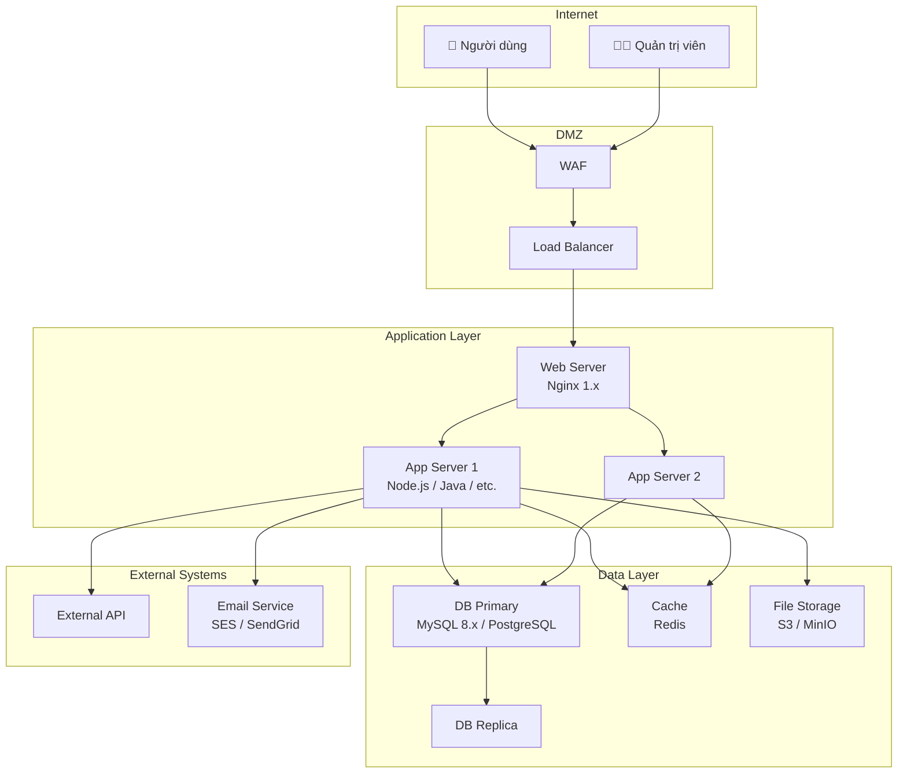
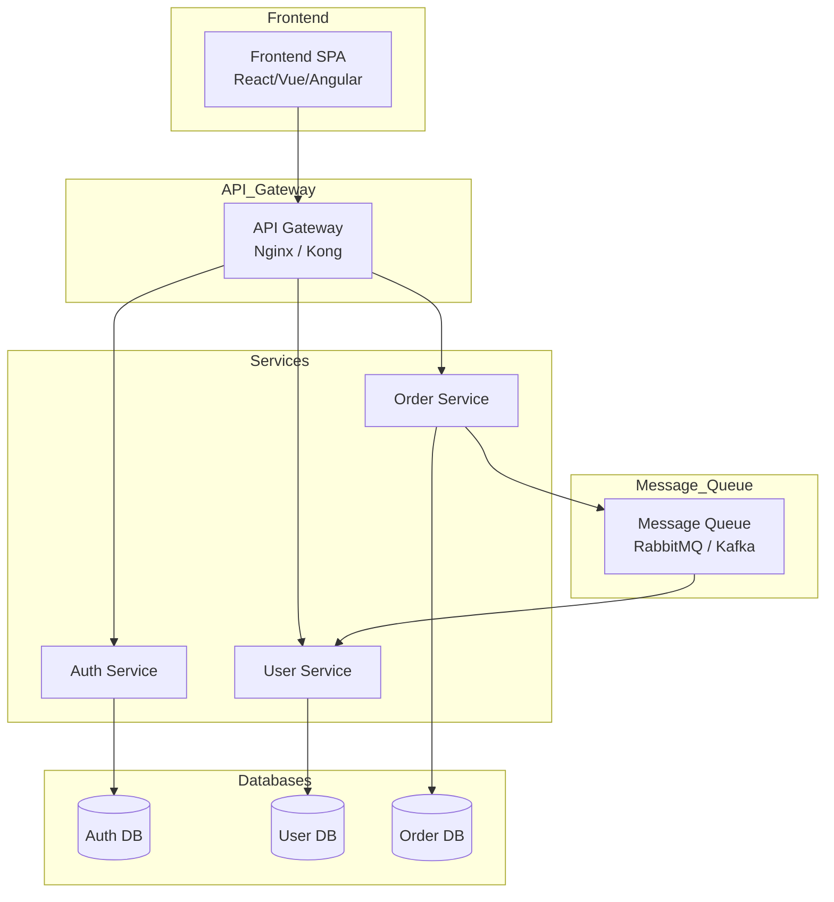

# Template BD01 — Sơ đồ cấu trúc hệ thống

## Mục đích
Cung cấp cái nhìn tổng quan về toàn bộ hệ thống: các thành phần, server, mạng, và cách chúng kết nối với nhau. Đây là tài liệu nền tảng để tất cả thành viên team — từ BA, dev đến QA và khách hàng Nhật — đều có chung hiểu biết về hệ thống.

---

## Template

# [BD01] Sơ đồ cấu trúc hệ thống

| Mục | Nội dung |
|----- |--------- |
| Dự án | [Tên dự án] |
| Phiên bản | 1.0 |
| Ngày tạo | YYYY-MM-DD |
| Người tạo | [Tên] |
| Ngày cập nhật | YYYY-MM-DD |
| Trạng thái | Draft |

## Lịch sử thay đổi

| Phiên bản | Ngày | Người thực hiện | Nội dung thay đổi |
|----------- |------ |----------------- |------------------- |
| 1.0 | YYYY-MM-DD | [Tên] | Tạo mới |

---

## 1. Tổng quan hệ thống

[Mô tả ngắn gọn về hệ thống, mục đích, và phạm vi triển khai]

## 2. Sơ đồ cấu trúc hệ thống

> **Chú thích sơ đồ:** [Giải thích các thành phần chính và mối quan hệ giữa chúng]

## 3. Danh sách thành phần

| Thành phần | Vai trò | Công nghệ | Số lượng | Môi trường |
|----------- |--------- |----------- |---------- |----------- |
| Load Balancer | Phân tải | [Tên LB] | 1 | Production |
| Web Server | Xử lý HTTP | Nginx | 2 | Production |
| App Server | Xử lý business logic | [Tech stack] | 2 | Production |
| DB Primary | Lưu trữ chính | MySQL 8.x | 1 | Production |
| DB Replica | Đọc dữ liệu | MySQL 8.x | 1 | Production |
| Cache | Lưu cache | Redis | 1 | Production |
| File Storage | Lưu file | S3 | 1 | Production |

## 4. Thông tin môi trường

| Môi trường | Mục đích | URL | Ghi chú |
|----------- |--------- |----- |--------- |
| Development (DEV) | Phát triển nội bộ | https://dev.example.com | |
| Staging (STG) | Test & demo khách hàng | https://stg.example.com | |
| Production (PRD) | Môi trường thực tế | https://example.com | |

## 5. Giao tiếp giữa các thành phần

| Từ | Đến | Protocol | Port | Ghi chú |
|---- |----- |---------- |------ |--------- |
| LB | Web Server | HTTP | 80 | Internal |
| Web Server | App Server | HTTP | 8080 | Internal |
| App Server | DB | TCP | 3306 | |
| App Server | Cache | TCP | 6379 | |

## 6. Ghi chú bổ sung

[Các điểm đặc biệt cần lưu ý về hạ tầng, bảo mật, scaling, etc.]

---

## Hướng dẫn điền template

1. **Thay thế `[Tên dự án]`** bằng tên dự án thực tế
2. **Cập nhật Mermaid diagram** theo kiến trúc thực tế của dự án — thêm/bớt node, thay đổi tên công nghệ
3. **Điền bảng thành phần** đầy đủ với công nghệ cụ thể (version, số lượng instance)
4. **Điền URL môi trường** thực tế (hoặc để placeholder nếu chưa có)
5. **Diagram có thể thay đổi layout:** dùng `graph LR` thay `graph TB` nếu hệ thống nhiều layers theo chiều ngang

## Mermaid nâng cao cho BD01

Với hệ thống microservice, dùng style này:

