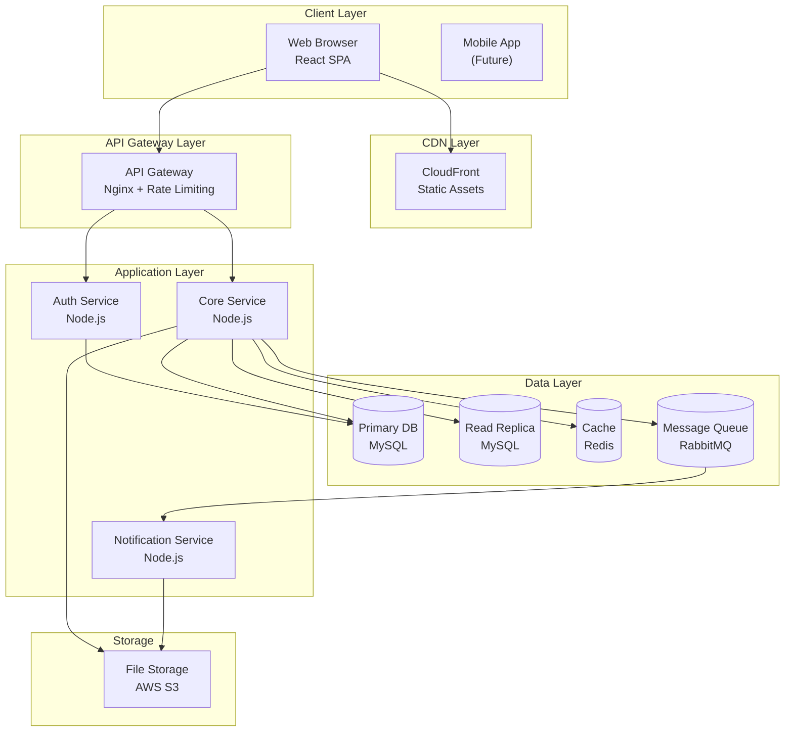
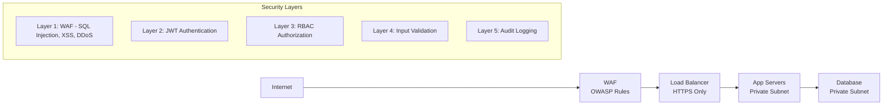

# Template BD02 — Tài liệu kiến trúc

## Mục đích
Giải thích các quyết định kiến trúc tổng thể cho hệ thống lớn, microservice, hoặc khi cần giải thích tech stack cho khách hàng. Khác với BD01 (mô tả cái gì), BD02 giải thích lý do (tại sao chọn kiến trúc này).

**Khi nào cần:** Hệ thống lớn, microservice, cần justification cho tech choices, hoặc khách hàng hỏi về architecture.

---

## Template

# [BD02] Tài liệu kiến trúc

| Mục | Nội dung |
|----- |--------- |
| Dự án | [Tên dự án] |
| Phiên bản | 1.0 |
| Ngày tạo | YYYY-MM-DD |
| Người tạo | [Tên Tech Lead] |
| Trạng thái | Draft |

---

## 1. Tổng quan kiến trúc

### Pattern kiến trúc

[Ví dụ: Monolithic / Layered MVC / Microservices / Serverless]

**Lý do lựa chọn:** [Giải thích tại sao chọn pattern này cho dự án này]

### Tech Stack

| Layer | Technology | Lý do chọn |
|------- |----------- |----------- |
| Frontend | React 18 + TypeScript | Type safety, component reuse, client demand |
| Backend | Node.js + Express / Java Spring | Team expertise, performance |
| Database | MySQL 8.x | ACID compliance, team familiarity |
| Cache | Redis | Low latency read, session storage |
| Message Queue | RabbitMQ / Kafka | Async processing, decoupling |
| Infrastructure | AWS (EC2, RDS, S3) | Client requirement |
| CI/CD | GitHub Actions | Version control integration |
| Container | Docker + Compose | Dev environment consistency |

---

## 2. Kiến trúc tổng thể

---

## 3. Các quyết định kiến trúc quan trọng

### ADR-001: Monolith vs Microservices

| Mục | Nội dung |
|----- |--------- |
| Quyết định | Bắt đầu với Monolith, tách ra Microservices khi cần |
| Lý do | Team size nhỏ (5 người), deadline 6 tháng, chưa cần scale độc lập |
| Hệ quả | Dễ develop ban đầu, nhưng có thể cần refactor về sau |
| Người quyết định | Tech Lead + PM |
| Ngày | 2024-01-10 |

### ADR-002: Soft Delete vs Hard Delete

| Mục | Nội dung |
|----- |--------- |
| Quyết định | Dùng soft delete (`deleted_at` column) cho tất cả entity |
| Lý do | Khách hàng yêu cầu audit trail, khả năng khôi phục dữ liệu |
| Hệ quả | Query phải luôn filter `WHERE deleted_at IS NULL` |
| Người quyết định | Tech Lead + Khách hàng |
| Ngày | 2024-01-15 |

---

## 4. Chiến lược bảo mật

---

## 5. Chiến lược scaling

| Tình huống | Chiến lược | Timeline |
|----------- |----------- |--------- |
| Traffic tăng 2x | Thêm App server (horizontal) | < 30 phút |
| DB load tăng | Thêm Read Replica | < 1 giờ |
| Traffic tăng 10x | Review kiến trúc, có thể cần tách service | Planning |
| Global expansion | Thêm region, CDN | Future |

---

## Hướng dẫn điền template BD02

1. **ADR (Architecture Decision Record)** cho mỗi quyết định quan trọng — giúp người mới hiểu tại sao
2. **Trade-offs phải rõ ràng** — mỗi lựa chọn kiến trúc đều có đánh đổi, ghi rõ
3. **Tech stack + lý do** — khách hàng Nhật sẽ hỏi "tại sao chọn X không phải Y"
4. **Sơ đồ security layers** — phổ biến trong tài liệu Nhật, thể hiện sự nghiêm túc về bảo mật
