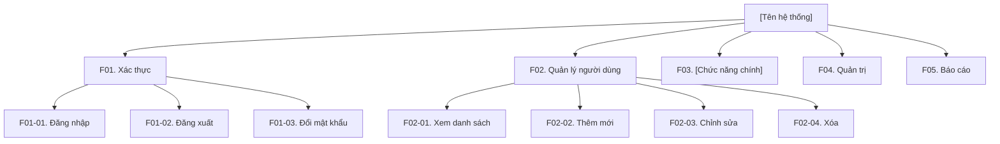
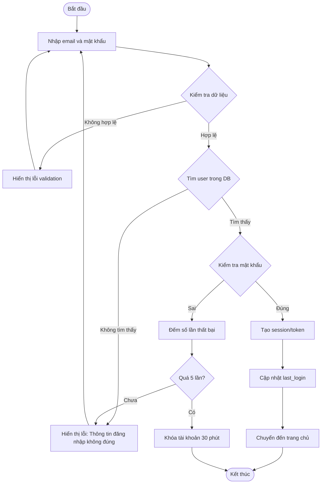

# Template BD03 — Danh sách & Thiết kế chức năng

## Mục đích
Xác định đầy đủ tất cả chức năng của hệ thống, phân loại theo module, và mô tả chi tiết luồng xử lý. Tài liệu này là "bản đồ" của hệ thống — tránh sót chức năng và là cơ sở để estimate, phân công dev, và viết test case.

---

## Template Phần 1: Danh sách chức năng

# [BD03] Danh sách & Thiết kế chức năng

| Mục | Nội dung |
|----- |--------- |
| Dự án | [Tên dự án] |
| Phiên bản | 1.0 |
| Ngày tạo | YYYY-MM-DD |
| Người tạo | [Tên] |
| Trạng thái | Draft |

## Lịch sử thay đổi

| Phiên bản | Ngày | Người thực hiện | Nội dung thay đổi |
|----------- |------ |----------------- |------------------- |
| 1.0 | YYYY-MM-DD | [Tên] | Tạo mới |

---

## 1. Danh sách chức năng

### 1.1. Bản đồ chức năng tổng quan

### 1.2. Bảng danh sách chức năng chi tiết

| ID chức năng | Tên chức năng | Module | Loại | Ưu tiên | Ghi chú |
|------------- |-------------- |-------- |------ |--------- |--------- |
| F01-01 | Đăng nhập | Authentication | Bắt buộc | High | |
| F01-02 | Đăng xuất | Authentication | Bắt buộc | High | |
| F01-03 | Đổi mật khẩu | Authentication | Bắt buộc | Medium | |
| F02-01 | Xem danh sách người dùng | User | Bắt buộc | High | |
| F02-02 | Thêm người dùng | User | Bắt buộc | High | |
| F02-03 | Chỉnh sửa người dùng | User | Bắt buộc | High | |
| F02-04 | Xóa người dùng | User | Bắt buộc | Medium | |
| ... | ... | ... | ... | ... | ... |

> **Loại chức năng:** Bắt buộc / Có điều kiện / Tùy chọn
> **Ưu tiên:** High / Medium / Low

---

## 2. Thiết kế chức năng chi tiết

### F01-01. Đăng nhập

#### 2.1. Thông tin chức năng

| Mục | Nội dung |
|----- |--------- |
| ID chức năng | F01-01 |
| Tên chức năng | Đăng nhập |
| Màn hình | SCR-001 (Màn hình đăng nhập) |
| Quyền truy cập | Guest (chưa đăng nhập) |
| Phương thức | POST /api/auth/login |

#### 2.2. Luồng xử lý

#### 2.3. Validation rules

| Field | Tên | Bắt buộc | Kiểu | Độ dài | Rule kiểm tra |
|------- |----- |--------- |------ |-------- |-------------- |
| email | Email | ○ | String | 1-255 | Format email hợp lệ |
| password | Mật khẩu | ○ | String | 8-50 | Ít nhất 1 chữ hoa, 1 số |

#### 2.4. Điều kiện tiền đề
- User đã được tạo trong hệ thống
- Tài khoản chưa bị khóa

#### 2.5. Điều kiện sau
- Session/token được tạo và lưu
- Thời gian đăng nhập cuối được cập nhật

#### 2.6. Xử lý ngoại lệ

| Trường hợp | Xử lý | Thông báo cho user |
|----------- |------- |------------------ |
| Email không tồn tại | Không xác nhận email nào không tồn tại (tránh enumeration attack) | "Email hoặc mật khẩu không đúng" |
| Mật khẩu sai | Tăng fail_count | "Email hoặc mật khẩu không đúng" |
| Tài khoản bị khóa | Từ chối đăng nhập | "Tài khoản đã bị khóa. Vui lòng thử lại sau 30 phút" |
| DB error | Log lỗi, trả về 500 | "Đã xảy ra lỗi hệ thống" |

---

## Hướng dẫn điền template BD03

1. **Tạo function map trước:** Dùng Mermaid `graph TD` để phác thảo toàn bộ chức năng theo module
2. **Đánh ID có hệ thống:** F[module số]-[số thứ tự], ví dụ F01-01, F02-03
3. **Mỗi chức năng quan trọng** cần có flowchart riêng (flowchart TD/LR)
4. **Flowchart nên bao gồm:** Happy path + Error handling paths
5. **Validation rules** ghi thành bảng, không dùng prose — dễ verify
6. **Link đến màn hình:** Mỗi chức năng cần reference đến ID màn hình (BD04)

## Tips viết tốt

- Dùng `flowchart TD` cho luồng xử lý từ trên xuống dưới
- Dùng `flowchart LR` cho luồng xử lý từ trái sang phải (khi có nhiều bước song song)
- Diamond shape `{}` cho decision points (if/else)
- Parallelogram `[/text/]` cho input/output
- Cylinder `[(DB)]` cho database operations
- Mỗi node trong flowchart nên mô tả rõ ràng bằng tiếng Việt (hoặc ngôn ngữ chung của team)
