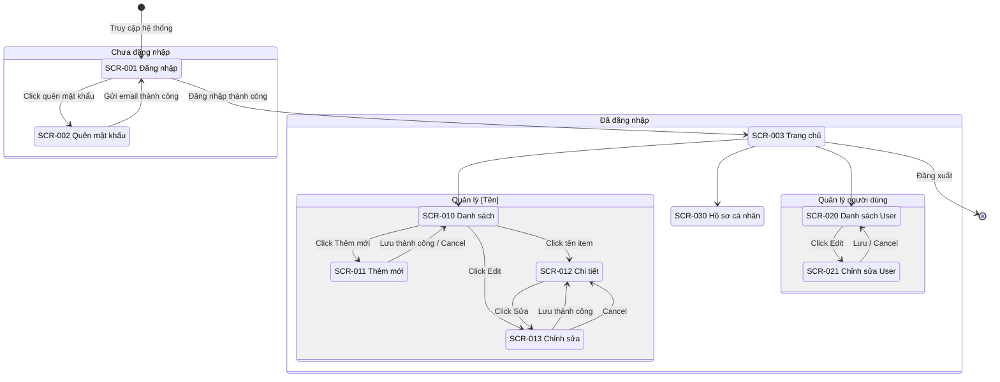
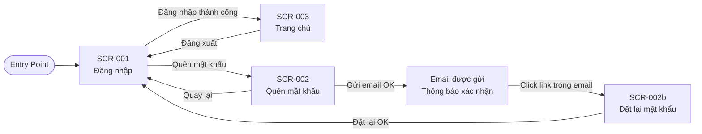
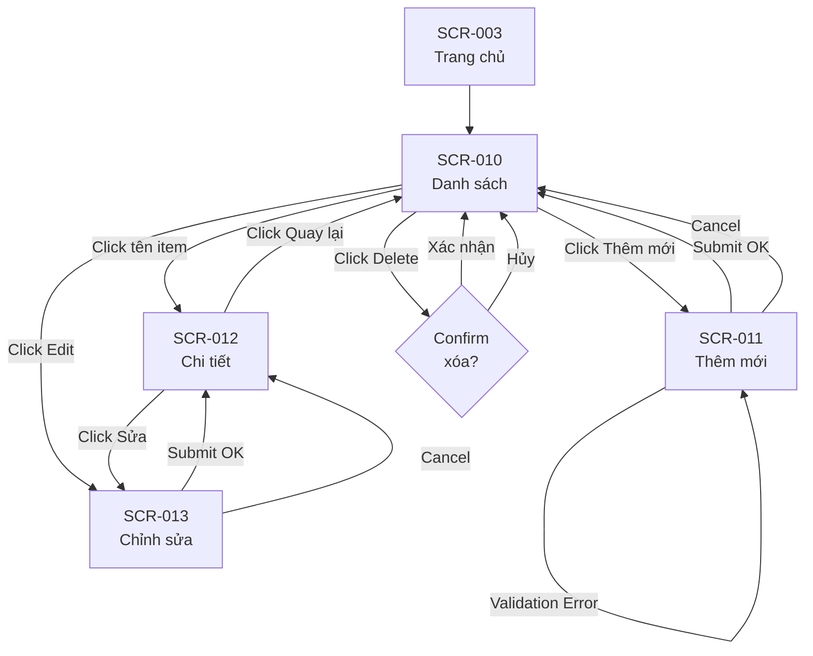

# Template BD05 — Sơ đồ chuyển màn hình

## Mục đích
Mô tả luồng điều hướng giữa các màn hình trong hệ thống — người dùng đang ở màn hình nào, thực hiện hành động gì, sẽ đến màn hình nào. Giúp đảm bảo UX nhất quán và không có "màn hình chết" (dead end).

---

## Template

# [BD05] Sơ đồ chuyển màn hình

| Mục | Nội dung |
|----- |--------- |
| Dự án | [Tên dự án] |
| Phiên bản | 1.0 |
| Ngày tạo | YYYY-MM-DD |
| Người tạo | [Tên] |
| Trạng thái | Draft |

## Lịch sử thay đổi

| Phiên bản | Ngày | Người thực hiện | Nội dung thay đổi |
|----------- |------ |----------------- |------------------- |
| 1.0 | YYYY-MM-DD | [Tên] | Tạo mới |

---

## 1. Sơ đồ tổng quan

> **Chú thích:** [Giải thích các điểm đặc biệt trong luồng điều hướng]

## 2. Chi tiết chuyển màn hình theo module

### 2.1. Module xác thực

### 2.2. Module [Tên chức năng chính]

## 3. Bảng chi tiết chuyển màn hình

| Màn hình nguồn | Hành động người dùng | Điều kiện | Màn hình đích | Ghi chú |
|--------------- |--------------------- |---------- |-------------- |--------- |
| SCR-001 | Click "Đăng nhập" | Thành công | SCR-003 | |
| SCR-001 | Click "Đăng nhập" | Thất bại | SCR-001 | Hiển thị error |
| SCR-001 | Click "Quên mật khẩu" | - | SCR-002 | |
| SCR-003 | Click menu "Danh sách" | - | SCR-010 | |
| SCR-010 | Click "Thêm mới" | - | SCR-011 | |
| SCR-010 | Click tên item | - | SCR-012 | |
| SCR-010 | Click icon Edit | - | SCR-013 | |
| SCR-010 | Click icon Delete | Confirm Yes | SCR-010 | Reload với item đã xóa |
| SCR-011 | Submit form | Thành công | SCR-010 | Toast: "Thêm thành công" |
| SCR-011 | Submit form | Validation error | SCR-011 | Hiển thị lỗi inline |
| SCR-011 | Click Cancel | - | SCR-010 | |
| SCR-012 | Click "Chỉnh sửa" | - | SCR-013 | |
| SCR-012 | Click "Quay lại" | - | SCR-010 | |
| SCR-013 | Submit form | Thành công | SCR-012 | Toast: "Cập nhật thành công" |
| SCR-013 | Click Cancel | - | SCR-012 | |

---

## Hướng dẫn điền template BD05

1. **Tổng quan trước, chi tiết sau:** Vẽ `stateDiagram-v2` tổng quan toàn hệ thống, sau đó vẽ chi tiết từng module
2. **`stateDiagram-v2`** dùng cho overview — đẹp hơn khi có nested states (Guest/Authenticated)
3. **`graph LR` hoặc `graph TD`** dùng cho chi tiết module — linh hoạt hơn, dễ thêm labels
4. **Bảng chi tiết** là phần quan trọng nhất với reviewer/PM — list đầy đủ mọi transition
5. **Điều kiện chuyển:** Ghi rõ điều kiện (success/fail/empty/etc.) để không bị miss case
6. **Dead end check:** Mọi màn hình phải có ít nhất 1 đường thoát (back, cancel, hoặc logout)
