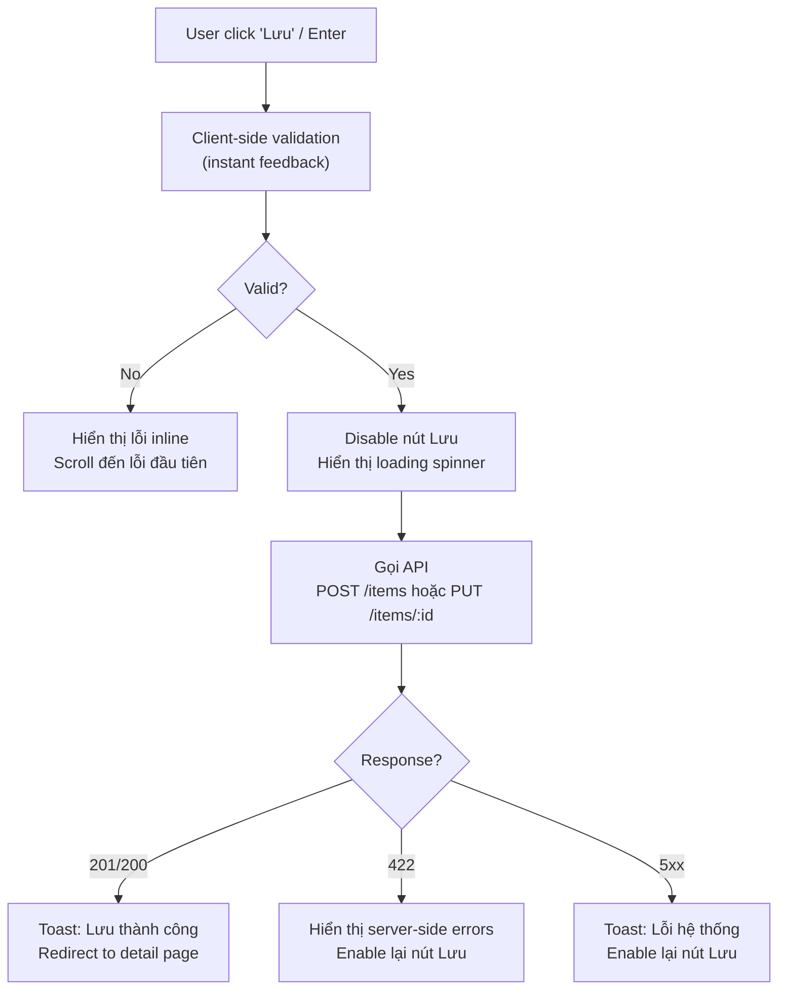
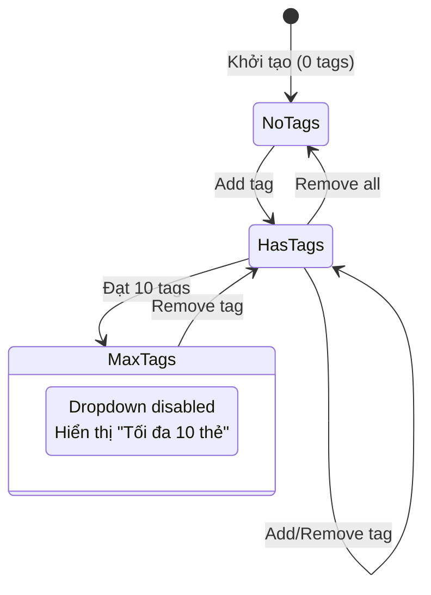

# Template BD07 — Định nghĩa Action màn hình

## Mục đích
Mô tả chi tiết từng hành động người dùng trên màn hình: event nào trigger, điều kiện nào active/disable, kết quả gì xảy ra. Dùng khi màn hình có nhiều event phức tạp như drag-drop, real-time validation, conditional display.

---

## Template

# [BD07] Định nghĩa Action màn hình

| Mục | Nội dung |
|----- |--------- |
| Dự án | [Tên dự án] |
| Phiên bản | 1.0 |
| Ngày tạo | YYYY-MM-DD |

---

## SCR-004: Màn hình Thêm

### Danh sách action

| ID Action | Tên action | Event trigger | Điều kiện active | Kết quả |
|---------- |----------- |------------- |----------------- |--------- |
| ACT-001 | Submit form | Click nút "Lưu" hoặc Enter | Luôn | Validate → API call |
| ACT-002 | Cancel | Click "Hủy" hoặc Esc | Luôn | Confirm dialog → redirect |
| ACT-003 | Preview | Click "Xem trước" | title != null | Hiển thị modal preview |
| ACT-004 | Upload thumbnail | File select | Luôn | Validate file → upload → preview |
| ACT-005 | Remove thumbnail | Click icon X trên ảnh | Có ảnh hiện tại | Xóa ảnh, restore placeholder |
| ACT-006 | Add tag | Click tag trong dropdown | Số tags < 10 | Thêm tag chip, cập nhật list |
| ACT-007 | Remove tag | Click X trên tag chip | Tag đang được chọn | Xóa tag khỏi list |
| ACT-008 | Auto-save draft | Blur khỏi field title | title != empty | Tự động lưu draft (debounce 2s) |

---

### Chi tiết từng action

#### ACT-001: Submit form

**Điều kiện disable nút Lưu:**
- Đang submit (loading state)
- Form chưa thay đổi gì (edit mode, no dirty state)

#### ACT-004: Upload thumbnail

| Bước | Xử lý | Nếu lỗi |
|------ |------- |--------- |
| 1 | Validate file type (JPEG/PNG only) | Hiển thị error toast |
| 2 | Validate file size (max 5MB) | Hiển thị error toast |
| 3 | Tạo preview local (FileReader API) | Hiển thị preview ngay |
| 4 | Upload lên S3 qua API | Loading indicator |
| 5 | Nhận URL, update form field | Hiển thị ảnh từ URL |

#### ACT-006

### Conditional display rules

| Điều kiện | Element | Hành vi |
|---------- |--------- |--------- |
| Mode = Create | Nút "Xóa item" | Ẩn (hidden) |
| Mode = Edit | Label title | Hiển thị "(Chỉnh sửa)" |
| status = published | Warning banner | Hiển thị "Đang công khai — thay đổi sẽ ảnh hưởng ngay" |
| price = null | Field stock_quantity | Ẩn (không áp dụng cho item không có giá) |
| thumbnail uploaded | Placeholder image | Ẩn, thay bằng ảnh thực |

---

## Hướng dẫn sử dụng BD07

1. **Action table trước** — liệt kê hết tất cả action trên màn hình
2. **Flowchart cho action phức tạp** — những action có nhiều bước và xử lý lỗi
3. **State diagram cho stateful UI** — tag management, multi-step form, wizard
4. **Conditional display** — table riêng liệt kê điều kiện show/hide/disable
5. Chỉ tạo BD07 khi BD04 không đủ chỗ mô tả các interaction phức tạp
