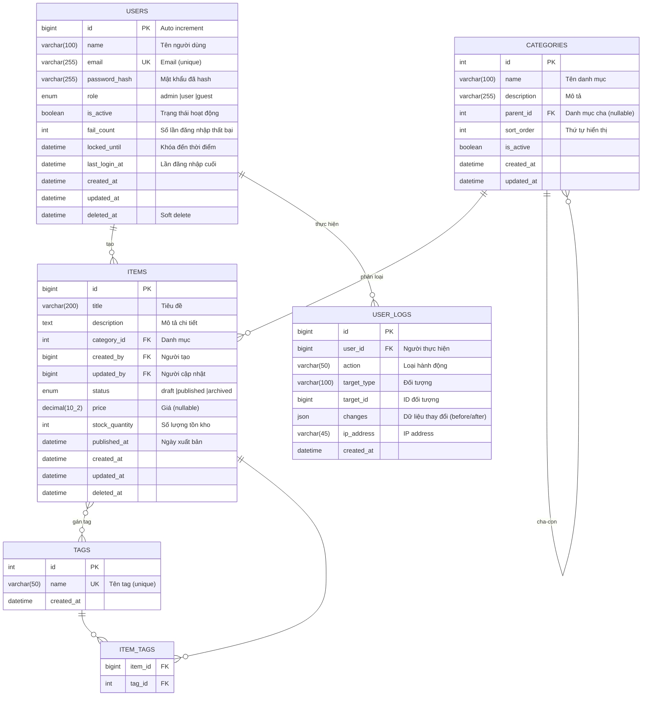
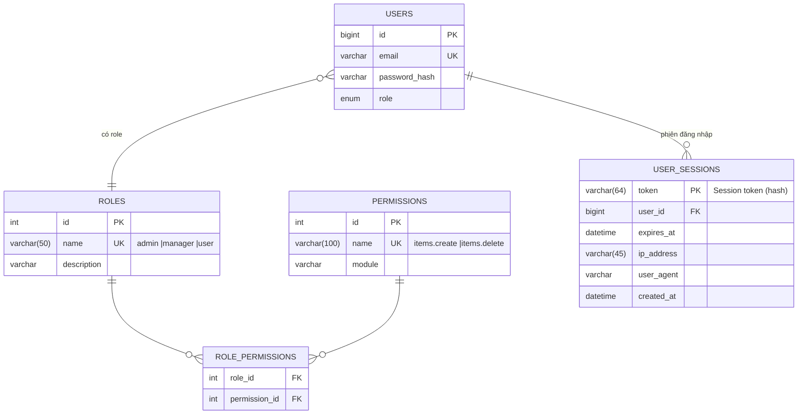
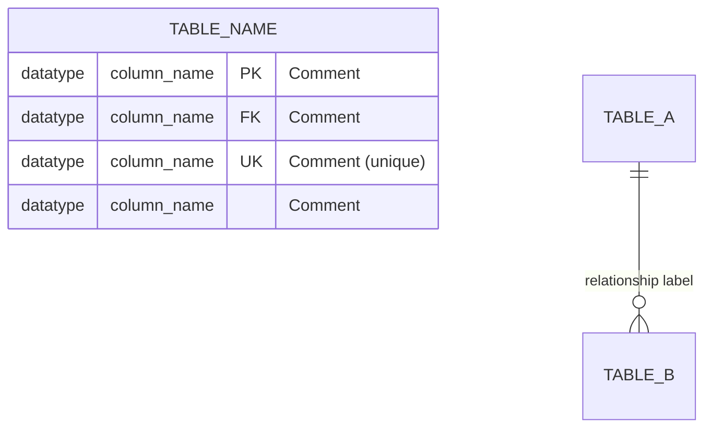

# Template BD09 — Thiết kế DB

## Mục đích
Định nghĩa toàn bộ cấu trúc dữ liệu của hệ thống: các bảng, cột, quan hệ giữa các bảng, và các ràng buộc dữ liệu. ER diagram là ngôn ngữ chung giữa BA, dev backend, và DBA — không cần giải thích nhiều nếu vẽ đúng.

---

## Template

# [BD09] Thiết kế DB

| Mục | Nội dung |
|----- |--------- |
| Dự án | [Tên dự án] |
| Phiên bản | 1.0 |
| Ngày tạo | YYYY-MM-DD |
| Người tạo | [Tên] |
| Trạng thái | Draft |
| DBMS | MySQL 8.x / PostgreSQL / etc. |
| Encoding | UTF-8 |

## Lịch sử thay đổi

| Phiên bản | Ngày | Người thực hiện | Nội dung thay đổi |
|----------- |------ |----------------- |------------------- |
| 1.0 | YYYY-MM-DD | [Tên] | Tạo mới |

---

## 1. ER Diagram tổng quan

> **Chú thích ký hiệu:**
> - ` ||` = Exactly one (bắt buộc có 1)
> - `} |` = One or more (ít nhất 1)
> - ` |o` = Zero or one (0 hoặc 1)
> - `}o` = Zero or more (0 hoặc nhiều)

## 2. ER Diagram theo module

### 2.1. Module xác thực & phân quyền

---

## 3. Quy tắc thiết kế DB

### 3.1. Naming conventions

| Đối tượng | Quy tắc | Ví dụ |
|---------- |--------- |------- |
| Tên bảng | snake_case, số nhiều | `users`, `order_items` |
| Tên cột | snake_case | `created_at`, `user_id` |
| Primary key | `id` (bigint auto increment) | `id` |
| Foreign key | `[table_name_singular]_id` | `user_id`, `category_id` |
| Unique key | Đặt UK constraint | |
| Timestamp | Luôn có `created_at`, `updated_at` | |
| Soft delete | Dùng `deleted_at` (nullable) | |
| Boolean | Prefix `is_` | `is_active`, `is_deleted` |
| Enum | Ghi rõ các giá trị cho phép | `enum('draft','published')` |

### 3.2. Quy ước bảng chung

Mọi bảng chính (entity tables) đều có các cột sau:
- `id` — BIGINT UNSIGNED, AUTO_INCREMENT, PRIMARY KEY
- `created_at` — DATETIME, NOT NULL, DEFAULT CURRENT_TIMESTAMP
- `updated_at` — DATETIME, NOT NULL, DEFAULT CURRENT_TIMESTAMP ON UPDATE CURRENT_TIMESTAMP
- `deleted_at` — DATETIME, NULL (soft delete)

Bảng junction (many-to-many) chỉ cần 2 FK columns.

### 3.3. Danh sách bảng

| ID bảng | Tên bảng | Mô tả | Ghi chú |
|-------- |--------- |------- |--------- |
| T001 | users | Quản lý người dùng | |
| T002 | categories | Danh mục phân loại | Self-referencing |
| T003 | items | Dữ liệu chính | |
| T004 | tags | Nhãn/Tag | |
| T005 | item_tags | Junction table items-tags | M:N |
| T006 | user_logs | Audit log | |

---

## Hướng dẫn vẽ Mermaid erDiagram

### Cú pháp cơ bản

### Quan hệ thường dùng
- ` ||-- ||` One-to-one (1:1)
- ` ||--o{` One-to-many (1:N), bên phải là many (0 hoặc nhiều)
- `}o--o{` Many-to-many (M:N) — thường qua junction table
- ` ||--o |` One-to-one optional (1:0..1)

### Kiểu dữ liệu viết trong erDiagram (mang tính minh họa)
`int`, `bigint`, `varchar(n)`, `text`, `decimal(p,s)`, `datetime`, `date`, `boolean`, `json`, `enum`

**Lưu ý:** Mermaid erDiagram không validate kiểu dữ liệu — viết để mô tả, không phải SQL. Chi tiết SQL schema ghi trong BD10.
