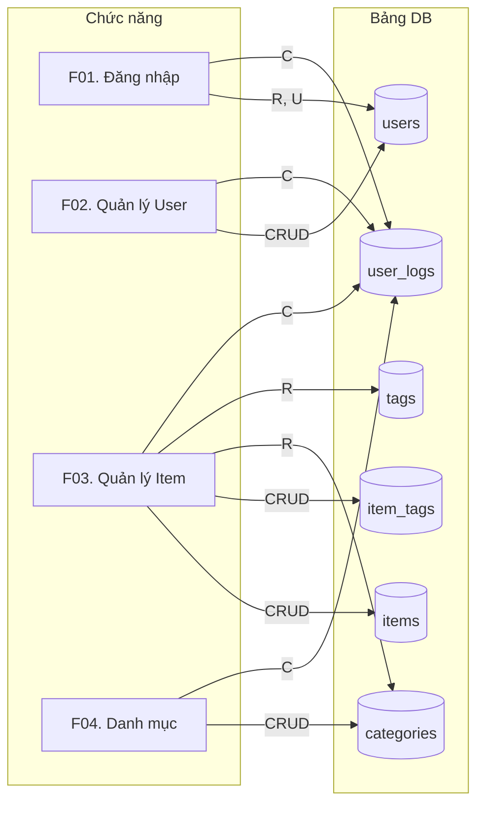

# Template BD11 — Biểu đồ CRUD

## Mục đích
Tổng hợp mối quan hệ giữa chức năng và bảng DB: chức năng nào tác động đến bảng nào, và tác động đó là Create/Read/Update/Delete. Giúp phát hiện chức năng thiếu DB support và đảm bảo không có bảng "mồ côi" (không được dùng).

---

## Template

# [BD11] Biểu đồ CRUD

| Mục | Nội dung |
|----- |--------- |
| Dự án | [Tên dự án] |
| Phiên bản | 1.0 |
| Ngày tạo | YYYY-MM-DD |
| Người tạo | [Tên] |
| Trạng thái | Draft |

## Lịch sử thay đổi

| Phiên bản | Ngày | Người thực hiện | Nội dung thay đổi |
|----------- |------ |----------------- |------------------- |
| 1.0 | YYYY-MM-DD | [Tên] | Tạo mới |

---

## CRUD Matrix

Ký hiệu:
- **C** = Create (tạo mới)
- **R** = Read (đọc)
- **U** = Update (cập nhật)
- **D** = Delete (xóa)
- *(trống)* = không tác động

| Chức năng | users | categories | items | tags | item_tags | user_logs |
|---------------- |------- |----------- |------- |------ |----------- |----------- |
| **F01. Xác thực** | | | | | | |
| F01-01 Đăng nhập | R, U | | | | | C |
| F01-02 Đăng xuất | | | | | | C |
| F01-03 Đổi mật khẩu | R, U | | | | | C |
| **F02. Người dùng** | | | | | | |
| F02-01 Xem danh sách user | R | | | | | |
| F02-02 Thêm user | C | | | | | C |
| F02-03 Sửa user | R, U | | | | | C |
| F02-04 Xóa user | R, D | | | | | C |
| **F03. Quản lý Item** | | | | | | |
| F03-01 Xem danh sách item | R | R | R | R | R | |
| F03-02 Thêm item | | | C | R | C | C |
| F03-03 Sửa item | | | R, U | R | U | C |
| F03-04 Xem chi tiết item | | R | R | R | R | |
| F03-05 Xóa item | | | R, D | | D | C |
| **F04. Quản lý danh mục** | | | | | | |
| F04-01 Xem danh sách danh mục | | R | | | | |
| F04-02 Thêm danh mục | | C | | | | C |
| F04-03 Sửa danh mục | | R, U | | | | C |
| F04-04 Xóa danh mục | | R, D | R | | | C |
| **F05. Báo cáo** | | | | | | |
| F05-01 Báo cáo thống kê | R | R | R | R | R | |
| F05-02 Export dữ liệu | | | R | R | R | R |

---

## Phân tích CRUD

### Bảng không có CREATE → cần kiểm tra
| Bảng | Lý do |
|------ |------- |
| *(kiểm tra matrix xem bảng nào thiếu C)* | |

### Chức năng phức tạp (tác động nhiều bảng)
| Chức năng | Bảng bị ảnh hưởng | Cần transaction? |
|---------- |------------------ |----------------- |
| F03-02 Thêm item | items, item_tags, user_logs | Có |
| F02-04 Xóa user | users, user_logs | Có |

---

## Sơ đồ luồng dữ liệu

---

## Hướng dẫn điền template BD11

1. **Rows = chức năng, Columns = bảng** — layout chuẩn cho CRUD matrix
2. **Ghi cả loại operation:** Không chỉ "X" mà ghi "C", "R", "U", "D" hoặc tổ hợp "R, U"
3. **Group chức năng theo module** — dùng header row (in đậm) để phân nhóm
4. **Phân tích sau matrix:** Tìm bảng không có C (ai tạo dữ liệu?), chức năng tác động nhiều bảng (cần transaction?)
5. **Sơ đồ luồng** — optional nhưng hữu ích để thấy toàn cảnh dependency

## Ký hiệu CRUD trong Mermaid

Dùng graph để vẽ dependency thay vì matrix khi hệ thống có nhiều chức năng và bảng — dễ thấy "bảng nào được nhiều chức năng dùng nhất" (= critical tables, cần index tốt).
