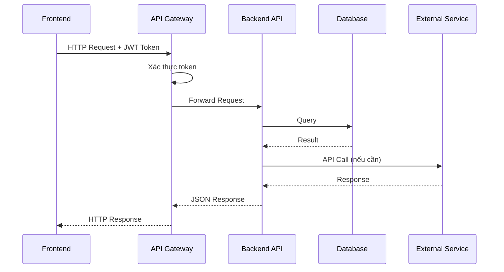
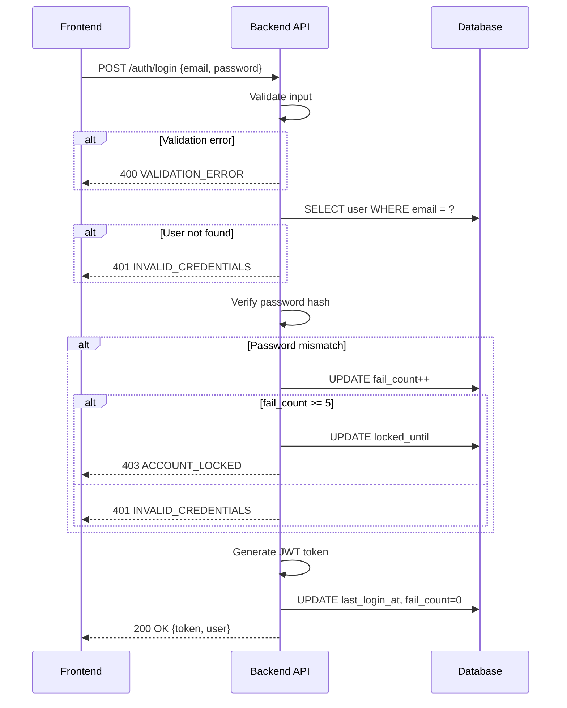
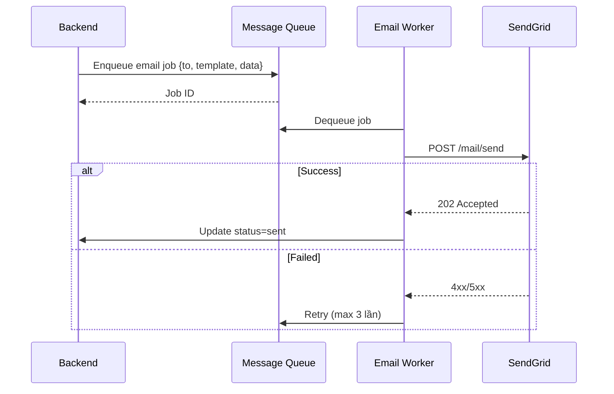

# Template BD12 — Thiết kế I/F (API)

## Mục đích
Định nghĩa giao tiếp giữa hệ thống với các service ngoài hoặc giữa các component nội bộ qua API. Cần thiết khi có: REST API, webhook, kết nối với hệ thống bên thứ 3, hoặc microservice. Tài liệu này là hợp đồng giữa backend team và frontend/client.

---

## Template

# [BD12] Thiết kế I/F (API)

| Mục | Nội dung |
|----- |--------- |
| Dự án | [Tên dự án] |
| Phiên bản | 1.0 |
| Ngày tạo | YYYY-MM-DD |
| Người tạo | [Tên] |
| Trạng thái | Draft |
| Base URL | https://api.example.com/v1 |
| Authentication | Bearer Token (JWT) |
| Content-Type | application/json |

## Lịch sử thay đổi

| Phiên bản | Ngày | Người thực hiện | Nội dung thay đổi |
|----------- |------ |----------------- |------------------- |
| 1.0 | YYYY-MM-DD | [Tên] | Tạo mới |

---

## 1. Tổng quan kết nối



---

## 2. Danh sách API

| Method | Endpoint | Chức năng | Auth | Ghi chú |
|-------- |--------- |----------- |------ |--------- |
| POST | /auth/login | Đăng nhập | Public | |
| POST | /auth/logout | Đăng xuất | Required | |
| GET | /users | Danh sách users | Admin | |
| POST | /users | Tạo user | Admin | |
| GET | /users/{id} | Chi tiết user | Admin/Self | |
| PUT | /users/{id} | Cập nhật user | Admin/Self | |
| DELETE | /users/{id} | Xóa user | Admin | Soft delete |
| GET | /items | Danh sách items | Required | Có filter, sort, paging |
| POST | /items | Tạo item | Required | |
| GET | /items/{id} | Chi tiết item | Required | |
| PUT | /items/{id} | Cập nhật item | Required | |
| DELETE | /items/{id} | Xóa item | Required | Soft delete |

---

## 3. Đặc tả API chi tiết

### POST /auth/login

**Mục đích:** Xác thực thông tin đăng nhập và trả về JWT token

**Request:**
```
POST /auth/login
Content-Type: application/json
```

**Request Body:**
```json
{
  "email": "user@example.com",
  "password": "SecurePass123"
}
```

| Field | Kiểu | Bắt buộc | Validation | Mô tả |
|------- |------ |--------- |------------ |------- |
| email | string | Có | email format, max 255 | Email đăng nhập |
| password | string | Có | min 8, max 50 | Mật khẩu |

**Response thành công (200 OK):**
```json
{
  "status": "success",
  "data": {
    "token": "eyJhbGciOiJIUzI1NiIsInR5cCI6IkpXVCJ9...",
    "token_type": "Bearer",
    "expires_in": 3600,
    "user": {
      "id": 1,
      "name": "Nguyen Van A",
      "email": "user@example.com",
      "role": "user"
    }
  }
}
```

**Response lỗi:**

| HTTP Status | Error Code | Mô tả |
|------------ |----------- |------- |
| 400 | VALIDATION_ERROR | Dữ liệu đầu vào không hợp lệ |
| 401 | INVALID_CREDENTIALS | Email hoặc mật khẩu sai |
| 403 | ACCOUNT_LOCKED | Tài khoản bị khóa |
| 500 | INTERNAL_ERROR | Lỗi hệ thống |

**Error Response Format:**
```json
{
  "status": "error",
  "error": {
    "code": "INVALID_CREDENTIALS",
    "message": "Email hoặc mật khẩu không đúng",
    "details": null
  }
}
```

**Sequence diagram:**


---

### GET /items — Danh sách items

**Query Parameters:**

| Param | Kiểu | Bắt buộc | Default | Mô tả |
|------- |------ |--------- |--------- |------- |
| page | integer | - | 1 | Số trang |
| limit | integer | - | 20 | Số kết quả/trang (max: 100) |
| keyword | string | - | - | Tìm kiếm theo tên (LIKE) |
| status | string | - | - | Lọc theo trạng thái |
| category_id | integer | - | - | Lọc theo danh mục |
| sort_by | string | - | created_at | Cột sort |
| sort_order | string | - | desc | asc / desc |

**Response (200 OK):**
```json
{
  "status": "success",
  "data": {
    "items": [
      {
        "id": 1,
        "title": "Item A",
        "status": "published",
        "category": {"id": 1, "name": "Category A"},
        "created_at": "2024-01-15T10:30:00Z"
      }
    ],
    "pagination": {
      "total": 100,
      "page": 1,
      "limit": 20,
      "total_pages": 5
    }
  }
}
```

---

## 4. Kết nối hệ thống ngoài

### 4.1. Email Service (SendGrid / SES)

| Mục | Nội dung |
|----- |--------- |
| Service | SendGrid / AWS SES |
| Mục đích | Gửi email thông báo, reset password |
| Auth | API Key |
| Endpoint | https://api.sendgrid.com/v3/mail/send |

**Luồng gửi email:**


---

## 5. Common Response Format

```json
// Success
{
  "status": "success",
  "data": { ... }
}

// Error
{
  "status": "error",
  "error": {
    "code": "ERROR_CODE",
    "message": "Human readable message",
    "details": { ... }
  }
}

// List with pagination
{
  "status": "success",
  "data": {
    "items": [...],
    "pagination": {
      "total": 100,
      "page": 1,
      "limit": 20,
      "total_pages": 5
    }
  }
}
```

---

## Hướng dẫn điền template BD12

1. **Sequence diagram** cho mỗi API phức tạp — giúp người review hiểu flow mà không cần đọc code
2. **Error codes** phải định nghĩa rõ ràng — tránh generic "500 Internal Error"
3. **Validation rules** trong bảng, không trong prose
4. **Common format** — định nghĩa 1 lần, tất cả API tuân theo
5. **External service diagrams** — vẽ riêng cho từng service ngoài
