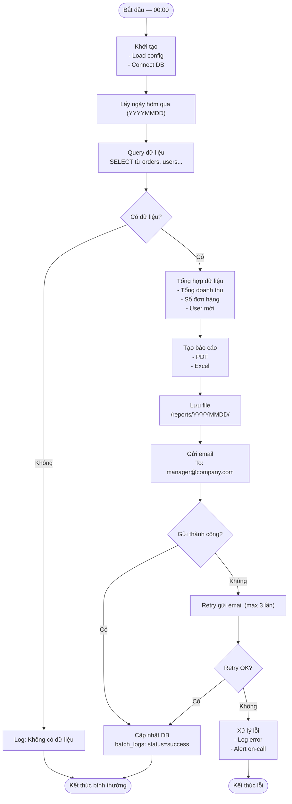

# Template BD13 — Thiết kế Batch

## Mục đích
Mô tả chi tiết các tiến trình chạy nền (batch/job) — lịch chạy, luồng xử lý, xử lý lỗi, và log. Cần thiết khi hệ thống có: import/export định kỳ, gửi email hàng loạt, tổng hợp dữ liệu, hay bất kỳ tác vụ scheduled nào.

---

## Template

# [BD13] Thiết kế Batch

| Mục | Nội dung |
|----- |--------- |
| Dự án | [Tên dự án] |
| Phiên bản | 1.0 |
| Ngày tạo | YYYY-MM-DD |
| Người tạo | [Tên] |
| Trạng thái | Draft |

---

## 1. Danh sách batch

| ID | Tên batch | Lịch chạy | Trigger | Thời gian dự kiến | Ghi chú |
|---- |--------- |---------- |--------- |----------------- |--------- |
| BATCH-01 | Daily Report | Mỗi ngày 00:00 | Cron | 15 phút | |
| BATCH-02 | Email Notification | Mỗi giờ | Cron | 5 phút | |
| BATCH-03 | Data Cleanup | Mỗi Chủ nhật 03:00 | Cron | 30 phút | Xóa log cũ |
| BATCH-04 | Import CSV | Manual / API trigger | Event | Tùy file size | |

---

## 2. Thiết kế chi tiết từng batch

### BATCH-01: Daily Report

#### Thông tin batch

| Mục | Nội dung |
|----- |--------- |
| ID | BATCH-01 |
| Tên | Daily Report Generation |
| Lịch chạy | `0 0 * * *` (00:00 hàng ngày, theo timezone đã cấu hình) |
| Timeout | 30 phút |
| Retry | 3 lần, delay 5 phút |
| Language/Runtime | Node.js / Python / Java |
| Log file | `/var/log/batch/daily-report-YYYYMMDD.log` |

#### Luồng xử lý



#### Input / Output

| Mục | Chi tiết |
|----- |--------- |
| Input | Không có input trực tiếp |
| Output - Report file | `/reports/{YYYYMMDD}/daily-report.pdf` |
| Output - Excel | `/reports/{YYYYMMDD}/daily-report.xlsx` |
| Output - Email | Gửi đến `manager@company.com` |
| DB tables đọc | `orders`, `users`, `items` |
| DB tables ghi | `batch_logs` |

#### Xử lý lỗi

| Loại lỗi | Xử lý | Notification | Retry? |
|--------- |------- |------------- |------- |
| DB connection error | Log error, exit code 1 | Alert on-call | Có, max 3 lần |
| Query timeout | Log error, exit code 1 | Alert on-call | Có, max 3 lần |
| File write error | Log error | Email to dev team | Không |
| Email send error | Retry 3 lần | Log nếu fail hết | Có, max 3 lần |
| Không có dữ liệu | Log warning, exit code 0 | Không | Không |

#### Log format

```
[YYYY-MM-DD HH:mm:ss] [LEVEL] [BATCH-01] Message
[2024-01-15 00:00:01] [INFO]  [BATCH-01] Batch started
[2024-01-15 00:00:02] [INFO]  [BATCH-01] Processing date: 2024-01-14
[2024-01-15 00:01:30] [INFO]  [BATCH-01] Aggregated 1,234 orders, total: 5,678,900
[2024-01-15 00:02:00] [INFO]  [BATCH-01] Report saved: /reports/20240114/daily-report.pdf
[2024-01-15 00:02:15] [INFO]  [BATCH-01] Email sent to manager@company.com
[2024-01-15 00:02:16] [INFO]  [BATCH-01] Batch completed. Duration: 135s
```

---

## 3. Lịch chạy batch tổng hợp

```mermaid
gantt
    title Lịch chạy batch hàng ngày
    dateFormat HH:mm
    axisFormat %H:%M

    section Night batch
    BATCH-03 Cleanup     :00:00, 30m
    BATCH-01 Daily Report :00:30, 15m

    section Hourly batch
    BATCH-02 Email (00:00) :01:00, 5m
    BATCH-02 Email (01:00) :02:00, 5m

    section Business hours
    BATCH-04 CSV Import (manual) :09:00, 30m
```

---

## 4. Bảng batch_logs

| Cột | Kiểu | Mô tả |
|----- |------ |------- |
| id | BIGINT PK | |
| batch_id | VARCHAR(20) | 'BATCH-01', 'BATCH-02', ... |
| started_at | DATETIME | Thời điểm bắt đầu |
| ended_at | DATETIME | Thời điểm kết thúc |
| status | ENUM | 'running', 'success', 'failed' |
| records_processed | INT | Số records đã xử lý |
| error_message | TEXT | Nếu failed |
| log_file_path | VARCHAR(255) | Đường dẫn log file |

---

## Hướng dẫn điền template BD13

1. **Flowchart bắt buộc** cho mỗi batch — vẽ cả happy path lẫn error path
2. **Cron expression** ghi rõ timezone — hệ thống Nhật luôn dùng JST (UTC+9)
3. **Timeout** — mỗi batch phải có timeout, tránh zombie process
4. **Log format** — chuẩn hóa 1 format, dễ parse và debug
5. **batch_logs table** — cần có để monitor và alert khi batch fail
6. **Retry policy** — ghi rõ max retry, delay, và điều kiện không retry
