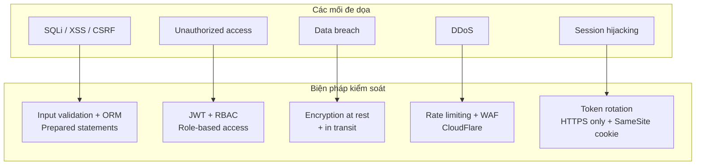
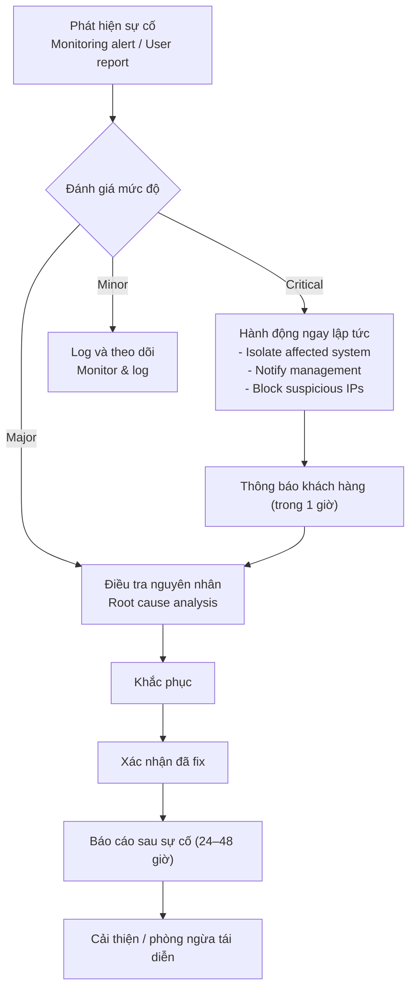

# Template BD15 — Thiết kế bảo mật

## Mục đích
Mô tả chi tiết các biện pháp bảo mật được áp dụng. Bắt buộc với hệ thống tài chính, y tế, hoặc xử lý dữ liệu cá nhân. Trong các lĩnh vực này, phía khách hàng thường yêu cầu tài liệu bảo mật theo chuẩn ISMS hoặc PCI-DSS.

---

## Template

# [BD15] Thiết kế bảo mật

| Mục | Nội dung |
|----- |--------- |
| Dự án | [Tên dự án] |
| Phiên bản | 1.0 |
| Ngày tạo | YYYY-MM-DD |
| Người tạo | [Tên] |
| Tiêu chuẩn tham chiếu | OWASP Top 10 2021 / ISMS / PCI-DSS |
| Trạng thái | Draft |

---

## 1. Mô hình mối đe dọa



---

## 2. Kiểm soát truy cập

### 2.1. RBAC Matrix

| Chức năng | Guest | User | Manager | Admin |
|---------- |------- |------ |--------- |------- |
| Xem public content | Có | Có | Có | Có |
| Xem content cá nhân | - | Có (own) | Có | Có |
| Tạo/Sửa content | - | Có (own) | Có | Có |
| Xóa content | - | - | Có (own) | Có |
| Quản lý user | - | - | - | Có |
| Xem audit log | - | - | - | Có |
| Cấu hình hệ thống | - | - | - | Có |

### 2.2. API Authorization

Mọi API request phải đi qua middleware kiểm tra:
1. JWT token hợp lệ (chữ ký, thời hạn)
2. User có quyền tương ứng với action
3. Resource ownership (nếu applicable)

---

## 3. Bảo vệ dữ liệu

### 3.1. Dữ liệu nhạy cảm

| Loại dữ liệu | Ví dụ | Cách bảo vệ |
|------------- |------- |------------ |
| Mật khẩu | password | bcrypt hash (cost 12) |
| Token | JWT, API key | SHA-256 hash khi lưu DB |
| Thông tin cá nhân | Tên, email, SĐT | Hiển thị có che (masking) trong log |
| Dữ liệu tài chính | Số thẻ, tài khoản | AES-256 encryption |
| Thông tin y tế | Dữ liệu bệnh nhân | AES-256, access logging |

### 3.2. Data masking trong log

```
# BAD - không được log như này
[INFO] User login: email=user@example.com, password=SecurePass123

# GOOD - che thông tin nhạy cảm
[INFO] User login: email=u***@example.com, user_id=12345
```

---

## 4. OWASP Top 10 Countermeasures

| OWASP | Tên | Biện pháp áp dụng |
|------- |----- |------------------- |
| A01 | Broken Access Control | RBAC, ownership check, deny by default |
| A02 | Cryptographic Failures | bcrypt, TLS 1.2+, AES-256 |
| A03 | Injection | ORM/Prepared statements, input validation |
| A04 | Insecure Design | Threat modeling, security review |
| A05 | Security Misconfiguration | IaC, secret management (không hardcode) |
| A06 | Vulnerable Components | Dependency scanning (npm audit, Dependabot) |
| A07 | Auth & Session | JWT, rate limiting, account lockout |
| A08 | Software & Data Integrity | Dependency hash verification, HMAC |
| A09 | Security Logging | Centralized logging, alert on anomaly |
| A10 | SSRF | Allowlist external URLs, validate redirects |

---

## 5. Audit Logging

### 5.1. Sự kiện phải log

| Loại sự kiện | Thông tin log | Mức độ |
|------------- |------------- |-------- |
| Đăng nhập thành công | user_id, IP, timestamp | INFO |
| Đăng nhập thất bại | email (masked), IP, timestamp, lý do | WARNING |
| Tài khoản bị khóa | user_id, IP, timestamp | WARNING |
| Thay đổi dữ liệu nhạy cảm | user_id, resource, before/after (masked) | INFO |
| Xóa dữ liệu | user_id, resource_id, timestamp | INFO |
| Truy cập bị từ chối | user_id, resource, action | WARNING |
| Thay đổi quyền | admin_id, target_user_id, old_role, new_role | INFO |

### 5.2. Log retention

| Loại log | Thời gian lưu | Storage |
|--------- |------------- |--------- |
| Access log | 90 ngày | S3 (compressed) |
| Audit log | 2 năm | S3 + archive |
| Security event | 2 năm | S3 + SIEM |
| Error log | 1 năm | S3 |

---

## 6. Incident Response Plan



---

## Hướng dẫn sử dụng BD15

1. **Threat model trước** — liệt kê mối đe dọa trước khi thiết kế biện pháp
2. **OWASP Top 10** — dùng làm checklist, ghi rõ biện pháp cho từng category
3. **RBAC matrix** — bảng quyền phải nhất quán với BD04 (màn hình) và BD03 (chức năng)
4. **Incident response** — khách hàng thường hỏi "nếu bị tấn công thì làm gì" — cần có kế hoạch rõ ràng
5. **Data masking trong log** — đặc biệt quan trọng; log personal data dạng plaintext có thể vi phạm GDPR hoặc luật bảo vệ dữ liệu tại quốc gia triển khai
