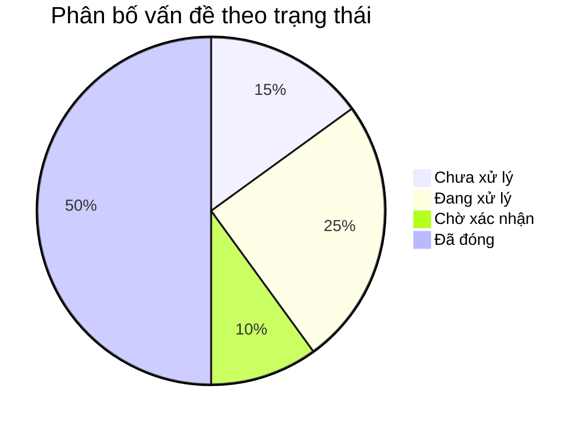
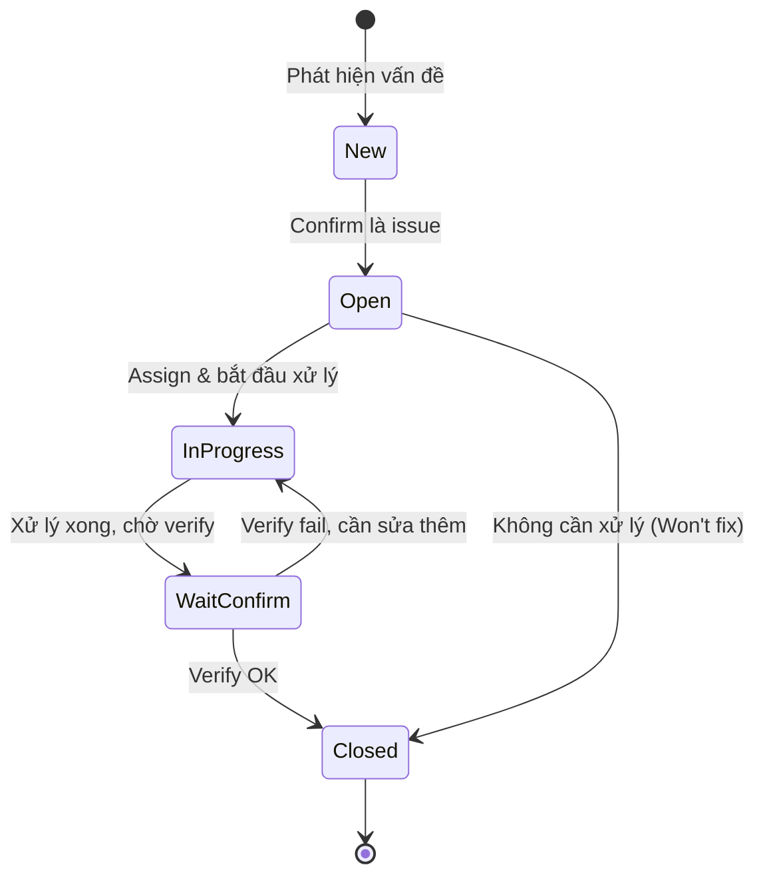

# Template BD17 — Bảng quản lý vấn đề

## Mục đích
Tracking tất cả vấn đề (issues), rủi ro, và quyết định trong suốt vòng đời dự án. Khác với BD16 (Review sheet — chỉ về tài liệu), BD17 quản lý cả vấn đề kỹ thuật, kinh doanh, và rủi ro. Đây là "sổ ghi chép" của dự án — không có BD17 tốt thì vấn đề dễ bị bỏ quên.

---

## Template

# [BD17] Bảng quản lý vấn đề

| Mục | Nội dung |
|----- |--------- |
| Dự án | [Tên dự án] |
| Phiên bản | 1.0 |
| Ngày cập nhật | YYYY-MM-DD |
| Người quản lý | [Tên PM] |

---

## 1. Tổng quan trạng thái

| Trạng thái | Số lượng | Tỉ lệ |
|----------- |--------- |------- |
| Chưa xử lý | 3 | 15% |
| Đang xử lý | 5 | 25% |
| Chờ xác nhận | 2 | 10% |
| Đã đóng | 10 | 50% |
| **Tổng** | **20** | **100%** |

---

## 2. Danh sách vấn đề

### 2.1. Vấn đề đang mở

| ID | Loại | Tiêu đề | Mô tả chi tiết | Mức độ | Trạng thái | Người xử lý | Deadline | Ngày tạo | Ngày cập nhật |
|---- |------ |-------- |--------------- |-------- |----------- |------------ |--------- |--------- |-------------- |
| ISS-001 | Technical | API response time vượt 500ms | API /items/search mất 1.2s khi có 50k records. Cần optimize query hoặc thêm index | High | Đang xử lý | Dev A | 2024-02-10 | 2024-02-01 | 2024-02-05 |
| ISS-002 | Requirement | Chưa rõ rule tính giá khi discount | Khách hàng chưa confirm: discount áp dụng trước hay sau tax? | High | Chờ xác nhận | BA B | 2024-02-08 | 2024-02-03 | 2024-02-03 |
| ISS-003 | Risk | Vendor A có thể không deliver SDK đúng hạn | Vendor A thông báo SDK có thể delay 2 tuần | Medium | Đang xử lý | PM C | 2024-02-15 | 2024-02-04 | 2024-02-04 |
| ISS-004 | QA | Test data chưa được chuẩn bị cho môi trường STG | QA cần 500 records mẫu để test performance | Low | Chưa xử lý | Dev A | 2024-02-12 | 2024-02-05 | 2024-02-05 |

### 2.2. Vấn đề đã đóng

| ID | Loại | Tiêu đề | Giải pháp áp dụng | Ngày đóng | Người đóng |
|---- |------ |-------- |----------------- |--------- |---------- |
| ISS-000 | Technical | DB connection pool quá nhỏ (max 10) | Tăng lên 50, thêm connection retry | 2024-01-25 | Dev A |

---

## 3. Phân loại vấn đề

**Loại vấn đề:**
- **Technical:** Lỗi kỹ thuật, performance, architecture
- **Requirement:** Yêu cầu chưa rõ, thay đổi scope
- **Risk:** Rủi ro có thể ảnh hưởng đến dự án
- **QA:** Vấn đề phát hiện trong quá trình test
- **Process:** Vấn đề về quy trình làm việc
- **Communication:** Vấn đề về giao tiếp với khách hàng

**Mức độ:**
- **Critical:** Có thể chặn release hoặc ảnh hưởng critical functionality
- **High:** Cần giải quyết trước milestone tiếp theo
- **Medium:** Cần theo dõi, giải quyết trong sprint hiện tại
- **Low:** Có thể defer sang sprint sau

---

## 4. Danh sách quyết định

Ghi lại các quyết định quan trọng được thống nhất — đặc biệt với phía khách hàng.

| ID | Ngày | Quyết định | Lý do | Người quyết định | Ảnh hưởng đến |
|---- |------ |----------- |------- |---------------- |-------------- |
| DEC-001 | 2024-01-15 | Sử dụng soft delete thay vì hard delete | Yêu cầu audit trail, khả năng khôi phục | PM + Khách hàng | BD10, tất cả API DELETE |
| DEC-002 | 2024-01-20 | API versioning dùng URL path (/v1/) | Backward compatibility khi upgrade | Tech Lead | BD12 |
| DEC-003 | 2024-02-01 | Không support IE | IE market share < 1%, giảm development cost | PM + Khách hàng | BD14 |

---

## 5. Danh sách rủi ro

| ID | Rủi ro | Xác suất | Tác động | Mức độ rủi ro | Biện pháp giảm thiểu | Trạng thái |
|---- |-------- |--------- |--------- |-------------- |-------------------- |---- |
| RISK-001 | Delay từ vendor | Cao | Cao | Critical | Chuẩn bị mock API, tăng buffer | Đang theo dõi |
| RISK-002 | Key developer nghỉ việc | Thấp | Cao | High | Document code tốt, pair programming | Đang theo dõi |
| RISK-003 | Yêu cầu thay đổi lớn sau midterm | Trung bình | Trung bình | Medium | Change request process rõ ràng | Đang theo dõi |
| RISK-004 | Performance không đạt yêu cầu | Thấp | Cao | High | Load testing sớm từ sprint 3 | Đã giảm thiểu |

---

## 6. Lịch sử cập nhật

| Ngày | Người cập nhật | Nội dung cập nhật |
|------ |-------------- |----------------- |
| YYYY-MM-DD | [Tên] | Thêm ISS-004 |
| YYYY-MM-DD | [Tên] | Đóng ISS-000, cập nhật ISS-001 |

---

## Hướng dẫn sử dụng BD17

1. **Cập nhật hàng tuần** — ít nhất trước mỗi buổi họp định kỳ với khách hàng
2. **Không xóa issue đã đóng** — chuyển sang section "Đã đóng", giữ nguyên lịch sử
3. **ID unique và sequential** — ISS-001, ISS-002, ... không tái sử dụng
4. **Ghi rõ deadline** — issue không có deadline thường sẽ bị trì hoãn vô thời hạn
5. **Section Quyết định** — cực kỳ quan trọng, giúp tránh tranh luận về những gì đã được thống nhất
6. **Rủi ro** — review hàng tuần, update xác suất/tác động khi có thông tin mới

## Workflow quản lý issue

