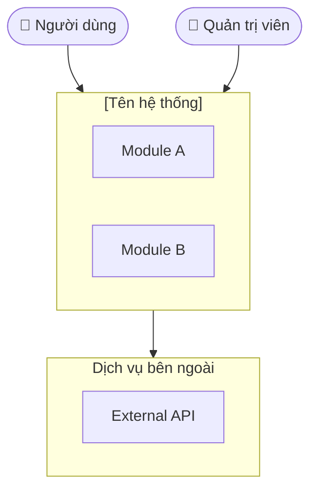

# Template SRS — Software Requirements Specification (IEEE 830)

## Mục đích

SRS là tài liệu đầu tiên cần viết trong dự án. Nó mô tả **cái hệ thống cần làm** (what), không phải **làm như thế nào** (how). Sau khi SRS được duyệt, các tài liệu BD01–BD17 mới có nền để viết.

Chuẩn IEEE 830 chia SRS thành: Giới thiệu → Mô tả tổng quan → Yêu cầu chi tiết (giao diện ngoài + chức năng + phi chức năng) → Phụ lục.

---

## Quy trình làm rõ yêu cầu trước khi viết

**KHÔNG được viết SRS cho đến khi đã làm rõ đủ thông tin.** Hỏi từng câu một, chờ user trả lời trước khi hỏi tiếp.

Thứ tự hỏi:

1. **Tên & mục tiêu dự án:** "Dự án tên gì và giải quyết bài toán gì?"
2. **Đối tượng người dùng:** "Ai sẽ dùng hệ thống này? (end-user, admin, đối tác...)"
3. **Phạm vi:** "Hệ thống bao gồm những tính năng/module chính nào?"
4. **Ràng buộc kỹ thuật:** "Có yêu cầu về nền tảng, ngôn ngữ, tích hợp hệ thống ngoài không?"
5. **Yêu cầu phi chức năng nổi bật:** "Có yêu cầu đặc biệt về hiệu năng, bảo mật, hoặc khả năng sử dụng không?"

Nếu user đã cung cấp tài liệu (PDF, Word, mô tả dài), đọc và tổng hợp trước khi hỏi các điểm còn thiếu.

---

## Template

# [SRS] Software Requirements Specification — [Tên dự án]

**Phiên bản:** 1.0
**Ngày:** YYYY-MM-DD
**Trạng thái:** Draft

---

## Mục lục

1. [Giới thiệu](#1-giới-thiệu)
   - [1.1 Mục đích tài liệu](#11-mục-đích-tài-liệu)
   - [1.2 Phạm vi hệ thống](#12-phạm-vi-hệ-thống)
   - [1.3 Định nghĩa & từ viết tắt](#13-định-nghĩa--từ-viết-tắt)
   - [1.4 Tài liệu tham chiếu](#14-tài-liệu-tham-chiếu)
   - [1.5 Tổng quan tài liệu](#15-tổng-quan-tài-liệu)
2. [Mô tả tổng quan hệ thống](#2-mô-tả-tổng-quan-hệ-thống)
   - [2.1 Bối cảnh & vấn đề cần giải quyết](#21-bối-cảnh--vấn-đề-cần-giải-quyết)
   - [2.2 Kiến trúc tổng quan](#22-kiến-trúc-tổng-quan)
   - [2.3 Người dùng & vai trò](#23-người-dùng--vai-trò)
   - [2.4 Giả định & ràng buộc](#24-giả-định--ràng-buộc)
3. [Yêu cầu giao diện ngoài](#3-yêu-cầu-giao-diện-ngoài)
   - [3.1 Giao diện người dùng](#31-giao-diện-người-dùng)
   - [3.2 Giao diện phần cứng](#32-giao-diện-phần-cứng)
   - [3.3 Giao diện phần mềm (tích hợp)](#33-giao-diện-phần-mềm-tích-hợp)
   - [3.4 Giao diện truyền thông](#34-giao-diện-truyền-thông)
4. [Yêu cầu chức năng](#4-yêu-cầu-chức-năng)
5. [Yêu cầu phi chức năng](#5-yêu-cầu-phi-chức-năng)
   - [5.1 Hiệu năng](#51-hiệu-năng)
   - [5.2 Bảo mật](#52-bảo-mật)
   - [5.3 Khả dụng & độ tin cậy](#53-khả-dụng--độ-tin-cậy)
   - [5.4 Khả năng mở rộng](#54-khả-năng-mở-rộng)
   - [5.5 Khả năng bảo trì](#55-khả-năng-bảo-trì)
   - [5.6 Khả năng di chuyển](#56-khả-năng-di-chuyển)
6. [Phụ lục](#6-phụ-lục)
   - [6.1 Tài liệu liên quan](#61-tài-liệu-liên-quan)

---

## Lịch sử thay đổi

| Phiên bản | Ngày | Người thực hiện | Nội dung thay đổi |
|-----------|------|-----------------|-------------------|
| 1.0 | YYYY-MM-DD | [Tên] | Tạo mới |

---

## 1. Giới thiệu

### 1.1 Mục đích tài liệu

Tài liệu này mô tả đặc tả yêu cầu phần mềm (SRS) cho hệ thống **[Tên hệ thống]**. Tài liệu phục vụ:

- **Phê duyệt dự án:** Cung cấp căn cứ để các bên liên quan đánh giá và phê duyệt phạm vi.
- **Hướng dẫn phát triển:** Làm cơ sở cho team dev implement.
- **Tham khảo QA:** Để QA hiểu đúng yêu cầu và viết test case.

### 1.2 Phạm vi hệ thống

**[Tên hệ thống]** là [mô tả ngắn: web app / mobile app / ...] cung cấp các chức năng:

- [Chức năng chính 1]
- [Chức năng chính 2]

Hệ thống **không** bao gồm:

- [Out of scope 1]
- [Out of scope 2]

### 1.3 Định nghĩa & từ viết tắt

| Thuật ngữ | Giải thích |
|-----------|-----------|
| SRS | Software Requirements Specification |
| [Term] | [Định nghĩa] |

### 1.4 Tài liệu tham chiếu

[Liệt kê các tài liệu được dùng làm căn cứ: hợp đồng, tài liệu yêu cầu của khách hàng, spec hệ thống ngoài, tiêu chuẩn áp dụng, v.v.]

| # | Tài liệu | Phiên bản | Ngày | Nguồn |
|---|---------|-----------|------|-------|
| 1 | [Tên tài liệu] | [Version] | [Date] | [Link / đính kèm] |

### 1.5 Tổng quan tài liệu

- **Mục 2** — Bối cảnh, kiến trúc tổng thể, vai trò người dùng, giả định và ràng buộc.
- **Mục 3** — Yêu cầu giao diện ngoài: UI, hardware, tích hợp API, truyền thông.
- **Mục 4** — Yêu cầu chức năng chi tiết theo từng module.
- **Mục 5** — Yêu cầu phi chức năng: hiệu năng, bảo mật, độ tin cậy, bảo trì, di chuyển.
- **Mục 6** — Phụ lục.

---

## 2. Mô tả tổng quan hệ thống

### 2.1 Bối cảnh & vấn đề cần giải quyết

[Mô tả bức tranh hiện tại: người dùng đang gặp vấn đề gì, quy trình hiện tại có điểm đau (pain points) nào.]

Ví dụ cấu trúc:
- **Vấn đề 1:** [Mô tả pain point] → [Hậu quả]
- **Vấn đề 2:** [Mô tả pain point] → [Hậu quả]

**[Tên hệ thống]** giải quyết các vấn đề trên bằng cách [mô tả giải pháp tổng quát].

### 2.2 Kiến trúc tổng quan

[Mô tả các thành phần chính và cách chúng kết nối. Dùng Mermaid để minh họa.]

> **Ghi chú thiết kế:** [Các điểm đặc biệt về kiến trúc cần lưu ý]

### 2.3 Người dùng & vai trò

| Vai trò | Mô tả | Quyền hạn chính |
|---------|-------|----------------|
| Admin | Quản trị viên hệ thống | Toàn quyền |
| [Role] | [Mô tả] | [Quyền] |

**Ma trận quyền hạn:**

| Chức năng | Admin | [Role 2] | [Role 3] |
|-----------|-------|---------|---------|
| [Feature] | ✅ | ✅ | 👁️ |
| [Feature] | ✅ | ❌ | ❌ |

> ✅ Toàn quyền | 👁️ Chỉ xem | ❌ Không có quyền

### 2.4 Giả định & ràng buộc

**Giả định:**

- [Ví dụ: Người dùng đã có tài khoản hệ thống ngoài X trước khi tích hợp]
- [Ví dụ: Hạ tầng cloud đã sẵn sàng]

**Ràng buộc:**

- [Ví dụ: Phải triển khai trên AWS, không dùng GCP]
- [Ví dụ: Không ghi dữ liệu ngược lại vào hệ thống X]

---

## 3. Yêu cầu giao diện ngoài

### 3.1 Giao diện người dùng

[Mô tả kiểu UI và các yêu cầu về trải nghiệm người dùng.]

- **Loại giao diện:** [Web app / Mobile app / Desktop / CLI]
- **Ngôn ngữ hiển thị:** [Tiếng Việt / Tiếng Nhật / Đa ngôn ngữ]
- **Responsive:** [Có / Không — breakpoint tối thiểu nếu có]
- **Accessibility:** [WCAG 2.1 AA / không yêu cầu]
- **Trình duyệt/OS hỗ trợ:** [Ví dụ: Chrome 90+, Safari 15+, iOS 14+, Android 10+]

### 3.2 Giao diện phần cứng

[Bỏ section này nếu là web/mobile app thuần, không yêu cầu thiết bị đặc biệt.]

- [Ví dụ: Camera để scan QR code]
- [Ví dụ: Máy in hóa đơn nhiệt (thermal printer)]
- [Ví dụ: Barcode scanner USB]

### 3.3 Giao diện phần mềm (tích hợp)

[Liệt kê tất cả hệ thống ngoài mà hệ thống này cần kết nối.]

| Hệ thống | Mục đích | Loại tích hợp | Protocol | Ghi chú |
|---------|---------|--------------|---------|---------|
| [Tên] | [Đọc dữ liệu / Gửi notification / ...] | REST API | HTTPS | [Chiều gọi: inbound/outbound] |

### 3.4 Giao diện truyền thông

[Các kênh thông báo và truyền dữ liệu ra bên ngoài.]

- [Ví dụ: Email (SMTP / SES / SendGrid)]
- [Ví dụ: SMS (Twilio)]
- [Ví dụ: Push notification (FCM / APNs)]
- [Ví dụ: Webhook đến hệ thống ngoài]

---

## 4. Yêu cầu chức năng

> **Quy tắc viết:**
> - FR ID format: `F-[MODULE]-[NN]` (ví dụ: `F-AUTH-01`, `F-ORD-02`)
> - Mỗi yêu cầu: một hành vi cụ thể, có thể kiểm thử được
> - "Hệ thống phải..." cho bắt buộc (shall); "Hệ thống nên..." cho khuyến nghị (should)
> - Mỗi module có đoạn mô tả ngắn trước bảng yêu cầu

### 4.1 [Module 1 — Ví dụ: Quản lý tài khoản & phân quyền]

#### Mô tả

[Mô tả ngắn module làm gì, phục vụ ai, và liên kết với module nào khác.]

#### Yêu cầu chức năng

| Mã | Chức năng | Mô tả | Ưu tiên |
|----|-----------|-------|---------|
| F-AUTH-01 | Đăng ký / Đăng nhập | Người dùng đăng ký bằng email; đăng nhập bằng email/password | Cao |
| F-AUTH-02 | Phân quyền theo vai trò | Mỗi user có vai trò khác nhau, kiểm soát quyền truy cập | Cao |
| F-AUTH-03 | Đặt lại mật khẩu | Người dùng đặt lại mật khẩu qua email | Cao |
| F-AUTH-04 | Đăng nhập SSO | Hỗ trợ Google/SSO (tùy chọn) | Thấp |

### 4.2 [Module 2 — Ví dụ: Quản lý đơn hàng]

#### Mô tả

[Mô tả module.]

#### Yêu cầu chức năng

| Mã | Chức năng | Mô tả | Ưu tiên |
|----|-----------|-------|---------|
| F-ORD-01 | Tạo đơn hàng | Người dùng tạo đơn hàng mới với các sản phẩm đã chọn | Cao |
| F-ORD-02 | Tính tổng tiền | Hệ thống tự động tính tổng tiền khi thêm/xóa sản phẩm | Cao |

---

## 5. Yêu cầu phi chức năng

### 5.1 Hiệu năng

| Mã | Yêu cầu | Chỉ số | Điều kiện |
|----|---------|--------|----------|
| NFR-PERF-01 | Thời gian phản hồi trang | < 2 giây | Mạng bình thường |
| NFR-PERF-02 | Số người dùng đồng thời | ≥ [N] users | Peak hours |
| NFR-PERF-03 | Uptime | ≥ 99.5% | Mỗi tháng |

### 5.2 Bảo mật

| Mã | Yêu cầu |
|----|---------|
| NFR-SEC-01 | Mật khẩu phải được hash (bcrypt/argon2); không lưu plaintext |
| NFR-SEC-02 | Toàn bộ giao tiếp qua HTTPS |
| NFR-SEC-03 | Token xác thực có thời hạn; hỗ trợ revoke |

### 5.3 Khả dụng & độ tin cậy

| Mã | Yêu cầu |
|----|---------|
| NFR-REL-01 | RTO (Recovery Time Objective) ≤ 4 giờ |
| NFR-REL-02 | RPO (Recovery Point Objective) ≤ 1 giờ |
| NFR-REL-03 | Backup dữ liệu hàng ngày |

### 5.4 Khả năng mở rộng

| Mã | Yêu cầu |
|----|---------|
| NFR-SCALE-01 | Kiến trúc hỗ trợ horizontal scaling |
| NFR-SCALE-02 | Database hỗ trợ sharding hoặc read replica khi cần |

### 5.5 Khả năng bảo trì

| Mã | Yêu cầu |
|----|---------|
| NFR-MAINT-01 | Code coverage unit test ≥ [X]% |
| NFR-MAINT-02 | API phải có documentation (OpenAPI/Swagger) |
| NFR-MAINT-03 | Log đủ thông tin để debug production issue trong vòng [X] giờ |

### 5.6 Khả năng di chuyển

| Mã | Yêu cầu |
|----|---------|
| NFR-PORT-01 | [Ví dụ: Ứng dụng phải chạy được trên cả AWS và GCP mà không cần thay đổi code] |
| NFR-PORT-02 | [Ví dụ: Database phải có thể migrate sang engine khác với effort < 5 ngày] |

> Nếu không có yêu cầu di chuyển đặc biệt, bỏ section này.

---

## 6. Phụ lục

### 6.1 Tài liệu liên quan

| # | Tài liệu | Phiên bản | Ghi chú |
|---|---------|-----------|---------|
| 1 | [Tên tài liệu] | [Version] | [Mô tả] |

---

## Hướng dẫn sử dụng template

1. **Xóa section không cần** — Mục 3.2 (hardware) nếu web app thuần; Mục 5.6 (portability) nếu không có yêu cầu di chuyển
2. **1.4 References phải đầy đủ** — liệt kê hợp đồng, tài liệu yêu cầu khách hàng, spec hệ thống ngoài làm căn cứ
3. **3.3 Tích hợp** — ghi rõ chiều gọi (inbound/outbound) và ai chịu trách nhiệm cung cấp API
4. **FR ID phải unique** xuyên suốt tài liệu — BD03, BD04 sau này sẽ trace về FR ID này
5. **Mỗi module phải có đoạn "Mô tả"** trước bảng yêu cầu — giúp reviewer hiểu context
6. **Open issues**: nếu có điểm chưa rõ, ghi rõ `TBD` trong ô, không để trống
7. **Sau khi SRS approved** → dùng làm input cho BD01 (architecture), BD03 (function list), BD04 (screen design)
