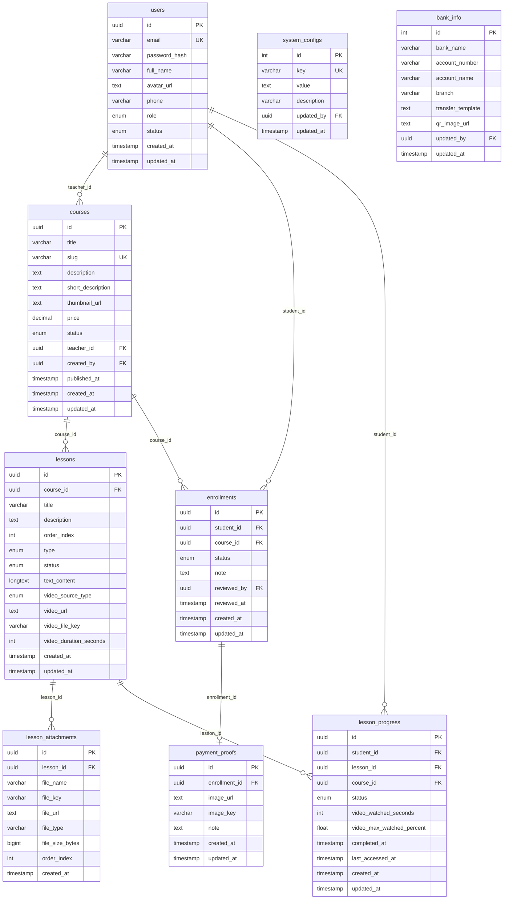

# LMS Platform — Entity Relationship Diagram (ERD)
**Version:** 1.0 — MVP  
**Ngày:** 13/04/2026  

---

## 1. Danh sách Entities

| Entity | Bảng DB | Mô tả |
|--------|---------|-------|
| User | `users` | Tất cả người dùng hệ thống |
| Course | `courses` | Khóa học |
| Lesson | `lessons` | Bài học trong khóa |
| LessonAttachment | `lesson_attachments` | File đính kèm của bài học |
| Enrollment | `enrollments` | Đăng ký khóa học của học viên |
| PaymentProof | `payment_proofs` | Biên lai chuyển khoản (đính kèm enrollment) |
| LessonProgress | `lesson_progress` | Tiến độ học từng bài của từng học viên |
| SystemConfig | `system_configs` | Cấu hình hệ thống (key-value) |
| BankInfo | `bank_info` | Thông tin tài khoản ngân hàng nhận CK |

---

## 2. Chi tiết từng Entity

### 2.1 `users`
| Cột | Kiểu | Constraint | Mô tả |
|-----|------|-----------|-------|
| `id` | UUID / BIGINT | PK, NOT NULL | Primary key |
| `email` | VARCHAR(255) | UNIQUE, NOT NULL | Email đăng nhập |
| `password_hash` | VARCHAR(255) | NOT NULL | Mật khẩu đã hash (bcrypt) |
| `full_name` | VARCHAR(255) | NOT NULL | Họ và tên |
| `avatar_url` | TEXT | NULL | URL ảnh đại diện |
| `phone` | VARCHAR(20) | NULL | Số điện thoại |
| `role` | ENUM | NOT NULL, DEFAULT 'STUDENT' | `STUDENT` \| `TEACHER` \| `ADMIN` |
| `status` | ENUM | NOT NULL, DEFAULT 'ACTIVE' | `ACTIVE` \| `BLOCKED` |
| `reset_token` | VARCHAR(255) | NULL | Token reset mật khẩu |
| `reset_token_expires_at` | TIMESTAMP | NULL | Hạn token reset |
| `created_at` | TIMESTAMP | NOT NULL, DEFAULT NOW() | Ngày tạo |
| `updated_at` | TIMESTAMP | NOT NULL, DEFAULT NOW() | Lần cập nhật cuối |

**Index:** `email` (UNIQUE)

---

### 2.2 `courses`
| Cột | Kiểu | Constraint | Mô tả |
|-----|------|-----------|-------|
| `id` | UUID / BIGINT | PK, NOT NULL | Primary key |
| `title` | VARCHAR(255) | NOT NULL | Tiêu đề khóa học |
| `slug` | VARCHAR(255) | UNIQUE, NOT NULL | URL-friendly name (VD: `lap-trinh-python-co-ban`) |
| `description` | TEXT | NULL | Mô tả chi tiết (HTML/Markdown) |
| `short_description` | VARCHAR(500) | NULL | Mô tả ngắn (hiển thị card) |
| `thumbnail_url` | TEXT | NULL | Ảnh thumbnail khóa học |
| `price` | DECIMAL(15,2) | NOT NULL, DEFAULT 0 | Giá khóa (VND). 0 = miễn phí |
| `status` | ENUM | NOT NULL, DEFAULT 'DRAFT' | `DRAFT` \| `PUBLISHED` \| `ARCHIVED` |
| `teacher_id` | FK → users.id | NOT NULL | Giảng viên phụ trách |
| `created_by` | FK → users.id | NOT NULL | Người tạo (Admin hoặc Teacher) |
| `created_at` | TIMESTAMP | NOT NULL, DEFAULT NOW() | |
| `updated_at` | TIMESTAMP | NOT NULL, DEFAULT NOW() | |
| `published_at` | TIMESTAMP | NULL | Thời điểm publish lần đầu |

**Index:** `slug` (UNIQUE), `status`, `teacher_id`

---

### 2.3 `lessons`
| Cột | Kiểu | Constraint | Mô tả |
|-----|------|-----------|-------|
| `id` | UUID / BIGINT | PK, NOT NULL | |
| `course_id` | FK → courses.id | NOT NULL | Thuộc khóa nào |
| `title` | VARCHAR(255) | NOT NULL | Tiêu đề bài học |
| `description` | TEXT | NULL | Mô tả ngắn bài học |
| `order_index` | INT | NOT NULL, DEFAULT 0 | Thứ tự hiển thị trong khóa |
| `type` | ENUM | NOT NULL | `VIDEO` \| `TEXT` |
| `status` | ENUM | NOT NULL, DEFAULT 'PUBLISHED' | `DRAFT` \| `PUBLISHED` |
| `text_content` | LONGTEXT | NULL | Nội dung rich text (nếu type=TEXT) |
| `video_source_type` | ENUM | NULL | `UPLOAD` \| `YOUTUBE` \| `VIMEO` \| `DRIVE` (nếu type=VIDEO) |
| `video_url` | TEXT | NULL | URL file video (nếu UPLOAD) hoặc embed URL (nếu link) |
| `video_file_key` | VARCHAR(500) | NULL | Storage key (S3 key) nếu UPLOAD |
| `video_duration_seconds` | INT | NULL | Thời lượng video (giây), dùng tính tiến độ |
| `created_at` | TIMESTAMP | NOT NULL, DEFAULT NOW() | |
| `updated_at` | TIMESTAMP | NOT NULL, DEFAULT NOW() | |

**Index:** `course_id`, `(course_id, order_index)`

---

### 2.4 `lesson_attachments`
| Cột | Kiểu | Constraint | Mô tả |
|-----|------|-----------|-------|
| `id` | UUID / BIGINT | PK | |
| `lesson_id` | FK → lessons.id | NOT NULL | Bài học đính kèm |
| `file_name` | VARCHAR(255) | NOT NULL | Tên file gốc (VD: `bai-tap.docx`) |
| `file_key` | VARCHAR(500) | NOT NULL | Key lưu trên S3 |
| `file_url` | TEXT | NOT NULL | URL truy cập file |
| `file_type` | VARCHAR(100) | NOT NULL | MIME type (VD: `application/pdf`) |
| `file_size_bytes` | BIGINT | NOT NULL | Kích thước file (bytes) |
| `order_index` | INT | NOT NULL, DEFAULT 0 | Thứ tự hiển thị |
| `created_at` | TIMESTAMP | NOT NULL, DEFAULT NOW() | |

**Index:** `lesson_id`

---

### 2.5 `enrollments`
| Cột | Kiểu | Constraint | Mô tả |
|-----|------|-----------|-------|
| `id` | UUID / BIGINT | PK | |
| `student_id` | FK → users.id | NOT NULL | Học viên đăng ký |
| `course_id` | FK → courses.id | NOT NULL | Khóa học đăng ký |
| `status` | ENUM | NOT NULL, DEFAULT 'PENDING' | `PENDING` \| `APPROVED` \| `REJECTED` |
| `note` | TEXT | NULL | Ghi chú từ Admin khi Approve/Reject |
| `reviewed_by` | FK → users.id | NULL | Admin đã duyệt |
| `reviewed_at` | TIMESTAMP | NULL | Thời điểm duyệt |
| `created_at` | TIMESTAMP | NOT NULL, DEFAULT NOW() | |
| `updated_at` | TIMESTAMP | NOT NULL, DEFAULT NOW() | |

**Unique Constraint:** `(student_id, course_id)` WHERE `status IN ('PENDING','APPROVED')`  
> Một học viên không có 2 enrollment đang active cho cùng 1 khóa

**Index:** `student_id`, `course_id`, `status`

---

### 2.6 `payment_proofs`
| Cột | Kiểu | Constraint | Mô tả |
|-----|------|-----------|-------|
| `id` | UUID / BIGINT | PK | |
| `enrollment_id` | FK → enrollments.id | NOT NULL, UNIQUE | 1 enrollment có 1 payment proof |
| `image_url` | TEXT | NULL | URL ảnh biên lai chuyển khoản |
| `image_key` | VARCHAR(500) | NULL | S3 key ảnh biên lai |
| `note` | TEXT | NULL | Ghi chú từ học viên (VD: "Đã CK lúc 10h") |
| `created_at` | TIMESTAMP | NOT NULL, DEFAULT NOW() | |
| `updated_at` | TIMESTAMP | NOT NULL, DEFAULT NOW() | |

**Index:** `enrollment_id`

---

### 2.7 `lesson_progress`
| Cột | Kiểu | Constraint | Mô tả |
|-----|------|-----------|-------|
| `id` | UUID / BIGINT | PK | |
| `student_id` | FK → users.id | NOT NULL | Học viên |
| `lesson_id` | FK → lessons.id | NOT NULL | Bài học |
| `course_id` | FK → courses.id | NOT NULL | Khóa học (denormalized để query nhanh) |
| `status` | ENUM | NOT NULL, DEFAULT 'NOT_STARTED' | `NOT_STARTED` \| `IN_PROGRESS` \| `COMPLETED` |
| `video_watched_seconds` | INT | NOT NULL, DEFAULT 0 | Số giây đã xem (video) |
| `video_max_watched_percent` | FLOAT | NOT NULL, DEFAULT 0 | % xem tối đa đã đạt được (0–100) |
| `completed_at` | TIMESTAMP | NULL | Thời điểm hoàn thành |
| `last_accessed_at` | TIMESTAMP | NULL | Lần xem cuối |
| `created_at` | TIMESTAMP | NOT NULL, DEFAULT NOW() | |
| `updated_at` | TIMESTAMP | NOT NULL, DEFAULT NOW() | |

**Unique Constraint:** `(student_id, lesson_id)`  
**Index:** `(student_id, course_id)`, `(lesson_id)`, `status`

---

### 2.8 `system_configs`
| Cột | Kiểu | Constraint | Mô tả |
|-----|------|-----------|-------|
| `id` | INT | PK, AUTO_INCREMENT | |
| `key` | VARCHAR(100) | UNIQUE, NOT NULL | Tên config |
| `value` | TEXT | NOT NULL | Giá trị (string/JSON) |
| `description` | VARCHAR(500) | NULL | Mô tả cho Admin |
| `updated_by` | FK → users.id | NULL | Admin đã sửa cuối |
| `updated_at` | TIMESTAMP | NOT NULL, DEFAULT NOW() | |

**Các key mặc định:**
| Key | Giá trị mặc định | Mô tả |
|-----|-----------------|-------|
| `COMPLETION_MODE` | `"OPEN"` | `"OPEN"` hoặc `"VIDEO_50"` |
| `MAX_VIDEO_SIZE_MB` | `"2048"` | Giới hạn upload video (MB) |
| `MAX_DOCUMENT_SIZE_MB` | `"50"` | Giới hạn upload tài liệu (MB) |
| `ALLOWED_VIDEO_TYPES` | `"mp4,mov,webm,avi"` | Định dạng video |
| `ALLOWED_DOC_TYPES` | `"pdf,docx,xlsx,pptx,txt"` | Định dạng tài liệu |

---

### 2.9 `bank_info`
| Cột | Kiểu | Constraint | Mô tả |
|-----|------|-----------|-------|
| `id` | INT | PK, DEFAULT 1 | Chỉ 1 bản ghi |
| `bank_name` | VARCHAR(255) | NOT NULL | Tên ngân hàng (VD: Vietcombank) |
| `account_number` | VARCHAR(50) | NOT NULL | Số tài khoản |
| `account_name` | VARCHAR(255) | NOT NULL | Tên chủ tài khoản |
| `branch` | VARCHAR(255) | NULL | Chi nhánh |
| `transfer_template` | TEXT | NULL | Mẫu nội dung CK (VD: "LMS [MaHV] [TenKhoa]") |
| `qr_image_url` | TEXT | NULL | Ảnh QR code chuyển khoản (optional) |
| `updated_by` | FK → users.id | NULL | |
| `updated_at` | TIMESTAMP | NOT NULL, DEFAULT NOW() | |

---

## 3. Sơ đồ quan hệ (Mô tả text)

```
users ||--o{ courses           : "teacher_id (1 Teacher dạy nhiều Course)"
users ||--o{ enrollments       : "student_id (1 Student có nhiều Enrollment)"
users ||--o{ lesson_progress   : "student_id (1 Student có nhiều Progress)"

courses ||--o{ lessons         : "course_id (1 Course có nhiều Lesson)"
courses ||--o{ enrollments     : "course_id (1 Course có nhiều Enrollment)"

lessons ||--o{ lesson_attachments : "lesson_id (1 Lesson có nhiều Attachment)"
lessons ||--o{ lesson_progress    : "lesson_id (1 Lesson có nhiều Progress record)"

enrollments ||--o| payment_proofs : "enrollment_id (1 Enrollment có 0 hoặc 1 PaymentProof)"
```

---

## 4. Diagram (Mermaid — dán vào dbdiagram.io hoặc Mermaid Live)



---

## 5. Ghi chú thiết kế DB

1. **UUID vs BIGINT**: Dùng UUID nếu muốn distributed/microservices; dùng BIGINT AUTO_INCREMENT nếu monolith đơn giản hơn. Chọn nhất quán.
2. **Soft delete**: Cân nhắc thêm `deleted_at TIMESTAMP NULL` (soft delete) cho `courses`, `lessons`, `users` thay vì hard delete.
3. **Denormalize `course_id` trong `lesson_progress`**: Để query "tất cả progress của student trong 1 khóa" nhanh hơn, tránh JOIN qua lessons.
4. **Unique partial index cho Enrollment**: Cần DBMS hỗ trợ partial/conditional unique index (PostgreSQL, MySQL 8+) hoặc xử lý ở application layer.
5. **Video duration**: Cần lưu `video_duration_seconds` để backend tính % xem mà không phụ thuộc client gửi.
6. **Mở rộng Quiz sau này**: Thêm bảng `quizzes (lesson_id FK)`, `questions (quiz_id FK)`, `quiz_submissions (student_id, quiz_id FK)` mà không cần thay đổi schema hiện tại.
